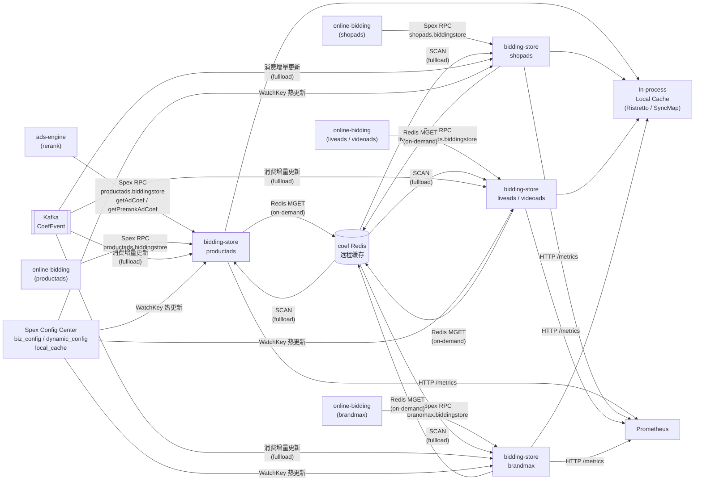

<!-- ads-workspace-gdoc-sync: gdoc_id=1PLzGzQXYJonwOxvioMq9XRd-5_2Bp1MBU5WKcsVIhu0 gdoc_url=https://docs.google.com/document/d/1PLzGzQXYJonwOxvioMq9XRd-5_2Bp1MBU5WKcsVIhu0/edit -->

# bidding-store

> 广告竞价系数在线存储与查询服务 — 为各广告垂类的 online-bidding 提供多级缓存的系数拉取能力。
>
> Git 仓库：<https://git.garena.com/shopee/deep/paidads-bidding/bidding-store>

---

## 目录 / Table of Contents

1. [项目概述 / Introduction](#项目概述--introduction)
2. [核心功能 / Features](#核心功能--features)
3. [项目架构 / Architecture](#项目架构--architecture)
   - [系统上下文 / System Context](#系统上下文--system-context)
   - [上下游调用拓扑 / Service Topology](#上下游调用拓扑--service-topology)
   - [多垂类模块架构 / Multi-Vertical Module Architecture](#多垂类模块架构--multi-vertical-module-architecture)
   - [数据流 / Data Flow](#数据流--data-flow)
4. [目录结构 / Directory Structure](#目录结构--directory-structure)
5. [广告垂类 / Ad Verticals](#广告垂类--ad-verticals)
   - [Product Ads（productads）](#product-adsproductads)
   - [Live Ads（liveads）](#live-adsliveads)
   - [Shop Ads（shopads）](#shop-adsshopads)
   - [Video Ads（videoads）](#video-adsvideoads)
   - [Brand Max（brandmax）](#brand-maxbrandmax)
6. [Spex API 定义 / Spex API](#spex-api-定义--spex-api)
   - [RPC 方法 / RPC Methods](#rpc-方法--rpc-methods)
   - [错误码 / Error Codes](#错误码--error-codes)
   - [请求与响应 / Request and Response](#请求与响应--request-and-response)
   - [多维系数 / Multi-Dim Coefficients](#多维系数--multi-dim-coefficients)
7. [核心流程 — 系数查询 / Core Pipeline — Coef Query](#核心流程--系数查询--core-pipeline--coef-query)
   - [请求入口 / Request Entry](#请求入口--request-entry)
   - [分批并发处理 / Parallel Batching](#分批并发处理--parallel-batching)
   - [生成 CoefKey / CoefKey Construction](#生成-coefkey--coefkey-construction)
   - [本地缓存命中策略 / Local Cache Hit Strategy](#本地缓存命中策略--local-cache-hit-strategy)
   - [回源 Redis 与 Timeout 控制 / Redis Fetch and Timeout](#回源-redis-与-timeout-控制--redis-fetch-and-timeout)
   - [系数装配与 soft_remove / Response Assembly and soft_remove](#系数装配与-soft_remove--response-assembly-and-soft_remove)
   - [多维系数输出 / Multi-Dim Coef Output](#多维系数输出--multi-dim-coef-output)
8. [存储层 / Storage Layer](#存储层--storage-layer)
   - [Accessor 生命周期 / Accessor Lifecycle](#accessor-生命周期--accessor-lifecycle)
   - [本地缓存实现 / Local Cache Implementations（Ristretto vs SyncMap）](#本地缓存实现--local-cache-implementationsristretto-vs-syncmap)
   - [CoefKey 编码 / CoefKey Encoding](#coefkey-编码--coefkey-encoding)
   - [TTL 策略 / TTL Strategy（soft/hard + 垂类差异）](#ttl-策略--ttl-strategysoft-hard--垂类差异)
   - [Fullload 模式 / Fullload Mode（Scan + Kafka）](#fullload-模式--fullload-modescan--kafka)
   - [Background Update / Background Update（非 Fullload 模式）](#background-update--background-update非-fullload-模式)
   - [国家码索引 / Country Index Mapping](#国家码索引--country-index-mapping)
9. [配置体系 / Configuration](#配置体系--configuration)
   - [本地配置 / Local Config（etc/*.yml）](#本地配置--local-configetcyml)
   - [SPEX 远程配置 / SPEX Remote Config](#spex-远程配置--spex-remote-config)
   - [biz_config / prerank_biz_config](#biz_config--prerank_biz_config)
   - [dynamic_config](#dynamic_config)
   - [local_cache / fullload](#local_cache--fullload)
   - [gas.cache (redis_cache) 配置 / GAS Cache Config](#gascache-redis_cache-配置--gas-cache-config)
   - [SPEX 与 spcli 配置 / SPEX and spcli Setup](#spex-与-spcli-配置--spex-and-spcli-setup)
10. [构建与部署 / Build and Deployment](#构建与部署--build-and-deployment)
    - [Makefile 目标 / Makefile Targets](#makefile-目标--makefile-targets)
    - [部署脚本 / Deploy JSON（deploy/*.json）](#部署脚本--deploy-jsondeployjson)
    - [本地调试 / Local Testing](#本地调试--local-testing)
11. [开发规范 / Development Guidelines](#开发规范--development-guidelines)
    - [新增垂类 / How to Add a New Vertical](#新增垂类--how-to-add-a-new-vertical)
    - [新增 CoefType / IDType / How to Add New CoefType / IDType](#新增-coeftype--idtype--how-to-add-new-coeftype--idtype)
    - [本地缓存实现 / How to Add a Local Cache Implementation](#本地缓存实现--how-to-add-a-local-cache-implementation)
    - [代码风格 / Code Style](#代码风格--code-style)
    - [项目结构 / Project Structure](#项目结构--project-structure)
    - [命名规范 / Naming Conventions](#命名规范--naming-conventions)
    - [错误处理 / Error Handling](#错误处理--error-handling)
    - [单元测试 / Unit Testing Standards](#单元测试--unit-testing-standards)
    - [Code Review & Git Workflow](#code-review--git-workflow)
12. [监控 / Monitoring](#监控--monitoring)
    - [Prometheus 指标 / Prometheus Metrics](#prometheus-指标--prometheus-metrics)
    - [关键监控点 / Key Monitoring Points](#关键监控点--key-monitoring-points)
    - [HTTP 端点 / HTTP Endpoints](#http-端点--http-endpoints)
13. [业务术语表 / Business Terminology Glossary](#业务术语表--business-terminology-glossary)
14. [参考资料 / Additional Resources](#参考资料--additional-resources)
15. [常见问题 / Frequently Asked Questions](#常见问题--frequently-asked-questions)

---

## 项目概述 / Introduction

**bidding-store** 是广告竞价系数在线存储与查询服务，作为 ads-engine 和 online-bidding 的依赖，为 productads、liveads、shopads、videoads、brandmax 五个广告垂类提供系数拉取能力。

服务基于 **GAS 框架**（Go Application Server，Go 1.24）和 **Spex** 构建，采用**多垂类多二进制布局**：每个垂类在 `mod/<vertical>/module.go` 中注册独立的 GAS Module，共享 `internal/` 下的 config / storage / handler / monitoring / types 代码。

### Spex 服务名

| 垂类 | Spex 服务名 |
|------|-----------|
| Product Ads | `productads.biddingstore` |
| Live Ads | `liveads.biddingstore` |
| Shop Ads | `shopads.biddingstore` |
| Video Ads | `videoads.biddingstore` |
| Brand Max | `brandmax.biddingstore` |

### 对外暴露的 API

- **getAdCoef**（全部五个垂类）：查询 rerank 阶段系数
- **getPrerankAdCoef**（productads / liveads / shopads / videoads；brandmax 不含 prerank）：查询 prerank 阶段系数

返回值为 `AdCoefInfo` 数组，可选附带多维系数（`multi_dim_coef`）。

### 核心能力

- 按 `biz_config` 将 `(placement × pricing_type)` 映射到一组 `(coef_type × id_type)` 键
- **多级缓存**：本地内存（Ristretto 或 ShardedSyncMap）+ Redis
- 支持 entrance 级系数 + traffic bucket 级 AB 分桶
- 响应中携带 `soft_remove` 标志（基于 BudgetBucketFlag 系数）
- 系数数据结构基于 flatbuffers（`coef_cache.AdCoefVals`），节省解包成本
- **两种运行模式**：
  - **On-demand 模式**：Local Cache miss 时回源 Redis MGET，超过 softTTL 的过期项在后台刷新
  - **Fullload 模式**：启动时全量 SCAN Redis，持续消费 Kafka CoefEvent 更新本地缓存，在线请求完全不访问 Redis

Go module 路径：`git.garena.com/shopee/deep/paidads-bidding/bidding-store`，使用 Go 1.24。

---

## 核心功能 / Features

- **系数查询**：通过 Spex RPC（`getAdCoef` / `getPrerankAdCoef`），为每个广告按 biz_config 查询对应的竞价系数（CoefType × IDType 组合），返回带 entrance coef 的 AdCoefInfo 列表
- **多级缓存**：本地内存缓存（Ristretto 分片或 ShardedSyncMap）+ Redis 远程缓存，降低 P99 延迟
- **AB 分桶支持**：通过 traffic_bucket_id 及 plan_bucket 支持 AB 实验，不同 bucket 的系数独立存储和查询
- **Fullload 模式**：启动时全量加载 Redis，通过 Kafka 消费增量更新，消除在线 Redis 依赖，适合高 QPS 场景
- **soft_remove 标志**：通过 BudgetBucketFlag 系数判定是否软删除该广告（budget 已耗尽）
- **多维系数（multi_dim_coef）**：跨广告共享同一 id_type 的系数，减少响应体大小
- **热配置更新**：biz_config / dynamic_config / local_cache 均支持 Spex Config Center 的 WatchKey 热更新，无需重启
- **多垂类隔离部署**：五个垂类各自独立二进制、独立 Spex 服务名、独立配置 key，互不干扰

---

## 项目架构 / Architecture

### 系统上下文 / System Context

bidding-store 在新广告竞价体系（New Ads Bidding）中作为**在线存储层**，上游调用方通过 Spex RPC 查询广告竞价系数，服务本身依赖 Redis 远程缓存和 Kafka 事件流，以及 Spex Config Center 进行配置管理。

新竞价体系整体分为：
- **UltraV Core**（离线反馈控制）：离线计算出竞价系数（AdCoefMsg），写入 Redis + 发布 CoefEvent 到 Kafka
- **bidding-store**（在线存储）：从 Redis / Kafka 拉取系数，缓存到内存，对外提供低延迟查询
- **online-bidding**（在线计算）：调用 bidding-store 获取系数后，执行在线竞价逻辑（eCPM 计算、排序）

### 上下游调用拓扑 / Service Topology



**拓扑说明**

| 方向 | 服务 | 协议 | 描述 |
|------|------|------|------|
| 上游 | ads-engine | Spex RPC | 在 rerank 前通过 `productads.biddingstore` 预取各广告的 AdCoefInfo，随请求透传给 online-bidding |
| 上游 | online-bidding (shopads) | Spex RPC | Shop Ads 在线竞价模块直接查询 `shopads.biddingstore` 系数 |
| 上游 | online-bidding (brandmax / videoads / liveads) | Spex RPC | 对应垂类的 online-bidding 通过各自 Spex 服务名查询系数 |
| 下游 | Prometheus | HTTP /metrics | 导出 `ads_bidding_bidding_store_*` 系列指标 |
| 依赖 | coef Redis（远程缓存） | go-redis MGET | on-demand 模式下回源；存放 `coef_{idType}_{country}_{id}_{bucketId}_{coefType}` 键 |
| 依赖 | coef Redis scanner | redis_scanner SCAN | fullload 模式下并发 SCAN `coef*_{country}_*` 或 `coef*` 模式后批量 MGET |
| 依赖 | Kafka（CoefEvent） | paidads-bidding/common/types/coef_event | fullload 模式下订阅增量系数变更；GroupID 带 `POD_IP+timestamp` 后缀独占 offset |
| 依赖 | Spex Config Center | Spex WatchKey | 订阅 biz_config / prerank_biz_config / dynamic_config / local_cache，支持热更新 |
| 依赖 | in-process local cache | 内存 | Ristretto（默认）或 ShardedSyncMap，存放 `CoefVal`（flatbuffers AdCoefVals 指针） |
| 依赖 | CMDB service tree | env.SMBCMDBServiceName | 识别 shopads / brandmax 以切换 biz config 启用项 |

### 多垂类模块架构 / Multi-Vertical Module Architecture

每个垂类（productads / liveads / shopads / videoads / brandmax）在 `mod/<vertical>/module.go` 中通过 `gas.New(...)` 组合：

```
gas.New(
    config.GASOption(),          // 绑定 biz_config / local_cache / dynamic_config
    storage.GASOption(),         // 注册 Accessor + redis_cache
    <vertical>.BiddingstoreGASOption(),  // 注册 Spex 服务 handler
    gas.EventHandler(gas.OnEngineSmokeTest, smokeTester),
    gas.EventHandler(gas.OnEngineHealthCheck, healthChecker),
    // productads 额外注册 vtPbCodec
)
```

共享代码路径：

```
internal/
├── config/    — biz_config 解析、dynamic_config、local_cache 配置、CMDB 识别
├── handler/   — AdCoefHandler 系数查询主逻辑；各垂类子目录提供 request/response 适配
├── monitoring/— Prometheus 指标注册与导出
├── storage/   — Accessor（本地缓存 + Redis + fullload + Kafka consumer）
└── types/     — AdInfoInterface / GetAdCoefRequest / GetAdCoefResponse 接口定义
```

### 数据流 / Data Flow

**On-demand 模式**

```
Spex RPC 请求
    └─► AdCoefHandler.HandleGetAdCoefRequest
            └─► 按 OnlineAdsPerBatch 分批 goroutine
                    └─► GetConfigToKeyHelpers → CoefKey 构造
                            └─► storage.Accessor.GetCoefs
                                    └─► getFromLocalCache
                                            ├─► [命中且新鲜] 直接返回 CoefVal
                                            ├─► [命中但超 softTTL] 返回 CoefVal + 推送后台刷新
                                            └─► [未命中或超 hardTTL] → Redis MGET (redisCtx with timeout)
                                                        └─► batchUpdateCoefVals → Set local cache
```

**Fullload 模式**

```
启动时：fullLoadProcessor.Start
    └─► 随机延迟 0-5s 平滑
    └─► fullLoad(reasonWarmup) → redisScanner.ScanByPattern → addToLocalCache (MGET + Set)
    └─► isReady = true
    └─► 启动 Kafka consumer (GroupID + POD_IP + timestamp 独占 offset)
    └─► 定时 ticker (FullloadInterval) → fullLoad(interval) + fullEvict
    └─► manualTrigger channel → fullLoad(manual) + fullEvict

在线请求时：getCoefsFromLocal → getFromLocalCache（不访问 Redis）
```

---

## 目录结构 / Directory Structure

```
bidding-store/
├── cmd/
│   └── inject_mock_data_to_redis/   # 本地调试用 Mock 数据注入工具
├── deploy/                          # 各垂类部署配置（JSON）
│   ├── productads.json
│   ├── liveads.json
│   ├── shopads.json
│   ├── videoads.json
│   └── brandmax.json
├── etc/                             # 各垂类本地配置文件（YAML）
│   ├── productads.yml
│   ├── liveads.yml
│   ├── shopads.yml
│   ├── videoads.yml
│   └── brandmax.yml
├── internal/
│   ├── config/                      # biz_config 解析、dynamic_config、local_cache 配置
│   │   ├── accessor.go              # GAS Initable，初始化所有配置，CMDB 识别
│   │   ├── biz_config.go            # AllBizConfig 解析、idType→idStr 函数注册、CoefKey helpers
│   │   ├── dynamic_config.go        # DynamicConfig Proto 绑定
│   │   ├── local_cache_config.go    # LocalCacheConfig / FullloadConfig Proto 绑定
│   │   └── utils.go                 # DetectAndSetMemoryLimit
│   ├── handler/                     # Spex 服务 handler 及系数查询主逻辑
│   │   ├── handler.go               # AdCoefHandler：HandleGetAdCoefRequest / buildMultiDimCoefs
│   │   ├── interceptor.go           # RecoveryInterceptor（panic recovery）
│   │   ├── brandmax/                # brandmax handler 及 request/response 适配
│   │   ├── liveads/                 # liveads handler（含 ValidatorInterceptor）
│   │   ├── productads/              # productads handler（vtPbCodec + HealthChecker）
│   │   ├── shopads/                 # shopads handler
│   │   └── videoads/                # videoads handler（含 ValidatorInterceptor）
│   ├── monitoring/                  # Prometheus 指标定义与导出
│   │   ├── api.go                   # api_qps / api_latency / api_count / api_error
│   │   ├── bucket.go                # abtBucketCounter
│   │   ├── coef.go                  # coefCounter / coefUpdateTimeGap
│   │   ├── coef_lifecycle.go        # coefIngestedTotal / coefIngestionAge
│   │   ├── common.go                # commonCounter / commonLatency / commonGauge / commonPanic
│   │   └── register.go              # prometheus.MustRegister 汇总
│   ├── storage/                     # 多级缓存核心
│   │   ├── accessor.go              # GAS Initable/Runnable/Destroyable，选择缓存实现，启动 fullload
│   │   ├── full_load.go             # fullLoadProcessor：SCAN Redis + 定时重载 + Evict
│   │   ├── kafka_consumer.go        # coefConsumer：MessageProcessor 消费 CoefEvent
│   │   ├── local_cache_key.go       # CoefKey 结构、CreateLocalCacheKey、NewCoefKeyFromString、国家码索引
│   │   ├── local_cache_ristrestto.go# Ristretto 分片实现
│   │   ├── local_cache_sync_map.go  # ShardedSyncMap 实现（支持 Evict）
│   │   ├── local_cache_value.go     # CoefVal：Set / GetValByEntrance / TTL 判断
│   │   └── query_caches_and_update.go # GetCoefs / getCoefsFromLocal / getCoefsFromLocalAndRemote / getRedisContext
│   └── types/                       # AdInfoInterface / GetAdCoefRequest / GetAdCoefResponse 接口
├── mod/                             # 各垂类 GAS Module 入口
│   ├── productads/module.go
│   ├── liveads/module.go
│   ├── shopads/module.go
│   ├── videoads/module.go
│   └── brandmax/module.go
├── proto/                           # Spex proto 定义（各垂类）
│   └── spex/sp_proto/<vertical>/biddingstore.proto
├── scripts/                         # CI / 辅助脚本
├── Makefile                         # 构建、测试、代码生成目标
├── go.mod                           # Go module：git.garena.com/shopee/deep/paidads-bidding/bidding-store
└── .spkit.yml                       # spkit 构建配置
```

---

## 广告垂类 / Ad Verticals

| 垂类 | Module 路径 | Binary | Spex 服务名 | 配置文件 | Proto | 支持的 RPC | 特殊说明 |
|------|------------|--------|------------|---------|-------|-----------|---------|
| Product Ads | `mod/productads` | `bin/productads` | `productads.biddingstore` | `etc/productads.yml` | `proto/spex/sp_proto/productads/biddingstore.proto` | getAdCoef + getPrerankAdCoef | 注册 vtPbCodec（零拷贝反序列化）；RecoveryInterceptor；错误码 1662700000–1662700003 |
| Live Ads | `mod/liveads` | `bin/liveads` | `liveads.biddingstore` | `etc/liveads.yml` | `proto/spex/sp_proto/liveads/biddingstore.proto` | getAdCoef + getPrerankAdCoef | ValidatorInterceptor；softTTL=30s / hardTTL=60s |
| Shop Ads | `mod/shopads` | `bin/shopads` | `shopads.biddingstore` | `etc/shopads.yml` | `proto/spex/sp_proto/shopads/biddingstore.proto` | getAdCoef + getPrerankAdCoef | 仅 DefaultBizConfigKey；CMDB 识别 shopAdsCMDBServiceName |
| Video Ads | `mod/videoads` | `bin/videoads` | `videoads.biddingstore` | `etc/videoads.yml` | `proto/spex/sp_proto/videoads/biddingstore.proto` | getAdCoef + getPrerankAdCoef | ValidatorInterceptor |
| Brand Max | `mod/brandmax` | `bin/brandmax` | `brandmax.biddingstore` | `etc/brandmax.yml` | `proto/spex/sp_proto/brandmax/biddingstore.proto` | getAdCoef 仅 | 仅 DefaultBizConfigKey；softTTL=5s / hardTTL=10s；CMDB 识别 brandMaxCMDBServiceName |

### Product Ads（productads）

productads 是功能最完整的垂类，支持 getAdCoef 和 getPrerankAdCoef 两个 RPC，错误码覆盖：`ERROR_OK=0, ERROR_INVALID=1662700000, ERROR_INVALID_COUNTRY=1662700001, ERROR_INVALID_REQUEST_ID=1662700002, ERROR_INVALID_EMPTY_ADS=1662700003`。

额外注册 vtPbCodec（`spcli-gen-vtprotobuf/vtpbcodec`）用于零拷贝 protobuf 反序列化，降低 CPU 开销。

### Live Ads（liveads）

liveads 的 `interceptor` 子包提供额外请求校验（ValidatorInterceptor）；TTL 设置最短（softTTL=30s / hardTTL=60s），反映直播场景对系数实时性的高要求。

### Shop Ads（shopads）

通过 `env.SMBCMDBServiceName == shopAdsCMDBServiceName` 识别，仅启用 `DefaultBizConfigKey`（不订阅 PrerankBizConfigKey）。

### Video Ads（videoads）

配置与 liveads 类似，包含 ValidatorInterceptor；使用默认 TTL（softTTL=300s / hardTTL=500s）。

### Brand Max（brandmax）

- 通过 `env.SMBCMDBServiceName == brandMaxCMDBServiceName` 识别
- 仅提供 `getAdCoef`，不支持 getPrerankAdCoef
- TTL 最短（softTTL=5s / hardTTL=10s）
- 仅启用 DefaultBizConfigKey
- 错误码：仅 `ERROR_INVALID`

---

## Spex API 定义 / Spex API

### RPC 方法 / RPC Methods

```protobuf
service biddingstore {
    rpc getAdCoef(AdCoefRequest) returns (AdCoefResponse);        // 所有垂类
    rpc getPrerankAdCoef(AdCoefRequest) returns (AdCoefResponse); // 除 brandmax 外
}
```

### 错误码 / Error Codes

| 错误码 | 值 | 适用垂类 |
|-------|-----|---------|
| ERROR_OK | 0 | 全部 |
| ERROR_INVALID | 1662700000 | 全部（brandmax 仅此一个） |
| ERROR_INVALID_COUNTRY | 1662700001 | productads 等 |
| ERROR_INVALID_REQUEST_ID | 1662700002 | productads 等 |
| ERROR_INVALID_EMPTY_ADS | 1662700003 | productads 等 |

### 请求与响应 / Request and Response

**AdsInfo 字段**（每个广告信息）

| 字段 | 类型 | 说明 |
|------|------|------|
| ads_id | int64 | 广告 ID |
| item_id | int64 | 商品 ID |
| shop_id | int64 | 店铺 ID |
| cat_ids | repeated int32 | 品类 ID 列表 |
| pricing_type | int32 | 定价类型（对应 AdsPricingType） |
| placement | int32 | 广告位（对应 TrackingPlacement） |
| ad_tag | int64 | 广告标签 |
| campaign_period | bool | 是否在 campaign 期间 |
| plan_bucket | int32 | 计划桶（用于 AB 分桶映射） |
| campaign_id | int64 | campaign ID |

**AdCoefRequest 字段**

| 字段 | 类型 | 说明 |
|------|------|------|
| country | string | 国家码（MY/SG/TH/ID/VN/PH/TW/BR/MX/CO/CL/AR） |
| request_id | string | 请求 ID |
| abt_param | string | ABT 参数 |
| entrance_group | uint32 | entrance 分组（用于查询 entrance 维度系数） |
| ads_info | repeated AdsInfo | 广告信息列表 |
| traffic_bucket_list | repeated uint32 | 流量桶列表 |
| entrance_group_str | string | entrance 分组字符串表示 |
| entrance_group_idx | uint32 | entrance 分组索引 |
| resp_byte_coef | bool | 是否以字节形式返回系数（并行 marshal） |

**AdCoefInfo 字段**（每个系数项）

| 字段 | 类型 | 说明 |
|------|------|------|
| coef | double | 默认 entrance 的系数值 |
| last_update_time | uint32 | 系数最后更新时间（Unix 秒） |
| coef_type | int32 | 系数类型（CoefType 枚举） |
| id_type | int32 | ID 类型（CoefCacheKeyIdType 枚举） |
| extra | bytes | 额外数据（tracking 用途） |
| entrance_coef | double | 请求 entrance 下的系数值 |
| entrance_extra | bytes | 请求 entrance 下的额外数据 |
| traffic_bucket_id | uint32 | 实际命中的 traffic bucket ID |
| strategy_id | uint32 | 离线策略 ID |
| trigger_type | uint32 | 触发类型 |

**AdCoefResponse 字段**

| 字段 | 类型 | 说明 |
|------|------|------|
| mval_ad_coef | repeated MValAdCoef | 每个广告的系数列表，长度等于 ads_info 长度 |
| mval_ad_coef_bytes | bytes | 可选，并行 marshal 的字节形式系数 |
| multi_dim_coef | map\<int32, bytes\> | 多维系数，key=id_type，value=序列化的 CoefList |

**MValAdCoef 字段**

| 字段 | 类型 | 说明 |
|------|------|------|
| ad_coef_infos | repeated AdCoefInfo | 该广告的系数项列表 |
| soft_remove | bool | 是否软删除（budget 耗尽时为 true） |

### 多维系数 / Multi-Dim Coefficients

`multi_dim_coef` 用于跨广告去重：同一 id_type（例如 country / placement）的系数只编码一次，各广告共享，节省响应体大小。通过 `biz_config.MultiDimCoefIdType` 中声明的 `IDType → CoefKeyType` 映射来配置哪些 id_type 走多维路径。

---

## 核心流程 — 系数查询 / Core Pipeline — Coef Query

### 请求入口 / Request Entry

`AdCoefHandler.HandleGetAdCoefRequest`（`internal/handler/handler.go:52`）：

1. 记录 API QPS 和延迟指标（ExportApiQps / ExportApiLatency）
2. 读取 `dynamicCfg.OnlineAdsPerBatch`（默认 50）决定批大小
3. 如果 `req.GetIsMigrateToEngine()` 为 true，提前 Reserve 结果数组
4. 按批大小分割 ads 列表，每批启动一个 goroutine 并行处理，带 panic recovery（ExportPanic）
5. `wg.Wait()` 等待所有批次完成
6. 调用 `buildMultiDimCoefs` 处理多维系数
7. 如果 `req.GetIsRespByteCoef()` 且 `ParallelMarshalWorkers > 0`，并行 marshal 系数为字节

### 分批并发处理 / Parallel Batching

- `handleGetAdCoefByBatch`：标准路径，每条 AdCoefInfo 通过 `resp.AppendCoefForAd` 追加
- `handleGetAdCoefByBatchWithCommonCoef`：迁移路径（`req.GetIsMigrateToEngine()=true`），将每批 ad 的系数打包为 `coef_info.CoefList`，通过 `resp.SetAdsCoefList` 设置

### 生成 CoefKey / CoefKey Construction

1. `GetConfigToKeyHelpers(bizConfigKey, country)` 根据国家码加载对应的 bizConfigByCountry
2. 对每个 ad，调用 `bizConfigByCountry.GetKeyHelpers(adInfo)` 获取 `(placement × pricing_type)` 对应的 coefTypeIDTypeIDStrFunc 列表
3. 对每个 helper：
   - `helper.GetIDStr(adInfo, req)` 按 idType 生成 idStr（如 ad ID、shop ID、placement+entrance 组合等）
   - `helper.GetTrafficBucketID(adInfo, req, bizConfigKey)` 计算 bucketID（prerank 分支：直接匹配 traffic_bucket_list；rerank 分支：通过 planBucket→trafficBucket 映射）
   - `storage.NewCoefKey(coefType, idType, idStr, bucketID, countryIdx)` 构建 CoefKey

### 本地缓存命中策略 / Local Cache Hit Strategy

`getFromLocalCache`（`internal/storage/query_caches_and_update.go:165`）：

- 调用 `localCache.Get(k.CreateLocalCacheKey(buf))` 查询
- **Fullload 模式**：命中即返回，不检查 TTL
- **On-demand 模式**：
  - `val.val == nil`：扩大 TTL（softTTL×4 / hardTTL×16）避免空洞 key 风暴
  - 超过 hardTTL：返回 `(val, false)`，触发在线 Redis 回源
  - 超过 softTTL 未超 hardTTL：返回 val 并推送到 `coefValsBackgroundUpdate` channel 后台刷新
  - 新鲜：直接返回

### 回源 Redis 与 Timeout 控制 / Redis Fetch and Timeout

`getRedisContext`（`internal/storage/query_caches_and_update.go:133`）：

- 从 `ctx.Deadline()` 减去 `RequestTimeoutBufferInMs`（默认 15ms）得到 redisCtx 超时
- 无 Deadline：保持原 ctx（记录 `no_deadline` 指标）
- 剩余时间不足：直接跳过 Redis 调用（记录 `no_timeout_left` 指标）

`batchUpdateCoefVals`（`internal/storage/query_caches_and_update.go:199`）：

- 批量 `redis.MGet(keys...)` 获取系数数据
- 对每条结果调用 `CoefVal.Set(data, now)`（flatbuffers 解析）后写入本地缓存

### 系数装配与 soft_remove / Response Assembly and soft_remove

`val.GetValByEntrance(entranceGroup)`（`internal/storage/local_cache_value.go:60`）：

- 遍历 flatbuffers `AdCoefVals.Coefs`，匹配 `defaultEntrance=0`（foundDefault）和 `regroupedEntrance`（foundEntrance）
- 读取 `coef / extra / strategyId / triggerType / remoteUpdateTime`
- 同时读取各 `Val` 条目的 `SoftRemove()` 标志：entrance=0 对应 `defaultSoftRemove`，请求 entrance 对应 `entranceSoftRemove`

**soft_remove 判定**：

`soft_remove` 现在**直接从 flatbuffers `Val.SoftRemove()` 字段读取**（由 UltraV Core 在写入系数时设置），判定逻辑：

```go
tempSoftRemove = (foundDefault && defaultSoftRemove) || (foundEntrance && entranceSoftRemove)
```

即 default entrance 或请求 entrance 任意一个携带 `SoftRemove=true` 时，广告被标记为软删除。之前基于 `BudgetBucketFlag + pCoef > 1e-5` 的内联判定逻辑已移除，判定完全由上游系数生产方（UltraV Core）负责。

### 多维系数输出 / Multi-Dim Coef Output

`buildMultiDimCoefs`（`internal/handler/handler.go:339`）：

1. 遍历所有 ad，通过 `GetMultiDimKeyHelpers` 获取多维系数配置
2. 按 `helper.Name` 去重（同名 helper 只查询一次）
3. 使用 `bucketID=0` 构造 CoefKey，调用 `storage.GetCoefs`
4. 按 `id_type` 聚合结果到 `multiTypeCoefInfoLists` map
5. 通过 `resp.SetMultiTypeCoefs` 写入响应

---

## 存储层 / Storage Layer

### Accessor 生命周期 / Accessor Lifecycle

`storage.Accessor`（`internal/storage/accessor.go`）实现了 GAS 的 Initable / Runnable / Destroyable 接口：

**Init 阶段**：
1. Ping Redis，失败则报错退出
2. 读取 `LocalCacheConfig`，按 `cfg.Type` 选择缓存实现（`syncmap` 或默认 ristretto）
3. 如果 `cfg.Fullload.Enabled`：创建 Kafka consumer + fullLoadProcessor
4. 否则：创建 `coefValsBackgroundUpdate` channel（容量 1024）

**Run 阶段**：
- 启动 `localCache.CollectMetrics` goroutine
- Fullload 模式：启动 `fullloadProcessor.Start` goroutine
- On-demand 模式：启动 `startBackgroundUpdate` goroutine

**Destroy 阶段**：
- Fullload 模式：关闭 Kafka consumer
- 关闭本地缓存

### 本地缓存实现 / Local Cache Implementations（Ristretto vs SyncMap）

**Ristretto 实现**（`local_cache_ristrestto.go`）：
- 按 `NumShards` 分片（避免高频 key 被淘汰）
- 每片 `NumCounters / MaxCost` 平均分配
- `Metrics=true`，供 `CollectMetrics` 上报命中率
- 不支持 `Evict`，Fullload 模式下无法清理过期键

**ShardedSyncMap 实现**（`local_cache_sync_map.go`）：
- `shardCount` 必须是 2 的幂（默认 512）
- 每片 `sync.Map` + 原子计数器（key/mem/set/update/get/del/hit/miss）
- 支持 `Evict(lastFullLoadTime)` — fullload 后清理更新时间早于上次全量的键
- 适合 Fullload 模式

### CoefKey 编码 / CoefKey Encoding

**Redis key 格式**（`CoefKey.String()`）：
```
coef_{idType}_{country}_{id}_{bucketId}_{coefType}
```

**本地缓存 key 格式**（`CoefKey.CreateLocalCacheKey`，二进制，零分配）：
```
[IDType(1B) | CoefType(1B) | CountryIndex(1B) | BucketID(4B BigEndian) | ID(变长)]
```

使用调用方传入的 `*[]byte` 复用，避免堆分配。

**解析**：`NewCoefKeyFromString(redisKey)` 将 Redis key 字符串解析回 CoefKey 结构，与 `CoefKey.String()` 互为反函数。

### TTL 策略 / TTL Strategy（soft/hard + 垂类差异）

TTL 在 `local_cache_value.go` 的 `init()` 中按 `runtime.ProjectName()` 设置：

| 垂类 | softTTL | hardTTL | 说明 |
|------|---------|---------|------|
| productads / shopads / videoads | 300s（5min） | 500s | 默认值 |
| liveads | 30s | 60s | 直播场景，强实时性 |
| brandmax | 5s | 10s | Brand Max 实时性要求最高 |

**空洞 key 宽松 TTL**：当 `val.val == nil`（Redis 查询未返回数据）时，TTL 放宽为 softTTL×4 / hardTTL×16，避免重复回源 Redis 造成 key storm。

### Fullload 模式 / Fullload Mode（Scan + Kafka）

**配置默认值**（`validateFullLoadConfig`）：

| 参数 | 默认值 |
|------|--------|
| WarmupConcurrency | 32 |
| IntervalConcurrency | 4 |
| FullloadInterval | 24h |
| KeyPerBatch | 64 |

**启动流程**：
1. 随机延迟 0–5s（平滑 Redis 压力）
2. `fullLoad(reasonWarmup)` — 按 `cfg.Countries` 逐国家或全局 SCAN `coef*` 模式的键，分批（KeyPerBatch）并发 MGET，解析 CoefKey，Set 到本地缓存
3. 置 `isReady = true`（smoke_test 开始放行流量）
4. 启动 Kafka consumer（从当前 offset 开始消费，GroupID 后缀带 `POD_IP+timestamp` 保证独占）
5. 进入 ticker + manualTrigger 循环

**MGET 重试策略**：最多 5 次，指数退避 `2^retry × 500ms`。

**手动触发**：`configAccessor.SubscribeManualFullLoadTrigger` 监听 `local_cache.fullload.manual_trigger_incr` 递增事件，向 `manualTrigger` channel 发信号。

**数据采样**：按 `SampleRate=1e-4` 采样上报 `coef_ingested_total` 和 `coef_ingestion_age_seconds`。

### Background Update / Background Update（非 Fullload 模式）

`startBackgroundUpdate`（`internal/storage/query_caches_and_update.go:236`）：

- 使用 `map[*CoefVal]struct{}` 去重，容量 `batchSize*16=1024`
- 达到 1024 时，flush 成多个批次（batchSize=64），通过容量 128 的 workers channel 控制并发
- 每批调用 `batchUpdateCoefVals` 从 Redis 刷新数据

### 国家码索引 / Country Index Mapping

`CountryToIndex`（`internal/storage/local_cache_key.go:141`）将国家码映射为 1 字节索引：

| 国家码 | 索引 |
|--------|------|
| MY | 1 |
| SG | 2 |
| TH | 3 |
| ID | 4 |
| VN | 5 |
| PH | 6 |
| TW | 7 |
| BR | 8 |
| MX | 9 |
| CO | 10 |
| CL | 11 |
| AR | 12 |

`countryInvalid=0` 为哨兵值，`countryMaxIndex` 为上界（用于编译时检查最大支持 CoefType/IDType 的静态断言）。

---

## 配置体系 / Configuration

### 本地配置 / Local Config（etc/*.yml）

每个垂类在 `etc/<vertical>.yml` 中维护本地配置，主要结构：

```yaml
gas.config:
    spex:
      service_name: productads.biddingstore
      non_live_config_key: <config_key_hash>
      sdu_id: default
      tag: master

gas.engine:
    timeouts:
        initialization: 5m
        shutdown: 1m

gas.log:
  loggers:
    - name: default
      level: info
      handlers:
        - type: FileHandler; levels: ["debug"]; file: log/debug.log
        - type: FileHandler; levels: ["data"];  file: log/data.log
        - type: FileHandler; levels: ["info"];  file: log/info.log
        - type: FileHandler; levels: ["warn","error"]; file: log/error.log

gas.spex.server:
  <<: *_spex
  viewercontext_cid_rule: "ignore"
  logging:
      disable_logging: true
gas.spex.client:
  <<: *_spex
  logging:
      disable_logging: true
```

本地调试可在 `etc/<vertical>.localhost.yml`（已 git ignore）中覆盖：

```yaml
gas.cache:
    configs:
        redis_cache:
            type: 1
            redis:
                host: localhost:6379
                default_expiration_secs: 10
                pool_size: 256
                prefix_config:
                    enable_cid_prefix: false
                    enable_env_prefix: false
                codec_config:
                    type: 6    # raw value
                encoding_config:
                    disable_encoding: true

local_cache:
    num_counters: 10
    max_cost: 20
```

### SPEX 远程配置 / SPEX Remote Config

服务通过 `gas.config.spex.non_live_config_key` 连接 Spex Config Center，所有远程配置 key 均支持 `WatchKey` 热更新。

### biz_config / prerank_biz_config

biz_config 是最核心的远程配置，定义了 `(country × placement × pricing_type) → (coef_type × id_type)` 的映射关系：

```json
{
    "biz_list": [
        {
            "country_list": ["SG", "VN"],
            "placement_list": [40],
            "pricing_type_list": [11],
            "use_coef_config_list": ["coef_conf_1", "coef_conf_2"]
        }
    ],
    "coef_configs": {
        "coef_conf_1": {
            "id_type": ["ads", "shop"],
            "coef_type": "no_bid",
            "abt_layer": "xxx",
            "bucket_enabled": true,
            "by_traffic_bucket_ids": [10101, 10102]
        }
    },
    "multi_dim_coef_id_type": {
        "country": "string"
    }
}
```

- `biz_config`（DefaultBizConfigKey）：所有垂类必填，用于 rerank 阶段
- `prerank_biz_config`（PrerankBizConfigKey）：productads / liveads / shopads / videoads 使用；brandmax 和 shopads 不启用

### dynamic_config

```json
{
    "custom_gc_enabled": true,
    "custom_gc_buffer_mb": 2048,
    "request_timeout_buffer_in_ms": 15,
    "online_ads_per_batch": 50,
    "monitor_coef_update_time_rate": 0.001,
    "dedup_key_enabled": true,
    "parallel_marshal_workers": 4
}
```

| 字段 | 说明 |
|------|------|
| custom_gc_enabled | 启用自定义 GC 内存限制（配合 GOMEMLIMIT） |
| custom_gc_buffer_mb | GC buffer（默认 2048 MB） |
| request_timeout_buffer_in_ms | Redis 调用预留的 buffer 时间（默认 15ms） |
| online_ads_per_batch | 每批处理的广告数（默认 50） |
| monitor_coef_update_time_rate | 监控系数更新时间的采样率 |
| parallel_marshal_workers | 并行 marshal worker 数（0 表示不开启） |

### local_cache / fullload

```json
{
    "type": "ristretto",
    "num_shards": 8,
    "num_counters": 10000000,
    "max_cost": 1000000000,
    "fullload": {
        "enabled": false,
        "countries": ["SG", "ID"],
        "warmup_concurrency": 32,
        "interval_concurrency": 4,
        "fullload_interval": "24h",
        "key_per_batch": 64,
        "addr": "redis-host:6379",
        "redis_user": "",
        "redis_password": "",
        "pool_size": 32,
        "kafka_consumer": {
            "brokers": ["kafka-broker:9092"],
            "topics": ["coef_event_topic"],
            "group_id": "bidding-store-fullload"
        },
        "manual_trigger_incr": 0
    }
}
```

### gas.cache (redis_cache) 配置 / GAS Cache Config

通过 Spex Config Center 下发：

```json
{
    "pool_size": 256,
    "default_expiration_secs": 3600,
    "codec_config": {
        "type": 6
    },
    "prefix_config": {
        "enable_cid_prefix": false,
        "enable_env_prefix": false
    }
}
```

`type: 6` 表示 raw value（string for go-capnp），与系数数据的 flatbuffers 二进制格式对应。

### SPEX 与 spcli 配置 / SPEX and spcli Setup

安装 spcli：

```bash
/bin/bash -c "$(curl -fsSL https://spex.shopee.io/release/spcli/latest/install.sh)"
spcli version
```

安装 inp-client（用于本地调试替代 socat）：

```bash
curl -O "http://proxy.uss.s3.sz.shopee.io/api/v4/50054564/spex-s3ia-sg-live/intranet_penetrator/inp-client/latest/inp-client_darwin_amd64"
chmod +x inp-client_darwin_amd64
mv inp-client_darwin_amd64 /usr/local/bin/inp-client
```

生成 proto 代码：

```bash
make gen    # spkit gen go && spkit gen gas-spex
```

---

## 构建与部署 / Build and Deployment

### Makefile 目标 / Makefile Targets

| 目标 | 说明 |
|------|------|
| `help` | 显示所有目标及描述（默认目标） |
| `gen` | 生成代码：`spkit gen go && spkit gen gas-spex` |
| `lint` | 代码检查：`spkit lint` |
| `test` | 运行测试：`spkit test` |
| `test-ci` | CI 测试（带 race detector 和覆盖率）：`go test -v -race -coverprofile=coverage.out -covermode=atomic ./...` |
| `coverage` | 生成覆盖率报告 |
| `coverage-html` | 生成 HTML 覆盖率报告 |
| `build` | 构建所有垂类：`spkit build .` |
| `build-product-ads` | 仅构建 productads：`spkit build mod/productads` |
| `build-live-ads` | 仅构建 liveads：`spkit build mod/liveads` |
| `build-shop-ads` | 仅构建 shopads：`spkit build mod/shopads` |
| `build-video-ads` | 仅构建 videoads：`spkit build mod/videoads` |
| `clean` | 清理构建产物：`spkit clean .` |
| `all` | `clean gen build` |
| `metrics` | 查看本地 Prometheus 指标：`curl localhost:8080/metrics` |
| `gen-vtproto` | 生成 vtprotobuf 文件：`cd proto/spex && spcli-gen-vtprotobuf` |
| `install-gen-vtproto` | 安装 vtprotobuf 工具 |

### 部署脚本 / Deploy JSON（deploy/*.json）

以 `deploy/productads.json` 为例：

```json
{
  "project_dir_depth": 2,
  "project_name": "productads",
  "module_name": "biddingstore",
  "build": {
    "commands": [
      "wget https://spkit.shopee.io/spkit/stable/spkit-$(uname -s|tr '[:upper:]' '[:lower:]') -O /usr/local/bin/spkit && chmod a+x /usr/local/bin/spkit",
      "spkit build mod/productads"
    ],
    "docker_image": {
      "base_image": "harbor.shopeemobile.com/shopee/golang-base:1.24.5-24",
      "dependent_libraries_files": ["go.mod", "go.sum"]
    }
  },
  "run": {
    "enable_prometheus": true,
    "enable_spex_config_key_fetch": true,
    "command": "GOGC=off GOMEMLIMIT=$(free | awk '/^Mem/ {print int($2 * 1024 * 0.6)}') ./bin/productads",
    "smoke": { "protocol": "HTTP", "endpoint": "/smoke_test", "timeout": 5, "retry": 120, "interval": 5 },
    "check": { "protocol": "HTTP", "endpoint": "/health_check", "timeout": 5, "retry": 120, "interval": 5 },
    "shutdown": {
      "live": { "terminate_deadline_seconds": 60 },
      "liveish": { "terminate_deadline_seconds": 5 }
    }
  }
}
```

说明：
- 使用 `GOGC=off GOMEMLIMIT=...`（60% 物理内存）控制 GC，配合 `dynamic_config.custom_gc_enabled` 精调
- `smoke_test`：检查 `IsLocalCacheReady()`，Fullload 完成前不放流量
- `health_check`：等待本地缓存就绪

### 本地调试 / Local Testing

**1. 启动 Redis**

```bash
docker run --rm -d -p 6379:6379 --name my-redis redis:latest
```

**2. 注入 Mock 数据**

```bash
go run cmd/inject_mock_data_to_redis/main.go localhost:6379
```

**3. 映射远程 Spex socket**

```bash
socat -d -d -d UNIX-LISTEN:/tmp/spex.sock,reuseaddr,fork TCP:agent-tcp.spex.test.shopee.io:9299
```

**4. 配置本地 override 文件**

创建 `etc/productads.localhost.yml`，参考"本地配置"章节示例。

**5. 启动服务**

```bash
export SP_UNIX_SOCKET=/tmp/spex.sock
export PFB_NAME=my-great-feature-branch
make gen && make build && bin/productads
```

**6. 发送测试请求**

```bash
curl -v --location 'https://http-gateway.spex.test.shopee.sg/sprpc/productads.biddingstore.getAdCoef' \
--header 'content-type: application/json' \
--header 'x-sp-sdu: productads.biddingstore.global.test.master.default' \
--header 'x-sp-servicekey: eccf3a242bde9ac05d07cda37d27a187' \
--header 'shopee-baggage: PFB=my-great-feature-branch' \
--data '{
    "country": "ID",
    "request_id": "mock_request_id",
    "abt_param": "params",
    "entrance": 7,
    "ads_info": [{"ads_id": 9999, "item_id": 0, "shop_id": 0, "cat_ids": [123, 456], "pricing_type": 11, "placement": 40}]
}'
```

**新增垂类脚手架**

```bash
# 新建 biddingstore 服务（如 bravoads）
spkit new gas-spex bravoads

# 新建带 prerank 的服务（如 bravoads-prerank）
spkit new gas-spex bravoads-prerank
```

---

## 开发规范 / Development Guidelines

### 新增垂类 / How to Add a New Vertical

1. 在 `proto/spex/sp_proto/<vertical>/biddingstore.proto` 定义 service biddingstore（RPC 方法 + ErrorCode + AdsInfo 字段）
2. 实现 `internal/handler/<vertical>/main.go`（BiddingstoreGASOption + biddingstoreService + HealthChecker），必要时在 `interceptor` 子包实现额外校验
3. 在 `internal/handler/<vertical>/requester_and_responser.go` 实现 `types.AdInfoInterface / GetAdCoefRequest / GetAdCoefResponse` 适配层
4. 新建 `mod/<vertical>/module.go`：`gas.New(config.GASOption, storage.GASOption, <vertical>.BiddingstoreGASOption)` + smokeTester/healthChecker
5. 在 `etc/` 下新增 `<vertical>.yml`，在 `deploy/` 下新增 `<vertical>.json`
6. 在 `Makefile` 中新增 `build-<vertical>` target
7. 如需 CMDB 识别，在 `internal/config/accessor.go` 增加对应 CMDBServiceName 常量及 `is<Vertical>Service()` 判断

### 新增 CoefType / IDType / How to Add New CoefType / IDType

1. 在 `paidads-bidding/common/constant` 仓库更新 `CoefType` / `CoefCacheKeyIdType` 枚举及 `*Mapping`
2. 在本仓库 `internal/config/biz_config.go` 的 `init()` 中为新 IDType 注册：
   - `idTypeIDStrFuncMap[newIDType] = func(...) string {...}`
   - 如需 multi-dim，同时注册 `idTypeFuncMap[newIDType]`
3. 若是从保留类型转为可用（如 `CoefCacheKeyIdTypeReserved9`），需从 `init()` 的 switch-case 中移除
4. 在 Spex `biz_config` 的 `coef_configs` 中声明新 CoefType 与 IDType

### 本地缓存实现 / How to Add a Local Cache Implementation

1. 实现 `cacheInterface`（`internal/storage/accessor.go:25`）：`Set / Get / CollectMetrics / Close`
2. 在 `storage/accessor.go Init()` 的 `switch cfg.Type` 分支中新增 case
3. 如需 Evict 支持（用于 Fullload 模式清理过期键），实现类似 `shardedSyncMapCache` 的 `Evict(lastFullLoadTime int64)` 方法，并在 `fullEvict` 中做类型断言扩展

### 代码风格 / Code Style

- 遵循 `.golangci.yml` 配置的 linter 规则：`spkit lint`（内部调用 golangci-lint）
- 使用 `gocyclo`、`revive`、`gosec` 等 linter
- 禁止裸 panic（使用 RecoveryInterceptor 包裹）
- 错误均须上报 Prometheus 指标

### 项目结构 / Project Structure

- 共享逻辑放 `internal/`，禁止各垂类之间相互引用
- 各垂类的 handler 仅负责 request/response 适配，核心查询逻辑在 `internal/handler/handler.go`
- proto 生成代码放 `internal/proto/spex/gen/`（已加入 skip_dirs，不纳入代码分析）

### 命名规范 / Naming Conventions

- 文件名：`snake_case`（如 `local_cache_key.go`）
- 包名：与目录名一致
- Prometheus 指标名：`ads_bidding_bidding_store_{metric_name}`
- Spex 服务名：`{vertical}.biddingstore`
- 配置 key：`snake_case`（如 `biz_config`、`dynamic_config`）

### 错误处理 / Error Handling

- 所有 Redis 错误通过 `monitoring.ExportCounterInc` 上报，不向上层传递（降级为空结果）
- Spex handler 层面，请求校验失败返回对应 ErrorCode（如 `ERROR_INVALID_COUNTRY`）
- Goroutine panic 通过 `RecoveryInterceptor` 或 `defer recover()` 捕获，上报 `ExportPanic()`

### 单元测试 / Unit Testing Standards

- 测试框架：`testify`（`assert` + `require`）
- 测试风格：表驱动（Table-Driven Tests）
- 当前覆盖：`biz_config_test / local_cache_key_test / local_cache_ristretto_test / local_cache_sync_map_test / local_cache_value_test / query_caches_and_update_test / handler_test`
- CI 通过 `make test-ci` 产出 `coverage.out`，需满足覆盖率阈值

### Code Review & Git Workflow

- 所有代码变更通过 GitLab MR 提交
- MR 标题遵循 Conventional Commits 格式：`feat:` / `fix:` / `refactor:` / `chore:` 等
- 关键逻辑变更需附上单元测试
- biz_config 变更优先走 Spex Config Center 热更新，避免服务重启

---

## 监控 / Monitoring

### Prometheus 指标 / Prometheus Metrics

所有指标命名空间为 `ads_bidding_bidding_store`，分 5 组：

**API 组**

| 指标 | 类型 | Labels | 说明 |
|------|------|--------|------|
| `api_qps` | Counter | country, api, entrance, type | 请求 QPS（type=total） |
| `api_latency` | Histogram | country, api, entrance, type | 请求延迟（ms Buckets: 1,5,10,25,50,100,300,1000,5000） |
| `api_count` | Counter | country, api, entrance, pricing_type, type | 广告数量统计（type=ads_len） |
| `api_error` | Counter | country, api, entrance, pricing_type, err | 错误计数 |

**Common 组**

| 指标 | 类型 | Labels | 说明 |
|------|------|--------|------|
| `count` | Counter | country, component, type | 通用计数（fullload / cache_update / redis 等） |
| `latency` | Histogram | country, component, type | 通用延迟 |
| `gauge` | Gauge | country, component, type | 实时数值（worker_len / total_coef_count 等） |
| `error` | Counter | country, component, error | 通用错误 |
| `panic` | Counter | — | Goroutine panic 计数 |

**Coef 组**

| 指标 | 类型 | Labels | 说明 |
|------|------|--------|------|
| `coef_counter` | Counter | country, api, entrance, pricing_type, coef_type, id_type, bucket_id, strategy_id, status | 系数命中/未命中/数据大小 |
| `coef_update_time_gap` | Histogram | ... | 系数更新时间差 |

**Bucket 组**

| 指标 | 类型 | Labels | 说明 |
|------|------|--------|------|
| `abt_bucket_counter` | Counter | country, bucket_id, coef_type, component, status | ABT 分桶计数（prerank/rerank/budget_bucket_flag） |

**Coef Lifecycle 组**

| 指标 | 类型 | Labels | 说明 |
|------|------|--------|------|
| `coef_ingested_total` | Counter | country, coef_type, source | 系数摄入总量（按 SampleRate=1e-4 采样，source=fullload/kafka） |
| `coef_ingestion_age_seconds` | Histogram | country, coef_type, source, event_type | 系数摄入延迟（从离线生成到本地缓存的时间差） |

### 关键监控点 / Key Monitoring Points

- **请求入口**：`api_qps{type=total}` 和 `api_latency{type=total}`
- **批次错误**：`api_error{err=mismatch_result_len}`（结果长度不匹配）
- **Goroutine panic**：`panic` 指标（handler batch 和 getCoefKeysByBatch 均有 recover）
- **Fullload 进度**：`fullload.total_coef_count` gauge + `fullload.batch{batch=success/error}` counter
- **Redis 超时**：`online_redis_timeout{type=no_deadline/no_timeout_left}` + 剩余时间 latency histogram
- **后台刷新**：`cache_update_background.worker_len` gauge

关键告警建议：
- `api_error` QPS 突增
- `fullload.batch{batch=error_get_fullload_coefs}` 持续出现
- `coef_ingestion_age_seconds` P99 超阈值（系数更新延迟过大）
- 本地缓存命中率（从 Ristretto Metrics 中获取）持续下降

### HTTP 端点 / HTTP Endpoints

GAS 内建端点（由 deploy JSON 中 `enable_prometheus=true` 暴露）：

| 端点 | 说明 |
|------|------|
| `/metrics` | Prometheus 指标（默认端口 8080） |
| `/smoke_test` | Smoke test（检查 `IsLocalCacheReady()`） |
| `/health_check` | Health check（等待本地缓存就绪） |

---

## 业务术语表 / Business Terminology Glossary

| 术语 | 全称/说明 |
|------|---------|
| eCPM | Effective Cost Per Mille — 有效千次展示费用 |
| uGSP | Unified Generalized Second Price — 统一广义二价竞价 |
| SPEX | Shopee Protocol EXchange — Shopee 内部 RPC 框架 |
| spcli | Spex 命令行工具 |
| GAS | Go Application Server — Shopee Go 应用服务框架 |
| DAG | Directed Acyclic Graph — 有向无环图 |
| CoefKey | 系数查询键，由 CoefType / IDType / ID / BucketID / CountryIndex 五个字段组成 |
| CoefVal | 系数值，包含 flatbuffers AdCoefVals 指针 + 本地更新时间 |
| CoefType | 系数类型枚举（如 BudgetBucketFlag、no_bid、mpc 等） |
| IDType | ID 类型枚举（如 IdTypeAd / IdTypeShop / IdTypePlacement 等） |
| BucketID | ABT 实验桶 ID（0 表示全局桶） |
| soft_remove | 广告软删除标志，当 BudgetBucketFlag 系数满足条件时置位，表示 budget 已耗尽 |
| SoftTTL | 软过期时间，超过后在后台刷新但仍返回旧值 |
| HardTTL | 硬过期时间，超过后在线回源 Redis |
| Ristretto | 高性能内存缓存库，基于 TinyLFU 策略 |
| ShardedSyncMap | 分片 sync.Map 缓存实现，支持 Evict |
| RedisScanner | redis_scanner 包，用于 fullload 模式的并发 SCAN |
| KafkaConsumer | Kafka 消费者，消费 CoefEvent 实时更新本地缓存 |
| FullLoadProcessor | fullload 模式下的全量加载处理器 |
| BackgroundUpdate | on-demand 模式下的后台异步刷新机制 |
| MultiDimCoef | 多维系数，跨广告共享同一 id_type 的系数 |
| TrafficBucket | 流量实验桶，用于 AB 实验的系数隔离 |
| PlanBucket | 计划桶，广告计划维度的实验桶 |
| EntranceGroup | entrance 分组，用于按广告入口查询对应系数 |
| PlacementPricingType | 广告位 × 定价类型，biz_config 中 (placement, pricing_type) 维度的配置键 |
| SmokeTester | 服务启动时的 smoke test 处理器（检查缓存是否就绪） |
| HealthChecker | 服务健康检查处理器 |
| RecoveryInterceptor | Spex 拦截器，捕获 handler goroutine 中的 panic |
| ValidatorInterceptor | liveads / videoads 的请求校验拦截器 |
| vtproto | vtprotobuf — 高性能 protobuf 代码生成，支持零拷贝 |
| AdCoefHandler | 系数查询核心 handler，处理 GetAdCoef / GetPrerankAdCoef 请求 |
| buildMultiDimCoefs | 多维系数构建函数，负责去重、查询、聚合 |
| AllBizConfig | 完整 biz config 结构，包含 BizList / CoefConfigList / MultiDimCoefIdType |
| BizConfig | 单条业务配置，定义 country × placement × pricing_type → coef_config 的映射 |
| DynamicConfig | 动态配置，支持热更新的运行时参数 |
| LocalCacheConfig | 本地缓存配置，包含 Ristretto / SyncMap 参数及 Fullload 子配置 |
| FullloadConfig | Fullload 模式配置（WarmupConcurrency / FullloadInterval 等） |
| PrerankBizConfigKey | prerank 阶段的 biz config key（`prerank_biz_config`） |
| DefaultBizConfigKey | rerank（默认）阶段的 biz config key（`biz_config`） |
| AdCoefRequest | 系数查询请求结构 |
| AdCoefResponse | 系数查询响应结构 |
| AdCoefInfo | 单个系数项，包含 coef / coef_type / id_type / entrance_coef 等字段 |
| MValAdCoef | 单个广告的系数集合 + soft_remove 标志 |
| CIR | Cost-Income-Ratio — 广告费用收入比 |
| CTR | Click-Through Rate — 点击率 |
| CR | Conversion Rate — 转化率 |

---

## 参考资料 / Additional Resources

- **Git 仓库**：<https://git.garena.com/shopee/deep/paidads-bidding/bidding-store>
- **New Ads Bidding Overall**：<https://docs.google.com/document/d/1fisarr7ZPSs330cN15kFpxv4Quvfm9o07DfrvbAxyS4/edit?usp=sharing>
- **New Bidding Infra — API Design**：<https://docs.google.com/document/d/1eJRyAoDn1Z7NZYrtylBOKCvckWIJOj-G4twcle_v6yk/edit?usp=sharing>
- **SRA Ads Engine Architecture**：<https://sra.shopee.io/05.Business_Systems/5.3_Ads_Business_and_Architecture_Introduction/5.3.2._ads_engine.html#2421-bidding-store>
- **Paid Ads Glossary**：<https://confluence.shopee.io/pages/viewpage.action?spaceKey=SPAD&title=Paid+Ads+Glossary>
- **SPEX Go SDK 快速上手**：<https://spex.shopee.io/overview/quick-start/languages/go/index.html>
- **spcli 安装与 Git 配置**：<https://spex.shopee.io/user-guide/SDK/Java/local.html>
- **GAS 框架文档**：<https://git.garena.com/shopee/mts/go-application-server/gas>
- **Ristretto 缓存库**：<https://github.com/dgraph-io/ristretto>
- **online-bidding 仓库初始化指南**：<https://git.garena.com/shopee/deep/paidads-bidding/online-bidding/-/blob/master/README.md>

---

## 常见问题 / Frequently Asked Questions

**Q1. bidding-store 与 online-bidding 的职责边界是什么？**

bidding-store 负责**系数的存储与查询**（从 Redis/Kafka 加载系数到本地内存，提供低延迟读接口），不做任何竞价计算。online-bidding 负责**在线竞价计算**（调用 bidding-store 拿到系数后，结合 pCTR 等在线信号计算 eCPM，并决定最终出价）。

**Q2. on-demand 模式与 Fullload 模式分别适合什么场景？何时切换？**

- **on-demand 模式**（默认）：适合系数量少或 Redis 延迟可接受的场景。Local Cache miss 时同步回源 Redis，可能引入额外延迟。
- **Fullload 模式**：适合系数量大、QPS 高、对延迟极敏感的场景。启动时全量 SCAN Redis，之后通过 Kafka 实时增量更新，在线请求完全不访问 Redis。切换时需配置 `local_cache.fullload.enabled=true` 并提供 Kafka 配置；需确保 ShardedSyncMap 内存足以容纳全量系数。

**Q3. biz_config 与 prerank_biz_config 如何决定一个广告要查哪些系数？brandmax/shopads 为什么只用 DefaultBizConfigKey？**

biz_config 以 `(country, placement, pricing_type)` 为 key，关联一组 coef_config（每个 coef_config 定义了要查的 coef_type × id_type 组合）。prerank_biz_config 结构相同，但专用于 prerank 阶段（通常系数更简单、数量更少）。

brandmax 和 shopads 通过 CMDB 服务名识别，业务上这两个垂类没有 prerank 流程，因此仅订阅 DefaultBizConfigKey，减少配置复杂度。

**Q4. CoefKey 的 5 个字段如何编码并写入本地缓存与 Redis？**

- **Redis key**（字符串）：`coef_{idType}_{country}_{id}_{bucketId}_{coefType}`（见 `CoefKey.String()`）
- **本地缓存 key**（二进制，零分配）：`[IDType(1B)|CoefType(1B)|CountryIndex(1B)|BucketID(4B BigEndian)|ID(变长)]`（见 `CoefKey.CreateLocalCacheKey`）

国家码在本地缓存中存储为 1 字节索引（MY=1, SG=2, ... AR=12），节省空间。

**Q5. soft_remove 是如何计算的？与 BudgetBucketFlag 是什么关系？**

soft_remove 标志指示广告应从结果中软删除（通常因 budget 已耗尽）。当前实现中，该标志**直接从 flatbuffers `Val.SoftRemove()` 字段读取**，由上游系数生产方（UltraV Core）负责设置：

```go
tempSoftRemove = (foundDefault && defaultSoftRemove) || (foundEntrance && entranceSoftRemove)
```

`defaultSoftRemove` 和 `entranceSoftRemove` 由 `GetValByEntrance` 返回（分别读取 entrance=0 和请求 entrance 的 `coefBuf.SoftRemove()`）。之前基于 `key.CoefType == BudgetBucketFlag && pCoef > 1e-5` 的内联检查已移除。

**Q6. liveads 和 brandmax 的 TTL 为什么要降低？val==nil 时为什么放宽 TTL？**

- liveads 的直播场景需要秒级系数更新（如主播 budget 耗尽后快速停投），因此 TTL 设为 30s/60s。
- brandmax 的 TTL 设为 5s/10s，反映对系数实时性的最高要求。
- 当 `val.val == nil`（Redis 中该 key 不存在，系数未配置）时，放宽 TTL 为 softTTL×4 / hardTTL×16，避免大量 "空洞" key 频繁回源 Redis 造成压力（空洞 key 的内容不会改变，无需频繁刷新）。

**Q7. GetTrafficBucketID 的 prerank 与 rerank 分支有什么差异？**

- **Prerank 分支**：没有 plan bucket，直接检查请求的 `traffic_bucket_list` 是否包含配置的 `by_traffic_bucket_ids` 之一
- **Rerank 分支**：先从 `by_traffic_bucket_ids` 中获取 layer 前缀（前两位 XX），再通过 `plan_bucket / 100 == XX` 找到 `potentialPlanBucketID`，最后从 `req.GetTrafficBucketByPlanMap()` 中查找对应的 traffic bucket。若各步失败则 fallback 到 global bucket（bucketID=0）。

**Q8. Fullload 的 Scanner 与 Kafka consumer 如何保证数据一致性和去重？**

- **一致性**：Fullload 完成后才置 `isReady=true`，smoke_test 通过后才放流量；Kafka consumer 在 fullload 完成后才启动（从当前 offset 消费，不丢失期间新增的 coef）
- **去重**：每个 pod 的 Kafka consumer GroupID 带 `POD_IP+timestamp` 后缀，每个 pod 独占一组 offset，避免多 pod 共享偏移导致的重复消费
- **手动触发**：通过递增 `manual_trigger_incr` 配置触发全量重载，重载后执行 `fullEvict` 清理过期键（仅 ShardedSyncMap 支持）

**Q9. ParallelMarshalWorkers 和 OnlineAdsPerBatch 如何调优？**

- `OnlineAdsPerBatch`：增大可减少并发 goroutine 数量（降低调度开销），但每批处理时间增加，影响 P99；建议根据实际 QPS 和 ads 列表长度调整，默认 50 通常足够
- `ParallelMarshalWorkers`：只在 `req.GetIsRespByteCoef()=true` 时生效；增大可降低 marshal 时间（降低 CPU 负载），但会占用更多 goroutine，建议设置为 CPU 核数的 25%–50%；设为 0 则禁用（使用串行 marshal）

**Q10. 如何为新广告垂类接入 bidding-store？**

从 proto 到部署的完整步骤：

1. **定义 proto**：`proto/spex/sp_proto/<vertical>/biddingstore.proto`，声明 RPC 方法、ErrorCode、AdsInfo
2. **生成代码**：`make gen`
3. **实现 handler**：`internal/handler/<vertical>/main.go`（BiddingstoreGASOption + service + HealthChecker）+ `requester_and_responser.go`（接口适配）
4. **创建 module**：`mod/<vertical>/module.go`
5. **添加配置**：`etc/<vertical>.yml` + `deploy/<vertical>.json`
6. **更新 Makefile**：添加 `build-<vertical>` target
7. **在 Spex 注册服务**：在 Spex Config Center 创建服务名 `<vertical>.biddingstore` 并配置 biz_config
8. **如需 CMDB 识别**：在 `internal/config/accessor.go` 添加 CMDBServiceName 常量及判断函数

<!-- Generated by ads-workspace/skills/ads-readme-generate | checked: 85b357a3cb5e1d7c125cf7a74eb632775d9d42e4 | spec: 76fce5f679f9550b -->
