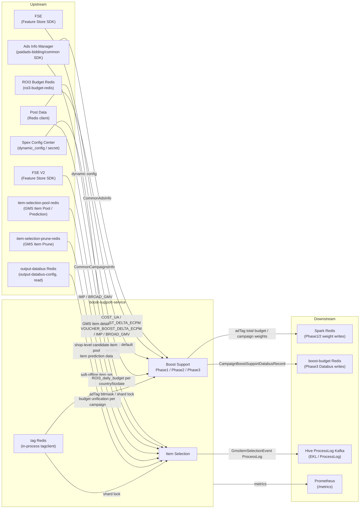

<!-- ads-workspace-gdoc-sync: gdoc_id=1JGB7XJNN08lv2avDv-cz3el79KZU8dKg9fDfYuCSrlU gdoc_url=https://docs.google.com/document/d/1JGB7XJNN08lv2avDv-cz3el79KZU8dKg9fDfYuCSrlU/edit -->

# boost-support-service

**GitLab**: https://git.garena.com/shopee/deep/paidads-bidding/boost-support-service  
**Version**: 0.1.0

---

## Table of Contents

- [Introduction](#introduction)
- [Features](#features)
- [Architecture](#architecture)
  - [System Context](#system-context)
  - [Service Topology](#service-topology)
  - [Background Job Model](#background-job-model)
  - [Data Flow](#data-flow)
- [Directory Structure](#directory-structure)
- [Core Pipeline — Boost Support](#core-pipeline--boost-support)
  - [Startup and Dependency Initialization](#startup-and-dependency-initialization)
  - [Phase1 Total Budget Calculation](#phase1-total-budget-calculation)
  - [Phase2 Campaign Weight Calculation](#phase2-campaign-weight-calculation)
  - [Phase2 Shard Barrier](#phase2-shard-barrier)
  - [Phase3 Final Budget and Databus Output](#phase3-final-budget-and-databus-output)
  - [Grouping Budget Allocation](#grouping-budget-allocation)
  - [Dormant Campaign Handling](#dormant-campaign-handling)
- [Core Pipeline — Item Selection](#core-pipeline--item-selection)
  - [Campaign Aggregation and Sharding](#campaign-aggregation-and-sharding)
  - [Resource Loading](#resource-loading)
  - [GMS Item Selection Processor](#gms-item-selection-processor)
  - [Hive ProcessLog Output](#hive-processlog-output)
- [Data Model and Redis Keys](#data-model-and-redis-keys)
- [Configuration](#configuration)
- [Build and Deployment](#build-and-deployment)
- [Dry-run Verification](#dry-run-verification)
- [Development Guidelines](#development-guidelines)
- [Monitoring](#monitoring)
- [Business Terminology Glossary](#business-terminology-glossary)
- [Additional Resources](#additional-resources)
- [Frequently Asked Questions](#frequently-asked-questions)

---

## Introduction

**boost-support-service** is the backend Boost Support service for Product Ads. It runs periodic tasks centered around AdTag budgets, campaign-level Traffic/Voucher weights, and the final boost_support_databus output.

- **Go module**: `git.garena.com/shopee/deep/paidads-bidding/boost-support-service`
- **Go version**: 1.24.3
- **Service binary**: `bin/boost_support_server`
- **Spex server-name**: `productads.boostsupport`
- **Deploy project_name**: `productads` / **module_name**: `boostsupport`

> **Important**: This service is **not** a Spex RPC API service. `pkg/server/registerSpex` registers an empty ProcessorConfig. The primary entry points are background goroutine tasks and HTTP operation interfaces.

Two background pipelines run within the same process:

1. **Boost Support Pipeline** — Phase1 → Phase2 → Phase3: periodically computes AdTag budgets and campaign-level weights for each country, and writes results to boost_support_databus.
2. **Item Selection Pipeline** — periodically executes item selection for campaigns with GMS pricing type (GMV Max Strategy), producing Hive ProcessLog output and optional Kafka events.

This README is based on source code, configuration files, deploy artifacts, and BOOST_SUPPORT_VERIFIER.md.

---

## Features

- Multi-country parallel processing (SG, TW, ID, PH, MY, VN, TH, MX, BR, AR, etc.)
- Three-phase Boost Support framework (Phase1 total budget → Phase2 campaign weights → Phase3 Databus output)
- Distributed shard locking via tag Redis SetNX to prevent duplicate processing across instances
- Phase2 shard barrier: automatically triggers Phase3 after all shards complete
- Grouping mode: groups campaigns by plan_bucket to accumulate AdTag weights separately per group
- Dormant campaign filtering: lazy exclusion based on dormant tag bit and visible_start_ts
- Dual FSE / FSE V2 Feature Store support with dynamic switching of default weight source
- Item Selection: generates item selection events for GMS campaigns, outputs Hive ProcessLog; Kafka send controlled by `disable_item_selection_kafka_send`
- Prometheus metrics: `productads_boost_support_service_*`, covering latency, error, budget, cost, ratio
- HTTP operation interfaces: `/ping`, `/metrics`, pprof, dynamic log level

---

## Architecture

### System Context

boost-support-service is the offline budget computation layer of the Product Ads engine, positioned between the ad data loading layer (Ads Info Manager) and the online bidding layer (online-bidding). The service has no external RPC interface and exchanges data with other systems exclusively through Redis and Kafka.

### Service Topology



**Topology Table**

| Direction | Service | Protocol | Description |
|-----------|---------|----------|-------------|
| Upstream | Ads Info Manager | paidads-bidding/common SDK | Periodically loads full CommonAdsInfo per country, drives Phase2/Phase3 and Item Selection |
| Upstream | Post Data | Redis client / post_data_client | Reads COST_UA, TRAFFIC_BOOST_DELTA_ECPM, VOUCHER_BOOST_DELTA_ECPM, IMP, BROAD_GMV |
| Upstream | FSE | Feature Store SDK | Reads campaign × adTag default weights (for adTag total budget allocation) |
| Upstream | FSE V2 | Feature Store SDK | Reads GMS item detail for Item Selection processor |
| Upstream | item-selection-pool-redis | Redis client | Reads `item_selection_gms_pool_v2:{country}_{shopID}` for shop-level candidate item pool; also implements `PredictionClient` for model-based GMS item selection (v2) |
| Upstream | item-selection-prune-redis | Redis client | Reads `gms_item_selection_soft_offline:{country}_{shopID}`, providing a set of soft-offline items used to prune low-quality candidates |
| Upstream | ROI3 Budget Redis | Redis client (`roi3-budget-redis`) | Phase1 reads `ROI3_daily_budget:{REGION}_{YYYYMMDD}` (hash, `redis_value` field) for `data_source=redis` adTag configs; provides daily ROI3 budget in USD, converted to local currency |
| Upstream | output-databus Redis (read) | Redis client (`output-databus-config`) | GMS Item Selection (v2) reads budget unification data per campaign via `BudgetClient.GetBudgetUnification` |
| Downstream | boost-budget Redis databus | Redis pipeline | Phase3 writes `boost_support_databus:{country}_{campaign_id}_{bizdate}` |
| Downstream | Spark Redis | Redis pipeline | Stores Phase1 total budgets and Phase2 campaign × adTag weights, adTag total weights |
| Downstream | Hive ProcessLog Kafka | Kafka (EKL) | ItemSelectionHiveLogProcessor delivers GMS item selection process logs via ProcessLog emitter |
| Downstream | Prometheus | HTTP /metrics | `productads_boost_support_service_*` metrics |
| Dependency | Spex Config Center | Spex SDK | Initializes `productads.boostsupport`, subscribes to `dynamic_config` and `secret` namespaces |
| Dependency | tag Redis | Redis client | Reads `adtag:{country}:{ads_id}` bitmask; SetNX distributed locks for Phase2/Phase3/Item Selection shards |
| Dependency | boost-budget Redis | Redis client | Reads default adTag weights; writes final Databus |
| Dependency | in-process tagclient | in-process | `NewDefaultTagReader` syncs tag bit lifecycle every 6h; `CheckBitByBitNum` unified bitmask check |
| Dependency | HTTP runtime | HTTP | `/ping`, `/metrics`, pprof, `/log/{debug|info|fatal}` |

### Background Job Model

After startup, `BoostSupportHandler` and `ItemSelectionHandler` each launch independent goroutines per country, forming two parallel pipelines:

```
[main process]
  ├── BoostSupportHandler.Start()
  │     └── per country → periodic task (update_time_interval minutes)
  │           ├── Phase1 (only runs when current local hour matches phase1_run_hour)
  │           ├── Phase2 (sharded by shard_num_by_country, concurrency limited by shards_max_per_machine_by_country)
  │           │     └── shard barrier monitor → triggers Phase3
  │           └── Phase3 (sharded by campaign_shard_num_by_country)
  └── ItemSelectionHandler.Start()
        └── per country → periodic task (item-selection.update-interval, default 30m)
              └── aggregate → shard → load resources → run Processor chain
```

### Data Flow

```
Ads Info Manager
      │ full CommonAdsInfo
      ▼
Phase1 (daily, at phase1_run_hour)
  - reads Post Data total revenue / adTag metrics
  - computes adTag total budget per alloc_type pct/abs and budget_source
  - writes Spark Redis: {adTag}_total_boost_budget_{country}_{bizdate}

Phase2 (every update_time_interval minutes)
  - shards campaigns via tag Redis lock
  - loads FSE or boost-budget Redis default weights
  - Phase2Processor: adTag bitmask → campaignTagMap → entry/exit/default/redis weight
  - writes Spark Redis: campaign × adTag weights, adTag total weights (optional group dimension)

Phase3 (auto-triggered after Phase2 shard barrier)
  - reads Spark Redis total budgets / weights
  - reads Post Data Traffic/Voucher boost delta eCPM
  - Phase3Processor: calculates campaign-level budget/cost/remain_budget/cost_ratio
  - writes boost-budget Redis: boost_support_databus:{country}_{campaign_id}_{bizdate}

Item Selection (every update-interval, default 30m)
  - reads Post Data IMP / BROAD_GMV
  - reads item-selection-pool-redis: shop-level candidate item pool (item_selection_gms_pool_v2)
  - reads item-selection-prune-redis: soft-offline item set (gms_item_selection_soft_offline)
  - reads FSE V2 GMS item detail (GMV Max Strategy campaigns only; candidates = active ads ∪ pool Redis)
  - GmsItemSelectionProcessor → rank → validity check → performance trim → prune filter → generates GmsItemSelectionEvent
  - ItemSelectionHiveLogProcessor → Hive ProcessLog Kafka
  - ItemSelectionEventProduceProcessor → Kafka (controlled by disable_item_selection_kafka_send)
```

---

## Directory Structure

```
boost-support-service/
├── bin/                          # Build artifacts (git-ignored)
│   └── boost_support_server      # Main service binary
├── config/
│   ├── files/                    # Per-environment static YAML config
│   │   ├── test.yml
│   │   ├── test-br.yml
│   │   ├── liveish.yml
│   │   ├── live.yml
│   │   └── live-br-us3.yml       # BR / MX / AR production (US3 AZ)
│   ├── config.go                 # BoostSupportService struct definition
│   ├── dynamic.go                # CommonDynamicConfig (Spex dynamic config)
│   └── secret.go                 # SecretConfig (Kafka SASL and other sensitive config)
├── deploy/
│   ├── boost_support_service.json # Spex deploy descriptor
│   └── start.sh                  # Startup script: selects config file by env/cid/AZ
├── gen/                          # sp-workspace generated protobuf code (git-ignored)
├── idl/                          # Local protobuf definitions
├── pkg/
│   ├── data/                     # Data layer
│   │   ├── ads_info_manager/     # Ads Info Manager client
│   │   ├── boost_budget_daily/   # boost-budget Redis client
│   │   ├── fse/                  # FSE (Feature Store) client
│   │   ├── fse_v2/               # FSE V2 client (GMS item detail)
│   │   ├── get_item_validity/    # paidads.ultimate_ads_service RPC wrapper
│   │   ├── gms_item_selection/   # GMS Item Pool / Prune Redis clients
│   │   ├── post_data_wrapper/    # Post Data reader wrapper
│   │   ├── queue/kafka/          # Kafka producers (TroiProcessEvent / ItemSelectionEvent)
│   │   └── spark/                # Spark Redis client
│   ├── handler/                  # Task scheduling layer
│   │   ├── boost_support_handler.go
│   │   └── item_selection_handler.go
│   ├── processor/                # Business logic processors
│   │   ├── phase1_processor.go
│   │   ├── phase2_processor.go
│   │   ├── phase3_processor.go
│   │   ├── gms_item_selection_processor.go
│   │   ├── item_selection_hive_log_processor.go
│   │   └── item_selection_event_produce_processor.go
│   ├── service/
│   │   ├── boost_support/        # Boost Support service core logic and ResourceLoader
│   │   └── item_selection/       # Item Selection service core logic and ResourceLoader
│   ├── storage/                  # Storage interface and Redis implementation
│   ├── types/                    # Shared data structures (BoostFrameworkData, etc.)
│   └── util/
│       ├── exporter/             # Prometheus metrics exporter
│       └── http_common/          # HTTP operation interface registration
├── server/
│   ├── boost-support-server/     # Main process entry (main + run.go)
│   └── boost-support-verifier/   # Dry-run verification tool entry
├── sp_proto/                     # sp-workspace proto source files
├── BOOST_SUPPORT_VERIFIER.md     # Dry-run verification usage guide
├── Makefile
├── go.mod                        # Go module: go 1.24.3
├── sp-workspace.yml              # sp-workspace dependency declarations
└── VERSION
```

---

## Core Pipeline — Boost Support

### Startup and Dependency Initialization

The `run()` function in `server/boost-support-server/run.go` initializes in the following order:

1. `util.InitLogger(conf.LogLevel)` — initialize JSON logging
2. `spex.InitSpex(ctx, conf.SpexConfig)` — connect to Spex; region determined by `$AZ` / `$cid` (US3 non-BR nodes fixed to `global`)
3. `config.SetDynamicConfig()` — subscribe to `dynamic_config` in `boost_support_service` namespace; starts background goroutine for updates
4. `config.SetSecretConfig()` — load Kafka SASL and other sensitive config
5. `runServices()` initializes in sequence:
   - `tagRedis` (tag Redis, YAML field `tag-redis`)
   - `postDataConfigClient` / `postDataRedisCli` / `postDataWrapper`
   - `sparkCli` (Spark Redis)
   - `boostBudgetCli` (boost-budget Redis)
   - `fseCli` (FSE, uses `DynamicConfig.FSEConfig`)
   - `roi3BudgetClient` (ROI3 Budget Redis, YAML field `roi3-budget-redis`; raw `*goredis.Client`; used by Phase1 `DataSourceRedis` configs)
   - `itemSelectionFSECli` (FSE V2, uses `DynamicConfig.FSEConfigV2`)
   - `itemSelectionPoolCli` (item-selection-pool-redis, YAML field `item-selection-pool-redis`; skipped if unconfigured, fallback to active-ads-only candidates)
   - `itemSelectionPruneCli` (item-selection-prune-redis, YAML field `item-selection-prune-redis`; skipped if unconfigured, no prune filtering applied)
   - `itemSelectionBudgetCli` (output-databus Redis, YAML field `output-databus-config`; `gms_item_selection.NewBudget`; fallback to v1 item selection if init fails)
   - `itemSelectionPredictionCli` (type-asserted from `itemSelectionPoolCli` via `poolClient.(gms_item_selection.PredictionClient)`; nil if pool client does not implement prediction; fallback to v1 item selection)
   - `server.NewBoostSupportServer()` (registers empty ProcessorConfig — **provides no RPC service**)
   - `resourceLoader` (for Boost Support; `NewResourceLoader(postDataWrapper, sparkCli, boostBudgetCli, fseCli, roi3BudgetClient)`)
   - `eventProducer` (TroiProcessEvent Kafka)
   - `itemSelectionEventProducer` (ItemSelectionEvent Kafka, routed per country)
   - `hiveLogEmitter` (Hive ProcessLog, based on EKL)
6. `initBoostSupportServiceWithProcessors()` — assembles Phase1/Phase2/Phase3 Processor chain
7. `ads_info_manager.NewAdInfoLoaderV2()`
8. `tagclient.NewDefaultTagReader(cid, 6*time.Hour)` — syncs tag bit lifecycle every 6h; `processor.CheckBit = tagReader.CheckBitByBitNum`
9. Starts `BoostSupportHandler.Start()` and `ItemSelectionHandler.Start()`
10. Starts HTTP server (`/ping`, `/metrics`, pprof, dynamic log level endpoints)
11. `util.WaitSignals(cancel)` — blocks until SIGTERM/SIGINT

### Phase1 Total Budget Calculation

`BoostSupportHandler` registers a periodic task per country (period controlled by `DynamicConfig.update_time_interval` in minutes). **Phase1 only executes when the current local hour equals `BoostSupportConfig.phase1_run_hour` (a single int, 0–23).**

`ResourceLoader.LoadForBoostFramework` groups `AdTagBudgetConfigs` by `DataSource` and dispatches to two loaders:

- **MetricLoader** (`DataSource=metric`, default): reads Post Data metrics by `MetricType` for each adTag config:
  - `COST_UA` → `Metric_COST_UA`
  - `TRAFFIC_BOOST_DELTA_ECPM` → Traffic boost delta eCPM
  - `VOUCHER_BOOST_DELTA_ECPM` → Voucher boost delta eCPM
  - Results written to `data.AdTagMetrics[tagBit]` as `[]AdTagMetricValue`; `data.TotalRev` set from total revenue.
- **RedisLoader** (`DataSource=redis`): reads hash key `ROI3_daily_budget:{REGION}_{YYYYMMDD}` from ROI3 Budget Redis, field `redis_value` (JSON `{"budget": <USD float>}`); converts USD to local currency × 1e5 via `ConvertUSDToLocalCurrency`; stores in `data.TagTotalBudget[tagBit]`.

`Phase1Processor.Process` flow:
1. Reads `RegionBudgetCoefficient` from `data.RegionBudgetCoefficient` (fallback 1.0 if ≤ 0); exports `platform_budget_coefficient` gauge.
2. For each `AdTagBudgetConfig`:
   - `alloc_type=pct`, `budget_source=total_revenue`: budget = `allocValue × data.TotalRev/1e5 × 1e5 × regionBudgetCoefficient`
   - `alloc_type=pct`, `budget_source=adtag_revenue`: budget = `allocValue × data.AdTagMetrics[tagBit][0].Value/1e5 × 1e5 × regionBudgetCoefficient`
   - `alloc_type=pct`, `budget_source=roi3_redis`: budget = `allocValue × data.TagTotalBudget[tagBit]/1e5 × 1e5` (no coefficient applied)
   - `alloc_type=abs`: budget = `int64(allocValue)` fixed (already in 1e5 precision; no coefficient)
   - Exports `platform_budget` value-distribution per tagBit.
3. Writes Spark Redis key: `{adTag}_total_boost_budget_{country}_{bizdate}`, TTL 24h

### Phase2 Campaign Weight Calculation

Phase2 executes on every update cycle, not restricted by hour:

1. Fetches full ads from Ads Info Manager → shards by `DynamicConfig.shard_num_by_country`
2. Each shard acquires a tag Redis SetNX lock (key: `boost_support_p2:job:{country}:{shard}:{windowUnix}`)
3. `ResetPhase2AdTagWeights` — clears adTag accumulated weights once at the start
4. Processes chunks in parallel at `BoostSupportConf.ChunkSize` granularity via `ChunkUpdateShard`

**Resource loading** (per shard):
- Reads historical `boost_job_{campaignId}_{adTag}_{country}_{bizdate}`
- Reads default campaign × adTag weights: FSE preferred (`use_fse_default_campaign_ad_tag_infos=true`), otherwise boost-budget Redis (`default_boost_budget_weight:{country}_{ad_tag}`)
- Falls back to `DynamicConfig.country_ad_tag_config_map` Traffic/Voucher defaults when both are missing

**Phase2Processor**:
- Uses `tagReader.CheckBitByBitNum` to interpret adTag bitmask, generating campaignTagMap
- Records Prometheus metrics for entry/exit/default/redis weight paths
- Dormant campaign check: all ads must simultaneously satisfy dormantTagBit=64 AND `visible_start_ts` after campaign start AND `visible_start_ts` in the future

**Phase2 writes to Spark Redis**:
- `boost_job_{campaignId}_{adTag}_{country}_{bizdate}` — campaign × adTag weight
- `boost_adtag_{tagID}_traffic_{country}_{bizdate}` / `boost_adtag_{tagID}_voucher_{country}_{bizdate}` — adTag total weight
- When grouping is enabled: additional `boost_adtag_{tagID}_traffic_{country}_{bizdate}_group_{groupID}` and similar group-dimension keys

### Phase2 Shard Barrier

After each shard completes, `markShardDone` writes `boost_support_service:done:{country}:{shard}:{windowUnix}`.

A `monitorShardCompletion` goroutine polls every 60s and automatically triggers Phase3 once all shards are marked done. This is the core mechanism for coordinating the Phase2 → Phase3 transition across multiple instances.

### Phase3 Final Budget and Databus Output

Phase3 is triggered by the shard barrier and performs a full campaign scan:

1. Reloads full ads, shards by `DynamicConfig.campaign_shard_num_by_country`
2. `LoadForBoostPhase3` reads:
   - Spark Redis total budgets (written by Phase1)
   - Traffic/Voucher boost delta eCPM (Post Data)
   - Phase2 adTag total weights (including optional group dimension)
   - Phase2 campaign × adTag weights
3. `Phase3Processor` calculation semantics:
   - campaign Traffic budget = adTag total budget × (campaign Traffic weight / adTag Traffic total weight)
   - campaign Traffic remain budget = campaign Traffic budget − Post Data campaign Traffic cost
   - Same logic applied to Voucher and each BoostTag
4. Outputs `CampaignBoostSupportDatabusRecord` to boost-budget Redis:
   - key: `boost_support_databus:{country}_{campaign_id}_{bizdate}`
   - fields: TrafficBudget, TrafficCost, TrafficRemainBudget, VoucherBudget, VoucherCost, VoucherRemainBudget, BoostBudgetMap, BoostCostMap, BoostRemainBudgetMap, BoostCostRatioMap

### Grouping Budget Allocation

When `BoostSupportConf.EnableGrouping=true` (YAML `boost_support.enable-grouping: true`, enabled in live-br-us3.yml):

- `GetGroupIDAndTrafficRatio` matches (country, adTag, plan_bucket) against `DynamicConfig.group_traffic_ratio_list`, returning group_id and traffic ratio
- Phase2 uses `AdTagWeightAccumulator` to accumulate both global and per-group weights simultaneously
- Phase3 allocates campaign budget within each group proportionally to group traffic ratio

### Dormant Campaign Handling

A dormant campaign is excluded from Phase2 weight calculation only when all three conditions are met simultaneously:

1. All ads match dormantTagBit = 64
2. `visible_start_ts` is after campaign start (campaign was already activated before visible time was set)
3. `visible_start_ts` is in the future

If any condition is not satisfied (e.g., campaign is active but returns to visible in the future), the campaign still participates in weight calculation.

---

## Core Pipeline — Item Selection

### Campaign Aggregation and Sharding

`ItemSelectionHandler.Start` launches a periodic task per country. The default `update_interval` is 1h; it can be overridden via YAML field `item-selection.update-interval` (configured as 30m in live-br-us3.yml).

Flow:
1. Fetches CommonAdsInfo from Ads Info Manager, aggregates into `CommonCampaignsInfo` per campaign
2. Shards by `DynamicConfig.campaign_shard_num_by_country`
3. Acquires tag Redis SetNX lock (key: `item_selection:job:{country}:{shard}:{windowUnix}`) to prevent duplicate processing across instances

### Resource Loading

`resourceLoader.Load` loads the following resources (code: `pkg/service/item_selection/resource_loader.go`):

| Resource | Source | Description |
|----------|--------|-------------|
| IMP | Post Data (`Metric_IMP`) | Per-ads_id aggregated to campaign level |
| BROAD_GMV | Post Data (`Metric_BROAD_GMV`) | Per-ads_id aggregated to campaign level |
| GMS item pool | item-selection-pool-redis | Batch reads `item_selection_gms_pool_v2:{country}_{shopID}` per shop, providing offline-algorithm-recommended candidate item IDs |
| GMS item prune set | item-selection-prune-redis | Batch reads `gms_item_selection_soft_offline:{country}_{shopID}` per shop, providing a soft-offline item set (protobuf `databus.Data` encoded) |
| GMS item detail | FSE V2 | Loaded only for `PRODUCT_SHOP_GMV_MAX_PRICING` / `_SIMPLE` campaigns where `IsGMSItemSelectionEnabled` is true; candidate IDs = active ads items ∪ pool Redis items (deduped by `buildCampaignGMSItemIDs`) |

> **Note**: Campaign-level `loadItemValidities` is currently commented out; `ItemSelectionResourceData.ItemValidities` is an empty map. Item-level validity checking is done inside `GmsItemSelectionProcessor` itself via `get_item_validity.GetItemValidity` RPC calls per campaign.

**item-selection-pool-redis / item-selection-prune-redis are optional**: if the YAML field is unconfigured (all connection fields empty), client initialization is skipped and `nil` is passed into the service. With a `nil` client, the candidate set falls back to active-ads-only items, and the prune set is empty (no items filtered).

### GMS Item Selection Processor

`GmsItemSelectionProcessor` handles `PRODUCT_SHOP_GMV_MAX_PRICING` and `PRODUCT_SHOP_GMV_MAX_PRICING_SIMPLE` campaigns where `IsGMSItemSelectionEnabled` is true (traffic controlled by `GMSItemSelectionConfig`: `shopID % mod >= lower_bound && < upper_bound`, or `shopID` in `include_shops` whitelist).

Per-campaign, the processor selects one of two selection variants based on `IsGMSItemSelectionExpEnabled(shopID)`:

**Variant v1 (default, `buildSelectedGMSItems`):**

1. **Ranking (`RankGMSItem`)**: sorts candidate items in descending order by: GMVL7d → AdsGMVL7d → OrderL7d → Order → ItemCreatedTime
2. **Validity check (`loadGMSItemValidities`)**: calls `get_item_validity.GetItemValidity` Spex RPC for candidate items; eliminates items where `IsValid=false`, records `elimination_reason=invalid`
3. **Performance trim (`trimGMSItemsByPerformance`)**: takes top 75% by rank; items in the bottom 25% with `order==0 AND ads_order_l7d==0 AND age>30 days` are truncated; final count clamped to [min(5), max(75)]
4. **Prune filter (`pruneGMSItems`)**: items with rank < 5 (top 5) are protected from pruning; remaining items in the prune set are removed, records `elimination_reason=pruned`

**Variant v2 (model-based, `buildSelectedGMSItemsV2`, gated by `IsGMSItemSelectionExpEnabled`):**

- `IsGMSItemSelectionExpEnabled(shopID)` checks `shopID % exp_mod >= exp_lower_bound && < exp_upper_bound` from `GMSItemSelectionConfig`
- `p.budgetCli.GetBudgetUnification(ctx, country, campaignInfo)` reads budget unification data (account balance, campaign cost, daily/weekly budget, remain budget) from output-databus Redis
- `p.predictionCli.GetGMSItemSelectionPrediction(ctx, country, itemIDs)` reads predicted GMV and cost per item from item-selection-pool-redis
- Applies model-based ranking incorporating `model_based_epsilon` and `model_based_cost_floor` from `GMSItemSelectionConfig`
- Returns `modelMetrics` (predicted GMV/cost per item) logged for offline analysis

**Both variants log** `selectionVariant` ("v1" or "v2"), pool/prune stats, and item metrics in a structured log line.

Outputs:
- `ItemSelectionEvent` (with `ItemSelectInfo` list) stored in `ctxData[CtxDataGMSItemSelectionEventsKey]` for `ItemSelectionEventProduceProcessor` and `ItemSelectionHiveLogProcessor` to consume
- ProcessLog includes full `item_metrics` per candidate item (rank, GMVL7d, AdsGMVL7d, is_hot_sku, potential_score, etc.) and `elimination_reason` for offline analysis

Event count metric: `item_selection_service/gms_item_selection_event_built_count`

### Hive ProcessLog Output

`ItemSelectionHiveLogProcessor` delivers GMS item selection process logs to Hive ProcessLog Kafka via `processlog.Emitter`:

- Sampling rate controlled by `DynamicConfig.hive_log_sample_rate` (0.0–1.0; 0 disables output)
- Emitter uses EKL backed by the `hive-log-kafka-producer` broker and topic configuration

`ItemSelectionEventProduceProcessor` is registered in `initItemSelectionServiceWithProcessors` and sends `GmsItemSelectionEvent` to the topic configured in `item-selection-kafka-producer`. Actual sending is controlled by `DynamicConfig.disable_item_selection_kafka_send`: when `true`, messages are dropped and `drop_disabled` metrics are reported.

---

## Data Model and Redis Keys

### BoostFrameworkData

Core data structure defined in `pkg/types/`, passed between Phase1/2/3:

| Field | Type | Description |
|-------|------|-------------|
| AdTagMetrics | map[uint32][]AdTagMetricValue | adTag → list of metric values (MetricName + Value) read by Phase1 MetricLoader |
| TotalRev | int64 | Total revenue read by Phase1 MetricLoader |
| RegionBudgetCoefficient | float64 | Budget scaling coefficient per country, applied to pct-based Phase1 budget calculation (total_revenue / adtag_revenue sources only) |
| TagTotalBudget | map[uint32]int64 | adTag total budgets pre-loaded by Phase1 RedisLoader from ROI3 Budget Redis (local currency × 1e5) |
| PrevCampaignWeights | map | Historical weights from Spark Redis (Phase2 reads) |
| DefaultAdTagWeights | map | Default adTag weights (FSE or boost-budget Redis) |
| DefaultCampaignAdTagInfos | map | Default campaign × adTag weights |
| AdTagTotalWeights | map[uint32]*AdTagTotalWeight | adTag total weights accumulated by Phase2 |
| AdTagGroupWeights | map[uint32]map[string]*AdTagTotalWeight | adTag weights accumulated by group in Phase2 (when grouping enabled) |
| CampaignAdTagWeights | map[int64]map[uint32]*AdTagWeight | campaign × adTag weights output by Phase2 |
| AlgoContent | map[string]interface{} | Algorithm debug content written by each processor |

### AdTagWeight and DefaultWeight

- **Traffic Boost** uses tag bit 1–64
- **Voucher Boost** uses tag bit+64 (i.e., 65–128); voucher metric queries add 64 to tag id and normalize the result

### Spark Redis Keys

| Key Template | Write Phase | Description |
|--------------|-------------|-------------|
| `{adTag}_total_boost_budget_{country}_{bizdate}` | Phase1 | adTag total budget, TTL 24h |
| `boost_job_{campaignId}_{adTag}_{country}_{bizdate}` | Phase2 | campaign × adTag weight |
| `boost_adtag_{tagID}_traffic_{country}_{bizdate}` | Phase2 | adTag Traffic total weight |
| `boost_adtag_{tagID}_voucher_{country}_{bizdate}` | Phase2 | adTag Voucher total weight |
| `boost_adtag_{tagID}_traffic_{country}_{bizdate}_group_{groupID}` | Phase2 | adTag Traffic group weight (grouping enabled) |
| `boost_adtag_{tagID}_voucher_{country}_{bizdate}_group_{groupID}` | Phase2 | adTag Voucher group weight (grouping enabled) |

### boost-budget Redis Keys

| Key Template | R/W | Description |
|--------------|-----|-------------|
| `default_boost_budget_weight:{country}_{ad_tag}` | Read | Default adTag weight (Phase2 reads) |
| `boost_weight:{country}_{tagBit}_{campaignId}` | Read | Default campaign × adTag weight (optional) |
| `boost_support_databus:{country}_{campaign_id}_{bizdate}` | Write | Phase3 Databus output |

### tag Redis Locks

| Key Template | Purpose |
|--------------|---------|
| `adtag:{country}:{ads_id}` | adTag bitmask, read by Phase2 |
| `boost_support_p2:job:{country}:{shard}:{windowUnix}` | Phase2 shard lock |
| `boost_support_p3:job:{country}:{shard}:{windowUnix}` | Phase3 shard lock |
| `boost_support_service:done:{country}:{shard}:{windowUnix}` | Phase2 shard done marker (for barrier) |
| `item_selection:job:{country}:{shard}:{windowUnix}` | Item Selection shard lock |

### item-selection Redis Keys

| Redis Instance | Key Template | R/W | Value Format | Description |
|----------------|--------------|-----|--------------|-------------|
| item-selection-pool-redis | `item_selection_gms_pool_v2:{country}_{shopID}` | Read | Comma-separated item ID string | Shop-level candidate item pool from offline algorithms; merged with active ads as FSE V2 query input |
| item-selection-prune-redis | `gms_item_selection_soft_offline:{country}_{shopID}` | Read | Protobuf `databus.Data` (int64 item ID list) | Soft-offline item set; candidates at rank ≥ 5 in this set are pruned |
| output-databus Redis | `databus_{CoefCacheKeyIdTypeAd}_{country}_{adID}_{0}_{BudgetUnification}` | Read | Protobuf `databus.Data` | Budget unification per campaign (account balance, campaign cost, daily/weekly budget, remain budget); read by GMS Item Selection v2 via `BudgetClient.GetBudgetUnification` |

### ROI3 Budget Redis Keys

| Redis Instance | Key Template | R/W | Value Format | Description |
|----------------|--------------|-----|--------------|-------------|
| ROI3 Budget Redis | `ROI3_daily_budget:{REGION}_{YYYYMMDD}` | Read | Hash; field `redis_value` = JSON `{"budget": <USD float>}` | Daily ROI3 budget in USD; read by Phase1 RedisLoader for `data_source=redis` adTag configs; converted to local currency × 1e5 |

### Proto Event Artifacts

`sp_proto/deep/paidads/boost_support_service.proto` defines only event messages:

- `TroiProcessEvent` — Boost Support process event (current Phase1/2/3 processors do not call `SendTroiProcessEvents`)
- `GmsItemSelectionEvent` — GMS item selection output event
- `ItemSelectInfo` — Item selection details

**No Spex service is defined in this proto.** `registerSpex` registers an empty ProcessorConfig.

---

## Configuration

### Static YAML Config

Configuration files reside in `config/files/`. `deploy/start.sh` selects the config file based on `$env`, `$cid`, and `$AZ`:

```sh
base_conf="config/files/$env.yml"
extra_conf="config/files/$env-$cid-$AZ.yml"

if [ "$cid" = "sg" ]; then
  ./bin/boost_support_server -c "$base_conf"
elif [ -f "$extra_conf" ]; then
  ./bin/boost_support_server -c "$extra_conf"
else
  ./bin/boost_support_server -c "$base_conf"
fi
```

Main YAML fields (from `config/config.go`):

| Field | Type | Description |
|-------|------|-------------|
| `countries` | []string | List of countries the service processes |
| `log-level` | string | Log level (info/debug/fatal) |
| `spex-config` | SpexConfig | Spex connection config; server-name is `productads.boostsupport` |
| `tag-redis` | Redis | Tag Redis (stores adTag bitmask and shard locks) |
| `spark-redis` | Redis | Spark Redis (stores Phase1/2 weights) |
| `boost-budget-redis` | Redis | Boost-budget Redis (stores default weights and Databus) |
| `roi3-budget-redis` | Redis | ROI3 Budget Redis (optional); Phase1 reads `ROI3_daily_budget:{REGION}_{YYYYMMDD}` for `data_source=redis` adTag configs |
| `output-databus-config` | redisutil.Config | Output Databus Redis (optional); GMS Item Selection v2 reads budget unification data per campaign via `BudgetClient` |
| `boost_support` | BoostSupportConf | `chunk-size`, `enable-grouping` |
| `item-selection` | ItemSelectionConf | `chunk-size`, `update-interval` (default 1h; live-br-us3 uses 30m) |
| `item-selection-pool-redis` | redisutil.Config | GMS Item Pool Redis (optional); if unconfigured, candidates fall back to active-ads-only items |
| `item-selection-prune-redis` | redisutil.Config | GMS Item Prune Redis (optional); if unconfigured, no soft-offline items are filtered |
| `ads-info-manager` | Config | Countries, placements, full_load_interval, incr_update_interval |
| `post-data-config` | redisutil.Config | Post Data Redis connection |
| `post-data-client` | post_data_client.Config | Post Data client config |
| `kafka-producer` | KafkaConfig | TroiProcessEvent Kafka |
| `item-selection-kafka-producer` | KafkaConfig | Item Selection Kafka (routed per country) |
| `hive-log-kafka-producer` | KafkaConfig | Hive ProcessLog Kafka |

> **Security note**: Redis host, username, password, Kafka brokers, and SASL credentials from config files must not be committed to the repository or written into the README.

### Spex dynamic_config

Subscribed via `config.SetDynamicConfig()`, namespace `boost_support_service`, key `dynamic_config`.

| Field | Type | Description |
|-------|------|-------------|
| `enable_sync_us` | bool | Enable US region sync |
| `update_time_interval` | int | Boost Support cycle (minutes), default 24 |
| `shards_max_per_machine_by_country` | map[string]int | Max concurrent Phase2/Phase3 shards per machine per country |
| `country_concurrency` | map[string]int | Phase2/Phase3 country-level concurrency |
| `disable_kafka_send` | bool | Disable TroiProcessEvent Kafka send |
| `shard_num_by_country` | map[string]int | Phase2 total shard count per country |
| `campaign_shard_num_by_country` | map[string]int | Phase3 / Item Selection total shard count per country |
| `campaign_country_concurrency` | map[string]int | Phase3 / Item Selection country-level concurrency |
| `disable_item_selection_kafka_send` | bool | Disable Item Selection Kafka send |
| `boost_support_config` | BoostSupportConfig | See below |
| `fse_config` | FSEConfig | FSE connection config (platform_url, project, table, regions) |
| `fse_config_v2` | FSEConfigV2 | FSE V2 connection config (includes table.regions override) |
| `gms_item_selection_config` | GMSItemSelectionConfig | GMS Item Selection traffic control (see below) |
| `hive_log_sample_rate` | float64 | Hive ProcessLog sampling rate (0.0–1.0) |
| `get_item_validity_ttl` | float64 | `get_item_validity` RPC timeout (milliseconds), minimum 75ms |

### Spex secret

Loaded via `config.SetSecretConfig()`, provides Kafka SASL credentials (`ProducerKafka`, `ItemSelectionProducerKafka`, `HiveLogKafka`). Secret contents are injected at runtime only and must not appear in config files or the README.

### BoostSupportConfig

Sub-structure within dynamic config, parsed by `BuildTagInfoMap()` at initialization and on updates:

| Field | Description |
|-------|-------------|
| `ad_tag_budget_configs` | Budget rules per adTag (alloc_type, budget_source, data_source, metric_type, parameters) |
| `country_ad_tag_config_map` | Default Traffic/Voucher weight fallbacks per country per adTag |
| `phase1_run_hour` | Single local hour (int, 0–23) when Phase1 runs; Phase1 is skipped if `current_hour != phase1_run_hour` |
| `use_fse_default_campaign_ad_tag_infos` | `true` → FSE; `false` → boost-budget Redis (default campaign × adTag weight source) |

**AdTagBudgetConfig fields:**

| Field | Type | Values | Description |
|-------|------|--------|-------------|
| `ad_tag` | string | e.g., `cold_start_ad` | AdTag name |
| `tag_bit` | uint32 | 1–64 | adTag bit number |
| `data_source` | string | `metric` (default), `redis` | Phase1 loader dispatch: `metric` → Post Data MetricLoader; `redis` → ROI3 Budget RedisLoader |
| `budget_source` | string | `total_revenue`, `adtag_revenue`, `roi3_redis` | Budget base: total revenue, per-adTag revenue, or ROI3 Redis budget |
| `metric_type` | string | `COST_UA`, `TRAFFIC_BOOST_DELTA_ECPM`, `VOUCHER_BOOST_DELTA_ECPM` | Post Data metric to read (applies when `data_source=metric`) |
| `alloc_type` | string | `pct`, `abs` | Percentage or absolute allocation |
| `alloc_value` | float64 | e.g., `0.015`, `10000.00` | Pct multiplier or absolute amount (abs already in 1e5 precision) |

### GMSItemSelectionConfig

Sub-structure in dynamic config controlling the traffic gate for GMS Item Selection (`IsGMSItemSelectionEnabled` / `IsGMSItemSelectionExpEnabled`):

| Field | Type | Description |
|-------|------|-------------|
| `mod` | int64 | Modulo base for v1 traffic gate; default 199 |
| `lower_bound` | int64 | v1 traffic bucket lower bound (inclusive); default 0 |
| `upper_bound` | int64 | v1 traffic bucket upper bound (exclusive); default 0 (disabled) |
| `exp_mod` | int64 | Modulo base for v2 experiment gate (`IsGMSItemSelectionExpEnabled`); default 199 |
| `exp_lower_bound` | int64 | v2 experiment bucket lower bound (inclusive); default 0 |
| `exp_upper_bound` | int64 | v2 experiment bucket upper bound (exclusive); default 0 (disabled) |
| `include_shops` | string | Comma-separated shop ID whitelist for v1; checked before mod bucket |
| `model_based_epsilon` | float64 | ε parameter for model-based item selection (v2); default 0.05 |
| `model_based_cost_floor` | float64 | Minimum cost floor for model-based selection (v2); default 0.02 |
| `usd_to_currency_rate` | map[string]float64 | USD-to-local-currency rates per country for v2 cost normalization; merged with defaults (SG: 1.279044, TH: 32.666888, VN: 26139.17, etc.) |

Activation rules:
- **v1** (`IsGMSItemSelectionEnabled`): `shopID % mod >= lower_bound && shopID % mod < upper_bound` OR `shopID` in `include_shops`. If `upper_bound <= lower_bound`, automatically disabled.
- **v2** (`IsGMSItemSelectionExpEnabled`): `shopID % exp_mod >= exp_lower_bound && shopID % exp_mod < exp_upper_bound`. If `exp_upper_bound <= exp_lower_bound`, automatically disabled.

### FSE / FSE V2 Configuration

Both FSE and FSE V2 configs are delivered via `dynamic_config` and can be updated without restarting the service. FSE V2 supports overriding region configuration at the table level (`TableAccessConfig.Regions` takes precedence over `FSEConfigV2.Regions`).

### Kafka Configuration

Three Kafka producer sets are configured with static YAML brokers/topics, with SASL credentials injected from Secret:

| Config Field | Purpose |
|--------------|---------|
| `kafka-producer` | TroiProcessEvent (not currently sent) |
| `item-selection-kafka-producer` | GmsItemSelectionEvent (routed per country) |
| `hive-log-kafka-producer` | Hive ProcessLog |

---

## Build and Deployment

### Makefile Targets

| Target | Description |
|--------|-------------|
| `make svc` | Build `bin/boost_support_server` |
| `make unittest` | Run `go test -cover ./...` |
| `make ci` | Runs `ci-vet`, `ci-fmt`, `unittest` in sequence |
| `make fmt` | `go fmt ./...` |
| `make vet` | `go vet ./...` |
| `make debug` | `curl -XPUT .../log/debug` dynamic log level switch |
| `make info` | `curl -XPUT .../log/info` |
| `make fatal` | `curl -XPUT .../log/fatal` |
| `make metrics` | `curl .../metrics` view Prometheus metrics |
| `make build_boost_support_verifier` | CGO + zig cross-compile Linux dry-run binary `bin/boost_support_verifier.linux` |
| `make upload_boost_support_verifier USER_FOLDER=<name>` | Compile and upload binary + config to remote machine |

HTTP_PORT is written to the `HTTP_PORT` file by `pre_hook_commands` at startup; `make debug/info/fatal/metrics` reads port from that file.

### Deploy Script

`deploy/start.sh` selects the config file by environment variables:

- `$cid = sg` → `config/files/$env.yml`
- `config/files/$env-$cid-$AZ.yml` exists → use it (e.g., live-br-us3.yml)
- Otherwise → `config/files/$env.yml`

### Deploy JSON

Key fields in `deploy/boost_support_service.json`:

```json
{
  "project_name": "productads",
  "module_name": "boostsupport",
  "build": {
    "commands": ["make svc"],
    "docker_image": {
      "base_image": "harbor.shopeemobile.com/shopee/golang-base:1.24.4-20"
    }
  },
  "run": {
    "enable_prometheus": true,
    "command": "./deploy/start.sh",
    "smoke": { "endpoint": "/ping" },
    "check": { "endpoint": "/ping" },
    "enable_spex_config_key_fetch": true
  }
}
```

### Local and Remote Running

Full production pipeline cannot be run locally because:

- The service depends on internal network services: Spex Config Center (dynamic config and Secret), Ads Info Manager (ad data), Post Data Redis (post-event metrics), FSE / FSE V2 (default weights and item detail), tag Redis, Spark Redis, boost-budget Redis
- Connection addresses in `test.yml` / `liveish.yml` all point to internal network

Use `boost_support_verifier` on a remote debug machine for dry-run validation (see next section).

---

## Dry-run Verification

### boost_support_verifier

**The verifier can only run on remote machines** because it requires real connections to internal Spex, Ads Info Manager, Post Data, FSE, and other dependencies.

Build:
```bash
make build_boost_support_verifier
# Output: bin/boost_support_verifier.linux
```

Upload to remote:
```bash
make upload_boost_support_verifier USER_FOLDER=<your_name>
# Default upload path: 10.187.174.217:/data/boostservice/<your_name>/
```

Run on remote (configure environment variables first):
```bash
source /data/boostservice/export_env.sh

# Small-scale validation
./boost_support_verifier.linux \
  --config config/files/liveish.yml \
  --country SG \
  --bizdate 20260515 \
  --limit 100 \
  --log-level info
```

Available parameters:

| Parameter | Description |
|-----------|-------------|
| `--config` | Config file path (recommended: liveish.yml) |
| `--country` | Country, supports comma-separated (e.g., `SG,MY`) |
| `--bizdate` | Business date in yyyymmdd format |
| `--limit` | Max ads to process (0 = all) |
| `--log-level` | Log level (info / debug) |
| `--item-selection` | Run Item Selection verification mode |

### Item Selection Verification Mode

```bash
./boost_support_verifier.linux \
  --config config/files/liveish.yml \
  --country SG \
  --bizdate 20260515 \
  --limit 100 \
  --item-selection \
  --log-level info
```

This mode executes: Ads Info fetch → campaign aggregation → resource loading (including real `get_item_validity` calls) → processor chain. **Does not send Item Selection Kafka messages or Hive ProcessLog.**

### Safety Boundaries

The verifier intercepts all write operations (reads only, does not write to production):

- tag Redis locks and done markers (logs `[DRY-RUN] skip tag redis SetNXWithVal`)
- Spark Redis SET / DEL / INCR (logs `[DRY-RUN] store phase2 campaign weights in memory`)
- boost-budget Redis Databus writes (logs `[DRY-RUN] skip boost budget databus redis write`)

Phase2 → Phase3 coordination uses in-process memory to pass intermediate results.

---

## Development Guidelines

### How to Add a Boost Support Processor

1. Implement the corresponding interface (`processor.Processor` / `BoostPhase2Processor` / `BoostPhase3Processor`)
2. Register in `initBoostSupportServiceWithProcessors` (`server/boost-support-server/run.go`)
3. Inject existing clients via constructor if Redis access is needed (`sparkCli`, `boostBudgetCli`, etc.)
4. Write algorithm debug information to a dedicated key under `BoostFrameworkData.AlgoContent` (avoid overwriting other processors' data)

```go
func (p *MyPhase3Processor) Process(ctx context.Context, country, bizdate string,
    ads []*ads_info.CommonAdsInfo, adsTagMap map[int64]int64,
    data *types.BoostFrameworkData) error {
    content := make(map[string]interface{})
    // ... business logic ...
    data.AlgoContent["my_phase3_processor"] = content
    return nil
}
```

### How to Add an Item Selection Processor

1. Implement the `ItemSelectionProcessor` interface
2. Register in `initItemSelectionServiceWithProcessors` (`server/boost-support-server/run.go`)
3. If enabling Kafka event sending, evaluate whether `DynamicConfig.disable_item_selection_kafka_send` needs to be configured, and confirm `ItemSelectionEventProduceProcessor` is registered

### How to Add Config Fields

Must synchronize updates across four locations:

1. The corresponding struct field in `config/config.go` (static config)
2. Static config files in `config/files/*.yml` (at minimum test.yml)
3. `CommonDynamicConfig` in `config/dynamic.go` (dynamic config, if applicable)
4. The Configuration section of this README

### How to Add Output Fields

Adding a Databus output field requires synchronized updates to:

1. `CampaignBoostSupportDatabusRecord` struct
2. `BatchSetCampaignBoostSupportDatabus` serialization logic
3. Notification to downstream consumers (e.g., online-bidding)
4. New corresponding Prometheus metric monitoring

### Error Handling

- Errors from external dependencies (Redis, FSE, Post Data) are reported to Prometheus via `exporter.ExportError`
- A processor returning an error terminates that shard's task without affecting other shards
- Dependency initialization failures during startup return an error immediately, causing the process to exit

### Unit Testing Standards

Existing tests:
- `pkg/handler/item_selection_handler_test.go`
- `pkg/shard/shard_test.go`

Recommended table-driven tests to add:
- Phase1 budget calculation for each `alloc_type` (pct / abs) × `budget_source` (total_revenue / adtag_revenue) combination
- Phase2 entry / exit / default / redis weight four branches
- `AdTagWeightAccumulator` accumulation behavior with grouping on/off
- Phase3 remain budget / cost ratio calculation precision
- Spark Redis key serialization format
- Dormant campaign three-condition boundary cases

Run tests:
```bash
make unittest
```

### Code Review & Git Workflow

- Branch naming: `<username>/feat/<description>` or `<username>/fix/<description>`
- Commit messages follow Conventional Commits (`feat:` / `fix:` / `docs:` / `refactor:`, etc.)
- GitLab MR targets `master`; CI automatically runs `make ci` (vet + fmt + unittest)
- Requires at least one Reviewer Approve before merging

---

## Monitoring

### Prometheus Metrics

Prometheus namespace/subsystem: `productads` / `boost_support_service`

Metric types:

| Metric Type | Description |
|-------------|-------------|
| `latency` | Component operation latency (p50/p90/p99) |
| `error` | Error count with country and error type labels |
| `count` / `gauge` | General counters and gauges |
| `store` | Redis operation results |
| `value_distribution` | Budget/weight value distribution (histogram) |
| `ratio_distribution` | Cost ratio value distribution |
| `campaign_value_distribution` | Campaign-level budget distribution |
| `campaign_ratio_distribution` | Campaign-level cost ratio distribution |

Key component/type combinations:

| component | type | Description |
|-----------|------|-------------|
| `boost_support_handler` | `boost_support_job` | Phase2 overall execution |
| `boost_support_handler` | `boost_phase1_success` | Phase1 success count |
| `boost_support_handler` | `boost_phase2_shard_N_error` | Phase2 per-shard errors |
| `boost_support_handler` | `boost_phase3_shard_N_error` | Phase3 per-shard errors |
| `boost_support_service` | `update_boost_support` | Phase2 overall update |
| `boost_support_service` | `update_boost_support_p3` | Phase3 overall update |
| `phase1_processor` | `platform_budget` | Phase1 per-adTag platform budget |
| `phase2_processor` | `entry/default/redis/total` | Phase2 campaign/adTag counters |
| `phase3_processor` | `budget/cost/usage` | Phase3 budget/cost/utilization distribution |
| `item_selection_handler` | `item_selection` | Item Selection overall execution |
| `item_selection_service` | `trigger_item_selection` | Item Selection trigger count |
| `get_item_validity` | `total/success` | item validity RPC call statistics |

The service writes a gauge on startup: `productads_boost_support_service_start_at`.

### Key Monitoring Points

- Phase2 shard error rate: `boost_phase2_shard_N_error`
- Phase3 remain budget distribution: `phase3_processor budget/cost` distribution
- `item_selection_kafka_event` send_error: Kafka send failure count
- `get_item_validity` error rate: item validity RPC failures

### HTTP Endpoints

| Endpoint | Description |
|----------|-------------|
| `GET /ping` | Health check, used by smoke/check |
| `GET /metrics` | Prometheus metrics, or `make metrics` |
| `GET /debug/pprof/*` | Go pprof (heap/cpu/goroutine) |
| `PUT /log/debug` | Dynamically set log level to debug |
| `PUT /log/info` | Dynamically set log level to info |
| `PUT /log/fatal` | Dynamically set log level to fatal |

Default port is 27002, overridable via `PORT_HTTP` environment variable.

### Logs

- Default JSON format output
- Log level can be dynamically adjusted via HTTP endpoints (no restart required)
- Key log prefixes: `SetDynamicConfig:`, `UpdateBoostSupportPhase2:`, `[DRY-RUN]` (verifier intercept logs)

---

## Business Terminology Glossary

| Term | Description |
|------|-------------|
| Product Ads | Product advertisements; the ad type served by boost-support-service |
| Boost Support | Core business module of this service, responsible for budget allocation and weight calculation |
| AdTag | Ad tag identifying the boost type; Traffic Boost uses bit 1–64, Voucher Boost uses bit 65–128 |
| tag bit | The bit position number of an adTag in the bitmask |
| dormant tag | Dormant campaign marker bit (bit 64) |
| Traffic Boost | Traffic boosting via Traffic adTag budget allocation |
| Voucher Boost | Voucher boosting via Voucher adTag budget allocation |
| BoostFrameworkData | Core data container passed between Phase1/2/3 |
| Phase1Processor | Calculates total budget per adTag |
| Phase2Processor | Calculates per-campaign weights across adTags |
| Phase3Processor | Allocates campaign-level budgets from weights, computes cost ratios |
| GmsItemSelectionProcessor | Generates item selection events for GMS campaigns |
| ItemSelectionHiveLogProcessor | Writes item selection process logs to Hive |
| PlanBucket | Bucket identifier for grouped budget allocation |
| GroupTrafficRatio | Traffic allocation ratio per group |
| BoostBudgetMap | Per-boost-tag budget allocation map for a campaign |
| BoostCostMap | Per-boost-tag actual cost map for a campaign |
| BoostRemainBudgetMap | Per-boost-tag remaining budget map for a campaign |
| BoostCostRatioMap | Per-boost-tag cost ratio map for a campaign |
| ROI3 | Return on Investment strategy 3; a budget source where daily budgets are computed by an offline ROI model and stored in `ROI3_daily_budget` Redis |
| RegionBudgetCoefficient | Per-country budget scaling factor applied by Phase1 to pct-based budget calculations; sourced from `BoostFrameworkData.RegionBudgetCoefficient` |
| DataSourceType | Phase1 loader dispatch type: `metric` (read from Post Data) or `redis` (read from ROI3 Budget Redis) |
| MetricType | Post Data metric identifier for Phase1 MetricLoader: `COST_UA`, `TRAFFIC_BOOST_DELTA_ECPM`, or `VOUCHER_BOOST_DELTA_ECPM` |
| BudgetClient | Interface for reading campaign budget unification data from output-databus Redis (used by GMS Item Selection v2) |
| PredictionClient | Interface for reading model-predicted GMV/cost per item from item-selection-pool-redis (used by GMS Item Selection v2) |
| FSE / FSE V2 | Feature Store Engine, used for reading default weights and GMS item detail |
| Spark Redis | Redis instance storing Phase1/2 intermediate computation results |
| tag Redis | Redis instance storing adTag bitmasks and distributed locks |
| boost-budget Redis | Redis instance storing default weights and final Databus output |
| Post Data | Post-event data service providing COST_UA, IMP, BROAD_GMV, and similar metrics |
| Databus | Campaign-level boost budget/cost data store (boost-budget Redis) |
| EKL | Enhanced Kafka Library, Shopee's internal Kafka client |
| ProcessLog | Process log framework for writing item selection results to Hive |
| HiveLogEmitter | Kafka emitter wrapper for ProcessLog |
| eCPM | Effective Cost per Mille, actual cost per thousand impressions |
| uGSP | Uniform Generalized Second Price auction |
| SPEX / Spex | Shopee's internal RPC framework and configuration center |
| spcli | Spex command-line tool for proto generation and local debugging |
| DAG | Directed Acyclic Graph (task dependency graph) |
| GAS | Go Application Server, Shopee Go service foundation framework |

---

## Additional Resources

- [GitLab Repository](https://git.garena.com/shopee/deep/paidads-bidding/boost-support-service)
- [BOOST_SUPPORT_VERIFIER.md](./BOOST_SUPPORT_VERIFIER.md) — Complete dry-run verification guide
- [BOOST_SUPPORT_VERIFIER_EN.md](./BOOST_SUPPORT_VERIFIER_EN.md) — Dry-run guide (English)
- [Spex Go SDK Quick Start](https://spex.shopee.io/overview/quick-start/languages/go/index.html)
- [spcli Installation and Git Configuration](https://spex.shopee.io/user-guide/SDK/Java/local.html)
- [Paid Ads Glossary (Confluence)](https://confluence.shopee.io/pages/viewpage.action?spaceKey=SPAD&title=Paid+Ads+Glossary)
- [SRA Ads Engine Architecture](https://sra.shopee.io/05.Business_Systems/5.3_Ads_Business_and_Architecture_Introduction/5.3.2._ads_engine.html)
- [sp-workspace.yml](./sp-workspace.yml) — proto dependency declarations (`paidads.valar.ads_info_data/master`, `paidads.ultimate_ads_service/gms_item_pool`)

---

## Frequently Asked Questions

**Q1: Does boost-support-service expose a Spex RPC API?**

No. `pkg/server/registerSpex` registers an empty ProcessorConfig; the service handles no RPC requests. The primary entry points are the `BoostSupportHandler` and `ItemSelectionHandler` background goroutine pipelines, along with HTTP operation interfaces.

---

**Q2: Why does Phase1 only run at certain hours and not every update cycle?**

Phase1 computation is based on daily-level metrics such as total revenue and only needs to run once per day. `BoostSupportConfig.phase1_run_hour` (a single int, 0–23) specifies the one local hour when Phase1 is allowed to execute. When each update cycle arrives, `BoostSupportHandler` compares `now.Hour() == phase1_run_hour`; Phase1 runs only on a match, otherwise only Phase2/Phase3 run.

---

**Q3: How do Phase2 and Phase3 avoid duplicate execution across multiple instances?**

Via tag Redis SetNX distributed locks:

- Phase2: key `boost_support_p2:job:{country}:{shard}:{windowUnix}` — only one instance can acquire the lock and execute that shard within the same windowUnix.
- Phase3: key `boost_support_p3:job:{country}:{shard}:{windowUnix}` — same mechanism.
- Phase2 shard barrier: after each shard completes, writes `boost_support_service:done:{country}:{shard}:{windowUnix}`; `monitorShardCompletion` triggers Phase3 only after all shards are done, ensuring Phase3 reads after Phase2 has fully written.

---

**Q4: How does Grouping affect budget allocation?**

When `enable-grouping` is enabled, Phase2 uses `GetGroupIDAndTrafficRatio` to match each campaign against `group_traffic_ratio_list` by (country, adTag, plan_bucket), returning group_id and traffic ratio. `AdTagWeightAccumulator` maintains both global and per-group weights simultaneously, writing to Spark Redis keys with a `_group_{groupID}` suffix. Phase3 then splits campaign budgets across groups proportionally to group traffic ratios.

---

**Q5: How do you switch between FSE and Redis default weights?**

Controlled by `DynamicConfig.boost_support_config.use_fse_default_campaign_ad_tag_infos`:

- `true`: read campaign × adTag default weights from FSE
- `false` (default): read from boost-budget Redis (`boost_weight:{country}_{tagBit}_{campaignId}` and `default_boost_budget_weight:{country}_{ad_tag}`)

This is a dynamic config field — changes take effect without restarting the service.

---

**Q6: How are dormant campaigns handled?**

A campaign is excluded from Phase2 weight calculation only when all three conditions are met simultaneously:

1. All ads match dormantTagBit (bit 64)
2. `visible_start_ts` is after campaign start
3. `visible_start_ts` is in the future

If any condition is not met (e.g., the campaign is active but will become visible again later), it still participates in weight calculation.

---

**Q7: Why can't I do a full dry-run locally?**

The service depends on internal network services: Spex Config Center (dynamic config and Secret), Ads Info Manager (ad data), Post Data Redis (post-event metrics), FSE / FSE V2 (default weights and item detail), tag Redis, Spark Redis, and boost-budget Redis — none of which are accessible from a local environment. Please refer to [BOOST_SUPPORT_VERIFIER.md](./BOOST_SUPPORT_VERIFIER.md) for dry-run validation on a remote debug machine.

---

**Q8: Does Item Selection currently send Kafka? Is item validity actually checked?**

`ItemSelectionEventProduceProcessor` is registered in `initItemSelectionServiceWithProcessors` and attempts to send `GmsItemSelectionEvent` to the topic configured in `item-selection-kafka-producer`. Actual sending is controlled by `DynamicConfig.disable_item_selection_kafka_send`: when `true`, messages are dropped and `drop_disabled` metrics are reported; when `false`, messages are sent normally.

Hive ProcessLog is written by `ItemSelectionHiveLogProcessor`, with sampling rate controlled by `DynamicConfig.hive_log_sample_rate`.

Item validity: Campaign-level `loadItemValidities` in `resourceLoader.Load` is currently commented out, so `ItemSelectionResourceData.ItemValidities` is an empty map. However, `GmsItemSelectionProcessor` fetches item-level validity per campaign via `get_item_validity.GetItemValidity` Spex RPC during processing; invalid items are eliminated in the `eliminateInvalidGMSItems` step.

---

**Q9: How do I view /metrics and dynamically adjust log level?**

```bash
# Get port (written to HTTP_PORT file at runtime)
PORT=$(cat HTTP_PORT)

# View Prometheus metrics
curl http://127.0.0.1:$PORT/metrics
# or
make metrics

# Dynamically adjust log level
make debug   # → PUT /log/debug
make info    # → PUT /log/info
make fatal   # → PUT /log/fatal
```

---

**Q10: What happens when default weights are missing?**

Phase2 resource loading fallback priority:

1. Read from FSE (`use_fse_default_campaign_ad_tag_infos=true`)
2. Read from boost-budget Redis: `default_boost_budget_weight:{country}_{ad_tag}` and `boost_weight:{country}_{tagBit}_{campaignId}`
3. If both are unavailable, read Traffic/Voucher defaults from `DynamicConfig.country_ad_tag_config_map`

If fallback values are also not configured, the campaign's weight for that adTag is 0 and it does not participate in budget allocation. This is tracked by a `default weight missing` type counter in Prometheus.

---

<!-- Generated by ads-workspace/skills/ads-readme-generate | checked: 8f0f44516d4781da1a6d926f534b3322402a4afb | spec: 76fce5f679f9550b -->
