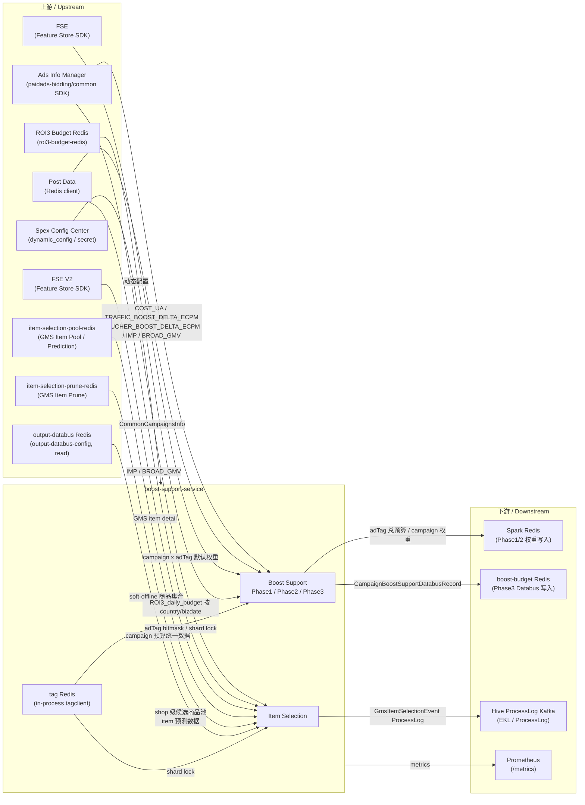

<!-- ads-workspace-gdoc-sync: gdoc_id=1LAfjtCnU1wBXmrXTmFIdSV5R68IyM84fjrrm9j-q1Lc gdoc_url=https://docs.google.com/document/d/1LAfjtCnU1wBXmrXTmFIdSV5R68IyM84fjrrm9j-q1Lc/edit -->

# boost-support-service

**GitLab**: https://git.garena.com/shopee/deep/paidads-bidding/boost-support-service  
**版本 / Version**: 0.1.0

---

## 目录 / Table of Contents

- [项目概述 / Introduction](#项目概述--introduction)
- [核心功能 / Features](#核心功能--features)
- [项目架构 / Architecture](#项目架构--architecture)
  - [系统上下文 / System Context](#系统上下文--system-context)
  - [上下游调用拓扑 / Service Topology](#上下游调用拓扑--service-topology)
  - [后台任务模型 / Background Job Model](#后台任务模型--background-job-model)
  - [数据流 / Data Flow](#数据流--data-flow)
- [目录结构 / Directory Structure](#目录结构--directory-structure)
- [核心流程 — Boost Support / Core Pipeline — Boost Support](#核心流程--boost-support--core-pipeline--boost-support)
  - [启动与依赖初始化 / Startup and Dependency Initialization](#启动与依赖初始化--startup-and-dependency-initialization)
  - [Phase1 总预算计算 / Phase1 Total Budget Calculation](#phase1-总预算计算--phase1-total-budget-calculation)
  - [Phase2 campaign 权重计算 / Phase2 Campaign Weight Calculation](#phase2-campaign-权重计算--phase2-campaign-weight-calculation)
  - [Phase2 shard barrier / Phase2 Shard Barrier](#phase2-shard-barrier--phase2-shard-barrier)
  - [Phase3 最终预算与 Databus 输出 / Phase3 Final Budget and Databus Output](#phase3-最终预算与-databus-输出--phase3-final-budget-and-databus-output)
  - [grouping 预算分组 / Grouping Budget Allocation](#grouping-预算分组--grouping-budget-allocation)
  - [dormant campaign 处理 / Dormant Campaign Handling](#dormant-campaign-处理--dormant-campaign-handling)
- [核心流程 — Item Selection / Core Pipeline — Item Selection](#核心流程--item-selection--core-pipeline--item-selection)
  - [Campaign 聚合与分片 / Campaign Aggregation and Sharding](#campaign-聚合与分片--campaign-aggregation-and-sharding)
  - [资源加载 / Resource Loading](#资源加载--resource-loading)
  - [GMS Item Selection Processor](#gms-item-selection-processor)
  - [Hive ProcessLog 输出 / Hive ProcessLog Output](#hive-processlog-输出--hive-processlog-output)
- [数据模型与 Redis Key / Data Model and Redis Keys](#数据模型与-redis-key--data-model-and-redis-keys)
- [配置体系 / Configuration](#配置体系--configuration)
- [构建与部署 / Build and Deployment](#构建与部署--build-and-deployment)
- [Dry-run 验证 / Dry-run Verification](#dry-run-验证--dry-run-verification)
- [开发规范 / Development Guidelines](#开发规范--development-guidelines)
- [监控 / Monitoring](#监控--monitoring)
- [业务术语表 / Business Terminology Glossary](#业务术语表--business-terminology-glossary)
- [参考资料 / Additional Resources](#参考资料--additional-resources)
- [常见问题 / Frequently Asked Questions](#常见问题--frequently-asked-questions)

---

## 项目概述 / Introduction

**boost-support-service** 是 Product Ads 的后台 Boost Support 服务，围绕 AdTag 预算、campaign 级 Traffic/Voucher 权重和最终 boost_support_databus 输出运行周期性任务。

- **Go module**: `git.garena.com/shopee/deep/paidads-bidding/boost-support-service`
- **Go 版本**: 1.24.3
- **服务二进制**: `bin/boost_support_server`
- **Spex server-name**: `productads.boostsupport`
- **deploy project_name**: `productads` / **module_name**: `boostsupport`

> **重要说明**：本服务**不是** Spex RPC API 服务。`pkg/server/registerSpex` 注册的是空 ProcessorConfig；主要入口是后台 goroutine 任务和 HTTP 运维接口。

同一进程内运行两条后台链路：

1. **Boost Support Pipeline** — Phase1 → Phase2 → Phase3，周期性计算各国 AdTag 预算和 campaign 级权重，并写入 boost_support_databus。
2. **Item Selection Pipeline** — 周期性为 GMS 定价类型（GMV Max Strategy）的 campaign 执行 item selection，输出 Hive ProcessLog 和可选的 Kafka 事件。

README 以代码、配置文件、deploy 和 BOOST_SUPPORT_VERIFIER.md 为准。

---

## 核心功能 / Features

- 多国家并行处理（SG、TW、ID、PH、MY、VN、TH、MX、BR、AR 等）
- 三阶段 Boost Support 框架（Phase1 总预算 → Phase2 campaign 权重 → Phase3 Databus 输出）
- 基于 tag Redis SetNX 的分布式 shard 加锁，避免多实例重复处理
- Phase2 shard barrier：所有 shard 完成后自动触发 Phase3
- Grouping 模式：按 plan_bucket 对 campaign 进行流量分组，分别累计 AdTag 权重
- Dormant campaign 过滤：基于 dormant tag bit + visible_start_ts 进行惰性剔除
- FSE / FSE V2 双 Feature Store 支持，可动态切换默认权重来源
- Item Selection：为 GMS campaign 生成 item selection 事件，输出 Hive ProcessLog；Kafka 发送由 `disable_item_selection_kafka_send` 控制
- Prometheus 指标：`productads_boost_support_service_*`，覆盖 latency、error、budget、cost、ratio
- HTTP 运维接口：`/ping`、`/metrics`、`pprof`、动态日志级别

---

## 项目架构 / Architecture

### 系统上下文 / System Context

boost-support-service 是 Product Ads 广告引擎的离线预算计算层，介于广告信息加载层（Ads Info Manager）与在线竞价层（online-bidding）之间。服务本身无对外 RPC 接口，完全通过 Redis 和 Kafka 与其他系统交换数据。

### 上下游调用拓扑 / Service Topology



**拓扑表格**

| 方向 | 服务名 | 协议 | 说明 |
|------|--------|------|------|
| 上游 | Ads Info Manager | paidads-bidding/common SDK | 周期性加载各 country 全量 CommonAdsInfo，驱动 Phase2/Phase3 和 Item Selection |
| 上游 | Post Data | Redis client / post_data_client | 读取 COST_UA、TRAFFIC_BOOST_DELTA_ECPM、VOUCHER_BOOST_DELTA_ECPM、IMP、BROAD_GMV |
| 上游 | FSE | Feature Store SDK | 读取 campaign x adTag 默认权重（adTag 总预算分配依据） |
| 上游 | FSE V2 | Feature Store SDK | 读取 GMS item detail，用于 Item Selection processor |
| 上游 | item-selection-pool-redis | Redis client | 读取 `item_selection_gms_pool_v2:{country}_{shopID}` 提供 shop 级候选商品池；同时实现 `PredictionClient` 接口，为 GMS Item Selection v2 提供 item 预测数据 |
| 上游 | item-selection-prune-redis | Redis client | 读取 `gms_item_selection_soft_offline:{country}_{shopID}`，提供 soft-offline 商品集合，用于 prune 低质量候选商品 |
| 上游 | ROI3 Budget Redis | Redis client（`roi3-budget-redis`） | Phase1 在 `data_source=redis` 配置下读取 `ROI3_daily_budget:{REGION}_{YYYYMMDD}`（hash，`redis_value` 字段），获取 USD 格式的每日 ROI3 预算并换算为本地货币 |
| 上游 | output-databus Redis（读） | Redis client（`output-databus-config`） | GMS Item Selection v2 通过 `BudgetClient.GetBudgetUnification` 读取各 campaign 的预算统一数据 |
| 下游 | boost-budget Redis databus | Redis pipeline | Phase3 写入 `boost_support_databus:{country}_{campaign_id}_{bizdate}` |
| 下游 | Spark Redis | Redis pipeline | 存储 Phase1 总预算、Phase2 campaign × adTag 权重、adTag 总权重 |
| 下游 | Hive ProcessLog Kafka | Kafka (EKL) | ItemSelectionHiveLogProcessor 通过 ProcessLog emitter 投递 GMS item selection 日志 |
| 下游 | Prometheus | HTTP /metrics | `productads_boost_support_service_*` 指标 |
| 依赖 | Spex Config Center | Spex SDK | 初始化 `productads.boostsupport`，订阅 `dynamic_config` 与 `secret` namespace |
| 依赖 | tag Redis | Redis client | 读取 `adtag:{country}:{ads_id}` bitmask；SetNX 分布式锁控制 Phase2/Phase3/Item Selection shard |
| 依赖 | boost-budget Redis | Redis client | 读取默认 adTag 权重；写入最终 Databus |
| 依赖 | in-process tagclient | 进程内 | `NewDefaultTagReader` 每 6h 同步 tag bit 生命周期，`CheckBitByBitNum` 统一判断标签位 |
| 依赖 | HTTP runtime | HTTP | `/ping`、`/metrics`、pprof、`/log/{debug|info|fatal}` |

### 后台任务模型 / Background Job Model

服务启动后，`BoostSupportHandler` 和 `ItemSelectionHandler` 各自按 country 启动独立 goroutine，形成两条并行链路：

```
[主进程]
  ├── BoostSupportHandler.Start()
  │     └── 每个 country → 周期任务（update_time_interval 分钟）
  │           ├── Phase1（仅在 phase1_run_hour 命中的本地小时执行）
  │           ├── Phase2（按 shard_num_by_country 分片，shard 并发受 shards_max_per_machine_by_country 控制）
  │           │     └── shard barrier 监听 → 触发 Phase3
  │           └── Phase3（按 campaign_shard_num_by_country 分片）
  └── ItemSelectionHandler.Start()
        └── 每个 country → 周期任务（item-selection.update-interval，默认 30m）
              └── 聚合 → 分片 → 加载资源 → 执行 Processor 链
```

### 数据流 / Data Flow

```
Ads Info Manager
      │ 全量 CommonAdsInfo
      ▼
Phase1 (每日 phase1_run_hour)
  - 读取 Post Data total revenue / adTag metric
  - 按 alloc_type pct/abs 计算各 adTag 总预算
  - 写 Spark Redis: {adTag}_total_boost_budget_{country}_{bizdate}

Phase2 (每 update_time_interval 分钟)
  - 按 campaign shard 加 tag Redis 锁
  - 加载 FSE 或 boost-budget Redis 默认权重
  - Phase2Processor: adTag bitmask → campaignTagMap → 计算 entry/exit/default/redis weight
  - 写 Spark Redis: campaign × adTag 权重、adTag 总权重（可选 group 维度）

Phase3 (Phase2 shard barrier 完成后自动触发)
  - 读取 Spark Redis 总预算 / 权重
  - 读取 Post Data Traffic/Voucher boost delta eCPM
  - Phase3Processor: 计算 campaign 级 budget/cost/remain_budget/cost_ratio
  - 写 boost-budget Redis: boost_support_databus:{country}_{campaign_id}_{bizdate}

Item Selection (每 update-interval，默认 30m)
  - 读取 Post Data IMP / BROAD_GMV
  - 读取 item-selection-pool-redis：shop 级候选商品池（item_selection_gms_pool_v2）
  - 读取 item-selection-prune-redis：soft-offline 商品集合（gms_item_selection_soft_offline）
  - 读取 FSE V2 GMS item detail（仅 GMV Max Strategy campaign，候选集 = active ads ∪ pool Redis）
  - GmsItemSelectionProcessor → 排序 → 有效性校验 → 性能裁剪 → prune 过滤 → 生成 GmsItemSelectionEvent
  - ItemSelectionHiveLogProcessor → Hive ProcessLog Kafka
  - ItemSelectionEventProduceProcessor → Kafka（受 disable_item_selection_kafka_send 控制）
```

---

## 目录结构 / Directory Structure

```
boost-support-service/
├── bin/                          # 编译产物（git-ignored）
│   └── boost_support_server      # 主服务二进制
├── config/
│   ├── files/                    # 各环境静态 YAML 配置
│   │   ├── test.yml
│   │   ├── test-br.yml
│   │   ├── liveish.yml
│   │   ├── live.yml
│   │   └── live-br-us3.yml       # BR / MX / AR 生产环境（US3 AZ）
│   ├── config.go                 # BoostSupportService 结构体定义
│   ├── dynamic.go                # CommonDynamicConfig（Spex 动态配置）
│   └── secret.go                 # SecretConfig（Kafka SASL 等敏感配置）
├── deploy/
│   ├── boost_support_service.json # Spex deploy 描述
│   └── start.sh                  # 启动脚本：按 env/cid/AZ 选择配置文件
├── gen/                          # sp-workspace 生成的 protobuf 代码（git-ignored）
├── idl/                          # 本地 protobuf 定义
├── pkg/
│   ├── data/                     # 数据层
│   │   ├── ads_info_manager/     # Ads Info Manager 客户端
│   │   ├── boost_budget_daily/   # boost-budget Redis 客户端
│   │   ├── fse/                  # FSE（Feature Store）客户端
│   │   ├── fse_v2/               # FSE V2 客户端（GMS item detail）
│   │   ├── get_item_validity/    # paidads.ultimate_ads_service RPC 封装
│   │   ├── gms_item_selection/   # GMS Item Pool / Prune Redis 客户端
│   │   ├── post_data_wrapper/    # Post Data 读取封装
│   │   ├── queue/kafka/          # Kafka 生产者（TroiProcessEvent / ItemSelectionEvent）
│   │   └── spark/                # Spark Redis 客户端
│   ├── handler/                  # 任务调度层
│   │   ├── boost_support_handler.go
│   │   └── item_selection_handler.go
│   ├── processor/                # 业务逻辑处理器
│   │   ├── phase1_processor.go
│   │   ├── phase2_processor.go
│   │   ├── phase3_processor.go
│   │   ├── gms_item_selection_processor.go
│   │   ├── item_selection_hive_log_processor.go
│   │   └── item_selection_event_produce_processor.go
│   ├── service/
│   │   ├── boost_support/        # Boost Support 服务核心逻辑与 ResourceLoader
│   │   └── item_selection/       # Item Selection 服务核心逻辑与 ResourceLoader
│   ├── storage/                  # Storage 接口与 Redis 实现
│   ├── types/                    # 共享数据结构（BoostFrameworkData 等）
│   └── util/
│       ├── exporter/             # Prometheus 指标导出
│       └── http_common/          # HTTP 运维接口注册
├── server/
│   ├── boost-support-server/     # 主进程入口（main + run.go）
│   └── boost-support-verifier/   # Dry-run 验证工具入口
├── sp_proto/                     # sp-workspace proto 源文件
├── BOOST_SUPPORT_VERIFIER.md     # Dry-run 验证使用说明
├── Makefile
├── go.mod                        # Go module: go 1.24.3
├── sp-workspace.yml              # sp-workspace 依赖声明
└── VERSION
```

---

## 核心流程 — Boost Support / Core Pipeline — Boost Support

### 启动与依赖初始化 / Startup and Dependency Initialization

`server/boost-support-server/run.go` 的 `run()` 函数按以下顺序初始化：

1. `util.InitLogger(conf.LogLevel)` — 初始化 JSON 日志
2. `spex.InitSpex(ctx, conf.SpexConfig)` — 连接 Spex，region 由 `$AZ` / `$cid` 决定（US3 non-BR 节点固定为 `global`）
3. `config.SetDynamicConfig()` — 订阅 `boost_support_service` namespace 的 `dynamic_config`，启动后台 goroutine 监听更新
4. `config.SetSecretConfig()` — 加载 Kafka SASL 等敏感配置
5. `runServices()` 依次初始化：
   - `tagRedis`（tag Redis，YAML 字段 `tag-redis`）
   - `postDataConfigClient` / `postDataRedisCli` / `postDataWrapper`
   - `sparkCli`（Spark Redis）
   - `boostBudgetCli`（boost-budget Redis）
   - `fseCli`（FSE，使用 `DynamicConfig.FSEConfig`）
   - `roi3BudgetClient`（ROI3 Budget Redis，YAML 字段 `roi3-budget-redis`；原始 `*goredis.Client`；供 Phase1 `DataSourceRedis` 配置使用）
   - `itemSelectionFSECli`（FSE V2，使用 `DynamicConfig.FSEConfigV2`）
   - `itemSelectionPoolCli`（item-selection-pool-redis，YAML 字段 `item-selection-pool-redis`；配置为空时跳过初始化，仅使用 active ads 候选集）
   - `itemSelectionPruneCli`（item-selection-prune-redis，YAML 字段 `item-selection-prune-redis`；配置为空时跳过初始化，不过滤 prune 商品）
   - `itemSelectionBudgetCli`（output-databus Redis，YAML 字段 `output-databus-config`；`gms_item_selection.NewBudget`；初始化失败时降级为 v1 item selection）
   - `itemSelectionPredictionCli`（从 `itemSelectionPoolCli` 类型断言：`poolClient.(gms_item_selection.PredictionClient)`；pool client 未实现 prediction 接口时为 nil，降级为 v1 item selection）
   - `server.NewBoostSupportServer()`（注册空 ProcessorConfig，**不提供 RPC 服务**）
   - `resourceLoader`（Boost Support 用；`NewResourceLoader(postDataWrapper, sparkCli, boostBudgetCli, fseCli, roi3BudgetClient)`）
   - `eventProducer`（TroiProcessEvent Kafka）
   - `itemSelectionEventProducer`（ItemSelectionEvent Kafka，按 country 路由）
   - `hiveLogEmitter`（Hive ProcessLog，基于 EKL）
6. `initBoostSupportServiceWithProcessors()` — 组装 Phase1/Phase2/Phase3 Processor 链
7. `ads_info_manager.NewAdInfoLoaderV2()`
8. `tagclient.NewDefaultTagReader(cid, 6*time.Hour)` — 每 6h 同步 tag bit 生命周期；`processor.CheckBit = tagReader.CheckBitByBitNum`
9. 启动 `BoostSupportHandler.Start()` 和 `ItemSelectionHandler.Start()`
10. 启动 HTTP server（`/ping`、`/metrics`、pprof、动态日志接口）
11. `util.WaitSignals(cancel)` — 阻塞直到 SIGTERM/SIGINT

### Phase1 总预算计算 / Phase1 Total Budget Calculation

`BoostSupportHandler` 为每个 country 注册周期任务（周期由 `DynamicConfig.update_time_interval` 以分钟控制）。**Phase1 仅在当前本地小时等于 `BoostSupportConfig.phase1_run_hour`（单个 int，0–23）时执行**。

`ResourceLoader.LoadForBoostFramework` 将 `AdTagBudgetConfigs` 按 `DataSource` 分组，分发给两个 Loader：

- **MetricLoader**（`DataSource=metric`，默认）：按 `MetricType` 从 Post Data 读取各 adTag 配置的指标值：
  - `COST_UA` → `Metric_COST_UA`
  - `TRAFFIC_BOOST_DELTA_ECPM` → Traffic boost delta eCPM
  - `VOUCHER_BOOST_DELTA_ECPM` → Voucher boost delta eCPM
  - 结果写入 `data.AdTagMetrics[tagBit]`（类型 `[]AdTagMetricValue`）；`data.TotalRev` 从 total revenue 获取。
- **RedisLoader**（`DataSource=redis`）：从 ROI3 Budget Redis 读取 hash key `ROI3_daily_budget:{REGION}_{YYYYMMDD}`，field `redis_value`（JSON `{"budget": <USD float>}`）；通过 `ConvertUSDToLocalCurrency` 换算为本地货币 × 1e5；结果存入 `data.TagTotalBudget[tagBit]`。

`Phase1Processor.Process` 流程：
1. 读取 `data.RegionBudgetCoefficient`（≤ 0 时回退 1.0），导出 `platform_budget_coefficient` gauge。
2. 对每个 `AdTagBudgetConfig` 计算预算：
   - `alloc_type=pct`，`budget_source=total_revenue`：budget = `allocValue × data.TotalRev/1e5 × 1e5 × regionBudgetCoefficient`
   - `alloc_type=pct`，`budget_source=adtag_revenue`：budget = `allocValue × data.AdTagMetrics[tagBit][0].Value/1e5 × 1e5 × regionBudgetCoefficient`
   - `alloc_type=pct`，`budget_source=roi3_redis`：budget = `allocValue × data.TagTotalBudget[tagBit]/1e5 × 1e5`（**不应用 regionBudgetCoefficient**）
   - `alloc_type=abs`：budget = `int64(allocValue)`（固定值，已为 1e5 精度；不应用系数）
   - 按 tagBit 导出 `platform_budget` 值域分布指标。
3. 写 Spark Redis key：`{adTag}_total_boost_budget_{country}_{bizdate}`，TTL 24h

### Phase2 campaign 权重计算 / Phase2 Campaign Weight Calculation

Phase2 在每个 update 周期执行，不受小时限制：

1. 从 Ads Info Manager 读取全量 ads → 按 `DynamicConfig.shard_num_by_country` 分 campaign shard
2. 每个 shard 通过 tag Redis SetNX 加锁（key：`boost_support_p2:job:{country}:{shard}:{windowUnix}`）
3. `ResetPhase2AdTagWeights` — 一次性清空 adTag 聚合权重
4. 按 `BoostSupportConf.ChunkSize` 分 chunk，并发执行 `ChunkUpdateShard`

**资源加载**（每个 shard）：
- 读取历史 `boost_job_{campaignId}_{adTag}_{country}_{bizdate}`
- 读取默认 campaign × adTag 权重：优先 FSE（`use_fse_default_campaign_ad_tag_infos=true`），否则 boost-budget Redis（`default_boost_budget_weight:{country}_{ad_tag}`）
- 缺失时从 `DynamicConfig.country_ad_tag_config_map` 读取 Traffic/Voucher 默认兜底值

**Phase2Processor**：
- 通过 `tagReader.CheckBitByBitNum` 判断 adTag bitmask，生成 campaignTagMap
- entry/exit/default/redis weight 均写 Prometheus 监控
- dormant campaign 判断：所有广告同时满足 dormantTagBit=64 且 `visible_start_ts` 在 campaign start 后且属于未来，才会被剔除

**Phase2 输出写 Spark Redis**：
- `boost_job_{campaignId}_{adTag}_{country}_{bizdate}` — campaign × adTag 权重
- `boost_adtag_{tagID}_traffic_{country}_{bizdate}` / `boost_adtag_{tagID}_voucher_{country}_{bizdate}` — adTag 总权重
- grouping 开启时额外写 `boost_adtag_{tagID}_traffic_{country}_{bizdate}_group_{groupID}` 等 group 维度 key

### Phase2 shard barrier / Phase2 Shard Barrier

每个 shard 完成后调用 `markShardDone`，写 `boost_support_service:done:{country}:{shard}:{windowUnix}`。

`monitorShardCompletion` goroutine 每 60s 轮询，检查所有 shard 完成后自动触发 Phase3。这是多实例环境下协调 Phase2 → Phase3 切换的核心机制。

### Phase3 最终预算与 Databus 输出 / Phase3 Final Budget and Databus Output

Phase3 由 shard barrier 触发，执行一次全量 campaign 扫描：

1. 重新加载全量 ads，按 `DynamicConfig.campaign_shard_num_by_country` 分 shard
2. `LoadForBoostPhase3` — 读取：
   - Spark Redis 总预算（Phase1 写入）
   - Traffic/Voucher boost delta eCPM（Post Data）
   - Phase2 adTag 总权重（含可选 group 维度）
   - Phase2 campaign × adTag 权重
3. `Phase3Processor` 计算语义：
   - campaign Traffic budget = adTag total budget × (campaign Traffic weight / adTag Traffic total weight)
   - campaign Traffic remain budget = campaign Traffic budget − Post Data campaign Traffic cost
   - 类似逻辑对 Voucher 和各 BoostTag 执行
4. 输出 `CampaignBoostSupportDatabusRecord` 到 boost-budget Redis：
   - key：`boost_support_databus:{country}_{campaign_id}_{bizdate}`
   - 字段：TrafficBudget、TrafficCost、TrafficRemainBudget、VoucherBudget、VoucherCost、VoucherRemainBudget、BoostBudgetMap、BoostCostMap、BoostRemainBudgetMap、BoostCostRatioMap

### grouping 预算分组 / Grouping Budget Allocation

当 `BoostSupportConf.EnableGrouping=true`（YAML `boost_support.enable-grouping: true`，live-br-us3.yml 中已启用）时：

- `GetGroupIDAndTrafficRatio` 根据 country、adTag 和 `plan_bucket` 命中 `DynamicConfig.group_traffic_ratio_list`，返回 group_id 和 traffic ratio
- Phase2 使用 `AdTagWeightAccumulator` 同时累加 global 权重和各 group 权重
- Phase3 按 group traffic ratio 计算 campaign 在各 group 中的分配预算

### dormant campaign 处理 / Dormant Campaign Handling

dormant campaign 需同时满足以下三个条件才会被剔除：

1. 所有广告均命中 dormantTagBit = 64
2. `visible_start_ts` 在 campaign start 之后（即 campaign 已激活后才设置可见时间）
3. `visible_start_ts` 在当前时间之后（仍属于未来）

不满足以上任一条件的 campaign 仍参与权重计算。

---

## 核心流程 — Item Selection / Core Pipeline — Item Selection

### Campaign 聚合与分片 / Campaign Aggregation and Sharding

`ItemSelectionHandler.Start` 为每个 country 启动周期任务。默认 `update_interval` 为 1h，可通过 YAML 字段 `item-selection.update-interval` 覆盖（live-br-us3.yml 中配置为 30m）。

流程：
1. 从 Ads Info Manager 拉取 CommonAdsInfo，按 campaign 聚合为 `CommonCampaignsInfo`
2. 按 `DynamicConfig.campaign_shard_num_by_country` 分 shard
3. 使用 tag Redis SetNX 加锁（key：`item_selection:job:{country}:{shard}:{windowUnix}`）避免多实例重复处理

### 资源加载 / Resource Loading

`resourceLoader.Load` 加载以下资源（代码：`pkg/service/item_selection/resource_loader.go`）：

| 资源 | 来源 | 说明 |
|------|------|------|
| IMP | Post Data (`Metric_IMP`) | 按 ads_id 聚合至 campaign 级 |
| BROAD_GMV | Post Data (`Metric_BROAD_GMV`) | 按 ads_id 聚合至 campaign 级 |
| GMS item pool | item-selection-pool-redis | 按 shop 批量读取 `item_selection_gms_pool_v2:{country}_{shopID}`，得到离线算法推荐的候选商品 ID 列表 |
| GMS item prune set | item-selection-prune-redis | 按 shop 批量读取 `gms_item_selection_soft_offline:{country}_{shopID}`，得到应被软下线的商品集合（protobuf `databus.Data` 编码） |
| GMS item detail | FSE V2 | 仅对 `PRODUCT_SHOP_GMV_MAX_PRICING` / `_SIMPLE` 且 `IsGMSItemSelectionEnabled` 的 campaign 加载；候选 ID = active ads 商品 ∪ pool Redis 商品（`buildCampaignGMSItemIDs` 去重合并） |

> **注意**：`loadItemValidities`（campaign 级别的有效性加载）当前已注释，`Load` 函数中 `itemValidities` 为空 map；item 级别的有效性校验由 `GmsItemSelectionProcessor` 内部通过 `get_item_validity.GetItemValidity` 按 campaign 单独发起 RPC 请求。

**item-selection-pool-redis / item-selection-prune-redis 可选初始化**：若 YAML 中对应字段未配置（`Conn` 等均为空），则跳过客户端初始化并以 `nil` 传入服务；`nil` 客户端时候选集退化为仅 active ads 商品，prune set 为空（不过滤任何商品）。

### GMS Item Selection Processor

`GmsItemSelectionProcessor` 处理 `PRODUCT_SHOP_GMV_MAX_PRICING` 和 `PRODUCT_SHOP_GMV_MAX_PRICING_SIMPLE` 类型且满足 `IsGMSItemSelectionEnabled` 的 campaign（由 `GMSItemSelectionConfig` 控制流量：`shopID % mod >= lower_bound && < upper_bound` 或在 `include_shops` 白名单内）。

每个 campaign 根据 `IsGMSItemSelectionExpEnabled(shopID)` 选择以下两个变体之一：

**变体 v1（默认，`buildSelectedGMSItems`）：**

1. **排序（`RankGMSItem`）**：按以下字段依次降序排列候选商品：GMVL7d → AdsGMVL7d → OrderL7d → Order → ItemCreatedTime
2. **有效性校验（`loadGMSItemValidities`）**：对候选商品调用 `get_item_validity.GetItemValidity`（Spex RPC），剔除 `IsValid=false` 的商品，记录 `elimination_reason=invalid`
3. **性能裁剪（`trimGMSItemsByPerformance`）**：按排名取前 75%；后 25% 中 `order==0 AND ads_order_l7d==0 AND age>30天` 的商品被截断；最终数量夹紧到 [min(5), max(75)]
4. **Prune 过滤（`pruneGMSItems`）**：rank < 5（即前 5 名）的商品不受 prune 影响；其余在 prune set 中的商品被剔除，记录 `elimination_reason=pruned`

**变体 v2（模型驱动，`buildSelectedGMSItemsV2`，由 `IsGMSItemSelectionExpEnabled` 开关控制）：**

- `IsGMSItemSelectionExpEnabled(shopID)` 检查 `shopID % exp_mod >= exp_lower_bound && < exp_upper_bound`（来自 `GMSItemSelectionConfig`）
- `p.budgetCli.GetBudgetUnification(ctx, country, campaignInfo)` 从 output-databus Redis 读取预算统一数据（账户余额、campaign 消耗、日/周预算、剩余预算）
- `p.predictionCli.GetGMSItemSelectionPrediction(ctx, country, itemIDs)` 从 item-selection-pool-redis 读取各 item 的预测 GMV 和消耗
- 按 `GMSItemSelectionConfig` 中的 `model_based_epsilon` 和 `model_based_cost_floor` 进行模型驱动的排序
- 返回 `modelMetrics`（每个 item 的预测 GMV/消耗）用于离线分析

**两种变体均记录** `selectionVariant`（"v1" 或 "v2"）、pool/prune 统计信息及 item metrics 结构化日志。

输出：
- `ItemSelectionEvent`（含 `ItemSelectInfo` 列表）存入 `ctxData[CtxDataGMSItemSelectionEventsKey]`，供 `ItemSelectionEventProduceProcessor` 和 `ItemSelectionHiveLogProcessor` 读取
- ProcessLog 包含完整的 `item_metrics`（每个候选商品的排名、GMVL7d、AdsGMVL7d、is_hot_sku、potential_score 等）和 `elimination_reason`，便于离线分析

事件结果条数上报：`item_selection_service/gms_item_selection_event_built_count`

### Hive ProcessLog 输出 / Hive ProcessLog Output

`ItemSelectionHiveLogProcessor` 通过 `processlog.Emitter` 将 GMS item selection 过程日志投递到 Hive ProcessLog Kafka：

- 采样率由 `DynamicConfig.hive_log_sample_rate` 控制（0.0–1.0，0 表示关闭）
- Emitter 底层使用 EKL（`hive-log-kafka-producer` 配置的 broker 和 topic）

`ItemSelectionEventProduceProcessor` 已在 `initItemSelectionServiceWithProcessors` 中注册，将 `GmsItemSelectionEvent` 发送到 `item-selection-kafka-producer` 对应的 topic。实际发送受 `DynamicConfig.disable_item_selection_kafka_send` 控制。

---

## 数据模型与 Redis Key / Data Model and Redis Keys

### BoostFrameworkData

`pkg/types/` 中定义的核心数据结构，在 Phase1/2/3 之间传递：

| 字段 | 类型 | 说明 |
|------|------|------|
| AdTagMetrics | map[uint32][]AdTagMetricValue | Phase1 MetricLoader 读取的 adTag metric 值（MetricName + Value） |
| TotalRev | int64 | Phase1 MetricLoader 读取的 total revenue |
| RegionBudgetCoefficient | float64 | 按 country 的预算缩放系数，应用于 pct 类型 Phase1 预算计算（仅 total_revenue / adtag_revenue 来源） |
| TagTotalBudget | map[uint32]int64 | Phase1 RedisLoader 从 ROI3 Budget Redis 预加载的 adTag 总预算（本地货币 × 1e5） |
| PrevCampaignWeights | map | Phase2 历史权重（从 Spark Redis 读） |
| DefaultAdTagWeights | map | adTag 默认权重（FSE 或 boost-budget Redis） |
| DefaultCampaignAdTagInfos | map | campaign × adTag 默认权重 |
| AdTagTotalWeights | map[uint32]*AdTagTotalWeight | Phase2 累计的 adTag 总权重 |
| AdTagGroupWeights | map[uint32]map[string]*AdTagTotalWeight | Phase2 按 group 累计的 adTag 权重（grouping 开启时） |
| CampaignAdTagWeights | map[int64]map[uint32]*AdTagWeight | Phase2 输出的 campaign × adTag 权重 |
| AlgoContent | map[string]interface{} | 各 processor 写入的算法调试内容 |

### AdTagWeight 与 DefaultWeight

- **Traffic Boost** 使用 tag bit 1–64
- **Voucher Boost** 使用 tag bit+64（即 65–128）；voucher metric 查询时对 tag id 加 64，结果再归一化

### Spark Redis keys

| Key 模板 | 写入阶段 | 说明 |
|-----------|----------|------|
| `{adTag}_total_boost_budget_{country}_{bizdate}` | Phase1 | adTag 总预算，TTL 24h |
| `boost_job_{campaignId}_{adTag}_{country}_{bizdate}` | Phase2 | campaign × adTag 权重 |
| `boost_adtag_{tagID}_traffic_{country}_{bizdate}` | Phase2 | adTag Traffic 总权重 |
| `boost_adtag_{tagID}_voucher_{country}_{bizdate}` | Phase2 | adTag Voucher 总权重 |
| `boost_adtag_{tagID}_traffic_{country}_{bizdate}_group_{groupID}` | Phase2 | adTag Traffic group 权重（grouping 开启） |
| `boost_adtag_{tagID}_voucher_{country}_{bizdate}_group_{groupID}` | Phase2 | adTag Voucher group 权重（grouping 开启） |

### boost-budget Redis keys

| Key 模板 | 读/写 | 说明 |
|-----------|-------|------|
| `default_boost_budget_weight:{country}_{ad_tag}` | 读 | adTag 默认权重（Phase2 读） |
| `boost_weight:{country}_{tagBit}_{campaignId}` | 读 | campaign × adTag 默认权重（可选） |
| `boost_support_databus:{country}_{campaign_id}_{bizdate}` | 写 | Phase3 Databus 输出 |

### tag Redis locks

| Key 模板 | 用途 |
|-----------|------|
| `adtag:{country}:{ads_id}` | adTag bitmask，Phase2 读取 |
| `boost_support_p2:job:{country}:{shard}:{windowUnix}` | Phase2 shard lock |
| `boost_support_p3:job:{country}:{shard}:{windowUnix}` | Phase3 shard lock |
| `boost_support_service:done:{country}:{shard}:{windowUnix}` | Phase2 shard done 标记，用于 barrier |
| `item_selection:job:{country}:{shard}:{windowUnix}` | Item Selection shard lock |

### item-selection Redis keys

| Redis 实例 | Key 模板 | 读/写 | 值格式 | 说明 |
|------------|----------|-------|--------|------|
| item-selection-pool-redis | `item_selection_gms_pool_v2:{country}_{shopID}` | 读 | 逗号分隔的 item ID 字符串 | 离线算法推荐的 shop 级候选商品池；与 active ads 合并后作为 FSE V2 查询输入 |
| item-selection-prune-redis | `gms_item_selection_soft_offline:{country}_{shopID}` | 读 | protobuf `databus.Data`（int64 item ID 列表） | 软下线商品集合；rank ≥ 5 的候选商品若在此集合中则被 prune |
| output-databus Redis | `databus_{CoefCacheKeyIdTypeAd}_{country}_{adID}_{0}_{BudgetUnification}` | 读 | protobuf `databus.Data` | 各 campaign 的预算统一数据（账户余额、campaign 消耗、日/周预算、剩余预算）；GMS Item Selection v2 通过 `BudgetClient.GetBudgetUnification` 读取 |

### ROI3 Budget Redis Keys

| Redis 实例 | Key 模板 | 读/写 | 值格式 | 说明 |
|------------|----------|-------|--------|------|
| ROI3 Budget Redis | `ROI3_daily_budget:{REGION}_{YYYYMMDD}` | 读 | Hash；field `redis_value` = JSON `{"budget": <USD float>}` | USD 格式的每日 ROI3 预算；Phase1 RedisLoader 在 `data_source=redis` adTag 配置下读取；换算为本地货币 × 1e5 |

### Proto event artifacts

`sp_proto/deep/paidads/boost_support_service.proto` 只定义事件消息：

- `TroiProcessEvent` — Boost Support 过程事件（当前 Phase1/2/3 processor 未调用 `SendTroiProcessEvents`）
- `GmsItemSelectionEvent` — GMS item selection 输出事件
- `ItemSelectInfo` — item selection 详情

**本 proto 未定义 Spex service**，`registerSpex` 注册空 ProcessorConfig。

---

## 配置体系 / Configuration

### 静态 YAML 配置 / Static YAML Config

配置文件位于 `config/files/`。`deploy/start.sh` 按 `$env`、`$cid`、`$AZ` 选择配置文件：

```sh
base_conf="config/files/$env.yml"
extra_conf="config/files/$env-$cid-$AZ.yml"

if [ "$cid" = "sg" ]; then
  ./bin/boost_support_server -c "$base_conf"
elif [ -f "$extra_conf" ]; then
  ./bin/boost_support_server -c "$extra_conf"
else
  ./bin/boost_support_server -c "$base_conf"
fi
```

主要 YAML 字段（来自 `config/config.go`）：

| 字段 | 类型 | 说明 |
|------|------|------|
| `countries` | []string | 服务处理的国家列表 |
| `log-level` | string | 日志级别（info/debug/fatal） |
| `spex-config` | SpexConfig | Spex 连接配置；server-name 为 `productads.boostsupport` |
| `tag-redis` | Redis | tag Redis（存储 adTag bitmask 和 shard lock） |
| `spark-redis` | Redis | Spark Redis（存储 Phase1/2 权重） |
| `boost-budget-redis` | Redis | boost-budget Redis（存储默认权重和 Databus） |
| `roi3-budget-redis` | Redis | ROI3 Budget Redis（可选）；Phase1 在 `data_source=redis` adTag 配置下读取 `ROI3_daily_budget:{REGION}_{YYYYMMDD}` |
| `output-databus-config` | redisutil.Config | Output Databus Redis（可选）；GMS Item Selection v2 通过 `BudgetClient` 读取各 campaign 的预算统一数据 |
| `boost_support` | BoostSupportConf | `chunk-size`、`enable-grouping` |
| `item-selection` | ItemSelectionConf | `chunk-size`、`update-interval`（默认 1h，live-br-us3 配为 30m） |
| `item-selection-pool-redis` | redisutil.Config | GMS Item Pool Redis（可选）；为空时候选集退化为仅 active ads 商品 |
| `item-selection-prune-redis` | redisutil.Config | GMS Item Prune Redis（可选）；为空时不过滤 soft-offline 商品 |
| `ads-info-manager` | Config | 国家列表、placement、full_load_interval、incr_update_interval |
| `post-data-config` | redisutil.Config | Post Data Redis 连接 |
| `post-data-client` | post_data_client.Config | Post Data 客户端配置 |
| `kafka-producer` | KafkaConfig | TroiProcessEvent Kafka |
| `item-selection-kafka-producer` | KafkaConfig | Item Selection Kafka（按 country 路由） |
| `hive-log-kafka-producer` | KafkaConfig | Hive ProcessLog Kafka |

> **安全说明**：配置文件中的 Redis host、username、password、Kafka broker 和 SASL 凭证请勿提交至代码仓库或写入 README。

### Spex dynamic_config

通过 `config.SetDynamicConfig()` 订阅，namespace 为 `boost_support_service`，key 为 `dynamic_config`。

| 字段 | 类型 | 说明 |
|------|------|------|
| `enable_sync_us` | bool | 是否启用 US 区域同步 |
| `update_time_interval` | int | Boost Support 周期（分钟），默认 24 |
| `shards_max_per_machine_by_country` | map[string]int | 单机 Phase2/Phase3 最大并发 shard 数 |
| `country_concurrency` | map[string]int | Phase2/Phase3 国家并发数 |
| `disable_kafka_send` | bool | 禁用 TroiProcessEvent Kafka 发送 |
| `shard_num_by_country` | map[string]int | Phase2 shard 总数（按 country） |
| `campaign_shard_num_by_country` | map[string]int | Phase3 / Item Selection shard 总数（按 country） |
| `campaign_country_concurrency` | map[string]int | Phase3 / Item Selection 国家并发数 |
| `disable_item_selection_kafka_send` | bool | 禁用 Item Selection Kafka 发送 |
| `boost_support_config` | BoostSupportConfig | 见下节 |
| `fse_config` | FSEConfig | FSE 连接配置（platform_url、project、table、regions） |
| `fse_config_v2` | FSEConfigV2 | FSE V2 连接配置（含 table.regions 覆盖） |
| `gms_item_selection_config` | GMSItemSelectionConfig | GMS Item Selection 流量控制（见下节） |
| `hive_log_sample_rate` | float64 | Hive ProcessLog 采样率（0.0–1.0） |
| `get_item_validity_ttl` | float64 | `get_item_validity` RPC 超时（毫秒），最小值 75ms |

### Spex secret

通过 `config.SetSecretConfig()` 加载，提供 Kafka SASL 凭证（`ProducerKafka`、`ItemSelectionProducerKafka`、`HiveLogKafka`）。Secret 内容仅在运行时注入，不出现在配置文件或 README 中。

### BoostSupportConfig

动态配置中的子结构，由 `BuildTagInfoMap()` 在初始化和更新时解析：

| 字段 | 说明 |
|------|------|
| `ad_tag_budget_configs` | 各 adTag 的预算规则（alloc_type、budget_source、data_source、metric_type、参数） |
| `country_ad_tag_config_map` | 各 country 的 adTag 默认 Traffic/Voucher 权重兜底值 |
| `phase1_run_hour` | Phase1 运行的本地小时（单个 int，0–23）；当前小时不等于该值时跳过 Phase1 |
| `use_fse_default_campaign_ad_tag_infos` | true → FSE；false → boost-budget Redis（默认 campaign × adTag 权重来源） |

**AdTagBudgetConfig 字段：**

| 字段 | 类型 | 取值 | 说明 |
|------|------|------|------|
| `ad_tag` | string | 如 `cold_start_ad` | AdTag 名称 |
| `tag_bit` | uint32 | 1–64 | adTag bit 编号 |
| `data_source` | string | `metric`（默认）、`redis` | Phase1 Loader 分发：`metric` → Post Data MetricLoader；`redis` → ROI3 Budget RedisLoader |
| `budget_source` | string | `total_revenue`、`adtag_revenue`、`roi3_redis` | 预算基准：总收入、per-adTag 收入或 ROI3 Redis 预算 |
| `metric_type` | string | `COST_UA`、`TRAFFIC_BOOST_DELTA_ECPM`、`VOUCHER_BOOST_DELTA_ECPM` | Post Data 指标类型（`data_source=metric` 时有效） |
| `alloc_type` | string | `pct`、`abs` | 百分比或绝对值分配 |
| `alloc_value` | float64 | 如 `0.015`、`10000.00` | pct 乘数或绝对值（abs 已为 1e5 精度） |

### GMSItemSelectionConfig

动态配置中的子结构，控制 GMS Item Selection 的流量入口（`IsGMSItemSelectionEnabled` / `IsGMSItemSelectionExpEnabled`）：

| 字段 | 类型 | 说明 |
|------|------|------|
| `mod` | int64 | v1 流量控制取模基数，默认 199 |
| `lower_bound` | int64 | v1 流量桶下界（含），默认 0 |
| `upper_bound` | int64 | v1 流量桶上界（不含），默认 0（即关闭） |
| `exp_mod` | int64 | v2 实验流量取模基数（`IsGMSItemSelectionExpEnabled`），默认 199 |
| `exp_lower_bound` | int64 | v2 实验流量桶下界（含），默认 0 |
| `exp_upper_bound` | int64 | v2 实验流量桶上界（不含），默认 0（即关闭） |
| `include_shops` | string | 逗号分隔的 shop ID 白名单（v1），优先匹配 |
| `model_based_epsilon` | float64 | v2 模型驱动选品的 ε 参数，默认 0.05 |
| `model_based_cost_floor` | float64 | v2 模型驱动选品的最低消耗阈值，默认 0.02 |
| `usd_to_currency_rate` | map[string]float64 | 各 country 的 USD 换算本地货币汇率，供 v2 消耗归一化使用；与默认值合并（SG: 1.279044、TH: 32.666888、VN: 26139.17 等） |

启用规则：
- **v1**（`IsGMSItemSelectionEnabled`）：`shopID % mod >= lower_bound && shopID % mod < upper_bound` 或 `shopID` 在 `include_shops` 中。`upper_bound <= lower_bound` 时自动关闭。
- **v2**（`IsGMSItemSelectionExpEnabled`）：`shopID % exp_mod >= exp_lower_bound && shopID % exp_mod < exp_upper_bound`。`exp_upper_bound <= exp_lower_bound` 时自动关闭。

### FSE / FSE V2 配置

FSE 和 FSE V2 配置均通过 `dynamic_config` 下发，无需重启服务即可更新连接参数。FSE V2 支持在 table 级别覆盖 region 配置（`TableAccessConfig.Regions` 优先于 `FSEConfigV2.Regions`）。

### Kafka 配置

三组 Kafka 生产者均通过静态 YAML 配置 broker 和 topic，通过 Secret 注入 SASL 凭证：

| 配置字段 | 用途 |
|----------|------|
| `kafka-producer` | TroiProcessEvent（当前未发送） |
| `item-selection-kafka-producer` | GmsItemSelectionEvent（按 country 路由） |
| `hive-log-kafka-producer` | Hive ProcessLog |

---

## 构建与部署 / Build and Deployment

### Makefile 目标 / Makefile Targets

| 目标 | 说明 |
|------|------|
| `make svc` | 编译 `bin/boost_support_server` |
| `make unittest` | 运行 `go test -cover ./...` |
| `make ci` | 依次执行 `ci-vet`、`ci-fmt`、`unittest` |
| `make fmt` | `go fmt ./...` |
| `make vet` | `go vet ./...` |
| `make debug` | `curl -XPUT .../log/debug` 动态切换日志级别 |
| `make info` | `curl -XPUT .../log/info` |
| `make fatal` | `curl -XPUT .../log/fatal` |
| `make metrics` | `curl .../metrics` 查看 Prometheus 指标 |
| `make build_boost_support_verifier` | CGO + zig 交叉编译 Linux dry-run 二进制 `bin/boost_support_verifier.linux` |
| `make upload_boost_support_verifier USER_FOLDER=<name>` | 编译并上传二进制 + config 到远端机器 |

HTTP_PORT 由 `pre_hook_commands` 在启动时写入 `HTTP_PORT` 文件，`make debug/info/fatal/metrics` 从该文件读取端口。

### 部署脚本 / Deploy Script

`deploy/start.sh` 按环境变量选择配置文件：

- `$cid = sg` → `config/files/$env.yml`
- 存在 `config/files/$env-$cid-$AZ.yml` → 使用该文件（如 live-br-us3.yml）
- 否则 → `config/files/$env.yml`

### 部署描述 / Deploy JSON

`deploy/boost_support_service.json` 关键配置：

```json
{
  "project_name": "productads",
  "module_name": "boostsupport",
  "build": {
    "commands": ["make svc"],
    "docker_image": {
      "base_image": "harbor.shopeemobile.com/shopee/golang-base:1.24.4-20"
    }
  },
  "run": {
    "enable_prometheus": true,
    "command": "./deploy/start.sh",
    "smoke": { "endpoint": "/ping" },
    "check": { "endpoint": "/ping" },
    "enable_spex_config_key_fetch": true
  }
}
```

### 本地与远端运行 / Local and Remote Running

本地无法完整运行生产链路，原因：

- 服务依赖内网 Spex、Ads Info Manager、Post Data、FSE、tag Redis 等组件
- `test.yml` / `liveish.yml` 中的连接地址均指向内网

建议使用 `boost_support_verifier` 在远端机器进行 dry-run 验证（见下一节）。

---

## Dry-run 验证 / Dry-run Verification

### boost_support_verifier

**verifier 只能在远端机器运行**，因为需要真实连接内网 Spex、Ads Info Manager、Post Data、FSE 等依赖。

构建：
```bash
make build_boost_support_verifier
# 产物: bin/boost_support_verifier.linux
```

上传到远端：
```bash
make upload_boost_support_verifier USER_FOLDER=<your_name>
# 默认上传到: 10.187.174.217:/data/boostservice/<your_name>/
```

远端运行（先配置环境变量）：
```bash
source /data/boostservice/export_env.sh

# 小流量验证
./boost_support_verifier.linux \
  --config config/files/liveish.yml \
  --country SG \
  --bizdate 20260515 \
  --limit 100 \
  --log-level info
```

可用参数：

| 参数 | 说明 |
|------|------|
| `--config` | 配置文件路径（推荐 liveish.yml） |
| `--country` | 国家，支持逗号分隔（如 `SG,MY`） |
| `--bizdate` | 业务日期，格式 yyyymmdd |
| `--limit` | 最多处理多少条 ads（0 = 全量） |
| `--log-level` | 日志级别（info / debug） |
| `--item-selection` | 运行 Item Selection 验证模式 |

### Item Selection 验证模式 / Item Selection Verification Mode

```bash
./boost_support_verifier.linux \
  --config config/files/liveish.yml \
  --country SG \
  --bizdate 20260515 \
  --limit 100 \
  --item-selection \
  --log-level info
```

此模式执行：Ads Info 拉取 → campaign 聚合 → 资源加载（含真实 `get_item_validity` 调用）→ processor 链。**不发送 Item Selection Kafka，不发送 Hive ProcessLog**。

### 安全边界 / Safety Boundaries

Verifier 拦截以下写操作（仅读，不写线上数据）：

- tag Redis 加锁和 done 标记（显示 `[DRY-RUN] skip tag redis SetNXWithVal`）
- Spark Redis SET / DEL / INCR（显示 `[DRY-RUN] store phase2 campaign weights in memory`）
- boost-budget Redis Databus 写入（显示 `[DRY-RUN] skip boost budget databus redis write`）

Phase2 → Phase3 联调通过进程内存传递中间结果。

---

## 开发规范 / Development Guidelines

### 新增 Boost Support Processor / How to Add a Boost Support Processor

1. 实现对应接口（`processor.Processor` / `BoostPhase2Processor` / `BoostPhase3Processor`）
2. 在 `initBoostSupportServiceWithProcessors`（`server/boost-support-server/run.go`）中注册
3. 若需读写 Redis，通过构造函数注入已有 client（`sparkCli`、`boostBudgetCli` 等）
4. 若需透传算法调试信息，写入 `BoostFrameworkData.AlgoContent` 的专属 key（避免覆盖其他 processor 的数据）

```go
func (p *MyPhase3Processor) Process(ctx context.Context, country, bizdate string,
    ads []*ads_info.CommonAdsInfo, adsTagMap map[int64]int64,
    data *types.BoostFrameworkData) error {
    content := make(map[string]interface{})
    // ... 业务逻辑 ...
    data.AlgoContent["my_phase3_processor"] = content
    return nil
}
```

### 新增 Item Selection Processor / How to Add an Item Selection Processor

1. 实现 `ItemSelectionProcessor` 接口
2. 在 `initItemSelectionServiceWithProcessors`（`server/boost-support-server/run.go`）中注册
3. 若要启用 Kafka 事件发送，需评估 `DynamicConfig.disable_item_selection_kafka_send` 是否需要配合调整，并确认 `ItemSelectionEventProduceProcessor` 已注册

### 新增配置项 / How to Add Config Fields

需同步更新以下四处：

1. `config/config.go` 中对应的结构体字段（静态配置）
2. `config/files/*.yml` 中的静态配置文件（至少 test.yml）
3. `config/dynamic.go` 中 `CommonDynamicConfig`（动态配置，若适用）
4. 本 README 的配置说明章节

### 新增输出字段 / How to Add Output Fields

新增 Databus 输出字段需同步：

1. `CampaignBoostSupportDatabusRecord` 结构体
2. `BatchSetCampaignBoostSupportDatabus` 序列化逻辑
3. 通知下游解析方（如 online-bidding）
4. 新增对应 Prometheus 指标监控

### 错误处理 / Error Handling

- 外部依赖（Redis、FSE、Post Data）的错误通过 `exporter.ExportError` 上报 Prometheus
- Processor 返回 error 后，对应 shard 任务终止，不影响其他 shard
- 启动阶段的依赖初始化失败直接返回 error，进程退出

### 单元测试 / Unit Testing Standards

现有测试：

- `pkg/handler/item_selection_handler_test.go`
- `pkg/shard/shard_test.go`

建议补充的表驱动测试：

- Phase1 各 `alloc_type`（pct / abs）× `budget_source`（total_revenue / adtag_revenue）的预算计算
- Phase2 entry / exit / default / redis weight 四路分支
- Grouping 开启/关闭下的 `AdTagWeightAccumulator` 累计行为
- Phase3 remain budget / cost ratio 计算精度
- Spark Redis key 序列化格式
- Dormant campaign 三条件判断边界

运行测试：
```bash
make unittest
```

### Code Review & Git Workflow

- 分支命名：`<username>/feat/<description>` 或 `<username>/fix/<description>`
- commit message 遵循 Conventional Commits（`feat:` / `fix:` / `docs:` / `refactor:` 等）
- GitLab MR 目标 `master`，CI 自动运行 `make ci`（vet + fmt + unittest）
- 合并前需至少一名 Reviewer Approve

---

## 监控 / Monitoring

### Prometheus 指标 / Prometheus Metrics

Prometheus namespace/subsystem：`productads` / `boost_support_service`

指标类型及命名：

| 指标类型 | 说明 |
|----------|------|
| `latency` | 各组件操作耗时（p50/p90/p99） |
| `error` | 错误计数，带 country 和 error 类型标签 |
| `count` / `gauge` | 通用计数和 gauge 指标 |
| `store` | Redis 操作结果 |
| `value_distribution` | 预算/权重的值域分布（直方图） |
| `ratio_distribution` | cost ratio 的值域分布 |
| `campaign_value_distribution` | campaign 级别的预算分布 |
| `campaign_ratio_distribution` | campaign 级别的 cost ratio 分布 |

关键 component/type 组合：

| component | type | 说明 |
|-----------|------|------|
| `boost_support_handler` | `boost_support_job` | Phase2 整体执行 |
| `boost_support_handler` | `boost_phase1_success` | Phase1 成功计数 |
| `boost_support_handler` | `boost_phase2_shard_N_error` | Phase2 各 shard 错误 |
| `boost_support_handler` | `boost_phase3_shard_N_error` | Phase3 各 shard 错误 |
| `boost_support_service` | `update_boost_support` | Phase2 整体更新 |
| `boost_support_service` | `update_boost_support_p3` | Phase3 整体更新 |
| `phase1_processor` | `platform_budget` | Phase1 各 adTag 平台预算 |
| `phase2_processor` | `entry/default/redis/total` | Phase2 campaign/adTag 计数 |
| `phase3_processor` | `budget/cost/usage` | Phase3 预算/消耗/利用率分布 |
| `item_selection_handler` | `item_selection` | Item Selection 整体执行 |
| `item_selection_service` | `trigger_item_selection` | Item Selection 触发计数 |
| `get_item_validity` | `total/success` | item validity RPC 调用统计 |

服务启动时写入 gauge：`productads_boost_support_service_start_at`。

### 关键监控点 / Key Monitoring Points

- Phase2 shard error 率：`boost_phase2_shard_N_error`
- Phase3 remain budget 分布：`phase3_processor budget/cost` distribution
- item_selection_kafka_event send_error：Kafka 发送失败计数
- `get_item_validity` error rate：item validity RPC 失败

### HTTP 端点 / HTTP Endpoints

| 端点 | 说明 |
|------|------|
| `GET /ping` | 健康检查，smoke/check 使用 |
| `GET /metrics` | Prometheus 指标，或 `make metrics` |
| `GET /debug/pprof/*` | Go pprof，支持 heap/cpu/goroutine |
| `PUT /log/debug` | 动态切换日志级别为 debug |
| `PUT /log/info` | 动态切换日志级别为 info |
| `PUT /log/fatal` | 动态切换日志级别为 fatal |

端口默认为 27002，可通过 `PORT_HTTP` 环境变量覆盖。

### 日志 / Logs

- 默认 JSON 格式输出
- 日志级别可通过 HTTP 端点动态调整（无需重启）
- 关键日志前缀：`SetDynamicConfig:`、`UpdateBoostSupportPhase2:`、`[DRY-RUN]`（verifier 拦截日志）

---

## 业务术语表 / Business Terminology Glossary

| 术语 | 说明 |
|------|------|
| Product Ads | 商品广告，boost-support-service 所服务的广告类型 |
| Boost Support | 本服务核心业务模块，负责预算分配和权重计算 |
| AdTag | 广告标签，标识广告所属的 boost 类型；Traffic Boost 使用 bit 1–64，Voucher Boost 使用 bit 65–128 |
| tag bit | adTag 在 bitmask 中的位编号 |
| dormant tag | dormant campaign 标记位（bit 64） |
| Traffic Boost | 流量助推，通过 Traffic adTag 分配预算 |
| Voucher Boost | 优惠券助推，通过 Voucher adTag 分配预算 |
| BoostFrameworkData | Phase1/2/3 之间传递的核心数据容器 |
| Phase1Processor | 计算各 adTag 总预算 |
| Phase2Processor | 计算各 campaign 在各 adTag 上的权重 |
| Phase3Processor | 根据权重分配 campaign 级预算，计算 cost ratio |
| GmsItemSelectionProcessor | 为 GMS 类型 campaign 生成 item selection 事件 |
| ItemSelectionHiveLogProcessor | 将 item selection 过程日志写入 Hive |
| PlanBucket | 分组预算的 bucket 标识 |
| GroupTrafficRatio | 各 group 的流量分配比例 |
| BoostBudgetMap | campaign 各 boost tag 的预算分配 map |
| BoostCostMap | campaign 各 boost tag 的实际消耗 map |
| BoostRemainBudgetMap | campaign 各 boost tag 的剩余预算 map |
| BoostCostRatioMap | campaign 各 boost tag 的消耗比例 map |
| ROI3 | Return on Investment strategy 3；一种预算来源，其每日预算由离线 ROI 模型计算后存入 `ROI3_daily_budget` Redis |
| RegionBudgetCoefficient | 按 country 的预算缩放系数，由 Phase1 应用于 pct 类型预算计算；来源于 `BoostFrameworkData.RegionBudgetCoefficient` |
| DataSourceType | Phase1 Loader 分发类型：`metric`（从 Post Data 读取）或 `redis`（从 ROI3 Budget Redis 读取） |
| MetricType | Phase1 MetricLoader 的 Post Data 指标标识：`COST_UA`、`TRAFFIC_BOOST_DELTA_ECPM` 或 `VOUCHER_BOOST_DELTA_ECPM` |
| BudgetClient | 从 output-databus Redis 读取 campaign 预算统一数据的接口（GMS Item Selection v2 使用） |
| PredictionClient | 从 item-selection-pool-redis 读取各 item 模型预测 GMV/消耗的接口（GMS Item Selection v2 使用） |
| FSE / FSE V2 | Feature Store Engine，用于读取默认权重和 GMS item detail |
| Spark Redis | 存储 Phase1/2 中间计算结果的 Redis 实例 |
| tag Redis | 存储 adTag bitmask 和分布式锁的 Redis 实例 |
| boost-budget Redis | 存储默认权重和最终 Databus 输出的 Redis 实例 |
| Post Data | 后验数据服务，提供 COST_UA、IMP、BROAD_GMV 等指标 |
| Databus | campaign 级别的 boost 预算/消耗数据存储（boost-budget Redis） |
| EKL | Enhanced Kafka Library，Shopee 内部 Kafka 客户端 |
| ProcessLog | 过程日志框架，用于将 item selection 结果写入 Hive |
| HiveLogEmitter | ProcessLog 的 Kafka emitter 封装 |
| eCPM | Effective Cost per Mille，每千次展示的实际费用 |
| uGSP | Uniform Generalized Second Price，广义第二价格拍卖 |
| SPEX / Spex | Shopee 内部 RPC 框架和配置中心 |
| spcli | Spex 命令行工具，用于 proto 生成和本地调试 |
| DAG | Directed Acyclic Graph，有向无环图（任务依赖图） |
| GAS | Go Application Server，Shopee Go 服务基础框架 |

---

## 参考资料 / Additional Resources

- [GitLab 仓库](https://git.garena.com/shopee/deep/paidads-bidding/boost-support-service)
- [BOOST_SUPPORT_VERIFIER.md](./BOOST_SUPPORT_VERIFIER.md) — Dry-run 验证完整操作说明
- [BOOST_SUPPORT_VERIFIER_EN.md](./BOOST_SUPPORT_VERIFIER_EN.md) — Dry-run 英文说明
- [Spex Go SDK 快速上手](https://spex.shopee.io/overview/quick-start/languages/go/index.html)
- [spcli 安装与 Git 配置](https://spex.shopee.io/user-guide/SDK/Java/local.html)
- [Paid Ads Glossary (Confluence)](https://confluence.shopee.io/pages/viewpage.action?spaceKey=SPAD&title=Paid+Ads+Glossary)
- [SRA Ads Engine Architecture](https://sra.shopee.io/05.Business_Systems/5.3_Ads_Business_and_Architecture_Introduction/5.3.2._ads_engine.html)
- [sp-workspace.yml](./sp-workspace.yml) — proto 依赖声明（`paidads.valar.ads_info_data/master`、`paidads.ultimate_ads_service/gms_item_pool`）

---

## 常见问题 / Frequently Asked Questions

**Q1: boost-support-service 是对外提供 Spex RPC API 的服务吗？**

不是。`pkg/server/registerSpex` 注册的是空 ProcessorConfig，服务不处理任何 RPC 请求。主要入口是 `BoostSupportHandler` 和 `ItemSelectionHandler` 两条后台 goroutine 链路，以及 HTTP 运维接口。

---

**Q2: Phase1 为什么只在某个小时运行，而不是每次 update 都跑？**

Phase1 计算基于 total revenue 等日级别指标，每天只需运行一次。`BoostSupportConfig.phase1_run_hour`（单个 int，0–23）指定 Phase1 允许执行的本地小时。每次 update 周期到来时，`BoostSupportHandler` 检查 `now.Hour() == phase1_run_hour`；仅命中时才执行 Phase1，其余时间只运行 Phase2/Phase3。

---

**Q3: Phase2 和 Phase3 如何避免多实例重复执行？**

通过 tag Redis SetNX 分布式锁：

- Phase2：key `boost_support_p2:job:{country}:{shard}:{windowUnix}`，同一 windowUnix 内只有一个实例能加锁并执行该 shard。
- Phase3：key `boost_support_p3:job:{country}:{shard}:{windowUnix}`，同理。
- Phase2 shard barrier：每个 shard 完成后写 `boost_support_service:done:{country}:{shard}:{windowUnix}`，`monitorShardCompletion` 检查全部完成后才触发 Phase3，确保 Phase3 在 Phase2 全部写入后才开始读取。

---

**Q4: Grouping 如何影响预算分配？**

启用 `enable-grouping` 后，Phase2 通过 `GetGroupIDAndTrafficRatio` 为每个 campaign 按 (country, adTag, plan_bucket) 命中 `group_traffic_ratio_list`，得到 group_id 和 traffic ratio。`AdTagWeightAccumulator` 同时维护全局权重和各 group 权重，写入带 `_group_{groupID}` 后缀的 Spark Redis key。Phase3 按 group traffic ratio 拆分 campaign 在不同 group 中的分配预算。

---

**Q5: FSE 与 Redis 默认权重如何切换？**

通过 `DynamicConfig.boost_support_config.use_fse_default_campaign_ad_tag_infos` 控制：

- `true`：从 FSE 读取 campaign × adTag 默认权重
- `false`（默认）：从 boost-budget Redis 读取 `boost_weight:{country}_{tagBit}_{campaignId}` 和 `default_boost_budget_weight:{country}_{ad_tag}`

该字段属于动态配置，修改后无需重启服务。

---

**Q6: Dormant campaign 是如何被处理的？**

Dormant campaign 需同时满足三个条件才会被 Phase2 剔除：

1. 所有广告均命中 dormantTagBit（bit 64）
2. `visible_start_ts` 在 campaign start 之后
3. `visible_start_ts` 在当前时间之后

任意条件不满足（例如 campaign 已激活但未来恢复可见），仍参与权重计算。

---

**Q7: 为什么本地不能完整 dry-run？**

服务依赖内网服务：Spex Config Center（动态配置和 Secret）、Ads Info Manager（广告数据）、Post Data Redis（后验指标）、FSE / FSE V2（默认权重和 item detail）、tag Redis、Spark Redis、boost-budget Redis。这些服务均无法在本地环境访问。请参考 [BOOST_SUPPORT_VERIFIER.md](./BOOST_SUPPORT_VERIFIER.md) 在远端调试机上进行 dry-run 验证。

---

**Q8: Item Selection 当前是否发送 Kafka？item validity 是否实际调用？**

`ItemSelectionEventProduceProcessor` 已在 `initItemSelectionServiceWithProcessors` 中注册，会尝试将 `GmsItemSelectionEvent` 发送到 `item-selection-kafka-producer` 对应 topic。实际发送受 `DynamicConfig.disable_item_selection_kafka_send` 控制：`true` 时丢弃消息并上报 `drop_disabled` 指标，`false` 时正常发送。

Hive ProcessLog 通过 `ItemSelectionHiveLogProcessor` 写入，采样率由 `DynamicConfig.hive_log_sample_rate` 控制。

item validity 校验：`resourceLoader.Load` 中的 campaign 级 `loadItemValidities` 当前已注释，`ItemSelectionResourceData.ItemValidities` 返回空 map；但 `GmsItemSelectionProcessor` 在处理每个 campaign 时会通过 `get_item_validity.GetItemValidity` 发起 item 级别的 Spex RPC 校验，无效商品在 `eliminateInvalidGMSItems` 步骤中被剔除。

---

**Q9: 如何查看 /metrics 和动态调整日志级别？**

```bash
# 查看端口（运行时写入 HTTP_PORT 文件）
PORT=$(cat HTTP_PORT)

# 查看 Prometheus 指标
curl http://127.0.0.1:$PORT/metrics
# 或
make metrics

# 动态调整日志级别
make debug   # → PUT /log/debug
make info    # → PUT /log/info
make fatal   # → PUT /log/fatal
```

---

**Q10: 缺失默认权重时如何兜底？**

Phase2 资源加载的兜底优先级：

1. 从 FSE 读取（`use_fse_default_campaign_ad_tag_infos=true`）
2. 从 boost-budget Redis 读取 `default_boost_budget_weight:{country}_{ad_tag}` 和 `boost_weight:{country}_{tagBit}_{campaignId}`
3. 均不存在时，从 `DynamicConfig.country_ad_tag_config_map` 读取各 country 的 Traffic/Voucher 默认兜底值

如果兜底值也未配置，该 campaign 在该 adTag 上的权重为 0，不参与预算分配，并通过 Prometheus `default weight missing` 类型的 counter 告警。

---

<!-- Generated by ads-workspace/skills/ads-readme-generate | checked: 8f0f44516d4781da1a6d926f534b3322402a4afb | spec: 76fce5f679f9550b -->
