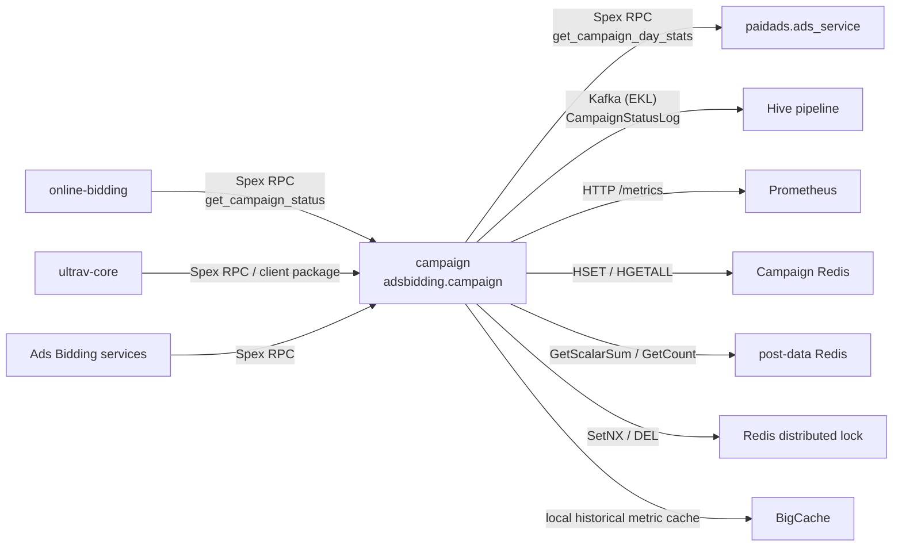

<!-- ads-workspace-gdoc-sync: gdoc_id=1Fhj0PaqcCkfqUaX0N79zliZN8nUDCPa5-bc2qrNBVAc gdoc_url=https://docs.google.com/document/d/1Fhj0PaqcCkfqUaX0N79zliZN8nUDCPa5-bc2qrNBVAc/edit -->

# campaign

`campaign` is the campaign status service for Ads Bidding. Its Spex service name is `adsbidding.campaign`. The service produces the current `CampSurgeLevel`, `AutoCampLevel`, `Boost`, `AutoCampStartTime`, `PreviousAutoCampLevel`, and `NextLocalCampLevel` for each country, so online bidding and coefficient computation paths can consume a single campaign status source.

The Go module is `git.garena.com/shopee/deep/paidads-bidding/campaign`, using Go `1.24.5`. Repository: [https://git.garena.com/shopee/deep/paidads-bidding/campaign](https://git.garena.com/shopee/deep/paidads-bidding/campaign).

## Table of Contents

- [Introduction](#introduction)
- [Features](#features)
- [Architecture](#architecture)
- [Directory Structure](#directory-structure)
- [Spex API](#spex-api)
- [Core Pipeline](#core-pipeline)
- [Strategy Algorithm](#strategy-algorithm)
- [Storage and Cache](#storage-and-cache)
- [Configuration](#configuration)
- [Build and Deployment](#build-and-deployment)
- [Client and Tools](#client-and-tools)
- [Development Guidelines](#development-guidelines)
- [Monitoring](#monitoring)
- [Business Terminology Glossary](#business-terminology-glossary)
- [Additional Resources](#additional-resources)
- [Frequently Asked Questions](#frequently-asked-questions)

## Introduction

`campaign` merges external campaign configuration and real-time posterior metrics into stable campaign status:

1. Sync local campaign configuration for the next 5 days from `paidads.ads_service.get_campaign_day_stats`.
2. Run `AutoCampV1` every minute using organic `GMV` / `ORDER` metrics from post-data.
3. Merge the real-time strategy result, local configuration, and previous hourly slot while keeping `AutoCampLevel` monotonic within a day.
4. Persist final status into daily and hourly slot keys in Campaign Redis.
5. Publish `CampaignStatusLog` protobuf messages to a Hive Kafka topic for offline analysis.
6. Expose `adsbidding.campaign.get_campaign_status` as the Spex RPC API.

## Features

| Feature | Entry | Description |
| --- | --- | --- |
| Campaign status query | `pkg/campaign/spex.go` | Registers `adsbidding.campaign.get_campaign_status`, supporting single-country and `all_country` queries |
| Local campaign config sync | `pkg/campaign/local_config.go` | Fetches next-5-day `is_campaign_surge` and `boost_factor` from `paidads.ads_service` |
| AutoCampV1 strategy | `pkg/campaign/strategy/auto_camp_v1.go` | Predicts today's campaign tier using 60 days of daily/hourly `GMV` and hourly `ORDER` |
| Redis status storage | `pkg/data/campaign_cli/campaign_client.go` | Writes current-day status and hourly slot status with a 7-day TTL |
| Cross-day status guard | `pkg/campaign/run.go` | Writes next-day local config around 23:59 in the country timezone |
| Monitoring and health check | `pkg/exporter`, `pkg/util/http_common` | Exposes `/metrics`, `/ping`, and `/log/{level}` |
| Client-side cache | `client/client.go` | Lets downstream services refresh and cache all-country campaign status every minute |

## Architecture

### System Context

The service starts from `server/main.go`:

```text
InitLogger
  -> Spex FastInitSpex(adsbidding.campaign)
  -> SetConfig(config)
  -> SetCampaignDatesConfig(campaign_dates)
  -> config_redis.NewBaseConfigClient(CommonConfigCenterAddress, BusinessConfigCenterAddress)
  -> post_data_client.NewWithSpex(PostDataSpex, postDataConfigClient)
  -> campaign.New(postDataRedisCli, CampaignRedis, HiveKafkaConfig)
  -> campaignSvc.Start()
  -> HTTP server: /ping, /metrics, /log/{level}
```

`campaign.New` wires runtime dependencies:

- `cache.New(postDataReader)`: reads post-data metrics and caches historical-day data with `BigCache`.
- `redisutil.New(campaignCfg)`: Campaign Redis for status and distributed locks.
- `kafka.NewProducer(hiveKafkaCfg)`: Hive Kafka producer for `CampaignStatusLog`.
- `campaign_cli.New`: Redis status read/write client.
- `lock.NewLocker`: Redis `SetNX` based distributed lock.

Background scheduling is managed by `pkg/campaign/run.go`:

- Run `syncLocalConfig` at startup.
- Refresh local campaign config every hour.
- Run `runStrategy` for every configured country every minute.
- Check the 23:59 cross-day write window every 50 seconds.

### Service Topology



| Type | Name | Protocol | Description |
| --- | --- | --- | --- |
| Upstream | `online-bidding` | Spex RPC | Queries current campaign status for bidding, boost, and campaign surge decisions |
| Upstream | `ultrav-core` | Spex RPC / client package | Periodically loads `CampaignStatus` for strategy execution |
| Upstream | Ads Bidding services | Spex RPC | Query one country or all countries with `CampaignRequest` |
| Downstream | `paidads.ads_service` | Spex RPC | Provides next-5-day local campaign configuration |
| Downstream | Hive pipeline | Kafka (EKL) | Consumes `CampaignStatusLog` for offline analysis |
| Downstream | Prometheus | HTTP `/metrics` | Scrapes `paidads_ads_bidding_campaign_*` metrics |
| Dependency | Campaign Redis | Redis | Stores campaign status, hourly slots, and distributed locks |
| Dependency | post-data Redis | Redis / post_data_client | Provides organic `GMV` and `ORDER` posterior metrics |
| Dependency | BigCache | in-process cache | Caches historical post-data metrics |
| Dependency | Spex Config Center | Spex config | Hot-reloads `config` and `campaign_dates` |

### Data Flow

```text
paidads.ads_service
  -> syncLocalConfig
  -> localConfig[country][yyyymmdd]

post-data Redis
  -> cache.GetDailyStats / GetLastNdaysHourlyStats
  -> AutoCampV1
  -> newAutoCampLevel + boost

current Redis status + prev slot + localConfig + AutoCampV1
  -> merge rules
  -> SetCampaignDateStatus + SetCampaignSlotStatus
  -> CampaignStatusLog -> Kafka
```

## Directory Structure

```text
.
├── client/                         # Client-side campaign status cache for downstream services
├── config/                         # Spex config structs and hot reload
├── deploy/                         # Deployment configuration
├── idl/pb/                         # Hive CampaignStatusLog proto
├── pkg/
│   ├── cache/                      # post-data metric reads and BigCache
│   ├── campaign/                   # Main service, scheduling, merge logic, Spex handler
│   ├── data/campaign_cli/          # Campaign Redis status client
│   ├── data/queue/kafka/           # EKL Kafka producer
│   ├── exporter/                   # Prometheus metrics
│   ├── handler/                    # Legacy/standby Gin + Spex handler, not enabled by main
│   ├── lock/                       # Redis distributed lock
│   └── util/                       # Logging, time helpers, HTTP endpoints, status conversion
├── server/                         # Service entrypoint
├── sp_proto/                       # Public Spex proto
├── tools/import/                   # CSV metric import tool
├── types/                          # Status struct, CampaignLevel, Redis keys
├── Makefile
├── go.mod
└── sp-workspace.yml
```

## Spex API

### RPC Method

The active service registers this command in `pkg/campaign/spex.go`:

| Command | Request | Response |
| --- | --- | --- |
| `adsbidding.campaign.get_campaign_status` | `CampaignRequest` | `CampaignResponse` |

`pkg/handler` contains Gin HTTP and Spex handler implementations, but `server/main.go` comments out that startup path. The active path is under `pkg/campaign`.

### Request and Response

`sp_proto/adsbidding/campaign.proto` defines:

| Message | Field | Description |
| --- | --- | --- |
| `CampaignRequest` | `requester` | Caller identifier used as a handler metric label |
| `CampaignRequest` | `country` | Query a single country |
| `CampaignRequest` | `all_country` | If true, ignore `country` and return all countries in `config.AppConfig.Countries` |
| `CampaignResponse` | `country_campaign` | `map<string, Status>`, keyed by country |

### Status Fields

| Field | Description |
| --- | --- |
| `camp_surge_level` | Campaign surge status for seller-center display: `NO_CAMPAIGN`, `CAMPAIGN_SURGE`, or `PRE_CAMPAIGN_SURGE` |
| `auto_camp_level` | Auto campaign tier: `NO_CAMPAIGN`, `TIER1`, or `TIER2` |
| `boost` | Local boost or calculated strategy ratio |
| `auto_camp_start_time` | Unix timestamp when the current `auto_camp_level` started |
| `previous_auto_camp_level` | Previous `AutoCampLevel` before the current tier |
| `next_local_camp_level` | Date-to-local-`AutoCampLevel` map for upcoming dates |

### Error Codes

`Constant.ErrorCode` declares:

| Name | Value |
| --- | --- |
| `ERROR_INTERNAL_ERROR` | `1670800000` |
| `ERROR_INVALID_COUNTRY` | `1670800001` |

The current handler mainly returns Spex body error for request/response type mismatch; otherwise the business path returns `0`.

## Core Pipeline

### Service Startup

`server/main.go` initializes logging, Spex, dynamic config, and external dependencies. `campaignSvc.Start()` registers the Spex processor and starts background jobs. The HTTP server listens on `PORT_HTTP` and registers `/ping`, `/metrics`, and `/log/{debug|info|fatal}`.

### Local Campaign Config Sync

`syncLocalConfig` runs every hour:

1. Iterate over `config.AppConfig.Countries`.
2. Call `getLocalCampaignDatesConfig(country, now)`.
3. Request `paidads.ads_service.get_campaign_day_stats` for the next 5 dates starting from today.
4. Convert `boost_factor` to `Boost`, and `is_campaign_surge` to `CampSurgeLevel`.
5. Build `map[string]types.Status` by date and assign it to `s.localConfig[country]`.

`transformLocalConfigs` also fills a 3-day `NextLocalCampLevel` view. If a date has `is_campaign_surge=true`, that date becomes `CAMPAIGN_SURGE`, and the previous one to two days become `PRE_CAMPAIGN_SURGE`.

### AutoCampV1 Strategy

`runStrategy(country)` runs every minute:

1. Acquire `lock:auto_camp_{country}` with a 10-minute TTL.
2. Read current-day Redis status.
3. Read today's local config.
4. If it is hour 0 and local `Boost > 0`, use local config directly.
5. Read previous hourly slot status.
6. Create and run `AutoCampV1`.
7. Merge previous slot, local config, and strategy result.
8. Write daily status and current hourly slot.
9. Marshal `CampaignStatusLog` and publish it to Kafka.

If `AutoCampV1` creation or execution fails, the service writes local config as fallback. If current status fetch or local config lookup fails, it releases the lock and returns an error.

### Status Merge and Persistence

Merge rules in `pkg/campaign/run.go`:

- `AutoCampLevel` only rises within one day. If the previous hourly slot has a higher level than the new strategy result, reuse the previous slot's level and boost.
- Local config has priority. If local `AutoCampLevel` is higher than the real-time strategy result, use the local level.
- If the new level equals the current Redis level, continue `AutoCampStartTime` and `PreviousAutoCampLevel`.
- If the level changes, use the current time as the new `AutoCampStartTime` and record the current Redis level as `PreviousAutoCampLevel`.

Persistence writes two records:

- `campaign_status_v1:{country}`: current daily status.
- `daily_timeslot_campaign_status_v1:{country}_{yyyymmddhh}`: hourly slot status.

### Last Minute Config Job

`setLastMinuteConfig` runs after `23:59` in each country timezone. It reads the next day's local config, inherits the current status's start/previous semantics, and writes the status before the day boundary. This reduces the chance of empty status or temporary level fallback around midnight.

## Strategy Algorithm

### Inputs

`AutoCampV1` uses a 60-day window:

- daily `GMV`
- hourly `GMV`
- hourly `ORDER`

Metrics come from `post_data_client`, grouped by `country` and `ORGANIC` traffic type. Current-day metrics are always read live; historical-day metrics are cached in `BigCache`.

`verifyData` requires non-empty daily/hourly data and at least 31 positive daily `GMV` values within the 60-day window.

### Date Labeling

For each offset, the strategy uses the minimum-14-day average among the following 30 daily `GMV` values as baseline:

```text
ratio = dailyGMV[offset] / min14AvgGMVInNext30Days
```

Label rules:

| Condition | Label |
| --- | --- |
| `ratio >= 1.5` and no 20:00 spike | `campDates` |
| `ratio >= 1.5` and `GMV20 / GMV19 >= 2` | `specialDates` |
| Otherwise | `nonCampDates` |

### Hourly ORDER Distribution

By default, the strategy uses hourly `ORDER` percentages from recent normal dates. If today's 00:00 `GMV` reaches `2.7` times the minimum-14-day average of 23:00 `GMV` from the past 30 days, it switches to historical campaign dates. If today's 20:00 spike appears, predictions after 20:00 use special-date hourly `ORDER` percentages.

### GMV Prediction

The strategy computes two full-day `GMV` estimates:

- Sliding window: `current-hour GMV / current-hour ORDER percentage`
- Cumulative window: `cumulative GMV / cumulative ORDER percentage`

Then it blends future-hour and full-day estimates with `K1` / `K2`:

```text
mixedDailyGMV = cumulativeGMV + (K1 * slidingEstGMV + K2 * cumulativeEstGMV) * postTotalOrderPct
```

### Tier Classification

```text
ratio = min(predDailyGMV / max(min14DayAvgGMV, 0.01), 10)
```

| Condition | Output |
| --- | --- |
| `ratio >= Tier1SurgeThreshold.GmvRatioTheshold` | `TIER1` |
| `ratio >= Tier2SurgeThreshold.GmvRatioTheshold` | `TIER2` |
| Otherwise | `NO_CAMPAIGN` |

### Fallback and Monotonic Rule

If the real-time strategy fails, local config is used as fallback. Within one day, if the previous hour already reached a higher tier, the service will not lower `AutoCampLevel`. A higher local-config tier also overrides a lower real-time strategy tier.

## Storage and Cache

### Campaign Redis Keys

| Key | Content | TTL |
| --- | --- | --- |
| `campaign_status_v1:{country}` | Current daily `Status` for the country | 7 days |
| `daily_timeslot_campaign_status_v1:{country}_{yyyymmddhh}` | Hourly slot `Status` | 7 days |
| `lock:auto_camp_{country}` | Per-minute strategy execution lock | 10 minutes |
| `lock:set_last_minute_config_{country}` | 23:59 cross-day write lock | 5 minutes |

`next_local_camp_level` is stored as a comma-separated `date:level,date:level` string in the Redis hash and parsed back into a map on read.

### post-data Metric Read

`pkg/cache/cache.go` reads through `post_data_client.Reader`:

| Metric | Read method |
| --- | --- |
| `GMV` / `GMV_UA` | `GetScalarSum` |
| `ORDER` | `GetCount` |

The time level is controlled by `PostDataTimeLevel_Daily` and `PostDataTimeLevel_Hourly`.

### BigCache Local Cache

Historical metrics are cached in `BigCache`:

| Config | Value |
| --- | --- |
| `Shards` | `1024` |
| `LifeWindow` | `62` days |
| `CleanWindow` | `1` hour |
| `HardMaxCacheSize` | `4098` |

Current-day metrics are not cached, so the strategy sees the latest posterior metrics every minute.

### Distributed Lock

Locks use Redis `SetNX`. Failure paths call `Unlock`; success paths rely on TTL expiration. This avoids repeated status overwrites by other instances shortly after a successful run.

## Configuration

### AppConfig Overview

`config/app.go` defines `Campaign`, loaded and hot-reloaded from Spex config key `adsbidding_campaign/config`:

| Field | Description |
| --- | --- |
| `campaign_redis` | Redis for campaign status and locks |
| `stats_redis` | Legacy stats Redis field; not directly used by the active path |
| `countries` | Countries for strategy execution and all-country queries |
| `hive_kafka_config` | Kafka producer config for `CampaignStatusLog` |
| `common_config_center_address` | Config Center address for post-data common config (used by `config_redis.NewBaseConfigClient`) |
| `business_config_center_address` | Config Center address for post-data business config (used by `config_redis.NewBaseConfigClient`) |
| `post_data_spex` | Spex config for initializing the post-data client (`post_data_client.NewWithSpex`) |
| `tier1_surge_threshold` | `TIER1` threshold |
| `tier2_surge_threshold` | `TIER2` threshold |
| `tier3_surge_threshold` | Reserved threshold, not used by current `AutoCampV1` |
| `k1` / `k2` | Sliding / cumulative prediction blend weights |

### campaign_dates Override

`config/campaign.go` loads `CampaignDatesConfig` from Spex config key `adsbidding_campaign/campaign_dates`. When `CampaignDatesConfig.Enable` is true, the query path returns `Dates[country][date]` from config directly instead of reading the real-time result from Campaign Redis.

Note: the current code uses JSON tag `enabble` for `Enable`; the config field must match the code tag.

### Thresholds and Blend Weights

`SurgeThreshold` uses `gmv_ratio_threshold`. `AutoCampV1` maps the calculated `ratio` to tiers through these thresholds. `K1` and `K2` control the blend between sliding-window and cumulative-window prediction.

### Kafka Config

`HiveKafkaConfig` contains:

| Field | Description |
| --- | --- |
| `brokers` | Kafka broker list |
| `topics` | Producer topic list |
| `user` | SASL user |
| `password` | SASL password |

Actual passwords and tokens must not be written into docs or logs.

### SPEX and spcli Setup

The service initializes `adsbidding.campaign` with `spex.FastInitSpex` and loads remote config through `spex.InitConfig`. `sp-workspace.yml` declares code generation from `sp_proto` to `protobuf/proto/gen`, with dependency on `paidads.ads_service` `master` topic.

## Build and Deployment

### Makefile Targets

| Target | Description |
| --- | --- |
| `make svc` | `go build -o bin/campaign server/*.go` |
| `make fmt` | `go fmt ./...` |
| `make vet` | `go vet ./...` |
| `make proto` | Generate Go proto under `idl/pb` |
| `make unittest` | `go test -cover ./...` |
| `make ci` | Run vet, format check, and unit tests |
| `make debug/info/fatal` | Change log level through `/log/{level}` |
| `make metrics` | Fetch `/metrics` from the current HTTP port |

### Deploy JSON

`deploy/campaign.json` describes deployment behavior:

| Field | Value |
| --- | --- |
| `project_name` | `adsbidding` |
| `module_name` | `campaign` |
| `debug` | `true` |
| build command | `make svc` |
| base image | `golang-base:1.24.5-24` |
| run command | `./bin/campaign` |
| smoke/check endpoint | `/ping` |
| Prometheus | enabled |
| Spex config key fetch | enabled |

CI uses `harbor.shopeemobile.com/shopee/golang-base:1.24.5-24` and runs `make ci`.

### Local Debugging

Local execution requires reachable Spex, Config, Redis, and Kafka dependencies. The repository does not provide a complete local mock bootstrap script. For static validation, run:

```bash
make fmt
make vet
make unittest
```

For Spex code generation, use the spcli / Spex toolchain configured by `sp-workspace.yml`.

## Client and Tools

### campaign/client

`client.New(requester)` fetches all-country status with `all_country=true` at startup and refreshes the local map every minute. `GetCampaignStatus(country)` reads the cached `Status`. Callers must apply command access and initialize Spex before using the client.

### tools/import

`tools/import` imports daily/hourly `GMV` and `ORDER` from CSV into post-data formatted Redis keys. It is useful for historical metric backfill or local strategy validation. Pass the Redis address and input file through command-line flags; do not rely on the default address in source code.

## Development Guidelines

### How to Add a New Strategy

New strategies should implement `pkg/campaign/strategy.Strategy`:

```go
type Strategy interface {
    Run() error
    GetResult() (types.CampaignLevel, float64)
}
```

Wire the strategy at the `AutoCampaignV1` creation point in `runStrategy`. If the strategy needs offline traceability, extend `idl/pb/campaign_status.proto` or add log fields.

### How to Add a New Status Field

At minimum, update:

- `types.Status`
- Redis tags and `status2Map`
- `GetCampaignDateStatus` / `GetCampaignSlotStatus` parsing
- `sp_proto/adsbidding/campaign.proto`
- `idl/pb/campaign_status.proto`
- `util.ConvertStatus` / `util.ConvertStatusByIdl`
- downstream `client` consumption

### Error Handling

Important error paths:

- Spex config initialization failure: service startup fails.
- Local config sync failure: startup fails; periodic sync reports metrics and keeps the previous config.
- `AutoCampV1` creation or execution failure: write local config as fallback.
- Redis write failure: report `set_status` error and return.
- Kafka send failure: log the error; Redis status write is not rolled back.

### Unit Testing Standards

Only `pkg/util/time_test.go` currently covers utility functions. Recommended additions:

- Table-driven tests for `AutoCampV1` date labeling.
- Hourly `ORDER` distribution selection tests.
- Sliding/cumulative/mixed `GMV` prediction tests.
- Redis `Status` serialization and `next_local_camp_level` parsing tests.
- `transformLocalConfigs` tests for `CAMPAIGN_SURGE` / `PRE_CAMPAIGN_SURGE`.

### Code Review & Git Workflow

Before submitting changes, run:

```bash
make ci
```

The CI pipeline (`GOFLAGS: "-ldflags=-checklinkname=0"` is set globally to satisfy Go 1.24 link-name checks) runs two stages:

- `test` — executes `make ci` on every push.
- `notify` — fires only on tags matching `campaign-v<major>.<minor>.<patch>*`; clones `release-aegis` and sends a Seatalk release notification.

For proto, config schema, Redis key, or public `Status` changes, also check downstream callers and Hive consumers.

## Monitoring

### Prometheus Metrics

Metric namespace is `paidads`; subsystem is `ads_bidding_campaign`.

| Metric | Labels | Description |
| --- | --- | --- |
| `event_count` | `country, component, type` | Event counter |
| `error` | `country, component, err` | Error counter |
| `latency` | `country, component, type` | Latency summary |
| `gauge` | `country, component, type` | Status gauge |

Common component/type values:

- `run_strategy`: `begin`, `success`, `use_local_config`
- `lock_acquire`: `success`, `fail`
- `set_status`: `date`, `slot`
- `get_campaign_status_handler`
- `set_last_minute_config`
- `auto_camp_status`: `auto_camp_level`, `boost`, `prev_auto_camp_level`

### Logs and Trace

`runStrategy` records `timestamp`, `pod_ip`, `date`, `hour`, `current_status`, `local_status`, `prev_slot_status`, strategy intermediate values, and final `reason` in `TraceLog`. `CampaignStatusLog` publishes final status, local config, previous hourly status, current status, and `AutoCampV1` details to Kafka.

### HTTP Endpoints

| Endpoint | Description |
| --- | --- |
| `/ping` | Health check with hostname, start time, and uptime |
| `/metrics` | Prometheus metrics |
| `/log/debug` | Switch to debug log level |
| `/log/info` | Switch to info log level |
| `/log/fatal` | Switch to fatal log level |

`http_common.MuxAll(http.DefaultServeMux)` does not register pprof handlers when using `http.DefaultServeMux`.

## Business Terminology Glossary

| Term | Description |
| --- | --- |
| `CampSurgeLevel` | Campaign surge status for display and operation semantics |
| `AutoCampLevel` | Auto campaign tier from local config or real-time GMV prediction |
| `Boost` | Campaign strength or calculated strategy ratio |
| `TIER1` / `TIER2` | High / middle auto campaign tier |
| `NO_CAMPAIGN` | No auto campaign state |
| `CAMPAIGN_SURGE` | The current date is a campaign surge date |
| `PRE_CAMPAIGN_SURGE` | One of the next one to two days is a campaign surge date |
| `post-data` | Shared posterior metric read capability for Ads Bidding |
| `BigCache` | In-process historical metric cache |
| `EKL` | enhanced-kafka-lib, used by the Kafka producer |

## Additional Resources

- Repository: [https://git.garena.com/shopee/deep/paidads-bidding/campaign](https://git.garena.com/shopee/deep/paidads-bidding/campaign)
- New Campaign Service TD: [https://docs.google.com/document/d/1qWSqnPCpx0Bg10ibeTezn9NhDjCOMGPvojzvJh4LyzQ/edit?tab=t.0](https://docs.google.com/document/d/1qWSqnPCpx0Bg10ibeTezn9NhDjCOMGPvojzvJh4LyzQ/edit?tab=t.0)
- Campaign Service: [https://docs.google.com/document/d/15c7zUxwDiJcSJZZZWF7dohssi9dYW0xYqxJYv4fY-WQ/edit?tab=t.0](https://docs.google.com/document/d/15c7zUxwDiJcSJZZZWF7dohssi9dYW0xYqxJYv4fY-WQ/edit?tab=t.0)
- Spex Go SDK: [https://spex.shopee.io/overview/quick-start/languages/go/index.html](https://spex.shopee.io/overview/quick-start/languages/go/index.html)
- spcli setup: [https://spex.shopee.io/user-guide/SDK/Java/local.html](https://spex.shopee.io/user-guide/SDK/Java/local.html)

## Frequently Asked Questions

### How do I query one country's status?

Call `adsbidding.campaign.get_campaign_status` with `CampaignRequest{country: "SG"}`. If using this repository's `client` package, `GetCampaignStatus(country)` reads the local cache refreshed every minute.

### What does `all_country=true` return?

It returns status for all countries in `config.AppConfig.Countries`, keyed by country.

### What is the difference between `AutoCampLevel` and `CampSurgeLevel`?

`AutoCampLevel` is the automatic campaign tier, such as `TIER1` or `TIER2`. `CampSurgeLevel` represents campaign surge or pre-campaign surge and mainly comes from local campaign config.

### Why is the level monotonic within one day?

`runStrategy` compares the previous hourly slot's `AutoCampLevel` with the new strategy result. If the previous hour is higher, it reuses the previous level to avoid frequent downstream bidding changes caused by short-term metric fluctuation.

### What happens when post-data is missing?

If `AutoCampV1` cannot produce a result because of missing or invalid data, the service writes local config as fallback and reports error metrics.

### How does `campaign_dates` override real-time computation?

When `CampaignDatesConfig.Enable` is true, the query API returns `Dates[country][date]` from config directly and does not read the real-time result from Campaign Redis.

### What is the 23:59 job for?

It writes the next day's local config into current status before the day boundary and inherits the required start/previous fields. This reduces the risk of empty status or temporary level fallback around midnight.

### What must be changed when adding a `Status` field?

Update the Go struct, Redis serialization, Spex proto, Hive log proto, status conversion helpers, and downstream client. See [How to Add a New Status Field](#how-to-add-a-new-status-field).

### How do I debug a strategy misclassification?

Check `run_strategy` trace logs and `CampaignStatusLog.StrategyKeyValue` in Hive. Focus on daily/hourly `GMV`, hourly `ORDER`, date labels, `pred_daily_gmv`, `min14_day_avg_gmv`, `calculated_ratio`, and final tier.

### Where can I inspect Kafka/Hive strategy details?

`setStatus` marshals and sends `CampaignStatusLog` through the Hive Kafka producer. The log schema is defined in `idl/pb/campaign_status.proto` and includes final status, local config, previous slot, current status, and strategy intermediate values.

<!-- Generated by ads-workspace/skills/ads-readme-generate | checked: d1903be3f5e1b597bd583eeaeeb1e84615d4e558 | spec: 76fce5f679f9550b -->
