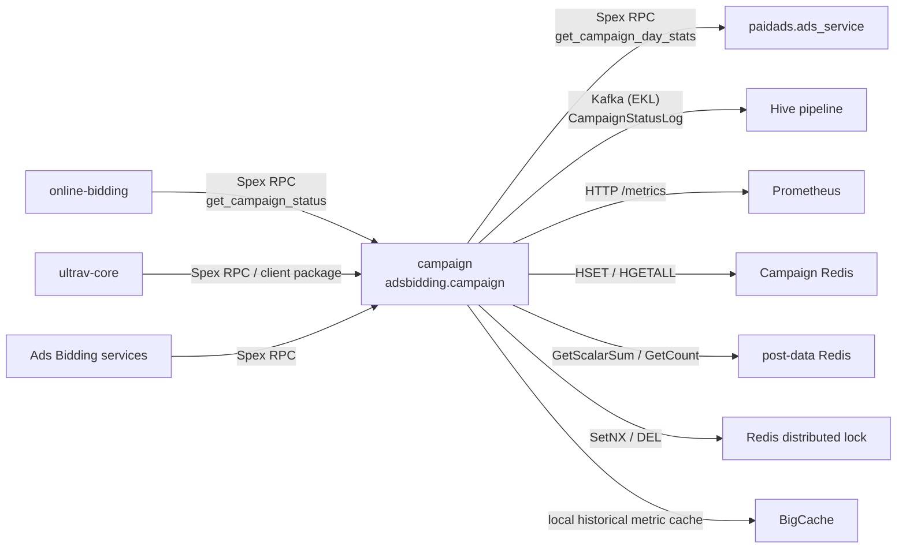

<!-- ads-workspace-gdoc-sync: gdoc_id=1Pd9QwCzu3ww6Zm8O8bouDuq3Ha5VWYTHIhqSYjcY59c gdoc_url=https://docs.google.com/document/d/1Pd9QwCzu3ww6Zm8O8bouDuq3Ha5VWYTHIhqSYjcY59c/edit -->

# campaign

`campaign` 是 Ads Bidding 的 campaign 状态服务，服务名为 `adsbidding.campaign`。它统一产出各 country 当前的 `CampSurgeLevel`、`AutoCampLevel`、`Boost`、`AutoCampStartTime`、`PreviousAutoCampLevel` 和 `NextLocalCampLevel`，供在线竞价和出价系数计算链路查询。

Go module 为 `git.garena.com/shopee/deep/paidads-bidding/campaign`，Go 版本为 `1.24.5`。仓库地址：[https://git.garena.com/shopee/deep/paidads-bidding/campaign](https://git.garena.com/shopee/deep/paidads-bidding/campaign)。

## 目录

- [项目概述](#项目概述)
- [核心功能](#核心功能)
- [项目架构](#项目架构)
- [目录结构](#目录结构)
- [Spex API 定义](#spex-api-定义)
- [核心流程](#核心流程)
- [策略算法](#策略算法)
- [存储与缓存](#存储与缓存)
- [配置体系](#配置体系)
- [构建与部署](#构建与部署)
- [客户端与工具](#客户端与工具)
- [开发规范](#开发规范)
- [监控](#监控)
- [业务术语表](#业务术语表)
- [参考资料](#参考资料)
- [常见问题](#常见问题)

## 项目概述

`campaign` 的核心任务是把外部活动配置和实时后验数据合并为一个稳定的 campaign status：

1. 从 `paidads.ads_service.get_campaign_day_stats` 同步未来 5 天 local campaign 配置。
2. 每分钟基于 post-data 中的 organic `GMV` / `ORDER` 统计运行 `AutoCampV1`。
3. 合并实时策略、local 配置和上一小时状态，保证同一天内 `AutoCampLevel` 只升不降。
4. 将最终状态写入 Campaign Redis 的日级 key 与小时 slot key。
5. 将 `CampaignStatusLog` protobuf 投递到 Hive Kafka topic，保留策略明细供离线分析。
6. 对外提供 `adsbidding.campaign.get_campaign_status` Spex RPC。

## 核心功能

| 功能 | 入口 | 说明 |
| --- | --- | --- |
| Campaign status 查询 | `pkg/campaign/spex.go` | 注册 `adsbidding.campaign.get_campaign_status`，支持单 country 或 `all_country` 查询 |
| Local campaign config 同步 | `pkg/campaign/local_config.go` | 从 `paidads.ads_service` 拉取未来 5 天 `is_campaign_surge` 与 `boost_factor` |
| AutoCampV1 策略 | `pkg/campaign/strategy/auto_camp_v1.go` | 用 60 天 daily/hourly `GMV` 与 hourly `ORDER` 预测当天活动 tier |
| Redis 状态存储 | `pkg/data/campaign_cli/campaign_client.go` | 写入当前日状态和小时级 slot 状态，TTL 为 7 天 |
| 跨天状态保护 | `pkg/campaign/run.go` | country 本地时间 23:59 后将次日 local config 预写入当前状态 |
| 监控与健康检查 | `pkg/exporter`、`pkg/util/http_common` | 暴露 `/metrics`、`/ping`、`/log/{level}` |
| 客户端缓存 | `client/client.go` | 下游服务可每分钟拉取并缓存全 country campaign status |

## 项目架构

### 系统上下文

服务启动入口是 `server/main.go`：

```text
InitLogger
  -> Spex FastInitSpex(adsbidding.campaign)
  -> SetConfig(config)
  -> SetCampaignDatesConfig(campaign_dates)
  -> config_redis.NewBaseConfigClient(CommonConfigCenterAddress, BusinessConfigCenterAddress)
  -> post_data_client.NewWithSpex(PostDataSpex, postDataConfigClient)
  -> campaign.New(postDataRedisCli, CampaignRedis, HiveKafkaConfig)
  -> campaignSvc.Start()
  -> HTTP server: /ping, /metrics, /log/{level}
```

`campaign.New` 组装运行时依赖：

- `cache.New(postDataReader)`：读取 post-data 指标，并用 `BigCache` 缓存历史日数据。
- `redisutil.New(campaignCfg)`：Campaign Redis，存状态和分布式锁。
- `kafka.NewProducer(hiveKafkaCfg)`：Hive Kafka producer，写 `CampaignStatusLog`。
- `campaign_cli.New`：Redis 状态读写客户端。
- `lock.NewLocker`：基于 Redis `SetNX` 的分布式锁。

后台调度由 `pkg/campaign/run.go` 管理：

- 启动时先 `syncLocalConfig`。
- 每小时刷新 local campaign config。
- 每分钟对 `config.AppConfig.Countries` 中每个 country 执行 `runStrategy`。
- 每 50 秒检查一次是否进入 23:59 跨天写入窗口。

### 上下游调用拓扑



| 类型 | 名称 | 协议 | 说明 |
| --- | --- | --- | --- |
| 上游 | `online-bidding` | Spex RPC | 查询当前 campaign 状态，用于出价、boost 和 campaign surge 决策 |
| 上游 | `ultrav-core` | Spex RPC / client package | 周期拉取 `CampaignStatus`，用于策略执行中的活动状态判断 |
| 上游 | Ads Bidding services | Spex RPC | 通过 `CampaignRequest` 查询单 country 或全 country 状态 |
| 下游 | `paidads.ads_service` | Spex RPC | 提供未来 5 天 local campaign 配置 |
| 下游 | Hive pipeline | Kafka (EKL) | 接收 `CampaignStatusLog`，用于离线分析 |
| 下游 | Prometheus | HTTP `/metrics` | 采集 `paidads_ads_bidding_campaign_*` 指标 |
| 依赖 | Campaign Redis | Redis | 存储 campaign status、小时 slot 和分布式锁 |
| 依赖 | post-data Redis | Redis / post_data_client | 读取 organic `GMV` 与 `ORDER` 后验统计 |
| 依赖 | BigCache | in-process cache | 缓存历史日 post-data 指标 |
| 依赖 | Spex Config Center | Spex config | 热更新 `config` 和 `campaign_dates` |

### 数据流

```text
paidads.ads_service
  -> syncLocalConfig
  -> localConfig[country][yyyymmdd]

post-data Redis
  -> cache.GetDailyStats / GetLastNdaysHourlyStats
  -> AutoCampV1
  -> newAutoCampLevel + boost

current Redis status + prev slot + localConfig + AutoCampV1
  -> merge rules
  -> SetCampaignDateStatus + SetCampaignSlotStatus
  -> CampaignStatusLog -> Kafka
```

## 目录结构

```text
.
├── client/                         # 下游使用的 campaign status 客户端
├── config/                         # Spex config 结构与热更新
├── deploy/                         # 发布配置
├── idl/pb/                         # Hive CampaignStatusLog proto
├── pkg/
│   ├── cache/                      # post-data 指标读取与 BigCache
│   ├── campaign/                   # 主服务、调度、策略合并、Spex handler
│   ├── data/campaign_cli/          # Campaign Redis 状态读写
│   ├── data/queue/kafka/           # EKL Kafka producer
│   ├── exporter/                   # Prometheus 指标
│   ├── handler/                    # 旧/备用 Gin + Spex handler，当前 main 中未启用
│   ├── lock/                       # Redis 分布式锁
│   └── util/                       # 日志、时间、HTTP endpoint、状态转换
├── server/                         # 服务入口 main.go
├── sp_proto/                       # 对外 Spex proto
├── tools/import/                   # CSV 指标导入工具
├── types/                          # 状态结构、CampaignLevel、Redis key
├── Makefile
├── go.mod
└── sp-workspace.yml
```

## Spex API 定义

### RPC 方法

当前主服务在 `pkg/campaign/spex.go` 注册：

| Command | Request | Response |
| --- | --- | --- |
| `adsbidding.campaign.get_campaign_status` | `CampaignRequest` | `CampaignResponse` |

`pkg/handler` 下还有 Gin HTTP 与 Spex handler 实现，但 `server/main.go` 中相关启动代码已注释，当前主路径是 `pkg/campaign`。

### 请求与响应

`sp_proto/adsbidding/campaign.proto` 定义：

| Message | 字段 | 说明 |
| --- | --- | --- |
| `CampaignRequest` | `requester` | 调用方标识，用于 handler 监控 label |
| `CampaignRequest` | `country` | 查询单个 country |
| `CampaignRequest` | `all_country` | 为 `true` 时忽略 `country`，返回 `config.AppConfig.Countries` 中所有 country |
| `CampaignResponse` | `country_campaign` | `map<string, Status>`，key 为 country |

### 状态字段

| 字段 | 说明 |
| --- | --- |
| `camp_surge_level` | 用于 seller center 展示的 campaign surge 状态，取值包括 `NO_CAMPAIGN`、`CAMPAIGN_SURGE`、`PRE_CAMPAIGN_SURGE` |
| `auto_camp_level` | Auto campaign tier，取值包括 `NO_CAMPAIGN`、`TIER1`、`TIER2` |
| `boost` | local boost 或策略计算出的活动强度 ratio |
| `auto_camp_start_time` | 当前 `auto_camp_level` 的起始 Unix 时间 |
| `previous_auto_camp_level` | 当前 tier 之前的 `AutoCampLevel` |
| `next_local_camp_level` | 未来日期到 local `AutoCampLevel` 的映射 |

### 错误码

`Constant.ErrorCode` 中声明了：

| 名称 | 值 |
| --- | --- |
| `ERROR_INTERNAL_ERROR` | `1670800000` |
| `ERROR_INVALID_COUNTRY` | `1670800001` |

当前 handler 主要在请求/响应类型不匹配时返回 Spex body error，否则业务路径返回 `0`。

## 核心流程

### 服务启动

`server/main.go` 初始化日志、Spex、动态配置和外部依赖。`campaignSvc.Start()` 先注册 Spex processor，再启动后台 jobs。HTTP server 监听 `PORT_HTTP` 环境变量对应端口，注册 `/ping`、`/metrics`、`/log/{debug|info|fatal}`。

### Local Campaign Config 同步

`syncLocalConfig` 每小时执行一次：

1. 遍历 `config.AppConfig.Countries`。
2. 调用 `getLocalCampaignDatesConfig(country, now)`。
3. 请求 `paidads.ads_service.get_campaign_day_stats`，传入从今天开始的 5 个日期。
4. 将 `boost_factor` 转为 `Boost`，将 `is_campaign_surge` 转为 `CampSurgeLevel`。
5. 按 date 生成 `map[string]types.Status`，保存到 `s.localConfig[country]`。

`transformLocalConfigs` 还会填充未来 3 天的 `NextLocalCampLevel`。若某天 `is_campaign_surge=true`，当天为 `CAMPAIGN_SURGE`；其前 1-2 天会被标为 `PRE_CAMPAIGN_SURGE`。

### AutoCampV1 策略计算

`runStrategy(country)` 每分钟执行，核心步骤：

1. 获取 `lock:auto_camp_{country}`，TTL 为 10 分钟。
2. 读取当前日 Redis 状态。
3. 读取当天 local config。
4. 如果是 0 点小时且 local `Boost > 0`，直接使用 local config。
5. 读取上一小时 slot 状态。
6. 创建并运行 `AutoCampV1`。
7. 结合上一小时状态、local config 与策略结果。
8. 写入日级 status 和当前小时 slot。
9. 将 `CampaignStatusLog` marshal 后投递 Kafka。

创建或运行 `AutoCampV1` 失败时，服务使用 local config 兜底写入；读取当前状态失败或 local config 缺失时释放锁并返回错误。

### 状态合并与落库

合并规则在 `pkg/campaign/run.go`：

- 同一天内 `AutoCampLevel` 只升不降。如果上一小时 slot level 高于新策略结果，沿用上一小时 level 和 boost。
- local config 优先。如果 local `AutoCampLevel` 高于实时策略结果，采用 local level。
- 如果新 level 等于当前 Redis level，则延续 `AutoCampStartTime` 与 `PreviousAutoCampLevel`。
- 如果 level 发生变化，以当前时间作为新的 `AutoCampStartTime`，并把当前 Redis level 记录为 `PreviousAutoCampLevel`。

落库写两份：

- `campaign_status_v1:{country}`：当前日状态。
- `daily_timeslot_campaign_status_v1:{country}_{yyyymmddhh}`：小时 slot 状态。

### 23:59 跨天配置写入

`setLastMinuteConfig` 在 country 本地时间 `23:59` 后触发。它读取次日 local config，继承当前状态的 `PreviousAutoCampLevel` / `AutoCampStartTime` 语义后写入当前 Redis 状态，减少跨天时下游读取到空状态或短暂回落的风险。

## 策略算法

### 数据输入

`AutoCampV1` 使用 60 天窗口：

- daily `GMV`
- hourly `GMV`
- hourly `ORDER`

指标来自 `post_data_client`，group key 固定为 `country` + `ORGANIC` traffic type。当前日数据每次实时读取；历史日数据进入 `BigCache`。

`verifyData` 要求 daily/hourly 数据非空，并且 60 天 daily `GMV` 中至少 31 天大于 0。

### 日期标签

对每个 offset，策略取其后 30 天 daily `GMV` 中最低 14 天的均值作为 baseline：

```text
ratio = dailyGMV[offset] / min14AvgGMVInNext30Days
```

日期标签规则：

| 条件 | 标签 |
| --- | --- |
| `ratio >= 1.5` 且 20 点无突增 | `campDates` |
| `ratio >= 1.5` 且 20 点 `GMV20 / GMV19 >= 2` | `specialDates` |
| 其他 | `nonCampDates` |

### Hourly ORDER 分布

默认使用最近 normal dates 的 hourly `ORDER` 占比。如果当天 0 点 `GMV` 相比过去 30 天 23 点最低 14 天均值达到 `2.7` 倍，则改用历史 campaign dates。若当天 20 点出现突增，则 20 点后预测使用 special dates 的 hourly `ORDER` 占比。

### GMV 预测

策略同时计算两种全天 `GMV` 估计：

- Sliding window：`当前小时 GMV / 当前小时 ORDER 占比`
- Cumulative window：`累计 GMV / 累计 ORDER 占比`

然后用 `K1` / `K2` 混合估算后续小时和全天：

```text
mixedDailyGMV = cumulativeGMV + (K1 * slidingEstGMV + K2 * cumulativeEstGMV) * postTotalOrderPct
```

### Tier 判定

```text
ratio = min(predDailyGMV / max(min14DayAvgGMV, 0.01), 10)
```

| 条件 | 输出 |
| --- | --- |
| `ratio >= Tier1SurgeThreshold.GmvRatioTheshold` | `TIER1` |
| `ratio >= Tier2SurgeThreshold.GmvRatioTheshold` | `TIER2` |
| 其他 | `NO_CAMPAIGN` |

### 兜底与只升不降规则

实时策略失败时使用 local config 兜底。同一天内，如果上一小时已经达到更高 tier，当前策略不会将 `AutoCampLevel` 降回低 tier。local config 的 tier 也会覆盖更低的实时策略 tier。

## 存储与缓存

### Campaign Redis Keys

| Key | 内容 | TTL |
| --- | --- | --- |
| `campaign_status_v1:{country}` | 当前 country 的日级 `Status` | 7 天 |
| `daily_timeslot_campaign_status_v1:{country}_{yyyymmddhh}` | 小时级 slot `Status` | 7 天 |
| `lock:auto_camp_{country}` | 每分钟策略执行锁 | 10 分钟 |
| `lock:set_last_minute_config_{country}` | 23:59 跨天写入锁 | 5 分钟 |

`next_local_camp_level` 在 Redis hash 中以 `date:level,date:level` 字符串保存，读取时解析回 map。

### post-data 指标读取

`pkg/cache/cache.go` 通过 `post_data_client.Reader` 读取：

| Metric | 读取方式 |
| --- | --- |
| `GMV` / `GMV_UA` | `GetScalarSum` |
| `ORDER` | `GetCount` |

时间粒度通过 `PostDataTimeLevel_Daily` 和 `PostDataTimeLevel_Hourly` 控制。

### BigCache 本地缓存

历史日指标会进入 `BigCache`：

| 配置 | 值 |
| --- | --- |
| `Shards` | `1024` |
| `LifeWindow` | `62` 天 |
| `CleanWindow` | `1` 小时 |
| `HardMaxCacheSize` | `4098` |

当前日指标不缓存，保证策略每分钟都能看到最新后验数据。

### 分布式锁

锁实现为 Redis `SetNX`。失败路径会主动 `Unlock`，成功路径依赖 TTL 自然释放，避免其他实例短时间内重复覆盖刚写入的状态。

## 配置体系

### AppConfig 总览

`config/app.go` 的 `Campaign` 结构通过 Spex config key `adsbidding_campaign/config` 初始化并热更新：

| 字段 | 说明 |
| --- | --- |
| `campaign_redis` | Campaign status 与锁使用的 Redis |
| `stats_redis` | 旧统计 Redis 字段，当前主路径未直接使用 |
| `countries` | 需要执行策略和支持 all-country 查询的 country 列表 |
| `hive_kafka_config` | `CampaignStatusLog` Kafka producer 配置 |
| `common_config_center_address` | post-data common 配置所用 Config Center 地址（传给 `config_redis.NewBaseConfigClient`） |
| `business_config_center_address` | post-data business 配置所用 Config Center 地址（传给 `config_redis.NewBaseConfigClient`） |
| `post_data_spex` | 初始化 post-data 客户端的 Spex 配置（传给 `post_data_client.NewWithSpex`） |
| `tier1_surge_threshold` | `TIER1` 判定阈值 |
| `tier2_surge_threshold` | `TIER2` 判定阈值 |
| `tier3_surge_threshold` | 预留阈值，当前 `AutoCampV1` 未使用 |
| `k1` / `k2` | Sliding / cumulative 预测混合权重 |

### campaign_dates 覆盖配置

`config/campaign.go` 通过 Spex config key `adsbidding_campaign/campaign_dates` 初始化 `CampaignDatesConfig`。当 `CampaignDatesConfig.Enable` 为 true 时，查询接口直接根据配置中的 `Dates[country][date]` 返回状态，而不读 Campaign Redis。

注意：当前代码中 `Enable` 的 JSON tag 是 `enabble`，配置字段需要与代码 tag 保持一致。

### 阈值与混合权重

`SurgeThreshold` 使用 `gmv_ratio_threshold`。`AutoCampV1` 计算出的 `ratio` 达到不同阈值时输出不同 tier。`K1` 和 `K2` 分别控制 sliding window 与 cumulative window 在预测中的权重。

### Kafka 配置

`HiveKafkaConfig` 包含：

| 字段 | 说明 |
| --- | --- |
| `brokers` | Kafka broker 列表 |
| `topics` | producer topic 列表 |
| `user` | SASL 用户 |
| `password` | SASL 密码 |

文档和日志中不应输出实际密码或 token。

### SPEX 与 spcli 配置

本服务使用 `spex.FastInitSpex` 初始化 `adsbidding.campaign`，并通过 `spex.InitConfig` 加载远程配置。`sp-workspace.yml` 声明从 `sp_proto` 生成 Go/RPC 代码到 `protobuf/proto/gen`，并依赖 `paidads.ads_service` 的 `master` topic。

## 构建与部署

### Makefile 目标

| Target | 说明 |
| --- | --- |
| `make svc` | `go build -o bin/campaign server/*.go` |
| `make fmt` | `go fmt ./...` |
| `make vet` | `go vet ./...` |
| `make proto` | 生成 `idl/pb` 下的 Go proto |
| `make unittest` | `go test -cover ./...` |
| `make ci` | 依次执行 vet、fmt 校验和单元测试 |
| `make debug/info/fatal` | 通过 `/log/{level}` 切换日志级别 |
| `make metrics` | 访问当前 HTTP 端口的 `/metrics` |

### 部署配置

`deploy/campaign.json` 描述发布行为：

| 字段 | 值 |
| --- | --- |
| `project_name` | `adsbidding` |
| `module_name` | `campaign` |
| `debug` | `true` |
| build command | `make svc` |
| base image | `golang-base:1.24.5-24` |
| run command | `./bin/campaign` |
| smoke/check endpoint | `/ping` |
| Prometheus | enabled |
| Spex config key fetch | enabled |

CI 使用 `harbor.shopeemobile.com/shopee/golang-base:1.24.5-24`，并执行 `make ci`。

### 本地调试

本地运行需要可访问 Spex、Config、Redis 和 Kafka 依赖。仓库没有提供完整本地 mock 启动脚本；若只做静态验证，可以先执行：

```bash
make fmt
make vet
make unittest
```

如需生成 Spex 代码，使用 `sp-workspace.yml` 对应的 spcli / Spex 工具链。

## 客户端与工具

### campaign/client

`client.New(requester)` 启动时通过 `all_country=true` 拉取全量状态，并每分钟刷新本地 map。`GetCampaignStatus(country)` 从本地缓存读取对应 country 的 `Status`。调用方需要先申请 command access，并确保当前进程完成 Spex 初始化。

### tools/import

`tools/import` 用于从 CSV 导入 daily/hourly `GMV` 和 `ORDER` 到 post-data 格式 Redis key，适合做历史数据回灌或本地策略验证。使用时通过命令行参数传入 Redis 地址和输入文件；不要依赖代码里的默认地址。

## 开发规范

### 新增策略

新增策略应实现 `pkg/campaign/strategy.Strategy` 接口：

```go
type Strategy interface {
    Run() error
    GetResult() (types.CampaignLevel, float64)
}
```

接入位置是 `runStrategy` 中创建 `AutoCampaignV1` 的地方。若新增策略需要离线追踪，需要同步扩展 `idl/pb/campaign_status.proto` 的 `Strategy` 或新增日志字段。

### 新增状态字段

新增 `Status` 字段时至少同步：

- `types.Status`
- Redis tag 与 `status2Map`
- `GetCampaignDateStatus` / `GetCampaignSlotStatus` 解析
- `sp_proto/adsbidding/campaign.proto`
- `idl/pb/campaign_status.proto`
- `util.ConvertStatus` / `util.ConvertStatusByIdl`
- `client` 消费逻辑

### 错误处理

关键错误路径包括：

- Spex config 初始化失败：服务启动失败。
- local config 同步失败：启动阶段失败，周期阶段上报错误指标并保留旧配置。
- `AutoCampV1` 创建或运行失败：使用 local config 兜底。
- Redis 写入失败：`set_status` 上报错误并返回。
- Kafka 发送失败：记录错误日志；当前不会阻断 Redis 状态写入。

### 单元测试

当前仓库只有 `pkg/util/time_test.go` 覆盖时间工具。建议补充：

- `AutoCampV1` 日期标签表驱动测试。
- hourly `ORDER` 占比选择测试。
- sliding/cumulative/mixed `GMV` 预测测试。
- Redis `Status` 序列化和 `next_local_camp_level` 解析测试。
- `transformLocalConfigs` 对 `CAMPAIGN_SURGE` / `PRE_CAMPAIGN_SURGE` 的转换测试。

### Code Review & Git Workflow

提交前建议执行：

```bash
make ci
```

CI pipeline（全局设置了 `GOFLAGS: "-ldflags=-checklinkname=0"` 以满足 Go 1.24 link-name 检查）包含两个 stage：

- `test`：每次 push 执行 `make ci`。
- `notify`：仅在匹配 `campaign-v<major>.<minor>.<patch>*` 的 tag 上触发，克隆 `release-aegis` 并发送 Seatalk 发布通知。

涉及 proto、配置结构、Redis key 或对外 `Status` 字段变更时，需要同步检查下游调用方和 Hive 消费方。

## 监控

### Prometheus 指标

指标命名空间为 `paidads`，subsystem 为 `ads_bidding_campaign`。

| 指标 | Labels | 说明 |
| --- | --- | --- |
| `event_count` | `country, component, type` | 事件计数 |
| `error` | `country, component, err` | 错误计数 |
| `latency` | `country, component, type` | 延迟 summary |
| `gauge` | `country, component, type` | 状态值 |

常见 component/type：

- `run_strategy`: `begin`、`success`、`use_local_config`
- `lock_acquire`: `success`、`fail`
- `set_status`: `date`、`slot`
- `get_campaign_status_handler`
- `set_last_minute_config`
- `auto_camp_status`: `auto_camp_level`、`boost`、`prev_auto_camp_level`

### 日志与 Trace

`runStrategy` 使用 `TraceLog` 记录 `timestamp`、`pod_ip`、`date`、`hour`、`current_status`、`local_status`、`prev_slot_status`、策略中间值和最终 `reason`。`CampaignStatusLog` 会把最终状态、本地配置、上一小时状态、当前状态和 `AutoCampV1` 明细写入 Kafka。

### HTTP 端点

| Endpoint | 说明 |
| --- | --- |
| `/ping` | 健康检查，返回 hostname、启动时间和 uptime |
| `/metrics` | Prometheus metrics |
| `/log/debug` | 切换 debug 日志 |
| `/log/info` | 切换 info 日志 |
| `/log/fatal` | 切换 fatal 日志 |

`http_common.MuxAll(http.DefaultServeMux)` 在使用 `http.DefaultServeMux` 时不会注册 pprof handler。

## 业务术语表

| 术语 | 说明 |
| --- | --- |
| `CampSurgeLevel` | 面向展示和运营语义的 campaign surge 状态 |
| `AutoCampLevel` | 基于 local config 或实时 GMV 预测得到的自动活动 tier |
| `Boost` | 活动强度或策略计算 ratio |
| `TIER1` / `TIER2` | Auto campaign 的高/中 tier |
| `NO_CAMPAIGN` | 无自动活动状态 |
| `CAMPAIGN_SURGE` | 当天为 campaign surge |
| `PRE_CAMPAIGN_SURGE` | 未来 1-2 天存在 campaign surge 的预热状态 |
| `post-data` | Ads Bidding 公共后验指标读取能力 |
| `BigCache` | 进程内历史指标缓存 |
| `EKL` | enhanced-kafka-lib，用于 Kafka producer |

## 参考资料

- Repository: [https://git.garena.com/shopee/deep/paidads-bidding/campaign](https://git.garena.com/shopee/deep/paidads-bidding/campaign)
- New Campaign Service TD: [https://docs.google.com/document/d/1qWSqnPCpx0Bg10ibeTezn9NhDjCOMGPvojzvJh4LyzQ/edit?tab=t.0](https://docs.google.com/document/d/1qWSqnPCpx0Bg10ibeTezn9NhDjCOMGPvojzvJh4LyzQ/edit?tab=t.0)
- Campaign Service: [https://docs.google.com/document/d/15c7zUxwDiJcSJZZZWF7dohssi9dYW0xYqxJYv4fY-WQ/edit?tab=t.0](https://docs.google.com/document/d/15c7zUxwDiJcSJZZZWF7dohssi9dYW0xYqxJYv4fY-WQ/edit?tab=t.0)
- Spex Go SDK: [https://spex.shopee.io/overview/quick-start/languages/go/index.html](https://spex.shopee.io/overview/quick-start/languages/go/index.html)
- spcli setup: [https://spex.shopee.io/user-guide/SDK/Java/local.html](https://spex.shopee.io/user-guide/SDK/Java/local.html)

## 常见问题

### 如何查询某个 country 的状态？

通过 `adsbidding.campaign.get_campaign_status` 发送 `CampaignRequest{country: "SG"}`。如果调用方使用仓库里的 `client` 包，`GetCampaignStatus(country)` 会读取本地每分钟刷新的缓存。

### `all_country=true` 会返回什么？

返回 `config.AppConfig.Countries` 中所有 country 的状态，key 为 country，value 为 `Status`。

### `AutoCampLevel` 和 `CampSurgeLevel` 有什么区别？

`AutoCampLevel` 表示自动 campaign tier，例如 `TIER1`、`TIER2`。`CampSurgeLevel` 表示 campaign surge 或 pre-campaign surge，主要来自 local campaign 配置。

### 为什么同一天内 level 只升不降？

`runStrategy` 会比较上一小时 slot 的 `AutoCampLevel` 和新策略结果。如果上一小时更高，会沿用上一小时 level，避免短时间波动导致下游竞价策略反复切换。

### post-data 缺失时如何兜底？

如果 `AutoCampV1` 因数据不足或运行失败无法产出结果，服务会使用 local config 写入状态，并上报对应错误指标。

### `campaign_dates` 如何覆盖实时计算？

当 `CampaignDatesConfig.Enable` 为 true 时，查询接口直接使用 `campaign_dates` 中配置的 `Dates[country][date]` 返回状态，不再读取 Redis 中的实时计算结果。

### 23:59 job 的作用是什么？

它在跨天前把次日 local config 写入当前状态，并继承必要的 start/previous 字段，降低跨天瞬间状态为空或 level 回落的风险。

### 新增 `Status` 字段要改哪些地方？

需要同步 Go struct、Redis 序列化、Spex proto、Hive log proto、状态转换工具和下游 client。详见 [新增状态字段](#新增状态字段)。

### 如何定位策略误判？

优先查看 `run_strategy` trace 日志和 Hive 中的 `CampaignStatusLog.StrategyKeyValue`，重点检查 daily/hourly `GMV`、hourly `ORDER`、date labels、`pred_daily_gmv`、`min14_day_avg_gmv`、`calculated_ratio` 和最终 tier。

### 如何查看 Kafka/Hive 策略明细？

`setStatus` 会将 `CampaignStatusLog` marshal 后通过 Hive Kafka producer 发送。日志结构在 `idl/pb/campaign_status.proto` 中定义，包含最终状态、本地配置、上一小时状态、当前状态和策略中间值。

<!-- Generated by ads-workspace/skills/ads-readme-generate | checked: d1903be3f5e1b597bd583eeaeeb1e84615d4e558 | spec: 76fce5f679f9550b -->
