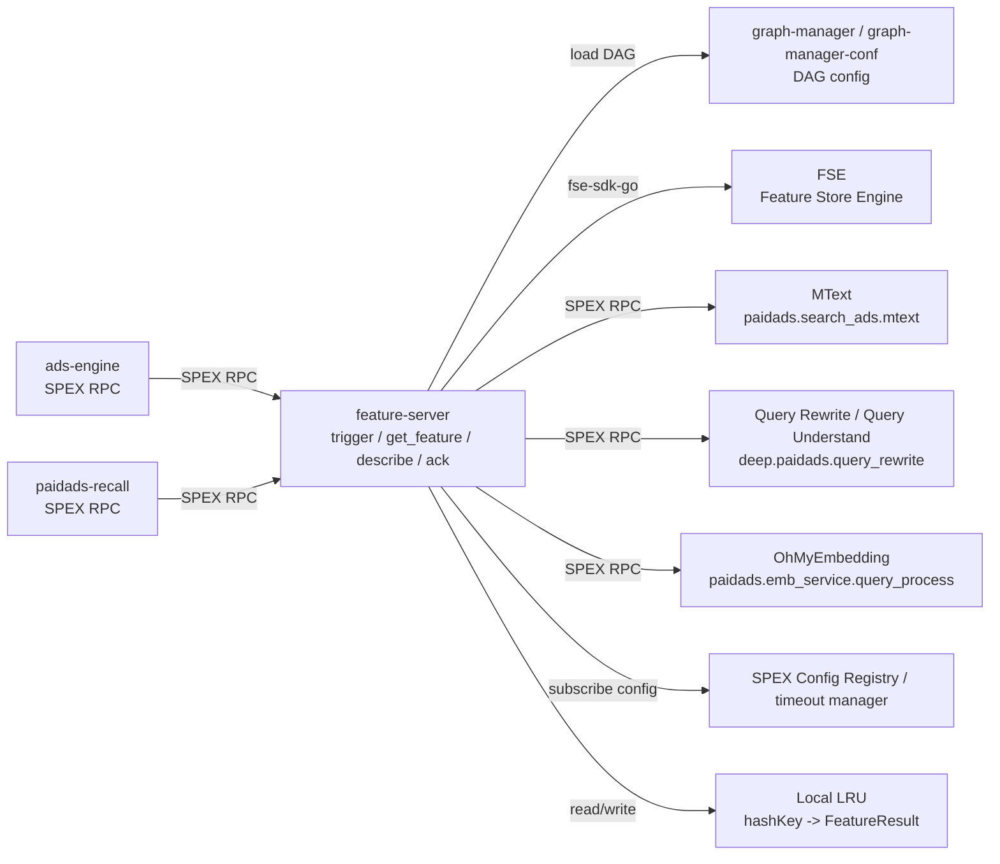

<!-- ads-workspace-gdoc-sync: gdoc_id=1rm97xyGCkEiA4av5Y9j8dywKiFoiZ-QUz8j5znDXRzk gdoc_url=https://docs.google.com/document/d/1rm97xyGCkEiA4av5Y9j8dywKiFoiZ-QUz8j5znDXRzk/edit -->

# Feature Server

Feature Server is the unified feature service for Shopee Paid Ads. It exposes four SPEX commands, `trigger`, `get_feature`, `describe`, and `ack`, executes DAG nodes by requested Module, aggregates query/user features, and returns them in the standard `Response.data` structure.

- Git repository: <https://git.garena.com/shopee/deep/searchads/feature-server>
- Language: Go 1.22.4
- SPEX server-name: `paidads.featureserver`
- SPEX command namespace: `paidads.search_ads.feature_server`
- Current graph-manager-conf version: `feature_server_1.0.21`

---

## Table of Contents

1. [Introduction](#introduction)
2. [Features](#features)
3. [Architecture](#architecture)
4. [Directory Structure](#directory-structure)
5. [Feature Processing](#feature-processing)
6. [APIs and Processing Flows](#apis-and-processing-flows)
7. [Data Sources](#data-sources)
8. [Development Guidelines](#development-guidelines)
9. [Configuration](#configuration)
10. [Deployment](#deployment)
11. [Monitoring](#monitoring)
12. [Business Terminology Glossary](#business-terminology-glossary)
13. [Additional Resources](#additional-resources)
14. [Frequently Asked Questions](#frequently-asked-questions)

---

## Introduction

Feature Server centralizes feature computation that would otherwise be duplicated across ads services. Upstream services request features by Module. The server resolves each Module through the `feature_module` mapping in `config/live.yml`, executes only the required DAG dependencies, and packs results into the unified `Data` structure.

The core design has three parts:

1. **Module-based feature management**: Modules such as `Textproc`, `QueryRewrite`, `Mtext`, `OhMyEmbQueryProcess`, `UserBehaviorClickRT`, and `UserCTR` are mapped to `Node:Output` entries in config.
2. **Two-phase request model**: `trigger` can start DAG computation early and write to the local LRU cache; `get_feature` reads from cache and recomputes according to `FetchMode` on misses.
3. **ABTestParamStr passthrough**: `ab_param_str` is parsed into `ABTestConfig` in `ReqContext` and controls paths such as QueryRewrite / QueryUnderstand.

The `ack` endpoint is registered, but the current server implementation returns `NOT_EXIST`. The `feature_engine_ab_param_str` field is defined in the IDL, but the current feature-server code does not consume it.

---

## Features

| Feature | Description | Key code |
|---------|-------------|----------|
| SPEX service registration | Initializes `sps` and registers `trigger/get_feature/describe/ack` processors | `server/feature_server/service.go` |
| DAG config loading | Reads `featureserver/feature.yaml` from graph-manager and builds the DAG executor | `pkg/service/service.go` |
| Module mapping | Validates `feature_module` `Node:Output` entries and builds Module-to-node/output indexes | `pkg/service/service.go`, `config/live.yml` |
| Local LRU result cache | `trigger` writes `FeatureResult` by `hashKey`; `get_feature` reuses completed node results | `pkg/service/trigger.go`, `pkg/service/get_feature.go` |
| Query text processing | `TextProcOp` processes query locally and outputs `QuerySlice` and `QueryHash` | `pkg/operator/text_proc_op.go` |
| Query rewrite / understand | `QueryRewriteOp` calls `deep.paidads.query_rewrite.get_rewritten_query` or `deep.paidads.query_rewrite.query_understand` | `pkg/operator/query_rewrite.go` |
| MText processing | `MtextOp` calls `paidads.search_ads.mtext.proc_query`, `proc_kw_query`, or an experiment method | `pkg/operator/mtext_op.go` |
| OhMyEmb processing | `OhMyEmbQueryProcessOp` calls `paidads.emb_service.query_process` | `pkg/operator/ohmyemb_query_process_op.go` |
| FSE user features | `FseFetchUserFeatureOp` reads FSE batch feature tables | `pkg/operator/fse_fetch_user_feature_op.go` |
| FSE user behavior sequences | `FseFetchUserActionOp` reads click/order/atc history under `ads_stream` | `pkg/operator/fse_fetch_user_action_op.go` |
| Prometheus metrics | Exposes latency, error, count, cache_count, module_count, item, and version metrics | `pkg/util/exporter.go`, `server/http_handler/metrics.go` |

---

## Architecture

### System Context

Feature Server is a SPEX service. It does not push results to business downstreams; it is mainly called by `ads-engine` and `paidads-recall`, and it accesses FSE plus several downstream SPEX feature services on demand.



### Service Topology

| Category | Name | Protocol / Type | Purpose |
|----------|------|-----------------|---------|
| Upstream | `ads-engine` | SPEX RPC | Ranking/product-ads flows call `trigger/get_feature` to precompute and read Textproc, Mtext, QueryRewrite, OhMyEmbQueryProcess, UserBehavior/UserCTR/UserUnderstanding modules; requests pass through ABTestParamStr, `hashKey`, and `instanceID` |
| Upstream | `paidads-recall` | SPEX RPC | Recall flows call `get_feature` through `feature-server/pkg/client` to read Mtext, QueryRewrite, and query/user features such as UserBehavior/UserCTR/UserUnderstanding |
| Downstream | No direct business downstream | - | feature-server returns results synchronously to callers; the code does not show active pushes to business downstream services |
| Dependency | `graph-manager / graph-manager-conf` | config | Loads `featureserver/feature.yaml` according to `graph_config.service=featureserver` and `graph_config.graph=feature` |
| Dependency | `FSE (Feature Store Engine)` | datastore | `FseFetchUserFeatureOp` reads batch feature tables; `FseFetchUserActionOp` reads `ads_stream` user behavior sequences |
| Dependency | `MText` | SPEX RPC | `MtextOp` calls `paidads.search_ads.mtext.proc_query`, `proc_kw_query`, or experiment methods |
| Dependency | `Query Rewrite / Query Understand` | SPEX RPC | `QueryRewriteOp` calls `get_rewritten_query` or `query_understand` according to ABTestConfig |
| Dependency | `OhMyEmbedding` | SPEX RPC | `OhMyEmbQueryProcessOp` calls `paidads.emb_service.query_process` and returns query processing results |
| Dependency | `SPEX Config Registry / timeout manager` | config | Handles `sps.Init`, dynamic config subscription, and `timeouts` config |
| Dependency | Local LRU result cache | local_cache | Process-local cache of `GraphStatus` and `NodeResultMap`, read/written by `trigger/get_feature` using `hashKey` |

### Request Flow

1. The upstream builds `Request` with `header.requestID`, `header.hashKey`, `header.identity`, `module`, `context.country`, `context.query`, `user.userID`, and `ab_param_str`.
2. `trigger` validates modules, creates `FeatureResult`, stores it in the local LRU by `hashKey`, and executes the DAG asynchronously or synchronously.
3. `get_feature` reads the local LRU according to `FetchMode`: `READ_ONLY` only reads cache, `CALC_WHEN_FAIL` recomputes on miss, and `CALC_ONLY` always recomputes.
4. During DAG execution, `ReqContext` parses `ab_param_str` into `ABTestConfig`. `QueryRewriteOp` uses those fields to choose QueryRewrite or QueryUnderstand.
5. `packResult` converts node outputs into protobuf `Data` according to the `Node:Output` entries in `feature_module`, preserving requested Module order.

---

## Directory Structure

```text
feature-server/
├── config/
│   ├── live.yml              # live SPEX, graph_config, feature_module, LRU config
│   ├── liveish.yml           # liveish config with the same structure
│   └── textproc.xml          # local textproc config used by TextProcOp
├── deploy/
│   └── featureserver.json    # Space build, run, metrics port, and pre-hook config
├── docs/add-feature-sop/     # add-feature SOP in Chinese and English
├── pkg/
│   ├── client/               # Go client wrapping Trigger/GetFeature/Ack
│   ├── config/               # static YAML, SPEX dynamic config, timeout manager
│   ├── operator/             # DAG Operator implementations
│   ├── service/              # FeatureService implementation, cache, DAG execution, result packing
│   ├── types/                # business structs
│   └── util/                 # Promise/Future and Prometheus exporter
├── server/
│   ├── feature_server/       # main.go and service startup logic
│   └── http_handler/         # /metrics, /ping, /debug/pprof
├── types/
│   ├── sp_proto/             # feature_server.proto
│   └── sp_gen/go/            # spcli generated code
├── Makefile
├── deploy/featureserver.json
└── sp-workspace.yml
```

---

## Feature Processing

### Feature Processing Pipeline

Feature Server organizes feature computation as DAG nodes. Requests only specify Modules; the server resolves dependent nodes from config and executes them.

```text
Request.module
    |
    v
feature_module[].feature_list[].data  (Node:Output)
    |
    v
Trace dependent DAG nodes
    |
    v
Execute selected nodes
    |
    v
PostHook writes node outputs into FeatureResult.NodeResultMap
    |
    v
packResult builds Response.data by requested module order
```

### DAG Nodes and Configuration

The DAG config lives in `featureserver/feature.yaml` in graph-manager-conf. The current local config contains these main nodes:

| Node | Operator | Type | Inputs | Outputs |
|------|----------|------|--------|---------|
| `QueryAdapter` | `ReqCtxAdapterOp` | normal | - | `Query` |
| `TextProc` | `TextProcOp` | calc | `QueryAdapter:Query` | `QuerySlice`, `QueryHash` |
| `QueryRewrite` | `QueryRewriteOp` | io | `QueryAdapter:Query` | `Queries`, `Scores`, `Models`, `Extras` |
| `Mtext` | `MtextOp` | io | `QueryAdapter:Query`, `QueryRewrite:Queries` | `Query`, `RewrittenQueries`, `MtextQuery`, `TokensExp` |
| `OhMyEmbQueryProcess` | `OhMyEmbQueryProcessOp` | io | `QueryAdapter:Query`, `QueryRewrite:Queries` | `Result` |
| `UserBehaviorClickRT` | `FseFetchUserActionOp` | io | - | `ItemIDList` |
| `UserBehaviorOrderRT` | `FseFetchUserActionOp` | io | - | `ItemIDList` |
| `UserBehaviorATCRT` | `FseFetchUserActionOp` | io | - | `ItemIDList` |
| `UserUnderstanding` | `FseFetchUserFeatureOp` | io | - | `UserTag` |
| `UserCTR` | `FseFetchUserFeatureOp` | io | - | `Click`, `Impression`, `Click14D` |

### DAG and Module Configuration

Runtime Module mapping is maintained in `feature_module` in `config/live.yml` and `config/liveish.yml`. The `data` field must use the `NodeName:OutputName` format, and startup validates that both node and output exist.

```yaml
feature_module:
  - module: Textproc
    feature_list:
      - name: QuerySlice
        data: TextProc:QuerySlice
      - name: QueryHash
        data: TextProc:QueryHash
  - module: QueryRewrite
    feature_list:
      - name: QueryRewrite
        data: QueryRewrite:Queries
      - name: QueryRewriteScore
        data: QueryRewrite:Scores
      - name: QueryRewriteModel
        data: QueryRewrite:Models
```

`GraphManagerVersion := feature_server_1.0.21` in the `Makefile` controls the graph-manager-conf branch or tag fetched by `make prepare`. If `graph_config.debug-tag` is non-empty, the service uses `graphmanager.GetGraphDebug`.

### Operators and Output Mapping

Each Operator registers itself in `init()` via `engine.RegisterOpBuilder`. `BaseOperator.Execute` records run latency and errors uniformly. Outputs are converted to protobuf `DataType` in `packSingleFeature`, for example `string -> STRING`, `[]string -> STRING_LIST`, `[]int64 -> INT64_LIST`, `*MtextResult -> NESTED`, and `*QueryProcessResponse -> NESTED`.

---

## APIs and Processing Flows

### API Overview

| RPC | SPEX command | Current behavior |
|-----|--------------|------------------|
| `trigger` | `paidads.search_ads.feature_server.trigger` | Triggers DAG computation and writes to local LRU; supports synchronous execution via `header.sync` |
| `get_feature` | `paidads.search_ads.feature_server.get_feature` | Reads feature results and uses `FetchMode` to control cache and recomputation |
| `describe` | `paidads.search_ads.feature_server.describe` | Returns SUCCESS and `instanceID`; currently no feature description payload |
| `ack` | `paidads.search_ads.feature_server.ack` | Registered, but the current server implementation returns `NOT_EXIST` |

### Feature Request and Response

Key request fields:

| Field | Description |
|-------|-------------|
| `header.requestID` | Request ID, copied to the response header |
| `header.hashKey` | Local LRU key; `trigger` and `get_feature` must use the same key to hit precomputed results |
| `header.identity` | Caller identity used for metrics labels |
| `header.sync` | Whether `trigger` executes synchronously |
| `header.fetchMode` | For `get_feature`: `DEFAULT`, `READ_ONLY`, `CALC_WHEN_FAIL`, `CALC_ONLY` |
| `header.instanceID` | Target instance; the client converts it into a SPEX request param |
| `module` | Requested Module list |
| `ab_param_str` | ABTestParamStr JSON string, parsed into ABTestConfig |
| `context.query` / `context.country` | Query and country/region |
| `user.userID` | Key for FSE user feature and user action queries |

Response data is returned in requested Module order:

```text
Response.data[]
  name = "Textproc"
  dataType = NESTED
  subData[]
    - name = "QuerySlice", dataType = STRING_LIST
    - name = "QueryHash",  dataType = STRING
```

### Upstream Callers

`ads-engine` calls `trigger/get_feature` from `pkg/dao/feature_server` and `pkg/operator/product_ads`, passing `ABTestParamStr`, `hashKey`, and `instanceID`. The `paidads-recall` `pkg/featureserver` client requests Modules such as `Mtext`, `QueryRewrite`, `UserBehavior*`, `UserCTR`, and `UserUnderstanding` for query/user scenarios.

Example request:

```bash
curl 'https://http-gateway.spex.shopee.sg/sprpc/paidads.search_ads.feature_server.get_feature' \
  -H 'Content-Type: application/json' \
  -H 'x-sp-sdu: paidads.featureserver.global.liveish.master.default' \
  -H 'x-sp-servicekey: 1e6acfc7f54282eeb00be0e268e3842f' \
  -H 'shopee-baggage: CID=id' \
  -d '{
    "header": {"requestID": "test", "hashKey": "test", "identity": "manual:test", "fetchMode": 3},
    "context": {"query": "nike", "country": "ID"},
    "user": {"userID": 123},
    "module": ["Textproc", "QueryRewrite", "Mtext"]
  }'
```

---

## Data Sources

### FSE Feature Tables

`FseFetchUserFeatureOp` initializes a table handle through `fse.NewFeaturePlatform().GetFeatureTable(project, table, primaryKeys)` and calls `MGetRow` at runtime. The current graph config uses:

| Module | FSE project/table | Primary keys | Outputs |
|--------|-------------------|--------------|---------|
| `UserUnderstanding` | `ads/user_understanding_feature_table` | `grass_region`, `user_id` | `UserTag` |
| `UserCTR` | `ads/paidads_scoring_feature_category_userctrv2_v2` | `country`, `user_id` | `Click`, `Impression`, `Click14D` |

`FseFetchUserActionOp` reads user behavior sequences via `GetNonPlatformFeatureTable("ads_stream", tableName)`. Current supported tables are `user_click_history_rt`, `user_order_history_rt`, and `user_atc_history_rt`; each read fetches the most recent 50 entries and outputs `ItemIDList`.

### Local LRU Result Cache

`QuResultCache` is process-local LRU. Capacity comes from `qu_lru_cache_size`: 2048 for live and 1024 for liveish. The cached value is `FeatureResult`, containing:

- `GraphStatus`: DAG execution status promise
- `NodeResultMap`: map from node name to output promise

`trigger` checks whether `hashKey` already exists; duplicate requests return `DUPLICATED_TRIGGER`. `get_feature` supports partial hits: if some required nodes are already cached, they are reused and only missing dependencies are recomputed.

### Downstream SPEX Feature Services

| Operator | Downstream command | Timeout config |
|----------|--------------------|----------------|
| `MtextOp` | `paidads.search_ads.mtext.proc_query`, `proc_kw_query`, experiment methods such as `proc_intonation` | `Timeouts.MText` |
| `QueryRewriteOp` | `deep.paidads.query_rewrite.get_rewritten_query`, `deep.paidads.query_rewrite.query_understand` | `Timeouts.QueryRewrite` |
| `OhMyEmbQueryProcessOp` | `paidads.emb_service.query_process` | caller context |
| `FseFetchUserFeatureOp` | FSE SDK `MGetRow` | `Timeouts.FSE.GetBatch` |
| `FseFetchUserActionOp` | FSE SDK `GetList` | `Timeouts.FSE.GetSequence` |

---

## Development Guidelines

### Code Style

- Use `go fmt ./...` for formatting.
- `make clean` runs `go fmt ./...` and `go mod tidy`.
- `make vet` runs `go vet -mod=mod ./...`.
- `make ci` runs `vet` and `fmt`.

### How to Add New Features

See [docs/add-feature-sop/Sop_EN.md](./docs/add-feature-sop/Sop_EN.md). Core steps:

1. Add or modify DAG nodes in `featureserver/feature.yaml` in graph-manager-conf.
2. If new logic is required, implement an Operator under `pkg/operator/` and register its builder in `init()`.
3. Register the Module-to-`Node:Output` mapping in `feature_module` in both `config/live.yml` and `config/liveish.yml`.
4. After graph-manager-conf is merged, create a new tag and update `GraphManagerVersion` in this repository's `Makefile`.
5. Deploy liveish and verify the returned field names and `DataType` values with `get_feature`.

### Project Structure

- `pkg/service/` handles SPEX handlers, cache, DAG scheduling, and result packing.
- `pkg/operator/` handles concrete feature computation or external service calls.
- `pkg/config/` handles static YAML, SPEX dynamic config, and timeout manager.
- `types/sp_proto/` and `types/sp_gen/` store protocol definitions and generated code.

### Naming Conventions

- Module names must match `module` entries in `config/live.yml`.
- `feature_module[].feature_list[].data` must use `NodeName:OutputName`.
- Operator names use Go type names, such as `QueryRewriteOp` and `FseFetchUserFeatureOp`.
- graph-manager-conf tags currently use the `feature_server_1.0.xx` format.

### Error Handling

- `get_feature` returns `NOT_EXIST` when a Module is unknown.
- `trigger` returns `EMPTY_HASH_KEY` when `hashKey` is empty.
- DAG node errors are exported through Prometheus error counters; unavailable outputs are packed as `SERVER_FAIL`.
- `packSingleFeature` degrades unknown types, nil values, and panics to `SERVER_FAIL`.

### Unit Testing Standards

```bash
make unittest
```

### Code Review & Git Workflow

When adding or changing DAG config, usually merge the graph-manager-conf MR first, then update feature-server's `GraphManagerVersion`. Before submitting this repository, run at least `make vet` or `make ci`.

---

## Configuration

### Config Files

| File | Description |
|------|-------------|
| `config/live.yml` | live SPEX, graph_config, feature_module, and LRU config |
| `config/liveish.yml` | liveish config; `qu_lru_cache_size` is 1024 |
| `config/textproc.xml` | query normalization config used by `TextProcOp` |
| `deploy/featureserver.json` | Space build, run, metrics port, and pre-hook config |
| `sp-workspace.yml` | SPEX proto dependencies and generation paths |

### feature.yaml and feature_module Configuration

`feature.yaml` defines DAG nodes, while `feature_module` defines externally exposed Module and feature names. At startup, the service loads the DAG and validates all `Node:Output` mappings:

```yaml
feature-server:
  graph_config:
    service: featureserver
    graph: feature
    debug-tag:
  feature_module: *FeatureModule
  qu_lru_cache_size: 2048
```

### SPEX and spcli Setup

`SpexConfig.InitSpex` generates `instanceID`, calls `sps.Init` with config key, service key, and metrics enabled, then subscribes to the SPEX config registry.

```yaml
spex-config:
  server-name: paidads.featureserver
  env: live
  tag: master
  deployment: default
  service-key: 1e6acfc7f54282eeb00be0e268e3842f
  config-key: 35f57fc1446f281f6e05353e93800b012d93719e9ac2b20ec165e0e7ae6e6f3e
```

Generate protocol code through `spcli`:

```bash
make proto
```

---

## Deployment

### Build for Production

Space build config is defined in `deploy/featureserver.json`, with this build command:

```bash
make prepare && make feature-server-greentea
```

Local Linux build:

```bash
make prepare
make feature-server
make client
```

### Release Process

The run command is injected with the metrics port by Space:

```bash
GODEBUG=cgocheck=0 ./bin/feature_server.linux -c config/${env}.yml -mp ${PORT_METRICS}
```

Space pre-hook commands:

1. `bash scripts/elsa_backup.sh ${env}`
2. `bash scripts/prepare.sh`
3. `echo "PORT_METRICS: ${PORT_METRICS}" > env.txt`

For releases involving DAG changes, the recommended order is: merge and tag graph-manager-conf, update feature-server `GraphManagerVersion`, deploy liveish for verification, then release live.

---

## Monitoring

### Feature Latency and Hit Rate

The service exposes `/metrics` on `metrics_port`, and Space has `enable_prometheus: true`. The core dashboard recorded in the profile is:

<https://monitoring.infra.sz.shopee.io/grafana/d/R0zDT8w4k/feature-server?orgId=39>

Prometheus metrics registered in code:

| Metric | Labels | Description |
|--------|--------|-------------|
| `paidads_feature_server_latency` | `country`, `identity`, `component`, `type`, `commit` | Request stage and Operator latency |
| `paidads_feature_server_error` | `country`, `identity`, `component`, `type`, `commit` | Error count |
| `paidads_feature_server_count` | `country`, `identity`, `component`, `type`, `commit` | General counters |
| `paidads_feature_server_cache_count` | `country`, `identity`, `component`, `module`, `type`, `commit` | Module-level cache hit/miss/trigger |
| `paidads_feature_server_module_count` | `country`, `identity`, `component`, `module`, `type`, `commit` | Module request status |
| `paidads_feature_server_item` | `country`, `identity`, `component`, `commit` | Item count distribution |
| `paidads_feature_server_version` | `version` | Service startup version |

### Feature Missing Alerts

Check these signals first:

1. Whether `cache_count{type="miss"}` or `fetch_mode{type="read_only_fail"}` is elevated.
2. Whether logs contain `cache miss for read_only`.
3. Whether `trigger` and `get_feature` use the same `hashKey`, and whether they hit the same `instanceID`.
4. Whether FSE, MText, QueryRewrite/QueryUnderstand, or OhMyEmb error counters are elevated.
5. Whether the `timeouts` dynamic config was reduced and caused downstream context deadline exceeded errors.

---

## Business Terminology Glossary

| Term | Meaning |
|------|---------|
| `SPEX` | Shopee's internal RPC framework; feature-server exposes its service and calls several downstream services through it |
| `spcli` | SPEX command-line tool used to generate protocol code |
| `DAG` | Directed Acyclic Graph describing feature computation nodes and dependencies |
| `graph-manager` | SDK used at runtime to load DAG config |
| `graph-manager-conf` | Config repository containing `featureserver/feature.yaml` and `featureserver/opdef.yaml` |
| `feature.yaml` | DAG graph config for feature-server |
| `feature_module` | YAML mapping from externally exposed Module to `Node:Output` |
| `FSE` / `Feature Store Engine` | Feature storage and query platform accessed through `fse-sdk-go` |
| `MText` | Multilingual text processing service returning query token/phrase/common-token results |
| `QueryRewrite` / `QueryUnderstand` | Query rewrite and understanding paths controlled by ABTestConfig |
| `OhMyEmb` | Query representation service returning MText, SPM tokens, embeddings, and related outputs |
| `ABTestParamStr` | AB parameter JSON string in the request |
| `ABTestConfig` | Go struct parsed from `ABTestParamStr` |
| `feature_engine_ab_param_str` | Field reserved in the IDL; current feature-server code does not consume it |

---

## Additional Resources

- Git repository: <https://git.garena.com/shopee/deep/searchads/feature-server>
- Feature Server IDL: `types/sp_proto/paidads/search_ads/feature_server.proto`
- graph-manager-conf local path: `projects/gitlab/graph-manager-conf/featureserver/feature.yaml`
- Add Feature SOP: [docs/add-feature-sop/Sop_EN.md](./docs/add-feature-sop/Sop_EN.md)
- SPEX Go quick start: <https://spex.shopee.io/overview/quick-start/languages/go/index.html>
- spcli install guide: <https://spex.shopee.io/user-guide/SDK/Java/local.html>
- Paid Ads Glossary: <https://confluence.shopee.io/pages/viewpage.action?spaceKey=SPAD&title=Paid+Ads+Glossary>
- Ads Recall SRA doc: <https://sra.shopee.io/05.Business_Systems/5.3_Ads_Business_and_Architecture_Introduction/5.3.3._ads_recall.html>
- Feature Server API definition (RAP): <https://rap.shopee.io/spex/api_namespaces?apiId=namespace-464315&name=feature_server>

---

## Frequently Asked Questions

**Q1: What is the difference between `trigger` and `get_feature`?**

`trigger` starts DAG computation early and writes `FeatureResult` to the local LRU, usually without returning feature data. `get_feature` reads feature results; on cache misses, it recomputes according to `FetchMode`.

**Q2: Why is `hashKey` important?**

The local LRU uses `hashKey` as its key. If `trigger` and `get_feature` use different `hashKey` values, `get_feature` cannot read the precomputed result and will see a cache miss.

**Q3: How do I add a Module?**

Add or reuse nodes in `featureserver/feature.yaml` in graph-manager-conf, then add Module mappings in `feature_module` in both `config/live.yml` and `config/liveish.yml`. If a new Operator is needed, implement and register it under `pkg/operator/`.

**Q4: How can I verify that ABTestParamStr works?**

`pkg/operator/common/req_context.go` parses `Request.ab_param_str` JSON into `ABTestConfig`. For example, `QueryRewriteOp` reads fields such as `EnableQueryUnderstand`, `QueryExtendRedisVersion`, and `QueryRewriteModelVersion` to choose request parameters and downstream commands.

**Q5: Which user behavior sequences are currently supported?**

`FseFetchUserActionOp` currently hardcodes `user_click_history_rt`, `user_order_history_rt`, and `user_atc_history_rt`. Adding other action tables requires Go code changes.

**Q6: How do I adjust downstream timeouts?**

Timeouts come from SPEX dynamic config under `timeouts`; the struct is defined in `pkg/config/dynamic.go`. The service reads and hot-updates them through `spex-timeout-manager`.

**Q7: Can `ack` be used?**

The IDL and generated code contain `ack`, and its processor is registered, but `pkg/service/ack.go` currently returns `NOT_EXIST` directly. Do not treat it as a completed business endpoint.

**Q8: How do I validate liveish?**

After deploying liveish, request `paidads.featureserver.global.liveish.master.default`, use `FetchMode_CALC_ONLY` or `CALC_WHEN_FAIL` for the target Module, and verify returned `DataType` values and field names.

**Q9: Where is local LRU size configured?**

It is configured in `qu_lru_cache_size` in `config/live.yml` / `config/liveish.yml`. Changing it requires redeployment.

**Q10: Why is observability not in service_topology?**

`/metrics` is an observability endpoint, not a business downstream of feature-server. Since `service_topology.downstream` is empty, monitoring is documented only in the Monitoring section.

<!-- Generated by ads-workspace/skills/ads-readme-generate | checked: 1bc663696c29a0526876a8f3ae7930a139843f75 -->
