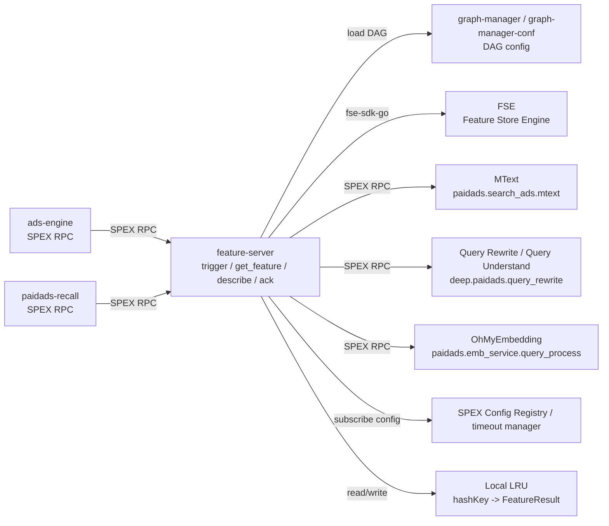

<!-- ads-workspace-gdoc-sync: gdoc_id=1sR0FfWgYowor_D-jacq-czYIqFCevswAzCX2KdX4-6I gdoc_url=https://docs.google.com/document/d/1sR0FfWgYowor_D-jacq-czYIqFCevswAzCX2KdX4-6I/edit -->

# Feature Server

Feature Server 是 Shopee Paid Ads 的统一特征服务。服务通过 SPEX 暴露 `trigger`、`get_feature`、`describe`、`ack` 四个命令，按 Module 请求执行 DAG 节点，聚合 query/user 维度特征，并以 `Response.data` 的标准结构返回给上游。

- Git 仓库: <https://git.garena.com/shopee/deep/searchads/feature-server>
- 语言: Go 1.22.4
- SPEX server-name: `paidads.featureserver`
- SPEX command namespace: `paidads.search_ads.feature_server`
- 当前 graph-manager-conf 版本: `feature_server_1.0.21`

---

## 目录 / Table of Contents

1. [项目概述 / Introduction](#项目概述--introduction)
2. [核心功能 / Features](#核心功能--features)
3. [项目架构 / Architecture](#项目架构--architecture)
4. [目录结构 / Directory Structure](#目录结构--directory-structure)
5. [特征处理 / Feature Processing](#特征处理--feature-processing)
6. [API 与处理流程 / APIs and Processing Flows](#api-与处理流程--apis-and-processing-flows)
7. [数据源 / Data Sources](#数据源--data-sources)
8. [开发规范 / Development Guidelines](#开发规范--development-guidelines)
9. [配置说明 / Configuration](#配置说明--configuration)
10. [部署 / Deployment](#部署--deployment)
11. [监控 / Monitoring](#监控--monitoring)
12. [业务术语表 / Business Terminology Glossary](#业务术语表--business-terminology-glossary)
13. [参考资料 / Additional Resources](#参考资料--additional-resources)
14. [常见问题 / Frequently Asked Questions](#常见问题--frequently-asked-questions)

---

## 项目概述 / Introduction

Feature Server 解决的是广告链路中重复、分散的特征计算问题。上游按 Module 请求特征，服务端根据 `config/live.yml` 中的 `feature_module` 映射找到对应 DAG 节点输出，只执行必要依赖，并把结果打包成统一的 `Data` 结构。

核心设计有三点：

1. **按 Module 管理特征**: `Textproc`、`QueryRewrite`、`Mtext`、`OhMyEmbQueryProcess`、`UserBehaviorClickRT`、`UserCTR` 等 Module 在配置中映射到 `Node:Output`。
2. **两段式请求**: `trigger` 可提前启动 DAG 计算并写入本地 LRU；`get_feature` 读取缓存，未命中时按 `FetchMode` 决定是否补算。
3. **ABTestParamStr 透传**: 请求中的 `ab_param_str` 在 `ReqContext` 中解析为 `ABTestConfig`，用于控制 QueryRewrite / QueryUnderstand 等实验路径。

当前代码中的 `ack` endpoint 已注册，但服务端实现返回 `NOT_EXIST`；`feature_engine_ab_param_str` 只在 IDL 中定义，当前 feature-server 代码没有实际消费逻辑。

---

## 核心功能 / Features

| 功能 | 说明 | 关键代码 |
|------|------|----------|
| SPEX 服务注册 | 启动时初始化 `sps`，注册 `trigger/get_feature/describe/ack` processors | `server/feature_server/service.go` |
| DAG 配置加载 | 从 graph-manager 读取 `featureserver/feature.yaml`，构建 DAG 执行器 | `pkg/service/service.go` |
| Module 映射 | 校验 `feature_module` 中的 `Node:Output`，构建 Module 到依赖节点和输出特征的索引 | `pkg/service/service.go`、`config/live.yml` |
| 本地 LRU 结果缓存 | `trigger` 以 `hashKey` 写入 `FeatureResult`，`get_feature` 复用已完成节点结果 | `pkg/service/trigger.go`、`pkg/service/get_feature.go` |
| Query 文本处理 | `TextProcOp` 本地处理 query，输出 `QuerySlice` 和 `QueryHash` | `pkg/operator/text_proc_op.go` |
| Query 改写/理解 | `QueryRewriteOp` 调用 `deep.paidads.query_rewrite.get_rewritten_query` 或 `deep.paidads.query_rewrite.query_understand` | `pkg/operator/query_rewrite.go` |
| MText 处理 | `MtextOp` 调用 `paidads.search_ads.mtext.proc_query`、`proc_kw_query` 或实验方法 | `pkg/operator/mtext_op.go` |
| OhMyEmb 处理 | `OhMyEmbQueryProcessOp` 调用 `paidads.emb_service.query_process` | `pkg/operator/ohmyemb_query_process_op.go` |
| FSE 用户特征 | `FseFetchUserFeatureOp` 读取 FSE batch feature table | `pkg/operator/fse_fetch_user_feature_op.go` |
| FSE 用户行为序列 | `FseFetchUserActionOp` 读取 `ads_stream` 下的 click/order/atc history | `pkg/operator/fse_fetch_user_action_op.go` |
| Prometheus metrics | 暴露 latency、error、count、cache_count、module_count、item、version | `pkg/util/exporter.go`、`server/http_handler/metrics.go` |

---

## 项目架构 / Architecture

### 系统上下文 / System Context

Feature Server 是一个 SPEX 服务。它本身不向业务下游推送结果，主要被 `ads-engine` 和 `paidads-recall` 调用，按需访问 FSE 与若干下游 SPEX 特征服务。



### 上下游调用拓扑 / Service Topology

| 分类 | 名称 | 协议/类型 | 用途 |
|------|------|-----------|------|
| 上游 | `ads-engine` | SPEX RPC | 排序/商品广告链路通过 `trigger/get_feature` 预计算并读取 Textproc、Mtext、QueryRewrite、OhMyEmbQueryProcess、UserBehavior/UserCTR/UserUnderstanding 等模块；请求透传 ABTestParamStr、`hashKey` 与 `instanceID` |
| 上游 | `paidads-recall` | SPEX RPC | 召回链路通过 `feature-server/pkg/client` 调用 `get_feature`，获取 Mtext、QueryRewrite 以及 UserBehavior/UserCTR/UserUnderstanding 等 query/user 维度特征 |
| 下游 | 无直接业务下游 | - | feature-server 将结果同步返回给请求方；没有代码证据表明它主动向业务下游推送数据 |
| 依赖 | `graph-manager / graph-manager-conf` | config | 服务启动时根据 `graph_config.service=featureserver`、`graph_config.graph=feature` 读取 `featureserver/feature.yaml` |
| 依赖 | `FSE (Feature Store Engine)` | datastore | `FseFetchUserFeatureOp` 读取 batch feature table；`FseFetchUserActionOp` 读取 `ads_stream` 用户行为序列 |
| 依赖 | `MText` | SPEX RPC | `MtextOp` 调用 `paidads.search_ads.mtext.proc_query`、`proc_kw_query` 或实验方法 |
| 依赖 | `Query Rewrite / Query Understand` | SPEX RPC | `QueryRewriteOp` 根据 ABTestConfig 调用 `get_rewritten_query` 或 `query_understand` |
| 依赖 | `OhMyEmbedding` | SPEX RPC | `OhMyEmbQueryProcessOp` 调用 `paidads.emb_service.query_process` 返回 query 处理结果 |
| 依赖 | `SPEX Config Registry / timeout manager` | config | `sps.Init`、动态配置订阅、`timeouts` 下游超时配置 |
| 依赖 | 本地 LRU 结果缓存 | local_cache | 进程内缓存 `GraphStatus` 与 `NodeResultMap`，由 `trigger/get_feature` 按 `hashKey` 读写 |

### 请求链路

1. 上游构造 `Request`，设置 `header.requestID`、`header.hashKey`、`header.identity`、`module`、`context.country`、`context.query`、`user.userID` 和 `ab_param_str`。
2. `trigger` 校验 Module 后创建 `FeatureResult`，按 `hashKey` 放入本地 LRU，并异步或同步执行 DAG。
3. `get_feature` 根据 `FetchMode` 读取本地 LRU：`READ_ONLY` 只读缓存，`CALC_WHEN_FAIL` 未命中时补算，`CALC_ONLY` 强制重算。
4. DAG 执行时，`ReqContext` 会把 `ab_param_str` 解析为 `ABTestConfig`。`QueryRewriteOp` 读取这些字段决定走 QueryRewrite 或 QueryUnderstand 路径。
5. `packResult` 根据 `feature_module` 的 `Node:Output` 映射把节点输出转换为 protobuf `Data`，按请求 Module 顺序返回。

---

## 目录结构 / Directory Structure

```text
feature-server/
├── config/
│   ├── live.yml              # live 环境 SPEX、graph_config、feature_module、LRU 配置
│   ├── liveish.yml           # liveish 环境配置，结构与 live.yml 一致
│   └── textproc.xml          # TextProcOp 使用的本地 textproc 配置
├── deploy/
│   └── featureserver.json    # Space 构建、运行、metrics 端口和 pre-hook 配置
├── docs/add-feature-sop/     # 新增特征 SOP，中英文版本
├── pkg/
│   ├── client/               # feature-server Go client，封装 Trigger/GetFeature/Ack
│   ├── config/               # 静态 YAML、SPEX 动态配置、timeout manager
│   ├── operator/             # DAG Operator 实现
│   ├── service/              # FeatureService 实现、缓存、DAG 执行、结果打包
│   ├── types/                # 业务结构体
│   └── util/                 # Promise/Future、Prometheus exporter
├── server/
│   ├── feature_server/       # main.go 和服务启动逻辑
│   └── http_handler/         # /metrics、/ping、/debug/pprof
├── types/
│   ├── sp_proto/             # feature_server.proto
│   └── sp_gen/go/            # spcli 生成代码
├── Makefile
├── deploy/featureserver.json
└── sp-workspace.yml
```

---

## 特征处理 / Feature Processing

### 特征处理流水线 / Feature Processing Pipeline

Feature Server 的特征处理以 DAG 节点组织。请求只指定 Module，服务端根据配置反查 Module 依赖的节点集合并执行。

```text
Request.module
    |
    v
feature_module[].feature_list[].data  (Node:Output)
    |
    v
Trace dependent DAG nodes
    |
    v
Execute selected nodes
    |
    v
PostHook writes node outputs into FeatureResult.NodeResultMap
    |
    v
packResult builds Response.data by requested module order
```

### DAG 节点与配置 / DAG Nodes and Configuration

DAG 配置位于 graph-manager-conf 的 `featureserver/feature.yaml`。当前本地配置中包含这些主要节点：

| 节点 | Operator | 类型 | 输入 | 输出 |
|------|----------|------|------|------|
| `QueryAdapter` | `ReqCtxAdapterOp` | normal | - | `Query` |
| `TextProc` | `TextProcOp` | calc | `QueryAdapter:Query` | `QuerySlice`, `QueryHash` |
| `QueryRewrite` | `QueryRewriteOp` | io | `QueryAdapter:Query` | `Queries`, `Scores`, `Models`, `Extras` |
| `Mtext` | `MtextOp` | io | `QueryAdapter:Query`, `QueryRewrite:Queries` | `Query`, `RewrittenQueries`, `MtextQuery`, `TokensExp` |
| `OhMyEmbQueryProcess` | `OhMyEmbQueryProcessOp` | io | `QueryAdapter:Query`, `QueryRewrite:Queries` | `Result` |
| `UserBehaviorClickRT` | `FseFetchUserActionOp` | io | - | `ItemIDList` |
| `UserBehaviorOrderRT` | `FseFetchUserActionOp` | io | - | `ItemIDList` |
| `UserBehaviorATCRT` | `FseFetchUserActionOp` | io | - | `ItemIDList` |
| `UserUnderstanding` | `FseFetchUserFeatureOp` | io | - | `UserTag` |
| `UserCTR` | `FseFetchUserFeatureOp` | io | - | `Click`, `Impression`, `Click14D` |

### DAG 与 Module 配置 / DAG and Module Configuration

运行时 Module 映射在 `config/live.yml` 和 `config/liveish.yml` 的 `feature_module` 中维护。`data` 字段格式必须是 `NodeName:OutputName`，服务启动时会校验节点和输出是否存在。

```yaml
feature_module:
  - module: Textproc
    feature_list:
      - name: QuerySlice
        data: TextProc:QuerySlice
      - name: QueryHash
        data: TextProc:QueryHash
  - module: QueryRewrite
    feature_list:
      - name: QueryRewrite
        data: QueryRewrite:Queries
      - name: QueryRewriteScore
        data: QueryRewrite:Scores
      - name: QueryRewriteModel
        data: QueryRewrite:Models
```

`Makefile` 中的 `GraphManagerVersion := feature_server_1.0.21` 决定 `make prepare` 拉取的 graph-manager-conf 分支或 tag。`graph_config.debug-tag` 非空时，服务使用 `graphmanager.GetGraphDebug` 读取调试配置。

### Operator 与输出映射 / Operators and Output Mapping

每个 Operator 在 `init()` 中调用 `engine.RegisterOpBuilder` 注册。`BaseOperator.Execute` 统一记录运行延迟和错误。输出在 `packSingleFeature` 中转换为 protobuf `DataType`，例如 `string -> STRING`、`[]string -> STRING_LIST`、`[]int64 -> INT64_LIST`、`*MtextResult -> NESTED`、`*QueryProcessResponse -> NESTED`。

---

## API 与处理流程 / APIs and Processing Flows

### API 总览 / API Overview

| RPC | SPEX command | 当前实现 |
|-----|--------------|----------|
| `trigger` | `paidads.search_ads.feature_server.trigger` | 触发 DAG 计算，写入本地 LRU；支持 `header.sync` 同步执行 |
| `get_feature` | `paidads.search_ads.feature_server.get_feature` | 获取特征结果，支持 `FetchMode` 控制缓存和补算 |
| `describe` | `paidads.search_ads.feature_server.describe` | 返回 SUCCESS 和 `instanceID`，当前不返回特征描述内容 |
| `ack` | `paidads.search_ads.feature_server.ack` | 已注册，当前服务端返回 `NOT_EXIST` |

### 特征请求与响应 / Feature Request and Response

关键请求字段：

| 字段 | 说明 |
|------|------|
| `header.requestID` | 请求 ID，透传到响应头 |
| `header.hashKey` | 本地 LRU key；`trigger` 与 `get_feature` 需要使用同一 key 才能命中预计算结果 |
| `header.identity` | 调用方身份，用于 metrics 标签 |
| `header.sync` | `trigger` 是否同步执行 |
| `header.fetchMode` | `get_feature` 专用：`DEFAULT`、`READ_ONLY`、`CALC_WHEN_FAIL`、`CALC_ONLY` |
| `header.instanceID` | 指定目标实例；client 会把它转换为 SPEX request param |
| `module` | 要读取的 Module 列表 |
| `ab_param_str` | ABTestParamStr JSON 字符串，解析为 ABTestConfig |
| `context.query` / `context.country` | Query 和国家/地区 |
| `user.userID` | FSE user feature 与 user action 查询的 key |

响应结构按请求 Module 顺序返回：

```text
Response.data[]
  name = "Textproc"
  dataType = NESTED
  subData[]
    - name = "QuerySlice", dataType = STRING_LIST
    - name = "QueryHash",  dataType = STRING
```

### 上游调用方 / Upstream Callers

`ads-engine` 的 `pkg/dao/feature_server` 和 `pkg/operator/product_ads` 会调用 `trigger/get_feature`，并把 `ABTestParamStr`、`hashKey`、`instanceID` 传给 Feature Server。`paidads-recall` 的 `pkg/featureserver` client 会按 query/user 场景请求 `Mtext`、`QueryRewrite`、`UserBehavior*`、`UserCTR`、`UserUnderstanding` 等 Module。

示例请求：

```bash
curl 'https://http-gateway.spex.shopee.sg/sprpc/paidads.search_ads.feature_server.get_feature' \
  -H 'Content-Type: application/json' \
  -H 'x-sp-sdu: paidads.featureserver.global.liveish.master.default' \
  -H 'x-sp-servicekey: 1e6acfc7f54282eeb00be0e268e3842f' \
  -H 'shopee-baggage: CID=id' \
  -d '{
    "header": {"requestID": "test", "hashKey": "test", "identity": "manual:test", "fetchMode": 3},
    "context": {"query": "nike", "country": "ID"},
    "user": {"userID": 123},
    "module": ["Textproc", "QueryRewrite", "Mtext"]
  }'
```

---

## 数据源 / Data Sources

### FSE 特征表 / FSE Feature Tables

`FseFetchUserFeatureOp` 通过 `fse.NewFeaturePlatform().GetFeatureTable(project, table, primaryKeys)` 初始化表句柄，运行时调用 `MGetRow`。当前 graph 配置使用：

| Module | FSE project/table | Primary keys | 输出 |
|--------|-------------------|--------------|------|
| `UserUnderstanding` | `ads/user_understanding_feature_table` | `grass_region`, `user_id` | `UserTag` |
| `UserCTR` | `ads/paidads_scoring_feature_category_userctrv2_v2` | `country`, `user_id` | `Click`, `Impression`, `Click14D` |

`FseFetchUserActionOp` 通过 `GetNonPlatformFeatureTable("ads_stream", tableName)` 读取用户行为序列，当前支持表为 `user_click_history_rt`、`user_order_history_rt`、`user_atc_history_rt`，每次读取最近 50 条并输出 `ItemIDList`。

### 本地 LRU 结果缓存 / Local LRU Result Cache

`QuResultCache` 是进程内 LRU，容量来自 `qu_lru_cache_size`：live 为 2048，liveish 为 1024。缓存 value 是 `FeatureResult`，包含：

- `GraphStatus`: DAG 执行状态 promise
- `NodeResultMap`: 节点名到输出 promise 的映射

`trigger` 会先检查 `hashKey` 是否存在，重复请求返回 `DUPLICATED_TRIGGER`。`get_feature` 支持 partial hit：若部分 Module 依赖节点已在缓存中，就复用这些节点，只补算缺失依赖。

### SPEX 下游特征服务 / Downstream SPEX Feature Services

| Operator | 下游命令 | 超时配置字段 |
|----------|----------|--------------|
| `MtextOp` | `paidads.search_ads.mtext.proc_query`、`proc_kw_query`、实验方法如 `proc_intonation` | `Timeouts.MText` |
| `QueryRewriteOp` | `deep.paidads.query_rewrite.get_rewritten_query`、`deep.paidads.query_rewrite.query_understand` | `Timeouts.QueryRewrite` |
| `OhMyEmbQueryProcessOp` | `paidads.emb_service.query_process` | 直接使用调用方 context |
| `FseFetchUserFeatureOp` | FSE SDK `MGetRow` | `Timeouts.FSE.GetBatch` |
| `FseFetchUserActionOp` | FSE SDK `GetList` | `Timeouts.FSE.GetSequence` |

---

## 开发规范 / Development Guidelines

### 代码风格 / Code Style

- 使用 `go fmt ./...` 格式化代码。
- `make clean` 会执行 `go fmt ./...` 和 `go mod tidy`。
- `make vet` 执行 `go vet -mod=mod ./...`。
- `make ci` 执行 `vet` 和 `fmt`。

### 新增特征流程 / How to Add New Features

详见 [docs/add-feature-sop/Sop.md](./docs/add-feature-sop/Sop.md)。核心步骤：

1. 在 graph-manager-conf 的 `featureserver/feature.yaml` 新增或修改 DAG 节点。
2. 如需新逻辑，在 `pkg/operator/` 实现 Operator，并在 `init()` 中注册 builder。
3. 在 `config/live.yml` 与 `config/liveish.yml` 的 `feature_module` 中注册 Module 到 `Node:Output` 的映射。
4. 在 graph-manager-conf 合并后打新 tag，并更新本仓库 `Makefile` 的 `GraphManagerVersion`。
5. 部署 liveish，使用 `get_feature` curl 验证返回结构和数据类型。

### 项目结构 / Project Structure

- `pkg/service/` 负责 SPEX handler、缓存、DAG 调度和结果打包。
- `pkg/operator/` 负责具体特征计算或外部服务调用。
- `pkg/config/` 负责静态 YAML、SPEX dynamic config 和 timeout manager。
- `types/sp_proto/` 与 `types/sp_gen/` 保存协议定义和生成代码。

### 命名规范 / Naming Conventions

- Module 名与 `config/live.yml` 中的 `module` 保持一致。
- `feature_module[].feature_list[].data` 必须使用 `NodeName:OutputName`。
- Operator 名使用 Go 类型名形式，例如 `QueryRewriteOp`、`FseFetchUserFeatureOp`。
- graph-manager-conf tag 当前使用 `feature_server_1.0.xx` 格式。

### 错误处理 / Error Handling

- Module 不存在时，`get_feature` 返回 `NOT_EXIST`。
- `trigger` 的空 `hashKey` 返回 `EMPTY_HASH_KEY`。
- DAG 节点错误会通过 Prometheus error counter 上报；若节点输出不可用，打包结果会把对应 feature 标为 `SERVER_FAIL`。
- `packSingleFeature` 对未知类型、nil 和 panic 统一降级为 `SERVER_FAIL`。

### 单元测试 / Unit Testing Standards

```bash
make unittest
```

### Code Review & Git Workflow

新增或修改 DAG 配置时，通常需要先合并 graph-manager-conf MR，再更新 feature-server 的 `GraphManagerVersion`。提交本仓库前建议至少运行 `make vet` 或 `make ci`。

---

## 配置说明 / Configuration

### 配置文件 / Config Files

| 文件 | 说明 |
|------|------|
| `config/live.yml` | live 环境 SPEX、graph_config、feature_module、LRU 配置 |
| `config/liveish.yml` | liveish 环境配置，`qu_lru_cache_size` 为 1024 |
| `config/textproc.xml` | `TextProcOp` 使用的 query normalization 配置 |
| `deploy/featureserver.json` | Space 构建、运行、metrics 端口和 pre-hook 配置 |
| `sp-workspace.yml` | SPEX proto 依赖与生成路径配置 |

### feature.yaml 与 feature_module 配置 / feature.yaml and feature_module Configuration

`feature.yaml` 决定 DAG 节点，`feature_module` 决定对外暴露的 Module 与 feature 名称。服务启动时会加载 DAG，然后校验所有 `Node:Output` 映射：

```yaml
feature-server:
  graph_config:
    service: featureserver
    graph: feature
    debug-tag:
  feature_module: *FeatureModule
  qu_lru_cache_size: 2048
```

### SPEX 与 spcli 配置 / SPEX and spcli Setup

`SpexConfig.InitSpex` 会根据配置生成 `instanceID`，调用 `sps.Init` 设置 config key、service key 和 metrics 开关，随后订阅 SPEX config registry。

```yaml
spex-config:
  server-name: paidads.featureserver
  env: live
  tag: master
  deployment: default
  service-key: 1e6acfc7f54282eeb00be0e268e3842f
  config-key: 35f57fc1446f281f6e05353e93800b012d93719e9ac2b20ec165e0e7ae6e6f3e
```

协议代码通过 `spcli` 生成：

```bash
make proto
```

---

## 部署 / Deployment

### 生产构建 / Build for Production

Space 构建配置在 `deploy/featureserver.json` 中，构建命令为：

```bash
make prepare && make feature-server-greentea
```

本地 Linux 构建：

```bash
make prepare
make feature-server
make client
```

### 发布流程 / Release Process

运行命令由 Space 注入 metrics 端口：

```bash
GODEBUG=cgocheck=0 ./bin/feature_server.linux -c config/${env}.yml -mp ${PORT_METRICS}
```

Space pre-hook 会执行：

1. `bash scripts/elsa_backup.sh ${env}`
2. `bash scripts/prepare.sh`
3. `echo "PORT_METRICS: ${PORT_METRICS}" > env.txt`

发布涉及 DAG 变更时，推荐顺序是：graph-manager-conf MR 合并并打 tag，更新 feature-server `GraphManagerVersion`，部署 liveish 验证，再发布 live。

---

## 监控 / Monitoring

### 特征延迟与命中率 / Feature Latency and Hit Rate

服务在 `metrics_port` 暴露 `/metrics`，Space 配置中 `enable_prometheus: true`。核心大盘配置在 profile 中记录为：

<https://monitoring.infra.sz.shopee.io/grafana/d/R0zDT8w4k/feature-server?orgId=39>

代码中注册的 Prometheus 指标：

| 指标 | 标签 | 说明 |
|------|------|------|
| `paidads_feature_server_latency` | `country`, `identity`, `component`, `type`, `commit` | 请求阶段和 Operator 延迟 |
| `paidads_feature_server_error` | `country`, `identity`, `component`, `type`, `commit` | 错误计数 |
| `paidads_feature_server_count` | `country`, `identity`, `component`, `type`, `commit` | 通用计数 |
| `paidads_feature_server_cache_count` | `country`, `identity`, `component`, `module`, `type`, `commit` | Module 维度缓存 hit/miss/trigger |
| `paidads_feature_server_module_count` | `country`, `identity`, `component`, `module`, `type`, `commit` | Module 请求状态 |
| `paidads_feature_server_item` | `country`, `identity`, `component`, `commit` | item 数量分布 |
| `paidads_feature_server_version` | `version` | 服务启动版本 |

### 特征缺失告警 / Feature Missing Alerts

优先排查这些信号：

1. `cache_count{type="miss"}` 或 `fetch_mode{type="read_only_fail"}` 是否升高。
2. 日志中是否出现 `cache miss for read_only`。
3. `trigger` 与 `get_feature` 是否使用相同 `hashKey`，以及是否命中了同一个 `instanceID`。
4. FSE、MText、QueryRewrite/QueryUnderstand、OhMyEmb 的 error counter 是否升高。
5. `timeouts` 动态配置是否被调小，导致下游 context deadline exceeded。

---

## 业务术语表 / Business Terminology Glossary

| 术语 | 含义 |
|------|------|
| `SPEX` | Shopee 内部 RPC 框架，feature-server 用它提供服务并调用部分下游 |
| `spcli` | SPEX 命令行工具，用于生成协议代码 |
| `DAG` | Directed Acyclic Graph，用于描述特征计算节点及其依赖 |
| `graph-manager` | 运行时读取 DAG 配置的 SDK |
| `graph-manager-conf` | 存放 `featureserver/feature.yaml` 和 `featureserver/opdef.yaml` 的配置仓库 |
| `feature.yaml` | feature-server 的 DAG 图配置文件 |
| `feature_module` | 本仓库 YAML 中的 Module 到 `Node:Output` 映射 |
| `FSE` / `Feature Store Engine` | 特征存储和查询平台，feature-server 通过 `fse-sdk-go` 访问 |
| `MText` | 多语言文本处理服务，提供 query token/phrase/common token 等结果 |
| `QueryRewrite` / `QueryUnderstand` | query 改写和理解链路，由 ABTestConfig 控制调用路径 |
| `OhMyEmb` | query 表征处理服务，返回 MText、SPM token、embedding 等结果 |
| `ABTestParamStr` | 请求中的 AB 参数 JSON 字符串 |
| `ABTestConfig` | `ABTestParamStr` 解析后的 Go 结构体 |
| `feature_engine_ab_param_str` | IDL 中保留的字段；当前 feature-server 代码没有消费逻辑 |

---

## 参考资料 / Additional Resources

- Git 仓库: <https://git.garena.com/shopee/deep/searchads/feature-server>
- Feature Server IDL: `types/sp_proto/paidads/search_ads/feature_server.proto`
- graph-manager-conf 本地路径: `projects/gitlab/graph-manager-conf/featureserver/feature.yaml`
- 新增特征 SOP: [docs/add-feature-sop/Sop.md](./docs/add-feature-sop/Sop.md)
- SPEX Go 快速上手: <https://spex.shopee.io/overview/quick-start/languages/go/index.html>
- spcli 安装指南: <https://spex.shopee.io/user-guide/SDK/Java/local.html>
- Paid Ads Glossary: <https://confluence.shopee.io/pages/viewpage.action?spaceKey=SPAD&title=Paid+Ads+Glossary>
- Ads Recall SRA 文档: <https://sra.shopee.io/05.Business_Systems/5.3_Ads_Business_and_Architecture_Introduction/5.3.3._ads_recall.html>
- Feature Server API 协议定义（RAP）: <https://rap.shopee.io/spex/api_namespaces?apiId=namespace-464315&name=feature_server>

---

## 常见问题 / Frequently Asked Questions

**Q1: `trigger` 和 `get_feature` 有什么区别？**

`trigger` 负责提前执行 DAG 并把 `FeatureResult` 写入本地 LRU，通常不返回特征数据。`get_feature` 负责读取特征结果；如果缓存未命中，会按 `FetchMode` 决定是否补算。

**Q2: 为什么 `hashKey` 很重要？**

本地 LRU 以 `hashKey` 为 key。`trigger` 和 `get_feature` 使用不同 `hashKey` 时，`get_feature` 无法读取预计算结果，会造成 cache miss。

**Q3: 如何新增一个 Module？**

在 graph-manager-conf 的 `featureserver/feature.yaml` 增加或复用节点，然后在 `config/live.yml` 和 `config/liveish.yml` 的 `feature_module` 增加 Module 映射。若新增 Operator，需要在 `pkg/operator/` 实现并注册。

**Q4: 如何确认 ABTestParamStr 生效？**

`pkg/operator/common/req_context.go` 会把 `Request.ab_param_str` JSON 解析为 `ABTestConfig`。例如 `QueryRewriteOp` 会读取 `EnableQueryUnderstand`、`QueryExtendRedisVersion`、`QueryRewriteModelVersion` 等字段决定请求参数和下游命令。

**Q5: 当前支持哪些用户行为序列？**

`FseFetchUserActionOp` 当前硬编码支持 `user_click_history_rt`、`user_order_history_rt`、`user_atc_history_rt`。新增其他 action table 需要改 Go 代码。

**Q6: 如何调整下游超时？**

超时来自 SPEX dynamic config 的 `timeouts`，结构定义在 `pkg/config/dynamic.go`。服务启动后通过 `spex-timeout-manager` 读取并热更新。

**Q7: `ack` 能用吗？**

IDL 和生成代码中有 `ack`，processor 也已注册，但 `pkg/service/ack.go` 当前直接返回 `NOT_EXIST`。不要把它当成已完成的业务接口。

**Q8: 如何验证 liveish？**

部署 liveish 后，请求 `paidads.featureserver.global.liveish.master.default`，使用 `FetchMode_CALC_ONLY` 或 `CALC_WHEN_FAIL` 请求目标 Module，确认返回的 `DataType` 和字段名符合预期。

**Q9: 本地 LRU 大小在哪里调？**

在 `config/live.yml` / `config/liveish.yml` 的 `qu_lru_cache_size` 中配置。变更该值需要重新部署服务。

**Q10: README 里为什么没有把观测系统放进 service_topology？**

`/metrics` 是观测入口，不是 feature-server 的业务下游。当前 `service_topology.downstream` 为空，因此拓扑中只把监控放在 Monitoring 章节说明。

<!-- Generated by ads-workspace/skills/ads-readme-generate | checked: 1bc663696c29a0526876a8f3ae7930a139843f75 -->
