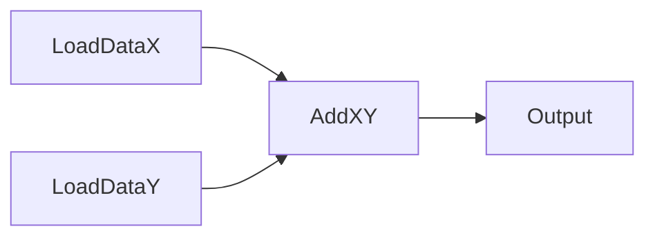

<!-- ads-workspace-gdoc-sync: gdoc_id=18TqdzLUIbZ6OPoLHeA-PO706NwD-8EPi-ZxtIyIzImg gdoc_url=https://docs.google.com/document/d/18TqdzLUIbZ6OPoLHeA-PO706NwD-8EPi-ZxtIyIzImg/edit -->

# graph-engine

**Graph Manager:** [Online](https://graphmanager.shopee.io/) | [Repo](https://git.garena.com/shopee/deep/searchads/graph-manager)

GraphEngine是一个用于将任务编排为DAG（有向无环图）并执行的一个工具。其设计和代码都比较朴素。感兴趣可以自行阅读代码。

主要的几个概念:

1. Op/Operator: 算子，具体执行的任务
2. Node: 图中的每个节点都是一个Node，每个Node关联一个Op（Node和Op是多对一的关系）
3. Graph: 图，由Node组成的DAG
4. GraphEngine: 图引擎，用于执行Graph，一个图引擎包括了一个图和执行的逻辑

一般用户需要通过配置的方式来定义自己的图结构，如果需要自定义Op，则需要实现框架定义的Op接口。

GraphEngine is a tool used for orchestrating tasks into a directed acyclic graph (DAG) and executing them. Its design and code are relatively simple.

The main concepts of GraphEngine include Op/Operator, Node, Graph, and GraphEngine.

1. Operators are specific tasks to be executed
2. Nodes are vertices in the graph associated with an operator. Nodes and operators have a many-to-one relationship, with each node associated with a single operator.
3. Graphs are DAGs made up of nodes
4. GraphEngine is the engine that executes the graph.

Users can define their own graph structure through configuration and implement the framework-defined Op interface if they need to customize operations.

## Configure File 配置文件

> ---
> 
> We provide **GraphManager** to manage and visualize configuration files:
> 
> [Online](https://graphmanager.shopee.io/) | [Repo](https://git.garena.com/shopee/deep/searchads/graph-manager)
> 
> For specific usage, please refer to [here](https://git.garena.com/shopee/deep/searchads/graph-manager/-/blob/master/README.md).
>
> ---

这里支持Json和Yaml两种配置（Yaml可以写注释）,定义一个简单的做加法的图：

Here we can define the graph in Json or Yaml (Yaml supports comments).



```yaml
pool_size: 0              # the size of the pool, 0 means no limit
name: "my test graph"     # the name of the graph
dag:                      # list of node config
  - name: "LoadDataX"     # the name of the node
    op: "LoadIntOp"       # the name of the op
    allow_error: false    # whether allow error, if true, the error will be ignored, or the graph will be stopped
    type: io              # optional, only used in picture generation. the type could be 'io'/'calc'/'mix'/'filter' or empty
    args:                 # the args of the op, will be parsed as map[string]interface{}, args is used to create the op
      "field": "x"        # the key-value pair of the args
    outputs:              # list of output name, should be a list of string
      - "value"
  - name: "LoadDataY"
    op: "LoadIntOp"
    allow_error: false
    type: io
    args:
      "field": "y"
    outputs:
      - "value"
  - name: "AddXY"
    op: "AddIntOp"
    allow_error: false
    type: calc
    inputs:               # list of input node name, should be a list of string with format "nodeName:outputName"
      - "LoadDataX:value" # it means the input of this node is the output of node "LoadDataX" with name "value"
      - "LoadDataY:value" # it means the input of this node is the output of node "LoadDataY" with name "value"
    outputs:              # list of output node name
      - "value"
```

Json：

```json
{
  "pool_size": 0,
  "name": "my test graph",
  "dag": [
    {
      "name": "LoadDataX",
      "op": "LoadIntOp",
      "allow_error": false,
      "type": "io",
      "args": {
        "field": "x"
      },
      "outputs": [
        "value"
      ]
    },
    {
      "name": "LoadDataY",
      "op": "LoadIntOp",
      "allow_error": false,
      "type": "io",
      "args": {
        "field": "y"
      },
      "outputs": [
        "value"
      ]
    },
    {
      "name": "AddXY",
      "op": "AddIntOp",
      "allow_error": false,
      "type": "calc",
      "inputs": [
        "LoadDataX:value",
        "LoadDataY:value"
      ],
      "outputs": [
        "value"
      ]
    }
  ]
}
```

## User defined Operator 自定义Op

在 [Operator](./engine/operator.go) 中定义了Op接口，用户可以实现自己的Op，然后在配置文件中使用。

The Op interface is defined in [Operator](./engine/operator.go). Users can implement their own Op and use it in the configuration file.

```go
type IOperator interface {
    IsAvailable(ctx GraphEngineCtx, inputs []*NodeData) bool
    Execute(ctx GraphEngineCtx, inputs []*NodeData, outputs []*NodeData) error
}
```

- `IsAvailable` 表示当前的Node是否可以执行
  - 一般可以通过 `ctx` 的全局或者请求维度的信息来判断，或者通过输入的NodeData（即所依赖的节点的输出）来判断
  - 如果返回 `true`，则表示可以执行，否则表示不可以执行
  - 注意：框架会记录每个节点是否被执行，在使用`继承`的特性的时候，`IsAvailable`为`true`的节点的输出会被直接继承，不再做重复计算，这部分参考下面的`继承`特性
- `Execute` 表示具体的执行函数，当且仅当 `IsAvailable` 为 `true` 时，框架才会执行该函数
  - 输入和输出的数组顺序和长度与配置文件中的 `inputs` 和 `outputs` 一致
  - 如果执行失败，需要返回错误，框架会根据 `allow_error` 的配置来决定是否继续执行

- `IsAvailable` indicates whether the current Node can be executed
  - Generally, it can be judged by the global or request dimension information of `ctx`, or by the input NodeData (i.e. the output of the dependent node)
  - If `true` is returned, it means that it can be executed, otherwise it means that it cannot be executed
  - Note: The framework will record whether each node is executed. When using the `inheritance` feature, the output of nodes with `IsAvailable` set to `true` will be directly inherited, and no duplicate calculations will be made. Please refer to the `inheritance` feature below for more details.
- `Execute` indicates the specific execution function. Only when `IsAvailable` is `true`, the framework will execute the function
  - The order and length of the input and output arrays are consistent with the `inputs` and `outputs` in the configuration file
  - If the execution fails, an error needs to be returned, and the framework will decide whether to continue execution according to the configuration of `allow_error`

## Usage 用法

```go
package main

import (
    "context"
    "fmt"
    "git.garena.com/shopee/deep/searchads/graph-engine/engine"
    _ "git.garena.com/shopee/deep/searchads/graph-engine/unittest/operator" // must import the operator package to make sure the operators are registered
    "gopkg.in/yaml.v3"
)

func main() {
    // 1. load conf
    graphStr := `
pool_size: 0              # the size of the pool, 0 means no limit
name: "my test graph"     # the name of the graph
dag:                      # list of node config
  - name: "LoadDataX"     # the name of the node
    op: "LoadIntOp"       # the name of the op
    allow_error: false    # whether allow error, if true, the error will be ignored, or the graph will be stopped
    args:                 # the args of the op, will be parsed as map[string]interface{}, args is used to create the op
      "field": "x"        # the key-value pair of the args
    outputs:              # list of output name, should be a list of string
      - "value"
  - name: "LoadDataY"
    op: "LoadIntOp"
    allow_error: false
    args:
      "field": "y"
    outputs:
      - "value"
  - name: "AddXY"
    op: "AddIntOp"
    allow_error: false
    inputs:               # list of input node name, should be a list of string with format "nodeName:outputName"
      - "LoadDataX:value" # it means the input of this node is the output of node "LoadDataX" with name "value"
      - "LoadDataY:value" # it means the input of this node is the output of node "LoadDataY" with name "value"
    outputs:              # list of output node name
      - "value"
`
    var conf engine.GraphEngineConf
    if err := yaml.Unmarshal([]byte(graphStr), &conf); err != nil {
      panic(err)
    }
    // or json.Unmarshal

    // 2. create graph engine
    eng, err := engine.NewGraphEngineFromConf(&conf)
    if err != nil {
      panic(err)
    }

    // 3. execute

    // 3.1 create context with values and timeout
    ctx := context.Background()
    ctx = context.WithValue(ctx, "x", 100)
    ctx = context.WithValue(ctx, "y", 200)

    // 3.2 execute
    result, releaseFn := eng.Execute(ctx, nil)
    defer releaseFn()

    // 3.3 get result
    out1 := result.GetOutputDataByName("AddXY", 0)
    out2 := result.GetOutputDataByIdx(&engine.NodeDataIdx{NodeIdx: eng.GetNodeByName("AddXY").Idx, DataIdx: 0})
    out3 := result.GetOutputDataByIdxList([]*engine.NodeDataIdx{&engine.NodeDataIdx{NodeIdx: eng.GetNodeByName("AddXY").Idx, DataIdx: 0}})[0]
    fmt.Printf("%v + %v = %v or %v or %v\n", ctx.Value("x"), ctx.Value("y"), out1.Get().(int), out2.Get().(int), out3.Get().(int))
}
```

## Error Handling 异常处理

### Node Failure 节点失败

在执行的过程中，如果某个节点执行失败，框架会根据配置来决定是否继续执行。如果节点的 `allow_error` 为 `true`，则会忽略错误，继续执行，否则会停止执行。因节点错误导致的图失败，`GraphStatus.Error()` 中会记录前缀为 `[execute]` 的错误信息。

During the execution, if a node fails to execute, the framework will decide whether to continue execution according to the configuration. If the `allow_error` of the node is `true`, the error will be ignored and the execution will continue, otherwise the execution will be stopped. If the graph fails due to node errors, the error information with the prefix `[execute]` will be recorded in `GraphStatus.Error()`.

### Node Panic 节点panic

在执行的过程中，如果某个节点panic，框架会直接停止执行，因节点panic导致的图失败，`GraphStatus.Error()` 中会记录前缀为 `[panic]` 的错误信息。

During the execution, if a node panics, the framework will stop the execution directly. If the graph fails due to node panic, the error information with the prefix `[panic]` will be recorded in `GraphStatus.Error()`.

### Timeout 超时

`GraphEngine`执行的`Context`中可以设置超时时间，如果`Context`超时或者`Cancel`，框架会直接停止执行，因超时导致的图失败，`GraphStatus.Error()` 中会记录前缀为 `[context]` 的错误信息。

The `Context` executed by `GraphEngine` can set a timeout. If the `Context` times out or `Cancel`, the framework will stop the execution directly. If the graph fails due to timeout, the error information with the prefix `[context]` will be recorded in `GraphStatus.Error()`.

## UnitTest & Coverage 单元测试和覆盖率

```bash
go test -v -cover -covermode=atomic -coverprofile=coverprofile.cov -coverpkg=./engine ./...
# output in html
go tool cover -html=coverprofile.cov -o coverprofile.html
# output in terminal
go tool cover -func=coverprofile.cov
```

## DAG Visualization 图可视化工具

[Doc](./tool/)

## Advanced 高阶技巧

Graph Engine本身仅是一个编排和执行的框架，本身不提供复杂的功能，但是可以通过一些技巧来实现复杂的功能。

### `Template Method` 通过 `模板方法` 增加公共逻辑

"模板方法"是设计模式的一种，用来定义一个算法的骨架，而将一些步骤的实现延迟到子类中。在这里，我们将"模板方法"应用到Op的实现中，可以让用户更方便的实现自己的Op。在Golang中实现模板方法则需要一点点技巧。

"template method" is a design pattern that defines the skeleton of an algorithm and defers the implementation of some steps to subclasses. Here, we apply "template method" to the implementation of Op, which makes it easier for users to implement their own Op. Implementing template methods in Golang requires a little bit of technique.

```go
type IBaseOperator interface {
    IsAvailable(ctx engine.GraphEngineCtx, inputs []*engine.NodeData) bool
    Run(ctx engine.GraphEngineCtx, inputs []*engine.NodeData, outputs []*engine.NodeData) error
    Execute(ctx engine.GraphEngineCtx, inputs []*engine.NodeData, outputs []*engine.NodeData) error
}

type BaseOperator struct {
    Implement IBaseOperator
    Conf      *engine.NodeConf
}

func (op *BaseOperator) ExportError(reqCtx *ReqContext, errType string) {
  // error log and error metric
}

func (op *BaseOperator) ExportLatency(reqCtx *ReqContext, elapsed time.Time, latencyType string) {
  // latency log and latency metric
}

func (op *BaseOperator) IsAvailable(ctx engine.GraphEngineCtx, inputs []*engine.NodeData) bool {
  // check whether the node is available
  // 1. ab_param: in feature server, the `module_list` can be used to control the availability of the node. [Ref](https://git.garena.com/shopee/deep/searchads/feature-server/-/blob/master/pkg/operator/common/req_context.go#L54).
  // 2. global flags: in prerank, there is a `node set` for different scenarios. [Ref](https://git.garena.com/shopee/deep/paidads-recall/-/blob/master/pkg/rank/operator/rank_req_context.go#L105).
  // 3. inputs:
  //    1. all inputs are available
  //    2. some inputs are available
}

func (op *BaseOperator) Run(ctx engine.GraphEngineCtx, inputs []*engine.NodeData, outputs []*engine.NodeData) error {
    panic(fmt.Sprintf("%s[%s] not Implement", op.Conf.Name, op.Conf.Op))
}

func (op *BaseOperator) Execute(ctx engine.GraphEngineCtx, inputs []*engine.NodeData, outputs []*engine.NodeData) error {
    reqCtx := GetReqCtx(ctx)
    start := time.Now()
    if err := op.Implement.Run(ctx, inputs, outputs); err != nil {
        op.ExportError(reqCtx, "run")
        return err
    }
    op.ExportLatency(reqCtx, time.Since(start), "run")
    return nil
}
```

```go
type DerivedOp struct {
    BaseOperator
}

func (op *DerivedOp) Run(ctx engine.GraphEngineCtx, inputs []*engine.NodeData, outputs []*engine.NodeData) error {
  // do something
    return nil
}

func init() {
    err := engine.RegisterOpBuilder("DerivedOp", func(conf *engine.NodeConf) (engine.IOperator, error) {
        op := &DerivedOp{}
        op.Implement = op
        op.Conf = conf
        return op, nil
    })
    if err != nil {
        panic(err)
    }
}
```

### Finalizer 资源释放

有时候，我们的Op依赖一些外部资源，但又希望在Graph的结果被使用完毕后，能够释放这些资源。这时候，我们可以使用Finalizer来实现。需要注意，析构的过程如果很慢，可以使用异步的方式。

Sometimes, our Op depends on some external resources, but we hope that these resources can be released after the results of the Graph are used up. At this time, we can use Finalizer to achieve this. Note that if the destruction process is slow, you can use asynchronous methods.

Ref: [engine_finalizer_test.go](./unittest/engine_finalizer_test.go)

### Inheritance 继承

Please refer to [engine_inheritance_test.go](./unittest/engine_inheritance_test.go)

### Error Handling 节点的停止细节

在前面，我们提到如果节点Error/Panic或者Context超时，图会停止执行。但是，这里有一些细节需要注意。

实际上如果一个节点已经在执行的过程中，那么即使后续的节点Error/Panic或者Context超时，该节点的执行也不会被停止。只是调用方并不会等待该节点的执行结果，而是直接返回错误。

In the previous section, we mentioned that if the node Error/Panic or Context times out, the graph will stop executing. However, there are some details to note here.

In fact, if a node is already in the process of execution, even if the subsequent node Error/Panic or Context times out, the execution of the node will not be stopped. The caller will not wait for the execution result of the node, but will return an error directly.
