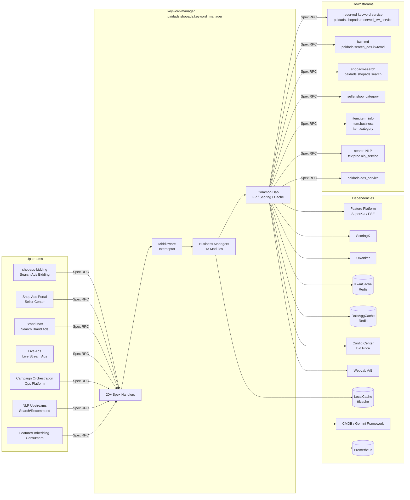

<!-- ads-workspace-gdoc-sync: gdoc_id=1O3_ABvgN0AIaOPYvs_D5JT-a--JmfKRwU7YOaFB4_9g gdoc_url=https://docs.google.com/document/d/1O3_ABvgN0AIaOPYvs_D5JT-a--JmfKRwU7YOaFB4_9g/edit -->

# Keyword Manager

## Table of Contents

- [Introduction](#introduction)
- [Features](#features)
- [Architecture](#architecture)
  - [System Context](#system-context)
  - [Service Topology](#service-topology)
  - [Module Architecture](#module-architecture)
  - [Data Flow](#data-flow)
- [Directory Structure](#directory-structure)
- [Spex API](#spex-api)
  - [RPC Methods](#rpc-methods)
  - [Error Codes](#error-codes)
  - [Request and Response](#request-and-response)
  - [Common Messages](#common-messages)
- [Core Business Modules](#core-business-modules)
- [Core Pipeline — GetRcmdKwList](#core-pipeline--getrcmdkwlist)
  - [Request Entry](#request-entry)
  - [Collection Flow](#collection-flow)
  - [Shop Keyword Recall](#shop-keyword-recall)
  - [Keyword Ranking](#keyword-ranking)
  - [Fill Suggest Price](#fill-suggest-price)
  - [Response Assembly](#response-assembly)
- [Storage and Cache Layer](#storage-and-cache-layer)
  - [KwmCache Redis](#kwmcache-redis)
  - [DataAggCache](#dataaggcache)
  - [In-process TTL Cache](#in-process-ttl-cache)
  - [Key Encoding](#key-encoding)
  - [Feature Platform Integration](#feature-platform-integration)
- [Configuration](#configuration)
  - [Local Service YAML](#local-service-yaml)
  - [Spex Remote Config](#spex-remote-config)
  - [Config Center / Bid Price Namespace](#config-center--bid-price-namespace)
  - [WebLab Toggles](#weblab-toggles)
  - [Per-country Downgrade Flags](#per-country-downgrade-flags)
- [Build and Deployment](#build-and-deployment)
  - [Makefile Targets](#makefile-targets)
  - [Deploy JSON](#deploy-json)
  - [Resource Specs](#resource-specs)
  - [Local Run](#local-run)
- [Development Guidelines](#development-guidelines)
  - [How to Add a New RPC](#how-to-add-a-new-rpc)
  - [How to Add a New Manager](#how-to-add-a-new-manager)
  - [Resource / Decorator Pattern](#resource--decorator-pattern)
  - [Error Code Conventions](#error-code-conventions)
  - [Unit Testing](#unit-testing)
  - [Code Style & Git Workflow](#code-style--git-workflow)
- [Monitoring](#monitoring)
  - [Prometheus Metrics](#prometheus-metrics)
  - [Key Monitoring Points](#key-monitoring-points)
  - [HTTP Endpoints](#http-endpoints)
- [Business Terminology Glossary](#business-terminology-glossary)
- [Additional Resources](#additional-resources)
- [Frequently Asked Questions](#frequently-asked-questions)

---

## Introduction

**keyword-manager** is the unified keyword service for Shopee Paid Ads (Shop Ads / Brand Ads / Live Ads). It serves **20+ Spex RPC APIs** covering keyword recommendation, suggested bid price, shop/item attribute aggregation, live stream/brand ads estimation, and Campaign metadata.

**Git Repository:** https://git.garena.com/shopee/deep/brand-ads/keyword-manager

| Attribute | Value |
|-----------|-------|
| Go module | `git.garena.com/shopee/deep/brand-ads/keyword-manager` |
| Go version | 1.21 (toolchain go1.21.12) |
| Framework | [Gemini](https://git.garena.com/shopee/deep/gemini) |
| Spex service name | `shopee.paidads.brand_ads.shopads.reservedkw.keyword_manager` |
| Protocol namespace | `paidads.shopads.keyword_manager` |
| Error code range | `[332200000, 332300000)` |
| HTTP port | 20030 |

### Core Capability Domains

| Domain | Main APIs |
|--------|-----------|
| Shop Keyword Recommendation | `get_rcmd_kw_list` / `get_sim_rcmd_kw_list` |
| Keyword Suggested Bid Price | `get_kw_suggest_price` |
| Shop Attribute Query | `get_shop_bidding_info` / `batch_get_shop_attribute` / `batch_get_shop_roi` / `batch_get_shop_budget_split` |
| Item Attribute & I2I | `batch_get_item_attribute` / `get_shop_top_item_list` |
| Embedding Vectors | `batch_get_embedding` |
| Campaign Metadata | `get_campaign_surge_list` / `get_non_campaign_days` |
| NER | `get_query_ner` / `get_item_ner_list` |
| Live Stream Ads | `get_live_stream_ads_info` / `get_live_stream_estimated_conversion` / `get_historical_items_by_uid` |
| Brand Ads (SBA) | `get_brand_ads_estimate_impression` / `get_brand_ads_shop_keyword` |

**Internal architecture:** All APIs share a common dao layer (Feature Platform / ScoringX / URanker / KwmCache Redis / external Spex APIs), initialized via `app.WithXxx()` options, following a **Handler → Manager → Dao/Dto → External Resources** layered design.

---

## Features

- **Keyword Recommendation**: Aggregates candidate keywords from shop history, top-selling items, and keyword recommendation service (kwrcmd); filters Reserved Keywords; sorts by search volume and returns up to 55 results.
- **Similar Keywords**: Given a keyword, retrieves expansion keywords via QueryExpansionEnv v2 and shopads-search fallback.
- **SuggestPrice**: Integrates ScoringX (iifmv1), URanker, and Feature Platform (query/item features, eCPM) to compute pCTR and QualityScore, then clamps prices against Min/MaxPriceMap from Config Center.
- **Shop Attribute Aggregation**: `batch_get_shop_attribute` supports bulk queries across SimpleMode/ManualMode BiddingInfo, TargetROAS, LearningPhase, CensoringTag, and live stream attributes in one call.
- **Batch Embedding Query**: Supports 5 FeatureTypes (KEYWORD/ITEM/SHOP/KW_ITEM/KW_BIDKW), dimensions 16–1024 (v1/v2), up to 50 items per request.
- **Live Stream Ads**: 15 queue types (CCU/LIKE/COLD_START/TARGET_ROAS etc.), historical/forecasted view and GMV aggregation, ScoringX calibration.
- **Brand Ads (SBA)**: Estimated impressions, CPM, daily spend; supports Reserved/Expansion Keywords with in-process LocalCache to reduce Redis pressure.
- **Campaign Info**: Fetches and caches four-state campaign data (NonCampaignDay / PreCampaign / EarlyBoost / Campaign) per country.
- **NER**: Dual-path (Feature Platform + NLP Spex), supporting entity types MAIN_PRODUCT/BRAND/PRODUCT/MODEL etc.
- **Dynamic Downgrade**: 26 `DowngradeOption.Disable*` fields + 13 `ToggleOption` switches, hot-reloadable per country without restart.

---

## Architecture

### System Context

keyword-manager sits at the core data aggregation layer of the Paid Ads pipeline. Upstream callers include the bidding pipeline, seller portal, brand ads, and live ads frontends. Downstream dependencies include the keyword recommendation service, item services, Feature Platform, and multiple Redis clusters.

### Service Topology



**Topology Table:**

| Type | Service | Protocol | Description |
|------|---------|----------|-------------|
| Upstream | shopads-bidding / Search Ads | Spex RPC | Fetches SimpleMode bid info, ROI, TargetROAS, LearningPhase, BudgetSplit |
| Upstream | Shop Ads Portal / Seller Center | Spex RPC | Retrieves recommended keywords, similar keywords, suggested bids, shop top items |
| Upstream | Brand Max / Search Brand Ads | Spex RPC | Fetches brand ads estimated impressions, CPM, Expansion Keywords |
| Upstream | Live Ads | Spex RPC | Live stream queues, conversion estimates, streamer historical items |
| Upstream | Campaign Orchestration / Ops Platform | Spex RPC | Campaign surge periods, non-campaign day configs |
| Upstream | NLP Upstreams | Spex RPC | Keyword/item NER recognition |
| Upstream | Feature/Embedding Consumers | Spex RPC | Batch embedding vector queries |
| Downstream | reserved-keyword-service | Spex RPC | Query Reserved Keyword status and reason |
| Downstream | kwrcmd (keyword recommendation) | Spex RPC | Get candidate keyword list |
| Downstream | shopads-search | Spex RPC | Query shop ads score by keyword |
| Downstream | seller.shop_category | Spex RPC | Fetch shop item collections by CollectionId |
| Downstream | item.item_info / item.business / item.category | Spex RPC | Item lists, item details, category info |
| Downstream | search NLP textproc.nlp_service | Spex RPC | External NER recognition |
| Downstream | paidads.ads_service | Spex RPC | Campaign day metadata |
| Dependency | Feature Platform (SuperKia / FSE) | HTTP/gRPC | Keyword/item/shop features, eCPM, NER features, embeddings |
| Dependency | ScoringX | gRPC | iifmv1 (keyword ads), shopadgbdtv4_newDesign (shop ads), live_ads_view_est_cali_v1 (live calibration) |
| Dependency | URanker | gRPC | High-precision bid scoring (dynamically toggled) |
| Dependency | KwmCache (Redis) | Redis | SimpleMode/ManualMode bids, ROI, Embedding, I2I, BudgetSplit, BrandAds, LiveStream queues |
| Dependency | DataAggCache (Redis) | Redis | Live stream historical view/GMV aggregation |
| Dependency | LocalCache (ttlcache) | In-process | BrandAds in-process secondary cache |
| Dependency | Config Center | HTTP | Hot-reload bid price min/max maps |
| Dependency | WebLab | HTTP | A/B experimentation, runtime strategy selection |
| Dependency | Prometheus | HTTP | Service metrics |

### Module Architecture

```
cmd/server/server.go                 # Entry: flag parsing → gemini.Init → app.InitializeApp
└── internal/app/
    ├── app.go                       # App struct definition
    └── init_options.go              # LoadConfig → WithConfigCenter → WithPrometheus
                                     # → WithResourceManager → WithInterceptor
                                     # → WithGlobalStrategies → With<Mgr>...
                                     # → WithResources (register Decorators) → With<Handler>...
                                     # → WithRoute
├── internal/route/register.go      # Registers all Spex ProcessorConfig entries
├── internal/handler/<api>/          # Per-RPC Handler (Validation + Manager calls)
├── internal/interceptor/            # TimeoutInterceptor + RateLimiterInterceptor
├── internal/pkg/<domain>/
│   ├── manager/                    # Business Manager (singleton GlobalXxxManager)
│   ├── dao/                        # Data access (Spex / Redis / FP), var Fn = func(...)
│   ├── dto/                        # Business data transformation
│   └── decorate.go                 # Decorator registration
├── internal/config/
│   ├── config.go                   # Static Config struct
│   └── dynamic.go                  # DynamicConfig + DisableByCountry logic
├── internal/prome/prometheus.go     # Prometheus Counter/Histogram definitions
├── pkg/
│   ├── types/                      # Shared types (KeywordInfo / Request interface etc.)
│   ├── utils/const.go              # All constants, cache key formats, Decorator names
│   └── client/weblab_client.go     # WebLab Helper
└── spex/
    ├── sp_proto/                   # Proto source files
    └── gen/go/                     # Generated pb.go files
```

**Middleware/Interceptor Layering:**
```
gemini global strategy (recover + ulog + metric + tracing)
  └── sps.RegisterGlobalServerInterceptors (panic_recover / logger / metric / tracing)
        └── route-level interceptors (timeout + rate_limiter, config_key: get_kwmanager_*)
              └── middleware.GetMiddleware (record ts + ExportHandlerEvent)
                    └── handler.GetRcmdKwList and other business handlers
```

**Resource / Decorator Pattern:**  
`app.WithResources` registers 50+ Decorators, wrapping dao/manager functions with `panic_recover + ulog + metric + tracing`. Resource names are defined as `Decorated*` constants in `pkg/utils/const.go`. At runtime, `DowngradeOption` allows circuit-breaking individual decorators per country (e.g., `DisableFeaturePlatform`, `DisableEmbedding`).

### Data Flow

Using `GetRcmdKwList` as an example:

```
Spex request
  → middleware.SetupKwmContext (inject logger/tracing into context)
  → validation.ValidateRequest (validateHeader / validateCountry / validateShopId)
  → [collectionId > 0] shopRcmdMgr.GetShopRcmdKwsFromItems (Collection branch)
  → shopRcmdMgr.GetShopRcmdKws (kwrcmd + shopads-search + Reserved filter)
  → rankMgr.RankKwByVolumeCache (sort by search volume, truncate to MaxKwToRecommend=55)
  → [fill_suggest_price=true] spMgr.GetKwSuggestPrice (FP features + ScoringX/URanker → price)
  → assembleMgr.FormatGetRcmdKwListResponse (fill quality_score / search_volume / is_reserved)
  → return Spex response
```

---

## Directory Structure

```
keyword-manager/
├── bin/                    # Makefile (compiled binary output here)
├── cmd/server/             # main.go entry point
├── configs/                # Per-environment service.yml (test / uat / staging / liveish / live)
├── deploy/
│   └── keywordmanager.json # Deployment config (build commands, resource specs, health check)
├── gemini.yaml             # Gemini framework config (Spex service name, config_key, CI generation)
├── go.mod / go.sum         # Go module dependencies
├── internal/
│   ├── app/                # Application initialization (InitializeApp + InitOption chain)
│   ├── config/             # Static config + dynamic config structs
│   ├── handler/            # Per-RPC Handlers (validation sub-package)
│   ├── interceptor/        # Timeout + RateLimiter interceptors
│   ├── pkg/                # Business Manager / Dao / Dto
│   │   ├── assemble/       # Response assembly
│   │   ├── bidding_info/   # Shop bid info
│   │   ├── brand_ads/      # Brand Ads
│   │   ├── budget_split/   # Budget split
│   │   ├── campaign/       # Campaign info
│   │   ├── common/dao/     # Shared Dao (ExternalAPI / FP / KwmCache / Scoring / URanker)
│   │   ├── embedding/      # Batch embedding query
│   │   ├── i2i/            # I2I item similarity
│   │   ├── live_stream/    # Live stream ads
│   │   ├── rank/           # Keyword ranking
│   │   ├── shop_censoring/ # Shop censoring detection
│   │   ├── shop_rcmd_kw/   # Shop keyword recommendation
│   │   ├── shop_top_item/  # Shop top items
│   │   ├── similar_kw/     # Similar keywords
│   │   └── suggest_price/  # Suggested bid price
│   ├── prome/              # Prometheus metric definitions
│   └── route/              # Spex route registration
├── pkg/
│   ├── client/             # WebLab client
│   ├── types/              # Shared type definitions
│   └── utils/              # Constants, cache key formats, utility functions
├── spex/
│   ├── gen/go/             # Generated pb.go files from proto
│   └── sp_proto/           # Proto source definitions
└── tools/                  # Development tools
```

---

## Spex API

**Proto file path:** `spex/sp_proto/paidads/shopads/keyword_manager.proto`  
**Package:** `paidads.shopads.keyword_manager`  
**Syntax:** proto2, using `gogo/protobuf` code generation

### RPC Methods

| Command | Request | Response | Use Case |
|---------|---------|----------|----------|
| `get_rcmd_kw_list` | `GetRcmdKwListRequest` | `GetRcmdKwListResponse` | Recommend keywords for a seller (with suggested bids) |
| `get_sim_rcmd_kw_list` | `GetSimRcmdKwListRequest` | `GetSimRcmdKwListResponse` | Get similar/expansion keywords for a given keyword |
| `get_kw_suggest_price` | `GetKwSuggestPriceRequest` | `GetKwSuggestPriceResponse` | Get suggested bid price and quality score for keywords |
| `get_shop_top_item_list` | `GetShopTopItemListRequest` | `GetShopTopItemListResponse` | Get top-selling items for a shop |
| `get_shop_bidding_info` | `GetShopBiddingInfoRequest` | `GetShopBiddingInfoResponse` | Get shop SimpleMode/ManualMode bidding info |
| `batch_get_shop_roi` | `BatchGetShopROIRequest` | `BatchGetShopROIResponse` | Batch query shop ROI |
| `batch_get_embedding` | `BatchGetEmbeddingRequest` | `BatchGetEmbeddingResponse` | Batch fetch embedding vectors |
| `get_non_campaign_days` | `GetNonCampaignDaysRequest` | `GetNonCampaignDaysResponse` | Get non-campaign days list |
| `get_campaign_surge_list` | `GetCampaignSurgeListRequest` | `GetCampaignSurgeListResponse` | Get campaign surge period configs |
| `get_query_ner` | `GetQueryNerRequest` | `GetQueryNerResponse` | Get NER results for a query/keyword |
| `get_item_ner_list` | `GetItemNerListRequest` | `GetItemNerListResponse` | Batch get NER results for items |
| `batch_get_shop_attribute` | `BatchGetShopAttributeRequest` | `BatchGetShopAttributeResponse` | Batch query multiple shop attribute dimensions |
| `batch_get_item_attribute` | `BatchGetItemAttributeRequest` | `BatchGetItemAttributeResponse` | Batch query item attributes (I2I) |
| `batch_get_shop_budget_split` | `BatchGetShopBudgetSplitRequest` | `BatchGetShopBudgetSplitResponse` | Batch fetch shop budget splits |
| `get_historical_items_by_uid` | `GetHistoricalItemsByUIDRequest` | `GetHistoricalItemsByUIDResponse` | Get streamer's historical items |
| `get_live_stream_estimated_conversion` | `GetLiveStreamEstimatedConversionRequest` | `GetLiveStreamEstimatedConversionResponse` | Estimate live stream conversion (View/GMV) |
| `get_live_stream_ads_info` | `GetLiveStreamAdsInfoRequest` | `GetLiveStreamAdsInfoResponse` | Get live stream ad queue info |
| `get_brand_ads_estimate_impression` | `GetBrandAdsEstimateImpressionRequest` | `GetBrandAdsEstimateImpressionResponse` | Brand ads estimated impressions/CPM/daily spend |
| `get_brand_ads_shop_keyword` | `GetBrandAdsShopKeywordRequest` | `GetBrandAdsShopKeywordResponse` | Brand ads shop keywords (including Expansion Keywords) |

> **Note:** `get_shop_last_item_list` and `get_campaign_info` have Cmd constants defined in `pkg/utils/const.go` but are not registered in the route.

### Error Codes

| Error Code | Value | Meaning |
|-----------|-------|---------|
| `ERROR_BAD_REQUEST` | 332200000 | Request format error |
| `ERROR_UNKNOWN` | 332200001 | Unknown error |
| `ERROR_INTERNAL` | 332200002 | Internal error |
| `ERROR_INVALID_REQUESTID` | 332200003 | Invalid request_id |
| `ERROR_INVALID_COUNTRY` | 332200004 | Invalid country code |
| `ERROR_INVALID_KEYWORD` | 332200005 | Invalid keyword |
| `ERROR_INVALID_SHOPID` | 332200006 | Invalid shop_id |
| `ERROR_INVALID_RCMD_PRICE_VERSION` | 332200007 | Invalid rcmd_price_version (must be v1/v2) |
| `ERROR_INVALID_LIMIT` | 332200008 | Invalid limit |
| `ERROR_EXCEED_SHOP_IDS_LIMIT` | 332200009 | shop_ids exceeds limit (max 50) |
| `ERROR_EXCEED_FEATURES_LIMIT` | 332200010 | features exceeds limit (max 50) |
| `ERROR_INVALID_EMBEDDING_VERSION` | 332200011 | Invalid embedding version (must be v1/v2) |
| `ERROR_INVALID_DIMENSION` | 332200012 | Invalid Dimension |
| `ERROR_EXCEED_ITEM_IDS_LIMIT` | 332200013 | item_ids exceeds limit |
| `ERROR_INVALID_ATTRIBUTE_TYPE` | 332200014 | Invalid attribute type |
| `ERROR_EXCEED_SHOP_BUDGETS_LIMIT` | 332200015 | shop_budgets exceeds limit (max 50) |
| `ERROR_INVALID_USERID` | 332200016 | Invalid user_id |
| `ERROR_INVALID_PRICING_TYPE` | 332200017 | Invalid pricing type (only 9/10 supported) |
| `ERROR_INVALID_START_END_DATE` | 332200018 | Invalid start/end date |

### Request and Response

All requests must include `RequestHeader{request_id*, country*}`. The `country` field must match one of the values in `DynamicConfig.Countries` (TW/ID/SG/MY/TH/VN/PH/BR/MX).  
All responses return `ResponseHeader{request_id, err_code}`, written uniformly via `utils.ParseErrCode`.

### Common Messages

| Struct | Key Fields |
|--------|-----------|
| `RcmdKwInfo` | `keyword`, `recommend_price`, `quality_score`, `search_volume`, `is_reserved`, `reserved_reason` |
| `ItemInfo` | `item_id`, `shop_id`, `name`, `categories`, `score`, `click_count`, `sold_count`, `pctr`, `collection_id`, `price`, `global_cat_ids`, `global_cat_names` |
| `ShopBiddingInfos` | `exact_match_bid_info[]`, `broad_match_bid_info[]`, `target_roi`, `shop_id` |
| `BidInfo` | `keyword`, `price`, `version` |
| `Feature` | `Value{int32/int64/float/double/bool/string}` |
| `EmbeddingData` | `vector[]` |

**Key Enumerations:**
- `Dimension`: 4→16 / 5→32 / 6→64 / 7→128 / 8→256 / 9→512 / 10→1024
- `FeatureType`: KEYWORD / ITEM / SHOP / KW_ITEM / KW_BIDKW
- `CampaignStatus`: CAMP_NO_CAMP / CAMP_PRE_CAMP / CAMP_EARLY_BOOST / CAMP_CAMP
- `NerAttribute`: EMPTY / MAIN_PRODUCT / BRAND / PRODUCT / MODEL / MEASUREMENT / IP / ATTRIBUTE
- `ShopAttribute`: SHOP_BIDDING_INFO / SHOP_ROI / SHOP_CENSORING / SHOP_TARGET_ROAS / SHOP_LEARNING_PHASE / STREAMER_TARGET_ROAS / LIVE_ADS_SUGGEST_BUDGET
- `ItemAttribute`: ITEM_I2I
- `CensoringTag`: ADULT
- `KeywordsType`: RESERVED / EXPANSION
- `SbaTemplate`: STANDER / BANNER_AND_LIVE / VIDEO_AND_LIVE
- `LiveSteamQueueType`: 15 types (CCU / LIKE / COLD_START / TARGET_ROAS_COLD_START etc.)

---

## Core Business Modules

| Module | Manager Path | Handler Path | Main Dependencies | Main Cache |
|--------|-------------|-------------|-------------------|-----------|
| Keyword Recommendation | `internal/pkg/shop_rcmd_kw/manager` | `get_rcmd_kw_list` | kwrcmd Spex + shopads-search + reserved-keyword-service + FP | KwmCache (rcmd_kw_by_shop / shop_cache) |
| Similar Keywords | `internal/pkg/similar_kw/manager` | `get_sim_rcmd_kw_list` | QueryExpansionEnv v2 + shopads-search + reserved-keyword-service | KwmCache |
| Suggested Bid Price | `internal/pkg/suggest_price/manager` | `get_kw_suggest_price` | ScoringX (iifmv1) + URanker + FP (query/item/eCPM) + Config Center | KwmCache (eCPM) |
| Shop Top Items | `internal/pkg/shop_top_item/manager` | `get_shop_top_item_list` | item.item_info + item.business + item.category + shopads-search | — |
| Shop Bidding Info | `internal/pkg/bidding_info/manager` | `get_shop_bidding_info` / `batch_get_shop_roi` | — | KwmCache (sm_kp_ / mm_kp_ / sm_roi_ / target_roas_ / learning_phase_) |
| Batch Shop Attribute | bidding_info + shop_censoring | `batch_get_shop_attribute` | Multi-module aggregation | KwmCache |
| I2I | `internal/pkg/i2i/manager` | `batch_get_item_attribute` | — | KwmCache (I2I_{cid}_{item_id}) |
| Budget Split | `internal/pkg/budget_split/manager` | `batch_get_shop_budget_split` | — | — (uses fixed `DefaultMergedShopBudgetRatio=1`; both Search and Rcmd placements receive full budget allocation) |
| Embedding | `internal/pkg/embedding/manager` | `batch_get_embedding` | — | KwmCache (emb_k_ / emb_i_ / emb_k_i_) |
| Campaign | `internal/pkg/campaign/manager` | `get_campaign_surge_list` / `get_non_campaign_days` | paidads.ads_service.get_campaign_days | In-process MemCache |
| NER | `internal/handler/get_query_ner` / `get_item_ner_list` | — | NLP Spex + FP (NER features) | — |
| Live Stream Ads | `internal/pkg/live_stream/manager` | `get_live_stream_ads_info` / `get_live_stream_estimated_conversion` / `get_historical_items_by_uid` | KwmCache (queues) + DataAggCache + ScoringX (live_ads_view_est_cali_v1) | KwmCache / DataAggCache |
| Brand Ads (SBA) | `internal/pkg/brand_ads/manager` | `get_brand_ads_estimate_impression` / `get_brand_ads_shop_keyword` | — | KwmCache + LocalCache (ttlcache) |

---

## Core Pipeline — GetRcmdKwList

### Request Entry

The `GetRcmdKwList` function in `internal/handler/get_rcmd_kw_list/get_rcmd_kw_list.handler.go` is wrapped by `middleware.GetMiddleware` and registered as a Spex ProcessorConfig.

```
GetRcmdKwList
  ├── middleware.SetupKwmContext    # Inject logger, request_id, country into context
  ├── log.FromContext               # Get trace-aware logger
  └── validation.ValidateRequest    # GetRcmdKwListValidators:
                                    #   validateHeader / validateRequestId
                                    #   validateCountry / validateShopId
```

### Collection Flow

When `collection_id > 0` and `!DisableCollectionFlow` (per country):

```
shopRcmdMgr.GetShopRcmdKwsFromItems
  ├── Fetch shop collection item list (seller.shop_category)
  ├── Get candidate keywords from KwmCache / FP
  └── Emit ExporterShopCollection.<magnitude>
```

### Shop Keyword Recall

```
shopRcmdMgr.GetShopRcmdKws
  ├── EnableNewRcmdKwCache → KwmCacheDao.GetRcmdKwInfoCache (new cache path)
  ├── Otherwise → kwrcmd.get_kw (KwRcmdGetKwCmd) to fetch candidates
  ├── ReservedKwDto.FilterReservedKw (filter/downgrade reserved keywords per EnableReservedKwTypes whitelist)
  └── DisableShopRcmdKwCache → decide whether to write back cache
```

If count < `MaxKwToRecommend=55`, supplement with `GetShopRcmdKwsFromItems` (based on top-selling items), merged via `JoinItemsShopKwInfos`.

### Keyword Ranking

```
rankMgr.RankKwByVolumeCache
  ├── Read search_volume from QueryStatsCache (codis) or FP
  └── Sort descending by search volume, truncate to MaxKwToRecommend
```

### Fill Suggest Price

When `request.fill_suggest_price=true` and `rcmd_price_version` is valid (v1/v2):

```
spMgr.GetKwSuggestPrice
  ├── FP features (query feature + item feature + eCPM subkey by country)
  ├── ScoringX (iifmv1) or URanker to compute pCTR
  ├── Calculate price using PriceDeltaMap step
  ├── Clamp against Config Center Min/MaxPriceMap
  └── Fill back recommend_price / quality_score
```

Downgrade points: `DisableScoringKwAd` (skip ScoringX), `DisableQueryStatsCache` (skip volume ranking cache), `DisableShopAdsScoreECPM` (use cached eCPM instead).

### Response Assembly

```
assembleMgr.FormatGetRcmdKwListResponse
  ├── Merge RcmdKwInfo + SuggestPrice results
  ├── Set is_reserved / reserved_reason
  └── ExportCounterMetrics(ProcessQPS, country, get_rcmd_kw.<kw_count_magnitude>)
```

---

## Storage and Cache Layer

### KwmCache Redis

`internal/pkg/common/dao/kwm_cache.go` built on `redisutil/v8 + go-redis`, supporting per-country independent connections (`CountryConn`).

| Key Format | Module | Description |
|-----------|--------|-------------|
| `sm_kp_%s_%v` | BiddingInfo | SimpleMode bid, %s=cid, %v=shopId |
| `mm_kp_%s_%v` | BiddingInfo | ManualMode bid |
| `sm_roi_%s_%v` | BiddingInfo | Shop ROI |
| `target_roas_%s[_%d]` | BiddingInfo | TargetROAS (country or shop granularity) |
| `learning_phase_%s_%d` | BiddingInfo | LearningPhase flag |
| `emb_k_%s_%d` | Embedding | Keyword embedding |
| `emb_i_%s_%d` | Embedding | Item embedding |
| `emb_k_i_%s_%d` | Embedding | Keyword-item embedding |
| `I2I_%s_%d` | I2I | Item I2I similarity list |
| `ADULT_%s` | ShopCensoring | Adult censoring tag |
| `%s_%d_aggr_daily_impression` | BrandAds | Brand ads daily impression |
| `%s_%d_cpm` | BrandAds | Brand ads CPM |
| `%s_%d_brand_ads_keywords` | BrandAds | Brand ads keywords |
| `%s_%d_brand_ads_exp_kw` | BrandAds | Expansion keywords |
| Various LiveStream*RedisKey | LiveStream | Multiple queue types |

### DataAggCache

`internal/pkg/live_stream/dao/data_agg_cache.go` — dedicated Redis for live stream historical/forecast data:

| Key Format | Description |
|-----------|-------------|
| `est_hist_imp_view_{cid}_{MM_dd}` | Historical view count |
| `est_hist_imp_gmv_{cid}_{MM_dd}` | Historical GMV |
| `est_forecast_view_for_you_{cid}_{MM_dd}` | Forecast view (For You) |
| `est_forecast_imp_discover_{cid}_{MM_dd}` | Forecast impression (Discover) |
| `est_actual_view_for_you_{cid}_{MM_dd}` | Actual view |
| `est_actual_imp_discover_{cid}_{MM_dd}` | Actual impression |

Warmed and refreshed periodically by `GlobalLiveStreamManager.CacheDto` (registered as `gemini.AdditionalService`).

### In-process TTL Cache

`internal/pkg/brand_ads/manager/brand_ads_mgr.go` uses `jellydator/ttlcache/v2` (`SizeLimit + TTLInMinute` controlled by `CommonConfig.LocalCache`) to reduce KwmCache Redis pressure.  
`GetBrandAdsKeywordInfo` (`get_brand_ads_shop_keyword`) follows an **L1 local → L2 Redis** pattern: keys `%s_%d_brand_ads_keywords` / `%s_%d_brand_ads_exp_kw` are read from `ttlcache` first, falling back to Redis on miss and writing the result back to local cache.  
`AssembleManager` caches global category names via `cache.Cache` (MemCacheTTL). `CampaignManager` caches campaign days API results.

### Key Encoding

All key formats are defined as `*Format` constants in `pkg/utils/const.go`:
- `%s` = lowercase country code (cid)
- `%d` = shopId / itemId / userId
- BrandAds and LiveStream keys use `{cid}_{shop_id}_` prefix style, which differs from other modules' `{prefix}_{cid}_{id}` ordering.

### Feature Platform Integration

`internal/pkg/common/dao/feature_platform.go`: Initializes multiple `paidads-superkia fetch.Client` instances per `FeatureStructMap` (key→feature struct) with CliTag routing. The `Countries` field restricts which countries use this client. Runtime downgrade: `DisableFeaturePlatform` / `DisableItemFeatureCache` / `DisableNerFeaturePlatform` (all per-country controlled).

---

## Configuration

### Local Service YAML

Located at `configs/{env}/service.yml`. Key fields:

```yaml
service:
  service_name: shopee.paidads.brand_ads.shopads.reservedkw.keyword_manager
  spex:
    tag: master
    sdu_id: default
    config_key: ce11a9ec67887dbac2ad1dcf9270ae4c   # test/uat/staging
    # live/liveish: 2af55fbf6495e6f556a74306b566b53d
  logger:
    level: info
    type: file
    encode_as_json: true
    file: keyword_manager.log
  enable_tracer: true
  enable_metrics: true
  enable_pprof: true
  health_check_endpoint: /health_check
  shutdown_timeout_seconds: 5
```

### Spex Remote Config

Subscribed via `search-config-management/cfgmng + Spex Agent`:

- **`server_config` (ServerConfigKey)**: Maps to `Config` struct in `internal/config/config.go`, containing Common (FP / KwmCache / DataAggCache / LocalCache), ShopRecommendKw, SimilarKw, SuggestPrice (Scoring / URanker), ShopTopItem, Rank, Assemble, BiddingInfo, WebLabConfig, Embedding, LSConversionConfig sub-sections.
- **`dynamic_config` (DynamicConfigKey)**: Maps to `DynamicConfig`, containing LogLevel / Countries / DowngradeOption (26 Disable\*) / ToggleOption (13 switches) / ScoringOption / CampaignInfo / ShopAdsOption / SuggestPriceOption / BudgetSplitOption / LSConversionOption / LiveAdsOption / BrandAdsOption. Hot-reloaded via `OnReload` without restart.
- **Route timeout/rate limit**: `get_kwmanager_timeout_config_key` / `get_kwmanager_rate_limit_config_key`, configured per command. Enabled for: `get_rcmd_kw_list` / `get_sim_rcmd_kw_list` / `get_kw_suggest_price` / `get_shop_top_item_list` / `get_shop_bidding_info` / `batch_get_shop_roi` / `batch_get_embedding` / `get_item_ner_list` / `get_query_ner` / `get_live_stream_ads_info`. Other commands have no timeout/rate limit configured.

### Config Center / Bid Price Namespace

Subscribes to `paid_ads/paid_ads_platform/{BidPriceConfigName}`, hot-loading `min_bid_price / max_bid_price` under `search_shop.exact_match` into `utils.MinPriceMap / utils.MaxPriceMap`.  
Config Center URL: `https://config.shopee.io/group/paid_ads/project/paid_ads_platform/cluster/live/namespaces/bid_price_live_default`

### WebLab Toggles

`pkg/client/weblab_client.go`: Builds a Helper using `WebLabConfig.ProductId + WebLabTimeout`. `DecoratedQueryWebLab` fetches runtime A/B experiment assignments (selecting different ScoringX algorithms, enabling URanker, strategy switching etc.).

### Per-country Downgrade Flags

`DowngradeOption` 26 `Disable*` fields evaluated by `config.DisableByCountry`:
- `"1"` or `"all"` → globally disabled
- `"0"` → disable downgrade (run normally)
- Other strings → case-insensitive substring match against country code (e.g., `"SG,MY"` only downgrades for SG and MY)

`ToggleOption` 13 switches control: Collection Flow / new keyword cache / TopOne price strategy / EtcdQE / KwRcmd / ShopAdsScoreECPM / LearningPhase / CampaignAPI / ROI adjustment / ItemFeatureCache etc.

---

## Build and Deployment

### Makefile Targets

```bash
# Local build
cd bin && make server

# Local run
./server --config configs/test/service.yml --port 20030
```

`bin/Makefile` outputs to `bin/server` (native) and `bin/server.linux` (cross-compiled).

### Deploy JSON

Key configuration in `deploy/keywordmanager.json`:
- `project_dir_depth`: 2, `project_name`: shopads, `module_name`: keywordmanager
- **Build commands**: `go mod vendor -v` → `make -C bin clean all` → `rm -rf vendor` → `cp bin/server .` → `cp configs/${env}/* configs/`
- **Base image**: `harbor.shopeemobile.com/shopee/golang-base:1.19.10-20`
- **Run command**: `./server`
- **Health check**: HTTP `/health_check` (timeout 5s, retry 10, grace_period 60s)
- `enable_prometheus: true`

### Resource Specs

| Environment | CPU | Memory (GB) | Instances |
|------------|-----|-------------|-----------|
| test | 4 | 1 | 4 |
| uat | 16 | 8 | 16 |
| staging | 16 | 8 | 16 |
| liveish | 32 | 32 | 32 |
| live | 32 | 32 | 32 |

### Local Run

```bash
go run cmd/server/server.go --config configs/test/service.yml --port 20030
```

Prerequisites: Spex Agent reachable (via `sps.GetDefaultAgent()`), Spex Config Manager can fetch `server_config` / `dynamic_config`, Config Center connected (bid price), KwmCache / DataAggCache Redis reachable.

---

## Development Guidelines

### How to Add a New RPC

1. Define request/response in `spex/sp_proto/paidads/shopads/keyword_manager.proto` (proto2 + optional, error codes within 332200000–332300000 range)
2. Regenerate pb files under `spex/gen/go/`
3. Add `*Cmd` constant in `pkg/utils/const.go`
4. Create `internal/handler/<new_api>/handler.go` (defining `GlobalXxxHandler + NewXxxHandler + XxxHandler`)
5. Add `XxxValidators` list in `internal/handler/validation/validators.go`
6. Append route entry in `internal/route/register.go` with appropriate interceptors
7. Add `WithXxxHandler` option in `internal/app/init_options.go` and validate dependent Managers
8. Call `app.WithXxxHandler()` in `cmd/server/server.go`
9. Add unit tests and `gemini.yaml commands.<cmd>` entry

### How to Add a New Manager

1. Create `internal/pkg/<domain>/` directory
2. Define `NewXxxManager(conf)` and `GlobalXxxManager` (singleton) under `manager/`
3. Wrap data source access under `dao/` via `var Fn = func(ctx,...) {}` for easy Decorator wrapping
4. Implement data transformation under `dto/`
5. Add `WithXxx` option in `internal/app/init_options.go` and call it in `cmd/server/server.go`
6. Register dao-level functions in `app.WithResources` as `DecoratedXxx` entries

### Resource / Decorator Pattern

Uses `git.garena.com/shopee/deep/gemini/pkg/rm + interceptor.DecoratedOption` to wrap each dao/manager function with `panic_recover / ulog / metric / tracing`. Stable resource names are declared as `Decorated*` constants in `pkg/utils/const.go` for metric and log aggregation.

### Error Code Conventions

- All business Handlers return `uint32` error codes
- Prefer returning proto `Constant.ErrorCode` (range 332200000–332200018)
- Generic errors use `ERROR_INTERNAL=332200002` or `ERROR_UNKNOWN=332200001`
- Write back to `ResponseHeader.err_code` uniformly via `utils.ParseErrCode(response.Header, errCode)`

### Unit Testing

- Use `testify`; test files follow `*_test.go` naming in the same package as implementation
- Reference example: `internal/pkg/live_stream/manager/conversion_estimation_test.go`
- Stub external dependencies (Spex API / FP / ScoringX / Redis) by overriding `var Fn = func(...) {}`

### Code Style & Git Workflow

- Follow Shopee Deep standards with Conventional Commits (`feat/fix/chore/refactor`)
- MRs must pass lint/test/build stages generated by `.gitlab-ci`
- Sensitive fields (DB credentials, scoring endpoints) must be delivered via Spex config and Config Center, never hardcoded

---

## Monitoring

### Prometheus Metrics

Namespace=`shop_ads`, Subsystem=`keyword_manager`, all defined in `internal/prome/prometheus.go`:

| Metric Name | Type | Labels | Description |
|------------|------|--------|-------------|
| `shop_ads_keyword_manager_qps` | Counter | country, operation | Service-level QPS (reported by ExportHandlerEvent) |
| `shop_ads_keyword_manager_latency` | Histogram | country, operation | End-to-end latency, 15 Buckets from 0.001–1s |
| `shop_ads_keyword_manager_hits_count` | Counter | country, operation | Cache hit count |
| `shop_ads_keyword_manager_miss_count` | Counter | country, operation, reason | Cache miss count |
| `shop_ads_keyword_manager_process_qps` | Counter | country, operation | Breakdown QPS (e.g., get_rcmd_kw.<magnitude> / cid=xxx) |
| `shop_ads_keyword_manager_error_qps` | Counter | country, operation | Error rate tracking |
| `shop_ads_keyword_manager_shop_ratio` | Histogram | country, shop_id, operation | Shop-level ratio metrics (e.g., search/game traffic split) |

### Key Monitoring Points

- **Service layer**: `middleware.GetMiddleware` / `prome.ExportHandlerEvent`: unified QPS + latency + process_qps + request/response JSON info logs per Handler
- **Cache**: CacheHits / CacheMiss broken down by operation (shop_cache / shop_top_items / rcmd_kw_by_shop / shop_collection etc.) + reason label
- **Feature Platform**: `total_keyword_embedding_info` / `missing_keyword_embedding_info` / `total_keyword_ecpm` / `missing_keyword_ecpm`
- **Shop attributes**: `total_shop_bid_info` / `exact_bid_info` / `broad_bid_info` / `missing_bid_info` / `missing_shop_roi`
- **I2I**: `i2i_item_total` / `i2i_item_empty` / `invalid_i2i_version` / `invalid_i2i_score`
- **Censoring**: `censoring_shop_total` / `censoring_shop_adult`
- **Live stream**: `ls_historical_data_pull` / `ls_historical_data_empty` / `ls_insufficient_historical_data` / `ls_missing_local_historical_data`

### HTTP Endpoints

| Endpoint | Description |
|----------|-------------|
| `/health_check` | Health check (deploy.json smoke/check config) |
| `/metrics` | Prometheus metrics (`enable_metrics=true + enable_prometheus=true`) |
| `/debug/pprof/*` | Performance profiling (`enable_pprof=true`) |

**Grafana Dashboard:** https://monitoring.infra.sz.shopee.io/grafana/d/cZppjxmVz/shopads-kw-manager-spex?orgId=39

**Recommended Alerts:**
- QPS sudden drop per country per operation (< 50% of historical)
- Latency P99 > 150ms
- Abnormal increase in error_qps
- Cache hit rate below threshold for `missing_shop_roi` / `missing_bid_info`
- FP `missing_*_info` alerts
- Sudden change in Spex error code distribution

---

## Business Terminology Glossary

| Term | Meaning |
|------|---------|
| Shop Ads | Shop advertising, Shopee seller paid ad type |
| Brand Ads / SBA | Brand advertising / Search Brand Ads, ads placed by brand merchants |
| Live Ads | Live stream advertising, ad products for live stream scenarios |
| Reserved Keyword | Keywords reserved by the system/platform that sellers cannot freely bid on |
| Expansion Keyword | Keywords automatically expanded by algorithms |
| SimpleMode | Simple mode, system auto-optimizes bids |
| ManualMode | Manual mode, sellers manually set keyword bids |
| BroadMatch | Broad match: triggered when search query contains the ad keyword |
| ExactMatch | Exact match: triggered only when search query equals the ad keyword exactly |
| TargetROAS | Target Return on Ad Spend (Ad GMV / Ad Spend), auto-bidding target |
| LearningPhase | Learning phase, early data accumulation stage for SimpleMode ads |
| Campaign / CampaignSurge | Promotional campaign periods affecting bidding and competition strategy |
| PreCampaign | Pre-campaign period (e.g., X days before campaign) |
| EarlyBoost | Early boost phase before campaign starts |
| NonCampaignDay | Non-campaign day |
| CensoringTag | Violation tag, e.g., ADULT (adult content) |
| I2I | Item-to-Item, item similarity feature |
| Embedding | Vector embedding for semantic representation of keywords/items/shops |
| BudgetSplit | Budget allocation between Search and Recommend placements |
| eCPM | Effective Cost Per Mille |
| pCTR | Predicted Click-Through Rate |
| QualityScore | Quality score measuring ad-query relevance (1–10) |
| SearchVolume | Historical search frequency of a keyword on the platform |
| KwManager / KwmCache | Keyword Manager / its Redis cache |
| RcmdKw / SimRcmdKw / ShopRcmdKw | Recommended keyword / similar recommended keyword / shop recommended keyword |
| SuggestPrice / BidPrice | Suggested bid price |
| ShopTopItem | Shop top-selling item |
| ShopBiddingInfo | Shop bidding information |
| KiaFetch / SuperKia | Feature Platform fetch clients |
| ScoringX | Unified algorithm scoring service |
| URanker | Unified inference service for high-precision bid scoring |
| FeaturePlatform | Feature Platform (MLP FSE/SuperKia), provides keyword/item/shop features |
| DataAggCache | Live ads aggregated data Redis |
| LocalCache / ttlcache | In-process secondary cache |
| ConfigCenter | Platform configuration center managing dynamic parameters like bid prices |
| DynamicConfig | Spex remote dynamic config supporting hot-reload |
| DowngradeOption | Circuit-breaker switch group with 26 Disable* fields |
| ToggleOption | Feature switch group with 13 switches |
| WebLab | A/B experimentation platform |
| RateLimiterInterceptor | Route-level rate limiting interceptor |
| TimeoutInterceptor | Route-level timeout interceptor |
| PanicRecoveryInterceptor | Global panic recovery interceptor |
| Middleware | Request middleware for context injection and metrics reporting |
| ResourceManager | Gemini resource manager handling Decorator lifecycle |
| Decorator | Wrapper that makes dao functions observable (metrics + tracing + logging) |
| NER | Named Entity Recognition |
| KwReservedReason | Keyword reserved reason |
| Placement | Ad display placement (Search / Recommend) |
| KwCountMagnitude | Keyword count magnitude for metric bucketing |
| CollectionId / ShopCollection | Item collection ID / shop item collection |
| GlobalCategory | Global category taxonomy |
| DimensionEnum | Embedding dimension enum (4→16 through 10→1024) |
| FeatureType | Feature type (KEYWORD/ITEM/SHOP/KW_ITEM/KW_BIDKW) |
| CampaignStatus | Campaign status (NO_CAMP / PRE_CAMP / EARLY_BOOST / CAMP) |
| Gemini | Shopee Deep service framework |
| Spex / sps / spkit | Shopee internal RPC framework and toolchain |
| DAG | Directed Acyclic Graph (used for task orchestration) |
| SPEX | Shopee internal RPC framework (same as Spex) |
| spcli | Spex command-line tool |

---

## Additional Resources

- **Git Repository**: https://git.garena.com/shopee/deep/brand-ads/keyword-manager
- **CMDB Service Tree**: https://space.shopee.io/console/cmdb/detail/shopee.paidads.brand_ads.shopads.reservedkw.keyword_manager
- **Spex API Namespace**: https://space.shopee.io/spex/api_namespaces/api_namespace_categories/332297/api_namespaces/333201
- **Grafana Dashboard**: https://monitoring.infra.sz.shopee.io/grafana/d/cZppjxmVz/shopads-kw-manager-spex?orgId=39
- **Config Center Bid Price**: https://config.shopee.io/group/paid_ads/project/paid_ads_platform/cluster/live/namespaces/bid_price_live_default
- **Paid Ads Glossary**: https://confluence.shopee.io/pages/viewpage.action?spaceKey=SPAD&title=Paid+Ads+Glossary
- **Gemini Framework**: https://git.garena.com/shopee/deep/gemini
- **SPEX Go SDK Quick Start**: https://spex.shopee.io/overview/quick-start/languages/go/index.html
- **spcli Installation and Git Config**: https://spex.shopee.io/user-guide/SDK/Java/local.html

---

## Frequently Asked Questions

**Q1: What is the boundary between keyword-manager and reserved-keyword-service?**  
A: keyword-manager is the business aggregation layer — it handles recommendation, ranking, suggested pricing, and multi-service data aggregation. reserved-keyword-service (`paidads.shopads.reserved_kw_service`) only persists and queries Reserved Keyword status (`get_kw_reserved_status`). keyword-manager calls reserved-keyword-service during the recommendation pipeline to filter reserved keywords, but does not persist reserved keyword data itself.

**Q2: What is the difference between `get_rcmd_kw_list` and `get_sim_rcmd_kw_list`?**  
A: `get_rcmd_kw_list` recommends up to 55 keywords for a given `shop_id` based on shop history and top-selling items. `get_sim_rcmd_kw_list` requires a `keyword` parameter and returns similar/expansion keywords for that specific keyword via QueryExpansionEnv v2 and shopads-search fallback.

**Q3: Why must `rcmd_price_version` be provided when `fill_suggest_price=true`?**  
A: v1 and v2 correspond to different scoring channels and return count limits (v1 returns up to 10 suggested prices, v2 returns 1). The version also affects FP feature fetch paths and the Min/MaxPriceMap clamping logic from Config Center. An invalid version returns `ERROR_INVALID_RCMD_PRICE_VERSION (332200007)`.

**Q4: Why does `batch_get_shop_attribute` have both `shop_ids` and `user_ids`?**  
A: `shop_ids` is for Shop Ads attribute queries (BiddingInfo / ROI / CensoringTag / TargetROAS / LearningPhase). `user_ids` is for Live Ads streamer scenarios (`STREAMER_TARGET_ROAS` / `LIVE_ADS_SUGGEST_BUDGET`). Both are parsed and returned independently; use the `attribute_types` field to select which dimensions to return.

**Q5: How do `DynamicConfig.DowngradeOption` `Disable*` fields take effect per country?**  
A: Via the `config.DisableByCountry(value, country)` function: `"1"` or `"all"` globally disables; `"0"` disables the downgrade (runs normally); other strings do case-insensitive substring matching against the country code (e.g., `"SG,MY"` only downgrades for SG and MY).

**Q6: How is the bid price hot-reloaded from Config Center?**  
A: `internal/config/config_center.go` uses Subscribe + Watch: on startup, a full `Get` writes to `utils.MinPriceMap/MaxPriceMap`; subsequently, `ns.Watch()` consumes `ItemEvents` to update individual keys precisely. No restart required.

**Q7: Why is `MaxRequestFeaturesLen=50` for `batch_get_embedding`, and why does Dimension enum start at 4?**  
A: The 50-item limit controls Feature Platform QPS and response payload size. The Dimension enum starts at 4 (4→16 dimensions) to avoid collision with other enum values in proto `Constant` (values 0–3 are already occupied).

**Q8: How does the live stream ads data flow work? Why is CacheDto registered as `gemini.AdditionalService`?**  
A: Data flow: KwmCache multi-type live stream queues (CCU/LIKE/COLD_START etc.) → DataAggCache historical/forecast view and GMV → ScoringX `live_ads_view_est_cali_v1` calibration. `CacheDto` is `GlobalLiveStreamManager.CacheDto`. Registering it as `gemini.AdditionalService` allows the Gemini framework to periodically call its `Start` method after the service is ready, enabling background data warming without blocking main service startup.

**Q9: How does the `within_minutes` parameter work in `get_campaign_surge_list` and `get_non_campaign_days`?**  
A: Only records whose status changed within the last `within_minutes` minutes are returned, enabling callers to do incremental fetches. These are delta APIs, not full-snapshot APIs — callers must maintain local caches.

**Q10: How do you onboard a new ad vertical or new country into this service?**  
A: ① Register the new country in `DynamicConfig.Countries`; ② Add a per-country Redis connection in `KwmCache.CountryConn`; ③ Add the country to FP Client's `Countries` whitelist; ④ Configure ScoringX/URanker `ScoringAlgo` maps for the new country's algo; ⑤ Add bid price step in `PriceDeltaMap` and default ROI in `DefaultRoiMap`; ⑥ If a new RPC is needed, follow the "How to Add a New RPC" steps; ⑦ Add a new country label panel to the Grafana dashboard.

---

<!-- Generated by ads-workspace/skills/ads-readme-generate | checked: 75440b0aafcdbed090252f3f603b58da52604497 | spec: 76fce5f679f9550b -->
