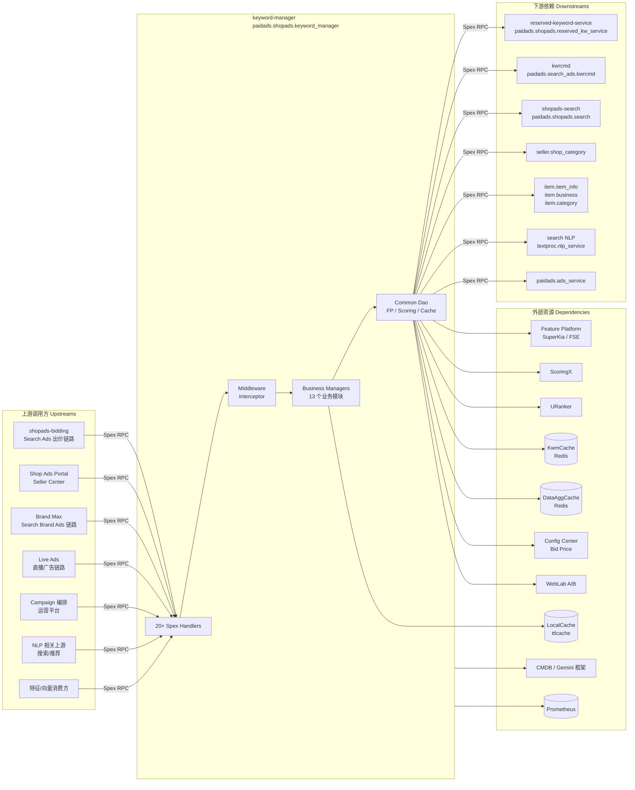

<!-- ads-workspace-gdoc-sync: gdoc_id=1H9c8I6I_3MItAzxxkfU2cP6GrKXtzg6EwfaInV8lfU4 gdoc_url=https://docs.google.com/document/d/1H9c8I6I_3MItAzxxkfU2cP6GrKXtzg6EwfaInV8lfU4/edit -->

# Keyword Manager

## 目录 / Table of Contents

- [项目概述 / Introduction](#项目概述--introduction)
- [核心功能 / Features](#核心功能--features)
- [项目架构 / Architecture](#项目架构--architecture)
  - [系统上下文 / System Context](#系统上下文--system-context)
  - [上下游调用拓扑 / Service Topology](#上下游调用拓扑--service-topology)
  - [模块架构 / Module Architecture](#模块架构--module-architecture)
  - [数据流 / Data Flow](#数据流--data-flow)
- [目录结构 / Directory Structure](#目录结构--directory-structure)
- [Spex API 定义 / Spex API](#spex-api-定义--spex-api)
  - [RPC 方法 / RPC Methods](#rpc-方法--rpc-methods)
  - [错误码 / Error Codes](#错误码--error-codes)
  - [请求与响应 / Request and Response](#请求与响应--request-and-response)
  - [公共数据结构 / Common Messages](#公共数据结构--common-messages)
- [核心业务模块 / Core Business Modules](#核心业务模块--core-business-modules)
- [核心流程 — 推荐关键词 / Core Pipeline — GetRcmdKwList](#核心流程--推荐关键词--core-pipeline--getrcmdkwlist)
- [存储与缓存层 / Storage and Cache Layer](#存储与缓存层--storage-and-cache-layer)
- [配置体系 / Configuration](#配置体系--configuration)
- [构建与部署 / Build and Deployment](#构建与部署--build-and-deployment)
- [开发规范 / Development Guidelines](#开发规范--development-guidelines)
- [监控 / Monitoring](#监控--monitoring)
- [业务术语表 / Business Terminology Glossary](#业务术语表--business-terminology-glossary)
- [参考资料 / Additional Resources](#参考资料--additional-resources)
- [常见问题 / Frequently Asked Questions](#常见问题--frequently-asked-questions)

---

## 项目概述 / Introduction

**keyword-manager** 是 Shopee Paid Ads 下 Shop Ads / Brand Ads / Live Ads 关键词相关能力的统一业务中台服务，对外通过 **20+ 个 Spex RPC 接口**提供关键词推荐、建议出价、店铺/商品属性聚合、直播/品牌广告预估、Campaign 元数据等核心能力。

**Git 仓库：** https://git.garena.com/shopee/deep/brand-ads/keyword-manager

| 属性 | 值 |
|------|-----|
| Go module | `git.garena.com/shopee/deep/brand-ads/keyword-manager` |
| Go 版本 | 1.21 (toolchain go1.21.12) |
| 框架 | [Gemini](https://git.garena.com/shopee/deep/gemini) |
| Spex 服务名 | `shopee.paidads.brand_ads.shopads.reservedkw.keyword_manager` |
| 协议命名空间 | `paidads.shopads.keyword_manager` |
| 错误码区间 | `[332200000, 332300000)` |
| HTTP 端口 | 20030 |

### 核心能力分域

| 域 | 主要接口 |
|----|---------|
| 店铺关键词推荐 | `get_rcmd_kw_list` / `get_sim_rcmd_kw_list` |
| 关键词建议出价 | `get_kw_suggest_price` |
| 店铺属性查询 | `get_shop_bidding_info` / `batch_get_shop_attribute` / `batch_get_shop_roi` / `batch_get_shop_budget_split` |
| 商品属性与 I2I | `batch_get_item_attribute` / `get_shop_top_item_list` |
| Embedding 向量 | `batch_get_embedding` |
| Campaign 元数据 | `get_campaign_surge_list` / `get_non_campaign_days` |
| NER | `get_query_ner` / `get_item_ner_list` |
| 直播广告 | `get_live_stream_ads_info` / `get_live_stream_estimated_conversion` / `get_historical_items_by_uid` |
| 品牌广告（SBA）| `get_brand_ads_estimate_impression` / `get_brand_ads_shop_keyword` |

**内部架构：** 所有接口共享一套 common dao（Feature Platform / ScoringX / URanker / KwmCache Redis / 外部 Spex API），通过 `app.WithXxx()` 初始化各 Manager，采用 **Handler → Manager → Dao/Dto → 外部资源** 的分层架构。

---

## 核心功能 / Features

- **关键词推荐**：基于店铺历史、热卖商品和关键词推荐服务（kwrcmd）聚合候选关键词，过滤 Reserved Keyword，按搜索量排序后返回（最多 55 条）。
- **相似关键词**：给定关键词，通过 QueryExpansionEnv v2 和 shopads-search 获取扩展词。
- **建议出价（SuggestPrice）**：集成 ScoringX（iifmv1）、URanker、Feature Platform（query/item 特征、eCPM）计算 pCTR 和 QualityScore，结合 Config Center 的 Min/MaxPriceMap 输出建议出价。
- **店铺属性聚合**：`batch_get_shop_attribute` 支持 SimpleMode/ManualMode BiddingInfo、TargetROAS、LearningPhase、CensoringTag、直播属性等多维度批量查询。
- **Embedding 批量查询**：支持 KEYWORD/ITEM/SHOP/KW_ITEM/KW_BIDKW 五种 FeatureType、16–1024 维（v1/v2）、单次最多 50 条。
- **直播广告（Live Ads）**：多类型直播队列（CCU/LIKE/COLD_START/TARGET_ROAS 等 15 种）、历史/预估观看/GMV 聚合、ScoringX 校准。
- **品牌广告（Brand Ads / SBA）**：预估曝光、CPM、每日消耗；支持 Reserved / Expansion Keyword，进程内 LocalCache 降低 Redis 压力。
- **Campaign 信息**：四态（NonCampaignDay / PreCampaign / EarlyBoost / Campaign）、国家粒度活动配置的拉取与缓存。
- **NER 命名实体识别**：双路（Feature Platform + NLP Spex），支持 MAIN_PRODUCT/BRAND/PRODUCT/MODEL 等类型。
- **动态降级**：26 个 `DowngradeOption.Disable*` 字段 + 13 个 `ToggleOption` 字段，支持按国家热更，无需重启。

---

## 项目架构 / Architecture

### 系统上下文 / System Context

keyword-manager 处于 Paid Ads 广告链路的核心数据聚合层。上游调用方包括出价链路、卖家后台、品牌广告和直播广告前端；下游依赖关键词推荐服务、商品服务、Feature Platform 和多个 Redis 集群。

### 上下游调用拓扑 / Service Topology



**拓扑说明表：**

| 类型 | 服务名 | 协议 | 描述 |
|------|--------|------|------|
| 上游 | shopads-bidding / Search Ads 出价链路 | Spex RPC | 拉取 SimpleMode 出价信息、ROI、TargetROAS、LearningPhase、BudgetSplit |
| 上游 | Shop Ads Portal / Seller Center | Spex RPC | 获取推荐关键词、相似关键词、建议出价、店铺热卖商品 |
| 上游 | Brand Max / Search Brand Ads | Spex RPC | 拉取品牌广告预估曝光、CPM、Expansion Keyword |
| 上游 | Live Ads / 直播广告链路 | Spex RPC | 直播队列、直播带货预估、主播历史商品 |
| 上游 | Campaign 编排 / 运营平台 | Spex RPC | 获取大促时段、非活动日配置 |
| 上游 | NLP 相关上游 | Spex RPC | 关键词/商品 NER 命名实体识别 |
| 上游 | 特征/向量消费方 | Spex RPC | 批量 Embedding 向量查询 |
| 下游 | reserved-keyword-service | Spex RPC | 查询 Reserved 词状态与理由 |
| 下游 | kwrcmd（关键词推荐服务）| Spex RPC | 获取候选关键词列表 |
| 下游 | shopads-search | Spex RPC | 按关键词查询店铺广告打分 |
| 下游 | seller.shop_category | Spex RPC | 按 CollectionId 拉取商品集合 |
| 下游 | item.item_info / item.business / item.category | Spex RPC | 商品列表、商品详情、类目信息 |
| 下游 | search NLP textproc.nlp_service | Spex RPC | 外部 NER 识别 |
| 下游 | paidads.ads_service | Spex RPC | Campaign 活动日元数据 |
| 依赖 | Feature Platform（SuperKia / FSE）| HTTP/gRPC | 关键词/商品/店铺特征、eCPM、NER 特征、Embedding |
| 依赖 | ScoringX | gRPC | iifmv1（关键词广告）、shopadgbdtv4_newDesign（店铺广告）、live_ads_view_est_cali_v1（直播校准）|
| 依赖 | URanker | gRPC | 建议出价相关打分（可动态开关）|
| 依赖 | KwmCache（Redis）| Redis | SimpleMode/ManualMode 出价、ROI、Embedding、I2I、BudgetSplit、BrandAds、LiveStream 等 |
| 依赖 | DataAggCache（Redis）| Redis | 直播历史观看/GMV 聚合数据 |
| 依赖 | LocalCache（ttlcache）| In-process | BrandAds 等模块进程内二级缓存 |
| 依赖 | Config Center | HTTP | bid_price 最小/最大出价热更 |
| 依赖 | WebLab | HTTP | A/B 实验，运行期策略选择 |
| 依赖 | Prometheus | HTTP | 服务指标上报 |

### 模块架构 / Module Architecture

```
cmd/server/server.go                 # 主入口：参数解析 → gemini.Init → app.InitializeApp
└── internal/app/
    ├── app.go                       # App 结构体定义
    └── init_options.go              # LoadConfig → WithConfigCenter → WithPrometheus
                                     # → WithResourceManager → WithInterceptor
                                     # → WithGlobalStrategies → With<Mgr>...
                                     # → WithResources（注册 Decorator）→ With<Handler>...
                                     # → WithRoute
├── internal/route/register.go      # 注册所有 Spex ProcessorConfig
├── internal/handler/<api>/          # 各 Handler（Validation + 调用 Manager）
├── internal/interceptor/            # TimeoutInterceptor + RateLimiterInterceptor
├── internal/pkg/<domain>/
│   ├── manager/                    # 业务 Manager（单例 GlobalXxxManager）
│   ├── dao/                        # 数据源访问（Spex / Redis / FP），var Fn = func(...)
│   ├── dto/                        # 业务数据转换
│   └── decorate.go                 # Decorator 注册函数
├── internal/config/
│   ├── config.go                   # Config 静态配置结构体
│   └── dynamic.go                  # DynamicConfig + DisableByCountry 逻辑
├── internal/prome/prometheus.go     # Prometheus Counter/Histogram 定义
├── pkg/
│   ├── types/                      # 共享类型（KeywordInfo / Request 接口 等）
│   ├── utils/const.go              # 所有常量、缓存 Key 格式、Decorator 名称
│   └── client/weblab_client.go     # WebLab Helper
└── spex/
    ├── sp_proto/                   # proto 源文件
    └── gen/go/                     # 生成的 pb.go 文件
```

**Middleware/Interceptor 分层：**
```
gemini global strategy（recover + ulog + metric + tracing）
  └── sps.RegisterGlobalServerInterceptors（panic_recover / logger / metric / tracing）
        └── route 级 interceptors（timeout + rate_limiter，config_key: get_kwmanager_*）
              └── middleware.GetMiddleware（记录 ts + ExportHandlerEvent）
                    └── handler.GetRcmdKwList 等业务函数
```

**Resource / Decorator 模式：**  
`app.WithResources` 中注册 50+ Decorator，将 dao/manager 方法包装为带 `panic_recover + ulog + metric + tracing` 的可观测调用，资源名由 `pkg/utils/const.go` 中的 `Decorated*` 常量定义。运行期可通过 `DowngradeOption` 动态熔断（如 `DisableFeaturePlatform` / `DisableEmbedding` 等）。

### 数据流 / Data Flow

以 `GetRcmdKwList` 为例：

```
Spex 请求
  → middleware.SetupKwmContext（注入 logger/tracing context）
  → validation.ValidateRequest（validateHeader / validateCountry / validateShopId）
  → [collectionId > 0] shopRcmdMgr.GetShopRcmdKwsFromItems（Collection 分支）
  → shopRcmdMgr.GetShopRcmdKws（店铺 kwrcmd + shopads-search + Reserved 过滤）
  → rankMgr.RankKwByVolumeCache（按搜索量排序，截断至 MaxKwToRecommend=55）
  → [fill_suggest_price=true] spMgr.GetKwSuggestPrice（FP 特征 + ScoringX/URanker → 出价计算）
  → assembleMgr.FormatGetRcmdKwListResponse（填充 quality_score / search_volume / is_reserved）
  → 返回 Spex 响应
```

---

## 目录结构 / Directory Structure

```
keyword-manager/
├── bin/                    # Makefile（make server 编译产物输出此目录）
├── cmd/server/             # main.go 主入口
├── configs/                # 各环境 service.yml（test / uat / staging / liveish / live）
├── deploy/
│   └── keywordmanager.json # 部署配置（构建命令、资源规格、健康检查）
├── gemini.yaml             # Gemini 框架配置（Spex 服务名、config_key、CI 生成）
├── go.mod / go.sum         # Go module 依赖
├── internal/
│   ├── app/                # 应用初始化（InitializeApp + InitOption 链）
│   ├── config/             # 静态配置 + 动态配置结构体
│   ├── handler/            # 各 RPC 的 Handler（validation 子包）
│   ├── interceptor/        # Timeout + RateLimiter 拦截器
│   ├── pkg/                # 业务 Manager / Dao / Dto
│   │   ├── assemble/       # 响应装配
│   │   ├── bidding_info/   # 店铺出价信息
│   │   ├── brand_ads/      # 品牌广告
│   │   ├── budget_split/   # 预算拆分
│   │   ├── campaign/       # Campaign 信息
│   │   ├── common/dao/     # 共用 Dao（ExternalAPI / FP / KwmCache / Scoring / URanker）
│   │   ├── embedding/      # Embedding 批量查询
│   │   ├── i2i/            # I2I 商品相似
│   │   ├── live_stream/    # 直播广告
│   │   ├── rank/           # 关键词排序
│   │   ├── shop_censoring/ # 店铺违规检测
│   │   ├── shop_rcmd_kw/   # 店铺关键词推荐
│   │   ├── shop_top_item/  # 店铺热卖商品
│   │   ├── similar_kw/     # 相似关键词
│   │   └── suggest_price/  # 建议出价
│   ├── prome/              # Prometheus 指标定义
│   └── route/              # Spex 路由注册
├── pkg/
│   ├── client/             # WebLab 客户端
│   ├── types/              # 公共类型定义
│   └── utils/              # 常量、缓存 Key 格式、工具函数
├── spex/
│   ├── gen/go/             # proto 生成的 pb.go 文件
│   └── sp_proto/           # proto 源定义文件
└── tools/                  # 开发工具
```

---

## Spex API 定义 / Spex API

**Proto 文件路径：** `spex/sp_proto/paidads/shopads/keyword_manager.proto`  
**Package：** `paidads.shopads.keyword_manager`  
**Syntax：** proto2，使用 `gogo/protobuf` 代码生成

### RPC 方法 / RPC Methods

| 命令（Command） | 请求类型 | 响应类型 | 场景 |
|----------------|---------|---------|------|
| `get_rcmd_kw_list` | `GetRcmdKwListRequest` | `GetRcmdKwListResponse` | 为卖家推荐关键词（含建议出价） |
| `get_sim_rcmd_kw_list` | `GetSimRcmdKwListRequest` | `GetSimRcmdKwListResponse` | 获取指定关键词的相似扩展词 |
| `get_kw_suggest_price` | `GetKwSuggestPriceRequest` | `GetKwSuggestPriceResponse` | 获取关键词建议出价与质量分 |
| `get_shop_top_item_list` | `GetShopTopItemListRequest` | `GetShopTopItemListResponse` | 获取店铺热卖商品列表 |
| `get_shop_bidding_info` | `GetShopBiddingInfoRequest` | `GetShopBiddingInfoResponse` | 获取店铺 SimpleMode/ManualMode 出价信息 |
| `batch_get_shop_roi` | `BatchGetShopROIRequest` | `BatchGetShopROIResponse` | 批量查询店铺 ROI |
| `batch_get_embedding` | `BatchGetEmbeddingRequest` | `BatchGetEmbeddingResponse` | 批量获取 Embedding 向量 |
| `get_non_campaign_days` | `GetNonCampaignDaysRequest` | `GetNonCampaignDaysResponse` | 获取非活动日列表 |
| `get_campaign_surge_list` | `GetCampaignSurgeListRequest` | `GetCampaignSurgeListResponse` | 获取大促时段配置 |
| `get_query_ner` | `GetQueryNerRequest` | `GetQueryNerResponse` | 获取关键词 NER 识别结果 |
| `get_item_ner_list` | `GetItemNerListRequest` | `GetItemNerListResponse` | 批量获取商品 NER 结果 |
| `batch_get_shop_attribute` | `BatchGetShopAttributeRequest` | `BatchGetShopAttributeResponse` | 批量查询店铺多维度属性 |
| `batch_get_item_attribute` | `BatchGetItemAttributeRequest` | `BatchGetItemAttributeResponse` | 批量查询商品属性（I2I） |
| `batch_get_shop_budget_split` | `BatchGetShopBudgetSplitRequest` | `BatchGetShopBudgetSplitResponse` | 批量获取店铺预算拆分 |
| `get_historical_items_by_uid` | `GetHistoricalItemsByUIDRequest` | `GetHistoricalItemsByUIDResponse` | 获取主播历史商品 |
| `get_live_stream_estimated_conversion` | `GetLiveStreamEstimatedConversionRequest` | `GetLiveStreamEstimatedConversionResponse` | 直播带货预估转化（View/GMV）|
| `get_live_stream_ads_info` | `GetLiveStreamAdsInfoRequest` | `GetLiveStreamAdsInfoResponse` | 获取直播广告队列信息 |
| `get_brand_ads_estimate_impression` | `GetBrandAdsEstimateImpressionRequest` | `GetBrandAdsEstimateImpressionResponse` | 品牌广告预估曝光/CPM/消耗 |
| `get_brand_ads_shop_keyword` | `GetBrandAdsShopKeywordRequest` | `GetBrandAdsShopKeywordResponse` | 品牌广告店铺关键词（含 Expansion Keyword）|

> **注意：** `get_shop_last_item_list` / `get_campaign_info` 的 Cmd 常量已在 `pkg/utils/const.go` 中定义，但未在路由中实际注册。

### 错误码 / Error Codes

| 错误码 | 值 | 含义 |
|--------|----|------|
| `ERROR_BAD_REQUEST` | 332200000 | 请求格式错误 |
| `ERROR_UNKNOWN` | 332200001 | 未知错误 |
| `ERROR_INTERNAL` | 332200002 | 内部错误 |
| `ERROR_INVALID_REQUESTID` | 332200003 | 无效 request_id |
| `ERROR_INVALID_COUNTRY` | 332200004 | 无效国家码 |
| `ERROR_INVALID_KEYWORD` | 332200005 | 无效关键词 |
| `ERROR_INVALID_SHOPID` | 332200006 | 无效 shop_id |
| `ERROR_INVALID_RCMD_PRICE_VERSION` | 332200007 | 无效 rcmd_price_version（需为 v1/v2）|
| `ERROR_INVALID_LIMIT` | 332200008 | 无效 limit |
| `ERROR_EXCEED_SHOP_IDS_LIMIT` | 332200009 | shop_ids 超过限制（max 50）|
| `ERROR_EXCEED_FEATURES_LIMIT` | 332200010 | features 超过限制（max 50）|
| `ERROR_INVALID_EMBEDDING_VERSION` | 332200011 | 无效 Embedding 版本（需为 v1/v2）|
| `ERROR_INVALID_DIMENSION` | 332200012 | 无效 Dimension |
| `ERROR_EXCEED_ITEM_IDS_LIMIT` | 332200013 | item_ids 超过限制 |
| `ERROR_INVALID_ATTRIBUTE_TYPE` | 332200014 | 无效属性类型 |
| `ERROR_EXCEED_SHOP_BUDGETS_LIMIT` | 332200015 | shop_budgets 超过限制（max 50）|
| `ERROR_INVALID_USERID` | 332200016 | 无效 user_id |
| `ERROR_INVALID_PRICING_TYPE` | 332200017 | 无效定价类型（仅支持 9/10）|
| `ERROR_INVALID_START_END_DATE` | 332200018 | 无效起止日期 |

### 请求与响应 / Request and Response

所有请求均需包含 `RequestHeader{request_id*, country*}`，country 需命中 `DynamicConfig.Countries`（支持 TW/ID/SG/MY/TH/VN/PH/BR/MX）。  
所有响应均返回 `ResponseHeader{request_id, err_code}`，通过 `utils.ParseErrCode` 统一写入。

### 公共数据结构 / Common Messages

| 结构体 | 关键字段 |
|--------|---------|
| `RcmdKwInfo` | `keyword`, `recommend_price`, `quality_score`, `search_volume`, `is_reserved`, `reserved_reason` |
| `ItemInfo` | `item_id`, `shop_id`, `name`, `categories`, `score`, `click_count`, `sold_count`, `pctr`, `collection_id`, `price`, `global_cat_ids`, `global_cat_names` |
| `ShopBiddingInfos` | `exact_match_bid_info[]`, `broad_match_bid_info[]`, `target_roi`, `shop_id` |
| `BidInfo` | `keyword`, `price`, `version` |
| `Feature` | `Value{int32/int64/float/double/bool/string}` |
| `EmbeddingData` | `vector[]` |

**关键枚举：**
- `Dimension`：4→16 / 5→32 / 6→64 / 7→128 / 8→256 / 9→512 / 10→1024
- `FeatureType`：KEYWORD / ITEM / SHOP / KW_ITEM / KW_BIDKW
- `CampaignStatus`：CAMP_NO_CAMP / CAMP_PRE_CAMP / CAMP_EARLY_BOOST / CAMP_CAMP
- `NerAttribute`：EMPTY / MAIN_PRODUCT / BRAND / PRODUCT / MODEL / MEASUREMENT / IP / ATTRIBUTE
- `ShopAttribute`：SHOP_BIDDING_INFO / SHOP_ROI / SHOP_CENSORING / SHOP_TARGET_ROAS / SHOP_LEARNING_PHASE / STREAMER_TARGET_ROAS / LIVE_ADS_SUGGEST_BUDGET
- `ItemAttribute`：ITEM_I2I
- `CensoringTag`：ADULT
- `KeywordsType`：RESERVED / EXPANSION
- `SbaTemplate`：STANDER / BANNER_AND_LIVE / VIDEO_AND_LIVE
- `LiveSteamQueueType`：15 种（CCU / LIKE / COLD_START / TARGET_ROAS_COLD_START 等）

---

## 核心业务模块 / Core Business Modules

| 模块 | Manager 路径 | Handler 路径 | 主要外部依赖 | 主要缓存 |
|------|-------------|-------------|------------|--------|
| 关键词推荐 | `internal/pkg/shop_rcmd_kw/manager` | `get_rcmd_kw_list` | kwrcmd Spex + shopads-search + reserved-keyword-service + FP | KwmCache（rcmd_kw_by_shop / shop_cache）|
| 相似关键词 | `internal/pkg/similar_kw/manager` | `get_sim_rcmd_kw_list` | QueryExpansionEnv v2 + shopads-search + reserved-keyword-service | KwmCache |
| 建议出价 | `internal/pkg/suggest_price/manager` | `get_kw_suggest_price` | ScoringX（iifmv1）+ URanker + FP（query/item/eCPM）+ Config Center | KwmCache（eCPM）|
| 店铺热卖商品 | `internal/pkg/shop_top_item/manager` | `get_shop_top_item_list` | item.item_info + item.business + item.category + shopads-search | — |
| 店铺出价信息 | `internal/pkg/bidding_info/manager` | `get_shop_bidding_info` / `batch_get_shop_roi` | — | KwmCache（sm_kp_ / mm_kp_ / sm_roi_ / target_roas_ / learning_phase_）|
| 店铺属性批量查询 | bidding_info + shop_censoring | `batch_get_shop_attribute` | 多模块聚合 | KwmCache |
| I2I | `internal/pkg/i2i/manager` | `batch_get_item_attribute` | — | KwmCache（I2I_{cid}_{item_id}）|
| 预算拆分 | `internal/pkg/budget_split/manager` | `batch_get_shop_budget_split` | — | —（固定使用 `DefaultMergedShopBudgetRatio=1`，Search 与 Rcmd 两端各全额分配预算）|
| Embedding | `internal/pkg/embedding/manager` | `batch_get_embedding` | — | KwmCache（emb_k_ / emb_i_ / emb_k_i_）|
| Campaign | `internal/pkg/campaign/manager` | `get_campaign_surge_list` / `get_non_campaign_days` | paidads.ads_service.get_campaign_days | MemCache（进程内）|
| NER | `internal/handler/get_query_ner` / `get_item_ner_list` | — | NLP Spex + FP（NER 特征）| — |
| 直播广告 | `internal/pkg/live_stream/manager` | `get_live_stream_ads_info` / `get_live_stream_estimated_conversion` / `get_historical_items_by_uid` | KwmCache（队列）+ DataAggCache + ScoringX（live_ads_view_est_cali_v1）| KwmCache / DataAggCache |
| 品牌广告（SBA）| `internal/pkg/brand_ads/manager` | `get_brand_ads_estimate_impression` / `get_brand_ads_shop_keyword` | — | KwmCache + LocalCache（ttlcache）|

---

## 核心流程 — 推荐关键词 / Core Pipeline — GetRcmdKwList

### 请求入口 / Request Entry

`internal/handler/get_rcmd_kw_list/get_rcmd_kw_list.handler.go` 中的 `GetRcmdKwList` 函数，由 `middleware.GetMiddleware` 包装后注册为 Spex ProcessorConfig。

```
GetRcmdKwList
  ├── middleware.SetupKwmContext    # 注入 logger、request_id、country 到 context
  ├── log.FromContext               # 获取带 trace 信息的 logger
  └── validation.ValidateRequest    # GetRcmdKwListValidators：
                                    #   validateHeader / validateRequestId
                                    #   validateCountry / validateShopId
```

### Collection 模式 / Collection Flow

当 `collection_id > 0` 且 `!DisableCollectionFlow`（按国家）时：

```
shopRcmdMgr.GetShopRcmdKwsFromItems
  ├── 拉取 shop collection 商品列表（seller.shop_category）
  ├── 从 KwmCache / FP 获取商品候选关键词
  └── 打点 ExporterShopCollection.<magnitude>
```

### 店铺关键词召回 / Shop Keyword Recall

```
shopRcmdMgr.GetShopRcmdKws
  ├── EnableNewRcmdKwCache → KwmCacheDao.GetRcmdKwInfoCache（新缓存路径）
  ├── 否则 → kwrcmd.get_kw（KwRcmdGetKwCmd）拉取候选
  ├── ReservedKwDto.FilterReservedKw（过滤/降级保留词，按 EnableReservedKwTypes 白名单）
  └── DisableShopRcmdKwCache → 决定是否回写缓存
```

若数量不足 `MaxKwToRecommend=55`，补充调用 `GetShopRcmdKwsFromItems`（基于热卖商品），通过 `JoinItemsShopKwInfos` 合并。

### 关键词排序 / Keyword Ranking

```
rankMgr.RankKwByVolumeCache
  ├── 从 QueryStatsCache（codis）或 FP 读取 search_volume
  └── 按搜索量降序排序，截断至 MaxKwToRecommend
```

### 拼装建议出价 / Fill Suggest Price

当 `request.fill_suggest_price=true` 且 `rcmd_price_version` 有效（v1/v2）时：

```
spMgr.GetKwSuggestPrice
  ├── FP 特征（query feature + item feature + eCPM subkey by country）
  ├── ScoringX（iifmv1）或 URanker 计算 pCTR
  ├── 按 PriceDeltaMap 步长计算出价
  ├── 结合 Config Center 的 Min/MaxPriceMap 钳制
  └── 回填 recommend_price / quality_score
```

降级点：`DisableScoringKwAd`（跳过 ScoringX）、`DisableQueryStatsCache`（跳过搜索量缓存）、`DisableShopAdsScoreECPM`（改用缓存 eCPM）。

### 响应装配 / Response Assembly

```
assembleMgr.FormatGetRcmdKwListResponse
  ├── 合并 RcmdKwInfo + SuggestPrice 结果
  ├── 设置 is_reserved / reserved_reason
  └── ExportCounterMetrics(ProcessQPS, country, get_rcmd_kw.<kw_count_magnitude>)
```

---

## 存储与缓存层 / Storage and Cache Layer

### KwmCache（Redis）/ KwmCache Redis

`internal/pkg/common/dao/kwm_cache.go` 基于 `redisutil/v8 + go-redis` 构造，支持按国家配置独立连接（`CountryConn`）。

| Key 格式 | 模块 | 说明 |
|---------|------|------|
| `sm_kp_%s_%v` | BiddingInfo | SimpleMode 出价，%s=cid，%v=shopId |
| `mm_kp_%s_%v` | BiddingInfo | ManualMode 出价 |
| `sm_roi_%s_%v` | BiddingInfo | 店铺 ROI |
| `target_roas_%s[_%d]` | BiddingInfo | TargetROAS（country 或 shop 粒度）|
| `learning_phase_%s_%d` | BiddingInfo | LearningPhase 标记 |
| `emb_k_%s_%d` | Embedding | 关键词 Embedding |
| `emb_i_%s_%d` | Embedding | 商品 Embedding |
| `emb_k_i_%s_%d` | Embedding | 关键词-商品 Embedding |
| `I2I_%s_%d` | I2I | 商品 I2I 相似列表 |
| `ADULT_%s` | ShopCensoring | 违规标签 |
| `%s_%d_aggr_daily_impression` | BrandAds | 品牌广告日均曝光 |
| `%s_%d_cpm` | BrandAds | 品牌广告 CPM |
| `%s_%d_brand_ads_keywords` | BrandAds | 品牌广告关键词 |
| `%s_%d_brand_ads_exp_kw` | BrandAds | 扩展关键词 |
| 各 LiveStream*RedisKey | LiveStream | 直播广告多类型队列 |

### DataAggCache（Redis）/ DataAggCache

`internal/pkg/live_stream/dao/data_agg_cache.go`，专用于直播广告历史/预估数据：

| Key 格式 | 说明 |
|---------|------|
| `est_hist_imp_view_{cid}_{MM_dd}` | 历史观看量 |
| `est_hist_imp_gmv_{cid}_{MM_dd}` | 历史 GMV |
| `est_forecast_view_for_you_{cid}_{MM_dd}` | 预测观看（For You）|
| `est_forecast_imp_discover_{cid}_{MM_dd}` | 预测展示（Discover）|
| `est_actual_view_for_you_{cid}_{MM_dd}` | 实际观看 |
| `est_actual_imp_discover_{cid}_{MM_dd}` | 实际展示 |

由 `GlobalLiveStreamManager.CacheDto`（`gemini.AdditionalService`）定时预热/刷新。

### LocalCache（ttlcache 进程内缓存）/ In-process TTL Cache

`internal/pkg/brand_ads/manager/brand_ads_mgr.go` 使用 `jellydator/ttlcache/v2`（`SizeLimit + TTLInMinute` 由 `CommonConfig.LocalCache` 控制），降低 KwmCache 回源压力。  
`GetBrandAdsKeywordInfo`（`get_brand_ads_shop_keyword`）采用 **L1 LocalCache → L2 Redis** 双层缓存模式：先从 `ttlcache` 读取 `%s_%d_brand_ads_keywords` / `%s_%d_brand_ads_exp_kw`，未命中则回源 Redis 并将结果回填本地缓存。  
`AssembleManager` 用 `cache.Cache`（MemCacheTTL）缓存 global category 名称；`CampaignManager` 缓存 campaign days API 结果。

### Key 编码规范 / Key Encoding

统一由 `pkg/utils/const.go` 定义 `*Format` 常量：
- `%s` = 小写国家码（cid）
- `%d` = shopId / itemId / userId
- BrandAds 与 LiveStream 使用 `{cid}_{shop_id}_` 前缀风格，与其他模块的 `{prefix}_{cid}_{id}` 顺序不同，注意区分。

### 特征平台接入 / Feature Platform Integration

`internal/pkg/common/dao/feature_platform.go`：通过 `paidads-superkia fetch.Client` 按 `FeatureStructMap`（key→特征结构体）初始化多个 client（CliTag 路由），`Countries` 字段限制启用国家。运行期降级：`DisableFeaturePlatform` / `DisableItemFeatureCache` / `DisableNerFeaturePlatform`（均按国家控制）。

---

## 配置体系 / Configuration

### 本地 service.yml / Local Service YAML

位于 `configs/{env}/service.yml`，关键字段：

```yaml
service:
  service_name: shopee.paidads.brand_ads.shopads.reservedkw.keyword_manager
  spex:
    tag: master
    sdu_id: default
    config_key: ce11a9ec67887dbac2ad1dcf9270ae4c   # test/uat/staging
    # live/liveish: 2af55fbf6495e6f556a74306b566b53d
  logger:
    level: info
    type: file
    encode_as_json: true
    file: keyword_manager.log
  enable_tracer: true
  enable_metrics: true
  enable_pprof: true
  health_check_endpoint: /health_check
  shutdown_timeout_seconds: 5
```

### Spex 配置 / Spex Remote Config（server_config / dynamic_config / 超时 / 限流）

通过 `search-config-management/cfgmng + Spex Agent` 订阅：

- **`server_config`（ServerConfigKey）**：映射到 `internal/config/config.go` 的 `Config` 结构体，包含 Common（FP / KwmCache / DataAggCache / LocalCache）、ShopRecommendKw、SimilarKw、SuggestPrice（Scoring / URanker）、ShopTopItem、Rank、Assemble、BiddingInfo、WebLabConfig、Embedding、LSConversionConfig 等子段。
- **`dynamic_config`（DynamicConfigKey）**：映射到 `DynamicConfig`，包含 LogLevel / Countries / DowngradeOption（26 个 Disable\*）/ ToggleOption（13 个开关）/ ScoringOption / CampaignInfo / ShopAdsOption / SuggestPriceOption / BudgetSplitOption / LSConversionOption / LiveAdsOption / BrandAdsOption，通过 `OnReload` 热更无需重启。
- **路由超时/限流**：`get_kwmanager_timeout_config_key` / `get_kwmanager_rate_limit_config_key`，按 command 维度配置（`get_rcmd_kw_list` / `get_sim_rcmd_kw_list` / `get_kw_suggest_price` / `get_shop_top_item_list` / `get_shop_bidding_info` / `batch_get_shop_roi` / `batch_get_embedding` / `get_item_ner_list` / `get_query_ner` / `get_live_stream_ads_info` 启用；其余接口无超时/限流配置）。

### Config Center / Bid Price Namespace

订阅 `paid_ads/paid_ads_platform/{BidPriceConfigName}`，热加载 `min_bid_price / max_bid_price` 的 `search_shop.exact_match` 子 map 到 `utils.MinPriceMap / utils.MaxPriceMap`。  
Config Center URL：`https://config.shopee.io/group/paid_ads/project/paid_ads_platform/cluster/live/namespaces/bid_price_live_default`

### WebLab 动态开关 / WebLab Toggles

`pkg/client/weblab_client.go`：按 `WebLabConfig.ProductId + WebLabTimeout` 建立 Helper，`DecoratedQueryWebLab` 用于运行期拉取试验分流（选择不同 ScoringX 算法、打开 URanker、策略切换等）。

### 按国家降级开关 / Per-country Downgrade Flags

`DowngradeOption` 26 个 `Disable*` 字段通过 `config.DisableByCountry` 判定：
- `"1"` 或 `"all"` → 全量关闭
- `"0"` → 关闭降级（正常运行）
- 其他字符串 → 按子串匹配国家（如 `"SG,MY"` 仅对这两个国家降级）

`ToggleOption` 13 个开关控制：Collection Flow / 新关键词缓存 / TopOne 出价策略 / EtcdQE / KwRcmd / ShopAdsScoreECPM / LearningPhase / CampaignAPI / ROI 调整 / ItemFeatureCache 等。

---

## 构建与部署 / Build and Deployment

### Makefile 与 bin 目录 / Makefile Targets

```bash
# 本地构建
cd bin && make server

# 本地运行
./server --config configs/test/service.yml --port 20030
```

`bin/Makefile` 产物输出到 `bin/server`（本机）和 `bin/server.linux`（交叉编译）。

### deploy/keywordmanager.json / Deploy JSON

关键配置：
- `project_dir_depth`: 2，`project_name`: shopads，`module_name`: keywordmanager
- **构建命令**：`go mod vendor -v` → `make -C bin clean all` → `rm -rf vendor` → `cp bin/server .` → `cp configs/${env}/* configs/`
- **Base 镜像**：`harbor.shopeemobile.com/shopee/golang-base:1.19.10-20`
- **运行命令**：`./server`
- **健康检查**：HTTP `/health_check`（timeout 5s，retry 10，grace_period 60s）
- `enable_prometheus: true`

### 资源规格 / Resource Specs

| 环境 | CPU | 内存（GB）| 实例数 |
|------|-----|---------|-------|
| test | 4 | 1 | 4 |
| uat | 16 | 8 | 16 |
| staging | 16 | 8 | 16 |
| liveish | 32 | 32 | 32 |
| live | 32 | 32 | 32 |

### 本地运行 / Local Run

```bash
go run cmd/server/server.go --config configs/test/service.yml --port 20030
```

前置要求：Spex Agent 可达（通过 `sps.GetDefaultAgent()`）、Spex Config Manager 能拉取 `server_config` / `dynamic_config`、Config Center 连通（bid price）、KwmCache / DataAggCache Redis 可达。

---

## 开发规范 / Development Guidelines

### 新增 RPC 接口 / How to Add a New RPC

1. 在 `spex/sp_proto/paidads/shopads/keyword_manager.proto` 定义 request/response（proto2 + optional，错误码放入 `Constant.ErrorCode` 区间 332200000–332300000）
2. 重新生成 `spex/gen/go/` 下 pb 文件
3. 在 `pkg/utils/const.go` 增加 `*Cmd` 常量
4. 在 `internal/handler/<new_api>/` 下新建 handler.go（定义 `GlobalXxxHandler + NewXxxHandler + XxxHandler` 处理函数）
5. 在 `internal/handler/validation/validators.go` 增加 `XxxValidators` 列表
6. 在 `internal/route/register.go` 追加路由条目，按需配置 interceptor
7. 在 `internal/app/init_options.go` 增加 `WithXxxHandler` 选项并校验依赖 Manager
8. 在 `cmd/server/server.go` 调用 `app.WithXxxHandler()`
9. 补单元测试与 `gemini.yaml commands.<cmd>` 条目

### 新增依赖管理器 / How to Add a New Manager

1. 创建 `internal/pkg/<domain>/` 目录
2. `manager/` 下定义 `NewXxxManager(conf)` 与 `GlobalXxxManager`（单例）
3. `dao/` 下封装数据源访问，通过 `var Fn = func(ctx,...) {}` 便于 Decorator 包装
4. `dto/` 下封装业务转换逻辑
5. 在 `internal/app/init_options.go` 增加 `WithXxx` 并在 `cmd/server/server.go` 调用
6. 将 dao-level 函数注册到 `app.WithResources` 的 `DecoratedXxx` 列表

### Resource / Decorator 模式

通过 `git.garena.com/shopee/deep/gemini/pkg/rm + interceptor.DecoratedOption` 将每个 dao/manager 方法包装成带 `panic_recover / ulog / metric / tracing` 的调用。在 `pkg/utils/const.go` 为每个 Decorator 声明稳定的 `DecoratedXxx` 常量作为 resource 名，监控与日志里以该名称聚合。

### 错误码约定 / Error Code Conventions

- 所有业务 Handler 返回 `uint32` 错误码
- 优先返回 proto `Constant.ErrorCode`（映射到 332200000–332200018 区间）
- 通用错误使用 `ERROR_INTERNAL=332200002` 或 `ERROR_UNKNOWN=332200001`
- Handler 内部使用 `utils.ParseErrCode(response.Header, errCode)` 统一写回 `ResponseHeader.err_code`

### 单元测试 / Unit Testing

- 使用 `testify`，测试文件命名 `*_test.go` 与实现同包
- 已有典型用例：`internal/pkg/live_stream/manager/conversion_estimation_test.go`
- 对外部依赖（Spex API / FP / ScoringX / Redis）通过覆盖 `var Fn = func(...) {}` 的方式做 stub

### Code Style & Git Workflow

- 遵循 Shopee Deep 规范，使用 Conventional Commits（`feat/fix/chore/refactor`）
- MR 需通过 `.gitlab-ci` 产生的 lint/test/build stage
- 敏感字段（DB 密钥/scoring endpoint）通过 Spex config 与 Config Center 下发，不要硬编码

---

## 监控 / Monitoring

### Prometheus 指标 / Prometheus Metrics

Namespace=`shop_ads`，Subsystem=`keyword_manager`，全部由 `internal/prome/prometheus.go` 定义：

| 指标名 | 类型 | Label | 说明 |
|--------|------|-------|------|
| `shop_ads_keyword_manager_qps` | Counter | country, operation | 服务级 QPS（由 ExportHandlerEvent 统一上报）|
| `shop_ads_keyword_manager_latency` | Histogram | country, operation | 端到端延迟，Buckets 0.001–1s 共 15 档 |
| `shop_ads_keyword_manager_hits_count` | Counter | country, operation | 缓存命中次数 |
| `shop_ads_keyword_manager_miss_count` | Counter | country, operation, reason | 缓存未命中次数 |
| `shop_ads_keyword_manager_process_qps` | Counter | country, operation | 细分 QPS（如 get_rcmd_kw.<magnitude> / cid=xxx）|
| `shop_ads_keyword_manager_error_qps` | Counter | country, operation | 错误率统计 |
| `shop_ads_keyword_manager_shop_ratio` | Histogram | country, shop_id, operation | 店铺粒度比例指标（如 search/game 分流比）|

### 关键监控点 / Key Monitoring Points

- **服务层**：`middleware.GetMiddleware` / `prome.ExportHandlerEvent`：每个 Handler 统一 QPS + latency + process_qps + 请求/响应 JSON 落 info 日志
- **缓存**：CacheHits / CacheMiss 按 operation（shop_cache / shop_top_items / rcmd_kw_by_shop / shop_collection 等）+ reason 标签细分
- **特征平台**：`total_keyword_embedding_info` / `missing_keyword_embedding_info` / `total_keyword_ecpm` / `missing_keyword_ecpm`
- **店铺属性**：`total_shop_bid_info` / `exact_bid_info` / `broad_bid_info` / `missing_bid_info` / `missing_shop_roi`
- **I2I**：`i2i_item_total` / `i2i_item_empty` / `invalid_i2i_version` / `invalid_i2i_score`
- **违规检测**：`censoring_shop_total` / `censoring_shop_adult`
- **直播**：`ls_historical_data_pull` / `ls_historical_data_empty` / `ls_insufficient_historical_data` / `ls_missing_local_historical_data`

### HTTP 端点 / HTTP Endpoints

| 端点 | 说明 |
|------|------|
| `/health_check` | 健康检查（deploy.json smoke/check 配置）|
| `/metrics` | Prometheus 指标（`enable_metrics=true + enable_prometheus=true`）|
| `/debug/pprof/*` | 性能分析（`enable_pprof=true`）|

**Grafana 监控大盘：** https://monitoring.infra.sz.shopee.io/grafana/d/cZppjxmVz/shopads-kw-manager-spex?orgId=39

**建议告警：**
- 各国家各 operation QPS 突降（<历史 50%）
- latency P99 > 150ms
- error_qps 增速异常
- `missing_shop_roi` / `missing_bid_info` 缓存命中率低于阈值
- FP `missing_*_info` 告警
- Spex 错误码分布突变

---

## 业务术语表 / Business Terminology Glossary

| 术语 | 含义 |
|------|------|
| Shop Ads | 店铺广告，Shopee 卖家付费广告类型 |
| Brand Ads / SBA | 品牌广告 / Search Brand Ads，品牌商投放的搜索广告 |
| Live Ads | 直播广告，针对直播场景的广告产品 |
| Reserved Keyword | 保留词，系统/平台预留、卖家无法自由出价的关键词 |
| Expansion Keyword | 扩展词，由算法自动扩展的关键词 |
| SimpleMode | 简单模式，系统自动优化出价 |
| ManualMode | 手动模式，卖家手动设置关键词出价 |
| BroadMatch | 泛匹配，搜索词包含广告关键词即触发 |
| ExactMatch | 精确匹配，搜索词完全等于广告关键词才触发 |
| TargetROAS | 目标 ROAS（广告 GMV/广告花费），自动出价目标 |
| LearningPhase | 学习期，SimpleMode 广告初期数据积累阶段 |
| Campaign / CampaignSurge | 大促活动，影响出价与竞争策略的平台活动日 |
| PreCampaign | 大促前期（例如大促前 X 天）|
| EarlyBoost | 大促早期提振，活动开始前的 boost 阶段 |
| NonCampaignDay | 非活动日 |
| CensoringTag | 违规标签，如 ADULT（成人内容） |
| I2I | Item-to-Item，商品相似度特征 |
| Embedding | 向量嵌入，用于关键词/商品/店铺的语义表示 |
| BudgetSplit | 预算拆分，搜索/推荐场景间的预算分配 |
| eCPM | 有效每千次展示费用（Effective Cost Per Mille）|
| pCTR | 预估点击率（Predicted Click-Through Rate）|
| QualityScore | 质量分，衡量广告与用户搜索的相关性（1–10 分）|
| SearchVolume | 搜索量，关键词在平台的历史搜索频次 |
| KwManager / KwmCache | Keyword Manager / 其 Redis 缓存 |
| RcmdKw / SimRcmdKw / ShopRcmdKw | 推荐关键词 / 相似推荐关键词 / 店铺推荐关键词 |
| SuggestPrice / BidPrice | 建议出价 / 出价 |
| ShopTopItem | 店铺热卖商品 |
| ShopBiddingInfo | 店铺出价信息 |
| KiaFetch / SuperKia | Feature Platform 的特征拉取客户端 |
| ScoringX | 统一算法打分服务 |
| URanker | 统一推理服务，用于高精度出价打分 |
| FeaturePlatform | 特征平台（MLP FSE/SuperKia），提供关键词/商品/店铺特征 |
| DataAggCache | 直播广告聚合数据 Redis |
| LocalCache / ttlcache | 进程内二级缓存 |
| ConfigCenter | 平台配置中心，管理 bid price 等动态参数 |
| DynamicConfig | Spex 远端动态配置，支持热更 |
| DowngradeOption | 降级开关组，26 个 Disable* 字段 |
| ToggleOption | 功能开关组，13 个开关 |
| WebLab | A/B 实验平台 |
| RateLimiterInterceptor | 路由级限流拦截器 |
| TimeoutInterceptor | 路由级超时拦截器 |
| PanicRecoveryInterceptor | 全局 panic 恢复拦截器 |
| Middleware | 请求中间件，负责 context 注入和指标上报 |
| ResourceManager | Gemini 资源管理器，管理 Decorator 生命周期 |
| Decorator | 装饰器，将 dao 函数包装为可观测调用 |
| NER | Named Entity Recognition，命名实体识别 |
| KwReservedReason | 关键词保留原因 |
| Placement | 广告展示位（Search / Recommend）|
| KwCountMagnitude | 关键词数量量级，用于指标分桶 |
| CollectionId / ShopCollection | 商品集合 ID / 店铺商品集合 |
| GlobalCategory | 全局类目体系 |
| DimensionEnum | Embedding 维度枚举（4→16 至 10→1024）|
| FeatureType | 特征类型（KEYWORD/ITEM/SHOP/KW_ITEM/KW_BIDKW）|
| CampaignStatus | 大促状态（NO_CAMP / PRE_CAMP / EARLY_BOOST / CAMP）|
| Gemini | Shopee Deep 服务框架 |
| Spex / sps / spkit | Shopee 内部 RPC 框架及相关工具链 |
| DAG | 有向无环图（用于任务编排）|
| GAS | — |
| SPEX | Shopee 内部 RPC 框架（同 Spex）|
| spcli | Spex 命令行工具 |

---

## 参考资料 / Additional Resources

- **Git 仓库**：https://git.garena.com/shopee/deep/brand-ads/keyword-manager
- **CMDB 服务树**：https://space.shopee.io/console/cmdb/detail/shopee.paidads.brand_ads.shopads.reservedkw.keyword_manager
- **Spex API Namespace**：https://space.shopee.io/spex/api_namespaces/api_namespace_categories/332297/api_namespaces/333201
- **Grafana 监控大盘**：https://monitoring.infra.sz.shopee.io/grafana/d/cZppjxmVz/shopads-kw-manager-spex?orgId=39
- **Config Center Bid Price**：https://config.shopee.io/group/paid_ads/project/paid_ads_platform/cluster/live/namespaces/bid_price_live_default
- **Paid Ads Glossary**：https://confluence.shopee.io/pages/viewpage.action?spaceKey=SPAD&title=Paid+Ads+Glossary
- **Gemini 框架**：https://git.garena.com/shopee/deep/gemini
- **SPEX Go SDK 快速上手**：https://spex.shopee.io/overview/quick-start/languages/go/index.html
- **spcli 安装与 Git 配置**：https://spex.shopee.io/user-guide/SDK/Java/local.html

---

## 常见问题 / Frequently Asked Questions

**Q1: keyword-manager 与 reserved-keyword-service 的职责边界是什么？**  
A: keyword-manager 负责业务聚合/推荐/排序/建议出价，是多个上游的数据汇聚层；reserved-keyword-service（`paidads.shopads.reserved_kw_service`）只负责 Reserved Keyword 状态的持久化与查询（`get_kw_reserved_status`）。keyword-manager 在推荐流程中调用 reserved-keyword-service 做过滤，但不持久化保留词数据。

**Q2: `get_rcmd_kw_list` 与 `get_sim_rcmd_kw_list` 有什么区别？**  
A: `get_rcmd_kw_list` 以 `shop_id` 为维度，全量推荐适合该店铺的关键词（最多 55 条），基于店铺历史和热卖商品；`get_sim_rcmd_kw_list` 要求传入 `keyword` 参数，返回该关键词的相似扩展词，走 `QueryExpansionEnv v2` 与 `shopads-search` 兜底。

**Q3: `fill_suggest_price=true` 时为什么一定要传 `rcmd_price_version`？**  
A: v1/v2 对应不同的打分通道与返回条数上限：v1 最多返回 10 个建议价格，v2 只返回 1 个；版本信息还影响 FP 特征的拉取路径和 Config Center 的 MinPriceMap/MaxPriceMap 钳制逻辑。传入无效 version 会返回 `ERROR_INVALID_RCMD_PRICE_VERSION(332200007)`。

**Q4: `batch_get_shop_attribute` 为何同时有 `shop_ids` 和 `user_ids`？**  
A: `shop_ids` 用于 Shop Ads 场景的属性查询（BiddingInfo / ROI / CensoringTag / TargetROAS / LearningPhase）；`user_ids` 用于 Live Ads 主播场景（`STREAMER_TARGET_ROAS` / `LIVE_ADS_SUGGEST_BUDGET`）。两者独立解析和返回，通过 `attribute_types` 字段选择需要哪些维度。

**Q5: `DynamicConfig.DowngradeOption` 的各 `Disable*` 字段如何按国家生效？**  
A: 通过 `config.DisableByCountry(value, country)` 函数：值为 `"1"` 或 `"all"` 全量关闭；值为 `"0"` 关闭降级（正常运行）；其他字符串则按子串大小写不敏感匹配（如 `"SG,MY"` 表示仅对 SG 和 MY 降级）。

**Q6: Config Center 的 bid price 如何热更新？**  
A: `internal/config/config_center.go` 中 Subscribe + Watch 两步：服务启动时全量 `Get` 写入 `utils.MinPriceMap/MaxPriceMap`，之后通过 `ns.Watch()` 消费 `ItemEvents` 按 key 精准更新，无需重启。

**Q7: `batch_get_embedding` 为何限制 `MaxRequestFeaturesLen=50`，Dimension enum 为何从 4 开始？**  
A: 50 条上限是为控制 Feature Platform QPS 和响应体积；Dimension enum 从 4 开始（4→16 维）是为避免与 proto `Constant` 中其他枚举值冲突（0、1、2、3 已被占用）。

**Q8: 直播广告数据流是怎样的？CacheDto 为何需要注册为 `gemini.AdditionalService`？**  
A: 直播广告数据流：KwmCache 中多类型直播队列（CCU/LIKE/COLD_START 等）→ DataAggCache 历史/预估观看与 GMV → ScoringX `live_ads_view_est_cali_v1` 校准。`CacheDto` 是 `GlobalLiveStreamManager.CacheDto`，作为 `gemini.AdditionalService` 注册后，Gemini 框架会在服务就绪后定时调用其 `Start` 方法，实现直播数据的后台预热，不阻塞主服务启动。

**Q9: `get_campaign_surge_list` 与 `get_non_campaign_days` 的 `within_minutes` 参数如何使用？**  
A: 仅返回在 `within_minutes` 分钟内发生状态变更的数据，供调用方做增量拉取。`get_campaign_surge_list` 返回近期有变更的大促时段（四态变化）；`get_non_campaign_days` 返回近期变更的非活动日列表。两者都不是全量接口，调用方需要做本地缓存。

**Q10: 如何为新广告垂类/新国家接入本服务？**  
A: ① `DynamicConfig.Countries` 注册新国家字符串；② `KwmCache.CountryConn` 新增该国家独立 Redis 连接；③ FP Client 的 `Countries` 白名单加入新国家；④ ScoringX/URanker 的 `ScoringAlgo` 地图配置新国家对应 algo；⑤ `PriceDeltaMap` 和 `DefaultRoiMap` 加入新国家出价步长和默认 ROI；⑥ 若需新 RPC，参考「新增 RPC 接口」流程；⑦ Grafana 仪表盘新增对应 country label 的 panel。

---

<!-- Generated by ads-workspace/skills/ads-readme-generate | checked: 75440b0aafcdbed090252f3f603b58da52604497 | spec: 76fce5f679f9550b -->
