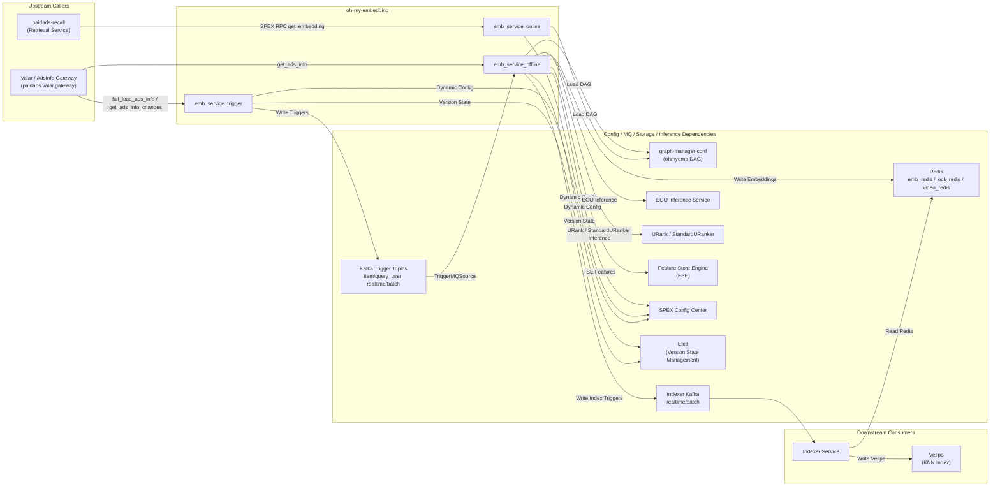

<!-- ads-workspace-gdoc-sync: gdoc_id=11DO7FKWr38QG0rmfvbyOJxQzqyTB7wrWUYfa-9UW3IY gdoc_url=https://docs.google.com/document/d/11DO7FKWr38QG0rmfvbyOJxQzqyTB7wrWUYfa-9UW3IY/edit -->

# Oh-My-Embedding (OhMyEmb)

Git Repository: [https://git.garena.com/shopee/deep/oh-my-embedding](https://git.garena.com/shopee/deep/oh-my-embedding)

---

## Table of Contents

- [Introduction](#introduction)
- [Features](#features)
- [Architecture](#architecture)
- [Directory Structure](#directory-structure)
- [Embedding Model Management](#embedding-model-management)
- [Scenes and Clusters](#scenes-and-clusters)
- [Inference Services](#inference-services)
- [Configuration](#configuration)
- [Development Guidelines](#development-guidelines)
- [Deployment](#deployment)
- [Monitoring](#monitoring)
- [Business Terminology Glossary](#business-terminology-glossary)
- [Additional Resources](#additional-resources)
- [Frequently Asked Questions](#frequently-asked-questions)

---

## Introduction

Oh-My-Embedding (OhMyEmb) is Shopee Paid Ads' **unified vector recall framework**. It computes and maintains embeddings for advertisements, products, users, search queries, videos, and live streams. Results are written to Redis and indexed into Vespa via the Indexer service, enabling KNN (ANN) vector recall across Search Ads, Discovery Ads (YMAL), Video Ads, and Live Stream Ads.

The framework uses [graph-engine](https://git.garena.com/shopee/deep/searchads/graph-engine) as the computation engine. DAG topology and operator configurations are managed via [Graph Manager](https://graphmanager.shopee.io/?service=ohmyemb) (service name: `ohmyemb`), enabling unified scheduling of both online inference and offline batch computation.

Primary language: Go 1.22.8

---

## Features

- **Unified Embedding Computation**: Manages embedding computation for Query, User, Item, Video, Live, and Ads entity types through a DAG computation graph — operators and I/O are shared across entity types.
- **Offline Batch Indexing**: `emb_service_offline` consumes Kafka Triggers, executes DAGs, writes embeddings to Redis, and asynchronously indexes them into Vespa via Indexer Kafka.
- **Online Real-time Inference**: `emb_service_online` provides a SPEX RPC endpoint (`paidads.emb_service.get_embedding`) that computes and returns Query/User embeddings in real time without writing to any storage.
- **Trigger Production**: `emb_service_trigger` produces Triggers from Valar (ad info service) and Redis (Query/User scans), writing them to internal Kafka on a scheduled or real-time basis to drive offline computation.
- **Multi-Scene Support**: Covers 10 offline Sinker targets across Search Ads Q2I, DD U2I, YMAL U2I, Live Stream Ads, Union Item/Video/Live, Keyword Recommendation, Query Rewrite/Extend, and User-to-User. Nine targets are indexed into Vespa through Indexer Kafka, while `keyword_rcmd` writes the ItemFeature Redis cache.
- **Batch Version Management**: Uses Etcd to manage batch version numbers and pipeline status, supporting rolling model upgrades with Magic Trigger (BATCH_TAG_START/BATCH_TAG_END) mechanism.
- **Dynamic Configuration**: Key parameters (rate limits, feature flags, retry counts, etc.) are pushed dynamically via Config Center (SPEX dynamic config) without service restarts.
- **Independent Image Embedding Flow**: In live environments, an independent Kafka consumer supports image embedding features written directly to Redis without DAG computation.

---

## Architecture

### End-to-End Data Flow

```
┌──────────────────────────────────────────────────────────────────────────────┐
│                        emb_service_trigger                                   │
│  ValarSource (full ADS scan)  RedisScanSource (Query/User)  ValarChanges    │
└────────────────────┬─────────────────────────────────────────────────────────┘
                     │  Kafka Triggers (4 topics: item_realtime / item_batch /
                     │            query_user_realtime / query_user_batch)
                     ▼
┌──────────────────────────────────────────────────────────────────────────────┐
│                        emb_service_offline                                   │
│  TriggerMQSource → Pipeline.DoOne → FetchAdsInfo (Valar RPC)                │
│  → DAG Execution (graph-engine, DAG config from Graph Manager)              │
│  → Write Redis (emb_redis) → Write Indexer Kafka                            │
└──────────┬─────────────────────────────────────────────────────┬─────────────┘
           │ Redis Embedding                                      │ Indexer Kafka
           ▼                                                      ▼
┌──────────────────────┐                           ┌─────────────────────────────┐
│       Redis          │                           │     Indexer Service         │
│ {cid}:{table}:{field}│                           │ (reads Redis → writes Vespa)│
│ :{key}               │                           └──────────────┬──────────────┘
└──────────────────────┘                                          │
                                                                  ▼
                                              ┌──────────────────────────────────┐
                                              │           Vespa                  │
                                              │ sa_q2i_knn_recall / knn_qrwt /  │
                                              │ dd_u2i_knn_recall / paidads_item │
                                              │ 9 indexes + keyword_rcmd cache   │
                                              └──────────────────────────────────┘

┌──────────────────────────────────────────────────────────────────────────────┐
│                        emb_service_online                                    │
│  SPEX RPC (paidads.emb_service.get_embedding)                                │
│  → DAG Execution (online_query_user / offline_item) → Return Embedding       │
└──────────────────────────────────────────────────────────────────────────────┘
```

### Service Topology



| Type | Service/Middleware | Protocol | Description |
|------|-------------------|----------|-------------|
| **Upstream** | paidads-recall (Retrieval) | SPEX RPC | Calls online embedding endpoint to obtain Query/User-side vectors |
| **Upstream** | Valar / AdsInfo Gateway | SPEX RPC | `emb_service_trigger` uses `full_load_ads_info` / `get_ads_info_changes` to produce ADS Triggers; `emb_service_offline` uses `get_ads_info` to fill VideoIDList, SessionID, and MountedItemIDList |
| **Downstream** | Indexer Service / Vespa clusters | Kafka -> Vespa Feed | `emb_service_offline` writes `ohmyemb_indexer_realtime-global-{{env}}` / `ohmyemb_indexer_batch-global-{{env}}`; Indexer reads Redis and feeds `sa_q2i_knn_recall`, `dd_u2i_knn_recall`, `ymal_u2i_knn_recall`, `live_stream_ads`, `paidads_item`, `paidads_video`, `paidads_live`, `knn_qrwt`, `knn_u2u`, and related indexes |
| **Dependency** | graph-manager-conf / Graph Manager | Git tag / HTTP | `make prepare` fetches the `ohmyemb` DAG by `graph_version`; online/offline services load `online_query_user`, `offline_query_user`, and `offline_item` |
| **Dependency** | Kafka | MQ | Trigger Service writes `ohmyemb_item_realtime`, `ohmyemb_item_batch`, `ohmyemb_query_user_realtime`, and `ohmyemb_query_user_batch`; Offline Service consumes those topics and writes Indexer Kafka |
| **Dependency** | Redis | Redis protocol | `emb_redis` stores embeddings with TTL 336h + 0~1h jitter; `lock_redis` is used for trigger scan locks; `video_redis` provides video data; `keyword_rcmd` writes ItemFeature cache through the `kwrcmd_item_feature` writer |
| **Dependency** | FSE / Feature Platform | RPC | `FseFetchOp` and `FseFetchUBSeqOp` read ADS / ohmyemb scene features as DAG inputs |
| **Dependency** | URank / StandardURanker | NamingProxy / gRPC | `SimpleURankerOp` and `SimpleStandardURankerOp` run model inference and produce embeddings |
| **Dependency** | EGO Predictor | gRPC | `EgoPredictOp` connects to configured EGO Predictor model services |
| **Dependency** | SPEX Config Center | Dynamic Config | Online, offline, and trigger services hot-update rate limits, timeouts, degradation switches, and pipeline parameters through `service_key` / `config_key` |
| **Dependency** | Etcd | gRPC | Manages `TriggerStatus`, `EmbPipelineStatus`, batch versions, and Live / Liveish environment prefixes |

---

## Directory Structure

```
oh-my-embedding/
├── Makefile                        # Build, test, and status check commands
├── go.mod                          # Go module dependencies (Go 1.22.8)
├── config/
│   ├── config.go                   # Configuration struct definitions and parsing
│   ├── dynamic.go                  # Dynamic config (SPEX Config Center)
│   ├── etcd.go / etcd_status.go    # Etcd state management
│   └── files/                      # Service config files
│       ├── emb_service_online.yaml  # Online service config (incl. req_output_mapping)
│       ├── emb_service_offline.yaml # Offline service config (pipeline list)
│       ├── trigger_service.yaml     # Trigger service config (data source definitions)
│       ├── dssm_knn_config.yaml     # DSSM KNN V6 model config (SG/non-US countries: TW/ID/PH/MY/SG/TH/VN/BR/MX)
│       ├── dssm_knn_config_us.yaml  # DSSM KNN V6 model config (US region instances)
│       └── offline_pipeline/        # Pipeline and Sinker configs per table
│           ├── offline_item/        # Item-side pipeline (per-table YAML files)
│           └── offline_query_user/  # Query/User-side pipeline
├── server/
│   ├── emb_service_online/         # Online service entrypoint
│   ├── emb_service_offline/        # Offline service entrypoint (service.go / pipeline.go)
│   ├── emb_service_trigger/        # Trigger service entrypoint
│   └── http_handler/               # HTTP debug endpoints
├── pkg/
│   ├── operator/                   # DAG operator implementations
│   │   ├── ego_predict_op.go       # EGO inference operator
│   │   ├── simple_standard_uranker_op.go  # StandardURanker operator (new)
│   │   ├── fse_fetch_op.go         # FSE feature fetch operator
│   │   ├── mtext_op.go             # MText (multilingual text) operator
│   │   └── ...                     # Other operators
│   ├── sinker/
│   │   ├── table_sinker.go         # TableSinker: manages writes for one Vespa table
│   │   └── emb_sinker.go           # EmbSinker: manages writes for one embedding field
│   ├── dssm/                       # DSSM model loading and feature clients
│   │   ├── model_registry.go       # Lazy-loading model registry (GetOrLoadModel / LoadKNNClients)
│   │   ├── kwrcmd_item_feature_writer.go  # Keyword Rcmd ItemFeature Redis writer
│   │   └── item_info.go            # Item info fallback fetch (Valar RPC)
│   ├── ranker/
│   │   └── uranker/                # StandardURanker client
│   ├── source/
│   │   └── impl/                   # Data source implementations
│   │       ├── valar/              # Valar batch/incremental scan
│   │       ├── redis/              # Redis full scan (Query/User)
│   │       └── trigger/            # Kafka Trigger consumer
│   ├── common/                     # Shared constants and utility functions
│   └── reqctx/                     # PipelineContext (per-item processing context)
├── proto/                          # Protobuf generated code
├── deploy/                         # Deployment descriptors (SMC JSON)
├── scripts/                        # Helper scripts
├── doc/                            # Documentation (developer guide, SOP)
└── domain/                         # Domain knowledge documents (DAG/Scene/Pipeline/Sinker/Trigger/URanker)
```

---

## Embedding Model Management

### Model Registration and Versioning

Model version management relies on two mechanisms:

1. **Graph Manager DAG Nodes**: Each embedding field corresponds to a DAG node whose `args.model_name` field specifies the exact model version (supports `common.model_name` and `country.{CID}.model_name` two-level configuration). To upgrade a model, update the node config in [Graph Manager](https://graphmanager.shopee.io/?service=ohmyemb), create a new tag (format: `ohmyemb_x.x.xx`), and update `graph_version` in the `Makefile`.

2. **Etcd Batch Versions**: During offline batch updates, Magic Triggers (BATCH_TAG_START / BATCH_TAG_END) mark the start and end of a batch. Etcd's `EmbPipelineStatus` records `ProcessingVersion` and `CompletedVersion`; the batch is considered complete when `CompletedVersion == ProcessingVersion`.

Check current status:
```bash
make show_pipeline_status    # View pipeline version status per country
make show_trigger_status     # View trigger batch version status
```

### Model Configuration Files

Each Sinker table's configuration is at `config/files/offline_pipeline/{pipeline_name}/{table}.yaml`. Core fields:

```yaml
table: sa_q2i_knn_recall          # Vespa schema name
key:
  node: __TRIGGER__               # Key source: __TRIGGER__ (Trigger field) or DAG node name
  out: AdsID                      # Specific field name
fields:
  embeddingv1:                    # Vespa field name
    data:
      node: sa_q2i_knn_recall@embeddingv1  # DAG node name
      out: Embedding
    dim: 128                      # Embedding dimension (0 = no validation)
  embeddingv3:
    data:
      node: sa_q2i_knn_recall@embeddingv3
      out: Embedding
    dim: 128
condition:
  type: ads                       # Trigger type filter
  enable_realtime: true
  enable_batch: true
  interval: 4h                   # Minimum processing interval for batch
  pre_check_expr: "Placement in [0, 4, 1000, 1200, 40, 4400, 50]"
enable_redis: "{{isLive}}"
enable_indexer: true
skip_indexer_when_emb_not_changed: true
double_write_redis: true          # US countries also write to SG Redis for full-batch Indexer
```

### Rank Profile and Model Mapping

The online service maps external call keys to DAG nodes via `req_output_mapping` in `config/files/emb_service_online.yaml`:

```yaml
# Example mapping in online_query_user pipeline
req_output_mapping:
  sa_knn_v8.1:                   # Key used by callers
    node: sa_q2i_knn_recall@embeddingv1
    out: Embedding
  query_extend_v12:
    node: knn_qrwt@embeddingv3
    out: Embedding
  dd_knn_ltr_v1:
    node: rcmd_u2i_knn_recall@embeddingv2
    out: Embedding
```

Naming convention: `req_output_key` is used in Retrieval-side AB parameters together with a Vespa rank profile in the format `{required_output}||{rank_profile}`.

---

## Scenes and Clusters

### Scene-to-Sinker Target Mapping

| Scene | Sinker Target | Trigger Type | Embedding Type | Key Field | Typical Dim | Pre-check Condition |
|-------|---------------|-------------|---------------|-----------|-------------|---------------------|
| Search Ads Q2I | `sa_q2i_knn_recall` | TYPE_ADS | Item | AdsID | 64/128 | Placement in [0,4,1000,1200,40,4400,50] |
| DD U2I | `dd_u2i_knn_recall` | TYPE_ADS | Item | AdsID | 64 | Placement in [2,802,1002,1202,4402,50,40], 8 countries |
| YMAL U2I | `ymal_u2i_knn_recall` | TYPE_ADS | Item | AdsID | 64 | Placement in [5,805,1005,1205,4405,50,40], 8 countries |
| Live Stream Ads | `live_stream_ads` | TYPE_ADS | Live | AdsID | 64 | Placement [33] or [40]+SessionID>0 |
| Union Item | `paidads_item` | TYPE_ADS | Item | ItemIDList | 64 (text) / 128 (image) | ItemID>0 or MountedItemIDList is non-empty; limited to 8 countries (ID/TH/PH/VN/SG/MY/TW/BR) |
| Union Video | `paidads_video` | TYPE_ADS | Video | VideoID | 32 | VideoID>0 or ValarVideoIDList is non-empty |
| Union Live | `paidads_live` | TYPE_ADS | Live | AdsAccountID | 64 | SessionID>0 or Placement [33] |
| Keyword Recommendation | `keyword_rcmd` | TYPE_ADS | ItemFeature cache | KwRcmdItemList | 128 | ItemID>0; writes Redis cache, does not write Indexer |
| Query Rewrite/Extend | `knn_qrwt` | TYPE_QUERY | Query | QueryMText | 64/128 | AttrFlags["rewrite"/"extend"] |
| User-to-User | `knn_u2u` | TYPE_USER | User | UserID | 64 | Batch only |

**Shared Node Notes**:
- `dd_u2i_knn_recall` and `ymal_u2i_knn_recall` share the `rcmd_u2i_knn_recall@embeddingvN` / `embeddingclustervN` computation nodes
- The current repository config does not enable standalone `va_antou_knn_recall` / `va_mingtou_knn_recall` tables; video-side embeddings are consolidated into `paidads_video`
- `paidads_live` reuses `live_stream_ads@embeddingvN` computation nodes, but uses `AdsAccountID` as the key
- `keyword_rcmd` uses the `kwrcmd_item_feature` RedisWriter with `enable_indexer: false`, so it does not write Indexer Kafka
- `paidads_item` contains text embeddings (`embeddingv1`–`embeddingv8`, dim 64) and one image embedding (`embeddingimagev1`, dim 128, `disable_retry: true`)

### Cross-Cluster Version Correspondence

Except for `keyword_rcmd`, US countries (BR/CO/CL/MX) write embeddings to both local Redis and SG Redis (`double_write_redis: true`). This is because the full-batch Indexer runs only in SG daily and reads embeddings from SG Redis. The OhMyEmb US instance writes to US Redis, but the full-batch Indexer needs SG Redis, so US country embeddings must also be written to SG Redis via the `paidads.emb_service.redis_write` SPEX API.

---

## Inference Services

### Inference Service Types

Operator evolution path:

| Operator | File | Inference Service | Applicable Scenes |
|----------|------|------------------|-------------------|
| `EgoPredictOp` | `pkg/operator/ego_predict_op.go` | EGO Platform (TensorFlow) | Early Search/Rcmd scenes |
| `SimpleURankerOp` | `pkg/operator/simple_uranker_op.go` | URanker (legacy) | Intermediate transitional version |
| `SimpleStandardURankerOp` | `pkg/operator/simple_standard_uranker_op.go` | StandardURanker (AFP features) | Video/Live/Search/Rcmd (new) |
| `DSSMFeatureFetchOp` | `pkg/operator/dssm_feature_fetch_op.go` | paidads-semantic-search (Redis cache + textproc) | Fetches raw Query/Item features (RawQueryFeature / RawItemFeature) for DSSM inference; falls back to item name from Valar when cache misses |
| `DSSMPredictOp` | `pkg/operator/dssm_predict_op.go` | DSSM KNN V6 (TensorFlow, locally loaded) | Dual-tower model inference; loads KNN V6 model lazily via `dssm.GetOrLoadModel`, routes to Query or Item Tower based on request type |

`SimpleStandardURankerOp` is the recommended operator for new model integration, encapsulating Arrow IPC serialization, NamingProxy connections, and AFP feature context assembly.

### Online Inference Flow

```
Caller → SPEX RPC paidads.emb_service.get_embedding
  → Find pipeline by dag_name (online_query_user)
  → Resolve required_output via req_output_mapping → DAG node name
  → graph-engine executes subgraph (only target nodes and their dependencies)
  → GetOutputDataByNodeNameAndOutName fetches Embedding
  → Return resp.Embeddings
(Does NOT write to Redis or Indexer Kafka)
```

Debug command (Liveish environment):
```bash
curl --location 'https://http-gateway.spex.shopee.sg/sprpc/paidads.emb_service.get_embedding' \
  --header 'Content-Type: application/json' \
  --header 'x-sp-sdu: embservice.embservice.sg.liveish.master.default' \
  --header 'x-sp-servicekey: dd94a4b8132c415d57aa425e72ae7c9a' \
  --header 'shopee-baggage: CID=sg' \
  --data '{
    "req_id": "test",
    "query": "xiaomi",
    "user_id": 778876889,
    "country": "SG",
    "debug": true,
    "dag_name": "online_query_user",
    "required_output": ["sa_q2i_knn_recall@embeddingv1:Embedding"]
  }'
```

### Offline Inference Flow

```
emb_service_trigger
  → ValarSource (scheduled full scan) / ValarChangesSource (real-time incremental)
  → Kafka Triggers (item_realtime / item_batch)

emb_service_offline
  → TriggerMQSource consumes Kafka
  → DoOne (country filter → lag check → TriggerSplit → PreCheck → rate limit → async pool)
  → FetchAdsInfo (TYPE_ADS, calls Valar RPC to fill VideoIDList/SessionID/MountedItemIDList)
  → DoCheck (PostCheck, fine-grained condition filtering)
  → graph-engine executes DAG (10s timeout)
  → DoWrite (write Redis + write Indexer Kafka)
```

---

## Configuration

### graph-manager-conf/ohmyemb Directory Structure

DAG node configurations are stored in the [graph-manager-conf](https://git.garena.com/shopee/deep/searchads/graph-manager-conf) repository under `ohmyemb/`:

```
graph-manager-conf/ohmyemb/
├── offline_item.yaml         # Offline Item-side DAG (ad/product/video/live embeddings)
├── offline_query_user.yaml   # Offline Query/User-side DAG (Query Rewrite, U2U)
├── online_query_user.yaml    # Online Query/User-side DAG (real-time inference)
└── opdef.yaml                # Operator definitions (op name → implementation class)
```

The active version is controlled by `graph_version` in the `Makefile` (currently `ohmyemb_0.1.4`). `make prepare` clones the corresponding version by tag.

### emb_service_online.yaml

Core fields for online service configuration:

```yaml
pipeline:
  - name: online_query_user
    service: ohmyemb
    graph: online_query_user
    req_output_mapping:
      sa_knn_v8.1:
        node: sa_q2i_knn_recall@embeddingv1
        out: Embedding
      query_extend_v12:
        node: knn_qrwt@embeddingv3
        out: Embedding
      # ... more mappings
  - name: offline_item
    service: ohmyemb
    graph: offline_item
    # offline_item in online service is debug-only; no writes
```

### emb_service_offline.yaml

Core fields for offline service configuration:

```yaml
pipeline: [offline_item, offline_query_user]
pipeline_pool_size: 1024
emb_redis: ips.79b8d54a334e4904.elasticredis.cloud.shopee.io:10310
video_redis: wep9w.elasticredis.cloud.shopee.io:12981
indexer_kafka_realtime: # Real-time Indexer Kafka config
  topic: ohmyemb_indexer_realtime-global-{{env}}
indexer_kafka_batch:    # Batch Indexer Kafka config
  topic: ohmyemb_indexer_batch-global-{{env}}
```

### offline_pipeline/{name}/config.yaml

Per-pipeline configuration, core fields:

```yaml
enabled: true
service: ohmyemb
graph: offline_item
source_list:
  - name: ohmyemb_item_realtime-global-{env}
    source: AdsChange
  - name: ohmyemb_item_batch-global-{env}
    source: AdsFullScan
max_realtime_trigger_lag: 6h
max_batch_trigger_lag: 48h
tables: [sa_q2i_knn_recall, dd_u2i_knn_recall, ymal_u2i_knn_recall, live_stream_ads, paidads_item, paidads_video, paidads_live, keyword_rcmd]
```

### opdef.yaml

Operator definition file (`graph-manager-conf/ohmyemb/opdef.yaml`) maps `op` field names configured in Graph Manager to concrete implementations:

```yaml
- op: EgoPredictOp
- op: SimpleStandardURankerOp
- op: FseFetchOp
- op: MTextOp
- op: DSSMFeatureFetchOp
- op: DSSMPredictOp
```

### dssm_knn_config.yaml / dssm_knn_config_us.yaml

DSSM KNN model configuration files loaded by `pkg/dssm/model_registry.go` during `DSSMFeatureFetchOp` and `DSSMPredictOp` initialization. The service selects the appropriate file automatically based on the runtime environment (`IDC` env variable — US region instances use `dssm_knn_config_us.yaml`).

```yaml
common:
  log-level: info
  textproc: textproc.xml   # mtext text-processing config
  mtext: knn_mtext.xml

query-cache / item-cache / image-cache:
  host: <elasticredis>     # SG and US use separate Redis clusters
  ttl: 604800              # 7 days (image-cache: 14 days)

<country>:                 # Per-country config; supported: TW/ID/PH/MY/SG/TH/VN/BR/MX
  KNN-v6:
    model: knn/V6/<COUNTRY>/DSSM   # Model path (relative to project root, downloaded by scripts/download_dssm_model.sh)
    tf-conf: Proto.bin
    encoder:
      bert: common_models/V6/<COUNTRY>/bert
      spm: common_models/V6/<COUNTRY>/spm.model
      ft-text: common_models/V6/<COUNTRY>/ft.bin
      ftatt-text: common_models/V6/<COUNTRY>/ftatt
```

---

## Development Guidelines

### Code Style

```bash
make fmt        # go fmt formatting
make vet        # go vet static analysis
make clean      # fmt + go mod tidy
```

CI automatically runs `make vet` and unit tests. MR titles must follow this format:

```
(Feat|Fix|Docs|Style|Refactor|Test|Chore): [SPPA-XXXXX] description
```

A SPPA Jira ticket number is mandatory. If there is no associated ticket, use the default `SPPA-65887`.

### How to Add a New Embedding Model

1. **Confirm Op Parameters**: Select `service_name`, `business`, `model_name`, `item_type`, `emb_column_name` in Graph Manager.
2. **Optionally validate with Self Model Service (SMS)**: Use the internal SMS tool to test the config and export DAG Node YAML.
3. **Update graph-manager-conf**: Write node YAML to the corresponding DAG file (`ohmyemb/offline_item.yaml` / `online_query_user.yaml`), merge MR, then create a new tag (format: `ohmyemb_x.x.xx`).
4. **Update oh-my-embedding**: Create a branch, update `graph_version` in the `Makefile` to the new tag; add field config to `config/files/offline_pipeline/offline_item/{table}.yaml`; add online mapping in `config/files/emb_service_online.yaml` under `req_output_mapping`. Merge MR.
5. **Deploy Services**: Contact recall master to release `emb_service_offline`; use [S&R Release Platform](https://release.sra.shopee.io/template/list) for `emb_service_online`.
6. **Verify**: Use curl to validate online/offline node output; confirm Redis writes and Vespa indexing are correct.
7. **Enable Experiment**: Configure experiment parameters on [A/B Test Platform](https://abtest.shopee.io/feature/42).

Detailed SOP: `doc/add-model-sop/Sop_EN.md`

### Project Structure

- `server/`: `main.go` and `service.go` for each service — service startup, config parsing, goroutine management
- `pkg/operator/`: All DAG operator implementations; each file corresponds to one operator with a matching `_test.go`
- `pkg/sinker/`: Sinker hierarchy (TableSinker / EmbSinker) — handles Redis writes and Indexer Kafka messages
- `config/`: Configuration structs and files; do not store secrets in `files/`

### Naming Conventions

- DAG node names: `{vespa_table}@{field_name}`, e.g., `sa_q2i_knn_recall@embeddingv1`
- Sinker names (`name` field): auto-generated as `{table}@{field_key}` if not explicitly set
- Etcd key paths: `/{OHMYEMB_LIVE|OHMYEMB_LIVEISH}/{country}/EmbPipelineStatus/{pipeline_name}`
- Redis keys: `{country}:{table}:{field}:{key_value}`

### Unit Testing Standards

```bash
make unittest        # Fast unit tests (-short flag)
make test            # Full test suite
make test-ci         # CI mode (excludes packages requiring libfasttextgo)
make test-coverage   # Generate HTML coverage report
```

CI requires ≥ 60% coverage for new code (not enforced when new lines < 10). Packages requiring `libfasttextgo` (`pkg/operator`, `pkg/ranker/uranker`, `pkg/sinker`) are skipped in CI and must be validated locally or in Liveish.

### Code Review & Git Workflow

- All changes must go through Merge Requests (MR); direct push to master is forbidden
- MR merge policy: Squash commits, delete source branch after merge
- Reviewer: Contact `gensheng.wu@shopee.com`
- Recommended branch naming: `{algo_name}/{model_name}` or `feature/{feature_name}`

---

## Deployment

### Build for Production

```bash
# Prerequisites: download dependencies (TensorFlow, FastText, graph-manager-conf)
make prepare

# Build service binaries (must run on Linux)
make emb_service_online     # Output: bin/emb_service_online.linux
make emb_service_offline    # Output: bin/emb_service_offline.linux
make emb_service_trigger    # Output: bin/emb_service_trigger.linux
```

Build uses `GOEXPERIMENT=greenteagc` to enable Green Tea GC optimization. Deployment descriptors are in the `deploy/` directory (SMC JSON format).

### Release Process

| Service | Release Method | Contact |
|---------|---------------|---------|
| `emb_service_online` | [S&R Release Platform](https://release.sra.shopee.io/template/list) | recall master |
| `emb_service_offline` | Coordinated by recall master | gensheng.wu@shopee.com |
| `emb_service_trigger` | Same as above | gensheng.wu@shopee.com |

**Pre-release Validation (Liveish Environment)**:
1. Set `debug: true` in service config (managed via Config Center), observe logs.
2. Use curl to call `paidads.emb_service.get_embedding` and verify DAG node outputs.
3. Confirm embedding dimension, non-empty values, and no nodes being skipped.

**Post-release Validation (Live Environment)**:
1. Check Grafana monitoring (online inference QPS, latency, error rate).
2. Confirm Redis write success via offline pipeline Grafana dashboard.
3. Confirm no Indexer Kafka lag and that target fields in Vespa contain data.

---

## Monitoring

### Core Monitoring Dashboards

- **OhMyEmb Online Inference**: [oh-my-embedding Grafana](https://monitoring.infra.sz.shopee.io/grafana/d/W0MQmyvNz/oh-my-embedding?orgId=39)
- **Offline Pipeline**: [ohmyemb-offline-pipeline Grafana](https://monitoring.infra.sz.shopee.io/grafana/d/pCo2VkPNz/ohmyemb-offline-pipeline?orgId=39)

### Inference Latency and QPS

| Panel | Description | Alert Rule |
|-------|-------------|------------|
| Online error rate (by cid/caller) | Embedding inference error rate | Triggers L2 alert when above threshold |
| Offline Sinker QPS anomaly | Detects abnormal embedding import volume (usually indicates model reduction) | Alert on sudden QPS change |

Specific alert rules are in each Grafana dashboard's Alert tab:
- Online error rate: `W0MQmyvNz/oh-my-embedding?tab=alert&viewPanel=38`
- Offline Sinker QPS: `pCo2VkPNz/ohmyemb-offline-pipeline?tab=alert&viewPanel=17`

### Model Health Checks

- Check `EmbPipelineStatus.CompletedVersion` in Etcd to confirm the full batch has completed.
- Monitor Embedding cache hit rate on Indexer side via [Indexer Unified Embedding Cache Hit Rate](https://monitoring.infra.sz.shopee.io/grafana/d/-nO5IQiIz/new-live-ads-index?orgId=39).
- Use curl (`debug: true`) to verify that target DAG nodes are executing (not skipped/allow_error suppressed).

**Distinguishing model upgrades from infrastructure changes**:
- Model upgrade: update `model_name` in Graph Manager node → bump `graph_version` → release
- Operator upgrade (Op type change): modify `opdef.yaml` or add new `Op` code → recompile and release

---

## Business Terminology Glossary

| Term | Meaning |
|------|---------|
| OhMyEmb | Abbreviation for oh-my-embedding service, Shopee Paid Ads unified vector recall framework |
| Embedding | Vector representation of an entity (product/user/query/video/live stream), used for ANN retrieval |
| KNN / ANN | K-Nearest Neighbor / Approximate Nearest Neighbor, vector similarity retrieval |
| HNSW | Hierarchical Navigable Small World, the ANN index algorithm used by Vespa |
| Vespa | Distributed search engine used internally at Shopee, stores embeddings and executes nearestNeighbor retrieval |
| nearestNeighbor | Vespa ANN retrieval operator used in rank profiles |
| rank profile | Vespa query configuration defining the embedding fields and ranking rules for retrieval |
| EGO | Shopee's internal ML training platform (TensorFlow-based) |
| URanker | Shopee's unified Ranking inference service (AFP feature-based) |
| DSSM | Deep Structured Semantic Model — a dual-tower semantic matching model that encodes queries and items separately using locally loaded TensorFlow models, without relying on external RPC inference services |
| DSSMFeatureFetchOp | DAG operator for fetching raw DSSM features; reads Query/Item features from Redis cache and falls back to Valar for item name when the cache is unavailable |
| DSSMPredictOp | DAG operator for DSSM dual-tower inference; routes to Query Tower or Item Tower based on request type and produces an Embedding vector |
| EgoPredictOp | DAG operator for EGO inference service |
| SimpleStandardURankerOp | DAG operator for StandardURanker, recommended for new model integration |
| SimpleURankerOp | DAG operator connecting to the legacy URanker service; an intermediate step between EgoPredictOp and SimpleStandardURankerOp |
| graph-manager-conf | Git repository storing DAG YAML configurations, fetched by OhMyEmb at startup by tag |
| DAG | Directed Acyclic Graph, describes the node dependency relationships for embedding computation |
| eCPM | Effective Cost Per Mille, the core metric for ad ranking |
| uGSP | Unified Generalized Second Price, unified second-price auction mechanism |
| SPEX | Shopee's internal RPC framework |
| Q2I | Query-to-Item, vector retrieval from search query to product |
| U2I | User-to-Item, vector retrieval from user to product |
| U2U | User-to-User, user similarity retrieval |
| Magic Trigger | Boundary messages for batch scanning (BATCH_TAG_START / BATCH_TAG_END), used for version management |
| TableSinker | Sinker object managing writes for one Vespa table |
| EmbSinker | Sinker object managing writes for one embedding field |
| keyword_rcmd | Keyword recommendation ItemFeature cache target; uses the `kwrcmd_item_feature` RedisWriter and does not send Indexer Kafka |
| FSE | Feature Store Engine |
| DD | Daily Discovery, the discovery (recommendation) ads scene |
| YMAL | You May Also Like, recommendation ads scene |
| CTR | Click-Through Rate |
| CVR / CR | Conversion Rate |

---

## Additional Resources

- **Git Repository**: [https://git.garena.com/shopee/deep/oh-my-embedding](https://git.garena.com/shopee/deep/oh-my-embedding)
- **Graph Manager (ohmyemb service)**: [https://graphmanager.shopee.io/?service=ohmyemb](https://graphmanager.shopee.io/?service=ohmyemb)
- **graph-manager-conf Repository**: [https://git.garena.com/shopee/deep/searchads/graph-manager-conf](https://git.garena.com/shopee/deep/searchads/graph-manager-conf)
- **Developer Documentation**: `doc/for_developer.md`
- **Add Model SOP**: `doc/add-model-sop/Sop_EN.md`
- **Domain Knowledge Documents**: `domain/` (DAG/Pipeline/Scene/Sinker/Trigger/URanker)
- **Online Service Monitoring**: [oh-my-embedding Grafana](https://monitoring.infra.sz.shopee.io/grafana/d/W0MQmyvNz/oh-my-embedding?orgId=39)
- **Offline Pipeline Monitoring**: [ohmyemb-offline-pipeline Grafana](https://monitoring.infra.sz.shopee.io/grafana/d/pCo2VkPNz/ohmyemb-offline-pipeline?orgId=39)
- **S&R Release Platform**: [https://release.sra.shopee.io/template/list](https://release.sra.shopee.io/template/list)
- **SPEX Go SDK Quick Start**: [https://spex.shopee.io/overview/quick-start/languages/go/index.html](https://spex.shopee.io/overview/quick-start/languages/go/index.html)
- **spcli Installation and Git Setup**: [https://spex.shopee.io/user-guide/SDK/Java/local.html](https://spex.shopee.io/user-guide/SDK/Java/local.html)
- **Ads Recall Business Architecture and System Design (SRA)**: [https://sra.shopee.io/05.Business_Systems/5.3_Ads_Business_and_Architecture_Introduction/5.3.3._ads_recall.html](https://sra.shopee.io/05.Business_Systems/5.3_Ads_Business_and_Architecture_Introduction/5.3.3._ads_recall.html)
- **Paid Ads Glossary** (Confluence): [Business Terminology Reference](https://confluence.shopee.io/pages/viewpage.action?spaceKey=SPAD&title=Paid+Ads+Glossary)
- **Recall Monitoring Documentation** (Google Docs): [Ads Monitor and Alert](https://docs.google.com/document/d/1EMoDFFIl6ZbOSkLzBMui5OtE4-vHH2ApUB_K6eldKu0/edit)
- **OhMyEmbedding Architecture** (Confluence): [Architecture](https://confluence.shopee.io/pages/viewpage.action?spaceKey=SPAD&title=OhMyEmbedding+Architecture)

---

## Frequently Asked Questions

**Q1: What is the relationship between OhMyEmb and paidads-recall (Retrieval service)?**

OhMyEmb computes and maintains embeddings for all entities (Item/User/Query/Video/Live) and writes results to Redis and Vespa. paidads-recall (Retrieval service) calls OhMyEmb's online service to obtain Query/User embeddings, then executes `nearestNeighbor` retrieval in Vespa to return recall results. The responsibilities are clearly separated: OhMyEmb is the embedding supplier; Retrieval is the embedding consumer.

**Q2: How do I add a new embedding model (e.g., a new Search Q2I model)?**

Main steps: ① Configure the new node in Graph Manager (`SimpleStandardURankerOp`), create a new tag; ② Update `graph_version` in OhMyEmb, add field config in the corresponding `{table}.yaml`, add online mapping in `emb_service_online.yaml` under `req_output_mapping`; ③ Merge MR and release; ④ Validate with curl; ⑤ Enable AB experiment. Detailed steps in `doc/add-model-sop/Sop_EN.md`.

**Q3: Which DAGs are loaded by the online service (emb_service_online) and offline service (emb_service_offline)?**

- `emb_service_offline`: Loads `offline_item` and `offline_query_user` DAGs, responsible for writing to Redis and Indexer Kafka.
- `emb_service_online`: Loads `offline_item`, `offline_query_user`, and `online_query_user` DAGs (first two for debug only, no storage writes). Production inference only uses `online_query_user`.

**Q4: Why do US countries (BR/CO/CL/MX) need double Redis writes (`double_write_redis`)?**

The full-batch Indexer runs only in SG daily, reading embeddings from SG Redis for full-batch indexing. The OhMyEmb US instance writes to US Redis, but the full-batch Indexer needs to read SG Redis. Therefore, except for `keyword_rcmd`, US country embeddings must additionally be written to SG Redis via the `paidads.emb_service.redis_write` SPEX API, ensuring the full-batch Indexer can access the latest data.

**Q5: How do I determine whether a model's offline embeddings have been fully written?**

```bash
make show_pipeline_status
```
Check the `EmbPipelineStatus` per country in Etcd. When `CompletedVersion == ProcessingVersion`, the batch is fully written. You can also observe the Sinker QPS trend in the [offline pipeline Grafana dashboard](https://monitoring.infra.sz.shopee.io/grafana/d/pCo2VkPNz/ohmyemb-offline-pipeline?orgId=39).

**Q6: What is the difference between real-time and batch triggers? How does the `interval` field work for batch triggers?**

Real-time triggers come from `ValarChangesSource` (1-second polling for ad changes) and are processed immediately, never discarded due to rate limiting. Batch triggers come from `ValarSource` (scheduled full scans) and are subject to the `interval` setting (e.g., 4h for ads, 24h for query/user): the service checks Etcd's `ProcessingStartAt` to determine whether the interval has elapsed since the last processing; if not, the batch is discarded. Real-time triggers have higher priority than batch triggers (batch consumption pauses when real-time data is pending).

**Q7: How do I verify that a newly integrated DAG node is executing correctly?**

Use curl to call the online service (`paidads.emb_service.get_embedding`) with `debug: true`. The response includes the execution status of each DAG node (executed / skipped / error). If the target node appears in the debug output with a non-empty embedding matching the expected dimension, the node is working correctly. See specific commands in `doc/add-model-sop/Sop_EN.md`.

**Q8: What is the Redis key format? What is the TTL?**

Redis key format: `{country}:{table}:{field}:{key_value}`, e.g., `SG:sa_q2i_knn_recall:embeddingv1:12345678`. TTL = 14 days (336h) + up to 1 hour random jitter (`jitter: 1h`).

**Q9: What is OhMyEmb's Etcd configuration? How are Live and Liveish environments differentiated?**

Etcd prefixes are environment-specific: `OHMYEMB_LIVE` for Live and `OHMYEMB_LIVEISH` for Liveish. Etcd endpoint: `http://etcd.etcd-mp-search-recommendation-ads-paidads-live-naafeawx.global.live.dc.shopee.io:6033`. In Liveish, `enable_redis` is false (no Redis writes), but Indexer triggers can still be sent for testing.

<!-- Generated by ads-workspace/skills/ads-readme-generate | checked: e124dac0e3be27776a6cfa5a999200aeada79dcf | spec: 76fce5f679f9550b -->
