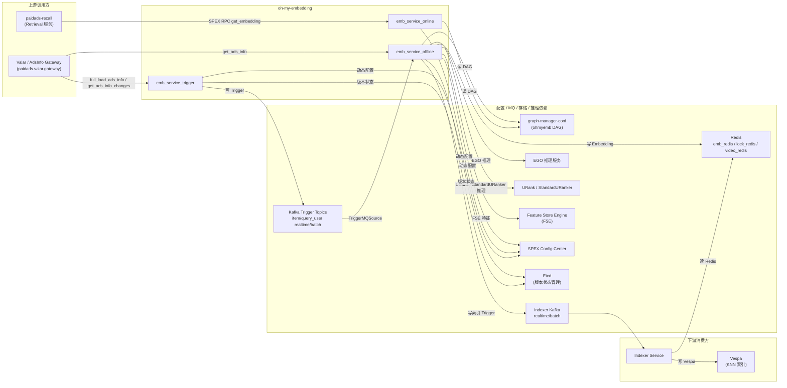

<!-- ads-workspace-gdoc-sync: gdoc_id=1rgj7OtsZRhe3gKvIo6tKX7MFaa_MwkEoJGBxXzq6eNY gdoc_url=https://docs.google.com/document/d/1rgj7OtsZRhe3gKvIo6tKX7MFaa_MwkEoJGBxXzq6eNY/edit -->

# Oh-My-Embedding（OhMyEmb）

Git 仓库：[https://git.garena.com/shopee/deep/oh-my-embedding](https://git.garena.com/shopee/deep/oh-my-embedding)

---

## 目录 / Table of Contents

- [项目概述 / Introduction](#项目概述--introduction)
- [核心功能 / Features](#核心功能--features)
- [项目架构 / Architecture](#项目架构--architecture)
- [目录结构 / Directory Structure](#目录结构--directory-structure)
- [Embedding 模型管理 / Embedding Model Management](#embedding-模型管理--embedding-model-management)
- [场景与集群 / Scenes and Clusters](#场景与集群--scenes-and-clusters)
- [推理服务 / Inference Services](#推理服务--inference-services)
- [配置管理 / Configuration](#配置管理--configuration)
- [开发规范 / Development Guidelines](#开发规范--development-guidelines)
- [部署 / Deployment](#部署--deployment)
- [监控 / Monitoring](#监控--monitoring)
- [业务术语表 / Business Terminology Glossary](#业务术语表--business-terminology-glossary)
- [参考资料 / Additional Resources](#参考资料--additional-resources)
- [常见问题 / Frequently Asked Questions](#常见问题--frequently-asked-questions)

---

## 项目概述 / Introduction

Oh-My-Embedding（简称 OhMyEmb）是 Shopee Paid Ads 的**统一向量召回框架**，负责计算并维护广告、商品、用户、搜索词、视频、直播等多种实体的 Embedding，将结果写入 Redis，并通知 Indexer 同步至 Vespa，支持搜索广告（Search Ads）、推荐广告（Discovery Ads/YMAL）、视频广告、直播广告等全场景的 KNN（ANN）向量召回。

框架以 [graph-engine](https://git.garena.com/shopee/deep/searchads/graph-engine) 为计算引擎，通过 [Graph Manager](https://graphmanager.shopee.io/?service=ohmyemb)（service 名：`ohmyemb`）平台管理 DAG 拓扑与算子配置，实现在线推理与离线批量计算的统一调度。

主要语言：Go 1.22.8

---

## 核心功能 / Features

- **统一 Embedding 计算**：通过 DAG 图引擎统一管理 Query / User / Item / Video / Live / Ads 多类型实体的 Embedding 计算，算子复用，IO 复用。
- **离线批量写库**：`emb_service_offline` 消费 Kafka Trigger，执行 DAG，将 Embedding 写入 Redis，再通过 Indexer Kafka 异步写入 Vespa。
- **在线实时推理**：`emb_service_online` 提供 SPEX RPC 接口（`paidads.emb_service.get_embedding`），实时计算并返回 Query / User Embedding，不写任何存储。
- **Trigger 生产**：`emb_service_trigger` 从 Valar（广告信息服务）和 Redis（Query/User 扫描）生产 Trigger，定时或实时写入内部 Kafka，驱动离线计算。
- **多场景支持**：覆盖 Search Ads Q2I、DD U2I、YMAL U2I、Live Stream Ads、Union Item/Video/Live、Keyword Recommendation、Query Rewrite/Extend、User-to-User 共 10 个离线 Sinker 目标，其中 9 个通过 Indexer Kafka 写入 Vespa，`keyword_rcmd` 写入 ItemFeature Redis cache。
- **批量版本管理**：通过 Etcd 管理批次版本号与 Pipeline 状态，支持模型滚动上线与 Magic Trigger（批次开始/结束）机制。
- **动态配置**：关键参数（限速、开关、重试次数等）通过 Config Center（SPEX dynamic config）动态下发，无需重启服务。
- **图像 Embedding 独立流程**：Live 环境下支持通过独立 Kafka 消费图像特征，直接写入 Redis，不经 DAG 计算。

---

## 项目架构 / Architecture

### 整体数据流

```
┌──────────────────────────────────────────────────────────────────────────────┐
│                        emb_service_trigger                                   │
│  ValarSource（全量 ADS）  RedisScanSource（Query/User）  ValarChangesSource（实时）│
└────────────────────┬─────────────────────────────────────────────────────────┘
                     │  Kafka Trigger（4 个 topic：item_realtime/item_batch/
                     │            query_user_realtime/query_user_batch）
                     ▼
┌──────────────────────────────────────────────────────────────────────────────┐
│                        emb_service_offline                                   │
│  TriggerMQSource → Pipeline.DoOne → FetchAdsInfo（Valar RPC）                │
│  → DAG 执行（graph-engine，DAG 配置由 Graph Manager 下发）                     │
│  → 写 Redis（emb_redis）→ 写 Indexer Kafka                                   │
└──────────┬─────────────────────────────────────────────────────┬─────────────┘
           │ Redis Embedding                                      │ Indexer Kafka
           ▼                                                      ▼
┌──────────────────────┐                           ┌─────────────────────────────┐
│       Redis          │                           │     Indexer Service         │
│ {cid}:{table}:{field}│                           │（读 Redis → 写 Vespa）       │
│ :{key}               │                           └──────────────┬──────────────┘
└──────────────────────┘                                          │
                                                                  ▼
                                              ┌──────────────────────────────────┐
                                              │           Vespa                  │
                                              │ sa_q2i_knn_recall / knn_qrwt /  │
                                              │ dd_u2i_knn_recall / paidads_item │
                                              │ 9 个索引 + keyword_rcmd cache    │
                                              └──────────────────────────────────┘

┌──────────────────────────────────────────────────────────────────────────────┐
│                        emb_service_online                                    │
│  SPEX RPC（paidads.emb_service.get_embedding）                               │
│  → DAG 执行（online_query_user / offline_item）→ 直接返回 Embedding            │
└──────────────────────────────────────────────────────────────────────────────┘
```

### 上下游调用拓扑 / Service Topology



| 类型 | 服务/中间件 | 协议 | 描述 |
|------|------------|------|------|
| **上游** | paidads-recall (Retrieval) | SPEX RPC | 调用在线 Embedding 接口，获取 Query/User 侧向量 |
| **上游** | Valar / AdsInfo Gateway | SPEX RPC | `emb_service_trigger` 通过 `full_load_ads_info` / `get_ads_info_changes` 生产 ADS Trigger；`emb_service_offline` 通过 `get_ads_info` 补全 VideoIDList、SessionID、MountedItemIDList |
| **下游** | Indexer Service / Vespa 索引集群 | Kafka -> Vespa Feed | `emb_service_offline` 写 `ohmyemb_indexer_realtime-global-{{env}}` / `ohmyemb_indexer_batch-global-{{env}}`，Indexer 读取 Redis 后写入 `sa_q2i_knn_recall`、`dd_u2i_knn_recall`、`ymal_u2i_knn_recall`、`live_stream_ads`、`paidads_item`、`paidads_video`、`paidads_live`、`knn_qrwt`、`knn_u2u` 等索引 |
| **依赖** | graph-manager-conf / Graph Manager | Git tag / HTTP | `make prepare` 按 `graph_version` 拉取 `ohmyemb` DAG；在线/离线服务加载 `online_query_user`、`offline_query_user`、`offline_item` |
| **依赖** | Kafka | MQ | Trigger Service 写 `ohmyemb_item_realtime`、`ohmyemb_item_batch`、`ohmyemb_query_user_realtime`、`ohmyemb_query_user_batch`；Offline Service 消费这些 topic 并写 Indexer Kafka |
| **依赖** | Redis | Redis 协议 | `emb_redis` 存储 Embedding，TTL 为 336h + 0~1h jitter；`lock_redis` 用于 Trigger 扫描锁；`video_redis` 用于视频信息读取；`keyword_rcmd` 通过 `kwrcmd_item_feature` writer 写 ItemFeature cache |
| **依赖** | FSE / Feature Platform | RPC | `FseFetchOp`、`FseFetchUBSeqOp` 读取 ADS / ohmyemb 场景特征，作为 DAG 输入 |
| **依赖** | URank / StandardURanker | NamingProxy / gRPC | `SimpleURankerOp`、`SimpleStandardURankerOp` 执行模型推理，生成 Embedding |
| **依赖** | EGO Predictor | gRPC | `EgoPredictOp` 通过 EGO Predictor client 连接指定模型服务 |
| **依赖** | SPEX Config Center | Dynamic Config | 在线、离线、Trigger 服务通过 `service_key` / `config_key` 热更新限流、超时、降级和 pipeline 参数 |
| **依赖** | Etcd | gRPC | 管理 `TriggerStatus`、`EmbPipelineStatus`、批次版本和 Live / Liveish 环境前缀 |

---

## 目录结构 / Directory Structure

```
oh-my-embedding/
├── Makefile                        # 构建、测试、状态查看命令
├── go.mod                          # Go 模块依赖（Go 1.22.8）
├── config/
│   ├── config.go                   # 配置结构体定义与解析逻辑
│   ├── dynamic.go                  # 动态配置（SPEX Config Center）
│   ├── etcd.go / etcd_status.go    # Etcd 状态管理
│   └── files/                      # 服务配置文件
│       ├── emb_service_online.yaml  # 在线服务配置（含 req_output_mapping）
│       ├── emb_service_offline.yaml # 离线服务配置（Pipeline 列表）
│       ├── trigger_service.yaml     # Trigger 服务配置（数据源定义）
│       ├── dssm_knn_config.yaml     # DSSM KNN V6 模型配置（SG/非 US 国家：TW/ID/PH/MY/SG/TH/VN/BR/MX）
│       ├── dssm_knn_config_us.yaml  # DSSM KNN V6 模型配置（US 地域实例）
│       └── offline_pipeline/        # 各 Pipeline 及 Sinker 配置
│           ├── offline_item/        # item 侧 Pipeline（含各 table.yaml）
│           └── offline_query_user/  # query/user 侧 Pipeline
├── server/
│   ├── emb_service_online/         # 在线服务入口
│   ├── emb_service_offline/        # 离线服务入口（service.go / pipeline.go）
│   ├── emb_service_trigger/        # Trigger 服务入口
│   └── http_handler/               # HTTP 调试接口
├── pkg/
│   ├── operator/                   # DAG 算子实现
│   │   ├── ego_predict_op.go       # EGO 推理算子
│   │   ├── simple_standard_uranker_op.go  # StandardURanker 算子（新）
│   │   ├── fse_fetch_op.go         # FSE 特征拉取算子
│   │   ├── mtext_op.go             # MText（多语言文本）算子
│   │   └── ...                     # 其他算子
│   ├── sinker/
│   │   ├── table_sinker.go         # TableSinker：管理一张 Vespa 表的写入
│   │   └── emb_sinker.go           # EmbSinker：管理单个 Embedding 字段的写入
│   ├── dssm/                       # DSSM 模型加载与特征客户端
│   │   ├── model_registry.go       # 延迟加载模型注册表（GetOrLoadModel / LoadKNNClients）
│   │   ├── kwrcmd_item_feature_writer.go  # Keyword Rcmd ItemFeature Redis 写入
│   │   └── item_info.go            # Item 信息兜底获取（Valar RPC）
│   ├── ranker/
│   │   └── uranker/                # StandardURanker 客户端
│   ├── source/
│   │   └── impl/                   # 数据源实现
│   │       ├── valar/              # Valar 批量/增量扫描
│   │       ├── redis/              # Redis 全量扫描（Query/User）
│   │       └── trigger/            # Kafka Trigger 消费
│   ├── common/                     # 公共常量、工具函数
│   └── reqctx/                     # PipelineContext（单次处理上下文）
├── proto/                          # Protobuf 生成代码
├── deploy/                         # 部署描述文件（SMC JSON）
├── scripts/                        # 辅助脚本
├── doc/                            # 文档（含开发者文档、SOP）
└── domain/                         # 领域知识文档（DAG/Scene/Pipeline/Sinker/Trigger/URanker）
```

---

## Embedding 模型管理 / Embedding Model Management

### 模型注册与版本管理 / Model Registration and Versioning

模型版本管理通过两个机制配合：

1. **Graph Manager DAG 节点**：每个 Embedding 字段对应一个 DAG 节点，节点 args 中的 `model_name` 字段绑定具体模型版本（支持 `common.model_name` 和 `country.{CID}.model_name` 两级配置）。模型升级时，在 [Graph Manager](https://graphmanager.shopee.io/?service=ohmyemb) 中更新节点配置，打新 tag（格式：`ohmyemb_x.x.xx`）并更新 `Makefile` 中的 `graph_version`。

2. **Etcd 批次版本**：离线批量更新时，通过 Magic Trigger（BATCH_TAG_START / BATCH_TAG_END）标记一批数据的开始和结束，Etcd 中的 `EmbPipelineStatus` 记录 `ProcessingVersion` 和 `CompletedVersion`，`CompletedVersion == ProcessingVersion` 时视为全量写入完成。

查看当前状态：
```bash
make show_pipeline_status        # 查看各国 Pipeline 版本状态
make show_trigger_status         # 查看 Trigger 批次版本状态
```

### 模型配置文件 / Model Configuration Files

各 Sinker 表的配置文件位于 `config/files/offline_pipeline/{pipeline_name}/{table}.yaml`，核心字段：

```yaml
table: sa_q2i_knn_recall         # Vespa Schema 名称
key:
  node: __TRIGGER__              # 主键来源：__TRIGGER__（Trigger 字段）或普通 DAG 节点
  out: AdsID                     # 具体字段名
fields:
  embeddingv1:                   # Vespa field 名
    data:
      node: sa_q2i_knn_recall@embeddingv1  # DAG 节点名
      out: Embedding
    dim: 128                     # 向量维度（0 表示不校验）
  embeddingv3:
    data:
      node: sa_q2i_knn_recall@embeddingv3
      out: Embedding
    dim: 128
condition:
  type: ads                      # Trigger 类型过滤
  enable_realtime: true
  enable_batch: true
  interval: 4h                   # 批量最小处理间隔
  pre_check_expr: "Placement in [0, 4, 1000, 1200, 40, 4400, 50]"
enable_redis: "{{isLive}}"
enable_indexer: true
skip_indexer_when_emb_not_changed: true
double_write_redis: true         # US 国家额外写 SG Redis，供全量 Indexer 使用
```

### rank profile 与模型映射 / Rank Profile and Model Mapping

在线服务通过 `config/files/emb_service_online.yaml` 中的 `req_output_mapping` 将外部调用 key 映射到 DAG 节点：

```yaml
# online_query_user pipeline 中的映射示例
req_output_mapping:
  sa_knn_v8.1:                   # 调用方使用的 key
    node: sa_q2i_knn_recall@embeddingv1
    out: Embedding
  query_extend_v12:
    node: knn_qrwt@embeddingv3
    out: Embedding
  dd_knn_ltr_v1:
    node: rcmd_u2i_knn_recall@embeddingv2
    out: Embedding
```

命名规范：`{req_output_key}` 在 Retrieval 侧 AB 参数中与 Vespa rank profile 配合使用，格式为 `{required_output}||{rank_profile}`。

---

## 场景与集群 / Scenes and Clusters

### 各场景与 Sinker 目标对应关系

| 场景 | Sinker 目标 | Trigger 类型 | Embedding 类型 | key 字段 | 典型维度 | 触发条件要点 |
|------|-------------|-------------|---------------|----------|---------|------------|
| 搜索广告 Q2I | `sa_q2i_knn_recall` | TYPE_ADS | Item | AdsID | 64/128 | Placement [0,4,1000,1200,40,4400,50] |
| DD U2I | `dd_u2i_knn_recall` | TYPE_ADS | Item | AdsID | 64 | Placement [2,802,1002,1202,4402,50,40]，8 国 |
| YMAL U2I | `ymal_u2i_knn_recall` | TYPE_ADS | Item | AdsID | 64 | Placement [5,805,1005,1205,4405,50,40]，8 国 |
| 直播广告 | `live_stream_ads` | TYPE_ADS | Live | AdsID | 64 | Placement [33] 或 [40]+SessionID>0 |
| 统一商品（Union Item） | `paidads_item` | TYPE_ADS | Item | ItemIDList | 64（文本）/ 128（图像） | ItemID>0 或 MountedItemIDList 非空；限 8 国（ID/TH/PH/VN/SG/MY/TW/BR） |
| 统一视频（Union Video） | `paidads_video` | TYPE_ADS | Video | VideoID | 32 | VideoID>0 或 ValarVideoIDList 非空 |
| 统一直播（Union Live） | `paidads_live` | TYPE_ADS | Live | AdsAccountID | 64 | SessionID>0 或 Placement [33] |
| Keyword Recommendation | `keyword_rcmd` | TYPE_ADS | ItemFeature cache | KwRcmdItemList | 128 | ItemID>0；写 Redis cache，不写 Indexer |
| Query Rewrite/Extend | `knn_qrwt` | TYPE_QUERY | Query | QueryMText | 64/128 | AttrFlags["rewrite"/"extend"] |
| User-to-User | `knn_u2u` | TYPE_USER | User | UserID | 64 | 仅批量 |

**节点共享说明**：
- `dd_u2i_knn_recall` 与 `ymal_u2i_knn_recall` 共享 `rcmd_u2i_knn_recall@embeddingvN` / `embeddingclustervN` 计算节点
- 当前仓库配置未启用独立的 `va_antou_knn_recall` / `va_mingtou_knn_recall` 表；视频侧统一写入 `paidads_video`
- `paidads_live` 复用 `live_stream_ads@embeddingvN` 计算节点，key 改为 `AdsAccountID`
- `keyword_rcmd` 使用 `kwrcmd_item_feature` RedisWriter，`enable_indexer: false`，不会写 Indexer Kafka
- `paidads_item` 包含文本 Embedding（`embeddingv1`–`embeddingv8`，维度 64）和图像 Embedding（`embeddingimagev1`，维度 128，`disable_retry: true`）

### 跨集群版本对应 / Cross-Cluster Version Correspondence

除 `keyword_rcmd` 外，US 国家（BR/CO/CL/MX）的 Embedding 会同时写入本地 Redis 和 SG Redis（`double_write_redis: true`），原因：全量 Indexer 每日仅在 SG 运行，需从 SG Redis 读取 Embedding 做全量索引；实时 Indexer 在 SG 和 US 均有部署，读取本地 Redis。

---

## 推理服务 / Inference Services

### 推理服务类型 / Inference Service Types

算子演进路径：

| 算子 | 文件 | 推理服务 | 适用场景 |
|------|------|---------|---------|
| `EgoPredictOp` | `pkg/operator/ego_predict_op.go` | EGO 平台（TensorFlow） | 早期 Search/Rcmd 场景 |
| `SimpleURankerOp` | `pkg/operator/simple_uranker_op.go` | URanker（旧版） | 中间过渡版本 |
| `SimpleStandardURankerOp` | `pkg/operator/simple_standard_uranker_op.go` | StandardURanker（AFP 特征） | Video/Live/Search/Rcmd（新） |
| `DSSMFeatureFetchOp` | `pkg/operator/dssm_feature_fetch_op.go` | paidads-semantic-search（Redis 缓存 + textproc） | 获取 DSSM 推理所需的 Query/Item 原始特征（RawQueryFeature / RawItemFeature）；特征不可用时兜底读取 item 名称 |
| `DSSMPredictOp` | `pkg/operator/dssm_predict_op.go` | DSSM KNN V6（TensorFlow，本地加载） | 双塔模型推理，通过 `dssm.GetOrLoadModel` 延迟加载 KNN V6 模型，按请求类型路由到 Query 或 Item Tower |

`SimpleStandardURankerOp` 是当前推荐的新模型接入方式，封装了 Arrow IPC 序列化、NamingProxy 连接、AFP 特征上下文组装等底层细节。

### 在线推理流程 / Online Inference Flow

```
调用方 → SPEX RPC paidads.emb_service.get_embedding
  → 按 dag_name 找到 pipeline（online_query_user）
  → 通过 req_output_mapping 解析 required_output → DAG 节点名
  → graph-engine 执行子图（只计算目标节点及其依赖）
  → GetOutputDataByNodeNameAndOutName 取 Embedding
  → 返回 resp.Embeddings
（不写 Redis，不写 Indexer Kafka）
```

调试方式（Liveish 环境）：
```bash
curl --location 'https://http-gateway.spex.shopee.sg/sprpc/paidads.emb_service.get_embedding' \
  --header 'Content-Type: application/json' \
  --header 'x-sp-sdu: embservice.embservice.sg.liveish.master.default' \
  --header 'x-sp-servicekey: dd94a4b8132c415d57aa425e72ae7c9a' \
  --header 'shopee-baggage: CID=sg' \
  --data '{
    "req_id": "test",
    "query": "xiaomi",
    "user_id": 778876889,
    "country": "SG",
    "debug": true,
    "dag_name": "online_query_user",
    "required_output": ["sa_q2i_knn_recall@embeddingv1:Embedding"]
  }'
```

### 离线推理流程 / Offline Inference Flow

```
emb_service_trigger
  → ValarSource（定时批量）/ ValarChangesSource（实时增量）
  → Kafka Trigger（item_realtime / item_batch）

emb_service_offline
  → TriggerMQSource 消费 Kafka
  → DoOne（国家过滤 → lag 检查 → TriggerSplit → PreCheck → 限速 → 异步 pool）
  → FetchAdsInfo（TYPE_ADS，通过 Valar RPC 补全 VideoIDList/SessionID/MountedItemIDList）
  → DoCheck（PostCheck，精细条件过滤）
  → graph-engine 执行 DAG（10s 超时）
  → DoWrite（写 Redis + 写 Indexer Kafka）
```

---

## 配置管理 / Configuration

### graph-manager-conf/ohmyemb 目录结构 / ohmyemb Directory Structure

DAG 节点配置存储在 [graph-manager-conf](https://git.garena.com/shopee/deep/searchads/graph-manager-conf) 仓库的 `ohmyemb/` 目录下：

```
graph-manager-conf/ohmyemb/
├── offline_item.yaml         # 离线 Item 侧 DAG（广告/商品/视频/直播 Embedding）
├── offline_query_user.yaml   # 离线 Query/User 侧 DAG（Query Rewrite、U2U）
├── online_query_user.yaml    # 在线 Query/User 侧 DAG（实时推理）
└── opdef.yaml                # 算子定义（op 名称 → 实现类映射）
```

当前使用的版本由 `Makefile` 中的 `graph_version` 变量控制（当前为 `ohmyemb_0.1.4`）。`make prepare` 会按此 tag clone 对应版本。

### emb_service_online.yaml

在线服务配置，核心字段：

```yaml
pipeline:
  - name: online_query_user
    service: ohmyemb
    graph: online_query_user
    req_output_mapping:
      sa_knn_v8.1:
        node: sa_q2i_knn_recall@embeddingv1
        out: Embedding
      query_extend_v12:
        node: knn_qrwt@embeddingv3
        out: Embedding
      # ... 更多映射
  - name: offline_item
    service: ohmyemb
    graph: offline_item
    # offline_item 在在线服务中仅供调试，不写库
```

### emb_service_offline.yaml

离线服务配置，核心字段：

```yaml
pipeline: [offline_item, offline_query_user]
pipeline_pool_size: 1024
emb_redis: ips.79b8d54a334e4904.elasticredis.cloud.shopee.io:10310
video_redis: wep9w.elasticredis.cloud.shopee.io:12981
indexer_kafka_realtime:   # 实时 Indexer Kafka 配置
  topic: ohmyemb_indexer_realtime-global-{{env}}
indexer_kafka_batch:      # 批量 Indexer Kafka 配置
  topic: ohmyemb_indexer_batch-global-{{env}}
```

### offline_pipeline/{name}/config.yaml

单条 Pipeline 配置，核心字段：

```yaml
enabled: true
service: ohmyemb
graph: offline_item
source_list:
  - name: ohmyemb_item_realtime-global-{env}
    source: AdsChange
  - name: ohmyemb_item_batch-global-{env}
    source: AdsFullScan
max_realtime_trigger_lag: 6h
max_batch_trigger_lag: 48h
tables: [sa_q2i_knn_recall, dd_u2i_knn_recall, ymal_u2i_knn_recall, live_stream_ads, paidads_item, paidads_video, paidads_live, keyword_rcmd]
```

### opdef.yaml

算子定义文件（`graph-manager-conf/ohmyemb/opdef.yaml`），将 Graph Manager 中配置的 `op` 字段名映射到具体实现，如：

```yaml
- op: EgoPredictOp
- op: SimpleStandardURankerOp
- op: FseFetchOp
- op: MTextOp
- op: DSSMFeatureFetchOp
- op: DSSMPredictOp
```

### dssm_knn_config.yaml / dssm_knn_config_us.yaml

DSSM KNN 模型配置文件，由 `pkg/dssm/model_registry.go` 在 `DSSMFeatureFetchOp` 和 `DSSMPredictOp` 初始化时加载。服务根据运行环境（`IDC` 环境变量是否以 `us` 为前缀）自动选择对应文件。

```yaml
common:
  log-level: info
  textproc: textproc.xml   # mtext 文本处理配置
  mtext: knn_mtext.xml

query-cache / item-cache / image-cache:
  host: <elasticredis>     # SG 与 US 使用独立 Redis 集群
  ttl: 604800              # 7 天（image-cache 为 14 天）

<country>:                 # 各国独立配置，支持 TW/ID/PH/MY/SG/TH/VN/BR/MX
  KNN-v6:
    model: knn/V6/<COUNTRY>/DSSM   # 模型路径（相对于项目根目录，由 scripts/download_dssm_model.sh 下载）
    tf-conf: Proto.bin
    encoder:
      bert: common_models/V6/<COUNTRY>/bert
      spm: common_models/V6/<COUNTRY>/spm.model
      ft-text: common_models/V6/<COUNTRY>/ft.bin
      ftatt-text: common_models/V6/<COUNTRY>/ftatt
```

---

## 开发规范 / Development Guidelines

### 代码风格 / Code Style

```bash
make fmt        # go fmt 格式化
make vet        # go vet 静态检查
make clean      # fmt + go mod tidy
```

CI 会自动运行 `make vet` 和单元测试，MR 标题须符合规范：

```
(Feat|Fix|Docs|Style|Refactor|Test|Chore): [SPPA-XXXXX] 描述
```

MR 标题必须包含 SPPA Jira ticket 编号，无关联 ticket 时可使用默认值 `SPPA-65887`。

### 新增 Embedding 模型流程 / How to Add a New Embedding Model

1. **确认 Op 参数**：在 Graph Manager 中选定 `service_name`、`business`、`model_name`、`item_type`、`emb_column_name`。
2. **（可选）Self Model Service 验证**：通过内部 SMS 工具测试配置并导出 DAG Node YAML。
3. **更新 graph-manager-conf**：将节点 YAML 写入对应 DAG 文件（`ohmyemb/offline_item.yaml` / `online_query_user.yaml`），提 MR 合入后打新 tag（格式：`ohmyemb_x.x.xx`）。
4. **更新 oh-my-embedding**：新建分支，修改 `Makefile` 中的 `graph_version` 为新 tag；在 `config/files/offline_pipeline/offline_item/{table}.yaml` 中新增 Sinker field 配置；在 `config/files/emb_service_online.yaml` 的 `req_output_mapping` 中新增在线映射。提 MR 合入。
5. **发布服务**：联系 recall master 发布 `emb_service_offline`，通过 [S&R Release Platform](https://release.sra.shopee.io/template/list) 发布 `emb_service_online`。
6. **验证**：使用 curl 验证在线/离线节点输出，确认 Redis 写入和 Vespa 索引正常。
7. **开启实验**：在 [A/B Test Platform](https://abtest.shopee.io/feature/42) 配置实验参数。

详细 SOP 见：`doc/add-model-sop/Sop.md`

### 项目结构 / Project Structure

- `server/`：各服务的 `main.go` 和 `service.go`，负责服务启动、配置解析、协程管理
- `pkg/operator/`：所有 DAG 算子实现，每个文件对应一个算子，均有对应 `_test.go`
- `pkg/sinker/`：Sinker 体系（TableSinker / EmbSinker），负责 Redis 写入和 Indexer Kafka 发送
- `config/`：配置结构体和文件，不可在 `files/` 中存储 secret

### 命名规范 / Naming Conventions

- DAG 节点名：`{vespa_table}@{field_name}`，如 `sa_q2i_knn_recall@embeddingv1`
- Sinker 名（`name` 字段）：若未显式配置，自动生成为 `{table}@{field_key}`
- Etcd key 路径：`/{OHMYEMB_LIVE|OHMYEMB_LIVEISH}/{country}/EmbPipelineStatus/{pipeline_name}`
- Redis key：`{country}:{table}:{field}:{key_value}`

### 单元测试 / Unit Testing Standards

```bash
make unittest        # 快速单测（-short）
make test            # 全量测试
make test-ci         # CI 模式（排除需要 libfasttextgo 的包）
make test-coverage   # 生成 HTML 覆盖率报告
```

CI 要求新增代码覆盖率 ≥ 60%（少于 10 行新增代码时不强制检查）。需要 `libfasttextgo` 的包（`pkg/operator`、`pkg/ranker/uranker`、`pkg/sinker`）在 CI 中跳过，须在本地或 Liveish 环境验证。

### Code Review & Git Workflow

- 所有变更通过 Merge Request（MR）合入，禁止直接推送 master
- MR 合入策略：Squash commit，合入后删除源分支
- Reviewer：联系 `gensheng.wu@shopee.com`
- 分支命名建议：`{algo_name}/{model_name}` 或 `feature/{feature_name}`

---

## 部署 / Deployment

### 生产构建 / Build for Production

```bash
# 前置：下载依赖（TensorFlow、FastText、graph-manager-conf）
make prepare

# 构建各服务二进制（须在 Linux 上执行）
make emb_service_online     # 输出：bin/emb_service_online.linux
make emb_service_offline    # 输出：bin/emb_service_offline.linux
make emb_service_trigger    # 输出：bin/emb_service_trigger.linux
```

构建使用 `GOEXPERIMENT=greenteagc`，启用 Green Tea GC 优化。部署描述文件位于 `deploy/` 目录（SMC JSON）。

### 发布流程 / Release Process

| 服务 | 发布方式 | 联系人 |
|------|---------|--------|
| `emb_service_online` | [S&R Release Platform](https://release.sra.shopee.io/template/list) | recall master |
| `emb_service_offline` | recall master 协调发布 | gensheng.wu@shopee.com |
| `emb_service_trigger` | 同上 | gensheng.wu@shopee.com |

**发布前验证（Liveish 环境）**：
1. 在 `emb_service_liveish.yaml`（实际配置通过 Config Center 管理）中设置 `debug: true`，观察日志。
2. 使用 curl 调用 `paidads.emb_service.get_embedding` 验证 DAG 各节点输出。
3. 确认 Embedding 维度、非空、节点未被跳过。

**发布后验证（Live 环境）**：
1. 检查 Grafana 监控面板（在线推理 QPS、延迟、错误率）。
2. 确认 Redis 写入正常（通过离线 pipeline Grafana 看板）。
3. 确认 Indexer Kafka 无积压、Vespa 表对应 field 已有数据。

---

## 监控 / Monitoring

### 核心监控大盘

- **OhMyEmb 在线推理**：[oh-my-embedding 监控大盘](https://monitoring.infra.sz.shopee.io/grafana/d/W0MQmyvNz/oh-my-embedding?orgId=39)
- **离线 Pipeline**：[ohmyemb-offline-pipeline](https://monitoring.infra.sz.shopee.io/grafana/d/pCo2VkPNz/ohmyemb-offline-pipeline?orgId=39)

### 推理延迟与 QPS / Inference Latency and QPS

| 面板 | 描述 | 告警规则 |
|------|------|---------|
| 在线错误率（cid/caller 维度） | Embedding 推理错误率 | > 阈值时触发 L2 告警 |
| 离线 Sinker QPS 变化 | 检测 Embedding 导入量异常（通常意味着模型减少） | Sinker QPS 突变时告警 |

具体告警规则参见 Grafana 看板的 Alert 标签页：
- 在线错误率：`W0MQmyvNz/oh-my-embedding?tab=alert&viewPanel=38`
- 离线 Sinker QPS：`pCo2VkPNz/ohmyemb-offline-pipeline?tab=alert&viewPanel=17`

### 模型健康检查 / Model Health Check

- 检查 Etcd 中 `EmbPipelineStatus` 的 `CompletedVersion`，确认全量批次已完成写入。
- 通过 Indexer Unified Embedding Cache Hit Rate 监控 Embedding 在 Indexer 侧的缓存命中率：[链接](https://monitoring.infra.sz.shopee.io/grafana/d/-nO5IQiIz/new-live-ads-index?orgId=39)
- 通过 curl（`debug: true`）验证 DAG 中目标节点是否执行（非 skip/allow_error）。

**如何区分模型迭代与基础设施升级**：
- 模型迭代：修改 Graph Manager 节点的 `model_name` → 更新 `graph_version` → 发版
- 算子升级（Op 类型变更）：修改 `opdef.yaml` 或新增 `Op` 代码 → 重新编译发版

---

## 业务术语表 / Business Terminology Glossary

| 术语 | 含义 |
|------|------|
| OhMyEmb | oh-my-embedding 服务的简称，Shopee Paid Ads 统一向量召回框架 |
| Embedding | 实体（商品/用户/搜索词/视频/直播）的向量表示，用于 ANN 检索 |
| KNN / ANN | K-Nearest Neighbor / Approximate Nearest Neighbor，向量相似度检索 |
| HNSW | Hierarchical Navigable Small World，Vespa 使用的 ANN 索引算法 |
| Vespa | Shopee 内部使用的分布式搜索引擎，用于存储 Embedding 并执行 nearestNeighbor 检索 |
| nearestNeighbor | Vespa ANN 检索算子，在 rank profile 中使用 |
| rank profile | Vespa 查询配置，定义检索时使用的 Embedding 字段和排序规则 |
| EGO | Shopee 内部 ML 训练平台（基于 TensorFlow） |
| URanker | Shopee 统一 Ranking 推理服务（基于 AFP 特征） |
| DSSM | Deep Structured Semantic Model，双塔语义匹配模型，通过 Query Tower 和 Item Tower 分别编码搜索词与商品，本地加载 TF 模型推理，不依赖外部 RPC 服务 |
| DSSMFeatureFetchOp | 获取 DSSM 推理所需原始特征的 DAG 算子，从 Redis 缓存读取 Query/Item 特征，特征缺失时兜底调用 Valar 获取商品名称 |
| DSSMPredictOp | 执行 DSSM 双塔推理的 DAG 算子，按请求类型路由到 Query Tower 或 Item Tower，输出 Embedding 向量 |
| EgoPredictOp | 对接 EGO 推理服务的 DAG 算子 |
| SimpleStandardURankerOp | 对接 StandardURanker 的 DAG 算子，新模型推荐使用 |
| SimpleURankerOp | 对接旧版 URanker 的 DAG 算子，是 EgoPredictOp 与 SimpleStandardURankerOp 之间的过渡版本 |
| graph-manager-conf | 存储 DAG YAML 配置的 Git 仓库，OhMyEmb 启动时按 tag 拉取 |
| DAG | Directed Acyclic Graph，有向无环图，描述 Embedding 计算的节点依赖关系 |
| eCPM | Effective Cost Per Mille，广告有效千次曝光费用，是广告排序的核心指标 |
| uGSP | Unified Generalized Second Price，统一广义二价计费机制 |
| SPEX | Shopee 内部 RPC 框架 |
| Q2I | Query-to-Item，搜索词到商品的向量检索 |
| U2I | User-to-Item，用户到商品的向量检索 |
| U2U | User-to-User，用户相似度检索 |
| Magic Trigger | 批量扫描的边界消息（BATCH_TAG_START / BATCH_TAG_END），用于版本管理 |
| TableSinker | 管理一张 Vespa Table 写入的 Sinker 对象 |
| EmbSinker | 管理单个 Embedding 字段写入的 Sinker 对象 |
| keyword_rcmd | 关键词推荐 ItemFeature cache 写入目标，使用 `kwrcmd_item_feature` RedisWriter，不发送 Indexer Kafka |
| FSE | Feature Store Engine，特征存储引擎 |
| DD | Daily Discovery，推荐广告场景（发现页） |
| YMAL | You May Also Like，推荐广告场景（猜你喜欢） |
| CTR | Click-Through Rate，点击率 |
| CVR / CR | Conversion Rate，转化率 |

---

## 参考资料 / Additional Resources

- **Git 仓库**：[https://git.garena.com/shopee/deep/oh-my-embedding](https://git.garena.com/shopee/deep/oh-my-embedding)
- **Graph Manager（ohmyemb service）**：[https://graphmanager.shopee.io/?service=ohmyemb](https://graphmanager.shopee.io/?service=ohmyemb)
- **graph-manager-conf 仓库**：[https://git.garena.com/shopee/deep/searchads/graph-manager-conf](https://git.garena.com/shopee/deep/searchads/graph-manager-conf)
- **开发者文档**：`doc/for_developer.md`
- **新增模型 SOP**：`doc/add-model-sop/Sop.md`
- **领域知识文档**：`domain/`（DAG/Pipeline/Scene/Sinker/Trigger/URanker）
- **核心监控大盘**：[oh-my-embedding Grafana](https://monitoring.infra.sz.shopee.io/grafana/d/W0MQmyvNz/oh-my-embedding?orgId=39)
- **离线 Pipeline 监控**：[ohmyemb-offline-pipeline Grafana](https://monitoring.infra.sz.shopee.io/grafana/d/pCo2VkPNz/ohmyemb-offline-pipeline?orgId=39)
- **S&R Release Platform**：[https://release.sra.shopee.io/template/list](https://release.sra.shopee.io/template/list)
- **SPEX Go SDK 快速上手**：[https://spex.shopee.io/overview/quick-start/languages/go/index.html](https://spex.shopee.io/overview/quick-start/languages/go/index.html)
- **spcli 安装与 Git 配置**：[https://spex.shopee.io/user-guide/SDK/Java/local.html](https://spex.shopee.io/user-guide/SDK/Java/local.html)
- **广告召回业务架构与系统设计（SRA）**：[https://sra.shopee.io/05.Business_Systems/5.3_Ads_Business_and_Architecture_Introduction/5.3.3._ads_recall.html](https://sra.shopee.io/05.Business_Systems/5.3_Ads_Business_and_Architecture_Introduction/5.3.3._ads_recall.html)
- **Paid Ads Glossary**（Confluence）：[业务术语表](https://confluence.shopee.io/pages/viewpage.action?spaceKey=SPAD&title=Paid+Ads+Glossary)
- **Recall 监控文档**（Google Docs）：[Ads Monitor and Alert](https://docs.google.com/document/d/1EMoDFFIl6ZbOSkLzBMui5OtE4-vHH2ApUB_K6eldKu0/edit)
- **OhMyEmbedding 系统架构设计**（Confluence）：[Architecture](https://confluence.shopee.io/pages/viewpage.action?spaceKey=SPAD&title=OhMyEmbedding+Architecture)

---

## 常见问题 / Frequently Asked Questions

**Q1：OhMyEmb 与 paidads-recall（Retrieval 服务）是什么关系？**

OhMyEmb 负责计算并维护各实体（Item/User/Query/Video/Live）的 Embedding，将结果写入 Redis 和 Vespa。paidads-recall（Retrieval 服务）在线调用 OhMyEmb 的在线服务获取 Query/User Embedding，再在 Vespa 中执行 `nearestNeighbor` 检索，返回召回结果。二者分工明确：OhMyEmb 是 Embedding 供给方，Retrieval 是 Embedding 消费方。

**Q2：如何新增一个 Embedding 模型（如新 Search Q2I 模型）？**

主要步骤：① 在 Graph Manager 中配置新节点（`SimpleStandardURankerOp`），打新 tag；② 在 OhMyEmb 仓库更新 `graph_version`，在对应 `{table}.yaml` 中新增 field，在 `emb_service_online.yaml` 的 `req_output_mapping` 中新增映射；③ 提 MR、发版；④ 通过 curl 验证；⑤ 开启 AB 实验。详细步骤见 `doc/add-model-sop/Sop.md`。

**Q3：在线服务（emb_service_online）和离线服务（emb_service_offline）都加载了哪些 DAG？**

- `emb_service_offline`：加载 `offline_item` 和 `offline_query_user` 两个 DAG，负责写 Redis 和 Indexer Kafka。
- `emb_service_online`：加载 `offline_item`、`offline_query_user`、`online_query_user` 三个 DAG（前两个仅供调试，不写库），线上推理只用 `online_query_user`。

**Q4：US 国家（BR/CO/CL/MX）的 Embedding 为什么需要双写（double_write_redis）？**

全量 Indexer 每日只在 SG 运行，从 SG Redis 读取 Embedding 做全量索引。OhMyEmb US 实例写 Embedding 到 US Redis，但全量 Indexer 读 SG Redis，因此除 `keyword_rcmd` 外，US 国家的 Embedding 需要额外通过 SPEx 接口 `paidads.emb_service.redis_write` 双写到 SG Redis，确保全量 Indexer 能读到最新数据。

**Q5：如何判断某个模型的离线 Embedding 是否已全量写入完成？**

```bash
make show_pipeline_status
```
查看 Etcd 中各国的 `EmbPipelineStatus`，当 `CompletedVersion == ProcessingVersion` 时，表示该批次全量写入完成。也可观察 [离线 Pipeline Grafana 看板](https://monitoring.infra.sz.shopee.io/grafana/d/pCo2VkPNz/ohmyemb-offline-pipeline?orgId=39) 中的 Sinker QPS 趋势。

**Q6：Trigger 的实时和批量有什么区别？批量 Trigger 的 interval 如何生效？**

实时 Trigger 来自 `ValarChangesSource`（1 秒轮询广告变更），立即处理，永不因限速丢弃。批量 Trigger 来自 `ValarSource`（定时全量扫描），受 `interval` 控制（如 ads 场景 4h、query/user 场景 24h）：服务通过 Etcd 中 `ProcessingStartAt` 判断距上次处理是否已满 interval，未到则丢弃该批次。实时 Trigger 的优先级高于批量 Trigger（有实时数据时批量不消费）。

**Q7：如何验证新接入的 DAG 节点是否正常执行？**

使用 curl 调用在线服务（`paidads.emb_service.get_embedding`），设置 `debug: true`，在响应中查看 DAG 各节点执行情况（executed / skipped / error）。节点出现在 debug 输出中且 Embedding 非空、维度符合预期，即为正常。具体命令见 `doc/add-model-sop/Sop.md`。

**Q8：Redis Key 格式是什么？TTL 是多少？**

Redis Key 格式：`{country}:{table}:{field}:{key_value}`，例如 `SG:sa_q2i_knn_recall:embeddingv1:12345678`。TTL = 14 天（336h）+ 最多 1 小时随机抖动（`jitter: 1h`）。

**Q9：OhMyEmb 服务的 Etcd 配置是什么？如何区分 Live 和 Liveish？**

Etcd prefix 按环境区分：Live 环境为 `OHMYEMB_LIVE`，Liveish 环境为 `OHMYEMB_LIVEISH`。对应 Etcd endpoint：`http://etcd.etcd-mp-search-recommendation-ads-paidads-live-naafeawx.global.live.dc.shopee.io:6033`。Liveish 环境下 `enable_redis` 为 false（不写 Redis），但仍可向 Indexer 发送 trigger（用于测试）。

<!-- Generated by ads-workspace/skills/ads-readme-generate | checked: e124dac0e3be27776a6cfa5a999200aeada79dcf | spec: 76fce5f679f9550b -->
