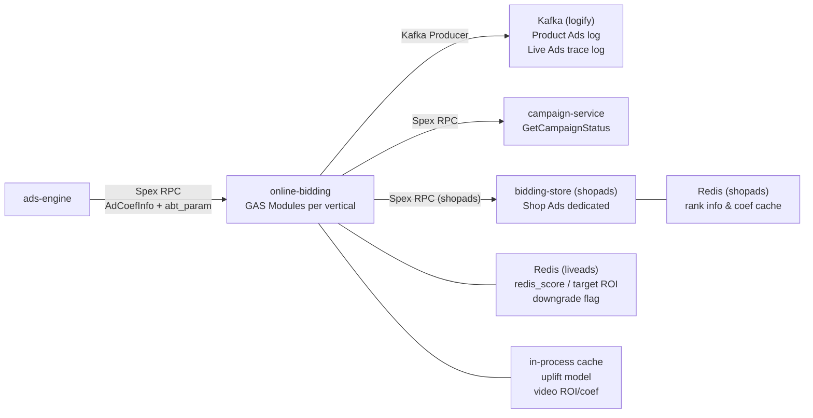

<!-- ads-workspace-gdoc-sync: gdoc_id=173OU6xEepu_-NDq1HfSjtGMpd4qTCxjku5r3N8v69d0 gdoc_url=https://docs.google.com/document/d/173OU6xEepu_-NDq1HfSjtGMpd4qTCxjku5r3N8v69d0/edit -->

# online-bidding

Online Bidding Service for Shopee Paid Ads — responsible for bid calculation, subsidy, and deduction logic at the Rerank (fine ranking) stage.

Git Repository: https://git.garena.com/shopee/deep/paidads-bidding/online-bidding

---

## Table of Contents

1. [Introduction](#introduction)
2. [Features](#features)
3. [Architecture](#architecture)
   - [System Context](#system-context)
   - [Service Topology](#service-topology)
   - [Multi-Vertical Module Architecture](#multi-vertical-module-architecture)
4. [Directory Structure](#directory-structure)
5. [Ad Verticals](#ad-verticals)
6. [Rule Engine](#rule-engine)
   - [Rule Dispatch (ReflectMap + PricingType)](#rule-dispatch-reflectmap--pricingtype)
   - [Rule Interface (RerankOperatorRule / BaseOperatorRule)](#rule-interface-rerankoperatorrule--baseoperatorrule)
   - [Parallel Execution (LoopOperatorRules + batchSizeParallel)](#parallel-execution-loopoperatorrules--batchsizeparallel)
   - [Pricing Types](#pricing-types)
   - [V2 Rule Configuration](#v2-rule-configuration)
7. [Product Ads Rerank Pipeline](#product-ads-rerank-pipeline)
8. [Key Data Structures](#key-data-structures)
9. [Development Guidelines](#development-guidelines)
10. [Configuration](#configuration)
11. [Deployment](#deployment)
12. [Monitoring](#monitoring)
13. [Business Terminology Glossary](#business-terminology-glossary)
14. [Additional Resources](#additional-resources)
15. [Frequently Asked Questions](#frequently-asked-questions)

---

## Introduction

**online-bidding** is the Shopee Paid Ads team's online bidding service, responsible for bid calculation, subsidy, and deduction logic at the fine ranking (Rerank) stage.

- **Framework**: Built on the [GAS (Go Application Server)](https://gas.shopee.io) framework with Go 1.24. The project has no `cmd/main.go`; each vertical registers its GAS module via `mod/<vertical>/module.go`'s `RegisterModule()`.
- **Spex RPC**: The upstream ads-engine invokes each vertical's Spex RPC methods. Requests carry pre-fetched bidding-store coefficients (`AdCoefInfo` / `AdsCoefList` / `multi_dim_coef`) and AB experiment parameters (`abt_param`).
- **9 Vertical Modules**: productads, shopads, shopads_v2, liveads, liveads_v2, videoads, videoads_v2, brandmax, brandmax_v2. Each vertical is an independent GAS Module compiled to its own binary.
- **Shared Internal Layer**: All verticals share packages under `internal/` — handler, rule, types, middleware, and monitoring.

---

## Features

- **Multi-Pricing-Type Bidding**: Supports ROI2, CPS, Simple ROI2, GMV Max, eCPC, Manual CPC, Auto Boost, Boost Ads, Simple Mode, and more `AdsPricingType` values — dispatched via `ReflectMap` keyed by pricing type.
- **Product Ads 10-Stage Rerank Pipeline**: `rerankModel` → `rerankPrepare` → `rerankPlatformVoucher` → `rerankVoucher` → `rerankBidding` → `rerankVoucherNew` → `rerankCalculatePadvv` → `rerankSubsidy` → `rerankDeduction` → `rerankFinalization`. The `rerankPlatformVoucher` stage (using `RerankPlatformVoucherRulesV2`) selects platform vouchers before `rerankVoucher`.
- **Voucher Selection & Subsidy**: Computes optimal voucher price, PCTR/PCR uplift ratios across multiple Rerank stages and writes the final voucher info into the response.
- **Coefficient Management**: Product Ads bidding-store coefficients are passed through from ads-engine in the request (`AdCoefInfo`). Shop Ads fetches coefficients directly from bidding-store via a dedicated Spex client.
- **Deduction Parameter Calculation**: Outputs `DeductionParam` fields (`AdditionalBoost`, `SecondPriceRatio`, `ReservePriceBeta/Tr`, `FirstPriceCapCoef`, etc.) for downstream deduction.
- **Observability**: Multi-level Prometheus monitoring covering rule-level, stage-level, and full-chain `BidRerankTrace` tracing.
- **Full-Chain Logging**: Asynchronous Kafka delivery of Product Ads trace logs (logify) and Live Ads trace logs. The `BidAlgoFullLink` field (serialized `fllPb.AdBidAlgoFullLinkExt`) is written to `AdsInfoResp.BidAlgoFullLink` for downstream full-link analysis.

---

## Architecture

### System Context

online-bidding plays the role of **API2 Bid Info** in the Shopee Paid Ads ADS SYS 2.0 architecture — computing final bids, subsidies, and deduction parameters at the fine ranking stage. The result is consumed by the upstream ads-engine for hybrid ranking and subsequent deduction (API3 Deduction).

```
User Request
  │
  ▼
ads-engine
  │  Spex RPC (with AdCoefInfo + abt_param)
  ▼
online-bidding (GAS Modules per vertical)
  │  Rule Engine (9-stage / vertical-specific pipeline)
  │
  ├──▶ Kafka (logify)        // Async trace log delivery
  ├──▶ campaign-service       // Query campaign status
  ├──▶ bidding-store (shopads) // Shop Ads coefficient fetch
  ├──▶ Redis (shopads/liveads) // Coefficient cache
  └──▶ in-process cache       // Uplift model / video ROI/coef cache
```

### Service Topology



**Topology Summary**

| Category | Name | Protocol / Type | Description |
|----------|------|-----------------|-------------|
| Upstream | ads-engine | Spex RPC | Upstream ad engine; calls each vertical's rerank/rank method with pre-fetched bidding-store coefficients and AB parameters |
| Downstream | Kafka (logify) | Kafka | Async Product Ads trace log delivery (`logify_producer`) and Live Ads trace logs (`TraceLogKafkaProducer`) |
| Downstream | campaign-service | Spex RPC | Queries campaign status (`GetCampaignStatus`) for bidding decisions |
| Dependency | bidding-store (shopads) | Spex RPC | Shop Ads fetches coefficients via `shopads_biddingstore` Spex client; Product Ads coefficients are passed through from ads-engine |
| Dependency | Redis (shopads) | Redis | Shop Ads rank info and coefficient cache |
| Dependency | Redis (liveads) | Redis | Live Ads redis_score, target ROI prefetch data, and downgrade flags |
| Dependency | in-process cache | In-process | GAS-registered local cache (uplift model, video ROI/coef), reducing external calls |

### Multi-Vertical Module Architecture

Each vertical is an independent GAS Module registered in `mod/<vertical>/module.go`'s `RegisterModule()`. All verticals share common logic under `internal/`, with per-vertical business logic in `internal/handler/stage/<vertical>/`. Newer verticals (e.g., Video Ads V2) implement the `common.Manager` interface (`ParseABConfig`, `BuildReqOption`, `BuildAdsData`, `RunRulePipeline`, `BuildResponse`) using `common.RunRulePipeline` + `UnifiedAdsData`; legacy verticals (Product Ads) use the older `AdDataInterface` path.

```
online-bidding/
├── mod/<vertical>/module.go        # GAS Module registration entry point
├── internal/
│   ├── handler/                    # Spex RPC handlers
│   │   ├── <vertical>.go           # Per-vertical handler entry
│   │   └── stage/
│   │       ├── common/             # Shared pipeline runner (LoopOperatorRules,
│   │       │                       #   LoopSingleOperatorRules, RunRulePipeline,
│   │       │                       #   Manager interface, RulePipelineSpec)
│   │       └── <vertical>/         # Per-vertical stage logic
│   ├── rule/<vertical>/            # Per-vertical rule implementations
│   ├── types/                      # Shared DTOs and interfaces
│   │   └── <vertical>/             # Vertical-specific DTOs (e.g., RerankAdData)
│   ├── monitoring/                 # Prometheus metrics
│   ├── config/                     # Configuration parsing
│   ├── middleware/                 # Kafka, server/client interceptors
│   └── cache/                      # In-process cache (uplift_model, video_coef)
├── proto/spex/sp_proto/<vertical>/ # Per-vertical Protobuf / Spex service definitions
├── etc/<vertical>.yml              # Per-vertical GAS config
└── deploy/<vertical>.json          # Per-vertical deployment descriptor
```

---

## Directory Structure

```
online-bidding/
├── mod/                    # GAS Module registrations (one subdirectory per vertical)
│   ├── productads/
│   ├── shopads/
│   ├── shopads_v2/
│   ├── liveads/
│   ├── liveads_v2/
│   ├── videoads/
│   ├── videoads_v2/
│   ├── brandmax/
│   └── brandmax_v2/
├── internal/
│   ├── handler/            # Spex RPC handlers (product_ads.go, shop_ads_v2.go, etc.)
│   │   ├── stage/          # Per-vertical pipeline stage logic
│   │   ├── biz_context/
│   │   └── helper/
│   ├── rule/               # Rule implementations (organized by vertical)
│   │   ├── productads/
│   │   ├── shopads/
│   │   ├── liveads/
│   │   ├── videoads/
│   │   └── brandmax/
│   ├── types/              # Shared DTOs and interfaces (ReqOption, SharedRawAd, ReflectMap, etc.)
│   │   ├── productads/
│   │   ├── shopads/
│   │   ├── liveads/
│   │   ├── videoads/
│   │   └── brandmax/
│   ├── monitoring/         # Prometheus metrics (metrics.go, exporter.go, biz_metrics.go)
│   ├── config/             # GAS + vertical-specific config loading
│   ├── middleware/         # Kafka, server/client interceptors, biz_context
│   ├── cache/              # In-process cache (uplift_model, video_coef, video_roi)
│   ├── client/             # External Spex clients (liveads_client.go)
│   ├── dao/                # Data access (shopads Redis DAO)
│   ├── dto/                # Data transfer objects
│   ├── campaign/           # Campaign status query
│   ├── ab_platform/        # AB experiment parameters (liveads)
│   └── util/               # Common utilities (currency, math, cold_start, roi2_util, roi3_util)
├── proto/spex/sp_proto/    # Per-vertical Protobuf / Spex service definitions
├── etc/                    # GAS config files (one YAML per vertical)
│   └── configs/liveads/    # Live Ads runtime configs (JSON)
├── deploy/                 # Deployment descriptors (one JSON per vertical)
├── Makefile
├── .spkit.yml
├── go.mod
└── go.sum
```

---

## Ad Verticals

online-bidding supports 9 ad vertical modules, each compiled independently and deployed as its own binary:

| Vertical | Module Path | Binary | Spex Service Name | Config File | Handler Entry | Main RPC Method |
|----------|-------------|--------|-------------------|-------------|---------------|-----------------|
| Product Ads | `mod/productads` | `bin/productads` | `productads.onlinebidding` | `etc/productads.yml` | `internal/handler/product_ads.go` | `Rerank` |
| Shop Ads | `mod/shopads` | `bin/shopads` | `shop_ads.shop_rerank` | `etc/shopads.yml` | `internal/handler/shop_ads_v2.go` | `ShopRerank` |
| Shop Ads V2 | `mod/shopads_v2` | `bin/shopads_v2` | `shop_ads.shop_rerank` | `etc/shopads_v2.yml` | `internal/handler/shop_ads_v2.go` | `ShopRerank` |
| Live Ads | `mod/liveads` | `bin/liveads` | `onlinebidding.rerank` / `prerank` | `etc/liveads.yml` | `internal/handler/live_ads.go` | `Rerank` / `Prerank` |
| Live Ads V2 | `mod/liveads_v2` | `bin/liveads_v2` | `live_ads.live_prerank` / `live_rerank` | `etc/liveads_v2.yml` | `internal/handler/live_ads_v2.go` | `LivePrerank` / `LiveRerank` |
| Video Ads | `mod/videoads` | `bin/videoads` | `onlinebidding.rank` | `etc/videoads.yml` | `internal/handler/video_ads.go` | `Rank` |
| Video Ads V2 | `mod/videoads_v2` | `bin/videoads_v2` | `video_ads.video_rerank` | `etc/videoads_v2.yml` | `internal/handler/video_ads_v2.go` | `VideoRerank` |
| Brand Max | `mod/brandmax` | `bin/brandmax` | `brand_max.brand_max_rerank` / `onlinebidding.rank` | `etc/brandmax.yml` | `internal/handler/stage/brandmax/brand_max.go` | `BrandMaxRerank` |
| Brand Max V2 | `mod/brandmax_v2` | `bin/brandmax_v2` | — | `etc/brandmax_v2.yml` | `internal/handler/brandmax_v2.go` | — |

**V1 vs V2 Differences**

- **V2 verticals** (shopads_v2, liveads_v2, videoads_v2) use the unified service definition from the `productads` proto and enable vtproto codec (`vtpbcodec.VtPbCodec{}`), offering better serialization performance.
- V1 verticals use their own independent proto service definitions, maintaining backward compatibility with older ads-engine callers.
- **Shop Ads** has a dedicated bidding-store Spex client and Redis dependency; other verticals receive coefficients passed through from ads-engine.
- **Video Ads V2** additionally adopts the unified `common.Manager` interface and `RunRulePipeline` / `UnifiedAdsData` pattern, with a declarative 3-stage pipeline (`rank_coef` → `rank_model` → `rank_bidding`, all serial) and the `OperatorRule` interface for rules operating on `UnifiedAdsData`.

---

## Rule Engine

### Rule Dispatch (ReflectMap + PricingType)

The core of the rule engine is `ReflectMap` (under `internal/rule/`):

```go
type ReflectMap struct {
    Map map[adspb.AdsPricingType][]BaseOperatorRule
}
```

At service startup, `ConvertRerankRulesConfig` builds a `ReflectMap` from `RerankRulesConfig` (containing `DefaultRules` + `SpecialRules`). For each `AdsPricingType`, the rule list is assembled as follows:

1. Rules from `SpecialRules` that match the pricing type (override default rules for that type)
2. `DefaultRules` (shared by all pricing types in `AllPricingType` not overridden by SpecialRules)

### Rule Interface (RerankOperatorRule / BaseOperatorRule)

```go
// Base interface all rules must implement
type BaseOperatorRule interface {
    String() string  // Rule name, used as monitoring label and trace key
}

// Product Ads rerank rule interface (internal/types/productads/rule_interfaces.go)
type RerankOperatorRule interface {
    BaseOperatorRule
    IsValid(ad *RerankAdData, opt *ReqOption) bool         // Whether the rule applies to this ad
    Process(ad *RerankAdData, opt *ReqOption) (trace interface{}, err *RuleError)  // Execute rule logic
}
```

`ReflectMap.CallValid` and `ReflectMap.CallProcess` invoke concrete implementations via type-assertion callbacks registered in `init()` by `CheckEachRuleType`.

### Unified OperatorRule Interface (for UnifiedAdsData)

A second, newer rule interface works directly with `UnifiedAdsData` and is used by Video Ads V2 (and future verticals migrating to the unified pipeline):

```go
// internal/types/base_operator_rule_interface.go
type OperatorRule interface {
    BaseOperatorRule
    IsValid(ad *UnifiedAdsData, opt *ReqOption) bool
    Process(ad *UnifiedAdsData, opt *ReqOption) (trace interface{}, err *RuleError)
}
```

Rules implementing `OperatorRule` are registered in `OperatorRulesType` (using `OperatorRule` slices) rather than `RulesType` (using `BaseOperatorRule` slices). The `ConvertOperatorRulesConfig()` function builds a `ReflectMap` from an `OperatorRulesType`.

### RulePipelineSpec and RunRulePipeline (Unified Pipeline Runner)

`RulePipelineSpec` (`internal/handler/stage/common/rule_pipeline_runner.go`) is a declarative pipeline descriptor for verticals using `UnifiedAdsData`:

```go
type RulePipelineSpec struct {
    Name   string
    Stages []OperatorStage          // ordered stages
    Hooks  RulePipelineHooks        // optional BeforeStage / AfterStage hooks
}
```

`RunRulePipeline()` iterates stages sequentially, dispatching each to `LoopOperatorRules` (Parallel) or `LoopSingleOperatorRules` (Single) based on `stage.Mode`. It validates the spec at startup (non-empty names, non-nil rule maps) and calls the Before/After hooks surrounding each stage. Video Ads V2 uses this via `RunVideoRankRulePipeline()`.

### Parallel Execution (LoopOperatorRules + batchSizeParallel)

`LoopOperatorRules` (`internal/handler/stage/common/operator_loop.go`) partitions the ad list into batches of `batchSizeParallel` (minimum `config.MinBatchSizeParallel`, default 16), executing each batch concurrently:

- Each batch gets its own `RuleMonitor` to avoid concurrent write issues. After all batches complete, `ruleMonitor.Merge()` consolidates monitoring data.
- A `sync.WaitGroup` coordinates batch completion; `recover()` inside each goroutine prevents a single batch failure from crashing the whole request.
- After all batches finish, `types.FlushCoefLookupForAds(ads)` aggregates per-ad coefficient lookup counts and reports them to Prometheus (`paidads_online_bidding_coef_lookup` / `coef_lookup_miss` in `coef_usage.go`).

`LoopSingleOperatorRules` is the serial variant, used for stages requiring sequential ordering (e.g., `rerankCalculatePadvv`, where PADVV calculation may depend on aggregate data across all ads in the batch).

### Pricing Types

| Pricing Type | Constant Name |
|-------------|---------------|
| ROI second-price | `ROI_TWO_PRICING` |
| Cost Per Sale | `COST_PER_SALE` |
| Simple ROI second-price | `SIMPLE_ROI_TWO_PRICING` |
| GMV Max (Simple) | `PRODUCT_SHOP_GMV_MAX_PRICING_SIMPLE` |
| GMV Max | `PRODUCT_SHOP_GMV_MAX_PRICING` |
| Multi-product Delivery | `PRODUCT_MULTI_PRODUCT_DELIVERY_PRICING` |
| Enhanced CPC | `ENHANCED_CPC` |
| Manual CPC | `MANUAL_MODE_CPC` |
| Non-Ads | `NON_ADS` |
| Default Pricing | `DEFAULT_PRICING` |
| Auto Boost | `AUTO_BOOST_PRICING` |
| Boost Ads | `BOOST_ADS_PRICING` |
| Simple Mode | `SIMPLE_MODE_PRICING` |
| Brand Max Bid | `CONSIDERATION_BRAND_ADS` |

### V2 Rule Configuration

Rule mappings are built at **compile time** from Go structs (`RerankRulesConfig` in `internal/rule/productads/rerank_rules_config.go`), not loaded from Config Center at runtime. Remote runtime configuration only controls service-level Spex config, performance parameters (`batch_size`, `sample_rate`), Kafka configuration, and cache TTLs.

---

## Product Ads Rerank Pipeline

The Product Ads rerank pipeline entry point is `DoRerank()` in `internal/handler/stage/productads/handle_rerank.go`, consisting of 10 sequential stages:

| Stage | Function | componentName (monitor label) | Rules Variable | Execution |
|-------|----------|-------------------------------|----------------|-----------|
| 1 | `rerankModel` | `rerank_model` | `RerankModelRulesV2` | Parallel |
| 2 | `rerankPrepare` | `rerank_prepare` | `RerankPrepareRules` | Parallel |
| 3 | `rerankPlatformVoucher` | `rerank_platform_voucher` | `RerankPlatformVoucherRulesV2` | Parallel |
| 4 | `rerankVoucher` | `rerank_coupon` | `RerankVoucherRulesV2` | Parallel |
| 5 | `rerankBidding` | `rerank_bidding` | `RerankBidRules` | Parallel |
| 6 | `rerankVoucherNew` | `rerank_coupon_new` | `RerankVoucherRulesNewV2` | Parallel |
| 7 | `rerankCalculatePadvv` | `rerank_calculate_padvv` | `RerankCalculatePadvvRules` | **Serial** |
| 8 | `rerankSubsidy` | `rerank_subsidy` | `RerankSubsidyRules` | Parallel |
| 9 | `rerankDeduction` | `rerank_deduction` | `RerankDeductionRules` | Parallel |
| 10 | `rerankFinalization` | `rerank_finalization` | `RerankFinalizationRules` | Parallel |

Representative rules per stage (Product Ads):

- **Model stage**: `RerankPgmv`, `RerankUniPgmv` (with promotion calibration `UsePromCali` and multi-window PCR fusion), `VideoPGmv` (GMV prediction)
- **Voucher stages**: `RerankVoucherRule` (voucher selection), `RerankVoucherRuleNewV2`, `VoucherBidBoostRule`, `VoucherDeboostRule`, `VoucherAdsAddDedRule`
- **Bidding stage**: `RerankCpcBid`, `GmvMaxUniformCpcBid`, `ColdStartBid` (with NPB Ads handling), `SimpleRoi2CpcBid`, `RerankEcpcBid`, `RerankManualBid`, `BrandMaxRankECPM`
- **Subsidy stage**: `RerankSubsidyFramework` orchestrates 4 subsidy strategies: `RuleBasedStrategy` (rule-driven RankBoost + DeductionDiscount based on `BizTagConfs`), `UnifiedStrategy` (unified coefficient, supports ItemTag/BizTag mask matching), `BudgetStrategy` (budget allocation based on `SubsidyColdStart` CoefType), `BudgetBidStrategy` (provides DeductionDiscount only, no RankBoost)
- **Deduction stage**: Populates `DeductionParam` (`SecondPriceRatio`, `ReservePriceBeta/Tr`, `FirstPriceCapCoef`, etc.)

**Request Handling Flow** (`internal/handler/product_ads.go`):

```
Rerank(ctx, req)
 ├── validateRerankReq()          // Validate country, non-empty ads
 ├── RerankBuildReqOption()       // Parse abt_param → ABTestConfig, build ReqOption
 ├── BuildAdsDataForRerank()      // Map protobuf AdInfoReq → RerankAdData (parallel batches)
 ├── DoRerank()                   // 10-stage rule pipeline
 └── buildAdsInfoResp()           // Build response (DeductionParam mapping, BidRerankTrace base64,
                                  //   PlatformVoucher fields, BidAlgoFullLink)
```

**Response Building** (`buildAdsInfoResp`):

- All `DeductionParam` fields are written to `AdsInfoResp.DeductionParam`
- `BidRerankTrace` is serialized and base64-encoded into `AdsInfoResp.BidRerankTrace`
- When `EnableDebug=true`, `BidRerankTrace` is additionally parsed into JSON in `DebugBidTraceJson`
- Platform voucher fields (`PlatformVoucherId`, `PlatformVoucherType`, `PlatformVoucherPrice`, `PlatformVoucherThreshold`, `PlatformVoucherDiscount`, `PlatformVoucherMaxReward`, `IsPlatformVoucherRct`) are written from `RerankAdData` to `AdsInfoResp`
- `BidAlgoFullLink` (`fllPb.AdBidAlgoFullLinkExt` proto-serialized bytes) is written to `AdsInfoResp.BidAlgoFullLink`
- Response building is parallelized with the same `batchSizeParallel` partition strategy

---

## Key Data Structures

### Protobuf API

Per-vertical Spex RPC service definitions reside in `proto/spex/sp_proto/<vertical>/`. Compiled outputs are under `internal/proto/spex/gen/go/` (excluded from review via `skip_dirs`).

Core Product Ads request message:

```protobuf
message RerankAdsRequest {
    repeated AdInfoReq ads = ...;          // Ads to bid on
    string country = ...;                  // Country code (SG/ID/MY/TH/VN/PH/TW/BR/...)
    string abt_param = ...;                // AB parameters JSON
    int32 entrance = ...;                  // Traffic entrance
    string entrance_group = ...;           // Entrance group (monitoring label)
    string request_id = ...;               // Request ID
    int64 user_id = ...;                   // User ID
    repeated int64 traffic_bucket_list = ...; // Traffic buckets
    repeated MultiDimCoef multi_dim_coef = ...; // Multi-dimension coefficients (Product Ads pass-through)
    bool enable_debug = ...;               // Debug mode
}
```

### Internal DTOs

**`ReqOption`** (`internal/types/req_option.go`) — per-request context object:

| Field | Type | Description |
|-------|------|-------------|
| `AbOption` | `*abtest_config.ABTestConfig` | Parsed AB experiment config |
| `RequestId` | `string` | Request ID |
| `Country` | `string` | Country code |
| `Entrance` | `int32` | Traffic entrance |
| `EntranceGroup` | `string` | Entrance group |
| `EntranceGroupIdx` | `int32` | Entrance group index |
| `UserID` | `int64` | User ID |
| `Requester` | `int32` | Caller identity |
| `FullCmd` | `string` | Full command string |
| `Cmd` | `string` | Short command string |
| `ApiType` | `int32` | API type |
| `WithinCampaignPeriod` | `bool` | Whether request is within campaign period |
| `LocalTime` | `time.Time` | Local time of request |
| `TrafficBucketList` | `[]int64` | Traffic bucket list |
| `UpliftModel` | `UpliftModel` | Uplift model (voucher PCTR/PCR before/after) |
| `OverChargeInfo` | `*OverChargeInfo` | Over-delivery info (PADVV distribution) |
| `UniCrFlag` | `bool` | Whether uranker was called successfully |
| `Roi3UpliftMixRankEnable` | `bool` | ROI3 uplift mix-rank enable flag |
| `multiDimCoefMap` | `map[BiddingStoreDataKey]*BiddingStoreDataVal` | Multi-dimension coefficients (Product Ads pass-through) |
| `EnableDebug` | `bool` | Whether to output debug info |
| `EnableBiddingStoreCpp` | `bool` | Whether to use C++ bidding-store path |
| `BizTagConfs` | `[]BizTagConf` | Subsidy biz-tag config list (contains CoefType, BizTag/ItemTag masks, used by subsidy framework strategies) |
| `BizTagParams` | `map[string]string` | Raw KV params for subsidy biz-tag configuration |
| `SubsidyItemTagMasksToSkipSet` | `map[int64]struct{}` | Set of ItemTag masks to skip in subsidy computation |
| `SubsidyPlanBucketIdsToSkipSet` | `map[int64]struct{}` | Set of PlanBucket IDs to skip in subsidy computation |
| `AvgpCTATC` / `AvgpGMV` | `float64` | BrandMax request-level averages |
| `AudienceTierCoeffMap` | `map[int32]float64` | BrandMax audience tier coefficients |
| `CampaignInfo` | `*kwPb.CampaignInfo` | Shop/Live Ads campaign info |
| `LiveABConfig` | `*liveadsConfig.ABConfig` | Live Ads AB config |
| `LiveFilterOption` | `*LiveAdsFilterOption` | Live Ads filter options (pricing type sets for Redis/ECR query) |
| `UserVoucherInfo` | `*productads_onlinebidding.UserVoucherInfo` | User voucher impression/click history |
| `Logger` | `*ulog.Logger` | Per-request logger |
| `RuleMonitor` | `*RuleMonitor` | Per-request rule monitor |
| `Traffic` | `interface{}` | Generic traffic context |

**`RerankAdData`** (`internal/types/productads/rerank_dto.go`) — single-ad data carrier across the Product Ads pipeline, populated in layers:

- **Raw (SharedRawAd)**: Parsed from request (AdID, ItemID, ShopID, PricingType, Placement, CatIDs, PCTR, biddingStoreData, etc.)
- **Model stage**: Fills `Pgmv`, `ModelPgmv`, `ModelBroadPcr`
- **Platform Voucher stage**: Fills `PlatformVoucherId`, `PlatformVoucherType`, `PlatformVoucherPrice`, `PlatformVoucherThreshold`, `PlatformVoucherDiscount`, `PlatformVoucherMaxReward`, `IsPlatformVoucherRct`
- **Voucher stages**: Fills `BestVoucherID`, `VoucherPctrUpliftRatio`, `VoucherPcrUpliftRatio`
- **Bidding stage**: Fills `CpcBid`, `TargetCir`, `BiddingData`, `BidArr`
- **Deduction stage**: Fills `DeductionParam`

**`UnifiedAdsData`** (`internal/types/unified_ads_data.go`) — unified ad data carrier for verticals using the new `OperatorRule`-based pipeline (currently Video Ads V2). Embeds `SharedAdData` and `RerankRawAd`, and aggregates all bidding fields (model predictions, bid arrays, deduction params, voucher state, live/shop/video-specific fields, etc.) in a single struct. Implements the `AdDataInterface` and is used by `LoopOperatorRules` / `RunRulePipeline` in `internal/handler/stage/common/`.

### Bidding Store Coefficients

```go
type BiddingStoreDataKey struct {
    CoefType coefconstant.CoefType          // Coefficient type (e.g. ROI2 coef, Pacing coef)
    IDType   coefconstant.CoefCacheKeyIdType // ID type (ads_id / shop_id / item_id, etc.)
}

type BiddingStoreDataVal struct {
    Coef                   float64              // Base coefficient
    EntranceCoef           float64              // Entrance coefficient
    Extra                  coef_cache.CoefExtra // Extended fields (Pacing params, etc.)
    EntranceExtra          coef_cache.CoefExtra
    LastUpdateTime         uint32               // Algorithm-side last update timestamp (for freshness monitoring)
    BiddingStoreUpdateTime uint32               // bidding-store-side update timestamp
    TrafficBucketId        uint32               // Traffic bucket ID
    StrategyId             uint32               // Strategy ID
}
```

**Two acquisition modes**:
- **Product Ads**: Coefficients are passed through from ads-engine in the request (`AdCoefInfo` → `AdsCoefList` → `multi_dim_coef`); online-bidding reads directly from `reqOpt.multiDimCoefMap`, no extra RPC needed
- **Shop Ads**: Queries bidding-store via a dedicated `shopads_biddingstore` Spex client; results are cached in Redis to reduce latency

### DeductionParam Fields

| Field | Description |
|-------|-------------|
| `AdditionalBoost` | Additional boost multiplier applied by the ads side to raise the deduction price |
| `AdditionalDeboost` | Additional deboost multiplier to lower the deduction price |
| `AdditionalDeductionPrice` | Direct additive surcharge to the deduction price (absolute value) |
| `SecondPriceRatio` | Second-price auction ratio |
| `DeductionPriceMinCap` | Minimum deduction price cap |
| `DeductionPriceMaxCap` | Maximum deduction price cap |
| `ReservePriceBeta` | Reserve price beta coefficient |
| `ReservePriceTr` | Reserve price target ROI coefficient |
| `FirstPriceCapCoef` | First-price deduction cap coefficient |
| `PctrDeduction` | PCTR calibration coefficient for oCPM deduction |
| `SellerBidRatio` | Seller bid ratio (int32, percentage) |
| `TrafficBidRatio` | Traffic bid ratio (int32, percentage) |
| `DiscountDeductionPrice` | Discount deduction price (float32), used in Shop Ads discount mode |

### BidRerankTrace

`BidRerankTrace` (from `git.garena.com/shopee/deep/paidads-bidding/common/types/bidding_info`) flows through the entire rerank pipeline, recording intermediate bid data at each rule. In `buildAdsInfoResp` it is serialized into `AdsInfoResp.BidRerankTrace` (base64-encoded proto bytes) for downstream deduction and offline analysis.

---

## Development Guidelines

### Code Style

- **Go Version**: Go 1.24 (toolchain go1.24.5)
- **Import Order**: Use `gci` — `standard → default → git.garena.com → git.garena.com/shopee/deep/ads-engine`
- **Formatting**: `make format` (equivalent to `gci write` + `go fmt ./...`)
- **Linting**: `make lint` (equivalent to `spkit lint`, configured in `.golangci.yml`)

### How to Add New Rules

1. Create a rule file under `internal/rule/<vertical>/`, implementing the `RerankOperatorRule` interface:
   - `String() string`: Return the rule name (used as monitoring label and trace key)
   - `IsValid(ad, opt) bool`: Determine if the rule applies to the current ad
   - `Process(ad, opt) (trace, err)`: Execute rule logic, return trace object and optional error
2. In `internal/rule/<vertical>/rerank_rules_config.go`'s `RerankRulesConfig`, register the rule in the appropriate stage's `DefaultRules` or `SpecialRules`:
   - `DefaultRules`: Applies to all pricing types in `AllPricingType`
   - `SpecialRules`: Applies only to specific `PricingTypes`, overriding `DefaultRules` for those types

### How to Add New Verticals

1. Create a GAS Module in `mod/<vertical>/module.go`, implementing `RegisterModule()`
2. Define proto service and message types under `proto/spex/sp_proto/<vertical>/`
3. Implement the Spex RPC handler in `internal/handler/<vertical>.go`, registered with GAS
4. Implement stage logic in `internal/handler/stage/<vertical>/`
5. Implement vertical-specific rules in `internal/rule/<vertical>/`
6. Create `etc/<vertical>.yml` (GAS config) and `deploy/<vertical>.json` (deployment descriptor)

### Project Structure

Follows GAS framework conventions: no `cmd/main.go`. Each vertical registers via `mod/<vertical>/module.go`'s `RegisterModule()`. At startup, GAS initializes all components (Spex server/client, Kafka producer, cache, etc.) via dependency injection (IoC).

### Naming Conventions

- **Rules**: `Rerank<Feature>Rule`, e.g. `RerankCpcBid`, `RerankVoucherRule`
- **Stages**: `rerank_<stage>` (lowercase underscore), matching the monitoring `componentName`
- **DTO fields**: CamelCase; when corresponding to proto fields, use the same semantic naming
- **Commit messages**: `(Feat|Fix|Docs|Style|Refactor|Test|Chore): [JIRA-ID] description`
- **Branch naming**: `dev/$username` or `feature/$feature_name`

### Error Handling

- Rule `Process()` returns `*RuleError` containing `ErrType` (monitoring label) and `Err` (optional error detail)
- Panics are caught by `recover()` and recorded to Prometheus (`monitoring.RecordAdsInputSummary("all", "all", "all", "all", "panic", 1)`)
- External call errors (Spex/Redis) are reported via `monitoring.ExportError()` without blocking the main request flow

### Unit Testing Standards

The repository has few test files (`handle_rerank_test.go`, `general_exporter_test.go`), primarily covering:
- Product Ads Rerank pipeline (`handle_rerank_test.go`)
- Monitoring exporter (`general_exporter_test.go`)

Run tests: `make test` (equivalent to `spkit test`)

### Code Review & Git Workflow

- All code changes go through Merge Requests and require at least 1 reviewer approval
- Merge strategy: Squash commits, delete source branch after merge
- Algorithm code must be fully launched in at least one region before merging

---

## Configuration

### Vertical YAML Configs

Each vertical has an independent GAS config file under `etc/`:

| File | Vertical |
|------|----------|
| `productads.yml` | Product Ads |
| `shopads.yml` | Shop Ads |
| `shopads_v2.yml` | Shop Ads V2 |
| `liveads.yml` | Live Ads |
| `liveads_v2.yml` | Live Ads V2 |
| `videoads.yml` | Video Ads |
| `videoads_v2.yml` | Video Ads V2 |
| `brandmax.yml` | Brand Max |
| `brandmax_v2.yml` | Brand Max V2 |

Core config structure (using `productads.yml` as example):

```yaml
gas.config:
    spex:
      service_name: productads.onlinebidding       # Spex service name
      non_live_config_key: <key>                   # Non-live config key
      sdu_id: default
      tag: master
      rule: # add your own key                     # PFB routing rule (personal branch)

gas.spex.server:
  service_name: productads.onlinebidding
  monitoring:
    enable_qps_metric: true
    enable_latency_metric: true
```

### GAS Module Config

GAS runtime configuration is distributed via Spex Config Key (`non_live_config_key`), including:
- `performance`: `batch_size` (parallel batch size), `sample_rate` (monitoring sample rate), `skip_monitor`
- Kafka producer configuration (broker, topic)
- Cache TTL configuration (uplift model, video coef)

### Live Ads Runtime Configs

JSON files under `etc/configs/liveads/` provide Live Ads-specific runtime configuration:
- Redis score configuration
- Downgrade flags
- AB parameter overrides

### AB Testing Parameters (abt_param → ABTestConfig)

AB parameters are passed via the request `abt_param` field (JSON string). In `RerankBuildReqOption()`, this is parsed into `ABTestConfig` (from `git.garena.com/shopee/deep/adsengine-abtest-param/abtest_config`), stored in `ReqOption.AbOption`. Parameters are pre-fetched by ads-engine from the AB platform and passed through, with second-level update latency.

### Deployment JSON (deploy/*.json)

`deploy/<vertical>.json` defines build and runtime parameters for each vertical:

```json
{
  "project_name": "productads",
  "module_name": "onlinebidding",
  "build": {
    "commands": ["spkit build"],
    "docker_image": {
      "base_image": "harbor.shopeemobile.com/shopee/golang-base:1.24.5-24"
    }
  },
  "run": {
    "enable_prometheus": true,
    "command": "./bin/productads",
    "smoke": { "endpoint": "/smoke_test" },
    "check": { "endpoint": "/health_check" }
  }
}
```

### SPEX and spcli Setup

Install spcli (for proto compilation and local development):

```shell
/bin/bash -c "$(curl -fsSL https://spex.shopee.io/release/spcli/latest/install.sh)"
spcli version
```

Install inp-client (local Spex socket proxy):

```shell
curl -O "http://proxy.uss.s3.sz.shopee.io/api/v4/50054564/spex-s3ia-sg-live/intranet_penetrator/inp-client/latest/inp-client_darwin_amd64"
chmod +x inp-client_darwin_amd64
mv inp-client_darwin_amd64 /usr/local/bin/inp-client
```

Configure Git (for internal Go module access):

```shell
git config user.name "<your_email_prefix>"
git config user.email "<your_email_prefix>@shopee.com"
```

---

## Deployment

### Build for Production

Each vertical compiles to an independent binary, output to `bin/`:

```shell
# Install spkit
curl https://spkit.shopee.io/spkit/stable/spkit-$(uname -s | tr '[:upper:]' '[:lower:]') \
  -o /usr/local/bin/spkit && chmod +x /usr/local/bin/spkit

# Generate code (proto compilation + GAS code generation)
make gen

# Build all verticals
make build
# Or directly
spkit build .
```

`make gen` runs two steps:
1. `spkit gen go`: Generates GAS-related code (`.gas.*` files)
2. `spkit gen gas-spex`: Generates Spex service registration code

The `.spkit.yml` pre-build hook also runs:
- `apt install protobuf-compiler`
- `make install-gen-vtproto` (installs vtproto code generation tool)
- `make gen-vtproto` (generates vtprotobuf serialization code)

### Per-Vertical Deployment

Each vertical's binary and config are deployed independently. Startup command (Product Ads example):

```shell
./bin/productads  # Config auto-loaded from etc/productads.yml
```

### Release Process

Releases are managed through the Spex platform:

1. Create a release ticket in Space/CMDB, select the target vertical's SDU
2. Canary strategy: Deploy to a single instance first (`sdu_id: default`), monitor metrics, then gradually expand
3. Use PFB (Personal Feature Branch) for local integration testing:
   ```shell
   export SP_UNIX_SOCKET=/tmp/spex.sock
   export PFB_NAME=my-feature-branch
   make gen && make build && bin/productads
   ```
4. Full release requires verification in at least one region before submitting a Merge Request to merge code

---

## Monitoring

### RuleMonitor Mechanism

`RuleMonitor` (under `internal/types/`) handles metrics collection at stage and rule level:

- **`RecordStageMetrics(componentName, latencies)`**: Records latency for each stage, e.g. `RERANK_OVERALL`, `rerank_model`, `rerank_bidding`
- **`WithParallel(component, ruleName)`**: Creates an isolated monitoring context for each rule in a parallel batch
- **`Merge(other)`**: Merges batch monitoring data into the main `RuleMonitor` after batch completion
- **`FlushAllData(country, clientSDU, entrance)`**: Reports all stage data to Prometheus via `ExportLatency`

### Metrics

**`internal/monitoring/metrics.go`** (general rule monitoring):

| Metric Name | Type | Description |
|------------|------|-------------|
| `rule_user_data` | Summary | Rule-level business data (country/pricing_type/data_name) |
| `rule_user_data_flex` | Summary | Rule-level flexible business data (3 custom dimensions) |
| `rule_hit_total` | Counter | Rule hit count (invalid/processed/error) |
| `ads_total` | Counter | Total ad count (entrance/country/placement/pricing_type) |
| `ads_input` | Summary | Input ad data stats (ItemPrice, PCTR, TargetROI, etc.) |
| `ads_output` | Summary | Output ad data stats (CpcBid, DeductionParam fields, etc.) |

**`internal/monitoring/exporter.go`** (latency and error monitoring):

| Metric Name | Type | Labels |
|------------|------|--------|
| `latency_seconds` | Summary | country / client_sdu / component / type |
| `error` | Counter | country / component / type |
| `searchads_rerank_count` | Counter | country / component / type |
| `searchads_rerank_gauge` | Gauge | country / component / type |

**`internal/monitoring/biz_metrics.go`** (Shop Ads specific):

| Metric Name | Description |
|------------|-------------|
| `shopads_onlinebidding_err_count` | Error count |
| `shopads_onlinebidding_process_latency` | Processing latency histogram |
| `shopads_onlinebidding_bid_diff_bucket` | Bid difference distribution |
| `shopads_onlinebidding_coef_bucket` | Coefficient value distribution |
| `shopads_onlinebidding_coef_age_bucket` | Coefficient freshness (seconds) histogram |

**`internal/monitoring/product_ads/general_exporter.go`** (Product Ads specific):

namespace=`bidding`, subsystem=`product_ads`; includes latency, error, count, summary, histogram, gauge, input, output, and coef_age metrics.

**`internal/monitoring/coef_usage.go`** (coefficient usage monitoring):

| Metric | Type | Labels | Description |
|--------|------|--------|-------------|
| `paidads_online_bidding_coef_received` | Counter | country / pricing_type / coef_type / id_type | Number of coefficient entries received per ad |
| `paidads_online_bidding_coef_lookup` | Counter | country / pricing_type / coef_type / id_type | Number of coefficient lookups during rule execution |
| `paidads_online_bidding_coef_lookup_miss` | Counter | country / pricing_type / coef_type / id_type | Number of coefficient lookup misses (coef absent from biddingStoreData) |

Lookup counts are recorded per-ad by `SharedRawAd.RecordCoefLookup` / `RecordCoefLookupMiss`, then aggregated and exported to Prometheus by `FlushCoefLookupForAds` at the end of each `LoopOperatorRules` stage, avoiding per-ad Prometheus writes.

---

## Business Terminology Glossary

| Term | Full Name / Description |
|------|------------------------|
| eCPM | Effective Cost Per Mille — total ad spend / total impressions |
| PGMV | Predicted GMV (pGMV); PADVV = Predicted Advertiser Value |
| ROI | Return on Investment — Ads GMV / Ads Spend |
| ROI2 | Second-price auction ROI mode |
| ROI3 | Extended bidding mode with platform ROI control (includes PADVV, platform budget regulation) |
| CPC | Cost Per Click — pay-per-click billing |
| CPS | Cost Per Sale (`COST_PER_SALE`) |
| PCTR | Predicted Click-Through Rate |
| PCR | Predicted Conversion Rate |
| GMV Max | GMV maximization bidding strategy (`PRODUCT_SHOP_GMV_MAX_PRICING`) |
| eCPC | Enhanced CPC (`ENHANCED_CPC`) |
| OCPM | Optimized CPM — optimized thousand-impression bidding |
| GAS | Go Application Server — Shopee's internal Go service framework |
| Spex | Shopee's internal RPC framework (similar to gRPC) |
| spcli | Spex CLI tool for proto compilation, code generation, and local debugging |
| ReflectMap | Core mapping structure dispatching rule chains by AdsPricingType |
| OperatorRule | A single rule in the rule engine, implementing `RerankOperatorRule` |
| RerankOperatorRule | Product Ads rerank rule interface (IsValid + Process) |
| PricingType | Ad pricing type determining which rule chain is selected |
| ReqOption | Per-request global context, containing ABTestConfig, Country, TrafficBucketList, etc. |
| RerankAdData | Single-ad data carrier through the rerank pipeline |
| SharedRawAd | Raw ad fields parsed from the request (AdID, ItemID, PCTR, biddingStoreData, etc.) |
| BiddingStoreDataKey | Coefficient index (CoefType + IDType) |
| BiddingStoreDataVal | Coefficient value (Coef, EntranceCoef, Extra, LastUpdateTime, etc.) |
| DeductionParam | Deduction parameter set output from fine ranking, passed to downstream deduction stage |
| BidRerankTrace | Bid tracing object flowing through the rerank pipeline, used for debugging and offline analysis |
| ABTestConfig | AB experiment config parsed from `abt_param` |
| PADVV | Predicted Advertiser Value |
| Boost Ads | Auto-acceleration ad type (`AUTO_BOOST_PRICING` / `BOOST_ADS_PRICING`) |
| PFB | Personal Feature Branch — Spex personal branch routing for local integration testing |
| Ads GMV | Total GMV attributed to ads, typically counted within 7 days after an ad click |
| Take-Rate | Ads Revenue / Platform GMV — measures monetization efficiency |
| Cold Start | New ads with insufficient historical data, resulting in lower prediction accuracy |

---

## Additional Resources

- **Git Repository**: [https://git.garena.com/shopee/deep/paidads-bidding/online-bidding](https://git.garena.com/shopee/deep/paidads-bidding/online-bidding)
- **Ads Business Architecture & System Design (SRA)**: [https://sra.shopee.io/05.Business_Systems/5.3_Ads_Business_and_Architecture_Introduction/5.3.2._ads_engine.html#242-online-bidding](https://sra.shopee.io/05.Business_Systems/5.3_Ads_Business_and_Architecture_Introduction/5.3.2._ads_engine.html#242-online-bidding)
- **SPEX Go SDK Quick Start**: [https://spex.shopee.io/overview/quick-start/languages/go/index.html](https://spex.shopee.io/overview/quick-start/languages/go/index.html)
- **spcli Installation & Local Development**: [https://spex.shopee.io/user-guide/SDK/Java/local.html](https://spex.shopee.io/user-guide/SDK/Java/local.html)
- **Paid Ads Business Glossary (Confluence)**: [https://confluence.shopee.io/pages/viewpage.action?spaceKey=SPAD&title=Paid+Ads+Glossary](https://confluence.shopee.io/pages/viewpage.action?spaceKey=SPAD&title=Paid+Ads+Glossary)
- **New Ads Bidding Overall Design**: [https://docs.google.com/document/d/1fisarr7ZPSs330cN15kFpxv4Quvfm9o07DfrvbAxyS4/edit](https://docs.google.com/document/d/1fisarr7ZPSs330cN15kFpxv4Quvfm9o07DfrvbAxyS4/edit)
- **New Bidding Infra - API Design**: [https://docs.google.com/document/d/1eJRyAoDn1Z7NZYrtylBOKCvckWIJOj-G4twcle_v6yk/edit](https://docs.google.com/document/d/1eJRyAoDn1Z7NZYrtylBOKCvckWIJOj-G4twcle_v6yk/edit)
- **GAS Framework**: [https://gas.shopee.io](https://gas.shopee.io)
- **PFB (Personal Feature Branch) User Guide**: [https://sites.google.com/shopee.com/pfb-v2/user-guide](https://sites.google.com/shopee.com/pfb-v2/user-guide)
- **AB Parameter Repository**: [https://git.garena.com/shopee/deep/adsengine-abtest-param](https://git.garena.com/shopee/deep/adsengine-abtest-param)

---

## Frequently Asked Questions

**Q1. How do I add a new bidding rule?**

Implement the `RerankOperatorRule` interface (`String()`, `IsValid()`, `Process()`) under `internal/rule/<vertical>/`, then register it in the appropriate stage's `DefaultRules` or `SpecialRules` in `rerank_rules_config.go`. The rule name (returned by `String()`) becomes the monitoring label and trace key.

**Q2. How do I configure different rules for a specific PricingType?**

Add a `SpecialRuleType` to the `SpecialRules` of the relevant rule set (e.g. `RerankBidRules`) in `RerankRulesConfig`, specifying the target `PricingTypes` and their `Rules`. Pricing types matched by `SpecialRules` use only that special rule list; `DefaultRules` are not applied for those types.

**Q3. What distinguishes the 9 ad verticals?**

- **productads**: Main e-commerce ads with the richest pricing type support (ROI2, CPS, GMV Max, etc.) and a full 9-stage rerank pipeline
- **shopads / shopads_v2**: Shop ads with a dedicated bidding-store Spex client and Redis dependency
- **liveads / liveads_v2**: Live streaming ads with both Prerank and Rerank interfaces, dependent on Live Ads-specific Redis
- **videoads / videoads_v2**: Video ads with Spex method named `Rank`
- **brandmax / brandmax_v2**: Brand ads computing a `TargetEcpmResult` list

**Q4. What is the difference between V1 and V2 verticals?**

V2 verticals (shopads_v2, liveads_v2, videoads_v2) use the unified service definition from the `productads` proto and enable vtproto codec (`vtpbcodec.VtPbCodec{}`) for better serialization performance. V1 verticals use their own independent proto definitions for backward compatibility with older ads-engine callers.

**Q5. How do I run and debug locally?**

```shell
# 1. Start Spex socket proxy (in a separate terminal)
socat -d -d -d UNIX-LISTEN:/tmp/spex.sock,reuseaddr,fork TCP:agent-tcp.spex.test.shopee.io:9299

# 2. Build and start the service (productads example)
export SP_UNIX_SOCKET=/tmp/spex.sock
export PFB_NAME=my-feature-branch
make gen && make build && bin/productads

# 3. Send a test request
curl --location 'https://http-gateway.spex.test.shopee.sg/sprpc/productads.onlinebidding.rerank' \
  --header 'shopee-baggage: PFB=my-feature-branch' \
  --header 'content-type: application/json' \
  --data '{"country": "SG", "ads": [...]}'
```

**Q6. Where do bidding-store coefficients come from for Product Ads vs. Shop Ads?**

- **Product Ads**: Coefficients are passed through from ads-engine in the request (`AdInfoReq.AdCoefInfos` and `RerankAdsRequest.MultiDimCoef`); online-bidding reads them directly without any extra RPC call
- **Shop Ads**: Queries bidding-store via a dedicated `shopads_biddingstore` Spex client; results are cached in Redis to reduce latency

**Q7. What do the DeductionParam fields mean?**

`DeductionParam` is the set of parameters output from the rerank stage to the downstream deduction stage. Key fields: `AdditionalBoost`/`AdditionalDeboost` control overall price boost/deboost; `SecondPriceRatio` controls second-price auction ratio; `ReservePriceBeta/Tr` compute the floor price; `FirstPriceCapCoef` caps first-price deduction; `PctrDeduction` is the PCTR calibration coefficient for oCPM mode. See [Key Data Structures](#key-data-structures) for full details.

**Q8. How does LoopOperatorRules parallel execution work?**

`LoopOperatorRules` partitions the ad list into batches of `batchSizeParallel` (minimum 16, controlled by config). Each batch runs in an independent goroutine with its own `RuleMonitor` to avoid concurrent write issues. After all batches complete, `ruleMonitor.Merge()` consolidates their monitoring data. Within a batch, rules execute sequentially per ad; batches execute concurrently.

**Q9. How do I add a new ad vertical?**

Adding a new vertical requires: ① Create GAS Module in `mod/<vertical>/module.go`; ② Define proto under `proto/spex/sp_proto/<vertical>/`; ③ Implement Spex handler in `internal/handler/<vertical>.go`; ④ Implement stage logic in `internal/handler/stage/<vertical>/`; ⑤ Implement rules in `internal/rule/<vertical>/`; ⑥ Create `etc/<vertical>.yml` and `deploy/<vertical>.json`.

**Q10. Why does rerankCalculatePadvv use serial execution (LoopSingle)?**

`rerankCalculatePadvv` uses `LoopSingleOperatorRules` (serial) rather than `LoopOperatorRules` (parallel) because PADVV calculation needs to observe aggregate data across all ads in the same batch (e.g., computing the batch-average PADVV for ranking regulation). Parallel execution would result in each ad reading an incomplete batch state, causing race conditions and non-deterministic results.

<!-- Generated by ads-workspace/skills/ads-readme-generate | checked: b084ccf96905d9bb2aaf205dadb6a7845a37289e | spec: 76fce5f679f9550b -->
