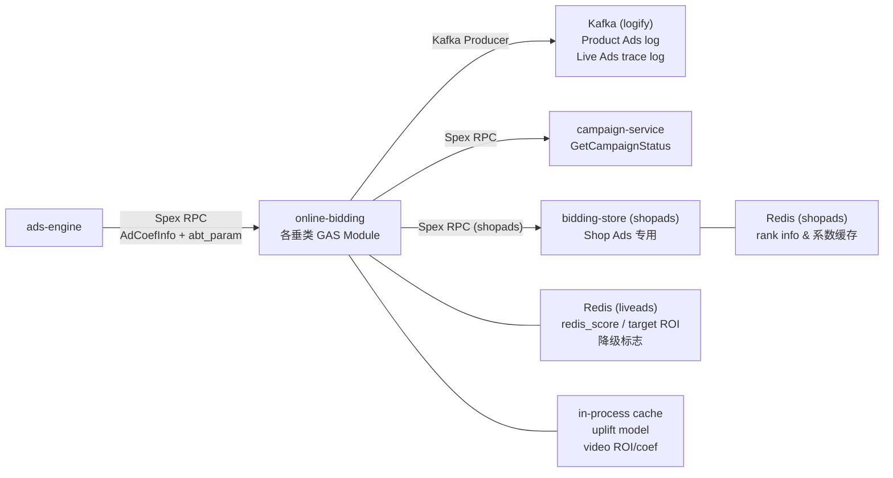

<!-- ads-workspace-gdoc-sync: gdoc_id=1Aun1Zq3_HsHNPR7hlehGyQM0aNWJ_hXASGVe7c85bgc gdoc_url=https://docs.google.com/document/d/1Aun1Zq3_HsHNPR7hlehGyQM0aNWJ_hXASGVe7c85bgc/edit -->

# online-bidding

广告在线竞价服务（Online Bidding Service），负责精排（Rerank）阶段的出价、补贴、扣费逻辑。

Git 仓库：https://git.garena.com/shopee/deep/paidads-bidding/online-bidding

---

## 目录 / Table of Contents

1. [项目概述 / Introduction](#项目概述--introduction)
2. [核心功能 / Features](#核心功能--features)
3. [项目架构 / Architecture](#项目架构--architecture)
   - [系统上下文 / System Context](#系统上下文--system-context)
   - [上下游调用拓扑 / Service Topology](#上下游调用拓扑--service-topology)
   - [多垂类模块架构 / Multi-Vertical Module Architecture](#多垂类模块架构--multi-vertical-module-architecture)
4. [目录结构 / Directory Structure](#目录结构--directory-structure)
5. [广告垂类 / Ad Verticals](#广告垂类--ad-verticals)
6. [规则引擎 / Rule Engine](#规则引擎--rule-engine)
   - [规则分发机制 / Rule Dispatch](#规则分发机制--rule-dispatch)
   - [规则接口 / Rule Interface](#规则接口--rule-interface)
   - [并行执行 / Parallel Execution](#并行执行--parallel-execution)
   - [定价类型 / Pricing Types](#定价类型--pricing-types)
   - [V2 规则配置 / V2 Rule Configuration](#v2-规则配置--v2-rule-configuration)
7. [Product Ads Rerank 流程 / Product Ads Rerank Pipeline](#product-ads-rerank-流程--product-ads-rerank-pipeline)
8. [关键数据结构 / Key Data Structures](#关键数据结构--key-data-structures)
9. [开发规范 / Development Guidelines](#开发规范--development-guidelines)
10. [配置说明 / Configuration](#配置说明--configuration)
11. [部署 / Deployment](#部署--deployment)
12. [监控 / Monitoring](#监控--monitoring)
13. [业务术语表 / Business Terminology Glossary](#业务术语表--business-terminology-glossary)
14. [参考资料 / Additional Resources](#参考资料--additional-resources)
15. [常见问题 / Frequently Asked Questions](#常见问题--frequently-asked-questions)

---

## 项目概述 / Introduction

**online-bidding** 是 Shopee Paid Ads 团队的广告在线竞价服务，负责精排（Rerank）阶段的出价、补贴和扣费逻辑处理。

- **框架**：基于 [GAS（Go Application Server）](https://gas.shopee.io) 框架，Go 1.24 实现。项目无 `cmd/main.go`，通过各垂类 `mod/<vertical>/module.go` 中的 `RegisterModule()` 注册 GAS 模块。
- **Spex RPC**：上游 ads-engine 通过 Spex RPC 调用各垂类服务，请求中携带预获取的 bidding-store 系数（`AdCoefInfo` / `AdsCoefList` / `multi_dim_coef`）和 AB 实验参数（`abt_param`）。
- **9 个垂类模块**：productads、shopads、shopads_v2、liveads、liveads_v2、videoads、videoads_v2、brandmax、brandmax_v2，每个垂类是独立的 GAS Module，编译为独立的二进制文件。
- **内部共享层**：各垂类共享 `internal/` 下的 handler、rule、types、middleware、monitoring 等包。

---

## 核心功能 / Features

- **多定价类型竞价**：支持 ROI2、CPS、Simple ROI2、GMV Max、eCPC、Manual CPC、Auto Boost、Boost Ads、Simple Mode 等多种 `AdsPricingType`，通过 `ReflectMap` 按定价类型分发规则链。
- **Product Ads 精排 10 阶段流水线**：`rerankModel` → `rerankPrepare` → `rerankPlatformVoucher` → `rerankVoucher` → `rerankBidding` → `rerankVoucherNew` → `rerankCalculatePadvv` → `rerankSubsidy` → `rerankDeduction` → `rerankFinalization`。新增的 `rerankPlatformVoucher` 阶段（使用 `RerankPlatformVoucherRulesV2`）在 `rerankVoucher` 之前完成平台券选券。
- **优惠券选券与补贴**：跨多个 Rerank 阶段计算最优券价格、PCTR/PCR uplift ratio，并将最终券信息写入响应。
- **出价系数管理**：Product Ads 的 bidding-store 系数由 ads-engine 在请求中透传（`AdCoefInfo`），Shop Ads 通过独立 Spex 客户端直接访问 bidding-store。
- **扣费参数计算**：通过 `DeductionParam` 结构体输出 `AdditionalBoost`、`SecondPriceRatio`、`ReservePriceBeta/Tr`、`FirstPriceCapCoef` 等字段，供下游扣费使用。
- **可观测性**：基于 Prometheus 的多层次监控，包含规则级别、阶段级别和全链路 `BidRerankTrace` 追踪。
- **全链路日志**：通过 Kafka（logify）异步投递 Product Ads trace log 和 Live Ads trace log。`BidAlgoFullLink` 字段（序列化的 `fllPb.AdBidAlgoFullLinkExt` proto 字节）写入 `AdsInfoResp.BidAlgoFullLink`，供下游全链路分析使用。

---

## 项目架构 / Architecture

### 系统上下文 / System Context

online-bidding 在 Shopee Paid Ads 系统的 ADS SYS 2.0 架构中承担 **API2 Bid Info** 的角色——在精排（fine ranking）阶段计算最终出价、补贴和扣费参数，结果由上游 ads-engine 用于混排（hybrid ranking）和后续扣费（API3 Deduction）。

```
用户请求
  │
  ▼
ads-engine（广告引擎）
  │  Spex RPC（携带 AdCoefInfo + abt_param）
  ▼
online-bidding（各垂类 GAS Module）
  │  规则引擎处理（9 阶段 / 垂类专属流水线）
  │
  ├──▶ Kafka（logify）        // 异步 trace log 投递
  ├──▶ campaign-service       // 查询 campaign 状态
  ├──▶ bidding-store (shopads) // Shop Ads 专用系数获取
  ├──▶ Redis (shopads/liveads) // 出价系数缓存
  └──▶ in-process cache       // uplift model / video ROI/coef 缓存
```

### 上下游调用拓扑 / Service Topology



**拓扑说明**

| 类别 | 名称 | 协议/类型 | 说明 |
|------|------|-----------|------|
| 上游 | ads-engine | Spex RPC | 上游广告引擎，调用各垂类 rerank/rank 方法；请求携带预获取的 bidding-store 系数和 AB 实验参数 |
| 下游 | Kafka (logify) | Kafka | Product Ads 异步 trace log 投递（`logify_producer`）和 Live Ads trace log（`TraceLogKafkaProducer`） |
| 下游 | campaign-service | Spex RPC | 查询 campaign 状态（`GetCampaignStatus`），用于竞价决策 |
| 依赖 | bidding-store (shopads) | Spex RPC | Shop Ads 通过 `shopads_biddingstore` Spex 客户端获取出价系数；Product Ads 的系数由 ads-engine 透传 |
| 依赖 | Redis (shopads) | Redis | Shop Ads 存储 rank info 和出价系数缓存 |
| 依赖 | Redis (liveads) | Redis | Live Ads 存储 redis_score、target ROI 预取数据和降级标志 |
| 依赖 | in-process cache | 进程内缓存 | GAS 注册的本地缓存（uplift model cache、video ROI/coef cache 等），减少外部调用 |

### 多垂类模块架构 / Multi-Vertical Module Architecture

每个垂类是独立的 GAS Module，在 `mod/<vertical>/module.go` 的 `RegisterModule()` 中注册。各垂类共享 `internal/` 下的公共逻辑，通过 `internal/handler/stage/<vertical>/` 实现各自的业务流程。新垂类（如 Video Ads V2）实现 `common.Manager` 接口（`ParseABConfig`、`BuildReqOption`、`BuildAdsData`、`RunRulePipeline`、`BuildResponse`），使用 `common.RunRulePipeline` + `UnifiedAdsData`；旧垂类（Product Ads）沿用 `AdDataInterface` 路径。

```
online-bidding/
├── mod/<vertical>/module.go        # GAS Module 注册入口
├── internal/
│   ├── handler/                    # Spex RPC handler
│   │   ├── <vertical>.go           # 各垂类 handler 入口
│   │   └── stage/
│   │       ├── common/             # 共享流水线运行器（LoopOperatorRules、
│   │       │                       #   LoopSingleOperatorRules、RunRulePipeline、
│   │       │                       #   Manager 接口、RulePipelineSpec）
│   │       └── <vertical>/         # 各垂类 stage 逻辑
│   ├── rule/<vertical>/            # 各垂类规则实现
│   ├── types/                      # 共享 DTO 和接口定义
│   │   └── <vertical>/             # 垂类专属 DTO（如 RerankAdData）
│   ├── monitoring/                 # Prometheus 监控
│   ├── config/                     # 配置解析
│   ├── middleware/                 # Kafka、server/client interceptor
│   └── cache/                      # 本地缓存（uplift model、video coef）
├── proto/spex/sp_proto/<vertical>/ # 各垂类 proto 定义
├── etc/<vertical>.yml              # 各垂类 GAS config
└── deploy/<vertical>.json          # 各垂类部署描述
```

---

## 目录结构 / Directory Structure

```
online-bidding/
├── mod/                    # GAS Module 注册（每垂类一个子目录）
│   ├── productads/
│   ├── shopads/
│   ├── shopads_v2/
│   ├── liveads/
│   ├── liveads_v2/
│   ├── videoads/
│   ├── videoads_v2/
│   ├── brandmax/
│   └── brandmax_v2/
├── internal/
│   ├── handler/            # Spex RPC handler（product_ads.go, shop_ads_v2.go 等）
│   │   ├── stage/          # 各垂类精排阶段逻辑
│   │   ├── biz_context/
│   │   └── helper/
│   ├── rule/               # 规则实现（按垂类分目录）
│   │   ├── productads/
│   │   ├── shopads/
│   │   ├── liveads/
│   │   ├── videoads/
│   │   └── brandmax/
│   ├── types/              # 共享 DTO、接口（ReqOption、SharedRawAd、ReflectMap 等）
│   │   ├── productads/
│   │   ├── shopads/
│   │   ├── liveads/
│   │   ├── videoads/
│   │   └── brandmax/
│   ├── monitoring/         # Prometheus 监控（metrics.go, exporter.go, biz_metrics.go）
│   ├── config/             # 配置加载（GAS + 各垂类专属配置）
│   ├── middleware/         # Kafka、server/client interceptor、biz_context
│   ├── cache/              # 进程内缓存（uplift_model、video_coef、video_roi）
│   ├── client/             # Spex 外部客户端（liveads_client.go）
│   ├── dao/                # 数据访问（shopads Redis DAO）
│   ├── dto/                # 数据传输对象
│   ├── campaign/           # campaign 状态查询
│   ├── ab_platform/        # AB 实验参数（liveads）
│   └── util/               # 公共工具（currency、math、cold_start、roi2_util、roi3_util）
├── proto/spex/sp_proto/    # 各垂类 Protobuf / Spex 服务定义
├── etc/                    # GAS 配置文件（每垂类一个 YAML）
│   └── configs/liveads/    # Live Ads 运行时配置（JSON）
├── deploy/                 # 部署描述文件（每垂类一个 JSON）
├── Makefile
├── .spkit.yml
├── go.mod
└── go.sum
```

---

## 广告垂类 / Ad Verticals

online-bidding 支持 9 个广告垂类模块，每个垂类独立编译为二进制并部署：

| 垂类 | Module 路径 | Binary | Spex 服务名 | Config 文件 | Handler 入口 | 主要 RPC 方法 |
|------|-------------|--------|-------------|-------------|--------------|---------------|
| Product Ads | `mod/productads` | `bin/productads` | `productads.onlinebidding` | `etc/productads.yml` | `internal/handler/product_ads.go` | `Rerank` |
| Shop Ads | `mod/shopads` | `bin/shopads` | `shop_ads.shop_rerank` | `etc/shopads.yml` | `internal/handler/shop_ads_v2.go` | `ShopRerank` |
| Shop Ads V2 | `mod/shopads_v2` | `bin/shopads_v2` | `shop_ads.shop_rerank` | `etc/shopads_v2.yml` | `internal/handler/shop_ads_v2.go` | `ShopRerank` |
| Live Ads | `mod/liveads` | `bin/liveads` | `onlinebidding.rerank` / `prerank` | `etc/liveads.yml` | `internal/handler/live_ads.go` | `Rerank` / `Prerank` |
| Live Ads V2 | `mod/liveads_v2` | `bin/liveads_v2` | `live_ads.live_prerank` / `live_rerank` | `etc/liveads_v2.yml` | `internal/handler/live_ads_v2.go` | `LivePrerank` / `LiveRerank` |
| Video Ads | `mod/videoads` | `bin/videoads` | `onlinebidding.rank` | `etc/videoads.yml` | `internal/handler/video_ads.go` | `Rank` |
| Video Ads V2 | `mod/videoads_v2` | `bin/videoads_v2` | `video_ads.video_rerank` | `etc/videoads_v2.yml` | `internal/handler/video_ads_v2.go` | `VideoRerank` |
| Brand Max | `mod/brandmax` | `bin/brandmax` | `brand_max.brand_max_rerank` / `onlinebidding.rank` | `etc/brandmax.yml` | `internal/handler/stage/brandmax/brand_max.go` | `BrandMaxRerank` |
| Brand Max V2 | `mod/brandmax_v2` | `bin/brandmax_v2` | — | `etc/brandmax_v2.yml` | `internal/handler/brandmax_v2.go` | — |

**V1 vs V2 区别**

- **V2 垂类**（shopads_v2、liveads_v2、videoads_v2）使用 `productads` proto 下统一的 service 定义，并启用 vtproto codec（`vtpbcodec.VtPbCodec{}`），序列化性能更优。
- V1 垂类使用各自独立的 proto service 定义，兼容老版本 ads-engine 调用方式。
- **Shop Ads** 有专属的 bidding-store Spex 客户端和 Redis 依赖；其他垂类的系数由 ads-engine 透传。
- **Video Ads V2** 在此基础上进一步采用统一的 `common.Manager` 接口和 `RunRulePipeline` / `UnifiedAdsData` 模式，流水线为声明式 3 阶段（`rank_coef` → `rank_model` → `rank_bidding`，均串行），规则使用基于 `UnifiedAdsData` 的 `OperatorRule` 接口。
- **Shop Ads** 有独立的 bidding-store Spex 客户端和 Redis 依赖，其他垂类的出价系数由 ads-engine 在请求中透传。

---

## 规则引擎 / Rule Engine

### 规则分发机制 / Rule Dispatch

规则引擎核心是 `ReflectMap`（位于 `internal/rule/`），其结构为：

```go
type ReflectMap struct {
    Map map[adspb.AdsPricingType][]BaseOperatorRule
}
```

在服务启动时，`ConvertRerankRulesConfig` 将 `RerankRulesConfig`（包含 `DefaultRules` + `SpecialRules`）构建为 `ReflectMap`。对于每个 `AdsPricingType`，规则列表按以下优先级组装：

1. `SpecialRules` 中命中该 `PricingType` 的规则（覆盖默认规则）
2. `DefaultRules`（所有 `AllPricingType` 中未被 SpecialRules 覆盖的定价类型共用）

### 规则接口 / Rule Interface

```go
// 所有规则必须实现的基础接口
type BaseOperatorRule interface {
    String() string  // 规则名，用于监控 label 和 trace key
}

// Product Ads 精排规则接口（internal/types/productads/rule_interfaces.go）
type RerankOperatorRule interface {
    BaseOperatorRule
    IsValid(ad *RerankAdData, opt *ReqOption) bool         // 判断规则是否适用
    Process(ad *RerankAdData, opt *ReqOption) (trace interface{}, err *RuleError)  // 执行规则逻辑
}
```

`ReflectMap.CallValid` 和 `ReflectMap.CallProcess` 通过 `init()` 中 `CheckEachRuleType` 注册的类型断言回调来调用具体实现。

### 统一 OperatorRule 接口（用于 UnifiedAdsData）

新的统一规则接口，基于 `UnifiedAdsData`，供 Video Ads V2 及后续迁移到统一流水线的垂类使用：

```go
// internal/types/base_operator_rule_interface.go
type OperatorRule interface {
    BaseOperatorRule
    IsValid(ad *UnifiedAdsData, opt *ReqOption) bool
    Process(ad *UnifiedAdsData, opt *ReqOption) (trace interface{}, err *RuleError)
}
```

实现 `OperatorRule` 的规则注册在 `OperatorRulesType` 中（使用 `OperatorRule` 切片），而非 `RulesType`（使用 `BaseOperatorRule` 切片）。`ConvertOperatorRulesConfig()` 函数将 `OperatorRulesType` 构建为 `ReflectMap`。

### RulePipelineSpec 与 RunRulePipeline（统一流水线运行器）

`RulePipelineSpec`（`internal/handler/stage/common/rule_pipeline_runner.go`）是面向 `UnifiedAdsData` 垂类的声明式流水线描述符：

```go
type RulePipelineSpec struct {
    Name   string
    Stages []OperatorStage          // 有序阶段列表
    Hooks  RulePipelineHooks        // 可选的 BeforeStage / AfterStage 钩子
}
```

`RunRulePipeline()` 按序遍历各阶段，根据 `stage.Mode` 分发到 `LoopOperatorRules`（并行）或 `LoopSingleOperatorRules`（串行）。启动时校验规范（非空名称、非 nil RuleMap），并在每个阶段前后执行 Before/After 钩子。Video Ads V2 通过 `RunVideoRankRulePipeline()` 使用此运行器。

### 并行执行 / Parallel Execution

`LoopOperatorRules`（`internal/handler/stage/common/operator_loop.go`）将广告列表按 `batchSizeParallel`（最小值为 `config.MinBatchSizeParallel`，默认 16）分片，每批并发执行：

- 每批分配独立的 `RuleMonitor`，批次结束后调用 `ruleMonitor.Merge()` 合并监控数据。
- 并发使用 `sync.WaitGroup` 协调，recover panic 防止单批次错误导致全局崩溃。
- 所有批次结束后调用 `types.FlushCoefLookupForAds(ads)` 将各广告的系数查询计数（lookup / lookup miss）聚合并上报到 Prometheus（`coef_usage.go` 中的 `paidads_online_bidding_coef_lookup` / `coef_lookup_miss`）。

`LoopSingleOperatorRules` 为串行执行版本，用于需要顺序依赖的阶段（如 `rerankCalculatePadvv`，计算 PADVV 时各广告间可能存在排序依赖）。

### 定价类型 / Pricing Types

| PricingType | 常量名 |
|-------------|--------|
| ROI 二价 | `ROI_TWO_PRICING` |
| 按销售成本 | `COST_PER_SALE` |
| Simple ROI 二价 | `SIMPLE_ROI_TWO_PRICING` |
| GMV 最大化（Simple）| `PRODUCT_SHOP_GMV_MAX_PRICING_SIMPLE` |
| GMV 最大化 | `PRODUCT_SHOP_GMV_MAX_PRICING` |
| 多商品投放 | `PRODUCT_MULTI_PRODUCT_DELIVERY_PRICING` |
| 增强 CPC | `ENHANCED_CPC` |
| 手动 CPC | `MANUAL_MODE_CPC` |
| 非广告 | `NON_ADS` |
| 默认定价 | `DEFAULT_PRICING` |
| 自动起量 | `AUTO_BOOST_PRICING` |
| Boost 广告 | `BOOST_ADS_PRICING` |
| Simple Mode | `SIMPLE_MODE_PRICING` |
| Brand Max 出价 | `CONSIDERATION_BRAND_ADS` |

### V2 规则配置 / V2 Rule Configuration

规则映射在**编译时**从 Go 结构体（`RerankRulesConfig`，位于 `internal/rule/productads/rerank_rules_config.go`）构建，不是运行时从 Config Center 加载。运行时远程配置仅用于服务级 Spex config、性能参数（`batch_size`、`sample_rate`）、Kafka 配置和缓存 TTL 等。

---

## Product Ads Rerank 流程 / Product Ads Rerank Pipeline

Product Ads 精排流水线入口为 `internal/handler/stage/productads/handle_rerank.go` 中的 `DoRerank()`，包含 10 个顺序阶段：

| 阶段 | 函数名 | componentName（监控 label） | 规则变量名 | 执行方式 |
|------|--------|----------------------------|------------|----------|
| 1 | `rerankModel` | `rerank_model` | `RerankModelRulesV2` | 并行 |
| 2 | `rerankPrepare` | `rerank_prepare` | `RerankPrepareRules` | 并行 |
| 3 | `rerankPlatformVoucher` | `rerank_platform_voucher` | `RerankPlatformVoucherRulesV2` | 并行 |
| 4 | `rerankVoucher` | `rerank_coupon` | `RerankVoucherRulesV2` | 并行 |
| 5 | `rerankBidding` | `rerank_bidding` | `RerankBidRules` | 并行 |
| 6 | `rerankVoucherNew` | `rerank_coupon_new` | `RerankVoucherRulesNewV2` | 并行 |
| 7 | `rerankCalculatePadvv` | `rerank_calculate_padvv` | `RerankCalculatePadvvRules` | **串行** |
| 8 | `rerankSubsidy` | `rerank_subsidy` | `RerankSubsidyRules` | 并行 |
| 9 | `rerankDeduction` | `rerank_deduction` | `RerankDeductionRules` | 并行 |
| 10 | `rerankFinalization` | `rerank_finalization` | `RerankFinalizationRules` | 并行 |

各阶段代表性规则（以 Product Ads 为例）：

- **Model 阶段**：`RerankPgmv`、`RerankUniPgmv`（含大促校准 `UsePromCali`、多时间窗 PCR 融合）、`VideoPGmv`（预测 GMV）
- **Voucher 阶段**：`RerankVoucherRule`（选券）、`RerankVoucherRuleNewV2`、`VoucherBidBoostRule`、`VoucherDeboostRule`、`VoucherAdsAddDedRule`
- **Bidding 阶段**：`RerankCpcBid`、`GmvMaxUniformCpcBid`、`ColdStartBid`（含 NPB Ads 处理）、`SimpleRoi2CpcBid`、`RerankEcpcBid`、`RerankManualBid`、`BrandMaxRankECPM`
- **Subsidy 阶段**：`RerankSubsidyFramework` 调度 4 种补贴策略：`RuleBasedStrategy`（规则驱动，基于 `BizTagConfs` 的 RankBoost + DeductionDiscount）、`UnifiedStrategy`（统一系数，支持 ItemTag/BizTag 掩码匹配）、`BudgetStrategy`（预算分配，基于 `SubsidyColdStart` CoefType）、`BudgetBidStrategy`（仅提供 DeductionDiscount，无 RankBoost）
- **Deduction 阶段**：填充 `DeductionParam`（`SecondPriceRatio`、`ReservePriceBeta/Tr`、`FirstPriceCapCoef` 等）

**请求接收与处理流程**（`internal/handler/product_ads.go`）：

```
Rerank(ctx, req)
 ├── validateRerankReq()          // 校验 country、ads 非空
 ├── RerankBuildReqOption()       // 解析 abt_param → ABTestConfig，构建 ReqOption
 ├── BuildAdsDataForRerank()      // 并行将 protobuf AdInfoReq 映射为 RerankAdData
 ├── DoRerank()                   // 10 阶段规则流水线
 └── buildAdsInfoResp()           // 构建响应（DeductionParam 字段映射、BidRerankTrace base64 序列化、
                                  //   PlatformVoucher 字段、BidAlgoFullLink）
```

**响应构建**（`buildAdsInfoResp`）：

- 将 `DeductionParam` 所有字段写入 `AdsInfoResp.DeductionParam`
- 将 `BidRerankTrace` 序列化为 base64 写入 `AdsInfoResp.BidRerankTrace`
- 若 `EnableDebug=true`，额外将 `BidRerankTrace` 解析为 JSON 写入 `DebugBidTraceJson`
- 将 `PlatformVoucherId`、`PlatformVoucherType`、`PlatformVoucherPrice`、`PlatformVoucherThreshold`、`PlatformVoucherDiscount`、`PlatformVoucherMaxReward`、`IsPlatformVoucherRct` 写入 `AdsInfoResp` 对应字段
- 将 `BidAlgoFullLink`（`fllPb.AdBidAlgoFullLinkExt` proto 序列化字节）写入 `AdsInfoResp.BidAlgoFullLink`
- 并行（`batchSizeParallel` 分片）处理，减少响应构建延迟

---

## 关键数据结构 / Key Data Structures

### Protobuf API 定义 / Protobuf API

各垂类的 Spex RPC service 定义位于 `proto/spex/sp_proto/<vertical>/` 下，编译后产物在 `internal/proto/spex/gen/go/` 下（属于 `skip_dirs`，不纳入代码审查）。

Product Ads 核心请求消息：

```protobuf
// RerankAdsRequest 核心字段
message RerankAdsRequest {
    repeated AdInfoReq ads = ...;          // 待竞价广告列表
    string country = ...;                  // 国家 (SG/ID/MY/TH/VN/PH/TW/BR/...)
    string abt_param = ...;                // AB 实验参数 JSON
    int32 entrance = ...;                  // 流量入口
    string entrance_group = ...;           // 入口分组（监控 label）
    string request_id = ...;               // 请求 ID
    int64 user_id = ...;                   // 用户 ID
    repeated int64 traffic_bucket_list = ...; // 流量桶列表
    repeated MultiDimCoef multi_dim_coef = ...; // 多维系数（Product Ads 透传）
    bool enable_debug = ...;               // 调试模式
}
```

### 内部 DTO / Internal DTOs

**`ReqOption`**（`internal/types/req_option.go`）— 每次请求的上下文对象：

| 字段 | 类型 | 说明 |
|------|------|------|
| `AbOption` | `*abtest_config.ABTestConfig` | 解析后的 AB 实验配置 |
| `RequestId` | `string` | 请求 ID |
| `Country` | `string` | 国家 |
| `Entrance` | `int32` | 流量入口 |
| `EntranceGroup` | `string` | 入口分组 |
| `EntranceGroupIdx` | `int32` | 入口分组索引 |
| `UserID` | `int64` | 用户 ID |
| `Requester` | `int32` | 调用方标识 |
| `FullCmd` | `string` | 完整命令字符串 |
| `Cmd` | `string` | 短命令字符串 |
| `ApiType` | `int32` | API 类型 |
| `WithinCampaignPeriod` | `bool` | 请求是否在 campaign 周期内 |
| `LocalTime` | `time.Time` | 请求本地时间 |
| `TrafficBucketList` | `[]int64` | 流量桶列表 |
| `UpliftModel` | `UpliftModel` | Uplift 模型（券 PCTR/PCR before/after） |
| `OverChargeInfo` | `*OverChargeInfo` | 超投信息（PADVV 分布） |
| `UniCrFlag` | `bool` | 是否成功调用 uranker |
| `Roi3UpliftMixRankEnable` | `bool` | ROI3 uplift 混排开关 |
| `multiDimCoefMap` | `map[BiddingStoreDataKey]*BiddingStoreDataVal` | 多维系数（Product Ads 透传） |
| `EnableDebug` | `bool` | 是否输出调试信息 |
| `EnableBiddingStoreCpp` | `bool` | 是否使用 C++ bidding-store 路径 |
| `BizTagConfs` | `[]BizTagConf` | 补贴业务标签配置列表（含 CoefType、BizTag/ItemTag 掩码，供补贴框架各 Strategy 使用） |
| `BizTagParams` | `map[string]string` | 补贴业务标签参数映射（原始 KV 配置） |
| `SubsidyItemTagMasksToSkipSet` | `map[int64]struct{}` | 需跳过补贴的 ItemTag 掩码集合 |
| `SubsidyPlanBucketIdsToSkipSet` | `map[int64]struct{}` | 需跳过补贴的 PlanBucket ID 集合 |
| `AvgpCTATC` / `AvgpGMV` | `float64` | BrandMax 请求级别平均值 |
| `AudienceTierCoeffMap` | `map[int32]float64` | BrandMax 受众层级系数 |
| `CampaignInfo` | `*kwPb.CampaignInfo` | Shop/Live Ads campaign 信息 |
| `LiveABConfig` | `*liveadsConfig.ABConfig` | Live Ads AB 配置 |
| `LiveFilterOption` | `*LiveAdsFilterOption` | Live Ads 过滤选项（Redis/ECR 查询定价类型集合） |
| `UserVoucherInfo` | `*productads_onlinebidding.UserVoucherInfo` | 用户券曝光/点击历史 |
| `Logger` | `*ulog.Logger` | 请求级别 logger |
| `RuleMonitor` | `*RuleMonitor` | 请求级别规则监控 |
| `Traffic` | `interface{}` | 通用流量上下文 |

**`RerankAdData`**（`internal/types/productads/rerank_dto.go`）— 单广告在 Product Ads 精排流水线中的数据载体，分层填充：

- **Raw（SharedRawAd）**：从请求解析的原始字段（AdID、ItemID、ShopID、PricingType、Placement、CatIDs、PCTR、biddingStoreData 等）
- **Model 阶段填充**：`Pgmv`、`ModelPgmv`、`ModelBroadPcr`
- **Platform Voucher 阶段填充**：`PlatformVoucherId`、`PlatformVoucherType`、`PlatformVoucherPrice`、`PlatformVoucherThreshold`、`PlatformVoucherDiscount`、`PlatformVoucherMaxReward`、`IsPlatformVoucherRct`
- **Voucher 阶段填充**：`BestVoucherID`、`VoucherPctrUpliftRatio`、`VoucherPcrUpliftRatio`
- **Bidding 阶段填充**：`CpcBid`、`TargetCir`、`BiddingData`、`BidArr`
- **Deduction 阶段填充**：`DeductionParam`

**`UnifiedAdsData`**（`internal/types/unified_ads_data.go`）— 面向新 `OperatorRule` 流水线的统一广告数据载体（当前用于 Video Ads V2）。内嵌 `SharedAdData` 和 `RerankRawAd`，将各垂类的竞价字段（模型预测、出价数组、扣费参数、券状态、Live/Shop/Video 专属字段等）聚合为单一结构体。实现 `AdDataInterface`，供 `internal/handler/stage/common/` 中的 `LoopOperatorRules` / `RunRulePipeline` 使用。

### Bidding Store 系数 / Bidding Store Coefficients

```go
type BiddingStoreDataKey struct {
    CoefType coefconstant.CoefType      // 系数类型（e.g. ROI2 系数、Pacing 系数）
    IDType   coefconstant.CoefCacheKeyIdType // ID 类型（ads_id / shop_id / item_id 等）
}

type BiddingStoreDataVal struct {
    Coef                   float64              // 基础系数
    EntranceCoef           float64              // 入口系数
    Extra                  coef_cache.CoefExtra // 扩展字段（Pacing 等额外参数）
    EntranceExtra          coef_cache.CoefExtra
    LastUpdateTime         uint32               // 算法侧系数最后更新时间（用于监控系数新鲜度）
    BiddingStoreUpdateTime uint32               // bidding-store 侧系数更新时间
    TrafficBucketId        uint32               // 流量桶 ID
    StrategyId             uint32               // 策略 ID
}
```

**两种获取方式**：
- **Product Ads**：系数由 ads-engine 在请求中透传（`AdCoefInfo` → `AdsCoefList` → `multi_dim_coef`），online-bidding 直接读取 `reqOpt.multiDimCoefMap`
- **Shop Ads**：通过独立的 `shopads_biddingstore` Spex 客户端直接查询 bidding-store，结果缓存到 Redis

### DeductionParam 扣费参数 / DeductionParam Fields

| 字段 | 说明 |
|------|------|
| `AdditionalBoost` | 广告侧的额外提升系数，用于调高扣费价格 |
| `AdditionalDeboost` | 广告侧的额外打压系数，用于调低扣费价格 |
| `AdditionalDeductionPrice` | 直接叠加的额外扣费价格（绝对值） |
| `SecondPriceRatio` | 二价竞价比例系数 |
| `DeductionPriceMinCap` | 扣费价格下限 |
| `DeductionPriceMaxCap` | 扣费价格上限 |
| `ReservePriceBeta` | 保留价 beta 系数 |
| `ReservePriceTr` | 保留价 target ROI 系数 |
| `FirstPriceCapCoef` | 一价 Cap 系数 |
| `PctrDeduction` | oCPM 扣费中的 PCTR 校准系数 |
| `SellerBidRatio` | 卖家出价比例（int32，百分比） |
| `TrafficBidRatio` | 流量出价比例（int32，百分比） |
| `DiscountDeductionPrice` | 折扣扣费价格（float32），Shop Ads 折扣模式下使用 |

### BidRerankTrace 竞价链路追踪 / BidRerankTrace

`BidRerankTrace`（来自 `git.garena.com/shopee/deep/paidads-bidding/common/types/bidding_info`）贯穿整个精排流水线，记录各规则的中间出价数据。在 `buildAdsInfoResp` 中序列化后写入 `AdsInfoResp.BidRerankTrace`（Base64 编码的 proto bytes），供下游扣费阶段和离线分析使用。

---

## 开发规范 / Development Guidelines

### 代码风格 / Code Style

- **Go 版本**：Go 1.24（toolchain go1.24.5）
- **Import 排序**：使用 `gci`，顺序为 `standard → default → git.garena.com → git.garena.com/shopee/deep/ads-engine`
- **格式化**：`make format`（等价于 `gci write` + `go fmt ./...`）
- **Lint**：`make lint`（等价于 `spkit lint`，配置见 `.golangci.yml`）

### 新增规则 / How to Add New Rules

1. 在 `internal/rule/<vertical>/` 下新建规则文件，实现 `RerankOperatorRule` 接口：
   - `String() string`：返回规则名（用于监控和 trace）
   - `IsValid(ad, opt) bool`：判断规则是否适用于当前广告
   - `Process(ad, opt) (trace, err)`：执行规则逻辑，返回 trace 对象和可选错误
2. 在 `internal/rule/<vertical>/rerank_rules_config.go` 的 `RerankRulesConfig` 中，将规则添加到对应阶段的 `DefaultRules` 或 `SpecialRules`：
   - `DefaultRules`：适用于 `AllPricingType` 中所有定价类型
   - `SpecialRules`：仅适用于特定 `PricingTypes` 的规则，会覆盖该 PricingType 对应的 DefaultRules

### 新增垂类 / How to Add New Verticals

1. 在 `mod/<vertical>/module.go` 中创建新 GAS Module，实现 `RegisterModule()`
2. 在 `proto/spex/sp_proto/<vertical>/` 下定义 proto service 和消息类型
3. 在 `internal/handler/<vertical>.go` 中实现 Spex RPC handler，注册到 GAS
4. 在 `internal/handler/stage/<vertical>/` 下实现各阶段逻辑
5. 在 `internal/rule/<vertical>/` 下实现垂类专属规则
6. 新建 `etc/<vertical>.yml`（GAS 配置）和 `deploy/<vertical>.json`（部署描述）

### 项目结构 / Project Structure

遵循 GAS 框架约定：无 `cmd/main.go`，每个垂类通过 `mod/<vertical>/module.go` 的 `RegisterModule()` 注册。模块启动时 GAS 通过依赖注入（IoC）初始化所有组件（Spex server/client、Kafka producer、cache 等）。

### 命名规范 / Naming Conventions

- **规则命名**：`Rerank<功能>Rule`，如 `RerankCpcBid`、`RerankVoucherRule`
- **阶段命名**：`rerank_<阶段>`（小写下划线），与监控 `componentName` 保持一致
- **DTO 字段**：驼峰命名，与 proto 字段对应时使用与 proto 相同语义
- **Commit Message**：`(Feat|Fix|Docs|Style|Refactor|Test|Chore): [JIRA-ID] description`
- **分支命名**：`dev/$username` 或 `feature/$feature_name`

### 错误处理 / Error Handling

- 规则 `Process()` 返回 `*RuleError`，包含 `ErrType`（监控 label）和 `Err`（可选错误详情）
- 严重错误（panic）通过 `recover()` 捕获并记录到 Prometheus（`monitoring.RecordAdsInputSummary("all", "all", "all", "all", "panic", 1)`）
- 外部调用（Spex/Redis）错误通过 `monitoring.ExportError()` 上报，不阻断主流程

### 单元测试 / Unit Testing Standards

仓库内测试文件较少（`handle_rerank_test.go`、`general_exporter_test.go`），主要覆盖：
- Product Ads Rerank 流水线（`handle_rerank_test.go`）
- 监控导出器（`general_exporter_test.go`）

运行测试：`make test`（等价于 `spkit test`）

### Code Review & Git Workflow

- 所有代码变更通过 Merge Request 提交，需至少 1 位 reviewer 批准
- 合并策略：Squash commits，合并后删除源分支
- 算法代码需在至少一个 Region 完成全量上线后方可合并

---

## 配置说明 / Configuration

### 各垂类 YAML 配置 / Vertical YAML Configs

`etc/` 目录下每个垂类有独立的 GAS 配置文件：

| 文件 | 垂类 |
|------|------|
| `productads.yml` | Product Ads |
| `shopads.yml` | Shop Ads |
| `shopads_v2.yml` | Shop Ads V2 |
| `liveads.yml` | Live Ads |
| `liveads_v2.yml` | Live Ads V2 |
| `videoads.yml` | Video Ads |
| `videoads_v2.yml` | Video Ads V2 |
| `brandmax.yml` | Brand Max |
| `brandmax_v2.yml` | Brand Max V2 |

每个 YAML 的核心配置结构（以 `productads.yml` 为例）：

```yaml
gas.config:
    spex:
      service_name: productads.onlinebidding       # Spex 服务名
      non_live_config_key: <key>                   # 非线上配置 key
      sdu_id: default
      tag: master
      rule: # add your own key                     # 个人分支路由规则（PFB）

gas.spex.server:
  service_name: productads.onlinebidding
  monitoring:
    enable_qps_metric: true
    enable_latency_metric: true
```

### GAS Module 配置 / GAS Module Config

GAS 运行时配置通过 Spex Config Key 下发（`non_live_config_key` 指定），包含：
- `performance`：`batch_size`（并行批大小）、`sample_rate`（监控采样率）、`skip_monitor`（是否跳过监控）
- Kafka producer 配置（broker、topic）
- 缓存 TTL 配置（uplift model、video coef）

### Live Ads 运行时配置 / Live Ads Runtime Configs

`etc/configs/liveads/` 下的 JSON 文件为 Live Ads 专用运行时配置，包含：
- Redis score 配置
- 降级标志
- AB 参数覆盖

### AB 实验参数 / AB Testing Parameters

AB 参数通过请求 `abt_param` 字段（JSON 字符串）传入，在 `RerankBuildReqOption()` 中解析为 `ABTestConfig`（来自 `git.garena.com/shopee/deep/adsengine-abtest-param/abtest_config` 模块），存储在 `ReqOption.AbOption` 中。参数由 ads-engine 从 AB 平台预取后透传，更新延迟为秒级。

### 部署描述 / Deployment JSON

`deploy/<vertical>.json` 定义每个垂类的构建和运行参数：

```json
{
  "project_name": "productads",
  "module_name": "onlinebidding",
  "build": {
    "commands": ["spkit build"],
    "docker_image": {
      "base_image": "harbor.shopeemobile.com/shopee/golang-base:1.24.5-24"
    }
  },
  "run": {
    "enable_prometheus": true,
    "command": "./bin/productads",
    "smoke": { "endpoint": "/smoke_test" },
    "check": { "endpoint": "/health_check" }
  }
}
```

### SPEX 与 spcli 配置 / SPEX and spcli Setup

安装 spcli（用于 proto 编译和本地开发）：

```shell
/bin/bash -c "$(curl -fsSL https://spex.shopee.io/release/spcli/latest/install.sh)"
spcli version
```

安装 inp-client（本地开发 Spex socket 代理）：

```shell
curl -O "http://proxy.uss.s3.sz.shopee.io/api/v4/50054564/spex-s3ia-sg-live/intranet_penetrator/inp-client/latest/inp-client_darwin_amd64"
chmod +x inp-client_darwin_amd64
mv inp-client_darwin_amd64 /usr/local/bin/inp-client
```

配置 Git（用于访问内部 Go modules）：

```shell
git config user.name "<your_email_prefix>"
git config user.email "<your_email_prefix>@shopee.com"
```

---

## 部署 / Deployment

### 生产构建 / Build for Production

每个垂类编译为独立二进制，输出到 `bin/` 目录：

```shell
# 安装 spkit
curl https://spkit.shopee.io/spkit/stable/spkit-$(uname -s | tr '[:upper:]' '[:lower:]') \
  -o /usr/local/bin/spkit && chmod +x /usr/local/bin/spkit

# 生成代码（proto 编译 + GAS 代码生成）
make gen

# 构建所有垂类
make build
# 或直接调用
spkit build .
```

`make gen` 执行两步：
1. `spkit gen go`：生成 GAS 相关代码（`.gas.*` 文件）
2. `spkit gen gas-spex`：生成 Spex 服务注册代码

`.spkit.yml` 的 pre-build hook 还会执行：
- `apt install protobuf-compiler`
- `make install-gen-vtproto`（安装 vtproto 代码生成工具）
- `make gen-vtproto`（生成 vtprotobuf 序列化代码）

### 各垂类部署 / Per-Vertical Deployment

每个垂类的二进制和配置独立部署，启动命令（以 Product Ads 为例）：

```shell
./bin/productads  # 配置文件自动读取 etc/productads.yml
```

### 发布流程 / Release Process

发布通过 SPEX 平台管理：

1. 在 Space/CMDB 创建发布单，选择对应垂类的 SDU
2. 灰度策略：先发布单机（`sdu_id: default`），观察监控后逐步扩量
3. 通过 `PFB`（Personal Feature Branch）机制进行本地联调：
   ```shell
   export SP_UNIX_SOCKET=/tmp/spex.sock
   export PFB_NAME=my-feature-branch
   make gen && make build && bin/productads
   ```
4. 完整发布需在至少一个 Region 验证后，提交 Merge Request 合并代码

---

## 监控 / Monitoring

### RuleMonitor 工作机制

`RuleMonitor`（`internal/types/`）负责各阶段和规则级别的指标收集：

- **`RecordStageMetrics(componentName, latencies)`**：记录各阶段的耗时，如 `RERANK_OVERALL`、`rerank_model`、`rerank_bidding` 等
- **`WithParallel(component, ruleName)`**：为并行批次中的每条规则创建隔离的监控上下文
- **`Merge(other)`**：批次结束后合并监控数据到主 `RuleMonitor`
- **`FlushAllData(country, clientSDU, entrance)`**：通过 `ExportLatency` 将所有阶段数据上报到 Prometheus

### 指标体系 / Metrics

**`internal/monitoring/metrics.go`**（通用规则监控）：

| 指标名 | 类型 | 说明 |
|--------|------|------|
| `rule_user_data` | Summary | 规则级别的业务数据（country/pricing_type/data_name） |
| `rule_user_data_flex` | Summary | 规则级别的灵活业务数据（3 个自定义维度） |
| `rule_hit_total` | Counter | 规则命中计数（invalid/processed/error 分类） |
| `ads_total` | Counter | 广告总数（entrance/country/placement/pricing_type） |
| `ads_input` | Summary | 输入广告数据统计（ItemPrice、PCTR、TargetROI 等字段） |
| `ads_output` | Summary | 输出广告数据统计（CpcBid、DeductionParam 字段等） |

**`internal/monitoring/exporter.go`**（延迟和错误监控）：

| 指标名 | 类型 | 标签 |
|--------|------|------|
| `latency_seconds` | Summary | country / client_sdu / component / type |
| `error` | Counter | country / component / type |
| `searchads_rerank_count` | Counter | country / component / type |
| `searchads_rerank_gauge` | Gauge | country / component / type |

**`internal/monitoring/biz_metrics.go`**（Shop Ads 专用）：

| 指标名 | 说明 |
|--------|------|
| `shopads_onlinebidding_err_count` | 错误计数 |
| `shopads_onlinebidding_process_latency` | 处理延迟直方图 |
| `shopads_onlinebidding_bid_diff_bucket` | 出价差值分布 |
| `shopads_onlinebidding_coef_bucket` | 系数值分布 |
| `shopads_onlinebidding_coef_age_bucket` | 系数新鲜度（秒）直方图 |

**`internal/monitoring/product_ads/general_exporter.go`**（Product Ads 专用）：

namespace=`bidding`，subsystem=`product_ads`，包含 latency、error、count、summary、histogram、gauge、input、output、coef_age 等指标。

**`internal/monitoring/coef_usage.go`**（系数使用量监控）：

| 指标名 | 类型 | 标签 | 说明 |
|--------|------|------|------|
| `paidads_online_bidding_coef_received` | Counter | country / pricing_type / coef_type / id_type | 各广告收到的系数条目计数 |
| `paidads_online_bidding_coef_lookup` | Counter | country / pricing_type / coef_type / id_type | 规则执行期间的系数查询次数 |
| `paidads_online_bidding_coef_lookup_miss` | Counter | country / pricing_type / coef_type / id_type | 系数查询未命中次数（coef 不存在于 biddingStoreData） |

系数查询计数由 `SharedRawAd.RecordCoefLookup` / `RecordCoefLookupMiss` 记录，在每个阶段 `LoopOperatorRules` 结束后由 `FlushCoefLookupForAds` 统一聚合上报，避免逐条广告写 Prometheus 带来的性能开销。

---

## 业务术语表 / Business Terminology Glossary

| 术语 | 全称 / 说明 |
|------|-------------|
| eCPM | Effective Cost Per Mille，有效千次展示成本 = 广告总消耗 / 总展示量 |
| PGMV | Predicted GMV，预测 GMV（即 pGMV）；PADVV = Predicted Advertiser Value |
| ROI | Return on Investment，广告 GMV / 广告消耗 |
| ROI2 | 二价竞价 ROI 模式，以 ROI 为基础的 second-price auction |
| ROI3 | 含平台 ROI 控制的扩展竞价模式（含 PADVV、Platform 预算调控） |
| CPC | Cost Per Click，按点击计费 |
| CPS | Cost Per Sale，按销售额计费（`COST_PER_SALE`） |
| PCTR | Predicted Click-Through Rate，预测点击率 |
| PCR | Predicted Conversion Rate，预测转化率 |
| GMV Max | GMV 最大化竞价策略（`PRODUCT_SHOP_GMV_MAX_PRICING`） |
| eCPC | Enhanced CPC，增强点击出价（`ENHANCED_CPC`） |
| OCPM | Optimized CPM，优化千次展示出价 |
| GAS | Go Application Server，Shopee 内部 Go 服务框架 |
| Spex | Shopee 内部 RPC 框架，类似 gRPC |
| spcli | Spex CLI 工具，用于 proto 编译、代码生成和本地调试 |
| ReflectMap | 按 AdsPricingType 分发规则链的核心映射结构 |
| OperatorRule | 规则引擎中的单个规则，实现 `RerankOperatorRule` 接口 |
| RerankOperatorRule | Product Ads 精排规则接口（IsValid + Process） |
| PricingType | 广告定价类型，决定规则链的选择 |
| ReqOption | 每次请求的全局上下文，包含 ABTestConfig、Country、TrafficBucketList 等 |
| RerankAdData | 单广告在精排流水线中的数据载体 |
| SharedRawAd | 从请求解析的原始广告字段（AdID、ItemID、PCTR、biddingStoreData 等） |
| BiddingStoreDataKey | 系数索引（CoefType + IDType） |
| BiddingStoreDataVal | 系数值（Coef、EntranceCoef、Extra、LastUpdateTime 等） |
| DeductionParam | 精排输出的扣费参数集合，传递给下游扣费阶段 |
| BidRerankTrace | 贯穿精排流水线的出价追踪对象，用于调试和离线分析 |
| OpContext | 规则执行上下文 |
| ABTestConfig | 从 `abt_param` 解析的 AB 实验配置对象 |
| PADVV | Predicted Advertiser Value，预测广告主价值 |
| Boost Ads | 自动起量广告类型（`AUTO_BOOST_PRICING` / `BOOST_ADS_PRICING`） |
| PFB | Personal Feature Branch，Spex 个人分支路由，用于本地联调 |
| Ads GMV | 广告带来的总成交额，通常以点击后 7 日内的订单计算 |
| Take-Rate | 广告收入 / 平台 GMV，衡量广告变现效率 |
| Cold Start | 冷启动广告，历史数据不足导致预测精度较低的新广告 |

---

## 参考资料 / Additional Resources

- **Git 仓库**：[https://git.garena.com/shopee/deep/paidads-bidding/online-bidding](https://git.garena.com/shopee/deep/paidads-bidding/online-bidding)
- **广告业务架构与系统设计（SRA）**：[https://sra.shopee.io/05.Business_Systems/5.3_Ads_Business_and_Architecture_Introduction/5.3.2._ads_engine.html#242-online-bidding](https://sra.shopee.io/05.Business_Systems/5.3_Ads_Business_and_Architecture_Introduction/5.3.2._ads_engine.html#242-online-bidding)
- **SPEX Go SDK 快速上手**：[https://spex.shopee.io/overview/quick-start/languages/go/index.html](https://spex.shopee.io/overview/quick-start/languages/go/index.html)
- **spcli 安装与本地开发**：[https://spex.shopee.io/user-guide/SDK/Java/local.html](https://spex.shopee.io/user-guide/SDK/Java/local.html)
- **Paid Ads 业务术语表（Confluence）**：[https://confluence.shopee.io/pages/viewpage.action?spaceKey=SPAD&title=Paid+Ads+Glossary](https://confluence.shopee.io/pages/viewpage.action?spaceKey=SPAD&title=Paid+Ads+Glossary)
- **New Ads Bidding Overall Design**：[https://docs.google.com/document/d/1fisarr7ZPSs330cN15kFpxv4Quvfm9o07DfrvbAxyS4/edit](https://docs.google.com/document/d/1fisarr7ZPSs330cN15kFpxv4Quvfm9o07DfrvbAxyS4/edit)
- **New Bidding Infra - API Design**：[https://docs.google.com/document/d/1eJRyAoDn1Z7NZYrtylBOKCvckWIJOj-G4twcle_v6yk/edit](https://docs.google.com/document/d/1eJRyAoDn1Z7NZYrtylBOKCvckWIJOj-G4twcle_v6yk/edit)
- **GAS Framework**：[https://gas.shopee.io](https://gas.shopee.io)
- **PFB（Personal Feature Branch）使用指南**：[https://sites.google.com/shopee.com/pfb-v2/user-guide](https://sites.google.com/shopee.com/pfb-v2/user-guide)
- **AB 实验参数仓库**：[https://git.garena.com/shopee/deep/adsengine-abtest-param](https://git.garena.com/shopee/deep/adsengine-abtest-param)

---

## 常见问题 / Frequently Asked Questions

**Q1. 如何新增一条竞价规则？**

在 `internal/rule/<vertical>/` 下实现 `RerankOperatorRule` 接口（`String()`、`IsValid()`、`Process()`），然后在 `rerank_rules_config.go` 的对应阶段（`DefaultRules` 或 `SpecialRules`）中注册该规则。规则名（`String()` 返回值）会用作监控 label 和 trace key。

**Q2. 如何为特定 PricingType 配置不同规则？**

在 `RerankRulesConfig` 的对应规则集（如 `RerankBidRules`）的 `SpecialRules` 中添加 `SpecialRuleType`，指定 `PricingTypes` 和对应的 `Rules`。命中 `SpecialRules` 的 PricingType 会使用 SpecialRules 的规则列表，不再执行 `DefaultRules`。

**Q3. 9 个广告垂类有什么区别？**

- **productads**：主力电商广告，支持最丰富的定价类型（ROI2、CPS、GMV Max 等），有完整的 9 阶段精排流水线
- **shopads / shopads_v2**：店铺广告，有独立的 bidding-store Spex 客户端和 Redis 依赖
- **liveads / liveads_v2**：直播广告，有 Prerank + Rerank 两个接口，依赖 Live Ads 专用 Redis
- **videoads / videoads_v2**：视频广告，Spex 方法名为 `Rank`
- **brandmax / brandmax_v2**：品牌广告，计算 `TargetEcpmResult` 列表

**Q4. V1 和 V2 垂类有什么区别？**

V2 垂类（shopads_v2、liveads_v2、videoads_v2）统一使用 `productads` proto 的 service 定义，并启用 vtproto codec（`vtpbcodec.VtPbCodec{}`）提升序列化性能。V1 垂类使用各自独立的 proto 定义，兼容旧版 ads-engine 调用方式。

**Q5. 如何在本地运行和调试？**

```shell
# 1. 启动 Spex socket 代理（另开终端）
socat -d -d -d UNIX-LISTEN:/tmp/spex.sock,reuseaddr,fork TCP:agent-tcp.spex.test.shopee.io:9299

# 2. 构建并启动服务（以 productads 为例）
export SP_UNIX_SOCKET=/tmp/spex.sock
export PFB_NAME=my-feature-branch
make gen && make build && bin/productads

# 3. 发送测试请求
curl --location 'https://http-gateway.spex.test.shopee.sg/sprpc/productads.onlinebidding.rerank' \
  --header 'shopee-baggage: PFB=my-feature-branch' \
  --header 'content-type: application/json' \
  --data '{"country": "SG", "ads": [...]}'
```

**Q6. 如何更新 AB 参数？**

标准动作：

```shell
go get git.garena.com/shopee/deep/adsengine-abtest-param@master
```

也可以直接执行：

```shell
make update-ab-param
```

**Q7. Product Ads 和 Shop Ads 的出价系数从哪里来？**

- **Product Ads**：系数由 ads-engine 在请求中透传，存储在 `RerankAdsRequest.AdInfoReq.AdCoefInfos` 和 `RerankAdsRequest.MultiDimCoef` 字段中，online-bidding 直接读取，不需要额外 RPC 调用
- **Shop Ads**：通过独立的 `shopads_biddingstore` Spex 客户端查询 bidding-store 服务，结果缓存到 Redis 以减少延迟

**Q8. DeductionParam 各字段的含义是什么？**

`DeductionParam` 是精排阶段输出给下游扣费阶段的参数集合。核心字段：`AdditionalBoost`/`AdditionalDeboost` 控制扣费价格的整体提升/打压；`SecondPriceRatio` 控制二价竞价比例；`ReservePriceBeta/Tr` 用于计算保留价（floor price）；`FirstPriceCapCoef` 限制一价扣费上限；`PctrDeduction` 用于 oCPM 模式下的 PCTR 校准。详见[关键数据结构](#关键数据结构--key-data-structures)章节。

**Q8. LoopOperatorRules 的并行机制是如何工作的？**

`LoopOperatorRules` 将广告列表按 `batchSizeParallel`（最小 16，由配置控制）分批，每批在独立 goroutine 中顺序执行所有规则。每批分配独立的 `RuleMonitor` 以避免并发写问题，所有批次结束后调用 `ruleMonitor.Merge()` 合并监控数据。批次内单个广告的规则是串行执行的，批次间是并行的。

**Q9. 如何新增一个广告垂类？**

新增垂类需要：① 在 `mod/<vertical>/module.go` 创建 GAS Module；② 在 `proto/spex/sp_proto/<vertical>/` 定义 proto；③ 在 `internal/handler/<vertical>.go` 实现 Spex handler；④ 在 `internal/handler/stage/<vertical>/` 实现阶段逻辑；⑤ 在 `internal/rule/<vertical>/` 实现规则；⑥ 新建 `etc/<vertical>.yml` 和 `deploy/<vertical>.json`。

**Q10. 为什么 rerankCalculatePadvv 使用串行执行（LoopSingle）？**

`rerankCalculatePadvv` 使用 `LoopSingleOperatorRules`（串行）而非 `LoopOperatorRules`（并行），因为 PADVV 计算需要感知同一批次内所有广告的聚合数据（如计算批次内的平均 PADVV 用于排序调控）。并行执行会导致各广告读取不完整的批次状态，产生竞争条件和不确定结果。

<!-- Generated by ads-workspace/skills/ads-readme-generate | checked: b084ccf96905d9bb2aaf205dadb6a7845a37289e | spec: 76fce5f679f9550b -->
