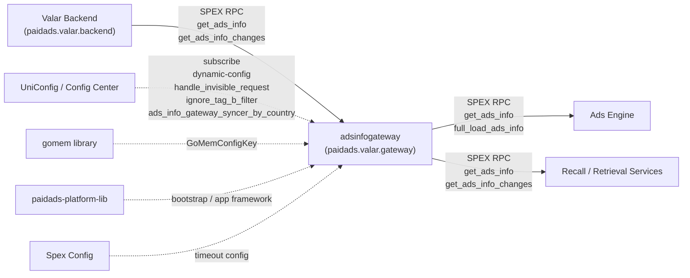

<!-- ads-workspace-gdoc-sync: gdoc_id=1PT9lkdLz7rGO747JCAmVT502O439ZIpYKhL9PgmL56Q gdoc_url=https://docs.google.com/document/d/1PT9lkdLz7rGO747JCAmVT502O439ZIpYKhL9PgmL56Q/edit -->

# paidads-ads-info-gateway

> **Contributors**: fengjiao.wang ｜ **最后更新**：2026-05-27 ｜ [GitLab](https://git.garena.com/shopee/search_recommend/ai-copilot/ads-workspace/-/blob/master/docs/common/readme/paidads-ads-info-gateway/README.md)

> **Language**: [English](README.md) | [中文](README.zh-CN.md)

**Repository:** https://git.garena.com/shopee/deep/indexer/paidads-ads-info-gateway

---

## Table of Contents / 目录

1. [Introduction / 项目概述](#introduction--项目概述)
2. [Features / 核心功能](#features--核心功能)
3. [Architecture / 项目架构](#architecture--项目架构)
   - [Service Topology / 上下游调用拓扑](#service-topology--上下游调用拓扑)
4. [Upstream-Facing APIs / 对外接口（上游调用）](#upstream-facing-apis--对外接口上游调用)
   - [GetAdsInfo / GetAdsInfoChanges / FullLoadAdsInfo](#getadsinfo--getadsinfoochanges--fullloadadssinfo)
   - [Client Setup and Calling Examples / 客户端接入与调用示例](#client-setup-and-calling-examples--客户端接入与调用示例)
   - [Request Routing and InfoType Projection / 请求路由与 InfoType 字段裁剪](#request-routing-and-infotype-projection--请求路由与-infotype-字段裁剪)
   - [Filter Pipeline / 过滤流水线](#filter-pipeline--过滤流水线)
   - [Timeouts and Error Codes / 超时与错误码](#timeouts-and-error-codes--超时与错误码)
5. [Backend Data Ingestion / Backend 数据读取（下游依赖）](#backend-data-ingestion--backend-数据读取下游依赖)
   - [Backend APIs Used / 调用的 Backend API](#backend-apis-used--调用的-backend-api)
   - [Full Load Pipeline / Full Load 流程](#full-load-pipeline--full-load-流程)
   - [Incremental Sync Pipeline / 增量同步流程](#incremental-sync-pipeline--增量同步流程)
   - [Scheduling and Auto-Reload / 周期调度与自动重载](#scheduling-and-auto-reload--周期调度与自动重载)
   - [Startup vs Runtime Refresh / 启动 vs 运行期刷新](#startup-vs-runtime-refresh--启动-vs-运行期刷新)
6. [In-Memory Data Model / 内存数据模型](#in-memory-data-model--内存数据模型)
   - [AdsStorage Layout / AdsStorage 主结构](#adsstorage-layout--adsstorage-主结构)
   - [Keys and Identifier Computation / Key 与 Identifier 计算](#keys-and-identifier-computation--key-与-identifier-计算)
   - [Secondary Indexes and Query Routing / 二级索引与查询路由](#secondary-indexes-and-query-routing--二级索引与查询路由)
   - [Change Storage (TTL Cache) / changesStorage（TTL 增量缓存）](#change-storage-ttl-cache--changesstoragettl-增量缓存)
   - [AdsInfo Fields and InfoType Mapping / AdsInfo proto 字段与 InfoType 映射](#adsinfo-fields-and-infotype-mapping--adsinfo-proto-字段与-infotype-映射)
7. [Directory Structure / 目录结构](#directory-structure--目录结构)
8. [Entrypoints and Key Modules / 服务入口与关键模块](#entrypoints-and-key-modules--服务入口与关键模块)
9. [Configuration and Deployment / 配置与部署](#configuration-and-deployment--配置与部署)
   - [Static Config / 静态配置](#static-config--静态配置)
   - [Dynamic Config / 动态配置](#dynamic-config--动态配置)
   - [SPEX and spcli / SPEX 与 spcli](#spex-and-spcli--spex-与-spcli)
   - [Build and Release / 构建与发布](#build-and-release--构建与发布)
10. [Monitoring and Operations / 监控与排障](#monitoring-and-operations--监控与排障)
    - [Key Metrics / 关键指标](#key-metrics--关键指标)
    - [Troubleshooting Checklist / 排障清单](#troubleshooting-checklist--排障清单)
11. [Key Terms / 关键术语](#key-terms--关键术语)
12. [Additional Resources / 参考资料](#additional-resources--参考资料)
13. [Frequently Asked Questions / 常见问题](#frequently-asked-questions--常见问题)

---

## Introduction / 项目概述

`paidads-ads-info-gateway` (service name: `adsinfogateway`) is a SPEX-based **forward index serving service** for Paid Ads. It runs in Go 1.22, built on `paidads-platform-lib/app` + SPEX v2.

**Key design principles:**

- **No Kafka.** The sole data source is Valar Backend (service `paidads.valar.backend`) accessed via SPEX RPC. This service neither consumes nor produces any Kafka topic.
- **Read-only query interface.** Three SPEX endpoints under namespace `paidads.valar.gateway` expose the in-memory AdsInfo data to callers (Ads Engine, Recall/Retrieval services).
- **In-process memory store.** On startup, a synchronous Full Load pulls all AdsInfo from Valar Backend into process memory. A background Syncer then periodically fetches incremental changes and merges them into the main AdsStorage via merge-on-write.

Each deployed instance holds an **independent** copy of the data.

---

## Features / 核心功能

1. **Three outbound SPEX endpoints** — `get_ads_info` (precise query with pagination), `get_ads_info_changes` (incremental changes), `full_load_ads_info` (caller-side full load with pagination) under `paidads.valar.gateway`.
2. **Full Load + Incremental Sync from Valar Backend** — `FullLoad` fans out 30 concurrent SPEX RPCs to `paidads.valar.backend.get_ads_info`; incremental sync uses `get_ads_info_changes` per placement with `SplitBucket=true`.
3. **Dual in-memory storage** — primary `AdsStorage` (main map + 10 secondary indexes) and `changesStorage` (TTL cache of per-second AdsInfoChanges buckets).
4. **InfoType field projection** — `filterAdsInfoByRequestInfo` strips any AdsInfo field not covered by the requested `InfoType` list, reducing response payload.
5. **gomem GC control** — the `gomem` package subscribes to remote config (`GoMemConfigKey`) to tune runtime GC and memory parameters at runtime.

---

## Architecture / 项目架构

### Service Topology / 上下游调用拓扑



**Topology table:**

| Direction | Service | Protocol | Description |
|-----------|---------|----------|-------------|
| **Upstream** (data source) | Valar Backend (`paidads.valar.backend`) | SPEX RPC | Sole data source. `get_ads_info` used for Full Load (fan-out over 30 info_node+placement combos); `get_ads_info_changes` used for incremental sync (fan-out over 26 placements with `SplitBucket=true`). |
| **Downstream** (caller) | Ads Engine | SPEX RPC | Calls `get_ads_info` / `full_load_ads_info` via `paidads.valar.gateway`; uses custom VTProto codec with content type 100000. |
| **Downstream** (caller) | Recall / Retrieval Services | SPEX RPC | Calls `get_ads_info` with various identifiers (ads_ids, item_ids, etc.) or `get_ads_info_changes` for incremental consumption; passes `InfoTypes` for field projection. |
| **Dependency** | UniConfig / Config Center | service | Subscribes to `dynamic-config` (timeouts, FullLoadScanCount, FallbackFullLoadToBackend), `handle_invisible_request`, `ignore_tag_b_filter`, `ads_info_gateway_syncer_by_country` (MapInitialSize). |
| **Dependency** | gomem | library | Runtime GC/memory management; subscribes to `Gateway.GoMemConfigKey`. |
| **Dependency** | paidads-platform-lib | library | Shared platform library: `bootstrap.GenCommonAppConfig`, SPEX client/server factories, app framework. |
| **Dependency** | Spex Config | service | Manages `GetAdsInfoTimeout`, `GetAdsInfoChangesTimeout`, `FullLoadAdsInfoTimeout` as runtime parameters via dynamic config. |

---

## Upstream-Facing APIs / 对外接口（上游调用）

### GetAdsInfo / GetAdsInfoChanges / FullLoadAdsInfo

All three endpoints are defined in `sp_proto/paidads/valar/gateway.proto` under namespace `paidads.valar.gateway`.

| Method | SPEX Name | Key Request Fields | Key Response Fields | Typical Callers | Code Entry |
|--------|-----------|-------------------|--------------------|--------------------|------------|
| GetAdsInfo | `paidads.valar.gateway.get_ads_info` | `identifier` (required), `info_types`, `node_cursors`, `limit` (1–500), `include_inactive`, `include_invisible` | `ads_info[]` (VTProto bytes), `node_cursors`, `last_update_time` | Recall services, Ads Engine | `internal/server/get_ads_info.go` |
| GetAdsInfoChanges | `paidads.valar.gateway.get_ads_info_changes` | `from_time`, `end_time`, `identifier` (required) | `results[]` (VTProto bytes), `last_update_time` | Recall services | `internal/server/get_ads_info_changes.go` |
| FullLoadAdsInfo | `paidads.valar.gateway.full_load_ads_info` | `identifier.placements`, `info_types`, `node_cursors`, `include_inactive` | `ads_info[]`, `node_cursors`, `last_update_time` | Ads Engine (cold start / full refresh) | `internal/server/full_load_ads_info.go` |

**Notes:**
- `FullLoadAdsInfo` internally delegates to `GetAdsInfo` via `convertToGetAdsInfo`; it uses `dynamic-config.FullLoadScanCount` as the page limit and applies an independent `FullLoadAdsInfoTimeout`.
- `GetAdsInfoChanges` fetches from the local `changesStorage` (no real-time Valar Backend call). The time window `[from_time, end_time)` must fit within `IncrementTTL`; otherwise `ERROR_VALIDATION` is returned (validated by `utils.ValidateTimeRange`).

---

### Client Setup and Calling Examples / 客户端接入与调用示例

#### Context setup / Context 初始化

**Required: set country code (lowercase) on every request:**

```go
import (
    "strings"
    "git.garena.com/shopee/platform/service-governance/viewercontext"
)

// Required: set country code (lowercase)
ctx = viewercontext.WithCID(ctx, strings.ToLower(country))
```

#### Endpoint selection guide / 接口选择

| Use case | Endpoint | Notes |
|----------|----------|-------|
| Cold start / full refresh | `full_load_ads_info` | placements-only identifier; page through with `node_cursors` until empty |
| Precise query by ads/item/campaign/shop/user/post/session | `get_ads_info` | up to 500 IDs per request; chose `InfoTypes` carefully |
| Incremental consumption | `get_ads_info_changes` | time window must be ≤ `IncrementTTL`; reads local `changesStorage`, no pagination needed |

**Recommended sync pattern:** `full_load_ads_info` once on startup → periodic `get_ads_info_changes` polling → parallel `get_ads_info` for ad-hoc queries.

#### Example 1 — GetAdsByIds

```go
import (
    "git.garena.com/shopee/deep/indexer/paidads-ads-info-gateway/gen/go/paidads_valar_gateway.pb/paidads_valar_gateway"
    sp_common "git.garena.com/shopee/sp_protocol/golang/common.pb"
    "google.golang.org/protobuf/proto"
    "git.garena.com/shopee/platform/golang_splib/sps"
    "git.garena.com/shopee/platform/service-governance/viewercontext"
)

func GetAdsByIds(ctx context.Context, client sps.RPCClient, country string, adsIDs []int64) ([]*paidads_valar_gateway.AdsInfo, error) {
    ctx = viewercontext.WithCID(ctx, strings.ToLower(country))

    var nodeCursors []*paidads_valar_gateway.NodeCursor
    var allAdsInfo []*paidads_valar_gateway.AdsInfo

    for {
        req := &paidads_valar_gateway.GetAdsInfoRequest{
            InfoTypes: []int32{
                int32(paidads_valar_gateway.Constant_ADVERTISEMENT),
                int32(paidads_valar_gateway.Constant_ITEM),
            },
            Identifier:  &paidads_valar_gateway.GetAdsInfoIdentifier{AdsIds: adsIDs},
            NodeCursors: nodeCursors,
            Limit:       proto.Int64(500),
        }
        resp := new(paidads_valar_gateway.GetAdsInfoResponse)

        code := client.RPCRequest(ctx, "paidads.valar.gateway.get_ads_info", req, resp)
        if code != uint32(sp_common.Constant_SUCCESS) {
            return nil, fmt.Errorf("get_ads_info failed: code=%d msg=%s", code, resp.GetResponseHeader().GetMessage())
        }

        for _, b := range resp.GetAdsInfo() {
            ai := new(paidads_valar_gateway.AdsInfo)
            if err := ai.UnmarshalVT(b); err != nil {
                return nil, err
            }
            allAdsInfo = append(allAdsInfo, ai)
        }

        nodeCursors = resp.GetNodeCursors()
        if len(nodeCursors) == 0 {
            break
        }
    }
    return allAdsInfo, nil
}
```

> **Tips:** Keep `limit` between 1–500. Prefer specific `InfoTypes` over `ALL` to reduce payload. Switching `Identifier` fields changes the routing `Level` (see [Request Routing](#request-routing-and-infotype-projection--请求路由与-infotype-字段裁剪)).

#### Example 2 — PollChanges

```go
func PollChanges(ctx context.Context, client sps.RPCClient, country string, placements []int32, fromTime, endTime int64) ([]*paidads_valar_gateway.AdsInfoChanges, error) {
    ctx = viewercontext.WithCID(ctx, strings.ToLower(country))

    req := &paidads_valar_gateway.GetAdsInfoChangesRequest{
        FromTime: proto.Int64(fromTime),
        EndTime:  proto.Int64(endTime),
        Identifier: &paidads_valar_gateway.GetAdsInfoIdentifier{
            Placements: placements,
        },
    }
    resp := new(paidads_valar_gateway.GetAdsInfoChangesResponse)

    code := client.RPCRequest(ctx, "paidads.valar.gateway.get_ads_info_changes", req, resp)
    if code != uint32(sp_common.Constant_SUCCESS) {
        return nil, fmt.Errorf("get_ads_info_changes failed: code=%d", code)
    }

    var changes []*paidads_valar_gateway.AdsInfoChanges
    for _, b := range resp.GetResults() {
        c := new(paidads_valar_gateway.AdsInfoChanges)
        if err := c.UnmarshalVT(b); err != nil {
            return nil, err
        }
        switch paidads_valar_gateway.Constant_AdsInfoChangeOperation(c.GetOperation()) {
        case paidads_valar_gateway.Constant_INDEX:
            // upsert
        case paidads_valar_gateway.Constant_UPDATE:
            // partial update
        case paidads_valar_gateway.Constant_DELETE:
            // remove
        case paidads_valar_gateway.Constant_VISIBILITY_UPDATE:
            // visibility change only
        }
        changes = append(changes, c)
    }
    return changes, nil
}
```

> **Warning:** `[from_time, end_time)` must not exceed `IncrementTTL`. If it does, the server returns `ERROR_VALIDATION`. Recommended practice: 30s polling with a window of a few minutes.

#### Example 3 — SyncLoop (cold start + incremental polling)

```go
func SyncLoop(ctx context.Context, client sps.RPCClient, country string, placements []int32) {
    // Phase 1: full load
    lastUpdateTime := fullLoad(ctx, client, country, placements)

    // Phase 2: incremental polling
    fromTime := lastUpdateTime
    for {
        time.Sleep(30 * time.Second)
        now := time.Now().Unix()
        changes, err := PollChanges(ctx, client, country, placements, fromTime, now)
        if err != nil {
            log.Errorf("poll failed: %v — retrying next cycle", err)
            continue
        }
        applyChanges(changes)
        fromTime = now
    }
}

func fullLoad(ctx context.Context, client sps.RPCClient, country string, placements []int32) int64 {
    ctx = viewercontext.WithCID(ctx, strings.ToLower(country))

    var nodeCursors []*paidads_valar_gateway.NodeCursor
    var minLastUpdateTime int64

    for {
        req := &paidads_valar_gateway.FullLoadAdsInfoRequest{
            InfoTypes:   []int32{int32(paidads_valar_gateway.Constant_ALL)},
            Identifier:  &paidads_valar_gateway.FullLoadAdsInfoIdentifier{Placements: placements},
            NodeCursors: nodeCursors,
        }
        resp := new(paidads_valar_gateway.FullLoadAdsInfoResponse)

        client.RPCRequest(ctx, "paidads.valar.gateway.full_load_ads_info", req, resp)

        processAdsInfo(resp.GetAdsInfo())

        t := resp.GetLastUpdateTime()
        if minLastUpdateTime == 0 || t < minLastUpdateTime {
            minLastUpdateTime = t
        }

        nodeCursors = resp.GetNodeCursors()
        if len(nodeCursors) == 0 {
            break
        }
    }
    return minLastUpdateTime
}
```

> **Why take `MIN(last_update_time)` across pages?** The gateway fans out FullLoad over 30 concurrent backend RPCs. `last_update_time` varies per shard. Taking the minimum ensures that the incremental poll starting point covers all shards without gaps, preventing any changes from being missed between Phase 1 and Phase 2.

---

### Request Routing and InfoType Projection / 请求路由与 InfoType 字段裁剪

#### Level routing (from `identifier.GetLevel` in `pkg/identifier/identifier.go`)

The `GetAdsInfoIdentifier` fields determine which secondary index (Level) is used. Priority (first match wins):

| Priority | Level | Trigger condition | Map type |
|----------|-------|-------------------|----------|
| 1 | `LevelAdsAndPlacement` | `ads_ids` + `placements` both non-empty | direct lookup on main map |
| 2 | `LevelAds` | `ads_ids` non-empty | fast map |
| 3 | `LevelItemAndPlacement` | `item_ids` + `placements` both non-empty | fast map |
| 4 | `LevelShopAndPlacement` | `shop_ids` + `placements` both non-empty | slow map |
| 5 | `LevelCampaign` | `campaign_ids` non-empty | fast map |
| 6 | `LevelItem` | `item_ids` non-empty | fast map |
| 7 | `LevelLivestreamSession` | `session_ids` non-empty | slow map |
| 8 | `LevelVideoPost` | `post_ids` non-empty | fast map |
| 9 | `LevelPlacement` | `placements` non-empty | slow map |
| 10 | `LevelUser` | `user_ids` non-empty | slow map |
| 11 | `LevelShop` | `shop_ids` non-empty | slow map |
| 12 | `LevelNone` | nothing set | `scanAll` — full scan with cursor |

- **Fast map** (`ExtremeFastMap`): returns all entries in one bucket immediately (no per-bucket cursor pagination).
- **Slow map** (`iterable.Map`): paginates per bucket; per-key limit = `max(limit/N, MinLimit=4)` where N is the number of distinct keys in the request.
- **`LevelNone`** triggers `scanAll` on the main `adsAndPlacement` map with cursor-based pagination.

#### InfoType field projection (from `internal/server/filter.go:filterAdsInfoByRequestInfo`)

When `info_types` contains `ALL` (0), all fields are returned unchanged. Otherwise, each `AdsInfo` is reconstructed with only the requested fields. The following fields are always present ("core fields") regardless of `info_types`:

`ads_id`, `item_id`, `campaign_id`, `shop_id`, `ads_account_id`, `placement`, `visible_start_ts`, `visible_end_ts`, `tracing`, `boost_ads`, `live_stream_ads`, `video_ads`, `country`

| InfoType | Gated fields |
|----------|-------------|
| `ADVERTISEMENT` (1) | `advertisement` |
| `ITEM` (2) | `item` |
| `CAMPAIGN` (3) | `campaign` |
| `SHOP` (4) | `shop` |
| `ACCOUNT` (5) | `account` |
| `BRAND_SEARCH_ADS` (6) | `brand_search_ads` (without keywords) |
| `BRAND_SEARCH_ADS_KEYWORD` (7) | `brand_search_ads.keywords`, `brand_search_ads.keyword_groups`, `brand_search_ads.expansion_keywords` |
| `BRAND_MAX` (8) | `brand_max_ads` |
| `CONTENT` (9) | `content` |
| `TRAFFIC_CONTROL` (10) | `traffic_control` |
| `VOUCHER` (11) | `voucher` |
| `BID_STRATEGY` (12) | `bid_strategy` |
| `DYNAMIC_FIELDS` (13, deprecated) | `dynamic_fields` |
| `EXT_FIELDS` (14) | `ext_fields` |
| `VIDEO_LIST` (28) | `video_list` |
| `ITEM_LIST` (29) | `item_list` |
| `PACKAGE` (30) | `package_info` |

> `BRAND_SEARCH_ADS` and `BRAND_SEARCH_ADS_KEYWORD` can be requested together to return the full `BrandSearchAds` message.

---

### Filter Pipeline / 过滤流水线

Applied by `buildStorageFilter` in `internal/server/filter.go` before InfoType projection:

1. **Active/Invisible filter** (controlled jointly by `handle_invisible_request` + `include_invisible` + `include_inactive` + `ignore_tag_b_filter`):
   - If `include_inactive=true`: no filtering (returns all including invisible and inactive).
   - If `handle_invisible_request=true` AND `include_invisible=true`: call `filterInactiveButIncludeInvisibleAdsInfo` (removes time-expired ads but keeps invisible ones), then call `filterAdsInfoInvisibleAndNoDormantTag` (removes ads that are invisible AND have no dormant tag, unless `ignore_tag_b_filter=true`).
   - Otherwise: call `filterInactiveAdsInfo` (removes all non-active ads based on `visible_start_ts`/`visible_end_ts` and midnight boundary).

2. **`prioritiseAdsOverNonAds`**: If the result set contains both ads (non-`NON_ADS` pricing type) and non-ads (`NON_ADS` pricing type), strip all non-ads entries. If the result is homogeneous, return unchanged.

3. **InfoType projection** (`filterAdsInfoByRequestInfo`): Strip fields not covered by the requested `info_types` list (see table above).

---

### Timeouts and Error Codes / 超时与错误码

#### Per-endpoint timeouts (from `dynamic-config` namespace)

| Dynamic config field | Applied to |
|---------------------|-----------|
| `get-ads-info-timeout` | `GetAdsInfo` handler |
| `get-ads-info-changes-timeout` | `GetAdsInfoChanges` handler |
| `full-load-ads-info-timeout` | `FullLoadAdsInfo` handler |

Context timeout is set in `internal/server/timeout.go:setContextTimeout`. On timeout, `context-timeout` counter is incremented.

#### Error codes (`paidads.valar.gateway.Constant.Error`)

| Code | Value | Meaning |
|------|-------|---------|
| `ERROR_SYSTEM` | 1668300001 | Internal server error |
| `ERROR_INVALID_TIME` | 1668300002 | Invalid time parameter |
| `ERROR_REDIS_FAIL` | 1668300003 | Redis failure (legacy) |
| `ERROR_ALL_FAILED` | 1668300004 | All sub-requests failed |
| `ERROR_PARTIAL_FAILED` | 1668300005 | Some sub-requests failed |
| `ERROR_NOT_FOUND` | 1668300006 | Requested resource not found |
| `ERROR_VALIDATION` | 1668300007 | Request validation failed (e.g., time range exceeds IncrementTTL) |
| `ERROR_RATE_LIMIT` | 1668300008 | Rate limit exceeded |

---

## Backend Data Ingestion / Backend 数据读取（下游依赖）

### Backend APIs Used / 调用的 Backend API

| Backend Method | SPEX Name | Called by | Key request params | Notes |
|---------------|-----------|-----------|-------------------|-------|
| `get_ads_info` | `paidads.valar.backend.get_ads_info` | `AdsInfoBE.ScanAdsInfoByNodeInfo` | `InfoNodeList[1]`, `NodeCursors`, `Limit`, optional `Placements` | Used for Full Load; gateway splits per info_node+placement and fires 30 concurrent RPCs |
| `get_ads_info_changes` | `paidads.valar.backend.get_ads_info_changes` | `AdsInfoBE.GetAdsInfoChanges` | `FromTime`, `EndTime`, `Identifier.Placements=[placement]`, `SplitBucket=true` | Used for incremental sync; fired once per placement (26 total); response is `results_by_time: map<int64, AdsInfoChangesResult>` |

**Full Load fan-out breakdown** (`internal/repository/ads_info_be.go:ScanAdsInfo`):

Each `ScanAdsInfo` call dispatches one `errgroup` containing:

| info_node | Placement filter |
|-----------|-----------------|
| `shop_ads_info_node` | none |
| `search_ads_info_node` | none |
| `search_ads_info_by_placement_node` | none |
| `target_ads_info_node` | none |
| `video_ads_info_node` (or `video_ads_info_v2_node` per country config) | one per placement in `consts.AllPlacementList` (26 placements) |

**Total per FullLoad call: 4 + 26 = 30 concurrent SPEX RPCs.**

Returned `ads_info[]` bytes are VTProto-encoded; the gateway decodes them with `adsInfo.UnmarshalVT(bytes)`. The `last_update_time` across 30 shards is reduced to the **minimum** (`slices.Min(lastUpdateTimeList)`).

---

### Full Load Pipeline / Full Load 流程

Entry point: `pkg/syncer/syncer.go:Syncer.FullLoad`

1. Loop: call `fullLoadScanFunc(nodeCursor)` until `response.Cursor == nil`.
2. For each batch: call `storage.UpsertIfNewer(idGetter, indexerMtimeNewer)` — replaces existing entry only if `incoming.IndexerMtime >= existing.IndexerMtime` (equal mtime also triggers `ReAdd` to refresh `updateTime` and prevent premature eviction by `CleanDataBeforeTime`).
3. Record the `MinLastUpdateTime` across all pages (first page's value is used; backend already returns the minimum across its 30 shards).
4. Cap `lastUpdateUnixTime` to `max(response.LastUpdateTime, now - maxUpdateWindow)`.
5. Call `storage.CleanDataBeforeTime(lastUpdateUnixTime)` to evict stale entries absent from the backend scan.
6. Update `lastUpdateTimestamp` and `lastFullLoadTime`.
7. Emit `init_full_load` latency metric (only at startup, via `internal/setup/syncer.go:NewSyncer`).

**Single info_node or placement failure causes the entire `errgroup` to fail, aborting that FullLoad cycle. The next scheduled cycle will retry.**

---

### Incremental Sync Pipeline / 增量同步流程

Two goroutines run concurrently on `UpdateInterval` tickers (started by `Syncer.Start`):

**Goroutine 1 — `syncChangesFromAPI`:**
1. Compute fetch window: `[changesLastUpdateTimestamp, now - 1s]`, capped by `changesStorageTTL` and `maxUpdateWindow`.
2. Call `getAdsChangesFunc(start.Unix(), end.Unix())` → `AdsInfoBE.GetAdsInfoChanges` (26 parallel placements).
3. Store each `timestamp → []AdsInfoChanges` bucket via `StoreChanges(time.Unix(ts, 0), changesList)`.
   - `changesStorage` is a `TTLCache[int64, *AdsStorage[*AdsInfoChanges, *AdsInfoChanges]]`; each second is a separate `AdsStorage` bucket with `MergeAdsInfoChanges` semantics.
4. Update `changesLastUpdateTimestamp`.

**Goroutine 2 — `periodicUpdate`:**
1. Compute merge window: `[lastUpdateTimestamp, changesLastUpdateTimestamp]`.
2. Call `GetChangesFromStorage(ctx, start, end, nil)` to collect all second-buckets in range (iterates `changesStorage` second by second; deduplicates by `baseID = fnv1a(ads_id+","+placement)`).
3. Apply each change to main `storage.ApplyChanges(idGetter)`:
   - `INDEX` → `OperationAdd` (upsert)
   - `UPDATE` / `VISIBILITY_UPDATE` → `OperationNoop` (merge fields in place via `adsinfo.ApplyChanges`)
   - `DELETE` → `OperationRemove`
4. Update `lastUpdateTimestamp`.

---

### Scheduling and Auto-Reload / 周期调度与自动重载

Both tickers share `UpdateInterval`. In `periodicUpdate`:

- **Idle reload** (`reloadThreshold`): if `lastUpdateTimestamp + reloadThreshold < now`, trigger an async `FullLoad` in a new goroutine (protected by `isFullLoading` CAS). Incremental processing continues in parallel while FullLoad runs.
- **Periodic force reload** (`reloadInterval`): if `reloadInterval > 0` and `lastFullLoadTime + reloadInterval < now`, trigger the same async `FullLoad`.
- **Syncer request timeout**: all backend RPCs use `SyncerRequestTimeout` (default 10 s, from `SyncerSetupConfig`).

---

### Startup vs Runtime Refresh / 启动 vs 运行期刷新

| Phase | Call site | Behaviour on failure |
|-------|-----------|----------------------|
| **Startup** | `setup.NewSyncer` → `s.FullLoad()` (synchronous) | Returns error → service fails to start (fail-fast) |
| **Runtime** | `go s.Start()` → periodic ticker goroutines | Errors are logged + metrics recorded; service stays alive and retries on next tick |

---

## In-Memory Data Model / 内存数据模型

### AdsStorage Layout / AdsStorage 主结构

```
AdsStorage[*AdsInfo, *AdsInfoChanges]
├── adsAndPlacement  Map[Identifier → IDGetter[*AdsInfo]]
│       key = fnv1a(ads_id + "," + placement)
│       (main map, supports cursor-based full scan)
└── identityMap  map[Level → *IdfIterableSetMap[*AdsInfo]]
        ├── LevelAds              → FastMap  (key = fnv1a(ads_id))
        ├── LevelItemAndPlacement → FastMap  (key = fnv1a(item_id + "," + placement))
        ├── LevelCampaign         → FastMap  (key = fnv1a(campaign_id))
        ├── LevelItem             → FastMap  (key = fnv1a(item_id))
        ├── LevelVideoPost        → FastMap  (key = fnv1a(post_id))
        ├── LevelPlacement        → SlowMap  (key = fnv1a(placement))
        ├── LevelUser             → SlowMap  (key = fnv1a(ads_account_id))
        ├── LevelShop             → SlowMap  (key = fnv1a(shop_id))
        ├── LevelLivestreamSession→ SlowMap  (key = fnv1a(session_id))
        └── LevelShopAndPlacement → SlowMap  (key = fnv1a(shop_id + "," + placement))
```

- **FastMap** (`pkg/iterable/fast_map.go`): `ExtremeFastMap` backed by `go-redis-dict`; `GetAllInto` returns the full bucket in one call.
- **SlowMap** (`pkg/iterable/iterable_map.go`): `iterable.Map` backed by `go-redis-dict`; supports cursor-based `Scan` for pagination.
- **`IdfIterableSetMap`**: Each secondary-index bucket (`identityMap[level]`) is a `map[Identifier → IterableMap]`. Each inner map holds all `AdsInfo` entries sharing the same secondary key, indexed by their `baseID`.

---

### Keys and Identifier Computation / Key 与 Identifier 计算

All keys are `uint64` hashes computed by `fnv1a` on ASCII-encoded integer strings (`pkg/identifier/identifier.go`):

| Constructor | Inputs | Usage |
|-------------|--------|-------|
| `identifier.New(id int64)` | `fnv1a(strconv.Itoa(id))` | single int64 key (ads_id, item_id, etc.) |
| `identifier.New2(id1, id2 int64)` | `fnv1a(str(id1) + "," + str(id2))` | composite key (ads_id+placement, item_id+placement, shop_id+placement) |
| `identifier.NewU64(id uint64)` | `fnv1a(strconv.FormatUint(id))` | uint64 key (post_id) |
| `identifier.New2U64(id1, id2 uint64)` | `fnv1a(str(id1) + "," + str(id2))` | composite uint64 key |

`GetBaseID(idGetter)` computes `New2(ads_id, int64(placement))` as the primary map key. Returns empty `Identifier` (value 0) if `ads_id == 0`.

---

### Secondary Indexes and Query Routing / 二级索引与查询路由

**Table 1 — 10 secondary indexes and their keys:**

| Level | Map type | Key computation |
|-------|----------|----------------|
| `LevelAds` | FastMap | `New(ads_id)` |
| `LevelItemAndPlacement` | FastMap | `New2(item_id, int64(placement))` |
| `LevelCampaign` | FastMap | `New(campaign_id)` |
| `LevelItem` | FastMap | `New(item_id)` |
| `LevelVideoPost` | FastMap | `NewU64(post_id)` |
| `LevelPlacement` | SlowMap | `New(int64(placement))` |
| `LevelUser` | SlowMap | `New(ads_account_id)` |
| `LevelShop` | SlowMap | `New(shop_id)` |
| `LevelLivestreamSession` | SlowMap | `New(session_id)` |
| `LevelShopAndPlacement` | SlowMap | `New2(shop_id, int64(placement))` |

**Table 2 — Request field → Level routing (from `identifier.GetLevel`):**

See [Request Routing and InfoType Projection](#request-routing-and-infotype-projection--请求路由与-infotype-字段裁剪) for the priority table.

**Pagination behaviour:**
- Fast map: returns entire bucket without cursor.
- Slow map: per-key page limit = `max(limit / N, MinLimit=4)` where N = number of distinct keys in the request. Returns `NodeCursor` per key when the bucket has more entries.
- `LevelNone`: `scanAll` on `adsAndPlacement` with a single string cursor.

---

### Change Storage (TTL Cache) / changesStorage（TTL 增量缓存）

```
changesStorage: TTLCache[int64 (unix-second), *AdsStorage[*AdsInfoChanges, *AdsInfoChanges]]
```

- TTL = `ChangesStorageTTL` (configured in `syncer.Config`).
- Each second bucket is itself a fully independent `AdsStorage` (same `Identifier`/`Level` mechanism, but storing `*AdsInfoChanges` instead of `*AdsInfo`).
- `StoreChanges(t, changesList)`: writes each change into the bucket for `TruncateSecond(t)`.
- `GetChangesFromStorage`: iterates second by second from `start` to `lastUpdateTime`; for each bucket calls `Scan(identifier, cursor, 500, nil)`; cross-second results are deduplicated by `baseID` (ads_id+placement) using a `map[Identifier]*AdsInfoChanges`.
- The inner `MergeFunc` for `changesStorage` always uses `OperationAdd` — individual changes are never deleted from the TTL store.

`changesStorage` must be kept separate from the main `AdsStorage`: when incremental changes are applied to the main store, `UPDATE` operations are merged into the current `AdsInfo` via `proto.Merge`, and INDEX-style changes replace the latest indexed state. The main store therefore only retains the current entity snapshot. `GetAdsInfoChanges` needs to return the original `AdsInfoChanges` sequence by time window; reading only from the main store would lose operation type, second-level ordering, and intermediate states.

---

### AdsInfo Fields and InfoType Mapping / AdsInfo proto 字段与 InfoType 映射

| Field | Type | Always present | Requires InfoType |
|-------|------|---------------|-------------------|
| `ads_id` | int64 | ✓ | — |
| `item_id` | int64 | ✓ | — |
| `campaign_id` | int64 | ✓ | — |
| `shop_id` | int64 | ✓ | — |
| `ads_account_id` | int64 | ✓ | — |
| `placement` | int32 | ✓ | — |
| `visible_start_ts` | int64 | ✓ | — |
| `visible_end_ts` | int64 | ✓ | — |
| `tracing` | Tracing | ✓ | — |
| `boost_ads` | bytes | ✓ | — |
| `live_stream_ads` | LiveStreamAds | ✓ | — |
| `video_ads` | VideoAds | ✓ | — |
| `country` | string | ✓ | — |
| `advertisement` | Advertisement | — | `ADVERTISEMENT` (1) |
| `item` | bytes | — | `ITEM` (2) |
| `campaign` | Campaign | — | `CAMPAIGN` (3) |
| `shop` | bytes | — | `SHOP` (4) |
| `account` | bytes | — | `ACCOUNT` (5) |
| `brand_search_ads` | BrandSearchAds | — | `BRAND_SEARCH_ADS` (6) and/or `BRAND_SEARCH_ADS_KEYWORD` (7) |
| `brand_max_ads` | bytes | — | `BRAND_MAX` (8) |
| `content` | bytes | — | `CONTENT` (9) |
| `traffic_control` | bytes | — | `TRAFFIC_CONTROL` (10) |
| `voucher` | bytes | — | `VOUCHER` (11) |
| `bid_strategy` | bytes | — | `BID_STRATEGY` (12) |
| `dynamic_fields` | bytes (deprecated) | — | `DYNAMIC_FIELDS` (13, deprecated) |
| `ext_fields` | bytes | — | `EXT_FIELDS` (14) |
| `new_product_boost` | bytes | ✓ | — |
| `video_list` | []bytes | — | `VIDEO_LIST` (28) |
| `item_list` | []bytes | — | `ITEM_LIST` (29) |
| `package_info` | bytes | — | `PACKAGE` (30) |

---

## Directory Structure / 目录结构

```
paidads-ads-info-gateway/
├── cmd/adsinfogateway/
│   └── main.go                  # service entry; bootstrap → SPEX client+server → Wire DI → register codecs
├── config/
│   ├── gateway.go               # Gateway struct (SpexConfig, SyncerConfig, ServerConfig, SyncerSetupConfig, GoMemConfigKey)
│   ├── consts/
│   │   ├── consts.go            # MinLimit=4, MaxLimit=500
│   │   ├── hash.go
│   │   └── placement.go         # AllPlacementList (26 TrackingPlacement values)
│   └── files/
│       ├── live.yml             # UniConfig namespaces: ads_info_gateway_config_live_global / ads_info_gateway_cid_config_live___CID__
│       ├── liveish.yml
│       └── test.yml
├── internal/
│   ├── codec/
│   │   ├── custom_codec.go      # VTProtoCodec (content type 100000 for Ads Engine)
│   │   └── json.go              # JSON codec for SPEX HTTP gateway
│   ├── exporter/
│   │   └── exporter.go          # RecordLatency, RecordError, SetStorageLevelGauge, SetAdsInfoPlacementGauge, RecordCounterWithMeta
│   ├── repository/
│   │   └── ads_info_be.go       # AdsInfoBE: ScanAdsInfo (30-way fan-out), GetAdsInfoChanges (26-way fan-out)
│   ├── server/
│   │   ├── config.go            # Config (IncrementTTL), DynamicConfig, DynamicConfigKey
│   │   ├── filter.go            # filter pipeline: active/invisible/dormant tag + prioritise + InfoType projection
│   │   ├── full_load_ads_info.go# FullLoadAdsInfo → convertToGetAdsInfo → GetAdsInfo
│   │   ├── get_ads_info.go      # GetAdsInfo handler
│   │   ├── get_ads_info_changes.go # GetAdsInfoChanges handler
│   │   ├── server.go            # Server struct, Init(), ProcessResponseCommon
│   │   ├── timeout.go           # setContextTimeout (per-cmd dynamic timeout)
│   │   └── util.go              # marshalAdsInfoList, marshalAdsInfoChangesList
│   └── setup/
│       ├── setup.go             # Wire inject: Initialize → NewSyncer + AdsInfoBE
│       ├── syncer.go            # NewSyncer, GenFullLoadFunc, GenGetAdsChangesFunc; blocking FullLoad at startup
│       └── wire_gen.go          # generated Wire DI code
├── pkg/
│   ├── adsinfo/
│   │   ├── active.go            # IsAdsInfoActiveForServer, IsAdsInfoActiveTime, IsAdsInfoVisible, IsAdTagDormantAds
│   │   ├── changes.go           # ApplyChanges, MergeAdsInfoChanges
│   │   └── id_getter.go         # NewAdsInfoIDGetter, NewAdsInfoChangesIDGetter
│   ├── adsstorage/
│   │   ├── storage.go           # AdsStorage[T,V]: Add/ReAdd/Remove/UpsertIfNewer/ApplyChanges
│   │   ├── scan.go              # Scan, scanAll, scanFastMap, scanSlowMap
│   │   ├── identifier_map.go    # IdfIterableSetMap
│   │   ├── clean.go             # CleanDataBeforeTime
│   │   ├── get.go
│   │   └── size.go              # GetMetrics, Size
│   ├── exporter/                # MetricMap helper (VictoriaMetrics counters/histograms/gauges)
│   ├── gomem/
│   │   └── runtime.go           # gomem GC control via remote config
│   ├── identifier/
│   │   ├── identifier.go        # Identifier type, New/New2/NewU64/New2U64, GetLevel, Level enum
│   │   ├── identifiable.go      # Identity interfaces for each Level
│   │   └── iterator.go          # Iterator (walks identifier lists with cursor state)
│   ├── iterable/
│   │   ├── fast_map.go          # ExtremeFastMap (O(1) GetAllInto, no pagination)
│   │   ├── iterable_map.go      # Map (cursor-based Scan backed by go-redis-dict)
│   │   └── iterable_set.go      # IterableSet (wraps Map for set semantics)
│   ├── metadata/
│   │   └── metadata.go          # Metadata{Country, RequestID, CMD, Requester, Logger}, GetMetadataFromCtx
│   ├── ratelimit/               # Rate-limit middleware (UniConfig-driven)
│   ├── spexerror/
│   │   └── error.go             # spexerror.Error{Message, DebugMessage}
│   ├── spexutil/
│   │   └── manager.go           # Manager: RegisterSpexClientInterceptor, RegisterSpexServerInterceptor, SubscribeConfig
│   ├── syncer/
│   │   ├── syncer.go            # Syncer: FullLoad, Start, syncChangesFromAPI, periodicUpdate, StoreChanges, GetChangesFromStorage
│   │   └── getter.go            # AdsStorageReader, AdsStorageSizeReader interfaces
│   ├── ttlcache/
│   │   └── cache.go             # TTLCache[K,V]: GetOrSet, Get, periodic cleanup
│   └── utils/
│       ├── time.go              # TruncateSecond
│       ├── uniconfig.go         # GetConfig[T]
│       └── utils.go             # IsLive, ValidateTimeRange
├── sp_proto/paidads/valar/
│   └── gateway.proto            # SPEX service definition for paidads.valar.gateway
├── scripts/
│   └── mesos.sh                 # Mesos deployment script
├── Makefile                     # build targets: adsinfogateway, proto, vtproto-gateway, vtproto-backend, wire, test
└── sp-workspace.yml             # SPEX workspace: dep on paidads.valar.backend (topic: test)
```

---

## Entrypoints and Key Modules / 服务入口与关键模块

### Startup sequence (`cmd/adsinfogateway/main.go`)

1. `bootstrap.GenCommonAppConfig("ads_info_gateway", run, ...)` — initialises UniConfig, registers `/vm_metrics` HTTP handler.
2. `tracing.Init` — distributed tracing setup.
3. `spex.New(conf.SpexConfig)` × 2 — one SPEX client instance, one SPEX server instance.
4. `spexutil.Manager` — registers client/server interceptors and subscribes to SPEX dynamic config.
5. `gomem.New(logger, uniConfig, conf.GoMemConfigKey)` — starts GC tuning goroutine.
6. `setup.Initialize(*conf, &spexClientManager, uniConfig)` — Wire DI: constructs `Server`, `AdsInfoBE`, `Syncer`; **synchronously runs `FullLoad`** before returning.
7. `server.Init()` — binds `dynamic-config`, watches `handle_invisible_request` and `ignore_tag_b_filter` keys.
8. `paidads_valar_gateway.NewGatewayProcessor(server)` — wraps Server in SPEX processor.
9. Register codecs:
   - `sps.ContentTypeJSON` → `codec.JSON{}` (for SPEX HTTP gateway)
   - `sprpc.ContentTypeProtobuf` → `codec.VTProtoCodec{}` (standard protobuf)
   - `100000` → `codec.VTProtoCodec{}` (custom content type for Ads Engine)
10. `spexServerInstance.RegisterGeneratedProcessor(processor)` + `spexServerManager.Register(ctx)` — starts SPEX server.
11. `waitFunc()` — blocks until shutdown signal.

### Key packages

| Package | Path | Responsibility |
|---------|------|----------------|
| `server` | `internal/server` | SPEX endpoint handlers, filter pipeline, timeout management, error mapping |
| `repository` | `internal/repository` | Valar Backend SPEX client wrapper; ScanAdsInfo (30-way fan-out), GetAdsInfoChanges (26-way fan-out) |
| `codec` | `internal/codec` | JSON codec for HTTP gateway; VTProto codec (content types: protobuf + 100000) |
| `setup` | `internal/setup` | Wire DI entry point; constructs Syncer with FullLoad/GetAdsChanges adapters; FullLoad at startup |
| `syncer` | `pkg/syncer` | Core sync logic: FullLoad, incremental sync (syncChangesFromAPI), merge (periodicUpdate), TTL change store |
| `adsstorage` | `pkg/adsstorage` | Generic in-memory store: main map + 10 secondary indexes; merge-on-write via `ApplyChanges` |
| `identifier` | `pkg/identifier` | fnv1a-based Identifier type, GetLevel routing, Iterator |
| `adsinfo` | `pkg/adsinfo` | Active/visible/dormant predicates; ApplyChanges merge logic; IDGetter wrappers |
| `ttlcache` | `pkg/ttlcache` | TTL cache for `changesStorage` second-buckets |
| `gomem` | `pkg/gomem` | Runtime GC/memory control via remote config |

---

## Configuration and Deployment / 配置与部署

### Static Config / 静态配置

The top-level config struct is `config.Gateway` (`config/gateway.go`):

| Field | Type | Description |
|-------|------|-------------|
| `SpexConfig` | `spex.Config` | SPEX client and server config |
| `SyncerConfig` | `syncer.Config` | `UpdateInterval`, `ChangesStorageTTL`, `ReloadThreshold`, `ReloadInterval`, `UpdateThreshold`, etc. |
| `ServerConfig` | `server.Config` | `IncrementTTL` — max time window for `GetAdsInfoChanges` |
| `SyncerSetupConfig` | `SyncerSetupConfig` | `SyncerRequestTimeout` (default 10s), `FullLoadScanCount` (default 500) |
| `GoMemConfigKey` | string | UniConfig key for gomem GC tuning |

**Config files** (`config/files/`):
- `live.yml`: binds UniConfig project `index_pipeline` with namespaces:
  - `ads_info_gateway_config_live_global` — shared global config
  - `ads_info_gateway_cid_config_live___CID__` — per-country config (e.g., `ads_info_gateway_cid_config_live_sg`)

---

### Dynamic Config / 动态配置

Subscribed via `s.UniConfig.BindProto(DynamicConfigKey, &DynamicConfig{})` where `DynamicConfigKey = "dynamic-config"`:

| Field | Type | Purpose |
|-------|------|---------|
| `fallback-full-load-to-backend` | bool | Reserved toggle (currently unused, kept for future use) |
| `full-load-scan-count` | int64 | Page size for `FullLoadAdsInfo` scans (overrides `SyncerSetupConfig.FullLoadScanCount`) |
| `get-ads-info-timeout` | duration | Context timeout for `GetAdsInfo` handler |
| `get-ads-info-changes-timeout` | duration | Context timeout for `GetAdsInfoChanges` handler |
| `full-load-ads-info-timeout` | duration | Context timeout for `FullLoadAdsInfo` handler |

Additional standalone UniConfig keys:

| Key | Type | Purpose |
|-----|------|---------|
| `handle_invisible_request` | bool | Enables invisible-ads handling when `include_invisible=true` on the request (default: `false`) |
| `ignore_tag_b_filter` | bool | Skips `filterAdsInfoInvisibleAndNoDormantTag` when `true` (default: `false`) |
| `ads_info_gateway_syncer_by_country` | `syncer.CIDConfig` proto | Per-CID `MapInitialSize` to pre-size the AdsStorage hash tables and reduce rehashing during FullLoad |

Request rate limiting is not a child of `dynamic-config`; it is an independent UniConfig setup under project `index_pipeline`, namespace `ads_info_gateway_rate_limiter_${ENV}_${CID}`, bound to key `rate_limit_config`. The service watches this key with `WatchKey` for hot reload. Matching priority is `${requester}@${cmd}` -> `${requester}` -> `${cmd}`; unmatched requests use the default rate-limit config. When a request is rate-limited, the handler returns `ERROR_RATE_LIMIT` and records the rate-limit counter via `RecordRateLimitCount`.

---

### SPEX and spcli / SPEX 与 spcli

- **`sp-workspace.yml`** declares a dependency on `paidads.valar.backend` (topic: `test` — migration to `master` is a TODO in comments).
- **`spcli proto ensure`** + **`spcli proto gen`** download and generate backend proto bindings into `gen/dep_proto/paidads.valar/` and `gen/go/paidads_valar_backend.pb/`.
- **VTProto generation**: `make vtproto-gateway` and `make vtproto-backend` run `protoc` with `protoc-gen-go-vtproto` to produce optimised marshal/unmarshal/size code.
- **`spex-generator sp-workspace.yml`** generates the SPEX response-setter glue at `gen/go/paidads_valar_gateway.pb/paidads_valar_gateway/paidads_valar_gateway.pb.spex.go`.

---

### Build and Release / 构建与发布

```bash
# Install build tools (spkit)
make tool

# Full build (proto gen + vtproto + compile)
make adsinfogateway
# or equivalently:
make ads_info_gateway
```

Output:
- `bin/paidads_adsinfogateway_server` — native binary (current platform)
- `bin/paidads_adsinfogateway_server.linux` — Linux cross-compiled binary (macOS only)

Deployment is via **Mesos** using `scripts/mesos.sh`.

Run tests:
```bash
make test
```

Run full CI checks (proto + fmt + lint + test):
```bash
make ci
```

---

## Monitoring and Operations / 监控与排障

### Key Metrics / 关键指标

All metrics are exported to VictoriaMetrics via the `/vm_metrics` HTTP endpoint (Prometheus format). Metric prefix: `paidads_valar_gateway_`.

**Latency histograms** (`paidads_valar_gateway_latency`, tags: `component`, `requester`):

| Component | Source |
|-----------|--------|
| `ScanAdsInfo` | `internal/repository/ads_info_be.go` |
| `GetAdsInfoChanges` | `internal/repository/ads_info_be.go` (per placement) |
| `FullLoad` | `pkg/syncer/syncer.go` |
| `ProcessChanges` | `pkg/syncer/syncer.go:periodicUpdate` |
| `SyncChangesFromAPI` | `pkg/syncer/syncer.go:syncChangesFromAPI` |
| `ApplyChanges` / `Add` / `ReAdd` / `Remove` / `UpsertIfNewer` | `pkg/adsstorage/storage.go` |
| `scanAll` / `scanFastMap-<Level>` / `scanSlowMap-<Level>` | `pkg/adsstorage/scan.go` |
| `adsAndPlacement.Scan` / `adsAndPlacement.Get` | `pkg/adsstorage/scan.go` |
| `init_full_load` | `internal/setup/syncer.go` (startup only) |
| `StoreChanges` | `pkg/syncer/syncer.go` |

**Counters** (`paidads_valar_gateway_counter`, tags: `component`, `cmd`, `requester`):

| Component | Meaning |
|-----------|---------|
| `full_load` | Number of AdsInfo items loaded per FullLoad batch |
| `api_sync` | Number of changes fetched from Backend per sync cycle |
| `period_update` | Number of changes applied per periodicUpdate cycle |
| `storage_success` | Successfully applied changes per periodicUpdate cycle |
| `infoType-<InfoType>` | Frequency of each InfoType being requested |
| `context-timeout` | Handler context timeout occurrences |

**Error counter** (`paidads_valar_gateway_error`, tags: `type`, `requester`, `error`):

Emitted by `exporter.RecordError(cmd, requester, message)` on handler errors and sync failures.

**Gauges** (`paidads_valar_gateway_storage_level_count`, `paidads_valar_gateway_ads_info_placement_count`):

- `storage_level_count{level}` — count of entries per secondary index level.
- `ads_info_placement_count{placement}` — count of AdsInfo per TrackingPlacement (reported by `ReportIdentitySizeFunc`).

---

### Troubleshooting Checklist / 排障清单

| Symptom | Likely cause | Investigation |
|---------|-------------|---------------|
| Empty or stale responses on startup | FullLoad not yet complete | Check `init_full_load` latency; if it failed, service would not have started |
| Stale data during normal operation | `syncChangesFromAPI` or `periodicUpdate` failing | Check `SyncChangesFromAPI` latency; look for `ads-changes-not-complete` error counter; check `api_sync` counter drop |
| `GetAdsInfoChanges` returns `ERROR_VALIDATION` | `[from_time, end_time)` window exceeds `IncrementTTL` | Shorten the polling window; verify `server-config.increment-ttl` value |
| OOM / high memory usage | Too many entries, large `MapInitialSize`, long `ChangesStorageTTL` | Tune `gomem` config; reduce `MapInitialSize` via `ads_info_gateway_syncer_by_country`; shorten `ChangesStorageTTL` |
| Handler context timeout | Dynamic timeouts too low for current load | Increase `get-ads-info-timeout` / `get-ads-info-changes-timeout` / `full-load-ads-info-timeout` in `dynamic-config` |
| FullLoad fails on one info_node | Backend error for a specific info_node or placement | Entire FullLoad cycle fails and retries next tick; check Backend-side errors; verify that specific info_node is healthy |

---

## Key Terms / 关键术语

| Term | Definition |
|------|-----------|
| **Valar Backend** | Upstream SPEX service (`paidads.valar.backend`) that is the sole data source for this gateway. Stores AdsInfo indexed by info_node and placement. |
| **AdsStorage** | Generic in-memory data structure (`pkg/adsstorage`) holding a primary map (`adsAndPlacement`) plus 10 secondary inverted indexes (`identityMap`). |
| **Syncer** | Background component (`pkg/syncer`) managing FullLoad and incremental sync. Owns both the main `AdsStorage` and `changesStorage`. |
| **Full Load** | Complete snapshot pull of all AdsInfo from Valar Backend via 30 concurrent SPEX RPCs. Runs synchronously at startup and periodically/on idle. |
| **AdsInfoChanges** | Delta record describing an operation (INDEX / UPDATE / DELETE / VISIBILITY_UPDATE) on a single AdsInfo entry. |
| **NodeCursor** | Opaque pagination token used to resume a scan on the same server instance. Valid only on the instance that issued it. |
| **InfoType** | Enum controlling which fields of `AdsInfo` are populated in the response. `ALL` (0) returns all fields. |
| **Identifier / Level** | `uint64` fnv1a hash used as map key; `Level` enum determines which secondary index and scan strategy (`fast map`, `slow map`, or `scanAll`) to use. |
| **fast map** | `ExtremeFastMap` secondary index where all entries for a key are returned at once (no pagination). |
| **slow map** | `iterable.Map` secondary index that supports cursor-based pagination per bucket. |
| **changesStorage** | `TTLCache[int64, *AdsStorage[*AdsInfoChanges, *AdsInfoChanges]]` — per-second buckets of AdsInfoChanges used by `GetAdsInfoChanges` and `periodicUpdate`. |
| **dormant tag** | An ad tag indicating the ad is in a dormant state but may become visible again. Used in `filterAdsInfoInvisibleAndNoDormantTag` to retain invisible ads that have a dormant tag. |
| **VTProto** | `protoc-gen-go-vtproto`-generated optimised marshal/unmarshal/size code used for AdsInfo serialisation (significant CPU savings vs standard protobuf reflection). |
| **gomem** | In-house library for runtime Go GC tuning (GOGC, memory limits) via remote config. |
| **forward index** | An index keyed by ad entity (ads_id, item_id, etc.) that returns the full AdsInfo proto for matching ads. Contrast with inverted index (keyed by query attributes). |
| **merge-on-write** | Strategy used by `ApplyChanges`: changes from `changesStorage` are merged into the main `AdsStorage` immediately on write rather than at query time. |

---

## Additional Resources / 参考资料

- **Repository:** https://git.garena.com/shopee/deep/indexer/paidads-ads-info-gateway
- **Paid Ads Glossary (Confluence):** https://confluence.shopee.io/pages/viewpage.action?spaceKey=SPAD&title=Paid+Ads+Glossary
- **SPEX Go SDK Quick Start:** https://spex.shopee.io/overview/quick-start/languages/go/index.html
- **spcli Installation:** https://spex.shopee.io/user-guide/SDK/Java/local.html
- **Proto definition:** `sp_proto/paidads/valar/gateway.proto`
- **Backend proto:** `gen/dep_proto/paidads.valar/backend.proto`

---

## Frequently Asked Questions / 常见问题

**1. Why must callers use `sps.WithDestination` after the first request?**

Every `adsinfogateway` instance holds an independent in-memory dataset. `node_cursors` encode internal iterator state that is only valid on the instance that produced them. A follow-up request routed to a different instance would misinterpret or fail the cursor. Use `sps.WithRespHdrCatcher` on the first request to capture `server-instance-id`, then use `sps.WithDestination` on all subsequent pages.

**2. What is the difference between `get_ads_info` and `full_load_ads_info`?**

`full_load_ads_info` is a wrapper over `get_ads_info` (`convertToGetAdsInfo`). It accepts only `placements` as the identifier (no ads_ids/item_ids), uses `dynamic-config.FullLoadScanCount` as the page limit, and has a separate `FullLoadAdsInfoTimeout`. Use it for initial bulk pulls; use `get_ads_info` for targeted queries by ads/item/campaign/shop etc.

**3. Why does the gateway split the Full Load by info_node and placement?**

Valar Backend organises AdsInfo into separate data shards per info_node and per placement for video ads. Querying a single combined endpoint would exceed SPEX message size limits. The 30-way fan-out (4 non-video nodes + 26 placement-specific video nodes) allows each RPC to stay within size bounds while achieving maximum throughput via `errgroup`.

**4. Why does incremental sync fan out per placement with `SplitBucket=true`?**

Valar Backend stores changes in per-placement buckets. `SplitBucket=true` tells the backend to return changes grouped by unix-second timestamp (`results_by_time`). This allows the gateway to store each second as an independent TTL bucket in `changesStorage` and to efficiently query any `[from, end)` window without deserialising the entire change log.

**5. Why are there secondary indexes instead of scanning the main map?**

The main `adsAndPlacement` map is keyed by `fnv1a(ads_id + "," + placement)`. Queries by item_id, campaign_id, shop_id, etc. would require a full scan (O(n)). The 10 secondary indexes reduce these to O(1) bucket lookups for fast maps or O(bucket_size) paginated scans for slow maps.

**6. Why does the gateway do InfoType field projection instead of letting callers filter?**

AdsInfo protos are large. Returning only the requested fields reduces serialisation cost, network payload, and GC pressure in callers. For example, a Recall service that only needs `ADVERTISEMENT` and `ITEM` fields saves significant bandwidth compared to requesting `ALL`.

**7. How do `handle_invisible_request` and `include_invisible` interact?**

`handle_invisible_request` is a server-side gate controlled by the ops team. When it is `false` (default), `include_invisible` in the request is ignored and all invisible ads are stripped. When both `handle_invisible_request=true` AND `include_invisible=true`, the server applies `filterInactiveButIncludeInvisibleAdsInfo` (time-based only) and then `filterAdsInfoInvisibleAndNoDormantTag` (retains invisible ads that have a dormant tag).

**8. Why are `changesStorage` and main `AdsStorage` kept separate rather than merged?**

The `changesStorage` is a time-indexed TTL cache optimised for the `GetAdsInfoChanges` API — callers consume changes by time window, not by entity key. The main `AdsStorage` is optimised for entity-key lookups, and incremental application merges `UPDATE` into the current `AdsInfo` while replacing INDEX-style state with the latest snapshot. If only the main store were retained, the original `AdsInfoChanges` operation type, ordering, and intermediate states would be lost. Keeping them separate also makes it easy to expire changes via TTL without affecting the main dataset.

---

<!-- Generated by ads-workspace/skills/ads-readme-generate | checked: 7ec3ced8ac394dfd7597fe354bba8f7f65a7782b -->
