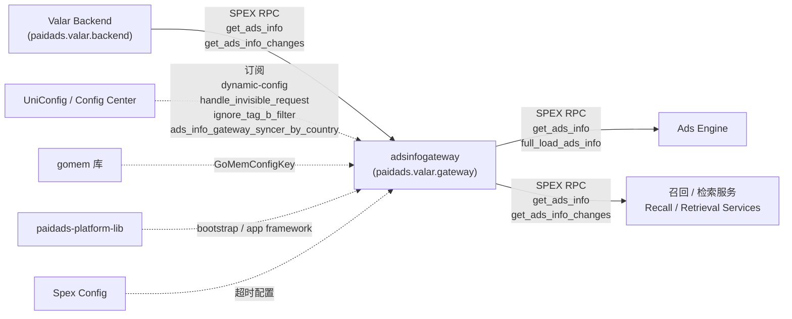

<!-- ads-workspace-gdoc-sync: gdoc_id=1jk9jKMs-ndFzO5Z-ZMlKD8GLzJscFkjZcExcP52F6hs gdoc_url=https://docs.google.com/document/d/1jk9jKMs-ndFzO5Z-ZMlKD8GLzJscFkjZcExcP52F6hs/edit -->

# paidads-ads-info-gateway

> **Contributors**: fengjiao.wang ｜ **最后更新**：2026-05-27 ｜ [GitLab](https://git.garena.com/shopee/search_recommend/ai-copilot/ads-workspace/-/blob/master/docs/common/readme/paidads-ads-info-gateway/README.zh-CN.md)

> **Language**: [English](README.md) | [中文](README.zh-CN.md)

**仓库地址：** https://git.garena.com/shopee/deep/indexer/paidads-ads-info-gateway

---

## 目录 / Table of Contents

- [paidads-ads-info-gateway](#paidads-ads-info-gateway)
  - [目录 / Table of Contents](#目录--table-of-contents)
  - [项目概述 / Introduction](#项目概述--introduction)
  - [核心功能 / Features](#核心功能--features)
  - [项目架构 / Architecture](#项目架构--architecture)
    - [上下游调用拓扑 / Service Topology](#上下游调用拓扑--service-topology)
  - [对外接口（上游调用） / Upstream-Facing APIs](#对外接口上游调用--upstream-facing-apis)
    - [GetAdsInfo / GetAdsInfoChanges / FullLoadAdsInfo](#getadsinfo--getadsinfochanges--fullloadadsinfo)
    - [客户端接入与调用示例 / Client Setup and Calling Examples](#客户端接入与调用示例--client-setup-and-calling-examples)
      - [为什么必须使用 sticky routing](#为什么必须使用-sticky-routing)
      - [接口选择指南](#接口选择指南)
      - [示例 1 — 按 ads\_id 查询](#示例-1--按-ads_id-查询)
      - [示例 2 — 轮询增量变更](#示例-2--轮询增量变更)
      - [示例 3 — SyncLoop（冷启动 + 增量轮询组合）](#示例-3--syncloop冷启动--增量轮询组合)
    - [请求路由与 InfoType 字段裁剪 / Request Routing and InfoType Projection](#请求路由与-infotype-字段裁剪--request-routing-and-infotype-projection)
      - [Level 路由（来自 `pkg/identifier/identifier.go:GetLevel`）](#level-路由来自-pkgidentifieridentifiergogetlevel)
      - [InfoType 字段裁剪（来自 `internal/server/filter.go:filterAdsInfoByRequestInfo`）](#infotype-字段裁剪来自-internalserverfiltergofilteradsinfobyrequestinfo)
    - [过滤流水线 / Filter Pipeline](#过滤流水线--filter-pipeline)
    - [超时与错误码 / Timeouts and Error Codes](#超时与错误码--timeouts-and-error-codes)
      - [按接口超时（来自 `dynamic-config` 命名空间）](#按接口超时来自-dynamic-config-命名空间)
      - [错误码（`paidads.valar.gateway.Constant.Error`）](#错误码paidadsvalargatewayconstanterror)
  - [Backend 数据读取（下游依赖） / Backend Data Ingestion](#backend-数据读取下游依赖--backend-data-ingestion)
    - [调用的 Backend API / Backend APIs Used](#调用的-backend-api--backend-apis-used)
    - [Full Load 流程 / Full Load Pipeline](#full-load-流程--full-load-pipeline)
    - [增量同步流程 / Incremental Sync Pipeline](#增量同步流程--incremental-sync-pipeline)
    - [周期调度与自动重载 / Scheduling and Auto-Reload](#周期调度与自动重载--scheduling-and-auto-reload)
    - [启动 vs 运行期刷新 / Startup vs Runtime Refresh](#启动-vs-运行期刷新--startup-vs-runtime-refresh)
  - [内存数据模型 / In-Memory Data Model](#内存数据模型--in-memory-data-model)
    - [AdsStorage 主结构 / AdsStorage Layout](#adsstorage-主结构--adsstorage-layout)
    - [Key 与 Identifier 计算 / Keys and Identifier Computation](#key-与-identifier-计算--keys-and-identifier-computation)
    - [二级索引与查询路由 / Secondary Indexes and Query Routing](#二级索引与查询路由--secondary-indexes-and-query-routing)
    - [changesStorage（TTL 增量缓存） / Change Storage (TTL Cache)](#changesstoragettl-增量缓存--change-storage-ttl-cache)
    - [AdsInfo proto 字段与 InfoType 映射 / AdsInfo Fields and InfoType Mapping](#adsinfo-proto-字段与-infotype-映射--adsinfo-fields-and-infotype-mapping)
  - [目录结构 / Directory Structure](#目录结构--directory-structure)
  - [服务入口与关键模块 / Entrypoints and Key Modules](#服务入口与关键模块--entrypoints-and-key-modules)
    - [启动顺序（`cmd/adsinfogateway/main.go`）](#启动顺序cmdadsinfogatewaymaingo)
    - [关键包说明](#关键包说明)
  - [配置与部署 / Configuration and Deployment](#配置与部署--configuration-and-deployment)
    - [静态配置 / Static Config](#静态配置--static-config)
    - [动态配置 / Dynamic Config](#动态配置--dynamic-config)
    - [SPEX 与 spcli / SPEX and spcli](#spex-与-spcli--spex-and-spcli)
    - [构建与发布 / Build and Release](#构建与发布--build-and-release)
  - [监控与排障 / Monitoring and Operations](#监控与排障--monitoring-and-operations)
    - [关键指标 / Key Metrics](#关键指标--key-metrics)
    - [排障清单 / Troubleshooting Checklist](#排障清单--troubleshooting-checklist)
  - [关键术语 / Key Terms](#关键术语--key-terms)
  - [参考资料 / Additional Resources](#参考资料--additional-resources)
  - [常见问题 / Frequently Asked Questions](#常见问题--frequently-asked-questions)

---

## 项目概述 / Introduction

`paidads-ads-info-gateway`（服务名：`adsinfogateway`）是一个基于 SPEX 的 **Paid Ads forward index serving 服务**，使用 Go 1.22，框架为 `paidads-platform-lib/app` + SPEX v2。

**核心设计原则：**

- **不消费/生产 Kafka。** 唯一数据来源是 Valar Backend（服务名 `paidads.valar.backend`），通过 SPEX RPC 访问。
- **只读查询接口。** 在 `paidads.valar.gateway` 命名空间下对外暴露三个 SPEX endpoint，供 Ads Engine 与召回/检索服务查询进程内的 AdsInfo 数据。
- **进程内内存存储。** 启动时同步执行 Full Load，将 Valar Backend 的全量 AdsInfo 拉取到进程内存。后台 Syncer 周期性拉取增量 changes，并通过 merge-on-write 方式合并到主 AdsStorage。

每个部署实例持有**独立的**数据副本。

---

## 核心功能 / Features

1. **三个对外 SPEX endpoint** — `get_ads_info`（精确查询+分页）、`get_ads_info_changes`（增量变更）、`full_load_ads_info`（调用方侧全量拉取+分页）均位于 `paidads.valar.gateway` 命名空间。
2. **从 Valar Backend 全量+增量拉取** — `FullLoad` 向 `paidads.valar.backend.get_ads_info` 发出 30 路并发 SPEX RPC；增量同步使用 `get_ads_info_changes`，按 placement 并发发出（`SplitBucket=true`）。
3. **双内存存储** — 主存储 `AdsStorage`（主 map + 10 个二级索引）与 `changesStorage`（按秒分桶的 TTL cache 存储 AdsInfoChanges）。
4. **InfoType 字段裁剪** — `filterAdsInfoByRequestInfo` 对 AdsInfo 做字段投影，只返回请求中指定的 InfoType 对应字段，减少响应 payload。
5. **gomem GC 控制** — `gomem` 包订阅远程配置（`GoMemConfigKey`），在运行时动态调整 GC 和内存参数。

---

## 项目架构 / Architecture

### 上下游调用拓扑 / Service Topology



**拓扑表格：**

| 方向 | 服务 | 协议 | 说明 |
|------|------|------|------|
| **上游**（数据来源） | Valar Backend (`paidads.valar.backend`) | SPEX RPC | 唯一数据来源。`get_ads_info` 用于 Full Load（扇出到 30 个 info_node+placement 组合）；`get_ads_info_changes` 用于增量同步（每个 placement 一路，共 26 路，`SplitBucket=true`）。 |
| **下游**（调用方） | Ads Engine | SPEX RPC | 通过 `paidads.valar.gateway` 调用 `get_ads_info` / `full_load_ads_info`；使用 content type 100000 的自定义 VTProto codec。 |
| **下游**（调用方） | 召回 / 检索服务 | SPEX RPC | 通过多种 identifier（ads_ids/item_ids 等）调用 `get_ads_info`，或通过 `get_ads_info_changes` 做增量消费；按需传入 InfoTypes 做字段裁剪。 |
| **依赖** | UniConfig / Config Center | service | 订阅 `dynamic-config`（超时、FullLoadScanCount、FallbackFullLoadToBackend）、`handle_invisible_request`、`ignore_tag_b_filter`、`ads_info_gateway_syncer_by_country`（MapInitialSize）。 |
| **依赖** | gomem | library | 运行时 GC/内存管理；订阅 `Gateway.GoMemConfigKey`。 |
| **依赖** | paidads-platform-lib | library | 共享平台库：`bootstrap.GenCommonAppConfig`、SPEX client/server 工厂、app framework。 |
| **依赖** | Spex Config | service | 通过 dynamic config 管理 `GetAdsInfoTimeout`、`GetAdsInfoChangesTimeout`、`FullLoadAdsInfoTimeout` 等运行时参数。 |

---

## 对外接口（上游调用） / Upstream-Facing APIs

### GetAdsInfo / GetAdsInfoChanges / FullLoadAdsInfo

三个 endpoint 均定义在 `sp_proto/paidads/valar/gateway.proto`，命名空间 `paidads.valar.gateway`。

| 方法 | SPEX 名称 | 主要入参 | 主要出参 | 典型调用方 | 代码入口 |
|------|-----------|---------|---------|-----------|---------|
| GetAdsInfo | `paidads.valar.gateway.get_ads_info` | `identifier`（必填）、`info_types`、`node_cursors`、`limit`（1–500）、`include_inactive`、`include_invisible` | `ads_info[]`（VTProto bytes）、`node_cursors`、`last_update_time` | 召回服务、Ads Engine | `internal/server/get_ads_info.go` |
| GetAdsInfoChanges | `paidads.valar.gateway.get_ads_info_changes` | `from_time`、`end_time`、`identifier`（必填） | `results[]`（VTProto bytes）、`last_update_time` | 召回服务 | `internal/server/get_ads_info_changes.go` |
| FullLoadAdsInfo | `paidads.valar.gateway.full_load_ads_info` | `identifier.placements`、`info_types`、`node_cursors`、`include_inactive` | `ads_info[]`、`node_cursors`、`last_update_time` | Ads Engine（冷启动 / 全量刷新） | `internal/server/full_load_ads_info.go` |

**注意事项：**
- `FullLoadAdsInfo` 内部通过 `convertToGetAdsInfo` 复用 `GetAdsInfo`；使用 `dynamic-config.FullLoadScanCount` 作为分页 limit，并有独立的 `FullLoadAdsInfoTimeout`。
- `GetAdsInfoChanges` 读取本地 `changesStorage`（不实时回查 Valar Backend）。时间窗 `[from_time, end_time)` 必须在 `IncrementTTL` 范围内，否则返回 `ERROR_VALIDATION`（由 `utils.ValidateTimeRange` 校验）。

---

### 客户端接入与调用示例 / Client Setup and Calling Examples

#### Context 初始化 / Context setup

**每次请求必须设置国家码（小写）：**

```go
import (
    "strings"
    "git.garena.com/shopee/platform/service-governance/viewercontext"
)

// 必须：设置国家码（小写）
ctx = viewercontext.WithCID(ctx, strings.ToLower(country))
```

#### 接口选择指南

| 使用场景                                            | 接口                     | 说明                                              |
| ----------------------------------------------- | ---------------------- | ----------------------------------------------- |
| 冷启动 / 全量刷新                                      | `full_load_ads_info`   | identifier 只传 placements；循环翻页直到 node_cursors 为空 |
| 按 ads/item/campaign/shop/user/post/session 精确查询 | `get_ads_info`         | 每次最多 500 个 ID；合理选择 InfoTypes                    |
| 增量消费                                            | `get_ads_info_changes` | 时间窗必须 ≤ IncrementTTL；读本地 changesStorage，无需分页    |

**推荐同步模式：** 启动时执行一次 `full_load_ads_info` → 周期性轮询 `get_ads_info_changes` → 并行 `get_ads_info` 做临时查询。

#### 示例 1 — 按 ads_id 查询

```go
import (
    "git.garena.com/shopee/deep/indexer/paidads-ads-info-gateway/gen/go/paidads_valar_gateway.pb/paidads_valar_gateway"
    sp_common "git.garena.com/shopee/sp_protocol/golang/common.pb"
    "google.golang.org/protobuf/proto"
    "git.garena.com/shopee/platform/golang_splib/sps"
)

func GetAdsByIds(ctx context.Context, client sps.RPCClient, country string, adsIDs []int64) ([]*paidads_valar_gateway.AdsInfo, error) {
    ctx = viewercontext.WithCID(ctx, strings.ToLower(country))

    var nodeCursors []*paidads_valar_gateway.NodeCursor
    var allAdsInfo []*paidads_valar_gateway.AdsInfo

    for {
        req := &paidads_valar_gateway.GetAdsInfoRequest{
            InfoTypes: []int32{
                int32(paidads_valar_gateway.Constant_ADVERTISEMENT),
                int32(paidads_valar_gateway.Constant_ITEM),
            },
            Identifier:  &paidads_valar_gateway.GetAdsInfoIdentifier{AdsIds: adsIDs},
            NodeCursors: nodeCursors,
            Limit:       proto.Int64(500),
        }
        resp := new(paidads_valar_gateway.GetAdsInfoResponse)

        code := client.RPCRequest(ctx, "paidads.valar.gateway.get_ads_info", req, resp)
        if code != uint32(sp_common.Constant_SUCCESS) {
            return nil, fmt.Errorf("get_ads_info 失败: code=%d msg=%s", code, resp.GetResponseHeader().GetMessage())
        }

        for _, b := range resp.GetAdsInfo() {
            ai := new(paidads_valar_gateway.AdsInfo)
            if err := ai.UnmarshalVT(b); err != nil {
                return nil, err
            }
            allAdsInfo = append(allAdsInfo, ai)
        }

        nodeCursors = resp.GetNodeCursors()
        if len(nodeCursors) == 0 {
            break
        }
    }
    return allAdsInfo, nil
}
```

> **使用建议：** limit 取 1–500；按需选择 InfoTypes，避免使用 ALL 以减少 payload；切换 Identifier 字段会改变路由到的 Level（详见[请求路由](#请求路由与-infotype-字段裁剪--request-routing-and-infotype-projection)）。

#### 示例 2 — 轮询增量变更

```go
func PollChanges(ctx context.Context, client sps.RPCClient, country string, placements []int32, fromTime, endTime int64) ([]*paidads_valar_gateway.AdsInfoChanges, error) {
    ctx = viewercontext.WithCID(ctx, strings.ToLower(country))

    req := &paidads_valar_gateway.GetAdsInfoChangesRequest{
        FromTime: proto.Int64(fromTime),
        EndTime:  proto.Int64(endTime),
        Identifier: &paidads_valar_gateway.GetAdsInfoIdentifier{
            Placements: placements,
        },
    }
    resp := new(paidads_valar_gateway.GetAdsInfoChangesResponse)

    code := client.RPCRequest(ctx, "paidads.valar.gateway.get_ads_info_changes", req, resp)
    if code != uint32(sp_common.Constant_SUCCESS) {
        return nil, fmt.Errorf("get_ads_info_changes 失败: code=%d", code)
    }

    var changes []*paidads_valar_gateway.AdsInfoChanges
    for _, b := range resp.GetResults() {
        c := new(paidads_valar_gateway.AdsInfoChanges)
        if err := c.UnmarshalVT(b); err != nil {
            return nil, err
        }
        switch paidads_valar_gateway.Constant_AdsInfoChangeOperation(c.GetOperation()) {
        case paidads_valar_gateway.Constant_INDEX:
            // 新增/全量写入
        case paidads_valar_gateway.Constant_UPDATE:
            // 字段更新
        case paidads_valar_gateway.Constant_DELETE:
            // 删除
        case paidads_valar_gateway.Constant_VISIBILITY_UPDATE:
            // 可见性变更
        }
        changes = append(changes, c)
    }
    return changes, nil
}
```

> **注意：** `[from_time, end_time)` 不能超过 `IncrementTTL`，否则返回 `ERROR_VALIDATION`。建议 30 秒轮询一次，窗口设为几分钟。

#### 示例 3 — SyncLoop（冷启动 + 增量轮询组合）

```go
func SyncLoop(ctx context.Context, client sps.RPCClient, country string, placements []int32) {
    // Phase 1：全量拉取
    lastUpdateTime := fullLoad(ctx, client, country, placements)

    // Phase 2：增量轮询
    fromTime := lastUpdateTime
    for {
        time.Sleep(30 * time.Second)
        now := time.Now().Unix()
        changes, err := PollChanges(ctx, client, country, placements, fromTime, now)
        if err != nil {
            log.Errorf("轮询失败: %v — 下轮重试", err)
            continue
        }
        applyChanges(changes)
        fromTime = now
    }
}

func fullLoad(ctx context.Context, client sps.RPCClient, country string, placements []int32) int64 {
    ctx = viewercontext.WithCID(ctx, strings.ToLower(country))

    var nodeCursors []*paidads_valar_gateway.NodeCursor
    var minLastUpdateTime int64

    for {
        req := &paidads_valar_gateway.FullLoadAdsInfoRequest{
            InfoTypes:   []int32{int32(paidads_valar_gateway.Constant_ALL)},
            Identifier:  &paidads_valar_gateway.FullLoadAdsInfoIdentifier{Placements: placements},
            NodeCursors: nodeCursors,
        }
        resp := new(paidads_valar_gateway.FullLoadAdsInfoResponse)

        client.RPCRequest(ctx, "paidads.valar.gateway.full_load_ads_info", req, resp)

        processAdsInfo(resp.GetAdsInfo())

        t := resp.GetLastUpdateTime()
        if minLastUpdateTime == 0 || t < minLastUpdateTime {
            minLastUpdateTime = t
        }

        nodeCursors = resp.GetNodeCursors()
        if len(nodeCursors) == 0 {
            break
        }
    }
    return minLastUpdateTime
}
```

> **为什么取 `MIN(last_update_time)`？** gateway 做 FullLoad 时向 30 个 Backend 分片并发发请求，每个分片的 `last_update_time` 不同。取最小值作为 Phase 2 的起点，可保证冷启动到增量轮询之间不丢失任何变更。

---

### 请求路由与 InfoType 字段裁剪 / Request Routing and InfoType Projection

#### Level 路由（来自 `pkg/identifier/identifier.go:GetLevel`）

`GetAdsInfoIdentifier` 的字段决定使用哪个二级索引（Level），优先级从高到低（首个匹配生效）：

| 优先级 | Level | 触发条件 | Map 类型 |
|--------|-------|---------|---------|
| 1 | `LevelAdsAndPlacement` | `ads_ids` + `placements` 均非空 | 直接查主 map |
| 2 | `LevelAds` | `ads_ids` 非空 | fast map |
| 3 | `LevelItemAndPlacement` | `item_ids` + `placements` 均非空 | fast map |
| 4 | `LevelShopAndPlacement` | `shop_ids` + `placements` 均非空 | slow map |
| 5 | `LevelCampaign` | `campaign_ids` 非空 | fast map |
| 6 | `LevelItem` | `item_ids` 非空 | fast map |
| 7 | `LevelLivestreamSession` | `session_ids` 非空 | slow map |
| 8 | `LevelVideoPost` | `post_ids` 非空 | fast map |
| 9 | `LevelPlacement` | `placements` 非空 | slow map |
| 10 | `LevelUser` | `user_ids` 非空 | slow map |
| 11 | `LevelShop` | `shop_ids` 非空 | slow map |
| 12 | `LevelNone` | 全部为空 | `scanAll` — 全量扫描 + cursor 翻页 |

- **fast map**（`ExtremeFastMap`）：一次返回整个 bucket，无需分页。
- **slow map**（`iterable.Map`）：按 bucket 分页；每个 key 的 limit = `max(limit/N, MinLimit=4)`，其中 N 为请求中不同 key 的数量。
- **`LevelNone`** 触发 `scanAll`，使用单个 cursor 在主 `adsAndPlacement` map 上全量扫描。

#### InfoType 字段裁剪（来自 `internal/server/filter.go:filterAdsInfoByRequestInfo`）

当 `info_types` 包含 `ALL`（0）时，所有字段原样返回。否则每条 AdsInfo 只保留请求字段。以下字段**始终保留**（core fields），与 `info_types` 无关：

`ads_id`、`item_id`、`campaign_id`、`shop_id`、`ads_account_id`、`placement`、`visible_start_ts`、`visible_end_ts`、`tracing`、`boost_ads`、`live_stream_ads`、`video_ads`、`country`

| InfoType | 受控字段 |
|---------|---------|
| `ADVERTISEMENT`（1） | `advertisement` |
| `ITEM`（2） | `item` |
| `CAMPAIGN`（3） | `campaign` |
| `SHOP`（4） | `shop` |
| `ACCOUNT`（5） | `account` |
| `BRAND_SEARCH_ADS`（6） | `brand_search_ads`（不含 keywords） |
| `BRAND_SEARCH_ADS_KEYWORD`（7） | `brand_search_ads.keywords`、`keyword_groups`、`expansion_keywords` |
| `BRAND_MAX`（8） | `brand_max_ads` |
| `CONTENT`（9） | `content` |
| `TRAFFIC_CONTROL`（10） | `traffic_control` |
| `VOUCHER`（11） | `voucher` |
| `BID_STRATEGY`（12） | `bid_strategy` |
| `DYNAMIC_FIELDS`（13，已废弃） | `dynamic_fields` |
| `EXT_FIELDS`（14） | `ext_fields` |
| `VIDEO_LIST`（28） | `video_list` |
| `ITEM_LIST`（29） | `item_list` |
| `PACKAGE`（30） | `package_info` |

> 同时传入 `BRAND_SEARCH_ADS` 和 `BRAND_SEARCH_ADS_KEYWORD` 可获得完整的 `BrandSearchAds` 消息。

---

### 过滤流水线 / Filter Pipeline

由 `buildStorageFilter`（`internal/server/filter.go`）在 InfoType 裁剪前执行，分三步：

1. **活跃/可见性过滤**（由 `handle_invisible_request`、`include_invisible`、`include_inactive`、`ignore_tag_b_filter` 联合控制）：
   - `include_inactive=true`：不过滤，返回全部（包含不可见和非活跃）。
   - `handle_invisible_request=true` 且 `include_invisible=true`：先执行 `filterInactiveButIncludeInvisibleAdsInfo`（仅按时间过滤，保留不可见），再执行 `filterAdsInfoInvisibleAndNoDormantTag`（过滤掉不可见且无 dormant tag 的条目，除非 `ignore_tag_b_filter=true`）。
   - 其他情况：执行 `filterInactiveAdsInfo`（按 `visible_start_ts`/`visible_end_ts` 及 midnight 边界过滤所有非活跃条目）。

2. **`prioritiseAdsOverNonAds`**：若结果集中同时含有 ads（pricing type 非 `NON_ADS`）和 non-ads（pricing type 为 `NON_ADS`），则删除所有 non-ads 条目；若结果集同质，则原样返回。

3. **InfoType 投影**（`filterAdsInfoByRequestInfo`）：按上表裁剪 AdsInfo 字段。

---

### 超时与错误码 / Timeouts and Error Codes

#### 按接口超时（来自 `dynamic-config` 命名空间）

| 动态配置字段 | 应用范围 |
|------------|---------|
| `get-ads-info-timeout` | `GetAdsInfo` handler |
| `get-ads-info-changes-timeout` | `GetAdsInfoChanges` handler |
| `full-load-ads-info-timeout` | `FullLoadAdsInfo` handler |

Context timeout 在 `internal/server/timeout.go:setContextTimeout` 中设置。超时时递增 `context-timeout` counter。

#### 错误码（`paidads.valar.gateway.Constant.Error`）

| 名称 | 数值 | 含义 |
|------|------|------|
| `ERROR_SYSTEM` | 1668300001 | 服务内部错误 |
| `ERROR_INVALID_TIME` | 1668300002 | 时间参数非法 |
| `ERROR_REDIS_FAIL` | 1668300003 | Redis 失败（历史遗留） |
| `ERROR_ALL_FAILED` | 1668300004 | 所有子请求均失败 |
| `ERROR_PARTIAL_FAILED` | 1668300005 | 部分子请求失败 |
| `ERROR_NOT_FOUND` | 1668300006 | 资源未找到 |
| `ERROR_VALIDATION` | 1668300007 | 请求校验失败（如时间范围超出 IncrementTTL） |
| `ERROR_RATE_LIMIT` | 1668300008 | 请求超出限流阈值 |

---

## Backend 数据读取（下游依赖） / Backend Data Ingestion

### 调用的 Backend API / Backend APIs Used

| Backend 方法 | SPEX 名称 | 调用方 | 关键入参 | 说明 |
|-------------|-----------|-------|---------|------|
| `get_ads_info` | `paidads.valar.backend.get_ads_info` | `AdsInfoBE.ScanAdsInfoByNodeInfo` | `InfoNodeList[1]`、`NodeCursors`、`Limit`、可选 `Placements` | Full Load 使用；gateway 按 info_node+placement 拆分，发出 30 路并发 RPC |
| `get_ads_info_changes` | `paidads.valar.backend.get_ads_info_changes` | `AdsInfoBE.GetAdsInfoChanges` | `FromTime`、`EndTime`、`Identifier.Placements=[placement]`、`SplitBucket=true` | 增量同步使用；每个 placement 一路（共 26 路）；响应 `results_by_time: map<int64, AdsInfoChangesResult>` |

**Full Load 扇出明细**（`internal/repository/ads_info_be.go:ScanAdsInfo`）：

每次 `ScanAdsInfo` 调用发出一个 `errgroup`，包含：

| info_node | placement 过滤 |
|-----------|--------------|
| `shop_ads_info_node` | 无 |
| `search_ads_info_node` | 无 |
| `search_ads_info_by_placement_node` | 无 |
| `target_ads_info_node` | 无 |
| `video_ads_info_node`（或按国家配置使用 `video_ads_info_v2_node`） | `consts.AllPlacementList` 中每个 placement 各一路（共 26 路） |

**每轮 FullLoad 总计：4 + 26 = 30 路并发 SPEX RPC。**

返回的 `ads_info[]` bytes 为 VTProto 编码；gateway 用 `adsInfo.UnmarshalVT(bytes)` 解码。30 个分片的 `last_update_time` 取**最小值**（`slices.Min(lastUpdateTimeList)`）。

---

### Full Load 流程 / Full Load Pipeline

入口：`pkg/syncer/syncer.go:Syncer.FullLoad`

1. 循环调用 `fullLoadScanFunc(nodeCursor)` 直到 `response.Cursor == nil`。
2. 每批次调用 `storage.UpsertIfNewer(idGetter, indexerMtimeNewer)` — 仅在 `incoming.IndexerMtime >= existing.IndexerMtime` 时替换（相等的 mtime 也触发 `ReAdd` 以刷新 `updateTime`，防止 `CleanDataBeforeTime` 提前淘汰未变更的条目）。
3. 记录跨所有分页的 `MinLastUpdateTime`（Backend 侧已取最小值；首页的值代表所有分片的最小时间）。
4. 将 `lastUpdateUnixTime` cap 至 `max(response.LastUpdateTime, now - maxUpdateWindow)`。
5. 调用 `storage.CleanDataBeforeTime(lastUpdateUnixTime)` 淘汰不在本次扫描中的过期条目。
6. 更新 `lastUpdateTimestamp` 和 `lastFullLoadTime`。
7. 启动时记录 `init_full_load` latency metric（通过 `internal/setup/syncer.go:NewSyncer`）。

**某个 info_node 或 placement 请求失败会导致整个 `errgroup` 失败，本轮 FullLoad 中止，下一轮周期自动重试。**

---

### 增量同步流程 / Incremental Sync Pipeline

两个 goroutine 以相同的 `UpdateInterval` 并行运行（由 `Syncer.Start` 启动）：

**Goroutine 1 — `syncChangesFromAPI`：**
1. 计算拉取窗口：`[changesLastUpdateTimestamp, now - 1s]`，上限由 `changesStorageTTL` 和 `maxUpdateWindow` 约束。
2. 调用 `getAdsChangesFunc(start.Unix(), end.Unix())` → `AdsInfoBE.GetAdsInfoChanges`（26 路并发 placement）。
3. 将每个 `timestamp → []AdsInfoChanges` bucket 通过 `StoreChanges(time.Unix(ts, 0), changesList)` 写入。
   - `changesStorage` 是 `TTLCache[int64, *AdsStorage[*AdsInfoChanges, *AdsInfoChanges]]`；每秒一个独立的 `AdsStorage` bucket，使用 `MergeAdsInfoChanges` 合并语义。
4. 更新 `changesLastUpdateTimestamp`。

**Goroutine 2 — `periodicUpdate`：**
1. 计算合并窗口：`[lastUpdateTimestamp, changesLastUpdateTimestamp]`。
2. 调用 `GetChangesFromStorage(ctx, start, end, nil)` 收集范围内所有秒级 bucket（逐秒遍历 `changesStorage`；跨秒结果按 `baseID = fnv1a(ads_id+","+placement)` 去重）。
3. 对每条变更调用主存储的 `storage.ApplyChanges(idGetter)`：
   - `INDEX` → `OperationAdd`（upsert）
   - `UPDATE` / `VISIBILITY_UPDATE` → `OperationNoop`（原地合并字段，由 `adsinfo.ApplyChanges` 实现）
   - `DELETE` → `OperationRemove`
4. 更新 `lastUpdateTimestamp`。

---

### 周期调度与自动重载 / Scheduling and Auto-Reload

两个 ticker 共用 `UpdateInterval`。在 `periodicUpdate` 中：

- **空闲重载**（`reloadThreshold`）：若 `lastUpdateTimestamp + reloadThreshold < now`，触发异步 `FullLoad`（新 goroutine，由 `isFullLoading` CAS 保护）。FullLoad 运行期间增量处理并行继续。
- **周期强制重载**（`reloadInterval`）：若 `reloadInterval > 0` 且 `lastFullLoadTime + reloadInterval < now`，同样触发异步 `FullLoad`。
- **Syncer 请求超时**：所有 Backend RPC 使用 `SyncerRequestTimeout`（默认 10s，来自 `SyncerSetupConfig`）。

---

### 启动 vs 运行期刷新 / Startup vs Runtime Refresh

| 阶段 | 调用位置 | 失败行为 |
|------|---------|---------|
| **启动** | `setup.NewSyncer` → `s.FullLoad()`（同步阻塞） | 返回错误 → 服务启动失败（fail-fast） |
| **运行期** | `go s.Start()` → 后台 ticker goroutine | 只记录日志 + 指标；服务保持存活，下一轮自动重试 |

---

## 内存数据模型 / In-Memory Data Model

### AdsStorage 主结构 / AdsStorage Layout

```
AdsStorage[*AdsInfo, *AdsInfoChanges]
├── adsAndPlacement  Map[Identifier → IDGetter[*AdsInfo]]
│       key = fnv1a(ads_id + "," + placement)
│       （主 map，支持 cursor 翻页全量扫描）
└── identityMap  map[Level → *IdfIterableSetMap[*AdsInfo]]
        ├── LevelAds              → FastMap  (key = fnv1a(ads_id))
        ├── LevelItemAndPlacement → FastMap  (key = fnv1a(item_id + "," + placement))
        ├── LevelCampaign         → FastMap  (key = fnv1a(campaign_id))
        ├── LevelItem             → FastMap  (key = fnv1a(item_id))
        ├── LevelVideoPost        → FastMap  (key = fnv1a(post_id))
        ├── LevelPlacement        → SlowMap  (key = fnv1a(placement))
        ├── LevelUser             → SlowMap  (key = fnv1a(ads_account_id))
        ├── LevelShop             → SlowMap  (key = fnv1a(shop_id))
        ├── LevelLivestreamSession→ SlowMap  (key = fnv1a(session_id))
        └── LevelShopAndPlacement → SlowMap  (key = fnv1a(shop_id + "," + placement))
```

- **FastMap**（`pkg/iterable/fast_map.go`）：`ExtremeFastMap`，基于 `go-redis-dict`；`GetAllInto` 一次返回整个 bucket。
- **SlowMap**（`pkg/iterable/iterable_map.go`）：`iterable.Map`，基于 `go-redis-dict`；支持 cursor-based `Scan` 分页。
- **`IdfIterableSetMap`**：每个二级索引 bucket（`identityMap[level]`）是一个 `map[Identifier → IterableMap]`，内部 map 以 `baseID` 为 key 存储共享同一二级 key 的所有 AdsInfo 条目。

---

### Key 与 Identifier 计算 / Keys and Identifier Computation

所有 key 均为 `uint64` 类型，通过对 ASCII 编码整数字符串执行 `fnv1a` 哈希得到（`pkg/identifier/identifier.go`）：

| 构造函数 | 输入 | 用途 |
|---------|------|------|
| `identifier.New(id int64)` | `fnv1a(strconv.Itoa(id))` | 单个 int64 key（ads_id、item_id 等） |
| `identifier.New2(id1, id2 int64)` | `fnv1a(str(id1) + "," + str(id2))` | 复合 key（ads_id+placement、item_id+placement、shop_id+placement） |
| `identifier.NewU64(id uint64)` | `fnv1a(strconv.FormatUint(id))` | uint64 key（post_id） |
| `identifier.New2U64(id1, id2 uint64)` | `fnv1a(str(id1) + "," + str(id2))` | 复合 uint64 key |

`GetBaseID(idGetter)` 计算 `New2(ads_id, int64(placement))` 作为主 map 的 key。当 `ads_id == 0` 时返回空 `Identifier`（值为 0）。

---

### 二级索引与查询路由 / Secondary Indexes and Query Routing

**表 1 — 10 个二级索引及其 key 计算：**

| Level | Map 类型 | Key 计算 |
|-------|---------|---------|
| `LevelAds` | FastMap | `New(ads_id)` |
| `LevelItemAndPlacement` | FastMap | `New2(item_id, int64(placement))` |
| `LevelCampaign` | FastMap | `New(campaign_id)` |
| `LevelItem` | FastMap | `New(item_id)` |
| `LevelVideoPost` | FastMap | `NewU64(post_id)` |
| `LevelPlacement` | SlowMap | `New(int64(placement))` |
| `LevelUser` | SlowMap | `New(ads_account_id)` |
| `LevelShop` | SlowMap | `New(shop_id)` |
| `LevelLivestreamSession` | SlowMap | `New(session_id)` |
| `LevelShopAndPlacement` | SlowMap | `New2(shop_id, int64(placement))` |

**表 2 — 请求字段 → Level 路由优先级（来自 `identifier.GetLevel`）：**

见[请求路由与 InfoType 字段裁剪](#请求路由与-infotype-字段裁剪--request-routing-and-infotype-projection)中的优先级表。

**分页行为：**
- fast map：一次返回整个 bucket，无 cursor。
- slow map：每个 key 的 limit = `max(limit / N, MinLimit=4)`，有剩余时返回对应 key 的 `NodeCursor`。
- `LevelNone`：`scanAll` 在 `adsAndPlacement` 上用单个 string cursor 分页。

---

### changesStorage（TTL 增量缓存） / Change Storage (TTL Cache)

```
changesStorage: TTLCache[int64（unix 秒）, *AdsStorage[*AdsInfoChanges, *AdsInfoChanges]]
```

- TTL = `ChangesStorageTTL`（在 `syncer.Config` 中配置）。
- 每秒一个独立的 `AdsStorage` bucket，使用与主存储相同的 `Identifier`/`Level` 机制，但存储 `*AdsInfoChanges` 而非 `*AdsInfo`。
- `StoreChanges(t, changesList)`：将每条变更写入 `TruncateSecond(t)` 对应的 bucket。
- `GetChangesFromStorage`：逐秒遍历 `[start, lastUpdateTime)`；每个 bucket 调用 `Scan(identifier, cursor, 500, nil)`；跨秒结果按 `baseID`（ads_id+placement）去重，使用 `map[Identifier]*AdsInfoChanges`。
- `changesStorage` 内部的 `MergeFunc` 始终使用 `OperationAdd`——变更记录永远不从 TTL store 中主动删除，只由 TTL 自然过期。

`changesStorage` 必须与主 `AdsStorage` 分开保存：主存储应用增量时，`UPDATE` 会通过 `proto.Merge` 合入当前 `AdsInfo`，INDEX 类变更会替换对应索引维度的最新状态，因此主存储只保留实体的当前快照。`GetAdsInfoChanges` 需要按时间窗返回原始 `AdsInfoChanges` 序列；如果只读取主存储，变更操作类型、秒级顺序以及中间状态都会丢失。

---

### AdsInfo proto 字段与 InfoType 映射 / AdsInfo Fields and InfoType Mapping

| 字段 | 类型 | 始终返回 | 需要 InfoType |
|------|------|---------|-------------|
| `ads_id` | int64 | ✓ | — |
| `item_id` | int64 | ✓ | — |
| `campaign_id` | int64 | ✓ | — |
| `shop_id` | int64 | ✓ | — |
| `ads_account_id` | int64 | ✓ | — |
| `placement` | int32 | ✓ | — |
| `visible_start_ts` | int64 | ✓ | — |
| `visible_end_ts` | int64 | ✓ | — |
| `tracing` | Tracing | ✓ | — |
| `boost_ads` | bytes | ✓ | — |
| `live_stream_ads` | LiveStreamAds | ✓ | — |
| `video_ads` | VideoAds | ✓ | — |
| `country` | string | ✓ | — |
| `advertisement` | Advertisement | — | `ADVERTISEMENT`（1） |
| `item` | bytes | — | `ITEM`（2） |
| `campaign` | Campaign | — | `CAMPAIGN`（3） |
| `shop` | bytes | — | `SHOP`（4） |
| `account` | bytes | — | `ACCOUNT`（5） |
| `brand_search_ads` | BrandSearchAds | — | `BRAND_SEARCH_ADS`（6） 和/或 `BRAND_SEARCH_ADS_KEYWORD`（7） |
| `brand_max_ads` | bytes | — | `BRAND_MAX`（8） |
| `content` | bytes | — | `CONTENT`（9） |
| `traffic_control` | bytes | — | `TRAFFIC_CONTROL`（10） |
| `voucher` | bytes | — | `VOUCHER`（11） |
| `bid_strategy` | bytes | — | `BID_STRATEGY`（12） |
| `dynamic_fields` | bytes（已废弃） | — | `DYNAMIC_FIELDS`（13，已废弃） |
| `ext_fields` | bytes | — | `EXT_FIELDS`（14） |
| `new_product_boost` | bytes | ✓ | — |
| `video_list` | []bytes | — | `VIDEO_LIST`（28） |
| `item_list` | []bytes | — | `ITEM_LIST`（29） |
| `package_info` | bytes | — | `PACKAGE`（30） |

---

## 目录结构 / Directory Structure

```
paidads-ads-info-gateway/
├── cmd/adsinfogateway/
│   └── main.go                  # 服务入口；bootstrap → SPEX client+server → Wire DI → 注册 codec
├── config/
│   ├── gateway.go               # Gateway 结构体（SpexConfig, SyncerConfig, ServerConfig, SyncerSetupConfig, GoMemConfigKey）
│   ├── consts/
│   │   ├── consts.go            # MinLimit=4, MaxLimit=500
│   │   ├── hash.go
│   │   └── placement.go         # AllPlacementList（26 个 TrackingPlacement）
│   └── files/
│       ├── live.yml             # UniConfig 命名空间：ads_info_gateway_config_live_global / ads_info_gateway_cid_config_live___CID__
│       ├── liveish.yml
│       └── test.yml
├── internal/
│   ├── codec/
│   │   ├── custom_codec.go      # VTProtoCodec（content type 100000，供 Ads Engine 使用）
│   │   └── json.go              # JSON codec（SPEX HTTP gateway）
│   ├── exporter/
│   │   └── exporter.go          # RecordLatency、RecordError、SetStorageLevelGauge、SetAdsInfoPlacementGauge、RecordCounterWithMeta
│   ├── repository/
│   │   └── ads_info_be.go       # AdsInfoBE：ScanAdsInfo（30 路扇出）、GetAdsInfoChanges（26 路扇出）
│   ├── server/
│   │   ├── config.go            # Config（IncrementTTL）、DynamicConfig、DynamicConfigKey
│   │   ├── filter.go            # 过滤流水线：活跃/可见性/dormant tag + 优先级 + InfoType 裁剪
│   │   ├── full_load_ads_info.go# FullLoadAdsInfo → convertToGetAdsInfo → GetAdsInfo
│   │   ├── get_ads_info.go      # GetAdsInfo handler
│   │   ├── get_ads_info_changes.go # GetAdsInfoChanges handler
│   │   ├── server.go            # Server 结构体、Init()、ProcessResponseCommon
│   │   ├── timeout.go           # setContextTimeout（按 cmd 动态超时）
│   │   └── util.go              # marshalAdsInfoList、marshalAdsInfoChangesList
│   └── setup/
│       ├── setup.go             # Wire inject：Initialize → NewSyncer + AdsInfoBE
│       ├── syncer.go            # NewSyncer、GenFullLoadFunc、GenGetAdsChangesFunc；启动时同步 FullLoad
│       └── wire_gen.go          # 生成的 Wire DI 代码
├── pkg/
│   ├── adsinfo/
│   │   ├── active.go            # IsAdsInfoActiveForServer、IsAdsInfoActiveTime、IsAdsInfoVisible、IsAdTagDormantAds
│   │   ├── changes.go           # ApplyChanges、MergeAdsInfoChanges
│   │   └── id_getter.go         # NewAdsInfoIDGetter、NewAdsInfoChangesIDGetter
│   ├── adsstorage/
│   │   ├── storage.go           # AdsStorage[T,V]：Add/ReAdd/Remove/UpsertIfNewer/ApplyChanges
│   │   ├── scan.go              # Scan、scanAll、scanFastMap、scanSlowMap
│   │   ├── identifier_map.go    # IdfIterableSetMap
│   │   ├── clean.go             # CleanDataBeforeTime
│   │   ├── get.go
│   │   └── size.go              # GetMetrics、Size
│   ├── exporter/                # MetricMap 工具（VictoriaMetrics counters/histograms/gauges）
│   ├── gomem/
│   │   └── runtime.go           # gomem GC 控制（订阅远程配置）
│   ├── identifier/
│   │   ├── identifier.go        # Identifier 类型、New/New2/NewU64/New2U64、GetLevel、Level 枚举
│   │   ├── identifiable.go      # 各 Level 对应的 Identity 接口
│   │   └── iterator.go          # Iterator（携带 cursor 状态遍历 identifier 列表）
│   ├── iterable/
│   │   ├── fast_map.go          # ExtremeFastMap（O(1) GetAllInto，无分页）
│   │   ├── iterable_map.go      # Map（cursor-based Scan，基于 go-redis-dict）
│   │   └── iterable_set.go      # IterableSet（对 Map 的集合封装）
│   ├── metadata/
│   │   └── metadata.go          # Metadata{Country, RequestID, CMD, Requester, Logger}、GetMetadataFromCtx
│   ├── ratelimit/               # 限流中间件（UniConfig 驱动）
│   ├── spexerror/
│   │   └── error.go             # spexerror.Error{Message, DebugMessage}
│   ├── spexutil/
│   │   └── manager.go           # Manager：RegisterSpexClientInterceptor、RegisterSpexServerInterceptor、SubscribeConfig
│   ├── syncer/
│   │   ├── syncer.go            # Syncer：FullLoad、Start、syncChangesFromAPI、periodicUpdate、StoreChanges、GetChangesFromStorage
│   │   └── getter.go            # AdsStorageReader、AdsStorageSizeReader 接口
│   ├── ttlcache/
│   │   └── cache.go             # TTLCache[K,V]：GetOrSet、Get、周期清理
│   └── utils/
│       ├── time.go              # TruncateSecond
│       ├── uniconfig.go         # GetConfig[T]
│       └── utils.go             # IsLive、ValidateTimeRange
├── sp_proto/paidads/valar/
│   └── gateway.proto            # paidads.valar.gateway SPEX 服务定义
├── scripts/
│   └── mesos.sh                 # Mesos 部署脚本
├── Makefile                     # 构建目标：adsinfogateway、proto、vtproto-gateway、vtproto-backend、wire、test
└── sp-workspace.yml             # SPEX workspace：依赖 paidads.valar.backend（topic: test）
```

---

## 服务入口与关键模块 / Entrypoints and Key Modules

### 启动顺序（`cmd/adsinfogateway/main.go`）

1. `bootstrap.GenCommonAppConfig("ads_info_gateway", run, ...)` — 初始化 UniConfig，注册 `/vm_metrics` HTTP handler。
2. `tracing.Init` — 分布式链路追踪初始化。
3. `spex.New(conf.SpexConfig)` × 2 — 分别创建 SPEX client 实例和 SPEX server 实例。
4. `spexutil.Manager` — 注册 client/server interceptor，订阅 SPEX 动态配置。
5. `gomem.New(logger, uniConfig, conf.GoMemConfigKey)` — 启动 GC 调优 goroutine。
6. `setup.Initialize(*conf, &spexClientManager, uniConfig)` — Wire DI 构建 `Server`、`AdsInfoBE`、`Syncer`；**同步执行 `FullLoad`**，完成后才返回。
7. `server.Init()` — 绑定 `dynamic-config`，监听 `handle_invisible_request` 和 `ignore_tag_b_filter`。
8. `paidads_valar_gateway.NewGatewayProcessor(server)` — 封装 Server 为 SPEX processor。
9. 注册三种 codec：
   - `sps.ContentTypeJSON` → `codec.JSON{}`（SPEX HTTP gateway）
   - `sprpc.ContentTypeProtobuf` → `codec.VTProtoCodec{}`（标准 protobuf）
   - `100000` → `codec.VTProtoCodec{}`（Ads Engine 专用 content type）
10. `spexServerInstance.RegisterGeneratedProcessor(processor)` + `spexServerManager.Register(ctx)` — 启动 SPEX server。
11. `waitFunc()` — 阻塞直到收到关闭信号。

### 关键包说明

| 包 | 路径 | 职责 |
|----|------|------|
| `server` | `internal/server` | SPEX endpoint handlers、过滤流水线、超时管理、错误映射 |
| `repository` | `internal/repository` | Valar Backend SPEX client 封装；ScanAdsInfo（30 路扇出）、GetAdsInfoChanges（26 路扇出） |
| `codec` | `internal/codec` | HTTP gateway JSON codec；VTProto codec（content type protobuf + 100000） |
| `setup` | `internal/setup` | Wire DI 入口；构建带 FullLoad/GetAdsChanges 适配器的 Syncer；启动时执行 FullLoad |
| `syncer` | `pkg/syncer` | 核心同步逻辑：FullLoad、增量同步（syncChangesFromAPI）、合并（periodicUpdate）、TTL 变更存储 |
| `adsstorage` | `pkg/adsstorage` | 通用进程内存储：主 map + 10 个二级索引；通过 `ApplyChanges` 实现 merge-on-write |
| `identifier` | `pkg/identifier` | 基于 fnv1a 的 Identifier 类型、GetLevel 路由、Iterator |
| `adsinfo` | `pkg/adsinfo` | 活跃/可见/dormant tag 判断；ApplyChanges 合并逻辑；IDGetter 封装 |
| `ttlcache` | `pkg/ttlcache` | changesStorage 秒级 bucket 的 TTL cache |
| `gomem` | `pkg/gomem` | 通过远程配置动态调整 GC/内存参数 |

---

## 配置与部署 / Configuration and Deployment

### 静态配置 / Static Config

顶层配置结构体为 `config.Gateway`（`config/gateway.go`）：

| 字段 | 类型 | 说明 |
|------|------|------|
| `SpexConfig` | `spex.Config` | SPEX client/server 配置 |
| `SyncerConfig` | `syncer.Config` | `UpdateInterval`、`ChangesStorageTTL`、`ReloadThreshold`、`ReloadInterval`、`UpdateThreshold` 等 |
| `ServerConfig` | `server.Config` | `IncrementTTL` — `GetAdsInfoChanges` 的最大时间窗 |
| `SyncerSetupConfig` | `SyncerSetupConfig` | `SyncerRequestTimeout`（默认 10s）、`FullLoadScanCount`（默认 500） |
| `GoMemConfigKey` | string | gomem GC 调优的 UniConfig key |

**配置文件**（`config/files/`）：
- `live.yml`：将 UniConfig project `index_pipeline` 与以下命名空间绑定：
  - `ads_info_gateway_config_live_global` — 全局共享配置
  - `ads_info_gateway_cid_config_live___CID__` — 按国家配置（如 `ads_info_gateway_cid_config_live_sg`）

---

### 动态配置 / Dynamic Config

通过 `s.UniConfig.BindProto(DynamicConfigKey, &DynamicConfig{})` 订阅，`DynamicConfigKey = "dynamic-config"`：

| 字段 | 类型 | 用途 |
|------|------|------|
| `fallback-full-load-to-backend` | bool | 预留开关（当前未启用，保留供未来使用） |
| `full-load-scan-count` | int64 | `FullLoadAdsInfo` 扫描的每页条数（覆盖 `SyncerSetupConfig.FullLoadScanCount`） |
| `get-ads-info-timeout` | duration | `GetAdsInfo` handler 的 context 超时 |
| `get-ads-info-changes-timeout` | duration | `GetAdsInfoChanges` handler 的 context 超时 |
| `full-load-ads-info-timeout` | duration | `FullLoadAdsInfo` handler 的 context 超时 |

额外的独立 UniConfig key：

| Key | 类型 | 用途 |
|-----|------|------|
| `handle_invisible_request` | bool | 当请求中 `include_invisible=true` 时，启用不可见 ads 的特殊处理逻辑（默认 `false`） |
| `ignore_tag_b_filter` | bool | 为 `true` 时跳过 `filterAdsInfoInvisibleAndNoDormantTag`（默认 `false`） |
| `ads_info_gateway_syncer_by_country` | `syncer.CIDConfig` proto | 按国家设置 `MapInitialSize`，预分配 AdsStorage 哈希表，减少 FullLoad 期间的 rehash |

请求限流不是 `dynamic-config` 的子键，而是独立的 UniConfig 配置：项目 `index_pipeline`，namespace `ads_info_gateway_rate_limiter_${ENV}_${CID}`，绑定 key 为 `rate_limit_config`。服务启动后通过 `WatchKey` 热更新限流表，请求匹配优先级为 `${requester}@${cmd}` → `${requester}` → `${cmd}`；未命中时使用默认限流配置。命中限流时返回 `ERROR_RATE_LIMIT`，并调用 `RecordRateLimitCount` 记录限流计数。

---

### SPEX 与 spcli / SPEX and spcli

- **`sp-workspace.yml`** 声明对 `paidads.valar.backend` 的依赖（topic: `test`——注释中标注迁移 master 为 TODO）。
- **`spcli proto ensure`** + **`spcli proto gen`** 下载并生成 backend proto 绑定至 `gen/dep_proto/paidads.valar/` 和 `gen/go/paidads_valar_backend.pb/`。
- **VTProto 生成**：`make vtproto-gateway` 和 `make vtproto-backend` 通过 `protoc-gen-go-vtproto` 生成优化的 marshal/unmarshal/size 代码。
- **`spex-generator sp-workspace.yml`** 在 `gen/go/paidads_valar_gateway.pb/paidads_valar_gateway/paidads_valar_gateway.pb.spex.go` 生成 SPEX response-setter 胶水代码。

---

### 构建与发布 / Build and Release

```bash
# 安装构建工具（spkit）
make tool

# 完整构建（proto 生成 + vtproto + 编译）
make adsinfogateway
# 等价命令：
make ads_info_gateway
```

产物：
- `bin/paidads_adsinfogateway_server` — 当前平台原生二进制
- `bin/paidads_adsinfogateway_server.linux` — Linux 交叉编译二进制（仅 macOS 下生成）

部署通过 **Mesos** 执行，使用 `scripts/mesos.sh`。

运行测试：
```bash
make test
```

完整 CI 检查（proto + fmt + lint + test）：
```bash
make ci
```

---

## 监控与排障 / Monitoring and Operations

### 关键指标 / Key Metrics

所有指标通过 `/vm_metrics` HTTP endpoint 以 Prometheus 格式导出到 VictoriaMetrics。指标前缀：`paidads_valar_gateway_`。

**Latency 直方图**（`paidads_valar_gateway_latency`，tags: `component`、`requester`）：

| Component | 来源 |
|-----------|------|
| `ScanAdsInfo` | `internal/repository/ads_info_be.go` |
| `GetAdsInfoChanges` | `internal/repository/ads_info_be.go`（按 placement） |
| `FullLoad` | `pkg/syncer/syncer.go` |
| `ProcessChanges` | `pkg/syncer/syncer.go:periodicUpdate` |
| `SyncChangesFromAPI` | `pkg/syncer/syncer.go:syncChangesFromAPI` |
| `ApplyChanges` / `Add` / `ReAdd` / `Remove` / `UpsertIfNewer` | `pkg/adsstorage/storage.go` |
| `scanAll` / `scanFastMap-<Level>` / `scanSlowMap-<Level>` | `pkg/adsstorage/scan.go` |
| `adsAndPlacement.Scan` / `adsAndPlacement.Get` | `pkg/adsstorage/scan.go` |
| `init_full_load` | `internal/setup/syncer.go`（仅启动时） |
| `StoreChanges` | `pkg/syncer/syncer.go` |

**Counter**（`paidads_valar_gateway_counter`，tags: `component`、`cmd`、`requester`）：

| Component | 含义 |
|-----------|------|
| `full_load` | 每次 FullLoad 批次加载的 AdsInfo 条目数 |
| `api_sync` | 每次同步周期从 Backend 拉取的变更条数 |
| `period_update` | 每次 periodicUpdate 周期应用的变更条数 |
| `storage_success` | 每次 periodicUpdate 周期成功应用的变更条数 |
| `infoType-<InfoType>` | 各 InfoType 被请求的频次 |
| `context-timeout` | handler context 超时次数 |

**Error counter**（`paidads_valar_gateway_error`，tags: `type`、`requester`、`error`）：

由 `exporter.RecordError(cmd, requester, message)` 在 handler 错误和同步失败时写入。

**Gauge**（`paidads_valar_gateway_storage_level_count`、`paidads_valar_gateway_ads_info_placement_count`）：

- `storage_level_count{level}` — 每个二级索引 Level 的条目数。
- `ads_info_placement_count{placement}` — 每个 TrackingPlacement 的 AdsInfo 条目数（由 `ReportIdentitySizeFunc` 上报）。

---

### 排障清单 / Troubleshooting Checklist

| 现象 | 可能原因 | 排查方向 |
|------|---------|---------|
| 启动后响应为空或数据陈旧 | FullLoad 尚未完成 | 查看 `init_full_load` latency；若失败，服务本应启动失败 |
| 正常运行期间数据陈旧 | `syncChangesFromAPI` 或 `periodicUpdate` 失败 | 检查 `SyncChangesFromAPI` latency；查找 `ads-changes-not-complete` error counter；检查 `api_sync` counter 是否下降 |
| `GetAdsInfoChanges` 返回 `ERROR_VALIDATION` | `[from_time, end_time)` 超出 `IncrementTTL` | 缩短轮询窗口；确认 `server-config.increment-ttl` 的值 |
| OOM / 内存占用过高 | 条目过多、`MapInitialSize` 过大、`ChangesStorageTTL` 过长 | 调整 `gomem` 配置；通过 `ads_info_gateway_syncer_by_country` 减少 `MapInitialSize`；缩短 `ChangesStorageTTL` |
| handler context 超时 | 动态超时配置过小 | 在 `dynamic-config` 中调大 `get-ads-info-timeout` / `get-ads-info-changes-timeout` / `full-load-ads-info-timeout` |
| FullLoad 某个 info_node 失败 | Backend 侧特定 info_node 或 placement 异常 | 整轮 FullLoad 失败并在下一轮自动重试；检查 Backend 侧错误；确认该 info_node 是否健康 |

---

## 关键术语 / Key Terms

| 术语 | 含义 |
|------|------|
| **Valar Backend** | 上游 SPEX 服务（`paidads.valar.backend`），是本 gateway 的唯一数据来源，按 info_node 和 placement 存储 AdsInfo。 |
| **AdsStorage** | 通用进程内数据结构（`pkg/adsstorage`），包含一个主 map（`adsAndPlacement`）和 10 个二级倒排索引（`identityMap`）。 |
| **Syncer** | 后台组件（`pkg/syncer`），管理 Full Load 和增量同步，同时持有主 `AdsStorage` 和 `changesStorage`。 |
| **Full Load** | 通过 30 路并发 SPEX RPC 从 Valar Backend 全量拉取所有 AdsInfo 的快照操作，启动时同步执行，之后按需/周期触发。 |
| **AdsInfoChanges** | 描述单条 AdsInfo 上某次操作（INDEX / UPDATE / DELETE / VISIBILITY_UPDATE）的增量记录。 |
| **NodeCursor** | 不透明的分页令牌，用于在同一实例上恢复扫描，只在生成它的实例上有效。 |
| **InfoType** | 控制 AdsInfo 响应字段的枚举，`ALL`（0）返回所有字段。 |
| **Identifier / Level** | 基于 fnv1a 的 `uint64` 哈希 map key；`Level` 枚举决定使用哪个二级索引及扫描策略（fast map / slow map / scanAll）。 |
| **fast map** | `ExtremeFastMap` 二级索引，一次性返回整个 bucket（无需分页）。 |
| **slow map** | `iterable.Map` 二级索引，支持 cursor-based 分页。 |
| **changesStorage** | `TTLCache[int64, *AdsStorage[*AdsInfoChanges, *AdsInfoChanges]]` — 以秒为单位存储 AdsInfoChanges，由 `GetAdsInfoChanges` 和 `periodicUpdate` 使用。 |
| **dormant tag** | 广告上表示休眠状态的 tag，代表该广告当前不可见但未来可能恢复。`filterAdsInfoInvisibleAndNoDormantTag` 保留含有 dormant tag 的不可见广告。 |
| **VTProto** | 由 `protoc-gen-go-vtproto` 生成的优化 marshal/unmarshal/size 代码，用于 AdsInfo 序列化（相比标准 protobuf 反射显著节省 CPU）。 |
| **gomem** | 内部库，通过远程配置动态调整 Go GC 参数（GOGC、内存上限）。 |
| **forward index** | 以广告实体（ads_id、item_id 等）为 key，返回对应 AdsInfo proto 的索引。与以查询属性为 key 的倒排索引相对。 |
| **merge-on-write** | `ApplyChanges` 使用的策略：`changesStorage` 中的变更在写入时即刻合并到主 `AdsStorage`，而非查询时合并。 |

---

## 参考资料 / Additional Resources

- **仓库地址：** https://git.garena.com/shopee/deep/indexer/paidads-ads-info-gateway
- **Paid Ads Glossary（Confluence）：** https://confluence.shopee.io/pages/viewpage.action?spaceKey=SPAD&title=Paid+Ads+Glossary
- **SPEX Go SDK 快速上手：** https://spex.shopee.io/overview/quick-start/languages/go/index.html
- **spcli 安装说明：** https://spex.shopee.io/user-guide/SDK/Java/local.html
- **Proto 定义：** `sp_proto/paidads/valar/gateway.proto`
- **Backend proto：** `gen/dep_proto/paidads.valar/backend.proto`

---

## 常见问题 / Frequently Asked Questions

**1. 上游调用时为什么必须使用 `sps.WithDestination`？**

每个 `adsinfogateway` 实例持有独立的进程内内存数据副本。`node_cursors` 编码了内部迭代器状态，只在产生它的实例上有意义。将后续分页请求路由到不同实例会导致 cursor 解析失败或错误。先用 `sps.WithRespHdrCatcher` 从首次请求的响应头捕获 `server-instance-id`，再用 `sps.WithDestination` pin 后续所有分页请求到同一实例。

**2. `get_ads_info` 和 `full_load_ads_info` 有什么区别？**

`full_load_ads_info` 是对 `get_ads_info` 的封装（`convertToGetAdsInfo`）。它只接受 `placements` 作为 identifier（不支持 ads_ids/item_ids 等），使用 `dynamic-config.FullLoadScanCount` 作为每页 limit，并有独立的 `FullLoadAdsInfoTimeout`。用于初次大批量拉取；精确查询（按 ads/item/campaign/shop 等）则用 `get_ads_info`。

**3. 为什么 Full Load 需要按 info_node 和 placement 拆分请求？**

Valar Backend 按 info_node 和 video placement 将 AdsInfo 分片存储。若通过单个端点查询全量数据，会超出 SPEX 消息大小上限。30 路扇出（4 个非视频 info_node + 26 个视频 placement 专属节点）让每路 RPC 都保持在大小限制内，同时通过 `errgroup` 实现最大并发吞吐。

**4. 为什么增量同步要按 placement 并发并设置 `SplitBucket=true`？**

Valar Backend 按 placement 分桶存储变更。`SplitBucket=true` 让 Backend 按 unix 秒时间戳分组返回变更（`results_by_time`）。这样 gateway 可以将每秒作为独立的 TTL bucket 存入 `changesStorage`，从而高效查询任意 `[from, end)` 时间窗，而无需反序列化整个变更日志。

**5. 为什么要设计二级索引而不是直接全量扫描主 map？**

主 `adsAndPlacement` map 以 `fnv1a(ads_id+","+placement)` 为 key。按 item_id、campaign_id、shop_id 等查询需要全量扫描（O(n)）。10 个二级索引将这些查询转化为 O(1) bucket 查找（fast map）或 O(bucket_size) 分页扫描（slow map）。

**6. 为什么在 gateway 侧做 InfoType 字段裁剪而不让调用方自行过滤？**

AdsInfo proto 体积较大。只返回请求字段可减少序列化开销、网络 payload 和调用方的 GC 压力。例如，只需要 `ADVERTISEMENT` 和 `ITEM` 字段的召回服务，与请求 `ALL` 相比可节省大量带宽。

**7. `handle_invisible_request` 和 `include_invisible` 如何协同工作？**

`handle_invisible_request` 是由运维团队控制的服务端开关，默认为 `false`。当它为 `false` 时，请求中的 `include_invisible` 被忽略，所有不可见广告均被过滤。当 `handle_invisible_request=true` 且 `include_invisible=true` 时，服务器先执行 `filterInactiveButIncludeInvisibleAdsInfo`（仅按时间过滤），再执行 `filterAdsInfoInvisibleAndNoDormantTag`（保留含 dormant tag 的不可见广告）。

**8. 为什么 `changesStorage` 和主 `AdsStorage` 分开存储而不合并？**

`changesStorage` 是按时间索引的 TTL cache，为 `GetAdsInfoChanges` API 优化——调用方按时间窗消费变更，而非按实体 key 查询。主 `AdsStorage` 为实体 key 查找优化，并且应用增量时会把 `UPDATE` 合并进当前 `AdsInfo`、把 INDEX 类状态替换成最新快照；如果只保留主存储，原始 `AdsInfoChanges` 的操作类型、时间顺序和中间状态都会丢失。分开存储也使得变更数据可通过 TTL 自然过期，而不影响主数据集。

---

<!-- Generated by ads-workspace/skills/ads-readme-generate | checked: 7ec3ced8ac394dfd7597fe354bba8f7f65a7782b -->
