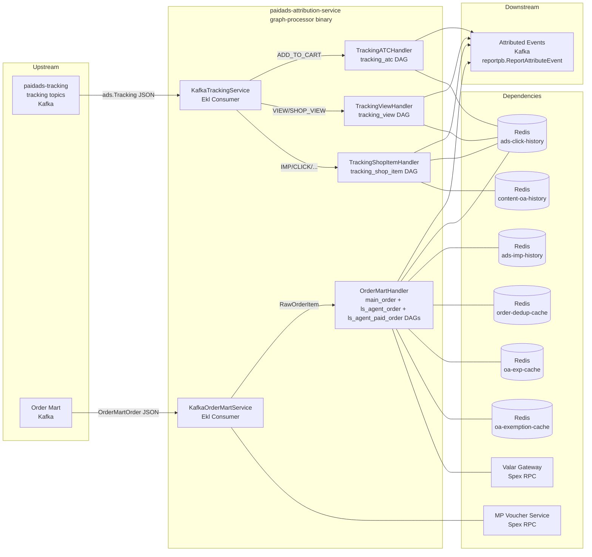

<!-- ads-workspace-gdoc-sync: gdoc_id=1o-puA9W1aDNHYfRBHI_8PYwK-U_oPg0mhHfr7EMcqck gdoc_url=https://docs.google.com/document/d/1o-puA9W1aDNHYfRBHI_8PYwK-U_oPg0mhHfr7EMcqck/edit -->

# paidads-attribution-service

> **Contributors**: fengjiao.wang ｜ **最后更新**：2026-05-27 ｜ [GitLab](https://git.garena.com/shopee/search_recommend/ai-copilot/ads-workspace/-/blob/master/docs/common/readme/paidads-attribution-service/README.md)

> **Language**: [English](README.md) | [中文](README.zh-CN.md)

**Repository:** https://git.garena.com/shopee/deep/paidads-attribution-service

---

## Table of Contents / 目录

1. [Introduction / 项目概述](#introduction--项目概述)
2. [Features / 核心功能](#features--核心功能)
3. [Relationship to Report-NG / 与 Report-NG 的关系](#relationship-to-report-ng--与-report-ng-的关系)
4. [DAG Attribution Flows / DAG 归因流程](#dag-attribution-flows--dag-归因流程)
   - [Order Attribution（main_order / ls_agent_order）](#order-attributionmain_order--ls_agent_order)
   - [ATC Attribution（tracking_atc）](#atc-attributiontracking_atc)
   - [View Attribution（tracking_view）](#view-attributiontracking_view)
   - [ShopItem Attribution（tracking_shop_item）](#shopitem-attributiontracking_shop_item)
5. [Operator Inventory / 算子清单](#operator-inventory--算子清单)
6. [Architecture / 项目架构](#architecture--项目架构)
   - [Service Topology / 上下游调用拓扑](#service-topology--上下游调用拓扑)
   - [Upstream, Downstream, and System Positioning / 上下游与系统定位](#upstream-downstream-and-system-positioning--上下游与系统定位)
   - [Main Message Processing Flow / 消息处理主链路](#main-message-processing-flow--消息处理主链路)
   - [Runtime Components and Dependencies / 运行时组件与依赖](#runtime-components-and-dependencies--运行时组件与依赖)
7. [Kafka and Event Contracts / Kafka 与事件契约](#kafka-and-event-contracts--kafka-与事件契约)
   - [Consumers and Input / Consumer 与输入](#consumers-and-input--consumer-与输入)
   - [Producers and Output / Producer 与输出](#producers-and-output--producer-与输出)
   - [EmitOptions Routing / EmitOptions 路由机制](#emitoptions-routing--emitoptions-路由机制)
8. [Directory Structure / 目录结构](#directory-structure--目录结构)
9. [Code Structure / 代码结构](#code-structure--代码结构)
   - [Layered Architecture / 分层架构](#layered-architecture--分层架构)
   - [DependencyRegistry Dependency Injection / DependencyRegistry 依赖注入](#dependencyregistry-dependency-injection--dependencyregistry-依赖注入)
   - [EventContext and Variable Passing / EventContext 与变量传递](#eventcontext-and-variable-passing--eventcontext-与变量传递)
10. [State Model and Redis / 状态模型与 Redis](#state-model-and-redis--状态模型与-redis)
11. [Configuration and Deployment / 配置与部署](#configuration-and-deployment--配置与部署)
    - [Local Config (config.yml) / 本地配置](#local-config-configyml--本地配置)
    - [Spex Dynamic Config (Regional + Global) / Spex 动态配置](#spex-dynamic-config-regional--global--spex-动态配置)
    - [graph-manager-conf DAG Config / graph-manager-conf DAG 配置](#graph-manager-conf-dag-config--graph-manager-conf-dag-配置)
    - [Build and Release / 构建与发布](#build-and-release--构建与发布)
12. [Monitoring and Metrics / 监控与指标](#monitoring-and-metrics--监控与指标)
    - [Prometheus Metrics / Prometheus 指标](#prometheus-metrics--prometheus-指标)
    - [Health Checks / 健康检查](#health-checks--健康检查)
13. [Development Guidelines / 开发规范](#development-guidelines--开发规范)
    - [How to Add New Operators / 新增 Operator](#how-to-add-new-operators--新增-operator)
    - [How to Add New DAGs / 新增 DAG](#how-to-add-new-dags--新增-dag)
    - [Testing and CI / 测试与 CI](#testing-and-ci--测试与-ci)
14. [Key Terms / 关键术语](#key-terms--关键术语)
15. [Additional Resources / 参考资料](#additional-resources--参考资料)
16. [Frequently Asked Questions / 常见问题](#frequently-asked-questions--常见问题)

---

## Introduction / 项目概述

`paidads-attribution-service` is a **Graph Engine**-based ads attribution service extracted from `paidads-report-ng` (RNG). It replaces the hardcoded order attribution (OA) pipelines in RNG with a fully configurable DAG-based architecture.

**Two Kafka input families:**

| Input | Proto Type | Handler |
|---|---|---|
| Tracking events | `ads.Tracking` (beeshop_ads.pb) | Dispatched by operation type to ATC / View / ShopItem DAGs |
| Order Mart events | `orderpb.OrderMartOrder` (paidads-report-proto) | Transformed to `RawOrderItem`, then run through main_order, ls_agent_order, and ls_agent_paid_order DAGs in parallel |

**Core responsibility:** Attribute these events and emit `reportpb.ReportAttributeEvent` messages to downstream Kafka topics.

**DAG topology is defined in [`graph-manager-conf`](https://git.garena.com/shopee/deep/searchads/graph-manager-conf)** — a separate YAML repository cloned at build time via `make dependency`. Changing the attribution pipeline topology (adding/removing/reordering operators) requires only a YAML change in `graph-manager-conf`, not a code change in this service.

**Technical Design:** Graph-based Attribution TD — https://docs.google.com/document/d/1jeBxO7jJHPAXiLnxFQ3A2Vbs4Z9J85p0Swiknngcwis/edit

**Graph Manager (real-time DAG visualization):**
- [main_order](https://graphmanager.shopee.io/?service=attribution&graph=main_order)
- [ls_agent_order](https://graphmanager.shopee.io/?service=attribution&graph=ls_agent_order)
- [ls_agent_paid_order](https://graphmanager.shopee.io/?service=attribution&graph=ls_agent_paid_order)
- [tracking_atc](https://graphmanager.shopee.io/?service=attribution&graph=tracking_atc)
- [tracking_view](https://graphmanager.shopee.io/?service=attribution&graph=tracking_view)
- [tracking_shop_item](https://graphmanager.shopee.io/?service=attribution&graph=tracking_shop_item)

---

## Features / 核心功能

`paidads-attribution-service` is built around five core capabilities:

**1. Graph Engine DAG-driven configurable attribution pipeline**

All attribution logic is expressed as directed acyclic graphs (DAGs) defined in YAML files in `graph-manager-conf`. Pipeline topology (operator order and connections) can be changed without code deployment by updating the YAML and rebuilding.

**2. Six DAGs covering all attribution scenarios**

| DAG | Input | Description |
|---|---|---|
| `tracking_atc` | Tracking ADD_TO_CART | ATC attribution with AdsData parsing and click history lookup |
| `tracking_view` | Tracking VIEW / SHOP_VIEW | View attribution for item and shop view events |
| `tracking_shop_item` | Tracking IMPRESSION / CLICK / SHOP_IMPRESSION / SHOP_CLICK | Shop item impression and click attribution (ads + organic history) |
| `main_order` | Order Mart | Main order attribution: click → imp → AdsInfo fallback chain |
| `ls_agent_order` | Order Mart (parallel) | Livestream agent order attribution |
| `ls_agent_paid_order` | Order Mart (parallel) | Livestream agent paid order attribution |

**3. Atomic operators and DependencyRegistry dependency injection**

Each operator (`pkg/operator/`) implements `IBaseOperator` and registers via `init()` → `engine.RegisterOpBuilder`. All shared clients (Redis history, rule engines, Kafka producers, Valar/MP voucher RPC) are centralized in `DependencyRegistry` and injected through `context.Context`.

**4. Rule engine gating (FilterEventOp + per-operator IsAvailable)**

`FilterEventOp` evaluates event-level filter rules; each operator's `IsAvailable` checks an `exec_rule_name` against `opExecRuleEngine`. Both rule engines are hot-reloadable via Spex. `FilterEventOp` returns `StopGraphProcessing` to halt a DAG without marking it as failed.

**5. EmitOptions country-based output routing**

`SendKafkaOp` resolves an `emit_option_name` to a producer and a per-country Kafka topic mapping. EmitOptions are defined in Spex global config and support a `DEFAULT` country fallback.

---

## Relationship to Report-NG / 与 Report-NG 的关系

`paidads-attribution-service` was created to replace the hardcoded OA pipelines inside `paidads-report-ng` (RNG).

**Problems with RNG's OA pipeline:**
- Fixed code topology: click OA → imp OA → no-imp OA, with parallel main OA and LS agent OA paths
- Any topology change required a code modification and redeployment
- Component on/off switches were scattered and hard to manage
- Poor readability — business logic mixed with infrastructure code

**How attribution-service solves these problems:**
- DAG topology is declared in YAML files in `graph-manager-conf` — configurable without code changes
- Operators are atomic, reusable, and independently rule-gated
- Graph Manager provides real-time visual inspection of any DAG's structure and configuration

**Responsibility split:**

| Responsibility | Service |
|---|---|
| click history writes | RNG (tracking handler) |
| imp history writes | RNG (tracking handler) |
| deduction/exemption metrics | RNG |
| content OA history writes | RNG |
| attribution logic (reading history, selecting best match, emitting attributed events) | **attribution-service** |
| order dedup cache | **attribution-service** |
| OA experiment / exemption evaluation | **attribution-service** |
| sell GMV cache writes | **attribution-service** |
| ROI3 Voucher logic | **attribution-service** |

---

## DAG Attribution Flows / DAG 归因流程

### Order Attribution（main_order / ls_agent_order）

**Input:** `orderpb.OrderMartOrder` → transformed to `types.RawOrderItem` by `KafkaOrderMartService`

**Order status derivation (in `KafkaOrderMartService.deriveOrderInfo`):**

| Condition | Derived Status | Event Timestamp |
|---|---|---|
| COD + ORDER_UNPAID + no shippingConfirmTs | PLACED | createTs |
| COD + ORDER_UNPAID + shippingConfirmTs > 0 | PAID | shippingConfirmTs |
| COD + ORDER_COMPLETED | COMPLETED | now() |
| Non-COD + ORDER_UNPAID + event_type="insert" | PLACED | createTs |
| Non-COD + ORDER_PAID | PAID | payTs |
| Non-COD + ORDER_COMPLETED | COMPLETED | now() |
| All others | UNKNOWN (dropped) | — |

**MP voucher enrichment:** Before passing to the handler, `KafkaOrderMartService` calls the MP Voucher Service (Spex RPC) to enrich each order item with voucher group and shop_id details from `voucher_mp_usage`.

**Order dedup:** `KafkaOrderMartService` computes a SHA-256 based unique_id (order_id + item_id + model_id + group_id + bundle_order_item_id + status) and checks it against `order-checksum` Redis. Duplicates are dropped.

**`main_order` DAG steps:**
1. `FilterEventOp` — filter using `filter_oa_order` rule; returns `StopGraphProcessing` if not applicable
2. Multiple `GenAttribKeyOp` nodes — generate attribution lookup keys (item click key, shop click key, shop ads click key) from event variable map
3. `FetchClickHistoryOp` — fetches click history for all generated keys from Redis; selects best match by sort config (priority ASC, timestamp DESC)
4. `FetchImpHistoryOp` — fetches impression history as fallback if no click history found
5. `QueryAdsInfoOp` — queries Valar Gateway (paidads_valar_gateway) for AdsInfo as final fallback when no history found
6. `TagNewOrderOp` — tags new order events with dedup logic using `order-dedup-cache`
7. `TagOAExemptionOp` — evaluates OA exemption rules using `oa-exemption-cache`
8. `TagOAExperimentOp` — evaluates OA experiment rules using `oa-exp-cache`
9. `ConvertOrderOp` — converts attributed order event context to `reportpb.ReportAttributeEvent`
10. `SendKafkaOp` — emits attributed event to downstream Kafka topic via EmitOptions routing

**`ls_agent_order` DAG:** Runs in parallel with `main_order` for the same `RawOrderItem`. Handles livestream agent order attribution.

**`ls_agent_paid_order` DAG:** Also runs concurrently in `OrderMartHandler.Process`, sharing an event context built from `RawOrderItem.Clone()`. It handles livestream agent paid order attribution. The current order-processing code registers `main_order`, `ls_agent_order`, and `ls_agent_paid_order`.

**Graph Manager:**
- [main_order](https://graphmanager.shopee.io/?service=attribution&graph=main_order)
- [ls_agent_order](https://graphmanager.shopee.io/?service=attribution&graph=ls_agent_order)
- [ls_agent_paid_order](https://graphmanager.shopee.io/?service=attribution&graph=ls_agent_paid_order)

---

### ATC Attribution（tracking_atc）

**Input:** `ads.Tracking` with `operation = ADD_TO_CART`

**Handler:** `TrackingATCHandler` — iterates over `tracking.GetItems()`, creates one `ATCEventContext` per item, runs the `tracking_atc` DAG sequentially.

**`tracking_atc` DAG steps:**
1. `FilterEventOp` — optional event filter
2. `WithAdsDataOp` — parse AdsData from tracking entity (referer, item json_data) and attach to event context
3. `GenAttribKeyOp` (×N) — generate click attribution keys
4. `FetchClickHistoryOp` — look up click history from Redis
5. `TagATCOp` — tag ATC event with attribution metadata
6. `ConvertATCOp` — convert to `reportpb.ReportAttributeEvent`; branches on `ATCType`:
   - `ATCType = 0`: no ads data or attribution — no event emitted
   - `ATC_DIRECT_WITHOUT_CLICK`: direct ATC (AdsData present, no click attribution) — calls `Tracking2Report + TrackingItem2Report + AdsData2Report`
   - `ATC_ADD_TO_CART` / `ATC_BROAD_ADD_TO_CART`: click-attributed ATC — calls `Tracking2Report + AttributedData2Report`
7. `SendKafkaOp` — emit to downstream Kafka

**Graph Manager:** [tracking_atc](https://graphmanager.shopee.io/?service=attribution&graph=tracking_atc)

---

### View Attribution（tracking_view）

**Input:** `ads.Tracking` with `operation = VIEW` or `SHOP_VIEW`

**Handler:** `TrackingViewHandler` — runs `tracking_view` DAG per tracking item.

**`tracking_view` DAG steps:**
1. `FilterEventOp` — event filter
2. `GenAttribKeyOp` (×N) — generate click attribution keys
3. `FetchClickHistoryOp` — look up click history
4. `ConvertViewOp` — convert to attributed view event; branches on operation type and AdsData presence:
   - `VIEW` + AdsData: direct PDP view (`handleAdsPdpView`) — uses `TrackingItem2Report + AdsData2Report`; also processes ROI3 vouchers via `ProcessTrackingVouchers` when `item.GetItemVoucher().GetBestVouchers()` is non-empty
   - `SHOP_VIEW` + AdsData: direct shop view (`handleAdsShopView`) — uses `TrackingShop2Report + AdsData2Report`
   - Otherwise: click-attributed view (`handleAttributedAdsView`) — uses `AttributedData2Report`
   - Sets `ViewType`: `VIEW_PDP_VIEW` (VIEW) or `VIEW_SHOP_VIEW` (SHOP_VIEW)
5. `SendKafkaOp` — emit to Kafka

**Graph Manager:** [tracking_view](https://graphmanager.shopee.io/?service=attribution&graph=tracking_view)

---

### ShopItem Attribution（tracking_shop_item）

**Input:** `ads.Tracking` with `operation = IMPRESSION`, `CLICK`, `SHOP_IMPRESSION`, or `SHOP_CLICK`

**Handler:** `TrackingShopItemHandler` — runs `tracking_shop_item` DAG per tracking item. This DAG requires both organic (org) and ads click history lookups.

**`tracking_shop_item` DAG steps:**
1. `FilterEventOp` — event filter
2. `WithAdsDataOp` — parse AdsData from tracking entity
3. `GenAttribKeyOp` (×N, both `ads` and `org` history sources) — generate attribution keys for both ads and organic click histories
4. `FetchClickHistoryOp` — look up both ads and org click histories
5. `FetchContentOAOp` — fetch content OA order history from `content-oa-history` Redis for livestream imp attribution
6. `ConvertShopItemOp` — convert to attributed shop item event; branches on tracking operation:
   - `SHOP_IMPRESSION` / `SHOP_CLICK`: direct shop item (`handleAdsShopItem`) — uses AdsData; sets `ATTRIB_NOT_REQUIRED` + `SCOPE_DIRECT`; `SHOP_IMPRESSION` sets `ShopItemImpression = shopItemCount`; `SHOP_CLICK` sets `ShopItemClick = 1` only when there is exactly 1 item and the click area is on the item area
   - `IMPRESSION` / `CLICK`: attributed shop item (`handleAttributedAdsShopItem`) — uses `AttributedData2Report`; scope defaults to `SCOPE_BROAD`, upgraded to `SCOPE_DIRECT` if the attributed click timestamp is within the last 1 day and the item belongs to the shop
7. `SendKafkaOp` — emit to Kafka

**Graph Manager:** [tracking_shop_item](https://graphmanager.shopee.io/?service=attribution&graph=tracking_shop_item)

---

## Operator Inventory / 算子清单

All operators are registered in `pkg/operator/` via `init()` → `engine.RegisterOpBuilder`. Each operator embeds `BaseOperator` which provides:
- `IsAvailable`: rule-engine gate (checks `exec_rule_name` against `opExecRuleEngine`; empty name = always available)
- `Execute`: calls `Run`, records op status counter and latency metrics
- `StopGraphProcessing`: sentinel error returned by `FilterEventOp` to halt DAG processing without marking as failure

| Operator | Purpose | Key Args |
|---|---|---|
| `FilterEventOp` | Evaluate event filter rule; stop graph if event does not match | `exec_rule_name`, `filter_rule_name` |
| `GenAttribKeyOp` | Generate attribution lookup key from template and event variable map | `exec_rule_name`, `history_source` (`ads`/`org`), `template`, `priority`, `last_n_day`, `is_direct` |
| `FetchClickHistoryOp` | Fetch click history from Redis (ads and/or org) by attribution keys; select best match by sort config | `exec_rule_name`, `sort_config` (fields, order) |
| `FetchImpHistoryOp` | Fetch impression history from Redis by attribution keys | `exec_rule_name`, `sort_config` |
| `FetchContentOAOp` | Fetch content OA order history from Redis cache | `exec_rule_name` |
| `WithAdsDataOp` | Parse AdsData from tracking entity (referer, item/shop json_data) and attach to event context | `exec_rule_name` |
| `QueryAdsInfoOp` | Query Valar Gateway for AdsInfo when click/imp history is missing | `exec_rule_name` |
| `TagATCOp` | Tag ATC event with attribution metadata | `exec_rule_name` |
| `TagNewCheckoutOp` | Tag new checkout order events | `exec_rule_name` |
| `TagNewOrderOp` | Tag new order events with dedup and status logic using `order-dedup-cache` | `exec_rule_name` |
| `TagOAExemptionOp` | Evaluate OA exemption rules and tag event using `oa-exemption-cache` | `exec_rule_name` |
| `TagOAExperimentOp` | Evaluate OA experiment rules and tag event using `oa-exp-cache` | `exec_rule_name` |
| `SetExemptionOrderMetricOp` | Record exemption order metric | `exec_rule_name` |
| `ConvertATCOp` | Convert attributed ATC event context to output event | `exec_rule_name` |
| `ConvertOrderOp` | Convert attributed order event context to output event | `exec_rule_name` |
| `ConvertViewOp` | Convert attributed view event context to output event | `exec_rule_name` |
| `ConvertShopItemOp` | Convert attributed shop item event context to output event | `exec_rule_name` |
| `SendKafkaOp` | Emit attributed event to downstream Kafka topic via EmitOptions routing | `exec_rule_name`, `emit_option_name` |

---

## Architecture / 项目架构

### Service Topology / 上下游调用拓扑



**Service topology table:**

| Direction | Name | Protocol | Description |
|---|---|---|---|
| Upstream | paidads-tracking (tracking topics) | Kafka | Tracking events (`ads.Tracking`), dispatched by operation type to tracking_atc / tracking_view / tracking_shop_item DAG |
| Upstream | Order Mart Kafka | Kafka | Order events (`orderpb.OrderMartOrder`), transformed to `RawOrderItem` then run through main_order, ls_agent_order, and ls_agent_paid_order DAGs in parallel |
| Downstream | Attributed events Kafka | Kafka | Attributed events (`reportpb.ReportAttributeEvent`), routed by country via `SendKafkaOp` + EmitOptions |
| Dependency | Redis — ads_click_history | Redis | Click history cache (`regional.ads-click-history`), read by `FetchClickHistoryOp` |
| Dependency | Redis — ads_imp_history | Redis | Impression history cache (`regional.ads-imp-history`), read by `FetchImpHistoryOp` |
| Dependency | Redis — content_oa_history | Redis | Content OA order history cache (`regional.content-oa-history`), read by `FetchContentOAOp` |
| Dependency | Redis — order_dedup_cache | Redis | Order dedup cache (`regional.order-dedup-cache`), read/written by `TagNewOrderOp` |
| Dependency | Redis — oa_exp_cache | Redis | OA experiment cache (`regional.oa-exp-cache`), read/written by `TagOAExperimentOp` |
| Dependency | Redis — oa_exemption_cache | Redis | OA exemption cache (`regional.oa-exemption-cache`), read/written by `TagOAExemptionOp` |
| Dependency | Valar Gateway (paidads-ads-info-gateway) | Spex RPC | Query AdsInfo (`paidads_valar_gateway`), used by `QueryAdsInfoOp` as no-click/no-imp fallback |
| Dependency | MP Voucher Service | Spex RPC | Query marketplace voucher details (`voucher_mp_usage`), used by `KafkaOrderMartService` to enrich order items |
| Dependency | graph-manager-conf | Repository | DAG topology definitions, cloned at build time via `make dependency` |
| Dependency | Spex Config | Service | Dynamic configuration (regional + global), hot-reloadable via listener pattern |

---

### Upstream, Downstream, and System Positioning / 上下游与系统定位

The service functions as a pure attribution processor sitting between two Kafka layers:
- **Upstream** (producers): `paidads-tracking` emits tracking events; Order Mart emits order lifecycle events
- **Downstream** (consumer): reporting pipeline consumes `reportpb.ReportAttributeEvent` from attributed event topics
- **External services**: Valar Gateway and MP Voucher Service are queried synchronously via Spex RPC during processing

The `graph-processor` binary is the single process handling both tracking and order Kafka streams.

---

### Main Message Processing Flow / 消息处理主链路

**Tracking flow:**
```
Kafka message
  → KafkaTrackingService.Transform (unmarshal ads.Tracking, validate userid > 0)
  → KafkaTrackingService.Process (dispatch by operation type)
    → TrackingATCHandler / TrackingViewHandler / TrackingShopItemHandler
      → iterate tracking.GetItems() → create EventContext per item
      → GraphEngine.Execute(ctx with EventContext + DependencyRegistry + graphName)
        → Operators execute in DAG order
          → SendKafkaOp emits to downstream Kafka
```

**Order Mart flow:**
```
Kafka message
  → KafkaOrderMartService.Transform
      (unmarshal OrderMartOrder
       → deriveOrderInfo → derive status + eventTs
       → getOrderVouchers → enrich with MP voucher details
       → build RawOrderItem with UniqueID)
  → checksum duplicate check (order-checksum Redis)
  → KafkaOrderMartService.Process
    → OrderMartHandler.Process
      → for each DAG (main_order, ls_agent_order, ls_agent_paid_order): goroutine
          → create OrderEventContext(rawOrderItem.Clone())
          → GraphEngine.Execute(ctx)
            → Operators execute in DAG order
              → SendKafkaOp emits to downstream Kafka
```

---

### Runtime Components and Dependencies / 运行时组件与依赖

`graph-manager-conf` is a **build-time** dependency — it is cloned via `make dependency` before compilation. The DAG YAML files are embedded into the binary at build time by the `graph-manager` library. It is **not** a runtime HTTP dependency.

Spex provides **runtime** dynamic configuration with hot-reload via `spex.WatchConfig` + listener pattern:
- `RegionalConfig`: consumer settings, history client configs, Redis cache configs
- `GlobalConfig`: rule engines (event filter, op exec, OA experiment, OA exemption), Kafka producers, EmitOptions

---

## Kafka and Event Contracts / Kafka 与事件契约

### Consumers and Input / Consumer 与输入

| Consumer | Config Key | Proto | Source Topic Config |
|---|---|---|---|
| `KafkaTrackingService` | `regional.tracking-consumer` | `ads.Tracking` (JSON) | Set in Spex regional config |
| `KafkaOrderMartService` | `regional.order-mart-consumer` | `orderpb.OrderMartOrder` (JSON) | Set in Spex regional config |

Both consumers use `enhanced-kafka-lib` (Ekl) with `BaseEKLSvc`. The `Transform` step is responsible for deserialization and basic validation; `Process` performs business logic.

### Producers and Output / Producer 与输出

Output producers are configured in Spex global config under `producers` (a map of producer name → `producer.Config`). Each producer is a Kafka producer client initialized at startup.

**Output proto:** `reportpb.ReportAttributeEvent` (from `paidads-report-proto`)

### EmitOptions Routing / EmitOptions 路由机制

`EmitOptions` maps a logical name (e.g., `atc_emit_option`) to:
- `producer_name` — which producer to use
- `partition_key` — key derivation from event variable map
- `topics` — a map of country code → Kafka topic (with a `DEFAULT` fallback)

`SendKafkaOp` resolves the emit option by name, reads the country from `EventContext.GetMetadata().Country`, and routes to the correct topic. EmitOptions are defined in Spex global config.

---

## Directory Structure / 目录结构

```
paidads-attribution-service/
├── cmd/
│   └── graph-processor/       # CLI binary entrypoint
│       ├── main.go            # App setup, config loading
│       └── run.go             # Service initialization, DependencyRegistry setup, consumer startup
├── config/                    # Environment config files (config.yml per env)
├── deploy/
│   └── graph_processor.json   # Mesos build and run descriptor
├── gen/                       # Generated proto stubs (sp-workspace.yml sources)
│   └── go/
│       ├── paidads_valar_gateway.pb/
│       └── voucher_mp_usage.pb/
├── handler/                   # Per-event-type DAG orchestration handlers
│   ├── order.go               # OrderMartHandler (parallel DAG execution)
│   ├── tracking_atc.go        # TrackingATCHandler
│   ├── tracking_shopitem.go   # TrackingShopItemHandler
│   └── tracking_view.go       # TrackingViewHandler
├── internal/
│   ├── graph/                 # DAG engine build, DependencyRegistry, context keys
│   │   ├── dependency.go      # DependencyRegistry struct with getters/setters
│   │   └── dependency_test.go
│   ├── kafka/                 # Kafka producer and EmitOptions management
│   └── spex/                  # Spex config binding (RegionalConfig, GlobalConfig)
│       └── business.go
├── pkg/
│   ├── attribution/           # Attribution key types, SortConfig
│   │   └── key.go
│   ├── convert/               # Event payload conversion utilities
│   ├── event/                 # EventContext interface and per-event-type implementations
│   │   ├── base.go            # EventContext interface, AttributedData, attrData2VarMap
│   │   ├── atc.go             # ATCEventContext
│   │   ├── order.go           # OrderEventContext
│   │   ├── shop_item.go       # ShopItemEventContext
│   │   └── view.go            # ViewEventContext
│   ├── exporter/              # Prometheus metrics (event-level counters)
│   ├── operator/              # All DAG operators
│   │   ├── base.go            # BaseOperator, IBaseOperator, StopGraphProcessing
│   │   ├── filter_event_op.go
│   │   ├── gen_attrib_key_op.go
│   │   ├── fetch_click_history_op.go
│   │   ├── fetch_imp_history_op.go
│   │   ├── fetch_content_oa_op.go
│   │   ├── with_adsdata_op.go
│   │   ├── query_adsinfo_op.go
│   │   ├── tag_*.go           # Tag operators
│   │   ├── convert_*.go       # Convert operators
│   │   ├── send_kafka_op.go
│   │   └── exporter.go        # Operator-level Prometheus metrics
│   ├── rpc/                   # Spex RPC client wrappers
│   │   # ValarSpexClient, MPVoucherSpexClient
│   └── types/                 # Shared types (RawOrderItem, TrackingEntity, OrderVoucher)
├── service/                   # Kafka consumer service adapters
│   ├── tracking.go            # KafkaTrackingService
│   └── order.go               # KafkaOrderMartService
├── util/                      # Utility helpers
├── go.mod
├── go.sum
├── Makefile
└── sp-workspace.yml           # Spex RPC code generation config
```

---

## Code Structure / 代码结构

### Layered Architecture / 分层架构

| Layer | Directories | Role |
|---|---|---|
| Entrypoint | `cmd/graph-processor` | CLI binary; starts consumers and DAG execution |
| Kafka consumer services | `service/` | Ekl-based Kafka consumer adapters; `Transform` (deserialize + validate) and `Process` (dispatch) |
| Handler DAG orchestration | `handler/` | Per-event-type handlers; create `EventContext`, inject dependencies into `context.Context`, call `GraphEngine.Execute` |
| DAG operators | `pkg/operator/` | Atomic DAG operators registered via `init()` + `RegisterOpBuilder` |
| Event context and types | `pkg/event/`, `pkg/types/`, `pkg/attribution/` | `EventContext` interface, `AttributedData`, attribution keys, sort config, raw event types |
| Conversion and export | `pkg/convert/`, `pkg/exporter/` | Event payload conversion; Prometheus metric export |
| Graph and dependency | `internal/graph/`, `internal/kafka/`, `internal/spex/` | DAG engine build from graph-manager-conf YAML; `DependencyRegistry`; Kafka producers/EmitOptions; Spex config hot-reload |
| RPC clients | `pkg/rpc/` | `ValarSpexClient` (AdsInfo), `MPVoucherSpexClient` (voucher enrichment) |
| Config and deploy | `config/`, `deploy/` | Local `config.yml` and Mesos `graph_processor.json` |

---

### DependencyRegistry Dependency Injection / DependencyRegistry 依赖注入

`graph.DependencyRegistry` (`internal/graph/dependency.go`) holds all shared middleware clients:

- Rule engines: `eventFilterRuleEngine`, `opExecRuleEngine`
- Click/imp/content OA history clients
- Order dedup cache, OA experiment/exemption caches
- OA experiment/exemption rulers (`composite_rule.Manager`)
- Kafka producers map and `EmitOptions`
- AdsInfo client (`ValarClient`)

At startup (`run.go`), each dependency is initialized from Spex config and injected into `DependencyRegistry`. Operators access dependencies at runtime by calling `graph.GetDependency(ctx)` → `.GetAdsClickHistory()`, etc.

**Hot-reload** is supported for most dependencies: `spex.RegisterRegionalConfigListener` and `spex.RegisterGlobalConfigListener` attach callbacks that reload rule engines, history clients, and rulers when Spex config updates.

---

### EventContext and Variable Passing / EventContext 与变量传递

`EventContext` (`pkg/event/base.go`) is the central interface for passing event data through the DAG:

```go
type EventContext interface {
    GetMetadata() EventMetadata          // UniqueID, Timestamp, Country, BuyerID, ItemID, ShopID, ModelID
    GetSourceEvent() any                 // Original proto event (ads.Tracking or OrderMartOrder)
    GetVarMap() map[string]any           // Rule engine variable map (merged from metadata + attributed data)
    GetAttributedData() AttributedData   // ClickHistory, ImpHistory, AdsInfo, AdsData, ContentOA, flags
    UpdateAttributedData(fn) error       // Atomic update to attributed data (triggers VarMap refresh)
    String() string
}
```

`attrData2VarMap` maps attributed data to rule engine variables:
- `attrib_adsid`, `attrib_campaignid`, `attrib_placement`, `attrib_itemid`, `event_attributed`
- Source priority: `AdsData` > `ClickHistory` > `ImpHistory` > `AdsInfo`

Concrete implementations: `ATCEventContext`, `ViewEventContext`, `ShopItemEventContext`, `OrderEventContext`

---

## State Model and Redis / 状态模型与 Redis

| Redis Cache | Config Block | Used By | Read/Write |
|---|---|---|---|
| `ads-click-history` | `regional.ads-click-history` | `FetchClickHistoryOp` | Read only (written by RNG) |
| `org-click-history` | `regional.org-click-history` | `FetchClickHistoryOp` (org source) | Read only (written by RNG) |
| `ads-imp-history` | `regional.ads-imp-history` | `FetchImpHistoryOp` | Read only (written by RNG) |
| `content-oa-history` | `regional.content-oa-history` | `FetchContentOAOp` | Read only (written by RNG) |
| `order-dedup-cache` | `regional.order-dedup-cache` | `TagNewOrderOp` | Read + Write |
| `oa-exp-cache` | `regional.oa-exp-cache` | `TagOAExperimentOp` | Read + Write |
| `oa-exemption-cache` | `regional.oa-exemption-cache` | `TagOAExemptionOp` | Read + Write |

> **Note:** The click/imp/content OA history caches are written by RNG's tracking handlers. `attribution-service` only reads them for attribution lookups.

The `order-checksum` (`regional.order-checksum`) is maintained by `KafkaOrderMartService` directly (not via an operator) for upstream dedup before the order enters any DAG.

---

## Configuration and Deployment / 配置与部署

### Local Config (config.yml) / 本地配置

`config/config.go` parses a local `config.yml` (copied from `config/files/${env}.yml` at build time):

```yaml
spex:
  tag: <spex_tag>        # Spex service tag (can be overridden via --spex-tag CLI flag)
  # ... other Spex connection settings
```

### Spex Dynamic Config (Regional + Global) / Spex 动态配置

All business configuration is managed through Spex with two config objects:

**RegionalConfig** (`spex.RegionalConfigKey = "regional"`):
```
order-mart-consumer    — Ekl consumer config for Order Mart
tracking-consumer      — Ekl consumer config for tracking
order-checksum         — Order checksum Redis config
ads-click-history      — Ads click history Redis config
org-click-history      — Org click history Redis config
ads-imp-history        — Impression history manager config
content-oa-history     — Content OA Redis cache config
order-dedup-cache      — Order dedup Redis config
oa-exp-cache           — OA experiment Redis cache config
oa-exemption-cache     — OA exemption Redis config
```

**GlobalConfig** (`spex.GlobalConfigKey = "global"`):
```
event-filter-rule-map  — Event filter rule engine rules
op-exec-rule-map       — Operator execution rule engine rules
oa-exp-ruler           — OA experiment composite rule config
oa-exemption-ruler     — OA exemption composite rule config
producers              — Kafka producer name → config map
emit-options           — Logical name → EmitOptionConfig map (producer, partition key, country topics)
```

Both configs support **hot-reload** via `spex.WatchConfig` + registered listeners.

### graph-manager-conf DAG Config / graph-manager-conf DAG 配置

DAG topology is defined in YAML files inside [`graph-manager-conf`](https://git.garena.com/shopee/deep/searchads/graph-manager-conf) under `attribution/`:

```
attribution/
├── main_order.yaml
├── ls_agent_order.yaml
├── ls_agent_paid_order.yaml
├── tracking_atc.yaml
├── tracking_view.yaml
└── tracking_shop_item.yaml
```

Each YAML declares the `dag` list: node name, operator type (`op`), args, inputs, and outputs. The `config_branch` variable in `Makefile` (default: `"master"`) controls which branch is used.

### Build and Release / 构建与发布

```bash
# Install/update DAG config dependency
make dependency

# Build binary (also runs make dependency)
make graph-processor

# Run locally
./bin/graph-processor -c config.yml --debug --stdout

# Mesos deployment builds via deploy/graph_processor.json:
# 1. cp config/files/${env}.yml config.yml
# 2. make build
# Binary: bin/graph-processor.linux
# Run: bin/graph-processor.linux -c config.yml --log-prefix '' --metric ${PORT_metric}
```

**SPEX release:** Update config in the Spex control plane and trigger a rolling restart or hot-reload via the listener pattern (no new binary deployment required for pure config changes).

---

## Monitoring and Metrics / 监控与指标

### Prometheus Metrics / Prometheus 指标

All metrics use the namespace `paidads_attribution`.

**Operator-level metrics** (subsystem: `graph_operator`):

| Metric | Type | Labels | Description |
|---|---|---|---|
| `paidads_attribution_graph_operator_status` | Counter | `cid`, `graph_name`, `op_name`, `stage`, `status`, `node_name` | Operator execution status (success/error) per stage (is_available / run) |
| `paidads_attribution_graph_operator_latency` | Histogram | `cid`, `graph_name`, `op_name`, `stage`, `node_name` | Operator execution latency (ms); buckets: 1, 5, 10, 25, 50, 100, 250, 500, 1000, 2000 |

**Event-level metrics** (in `pkg/exporter/`):

| Metric | Description |
|---|---|
| `paidads_attribution_attribute_event_type_counter` | Count of attributed events emitted by type |
| `paidads_attribution_invalid_tracking_counter` | Count of invalid tracking events (e.g., anonymous users) |
| `paidads_attribution_order_mart_derived_status_counter` | Count of orders by derived status and event type |
| `paidads_attribution_invalid_adsinfo_counter` | Count of AdsInfo query failures |

### Health Checks / 健康检查

The `graph-processor` binary exposes HTTP health check endpoints on the `--metric` port (configured via `${PORT_metric}` in Mesos):

| Endpoint | Type | Description |
|---|---|---|
| `/smoketest` | HTTP | Smoke test — used by Mesos for readiness check (timeout: 5s, retry: 10) |
| `/check` | HTTP | Health check — used by Mesos for liveness check (timeout: 5s, retry: 10) |

---

## Development Guidelines / 开发规范

### How to Add New Operators / 新增 Operator

1. Create a new file in `pkg/operator/` (e.g., `my_new_op.go`)
2. Define the operator struct embedding `BaseOperator`
3. Register via `init()` → `engine.RegisterOpBuilder("MyNewOp", func(conf *engine.NodeConf) (engine.IOperator, error) { ... })`
4. Implement the `Run(ctx, inputs, outputs)` method with business logic
5. Add a node referencing `MyNewOp` in the relevant `graph-manager-conf/attribution/*.yaml` and submit a MR to graph-manager-conf

```go
type MyNewOp struct {
    BaseOperator
    myArg string
}

func init() {
    engine.RegisterOpBuilder("MyNewOp", func(conf *engine.NodeConf) (engine.IOperator, error) {
        op := &MyNewOp{
            BaseOperator: NewBaseOperator("MyNewOp", conf.Name, conf.Args["exec_rule_name"].(string)),
            myArg:        conf.Args["my_arg"].(string),
        }
        op.Self = op
        return op, nil
    })
}

func (op *MyNewOp) Run(ctx engine.GraphEngineCtx, inputs, outputs []*engine.NodeData) error {
    // ... business logic
    return nil
}
```

### How to Add New DAGs / 新增 DAG

1. Create a YAML file in `graph-manager-conf/attribution/<new_dag>.yaml` defining the node list
2. In the relevant `handler/*.go`, add the new DAG name to the handler's DAG list (or create a new handler)
3. In `cmd/graph-processor/run.go`, create the handler and wire it to a new or existing Kafka service
4. Rebuild: `make dependency && make graph-processor`

### Testing and CI / 测试与 CI

```bash
make test          # Run all unit tests with coverage
make test-nv       # Run tests (non-verbose) with coverage
make lint-fix      # Run golangci-lint with revive + gci (auto-fix)
make gci           # Fix import order
make fmt           # Run go fmt
make ci            # Full local CI: gci + lint-fix + nilaway + ci-vet + fmt + test + build
make ci-remote     # GitLab CI: ci-vet + fmt + test + build
make coverage      # Generate coverage report (coverage.out + coverage.xml)
```

**utgen** — AI-powered unit test generator:
```bash
# Install from: https://git.garena.com/shopee/deep/intelligent_unit_test/-/releases
# Create a .env file with Compass credentials (see Makefile for format)
make utgen         # Generate tests for code changed since master
```

---

## Key Terms / 关键术语

| Term | Description |
|---|---|
| Graph Engine | The DAG execution engine (`searchads/graph-engine`) that runs operator nodes in declared dependency order |
| graph-manager-conf | The YAML repository defining DAG topologies for all attribution DAGs |
| DAG | Directed Acyclic Graph; the configurable attribution pipeline |
| Operator | An atomic, reusable unit of business logic within a DAG (implements `IBaseOperator`) |
| attribution | The process of associating an ad event (click, impression, order) with a specific ad |
| OA | Order Attribution — determining which ad click/impression is responsible for an order |
| click history | Per-buyer Redis cache recording recent ad clicks, keyed by attribution key string |
| impression history | Per-buyer Redis cache recording recent ad impressions |
| content OA | Content (livestream) Order Attribution — attributing orders to livestream ad impressions |
| order mart | The Shopee internal order event stream providing order lifecycle events |
| Ekl | `enhanced-kafka-lib` — the Shopee Kafka consumer library with built-in Smq/transformation pipeline |
| Valar | The Shopee ads data service; queried via `paidads_valar_gateway` for AdsInfo |
| AdsInfo | Ad metadata (ads_id, campaign_id, placement, item_id) returned by Valar Gateway |
| report attribute event | The output event type (`reportpb.ReportAttributeEvent`) emitted to downstream Kafka |
| ReportAttributeEvent | Proto message type for attributed ad events |
| unified order event | A normalized order event; produced from OrderMartOrder after status derivation |
| sell GMV cache | Cache storing sell GMV data managed by attribution-service |
| ROI3 Voucher | Voucher attribution logic for ROI3 (Return on Investment tier 3) scenarios |
| LS Agent OA | Livestream Agent Order Attribution — attribution for orders via livestream agent links |
| OA experiment | A/B experiment framework for order attribution logic variations |
| OA exemption | Rules that exempt certain orders from standard OA logic |
| DependencyRegistry | The central dependency container holding all middleware clients, passed to operators via context |
| eCPM | Effective Cost Per Mille |
| SPEX | Shopee's configuration and service management platform; used for runtime config and Spex RPC |

---

## Additional Resources / 参考资料

| Resource | Link |
|---|---|
| Repository | https://git.garena.com/shopee/deep/paidads-attribution-service |
| graph-manager-conf | https://git.garena.com/shopee/deep/searchads/graph-manager-conf |
| Graph Manager (main_order) | https://graphmanager.shopee.io/?service=attribution&graph=main_order |
| Graph Manager (ls_agent_order) | https://graphmanager.shopee.io/?service=attribution&graph=ls_agent_order |
| Graph Manager (ls_agent_paid_order) | https://graphmanager.shopee.io/?service=attribution&graph=ls_agent_paid_order |
| Graph Manager (tracking_atc) | https://graphmanager.shopee.io/?service=attribution&graph=tracking_atc |
| Graph Manager (tracking_view) | https://graphmanager.shopee.io/?service=attribution&graph=tracking_view |
| Graph Manager (tracking_shop_item) | https://graphmanager.shopee.io/?service=attribution&graph=tracking_shop_item |
| graph-engine library | `git.garena.com/shopee/deep/searchads/graph-engine` |
| paidads-report-proto | https://git.garena.com/shopee/deep/paidads-report-proto |
| Graph-based Attribution TD | https://docs.google.com/document/d/1jeBxO7jJHPAXiLnxFQ3A2Vbs4Z9J85p0Swiknngcwis/edit |
| graph-manager-conf How-to | https://git.garena.com/shopee/deep/searchads/graph-manager/-/wikis/How-to-define-graph-conf |
| utgen (unit test generator) | https://git.garena.com/shopee/deep/intelligent_unit_test/-/releases |
| Paid Ads Glossary (Confluence) | https://confluence.shopee.io/pages/viewpage.action?spaceKey=SPAD&title=Paid+Ads+Glossary |

---

## Frequently Asked Questions / 常见问题

**Why was attribution logic extracted from RNG into its own service?**
RNG's OA pipeline has a hardcoded topology (click OA → imp OA → no-imp OA), making any topology change require code modification and redeployment. Component switches are scattered and the logic is difficult to read. `attribution-service` solves this by expressing the same flows as configurable DAGs in `graph-manager-conf`.

**Can I change the DAG topology without deploying new code?**
For topology changes (adding/removing/reordering existing operator types) — yes, change the YAML in `graph-manager-conf` and rebuild the service with `make dependency && make graph-processor`. For adding a new operator type — no, that requires a code change in `pkg/operator/`.

**What does attribution-service own vs. RNG?**
attribution-service: attribution logic, attributed event emission, order dedup, OA experiment/exemption evaluation, sell GMV cache, ROI3 Voucher logic. RNG: click/imp history writes, content OA history writes, deduction/exemption metrics.

**Who writes click/imp history to Redis?**
RNG's tracking handler (click_history and imp_history pipes). `attribution-service` only reads these caches for attribution lookups.

**How do I run the service locally?**
```bash
make dependency        # Clone/update graph-manager-conf
make graph-processor   # Build the binary
./bin/graph-processor -c config.yml --debug --stdout
```

**How is order status derived from OrderMartOrder?**
`KafkaOrderMartService.deriveOrderInfo` checks `isCOD`, `beStatus`, `shippingConfirmTs`, `payTs`, and `eventType` to produce `PLACED`, `PAID`, `COMPLETED`, or `UNKNOWN`. `UNKNOWN` orders are dropped. `PLACED` requires `event_type = "insert"` to prevent duplicate processing.

**Does `FilterEventOp` returning `StopGraphProcessing` mean an error?**
No. The service layer checks `errors.Is(execErr, operator.StopGraphProcessing)` and treats it as a normal early-exit (logs at Info level, does not propagate as an error). This allows `FilterEventOp` to cleanly halt a DAG without triggering error metrics.

**How do I inspect the current DAG topology?**
Visit [Graph Manager](https://graphmanager.shopee.io/?service=attribution&graph=main_order) and select the service `attribution` and the desired graph name.

**How are attributed events routed to the correct Kafka topic per country?**
`SendKafkaOp` reads `emit_option_name` from its YAML config, looks up the `EmitOption` in `DependencyRegistry`, gets the country from `EventContext.GetMetadata().Country`, and calls `EmitOption.GetTopic(country)` — which checks the country key first, then falls back to `DEFAULT`.

**What happens if the Valar Gateway is unavailable?**
`QueryAdsInfoOp` is a fallback operator invoked only when no click or impression history is found. If it fails, an error is returned from the operator and the DAG records an error status, but the order is not dropped (the error is logged and the pipeline moves on based on DAG `allow_error` configuration).

<!-- Generated by ads-workspace/skills/ads-readme-generate | checked: 1db73b4a6175b1531b676f12f3e175d897e72faa -->
