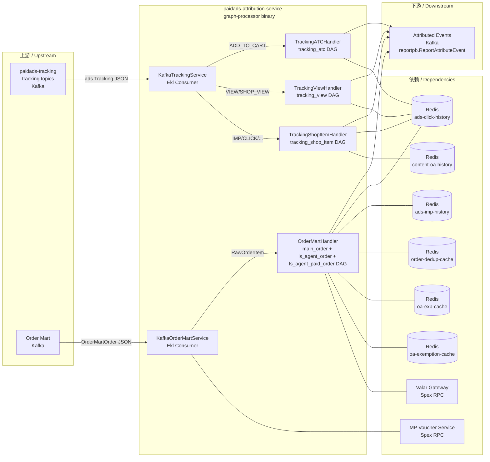

<!-- ads-workspace-gdoc-sync: gdoc_id=1T3F8SFdvOCuDKkg7tF2gI0DS4YLN5Z4ox5IIIDpuZuE gdoc_url=https://docs.google.com/document/d/1T3F8SFdvOCuDKkg7tF2gI0DS4YLN5Z4ox5IIIDpuZuE/edit -->

# paidads-attribution-service

> **Contributors**: fengjiao.wang ｜ **最后更新**：2026-05-27 ｜ [GitLab](https://git.garena.com/shopee/search_recommend/ai-copilot/ads-workspace/-/blob/master/docs/common/readme/paidads-attribution-service/README.zh-CN.md)

> **Language**: [English](README.md) | [中文](README.zh-CN.md)

**仓库地址：** https://git.garena.com/shopee/deep/paidads-attribution-service

---

## 目录 / Table of Contents

- [paidads-attribution-service](#paidads-attribution-service)
  - [目录 / Table of Contents](#目录--table-of-contents)
  - [项目概述 / Introduction](#项目概述--introduction)
  - [核心功能 / Features](#核心功能--features)
  - [与 Report-NG 的关系 / Relationship to Report-NG](#与-report-ng-的关系--relationship-to-report-ng)
  - [DAG 归因流程 / DAG Attribution Flows](#dag-归因流程--dag-attribution-flows)
    - [Order Attribution（main\_order / ls\_agent\_order）](#order-attributionmain_order--ls_agent_order)
    - [ATC Attribution（tracking\_atc）](#atc-attributiontracking_atc)
    - [View Attribution（tracking\_view）](#view-attributiontracking_view)
    - [ShopItem Attribution（tracking\_shop\_item）](#shopitem-attributiontracking_shop_item)
  - [算子清单 / Operator Inventory](#算子清单--operator-inventory)
  - [项目架构 / Architecture](#项目架构--architecture)
    - [上下游调用拓扑 / Service Topology](#上下游调用拓扑--service-topology)
    - [上下游与系统定位 / Upstream, Downstream, and System Positioning](#上下游与系统定位--upstream-downstream-and-system-positioning)
    - [消息处理主链路 / Main Message Processing Flow](#消息处理主链路--main-message-processing-flow)
    - [运行时组件与依赖 / Runtime Components and Dependencies](#运行时组件与依赖--runtime-components-and-dependencies)
  - [Kafka 与事件契约 / Kafka and Event Contracts](#kafka-与事件契约--kafka-and-event-contracts)
    - [Consumer 与输入 / Consumers and Input](#consumer-与输入--consumers-and-input)
    - [Producer 与输出 / Producers and Output](#producer-与输出--producers-and-output)
    - [EmitOptions 路由机制 / EmitOptions Routing](#emitoptions-路由机制--emitoptions-routing)
  - [目录结构 / Directory Structure](#目录结构--directory-structure)
  - [代码结构 / Code Structure](#代码结构--code-structure)
    - [分层架构 / Layered Architecture](#分层架构--layered-architecture)
    - [DependencyRegistry 依赖注入 / DependencyRegistry Dependency Injection](#dependencyregistry-依赖注入--dependencyregistry-dependency-injection)
    - [EventContext 与变量传递 / EventContext and Variable Passing](#eventcontext-与变量传递--eventcontext-and-variable-passing)
  - [状态模型与 Redis / State Model and Redis](#状态模型与-redis--state-model-and-redis)
  - [配置与部署 / Configuration and Deployment](#配置与部署--configuration-and-deployment)
    - [本地配置 / Local Config (config.yml)](#本地配置--local-config-configyml)
    - [Spex 动态配置 / Spex Dynamic Config (Regional + Global)](#spex-动态配置--spex-dynamic-config-regional--global)
    - [graph-manager-conf DAG 配置 / graph-manager-conf DAG Config](#graph-manager-conf-dag-配置--graph-manager-conf-dag-config)
    - [构建与发布 / Build and Release](#构建与发布--build-and-release)
  - [监控与指标 / Monitoring and Metrics](#监控与指标--monitoring-and-metrics)
    - [Prometheus 指标 / Prometheus Metrics](#prometheus-指标--prometheus-metrics)
    - [健康检查 / Health Checks](#健康检查--health-checks)
  - [开发规范 / Development Guidelines](#开发规范--development-guidelines)
    - [新增 Operator / How to Add New Operators](#新增-operator--how-to-add-new-operators)
    - [新增 DAG / How to Add New DAGs](#新增-dag--how-to-add-new-dags)
    - [测试与 CI / Testing and CI](#测试与-ci--testing-and-ci)
  - [关键术语 / Key Terms](#关键术语--key-terms)
  - [参考资料 / Additional Resources](#参考资料--additional-resources)
  - [常见问题 / Frequently Asked Questions](#常见问题--frequently-asked-questions)

---

## 项目概述 / Introduction

`paidads-attribution-service` 是基于 **Graph Engine** 的广告归因服务，从 `paidads-report-ng`（RNG）中提取而来，以可配置 DAG 架构替代 RNG 中的硬编码 OA（Order Attribution）流水线。

**两个 Kafka 输入来源：**

| 输入 | Proto 类型 | Handler |
|---|---|---|
| Tracking 事件 | `ads.Tracking`（beeshop_ads.pb） | 按 operation type 分发至 ATC / View / ShopItem DAG |
| Order Mart 事件 | `orderpb.OrderMartOrder`（paidads-report-proto） | 转换为 `RawOrderItem` 后并行执行 main_order、ls_agent_order 和 ls_agent_paid_order DAG |

**核心职责：** 对上述事件进行归因，并将 `reportpb.ReportAttributeEvent` 发送至下游 Kafka topic。

**DAG 拓扑定义在 [`graph-manager-conf`](https://git.garena.com/shopee/deep/searchads/graph-manager-conf)** —— 一个独立的 YAML 配置仓库，在构建时通过 `make dependency` 克隆。修改归因流水线拓扑（添加/移除/重排算子）只需修改 `graph-manager-conf` 中的 YAML，无需改动本服务代码。

**技术设计文档：** Graph-based Attribution TD —— https://docs.google.com/document/d/1jeBxO7jJHPAXiLnxFQ3A2Vbs4Z9J85p0Swiknngcwis/edit

**Graph Manager（实时 DAG 可视化）：**
- [main_order](https://graphmanager.shopee.io/?service=attribution&graph=main_order)
- [ls_agent_order](https://graphmanager.shopee.io/?service=attribution&graph=ls_agent_order)
- [ls_agent_paid_order](https://graphmanager.shopee.io/?service=attribution&graph=ls_agent_paid_order)
- [tracking_atc](https://graphmanager.shopee.io/?service=attribution&graph=tracking_atc)
- [tracking_view](https://graphmanager.shopee.io/?service=attribution&graph=tracking_view)
- [tracking_shop_item](https://graphmanager.shopee.io/?service=attribution&graph=tracking_shop_item)

---

## 核心功能 / Features

`paidads-attribution-service` 围绕五项核心能力构建：

**1. Graph Engine DAG 驱动的可配置归因流水线**

所有归因逻辑以有向无环图（DAG）形式表达，DAG 定义在 `graph-manager-conf` 的 YAML 文件中。通过修改 YAML 并重新构建即可调整流水线拓扑（算子顺序和连接关系），无需部署新代码。

**2. 覆盖所有归因场景的 6 个 DAG**

| DAG | 输入 | 描述 |
|---|---|---|
| `tracking_atc` | Tracking ADD_TO_CART | ATC 归因，含 AdsData 解析和 click history 查找 |
| `tracking_view` | Tracking VIEW / SHOP_VIEW | item 和 shop 浏览事件的 view 归因 |
| `tracking_shop_item` | Tracking IMPRESSION / CLICK / SHOP_IMPRESSION / SHOP_CLICK | shop item 曝光和点击归因（ads + organic 两路 history） |
| `main_order` | Order Mart | 主订单归因：click → imp → AdsInfo fallback 链路 |
| `ls_agent_order` | Order Mart（并行） | 直播 agent 订单归因 |
| `ls_agent_paid_order` | Order Mart（并行） | 直播 agent paid 订单归因 |

**3. 原子化算子与 DependencyRegistry 依赖注入**

每个算子（`pkg/operator/`）实现 `IBaseOperator`，通过 `init()` → `engine.RegisterOpBuilder` 注册。所有共享客户端（Redis history、规则引擎、Kafka producer、Valar/MP voucher RPC）统一在 `DependencyRegistry` 中管理，通过 `context.Context` 注入。

**4. 规则引擎门控（FilterEventOp + per-operator IsAvailable）**

`FilterEventOp` 在事件级别评估过滤规则；每个算子的 `IsAvailable` 检查 `exec_rule_name` 是否满足 `opExecRuleEngine`。两个规则引擎均可通过 Spex 热更新。`FilterEventOp` 返回 `StopGraphProcessing` 可终止 DAG 而不触发错误标记。

**5. EmitOptions 按国家路由输出**

`SendKafkaOp` 将 `emit_option_name` 解析为 producer 和按国家映射的 Kafka topic。EmitOptions 在 Spex global config 中定义，支持 `DEFAULT` 国家兜底。

---

## 与 Report-NG 的关系 / Relationship to Report-NG

`paidads-attribution-service` 的创建目的是替换 `paidads-report-ng`（RNG）内部硬编码的 OA 流水线。

**RNG OA 流水线的问题：**
- 固定代码拓扑：click OA → imp OA → no-imp OA，同时有并行的 main OA 和 LS agent OA 分支
- 任何拓扑调整都需要改代码并重新发布
- 组件开关分散，难以管理
- 可读性差——业务逻辑与基础设施代码混杂

**attribution-service 的解决方案：**
- DAG 拓扑在 `graph-manager-conf` 的 YAML 文件中声明，无需改代码即可调整
- 算子原子化、可复用，支持独立的规则门控
- Graph Manager 提供任意 DAG 结构和配置的实时可视化

**职责划分：**

| 职责 | 服务 |
|---|---|
| click history 写入 | RNG（tracking handler） |
| imp history 写入 | RNG（tracking handler） |
| deduction/exemption 指标 | RNG |
| content OA history 写入 | RNG |
| 归因逻辑（读取 history、选择最佳匹配、发送 attributed events） | **attribution-service** |
| order dedup cache | **attribution-service** |
| OA experiment / exemption 评估 | **attribution-service** |
| sell GMV cache 写入 | **attribution-service** |
| ROI3 Voucher 逻辑 | **attribution-service** |

---

## DAG 归因流程 / DAG Attribution Flows

### Order Attribution（main_order / ls_agent_order）

**输入：** `orderpb.OrderMartOrder` → 由 `KafkaOrderMartService` 转换为 `types.RawOrderItem`

**订单状态推导（`KafkaOrderMartService.deriveOrderInfo`）：**

| 条件 | 推导状态 | 事件时间戳 |
|---|---|---|
| COD + ORDER_UNPAID + 无 shippingConfirmTs | PLACED | createTs |
| COD + ORDER_UNPAID + shippingConfirmTs > 0 | PAID | shippingConfirmTs |
| COD + ORDER_COMPLETED | COMPLETED | now() |
| 非 COD + ORDER_UNPAID + event_type="insert" | PLACED | createTs |
| 非 COD + ORDER_PAID | PAID | payTs |
| 非 COD + ORDER_COMPLETED | COMPLETED | now() |
| 其他 | UNKNOWN（丢弃） | — |

**MP Voucher enrichment：** 在传给 handler 之前，`KafkaOrderMartService` 调用 MP Voucher Service（Spex RPC），从 `voucher_mp_usage` 获取每个订单的 voucher 分组和 shop_id 详情，对订单数据进行补充。

**Order dedup：** `KafkaOrderMartService` 基于 order_id + item_id + model_id + group_id + bundle_order_item_id + status 计算 SHA-256 unique_id，并对照 `order-checksum` Redis 检查是否重复。重复订单直接丢弃。

**`main_order` DAG 执行步骤：**
1. `FilterEventOp` —— 使用 `filter_oa_order` 规则过滤；若不满足条件则返回 `StopGraphProcessing`
2. 多个 `GenAttribKeyOp` 节点 —— 从事件变量 map 生成归因 lookup key（item click key、shop click key、shop ads click key）
3. `FetchClickHistoryOp` —— 从 Redis 获取所有 key 的 click history；按 sort config（priority ASC，timestamp DESC）选择最佳匹配
4. `FetchImpHistoryOp` —— 若未找到 click history，则获取 impression history 作为 fallback
5. `QueryAdsInfoOp` —— 若仍无 history，则查询 Valar Gateway（paidads_valar_gateway）获取 AdsInfo 作为最终 fallback
6. `TagNewOrderOp` —— 使用 `order-dedup-cache` 对新订单事件打标
7. `TagOAExemptionOp` —— 使用 `oa-exemption-cache` 评估 OA exemption 规则并打标
8. `TagOAExperimentOp` —— 使用 `oa-exp-cache` 评估 OA experiment 规则并打标
9. `ConvertOrderOp` —— 将归因后的 order event context 转换为 `reportpb.ReportAttributeEvent`
10. `SendKafkaOp` —— 通过 EmitOptions 路由将归因事件发送至下游 Kafka topic

**`ls_agent_order` DAG：** 与 `main_order` 并行执行，共享同一个 `RawOrderItem` 的克隆，负责直播 agent 订单归因。

**`ls_agent_paid_order` DAG：** 同样由 `OrderMartHandler.Process` 并发执行，共享 `RawOrderItem.Clone()` 后的事件上下文，负责直播 agent paid 订单归因。当前 order 处理代码注册的 DAG 列表为 `main_order`、`ls_agent_order`、`ls_agent_paid_order`。

**Graph Manager：**
- [main_order](https://graphmanager.shopee.io/?service=attribution&graph=main_order)
- [ls_agent_order](https://graphmanager.shopee.io/?service=attribution&graph=ls_agent_order)
- [ls_agent_paid_order](https://graphmanager.shopee.io/?service=attribution&graph=ls_agent_paid_order)

---

### ATC Attribution（tracking_atc）

**输入：** `ads.Tracking`，operation = `ADD_TO_CART`

**Handler：** `TrackingATCHandler` —— 遍历 `tracking.GetItems()`，为每个 item 创建一个 `ATCEventContext`，顺序执行 `tracking_atc` DAG。

**`tracking_atc` DAG 执行步骤：**
1. `FilterEventOp` —— 可选事件过滤
2. `WithAdsDataOp` —— 从 tracking entity（referer、item json_data）解析 AdsData 并附加到 event context
3. `GenAttribKeyOp`（×N） —— 生成 click attribution key
4. `FetchClickHistoryOp` —— 从 Redis 查找 click history
5. `TagATCOp` —— 对 ATC 事件打上归因元数据
6. `ConvertATCOp` —— 转换为 `reportpb.ReportAttributeEvent`；按 `ATCType` 分支处理：
   - `ATCType = 0`：无广告数据或归因 —— 不产出事件
   - `ATC_DIRECT_WITHOUT_CLICK`：直接 ATC（有 AdsData，无 click 归因）—— 调用 `Tracking2Report + TrackingItem2Report + AdsData2Report`
   - `ATC_ADD_TO_CART` / `ATC_BROAD_ADD_TO_CART`：click 归因 ATC —— 调用 `Tracking2Report + AttributedData2Report`
7. `SendKafkaOp` —— 发送至下游 Kafka

**Graph Manager：** [tracking_atc](https://graphmanager.shopee.io/?service=attribution&graph=tracking_atc)

---

### View Attribution（tracking_view）

**输入：** `ads.Tracking`，operation = `VIEW` 或 `SHOP_VIEW`

**Handler：** `TrackingViewHandler` —— 对每个 tracking item 执行 `tracking_view` DAG。

**`tracking_view` DAG 执行步骤：**
1. `FilterEventOp` —— 事件过滤
2. `GenAttribKeyOp`（×N） —— 生成 click attribution key
3. `FetchClickHistoryOp` —— 查找 click history
4. `ConvertViewOp` —— 转换为归因 view 事件；按 operation type 和 AdsData 是否存在分支处理：
   - `VIEW` + AdsData：直接 PDP 浏览（`handleAdsPdpView`）—— 调用 `TrackingItem2Report + AdsData2Report`；当 `item.GetItemVoucher().GetBestVouchers()` 非空时还会通过 `ProcessTrackingVouchers` 处理 ROI3 Voucher
   - `SHOP_VIEW` + AdsData：直接店铺浏览（`handleAdsShopView`）—— 调用 `TrackingShop2Report + AdsData2Report`
   - 其他：click 归因浏览（`handleAttributedAdsView`）—— 调用 `AttributedData2Report`
   - 同时设置 `ViewType`：VIEW → `VIEW_PDP_VIEW`，SHOP_VIEW → `VIEW_SHOP_VIEW`
5. `SendKafkaOp` —— 发送至 Kafka

**Graph Manager：** [tracking_view](https://graphmanager.shopee.io/?service=attribution&graph=tracking_view)

---

### ShopItem Attribution（tracking_shop_item）

**输入：** `ads.Tracking`，operation = `IMPRESSION`、`CLICK`、`SHOP_IMPRESSION` 或 `SHOP_CLICK`

**Handler：** `TrackingShopItemHandler` —— 对每个 tracking item 执行 `tracking_shop_item` DAG。该 DAG 需要同时查找 organic（org）和 ads 两路 click history。

**`tracking_shop_item` DAG 执行步骤：**
1. `FilterEventOp` —— 事件过滤
2. `WithAdsDataOp` —— 从 tracking entity 解析 AdsData
3. `GenAttribKeyOp`（×N，包含 `ads` 和 `org` 两种 history_source） —— 为 ads 和 organic click history 分别生成 attribution key
4. `FetchClickHistoryOp` —— 查找 ads 和 org 两路 click history
5. `FetchContentOAOp` —— 从 `content-oa-history` Redis 获取 content OA 订单历史，用于直播 imp 归因
6. `ConvertShopItemOp` —— 转换为归因 shop item 事件；按 tracking operation 分支处理：
   - `SHOP_IMPRESSION` / `SHOP_CLICK`：直接 shop item（`handleAdsShopItem`）—— 使用 AdsData；归因类型设为 `ATTRIB_NOT_REQUIRED`，归因范围设为 `SCOPE_DIRECT`；`SHOP_IMPRESSION` 设 `ShopItemImpression = shopItemCount`；`SHOP_CLICK` 仅在只有 1 个 item 且点击区域为 item 区域时设 `ShopItemClick = 1`
   - `IMPRESSION` / `CLICK`：归因 shop item（`handleAttributedAdsShopItem`）—— 调用 `AttributedData2Report`；归因范围默认为 `SCOPE_BROAD`；若归因 click 的 timestamp 在 1 天内且 item 隶属于该店铺，则升级为 `SCOPE_DIRECT`
7. `SendKafkaOp` —— 发送至 Kafka

**Graph Manager：** [tracking_shop_item](https://graphmanager.shopee.io/?service=attribution&graph=tracking_shop_item)

---

## 算子清单 / Operator Inventory

所有算子在 `pkg/operator/` 中通过 `init()` → `engine.RegisterOpBuilder` 注册。每个算子嵌入 `BaseOperator`，提供以下公共能力：
- `IsAvailable`：规则引擎门控（检查 `exec_rule_name` 是否满足 `opExecRuleEngine`；为空则始终可用）
- `Execute`：调用 `Run`，记录算子状态计数器和延迟指标
- `StopGraphProcessing`：`FilterEventOp` 返回的 sentinel error，用于终止当前 DAG 处理而不标记为错误

| 算子 | 职责 | 关键参数 |
|---|---|---|
| `FilterEventOp` | 评估事件过滤规则；不满足则停止 DAG | `exec_rule_name`，`filter_rule_name` |
| `GenAttribKeyOp` | 从模板和事件变量 map 生成归因 lookup key | `exec_rule_name`，`history_source`（`ads`/`org`），`template`，`priority`，`last_n_day`，`is_direct` |
| `FetchClickHistoryOp` | 从 Redis（ads 和/或 org）获取 click history；按 sort config 选择最佳匹配 | `exec_rule_name`，`sort_config`（fields，order） |
| `FetchImpHistoryOp` | 从 Redis 获取 impression history | `exec_rule_name`，`sort_config` |
| `FetchContentOAOp` | 从 Redis 缓存获取 content OA 订单历史 | `exec_rule_name` |
| `WithAdsDataOp` | 从 tracking entity（referer、item/shop json_data）解析 AdsData 并附加到 event context | `exec_rule_name` |
| `QueryAdsInfoOp` | 当无 click/imp history 时查询 Valar Gateway 获取 AdsInfo | `exec_rule_name` |
| `TagATCOp` | 为 ATC 事件打上归因元数据 | `exec_rule_name` |
| `TagNewCheckoutOp` | 对新结算订单事件打标 | `exec_rule_name` |
| `TagNewOrderOp` | 使用 `order-dedup-cache` 对新订单事件进行去重打标 | `exec_rule_name` |
| `TagOAExemptionOp` | 评估 OA exemption 规则并使用 `oa-exemption-cache` 打标 | `exec_rule_name` |
| `TagOAExperimentOp` | 评估 OA experiment 规则并使用 `oa-exp-cache` 打标 | `exec_rule_name` |
| `SetExemptionOrderMetricOp` | 记录 exemption 订单指标 | `exec_rule_name` |
| `ConvertATCOp` | 将归因后的 ATC event context 转换为输出事件 | `exec_rule_name` |
| `ConvertOrderOp` | 将归因后的 order event context 转换为输出事件 | `exec_rule_name` |
| `ConvertViewOp` | 将归因后的 view event context 转换为输出事件 | `exec_rule_name` |
| `ConvertShopItemOp` | 将归因后的 shop item event context 转换为输出事件 | `exec_rule_name` |
| `SendKafkaOp` | 通过 EmitOptions 路由将归因事件发送至下游 Kafka topic | `exec_rule_name`，`emit_option_name` |

---

## 项目架构 / Architecture

### 上下游调用拓扑 / Service Topology



**服务拓扑表格：**

| 方向 | 名称 | 协议 | 描述 |
|---|---|---|---|
| 上游 | paidads-tracking（tracking topics） | Kafka | Tracking 事件（`ads.Tracking`），按 operation type 分发至 tracking_atc / tracking_view / tracking_shop_item DAG |
| 上游 | Order Mart Kafka | Kafka | 订单事件（`orderpb.OrderMartOrder`），转换为 `RawOrderItem` 后并行执行 main_order、ls_agent_order 和 ls_agent_paid_order DAG |
| 下游 | Attributed Events Kafka | Kafka | 归因后事件（`reportpb.ReportAttributeEvent`），通过 `SendKafkaOp` + EmitOptions 按国家路由至对应 topic |
| 依赖 | Redis — ads_click_history | Redis | 点击历史缓存（`regional.ads-click-history`），`FetchClickHistoryOp` 读取 |
| 依赖 | Redis — ads_imp_history | Redis | 曝光历史缓存（`regional.ads-imp-history`），`FetchImpHistoryOp` 读取 |
| 依赖 | Redis — content_oa_history | Redis | 内容 OA 订单历史缓存（`regional.content-oa-history`），`FetchContentOAOp` 读取 |
| 依赖 | Redis — order_dedup_cache | Redis | 订单去重缓存（`regional.order-dedup-cache`），`TagNewOrderOp` 读写 |
| 依赖 | Redis — oa_exp_cache | Redis | OA 实验评估缓存（`regional.oa-exp-cache`），`TagOAExperimentOp` 读写 |
| 依赖 | Redis — oa_exemption_cache | Redis | OA 豁免评估缓存（`regional.oa-exemption-cache`），`TagOAExemptionOp` 读写 |
| 依赖 | Valar Gateway（paidads-ads-info-gateway） | Spex RPC | 查询 AdsInfo（`paidads_valar_gateway`），`QueryAdsInfoOp` 用于无 click/imp history 时的 fallback |
| 依赖 | MP Voucher Service | Spex RPC | 查询 marketplace voucher 详情（`voucher_mp_usage`），`KafkaOrderMartService` 在 Transform 阶段补充订单 voucher 信息 |
| 依赖 | graph-manager-conf | 代码仓库 | DAG 拓扑定义，构建时通过 `make dependency` 克隆 |
| 依赖 | Spex Config | 服务 | 动态配置（regional + global），通过 listener pattern 支持热更新 |

---

### 上下游与系统定位 / Upstream, Downstream, and System Positioning

本服务是位于两层 Kafka 之间的纯归因处理器：
- **上游**（生产者）：`paidads-tracking` 产出 tracking 事件；Order Mart 产出订单生命周期事件
- **下游**（消费者）：报表流水线从归因事件 topic 消费 `reportpb.ReportAttributeEvent`
- **外部服务**：Valar Gateway 和 MP Voucher Service 在处理过程中通过 Spex RPC 同步调用

`graph-processor` 二进制是同时处理 tracking 和 order 两路 Kafka 流的单一进程。

---

### 消息处理主链路 / Main Message Processing Flow

**Tracking 处理链路：**
```
Kafka 消息
  → KafkaTrackingService.Transform（反序列化 ads.Tracking，校验 userid > 0）
  → KafkaTrackingService.Process（按 operation type 分发）
    → TrackingATCHandler / TrackingViewHandler / TrackingShopItemHandler
      → 遍历 tracking.GetItems() → 为每个 item 创建 EventContext
      → GraphEngine.Execute（ctx 携带 EventContext + DependencyRegistry + graphName）
        → 算子按 DAG 顺序执行
          → SendKafkaOp 发送至下游 Kafka
```

**Order Mart 处理链路：**
```
Kafka 消息
  → KafkaOrderMartService.Transform
      （反序列化 OrderMartOrder
       → deriveOrderInfo → 推导 status + eventTs
       → getOrderVouchers → 从 MP Voucher Service 获取 voucher 详情
       → 构建带 UniqueID 的 RawOrderItem）
  → checksum 去重检查（order-checksum Redis）
  → KafkaOrderMartService.Process
    → OrderMartHandler.Process
      → 对每个 DAG（main_order、ls_agent_order、ls_agent_paid_order）：goroutine 并发
          → 创建 OrderEventContext（rawOrderItem.Clone()）
          → GraphEngine.Execute（ctx）
            → 算子按 DAG 顺序执行
              → SendKafkaOp 发送至下游 Kafka
```

---

### 运行时组件与依赖 / Runtime Components and Dependencies

`graph-manager-conf` 是**编译期**依赖 —— 在编译前通过 `make dependency` 克隆，由 `graph-manager` 库将 DAG YAML 文件嵌入二进制。**不是**运行时 HTTP 依赖。

Spex 提供**运行时**动态配置，通过 `spex.WatchConfig` + listener pattern 支持热更新：
- `RegionalConfig`：consumer 配置、history client 配置、Redis 缓存配置
- `GlobalConfig`：规则引擎（event filter、op exec、OA experiment、OA exemption）、Kafka producer、EmitOptions

---

## Kafka 与事件契约 / Kafka and Event Contracts

### Consumer 与输入 / Consumers and Input

| Consumer | 配置 Key | Proto | 来源 Topic 配置 |
|---|---|---|---|
| `KafkaTrackingService` | `regional.tracking-consumer` | `ads.Tracking`（JSON） | Spex regional config |
| `KafkaOrderMartService` | `regional.order-mart-consumer` | `orderpb.OrderMartOrder`（JSON） | Spex regional config |

两个 Consumer 均使用 `enhanced-kafka-lib`（Ekl）和 `BaseEKLSvc`。`Transform` 步骤负责反序列化和基础校验；`Process` 执行业务逻辑。

### Producer 与输出 / Producers and Output

输出 producer 在 Spex global config 的 `producers`（producer name → `producer.Config` 的 map）中配置，在服务启动时初始化。

**输出 proto：** `reportpb.ReportAttributeEvent`（来自 `paidads-report-proto`）

### EmitOptions 路由机制 / EmitOptions Routing

`EmitOptions` 将逻辑名称（如 `atc_emit_option`）映射到：
- `producer_name` —— 使用哪个 producer
- `partition_key` —— 从事件变量 map 派生的分区 key
- `topics` —— country code → Kafka topic 的映射（支持 `DEFAULT` 兜底）

`SendKafkaOp` 按名称解析 emit option，从 `EventContext.GetMetadata().Country` 读取国家，路由至对应 topic。EmitOptions 在 Spex global config 中定义。

---

## 目录结构 / Directory Structure

```
paidads-attribution-service/
├── cmd/
│   └── graph-processor/       # CLI 二进制入口
│       ├── main.go            # App 初始化、配置加载
│       └── run.go             # 服务初始化、DependencyRegistry 构建、Consumer 启动
├── config/                    # 各环境配置文件（每个环境一个 config.yml）
├── deploy/
│   └── graph_processor.json   # Mesos 构建与运行描述符
├── gen/                       # 生成的 proto stub（由 sp-workspace.yml 生成）
│   └── go/
│       ├── paidads_valar_gateway.pb/
│       └── voucher_mp_usage.pb/
├── handler/                   # 各事件类型的 DAG 编排 handler
│   ├── order.go               # OrderMartHandler（并行 DAG 执行）
│   ├── tracking_atc.go        # TrackingATCHandler
│   ├── tracking_shopitem.go   # TrackingShopItemHandler
│   └── tracking_view.go       # TrackingViewHandler
├── internal/
│   ├── graph/                 # DAG engine 构建、DependencyRegistry、context key
│   │   ├── dependency.go      # DependencyRegistry 结构体及 getter/setter
│   │   └── dependency_test.go
│   ├── kafka/                 # Kafka producer 和 EmitOptions 管理
│   └── spex/                  # Spex 配置绑定（RegionalConfig、GlobalConfig）
│       └── business.go
├── pkg/
│   ├── attribution/           # Attribution key 类型、SortConfig
│   │   └── key.go
│   ├── convert/               # 事件 payload 转换工具
│   ├── event/                 # EventContext 接口和各事件类型实现
│   │   ├── base.go            # EventContext 接口、AttributedData、attrData2VarMap
│   │   ├── atc.go             # ATCEventContext
│   │   ├── order.go           # OrderEventContext
│   │   ├── shop_item.go       # ShopItemEventContext
│   │   └── view.go            # ViewEventContext
│   ├── exporter/              # Prometheus 指标（事件级别计数）
│   ├── operator/              # 所有 DAG 算子
│   │   ├── base.go            # BaseOperator、IBaseOperator、StopGraphProcessing
│   │   ├── filter_event_op.go
│   │   ├── gen_attrib_key_op.go
│   │   ├── fetch_click_history_op.go
│   │   ├── fetch_imp_history_op.go
│   │   ├── fetch_content_oa_op.go
│   │   ├── with_adsdata_op.go
│   │   ├── query_adsinfo_op.go
│   │   ├── tag_*.go           # Tag 算子
│   │   ├── convert_*.go       # Convert 算子
│   │   ├── send_kafka_op.go
│   │   └── exporter.go        # 算子级 Prometheus 指标
│   ├── rpc/                   # Spex RPC client 封装
│   │   # ValarSpexClient、MPVoucherSpexClient
│   └── types/                 # 共享类型（RawOrderItem、TrackingEntity、OrderVoucher）
├── service/                   # Kafka consumer 服务适配器
│   ├── tracking.go            # KafkaTrackingService
│   └── order.go               # KafkaOrderMartService
├── util/                      # 工具函数
├── go.mod
├── go.sum
├── Makefile
└── sp-workspace.yml           # Spex RPC 代码生成配置
```

---

## 代码结构 / Code Structure

### 分层架构 / Layered Architecture

| 层次 | 目录 | 职责 |
|---|---|---|
| 入口 | `cmd/graph-processor` | CLI 二进制；启动 Consumer 和 DAG 执行 |
| Kafka consumer 服务 | `service/` | 基于 Ekl 的 Kafka consumer 适配器；`Transform`（反序列化+校验）和 `Process`（分发） |
| Handler DAG 编排 | `handler/` | 各事件类型 handler；创建 `EventContext`，将依赖注入 `context.Context`，调用 `GraphEngine.Execute` |
| DAG 算子 | `pkg/operator/` | 原子化 DAG 算子，通过 `init()` + `RegisterOpBuilder` 注册 |
| Event context 与类型 | `pkg/event/`、`pkg/types/`、`pkg/attribution/` | `EventContext` 接口、`AttributedData`、attribution key、sort config、原始事件类型 |
| 转换与导出 | `pkg/convert/`、`pkg/exporter/` | 事件 payload 转换；Prometheus 指标导出 |
| Graph 与依赖 | `internal/graph/`、`internal/kafka/`、`internal/spex/` | 从 graph-manager-conf YAML 构建 DAG engine；`DependencyRegistry`；Kafka producer/EmitOptions；Spex 配置热更新 |
| RPC client | `pkg/rpc/` | `ValarSpexClient`（AdsInfo）、`MPVoucherSpexClient`（voucher 补充） |
| 配置与部署 | `config/`、`deploy/` | 本地 `config.yml` 和 Mesos `graph_processor.json` |

---

### DependencyRegistry 依赖注入 / DependencyRegistry Dependency Injection

`graph.DependencyRegistry`（`internal/graph/dependency.go`）集中持有所有中间件客户端：

- 规则引擎：`eventFilterRuleEngine`、`opExecRuleEngine`
- Click/imp/content OA history client
- Order dedup cache、OA experiment/exemption cache
- OA experiment/exemption ruler（`composite_rule.Manager`）
- Kafka producer map 和 `EmitOptions`
- AdsInfo client（`ValarClient`）

服务启动时（`run.go`），每个依赖从 Spex 配置初始化后注入 `DependencyRegistry`。算子在运行时通过 `graph.GetDependency(ctx)` 获取依赖，例如 `.GetAdsClickHistory()`。

**热更新** 支持大多数依赖：`spex.RegisterRegionalConfigListener` 和 `spex.RegisterGlobalConfigListener` 注册回调，在 Spex 配置更新时自动重载规则引擎、history client 和 ruler。

---

### EventContext 与变量传递 / EventContext and Variable Passing

`EventContext`（`pkg/event/base.go`）是在 DAG 中传递事件数据的核心接口：

```go
type EventContext interface {
    GetMetadata() EventMetadata          // UniqueID、Timestamp、Country、BuyerID、ItemID、ShopID、ModelID
    GetSourceEvent() any                 // 原始 proto 事件（ads.Tracking 或 OrderMartOrder）
    GetVarMap() map[string]any           // 规则引擎变量 map（合并自 metadata + attributed data）
    GetAttributedData() AttributedData   // ClickHistory、ImpHistory、AdsInfo、AdsData、ContentOA、标志位
    UpdateAttributedData(fn) error       // 原子更新 attributed data（触发 VarMap 刷新）
    String() string
}
```

`attrData2VarMap` 将 attributed data 映射为规则引擎变量：
- `attrib_adsid`、`attrib_campaignid`、`attrib_placement`、`attrib_itemid`、`event_attributed`
- 数据来源优先级：`AdsData` > `ClickHistory` > `ImpHistory` > `AdsInfo`

具体实现类：`ATCEventContext`、`ViewEventContext`、`ShopItemEventContext`、`OrderEventContext`

---

## 状态模型与 Redis / State Model and Redis

| Redis 缓存 | 配置 Block | 使用算子 | 读/写 |
|---|---|---|---|
| `ads-click-history` | `regional.ads-click-history` | `FetchClickHistoryOp` | 只读（由 RNG 写入） |
| `org-click-history` | `regional.org-click-history` | `FetchClickHistoryOp`（org source） | 只读（由 RNG 写入） |
| `ads-imp-history` | `regional.ads-imp-history` | `FetchImpHistoryOp` | 只读（由 RNG 写入） |
| `content-oa-history` | `regional.content-oa-history` | `FetchContentOAOp` | 只读（由 RNG 写入） |
| `order-dedup-cache` | `regional.order-dedup-cache` | `TagNewOrderOp` | 读写 |
| `oa-exp-cache` | `regional.oa-exp-cache` | `TagOAExperimentOp` | 读写 |
| `oa-exemption-cache` | `regional.oa-exemption-cache` | `TagOAExemptionOp` | 读写 |

> **注意：** click/imp/content OA history 缓存由 RNG 的 tracking handler 写入，`attribution-service` 仅读取这些缓存用于归因。

`order-checksum`（`regional.order-checksum`）由 `KafkaOrderMartService` 直接管理（不通过算子），在订单进入任何 DAG 之前进行上游去重。

---

## 配置与部署 / Configuration and Deployment

### 本地配置 / Local Config (config.yml)

`config/config.go` 解析本地 `config.yml`（构建时从 `config/files/${env}.yml` 复制）：

```yaml
spex:
  tag: <spex_tag>        # Spex service tag（可通过 --spex-tag CLI 参数覆盖）
  # ... 其他 Spex 连接配置
```

### Spex 动态配置 / Spex Dynamic Config (Regional + Global)

所有业务配置通过 Spex 管理，分为两个配置对象：

**RegionalConfig**（`spex.RegionalConfigKey = "regional"`）：
```
order-mart-consumer    — Order Mart 的 Ekl consumer 配置
tracking-consumer      — tracking 的 Ekl consumer 配置
order-checksum         — 订单 checksum Redis 配置
ads-click-history      — ads click history Redis 配置
org-click-history      — org click history Redis 配置
ads-imp-history        — impression history manager 配置
content-oa-history     — content OA Redis 缓存配置
order-dedup-cache      — 订单去重 Redis 配置
oa-exp-cache           — OA 实验 Redis 缓存配置
oa-exemption-cache     — OA exemption Redis 配置
```

**GlobalConfig**（`spex.GlobalConfigKey = "global"`）：
```
event-filter-rule-map  — 事件过滤规则引擎规则
op-exec-rule-map       — 算子执行规则引擎规则
oa-exp-ruler           — OA 实验 composite rule 配置
oa-exemption-ruler     — OA exemption composite rule 配置
producers              — Kafka producer name → 配置 map
emit-options           — 逻辑名称 → EmitOptionConfig map（producer、partition key、国家 topic）
```

两个配置均通过 `spex.WatchConfig` + 注册 listener 支持**热更新**。

### graph-manager-conf DAG 配置 / graph-manager-conf DAG Config

DAG 拓扑在 [`graph-manager-conf`](https://git.garena.com/shopee/deep/searchads/graph-manager-conf) 的 `attribution/` 目录下的 YAML 文件中定义：

```
attribution/
├── main_order.yaml
├── ls_agent_order.yaml
├── ls_agent_paid_order.yaml
├── tracking_atc.yaml
├── tracking_view.yaml
└── tracking_shop_item.yaml
```

每个 YAML 声明 `dag` 列表：节点名、算子类型（`op`）、参数（args）、输入（inputs）和输出（outputs）。`Makefile` 中的 `config_branch` 变量（默认为 `"master"`）控制使用哪个分支。

### 构建与发布 / Build and Release

```bash
# 安装/更新 DAG 配置依赖
make dependency

# 构建二进制（自动执行 make dependency）
make graph-processor

# 本地运行
./bin/graph-processor -c config.yml --debug --stdout

# Mesos 部署通过 deploy/graph_processor.json 构建：
# 1. cp config/files/${env}.yml config.yml
# 2. make build
# 二进制文件：bin/graph-processor.linux
# 运行命令：bin/graph-processor.linux -c config.yml --log-prefix '' --metric ${PORT_metric}
```

**SPEX 发布：** 在 Spex 控制台更新配置，通过 listener pattern 触发滚动重启或热更新（纯配置变更无需重新部署二进制）。

---

## 监控与指标 / Monitoring and Metrics

### Prometheus 指标 / Prometheus Metrics

所有指标使用命名空间 `paidads_attribution`。

**算子级指标**（subsystem: `graph_operator`）：

| 指标 | 类型 | 标签 | 描述 |
|---|---|---|---|
| `paidads_attribution_graph_operator_status` | Counter | `cid`、`graph_name`、`op_name`、`stage`、`status`、`node_name` | 算子执行状态（success/error），按阶段（is_available / run） |
| `paidads_attribution_graph_operator_latency` | Histogram | `cid`、`graph_name`、`op_name`、`stage`、`node_name` | 算子执行延迟（ms）；桶：1、5、10、25、50、100、250、500、1000、2000 |

**事件级指标**（`pkg/exporter/`）：

| 指标 | 描述 |
|---|---|
| `paidads_attribution_attribute_event_type_counter` | 按类型统计已发送的归因事件数 |
| `paidads_attribution_invalid_tracking_counter` | 无效 tracking 事件数（如匿名用户） |
| `paidads_attribution_order_mart_derived_status_counter` | 按推导状态和事件类型统计订单数 |
| `paidads_attribution_invalid_adsinfo_counter` | AdsInfo 查询失败数 |

### 健康检查 / Health Checks

`graph-processor` 二进制在 `--metric` 端口（Mesos 中通过 `${PORT_metric}` 配置）上暴露 HTTP 健康检查端点：

| 端点 | 类型 | 描述 |
|---|---|---|
| `/smoketest` | HTTP | Smoke 测试 —— Mesos 用于 readiness 检查（超时 5s，重试 10 次） |
| `/check` | HTTP | 健康检查 —— Mesos 用于 liveness 检查（超时 5s，重试 10 次） |

---

## 开发规范 / Development Guidelines

### 新增 Operator / How to Add New Operators

1. 在 `pkg/operator/` 下新建文件（如 `my_new_op.go`）
2. 定义嵌入 `BaseOperator` 的算子结构体
3. 通过 `init()` → `engine.RegisterOpBuilder("MyNewOp", func(conf *engine.NodeConf) (engine.IOperator, error) { ... })` 注册
4. 实现包含业务逻辑的 `Run(ctx, inputs, outputs)` 方法
5. 在 `graph-manager-conf/attribution/*.yaml` 中添加引用该算子的节点，并向 graph-manager-conf 提交 MR

```go
type MyNewOp struct {
    BaseOperator
    myArg string
}

func init() {
    engine.RegisterOpBuilder("MyNewOp", func(conf *engine.NodeConf) (engine.IOperator, error) {
        op := &MyNewOp{
            BaseOperator: NewBaseOperator("MyNewOp", conf.Name, conf.Args["exec_rule_name"].(string)),
            myArg:        conf.Args["my_arg"].(string),
        }
        op.Self = op
        return op, nil
    })
}

func (op *MyNewOp) Run(ctx engine.GraphEngineCtx, inputs, outputs []*engine.NodeData) error {
    // ... 业务逻辑
    return nil
}
```

### 新增 DAG / How to Add New DAGs

1. 在 `graph-manager-conf/attribution/<new_dag>.yaml` 中创建定义节点列表的 YAML 文件
2. 在相应的 `handler/*.go` 中将新 DAG 名称加入 handler 的 DAG 列表（或创建新 handler）
3. 在 `cmd/graph-processor/run.go` 中创建 handler 并连接至新建或已有的 Kafka 服务
4. 重新构建：`make dependency && make graph-processor`

### 测试与 CI / Testing and CI

```bash
make test          # 运行所有单元测试并生成覆盖率报告
make test-nv       # 非 verbose 模式运行测试并生成覆盖率
make lint-fix      # 使用 revive + gci 运行 golangci-lint（自动修复）
make gci           # 修复 import 顺序
make fmt           # 运行 go fmt
make ci            # 完整本地 CI：gci + lint-fix + nilaway + ci-vet + fmt + test + build
make ci-remote     # GitLab CI：ci-vet + fmt + test + build
make coverage      # 生成覆盖率报告（coverage.out + coverage.xml）
```

**utgen** —— AI 驱动的单元测试生成工具：
```bash
# 从以下地址安装：https://git.garena.com/shopee/deep/intelligent_unit_test/-/releases
# 在项目根目录创建包含 Compass 凭证的 .env 文件（格式见 Makefile）
make utgen         # 为相比 master 有改动的代码生成测试
```

---

## 关键术语 / Key Terms

| 术语 | 说明 |
|---|---|
| Graph Engine | DAG 执行引擎（`searchads/graph-engine`），按声明的依赖顺序执行算子节点 |
| graph-manager-conf | 定义所有 attribution DAG 拓扑的 YAML 仓库 |
| DAG | Directed Acyclic Graph（有向无环图），可配置的归因流水线 |
| Operator | DAG 中原子化、可复用的业务逻辑单元（实现 `IBaseOperator`） |
| attribution | 将广告事件（点击、曝光、订单）关联至特定广告的过程 |
| OA | Order Attribution（订单归因），确定哪次广告点击/曝光对应某个订单 |
| click history | 每个买家的 Redis 缓存，记录近期广告点击，以 attribution key string 为 key |
| impression history | 每个买家的 Redis 缓存，记录近期广告曝光 |
| content OA | 内容（直播）订单归因，将订单归因至直播广告曝光 |
| order mart | Shopee 内部订单事件流，提供订单生命周期事件 |
| Ekl | `enhanced-kafka-lib`，Shopee Kafka consumer 库，内置 Smq/transformation pipeline |
| Valar | Shopee ads 数据服务；通过 `paidads_valar_gateway` 查询 AdsInfo |
| AdsInfo | 由 Valar Gateway 返回的广告元数据（ads_id、campaign_id、placement、item_id） |
| report attribute event | 发送至下游 Kafka 的输出事件类型（`reportpb.ReportAttributeEvent`） |
| ReportAttributeEvent | 归因广告事件的 Proto message 类型 |
| unified order event | 从 OrderMartOrder 经状态推导后产生的标准化订单事件 |
| sell GMV cache | attribution-service 管理的 sell GMV 数据缓存 |
| ROI3 Voucher | ROI3（投资回报率第三层级）场景下的 voucher 归因逻辑 |
| LS Agent OA | 直播 Agent 订单归因，对通过直播 agent 链接产生的订单进行归因 |
| OA experiment | 订单归因逻辑变体的 A/B 实验框架 |
| OA exemption | 将特定订单豁免于标准 OA 逻辑的规则 |
| DependencyRegistry | 持有所有中间件客户端的中心依赖容器，通过 context 传递至算子 |
| eCPM | Effective Cost Per Mille（每千次有效展示成本） |
| SPEX | Shopee 的配置与服务管理平台；用于运行时配置和 Spex RPC |

---

## 参考资料 / Additional Resources

| 资源 | 链接 |
|---|---|
| 代码仓库 | https://git.garena.com/shopee/deep/paidads-attribution-service |
| graph-manager-conf | https://git.garena.com/shopee/deep/searchads/graph-manager-conf |
| Graph Manager（main_order） | https://graphmanager.shopee.io/?service=attribution&graph=main_order |
| Graph Manager（ls_agent_order） | https://graphmanager.shopee.io/?service=attribution&graph=ls_agent_order |
| Graph Manager（ls_agent_paid_order） | https://graphmanager.shopee.io/?service=attribution&graph=ls_agent_paid_order |
| Graph Manager（tracking_atc） | https://graphmanager.shopee.io/?service=attribution&graph=tracking_atc |
| Graph Manager（tracking_view） | https://graphmanager.shopee.io/?service=attribution&graph=tracking_view |
| Graph Manager（tracking_shop_item） | https://graphmanager.shopee.io/?service=attribution&graph=tracking_shop_item |
| graph-engine 库 | `git.garena.com/shopee/deep/searchads/graph-engine` |
| paidads-report-proto | https://git.garena.com/shopee/deep/paidads-report-proto |
| Graph-based Attribution TD | https://docs.google.com/document/d/1jeBxO7jJHPAXiLnxFQ3A2Vbs4Z9J85p0Swiknngcwis/edit |
| graph-manager-conf 使用手册 | https://git.garena.com/shopee/deep/searchads/graph-manager/-/wikis/How-to-define-graph-conf |
| utgen（单元测试生成器） | https://git.garena.com/shopee/deep/intelligent_unit_test/-/releases |
| Paid Ads Glossary（Confluence） | https://confluence.shopee.io/pages/viewpage.action?spaceKey=SPAD&title=Paid+Ads+Glossary |

---

## 常见问题 / Frequently Asked Questions

**为什么要从 RNG 中提取 attribution 逻辑？**
RNG 的 OA 流水线硬编码拓扑，任何拓扑调整需要改代码并重新发布。组件开关分散，可读性差。`attribution-service` 通过将相同流程表达为 `graph-manager-conf` 中可配置的 DAG 来解决这些问题。

**DAG 拓扑变更是否需要改代码？**
对于拓扑变更（添加/移除/重排已有算子类型）—— 不需要，只需修改 `graph-manager-conf` 中的 YAML 并重新构建服务：`make dependency && make graph-processor`。对于新增算子类型 —— 需要修改 `pkg/operator/` 中的代码。

**attribution-service 和 RNG 各负责什么？**
attribution-service：归因逻辑、归因事件发送、订单去重、OA experiment/exemption 评估、sell GMV cache、ROI3 Voucher 逻辑。RNG：click/imp history 写入、content OA history 写入、deduction/exemption 指标。

**click/imp history 由谁写入 Redis？**
RNG 的 tracking handler（click_history 和 imp_history pipe）。`attribution-service` 只读取这些缓存用于归因。

**如何本地运行和调试？**
```bash
make dependency        # 克隆/更新 graph-manager-conf
make graph-processor   # 构建二进制
./bin/graph-processor -c config.yml --debug --stdout
```

**订单状态是如何从 OrderMartOrder 推导的？**
`KafkaOrderMartService.deriveOrderInfo` 根据 `isCOD`、`beStatus`、`shippingConfirmTs`、`payTs` 和 `eventType` 推导为 `PLACED`、`PAID`、`COMPLETED` 或 `UNKNOWN`。`UNKNOWN` 订单直接丢弃。`PLACED` 状态要求 `event_type = "insert"` 以防止重复处理。

**`FilterEventOp` 返回 `StopGraphProcessing` 是否算错误？**
不算。服务层通过 `errors.Is(execErr, operator.StopGraphProcessing)` 检测到该 sentinel error 后以正常早退出处理（Info 级别日志，不传播为错误），不触发错误指标。

**如何查看当前 DAG 拓扑？**
访问 [Graph Manager](https://graphmanager.shopee.io/?service=attribution&graph=main_order)，选择服务 `attribution` 和所需的 graph 名称。

**归因事件如何按国家路由至正确的 Kafka topic？**
`SendKafkaOp` 从 YAML 配置中读取 `emit_option_name`，在 `DependencyRegistry` 中查找对应 `EmitOption`，从 `EventContext.GetMetadata().Country` 获取国家，调用 `EmitOption.GetTopic(country)` —— 先检查国家专属 key，再兜底使用 `DEFAULT`。

**如果 Valar Gateway 不可用会怎样？**
`QueryAdsInfoOp` 是最终 fallback 算子，仅在无 click 或 impression history 时调用。若查询失败，算子返回错误，DAG 记录错误状态，但订单不会被丢弃（错误被记录日志，流水线根据 DAG 的 `allow_error` 配置继续）。

<!-- Generated by ads-workspace/skills/ads-readme-generate | checked: 1db73b4a6175b1531b676f12f3e175d897e72faa -->
