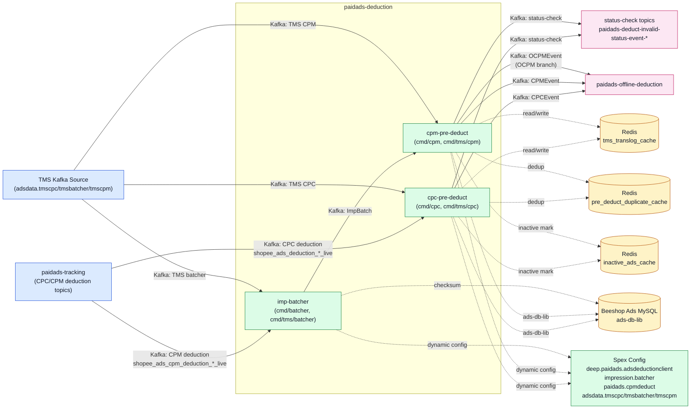

<!-- ads-workspace-gdoc-sync: gdoc_id=1sXfvy4rPB8guHuhgxoh8aWHc4rdW2fHBKOit9gH9QAs gdoc_url=https://docs.google.com/document/d/1sXfvy4rPB8guHuhgxoh8aWHc4rdW2fHBKOit9gH9QAs/edit -->

# paidads-deduction

Git repository: https://git.garena.com/shopee/deep/paidads-deduction

---

## Table of Contents

1. [Introduction](#introduction)
2. [Features](#features)
3. [Ad Products and Business Semantics](#ad-products-and-business-semantics)
   - [Product Scope and Entry Differences](#product-scope-and-entry-differences)
   - [Product-specific Processing Branches](#product-specific-processing-branches)
   - [Key Business Decisions](#key-business-decisions)
4. [Data Flow and Architecture](#data-flow-and-architecture)
   - [Service Topology](#service-topology)
   - [Upstream, Downstream, and System Positioning](#upstream-downstream-and-system-positioning)
   - [Main Message Processing Flow](#main-message-processing-flow)
   - [Online, Offline, and TMS Flows](#online-offline-and-tms-flows)
   - [Runtime Components and Dependencies](#runtime-components-and-dependencies)
5. [Kafka and Event Contracts](#kafka-and-event-contracts)
   - [Consumers and Input Topics](#consumers-and-input-topics)
   - [Producers and Output Topics](#producers-and-output-topics)
   - [Retry, DLQ, and Side Outputs](#retry-dlq-and-side-outputs)
6. [Redis and Caching](#redis-and-caching)
   - [Caching Use Cases in CPC and CPM pre-deduct](#caching-use-cases-in-cpc-and-cpm-pre-deduct)
   - [Key Design and Expiration Strategies](#key-design-and-expiration-strategies)
7. [Directory Structure](#directory-structure)
8. [Entrypoints and Key Modules](#entrypoints-and-key-modules)
   - [Service Binaries](#service-binaries)
   - [Handler, Service, and Manager Layers](#handler-service-and-manager-layers)
   - [Product-specific Module Mapping](#product-specific-module-mapping)
   - [Tools and One-off Scripts](#tools-and-one-off-scripts)
9. [Protocol and Data Models](#protocol-and-data-models)
   - [Input Events Data Models](#input-events-data-models)
   - [Output Events Data Models](#output-events-data-models)
   - [Core Business Fields](#core-business-fields)
   - [History and Cache Models](#history-and-cache-models)
10. [Configuration and Deployment](#configuration-and-deployment)
    - [Static Config Files](#static-config-files)
    - [Dynamic Config and Hot Reload](#dynamic-config-and-hot-reload)
    - [Kafka, Redis, DB, and SPEX Config Matrix](#kafka-redis-db-and-spex-config-matrix)
    - [Build and Release](#build-and-release)
11. [Monitoring and Operations](#monitoring-and-operations)
    - [Health Checks and Runtime Endpoints](#health-checks-and-runtime-endpoints)
    - [Key Metrics and Logs](#key-metrics-and-logs)
    - [Duplicate, Missing, and Delayed Data Troubleshooting](#duplicate-missing-and-delayed-data-troubleshooting)
    - [Troubleshooting Playbook](#troubleshooting-playbook)
12. [Key Terms](#key-terms)
13. [Additional Resources](#additional-resources)
14. [Frequently Asked Questions](#frequently-asked-questions)

---

## Introduction

`paidads-deduction` is the pre-deduction processing service for the Ads Data pipeline. It operates between the time a click/impression event occurs and when `paidads-offline-deduction` performs actual billing. The repository contains three main services:

- **imp-batcher** (`cmd/batcher`): Consumes CPM impression Kafka messages from tracking or TMS, aggregates raw impressions by a multi-dimensional `BatchKey`, and outputs `ImpBatch` to downstream `cpm-pre-deduct`. The batcher exists not only to reduce message volume but also to minimize DB write amplification at the `shop_id` and `campaign_id` dimensions.
- **cpc-pre-deduct** (`cmd/cpc`): Consumes CPC click events, performs fraud filtering, deduplication, status checks, quota context loading, and `CampaignDailyBalanceByDate` row preparation, then outputs `CPCEvent` to `offline-deduction`.
- **cpm-pre-deduct** (`cmd/cpm`): Consumes `ImpBatch` produced by `imp-batcher`, performs CPM validation, status checks, and quota context loading, and outputs `CPMEvent`. For OCPM traffic, it performs a **second-stage** aggregation at the `shop_id` level, repacking `CPMEvent` into `OCPMEvent` before passing it to `offline-deduction`.

> **tracking vs TMS**: `tracking` is an early self-built data source from the Ads team (topics like `shopee_ads_{{xx}}_live`); TMS (Transaction Message Service) is the company-wide unified messaging source (`adsdata.tmscpc`, `adsdata.tmsbatcher`, `adsdata.tmscpm`). Both sources operate in parallel, with the long-term direction being a gradual migration to TMS Kafka. Each source has corresponding service binaries (`cmd/tms/cpc`, `cmd/tms/batcher`, `cmd/tms/cpm`).

Pre-deduct services do **not** perform the final balance judgment (no-money judgement) or actual deduction — these are handled by `paidads-offline-deduction`.

---

## Features

| Phase | Capability | Code Location |
|-------|-----------|---------------|
| **Ingestion & Normalization** | Consumes Kafka tracking/TMS messages, parses `ads.Tracking` proto | `internal/service/`, `internal/serializer/` |
| **Fraud / Duplicate-label Filtering** | Checks `track.internalLabel.frauds` and `duplicateLabel`; early-drops fraudulent or duplicate traffic | `internal/handler/pre_deduct_handler/cpc_handler.go` |
| **Checksum Deduplication** | CPC uses deduplicate cache (Redis) to maintain uniqueness per `userid/adsid/vvid` combination | `pkg/deduplicator/deduplicator.go` |
| **imp-batcher Aggregation** | Aggregates CPM impressions by multi-dimensional `BatchKey`; flushes on timeout (default 30s), size (default 50), or buffer (default 1000) | `pkg/batcher/batcher.go` |
| **OCPM Second-stage Aggregation** | `cpm-pre-deduct` re-aggregates OCPM traffic by `shop_id` into `OCPMEvent` | `pkg/ocpm_batcher/batcher.go`, `pkg/ocpm_batcher/type.go` |
| **Status Check (`checkModelStatus`)** | Validates seller user, ad, campaign, account, and keyword status | `internal/handler/pre_deduct_handler/base.go` |
| **Quota Context Loading** | Loads campaign quota, quota split; ensures `CampaignDailyBalanceByDate` row exists | `internal/handler/pre_deduct_handler/base.go` |
| **Deduction Event Output** | Routes `CPCEvent`/`CPMEvent`/`OCPMEvent` to Kafka, applying big-shop routing by `shop_id` | `internal/handler/pre_deduct_handler/base.go` |
| **status-check Side Output** | On validation failure, writes failure status to `paidads-deduct-invalid-status-event-{{xx}}-live` | `cmd/cpc/run.go`, `cmd/cpm/run.go` |
| **AdsDeductionFinance Event Output** | On CPC/CPM pre-deduct failure, writes `ads.AdsDeductionFinance` proto to the `AdsDeductionFinanceProducerConfig` topic for financial-layer failure auditing; silently skips if producer is nil | `internal/handler/pre_deduct_handler/cpc_handler.go:sendAdsDeductionFinanceEvent`, `cpm_handler.go:sendAdsDeductionFinanceEvent` |
| **earlyNoMoneyCheck Pre-check** | Before emitting the main deduction event, performs an early no-money pre-check using account balance and campaign daily balance; writes `HasAdsCredit`/`AdsCreditLen` fields into the event for downstream reference | `internal/handler/pre_deduct_handler/cpc_handler.go`, `cpm_handler.go` |
| **Inactive Ads Cache Write** | On CPC path: updates inactive cache when ad/campaign/account has no balance, accelerating index removal | `internal/handler/pre_deduct_handler/base.go:setInactiveCache` |
| **HTTP Endpoints** | `/smoketest` health check + pprof debug | `internal/smoke_test/`, `internal/http_handler/` |

---

## Ad Products and Business Semantics

### Product Scope and Entry Differences

This repository handles two major billing model categories:

**CPC (Cost Per Click)**: Advertisers pay per valid click. Billing events are triggered by real user clicks; traffic volume is much lower than CPM (roughly 1/30 at a typical 3% CTR). Typical product lines:
- `KW` (Keyword Ads): Search keyword ads; requires keyword status validation
- `RCMD` (Recommendation Ads): Recommendation page ads
- `SHOP` (Shop Ads): Shop homepage ads
- `SHOP_ITEM`: Shop-level item ads

**CPM (Cost Per Mille)**: Advertisers pay per thousand impressions. At a typical CTR of ~3%, CPM impression volume is ~30x CPC click volume, making it mandatory to pass through `imp-batcher` aggregation before entering pre-deduct. Typical product lines:
- `ROI2` (oCPM/RCMD CPM): Recommendation ads billed at CPM; supports OCPM mode
- `LiveStream`: Livestream ads; requires live session and affiliate rule validation
- `Video`: Video ads
- `BRANDMAX`: Brand ads using frozen credits mechanism
- `Banner`: Banner ads with lightweight validation

### Product-specific Processing Branches

Processing branches are determined by the `placement` field (mapped to `HandlerType` via SPEX `PlacementConfig`):

| HandlerType | Billing Model | Key Validation | Code Location |
|-------------|---------------|----------------|---------------|
| `KW` | CPC | Keyword status check, placement+entrance | `internal/ads_handler/kw_ads_handler.go` |
| `RCMD` | CPC | Item visibility, user status | `internal/ads_handler/rcmd_ads_handler.go` |
| `SHOP` | CPC | Shop status (no SPEX item check) | `internal/ads_handler/shop_ads_handler.go` |
| `SHOP_ITEM` | CPC | Shop + item status | `internal/ads_handler/shop_ads_item_handler.go` |
| `ROI2` | CPM/OCPM | Item availability; OCPM second-stage aggregation | `internal/ads_handler/roi2_ads_handler.go` |
| `LiveStream` | CPM | Live session status, affiliate rules | `internal/ads_handler/live_stream_ads_handler.go` |
| `Video` | CPM | Video ad field validation | `internal/ads_handler/video_handler.go` |
| `BRANDMAX` | CPM | Frozen credits | `internal/ads_handler/brand_max_ads_handler.go` |
| `Banner` | CPM | Lightweight validation | `internal/ads_handler/sba_handler.go` |

### Key Business Decisions

1. **Fraud filtering before deduplication**: Fraud-labeled traffic is dropped before the dedup key is reserved (`StatusFilter`), without consuming dedup slots.
2. **Batcher bypass (skip-batch fast path)**: When `placement` is in `SkipBatchPlacement`, `shop_id` is in `SkipBatchShopList`, or `shop_id % 100 < SkipRatio`, bypass `imp-batcher` and send directly to `cpm-pre-deduct`.
3. **No-money judgment is not in this service**: Both `cpc-pre-deduct` and `cpm-pre-deduct` do **not** perform the final balance deduction judgment — they only complete pre-validation and quota context preparation. `offline-deduction` is where balance sufficiency is judged and actual deductions are made.
4. **Purpose of OCPM second-stage aggregation**: The first-stage `imp-batcher` aggregates CPM traffic by `campaign_id+ads_id`, but for high-volume OCPM scenarios, `campaign_id`-level batches are still too sparse. This causes `offline-deduction` to generate many repeated reads/writes on the same shop's multiple campaign balances. The second-stage `shop_id`-level aggregation into `OCPMEvent` allows `offline-deduction` to batch-load all campaign balances under one shop in a single operation.

---

## Data Flow and Architecture

### Service Topology



**Topology Table:**

| Category | Name | Protocol | Description |
|----------|------|----------|-------------|
| Upstream | paidads-tracking (CPC deduction topics) | Kafka | CPC billing events (`shopee_ads_deduction_<region>_live`), produced by tracking or TMS |
| Upstream | paidads-tracking (CPM deduction topics) | Kafka | CPM billing events (`shopee_ads_cpm_deduction_<region>_live`), produced by tracking or TMS |
| Downstream | paidads-offline-deduction (CPC event output) | Kafka | `cpc-pre-deduct` outputs `CPCEvent` to offline-deduction |
| Downstream | paidads-offline-deduction (CPM event output) | Kafka | `cpm-pre-deduct` outputs `CPMEvent`/`OCPMEvent` to offline-deduction |
| Downstream | status-check side output | Kafka | Status-check events produced on pre-deduct failure |
| Dependency | Redis — tms_translog_cache | Redis | TMS translog cache (`RegionConfigMap.<country>.TmsCache`) |
| Dependency | Redis — pre_deduct_duplicate_cache | Redis | CPC/CPM/OCPM deduplication cache |
| Dependency | Redis — inactive_ads_cache | Redis | Inactive ad status cache for accelerating index removal |
| Dependency | Beeshop Ads MySQL | MySQL | Ad, campaign, account, keyword, `CampaignDailyBalance` queries via ads-db-lib |
| Dependency | Spex Config | SPEX | Dynamic config delivery: `PlacementConfig`, quota, Kafka routes, rate limits |

### Upstream, Downstream, and System Positioning

```
┌──────────────────────────────────────────────────────────────────────┐
│                       Upstream Data Sources                           │
│  tracking (Ads self-built)        TMS (Company-level unified)         │
│  shopee_ads_{{xx}}_live           adsdata.tmscpc                      │
│  cpm_deduction topics             adsdata.tmsbatcher                  │
│                                   adsdata.tmscpm                      │
└──────────────┬───────────────────────────┬───────────────────────────┘
               │                           │
               ▼                           ▼
┌──────────────────────────────────────────────────────────────────────┐
│                     paidads-deduction                                  │
│                                                                       │
│  imp-batcher ──→ ImpBatch ──→ cpm-pre-deduct ──→ CPMEvent            │
│                                     │                                 │
│  cpc-pre-deduct ──→ CPCEvent        └──(OCPM)──→ OCPMEvent           │
│                                                                       │
└──────────────────────────────┬───────────────────────────────────────┘
                               │
                               ▼
                   paidads-offline-deduction
                   (Final balance judgment + actual deduction)
                               │
                               ▼
                   paidads-report-ng / Hive / ClickHouse
```

**Upstream**: tracking service / TMS, produces `ads.Tracking` proto messages to Kafka  
**Downstream**: `paidads-offline-deduction`, consumes `CPCEvent`, `CPMEvent`, `OCPMEvent`  
**Side channels**: `paidads-deduct-invalid-status-event-{{xx}}-live` (status-check), `deduct_unsuccessful_event_sg_live` (no-money event)

### Main Message Processing Flow

**CPC pipeline**:
```
tracking/TMS Kafka → cpc-pre-deduct consumer
  → fraud/duplicate label filtering
  → dedup key reservation
  → ValidateCPCPreObj / BuildCPCDeductObj
  → checkModelStatus (seller, ad, campaign, account, keyword)
  → handler-specific validation (item/stock/shop/account SPEX)
  → GetCampaignQuotaAndQuotaSplit
  → checkOrInsertNewCampaignDailyBalanceByDate
  → emit CPCEvent → deduction topic → offline-deduction
```

**CPM pipeline**:
```
tracking/TMS Kafka → imp-batcher consumer
  → checksum validation (dedup cache)
  → ImpEvent → BatchKey aggregation → ImpBatch (flush on timeout/size/buffer)
  → cpm-pre-deduct consumer
  → ValidateCPMPreObj / BuildCPMDeductObj
  → checkModelStatus
  → handler-specific validation
  → GetCampaignQuotaAndQuotaSplit
  → checkOrInsertNewCampaignDailyBalanceByDate
  → emit CPMEvent (regular CPM)
  → [OCPM] → ocpm_batcher aggregates by shop_id → emit OCPMEvent
  → deduction topic → offline-deduction
```

### Online, Offline, and TMS Flows

| Service | Binary | Data Source | SPEX server-name | config-key |
|---------|--------|-------------|-----------------|------------|
| tracking imp-batcher | `paidads_batcher_server` | tracking Kafka | `impression.batcher` | `8a669cf5...` |
| tracking cpc-pre-deduct | `paidads_deduction_server` | tracking Kafka | `deep.paidads.adsdeductionclient` | `3adbd557...` |
| tracking cpm-pre-deduct | `paidads_cpmdeduct_server` | tracking Kafka | `paidads.cpmdeduct` | `a6e9ae08...` |
| TMS cpc | `paidads_tmscpc_server` | TMS Kafka | `adsdata.tmscpc` | `e7964056...` |
| TMS batcher | `paidads_tmsbatcher_server` | TMS Kafka | `adsdata.tmsbatcher` | `b77d5b80...` |
| TMS cpm | `paidads_tmscpm_server` | TMS Kafka | `adsdata.tmscpm` | `3bb915a5...` |

The SPEX `server-name` and `config-key` are the entry points for looking up runtime Kafka route configurations in the Space `ads_data` directory and Config Center.

### Runtime Components and Dependencies

```
paidads-deduction
  ├── Kafka (enhanced-kafka-lib)    Input/output message queue
  ├── Redis (deduplicate cache)     CPC/CPM/OCPM deduplication
  ├── Redis (TMS translog cache)    Caches serialized translog (CPC/CPM pre-deduct read/write)
  ├── Redis (inactive ads cache)    Ad inactive status cache, accelerates index removal
  ├── MySQL/DB (ads-db-lib)         ad, campaign, account, keyword, CampaignDailyBalance
  ├── SPEX (paidads-platform-lib)   Dynamic config delivery (PlacementConfig, quota, Kafka routes)
  └── paidads-report-ng (checksum)  Impression dedup checksum validation
```

---

## Kafka and Event Contracts

### Consumers and Input Topics

| Service | Input Topic Pattern | Message Type |
|---------|--------------------|--------------| 
| imp-batcher (tracking) | `cpm_deduction_{{xx}}_live` | `ads.Tracking` proto (CPM info in `cpm_deduction_info` field) |
| cpc-pre-deduct (tracking) | `shopee_ads_{{xx}}_live` | `ads.Tracking` proto (CPC info in `deduction_info` field) |
| cpm-pre-deduct (tracking) | imp-batcher internal channel (`ImpBatch`) | `ImpBatch` (defined in `pkg/batcher/type.go`) |
| TMS cpc | SPEX-configured topic for `adsdata.tmscpc` | `ads.Tracking` proto |
| TMS batcher | SPEX-configured topic for `adsdata.tmsbatcher` | `ads.Tracking` proto |
| TMS cpm | SPEX-configured topic for `adsdata.tmscpm` | `ImpBatch` |

> Exact topic names are obtained from runtime configuration under SPEX `config-key` and the Space `ads_data` directory — they are not hardcoded in static files.

### Producers and Output Topics

| Output Type | Topic Pattern | Event Type | Definition Location |
|-------------|--------------|------------|---------------------|
| CPC deduction event | deduction family topic (SPEX `producers-config`) | `CPCEvent` | `paidads-deduction-proto/types/deduct_event/` |
| CPM deduction event | deduction family topic | `CPMEvent` | `paidads-deduction-proto/types/deduct_event/` |
| OCPM deduction event | deduction family topic (reuses deduction family; payload is `OCPMEvent` with `DeductType=DEDUCT_TYPE_OCPM_BATCH`) | `OCPMEvent` | `paidads-deduction-proto/types/deduct_event/ocpm.go` |
| status-check side channel | `paidads-deduct-invalid-status-event-{{xx}}-live` | Failure status annotation | `StatusCheckProducerConfig` |
| unsuccessful event | `deduct_unsuccessful_event_sg_live` (and regional variants) | `DeductUnSuccessfulEvent` | `paidads-deduction-proto/types/deduct_unsuccessful_event/` |
| AdsDeductionFinance event (optional) | Topic configured in `AdsDeductionFinanceProducerConfig` | `ads.AdsDeductionFinance` proto; produced on CPC/CPM pre-deduct failure; silently skipped when producer is nil | `internal/handler/pre_deduct_handler/cpc_handler.go:sendAdsDeductionFinanceEvent`, `cpm_handler.go` |

**OCPM `OCPMEvent` Contract**:
- Reuses the deduction family topic, but its structure differs from a regular `CPMEvent`, with `DeductType=DEDUCT_TYPE_OCPM_BATCH`
- Top-level aggregated by `ShopId`
- `OCPMBatchKey` (aggregation dimensions): `Country`, `Placement`, `AdsAccountId`, `ShopId`, `UserId`, `PricingType`, `DeductDate`
- `OCPMCampaignDetails` map: key = `campaign_id`, value contains `CPMEvents` map (key = `ads_id`)
- `ToOCPMEvent` deduplicates `UniqueID` on flush; multiple `CPMEvent`s under the same `ads_id` are merged via `mergeTwoCPMEvents` (latest timestamp as base, merged price/details, new `UniqueID` via `genMergedID`)
- Built by `pkg/ocpm_batcher/type.go:ToOCPMEvent`

### Retry, DLQ, and Side Outputs

| Status | Meaning | Behavior |
|--------|---------|----------|
| `StatusFail` | Infrastructure error (Redis/DB timeout, etc.) | Returns error to enhanced-kafka-lib; triggers retry or DLQ |
| `StatusInvalid` | Business invalid (ad not found, status anomaly, etc.) | No retry; CPC path may write inactive ads cache and clean dedup key |
| `StatusFilter` | Active filtering (fraud, duplicate label) | Silent drop, no retry, no status-check write |
| non-success with deductErr != nil | Validation failed but observability needed | Writes to status-check topic |
| CPM non-success | Any CPM failure | Cleans up reserved batch keys |

---

## Redis and Caching

> Note: Redis caches and DB-backed model state (ad, campaign, etc.) are two independent mechanisms — do not conflate them.

### Caching Use Cases in CPC and CPM pre-deduct

| Cache Name | Purpose | Config Path |
|------------|---------|-------------|
| `tms_translog_cache` | Caches serialized `ads.Translog` proto, read/written by CPC/CPM pre-deduct. Note: caches the serialized translog, not the final finance event | `RegionConfigMap.<country>.TmsCache` |
| `pre_deduct_duplicate_cache` | CPC/CPM/OCPM deduplication — maintains one unique slot per `userid/adsid/vvid` combination | `RegionConfigMap.<country>.DeduplicateCacheConfig` |
| `inactive_ads_cache` | Shop/campaign/ad inactive markers; used by indexer to quickly skip ads with no balance | `inactive-cache-config-identity` (Config Center) |

### Key Design and Expiration Strategies

**TMS translog cache** (`tms_translog_cache`):
- Address examples: SG: `ucmvi.elasticredis.cloud.shopee.io:10204`, SEA shared: `oer9e.elasticredis.cloud.shopee.io:10203`, AR: `ftqsk.elasticredis.cloud.shopee.io:11532`
- Key format: `translog:country:<country>:unqiueid:<tmsUniqueID>`
- Value: Serialized `ads.Translog` proto
- Behavior: Live config typically enables write cache; read cache is disabled by default
- Used by: `cmd/cpc/run.go`, `cmd/cpm/run.go`, `pkg/model_service/translog.go`

**Deduplicate cache** (`pre_deduct_duplicate_cache`):
- Address examples: `lhdrl.elasticredis.cloud.shopee.io:10526`, `mazwp.elasticredis.cloud.shopee.io:10532`
- CPC key format:
  - `userid{<uid>}:adsid{<adsid>}:vvid{<vvid>}`
  - `userid{<uid>}:adsid{<adsid>}:vsid{<vsid>}`
- CPM key format:
  - `cpm:userid{<uid>}:adsid{<adsid>}:vvid{<vvid>}`
  - `cpm:userid{<uid>}:adsid{<adsid>}:vsid{<vsid>}`
- OCPM key format (xxhash-encrypted):
  - `xxhash(ocpm:userid{...}:adsid{...}:requestid{...}:location{...})`
  - `xxhash(sa_ocpm:userid{...}:adsid{...}:requestid{...}:operation{...})`
- TTL: Regular 1h, OCPM 24h
- Used by: `pkg/deduplicator/deduplicator.go`, `pkg/deduplicator/unique_key.go`

**Inactive ads cache**:
- Address resolved dynamically via `inactive-cache-config-identity` and `inactive_ads_cache_live_default` namespace
- Key format: shop / campaign / ad inactive markers
- Used by: `internal/handler/pre_deduct_handler/base.go:setInactiveCache`

---

## Directory Structure

```
paidads-deduction/
├── cmd/                         # Service entrypoints
│   ├── batcher/                 # tracking imp-batcher binary
│   ├── cpc/                     # tracking cpc-pre-deduct binary
│   ├── cpm/                     # tracking cpm-pre-deduct binary
│   └── tms/
│       ├── batcher/             # TMS imp-batcher binary
│       ├── cpc/                 # TMS cpc-pre-deduct binary
│       └── cpm/                 # TMS cpm-pre-deduct binary
├── internal/
│   ├── ads_handler/             # Product-specific handlers (KW/RCMD/ROI2, etc.)
│   │   └── selector/            # CPC/CPM handler selector
│   ├── cache/                   # Redis cache wrappers
│   ├── deduct_error/            # Error types and classification (Validate/Status/Middleware/Biz)
│   ├── encoder/                 # Message encode/decode
│   ├── exporter/                # Prometheus metrics
│   ├── handler/
│   │   ├── batcher_handler/     # Kafka consumer handler for imp-batcher
│   │   └── pre_deduct_handler/  # CPC/CPM pre-deduct core logic (base.go common base class)
│   ├── http_handler/            # HTTP endpoints (smoketest, pprof)
│   ├── selector/                # Engine selector (credit-ordered version)
│   ├── service/                 # EKL/Kafka service layer
│   └── spex/
│       ├── config/              # SPEX config structs (SpexDeductionConfig, SpexBatcherConfig)
│       └── handler/             # SPEX hot-reload callbacks
├── pkg/
│   ├── batcher/                 # ImpBatch aggregation core (Batcher, BatchKey, ImpEvent, ImpBatch)
│   ├── config/                  # Static config loading (SPEX init, config.yml parsing)
│   ├── config_center/           # Config Center client wrapper
│   ├── db_manager/              # DB connection management (ads-db-lib wrapper)
│   ├── deduplicator/            # Redis deduplication implementation
│   ├── engine/                  # Credit-sorted engine (v2/v3)
│   ├── event_builder/           # CPC/CPM event builders (translog construction, cost details)
│   ├── mirror/                  # Event mirroring utilities
│   ├── model_service/           # Business model CRUD (Ads/Campaign/Account/Keyword, etc.)
│   ├── ocpm_batcher/            # OCPM second-stage aggregation (OCPMBatcher, OCPMEvent builder)
│   ├── producer/                # Kafka producer wrapper (including big-shop routing)
│   └── service/                 # Service interface definitions
├── types/                       # Shared types (DeductObj, Status, CPC/CPM deduct objects)
├── util/                        # Utility functions (JSON marshal, time, app lifecycle)
├── config/
│   └── files/                   # Static config files (live.yml, liveish.yml, uat.yml, test.yml)
├── tools/                       # One-off utility scripts
│   ├── message_sender/          # Manually send test messages to Kafka
│   ├── prepare_db_data/         # Stress test DB data preparation
│   ├── prepare_extract_data/    # Data extraction tool
│   └── view_db/                 # Command-line view of DB translog records
└── Makefile                     # Build, test, CI entry point
```

---

## Entrypoints and Key Modules

### Service Binaries

| Binary Name | Source Path | Responsibility |
|-------------|-------------|----------------|
| `paidads_deduction_server` | `cmd/cpc/` | tracking CPC pre-deduct |
| `paidads_batcher_server` | `cmd/batcher/` | tracking CPM imp-batcher |
| `paidads_cpmdeduct_server` | `cmd/cpm/` | tracking CPM pre-deduct (including OCPM aggregation) |
| `paidads_tmscpc_server` | `cmd/tms/cpc/` | TMS CPC pre-deduct |
| `paidads_tmsbatcher_server` | `cmd/tms/batcher/` | TMS CPM imp-batcher |
| `paidads_tmscpm_server` | `cmd/tms/cpm/` | TMS CPM pre-deduct |

All binaries initialize config in `main.go`, complete dependency injection in `run.go`, and manage goroutine lifecycle via `util/app/run.go`.

### Handler, Service, and Manager Layers

```
Kafka Consumer (enhanced-kafka-lib / EKL)
    ↓
Service Layer (internal/service/deduct_service/, batch_service/)
    Receives Kafka messages, calls handler.Process()
    ↓
Handler Layer (internal/handler/pre_deduct_handler/, batcher_handler/)
    Implements business logic, calls model_service and producer
    ↓
ModelService Layer (pkg/model_service/)
    Wraps DB and TMS cache access
    ↓
Producer Layer (pkg/producer/)
    Writes deduction events to Kafka
```

### Product-specific Module Mapping

**CPC pre-deduct check chain** (`internal/handler/pre_deduct_handler/cpc_handler.go`):

| Step | Function/API | Key Fields | Success | Failure |
|------|-------------|------------|---------|---------|
| Early filtering | `earlyFilter` (fraud + duplicate label) | `track.internalLabel.frauds`, `items[0].internal.duplicateLabel` | Continue | `StatusFilter` |
| Reserve dedup key | `PreDeductHandlerBase.Deduplicate` | userid+adsid+vvid combination | Continue | `StatusFail`, DLQ |
| Validate and build CPC object | `ValidateCPCPreObj`, `BuildCPCDeductObj` | placement, entrance, hasQuery, pricingType | CPC deduct obj ready | `StatusInvalid` |
| Check model status | `checkModelStatus` | seller user, ad, campaign, account, keyword | Context ready | `StatusInvalid`, may write inactive cache |
| Handler-level CPC validation | `ValidateCPCDeductObj`, `CheckCPCStatusBySpex` | item visibility, stock, shop/account status | Business valid | `StatusInvalid` / `StatusFail` |
| Quota & daily balance preparation | `GetCampaignQuotaAndQuotaSplit`, `checkOrInsertNewCampaignDailyBalanceByDate` | campaign quota, quota split, deduct date | Emit CPCEvent | `StatusFail`, write status-check |
| earlyNoMoneyCheck (optional) | `earlyNoMoneyCheck` (controlled by `handlerConf.GetIsDisableEarlyCheckByCountry`) | `account`, `campaignDailyBalance`, `Price`, `CampaignID` | Pre-checks balance; writes `HasAdsCredit`/`AdsCreditLen` into event | Determined by country config |

**CPM pre-deduct check chain** (`internal/handler/pre_deduct_handler/cpm_handler.go`):

| Step | Function/API | Key Fields | Success | Failure |
|------|-------------|------------|---------|---------|
| Validate and build CPM object | `ValidateCPMPreObj`, `BuildCPMDeductObj` | ImpBatch payload, placement, pricingType | CPM deduct obj ready | `StatusInvalid`, clean batch keys |
| Check model status | `checkModelStatus` | seller user, ad, campaign, account | Context ready | `StatusInvalid`/`StatusFail`, clean batch keys |
| Handler-level CPM validation | `ValidateCPMDeductObj`, `CheckCPMStatusBySpex` | live session, affiliate, account, item (ROI2) | Business valid | `StatusInvalid`/`StatusFail`, clean batch keys |
| Quota, deduct date, and daily balance | `GetCampaignQuotaAndQuotaSplit`, `getLiveStream`, `adsHandler.GetCPMDeductDate`, `checkOrInsertNewCampaignDailyBalanceByDate` | campaign quota, deduct date | Emit CPMEvent; OCPM branch re-aggregates into OCPMEvent | `StatusFail`, write status-check |
| earlyNoMoneyCheck (optional) | `earlyNoMoneyCheck` (controlled by `handlerConf.GetIsDisableEarlyCheckByCountry`) | `account`, `campaignDailyBalance`, `Price`, `CampaignID` | Pre-checks balance; writes `HasAdsCredit`/`AdsCreditLen` into event | Determined by country config |

**OCPM mode additional step** (`pkg/ocpm_batcher/batcher.go`):
`CPMEvent` enters `ocpm_batcher`, aggregated by `OCPMBatchKey (country+placement+account_id+shop_id+user_id+pricing_type+deduct_date)`. Flush conditions: ① timeout (default 30s); ② unique campaign count exceeds threshold; ③ impression total exceeds threshold; ④ buffer total size exceeds `maxImpPerBuffer`. On flush, `ToOCPMEvent` merges `CPMEvent`s by `campaign_id` and `ads_id` into `OCPMEvent`.

**What pre-deduct will and will not do**:

| Decision Type | What this repo does | What this repo does NOT do |
|---------------|---------------------|---------------------------|
| Model & status gate | Validates seller user, ad, keyword, campaign, account, and handler-specific SPEX status | Final finance persistence |
| Quota context | Populates `dailyQuota`, `totalQuota`, placement-level `quotaSplit` | Final "quota exhausted" conclusion |
| Campaign balance prep | Ensures `CampaignDailyBalanceByDate` row exists | Actual deduction of campaign or account balance |
| Event routing | Emits main deduction event, status-check, retry/DLQ side channel | Final translog and finance transaction persistence |

### Tools and One-off Scripts

| Tool | Path | Purpose |
|------|------|---------|
| `message_sender` | `tools/message_sender/` | Manually send tracking messages to Kafka for testing or replay |
| `prepare_db_data` | `tools/prepare_db_data/` | Prepare DB data (campaign, account, etc.) for stress testing |
| `prepare_extract_data` | `tools/prepare_extract_data/` | Extract specific data from DB |
| `view_db` | `tools/view_db/` | Command-line view of ads translog records in DB |

---

## Protocol and Data Models

### Input Events Data Models

**`ads.Tracking`** (`git.garena.com/shopee-server/shopee_protobuf/beeshop_ads.pb`):
- CPC data carried in `deduction_info` field (encrypted `CPCDeductionInfo`)
- CPM data carried in `cpm_deduction_info` field

**`ImpEvent`** (`pkg/batcher/type.go`):
- Used internally by imp-batcher; parsed from `ads.Tracking` as CPM impression event
- Contains: `UserId`, `EventTs`, `UniqId`, `CPM`, `AdsId`, `CampaignId`, `Placement`, `IsOcpm`, `ItemId`, etc.

**`AdsData` proto** (`paidads-tracking-proto/pb/ads_data/ads_data.proto`):
- Records complete serving-side ad placement information, including `ads_id`, `campaign_id`, `placement`, `entrance`, `pricing_type`, `pCTR`, `pCR`, `rank_score`, `ecpm`, etc.

### Output Events Data Models

All output events are defined in `git.garena.com/shopee/deep/paidads-deduction-proto`:

| Event Type | Package Path | Key Fields |
|------------|-------------|------------|
| `DeductionEventBase` | `types/deduct_event/base.go` | AdsID, CampaignID, ShopID, AccountID, SellerUserID, Country, Placement, PricingType, Price, DailyQuota, TotalQuota, DeductDate |
| `CPCEvent` | `types/deduct_event/` | Inherits Base; includes TrackingJsonData, ItemJsonData, ShopJsonData, UserID |
| `CPMEvent` | `types/deduct_event/` | Inherits Base; includes Details ([]CPMEventDetails), BatchId, BatchStartTs, RecallSource |
| `OCPMEvent` | `types/deduct_event/ocpm.go` | Country, Placement, ShopId, UserId, PricingType, OCPMCampaignDetails (map[campaignID]OCPMCampaignDetails) |
| `DeductUnSuccessfulEvent` | `types/deduct_unsuccessful_event/` | Contains original DeductionEvent + Status + Account + AdsCredits + CampaignBalanceByDate |

**`OCPMCampaignDetails` structure**:
```
OCPMEvent
  └── OCPMCampaignDetails (map: campaign_id → OCPMCampaignDetails)
        └── CPMEvents (map: ads_id → CPMEvent)
```

### Core Business Fields

| Field | Meaning | Source |
|-------|---------|--------|
| `DeductDate` | Deduction billing date (calculated by country timezone) | `batcher/type.go:getDeductDate` |
| `UniqueID` | Event unique ID (used for checksum deduplication) | tracking reporting |
| `BatchKey` | imp-batcher aggregation dimensions: Country, AdsId, CampaignId, Placement, AdsAccountId, ShopId, UserId, LsSessionId, ItemId, PricingType, TargetAffiliateUserId, VideoID, VideoCreatorID, VideoAdsType, TrafficExp, DeductDate | `pkg/batcher/type.go:BatchKey` |
| `PricingType` | Billing type (CPC=1, CPM=2, OCPM=...) | `AdsData.pricing_type` |
| `IsOcpm` | Whether OCPM traffic | `ImpEvent.IsOcpm` |
| `QuotaSplit` | Quota allocation under multiple placements | `CampaignQuotaService.GetCampaignQuotaByHistory` |

### History and Cache Models

| Model | Data Source | Purpose |
|-------|-------------|---------|
| `CampaignDailyBalanceByDate` | MySQL (ads-db-lib) | Daily campaign balance row; pre-deduct ensures it exists; offline-deduction reads/writes it |
| `CampaignQuotaHistory` | MySQL | Campaign quota allocation history, used for `GetCampaignQuotaByHistory` |
| `AdsCredit` | MySQL (+ TMS cache) | Advertiser balance, deduction target for offline-deduction |
| `FrozenAdsCredit` | MySQL | Frozen balance for BrandMax ads |
| `Translog` (cache) | Redis (TMS translog cache) | Serialized `ads.Translog` proto, used for CPC/CPM pre-deduct validation |

---

## Configuration and Deployment

### Static Config Files

Static configuration is located in `config/files/`, separated by environment:

| File | Environment | Description |
|------|-------------|-------------|
| `live.yml` | Production | Main config file; contains all services' SPEX config-keys and DB connections |
| `liveish.yml` | liveish | Near-production validation environment |
| `uat.yml` | UAT | User acceptance testing |
| `test.yml` | Test | Local testing |

**Key SPEX mappings in `config/files/live.yml`**:

| Service Block | SPEX server-name | Purpose |
|--------------|-----------------|---------|
| `deduction` | `deep.paidads.adsdeductionclient` | tracking CPC pre-deduct SPEX entry; contains Kafka, quota, and full placement config |
| `batch-service` | `impression.batcher` | tracking imp-batcher SPEX entry |
| `cpm-deduction` | `paidads.cpmdeduct` | tracking CPM pre-deduct SPEX entry |
| `tms-cpc` | `adsdata.tmscpc` | TMS CPC pre-deduct |
| `tms-batcher` | `adsdata.tmsbatcher` | TMS imp-batcher |
| `tms-cpm` | `adsdata.tmscpm` | TMS CPM pre-deduct |

> Use `server-name` + `config-key` to find runtime Kafka topic configuration in the Space `ads_data` directory ([CMDB Link](https://space.shopee.io/console/cmdb/overview/tree/shopee.mp_search_recommendation_ads.paidads.data_application.ads_data/quota/container/summary_by_az)) and Config Center.

`inactive-cache-config-identity` is independent of SPEX, configured via Config Center with group=`paidads` / project=`index_pipeline` / namespace=`inactive_ads_cache_live_default`.

### Dynamic Config and Hot Reload

Most runtime configurations are delivered via SPEX, supporting hot reload (without service restart):

| Config Item | Hot Reload Support | Description |
|-------------|-------------------|-------------|
| `PlacementConfig` (placement→HandlerType mapping) | ❌ Not supported | Requires restart |
| `RegionConfigMap` (per-country Kafka, Redis, quota) | ✅ Supported | Updated via `WatchSpexConfig` callback |
| `RateLimit` (DB rate limiting) | ✅ Supported | SpexUpdateHandler updates `rate.Limiter` |
| `OCPMBatcherModeConfig` (OCPM routing mode) | ✅ Supported | |
| `OCPMBatcherConfig` (batcher infra params) | ❌ Not supported | Requires restart |
| `BatchRuleConfig` / `OCPMBatchRuleConfig` | ❌ Not supported | Requires restart |
| Producer (Kafka producer config) | ❌ Not supported | Requires restart |

### Kafka, Redis, DB, and SPEX Config Matrix

| Dependency | Config Location | Type | Hot Reload |
|------------|----------------|------|-----------|
| CPC input Kafka | SPEX `RegionConfigMap.<country>.CpcEklConfig` | enhanced-kafka-lib | ✅ |
| CPM input Kafka | SPEX `RegionConfigMap.<country>.CpmEklConfig` | enhanced-kafka-lib | ✅ |
| Deduction event output | SPEX `ProducersConfig` | Sarama producer | ❌ |
| Status-check output | SPEX `StatusCheckProducerConfig` | Sarama producer | ❌ |
| TMS translog cache | SPEX `RegionConfigMap.<country>.TmsCache` | Redis | ✅ |
| Deduplicate cache | SPEX `RegionConfigMap.<country>.DeduplicateCacheConfig` | Redis | ✅ |
| Inactive ads cache | Config Center `inactive_ads_cache_live_default` | Redis (dynamic address) | ✅ |
| DB (ads-db-lib) | `live.yml:deduction.db-manager-config` | MySQL | ❌ |
| Checksum (batcher) | `live.yml:batch-service.checksum` | Redis (per-country) | ❌ |

### Build and Release

**Local Build**:
```bash
# Download dependencies
make dependency

# Build all binaries (CPC + imp-batcher + CPM)
make all

# Build individually
make deduction    # paidads_deduction_server
make batcher      # paidads_batcher_server
make cpmdeduct    # paidads_cpmdeduct_server
make tmscpc       # paidads_tmscpc_server
make tmscpm       # paidads_tmscpm_server
make tmsbatcher   # paidads_tmsbatcher_server
```

**Run in Local**:
```bash
# First configure DB / Redis / Kafka connections in config/files/test.yml

# Run CPC pre-deduct
./bin/paidads_deduction_server -c config/files/test.yml

# Run batcher
./bin/paidads_batcher_server -c config/files/test.yml

# Run CPM pre-deduct
./bin/paidads_cpmdeduct_server -c config/files/test.yml
```

**Tests**:
```bash
make test          # go test with coverage
make test-race     # Tests with race detector
make vet           # go vet
make fmt           # go fmt check (fails if not formatted)
make gci           # import order check
make ci            # Full local CI (gci + nilaway + vet + fmt + test)
make ci-remote     # GitLab CI (vet + fmt + test)
```

**Release process**: Configuration changes are managed via SPEX. Service deployment is managed through CMDB config under the Space `ads_data` folder. Gradual rollout strategy is controlled via `ValidateCountryConfig` for per-country staged launches.

---

## Monitoring and Operations

### Health Checks and Runtime Endpoints

All six service binaries expose:
- **`/smoketest`**: Service readiness check (`internal/smoke_test/`); `smoketest.Ready()` must be called before accepting traffic
- **pprof**: Mounted via `internal/http_handler/` for CPU/memory profiling

### Key Metrics and Logs

**Prometheus metrics** (`internal/exporter/`, `internal/handler/exporter/`):

| Metric | Description |
|--------|-------------|
| `ExporterDBLatency` | Latency for DB operations (GetCampaignDailyBalance, InsertCampaignDailyBalanceDate, etc.) |
| `ExporterMiddlewareLatency` | Latency for Redis operations (SetInactiveShop, SetInactiveCampaign, etc.) |
| `ExporterDelayDeduct` | Traffic exp (delayed deduction) traffic count |
| `ExporterNilKeywordCounter` | Count of nil keyword lookups (by country/placement/platform) |
| `ExporterError` | Error counts by type |
| batcher buffer metrics | `exporterBufferImpCount`, `exporterBufferBatchCount`, `exporterInputQueueSize` |

**Key log markers**:
- `"bigshop routing"` — records triggering big-shop routing
- `"ocpm merge"` — OCPM same-`ads_id` merge records (including UniqueID tracking)
- `"batcher worker exiting"` / `"ocpm batcher worker"` — batcher lifecycle events

### Duplicate, Missing, and Delayed Data Troubleshooting

| Issue | Investigation Direction |
|-------|------------------------|
| CPC duplicate deduction | Check deduplicate cache key TTL; confirm dedup key is not prematurely cleaned (StatusFail path) |
| CPM impression volume sudden drop | Check imp-batcher input channel backlog (`exporterInputQueueSize`); confirm batcher flush is working (timeout trigger) |
| OCPM data loss | Check ocpm_batcher flush conditions; confirm `ToOCPMEvent` UniqueID dedup is not incorrectly dropping valid events |
| No messages for one country | Check Kafka consumer lag; confirm SPEX `CpcEklConfig`/`CpmEklConfig` for that country's topic config; check if `ValidateCountryConfig` includes that country |
| status-check volume spike | Classify by ErrorName: `validate_err_*` usually indicates ad/campaign status issues; `middleware_err_*` indicates Redis/DB failure |
| TMS-only failure | TMS pipeline is independent of tracking pipeline; check `adsdata.tmscpc/tmsbatcher/tmscpm` SPEX config and Kafka routes |
| tracking ID validation failure | Check `checksum` Redis connection and TTL setting (`batch-service.checksum.TTL`, default 12h in production) |

### Troubleshooting Playbook

1. **Dead request volume spike**: First check DB rate limiting (`RateLimit`) and Redis connectivity; `StatusFail` returns error to EKL framework, triggering retries; if retries exhausted, goes to DLQ
2. **Producer hot-reload impact**: After SPEX hot reload, old producer instances are not immediately closed; if config changes cause topic switch, service restart is required
3. **Checksum TTL change impact**: Shortening TTL can invalidate historical checksums, potentially causing duplicate impression processing; TTL extension changes require careful impact window assessment
4. **OCPM shop-level batch runtime limits**: `MaxUniqueCampaigns` and `MaxImpressionsPerBatch` are configured via SPEX `OCPMBatcherConfig` (defaults 1 and 100); verify actual runtime thresholds in Config Center under the Space `ads_data` directory

---

## Key Terms

| Term | Meaning |
|------|---------|
| tracking | Early Ads self-built click/impression data reporting pipeline; corresponds to Kafka topics like `shopee_ads_{{xx}}_live` |
| TMS | Transaction Message Service; company-wide unified messaging source; migration target for Ads Data |
| deduction | General term for billing process; this repository handles pre-deduction (pre-validation); `paidads-offline-deduction` handles actual billing |
| imp-batcher | CPM impression aggregation service; aggregates raw impressions by `BatchKey` into `ImpBatch` |
| cpc-pre-deduct | CPC pre-billing service; completes click event pre-validation |
| cpm-pre-deduct | CPM pre-billing service; completes impression batch pre-validation; includes OCPM second-stage aggregation |
| offline-deduction | `paidads-offline-deduction`; performs actual balance judgment and deduction |
| ImpBatch | Aggregated impression payload output by imp-batcher; `pkg/batcher/type.go:ImpBatch` |
| OCPMEvent | OCPM shop-level aggregated event output by cpm-pre-deduct; `paidads-deduction-proto/types/deduct_event/ocpm.go` |
| CampaignDailyBalanceByDate | Daily campaign balance row; pre-deduct ensures existence; offline-deduction performs deduction |
| checksum | Impression deduplication service provided by paidads-report-ng; batcher uses it to filter duplicate impressions |
| fraud | Fraud traffic marking; flagged during tracking reporting; early-filtered in pre-deduct |
| ctr | Click-Through Rate |
| CPC | Cost Per Click |
| CPM | Cost Per Mille (per thousand impressions) |
| oCPM | Optimized CPM; CPM billing mode optimized for conversions |
| adsData | General term for Ads data pipeline (tracking → deduction → report) |
| status-check | Side-channel topic produced on pre-deduct failure; used for monitoring and troubleshooting |
| inactive_ads_cache | Redis cache for ad inactive status; used by indexer to quickly skip ads with no balance |

---

## Additional Resources

- Code repository: https://git.garena.com/shopee/deep/paidads-deduction
- paidads-deduction-proto: https://git.garena.com/shopee/deep/paidads-deduction-proto
- paidads-tracking-proto (ads_data.proto): https://git.garena.com/shopee/deep/paidads-tracking-proto/-/blob/master/pb/ads_data/ads_data.proto
- paidads-offline-deduction (downstream): https://git.garena.com/shopee/deep/paidads-offline-deduction
- Ads Data Overview (Confluence): https://confluence.shopee.io/display/SPAD/Data+Application
- Ads Data Howtos (Confluence): https://confluence.shopee.io/pages/viewpage.action?pageId=2950810717
- Paid Ads Glossary (Confluence): https://confluence.shopee.io/pages/viewpage.action?spaceKey=SPAD&title=Paid+Ads+Glossary
- Space Service CMDB: https://space.shopee.io/console/cmdb/overview/tree/shopee.mp_search_recommendation_ads.paidads.data_application.ads_data/quota/container/summary_by_az

---

## Frequently Asked Questions

**Q1: What do each of the three services (imp-batcher, cpc-pre-deduct, cpm-pre-deduct) handle?**

A: `imp-batcher` aggregates raw CPM impressions by `BatchKey`, reducing message processing volume and DB write amplification. `cpc-pre-deduct` performs complete business validation and context preparation for each CPC click, outputting `CPCEvent`. `cpm-pre-deduct` validates `ImpBatch`; for OCPM traffic it also performs a second-stage `shop_id`-level aggregation, outputting `CPMEvent` or `OCPMEvent`.

**Q2: Does pre-deduct directly judge whether balance is sufficient and perform actual deductions?**

A: No. `cpc-pre-deduct` and `cpm-pre-deduct` only complete pre-validation (ad/campaign/account status), quota context loading, and `CampaignDailyBalanceByDate` row preparation. The final balance judgment (no-money judgement) and actual deduction are performed by `paidads-offline-deduction`.

**Q3: What is the imp-batcher aggregation logic and why is batching needed?**

A: The batcher aggregates CPM impressions by `BatchKey` (containing Country, AdsId, CampaignId, Placement, AdsAccountId, ShopId, UserId, LsSessionId, ItemId, PricingType, and other dimensions). At a typical CTR of ~3%, CPM impressions are ~30x CPC clicks. If every impression directly entered pre-deduct, it would generate massive repeated reads/writes at the DB's `shop_id` and `campaign_id` dimensions (write amplification). Flush conditions: ① single batch timeout (default 30s); ② batch impression count exceeds `MaxImpPerBatch` (default 50); ③ worker buffer total exceeds `MaxImpPerBuffer` (default 1000).

**Q4: Why does OCPM need a second batch in cpm-pre-deduct?**

A: The first-stage `imp-batcher` aggregates CPM traffic by `campaign_id+ads_id` into `ImpBatch`. But for high-volume OCPM scenarios, `campaign_id`-level batches are still too sparse — `offline-deduction` processing one shop's multiple campaigns generates many repeated campaign balance reads and DB latency spikes. The second-stage OCPM batcher in `cpm-pre-deduct` aggregates `CPMEvent` by `shop_id` into `OCPMEvent`, allowing `offline-deduction` to batch-load all campaign daily balances under one shop in a single operation, significantly reducing DB pressure.

**Q5: Do the tracking and TMS dual data sources running simultaneously cause duplicate deductions?**

A: No. The two data sources correspond to different service binaries (`cmd/cpc` vs `cmd/tms/cpc`), consume different Kafka topics, and output to different deduction topics. `offline-deduction` differentiates by source during processing. Additionally, the deduplicate cache design prevents the same event from being processed twice.

**Q6: How do you determine whether an ad follows the CPC or CPM path?**

A: Determined by the `placement` field. The placement is mapped to `HandlerType` (KW, RCMD, ROI2, etc.) via SPEX `PlacementConfig`, and `HandlerType` determines whether to follow the CPC or CPM processing chain. The specific mapping is in the SPEX `PlacementConfig` runtime config, viewable via the Space `ads_data` folder.

**Q7: What is the difference between StatusFail and StatusInvalid?**

A: `StatusFail` indicates infrastructure-level failure (Redis timeout, DB unreachable, etc.); returns error to enhanced-kafka-lib, triggering retry mechanism; if retries exhausted, goes to DLQ. `StatusInvalid` indicates business-level invalidity (ad status anomaly, campaign not found, etc.); does not trigger retry. `StatusFilter` is active filtering (e.g., fraud traffic); silently discarded.

**Q8: How do you run a service locally?**

A: First configure DB, Redis, and Kafka connection information in `config/files/test.yml` (SPEX config needs to point to an available staging/test environment), then run:
```bash
make deduction
./bin/paidads_deduction_server -c config/files/test.yml
```
Note: SPEX config requires network access; run within the company network or with VPN.

**Q9: What is big-shop routing?**

A: For high-traffic shops, pre-deduct routes their deduction events to a dedicated big-shop topic instead of the regular deduction topic. Routing rules are configured via SPEX `big-shop` rule engine (`RegionConfig.Rule["big-shop"]`), using `shopid` and `timestamp` as variables. See `internal/handler/pre_deduct_handler/base.go:emitWithBigShopRouting`.

**Q10: How do you investigate why an ad was filtered at the pre-deduct stage?**

A: Check the `paidads-deduct-invalid-status-event-{{xx}}-live` topic for status-check events, filter by `ads_id`, and inspect the `ErrorName` field. `validate_err_*` prefix indicates business invalidity; `middleware_err_*` indicates infrastructure failure; `status_err_*` indicates ad/campaign/account status anomaly.

<!-- Generated by ads-workspace/skills/ads-readme-generate | checked: 430d42a2707b80f9b66f9cde835306c844133d26 -->
