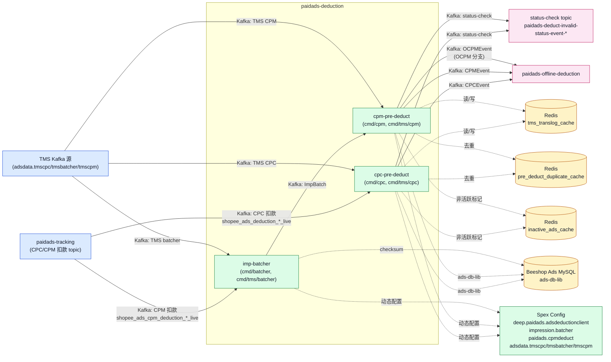

<!-- ads-workspace-gdoc-sync: gdoc_id=1b6XtwqiJwJ5VcLwyFbRjXHrBsCFFI0jxC4aTGWrCER4 gdoc_url=https://docs.google.com/document/d/1b6XtwqiJwJ5VcLwyFbRjXHrBsCFFI0jxC4aTGWrCER4/edit -->

# paidads-deduction

Git 仓库：https://git.garena.com/shopee/deep/paidads-deduction

---

## 目录

1. [项目概述](#项目概述)
2. [功能特性](#功能特性)
3. [广告产品与业务语义](#广告产品与业务语义)
   - [产品范围与入口差异](#产品范围与入口差异)
   - [产品专属处理分支](#产品专属处理分支)
   - [关键业务决策](#关键业务决策)
4. [数据流与架构](#数据流与架构)
   - [服务拓扑](#服务拓扑)
   - [上下游与系统定位](#上下游与系统定位)
   - [主要消息处理流程](#主要消息处理流程)
   - [Online、Offline 与 TMS 流程](#onlineoffline-与-tms-流程)
   - [运行时组件与依赖](#运行时组件与依赖)
5. [Kafka 与事件契约](#kafka-与事件契约)
   - [消费者与输入 Topic](#消费者与输入-topic)
   - [生产者与输出 Topic](#生产者与输出-topic)
   - [重试、DLQ 与旁路输出](#重试dlq-与旁路输出)
6. [Redis 与缓存](#redis-与缓存)
   - [CPC 与 CPM 预扣中的缓存用途](#cpc-与-cpm-预扣中的缓存用途)
   - [Key 设计与过期策略](#key-设计与过期策略)
7. [目录结构](#目录结构)
8. [入口与关键模块](#入口与关键模块)
   - [服务二进制文件](#服务二进制文件)
   - [Handler、Service 与 Manager 层](#handlerservice-与-manager-层)
   - [产品专属模块映射](#产品专属模块映射)
   - [工具脚本](#工具脚本)
9. [协议与数据模型](#协议与数据模型)
   - [输入事件数据模型](#输入事件数据模型)
   - [输出事件数据模型](#输出事件数据模型)
   - [核心业务字段](#核心业务字段)
   - [历史与缓存模型](#历史与缓存模型)
10. [配置与部署](#配置与部署)
    - [静态配置文件](#静态配置文件)
    - [动态配置与热更新](#动态配置与热更新)
    - [Kafka、Redis、DB 与 SPEX 配置矩阵](#kafkaredisdb-与-spex-配置矩阵)
    - [构建与发布](#构建与发布)
11. [监控与运维](#监控与运维)
    - [健康检查与运行时端点](#健康检查与运行时端点)
    - [关键指标与日志](#关键指标与日志)
    - [重复、丢失与延迟数据排查](#重复丢失与延迟数据排查)
    - [故障排查手册](#故障排查手册)
12. [术语表](#术语表)
13. [参考资料](#参考资料)
14. [常见问题](#常见问题)

---

## 项目概述

`paidads-deduction` 是 Ads Data 流水线的预扣处理服务，运行在点击/展示事件发生之后、`paidads-offline-deduction` 执行实际计费之前。仓库包含三个主要服务：

- **imp-batcher**（`cmd/batcher`）：从 tracking 或 TMS 消费 CPM 展示 Kafka 消息，按多维 `BatchKey` 聚合原始展示，输出 `ImpBatch` 给下游 `cpm-pre-deduct`。batcher 的存在不仅为了降低消息量，还为了减少 DB 在 `shop_id` 和 `campaign_id` 维度的写放大。
- **cpc-pre-deduct**（`cmd/cpc`）：消费 CPC 点击事件，执行欺诈过滤、去重、状态检查、配额上下文加载和 `CampaignDailyBalanceByDate` 行准备，然后输出 `CPCEvent` 给 `offline-deduction`。
- **cpm-pre-deduct**（`cmd/cpm`）：消费 `imp-batcher` 产生的 `ImpBatch`，执行 CPM 校验、状态检查和配额上下文加载，输出 `CPMEvent`。对于 OCPM 流量，在 `shop_id` 维度执行**第二阶段**聚合，将 `CPMEvent` 重新打包成 `OCPMEvent` 后传给 `offline-deduction`。

> **tracking vs TMS**：`tracking` 是 Ads 团队早期自建的数据源（topic 如 `shopee_ads_{{xx}}_live`）；TMS（Transaction Message Service）是公司统一消息源（`adsdata.tmscpc`、`adsdata.tmsbatcher`、`adsdata.tmscpm`）。两路数据源并行运行，长期方向是逐步向 TMS Kafka 迁移。每路数据源有对应的服务二进制（`cmd/tms/cpc`、`cmd/tms/batcher`、`cmd/tms/cpm`）。

预扣服务**不**执行最终余额判断（no-money judgement）或实际扣款——这些由 `paidads-offline-deduction` 负责。

---

## 功能特性

| 阶段 | 能力 | 代码位置 |
|------|------|---------|
| **接入与归一化** | 消费 Kafka tracking/TMS 消息，解析 `ads.Tracking` proto | `internal/service/`、`internal/serializer/` |
| **欺诈/重复标签过滤** | 检查 `track.internalLabel.frauds` 和 `duplicateLabel`；提前丢弃欺诈或重复流量 | `internal/handler/pre_deduct_handler/cpc_handler.go` |
| **Checksum 去重** | CPC 使用去重缓存（Redis）维护每个 `userid/adsid/vvid` 组合的唯一性 | `pkg/deduplicator/deduplicator.go` |
| **imp-batcher 聚合** | 按多维 `BatchKey` 聚合 CPM 展示；在超时（默认 30s）、数量（默认 50）或缓冲区（默认 1000）达阈值时 flush | `pkg/batcher/batcher.go` |
| **OCPM 第二阶段聚合** | `cpm-pre-deduct` 将 OCPM 流量按 `shop_id` 重聚合为 `OCPMEvent` | `pkg/ocpm_batcher/batcher.go`、`pkg/ocpm_batcher/type.go` |
| **状态检查（`checkModelStatus`）** | 校验卖家用户、广告、活动、账户和关键词状态 | `internal/handler/pre_deduct_handler/base.go` |
| **配额上下文加载** | 加载活动配额、配额分配；确保 `CampaignDailyBalanceByDate` 行存在 | `internal/handler/pre_deduct_handler/base.go` |
| **扣款事件输出** | 将 `CPCEvent`/`CPMEvent`/`OCPMEvent` 路由至 Kafka，按 `shop_id` 应用大店路由 | `internal/handler/pre_deduct_handler/base.go` |
| **status-check 旁路输出** | 校验失败时写入 `paidads-deduct-invalid-status-event-{{xx}}-live` | `cmd/cpc/run.go`、`cmd/cpm/run.go` |
| **AdsDeductionFinance 事件输出** | CPC/CPM 预扣失败时，将 `ads.AdsDeductionFinance` proto 写入 `AdsDeductionFinanceProducerConfig` 配置的 topic，用于财务层失败审计；producer 为 nil 时静默跳过 | `internal/handler/pre_deduct_handler/cpc_handler.go:sendAdsDeductionFinanceEvent`、`cpm_handler.go:sendAdsDeductionFinanceEvent` |
| **earlyNoMoneyCheck 预检** | 在发出主扣款事件前，利用账户余额和活动日余额执行早期欠款预检；将 `HasAdsCredit`/`AdsCreditLen` 字段写入事件供下游参考 | `internal/handler/pre_deduct_handler/cpc_handler.go`、`cpm_handler.go` |
| **非活跃广告缓存写入** | CPC 路径：当广告/活动/账户无余额时更新非活跃缓存，加速索引下线 | `internal/handler/pre_deduct_handler/base.go:setInactiveCache` |
| **HTTP 端点** | `/smoketest` 健康检查 + pprof 调试 | `internal/smoke_test/`、`internal/http_handler/` |

---

## 广告产品与业务语义

### 产品范围与入口差异

本仓库处理两大计费模型类别：

**CPC（Cost Per Click，按点击计费）**：广告主按有效点击付费。计费事件由真实用户点击触发；流量体量远低于 CPM（以典型 3% CTR，约为 1/30）。典型产品线：
- `KW`（关键词广告）：搜索关键词广告；需校验关键词状态
- `RCMD`（推荐广告）：推荐页广告
- `SHOP`（店铺广告）：店铺主页广告
- `SHOP_ITEM`：店铺级商品广告

**CPM（Cost Per Mille，按千次展示计费）**：广告主按千次展示付费。以典型 ~3% CTR，CPM 展示量约为 CPC 点击量的 30 倍，必须先经过 `imp-batcher` 聚合再进入预扣。典型产品线：
- `ROI2`（oCPM/RCMD CPM）：推荐广告按 CPM 计费；支持 OCPM 模式
- `LiveStream`（直播广告）：直播间广告；需校验直播会话和联盟规则
- `Video`（视频广告）：视频广告
- `BRANDMAX`（品牌广告）：使用冻结积分机制的品牌广告
- `Banner`（横幅广告）：轻量校验的横幅广告

### 产品专属处理分支

处理分支由 `placement` 字段决定（通过 SPEX `PlacementConfig` 映射到 `HandlerType`）：

| HandlerType | 计费模型 | 关键校验 | 代码位置 |
|-------------|---------|---------|---------|
| `KW` | CPC | 关键词状态检查、placement+entrance | `internal/ads_handler/kw_ads_handler.go` |
| `RCMD` | CPC | 商品可见性、用户状态 | `internal/ads_handler/rcmd_ads_handler.go` |
| `SHOP` | CPC | 店铺状态（无 SPEX 商品检查） | `internal/ads_handler/shop_ads_handler.go` |
| `SHOP_ITEM` | CPC | 店铺 + 商品状态 | `internal/ads_handler/shop_ads_item_handler.go` |
| `ROI2` | CPM/OCPM | 商品可用性；OCPM 第二阶段聚合 | `internal/ads_handler/roi2_ads_handler.go` |
| `LiveStream` | CPM | 直播会话状态、联盟规则 | `internal/ads_handler/live_stream_ads_handler.go` |
| `Video` | CPM | 视频广告字段校验 | `internal/ads_handler/video_handler.go` |
| `BRANDMAX` | CPM | 冻结积分 | `internal/ads_handler/brand_max_ads_handler.go` |
| `Banner` | CPM | 轻量校验 | `internal/ads_handler/sba_handler.go` |

### 关键业务决策

1. **欺诈过滤优先于去重**：欺诈标记流量在保留去重 key 之前就被丢弃（`StatusFilter`），不消耗去重槽位。
2. **Batcher 旁路（skip-batch 快速路径）**：当 `placement` 在 `SkipBatchPlacement` 中、`shop_id` 在 `SkipBatchShopList` 中，或 `shop_id % 100 < SkipRatio` 时，绕过 `imp-batcher` 直接发送至 `cpm-pre-deduct`。
3. **no-money 判断不在本服务**：`cpc-pre-deduct` 和 `cpm-pre-deduct` 均**不**执行最终余额扣款判断——仅完成预校验和配额上下文准备。`offline-deduction` 才是判断余额是否充足并执行实际扣款的地方。
4. **OCPM 第二阶段聚合的目的**：第一阶段 `imp-batcher` 按 `campaign_id+ads_id` 聚合 CPM 流量，但对于高流量 OCPM 场景，`campaign_id` 维度的批次仍然过于分散，导致 `offline-deduction` 对同一店铺的多个活动余额产生大量重复读写。第二阶段在 `shop_id` 维度将 `CPMEvent` 聚合为 `OCPMEvent`，使 `offline-deduction` 能在单次操作中批量加载一个店铺下的所有活动余额。

---

## 数据流与架构

### 服务拓扑



**拓扑表：**

| 类别 | 名称 | 协议 | 说明 |
|------|------|------|------|
| 上游 | paidads-tracking（CPC 扣款 topic） | Kafka | CPC 计费事件（`shopee_ads_deduction_<region>_live`），由 tracking 或 TMS 产生 |
| 上游 | paidads-tracking（CPM 扣款 topic） | Kafka | CPM 计费事件（`shopee_ads_cpm_deduction_<region>_live`），由 tracking 或 TMS 产生 |
| 下游 | paidads-offline-deduction（CPC 事件输出） | Kafka | `cpc-pre-deduct` 输出 `CPCEvent` 给 offline-deduction |
| 下游 | paidads-offline-deduction（CPM 事件输出） | Kafka | `cpm-pre-deduct` 输出 `CPMEvent`/`OCPMEvent` 给 offline-deduction |
| 下游 | status-check 旁路输出 | Kafka | 预扣失败时产生的状态检查事件 |
| 依赖 | Redis — tms_translog_cache | Redis | TMS translog 缓存（`RegionConfigMap.<country>.TmsCache`） |
| 依赖 | Redis — pre_deduct_duplicate_cache | Redis | CPC/CPM/OCPM 去重缓存 |
| 依赖 | Redis — inactive_ads_cache | Redis | 非活跃广告状态缓存，加速索引下线 |
| 依赖 | Beeshop Ads MySQL | MySQL | 通过 ads-db-lib 查询广告、活动、账户、关键词、`CampaignDailyBalance` |
| 依赖 | Spex Config | SPEX | 动态配置下发：`PlacementConfig`、配额、Kafka 路由、限流 |

### 上下游与系统定位

```
┌──────────────────────────────────────────────────────────────────────┐
│                           上游数据源                                   │
│  tracking（Ads 自建）                TMS（公司统一）                    │
│  shopee_ads_{{xx}}_live             adsdata.tmscpc                   │
│  cpm_deduction topics               adsdata.tmsbatcher               │
│                                     adsdata.tmscpm                   │
└──────────────┬───────────────────────────┬───────────────────────────┘
               │                           │
               ▼                           ▼
┌──────────────────────────────────────────────────────────────────────┐
│                       paidads-deduction                               │
│                                                                       │
│  imp-batcher ──→ ImpBatch ──→ cpm-pre-deduct ──→ CPMEvent           │
│                                     │                                 │
│  cpc-pre-deduct ──→ CPCEvent        └──(OCPM)──→ OCPMEvent          │
│                                                                       │
└──────────────────────────────┬───────────────────────────────────────┘
                               │
                               ▼
                   paidads-offline-deduction
                   （最终余额判断 + 实际扣款）
                               │
                               ▼
                   paidads-report-ng / Hive / ClickHouse
```

**上游**：tracking 服务 / TMS，向 Kafka 产生 `ads.Tracking` proto 消息  
**下游**：`paidads-offline-deduction`，消费 `CPCEvent`、`CPMEvent`、`OCPMEvent`  
**旁路**：`paidads-deduct-invalid-status-event-{{xx}}-live`（status-check）、`deduct_unsuccessful_event_sg_live`（no-money 事件）

### 主要消息处理流程

**CPC 流水线**：
```
tracking/TMS Kafka → cpc-pre-deduct consumer
  → 欺诈/重复标签过滤
  → 预留去重 key
  → ValidateCPCPreObj / BuildCPCDeductObj
  → checkModelStatus（卖家、广告、活动、账户、关键词）
  → handler 级校验（商品/库存/店铺/账户 SPEX）
  → GetCampaignQuotaAndQuotaSplit
  → checkOrInsertNewCampaignDailyBalanceByDate
  → 发送 CPCEvent → 扣款 topic → offline-deduction
```

**CPM 流水线**：
```
tracking/TMS Kafka → imp-batcher consumer
  → checksum 校验（去重缓存）
  → ImpEvent → BatchKey 聚合 → ImpBatch（超时/数量/缓冲区达阈值时 flush）
  → cpm-pre-deduct consumer
  → ValidateCPMPreObj / BuildCPMDeductObj
  → checkModelStatus
  → handler 级校验
  → GetCampaignQuotaAndQuotaSplit
  → checkOrInsertNewCampaignDailyBalanceByDate
  → 发送 CPMEvent（普通 CPM）
  → [OCPM] → ocpm_batcher 按 shop_id 聚合 → 发送 OCPMEvent
  → 扣款 topic → offline-deduction
```

### Online、Offline 与 TMS 流程

| 服务 | 二进制文件 | 数据源 | SPEX server-name | config-key |
|------|---------|------|-----------------|------------|
| tracking imp-batcher | `paidads_batcher_server` | tracking Kafka | `impression.batcher` | `8a669cf5...` |
| tracking cpc-pre-deduct | `paidads_deduction_server` | tracking Kafka | `deep.paidads.adsdeductionclient` | `3adbd557...` |
| tracking cpm-pre-deduct | `paidads_cpmdeduct_server` | tracking Kafka | `paidads.cpmdeduct` | `a6e9ae08...` |
| TMS cpc | `paidads_tmscpc_server` | TMS Kafka | `adsdata.tmscpc` | `e7964056...` |
| TMS batcher | `paidads_tmsbatcher_server` | TMS Kafka | `adsdata.tmsbatcher` | `b77d5b80...` |
| TMS cpm | `paidads_tmscpm_server` | TMS Kafka | `adsdata.tmscpm` | `3bb915a5...` |

SPEX `server-name` 和 `config-key` 是在 Space `ads_data` 目录和 Config Center 中查找运行时 Kafka 路由配置的入口点。

### 运行时组件与依赖

```
paidads-deduction
  ├── Kafka（enhanced-kafka-lib）    输入/输出消息队列
  ├── Redis（deduplicate cache）     CPC/CPM/OCPM 去重
  ├── Redis（TMS translog cache）    缓存序列化 translog（CPC/CPM 预扣读写）
  ├── Redis（inactive ads cache）    广告非活跃状态缓存，加速索引下线
  ├── MySQL/DB（ads-db-lib）         广告、活动、账户、关键词、CampaignDailyBalance
  ├── SPEX（paidads-platform-lib）   动态配置下发（PlacementConfig、配额、Kafka 路由）
  └── paidads-report-ng（checksum）  展示去重 checksum 校验
```

---

## Kafka 与事件契约

### 消费者与输入 Topic

| 服务 | 输入 Topic 模式 | 消息类型 |
|------|--------------|---------|
| imp-batcher（tracking） | `cpm_deduction_{{xx}}_live` | `ads.Tracking` proto（CPM 信息在 `cpm_deduction_info` 字段） |
| cpc-pre-deduct（tracking） | `shopee_ads_{{xx}}_live` | `ads.Tracking` proto（CPC 信息在 `deduction_info` 字段） |
| cpm-pre-deduct（tracking） | imp-batcher 内部通道（`ImpBatch`） | `ImpBatch`（定义于 `pkg/batcher/type.go`） |
| TMS cpc | SPEX 配置的 `adsdata.tmscpc` topic | `ads.Tracking` proto |
| TMS batcher | SPEX 配置的 `adsdata.tmsbatcher` topic | `ads.Tracking` proto |
| TMS cpm | SPEX 配置的 `adsdata.tmscpm` topic | `ImpBatch` |

> 精确 topic 名称从 SPEX `config-key` 和 Space `ads_data` 目录下的运行时配置中获取——不硬编码在静态文件中。

### 生产者与输出 Topic

| 输出类型 | Topic 模式 | 事件类型 | 定义位置 |
|---------|---------|---------|---------|
| CPC 扣款事件 | 扣款族 topic（SPEX `producers-config`） | `CPCEvent` | `paidads-deduction-proto/types/deduct_event/` |
| CPM 扣款事件 | 扣款族 topic | `CPMEvent` | `paidads-deduction-proto/types/deduct_event/` |
| OCPM 扣款事件 | 扣款族 topic（复用扣款族；payload 为 `OCPMEvent`，`DeductType=DEDUCT_TYPE_OCPM_BATCH`） | `OCPMEvent` | `paidads-deduction-proto/types/deduct_event/ocpm.go` |
| status-check 旁路 | `paidads-deduct-invalid-status-event-{{xx}}-live` | 失败状态标注 | `StatusCheckProducerConfig` |
| unsuccessful 事件 | `deduct_unsuccessful_event_sg_live`（及各区域变体） | `DeductUnSuccessfulEvent` | `paidads-deduction-proto/types/deduct_unsuccessful_event/` |
| AdsDeductionFinance 事件（可选） | `AdsDeductionFinanceProducerConfig` 配置的 topic | `ads.AdsDeductionFinance` proto；CPC/CPM 预扣失败时产生；producer 为 nil 时静默跳过 | `internal/handler/pre_deduct_handler/cpc_handler.go:sendAdsDeductionFinanceEvent`、`cpm_handler.go` |

**OCPM `OCPMEvent` 契约**：
- 复用扣款族 topic，但结构与普通 `CPMEvent` 不同，`DeductType=DEDUCT_TYPE_OCPM_BATCH`
- 顶层按 `ShopId` 聚合
- `OCPMBatchKey`（聚合维度）：`Country`、`Placement`、`AdsAccountId`、`ShopId`、`UserId`、`PricingType`、`DeductDate`
- `OCPMCampaignDetails` map：key = `campaign_id`，value 包含 `CPMEvents` map（key = `ads_id`）
- `ToOCPMEvent` 在 flush 时对 `UniqueID` 去重；同一 `ads_id` 下的多个 `CPMEvent` 通过 `mergeTwoCPMEvents` 合并（以最新时间戳为基础，合并价格/明细，通过 `genMergedID` 生成新 `UniqueID`）
- 由 `pkg/ocpm_batcher/type.go:ToOCPMEvent` 构建

### 重试、DLQ 与旁路输出

| 状态 | 含义 | 行为 |
|------|------|------|
| `StatusFail` | 基础设施错误（Redis/DB 超时等） | 向 enhanced-kafka-lib 返回错误；触发重试或 DLQ |
| `StatusInvalid` | 业务无效（广告未找到、状态异常等） | 不重试；CPC 路径可能写入非活跃广告缓存并清理去重 key |
| `StatusFilter` | 主动过滤（欺诈、重复标签） | 静默丢弃，不重试，不写 status-check |
| 非成功且 deductErr != nil | 校验失败但需要可观测性 | 写入 status-check topic |
| CPM 非成功 | 任何 CPM 失败 | 清理已预留的 batch key |

---

## Redis 与缓存

> 注意：Redis 缓存和 DB 支撑的模型状态（广告、活动等）是两套独立机制，不要混淆。

### CPC 与 CPM 预扣中的缓存用途

| 缓存名称 | 用途 | 配置路径 |
|---------|------|---------|
| `tms_translog_cache` | 缓存序列化的 `ads.Translog` proto，由 CPC/CPM 预扣读写。注意：缓存的是序列化的 translog，而非最终财务事件 | `RegionConfigMap.<country>.TmsCache` |
| `pre_deduct_duplicate_cache` | CPC/CPM/OCPM 去重——每个 `userid/adsid/vvid` 组合维持一个唯一槽位 | `RegionConfigMap.<country>.DeduplicateCacheConfig` |
| `inactive_ads_cache` | 店铺/活动/广告非活跃标记；indexer 用于快速跳过无余额广告 | `inactive-cache-config-identity`（Config Center） |

### Key 设计与过期策略

**TMS translog 缓存**（`tms_translog_cache`）：
- 地址示例：SG：`ucmvi.elasticredis.cloud.shopee.io:10204`，SEA 共享：`oer9e.elasticredis.cloud.shopee.io:10203`，AR：`ftqsk.elasticredis.cloud.shopee.io:11532`
- Key 格式：`translog:country:<country>:unqiueid:<tmsUniqueID>`
- Value：序列化的 `ads.Translog` proto
- 行为：线上配置通常启用写缓存；读缓存默认关闭
- 使用方：`cmd/cpc/run.go`、`cmd/cpm/run.go`、`pkg/model_service/translog.go`

**去重缓存**（`pre_deduct_duplicate_cache`）：
- 地址示例：`lhdrl.elasticredis.cloud.shopee.io:10526`、`mazwp.elasticredis.cloud.shopee.io:10532`
- CPC key 格式：
  - `userid{<uid>}:adsid{<adsid>}:vvid{<vvid>}`
  - `userid{<uid>}:adsid{<adsid>}:vsid{<vsid>}`
- CPM key 格式：
  - `cpm:userid{<uid>}:adsid{<adsid>}:vvid{<vvid>}`
  - `cpm:userid{<uid>}:adsid{<adsid>}:vsid{<vsid>}`
- OCPM key 格式（xxhash 加密）：
  - `xxhash(ocpm:userid{...}:adsid{...}:requestid{...}:location{...})`
  - `xxhash(sa_ocpm:userid{...}:adsid{...}:requestid{...}:operation{...})`
- TTL：普通 1h，OCPM 24h
- 使用方：`pkg/deduplicator/deduplicator.go`、`pkg/deduplicator/unique_key.go`

**非活跃广告缓存**：
- 地址通过 `inactive-cache-config-identity` 和 `inactive_ads_cache_live_default` 命名空间动态解析
- Key 格式：店铺/活动/广告非活跃标记
- 使用方：`internal/handler/pre_deduct_handler/base.go:setInactiveCache`

---

## 目录结构

```
paidads-deduction/
├── cmd/                         # 服务入口
│   ├── batcher/                 # tracking imp-batcher 二进制
│   ├── cpc/                     # tracking cpc-pre-deduct 二进制
│   ├── cpm/                     # tracking cpm-pre-deduct 二进制
│   └── tms/
│       ├── batcher/             # TMS imp-batcher 二进制
│       ├── cpc/                 # TMS cpc-pre-deduct 二进制
│       └── cpm/                 # TMS cpm-pre-deduct 二进制
├── internal/
│   ├── ads_handler/             # 产品专属 handler（KW/RCMD/ROI2 等）
│   │   └── selector/            # CPC/CPM handler 选择器
│   ├── cache/                   # Redis 缓存封装
│   ├── deduct_error/            # 错误类型与分类（Validate/Status/Middleware/Biz）
│   ├── encoder/                 # 消息编解码
│   ├── exporter/                # Prometheus 指标
│   ├── handler/
│   │   ├── batcher_handler/     # imp-batcher 的 Kafka consumer handler
│   │   └── pre_deduct_handler/  # CPC/CPM 预扣核心逻辑（base.go 公共基类）
│   ├── http_handler/            # HTTP 端点（smoketest、pprof）
│   ├── selector/                # Engine 选择器（按 credit 排序版本）
│   ├── service/                 # EKL/Kafka 服务层
│   └── spex/
│       ├── config/              # SPEX 配置结构体（SpexDeductionConfig、SpexBatcherConfig）
│       └── handler/             # SPEX 热更新回调
├── pkg/
│   ├── batcher/                 # ImpBatch 聚合核心（Batcher、BatchKey、ImpEvent、ImpBatch）
│   ├── config/                  # 静态配置加载（SPEX 初始化、config.yml 解析）
│   ├── config_center/           # Config Center 客户端封装
│   ├── db_manager/              # DB 连接管理（ads-db-lib 封装）
│   ├── deduplicator/            # Redis 去重实现
│   ├── engine/                  # 按 credit 排序的 engine（v2/v3）
│   ├── event_builder/           # CPC/CPM 事件构建器（translog 构建、费用明细）
│   ├── mirror/                  # 事件镜像工具
│   ├── model_service/           # 业务模型 CRUD（广告/活动/账户/关键词等）
│   ├── ocpm_batcher/            # OCPM 第二阶段聚合（OCPMBatcher、OCPMEvent 构建器）
│   ├── producer/                # Kafka producer 封装（含大店路由）
│   └── service/                 # 服务接口定义
├── types/                       # 共享类型（DeductObj、Status、CPC/CPM 扣款对象）
├── util/                        # 工具函数（JSON marshal、时间、应用生命周期）
├── config/
│   └── files/                   # 静态配置文件（live.yml、liveish.yml、uat.yml、test.yml）
├── tools/                       # 一次性工具脚本
│   ├── message_sender/          # 手动向 Kafka 发送测试消息
│   ├── prepare_db_data/         # 压测 DB 数据准备
│   ├── prepare_extract_data/    # 数据提取工具
│   └── view_db/                 # 命令行查看 DB translog 记录
└── Makefile                     # 构建、测试、CI 入口
```

---

## 入口与关键模块

### 服务二进制文件

| 二进制名称 | 源码路径 | 职责 |
|---------|---------|------|
| `paidads_deduction_server` | `cmd/cpc/` | tracking CPC 预扣 |
| `paidads_batcher_server` | `cmd/batcher/` | tracking CPM imp-batcher |
| `paidads_cpmdeduct_server` | `cmd/cpm/` | tracking CPM 预扣（含 OCPM 聚合） |
| `paidads_tmscpc_server` | `cmd/tms/cpc/` | TMS CPC 预扣 |
| `paidads_tmsbatcher_server` | `cmd/tms/batcher/` | TMS CPM imp-batcher |
| `paidads_tmscpm_server` | `cmd/tms/cpm/` | TMS CPM 预扣 |

所有二进制在 `main.go` 中初始化配置，在 `run.go` 中完成依赖注入，通过 `util/app/run.go` 管理 goroutine 生命周期。

### Handler、Service 与 Manager 层

```
Kafka Consumer（enhanced-kafka-lib / EKL）
    ↓
Service 层（internal/service/deduct_service/、batch_service/）
    接收 Kafka 消息，调用 handler.Process()
    ↓
Handler 层（internal/handler/pre_deduct_handler/、batcher_handler/）
    实现业务逻辑，调用 model_service 和 producer
    ↓
ModelService 层（pkg/model_service/）
    封装 DB 和 TMS 缓存访问
    ↓
Producer 层（pkg/producer/）
    将扣款事件写入 Kafka
```

### 产品专属模块映射

**CPC 预扣检查链**（`internal/handler/pre_deduct_handler/cpc_handler.go`）：

| 步骤 | 函数/API | 关键字段 | 成功 | 失败 |
|------|---------|---------|------|------|
| 早期过滤 | `earlyFilter`（欺诈 + 重复标签） | `track.internalLabel.frauds`、`items[0].internal.duplicateLabel` | 继续 | `StatusFilter` |
| 预留去重 key | `PreDeductHandlerBase.Deduplicate` | userid+adsid+vvid 组合 | 继续 | `StatusFail`、DLQ |
| 校验并构建 CPC 对象 | `ValidateCPCPreObj`、`BuildCPCDeductObj` | placement、entrance、hasQuery、pricingType | CPC 扣款对象就绪 | `StatusInvalid` |
| 检查模型状态 | `checkModelStatus` | 卖家用户、广告、活动、账户、关键词 | 上下文就绪 | `StatusInvalid`，可能写入非活跃缓存 |
| Handler 级 CPC 校验 | `ValidateCPCDeductObj`、`CheckCPCStatusBySpex` | 商品可见性、库存、店铺/账户状态 | 业务有效 | `StatusInvalid` / `StatusFail` |
| 配额与日余额准备 | `GetCampaignQuotaAndQuotaSplit`、`checkOrInsertNewCampaignDailyBalanceByDate` | 活动配额、配额分配、扣款日期 | 发送 CPCEvent | `StatusFail`，写 status-check |
| earlyNoMoneyCheck（可选） | `earlyNoMoneyCheck`（受 `handlerConf.GetIsDisableEarlyCheckByCountry` 控制） | `account`、`campaignDailyBalance`、`Price`、`CampaignID` | 预检余额；将 `HasAdsCredit`/`AdsCreditLen` 写入事件 | 由国家配置决定 |

**CPM 预扣检查链**（`internal/handler/pre_deduct_handler/cpm_handler.go`）：

| 步骤 | 函数/API | 关键字段 | 成功 | 失败 |
|------|---------|---------|------|------|
| 校验并构建 CPM 对象 | `ValidateCPMPreObj`、`BuildCPMDeductObj` | ImpBatch payload、placement、pricingType | CPM 扣款对象就绪 | `StatusInvalid`，清理 batch key |
| 检查模型状态 | `checkModelStatus` | 卖家用户、广告、活动、账户 | 上下文就绪 | `StatusInvalid`/`StatusFail`，清理 batch key |
| Handler 级 CPM 校验 | `ValidateCPMDeductObj`、`CheckCPMStatusBySpex` | 直播会话、联盟、账户、商品（ROI2） | 业务有效 | `StatusInvalid`/`StatusFail`，清理 batch key |
| 配额、扣款日期与日余额 | `GetCampaignQuotaAndQuotaSplit`、`getLiveStream`、`adsHandler.GetCPMDeductDate`、`checkOrInsertNewCampaignDailyBalanceByDate` | 活动配额、扣款日期 | 发送 CPMEvent；OCPM 分支重聚合为 OCPMEvent | `StatusFail`，写 status-check |
| earlyNoMoneyCheck（可选） | `earlyNoMoneyCheck`（受 `handlerConf.GetIsDisableEarlyCheckByCountry` 控制） | `account`、`campaignDailyBalance`、`Price`、`CampaignID` | 预检余额；将 `HasAdsCredit`/`AdsCreditLen` 写入事件 | 由国家配置决定 |

**OCPM 模式附加步骤**（`pkg/ocpm_batcher/batcher.go`）：
`CPMEvent` 进入 `ocpm_batcher`，按 `OCPMBatchKey（country+placement+account_id+shop_id+user_id+pricing_type+deduct_date）` 聚合。Flush 条件：① 超时（默认 30s）；② 唯一活动数超过阈值；③ 展示总数超过阈值；④ 缓冲区总大小超过 `maxImpPerBuffer`。Flush 时，`ToOCPMEvent` 按 `campaign_id` 和 `ads_id` 合并 `CPMEvent` 为 `OCPMEvent`。

**预扣会做和不会做的事**：

| 决策类型 | 本仓库会做 | 本仓库不会做 |
|---------|---------|---------|
| 模型与状态门控 | 校验卖家用户、广告、关键词、活动、账户及 handler 专属 SPEX 状态 | 最终财务持久化 |
| 配额上下文 | 填充 `dailyQuota`、`totalQuota`、placement 级 `quotaSplit` | 最终"配额耗尽"结论 |
| 活动余额准备 | 确保 `CampaignDailyBalanceByDate` 行存在 | 实际扣减活动或账户余额 |
| 事件路由 | 发送主扣款事件、status-check、重试/DLQ 旁路 | 最终 translog 和财务交易持久化 |

### 工具脚本

| 工具 | 路径 | 用途 |
|------|------|------|
| `message_sender` | `tools/message_sender/` | 手动向 Kafka 发送 tracking 消息用于测试或回放 |
| `prepare_db_data` | `tools/prepare_db_data/` | 为压测准备 DB 数据（活动、账户等） |
| `prepare_extract_data` | `tools/prepare_extract_data/` | 从 DB 提取特定数据 |
| `view_db` | `tools/view_db/` | 命令行查看 DB 中的广告 translog 记录 |

---

## 协议与数据模型

### 输入事件数据模型

**`ads.Tracking`**（`git.garena.com/shopee-server/shopee_protobuf/beeshop_ads.pb`）：
- CPC 数据承载于 `deduction_info` 字段（加密的 `CPCDeductionInfo`）
- CPM 数据承载于 `cpm_deduction_info` 字段

**`ImpEvent`**（`pkg/batcher/type.go`）：
- imp-batcher 内部使用；从 `ads.Tracking` 解析为 CPM 展示事件
- 包含：`UserId`、`EventTs`、`UniqId`、`CPM`、`AdsId`、`CampaignId`、`Placement`、`IsOcpm`、`ItemId` 等

**`AdsData` proto**（`paidads-tracking-proto/pb/ads_data/ads_data.proto`）：
- 记录完整的服务端广告投放信息，包括 `ads_id`、`campaign_id`、`placement`、`entrance`、`pricing_type`、`pCTR`、`pCR`、`rank_score`、`ecpm` 等

### 输出事件数据模型

所有输出事件定义于 `git.garena.com/shopee/deep/paidads-deduction-proto`：

| 事件类型 | 包路径 | 关键字段 |
|---------|------|---------|
| `DeductionEventBase` | `types/deduct_event/base.go` | AdsID、CampaignID、ShopID、AccountID、SellerUserID、Country、Placement、PricingType、Price、DailyQuota、TotalQuota、DeductDate |
| `CPCEvent` | `types/deduct_event/` | 继承 Base；含 TrackingJsonData、ItemJsonData、ShopJsonData、UserID |
| `CPMEvent` | `types/deduct_event/` | 继承 Base；含 Details（[]CPMEventDetails）、BatchId、BatchStartTs、RecallSource |
| `OCPMEvent` | `types/deduct_event/ocpm.go` | Country、Placement、ShopId、UserId、PricingType、OCPMCampaignDetails（map[campaignID]OCPMCampaignDetails） |
| `DeductUnSuccessfulEvent` | `types/deduct_unsuccessful_event/` | 包含原始 DeductionEvent + Status + Account + AdsCredits + CampaignBalanceByDate |

**`OCPMCampaignDetails` 结构**：
```
OCPMEvent
  └── OCPMCampaignDetails（map：campaign_id → OCPMCampaignDetails）
        └── CPMEvents（map：ads_id → CPMEvent）
```

### 核心业务字段

| 字段 | 含义 | 来源 |
|------|------|------|
| `DeductDate` | 扣款计费日期（按国家时区计算） | `batcher/type.go:getDeductDate` |
| `UniqueID` | 事件唯一 ID（用于 checksum 去重） | tracking 上报 |
| `BatchKey` | imp-batcher 聚合维度：Country、AdsId、CampaignId、Placement、AdsAccountId、ShopId、UserId、LsSessionId、ItemId、PricingType、TargetAffiliateUserId、VideoID、VideoCreatorID、VideoAdsType、TrafficExp、DeductDate | `pkg/batcher/type.go:BatchKey` |
| `PricingType` | 计费类型（CPC=1、CPM=2、OCPM=...） | `AdsData.pricing_type` |
| `IsOcpm` | 是否为 OCPM 流量 | `ImpEvent.IsOcpm` |
| `QuotaSplit` | 多 placement 下的配额分配 | `CampaignQuotaService.GetCampaignQuotaByHistory` |

### 历史与缓存模型

| 模型 | 数据源 | 用途 |
|------|------|------|
| `CampaignDailyBalanceByDate` | MySQL（ads-db-lib） | 活动日余额行；预扣确保其存在；offline-deduction 负责读写扣减 |
| `CampaignQuotaHistory` | MySQL | 活动配额分配历史，用于 `GetCampaignQuotaByHistory` |
| `AdsCredit` | MySQL（+ TMS 缓存） | 广告主余额，offline-deduction 的实际扣款目标 |
| `FrozenAdsCredit` | MySQL | BrandMax 广告的冻结余额 |
| `Translog`（缓存） | Redis（TMS translog 缓存） | 序列化的 `ads.Translog` proto，用于 CPC/CPM 预扣校验 |

---

## 配置与部署

### 静态配置文件

静态配置位于 `config/files/`，按环境分离：

| 文件 | 环境 | 说明 |
|------|------|------|
| `live.yml` | 生产 | 主配置文件；包含所有服务的 SPEX config-key 和 DB 连接 |
| `liveish.yml` | liveish | 近生产验证环境 |
| `uat.yml` | UAT | 用户验收测试 |
| `test.yml` | 测试 | 本地测试 |

**`config/files/live.yml` 中的关键 SPEX 映射**：

| 服务块 | SPEX server-name | 用途 |
|------|-----------------|------|
| `deduction` | `deep.paidads.adsdeductionclient` | tracking CPC 预扣 SPEX 入口；包含 Kafka、配额和完整 placement 配置 |
| `batch-service` | `impression.batcher` | tracking imp-batcher SPEX 入口 |
| `cpm-deduction` | `paidads.cpmdeduct` | tracking CPM 预扣 SPEX 入口 |
| `tms-cpc` | `adsdata.tmscpc` | TMS CPC 预扣 |
| `tms-batcher` | `adsdata.tmsbatcher` | TMS imp-batcher |
| `tms-cpm` | `adsdata.tmscpm` | TMS CPM 预扣 |

> 使用 `server-name` + `config-key` 在 Space `ads_data` 目录（[CMDB 链接](https://space.shopee.io/console/cmdb/overview/tree/shopee.mp_search_recommendation_ads.paidads.data_application.ads_data/quota/container/summary_by_az)）和 Config Center 中查找运行时 Kafka topic 配置。

`inactive-cache-config-identity` 独立于 SPEX，通过 Config Center 配置，group=`paidads` / project=`index_pipeline` / namespace=`inactive_ads_cache_live_default`。

### 动态配置与热更新

大多数运行时配置通过 SPEX 下发，支持热更新（无需重启服务）：

| 配置项 | 热更新支持 | 说明 |
|------|---------|------|
| `PlacementConfig`（placement→HandlerType 映射） | ❌ 不支持 | 需要重启 |
| `RegionConfigMap`（按国家的 Kafka、Redis、配额） | ✅ 支持 | 通过 `WatchSpexConfig` 回调更新 |
| `RateLimit`（DB 限流） | ✅ 支持 | SpexUpdateHandler 更新 `rate.Limiter` |
| `OCPMBatcherModeConfig`（OCPM 路由模式） | ✅ 支持 | |
| `OCPMBatcherConfig`（batcher 基础设施参数） | ❌ 不支持 | 需要重启 |
| `BatchRuleConfig` / `OCPMBatchRuleConfig` | ❌ 不支持 | 需要重启 |
| Producer（Kafka producer 配置） | ❌ 不支持 | 需要重启 |

### Kafka、Redis、DB 与 SPEX 配置矩阵

| 依赖 | 配置位置 | 类型 | 热更新 |
|------|---------|------|------|
| CPC 输入 Kafka | SPEX `RegionConfigMap.<country>.CpcEklConfig` | enhanced-kafka-lib | ✅ |
| CPM 输入 Kafka | SPEX `RegionConfigMap.<country>.CpmEklConfig` | enhanced-kafka-lib | ✅ |
| 扣款事件输出 | SPEX `ProducersConfig` | Sarama producer | ❌ |
| Status-check 输出 | SPEX `StatusCheckProducerConfig` | Sarama producer | ❌ |
| TMS translog 缓存 | SPEX `RegionConfigMap.<country>.TmsCache` | Redis | ✅ |
| 去重缓存 | SPEX `RegionConfigMap.<country>.DeduplicateCacheConfig` | Redis | ✅ |
| 非活跃广告缓存 | Config Center `inactive_ads_cache_live_default` | Redis（动态地址） | ✅ |
| DB（ads-db-lib） | `live.yml:deduction.db-manager-config` | MySQL | ❌ |
| Checksum（batcher） | `live.yml:batch-service.checksum` | Redis（按国家） | ❌ |

### 构建与发布

**本地构建**：
```bash
# 下载依赖
make dependency

# 构建所有二进制（CPC + imp-batcher + CPM）
make all

# 单独构建
make deduction    # paidads_deduction_server
make batcher      # paidads_batcher_server
make cpmdeduct    # paidads_cpmdeduct_server
make tmscpc       # paidads_tmscpc_server
make tmscpm       # paidads_tmscpm_server
make tmsbatcher   # paidads_tmsbatcher_server
```

**本地运行**：
```bash
# 首先在 config/files/test.yml 中配置 DB / Redis / Kafka 连接

# 运行 CPC 预扣
./bin/paidads_deduction_server -c config/files/test.yml

# 运行 batcher
./bin/paidads_batcher_server -c config/files/test.yml

# 运行 CPM 预扣
./bin/paidads_cpmdeduct_server -c config/files/test.yml
```

**测试**：
```bash
make test          # go test with coverage
make test-race     # 带竞态检测的测试
make vet           # go vet
make fmt           # go fmt 检查（未格式化则失败）
make gci           # import 顺序检查
make ci            # 完整本地 CI（gci + nilaway + vet + fmt + test）
make ci-remote     # GitLab CI（vet + fmt + test）
```

**发布流程**：配置变更通过 SPEX 管理。服务部署通过 Space `ads_data` 文件夹下的 CMDB 配置管理。灰度发布策略通过 `ValidateCountryConfig` 控制按国家分步上线。

---

## 监控与运维

### 健康检查与运行时端点

六个服务二进制均暴露：
- **`/smoketest`**：服务就绪检查（`internal/smoke_test/`）；必须在 `smoketest.Ready()` 调用后才接受流量
- **pprof**：通过 `internal/http_handler/` 挂载，用于 CPU/内存性能分析

### 关键指标与日志

**Prometheus 指标**（`internal/exporter/`、`internal/handler/exporter/`）：

| 指标 | 说明 |
|------|------|
| `ExporterDBLatency` | DB 操作延迟（GetCampaignDailyBalance、InsertCampaignDailyBalanceDate 等） |
| `ExporterMiddlewareLatency` | Redis 操作延迟（SetInactiveShop、SetInactiveCampaign 等） |
| `ExporterDelayDeduct` | 流量实验（延迟扣款）流量计数 |
| `ExporterNilKeywordCounter` | 关键词空查找次数（按国家/placement/platform） |
| `ExporterError` | 按类型分类的错误计数 |
| batcher 缓冲区指标 | `exporterBufferImpCount`、`exporterBufferBatchCount`、`exporterInputQueueSize` |

**关键日志标记**：
- `"bigshop routing"` — 记录触发大店路由
- `"ocpm merge"` — OCPM 同 `ads_id` 合并记录（含 UniqueID 追踪）
- `"batcher worker exiting"` / `"ocpm batcher worker"` — batcher 生命周期事件

### 重复、丢失与延迟数据排查

| 问题 | 排查方向 |
|------|---------|
| CPC 重复扣款 | 检查去重缓存 key TTL；确认 StatusFail 路径未提前清理去重 key |
| CPM 展示量骤降 | 检查 imp-batcher 输入通道积压（`exporterInputQueueSize`）；确认 batcher flush 正常（超时触发） |
| OCPM 数据丢失 | 检查 ocpm_batcher flush 条件；确认 `ToOCPMEvent` UniqueID 去重未错误丢弃有效事件 |
| 某国家无消息 | 检查 Kafka 消费延迟；确认该国家 SPEX `CpcEklConfig`/`CpmEklConfig` 的 topic 配置；检查 `ValidateCountryConfig` 是否包含该国家 |
| status-check 量骤增 | 按 ErrorName 分类：`validate_err_*` 前缀通常是广告/活动状态问题；`middleware_err_*` 前缀表示 Redis/DB 故障 |
| 仅 TMS 故障 | TMS 管道独立于 tracking 管道；检查 `adsdata.tmscpc/tmsbatcher/tmscpm` 的 SPEX 配置和 Kafka 路由 |
| tracking ID 校验失败 | 检查 `checksum` Redis 连接和 TTL 设置（`batch-service.checksum.TTL`，生产默认 12h） |

### 故障排查手册

1. **Dead 请求量骤增**：首先检查 DB 限流（`RateLimit`）和 Redis 连通性；`StatusFail` 向 EKL 框架返回错误，触发重试；重试耗尽后进入 DLQ
2. **Producer 热更新影响**：SPEX 热更新后旧 producer 实例不会立即关闭；若配置变更导致 topic 切换，需重启服务
3. **Checksum TTL 变更影响**：缩短 TTL 可能导致历史 checksum 失效，造成重复展示处理；延长 TTL 变更需仔细评估影响窗口
4. **OCPM 店铺级批次运行时限制**：`MaxUniqueCampaigns` 和 `MaxImpressionsPerBatch` 通过 SPEX `OCPMBatcherConfig` 配置（默认分别为 1 和 100）；在 Space `ads_data` 目录下 Config Center 中验证实际运行时阈值

---

## 术语表

| 术语 | 含义 |
|------|------|
| tracking | Ads 早期自建的点击/展示数据上报管道；对应 `shopee_ads_{{xx}}_live` 等 Kafka topic |
| TMS | Transaction Message Service；公司统一消息源；Ads Data 的迁移目标 |
| deduction | 计费流程的通称；本仓库处理预扣（预校验）；`paidads-offline-deduction` 处理实际计费 |
| imp-batcher | CPM 展示聚合服务；按 `BatchKey` 将原始展示聚合为 `ImpBatch` |
| cpc-pre-deduct | CPC 预计费服务；完成点击事件预校验 |
| cpm-pre-deduct | CPM 预计费服务；完成展示批次预校验；含 OCPM 第二阶段聚合 |
| offline-deduction | `paidads-offline-deduction`；执行实际余额判断和扣款 |
| ImpBatch | imp-batcher 输出的聚合展示载荷；`pkg/batcher/type.go:ImpBatch` |
| OCPMEvent | cpm-pre-deduct 输出的 OCPM 店铺级聚合事件；`paidads-deduction-proto/types/deduct_event/ocpm.go` |
| CampaignDailyBalanceByDate | 活动日余额行；预扣确保其存在；offline-deduction 执行扣减 |
| checksum | paidads-report-ng 提供的展示去重服务；batcher 用于过滤重复展示 |
| fraud | 欺诈流量标记；在 tracking 上报时标注；在预扣阶段早期过滤 |
| ctr | Click-Through Rate（点击率） |
| CPC | Cost Per Click（按点击计费） |
| CPM | Cost Per Mille（按千次展示计费） |
| oCPM | Optimized CPM（优化 CPM）；针对转化优化的 CPM 计费模式 |
| adsData | Ads 数据管道的通称（tracking → deduction → report） |
| status-check | 预扣失败时产生的旁路 topic；用于监控和排查 |
| inactive_ads_cache | 广告非活跃状态 Redis 缓存；indexer 用于快速跳过无余额广告 |

---

## 参考资料

- 代码仓库：https://git.garena.com/shopee/deep/paidads-deduction
- paidads-deduction-proto：https://git.garena.com/shopee/deep/paidads-deduction-proto
- paidads-tracking-proto（ads_data.proto）：https://git.garena.com/shopee/deep/paidads-tracking-proto/-/blob/master/pb/ads_data/ads_data.proto
- paidads-offline-deduction（下游）：https://git.garena.com/shopee/deep/paidads-offline-deduction
- Ads Data 总览（Confluence）：https://confluence.shopee.io/display/SPAD/Data+Application
- Ads Data Howtos（Confluence）：https://confluence.shopee.io/pages/viewpage.action?pageId=2950810717
- Paid Ads 术语表（Confluence）：https://confluence.shopee.io/pages/viewpage.action?spaceKey=SPAD&title=Paid+Ads+Glossary
- Space 服务 CMDB：https://space.shopee.io/console/cmdb/overview/tree/shopee.mp_search_recommendation_ads.paidads.data_application.ads_data/quota/container/summary_by_az

---

## 常见问题

**Q1：三个服务（imp-batcher、cpc-pre-deduct、cpm-pre-deduct）各自负责什么？**

A：`imp-batcher` 按 `BatchKey` 聚合原始 CPM 展示，减少消息处理量和 DB 写放大。`cpc-pre-deduct` 对每个 CPC 点击执行完整的业务校验和上下文准备，输出 `CPCEvent`。`cpm-pre-deduct` 校验 `ImpBatch`；对于 OCPM 流量还会执行第二阶段 `shop_id` 维度聚合，输出 `CPMEvent` 或 `OCPMEvent`。

**Q2：预扣会直接判断余额是否充足并执行实际扣款吗？**

A：不会。`cpc-pre-deduct` 和 `cpm-pre-deduct` 只完成预校验（广告/活动/账户状态）、配额上下文加载和 `CampaignDailyBalanceByDate` 行准备。最终余额判断（no-money judgement）和实际扣款由 `paidads-offline-deduction` 执行。

**Q3：imp-batcher 的聚合逻辑是什么？为什么需要批次聚合？**

A：batcher 按 `BatchKey`（包含 Country、AdsId、CampaignId、Placement、AdsAccountId、ShopId、UserId、LsSessionId、ItemId、PricingType 等维度）聚合 CPM 展示。以典型 ~3% CTR，CPM 展示量约为 CPC 点击量的 30 倍。如果每次展示直接进入预扣，会在 DB 的 `shop_id` 和 `campaign_id` 维度产生大量重复读写（写放大）。Flush 条件：① 单批次超时（默认 30s）；② 批次展示数超过 `MaxImpPerBatch`（默认 50）；③ worker 缓冲区总量超过 `MaxImpPerBuffer`（默认 1000）。

**Q4：为什么 OCPM 在 cpm-pre-deduct 中需要第二次批次聚合？**

A：第一阶段 `imp-batcher` 按 `campaign_id+ads_id` 将 CPM 流量聚合为 `ImpBatch`。但对于高流量 OCPM 场景，`campaign_id` 维度的批次仍然过于分散——`offline-deduction` 处理一个店铺的多个活动会产生大量重复活动余额读取和 DB 延迟毛刺。`cpm-pre-deduct` 中的第二阶段 OCPM batcher 将 `CPMEvent` 按 `shop_id` 聚合为 `OCPMEvent`，使 `offline-deduction` 能在单次操作中批量加载一个店铺下的所有活动日余额，显著降低 DB 压力。

**Q5：tracking 和 TMS 双路数据源并行运行会导致重复扣款吗？**

A：不会。两路数据源对应不同的服务二进制（`cmd/cpc` vs `cmd/tms/cpc`），消费不同的 Kafka topic，输出到不同的扣款 topic。`offline-deduction` 在处理时按来源区分。此外，去重缓存设计防止同一事件被处理两次。

**Q6：如何判断一个广告走 CPC 还是 CPM 路径？**

A：由 `placement` 字段决定。placement 通过 SPEX `PlacementConfig` 映射到 `HandlerType`（KW、RCMD、ROI2 等），`HandlerType` 决定走 CPC 还是 CPM 处理链。具体映射在 SPEX `PlacementConfig` 运行时配置中，可通过 Space `ads_data` 文件夹查看。

**Q7：StatusFail 和 StatusInvalid 有什么区别？**

A：`StatusFail` 表示基础设施级故障（Redis 超时、DB 不可达等）；向 enhanced-kafka-lib 返回错误，触发重试机制；重试耗尽后进入 DLQ。`StatusInvalid` 表示业务级无效（广告状态异常、活动未找到等）；不触发重试。`StatusFilter` 是主动过滤（如欺诈流量）；静默丢弃。

**Q8：如何本地运行服务？**

A：首先在 `config/files/test.yml` 中配置 DB、Redis 和 Kafka 连接信息（SPEX 配置需要指向可用的 staging/test 环境），然后运行：
```bash
make deduction
./bin/paidads_deduction_server -c config/files/test.yml
```
注意：SPEX 配置需要网络访问；请在公司网络内或通过 VPN 运行。

**Q9：什么是大店路由？**

A：对于高流量店铺，预扣将其扣款事件路由到专用的大店 topic，而非普通扣款 topic。路由规则通过 SPEX `big-shop` 规则引擎配置（`RegionConfig.Rule["big-shop"]`），以 `shopid` 和 `timestamp` 作为变量。参见 `internal/handler/pre_deduct_handler/base.go:emitWithBigShopRouting`。

**Q10：如何排查广告在预扣阶段被过滤的原因？**

A：检查 `paidads-deduct-invalid-status-event-{{xx}}-live` topic 中的 status-check 事件，按 `ads_id` 过滤，查看 `ErrorName` 字段。`validate_err_*` 前缀表示业务无效；`middleware_err_*` 前缀表示基础设施故障；`status_err_*` 前缀表示广告/活动/账户状态异常。

<!-- Generated by ads-workspace/skills/ads-readme-generate | checked: 430d42a2707b80f9b66f9cde835306c844133d26 -->
