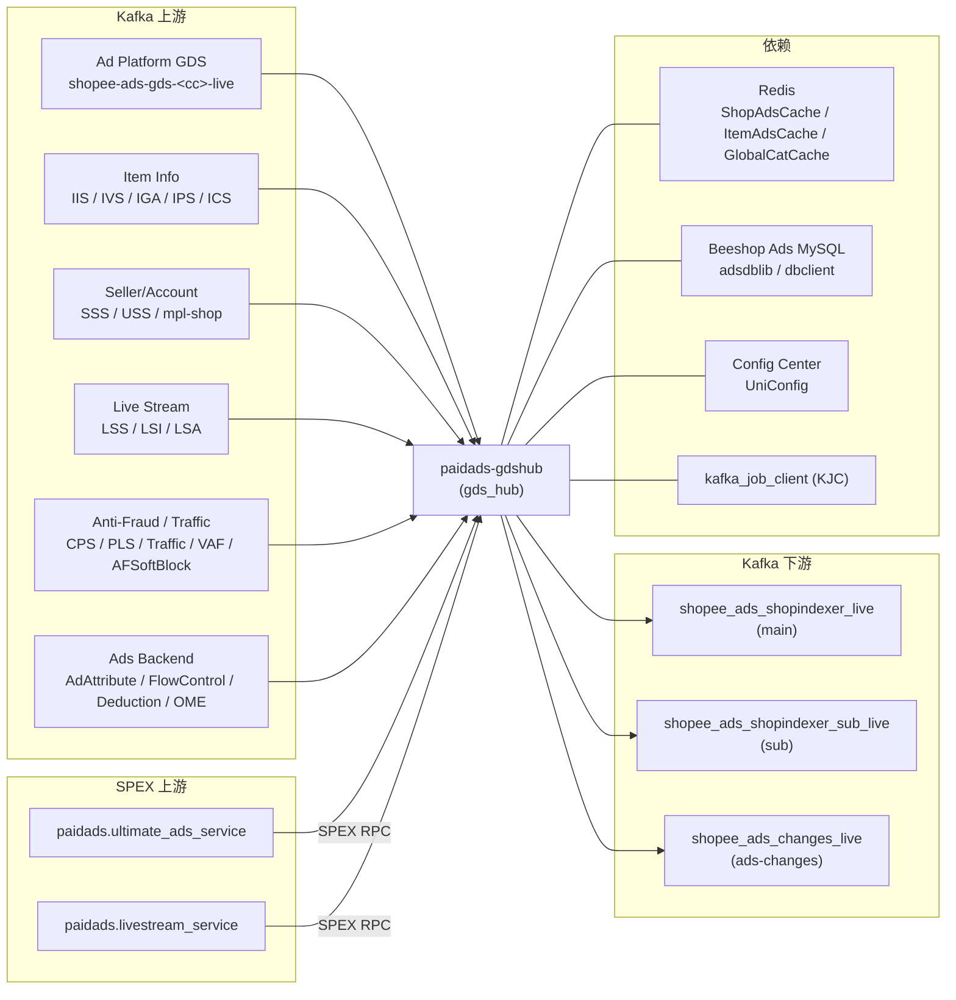

<!-- ads-workspace-gdoc-sync: gdoc_id=1vzaF0EJKW3DwKOJbvMrlG7mXi6OHDvv2n8Llc4hFV3Y gdoc_url=https://docs.google.com/document/d/1vzaF0EJKW3DwKOJbvMrlG7mXi6OHDvv2n8Llc4hFV3Y/edit -->

# paidads-gdshub / 广告 GDS Hub

> **Contributors**: fengjiao.wang ｜ **最后更新**：2026-05-27 ｜ [GitLab](https://git.garena.com/shopee/search_recommend/ai-copilot/ads-workspace/-/blob/master/docs/common/readme/paidads-gdshub/README.md)

> **Language**: [English](README.md) | [中文](README.zh-CN.md)

Repository: https://git.garena.com/shopee/deep/paidads-gdshub

---

## Table of Contents / 目录

- [Introduction / 项目概述](#introduction--项目概述)
- [Features / 核心功能](#features--核心功能)
- [Architecture / 项目架构](#architecture--项目架构)
  - [End-to-End Pipeline / 端到端链路](#end-to-end-pipeline--端到端链路)
  - [Service Topology / 上下游调用拓扑](#service-topology--上下游调用拓扑)
  - [Startup Sequence / 启动顺序](#startup-sequence--启动顺序)
- [Input Kafka Topics / 输入 Kafka Topic](#input-kafka-topics--输入-kafka-topic)
  - [Topic Catalog / Topic 清单](#topic-catalog--topic-清单)
  - [Consumer Infrastructure (KJC) / 消费基础设施](#consumer-infrastructure-kjc--消费基础设施)
- [Handler Business Logic / Handler 业务逻辑](#handler-business-logic--handler-业务逻辑)
  - [Ad Platform Events (GDS, SSS, USS, Deduction) / Ad Platform 相关](#ad-platform-events-gds-sss-uss-deduction--ad-platform-相关)
  - [Item Info and Attribute Events / Item 信息与属性](#item-info-and-attribute-events--item-信息与属性)
  - [Live Stream Events / Live Stream 事件](#live-stream-events--live-stream-事件)
  - [Video Events / Video 事件](#video-events--video-事件)
  - [Anti-Fraud and Traffic Control / 反作弊与流量控制](#anti-fraud-and-traffic-control--反作弊与流量控制)
  - [AdAttribute / FlowControl / Embedding](#adattribute--flowcontrol--embedding)
- [Router, Flattening and Output Keying / Router 扁平化与 Key 路由](#router-flattening-and-output-keying--router-扁平化与-key-路由)
- [Output Kafka Topics / 输出 Kafka Topic](#output-kafka-topics--输出-kafka-topic)
- [Processor Manager and Aggregators / Processor Manager 与 Aggregator](#processor-manager-and-aggregators--processor-manager-与-aggregator)
- [Unified Output Schema (indexjob.Job) / 统一输出结构](#unified-output-schema-indexjobjob--统一输出结构)
- [Directory Structure / 目录结构](#directory-structure--目录结构)
- [Configuration and Deployment / 配置与部署](#configuration-and-deployment--配置与部署)
- [Monitoring and Operations / 监控与排障](#monitoring-and-operations--监控与排障)
- [Key Terms / 关键术语](#key-terms--关键术语)
- [Additional Resources / 参考资料](#additional-resources--参考资料)
- [Frequently Asked Questions / 常见问题](#frequently-asked-questions--常见问题)

---

## Introduction / 项目概述

`paidads-gdshub` is the **aggregation and flattening hub** in the Shopee Paid Ads Index pipeline. The binary `gds_hub` (`cmd/server`) is a **pure Kafka consumer + producer** service — it exposes **no online SPEX RPC endpoints**.

Its sole responsibility is to subscribe to ~25 Kafka topic families from the marketplace and ads-platform buses, apply handler-specific business logic, flatten composite jobs (account → campaigns → ads), and emit canonical `indexjob.Job` protobuf messages to three downstream Kafka producers consumed by services such as `paidads-indexer`, `paidads-shop-indexer`, and `paidads-targetadsinfo`.

---

## Features / 核心功能

1. **~25 input Kafka topic families** — GDS (ads platform changes), IIS/IVS/IGA/IPS/ICS (item info), SSS/USS/mpl-shop (seller/account), CPS/PLS (censoring/price), LSS/LSI/LSA (live stream), LVS/LVU (video), Traffic/TrafficRules/VAF/AFSoftBlock (anti-fraud), AdAttribute/FlowControl/OME (ads backend)
2. **Router flattening + Brand Search Ads item fan-out** — account jobs expand to campaign → ads; Brand Search Ads additionally fans out to per-item jobs via ShopAdsCache + paginated item scan
3. **Three downstream Kafka producers** — main (`shopee_ads_shopindexer_live`), sub (`shopee_ads_shopindexer_sub_live`), and AdsChange side channel (`shopee_ads_changes_live`)
4. **Per-reason drop-level + rate limiter** — each handler has a hot-reloadable `drop-level` (0–100 random drop %) and token-bucket rate limiter via Spex DynamicConfig key `handler_<reason>`
5. **Deduction Manager first-send debouncer** — dedicated debounce buffer for deduction events; TTL and size configurable via Spex key `deduction_manager`

---

## Architecture / 项目架构

### End-to-End Pipeline / 端到端链路

```
Kafka Upstream Bus (25+ topic families)
           │
    ┌──────▼──────────────┐
    │  kafka_job_client    │  per-country entries, SASL auth, optional ratelimit
    └──────┬──────────────┘
           │  UnmarshallKafkaMessage → ValidateEvent
    ┌──────▼──────────────┐
    │  Handlers (V1 / V2) │
    └──────┬──────────────┘
           │  ProcessJob
           │  ├── SPEX RPC side-lookup (UAS / LiveStreamService)
           │  └── Cache / DB lookup (ItemAdsCache, ShopAdsCache, MySQL)
    ┌──────▼──────────────┐   (GDS / Deduction path only)
    │  Processor Manager  │
    │  + Aggregators       │
    └──────┬──────────────┘
           │  Route → Send(indexJob)
    ┌──────▼──────────────┐
    │       Router         │  flatten → key → getProducer
    └──┬──────┬────────┬───┘
       │      │        │
     main    sub   AdsChange
```

### Service Topology / 上下游调用拓扑



**Topology Table**

| Direction | Name | Protocol | Description |
|-----------|------|----------|-------------|
| Upstream | Ad Platform (GDS) Kafka | Kafka | `shopee-ads-gds-<cc>-live` — ads/campaign/account/keyword/credit create/update stream |
| Upstream | Item Info (IIS/IVS/IGA/IPS) Kafka | Kafka | Item info / stock / global attribute / price changes across 9+ countries |
| Upstream | Seller/Account (SSS/USS/mpl-shop) Kafka | Kafka | shop_tab / account_tab / Mpl CDC streams |
| Upstream | Live Stream (LSS/LSI/LSA) Kafka | Kafka | Live session / item-bag / affiliate events |
| Upstream | Anti-Fraud/Traffic Kafka | Kafka | CPS / PLS / Traffic / TrafficRules / VAF / AFSoftBlock streams |
| Upstream | Ads Backend Kafka | Kafka | AdAttribute / FlowControl / Deduction / OME events |
| Upstream | paidads.ultimate_ads_service | SPEX RPC | Side-lookup by LSS/LSI/LSA/LVS/LVU/VAF for active ads per shop/user |
| Upstream | paidads.livestream_service | SPEX RPC | Live-stream metadata (item-bag, session info) |
| Downstream | shopee_ads_shopindexer_live (main) | Kafka | ADS-type jobs from non-SSS/USS sources; consumed by paidads-indexer |
| Downstream | shopee_ads_shopindexer_sub_live (sub) | Kafka | All Type_ITEM jobs and all SSS/USS-sourced jobs |
| Downstream | shopee_ads_changes_live | Kafka | JSON `schema.AdsChange` from GDS + IISV2 forwarder |
| Dependency | Redis (ShopAdsCache / ItemAdsCache / GlobalCatCache) | Redis | Codis/elasticredis; shop-level / item-level ads queries and global category cache |
| Dependency | Beeshop Ads MySQL | MySQL | `GetUserCampaigns`, `GetAdvertisements`, `GetAdvertisement`, `AdvertisementRepo`, `CampaignRepo` |
| Dependency | Config Center (UniConfig) | Service | Subscribes 4 namespaces; binds Spex DynamicConfig |
| Dependency | kafka_job_client (KJC) | Library | Drives every consumer (broker/group/topic/SASL/ratelimit per entry) |
| Dependency | Spex Config | Service | Hot-reloads handler drop-level, limiter, deduction_manager |

### Startup Sequence / 启动顺序

`cmd/server/run.go`, in order:

1. `bootstrap.Setup(ctx, spexConfig)` — init logging, tracing, common infra
2. `spex.New(spexConfig)` → `RegisterAndSubscribeSpex` — register the service instance
3. `sps.RegisterSpexInterceptor` — wire `UpstreamLatency` + `UpstreamCounter` metrics interceptors
4. `uniconfig.New` → `EnableConfigCenter` → `SubscribeNamespaces(4)` — subscribe `gdshub_config_live_global`, `live_stream_live_default`, `campaign_flow_control_live_global`, `ads_removal_live`
5. `BindProtoInBatch(consts.ServiceName → &ConfigCenterConfig{})` — bind config struct for hot-reload
6. `getRemoteConfig(uniConfig)` → `conf.Parse()` — fetch and parse GDSHub remote config
7. `dependency.Init(ctx, &conf, uniConfig, spexAgent)` — init Redis / MySQL / Spex client dependencies
8. Build handlers + KJC clients — V1 path (GDS / SSS / USS / Deduction) inline in `run.go`; V2 path (IISV2/IVS/IPS/IGA/CPS/PLS/LSS/LSI/LSA/AdAttribute/LVS/LVU/FlowControl/Traffic/TrafficRules/VAF/OME/AFSoftBlock/ICS) via `setup.InitializeKafkaJobClients`
9. pprof + smoketest HTTP → `mgr.Start()` (aggregators) → `kjcCli.Start()` → `smoketest.Ready()` → `system.Wait`

---

## Input Kafka Topics / 输入 Kafka Topic

### Topic Catalog / Topic 清单

| KJC Config Key | Source System | Wire Type | Purpose |
|----------------|---------------|-----------|---------|
| `gds-kjc-list` | Ad Platform (GDS) | `beeshop_index.SearchIndex` proto | Ads / campaign / account / keyword / credit create/update |
| `iis-kjc-list` | Item Info Service V2 (IIS) | `item_event.Event` proto | Item info change + statistics change |
| `ivs-kjc-list` | Item Visibility/Stock (IVS V2) | `item_event.Event` proto | Item stock sold-out and restore events |
| `sss-kjc-list` | Seller Shop Service (SSS V1) | JSON `gdsRecord` | `shopee_shop_v2_<cc>_db.shop_tab` and `shopee_mpl_shop_<cc>_db.shop_logistics_info_tab` CDC |
| `mpl-shop-kjc-list` | SSS V2 (mpl-shop) | JSON `gdsRecord` | Same SSS source via separate consumer group |
| `uss-kjc-list` | User Service (USS) | JSON `gdsRecord` | User account update events |
| `cps-kjc-list` | Censoring Service (CPS V2) | `item_event.Event` proto | Item censoring response events |
| `pls-kjc-list` | Price Service (PLS V2) | `item_event.Event` proto | Item price change events |
| `deduction-kjc-list` | Ads Deduction | `beeshop_index.SearchIndex` proto | Ads budget deduction events |
| `iga-kjc-list` | Item Global Attribute (IGA) | `item_event.Event` proto | Global attribute change events |
| `ips-kjc-list` | Item Price/Stock (IPS) | `item_event.Event` proto | Item price/stock composite events |
| `lss-kjc-list` | Live Stream Session (LSS) | JSON `livestream.SessionMessage` | Live stream start/end session events |
| `lsi-kjc-list` | Live Stream Item (LSI) | Event proto | Live stream item bag add/remove events |
| `lsa-kjc-list` | Live Stream Affiliate (LSA) | Event proto | Live stream affiliate events |
| `ad-attribute-kjc-list` | Ads Backend (AdAttribute) | `pbAds.AdsInfoEvent` proto | Ad cold-start flag and ad-tag attribute updates |
| `flow-control-kjc-list` | FlowControl (budget) | `beeshop_mq.UpdatePaidAds` proto | Campaign flow-control state changes |
| `video-kjc-list` | Video Status (LVS) | Video event proto | Video post status change events |
| `video-user-kjc-list` | Video Creator (LVU) | Video user proto | Video creator status change events |
| `traffic-kjc-list` | Traffic / Deboost | `traffic.ExternalInteraction_ADS_ItemEvent` proto | Item deboost add/remove (scene-based) |
| `traffic-rules-kjc-list` | TrafficRules (censorship) | Event proto | Search ads censorship-by-rule events |
| `voucher-anti-fraud-kjc-list` | Voucher Anti-Fraud (VAF) | Event proto | Voucher/anti-fraud events |
| `oh-my-embedding-kjc-list` | Oh My Embedding (OME) | Event proto | Embedding update events |
| `antifraud-soft-block-kjc-list` | Anti-Fraud SoftBlock | JSON `AFSoftBlockMessage` | Anti-fraud soft-block probability events |
| `ics-kjc-list` | Item Category Service (ICS) | Event proto | Item category assignment change events |
| `target-pid-kjc-list` | (reserved) | — | Reserved; not active in current deployment |

Each KJC key maps to a list of per-country `kjc.Config` entries. One entry = one Kafka broker cluster + consumer group + SASL credentials for one country/region.

### Consumer Infrastructure (KJC) / 消费基础设施

Each `kjc.Config` entry contains: `brokers`, `groupname`, `topiclist`, SASL credentials, `workers`, `workbufsize`, and optionally `ratelimit`. Traffic and anti-fraud consumers are configured with `ratelimit: 300` to protect downstream throughput.

V1 handlers (GDS/SSS/USS/Deduction) use `kjc.Client` with `MessageToJob` + `Process` callbacks. V2 handlers use the generic `EventHandlerV2[T]` framework, which adds distributed tracing span injection and a 30-second per-job processing timeout.

---

## Handler Business Logic / Handler 业务逻辑

### Ad Platform Events (GDS, SSS, USS, Deduction) / Ad Platform 相关

| Handler | Input Type | Business Logic | IndexReason | Output |
|---------|-----------|----------------|-------------|--------|
| GDS | `beeshop_index.SearchIndex` proto | Unmarshal → `job.NewGDSJob(source=GDS)` → `processorMgr.Route`; also calls `Forwarder.ForwardEvent` which writes `ADS_ADVERTISEMENT` and `ADS_KEYWORD` type events to AdsChangeWriter | `GDS_CREATE` (INSERT) / `GDS_UPDATE` (UPDATE) | main or sub (via router) + AdsChangeWriter |
| SSS (V1) | JSON `gdsRecord` | Parse table name: `shopTable` → `buildShopSearchIndex`; `logisticsInfoTable` → `buildShopLogisticsInfoSearchIndex`; unknown → ignore | `SSS_INDEX_REASON` | sub (source=SSS → sub) |
| SSS V2 (mpl-shop) | JSON `gdsRecord` | Same handler as SSS V1 | `SSS_INDEX_REASON` | sub |
| USS | JSON `gdsRecord` | `buildUserSearchIndex` → `job.NewGDSJob(source=USS)` → `processorMgr.Route` | `USS_INDEX_REASON` | sub (source=USS → sub) |
| Deduction | `beeshop_index.SearchIndex` proto | `deductionProcessorMgr.Route`; if `EnableSendFirstDebouncer=true` passes through debounce buffer | `DEDUCTION_INDEX_REASON` | main (via router) |

**GDS AdsChange forwarding**: `GDSForwarder.ForwardEvent` dispatches on job type — `ADS_ADVERTISEMENT` → `forwardAdsChangeEvent`; `ADS_KEYWORD` → `forwardKeywordChangeEvent`. Both serialize a `schema.AdsChange` to JSON and write to `shopee_ads_changes_live`.

### Item Info and Attribute Events / Item 信息与属性

All V2 handlers; all output to sub producer.

| Handler | Input Type | Business Logic | IndexReason |
|---------|-----------|----------------|-------------|
| IIS (V2) | `item_event.Event` (INFO_CHANGE / STATISTICS_CHANGE) | Validate field diffs (status, condition, flag, name, images, tier variation, brand, logistics, category, compatibility); concurrent `ItemAdsCache` + `ShopAdsCache` lookup; calls `Forwarder.ForwardAdChanges` for item info changes | `IIS_STATUS` / `IIS_CONDITION` / `IIS_FLAG` / `IIS_NAME` / `IIS_IMAGE` / `IIS_TIER_VARIATION` / `IIS_BRAND_ID` / `IIS_LOGISTIC_INFO` / `IIS_CATEGORY_ID` / `IIS_FE_CATEGORY_ID` / `IIS_INCLUDE_FREE_SHIPPING` / `IIS_COMPATIBILITY_INFO` / `IIS_RATING` |
| IVS (V2) | `item_event.Event` | Item stock sold-out / restore; ItemAdsCache + ShopAdsCache | `IVS_INDEX_REASON` |
| IPS | `item_event.Event` | Item price/stock change; ItemAdsCache + ShopAdsCache | `IPS_INDEX_REASON` |
| IGA | `item_event.Event` | Item global attribute change; ItemAdsCache + ShopAdsCache; skips regions in `IgaKjcDisableRegions` | `IGA_INDEX_REASON` |
| CPS (V2) | `item_event.Event` | Censoring response; ItemAdsCache + ShopAdsCache | `CPS_INDEX_REASON` |
| PLS (V2) | `item_event.Event` | Price change; ItemAdsCache + ShopAdsCache; env-aware | `PLS_INDEX_REASON` |
| ICS | Item category event | Category assignment change; `ItemCategoryRepo` + `GlobalCategoryCache` | `ICS_INDEX_REASON` |

**IISV2 AdsChange forwarding**: Only for `EVENT_ITEM_INFO_CHANGE` (not statistics). Extracts name + images diff from `ItemInfoEvent`, writes `schema.AdsChange{ChangeType: ItemChange}` JSON to `shopee_ads_changes_live`.

### Live Stream Events / Live Stream 事件

| Handler | Input Type | Business Logic | IndexReason | Output |
|---------|-----------|----------------|-------------|--------|
| LSS | JSON `livestream.SessionMessage` | Start/end session only; skip test/food sessions; query `UltimateAdsServiceRepo.GetLiveStreamAdsIncludingMCNCreatedByUID`; on EndSession also process antou ads (ROI_TWO) via ItemAdsCache + LiveStreamService + UserShopCache | `LIVE_STREAM_STREAMER_ONLINE` / `LIVE_STREAM_STREAMER_OFFLINE` | main producer |
| LSI | Live stream item bag event | Item added/removed from live stream bag; ItemAdsCache + UAS | `LIVE_STREAM_ITEM_INDEX_REASON` | main + sub |
| LSA | Live stream affiliate event | Affiliate join/leave; UAS lookup | `LIVE_STREAM_AFFILIATE_INDEX_REASON` | main producer |

In the current startup path, LSS is wired through `setup.InitializeKafkaJobClients` to the V2 `handler.LSS`. The repository still keeps the legacy `internal/handler/livestreamsession.go` handler, but the active runtime path is V2 LSS; the legacy `LiveStreamSession` should not be treated as the primary active path.

### Video Events / Video 事件

| Handler | Input Type | Business Logic | IndexReason | Output |
|---------|-----------|----------------|-------------|--------|
| LVS (Video) | Video status event | Video post status change; `UltimateAdsServiceRepo` lookup for active video ads by UID | `VIDEO_STATUS_CHANGE_INDEX_REASON` | main producer |
| LVU (VideoUser) | Video creator event | Video creator status change; UAS lookup | `VIDEO_CREATOR_STATUS_CHANGE_INDEX_REASON` | main producer |

### Anti-Fraud and Traffic Control / 反作弊与流量控制

| Handler | Input Type | Business Logic | IndexReason | Output |
|---------|-----------|----------------|-------------|--------|
| Traffic | `traffic.ExternalInteraction_ADS_ItemEvent` proto | Validate event type (ADD=remove / DELETE=restore) + data type (ITEM only); compute deboost scenes via `traffic_anti_fraud.AggregateScenes`; query ItemAdsCache; filter placements via `TrafficConfigClient` | `TRAFFIC_AF_REMOVE_ITEM_REASON` / `TRAFFIC_AF_RESTORE_ITEM_REASON` | sub producer |
| TrafficRules | TrafficRules event | Censorship by rule IDs; ItemAdsCache lookup | `TRAFFIC_AF_RULES_INDEX_REASON` | sub producer |
| VAF | VAF event | Voucher/anti-fraud; `UltimateAdsServiceRepo` lookup | `VOUCHER_ANTI_FRAUD_INDEX_REASON` | sub producer |
| AFSoftBlock | JSON `AFSoftBlockMessage` | Anti-fraud soft-block probability; `CampaignRepo` lookup | `ANTIFRAUD_SOFT_BLOCK_INDEX_REASON` | main producer |

### AdAttribute / FlowControl / Embedding

| Handler | Input Type | Business Logic | IndexReason | Output |
|---------|-----------|----------------|-------------|--------|
| AdAttribute | `pbAds.AdsInfoEvent` proto | Only `UPDATE` operations; accepted: `ADS_TYPE_UPDATE_COLD_START` (ROI_TWO only) and `ADS_TYPE_UPDATE_ADTAG` (17 supported placements: KEYWORD_SEARCH, DDR, YMAL, ROI_TWO, NPB variants, etc.) | `AD_ATTRIBUTE_UPDATE_COLD_START_REASON` / `AD_ATTRIBUTE_UPDATE_AD_TAG_REASON` | main producer |
| FlowControl | `beeshop_mq.UpdatePaidAds` proto | Only `IndexSource_ADS_FLOW_CONTROL`; validate country + campaignId + userId (fallback: UserShopCache); skip stale events (> 10 min); `AdvertisementRepo.GetAdsInfosByCampaignID` | `AD_FLOW_CONTROL_REASON` | main producer |
| OME | Embedding event | Embedding update; write to sub producer | `OHMYEMB_UPDATE_REASON` | sub producer |

---

## Router, Flattening and Output Keying / Router 扁平化与 Key 路由

The router (`internal/router/router.go`) is used only by the V1 GDS path (GDS/SSS/USS/Deduction via `processorMgr.Route → srcRouter.Send`). V2 handlers write directly to producers, bypassing the router.

### Step 1 — flatten

| Input Type | Flatten Logic |
|------------|---------------|
| `Type_ACCOUNT` | `flattenAccount` → `dbClient.GetUserCampaigns` → filter `needToReindexCampaign` → recurse into `Type_CAMPAIGN`; SSS/USS sources additionally call `flattenBrandSearchAdsJobToItems`; `GDS_ACCOUNT_BALANCE_INCREASE` / `GDS_FREE_CREDIT_INSERT` additionally run `filter.FilterLiveAds` |
| `Type_CAMPAIGN` | `flattenCampaign` → `dbClient.GetAdvertisements(campaignId, userId, country, HandledPlacementListForAdsEvent)` → filter `needToReindexAds` |
| `Type_ADS` | `filterAds` → `dbClient.GetAdvertisement` → check `HandledPlacementsForAdsEvent`; enrich `Placement`, `ShopId`, `AdsAccountId`; if `placement == BRAND_SEARCH_ADS && reason == GDS_CREATE` → additionally `flattenBrandSearchAdsJobToItems` |
| other | pass through unchanged |

**Campaign reindex filter** (`needToReindexCampaign`): status must be `ADS_NORMAL`; `end_time == 0` (no expiry) OR (`end_time > now` AND `start_time <= now + 2 days`).

**Ads reindex filter** (`needToReindexAds`): status must be `ADS_NORMAL`.

**Brand Search Ads item fan-out** (`flattenBrandSearchAdsJobToItems`): check `shopAdsCache.ShopHasAdsWithPlacementList([BRAND_SEARCH_ADS])` → paginated `shopRepo.ScanValidItem` → emit one `Type_ITEM` job per item ID.

### Step 2 — key

| Type | Kafka key |
|------|-----------|
| `Type_ADS` | `fmt.Sprintf("%d", ads_id)` |
| `Type_ITEM` | `fmt.Sprintf("%d", item_id)` |
| `Type_UNKNOWN_TYPE` | returns error |

### Step 3 — producer selection (`getProducer`)

| Condition | Producer |
|-----------|----------|
| `Type_ITEM` | sub |
| `Source == SSS \|\| Source == USS` | sub |
| all others | main |

---

## Output Kafka Topics / 输出 Kafka Topic

| Config Key | Topic Name | Purpose | Consumers |
|-----------|-----------|---------|-----------|
| `kafka-writer` / `producer-config` | `shopee_ads_shopindexer_live` (Latam: `paidads-gdshub-us-main-global-live`) | Main output — ADS-type jobs from GDS / Deduction / FlowControl / AdAttribute / LSS / LSI / LSA / LVS / LVU / AFSoftBlock | paidads-indexer, paidads-shop-indexer |
| `sub-kafka-writer` / `sub-producer-config` | `shopee_ads_shopindexer_sub_live` (Latam: `paidads-gdshub-us-sub-global-live`) | Sub output — all Type_ITEM jobs + SSS/USS-sourced + Traffic / TrafficRules / VAF / OME / IIS / IVS / IPS / IGA / CPS / PLS | paidads-indexer, paidads-targetadsinfo |
| `ads-changes-writer` | `shopee_ads_changes_live` (Latam: `paidads-gdshub-us-changes-global-live`) | AdsChange side channel — JSON `schema.AdsChange` from GDS (ADS_ADVERTISEMENT / ADS_KEYWORD) and IISV2 (item name/image) | Recall team consumers |

---

## Processor Manager and Aggregators / Processor Manager 与 Aggregator

The Processor Manager (`internal/processor/manager.go`) handles the GDS V1 path only.

**`manager.Route(gdsJob)` flow**:
1. Validate country against `consts.CountryMap`
2. `getProcessorKind(cmd, typ)` → maps `(SearchIndexCmd, SearchIndexType)` to `kind.Kind`
3. Set `IndexReason` via `getIndexReason(cmd, source)`
4. If aggregator registered for this kind → `agg.add(gdsJob)` (buffered until TTL/size hit)
5. Else → `p.Process(ctx, gdsJob)` → `srcRouter.Send(indexJob)`

**`kind.Kind` mapping (selected)**:

| SearchIndexCmd | SearchIndexType | kind.Kind |
|----------------|-----------------|-----------|
| INSERT | ADS_ADVERTISEMENT | InsertAds |
| UPDATE | ADS_ADVERTISEMENT | UpdateAds |
| INSERT | ITEM | InsertItem |
| UPDATE | ITEM | UpdateItem |
| UPDATE | ADS_CAMPAIGN | UpdateCampaign |
| UPDATE | USER | UpdateUser |
| UPDATE | SHOP | UpdateShop |
| UPDATE | ADS_ACCOUNT | UpdateAdsAccount |
| INSERT | ADS_CREDIT | InsertAdsCredit |
| UPDATE | ADS_CREDIT | UpdateAdsCredit |
| INSERT | ADS_KEYWORD | InsertAdKeyword |
| UPDATE | ADS_KEYWORD | UpdateAdKeyword |
| INSERT | ADS_KEYWORD_WHITELIST | InsertKwWhitelist |
| UPDATE | ADS_KEYWORD_WHITELIST | UpdateKwWhitelist |
| any | LIVE_STREAM_SESSION | LiveStreamSession |
| UPDATE | ADS_CREATIVE | UpdateCreative |
| INSERT / UPDATE | ADS_NEW_PRODUCT_BOOST | InsertNewProductBoost / UpdateNewProductBoost |
| INSERT / UPDATE | ADS_POTENTIAL_PRODUCT | InsertAdsPotentialProduct / UpdateAdsPotentialProduct |

**Aggregators**: configured via `ProManager.AggAll` (config key `agg-all`). Each aggregator buffers jobs by kind and triggers `BulkInterface.ProcessBulk` when TTL (`interval`) or `bulk-size` is exceeded. Example: `insert-kw-whitelist` can be configured with `bulk: true`.

**Deduction Manager** (`processor.NewDeductionManagerWithSpex`): independent from the main manager, bound to Spex key `"deduction_manager"`. Config fields:
- `enable-send-first-debouncer` (bool): enables the deduplicated first-send buffer
- `debouncer-ttl` (duration string, e.g. `"10m"`): TTL window for deduplication
- `debouncer-size` (int, e.g. `100000`): max buffer capacity

---

## Unified Output Schema (indexjob.Job) / 统一输出结构

All three producers emit `indexjob.Job` (protobuf-marshaled).

| Field | Type | Description |
|-------|------|-------------|
| `type` | `indexjob.Type` | `Type_ADS` or `Type_ITEM` |
| `source` | `indexjob.IndexSource` | Origin system (GDS / IIS / IVS / SSS / USS / DEDUCTION / CPS / PLS / ...) |
| `reason` | `indexjob.IndexReason` | Specific change reason (e.g. `GDS_CREATE`, `IIS_STATUS`, `TRAFFIC_AF_REMOVE_ITEM_REASON`) |
| `country` | string | Country/region code (e.g. "SG", "MY") |
| `ads_id` | int64 | Ads ID (Type_ADS jobs) |
| `campaign_id` | int64 | Campaign ID |
| `user_id` | int64 | Ads account user ID |
| `shop_id` | int64 | Shop ID |
| `item_id` | int64 | Item ID (Type_ITEM jobs) |
| `placement` | int32 | `TrackingPlacement` enum value |
| `ads_account_id` | int64 | Ads account ID (often == user_id) |
| `bulk_info.placements` | []int32 | Placement include filter |
| `bulk_info.exclude_placements` | []int32 | Placement exclude filter |
| `ads_list` | []*beeshop_ads.AdsInfo | Per-ads detail list (set by SendAdsIndexJob) |
| `ext_info.live_stream_info` | LiveStreamInfo | Session ID + session start TS (LSS jobs) |
| `ext_info.ad_attribute_info` | AdAttributeInfo | `cold_start_flag` or `ad_tag + pricing_type` (AdAttribute jobs) |

**Primary downstream consumers**: `paidads-indexer`, `paidads-shop-indexer`, `paidads-targetadsinfo`.

---

## Directory Structure / 目录结构

```
paidads-gdshub/
├── bootstrap/                  # Service bootstrap (logging, tracing, common infra)
├── cmd/
│   ├── server/                 # Binary entry: main.go + run.go
│   └── tools/                  # Offline tools: send_iis, send_ics
├── config/
│   ├── config.go               # Config interface + allInOne struct
│   ├── configcenter.go         # ConfigCenterConfig + GDSHub struct (all KJC list fields)
│   ├── promanager.go           # ProManager + Aggregator config structs
│   ├── server.go               # GDSHubServerConfig.Parse → "gds-hub" section
│   ├── reload.go               # Hot-reload watcher
│   └── files/                  # live.yml, liveish.yml, test.yml
├── deploy/                     # Mesos deployment configs
├── internal/
│   ├── consts/                 # CountryMap, HandledPlacementLists
│   ├── dependency/             # Singletons: DBClient, ShopAdsCache, ItemAdsCache, UserShopCache, etc.
│   ├── exporter/               # Prometheus metrics definitions and recording helpers
│   ├── handler/                # All Kafka message handlers (V1 + V2)
│   │   ├── forwarder/          # GDSForwarder: ForwardEvent + ForwardAdChanges
│   │   └── decoder/            # Message decoders
│   ├── job/                    # GDSJob + indexjob.Job constructors (Campaign, Advertise, Item)
│   ├── kafka/                  # ProtoProducer wrapper
│   ├── kind/                   # kind.Kind enum definition
│   ├── processor/              # manager, deductionManager, aggregator, per-kind processors
│   ├── repository/             # ShopRepo, UltimateAdsServiceRepo, LiveStreamRepo, AdvertisementRepo, CampaignRepo
│   ├── router/                 # Router: flatten + key + producer dispatch
│   ├── schema/                 # Internal schemas (livestream.SessionMessage, AdsChange, etc.)
│   ├── setup/                  # setup.go: InitializeKafkaJobClients (all V2 handlers)
│   ├── sps/                    # Spex interceptor registration
│   ├── system/                 # system.Wait (graceful shutdown)
│   └── types/                  # Shared types
├── pkg/filter/                 # filter.Filter: FilterLiveAds for credit/balance events
├── proto/external/             # External proto deps (item_event, traffic protos, etc.)
├── scripts/                    # Mesos deploy scripts
├── Makefile
└── sp-workspace.yml
```

---

## Configuration and Deployment / 配置与部署

### Config Center Namespaces

| Namespace | Group / Project | Purpose |
|-----------|-----------------|---------|
| `gdshub_config_live_global` | paidads / index_pipeline | Main KJC lists, Kafka writer configs, DB/cache configs |
| `live_stream_live_default` | paidads / index_pipeline | Live stream handler config |
| `campaign_flow_control_live_global` | paidads / index_pipeline | Flow-control handler config |
| `ads_removal_live` | paidads / index_pipeline | Ads removal/filtering rules |

### DynamicConfig (Spex)

Spex service name: `paidads.gdshub`. Key sub-keys:

| Spex Key | Type | Hot-Reloadable Fields |
|----------|------|-----------------------|
| `deduction_manager` | `DeductionManagerReloadableConfig` | `enable-send-first-debouncer` (bool), `debouncer-ttl` (duration), `debouncer-size` (int) |
| `handler_<reason>` (e.g. `handler_gds_index_reason`) | `ReloadableConfig` | `drop-level` (0–100 random drop %), `limiter.limit` (tokens/s), `limiter.burst` |

All handlers bind their Spex key at startup via `spex.Bind + spex.Watch` for runtime hot-reload.

### Build

```bash
make          # build → bin/paidads_gdshub_server
make gdshub   # same target
```

### Deploy

Mesos deployment via `deploy/` configs and `scripts/`. Environments: `live`, `liveish`, `test`.

---

## Monitoring and Operations / 监控与排障

### Key Metrics (prefix: `paidads_gdshub_`)

| Metric | Type | Labels | Description |
|--------|------|--------|-------------|
| `event_counter` | Counter | source, country, cmd, type | Events received per source/country/cmd/type |
| `receive_drop_counter` | Counter | source, type (receive/drop/ignore) | Events received, randomly dropped, or ignored per handler |
| `event_filter` | Counter | source, country, kind, reason | Events filtered out (inactive-campaign, not-supported-placement, live-ads-denied) |
| `latency` | Summary (p50/p90/p99) | country, stage | Per-stage latency in ms (router-flatten-account, IIS-Validate-Event, Traffic-Process-Job, etc.) |
| `error` | Counter | country, kind, error | Errors by kind (flattenErr, sendErr, GetAdvertisement, dbManager.*) |
| `counter` | Counter | country, kind, reason | Indexed job count per kind/reason |
| `agg_total_event` / `agg_dropped_event` / `agg_processed_event` | Counter | kind | Aggregator buffer throughput |
| `upstream_latency` | Histogram | country, namespace, cmd | SPEX RPC latency to UAS / LiveStreamService |
| `upstream_request` | Counter | country, namespace, cmd, code | SPEX RPC call count + response code |
| `cache_latency` | Summary | kind, stage | Redis cache call latency |
| `debounce_counter` | Counter | country, kind, source, operation | Deduction debouncer throughput (insert/skip/process) |
| `message_size` | Counter | country, type, reason, destination | Outgoing Kafka message size |

### Troubleshooting Checklist

| Symptom | Where to look |
|---------|---------------|
| A source family produces no output | Check `receive_drop_counter{source=<handler>}` — is it even receiving? Check `event_filter{reason=inactive-*}` if receiving but filtered. Check KJC consumer lag. |
| `flattenErr` counter rising | Check `error{kind=router,error=flattenErr}` + `latency{stage=router-flatten-account}` — likely `dbClient.GetUserCampaigns` or `GetAdvertisements` is slow/failing. |
| Jobs going to wrong topic | Verify `router.getProducer` rules: `Type_ITEM` and `Source=SSS/USS` → sub. Check handler IndexSource is set correctly. |
| Brand Search Ads not expanded to items | Check `error{error=flattenShopToItems}`. Verify `shopAdsCache.ShopHasAdsWithPlacementList` returns true and `shopRepo.ScanValidItem` is healthy. |
| Deduction overloading downstream | Check `debounce_counter{operation=insert/skip/process}`. Enable `enable-send-first-debouncer=true` in Spex; tune `debouncer-ttl` and `debouncer-size`. |
| `shopee_ads_changes_live` is empty | Verify GDS events have type `ADS_ADVERTISEMENT` or `ADS_KEYWORD`. Verify IISV2 is receiving `EVENT_ITEM_INFO_CHANGE`. Check ads-changes-writer Kafka producer health. |

---

## Key Terms / 关键术语

| Term | Description |
|------|-------------|
| indexjob.Job | Canonical output message; protobuf-marshaled to all three downstream Kafka topics |
| IndexReason | Enum field indicating why reindex was triggered (e.g. `GDS_CREATE`, `IIS_STATUS`) |
| IndexSource | Enum field indicating which upstream system produced the event (GDS, IIS, SSS, USS, ...) |
| main producer | Kafka producer for `shopee_ads_shopindexer_live` — ADS-type jobs from non-SSS/USS V1 sources |
| sub producer | Kafka producer for `shopee_ads_shopindexer_sub_live` — all Type_ITEM jobs + SSS/USS-sourced + V2 item-level handlers |
| AdsChangeWriter | Kafka producer for `shopee_ads_changes_live` — JSON `schema.AdsChange` side channel |
| flatten | Router operation expanding an account/campaign job into individual ads or item jobs |
| KJC | kafka_job_client — internal Kafka consumer library driving every input topic consumer |
| Processor Manager | In-process dispatcher mapping `(cmd, type)` to a processor or aggregator for V1 jobs |
| Deduction Manager | Independent manager for deduction events with a first-send debounce buffer |
| aggregator | Buffers jobs by kind; triggers bulk processing when TTL or size threshold is hit |
| debouncer | First-send deduplication buffer for Deduction events — skips re-sends within TTL window |
| GDS | Ad Platform data bus — authoritative source for ads/campaign/account/keyword/credit changes |
| SSS | Seller Shop Service — shop profile CDC stream |
| USS | User Service — user/account CDC stream |
| IIS / IVS / IGA / IPS / CPS / PLS / ICS | Item info subsystems: Info, Visibility/Stock, Global Attribute, Price/Stock, Censoring, Price, Category |
| LSS / LSI / LSA | Live Stream Session / Item / Affiliate handlers |
| LVS / LVU | Live Video Status / Video Creator handlers |
| VAF | Voucher Anti-Fraud handler |
| OME | Oh My Embedding — embedding update handler |
| AFSoftBlock | Anti-Fraud Soft-Block handler |
| GDSForwarder | Writes ADS_ADVERTISEMENT / ADS_KEYWORD and item changes to `shopee_ads_changes_live` |
| UltimateAdsServiceRepo | SPEX client wrapper for `paidads.ultimate_ads_service` |
| ShopAdsCache | Redis cache: whether a shop has active ads for given placements |
| ItemAdsCache | Redis cache: ads info list for a given item |
| UniConfig | Shopee unified config client supporting Config Center hot-reload |
| gdshub_config_live_global | Primary Config Center namespace for KJC configs and service settings |
| DynamicConfig | Hot-reloadable config struct bound via `spex.Bind + spex.Watch` |
| Brand Search Ads | Ads type for brand keyword search; fan-out creates per-item jobs for all valid items in the shop |
| eCPM | Effective Cost per Mille — total ad spend / total impressions |
| uGSP | Generalized Second Price auction used in Paid Ads ranking |

---

## Additional Resources / 参考资料

- Repository: https://git.garena.com/shopee/deep/paidads-gdshub
- Paid Ads Glossary (Confluence): https://confluence.shopee.io/pages/viewpage.action?spaceKey=SPAD&title=Paid+Ads+Glossary
- paidads.gdshub Config Center: https://space.shopee.io/console/cmdb/config_center/detail/shopee.mp_search_recommendation_ads.paidads.data_application.ads_indexer.indexer.gdshub/resource_management?env=live&project=%5Bsp%5Dpaidads&resourceType=spex&spexServiceName=paidads.gdshub&tab=namespace

---

## Frequently Asked Questions / 常见问题

**Q1: What is the single responsibility of gds_hub?**

It is a pure event-transformation hub: subscribe to upstream platform buses, apply handler logic, flatten composite entities into ads/item jobs, and publish to three downstream Kafka topics. No online traffic is served.

**Q2: How is it decided whether a job goes to the main or sub topic?**

The router's `getProducer` applies three rules: (1) `Type_ITEM` → sub; (2) `Source == SSS || Source == USS` → sub; (3) everything else → main. V2 handlers (IIS/IVS/CPS/PLS/IPS/IGA/Traffic/TrafficRules/VAF/OME) write directly to the sub producer and bypass the router entirely.

**Q3: Why does AdsChangeWriter exist as a separate channel?**

The Recall team needs a lightweight change feed of ads/item mutations (name, images, keyword adds) without consuming full `indexjob.Job` messages. GDS forwarder intercepts `ADS_ADVERTISEMENT` and `ADS_KEYWORD` events; IISV2 intercepts item info changes; both write compact `schema.AdsChange` JSON to `shopee_ads_changes_live`.

**Q4: Why does SSS/USS flatten Brand Search Ads to items?**

Brand Search Ads recall is item-level. When a shop's Brand Search Ads status changes (SSS/USS update), the system must re-index all valid items under the Brand Search Ads placement. Fan-out: verify `ShopAdsCache`, then paginate `shopRepo.ScanValidItem`.

**Q5: Why are most KJC entries split per country?**

Each country has a different Kafka cluster, SASL credentials, and consumer group. One logical KJC key maps to N per-country `kjc.Config` entries, each connecting to the correct broker.

**Q6: What are the two layers of rate limiting?**

Layer 1: KJC-level `ratelimit` (messages/second) per consumer group — protects against Kafka bursts. Layer 2: handler-level `drop-level` (random drop %) + token-bucket `limiter.limit/burst` per IndexReason via Spex DynamicConfig — hot-patchable without restart.

**Q7: Does a downstream write failure cause a message retry?**

No. Output producer writes are fire-and-forget (`Producer.SendWithKey`). The KJC framework re-delivers the Kafka message if `Process` returns a non-nil error, but errors from the output producer itself are only logged.

**Q8: Where is the Deduction debouncer configured?**

Via Spex DynamicConfig key `"deduction_manager"`. Fields: `enable-send-first-debouncer`, `debouncer-ttl` (e.g. `"10m"`), `debouncer-size` (e.g. `100000`). Applied at runtime via `spex.Watch` without restart.

<!-- Generated by ads-workspace/skills/ads-readme-generate | checked: 07577240ebe6caaf7b6cf2360added9de76ae379 -->
