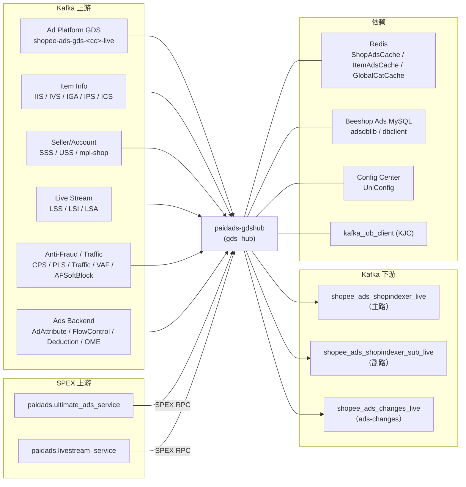

<!-- ads-workspace-gdoc-sync: gdoc_id=1V0Nmyg4qRbCcEqycYxdoPuyrF9TZX1LBRAzv7lm8x2c gdoc_url=https://docs.google.com/document/d/1V0Nmyg4qRbCcEqycYxdoPuyrF9TZX1LBRAzv7lm8x2c/edit -->

# 广告 GDS Hub / paidads-gdshub

> **Contributors**: fengjiao.wang ｜ **最后更新**：2026-05-27 ｜ [GitLab](https://git.garena.com/shopee/search_recommend/ai-copilot/ads-workspace/-/blob/master/docs/common/readme/paidads-gdshub/README.zh-CN.md)

> **Language**: [English](README.md) | [中文](README.zh-CN.md)

仓库地址：https://git.garena.com/shopee/deep/paidads-gdshub

---

## 目录 / Table of Contents

- [项目概述 / Introduction](#项目概述--introduction)
- [核心功能 / Features](#核心功能--features)
- [项目架构 / Architecture](#项目架构--architecture)
  - [端到端链路 / End-to-End Pipeline](#端到端链路--end-to-end-pipeline)
  - [上下游调用拓扑 / Service Topology](#上下游调用拓扑--service-topology)
  - [启动顺序 / Startup Sequence](#启动顺序--startup-sequence)
- [输入 Kafka Topic / Input Kafka Topics](#输入-kafka-topic--input-kafka-topics)
  - [Topic 清单 / Topic Catalog](#topic-清单--topic-catalog)
  - [消费基础设施（KJC） / Consumer Infrastructure (KJC)](#消费基础设施kjc--consumer-infrastructure-kjc)
- [Handler 业务逻辑 / Handler Business Logic](#handler-业务逻辑--handler-business-logic)
  - [Ad Platform 相关（GDS / SSS / USS / Deduction） / Ad Platform Events](#ad-platform-相关gds--sss--uss--deduction--ad-platform-events)
  - [Item 信息与属性 / Item Info and Attribute Events](#item-信息与属性--item-info-and-attribute-events)
  - [Live Stream / Live Stream Events](#live-stream--live-stream-events)
  - [Video / Video Events](#video--video-events)
  - [反作弊与流量控制 / Anti-Fraud and Traffic Control](#反作弊与流量控制--anti-fraud-and-traffic-control)
  - [AdAttribute / FlowControl / Embedding](#adattribute--flowcontrol--embedding-1)
- [Router 扁平化与 Key 路由 / Router, Flattening and Output Keying](#router-扁平化与-key-路由--router-flattening-and-output-keying)
- [输出 Kafka Topic / Output Kafka Topics](#输出-kafka-topic--output-kafka-topics)
- [Processor Manager 与 Aggregator / Processor Manager and Aggregators](#processor-manager-与-aggregator--processor-manager-and-aggregators)
- [统一输出结构（indexjob.Job） / Unified Output Schema](#统一输出结构indexjobjob--unified-output-schema)
- [目录结构 / Directory Structure](#目录结构--directory-structure)
- [配置与部署 / Configuration and Deployment](#配置与部署--configuration-and-deployment)
- [监控与排障 / Monitoring and Operations](#监控与排障--monitoring-and-operations)
- [关键术语 / Key Terms](#关键术语--key-terms)
- [参考资料 / Additional Resources](#参考资料--additional-resources)
- [常见问题 / Frequently Asked Questions](#常见问题--frequently-asked-questions)

---

## 项目概述 / Introduction

`paidads-gdshub` 是 Shopee Paid Ads Index 链路中的**聚合与扁平化枢纽**。二进制 `gds_hub`（`cmd/server`）是一个**纯 Kafka 消费 + 生产**服务——**不对外暴露任何在线 SPEX RPC 接口**。

其核心职责是订阅来自 marketplace 和 ads-platform 总线的约 25 个 Kafka topic 族，执行各 handler 的业务逻辑，将复合实体（account → campaign → ads）扁平化，并将标准化的 `indexjob.Job` protobuf 消息发送到三路下游 Kafka producer，由 `paidads-indexer`、`paidads-shop-indexer`、`paidads-targetadsinfo` 等服务消费。

---

## 核心功能 / Features

1. **约 25 个输入 Kafka topic 族** — GDS（广告平台变更）、IIS/IVS/IGA/IPS/ICS（商品信息）、SSS/USS/mpl-shop（卖家/账号）、CPS/PLS（审核/价格）、LSS/LSI/LSA（直播）、LVS/LVU（视频）、Traffic/TrafficRules/VAF/AFSoftBlock（反作弊）、AdAttribute/FlowControl/OME（广告后台）
2. **Router 扁平化 + Brand Search Ads item fan-out** — account 级别 job 展开为 campaign → ads；Brand Search Ads 还会进一步通过 ShopAdsCache + 分页 item 扫描展开为 per-item job
3. **三路下游 Kafka producer** — 主（`shopee_ads_shopindexer_live`）、副（`shopee_ads_shopindexer_sub_live`）、AdsChange 旁路（`shopee_ads_changes_live`）
4. **按 IndexReason 的 drop-level + 限流** — 每个 handler 通过 Spex DynamicConfig key `handler_<reason>` 热更新 `drop-level`（0–100 随机丢弃比例）和令牌桶限流器
5. **Deduction Manager first-send debouncer** — 专用于 Deduction 事件的去重缓冲，TTL 和容量通过 Spex key `deduction_manager` 配置

---

## 项目架构 / Architecture

### 端到端链路 / End-to-End Pipeline

```
Kafka 上游总线（25+ 个 topic 族）
           │
    ┌──────▼──────────────┐
    │  kafka_job_client    │  按国家分片，SASL 认证，可选 ratelimit
    └──────┬──────────────┘
           │  UnmarshallKafkaMessage → ValidateEvent
    ┌──────▼──────────────┐
    │  Handlers (V1 / V2) │
    └──────┬──────────────┘
           │  ProcessJob
           │  ├── SPEX RPC 旁路查询（UAS / LiveStreamService）
           │  └── Cache / DB 查询（ItemAdsCache, ShopAdsCache, MySQL）
    ┌──────▼──────────────┐   （仅 GDS / Deduction 路径）
    │  Processor Manager  │
    │  + Aggregators       │
    └──────┬──────────────┘
           │  Route → Send(indexJob)
    ┌──────▼──────────────┐
    │       Router         │  扁平化 → key → 选择 producer
    └──┬──────┬────────┬───┘
       │      │        │
     主路    副路   AdsChange
```

### 上下游调用拓扑 / Service Topology



**拓扑表格**

| 方向 | 名称 | 协议 | 说明 |
|------|------|------|------|
| 上游 | Ad Platform (GDS) Kafka | Kafka | `shopee-ads-gds-<cc>-live` — 广告/活动/账号/关键词/信用额度创建/更新流 |
| 上游 | Item Info (IIS/IVS/IGA/IPS) Kafka | Kafka | 9+ 国家的商品信息/库存/全局属性/价格变更事件 |
| 上游 | Seller/Account (SSS/USS/mpl-shop) Kafka | Kafka | shop_tab / account_tab / Mpl CDC 流 |
| 上游 | Live Stream (LSS/LSI/LSA) Kafka | Kafka | 直播场次/商品挂车/联盟事件 |
| 上游 | Anti-Fraud/Traffic Kafka | Kafka | CPS / PLS / Traffic / TrafficRules / VAF / AFSoftBlock 流 |
| 上游 | Ads Backend Kafka | Kafka | AdAttribute / FlowControl / Deduction / OME 事件 |
| 上游 | paidads.ultimate_ads_service | SPEX RPC | LSS/LSI/LSA/LVS/LVU/VAF handler 旁路查询店铺/用户的活跃广告 |
| 上游 | paidads.livestream_service | SPEX RPC | 直播元数据（商品袋、场次信息）查询 |
| 下游 | shopee_ads_shopindexer_live（主路） | Kafka | 非 SSS/USS 来源的 ADS 类型 job；由 paidads-indexer 消费 |
| 下游 | shopee_ads_shopindexer_sub_live（副路） | Kafka | 全部 Type_ITEM job 以及所有 SSS/USS 来源 job |
| 下游 | shopee_ads_changes_live | Kafka | GDS + IISV2 forwarder 输出的 JSON `schema.AdsChange` 旁路 |
| 依赖 | Redis（ShopAdsCache / ItemAdsCache / GlobalCatCache） | Redis | Codis/elasticredis；handler 查询店铺级/商品级广告缓存及全局类目缓存 |
| 依赖 | Beeshop Ads MySQL | MySQL | `GetUserCampaigns`、`GetAdvertisements`、`GetAdvertisement`、`AdvertisementRepo`、`CampaignRepo` |
| 依赖 | Config Center（UniConfig） | 服务 | 订阅 4 个 namespace；绑定 Spex DynamicConfig |
| 依赖 | kafka_job_client（KJC） | 库 | 驱动所有输入消费者（broker/group/topic/SASL/ratelimit 按条目配置） |
| 依赖 | Spex Config | 服务 | 热更新 handler drop-level、限流器、deduction_manager |

### 启动顺序 / Startup Sequence

`cmd/server/run.go`，按顺序：

1. `bootstrap.Setup(ctx, spexConfig)` — 初始化日志、链路追踪、公共基础设施
2. `spex.New(spexConfig)` → `RegisterAndSubscribeSpex` — 将服务实例注册到 Spex
3. `sps.RegisterSpexInterceptor` — 注入 `UpstreamLatency` + `UpstreamCounter` 指标拦截器
4. `uniconfig.New` → `EnableConfigCenter` → `SubscribeNamespaces(4)` — 订阅 `gdshub_config_live_global`、`live_stream_live_default`、`campaign_flow_control_live_global`、`ads_removal_live`
5. `BindProtoInBatch(consts.ServiceName → &ConfigCenterConfig{})` — 绑定配置结构体以支持热更新
6. `getRemoteConfig(uniConfig)` → `conf.Parse()` — 拉取并解析 GDSHub 远程配置
7. `dependency.Init(ctx, &conf, uniConfig, spexAgent)` — 初始化 Redis / MySQL / Spex 客户端依赖
8. 构建 handler + KJC client — V1 路径（GDS / SSS / USS / Deduction）在 `run.go` 内联；V2 路径（IISV2/IVS/IPS/IGA/CPS/PLS/LSS/LSI/LSA/AdAttribute/LVS/LVU/FlowControl/Traffic/TrafficRules/VAF/OME/AFSoftBlock/ICS）通过 `setup.InitializeKafkaJobClients`
9. pprof + smoketest HTTP → `mgr.Start()`（聚合器）→ `kjcCli.Start()` → `smoketest.Ready()` → `system.Wait`

---

## 输入 Kafka Topic / Input Kafka Topics

### Topic 清单 / Topic Catalog

| KJC 配置键 | 来源系统 | Wire 类型 | 用途 |
|-----------|---------|-----------|------|
| `gds-kjc-list` | Ad Platform（GDS） | `beeshop_index.SearchIndex` proto | 广告/活动/账号/关键词/信用额度创建/更新 |
| `iis-kjc-list` | Item Info Service V2（IIS） | `item_event.Event` proto | 商品信息变更 + 商品统计变更 |
| `ivs-kjc-list` | Item Visibility/Stock（IVS V2） | `item_event.Event` proto | 商品库存售罄/恢复事件 |
| `sss-kjc-list` | Seller Shop Service（SSS V1） | JSON `gdsRecord` | `shopee_shop_v2_<cc>_db.shop_tab` 和 `shopee_mpl_shop_<cc>_db.shop_logistics_info_tab` CDC |
| `mpl-shop-kjc-list` | SSS V2（mpl-shop） | JSON `gdsRecord` | 与 SSS V1 同源，独立消费组 |
| `uss-kjc-list` | User Service（USS） | JSON `gdsRecord` | 用户账号更新事件 |
| `cps-kjc-list` | Censoring Service（CPS V2） | `item_event.Event` proto | 商品审核结果事件 |
| `pls-kjc-list` | Price Service（PLS V2） | `item_event.Event` proto | 商品价格变更事件 |
| `deduction-kjc-list` | 广告扣费 | `beeshop_index.SearchIndex` proto | 广告预算扣费事件 |
| `iga-kjc-list` | Item Global Attribute（IGA） | `item_event.Event` proto | 全局属性变更事件 |
| `ips-kjc-list` | Item Price/Stock（IPS） | `item_event.Event` proto | 商品价格/库存复合事件 |
| `lss-kjc-list` | Live Stream Session（LSS） | JSON `livestream.SessionMessage` | 直播开始/结束场次事件 |
| `lsi-kjc-list` | Live Stream Item（LSI） | Event proto | 直播商品袋添加/移除事件 |
| `lsa-kjc-list` | Live Stream Affiliate（LSA） | Event proto | 直播联盟事件 |
| `ad-attribute-kjc-list` | Ads Backend（AdAttribute） | `pbAds.AdsInfoEvent` proto | 广告冷启动标识和 ad-tag 属性更新 |
| `flow-control-kjc-list` | FlowControl（预算） | `beeshop_mq.UpdatePaidAds` proto | 活动流量控制状态变更 |
| `video-kjc-list` | Video Status（LVS） | Video event proto | 视频帖子状态变更事件 |
| `video-user-kjc-list` | Video Creator（LVU） | Video user proto | 视频创作者状态变更事件 |
| `traffic-kjc-list` | Traffic / Deboost | `traffic.ExternalInteraction_ADS_ItemEvent` proto | 商品降权添加/移除（基于场景） |
| `traffic-rules-kjc-list` | TrafficRules（审查） | Event proto | 按规则 ID 的搜索广告审查事件 |
| `voucher-anti-fraud-kjc-list` | Voucher Anti-Fraud（VAF） | Event proto | 券/反作弊事件 |
| `oh-my-embedding-kjc-list` | Oh My Embedding（OME） | Event proto | Embedding 更新事件 |
| `antifraud-soft-block-kjc-list` | Anti-Fraud SoftBlock | JSON `AFSoftBlockMessage` | 反作弊软封锁概率事件 |
| `ics-kjc-list` | Item Category Service（ICS） | Event proto | 商品类目归属变更事件 |
| `target-pid-kjc-list` | （保留） | — | 保留，当前未启用 |

每个 KJC 配置键对应一组按国家分片的 `kjc.Config` 条目。一条条目 = 一个特定国家/地区的 Kafka broker 集群 + 消费组 + SASL 凭证。

### 消费基础设施（KJC） / Consumer Infrastructure (KJC)

每条 `kjc.Config` 包含：`brokers`、`groupname`、`topiclist`、SASL 凭证、`workers`、`workbufsize`，以及可选的 `ratelimit`。流量控制和反作弊消费者配置了 `ratelimit: 300` 以保护下游吞吐。

V1 handler（GDS/SSS/USS/Deduction）直接使用 `kjc.Client` 的 `MessageToJob` + `Process` 回调。V2 handler 使用泛型 `EventHandlerV2[T]` 框架，额外注入分布式追踪 span 和 30 秒的 per-job 处理超时。

---

## Handler 业务逻辑 / Handler Business Logic

### Ad Platform 相关（GDS / SSS / USS / Deduction） / Ad Platform Events

| Handler | 输入类型 | 业务逻辑 | IndexReason | 输出 |
|---------|---------|---------|-------------|------|
| GDS | `beeshop_index.SearchIndex` proto | 反序列化 → `job.NewGDSJob(source=GDS)` → `processorMgr.Route`；同时调用 `Forwarder.ForwardEvent`，将 `ADS_ADVERTISEMENT` 和 `ADS_KEYWORD` 类型事件写入 AdsChangeWriter | `GDS_CREATE`（INSERT）/ `GDS_UPDATE`（UPDATE） | 主路或副路（经 router）+ AdsChangeWriter |
| SSS（V1） | JSON `gdsRecord` | 解析表名：`shopTable` → `buildShopSearchIndex`；`logisticsInfoTable` → `buildShopLogisticsInfoSearchIndex`；未知表 → 忽略 | `SSS_INDEX_REASON` | 副路（source=SSS → sub） |
| SSS V2（mpl-shop） | JSON `gdsRecord` | 与 SSS V1 相同 handler | `SSS_INDEX_REASON` | 副路 |
| USS | JSON `gdsRecord` | `buildUserSearchIndex` → `job.NewGDSJob(source=USS)` → `processorMgr.Route` | `USS_INDEX_REASON` | 副路（source=USS → sub） |
| Deduction | `beeshop_index.SearchIndex` proto | `deductionProcessorMgr.Route`；若 `EnableSendFirstDebouncer=true` 则先经过去重缓冲 | `DEDUCTION_INDEX_REASON` | 主路（经 router） |

**GDS AdsChange 转发**：`GDSForwarder.ForwardEvent` 按 job 类型分发——`ADS_ADVERTISEMENT` → `forwardAdsChangeEvent`；`ADS_KEYWORD` → `forwardKeywordChangeEvent`。两者均将 `schema.AdsChange` 序列化为 JSON 后写入 `shopee_ads_changes_live`。

### Item 信息与属性 / Item Info and Attribute Events

全部 V2 handler；全部输出到副路 producer。

| Handler | 输入类型 | 业务逻辑 | IndexReason |
|---------|---------|---------|-------------|
| IIS（V2） | `item_event.Event`（INFO_CHANGE / STATISTICS_CHANGE） | 校验字段变化（状态、条件、flag、名称、图片、规格、品牌、物流、类目、兼容性）；并发查询 `ItemAdsCache` + `ShopAdsCache`；对商品信息变更调用 `Forwarder.ForwardAdChanges` | `IIS_STATUS` / `IIS_CONDITION` / `IIS_FLAG` / `IIS_NAME` / `IIS_IMAGE` / `IIS_TIER_VARIATION` / `IIS_BRAND_ID` / `IIS_LOGISTIC_INFO` / `IIS_CATEGORY_ID` / `IIS_FE_CATEGORY_ID` / `IIS_INCLUDE_FREE_SHIPPING` / `IIS_COMPATIBILITY_INFO` / `IIS_RATING` |
| IVS（V2） | `item_event.Event` | 商品库存售罄/恢复；ItemAdsCache + ShopAdsCache | `IVS_INDEX_REASON` |
| IPS | `item_event.Event` | 商品价格/库存变更；ItemAdsCache + ShopAdsCache | `IPS_INDEX_REASON` |
| IGA | `item_event.Event` | 全局属性变更；ItemAdsCache + ShopAdsCache；跳过 `IgaKjcDisableRegions` 中的地区 | `IGA_INDEX_REASON` |
| CPS（V2） | `item_event.Event` | 审核结果；ItemAdsCache + ShopAdsCache | `CPS_INDEX_REASON` |
| PLS（V2） | `item_event.Event` | 价格变更；ItemAdsCache + ShopAdsCache；感知环境 | `PLS_INDEX_REASON` |
| ICS | Item category event | 类目归属变更；`ItemCategoryRepo` + `GlobalCategoryCache` | `ICS_INDEX_REASON` |

**IISV2 AdsChange 转发**：仅限 `EVENT_ITEM_INFO_CHANGE`（非统计变更）。从 `ItemInfoEvent` 中提取名称和图片差异，将 `schema.AdsChange{ChangeType: ItemChange}` JSON 写入 `shopee_ads_changes_live`。

### Live Stream / Live Stream Events

| Handler | 输入类型 | 业务逻辑 | IndexReason | 输出 |
|---------|---------|---------|-------------|------|
| LSS | JSON `livestream.SessionMessage` | 仅处理开始/结束场次；跳过测试/食品场次；查询 `UltimateAdsServiceRepo.GetLiveStreamAdsIncludingMCNCreatedByUID`；EndSession 时额外通过 ItemAdsCache + LiveStreamService + UserShopCache 处理 antou 广告（ROI_TWO） | `LIVE_STREAM_STREAMER_ONLINE` / `LIVE_STREAM_STREAMER_OFFLINE` | 主路 producer |
| LSI | 直播商品袋事件 | 商品挂车/摘车；ItemAdsCache + UAS | `LIVE_STREAM_ITEM_INDEX_REASON` | 主路 + 副路 |
| LSA | 直播联盟事件 | 联盟加入/离开；UAS 查询 | `LIVE_STREAM_AFFILIATE_INDEX_REASON` | 主路 producer |

当前启动链路中，LSS 通过 `setup.InitializeKafkaJobClients` 接入 V2 `handler.LSS`。仓库里仍保留旧的 `internal/handler/livestreamsession.go` legacy handler，但当前 active handler 是 V2 LSS，不应把 legacy `LiveStreamSession` 当成运行时主路径。

### Video / Video Events

| Handler | 输入类型 | 业务逻辑 | IndexReason | 输出 |
|---------|---------|---------|-------------|------|
| LVS（Video） | 视频状态事件 | 视频帖子状态变更；通过 `UltimateAdsServiceRepo` 按 UID 查询活跃视频广告 | `VIDEO_STATUS_CHANGE_INDEX_REASON` | 主路 producer |
| LVU（VideoUser） | 视频创作者事件 | 视频创作者状态变更；UAS 查询 | `VIDEO_CREATOR_STATUS_CHANGE_INDEX_REASON` | 主路 producer |

### 反作弊与流量控制 / Anti-Fraud and Traffic Control

| Handler | 输入类型 | 业务逻辑 | IndexReason | 输出 |
|---------|---------|---------|-------------|------|
| Traffic | `traffic.ExternalInteraction_ADS_ItemEvent` proto | 校验事件类型（ADD=降权 / DELETE=恢复）+ 数据类型（仅 ITEM）；通过 `traffic_anti_fraud.AggregateScenes` 计算降权场景；查询 ItemAdsCache；通过 `TrafficConfigClient` 过滤 placement | `TRAFFIC_AF_REMOVE_ITEM_REASON` / `TRAFFIC_AF_RESTORE_ITEM_REASON` | 副路 producer |
| TrafficRules | TrafficRules 事件 | 按规则 ID 审查；ItemAdsCache 查询 | `TRAFFIC_AF_RULES_INDEX_REASON` | 副路 producer |
| VAF | VAF 事件 | 券/反作弊；`UltimateAdsServiceRepo` 查询 | `VOUCHER_ANTI_FRAUD_INDEX_REASON` | 副路 producer |
| AFSoftBlock | JSON `AFSoftBlockMessage` | 反作弊软封锁概率；`CampaignRepo` 查询 | `ANTIFRAUD_SOFT_BLOCK_INDEX_REASON` | 主路 producer |

### AdAttribute / FlowControl / Embedding

| Handler | 输入类型 | 业务逻辑 | IndexReason | 输出 |
|---------|---------|---------|-------------|------|
| AdAttribute | `pbAds.AdsInfoEvent` proto | 仅处理 `UPDATE` 操作；接受：`ADS_TYPE_UPDATE_COLD_START`（仅 ROI_TWO）和 `ADS_TYPE_UPDATE_ADTAG`（17 个支持的 placement：KEYWORD_SEARCH、DDR、YMAL、ROI_TWO、NPB 系列等） | `AD_ATTRIBUTE_UPDATE_COLD_START_REASON` / `AD_ATTRIBUTE_UPDATE_AD_TAG_REASON` | 主路 producer |
| FlowControl | `beeshop_mq.UpdatePaidAds` proto | 仅处理 `IndexSource_ADS_FLOW_CONTROL`；校验 country + campaignId + userId（回退：UserShopCache）；跳过过期事件（>10 min）；`AdvertisementRepo.GetAdsInfosByCampaignID` | `AD_FLOW_CONTROL_REASON` | 主路 producer |
| OME | Embedding 事件 | Embedding 更新；写入副路 producer | `OHMYEMB_UPDATE_REASON` | 副路 producer |

---

## Router 扁平化与 Key 路由 / Router, Flattening and Output Keying

Router（`internal/router/router.go`）仅用于 V1 GDS 路径（GDS/SSS/USS/Deduction 经 `processorMgr.Route → srcRouter.Send`）。V2 handler 直接写入 producer，不经过 router。

### 第一步 — 扁平化

| 输入类型 | 扁平化逻辑 |
|---------|-----------|
| `Type_ACCOUNT` | `flattenAccount` → `dbClient.GetUserCampaigns` → 过滤 `needToReindexCampaign` → 递归进入 `Type_CAMPAIGN`；SSS/USS 来源额外调用 `flattenBrandSearchAdsJobToItems`；`GDS_ACCOUNT_BALANCE_INCREASE` / `GDS_FREE_CREDIT_INSERT` 额外执行 `filter.FilterLiveAds` |
| `Type_CAMPAIGN` | `flattenCampaign` → `dbClient.GetAdvertisements(campaignId, userId, country, HandledPlacementListForAdsEvent)` → 过滤 `needToReindexAds` |
| `Type_ADS` | `filterAds` → `dbClient.GetAdvertisement` → 校验 `HandledPlacementsForAdsEvent`；补充 `Placement`、`ShopId`、`AdsAccountId`；若 `placement == BRAND_SEARCH_ADS && reason == GDS_CREATE` → 额外调用 `flattenBrandSearchAdsJobToItems` |
| 其他 | 原样传递 |

**活动重建索引过滤**（`needToReindexCampaign`）：状态必须为 `ADS_NORMAL`；`end_time == 0`（无截止）OR（`end_time > now` AND `start_time <= now + 2 天`）。

**广告重建索引过滤**（`needToReindexAds`）：状态必须为 `ADS_NORMAL`。

**Brand Search Ads item fan-out**（`flattenBrandSearchAdsJobToItems`）：通过 `shopAdsCache.ShopHasAdsWithPlacementList([BRAND_SEARCH_ADS])` 确认后，分页调用 `shopRepo.ScanValidItem`，为每个 item ID 生成一个 `Type_ITEM` job。

### 第二步 — key

| 类型 | Kafka key |
|------|-----------|
| `Type_ADS` | `fmt.Sprintf("%d", ads_id)` |
| `Type_ITEM` | `fmt.Sprintf("%d", item_id)` |
| `Type_UNKNOWN_TYPE` | 返回错误 |

### 第三步 — 选择 producer（`getProducer`）

| 条件 | Producer |
|------|----------|
| `Type_ITEM` | 副路 |
| `Source == SSS \|\| Source == USS` | 副路 |
| 其余所有情况 | 主路 |

---

## 输出 Kafka Topic / Output Kafka Topics

| 配置键 | Topic 名称 | 用途 | 消费方 |
|-------|-----------|------|--------|
| `kafka-writer` / `producer-config` | `shopee_ads_shopindexer_live`（Latam：`paidads-gdshub-us-main-global-live`） | 主路输出 — GDS / Deduction / FlowControl / AdAttribute / LSS / LSI / LSA / LVS / LVU / AFSoftBlock 的 ADS 类型 job | paidads-indexer, paidads-shop-indexer |
| `sub-kafka-writer` / `sub-producer-config` | `shopee_ads_shopindexer_sub_live`（Latam：`paidads-gdshub-us-sub-global-live`） | 副路输出 — 所有 Type_ITEM job + SSS/USS 来源 + Traffic / TrafficRules / VAF / OME / IIS / IVS / IPS / IGA / CPS / PLS | paidads-indexer, paidads-targetadsinfo |
| `ads-changes-writer` | `shopee_ads_changes_live`（Latam：`paidads-gdshub-us-changes-global-live`） | AdsChange 旁路 — GDS（ADS_ADVERTISEMENT / ADS_KEYWORD）和 IISV2（商品名称/图片）输出的 JSON `schema.AdsChange` | Recall 团队消费方 |

---

## Processor Manager 与 Aggregator / Processor Manager and Aggregators

Processor Manager（`internal/processor/manager.go`）仅处理 GDS V1 路径。

**`manager.Route(gdsJob)` 流程**：
1. 校验 country 是否在 `consts.CountryMap` 中
2. `getProcessorKind(cmd, typ)` → 将 `(SearchIndexCmd, SearchIndexType)` 映射到 `kind.Kind`
3. 通过 `getIndexReason(cmd, source)` 设置 `IndexReason`
4. 若该 kind 注册了 aggregator → `agg.add(gdsJob)`（缓冲，直至 TTL 或 size 触发）
5. 否则 → `p.Process(ctx, gdsJob)` → `srcRouter.Send(indexJob)`

**`kind.Kind` 映射（部分）**：

| SearchIndexCmd | SearchIndexType | kind.Kind |
|----------------|-----------------|-----------|
| INSERT | ADS_ADVERTISEMENT | InsertAds |
| UPDATE | ADS_ADVERTISEMENT | UpdateAds |
| INSERT | ITEM | InsertItem |
| UPDATE | ITEM | UpdateItem |
| UPDATE | ADS_CAMPAIGN | UpdateCampaign |
| UPDATE | USER | UpdateUser |
| UPDATE | SHOP | UpdateShop |
| UPDATE | ADS_ACCOUNT | UpdateAdsAccount |
| INSERT | ADS_CREDIT | InsertAdsCredit |
| UPDATE | ADS_CREDIT | UpdateAdsCredit |
| INSERT | ADS_KEYWORD | InsertAdKeyword |
| UPDATE | ADS_KEYWORD | UpdateAdKeyword |
| INSERT | ADS_KEYWORD_WHITELIST | InsertKwWhitelist |
| UPDATE | ADS_KEYWORD_WHITELIST | UpdateKwWhitelist |
| 任意 | LIVE_STREAM_SESSION | LiveStreamSession |
| UPDATE | ADS_CREATIVE | UpdateCreative |
| INSERT / UPDATE | ADS_NEW_PRODUCT_BOOST | InsertNewProductBoost / UpdateNewProductBoost |
| INSERT / UPDATE | ADS_POTENTIAL_PRODUCT | InsertAdsPotentialProduct / UpdateAdsPotentialProduct |

**Aggregators**：通过 `ProManager.AggAll`（配置键 `agg-all`）配置。每个 aggregator 按 kind 缓冲 job，当 TTL（`interval`）或 `bulk-size` 达到阈值时触发 `BulkInterface.ProcessBulk`。示例：`insert-kw-whitelist` 可配置 `bulk: true`。

**Deduction Manager**（`processor.NewDeductionManagerWithSpex`）：独立于主 manager，绑定 Spex key `"deduction_manager"`。配置字段：
- `enable-send-first-debouncer`（bool）：启用去重首发缓冲
- `debouncer-ttl`（duration 字符串，如 `"10m"`）：去重时间窗口
- `debouncer-size`（int，如 `100000`）：最大缓冲容量

---

## 统一输出结构（indexjob.Job） / Unified Output Schema

三路 producer 均输出 protobuf 序列化的 `indexjob.Job`。

| 字段 | 类型 | 说明 |
|------|------|------|
| `type` | `indexjob.Type` | `Type_ADS` 或 `Type_ITEM` |
| `source` | `indexjob.IndexSource` | 来源系统（GDS / IIS / IVS / SSS / USS / DEDUCTION / CPS / PLS / ...） |
| `reason` | `indexjob.IndexReason` | 具体变更原因（如 `GDS_CREATE`、`IIS_STATUS`、`TRAFFIC_AF_REMOVE_ITEM_REASON`） |
| `country` | string | 国家/地区代码（如 "SG"、"MY"） |
| `ads_id` | int64 | 广告 ID（Type_ADS job） |
| `campaign_id` | int64 | 活动 ID |
| `user_id` | int64 | 广告账号用户 ID |
| `shop_id` | int64 | 店铺 ID |
| `item_id` | int64 | 商品 ID（Type_ITEM job） |
| `placement` | int32 | `TrackingPlacement` 枚举值 |
| `ads_account_id` | int64 | 广告账号 ID（通常等于 user_id） |
| `bulk_info.placements` | []int32 | placement 包含过滤列表 |
| `bulk_info.exclude_placements` | []int32 | placement 排除过滤列表 |
| `ads_list` | []*beeshop_ads.AdsInfo | 广告详情列表（由 SendAdsIndexJob 填充） |
| `ext_info.live_stream_info` | LiveStreamInfo | 场次 ID + 场次开始时间戳（LSS job） |
| `ext_info.ad_attribute_info` | AdAttributeInfo | `cold_start_flag` 或 `ad_tag + pricing_type`（AdAttribute job） |

**主要下游消费方**：`paidads-indexer`、`paidads-shop-indexer`、`paidads-targetadsinfo`。

---

## 目录结构 / Directory Structure

```
paidads-gdshub/
├── bootstrap/                  # 服务启动基础设施（日志、链路追踪）
├── cmd/
│   ├── server/                 # 二进制入口：main.go + run.go
│   └── tools/                  # 离线工具：send_iis, send_ics
├── config/
│   ├── config.go               # Config 接口 + allInOne 结构体
│   ├── configcenter.go         # ConfigCenterConfig + GDSHub 结构体（所有 KJC 列表字段）
│   ├── promanager.go           # ProManager + Aggregator 配置结构体
│   ├── server.go               # GDSHubServerConfig.Parse → "gds-hub" 节
│   ├── reload.go               # 热更新监听器
│   └── files/                  # live.yml, liveish.yml, test.yml
├── deploy/                     # Mesos 部署配置
├── internal/
│   ├── consts/                 # CountryMap、HandledPlacementLists
│   ├── dependency/             # 单例依赖：DBClient, ShopAdsCache, ItemAdsCache, UserShopCache 等
│   ├── exporter/               # Prometheus 指标定义和记录助手
│   ├── handler/                # 所有 Kafka 消息 handler（V1 + V2）
│   │   ├── forwarder/          # GDSForwarder：ForwardEvent + ForwardAdChanges
│   │   └── decoder/            # 消息解码器
│   ├── job/                    # GDSJob + indexjob.Job 构造函数（Campaign, Advertise, Item）
│   ├── kafka/                  # ProtoProducer 封装
│   ├── kind/                   # kind.Kind 枚举定义
│   ├── processor/              # manager, deductionManager, aggregator, 各 kind 的 processor
│   ├── repository/             # ShopRepo, UltimateAdsServiceRepo, LiveStreamRepo, AdvertisementRepo, CampaignRepo
│   ├── router/                 # Router：扁平化 + key + producer 分发
│   ├── schema/                 # 内部消息 schema（livestream.SessionMessage, AdsChange 等）
│   ├── setup/                  # setup.go：InitializeKafkaJobClients（所有 V2 handler）
│   ├── sps/                    # Spex 拦截器注册
│   ├── system/                 # system.Wait（优雅关闭）
│   └── types/                  # 共享类型
├── pkg/filter/                 # filter.Filter：信用/余额事件的 FilterLiveAds
├── proto/external/             # 外部 proto 依赖（item_event, traffic proto 等）
├── scripts/                    # Mesos 部署脚本
├── Makefile
└── sp-workspace.yml
```

---

## 配置与部署 / Configuration and Deployment

### Config Center Namespace

| Namespace | Group / Project | 用途 |
|-----------|-----------------|------|
| `gdshub_config_live_global` | paidads / index_pipeline | 主 KJC 列表、Kafka writer 配置、DB/cache 配置 |
| `live_stream_live_default` | paidads / index_pipeline | 直播 handler 配置 |
| `campaign_flow_control_live_global` | paidads / index_pipeline | FlowControl handler 配置 |
| `ads_removal_live` | paidads / index_pipeline | 广告下架/过滤规则 |

### DynamicConfig（Spex）

Spex 服务名：`paidads.gdshub`。主要子键：

| Spex Key | 类型 | 热更新字段 |
|----------|------|-----------|
| `deduction_manager` | `DeductionManagerReloadableConfig` | `enable-send-first-debouncer`（bool）、`debouncer-ttl`（duration）、`debouncer-size`（int） |
| `handler_<reason>`（如 `handler_gds_index_reason`） | `ReloadableConfig` | `drop-level`（0–100 随机丢弃比例）、`limiter.limit`（令牌/秒）、`limiter.burst` |

所有 handler 在启动时通过 `spex.Bind + spex.Watch` 绑定配置键，支持运行时热更新。

### 构建 / Build

```bash
make          # 构建 → bin/paidads_gdshub_server
make gdshub   # 同上
```

### 部署 / Deploy

通过 `deploy/` 配置和 `scripts/` 进行 Mesos 部署。环境：`live`、`liveish`、`test`。

---

## 监控与排障 / Monitoring and Operations

### 关键指标（前缀：`paidads_gdshub_`）

| 指标 | 类型 | 标签 | 说明 |
|------|------|------|------|
| `event_counter` | Counter | source, country, cmd, type | 每个 source/country/cmd/type 收到的事件数 |
| `receive_drop_counter` | Counter | source, type（receive/drop/ignore） | 每个 handler 收到、随机丢弃或忽略的事件数 |
| `event_filter` | Counter | source, country, kind, reason | 被过滤的事件数（inactive-campaign, not-supported-placement, live-ads-denied 等） |
| `latency` | Summary（p50/p90/p99） | country, stage | 各阶段延迟（ms）（router-flatten-account, IIS-Validate-Event, Traffic-Process-Job 等） |
| `error` | Counter | country, kind, error | 按 kind 统计的错误（flattenErr, sendErr, GetAdvertisement, dbManager.* 等） |
| `counter` | Counter | country, kind, reason | 按 kind/reason 统计的索引 job 数 |
| `agg_total_event` / `agg_dropped_event` / `agg_processed_event` | Counter | kind | Aggregator 缓冲区吞吐 |
| `upstream_latency` | Histogram | country, namespace, cmd | SPEX RPC 调用 UAS / LiveStreamService 的延迟 |
| `upstream_request` | Counter | country, namespace, cmd, code | SPEX RPC 调用次数 + 响应码 |
| `cache_latency` | Summary | kind, stage | Redis cache 调用延迟 |
| `debounce_counter` | Counter | country, kind, source, operation | Deduction debouncer 吞吐（insert/skip/process） |
| `message_size` | Counter | country, type, reason, destination | 输出 Kafka 消息大小 |

### 排障清单

| 现象 | 排查方向 |
|------|---------|
| 某来源族无输出 | 检查 `receive_drop_counter{source=<handler>}` — 是否在接收？检查 `event_filter{reason=inactive-*}` — 是否接收但被过滤。检查 KJC 消费 lag。 |
| `flattenErr` 计数上涨 | 检查 `error{kind=router,error=flattenErr}` + `latency{stage=router-flatten-account}` — `dbClient.GetUserCampaigns` 或 `GetAdvertisements` 可能慢/报错。 |
| job 写入错误 topic | 核实 `router.getProducer` 规则：`Type_ITEM` 和 `Source=SSS/USS` → 副路。确认 handler 的 IndexSource 设置正确。 |
| Brand Search Ads 未展开为 item | 检查 `error{error=flattenShopToItems}`。确认 `shopAdsCache.ShopHasAdsWithPlacementList` 返回 true，以及 `shopRepo.ScanValidItem` 正常。 |
| Deduction 压垮下游 | 检查 `debounce_counter{operation=insert/skip/process}`。在 Spex 开启 `enable-send-first-debouncer=true`，调整 `debouncer-ttl` 和 `debouncer-size`。 |
| `shopee_ads_changes_live` 无数据 | 确认 GDS 事件类型为 `ADS_ADVERTISEMENT` 或 `ADS_KEYWORD`。确认 IISV2 在接收 `EVENT_ITEM_INFO_CHANGE`。检查 ads-changes-writer Kafka producer 健康状态。 |

---

## 关键术语 / Key Terms

| 术语 | 说明 |
|------|------|
| indexjob.Job | 规范化输出消息；protobuf 序列化后写入三路下游 Kafka topic |
| IndexReason | `indexjob.Job` 中的枚举字段，标识触发重建索引的原因（如 `GDS_CREATE`、`IIS_STATUS`） |
| IndexSource | 枚举字段，标识事件来自哪个上游系统（GDS、IIS、SSS、USS、DEDUCTION...） |
| main producer | `shopee_ads_shopindexer_live` 的 Kafka producer — 非 SSS/USS 来源的 ADS 类型 job |
| sub producer | `shopee_ads_shopindexer_sub_live` 的 Kafka producer — 所有 Type_ITEM job + SSS/USS 来源 + V2 商品级 handler |
| AdsChangeWriter | `shopee_ads_changes_live` 的 Kafka producer — JSON `schema.AdsChange` 旁路 |
| flatten | Router 将 account/campaign 级别 job 展开为独立 ads 或 item job 的操作 |
| KJC | kafka_job_client — 驱动每个输入 topic 消费者的内部 Kafka 消费库 |
| Processor Manager | 在进程内将 `(cmd, type)` 映射到 processor 或 aggregator 的 V1 job 分发器 |
| Deduction Manager | 带 first-send debounce 缓冲的独立扣费事件管理器 |
| aggregator | 按 kind 缓冲 job；在 TTL 或 size 阈值触发时执行批量处理 |
| debouncer | Deduction 事件的首发去重缓冲 — 在 TTL 窗口内跳过相同 key 的重复发送 |
| GDS | 广告平台数据总线 — 广告/活动/账号/关键词/信用额度变更的权威来源 |
| SSS | Seller Shop Service — 店铺档案 CDC 流 |
| USS | User Service — 用户账号 CDC 流 |
| IIS / IVS / IGA / IPS / CPS / PLS / ICS | 商品信息子系统：信息、可见性/库存、全局属性、价格/库存、审核、价格、类目 |
| LSS / LSI / LSA | 直播场次 / 商品 / 联盟 handler |
| LVS / LVU | 视频状态 / 视频创作者 handler |
| VAF | 券反作弊 handler |
| OME | Oh My Embedding — Embedding 更新 handler |
| AFSoftBlock | 反作弊软封锁 handler |
| GDSForwarder | 将 ADS_ADVERTISEMENT / ADS_KEYWORD 及商品变更写入 `shopee_ads_changes_live` |
| UltimateAdsServiceRepo | `paidads.ultimate_ads_service` 的 SPEX 客户端封装 |
| ShopAdsCache | Redis 缓存：店铺在指定 placement 下是否有活跃广告 |
| ItemAdsCache | Redis 缓存：指定商品的广告信息列表 |
| UniConfig | Shopee 统一配置客户端，支持 Config Center 热更新 |
| gdshub_config_live_global | 包含所有 KJC 配置和服务主配置的 Config Center namespace |
| DynamicConfig | 通过 `spex.Bind + spex.Watch` 绑定的热更新配置结构体 |
| Brand Search Ads | 品牌关键词搜索广告；fan-out 为该店铺所有有效商品生成 per-item job |
| eCPM | Effective Cost per Mille — 总广告花费 / 总曝光数 |
| uGSP | Generalized Second Price，Paid Ads 竞价排序中使用的广义第二价格拍卖 |

---

## 参考资料 / Additional Resources

- 仓库地址：https://git.garena.com/shopee/deep/paidads-gdshub
- Paid Ads Glossary（Confluence）：https://confluence.shopee.io/pages/viewpage.action?spaceKey=SPAD&title=Paid+Ads+Glossary
- paidads.gdshub Config Center：https://space.shopee.io/console/cmdb/config_center/detail/shopee.mp_search_recommendation_ads.paidads.data_application.ads_indexer.indexer.gdshub/resource_management?env=live&project=%5Bsp%5Dpaidads&resourceType=spex&spexServiceName=paidads.gdshub&tab=namespace

---

## 常见问题 / Frequently Asked Questions

**Q1：gds_hub 的单一职责是什么？**

纯粹的事件转换枢纽：订阅上游平台总线，执行 handler 逻辑，将复合实体扁平化为 ads/item job，写入三路下游 Kafka topic。不处理任何在线流量。

**Q2：如何决定 job 写入主路还是副路 topic？**

Router 的 `getProducer` 按三条规则决定：（1）`Type_ITEM` → 副路；（2）`Source == SSS || Source == USS` → 副路；（3）其余所有情况 → 主路。V2 handler（IIS/IVS/CPS/PLS/IPS/IGA/Traffic/TrafficRules/VAF/OME）直接写入副路 producer，完全绕过 router。

**Q3：AdsChangeWriter 为何独立为一个旁路？**

Recall 团队需要轻量级的广告/商品变更流（名称、图片、关键词新增），而不必消费完整的 `indexjob.Job` 消息。GDS forwarder 拦截 `ADS_ADVERTISEMENT` 和 `ADS_KEYWORD` 事件；IISV2 拦截商品信息变更；两者均将紧凑的 `schema.AdsChange` JSON 写入 `shopee_ads_changes_live`。

**Q4：SSS/USS 为何要将 Brand Search Ads 展开为 item？**

Brand Search Ads 的召回是商品级别的。当店铺的 Brand Search Ads 状态变更（SSS/USS 更新）时，系统必须在 Brand Search Ads placement 下重建该店铺所有有效商品的索引。展开逻辑：通过 ShopAdsCache 确认后，分页调用 `shopRepo.ScanValidItem`。

**Q5：为何大多数 KJC 条目按国家分片？**

每个国家的 Kafka 集群、SASL 凭证和消费组各不相同。一个逻辑 KJC key（如 `iis-kjc-list`）映射为 N 个按国家的 `kjc.Config` 条目，各自连接正确的 broker。

**Q6：限流有哪两层？**

第一层：KJC 级 `ratelimit`（消息/秒）——每个消费组防止 Kafka 消息突刺。第二层：handler 级 `drop-level`（随机丢弃比例）+ 令牌桶 `limiter.limit/burst`（按 IndexReason 通过 Spex DynamicConfig 热更新）——无需重启即可热调。

**Q7：下游写入失败会触发消息重试吗？**

不会。输出 producer 写入是 fire-and-forget（`Producer.SendWithKey`）。若 `Process` 回调返回非 nil 错误，KJC 框架会重新投递原始 Kafka 消息；但 producer 本身的写入错误只记录日志，不重试。

**Q8：Deduction debouncer 在哪里配置？**

通过 Spex DynamicConfig key `"deduction_manager"`。字段：`enable-send-first-debouncer`、`debouncer-ttl`（如 `"10m"`）、`debouncer-size`（如 `100000`）。通过 `spex.Watch` 在运行时生效，无需重启。

<!-- Generated by ads-workspace/skills/ads-readme-generate | checked: 07577240ebe6caaf7b6cf2360added9de76ae379 -->
