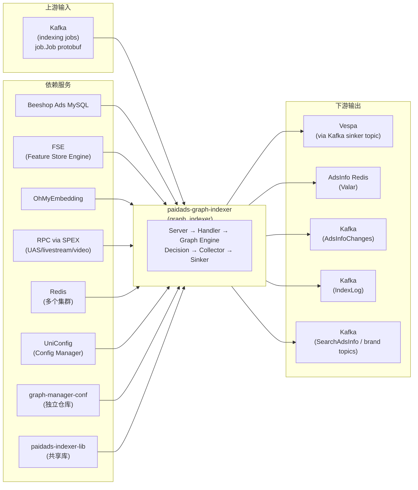

<!-- ads-workspace-gdoc-sync: gdoc_id=1tYrJRDTwvpVSliOnbydmgD426NLacHNSWp6PfTUN73E gdoc_url=https://docs.google.com/document/d/1tYrJRDTwvpVSliOnbydmgD426NLacHNSWp6PfTUN73E/edit -->

# paidads-graph-indexer

仓库地址：https://git.garena.com/shopee/deep/indexer/paidads-graph-indexer

## 目录 / Table of Contents

- [项目概述 / Introduction](#项目概述--introduction)
- [核心功能 / Features](#核心功能--features)
- [架构 / Architecture](#架构--architecture)
  - [数据流 / Data Flow](#数据流--data-flow)
  - [Graph 名称与 Mux 路由 / Graph Names and Mux Routing](#graph-名称与-mux-路由--graph-names-and-mux-routing)
  - [Operator 执行原则 / Operator Execution Principles](#operator-执行原则--operator-execution-principles)
  - [上下游调用拓扑 / Service Topology](#上下游调用拓扑--service-topology)
- [Kafka 上下游 / Kafka Topics](#kafka-上下游--kafka-topics)
  - [消费端（输入）/ Consumer — Input Topics](#消费端输入-consumer--input-topics)
  - [生产端（输出）/ Producers — Output Topics](#生产端输出-producers--output-topics)
  - [消息格式与 Proto 引用 / Message Formats and Proto References](#消息格式与-proto-引用--message-formats-and-proto-references)
- [Redis 写入 / Redis Writes](#redis-写入--redis-writes)
  - [写入操作汇总 / Write Operations](#写入操作汇总--write-operations)
  - [Key 命名规范 / Key Patterns](#key-命名规范--key-patterns)
- [各广告类型 Graph 流程 / Per-Ad-Type Graph Flow](#各广告类型-graph-流程--per-ad-type-graph-flow)
  - [Product Ads](#product-ads)
  - [Video Ads](#video-ads)
  - [Live Ads](#live-ads)
  - [Shop Ads](#shop-ads)
  - [Brand Max Ads](#brand-max-ads)
  - [Brand Search Ads](#brand-search-ads)
  - [广告属性更新 / Ad Attribute Update](#广告属性更新--ad-attribute-update)
  - [Antou 业务逻辑 / Antou Business Logic](#antou-业务逻辑--antou-business-logic)
- [AdsInfo 与 Vespa 字段来源 / AdsInfo & Vespa Field Sources](#adsinfo-与-vespa-字段来源--adsinfo--vespa-field-sources)
  - [公共字段（所有广告类型）/ Common Fields — All Ad Types](#公共字段所有广告类型-common-fields--all-ad-types)
  - [Product / Targeting Ads 特有字段 / Product / Targeting Ads — Specific Fields](#product--targeting-ads-特有字段--product--targeting-ads--specific-fields)
  - [Shop Ads 特有字段 / Shop Ads — Specific Fields](#shop-ads-特有字段--shop-ads--specific-fields)
  - [Live Ads 特有字段 / Live Ads — Specific Fields](#live-ads-特有字段--live-ads--specific-fields)
  - [Video Ads 特有字段 / Video Ads — Specific Fields](#video-ads-特有字段--video-ads--specific-fields)
  - [跨类型字段来源汇总 / Cross-Type Field Source Summary](#跨类型字段来源汇总--cross-type-field-source-summary)
- [Operator 参考 / Operator Reference](#operator-参考--operator-reference)
  - [公共 Collect Operators / Common Collect Operators](#公共-collect-operators--common-collect-operators)
  - [Product 专属 Collect Operators / Product-specific Collect Operators](#product-专属-collect-operators--product-specific-collect-operators)
  - [Live 专属 Collect Operators / Live-specific Collect Operators](#live-专属-collect-operators--live-specific-collect-operators)
  - [Video 专属 Collect Operators / Video-specific Collect Operators](#video-专属-collect-operators--video-specific-collect-operators)
  - [Antou 专属 Collect Operators / Antou-specific Collect Operators](#antou-专属-collect-operators--antou-specific-collect-operators)
  - [Shop 专属 Collect Operators / Shop-specific Collect Operators](#shop-专属-collect-operators--shop-specific-collect-operators)
  - [Decide Operators](#decide-operators)
- [目录结构 / Directory Structure](#目录结构--directory-structure)
- [开发规范 / Development Guidelines](#开发规范--development-guidelines)
- [配置 / Configuration](#配置--configuration)
- [部署 / Deployment](#部署--deployment)
- [监控 / Monitoring](#监控--monitoring)
- [业务术语表 / Business Terminology Glossary](#业务术语表--business-terminology-glossary)
- [参考资料 / Additional Resources](#参考资料--additional-resources)
- [常见问题 / Frequently Asked Questions](#常见问题--frequently-asked-questions)

---

## 项目概述 / Introduction

`paidads-graph-indexer`（服务名：`graph_indexer`）是 Shopee 广告近实时索引服务。它消费上游 Kafka 索引任务（`job.Job` protobuf，来自 `paidads-schema v1.93.0`），经 DAG 算子引擎多阶段处理后，将广告文档写入 Vespa、Redis（AdsInfo）和下游 Kafka topic。

本服务统一了原 `livestream-indexer` 和 `shop-indexer` 的功能，完成了以下广告类型的 graph-based 迁移：

| 广告类型 | Placement | 迁移状态 |
|--------|-----------|---------|
| Product Ads | ROI_TWO (0), SIMPLE_ROI_TWO (2) | ✅ 已迁移 |
| Shop Ads | SHOP_SEARCH, AUTO_SHOP_SEARCH | ✅ 已迁移 |
| Live Mingtou | LIVE_STREAM (33) | ✅ 已迁移 |
| Video Mingtou | VIDEO (54) | ✅ 已迁移 |
| Live Antou (ROI_TWO) | LIVE_STREAM | ✅ 已迁移 |
| Video Antou (KA5) | VIDEO | ✅ 已迁移 |
| Brand Max Ads | BRAND_MAX_ADS | ✅ 已迁移 |
| Brand Search Ads (KA8) | BRAND_SEARCH_ADS (45) | ✅ 已迁移 |

---

## 核心功能 / Features

1. **多类型广告索引**：支持 Product Ads、Shop Ads、Live Ads（Mingtou + Antou）、Video Ads（Mingtou + Antou）、Brand Max Ads、Brand Search Ads 共六类广告的近实时索引。

2. **Graph Engine 驱动**：基于 `searchads/graph-engine`，通过 DAG 配置（来自独立仓库 `graph-manager-conf`，分支 `indexer_0.7.0`）驱动 29 个 graph 的算子热更新执行（含 Periodic Indexer 专属 graph）。

3. **并行处理（errgroup）**：Product/Shop/Live/Video Handler 中通过 `golang.org/x/sync/errgroup` 并行执行 Item/Shop/Live/Video 的 collector 和 sinker graph。

4. **双 Antou 路径**：`item_decision` graph 内嵌 Video Antou 和 Live Antou 两条并行决策分支，分别通过 FSE 查询关联视频/直播信息。

5. **反作弊集成**：集成 `paidads-indexer-lib/campaign_anti_fraud`（soft block）和 `traffic_anti_fraud` 客户端，支持 Traffic AF、AFSoftBlock 等反作弊场景。

6. **Embedding 更新独立路径**：支持 `OHMYEMB_ITEM_EMBEDDING_UPDATE_REASON` 触发的轻量 embedding 更新，只执行 `CollectOhMyEmbeddingOp` 节点，不走完整决策流程。

7. **内容审核（Censoring）**：集成 `paidads-indexer-lib/censoring`，支持商品和店铺的内容过滤列表收集。

8. **多地区支持（HandledCountries）**：通过 `Config.HandledCountries` 控制服务处理的国家列表，不支持的国家任务直接丢弃。

9. **热配置重载（UniConfig）**：通过 `uniconfig` 订阅 8 个 namespace，实现 graph enable 状态、Kafka consumer 配置、reserved_keyword、Antou 开关等的动态热更新。

10. **关键词管理**：Shop Ads 支持 `reserved_keyword` 过滤（通过 UniConfig 热更新）和关键词粒度的余额检查（`DecideDeductVisibleByKeywordOp`）。

11. **统一算子注册**：共 **154 个算子**（含 Collect、Calculate、Decide、Sinker 四类）通过 `pkg/setup/register.go` 的 `opList` 统一注册，每次调用独立实例化，避免并发状态污染。

12. **Periodic Indexer**：独立的定期重索引服务（`cmd/periodic_indexer/`，服务名：`periodic_indexer`），消费 `INDEXER_PERIODIC_ADSINFO_MISSING_INDEX_REASON` 和 `INDEX_TOOL_PERIODIC_TRIGGER_REASON` 触发的 Kafka 任务，对漏建 AdsInfo 的广告进行补偿写入。

---

## 架构 / Architecture

### 数据流 / Data Flow

```
Kafka (indexing jobs)
        │
        ▼
Server (pkg/server/server.go)
  ├─ proto.Unmarshal(job.Job)
  ├─ request validation & country filter
  └─ GetHandler(req) → Handler dispatch
        │
        ├─ ProductHandler  → item_decision → [item_collector + item_sinker] (errgroup)
        │                                  → [video_collector + video_sinker] (errgroup)
        │                                  → [live_collector + live_sinker] (errgroup)
        ├─ LiveHandler     → live_decision → [item_collector + item_sinker] (errgroup)
        │                                  → [live_collector + live_sinker] (errgroup)
        ├─ ShopHandler     → shop_decision → [item_collector + item_sinker] (errgroup)
        │                                  → [shop_collector + shop_sink] (errgroup)
        ├─ VideoHandler    → video_decision → [item_collector + item_sinker] (errgroup)
        │                                   → [video_collector + video_sinker] (errgroup)
        ├─ BrandMaxHandler  → brand_max_decision → [brand_max_collector + brand_max_sinker] (errgroup)
        │                                         → [item_collector + item_sinker] (errgroup)
        ├─ BrandSearchHandler → brand_search → [default_sinker + brand_search_sinker] (errgroup)
        ├─ KeywordHandler  → keyword_decision → keyword_match_collector → item_sinker
        ├─ AdAttributeUpdateHandler → [DefaultHandler + ProductHandler] (errgroup parallel)
        │                          DefaultHandler: update_ad_attributes → default_sinker
        │                          ProductHandler: update_ad_attributes_v2 → item_sinker
        └─ DefaultHandler  → update_ad_attributes / brand_max → default_sinker
                │
                ▼
        Sinker Operators
        ├─ Vespa:   ItemVespaKafkaSinkOp / ShopVespaKafkaSinkOp / LiveVespaKafkaSinkOp
        │           / VideoSinkerVespaKafkaOp / SinkerVespaV2KafkaOp
        │           → Kafka topic → Vespa
        ├─ AdsInfo: AdsInfoV2SinkOp → Redis (Valar)
        ├─ Changes: AdsInfoChangesKafkaOp → Kafka (ads-index-info-changes-global-live)
        ├─ Search:  SearchAdsInfoKafkaOp → Kafka (shopee_ads_info_live)
        ├─ IndexLog: ProductAdsIndexLogSinkOp → Kafka (deep.paidads_index_log)
        └─ FDT:     FirstDeliveryTimeSinkOp → Redis (sorted set)

Kafka (periodic indexing jobs)
        │
        ▼
PeriodicServer (cmd/periodic_indexer/)
  └─ GetPeriodicHandler(req) → PeriodicHandler
        └─ periodic_decision → [periodic_{product|shop|live|video}_collector] → periodic_sinker
                └─ PeriodicAdsInfoSinkOp → Redis (AdsInfo V3)
```

### Graph 名称与 Mux 路由 / Graph Names and Mux Routing

Graph 名称常量定义在 `pkg/graph/names.go`，路由规则定义在 `pkg/graph/mux.go` 和 `pkg/handlers/handler_mux.go`：

**Handler 路由规则**（`pkg/handlers/handler_mux.go`）：

| 优先级 | 条件 | Handler |
|------|------|---------|
| 0（丢弃）| `IndexReason` 在 UniConfig `graph_indexer_ignored_index_reasons` 中 | nil（静默丢弃）|
| 1 | `IndexReason == AD_ATTRIBUTE_UPDATE_AD_TAG_REASON` | AdAttributeUpdateHandler（并行执行 DefaultHandler + ProductHandler）|
| 1 | `IndexReason == AD_ATTRIBUTE_UPDATE_COLD_START_REASON` | AdAttributeUpdateHandler |
| 1 | `IndexReason == OHMYEMB_ITEM_EMBEDDING_UPDATE_REASON` | ProductHandler |
| 1 | `IndexReason == INDEXER_PERIODIC_ADSINFO_MISSING_INDEX_REASON` | PeriodicHandler（仅 periodic server）|
| 1 | `IndexReason == INDEX_TOOL_PERIODIC_TRIGGER_REASON` | PeriodicHandler（仅 periodic server）|
| 2 | `Placement == ROI_TWO` | ProductHandler |
| 2 | `Placement == SIMPLE_ROI_TWO` | ProductHandler |
| 2 | `Placement == SHOP_SEARCH` | ShopHandler |
| 2 | `Placement == AUTO_SHOP_SEARCH` | ShopHandler |
| 2 | `Placement == LIVE_STREAM` | LiveHandler |
| 2 | `Placement == VIDEO` | VideoHandler |
| 2 | `Placement == BRAND_MAX_ADS` | BrandMaxHandler |
| 2 | `Placement == BRAND_SEARCH_ADS` | BrandSearchHandler |
| 2 | `Placement == KEYWORD_SEARCH` | KeywordHandler |
| 3 | 其他 | DefaultHandler |

**静默丢弃的 IndexReason** 现在通过 UniConfig 动态管理（配置键 `graph_indexer_ignored_index_reasons`），支持在线添加/移除，无需重启服务。以往通过代码硬编码的 `OHMYEMB_MINGTOU_VIDEO_EMBEDDING_UPDATE_REASON`、`OHMYEMB_ANTOU_VIDEO_EMBEDDING_UPDATE_REASON` 等 8 个 Reason 已迁移到该动态配置中。

**Graph Mux 路由规则**（`pkg/graph/mux.go`，DefaultHandler 内部使用）：

| 条件 | Graph |
|------|-------|
| `IndexReason == AD_ATTRIBUTE_UPDATE_AD_TAG_REASON` | `update_ad_attributes` |
| `IndexReason == AD_ATTRIBUTE_UPDATE_COLD_START_REASON` | `update_ad_attributes` |
| `Type == ADS && Placement == BRAND_MAX_ADS` | `brand_max` |

> 注：Brand Search Ads（Placement = BRAND_SEARCH_ADS）已由 `BrandSearchHandler` 直接处理，不再经过 DefaultHandler 的 Mux 路由。

Graph DAG 结构配置托管在独立仓库 `graph-manager-conf`（分支 `indexer_0.7.0`），通过 `make download` 拉取到本地。

当前服务加载共 **29 个** graph（含 Periodic Indexer 专属）：

| 类型 | Graph 名称 |
|-----|-----------|
| Decision | `item_decision`, `live_decision`, `video_decision`, `shop_decision`, `periodic_decision`, `keyword_decision`, `brand_max_decision` |
| Collector | `item_collector`, `shop_collector`, `video_collector`, `live_collector`, `update_ad_attributes_v2`, `periodic_product_collector`, `periodic_video_collector`, `periodic_shop_collector`, `periodic_live_collector`, `brand_max_collector`, `keyword_match_collector` |
| Sinker | `item_sinker`, `shop_sink`, `video_sinker`, `live_sinker`, `periodic_sinker`, `brand_max_sinker`, `brand_search_sinker` |
| 其他 | `update_ad_attributes`, `brand_search`, `brand_max`, `default_sinker` |

### Operator 执行原则 / Operator Execution Principles

1. **每个字段在 Context 中只能被设置一次**：`DataContainer` 中的字段（如 `Campaign`、`Advertisement`、`Account`）具有 immutable 语义，Collector Ops 只能通过 `CollectorContainer` 追加，不应覆盖已有值。

2. **Collector Ops 只向 DataContainer 追加**：Collect 阶段算子从 DB/FSE/RPC/Redis 读取数据并追加到 `DataContainer` 或 `CollectorContainer`，不做决策判断。

3. **Decision Ops 决定 DELETE 时立即终止**：当 `AdsDecision.ShouldDelete()` 为 true 时，后续 Collector Ops 的 `ShouldRun` 返回 false，流程短路直接执行 Sinker 写入删除操作。

4. **Sinker Ops 从 graph context 读取数据写出**：Sinker Ops 从 `CollectorContainer` 和 `DataContainer` 读取最终数据，分别写入 Vespa Kafka topic、AdsInfo Redis（Valar）、AdsInfoChanges Kafka topic。

5. **allow_error 语义**：`allow_error=true` 时算子失败不中断 graph 执行；Collector Ops 通常设为 `true`，Decision Ops 中止性决策设为 `false`（在 `graph-manager-conf` 中配置）。

### 上下游调用拓扑 / Service Topology



**上游（Upstream）**：

| 服务名 | 协议 | 说明 |
|------|------|-----|
| Kafka (indexing jobs) | Kafka consumer | 消费上游发布的 `job.Job` protobuf 索引任务，携带 Type / IndexReason / Placement 等路由信息 |

**下游（Downstream）**：

| 服务名 | 协议 | 说明 |
|------|------|-----|
| Vespa | Kafka (sinker topic) | 通过 `sinker-vespa-v2-kafka-producer-list` 写入广告文档（paidads_item / paidads_video / paidads_liveads / paidads_shop 系列 schema） |
| AdsInfo Redis (Valar) | Valar client | 写入 AdsInfo V2 正排索引（`AdsInfoV2SinkOp`），供检索链路使用 |
| Kafka (AdsInfoChanges) | Kafka producer | 发布 AdsInfo 变更事件（`AdsInfoChangesKafkaOp`），下游消费方包括 LogifyOhMyEmbedding、SearchAdsInfo 等 |
| Kafka (IndexLog) | Kafka producer | 写入索引日志（`ProductAdsIndexLogSinkOp`），落地到 Hive 表 `mp_paidads.ods_shopee_paidads_*` |
| Kafka (SearchAdsInfo / brand topics) | Kafka producer | Brand Max / Brand Search 通过 `SearchAdsInfoKafkaOp` / `SinkerVespaV2KafkaOp` 等写出 topic |

**依赖（Dependencies）**：

| 服务名 | 类型 | 说明 |
|------|------|-----|
| Beeshop Ads MySQL | Datastore | 广告主库（advertisement / campaign / account / item / shop / keyword 表），供各 CollectFromDB 算子读取 |
| FSE (Feature Store Engine) | Service | 读取 bid_strategy、shop/live/video target_roas、category order counts、voucher discount list、Antou i2v map 等特征表 |
| OhMyEmbedding / Embedding Service | Service | 获取商品 embedding（`CollectOhMyEmbeddingOp`）和视频 embedding（`CollectVideoEmbeddingOp`） |
| RPC services (SPEX) | Service | paidads.ultimate_ads_service（voucher list）、paidads_shopads_keyword_manager（shop censoring）、livestream service（session info）、video service（post / creator data）等 |
| Redis | Datastore | 商品黑名单缓存、Shop 优惠券黑名单、Antou budget cache、embedding validity key 等多个集群 |
| UniConfig / Config Manager | Service | 订阅配置变更实现热更新（graph enable 状态、Kafka consumer 配置、reserved_keyword、Antou 相关开关等）|
| graph-manager-conf | Repository | 独立仓库（`indexer_0.7.0` 分支），存放各 graph 的 DAG 结构与节点依赖配置，通过 `make download` 拉取到本地 |
| paidads-indexer-lib | Library | 共享库，提供 item service、badcase blacklist、global category cache、campaign anti-fraud 等能力 |

---

## Kafka 上下游 / Kafka Topics

### 消费端（输入）/ Consumer — Input Topics

服务通过 UniConfig 的 `graph_indexer_live_global` namespace 动态加载 Kafka consumer 配置（配置键 `graph_indexer_kafka_consumer_config`）。消费的消息格式统一为 `job.Job` protobuf（`git.garena.com/shopee/deep/paidads-schema/pkg/proto/gen/job/shopindex`，paidads-schema v1.93.0）。

| 配置键（YAML）| 来源系统 | 消息格式 | 用途 |
|------------|--------|---------|------|
| consumer 配置由 UniConfig 热加载 | Index Pipeline | `job.Job` protobuf | 统一索引任务消费入口 |

核心字段：`Country`、`Type`（ITEM/ADS）、`Reason`（IndexReason）、`Placement`、`AdsId`、`ItemId`、`ShopId`、`AdsAccountId`、`UserId`、`PostId`、`ExtInfo.AdAttributeInfo`。

Retry queue：`shopee-ads-indexer-retryq-global-live`（maxretry=3，backoffmsecond=1000）  
DLQ：`shopee-ads-indexer-dlq-global-live`

### 生产端（输出）/ Producers — Output Topics

| 配置键（YAML） | Kafka Topic | Broker 集群 | 消息类型 | 下游消费方 |
|-------------|------------|-----------|---------|---------|
| `searchadsinfo-kafka-producer` | `shopee_ads_info_live` | `kafka.kafka_maketplace_ads_live_sg-01.ap-sg-1-general-a.live.mq.shopee.io:9092` | `AdsInfoEvent`（`git.garena.com/shopee/deep/paidads-valar/proto/gen/ads_info`） | AdsInfoGateway / Valar |
| `product-ads-kafka-producer-list` | `shopee_ads_sinker_es_target_live` | kafka-paidadsIndex-live Broker | `indexerSchema.Message`（`git.garena.com/shopee/deep/paidads-indexer/proto/gen/paidads_schema_pb`） | Vespa sinker |
| `adsinfo-changes-kafka-producer` | `ads-index-info-changes-global-live` | `kafka.kafka_paidads_muti_group_live.ap-sg-1-general-c.live.mq.shopee.io:9092` | `paidads_valar_gateway.AdsInfoChanges`（paidads-schema/paidads_valar_gateway v0.40.0） | LogifyOhMyEmbedding、SearchAdsInfo |
| `sinker-vespa-v2-kafka-producer-list` | `shopee_ads_sinker_shop_live` | kafka-paidadsIndex-live Broker | `schema.Message`（paidads-schema/raw v0.121.1） | Vespa sinker (Shop/Live/Video) |
| `index-log-producer` | `deep.paidads_shopindex_log` | Data Infra Kafka Broker | `indexLog.Log`（paidads-schema/pkg/proto/gen/log/shopindex v1.93.0） | DataWarehouse / Hive |
| `product-ads-index-log-producer` | `deep.paidads_index_log` | Data Infra Kafka Broker | `indexLog.Log`（paidads-schema/pkg/proto/gen/log/index） | DataWarehouse / Hive |

### 消息格式与 Proto 引用 / Message Formats and Proto References

| Proto 包 | 版本 | 用途 |
|---------|------|------|
| `git.garena.com/shopee/deep/paidads-schema/pkg/proto/gen/job/shopindex` | v1.93.0 | 输入消息 job.Job |
| `git.garena.com/shopee/deep/paidads-schema/raw/proto/gen/paidads_schema_pb` | v0.121.1 | Vespa schema.Message |
| `git.garena.com/shopee/deep/paidads-valar/proto/go/paidads_valar.pb` | v0.135.0 | AdsInfo |
| `git.garena.com/shopee/deep/paidads-schema/paidads_valar_gateway` | v0.40.0 | AdsInfoChanges |

---

## Redis 写入 / Redis Writes

### 写入操作汇总 / Write Operations

| Operator / Repo | Redis 地址（来自配置） | Key 格式 | 数据类型 | 用途 |
|----------------|-----------------|---------|---------|------|
| `AdsInfoSinkOp`（V1 legacy） | `ads-info-sink-redis-config` | Valar 内部 key | `paidads_valar.AdsInfo` | Brand Max / Brand Search V1 路径写入 |
| `AdsInfoV2SinkOp`（主路径） | `ads-info-v2-sink-redis-config` | Valar 内部 key | `paidads_valar.AdsInfo` | Product/Shop/Live/Video Ads 写入 |
| `SearchAdsInfoPlacementSinkOp` | `placement-level-searchadsinfo-main-config` | Placement 级别 key | `ads_info.Advertise` | Brand Search Placement 级别索引 |
| `FirstDeliveryTimeSinkOp` | `fdt-client-config` | `FDT_{country}_{campaignID}` | Redis Sorted Set | 记录广告首次投放时间（仅 ROI_TWO / SIMPLE_ROI_TWO） |

### Key 命名规范 / Key Patterns

| 用途 | Key 格式 | 来源配置 |
|------|---------|---------|
| 首次投放时间 (FDT) | `FDT_{country}_{campaignID}` (Sorted Set，member=adsID，score=Unix timestamp) | `fdt-client-config` |
| Shop 优惠券黑名单 | `vsbl:{country}:{shopID}` | `shop-voucher-blacklist-cache` |
| 商品黑名单 | blacklist-item-config Redis 内部 key | `blacklist-item-config.cache-conf` |

**只读 Redis 依赖**（不写入）：

| 用途 | 配置键 |
|------|------|
| 商品黑名单缓存 | `blacklist-item-config` |
| Badcase 黑名单 | `bad-case-blacklist-config` |
| 全局类目缓存 | `globalcatcache` |
| Simple BroadMatch 缓存 | `simple-broad-match-cache` |
| Tag CLI | `tag-cli` |
| Censoring | `censoring`（通过 censoring agent 访问） |
| Shop 优惠券黑名单 | `shop-voucher-blacklist-cache` |
| 广告投放时间 | `ads-delivery-time-config` |
| Video embedding validity | UniConfig `video_metadata_cache` |
| Live Antou 历史预算 | UniConfig `ls_antou_historical_budget_cache` |
| Live Antou 扣费缓存 | UniConfig `ls_antou_deduction_offline_cache` |

---

## 各广告类型 Graph 流程 / Per-Ad-Type Graph Flow

### Product Ads

**Placement**：ROI_TWO（0）、SIMPLE_ROI_TWO（2）  
**Handler**：`ProductHandler`

执行流程：
1. `item_decision` graph：决策 item/video/live antou 的索引/可见性状态，构建 `DocumentDecisionMap`
2. `flatten()`：按 DocumentDecisionMap 展开 ItemContainers、VideoContainers、LiveContainers
3. errgroup 并行执行：
   - Item 分支：`item_collector` → `item_sinker`
   - Video Antou 分支：`video_collector` → `video_sinker`
   - Live Antou 分支：`live_collector` → `live_sinker`

特殊路径：当 `IndexReason == OHMYEMB_ITEM_EMBEDDING_UPDATE_REASON` 时，仅执行 `CollectOhMyEmbeddingOp` 节点，再执行 `item_sinker`，不走完整决策流程。

### Video Ads

**Placement**：VIDEO（54，Mingtou）  
**Handler**：`VideoHandler`

执行流程：
1. `video_decision` graph：`DecideVideoDataOp`（GMV 视频必须有关联商品）、`DecideVideoCreatorStatusOp`（创作者状态检查）
2. errgroup 并行执行：
   - Item 分支：`item_collector` → `item_sinker`
   - Video 分支：`video_collector` → `video_sinker`

特殊逻辑：`OHMYEMB_VIDEO_V2_EMBEDDING_UPDATE_REASON` 时 VideoKind 设为 `Kind_VideoVespa`（不写 AdsInfo）。

### Live Ads

**Placement**：LIVE_STREAM（Mingtou，33）  
**Handler**：`LiveHandler`

执行流程：
1. `live_decision` graph：`DecideLiveAdsShopHolidayOp`（店铺假日检查）、`DecideMCNStatusOp`（MCN 状态）、`DecideAffiliateStatusOp`（联盟状态）
2. errgroup 并行执行：
   - Item 分支：`item_collector` → `item_sinker`
   - Live 分支：`live_collector` → `live_sinker`

### Shop Ads

**Placement**：SHOP_SEARCH、AUTO_SHOP_SEARCH  
**Handler**：`ShopHandler`

执行流程：
1. `shop_decision` graph（8 层决策结构）：含 `ShopKeywordListOp`（保留词过滤）和 `DecideDeductVisibleByKeywordOp`（关键词粒度余额检查）
2. errgroup 并行执行：
   - Item 分支：`item_collector` → `item_sinker`（仅 ShouldIndex 时执行 collector）
   - Shop 分支：`shop_collector` → `shop_sink`

### Brand Max Ads

**Placement**：BRAND_MAX_ADS  
**Handler**：`BrandMaxHandler`

执行流程：
1. `brand_max_decision` graph：`DecideBrandMaxOp` 串行执行 `DecideAccountDeductPrice` 和 `DecideAdsBookingInfo`
2. errgroup 并行执行：
   - Brand Max 分支：`brand_max_collector` → `brand_max_sinker`
   - Item 分支：`item_collector` → `item_sinker`

Brand Max 已迁移至独立的 `brand_max_decision` / `brand_max_collector` / `brand_max_sinker` 三阶段 graph 架构。

### Brand Search Ads

**Placement**：BRAND_SEARCH_ADS（45）  
**Handler**：`BrandSearchHandler`

执行流程：
1. `brand_search` graph：完整决策和收集流程
2. errgroup 并行执行两条 sinker 路径：
   - `default_sinker`：兼容旧版写出 `Kind=UnifiedAdsInfo`（`SearchAdsInfoKafkaOp` + `AdsInfoChangesKafkaOp`）
   - `brand_search_sinker`：新版 Shop Vespa 写出（`Kind=ShopVespa`）

> Brand Search 正在从 DefaultHandler + default_sinker 迁移到专属 BrandSearchHandler 架构（代码注释标有 "todo Migrate to the latest architecture"）。

### 广告属性更新 / Ad Attribute Update

**IndexReason**：`AD_ATTRIBUTE_UPDATE_AD_TAG_REASON`、`AD_ATTRIBUTE_UPDATE_COLD_START_REASON`  
**Handler**：`AdAttributeUpdateHandler`（`AD_ATTRIBUTE_UPDATE_AD_TAG_REASON`）/ `DefaultHandler`（`AD_ATTRIBUTE_UPDATE_COLD_START_REASON`）

`AD_ATTRIBUTE_UPDATE_AD_TAG_REASON` 由 `AdAttributeUpdateHandler` 处理（临时过渡 Handler，迁移完成后移除）：
- 并行执行 `DefaultHandler`：触发 `update_ad_attributes` graph → `default_sinker`（兼容 ROI 1.0 Vespa 和旧版 AdsInfo）
- 并行执行 `ProductHandler`：触发 `update_ad_attributes_v2` graph → `item_sinker`（新版 Ad Tag 写入 Vespa）

`AD_ATTRIBUTE_UPDATE_COLD_START_REASON` 由 `AdAttributeUpdateHandler` 处理，走 `update_ad_attributes` graph → `default_sinker`，不走完整决策流程。

### Antou 业务逻辑 / Antou Business Logic

**Video Antou 分支**（在 `item_decision` 和 `video_decision` graph 中）：
1. `CollectAntouVideosFSEOp`：通过 FSE 查询与商品关联的视频 ID 列表
2. `CollectAntouEmbeddingVersionsOp`：从 Redis（`video_metadata_cache`）校验每个视频 embedding 有效性
3. `DecideAntouHasValidEmbeddingOp`：决策是否有有效 embedding 的 Antou 视频
4. `DecideAntouVideosOp`：最终决定 Video Antou 可见性

**Live Antou 分支**（在 `live_decision` 和 `live_collector` graph 中）：
1. `CollectLiveStreamSessionOp`：获取直播 session 状态
2. `CollectLiveStreamOrangeBagItemsOp`：获取 orange bag 商品列表
3. `CollectLiveAntouStreamerTypeOp`：判断 streamer 类型（KOL / MCN / Affiliate）
4. `CollectLiveAntouHistoricalBudgetOp`：从 Redis 读取历史预算使用率
5. `DecideLiveAntouSessionOp`、`DecideLiveAntouOrangeBagOp`、`DecideLiveAntouStreamerTypeOp`、`DecideLiveAntouHistoricalBudgetOp`：多级决策

**关键差异**：Antou 超预算时设为 `INVISIBLE`（可见性为 NOT_OK，但仍写入索引），而非 `NOT_INDEX`（直接删除）。预算恢复后，重新触发索引时自动恢复可见。

---

## AdsInfo 与 Vespa 字段来源 / AdsInfo & Vespa Field Sources

### 公共字段（所有广告类型）/ Common Fields — All Ad Types

| 字段名 | 来源算子 | 数据源 |
|------|---------|------|
| AdsId / CampaignId / ShopId | `CollectInfoFromIndexJobOp` | job.Job request |
| Campaign 基础字段（status/start_time/end_time/budget） | `CollectCampaignFromDBOp` | MySQL |
| Campaign 花费（total/daily expenses） | `CollectTotalExpensesOp` / `CollectDailyExpensesOp` | FSE |
| Account 余额 | `CollectAccountValidBalanceOp` | FSE / DB |
| BidStrategy | `BidStrategyOp` | FSE |
| TargetRoi / CIR | `CollectCampaignDayRoiOp` | FSE |
| PlanBucketList | `CollectPlanBucketListV2Op` | hash-lib / config |
| TrafficControl | `CollectTrafficDeboostDataOp` | Redis / Traffic AF |
| AdsDeliveryTime | `CollectAdsDeliveryTimeOp` | Redis |

### Product / Targeting Ads 特有字段 / Product / Targeting Ads — Specific Fields

| 字段名 | 来源算子 | 数据源 |
|------|---------|------|
| Item.Price / MinPrice | `CollectItemPriceV2Op` / `CollectItemMinPriceV2Op` | DB / paidads-indexer-lib |
| Item.GlobalCatIds | `CollectItemModelOp` | DB |
| Item.CensoringIDsList | `CollectProductItemCensoringListOp` | Censoring service |
| Item.Labels | `CollectItemLabelsOp` | DB |
| BroadMatch token | `CollectBroadMatchOp` | Redis / BroadMatch service |
| MText data | `CollectMtextOp` | MText service |
| QueryUnderstandPerfScores | `CollectQueryUnderstandPerfScoresOp` | textproc service |
| ShopOrderCount | `CollectShopOrderCountOp` | FSE |
| VideoList（Video Antou） | `CollectAntouVideosFSEOp` | FSE |
| VideoEmbedding | `CollectVideoEmbeddingOp` | OhMyEmbedding / Redis |
| ItemEmbedding (v1-v8, image v1-v5) | `CollectOhMyEmbeddingOp` | OhMyEmbedding service |

### Shop Ads 特有字段 / Shop Ads — Specific Fields

| 字段名 | 来源算子 | 数据源 |
|------|---------|------|
| Advertisement.BidInfos（关键词出价） | `CollectKeywordsOp` | DB |
| ItemList（代表性商品，上限 shop_ads_info_item_count_limit=10） | `ShopItemListOp` | DB |
| Shop Stats（Rating/Order14D/GMV14D） | `CollectShopOrderCountOp` | FSE |
| ShopInfo.CensoringList | `ShopLevelCensoringOp` | Censoring |

### Live Ads 特有字段 / Live Ads — Specific Fields

| 字段名 | 来源算子 | 数据源 |
|------|---------|------|
| LiveStreamAds（SessionId/SessionStartTs/CampaignSlots） | `CollectLiveStreamSessionOp` | SPEX: paidads.livestream_service |
| AdsAccountId（覆盖为 Streamer ID） | `CollectLiveStreamerProfileOp` | SPEX: livestream service |
| BidStrategy.Aov / Ecr | `BidStrategyOp` | FSE |
| Live Antou 可见性 | `DecideLiveAntouHistoricalBudgetOp` | Redis（ls_antou_historical_budget_cache） |
| Antou 历史预算 | `CollectLiveAntouHistoricalBudgetOp` | Redis |

### Video Ads 特有字段 / Video Ads — Specific Fields

| 字段名 | 来源算子 | 数据源 |
|------|---------|------|
| VideoAds.PostId | `CollectVideoDataOp` | SPEX: video service |
| VideoAds.VideoItem（关联商品） | `CollectVideoDataOp` | SPEX: video service |
| Advertisement.Cpm（初始 CPM） | `CollectItemBiddingPriceOp` | FSE（category order counts） |
| VideoEmbedding | `CollectVideoEmbeddingOp` | OhMyEmbedding service |
| Video Antou 附加字段 | `CollectAntouVideosFSEOp` + `CollectAntouEmbeddingVersionsOp` | FSE + Redis |

### 跨类型字段来源汇总 / Cross-Type Field Source Summary

| 字段/字段组 | Product | Shop | Live | Video | Brand Max | Brand Search |
|-----------|---------|------|------|-------|-----------|-------------|
| Account/Campaign/Ad 基础 | ✅ | ✅ | ✅ | ✅ | ✅ | ✅ |
| BidStrategy | ✅ | ✅ | ✅ | ✅ | ✅ | ✅ |
| TrafficControl | ✅ | ✅ | ✅ | ✅ | ❌ | ❌ |
| Embedding | ✅ | ❌ | ❌ | ✅ | ❌ | ❌ |
| LiveStream 字段 | ⚠️ Antou only | ❌ | ✅ | ❌ | ❌ | ❌ |
| Keywords | ❌ | ✅ | ❌ | ❌ | ❌ | ✅ |
| AdsBookingInfo | ❌ | ❌ | ❌ | ❌ | ✅ | ❌ |
| Antou 决策 | ⚠️ Video/Live branch | ⚠️ Shop branch | ✅ | ⚠️ Video branch | ❌ | ❌ |

---

## Operator 参考 / Operator Reference

所有算子通过 `pkg/setup/register.go` 的 `opList` 统一注册（共 **154 个**算子实例），算子名常量定义在 `pkg/operator/fields.go`（约 142 个 Field 常量）。

### 公共 Collect Operators / Common Collect Operators

| 算子名 | 数据源 | 主要输出字段 |
|------|------|-----------|
| `CollectInfoFromIndexJobOp` | job.Job request | InfoFromIndexJob |
| `CollectInfoFromIndexJobV2Op` | job.Job request (ExtInfo.AdAttributeInfo) | InfoFromIndexJob（AdTag / ColdStartFlag / PricingType）|
| `CollectPlanBucketListV2Op` | hash-lib config | PlanBucketList |
| `CollectAdvertisementFromDBOp` | MySQL | Advertisement |
| `CollectAdvertisementOp` | job.Job BulkInfo（优先）/ MySQL（降级）| Advertisement（含 ExtInfo 解析）|
| `CollectAccountFromDBOp` | MySQL | Account |
| `CollectCampaignFromDBOp` | MySQL | Campaign |
| `CollectCampaignOp` | MySQL | Campaign（通用版）|
| `CollectAccountModelOp` | FSE | AccountModel |
| `CollectAdsShopModelOp` | FSE | ShopModel |
| `CollectItemShopModelsOp` | FSE | ShopModelMap |
| `CollectTotalExpensesOp` | FSE | TotalExpenses |
| `CollectDailyExpensesOp` | FSE | DailyExpenses |
| `CollectAccountValidBalanceOp` | FSE | AccountValidBalance |
| `CollectFreezeAdsCreditOp` | FSE（冻结广告积分）| AccountValidBalance（Freeze Credit 路径）|
| `CollectAdsCreativeOp` | DB | AdsCreative |
| `CollectSelectedItemsOp` | DB | SelectedItems |
| `BidStrategyOp` | FSE | BidStrategy |
| `CollectVoucherDiscountListOp` | FSE | VoucherDiscountList |
| `CollectAdTagOp` | UniConfig | AdTag |
| `CollectColdStartFlagOp` | UniConfig | ColdStartFlag |
| `CollectCampaignDayRoiOp` | FSE | CampaignDayRoi |
| `CollectCampaignDayRoiCoefficientOp` | FSE | CampaignDayRoiCoef |
| `CollectCampaignDayOriginalRoiOp` | FSE | CampaignDayOriginalRoi |
| `CollectAccountCumulativeBalanceSnapshotOp` | FSE | AccountCumulativeBalanceSnapshot |
| `CollectDailyBudgetUsageRatioOp` | FSE | DailyBudgetUsageRatio |
| `CollectExtFieldsOp` | 多来源（扩展字段聚合）| ExtFields |
| `CollectGlobalCatIdsOp` | DB | ItemModelMap（仅 GlobalCatIds）|

### Product 专属 Collect Operators / Product-specific Collect Operators

| 算子名 | 数据源 | 主要输出字段 |
|------|------|-----------|
| `CollectItemLabelsOp` | DB | ItemLabels |
| `CollectItemCensoringListOp` | Censoring | ItemCensoringList |
| `CollectBroadMatchOp` | Redis / BroadMatch | BroadMatchData |
| `CollectMtextOp` | MText service | MtextData |
| `CollectItemQueryTagOp` | tag service | QueryTagData |
| `CollectQueryUnderstandPerfScoresOp` | textproc-svc | QueryUnderstandPerfScores |
| `CollectProductItemCensoringListOp` | Censoring | ItemCensoringList（product）|
| `CollectProductLabelOp` | product_label client | ProductLabelData |
| `CollectShopInfoOp` | DB | ShopInfo（AttrUserVerified, Addresses）|
| `CollectShopOrderCountOp` | FSE | ShopOrderCountData |
| `CollectShoppingGuideItemTagsOp` | tag service | ShoppingGuideItemTags |
| `CollectItemOrderCountOp` | FSE | ItemOrderCountData |
| `CollectItemPriceV2Op` | DB | ItemPriceV2 |
| `CollectItemMinPriceV2Op` | DB | ItemMinPriceV2 |
| `ItemModelOp` | DB | ItemModel |
| `CollectItemModelWithCompatibilityInfoOp` | DB | ItemModel（含兼容性信息）|
| `CollectItemHitBlacklistOp` | Redis | ItemHitBlacklistMap |
| `CollectItemPlacementBlacklistedOp` | DB | ItemPlacementBlacklisted |
| `CollectTrafficDeboostDataOp` | Traffic AF | ItemTrafficMgmtData |
| `CollectTrafficRulesOp` | DB | TrafficRules |
| `CollectOhMyEmbeddingOp` | OhMyEmbedding | EmbeddingMap |
| `CollectNewProductBoostOp` | DB | NewProductBoostStage/Tier |
| `CollectTargetAudienceOp` | DB | TargetAudienceData |
| `CollectItemDeepEcrOp` | FSE | DeepEcr7D |
| `CollectItemOverSpendOp` | FSE | ItemRev7D, ItemDeductPrice7D |
| `CollectShopOverSpendOp` | FSE | ShopRev7D, ShopDeductPrice7D |
| `CollectFirstDeliveryTimeOp` | Redis | FirstDeliveryTimeData |
| `CollectIsShopVoucherBlacklistedOp` | Redis | ShopVoucherBlacklisted |
| `CollectShopVouchersOp` | SPEX: UAS | AdsVouchers |
| `CollectAttributeQueryBlacklistOp` | DB | AttrQueryBlacklist |
| `CollectBlockFirstPartySellerOp` | DB | BlockFirstPartySeller |
| `CollectItemAttributesOp` | item_attr client | ItemAttrData |
| `CollectAntiFraudBlockProbabilityOp` | anti_fraud client | AntiFraudBlockProbability |
| `CollectGoodAdsPotentialProductOp` | FSE | GoodPotentialProduct |
| `CollectItemBroadAverageOp` | FSE | ItemBroadOrderAvg, ItemBroadGmvAvg |
| `CollectCatBroadAverageOp` | FSE | CatBroadOrderAvg, CatBroadGmvAvg |
| `CollectItemTagsOp` | tag service | QueryTagData（item tags）|
| `CollectTargetOrderToPayOp` | FSE | TargetOrder2Pay |
| `CollectCPABidPriceOp` | FSE | CpaBid |
| `CollectGlobalCategoryAttributeMapOp` | globalcatcache | GlobalCategoryAttributesMap |

### Calculate Operators

| 算子名 | 功能 |
|------|------|
| `CalculateNextVisibleTimeOp` | 计算下次可见时间（基于预算恢复逻辑）|
| `ShopAdsDocumentDecisionOp` | 构建 Shop Ads DocumentDecision |
| `BuildLiveAdsDocumentDecisionOp` | 构建 Live Ads DocumentDecision |
| `BuildItemDocumentDecisionMapOp` | 构建 Item DocumentDecisionMap（Decision 阶段汇总）|
| `BuildBrandMaxAdsDocumentContainerOp` | 构建 Brand Max Ads DocumentContainer |
| `BuildBrandSearchAdsDocumentContainerOp` | 构建 Brand Search Ads DocumentContainer |
| `BuildKeywordAdsDocumentDecisionMapOp` | 构建 Keyword Ads DocumentDecisionMap |

### Live 专属 Collect Operators / Live-specific Collect Operators

| 算子名 | 数据源 | 主要输出字段 |
|------|------|-----------|
| `CollectAffiliateStatusOp` | SPEX: affiliate service | AffiliateStatus |
| `CollectMCNStatusOp` | SPEX: MCN service | MCNStatus |
| `CollectIsAccountAffiliateOp` | DB | IsAccountAffiliate |
| `CollectLiveStreamSessionOp` | SPEX: livestream service | LivestreamSession |
| `CollectLiveStreamOrangeBagItemsOp` | SPEX: livestream service | OrangeBagItemList |
| `CollectLiveStreamerProfileOp` | SPEX: livestream service | LiveStreamerProfile |
| `CollectLiveAntouHistoricalBudgetOp` | Redis（ls_antou_historical_budget_cache） | LiveAntouHistoricalBudget |
| `CollectLiveAntouOrangeBagOp` | Redis | LiveAntouOrangeBag |
| `CollectLiveAntouStreamerTypeOp` | Redis / config | StreamerType |
| `CollectLiveAntouNextVisibletimeOp` | Redis | LiveAntouNextVisibleTime |

### Video 专属 Collect Operators / Video-specific Collect Operators

| 算子名 | 数据源 | 主要输出字段 |
|------|------|-----------|
| `CollectVideoDataOp` | SPEX: video service | VideoData |
| `CollectVideoCreatorDataOp` | SPEX: video creator service | VideoCreatorData |
| `CollectItemCategoryOrderCountsOp` | FSE | ItemCategoryOrderCounts |
| `CollectItemBiddingPriceOp` | FSE | ItemBiddingPrice |
| `CollectVideoEmbeddingOp` | OhMyEmbedding | VideoEmbedding |
| `CollectVideoDecisionMapOp` | — | VideoDecisionMap |

### Antou 专属 Collect Operators / Antou-specific Collect Operators

| 算子名 | 数据源 | 主要输出字段 |
|------|------|-----------|
| `CollectAntouVideosFSEOp` | FSE（i2v map） | AntouVideoList |
| `CollectAntouEmbeddingVersionsOp` | Redis（video_metadata_cache） | AntouVideoEmbeddingVersionsMap |

### Shop 专属 Collect Operators / Shop-specific Collect Operators

| 算子名 | 数据源 | 主要输出字段 |
|------|------|-----------|
| `ShopItemListOp` | DB | SelectedItemIDList |
| `ShopKeywordListOp` | DB | KeywordList |
| `AdsAdminBlacklistOp` | DB | ShopAdsAdminBlacklist |
| `ShopLevelCensoringOp` | Censoring | ShopCensoringList |

### Decide Operators

| 算子名 | 决策逻辑 | 失败结果 |
|------|---------|---------|
| `DecideAdsStatusOp` | 广告状态检查（ADS_NORMAL） | NOT_INDEX |
| `DecideAccountStatusOp` | 账户状态检查 | NOT_INDEX |
| `DecideDeductVisibleOp` | 账户/Campaign 余额及限额检查 | INVISIBLE |
| `DecideItemStockOp` | 商品库存检查 | NOT_INDEX |
| `DecideItemOp` | 商品综合状态（上下架、违禁等） | NOT_INDEX |
| `DecideItemVisibleOp` | 商品可见性判断 | INVISIBLE |
| `DecideItemAdultOp` | 成人商品过滤 | NOT_INDEX |
| `DecideItemBadCaseBlacklistedOp` | Badcase 黑名单 | NOT_INDEX |
| `DecideItemBlacklistVisibleOp` | 商品黑名单可见性 | INVISIBLE |
| `DecideBrandMaxOp` | Brand Max 账户扣费 + Booking 信息检查 | NOT_INDEX |
| `DecideAdsCreativeOp` | 创意审核状态 | NOT_INDEX |
| `DecideShopAccountVisibleOp` | Shop 账户可见性 | INVISIBLE |
| `ShopKeywordListOp`（Decide） | 关键词保留词过滤 + 余额检查 | NOT_INDEX / INVISIBLE |
| `AdsAdminBlacklistOp`（Decide） | 管理员黑名单检查 | NOT_INDEX |
| `DecideLiveAdsShopHolidayOp` | 店铺假日检查 | NOT_INDEX |
| `DecideAffiliateStatusOp` | Affiliate 状态检查 | NOT_INDEX |
| `DecideMCNStatusOp` | MCN 状态检查 | NOT_INDEX |
| `DecideAntouHasValidEmbeddingOp` | Antou embedding 有效性 | INVISIBLE（set AntouDecision） |
| `DecideAntouVideosOp` | Antou 视频可见性 | INVISIBLE |
| `DecideVideoCreatorStatusOp` | 视频创作者状态 | NOT_INDEX |
| `DecideVideoDataOp` | 视频数据（GMV 视频需有关联商品） | NOT_INDEX |
| `DecideLiveAntouHistoricalBudgetOp` | Live Antou 历史预算使用率 | INVISIBLE |
| `DecideLiveAntouOrangeBagOp` | Live Antou orange bag 检查 | INVISIBLE |
| `DecideLiveAntouSessionOp` | Live Antou session 状态 | INVISIBLE |
| `DecideLiveAntouStreamerTypeOp` | Live Antou streamer 类型检查 | INVISIBLE |
| `DecideVideoAntouPricingTypeOp` | Video Antou 计费类型检查 | INVISIBLE |
| `DecideShopAntouAndPricingTypeOp` | Shop Antou 计费类型检查 | INVISIBLE |
| `DecideLiveAntouRegionAndPricingTypeOp` | Live Antou 地区 + 计费类型 | INVISIBLE |
| `DecideAccountDeductPriceOp` | 账户扣费价格检查（独立于 DecideDeductVisibleOp）| NOT_INDEX |

### Periodic Sinker Operators

| 算子名 | 数据源 | 用途 |
|------|------|------|
| `PeriodicAdsInfoSinkOp` | CollectorContainer | 定期补偿写入 AdsInfo Redis（V3 路径），用于修复漏建索引 |

---

## 目录结构 / Directory Structure

```
paidads-graph-indexer/
├── cmd/
│   ├── graphindexer/           # 主索引服务入口
│   │   ├── main.go             # 命令行入口，初始化 app
│   │   └── run.go              # 核心启动逻辑（spex/tracing/uniconfig/dependency/server 初始化）
│   └── periodic_indexer/       # 定期补偿索引服务入口（新）
│       ├── main.go             # 命令行入口
│       └── run.go              # 启动逻辑（使用 PeriodicIndexerConfig，注册同一套算子+图引擎）
├── config/
│   ├── config.go               # 全量配置结构体（包含所有 Kafka producer、Redis、DB 配置）
│   ├── consumer_config.go      # Kafka consumer 配置结构（UniConfig 热加载）
│   ├── config_key_config_map.go # UniConfig key → proto binding 映射
│   ├── consts/
│   │   ├── consts.go           # 业务常量（服务名、默认 ROI、价格因子等）
│   │   ├── config_key.go       # UniConfig 配置键常量
│   │   ├── env.go              # 环境枚举
│   │   ├── label.go            # 标签常量
│   │   └── placement.go        # Placement 工具函数（IsAdsInfoKind 等）
│   └── files/
│       ├── live.yml            # 生产环境配置（UniConfig namespace 列表）
│       ├── live_br.yml         # 巴西区域配置
│       ├── live_mx.yml         # 墨西哥区域配置
│       ├── liveish.yml         # 预发布环境配置
│       └── test.yml            # 测试环境配置
├── deploy/
│   ├── graphindexer.json       # 主索引服务 Mesos 部署配置
│   └── periodic_indexer.json   # 定期补偿索引服务 Mesos 部署配置
├── internal/
│   └── dependency/
│       ├── dependency.go       # 全量依赖初始化（Redis/Kafka/DB/SPEX/FSE 等所有客户端）
│       └── access.go           # 依赖访问器函数（各客户端 getter）
├── pkg/
│   ├── adsinfo_builder/        # AdsInfoEvent / SearchAdsInfo 构建工具
│   ├── clients/                # 外部客户端封装（address/badcase_blacklist/broad_match/delivery_time/item_attr/mtext/product_label/user_tag）
│   ├── context/                # Graph Context 封装（InitContext/GetDataContainer/GetCollectorContainer 等）
│   ├── exporter/               # Prometheus metrics 定义和记录函数
│   ├── graph/
│   │   ├── engines.go          # AllEngines 全局映射，BuildEngines() 加载所有 graph 引擎
│   │   ├── load.go             # 从 graph-manager-conf 加载 DAG 配置
│   │   ├── mux.go              # Graph Mux 路由（reasonMuxMap / typePlacementMuxMap）
│   │   ├── names.go            # Graph 名称常量（item_decision / item_collector 等 29 个）
│   │   └── util.go             # IsEnabled / ExecuteGraph / ExecuteGraphForNodes 工具函数
│   ├── handlers/
│   │   ├── interface.go        # Handler 接口定义
│   │   ├── handler_mux.go      # Handler 路由规则（reasonMap / placementMap）
│   │   ├── all_handler.go      # AllHandler 聚合结构 + BuildHandlers()
│   │   ├── product_handler.go  # ProductHandler（Product/Video Antou/Live Antou 三路并行）
│   │   ├── live_handler.go     # LiveHandler（Item/Live 两路并行）
│   │   ├── shop_handler.go     # ShopHandler（Item/Shop 两路并行）
│   │   ├── video_handler.go    # VideoHandler（Item/Video 两路并行）
│   │   ├── brand_max_handler.go # BrandMaxHandler（sinker + item 并行）
│   │   ├── default_handler.go  # DefaultHandler（brand_search / update_ad_attributes / brand_max）
│   │   └── util.go             # flatten / getDocumentDecisionMapFromGraphStatus 等工具
│   ├── operator/
│   │   ├── base_operator.go    # IOperator 接口和 IndexerBaseOperator（两层架构）
│   │   ├── fields.go           # Field 常量定义（约 142 个）和 ValidFields 白名单
│   │   ├── util.go             # GetValueOrDefault / GetValueOrError 泛型工具
│   │   ├── collect/            # Collect 阶段算子（约 88 个文件）
│   │   ├── calculate/          # Calculate 阶段算子（5 个）
│   │   ├── decide/             # Decide 阶段算子（约 28 个）
│   │   ├── sinker/             # Sinker 阶段算子（Vespa/AdsInfo/Kafka/FDT/IndexLog）
│   │   └── error/              # 可重试错误定义
│   ├── repository/             # DB/Redis 访问层（advertisement/campaign/account/item/shop/keyword/video 等）
│   ├── request/                # Request 结构体 + BuildRequestFromJob + IsRequestValid
│   ├── routing/                # DocumentContainer / RoutingData 初始化
│   ├── server/                 # Kafka 消费服务（Server.Start/Stop/Process）
│   ├── setup/
│   │   └── register.go         # 全量算子注册（opList，154 个算子实例）
│   ├── sps/                    # SPEX 拦截器（日志 + metrics）
│   ├── status/                 # Decision / Status 枚举和判断逻辑（IsShouldIgnoreStatus 等）
│   ├── types/                  # DataContainer / CollectorContainer / DocumentContainer 等核心数据结构
│   └── product_ads_kafka_builder/ # ProductAds Kafka 消息构建工具
├── Makefile                    # build/test/fmt/download graph-manager-conf 等目标
├── go.mod                      # Go module 定义（go 1.22.10）
├── sp-workspace.yml            # SPEX workspace 配置
└── .gitlab-ci.yml              # CI 配置
```

---

## 开发规范 / Development Guidelines

### 算子注册规范

所有算子必须在 `pkg/setup/register.go` 的 `opList` 中注册。注册时每个算子独立实例初始化（通过 `reflect.New(typ)` 创建新实例），避免并发状态污染：

```go
// pkg/setup/register.go
var opList = []operator.IOperator{
    &collect.CollectInfoFromIndexJobOp{},
    // ... 新增算子在此添加
}
```

新增算子步骤：
1. 在 `pkg/operator/collect/` 或 `decide/` 或 `sinker/` 下创建算子文件
2. 实现 `IOperator` 接口（`RunOp`、`ShouldRun`、`GetName`）
3. 在 `pkg/operator/fields.go` 中添加输入/输出字段常量到 `ValidFields`
4. 在 `opList` 中添加算子注册
5. 在 `graph-manager-conf` 中添加对应的 DAG 节点配置，通过 `make download` 更新

### allow_error 语义

`allow_error` 在 `graph-manager-conf` 中配置，决定算子失败是否中断 graph 执行：
- `allow_error: true`：算子失败不中断执行，通常用于 Collector Ops（外部依赖不稳定时允许降级）
- `allow_error: false`：算子失败立即中断，通常用于 Decision Ops 的中止性决策

### 每字段只能设置一次的不变式

`DataContainer` 中的字段（Campaign、Advertisement、Account 等）应视为 immutable。同一字段在同一 graph 执行过程中只被设置一次。违反此原则可能导致数据竞争和逻辑混乱。

### 错误处理

- **可重试错误**：`context.DeadlineExceeded` 或 `operator_error.RetryableError` 会被返回到 Kafka consumer，触发重试（maxretry=3，backoff=1000ms）
- **非可重试错误**：记录日志后 ACK 消息，不触发重试
- Sinker Ops 写入失败时，通常属于非可重试错误（不影响消息 ACK）

### 单元测试 / Unit Testing Standards

```bash
make test-nv  # 运行测试（不含 vet）
make vet      # 静态检查
make ci       # 模拟 CI（fmt + test + vet）
```

### Code Review & Git Workflow

采用 GitLab MR 流程，CI 通过后方可合并。分支命名遵循 `feature/xxx`、`fix/xxx` 规范。

---

## 配置 / Configuration

### 静态配置文件

配置文件位于 `config/files/` 目录，按环境区分：

| 文件 | 环境 | 说明 |
|-----|------|------|
| `live.yml` | 生产 | 全球主配置，声明 9 个 UniConfig namespace（含 Periodic Indexer）|
| `live_br.yml` | 生产（巴西） | 巴西区域差异配置 |
| `live_mx.yml` | 生产（墨西哥） | 墨西哥区域差异配置 |
| `liveish.yml` | 预发布 | 预发布环境配置 |
| `test.yml` | 测试 | 测试环境配置 |

生产环境订阅的 UniConfig namespace 列表（来自 `config/files/live.yml`）：

| Namespace | 用途 |
|-----------|------|
| `graph_indexer_live_global` | Graph enable 状态、Kafka consumer 配置 |
| `ads_removal_live` | 广告下线开关 |
| `live_stream_live_default` | 直播相关配置 |
| `embedding_config_live_global` | Embedding 配置 |
| `campaign_flow_control_live_global` | Campaign 流控配置（×2，重复引用）|
| `search_ads_live_default` | 搜索广告配置 |
| `video_ads_live_global` | 视频广告配置 |
| `mtext_live_default` | MText 配置 |

Periodic Indexer 额外订阅（`periodic_indexer_config` 节）：

| Namespace | 用途 |
|-----------|------|
| `periodic_indexer_live_global` | Periodic Indexer graph enable、consumer 配置 |
| `periodic_indexer_consumer_live___CID__` | 按 CID 动态 consumer 配置 |
| `live_stream_live_default` | 直播相关配置（共享）|

### UniConfig 动态热更新

以下配置支持通过 UniConfig 热更新，无需重启服务：

| 配置键 | 说明 |
|------|------|
| `graph_indexer_enabled_graphs` | 各 graph 的 enable/disable 开关（主索引服务 + Periodic Indexer 共享）|
| `graph_indexer_ignored_index_reasons` | 动态禁用指定 IndexReason（格式：`{reason_string: true/false}`，无需重启）|
| `graph_indexer_kafka_consumer_config` | 主索引服务 Kafka consumer 配置（topic 列表、broker、group 等）|
| `periodic_indexer_kafka_consumer_config` | Periodic Indexer Kafka consumer 配置 |
| `manually_disabled_operators` | 手动禁用指定算子（无需重启）|
| `reserved_keyword` | Shop Ads 保留关键词列表 |
| `antou_placement_pricing_types_for_filtering` | Antou placement 计费类型过滤 |
| `ls_antou_region_pricing_types_for_filtering` | Live Antou 地区 + 计费类型过滤 |
| `ls_antou_budget_config` | Live Antou 预算配置 |
| `item_vespa_embedding_update_enabled` | Item Vespa embedding 更新开关 |
| `item_vespa_ad_tag_update_enabled` | Item Vespa Ad Tag 更新开关 |
| `video_antou_fse_max_videos_per_item` | Video Antou 每商品最大视频数（默认 10）|
| `sink-fdt-timeout` | FDT sink 超时时间 |
| `sink-fdt-enable-fast-failover` | FDT fast failover 开关 |
| `shop_antou_pricing_types_for_filtering` | Shop Antou 计费类型过滤 |
| `shop_antou_rating_threshold` | Shop Antou 评分阈值 |
| `brand_search_close_kw_manager_switch_config` | Brand Search 关键词管理器开关 |
| `brand_search_each_group_kw_max_num_config` | Brand Search 每组关键词最大数量 |
| `mtext_timeout_duration` | MText 超时时间（默认 1s）|
| `max_voucher_discount_list_limit_config` | 最大优惠券折扣列表数量 |

### Graph DAG 配置（graph-manager-conf）

Graph 的 DAG 结构（节点依赖、算子名、allow_error 等）托管在独立仓库 `graph-manager-conf`（分支 `indexer_0.7.0`）：

```bash
make download  # 拉取最新 graph-manager-conf 到本地
```

拉取后 DAG 配置存放于 `graph-manager-conf/` 目录，由 `pkg/graph/load.go` 在服务启动时加载。

### SPEX 配置

服务通过 SPEX 调用下游 RPC 服务，SPEX 配置通过 `config.Spex` 和 `config.SpexConfig` 管理：

```bash
# spcli 安装（参考 SPEX 文档）
/bin/bash -c "$(curl -fsSL https://spex.shopee.io/release/spcli/latest/install.sh)"
spcli version
```

---

## 部署 / Deployment

### 生产构建 / Build for Production

```bash
make graphindexer          # 本地构建主索引服务（macOS 同时生成 linux 版本）
make periodic_indexer      # 本地构建 Periodic Indexer（macOS 同时生成 linux 版本）
make jenkins               # CI 环境构建（在 /root/go/src/ 路径下）
```

构建产物：
- `bin/paidads_graphindexer_server`（本地）
- `bin/paidads_graphindexer_server.linux`（Linux 交叉编译）
- `bin/paidads_periodic_indexer_server`（本地）
- `bin/paidads_periodic_indexer_server.linux`（Linux 交叉编译）

### 发布流程 / Release Process

1. 确保 `graph-manager-conf` 中的 DAG 配置已更新并合并（分支 `indexer_0.7.0`）
2. 执行 `make download` 拉取最新配置
3. 代码合并到主分支后，通过 Jenkins CI 构建（`make jenkins && bash scripts/mesos.sh build graphindexer`）
4. 部署配置参考 `deploy/graphindexer.json`，使用 Mesos 部署
5. Periodic Indexer 部署参考 `deploy/periodic_indexer.json`，使用 `bash scripts/periodic_mesos.sh build periodic_indexer`

SPEX 配置变更（如新增 RPC 依赖）需先通过 `spcli` 更新 proto 定义：

```bash
make proto  # 更新 proto（需配置 GITLAB_TOKEN）
```

### 灰度策略

通过 UniConfig 的 `graph_indexer_enabled_graphs` 配置实现 graph 级别灰度：

```yaml
graph_indexer_enabled_graphs:
  item_decision: true
  live_decision: false  # 灰度关闭
```

---

## 监控 / Monitoring

服务通过 Prometheus 暴露以下 metrics（namespace=`paidads`，subsystem=`graph_indexer`）：

| Metric 名 | 类型 | 说明 |
|---------|------|------|
| `paidads_graph_indexer_latency` | Summary | 各 handler 和 sinker 的处理延迟（ms），标签：country/component/graph |
| `paidads_graph_indexer_counter` | Counter | 通用计数器（invalid-request、各类 skip 事件等） |
| `paidads_graph_indexer_job_success_counter` | Counter | 成功处理的 job 计数，标签：country/job_type/reason/placement/component |
| `paidads_graph_indexer_error_counter` | Counter | 各类错误计数，标签：country/component/graph/error |
| `paidads_graph_indexer_produce_message_size` | Counter | 各下游 topic 写入的消息大小（bytes） |
| `paidads_graph_indexer_upstream_latency` | Histogram | 上游 SPEX RPC 调用延迟（ms） |
| `paidads_graph_indexer_upstream_request` | Counter | 上游 SPEX RPC 调用次数，标签含 code |
| `paidads_graph_indexer_kafka_worker_distribution` | Counter | Kafka worker 分布 |
| `paidads_graph_indexer_keyword_group_count` | Histogram | 每组关键词数量 |
| `paidads_graph_indexer_hitmiss` | Counter | Redis 命中/未命中率 |

**关键排障场景**：

| 场景 | 排查方法 |
|-----|---------|
| 索引漏刷 | 检查 `job_success_counter` 是否有对应 reason/placement 的计数；检查 `error_counter` 中是否有异常 |
| Vespa sink 失败 | 检查 `error_counter{component="ItemVespaKafkaSinkOp"}` 和 `produce_message_size{destination="vespa-topic"}` |
| AdsInfo Redis 写入失败 | 检查 `error_counter{component="item_sinker-index-error"}` 和 `error_counter{component="item_sinker-delete-error"}` |
| Kafka producer 堆积 | 检查 `produce_message_size` 趋势；通过 Kafka 监控检查 consumer lag |
| 索引日志查询 | `ProductAdsIndexLogSinkOp` → Kafka `deep.paidads_index_log` → Hive `mp_paidads.ods_shopee_paidads_*` |
| FDT 记录问题 | 检查 `error_counter{component="sink-first-delivery-time-fail-*"}` |

---

## 业务术语表 / Business Terminology Glossary

| 术语 | 说明 |
|-----|------|
| **Antou vs Mingtou** | Antou（暗投）= 广告主不主动投放，系统基于历史数据自动关联推荐；Mingtou（明投）= 广告主主动创建并投放的广告 |
| **NOT_INDEX vs INVISIBLE** | NOT_INDEX：广告文档从索引中删除（不在结果中出现）；INVISIBLE：文档保留在索引中但标记为不可见（visible=0），预算恢复后无需重新写入即可恢复可见 |
| **DocumentDecisionMap** | 决策阶段的核心数据结构，记录每个文档（Item/Video/Live/Shop）的索引决策和 Kind，由 Calculate operators 构建 |
| **DataContainer** | 算子间共享的数据容器，存放 Campaign/Account/Advertisement 等从 DB/FSE 读取的数据 |
| **DocumentContainer** | 存放文档级决策（AdsDecision/VideoAntouDecision/LiveAntouDecision）和路由信息（RoutingMap），在 Handler 初始化时创建 |
| **CollectorContainer** | Collector 和 Sinker 阶段的数据容器，存放 Vespa Schema 字段和 AdsInfo 字段，每个 Item/Shop/Live/Video 对应一个实例 |
| **graph engine** | 基于 DAG 配置驱动算子执行的引擎（`searchads/graph-engine`），支持节点依赖、allow_error、并行执行 |
| **operator** | graph engine 中的最小执行单元，对应一个具体的数据收集、决策或写入操作 |
| **AdsInfo V1 vs V2** | V1（`AdsInfoSinkOp`）为遗留路径，用于 Brand Max/Brand Search；V2（`AdsInfoV2SinkOp`）为当前主路径，用于 Product/Shop/Live/Video Ads |
| **Valar** | AdsInfo Redis 的存储框架，提供 Add/Delete 接口，内部管理 key partition 和 TTL |
| **IndexJob / job.Job** | 上游通过 Kafka 发送的索引任务 protobuf 消息，携带广告类型、原因、Placement 等路由信息 |
| **IndexReason** | 索引任务的触发原因枚举（GDS_CREATE、GDS_UPDATE、AD_ATTRIBUTE_UPDATE_*、OHMYEMB_* 等） |
| **Placement** | 广告投放位置枚举（ROI_TWO=Product、SHOP_SEARCH=Shop、LIVE_STREAM=Live、VIDEO=Video、BRAND_MAX_ADS、BRAND_SEARCH_ADS 等） |
| **PricingType** | 计费类型（MANUAL/SIMPLE/ROI_TWO/SIMPLE_ROI_TWO 等），影响 BidStrategy 和 Antou 分支路径 |
| **BidStrategy** | 出价策略，包含 TargetROI/CIR/AOV/ECR 等字段，由 FSE 提供 |
| **FSE (Feature Store Engine)** | 特征存储引擎，提供 bid_strategy、shop/live stats、category order counts 等在线特征查询 |
| **OhMyEmbedding** | 商品/视频 embedding 服务，提供多个版本的向量（v1-v8 + image v1-v5） |
| **UniConfig** | 配置热更新服务，支持动态修改 graph enable 状态、Kafka 配置、业务开关等，无需重启服务 |
| **graph-manager-conf** | 独立 git 仓库，存放所有 graph 的 DAG 结构（节点、依赖、allow_error），通过 `make download` 拉取 |
| **PlanBucketList** | 广告投放计划的时间桶列表，用于控制广告在特定时段的可见性 |
| **BroadMatch** | 关键词泛匹配，通过 token/phrase 扩展搜索召回范围 |
| **MText** | 多语言文本处理服务，提供商品名称的多语言向量化表示 |
| **orange bag items** | 直播中的购物袋商品列表（Live Antou 专属概念） |
| **HandledCountries** | 服务配置的国家/地区列表，不在列表中的请求会被直接丢弃 |

---

## 参考资料 / Additional Resources

- [仓库主页](https://git.garena.com/shopee/deep/indexer/paidads-graph-indexer)
- [graph-manager-conf（DAG 配置仓库）](https://git.garena.com/shopee/deep/searchads/graph-manager-conf)（分支：`indexer_0.7.0`）
- [SPEX Go SDK 快速上手](https://spex.shopee.io/overview/quick-start/languages/go/index.html)
- [spcli 安装与 Git 配置](https://spex.shopee.io/user-guide/SDK/Java/local.html)
- [Paid Ads Glossary（Confluence）](https://confluence.shopee.io/pages/viewpage.action?spaceKey=SPAD&title=Paid+Ads+Glossary)
- [paidads-schema](https://git.garena.com/shopee/deep/paidads-schema)（v1.93.0）
- [paidads-valar](https://git.garena.com/shopee/deep/paidads-valar)（v0.135.0）
- [paidads-indexer-lib](https://git.garena.com/shopee/deep/paidads-indexer-lib)（共享库）
- [searchads/graph-engine](https://git.garena.com/shopee/deep/searchads/graph-engine)（v1.0.14）

---

## 常见问题 / Frequently Asked Questions

**Q1: 消息从哪里来？格式是什么？**

A: 消息来自 Kafka，格式为 `job.Job` protobuf（`paidads-schema/pkg/proto/gen/job/shopindex`）。核心字段包括 `Country`（区域）、`Type`（ITEM/ADS）、`Reason`（IndexReason）、`Placement`（广告位）、`AdsId`、`ItemId`、`ShopId`、`PostId` 等。服务启动时通过 UniConfig 加载 Kafka consumer 配置，支持热更新。

**Q2: graph 和 operator 是什么关系？**

A: graph 是 DAG 执行单元，定义了一组算子的依赖关系。operator 是 graph 中的最小执行节点，每个 operator 负责一个具体的数据收集、决策或写入操作。graph 的 DAG 结构由 `graph-manager-conf` 仓库定义，服务启动时加载，并通过 UniConfig 的 `graph_indexer_enabled_graphs` 控制 graph 的启停。

**Q3: 为什么 Video/Live/Shop 不走同一条 operator 链？**

A: 因为三类广告的数据来源和决策逻辑差异显著：Video Ads 需要视频数据（post/creator/embedding）、Live Ads 需要直播 session 和 streamer 信息、Shop Ads 需要店铺关键词和商品列表。使用独立的 Handler 和 graph 链可以保持各广告类型逻辑的清晰隔离，避免条件判断逻辑膨胀。

**Q4: Antou 和 Mingtou 的区别？**

A: Mingtou（明投）= 广告主主动创建投放的广告，Product Ads（ROI_TWO）、Live Mingtou（33）、Video Mingtou（54）均属此类。Antou（暗投）= 系统基于商品/直播/视频与广告的关联自动推荐，不需要广告主主动操作。Live Antou（ROI_TWO 类型的 Live Ads）和 Video Antou（Video Ads 中的 Antou 分支）是本服务处理的两类 Antou。

**Q5: 为什么同一变更会同时写 Vespa 和 AdsInfo Redis？**

A: Vespa 存储的是 Vespa 检索引擎需要的字段（item schema、shop schema、video schema 等），供召回和排序链路使用。AdsInfo Redis（Valar）存储的是正排索引，供计费和展示决策链路使用。两者服务不同下游，字段粒度和更新频率也有差异，需要分别写入。

**Q6: 决策为 NOT_INDEX 和 INVISIBLE 有何不同？**

A: `NOT_INDEX`（`ShouldDelete()`）：广告文档会从 Vespa 和 AdsInfo Redis 中**删除**，适用于广告下线、账户异常等不可恢复情况。`INVISIBLE`（`ShouldIndex() && !IsVisible()`）：文档**保留**在索引中但标记 `visible=0`，适用于预算耗尽、Antou 条件不满足等临时状态——恢复后自动可见，无需重新写入完整文档。

**Q7: 如何新增一个 operator？**

A: 
1. 在 `pkg/operator/{collect|decide|sinker}/` 下创建文件，实现 `IOperator` 接口
2. 在 `pkg/operator/fields.go` 的 `ValidFields` 中添加输入/输出字段常量
3. 在 `pkg/setup/register.go` 的 `opList` 中添加 `&collect.YourNewOp{}`
4. 在 `graph-manager-conf` 仓库对应的 graph 配置中添加节点依赖
5. `make download` 拉取配置，本地验证后合并

**Q8: graph-manager-conf 如何影响线上行为？**

A: `graph-manager-conf`（分支 `indexer_0.7.0`）定义了每个 graph 的完整 DAG：每个节点的算子名称、输入输出字段、允许失败（allow_error）和节点依赖关系。服务启动时通过 `graph.BuildEngines()` 加载配置，因此更改 DAG 需要重新部署服务。Graph 的 enable/disable 状态由 UniConfig 动态控制，无需重启。

**Q9: Brand Max 和 Brand Search 的 graph 架构是怎样的？**

A: Brand Max 已完成迁移到三阶段架构：`brand_max_decision` → `brand_max_collector` → `brand_max_sinker`，与 Product/Shop/Live/Video Ads 的架构一致。Brand Search 目前处于过渡期：`BrandSearchHandler` 并行执行 `default_sinker`（兼容旧版 UnifiedAdsInfo 路径）和新的 `brand_search_sinker`（Shop Vespa 路径），代码中标有 "todo Migrate to the latest architecture" 注释。

<!-- Generated by ads-workspace/skills/ads-readme-generate | checked: e982453d6a72b7df76d6ea40a9ef2eb0a8661d48 -->
