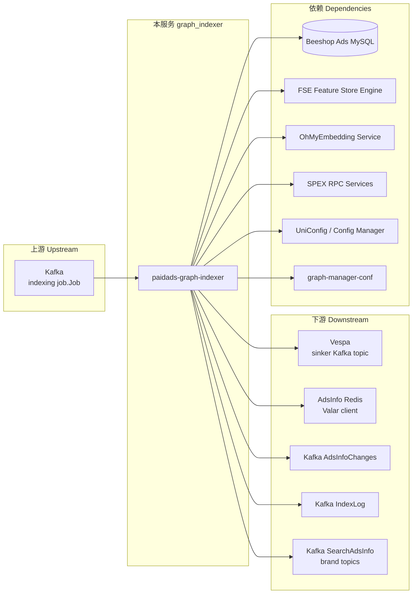

<!-- ads-workspace-gdoc-sync: gdoc_id=1rnab-RVoZ-Hb3TbEjAz4uVEjBUEE4qaITsM56xBxWyQ gdoc_url=https://docs.google.com/document/d/1rnab-RVoZ-Hb3TbEjAz4uVEjBUEE4qaITsM56xBxWyQ/edit -->

# paidads-graph-indexer

Git 仓库：https://git.garena.com/shopee/deep/indexer/paidads-graph-indexer

## 目录 / Table of Contents

- [项目概述](#项目概述--introduction)
- [核心功能](#核心功能--features)
- [架构](#架构--architecture)
  - [数据流](#数据流--data-flow)
  - [Graph 名称与 Mux 路由](#graph-名称与-mux-路由--graph-names-and-mux-routing)
  - [Operator 执行原则](#operator-执行原则--operator-execution-principles)
  - [上下游调用拓扑](#上下游调用拓扑--service-topology)
- [Kafka 上下游](#kafka-上下游--kafka-topics)
  - [消费端（输入）](#消费端输入--consumer--input-topics)
  - [生产端（输出）](#生产端输出--producers--output-topics)
  - [消息格式与 Proto 引用](#消息格式与-proto-引用--message-formats-and-proto-references)
- [Redis 写入](#redis-写入--redis-writes)
  - [写入操作汇总](#写入操作汇总--write-operations)
  - [Key 命名规范](#key-命名规范--key-patterns)
- [各广告类型 Graph 流程](#各广告类型-graph-流程--per-ad-type-graph-flow)
  - [Product Ads](#product-ads)
  - [Video Ads](#video-ads)
  - [Live Ads](#live-ads)
  - [Shop Ads](#shop-ads)
  - [Brand Max Ads](#brand-max-ads)
  - [Brand Search Ads](#brand-search-ads)
  - [广告属性更新](#广告属性更新--ad-attribute-update)
  - [Antou 业务逻辑](#antou-业务逻辑--antou-business-logic)
- [AdsInfo 与 Vespa 字段来源](#adsinfo-与-vespa-字段来源--adsinfo--vespa-field-sources)
- [Operator 参考](#operator-参考--operator-reference)
- [目录结构](#目录结构--directory-structure)
- [开发规范](#开发规范--development-guidelines)
- [配置](#配置--configuration)
- [部署](#部署--deployment)
- [监控](#监控--monitoring)
- [业务术语表](#业务术语表--business-terminology-glossary)
- [参考资料](#参考资料--additional-resources)
- [常见问题](#常见问题--frequently-asked-questions)

---

## 项目概述 / Introduction

`paidads-graph-indexer`（服务名：`graph_indexer`）是 Shopee 广告近实时索引服务。

服务消费上游 Kafka 索引任务（`job.Job` protobuf），经 **DAG 算子引擎**多阶段处理后，将广告数据写入 Vespa、Redis（AdsInfo）和下游 Kafka topic。商品广告、店铺广告、直播广告、视频广告的索引创建、更新与删除均由本服务统一编排。

本服务是 Shopee 广告索引架构演进的核心成果，统一了原 `livestream-indexer` 和 `shop-indexer` 的功能，完成了以下广告类型的 graph-based 迁移：

| 广告类型 | Placement | 状态 |
|---|---|---|
| Brand Max Ads | — | 已迁移 |
| Brand Search Ads | 45 | 已迁移（KA8）|
| Video Ads（Mingtou）| 54 | 已迁移 |
| Video Ads Antou | 0/2/5/8 | 已迁移（KA5，item_decision 内处理）|
| Live Ads Mingtou | 33 | 已迁移 |
| Live Ads Antou | 40（ROI_TWO）| 已迁移（item_decision 内处理）|
| Shop Ads | — | 已迁移 |
| Product Ads | 0/2/5/8 | graph-based |

---

## 核心功能 / Features

1. **多类型广告索引**：支持商品（Item）、店铺、直播、视频广告的完整生命周期索引管理。
2. **Graph Engine 驱动**：29 个 DAG graph 覆盖不同广告类型与操作场景（含 Periodic Indexer 专属 graph），算子可热更新无需重启。
3. **并行处理**：Collector 和 Sinker 阶段使用 `errgroup` 并发执行，降低整体 P99 延迟。
4. **双 Antou 路径**：`item_decision` graph 内嵌 Video Antou 和 Live Antou 两条并行决策分支，统一管理 Antou 预算和 embedding 有效性校验。
5. **反作弊集成**：在索引时集成 Campaign 反作弊软封和 Traffic 反作弊服务，过滤异常流量。
6. **Embedding 更新独立路径**：支持 OhMyEmbedding 商品 embedding 的独立更新链路。
7. **内容审核**：索引时集成 Censoring 和商品黑名单服务进行内容过滤。
8. **多地区支持**：通过 `HandledCountries` 配置支持全球站点的差异化处理。
9. **热配置重载**：通过 Config Manager 订阅 UniConfig 变更，在线更新 graph 启用状态、Kafka consumer 配置等核心参数。
10. **关键词管理**：支持保留词、关键词黑名单和 BroadMatch 处理。
11. **统一算子注册**：154 个算子通过 `pkg/setup/register.go` 统一注册，每个算子实例独立初始化，避免并发状态污染。

12. **Periodic Indexer**：独立的定期补偿索引服务（`cmd/periodic_indexer/`，服务名：`periodic_indexer`），消费 `INDEXER_PERIODIC_ADSINFO_MISSING_INDEX_REASON` 和 `INDEX_TOOL_PERIODIC_TRIGGER_REASON` 触发的 Kafka 任务，对漏建 AdsInfo 的广告进行补偿写入。

---

## 架构 / Architecture

### 数据流 / Data Flow

```
Kafka（上游索引 job.Job）
         │
         ▼
  ┌─────────────────────┐
  │     Consumer Server  │  pkg/server/server.go
  │   （多 Worker）      │
  └──────────┬──────────┘
             │  解析 job.Job，提取 Type / IndexReason / Placement
             ▼
  ┌─────────────────────┐
  │     Handler Router   │  pkg/handlers/
  │  Product/Shop/Live   │  按 job.Type 分发到对应 Handler
  │  Video/Default       │
  └──────────┬──────────┘
             │
             ▼
  ┌──────────────────────────────────────────────────────────┐
  │               Graph Engine                               │
  │                                                          │
  │  Step 1：Decision Graph                                  │
  │    并发采集 Account/Campaign/广告基础数据                │
  │    ↓ 分层决策：状态、余额、商品、内容审核                │
  │    ↓ 输出：DocumentDecisionMap（按 Placement 的决策结果）│
  │                                                          │
  │  Step 2：Collector Graph — 仅 INDEX 决策时执行          │
  │    并发采集 Vespa 所需的丰富特征数据                     │
  │    ↓ 输出：DataContainer（embedding、标签、价格、        │
  │              BidStrategy）                               │
  │                                                          │
  │  Step 3：Sinker Graph                                    │
  │    并发写入 Vespa / AdsInfo Redis / Kafka / IndexLog     │
  └──────────────────────────────────────────────────────────┘
             │
             ▼
  Vespa（广告文档）/ AdsInfo Redis（检索索引）/
  Kafka（下游消费方：LogifyOhMyEmbedding、SearchAdsInfo 等）
```

### Graph 名称与 Mux 路由 / Graph Names and Mux Routing

Graph 名称常量定义在 `pkg/graph/names.go`，路由规则在 `pkg/graph/mux.go`：

| 触发条件 | 目标 Graph |
|---|---|
| `IndexReason = AD_ATTRIBUTE_UPDATE_*` | `update_ad_attributes` |
| `Type=ADS, Placement=BRAND_SEARCH_ADS` | `brand_search` |
| `Type=ADS, Placement=BRAND_MAX_ADS` | `brand_max` |
| 其他 Type（Product/Shop/Live/Video）| 由各 Handler 直接指定 |

Graph 配置（DAG 结构、节点依赖）托管在独立仓库 `git.garena.com/shopee/deep/searchads/graph-manager-conf`（分支 `indexer_0.7.0`），通过 `make download` 拉取到本地。

当前服务加载共 **29 个** graph（含 Periodic Indexer 专属）：

| 类型 | Graph 名称 |
|-----|-----------|
| Decision | `item_decision`, `live_decision`, `video_decision`, `shop_decision`, `periodic_decision`, `keyword_decision`, `brand_max_decision` |
| Collector | `item_collector`, `shop_collector`, `video_collector`, `live_collector`, `update_ad_attributes_v2`, `periodic_product_collector`, `periodic_video_collector`, `periodic_shop_collector`, `periodic_live_collector`, `brand_max_collector`, `keyword_match_collector` |
| Sinker | `item_sinker`, `shop_sink`, `video_sinker`, `live_sinker`, `periodic_sinker`, `brand_max_sinker`, `brand_search_sinker` |
| 其他 | `update_ad_attributes`, `brand_search`, `brand_max`, `default_sinker` |

### Operator 执行原则 / Operator Execution Principles

| 角色 | 约束 |
|---|---|
| **所有 Operator** | 每个字段在 Context 中只能被设置一次，不允许二次修改 |
| **Collector Ops** | 只向 `DataContainer` 追加字段，不能修改已有字段 |
| **Decision Ops** | 向 `DocumentContainer` 写决策；决策为 DELETE 时立即终止 graph 执行 |
| **Sinker Ops** | 从 graph context 读取 `DocumentContainer` 和 `DataContainer`，执行最终写入 |

### 上下游调用拓扑 / Service Topology



| 方向 | 服务/组件 | 协议 | 说明 |
|---|---|---|---|
| 上游 | Kafka（indexing jobs）| Kafka consumer | 消费 job.Job protobuf 索引任务，携带 Type/IndexReason/Placement 等路由信息 |
| 下游 | Vespa | Kafka（sinker topic）| 写入广告文档（paidads_item/video/liveads/shop 系列 schema）|
| 下游 | AdsInfo Redis（Valar）| Valar client | 写入 AdsInfo V2 正排索引，供检索链路使用 |
| 下游 | Kafka（AdsInfoChanges）| Kafka producer | 发布 AdsInfo 变更事件，下游包括 LogifyOhMyEmbedding、SearchAdsInfo |
| 下游 | Kafka（IndexLog）| Kafka producer | 写入索引日志，落地到 Hive 表 mp_paidads.ods_shopee_paidads_* |
| 下游 | Kafka（SearchAdsInfo/brand）| Kafka producer | Brand Max/Brand Search 写出 SearchAdsInfo、ProductAds、SinkerVespaV2 等 topic |
| 依赖 | Beeshop Ads MySQL | MySQL | 广告主库（advertisement/campaign/account/item/shop/keyword 表）|
| 依赖 | FSE（Feature Store Engine）| gRPC | bid_strategy、target_roas、category order counts、voucher、Antou i2v map 等 |
| 依赖 | OhMyEmbedding | SPEX RPC | 商品 embedding（CollectOhMyEmbeddingOp）和视频 embedding（CollectVideoEmbeddingOp）|
| 依赖 | 多 SPEX RPC 服务 | SPEX RPC | ultimate_ads_service、shopads_keyword_manager、livestream/video service、query understand service 等 |
| 依赖 | UniConfig / Config Manager | push | 热更新订阅（graph enable 状态、reserved_keyword、antou 开关等）|
| 依赖 | graph-manager-conf | Git pull（启动前）| DAG 结构与节点依赖配置，make download 拉取 |

---

## Kafka 上下游 / Kafka Topics

### 消费端（输入）/ Consumer — Input Topics

**Consumer Group**：`paidads-indexpipeline-live-global-graph-indexer`

**Brokers**：`kafka-paidadsIndex-live-01.airtrunk.i.sz.shopee.io:9092`，`kafka-paidadsIndex-live-02.airtrunk.i.sz.shopee.io:9092`，`kafka-paidadsIndex-live-03.airtrunk.i.sz.shopee.io:9092`

三个 topic 对应三个独立 consumer server（`pkg/server/server.go`）：

| Topic | 说明 | Consumer Server 实例 |
|---|---|---|
| `shopee_ads_shopindexer_live` | 主实时流，承接绝大多数实时索引任务 | server 1 |
| `shopee_ads_batch_shopindexer_live` | 批量流，用于定时全量刷新等批量任务 | server 2 |
| `shopee_ads_shopindexer_sub_live` | sub 流，承接次优先级实时任务 | server 3 |

**Retry / DLQ 配置**（via UniConfig `graph_indexer_kafka_consumer_config`）：

| 配置项 | 值 |
|---|---|
| Retry queue topic | `shopee-ads-indexer-retryq-global-live` |
| DLQ topic | `shopee-ads-indexer-dlq-global-live` |
| 最大重试次数（maxretry）| 3 |
| 重试退避间隔（backoffmsecond）| 1000 ms |

### 生产端（输出）/ Producers — Output Topics

共 6 个 producer 配置，分别写往不同 topic 和 broker 集群：

| Producer 配置名 | Topic | Broker 集群 | 消息类型 | 下游消费方 |
|---|---|---|---|---|
| `searchadsinfo-kafka-producer` | `shopee_ads_info_live` | `kafka.kafka_maketplace_ads_live_sg-01.ap-sg-1-general-a.live.mq.shopee.io:9092` | `AdsInfoEvent` | AdsInfoGateway |
| `product-ads-kafka-producer-list` | `shopee_ads_sinker_es_target_live` | paidadsIndex Kafka（同消费端）| `indexerSchema.Message` | Vespa sinker service |
| `adsinfo-changes-kafka-producer` | `ads-index-info-changes-global-live` | `kafka.kafka_paidads_muti_group_live.ap-sg-1-general-c.live.mq.shopee.io:9092` | `paidads_valar_gateway.AdsInfoChanges` | LogifyOhMyEmbedding、SearchAdsInfo |
| `sinker-vespa-v2-kafka-producer-list` | `shopee_ads_sinker_shop_live` | paidadsIndex Kafka（同消费端）| `schema.Message` | Vespa sinker V2 |
| `index-log-producer` | `deep.paidads_shopindex_log` | `di-kafka-at01-bg1-bootstrap01~03-airtrunk-sg.data-infra.shopee.io:9093` | `indexLog.Log` | 数据仓库（Hive）|
| `product-ads-index-log-producer` | `deep.paidads_index_log` | Data Infra Kafka（同上）| `indexLog.Log` | 数据仓库（Hive）mp_paidads.ods_shopee_paidads_* |

### 消息格式与 Proto 引用 / Message Formats and Proto References

#### 输入消息格式

消息类型：`job.Job` protobuf

Proto 路径：`git.garena.com/shopee/deep/paidads-schema/pkg/proto/gen/job/shopindex`（paidads-schema v1.93.0）

核心字段：

| 字段 | 说明 |
|---|---|
| `Country` | 站点/地区 |
| `Type` | 任务类型（ITEM / ADS）|
| `Reason`（IndexReason）| 索引原因（触发路由的关键字段）|
| `Placement` | 广告位 ID |
| `AdsId` | 广告 ID |
| `ItemId` | 商品 ID |
| `ShopId` | 店铺 ID |
| `AdsAccountId` | 广告账户 ID |
| `UserId` | 用户 ID |
| `PostId` | 视频 Post ID |
| `ExtInfo.AdAttributeInfo` | 广告属性信息（PricingType、ColdStartFlag、AdTag 等）|

#### 输出消息格式

| Producer | Proto 包路径 | 版本 |
|---|---|---|
| searchadsinfo（`AdsInfoEvent`）| `git.garena.com/shopee/deep/paidads-valar/proto/gen/ads_info` | paidads-valar v0.135.0 |
| product-ads（`indexerSchema.Message`）| `git.garena.com/shopee/deep/paidads-indexer/proto/gen/paidads_schema_pb` | paidads-schema v1.93.0 |
| adsinfo-changes（`AdsInfoChanges`）| `git.garena.com/shopee/deep/paidads-schema/paidads_valar_gateway/gen/go/paidads_valar_gateway.pb/paidads_valar_gateway` | paidads-schema/paidads_valar_gateway v0.40.0 |
| sinker-vespa-v2（`schema.Message`）| `git.garena.com/shopee/deep/paidads-schema/raw/proto/gen/paidads_schema_pb` | paidads-schema/raw v0.121.1 |
| index-log / product-ads-index-log（`indexLog.Log`）| `git.garena.com/shopee/deep/paidads-schema/pkg/proto/gen/log/shopindex`（V1）/ `log/index`（V2）| paidads-schema v1.93.0 |

---

## Redis 写入 / Redis Writes

### 写入操作汇总 / Write Operations

本服务共有 4 个写入 Redis 的 operator（第 5 个为只读依赖汇总见下节）：

| Operator | Redis 地址 | Key 格式 | 写入数据类型 | 适用广告类型 | 源码路径 |
|---|---|---|---|---|---|
| `AdsInfoSinkOp`（V1 legacy）| `41d118e2a397e033.elasticredis.cloud.shopee.io:10554` | 由 Valar client 管理 | `paidads_valar.AdsInfo`（[proto](https://git.garena.com/shopee/deep/paidads-valar/proto/go/paidads_valar.pb)，v0.135.0）| Brand Max / Brand Search V1 路径 | `pkg/operator/sinker/adsinfo/` |
| `AdsInfoV2SinkOp`（当前主路径）| `73fvx.elasticredis.cloud.shopee.io:10656`（user: cache_readwrite_862634）| 由 Valar client V2 管理 | `paidads_valar.AdsInfo` | Product / Shop / Live / Video Ads | `pkg/operator/sinker/adsinfo_v2/` |
| `SearchAdsInfoPlacementSinkOp` | `dzn44.elasticredis.cloud.shopee.io:11126`（user: cache_readwrite_392348）| Placement 级别，由 Valar client 管理 | `paidads_valar.AdsInfo`（Placement 维度索引）| Brand Search / Brand Max | `pkg/operator/sinker/` |
| `FirstDeliveryTimeSinkOp` | `2dhgx.elasticredis.cloud.shopee.io:10021` | `FDT_{country}_{campaignID}`（Redis Sorted Set，member=adsID，score=首次投放时间 Unix timestamp）| Sorted Set（ZAdd/ZRem/ZScore）| 仅 ROI_TWO / SIMPLE_ROI_TWO pricing type | `pkg/operator/sinker/` |

### Key 命名规范 / Key Patterns

| Operator | Key 命名规范 | 数据结构 | 说明 |
|---|---|---|---|
| `AdsInfoSinkOp` / `AdsInfoV2SinkOp` | 由 Valar client 内部管理（按 adsID hash 分桶）| Hash / String | Add()/Delete() 方法操作，支持全量更新和属性更新 |
| `SearchAdsInfoPlacementSinkOp` | 由 Valar client 按 Placement 维度管理 | Hash / String | Placement 级别索引，供 Brand Search/Brand Max 检索使用 |
| `FirstDeliveryTimeSinkOp` | `FDT_{country}_{campaignID}` | Sorted Set | member = adsID，score = 首次投放时间（Unix timestamp），仅写入 ROI_TWO / SIMPLE_ROI_TWO 定价类型的广告 |
| 只读依赖：`shop-voucher-blacklist-cache` | `vsbl:{country}:{shopID}` | String/Set | 店铺优惠券黑名单，地址：`vgejb.elasticredis.cloud.shopee.io:10657` |
| 只读依赖：embedding validity | `video_emb_validity_{COUNTRY}_{postID}_{version}` | String | Antou 视频 embedding 有效性校验 key |
| 只读依赖：Antou budget cache | `ls_antou_historical_budget_cache`（key=adsID）| String | Live Antou 历史预算使用率 |

**只读 Redis 依赖**（不写入，仅读取）：

| 用途 | Redis 地址 |
|---|---|
| 商品黑名单 | `f3c98d022299a531.redis.cloud.shopee.io:11132` |
| Bad-case 黑名单 | `78420999634e48dc.elasticredis.cloud.shopee.io:10309` |
| 全局类目缓存 | `yhrmq.elasticredis.cloud.shopee.io:10529` |
| Simple BroadMatch 缓存 | `8d80470aa2457dca.elasticredis.cloud.shopee.io:11331` |
| Tag CLI 缓存 | `81c89632a22b3683.elasticredis.cloud.shopee.io:11061` |
| Censoring 缓存 | `b4cd943564a840f3.elasticredis.cloud.shopee.io:10359` |
| 店铺优惠券黑名单 | `vgejb.elasticredis.cloud.shopee.io:10657` |
| 广告投放时间 | `cflft.elasticredis.cloud.shopee.io:10246` |
| 商品标签缓存 | `5d0bd653c166373e.elasticredis.cloud.shopee.io:10302` |

---

## 各广告类型 Graph 流程 / Per-Ad-Type Graph Flow

### Product Ads

Product Ads（Placement 0/2/5/8）是最复杂的广告类型，经过三个 graph：`item_decision` → `item_collector` → `item_sinker`。

#### item_decision Graph

```
[并行] CollectCampaignFromDB / CollectAccountFromDB / CollectAdvertisementFromDB
                       ↓
              DecideAdsStatus
    ┌─────────────────┼──────────────────┐
    ↓                 ↓                  ↓
CollectAccountValidBalance  CollectTotalExpenses  CollectDailyExpenses
    └──────────────────┼──────────────────┘
                       ↓
              DecideDeductVisible           ← 账户余额/日预算/总预算检查
                       ↓
         CollectItemHitBlacklist
                       ↓
         DecideItemBlacklistVisible         ← 商品黑名单过滤
                       ↓
    CollectItemModelWithCompatibilityInfo
                       ↓
              DecideItemStock               ← 商品库存检查
         ┌─────────────┤
         ↓             ↓
CollectShopModel   CollectAccountModel
         └─────────────┤
                       ↓
              DecideItemVisible             ← 商品可见性 + 跨境过滤
                       ↓
      CollectItemPlacementBlacklisted
                       ↓
       DecideItemBadCaseBlacklisted         ← Bad-case 商品过滤
                       ↓
     CollectGlobalCategoryAttributeMap
                       ↓
              DecideItemAdult               ← 成人内容过滤
                       ↓
          CalculateNextVisibleTime          ← 计算下次可见时间
                ↙              ↘
[Video Antou 分支]        [Live Antou 分支]
(allow_error=true)        (allow_error=true)
见 Antou 章节              见 Antou 章节
                ↘              ↙
       BuildItemDocumentDecisionMap         ← 聚合所有 Placement 决策
```

#### item_collector Graph（仅 INDEX 时执行，所有节点 allow_error=true）

| Operator | 采集数据 | 用途 |
|---|---|---|
| CollectBlockFirstPartySeller | 自营卖家封禁状态 | 内容过滤 |
| CollectTrafficDeboostData | 流量降权数据 | 内容过滤 |
| CollectProductItemCensoringList | 商品内容审核黑名单（依赖上面两个）| 内容过滤 |
| CollectItemAttributes | 商品属性（颜色、规格等）| MText 输入/Vespa 字段 |
| CollectProductLabel | ML 商品标签 | Vespa 检索特征 |
| CollectShopInfo | 店铺信息（地址、认证状态）| Vespa 字段 |
| CollectShoppingGuideItemTags | 购物指南标签 | Vespa 字段 |
| CollectTrafficRules | 流量规则 | Vespa 字段 |
| CollectBroadMatch | BroadMatch 关键词 | SearchAdsInfo |
| CollectMtext | MText 特征（依赖 ItemAttributes）| SearchAdsInfo 特征 |
| CollectItemQueryTag | 商品 query tag | SearchAdsInfo 特征 |
| CollectOhMyEmbedding | 商品 embedding 向量 | Vespa 向量检索 |
| CollectQueryUnderstandPerfScores | 查询理解性能分 | Vespa 排序特征 |
| CollectAdTag | 广告专属标签 | PlanBucketListV2 输入 |
| CollectPlanBucketListV2 | Plan Bucket 数据（依赖 AdTag）| 出价策略 |
| CollectBidStrategy | 出价策略（初始 CPM/oCPC）| Vespa 字段 |
| CollectItemPriceV2 | 商品价格 V2 | 出价/优惠券 |
| CollectItemMinPriceV2 | 商品最低价 V2 | 优惠券计算 |
| CollectIsShopVoucherBlacklisted | 店铺优惠券黑名单 | 过滤无效优惠券 |
| CollectShopVouchers | 店铺优惠券 | Vespa 字段 |
| CollectVoucherDiscountList | 优惠券折扣列表 | Vespa 字段 |
| CollectShopOrderCount | 店铺近期订单数 | 质量特征 |

#### item_sinker Graph

```
[并行]
ItemVespaKafkaSink       → 写商品 Vespa 文档（embedding、价格、标签、BidStrategy）
AdsInfoV2Sink            → 写 AdsInfo Redis V2（Valar client）
     ↓
AdsInfoChangesKafka      → 发布 AdsInfo 变更事件（被 LogifyOhMyEmbedding 等消费）
ProductAdsIndexLogSink   → 写索引日志（Hive 表 mp_paidads.ods_shopee_paidads_...）
FirstDeliveryTimeSink    → 记录广告首次投放时间
```

---

### Video Ads

Video Ads（Placement 54，Mingtou）经过三个 graph：`video_decision` → `video_collector` → `video_sinker`。

#### video_decision Graph

```
[并行] CollectCampaignFromDB / CollectAccountFromDB / CollectAdvertisementFromDB
                       ↓
              DecideAdsStatus
    ┌─────────────────┼──────────────────┐
    ↓                 ↓                  ↓
CollectAccountValidBalance  CollectTotalExpenses  CollectDailyExpenses
    └──────────────────┼──────────────────┘
                       ↓
              DecideDeductVisible
                       ↓
          CalculateNextVisibleTime
                       ↓
              CollectVideoData              ← 获取视频信息（商品列表、店铺信息）
                       ↓
              DecideVideoData               ← 校验 post 状态，GMV 视频必须有关联商品
                       ↓
           CollectVideoCreatorData          ← 获取视频创作者信息
                       ↓
          DecideVideoCreatorStatus          ← 校验创作者资质
                ↙              ↘
   CollectItemModel         CollectGlobalCategoryAttributeMap
   (allow_error=false)      (allow_error=true)
   CollectShopModel
   (allow_error=true)
                ↘              ↙
           CollectVideoDecisionMap          ← 构建视频 DocumentDecisionMap
```

#### video_collector Graph

```
[并行]
CollectItemCategoryOrderCounts   ← 类目订单量（用于初始 CPM 计算）
CollectItemPriceV2               ← 商品价格
CollectItemMinPriceV2            ← 商品最低价
CollectBidStrategy               ← 出价策略
CollectVideoEmbedding            ← 视频 embedding 向量（Vespa 向量检索）
CollectIsShopVoucherBlacklisted  ← 店铺优惠券黑名单
CollectPlanBucketListV2          ← Plan Bucket 数据
CollectShopOrderCount            ← 店铺订单数

[有依赖]
CollectShopVouchers       ← 依赖 ItemPriceV2 + ItemMinPriceV2 + ShopVoucherBlacklisted
CollectVoucherDiscountList← 依赖 ShopVoucherBlacklisted
CollectItemBiddingPrice   ← 依赖 ItemPriceV2 + ItemCategoryOrderCounts + BidStrategy
                          ← 计算视频广告初始 CPM（repository.GetVideoAdsInitialCPM）
```

#### video_sinker Graph

```
[并行]
AdsInfoV2Sink           → 写 AdsInfo Redis V2
     ↓
AdsInfoChangesKafka     → 发布 AdsInfo 变更事件
VideoSinkerVespaKafka   → 写视频 Vespa 文档（含 video embedding、商品信息）
                          Topic: shopee_ads_sinker_shop_live
ProductAdsIndexLogSink  → 写索引日志
```

---

### Live Ads

Live Ads（Mingtou，Placement 33）经过三个 graph：`live_decision` → `live_collector` → `live_sinker`。

#### live_decision Graph

```
[并行] CollectCampaignFromDB / CollectAccountFromDB / CollectAdvertisementFromDB
                       ↓
              DecideAdsStatus
    ┌─────────────────┼──────────────────┐
    ↓                 ↓                  ↓
CollectAccountValidBalance  CollectTotalExpenses  CollectDailyExpenses
    └──────────────────┼──────────────────┘
                       ↓
              DecideDeductVisible
                       ↓
          CalculateNextVisibleTime
                       ↓
           CollectAccountModel
                       ↓
          DecideAccountStatus               ← 跨境账户状态校验
         ┌─────────────┤
         ↓             ↓
CollectShopModel   CollectIsAccountAffiliate
         └─────────────┤
                       ↓
          DecideLiveAdsShopHoliday          ← 店铺假日模式检查
                       ↓
           CollectMCNStatus
                       ↓
           DecideMCNStatus                  ← MCN 资质检查
                       ↓
           CollectAffiliateStatus
                       ↓
          DecideAffiliateStatus             ← Affiliate（KOL）资质检查
                       ↓
          CollectLiveStreamSession          ← 获取直播场次信息
                       ↓
      CollectLiveStreamOrangeBagItems       ← 获取直播间橙包商品
         ┌─────────────┤
         ↓             ↓（allow_error=true）
 CollectItemModel   CollectGlobalCategoryAttributeMap
                       ↓
       BuildLiveAdsDocumentDecision         ← 构建直播广告 DocumentDecisionMap
```

#### live_sinker Graph

```
[并行]
AdsInfoV2Sink       → 写 AdsInfo Redis V2（含直播专属字段）
     ↓
AdsInfoChangesKafka → 发布 AdsInfo 变更事件
LiveVespaKafkaSink  → 写直播广告 Vespa 文档
                      Schema: paidads_liveads_{country}
```

---

### Shop Ads

Shop Ads 经过三个 graph：`shop_decision` → `shop_collector` → `shop_sink`。

#### shop_decision Graph（8 层结构）

```
Level 1: [并行] CollectCampaignFromDB / CollectAccountFromDB / CollectAdvertisementFromDB
                       ↓
              DecideAdsStatus
Level 2: ┌─────────────────┼──────────────────┐
         ↓                 ↓                  ↓
CollectAccountValidBalance  CollectTotalExpenses  CollectDailyExpenses
         └──────────────────┼──────────────────┘
                       ↓
              DecideDeductVisible
Level 3: ┌─────────────────┤
         ↓                 ↓
  CollectShopModel   CollectAccountModel
         └─────────────────┤
                       ↓
       DecideShopAccountVisible             ← 店铺/账户可见性 + 跨境过滤
Level 4:               ↓
         CollectShopItemList                ← 获取店铺商品列表
                       ↓
           CollectItemModel
                       ↓
              DecideItemStock               ← 商品库存检查
         ┌─────────────┤
         ↓             ↓
CollectItemLabels  CollectItemTrafficRemoval
         └─────────────┤
                       ↓
                DecideItem                  ← 商品流量 AF + 标签决策
Level 5:               ↓
         CollectShopKeywordList             ← 获取店铺关键词（含保留词过滤）
                       ↓
      DecideDeductVisibleByKeyword          ← 关键词粒度余额/预算检查
Level 6:               ↓
         CollectAdsAdminBlacklist
                       ↓
        DecideAdsAdminBlacklist             ← 管理员黑名单过滤
Level 7:               ↓
     CollectGlobalCategoryAttributeMap      ← (allow_error=true)
Level 8:               ↓
      BuildShopAdsDocumentContainer         ← 构建 shop DocumentDecisionMap
       CalculateNextVisibleTime             ← (allow_error=true)
```

#### shop_sink Graph

```
[并行]
ShopVespaKafkaSink  → 写店铺 Vespa 文档（含关键词、内容审核列表）
                      Topic: shopee_ads_sinker_shop_live
AdsInfoV2Sink       → 写 AdsInfo Redis V2
     ↓
AdsInfoChangesKafka → 发布 AdsInfo 变更事件
```

---

### Brand Max Ads

Brand Max 已迁移至三阶段 graph 架构：`brand_max_decision` → `brand_max_collector` → `brand_max_sinker`，同时并行执行 `item_collector` → `item_sinker`。

Sinker：Brand Max 使用 `default_sinker` → `SearchAdsInfoKafka` + `AdsInfoSink`（V1）+ `AdsInfoChangesKafka` + `SearchAdsInfoPlacementSink` + `ProductAdsKafka` + `SinkerVespaV2Kafka` + `IndexLogSink`。

---

### Brand Search Ads

Brand Search Ads（Placement 45）由 `BrandSearchHandler` 处理，通过 `brand_search` graph 完成决策，并行执行两条 sinker 路径：

- `default_sinker`：兼容旧版，输出 Kind=`UnifiedAdsInfo`（SearchAdsInfo + AdsInfoChanges）
- `brand_search_sinker`：新版 Shop Vespa 写出（Kind=`ShopVespa`）

> 正在从 DefaultHandler + default_sinker 向专属 BrandSearchHandler 架构迁移（代码注释标有 "todo Migrate to the latest architecture"）。

路由（`pkg/routing/ads_routing.go`）：Brand Search 输出 Kind=`UnifiedAdsInfo`，Destination=`SearchAdsInfoPlacementSink`。

---

### 广告属性更新 / Ad Attribute Update

当 `IndexReason` 为 `AD_ATTRIBUTE_UPDATE_AD_TAG_REASON` 时，路由到 `AdAttributeUpdateHandler`（过渡 Handler，迁移完毕后移除），并行执行：
- `DefaultHandler`：触发 `update_ad_attributes` graph → `default_sinker`（兼容 ROI 1.0 Vespa + 旧版 AdsInfo 双写）
- `ProductHandler`：触发 `update_ad_attributes_v2` graph → `item_sinker`（新版 Ad Tag 写入 Vespa）

当 `IndexReason` 为 `AD_ATTRIBUTE_UPDATE_COLD_START_REASON` 时，路由到 `AdAttributeUpdateHandler`，触发 `update_ad_attributes` graph → `default_sinker`，不走完整决策流程。

---

### Antou 业务逻辑 / Antou Business Logic

**Antou** 指将直播或视频内容嵌入到商品广告 Placement 中。广告主无需单独购买 Antou 广告类型，只需购买商品广告即可自动触发直播/视频内容检索。

Antou 决策发生在 **`item_decision` graph** 中，在 `DecideItemAdult` 通过后分叉为两条并行子分支（均为 `allow_error=true`）：

#### Video Antou 分支

```
DecideItemAdult（通过）
        ↓
DecideVideoAntouPricingType     ← 检查 Campaign pricing type 是否包含 Antou 类型
        ↓（不匹配则提前退出分支）
CollectAntouVideosFSE           ← 从 FSE 查询关联 Antou post ID 列表
                                   Config key: video_antou_fse_max_videos_per_item
        ↓
DecideAntouVideos               ← 校验 post 数 > 0，否则该 Placement 设为 NOT_INDEX
        ↓
CollectAntouEmbeddingVersions   ← 查询每个 Antou 视频的 embedding 版本 map
        ↓
DecideAntouHasValidEmbedding    ← 校验至少有一个视频具有有效 embedding，否则 NOT_INDEX
        ↓（输出 DocumentContainer 到 BuildItemDocumentDecisionMap）
```

#### Live Antou 分支

```
DecideItemAdult（通过）
        ↓
DecideLiveAntouRegionAndPricingType  ← 检查地区 + pricing type 属于 Antou 类型
                                        Config keys: antou_placement_pricing_types_for_filtering
                                                     ls_antou_region_pricing_types_for_filtering
        ↓（不匹配则提前退出分支）
CollectLiveStreamSession             ← 获取当前直播场次
        ↓
DecideLiveAntouSession               ← 校验直播场次处于活跃状态（正在直播）
        ↓
CollectLiveAntouOrangeBag            ← 获取 Live Antou 橙包商品列表
        ↓
DecideLiveAntouOrangeBag             ← 校验橙包商品数 > 0
        ↓
CollectLiveAntouStreamerType          ← 获取主播类型（KOL/Brand/Official 等）
        ↓
DecideLiveAntouStreamerType           ← 校验主播类型允许 Antou 投放
        ↓
CollectLiveAntouHistoricalBudget     ← 从 Redis Cache 获取 Antou 历史预算使用率
                                        Config keys: ls_antou_historical_budget_cache
                                                     ls_antou_deduction_offline_cache
        ↓
DecideLiveAntouHistoricalBudget      ← 校验历史预算使用率低于阈值
                                        Config key: ls_antou_budget_config
        ↓
CollectLiveAntouNextVisibletime      ← 计算 Antou 下次可见时间
        ↓（输出 DocumentContainer 到 BuildItemDocumentDecisionMap）
```

**预算逻辑**：Live Antou 有独立预算管控。当历史预算使用率超过配置阈值时，该广告主的 Antou Placement 被设为 INVISIBLE（而非 NOT_INDEX），广告保留在索引中但不参与出价。预算恢复后，在 `CollectLiveAntouNextVisibletime` 计算的时间点自动重新可见。

**Antou vs Mingtou 区别**：
- **Mingtou**：广告主直接购买直播/视频广告（Placement 33/54），走独立的 `live_decision`/`video_decision` graph。
- **Antou**：直播/视频内容附加在商品广告决策中（item_decision graph 内的分支），广告主无需单独购买。

---

## AdsInfo 与 Vespa 字段来源 / AdsInfo & Vespa Field Sources

字段来源缩写：
- **DB** — Beeshop Ads 数据库（advertisement/campaign/item/shop/keyword 表）
- **FSE** — Feature Store Engine（多个特征表）
- **RPC** — SPEX 服务调用
- **Redis** — Redis 缓存
- **UniConfig** — 运行时配置
- **Request** — 直接来自 Kafka IndexJob 消息

### 公共字段（所有广告类型）/ Common Fields — All Ad Types

#### 广告/Campaign 基础字段

| AdsInfo/Vespa 字段 | 来源 Operator | 数据源 | 备注 |
|---|---|---|---|
| `AdsId` | — | Request（IndexJob.AdsID）| 直接来自 Kafka 消息 |
| `CampaignId` | — | Request（IndexJob.CampaignID）| 直接来自 Kafka 消息 |
| `ShopId` | — | Request（IndexJob.ShopID）| 直接来自 Kafka 消息 |
| `Placement` | — | Request（IndexJob.Placement）| 直接来自 Kafka 消息 |
| `Country` | — | Request（IndexJob.Country）| 直接来自 Kafka 消息 |
| `PricingType` | `InfoFromJobOp` | Request（ExtInfo.AdAttributeInfo.PricingType）| CPC/CPM/OCPM 等 |
| `AdTag` | `InfoFromJobOp` | Request（ExtInfo.AdAttributeInfo）| 广告属性标签 |
| `ColdStartFlag` | `InfoFromJobOp` | Request（ExtInfo.AdAttributeInfo.ColdStartFlag）| 冷启动标志 |
| `AdsAccountId` | — | Request（IndexJob.AdsAccountID）| 账户 ID；Live Ads 覆盖为 Streamer ID |
| `VisibleStartTs` | `CampaignFromDbOp` | DB（Campaign.VisibleStartTime）| 广告可见开始时间 |
| `VisibleEndTs` | `CampaignFromDbOp` | DB（Campaign.EndTime）| 广告可见结束时间 |

#### TargetRoi / BidStrategy 字段

| 广告类型 | 优先级 1 | 优先级 2 | 优先级 3 | 来源 Operator |
|---|---|---|---|---|
| Product / 通用 | DB（Campaign.Ext.RoiTwo.TargetValue）| DB（Campaign.Ext.TargetBroadRoi）| DB（Advertisement.Ext.TargetBroadRoi）| `BidStrategyOp` |
| Shop Ads | FSE（shop_ads_user_target_roas，按 shopID）| DB fallback | — | `BidStrategyOp` |
| Live Ads | FSE（live_ads_streamer_target_roas，按 streamerID）| DB fallback | — | `BidStrategyOp` |
| Video Ads（用户）| FSE（video_ads_user_target_roas，按 userID）| FSE（video_ads_region_target_roas，按 country）| DB fallback | `BidStrategyOp` |
| Video Ads（商品）| FSE（video_ads_item_target_roas，按 itemID → CPV）| — | — | `BidStrategyOp` |

### Product / Targeting Ads 特有字段 / Product / Targeting Ads — Specific Fields

| AdsInfo/Vespa 字段 | 来源 Operator | 数据源 | 备注 |
|---|---|---|---|
| `ItemId` | `AdvertisementFromDbOp` | DB（Advertisement.ItemID）| 广告关联商品 ID |
| `Item.Price` | `ItemPriceV2Op` | DB/Redis | 当前商品售价 |
| `Item.MinPrice` | `ItemMinPriceV2Op` | DB/Redis | 商品最低价 |
| `Item.GlobalCatIds` | `ItemModelOp` + `GlobalCategoryAttrMapOp` | DB + 本地类目缓存 | 完整全球类目路径 |
| `Item.CensoringIDsList` | `ItemModelOp`/censoring lib | 本地 censoring lib + RPC | 商品内容审核标签列表 |
| `Item.Labels` | `ItemLabelsOp` | DB（Item.Labels/ItemExt）| 商品质量标签 |
| `Item.BroadMatch` | `BroadMatchOp` | DB（broad-match config）| 宽泛匹配标志 |
| `VideoList[].PostId`（Video Antou 附加）| `AntouVideosFseOp` | FSE（content_videos_antou_i2v_map）| Antou 关联视频列表 |

### Shop Ads 特有字段 / Shop Ads — Specific Fields

| AdsInfo/Vespa 字段 | 来源 Operator | 数据源 | 备注 |
|---|---|---|---|
| `Advertisement.BidInfos[]` | Sinker（buildShopAdsInfo）| DB（keyword 表）| 按关键词出价列表；仅 Shop Ads 有 |
| `ItemList[]`（ItemId+Score）| Sinker（buildShopAdsInfo）| `SelectedItemsOp`（DB 商品列表）| 代表性商品列表，上限由 shop_ads_info_item_count_limit（默认 10）控制 |
| `Shop.Rating` | `ShopModelOp` | DB（ShopModel.RatingStar）| 店铺评分 |
| `Shop.OrderCount14D` | `ShopOrderCountOp` | FSE 或 DB | 近 14 天订单数 |
| `ShopInfo.CensoringList` | `ShopLevelCensoringOp` | RPC（paidads_shopads_keyword_manager）| 店铺级内容审核标签 |

### Live Ads 特有字段 / Live Ads — Specific Fields

| AdsInfo/Vespa 字段 | 来源 Operator | 数据源 | 备注 |
|---|---|---|---|
| `LiveStreamAds.SessionId` | `LiveStreamSessionOp` | RPC（livestream service）| 当前直播场次 ID |
| `LiveStreamAds.SessionStartTs` | `LiveStreamSessionOp` | RPC | 场次开始时间 |
| `LiveStreamAds.CampaignSlots` | `CampaignFromDbOp` | DB（Campaign.Ext.LiveStream.TimeSlots）| 直播 Campaign 时间段 |
| `Content.StreamerType` | `LiveAntouStreamerTypeOp` | DB/RPC | 主播类型（普通/KOL）|
| `AdsAccountId`（覆盖）| Live collector | — | 覆盖为 Streamer ID |
| `BidStrategy.TargetRoi`（Live）| `BidStrategyOp` | FSE（live_ads_streamer_target_roas）| Live Ads 目标 ROI |
| `BidStrategy.Aov` | `BidStrategyOp` | FSE | 平均订单金额 |
| `BidStrategy.Ecr` | `BidStrategyOp` | FSE | 预期转化率 |

### Video Ads 特有字段 / Video Ads — Specific Fields

| AdsInfo/Vespa 字段 | 来源 Operator | 数据源 | 备注 |
|---|---|---|---|
| `VideoAds.PostId` | `VideoDataOp` | RPC/DB | 视频 post ID（Mingtou）|
| `VideoAds.VideoItem.ItemId` | `VideoDataOp` + Sinker | DB | 关联商品 ID |
| `VideoAds.VideoItem.Price` | `ItemPriceV2Op` | DB/Redis | 关联商品价格 |
| `Advertisement.Cpm` | `ItemBiddingPriceOp` | 本地计算（repository.GetVideoAdsInitialCPM）| 视频广告初始 CPM 出价 |
| `VideoEmbedding` | `VideoEmbeddingOp` | Embedding Service Cache（Redis）| 向量检索 embedding |
| `BidStrategy.Cpv` | `BidStrategyOp` | FSE（video_ads_item_target_roas.cpv）| Cost Per View |

### 跨类型字段来源汇总 / Cross-Type Field Source Summary

| 字段/字段组 | Product Ads | Video Ads | Live Ads | Shop Ads | Brand Search | Brand Max | 来源类型 |
|---|:---:|:---:|:---:|:---:|:---:|:---:|---|
| AdsId/CampaignId/ShopId/Placement | ✅ | ✅ | ✅ | ✅ | ✅ | ✅ | Request |
| PricingType/AdTag/ColdStartFlag | ✅ | ✅ | ✅ | ✅ | ✅ | ✅ | Request（InfoFromJobOp）|
| Campaign 预算/花费字段 | ✅ | ✅ | ✅ | ✅ | ✅ | ✅ | DB（CampaignFromDbOp）|
| TargetRoi（通用 DB fallback）| ✅ | ✅ | ✅ | ✅ | ✅ | ✅ | DB（BidStrategyOp）|
| TargetRoi（FSE Shop）| ❌ | ❌ | ❌ | ✅ | ❌ | ❌ | FSE（shop_ads_user_target_roas）|
| TargetRoi（FSE Live）| ❌ | ❌ | ✅ | ❌ | ❌ | ❌ | FSE（live_ads_streamer_target_roas）|
| TargetRoi（FSE Video）| ❌ | ✅ | ❌ | ❌ | ❌ | ❌ | FSE（video_ads_user/item_target_roas）|
| Account.Balance | ✅ | ✅ | ✅ | ✅ | ✅ | ✅ | DB（AccountValidBalanceOp）|
| Item 基础字段 | ✅ | ✅ | ❌ | ⚠️ partial | ❌ | ❌ | DB（ItemModelOp）|
| Advertisement.Cpm（Video CPM）| ❌ | ✅ | ❌ | ❌ | ❌ | ❌ | 本地计算（ItemBiddingPriceOp）|
| Shop 统计（14d/30d GMV 等）| ✅ | ✅ | ✅ | ✅ | ❌ | ❌ | FSE 或 DB（ShopOrderCountOp）|
| Advertisement.BidInfos（关键词出价）| ❌ | ❌ | ❌ | ✅ | ❌ | ❌ | DB（keyword 表）|
| ItemList（店铺商品列表）| ❌ | ❌ | ❌ | ✅ | ❌ | ❌ | DB（SelectedItemsOp）|
| LiveStreamAds 字段组 | ❌ | ❌ | ✅ | ❌ | ❌ | ❌ | RPC+DB（LiveStreamSessionOp）|
| VideoAds 字段组 | ❌ | ✅ | ❌ | ❌ | ❌ | ❌ | RPC/DB（VideoDataOp）|
| VideoEmbedding | ❌ | ✅ | ❌ | ❌ | ❌ | ❌ | Embedding Service Cache（Redis）|
| Voucher.Roi3VoucherList | ✅ | ✅ | ✅ | ✅ | ❌ | ❌ | RPC（ShopVouchersOp）|
| Video Antou VideoList | ✅（item 分支）| ❌ | ❌ | ❌ | ❌ | ❌ | FSE（AntouVideosFseOp）|
| Live Antou 历史预算 | ❌ | ❌ | ✅（item 分支）| ❌ | ❌ | ❌ | DB（LiveAntouHistoricalBudgetOp）|

---

## Operator 参考 / Operator Reference

所有算子通过 `pkg/setup/register.go` 的 `opList` 统一注册，共 **178 个**。算子名常量定义在 `pkg/operator/fields.go`（210+ 字段）。

### 公共 Collect Operators / Common Collect Operators

| Operator | 数据源 | 输出字段 | 描述 |
|---|---|---|---|
| `CollectInfoFromIndexJobOp` | job.Job protobuf | — | 从索引任务提取基础信息 |
| `CollectAdvertisementFromDBOp` | MySQL advertisement 表 | Advertisement | 广告基础信息（状态、定价类型、视频 post_id）|
| `CollectAccountFromDBOp` | MySQL account 表 | Account | 广告账户信息（状态、余额类型）|
| `CollectCampaignFromDBOp` | MySQL campaign 表 | Campaign | Campaign 信息（状态、日/总预算、时间段、自动增预算）|
| `CollectAccountModelOp` | MySQL/Cache | AccountModel | 账户模型（is_cb、account_type 等）|
| `CollectShopModelOp` | MySQL/Cache | ShopModel | 店铺模型（shop_type、holiday_mode、status）|
| `CollectTotalExpensesOp` | MySQL expense 表 | TotalExpenses | 广告总花费 |
| `CollectDailyExpensesOp` | MySQL expense 表 | DailyExpenses | 今日广告花费 |
| `CollectAccountValidBalanceOp` | MySQL account 表 | AccountValidBalance | 账户有效余额（扣减冻结金额后）|
| `CollectPlanBucketListV2Op` | Cache/DB（依赖 AdTag）| PlanBucketList | Plan Bucket 数据 V2 |
| `BidStrategyOp` | 计算逻辑+DB | BidStrategy | 综合出价策略（CPC/oCPC/CPA/ROAS），含 TargetROI |
| `CollectAntiFraudBlockProbabilityOp` | paidads-indexer-lib/campaign_anti_fraud | AntiFraudBlockProbability | Campaign 级反作弊软封概率 |
| `CollectShopOrderCountOp` | DB/Cache | ShopOrderCountData | 店铺近期完成订单数 |

### Product 专属 Collect Operators / Product-specific Collect Operators

| Operator | 数据源 | 输出字段 | 描述 |
|---|---|---|---|
| `CollectItemHitBlacklistOp` | Redis Cache | ItemHitBlacklistMap | 商品是否命中全局黑名单 |
| `CollectItemModelWithCompatibilityInfoOp` | paidads-indexer（item service）| ItemModelMap | 商品模型（含兼容性信息）|
| `CollectItemLabelsOp` | ML 标签服务 | ItemLabels | 商品标签（成人、危险品等）|
| `CollectItemTrafficRemovalOp` | 流量管控服务 | ItemTrafficRemoval | 商品被流量管控下架的场景列表 |
| `CollectItemAttributesOp` | item_attr 服务 | ItemAttrData | 商品属性（颜色、规格等，MText 输入）|
| `CollectProductItemCensoringListOp` | censoring 服务 | ItemCensoringList | 商品内容审核黑名单 |
| `CollectOhMyEmbeddingOp` | OhMyEmbedding | EmbeddingMap | 商品 embedding 向量（多版本）|
| `CollectBroadMatchOp` | broad_match 服务 | BroadMatchData | 宽泛匹配关键词 |
| `CollectItemPriceV2Op` | item 服务 V2 | ItemPriceV2 | 商品价格（多模型）|
| `CollectItemMinPriceV2Op` | item 服务 V2 | ItemMinPriceV2 | 商品最低价 |
| `CollectIsShopVoucherBlacklistedOp` | Redis Cache | IsShopVouchersBlackListed | 店铺是否在优惠券黑名单 |
| `CollectShopVouchersOp` | DB（依赖 Price+MinPrice+BlacklistFlag）| VoucherInfo | 店铺优惠券信息 |
| `CollectVoucherDiscountListOp` | DB（依赖 BlacklistFlag）| VoucherDiscountList | 优惠券折扣列表 |

### Live 专属 Collect Operators / Live-specific Collect Operators

| Operator | 数据源 | 输出字段 | 描述 |
|---|---|---|---|
| `CollectLiveStreamSessionOp` | DB（直播表）| LiveStreamSession | 当前直播场次信息 |
| `CollectLiveStreamOrangeBagItemsOp` | DB（直播关联商品）| SelectedItemIDList | 直播间橙包商品 ID 列表 |
| `CollectLiveStreamerProfileOp` | DB | LiveStreamerProfile | 主播档案（影响出价策略）|
| `CollectIsAccountAffiliateOp` | DB/Cache | IsAccountAffiliate | 账户是否为 Affiliate（KOL）类型 |
| `CollectLiveAntouHistoricalBudgetOp` | Redis Cache（ls_antou_historical_budget_cache）| LiveAntouHistoricalBudget | Live Antou 历史预算使用率 |
| `CollectLiveAntouOrangeBagOp` | DB | OrangeBagItemList | Antou 橙包商品列表 |
| `CollectLiveAntouStreamerTypeOp` | DB/Cache | StreamerType | Antou 主播类型（KOL/Brand/Official）|

### Video 专属 Collect Operators / Video-specific Collect Operators

| Operator | 数据源 | 输出字段 | 描述 |
|---|---|---|---|
| `CollectVideoDataOp` | video 服务 | VideoData、SelectedItemIDList | 视频数据（post 状态、关联商品列表）|
| `CollectVideoCreatorDataOp` | video 服务 | VideoCreatorData | 视频创作者数据（账户状态、投放资质）|
| `CollectVideoEmbeddingOp` | Embedding Service（Redis Cache）| VideoEmbedding | 视频 embedding 向量 |
| `CollectItemCategoryOrderCountsOp` | DB（类目订单统计表）| ItemCategoryOrderCounts | 类目订单量（L1-L9 层级），用于初始 CPM 计算 |
| `CollectItemBiddingPriceOp` | 计算逻辑 | ItemBiddingPrice | 视频广告初始 CPM |

### Antou 专属 Collect Operators / Antou-specific Collect Operators

| Operator | 数据源 | 输出字段 | 描述 |
|---|---|---|---|
| `CollectAntouVideosFSEOp` | FSE | AntouVideoList | 商品关联 Antou post ID 列表 |
| `CollectAntouEmbeddingVersionsOp` | Embedding Service | AntouVideoEmbeddingVersionsMap | 每个 Antou 视频的 embedding 版本 map |

### Decide Operators

| Operator | 决策逻辑 | 失败结果 |
|---|---|---|
| `DecideAdsStatusOp` | 账户正常 + Campaign 在有效期内 + 广告状态 NORMAL | NOT_INDEX，终止 |
| `DecideDeductVisibleOp` | 余额 > 0 + 日花费 < 日预算 + 总花费 < 总预算 | INVISIBLE |
| `DecideShopAccountVisibleOp` | 店铺状态正常 + 无跨境封禁 | NOT_INDEX |
| `DecideItemStockOp` | 商品库存 > 0 | NOT_INDEX |
| `DecideItemVisibleOp` | 商品未被 Traffic AF 下架 + 模型状态正常 | NOT_INDEX |
| `DecideItemBadCaseBlacklistedOp` | 商品不在 bad-case 黑名单 | NOT_INDEX |
| `DecideItemAdultOp` | 商品不在成人类目 | NOT_INDEX |
| `DecideBrandMaxOp` | 账户 deduct price > 0 + booking 日花费未超 | NOT_INDEX |
| `DecideDeductVisibleByKeywordOp` | 关键词粒度余额/预算检查 | INVISIBLE（关键词级别）|
| `DecideLiveAdsShopHolidayOp` | 店铺非假日模式（Affiliate 豁免）| NOT_INDEX |
| `DecideMCNStatusOp` | MCN 有效 | NOT_INDEX |
| `DecideAffiliateStatusOp` | Affiliate 状态合规 + 推广权限 | NOT_INDEX |
| `DecideLiveAntouSessionOp` | 存在活跃直播场次 | Antou Placement NOT_INDEX |
| `DecideLiveAntouOrangeBagOp` | 橙包商品数 > 0 | Antou Placement NOT_INDEX |
| `DecideLiveAntouHistoricalBudgetOp` | 历史预算使用率 < 阈值 | Antou Placement INVISIBLE |
| `DecideAntouVideosOp` | Antou post 数 > 0 | Antou Placement NOT_INDEX |
| `DecideAntouHasValidEmbeddingOp` | 至少 1 个有效 embedding | Antou Placement NOT_INDEX |
| `DecideVideoDataOp` | Post 状态正常 + GMV 视频有关联商品 | NOT_INDEX |
| `DecideVideoCreatorStatusOp` | 视频创作者账户投放资质合规 | NOT_INDEX |

---

## 目录结构 / Directory Structure

```
paidads-graph-indexer/
├── cmd/
│   ├── graphindexer/              # 主索引服务入口（main.go 和 run.go）
│   └── periodic_indexer/          # 定期补偿索引服务入口（main.go 和 run.go，新）
├── config/                        # 配置结构体（Config、PeriodicIndexerConfig）
│   └── consts/                    # 常量（服务名、Config Keys、env 枚举、Placement 映射）
├── internal/dependency/           # 完整依赖初始化（DB、Cache、Producer、Client）
├── pkg/
│   ├── server/                    # Kafka consumer server，job 解析与路由
│   ├── handlers/                  # Handler（Product/Shop/Live/Video/Default/AdAttributeUpdate/Periodic）
│   ├── graph/                     # Graph Engine 封装，graph 名（names.go），Mux 路由（mux.go）
│   ├── operator/
│   │   ├── collect/               # collect operator（公共+商品+直播+店铺+Antou）
│   │   ├── collect/video/         # 视频专属 collect operator
│   │   ├── decide/                # decide operator（含 Antou 决策链）
│   │   ├── calculate/             # calculate operator（NextVisibleTime、DocumentDecisionMap）
│   │   └── sinker/                # 13 个 sinker operator（Vespa、AdsInfo、IndexLog、Kafka）
│   │       ├── adsinfo/           # AdsInfo V1 Sink（BrandMax/BrandSearch/Item 专属）
│   │       ├── adsinfo_v2/        # AdsInfo V2 Sink（Product/Live/Shop/Video）
│   │       ├── indexlog/          # IndexLog V1
│   │       ├── indexlog_v2/       # IndexLog V2（Product/Live/Shop/Video）
│   │       └── vespa/             # VideoSinkerVespaKafkaOp
│   ├── repository/                # 数据库访问层（30+ Repo：ads、account、campaign、keyword 等）
│   ├── types/                     # 核心数据结构（DataContainer、DocumentContainer、Decision）
│   ├── request/                   # 从 job.Job 构建请求，校验逻辑
│   ├── routing/                   # 按 type 和 Placement 路由到目标 graph（PlacementToKindsMap）
│   ├── context/                   # 请求/采集/graph context 工具
│   ├── exporter/                  # Prometheus 指标定义（9 个指标）
│   ├── status/                    # 决策状态枚举（50+ 状态码）
│   ├── setup/                     # 算子注册（154 个算子统一入口 register.go）
│   └── clients/                   # 外部服务客户端
│       ├── broad_match/           # BroadMatch SPEX client
│       ├── item_attr/             # ItemAttr client
│       ├── mtext/                 # MText client（支持版本热更新）
│       ├── product_label/         # ProductLabel client
│       └── badcase_blacklist/     # Bad-case 黑名单 client
├── deploy/graphindexer.json       # Mesos 部署配置
├── scripts/                       # 代码生成脚本（getter/setter/constructor）
├── Makefile                       # 构建和 CI 入口
└── .gitlab-ci.yml                 # GitLab CI 配置
```

---

## 开发规范 / Development Guidelines

### 代码风格

- 执行 `make fmt` 用 `gofmt` 格式化代码，提交前必须执行。
- 执行 `make vet` 进行 `go vet` 静态分析。
- `make ci`（等价于 fmt + test-nv + vet）是提交 MR 前的最低验证标准。

### 项目结构规范

- **新增算子**：在对应子目录（`collect/`、`decide/`、`calculate/` 或 `sinker/`）创建新文件，并在 `pkg/setup/register.go` 的 `opList` 中注册。
- **新增 graph**：在 `pkg/graph/names.go` 声明 graph 名常量，在 `pkg/graph/mux.go` 注册路由规则，并在 `graph-manager-conf` 仓库添加对应 YAML 配置。
- **新增 Repo**：在 `pkg/repository/` 创建新文件，遵循现有 Repository Pattern。

### 命名规范

- **算子命名**：功能名 + 类型后缀，如 `AdvertisementCollectOp`、`AdsStatusDecideOp`、`AdsInfoSinkOp`。
- **graph 名**：下划线分隔小写，如 `item_decision`、`shop_sink`，并在 `pkg/graph/names.go` 声明常量。
- **Config Keys**：统一在 `config/consts/config_key.go` 声明，建议以 `graph_indexer_` 为前缀。

### 错误处理

- **可重试错误**（`context.DeadlineExceeded`、`operator_error.RetryableError`）：返回 `error`，Kafka Consumer 会 Nack 消息并触发重试。
- **不可重试错误**：返回 `nil`，Consumer 会 Ack 消息，错误通过日志和 `paidads_graph_indexer_error_counter` 指标追踪。
- **allow_error=true 的算子**：即使算子返回错误，graph engine 继续执行后续节点，仅记录日志。

### 单测规范

- 测试命令：`make test-nv`（跳过 vendor 目录）。
- 新算子应附带单测，覆盖所有决策分支（happy path + 各种失败场景）。

---

## 配置 / Configuration

### 静态配置文件

服务配置结构体定义在 `config/config.go`，关键字段：

| 字段 | 类型 | 描述 |
|---|---|---|
| `Env` | `string` | 运行环境（dev/staging/prod）|
| `RequestTimeout` | `time.Duration` | 单请求超时 |
| `HandledCountries` | `[]string` | 本实例处理的站点列表 |
| `DBClient` | `dbclient.Config` | MySQL 连接配置 |
| `SearchAdsInfoKafkaProducer` | `producer.Config` | SearchAdsInfo Kafka producer |
| `AdsInfoSinkRedisConfig` | `redisutil.Config` | AdsInfo V1 Redis 配置 |
| `AdsInfoV2SinkRedisConfig` | `redisutil.Config` | AdsInfo V2 Redis 配置 |
| `SinkerVespaV2KafkaProducers` | `[]*producer.Config` | Vespa V2 Kafka producer 列表 |
| `ProductAdsKafkaProducers` | `[]*producer.Config` | Product Ads Kafka producer 列表 |
| `IndexLogProducer` | `producer.Config` | 索引日志 Kafka producer |
| `FSEClientConfig` | `fse.Config` | Feature Store Engine client 配置 |

### UniConfig 动态热更新

热更新 Config Keys（定义在 `config/consts/config_key.go`）：

| Key | 描述 |
|---|---|
| `graph_indexer_enabled_graphs` | 动态启用/禁用指定 graph |
| `graph_indexer_kafka_consumer_config` | Kafka consumer Topic 和 Worker 配置 |
| `ls_antou_budget_config` | Live Antou 预算阈值配置 |
| `ls_antou_historical_budget_cache` | Live Antou 历史预算 Redis Cache 配置 |
| `ls_antou_deduction_offline_cache` | Live Antou 扣费离线 Cache 配置 |
| `antou_placement_pricing_types_for_filtering` | Video/Live Antou Placement 允许的定价类型列表 |
| `ls_antou_region_pricing_types_for_filtering` | 按地区过滤 Live Antou 定价类型 |
| `ls_kol_if_promote_others` | KOL 是否允许推广他人商品 |
| `item_vespa_embedding_update_enabled` | 商品 Embedding 更新开关 |
| `video_antou_fse_max_videos_per_item` | FSE 查询每个商品最多关联 Antou 视频数（默认 10）|
| `reserved_keyword` | 保留词列表（店铺广告 CollectShopKeywordList 使用）|
| `mtext_timeout_duration` | MText 服务调用超时（默认 1s）|
| `max_voucher_discount_list_limit_config` | 优惠券折扣列表最大条数 |
| `roi3_sync_label_and_cat_to_ads_info` | ROI3 模式下同步标签/类目到 AdsInfo 的开关 |

### graph-manager-conf 与 DAG 配置

Graph 配置（DAG 结构、节点依赖）托管在独立仓库 `git.garena.com/shopee/deep/searchads/graph-manager-conf`（分支 `indexer_0.7.0`），通过以下命令拉取：

```bash
make download
```

### 本地开发启动

```bash
# 在后台运行 inp-client 建立内网通道
$ inp-client &

# 拉取 graph 配置
$ make download

# 构建服务
$ make graphindexer

# 运行（需要本地配置文件）
$ ./bin/paidads_graphindexer_server -conf <your_local_config>
```

---

## 部署 / Deployment

### 构建

```bash
# 本地构建（macOS 同时输出 macOS 和 Linux 版本）
$ make graphindexer
# 输出：bin/paidads_graphindexer_server
#       bin/paidads_graphindexer_server.linux（Linux 交叉编译）

# 完整 CI 验证（fmt + test-nv + vet + build）
$ make all

# 仅 CI 检查（fmt + test-nv + vet）
$ make ci
```

构建产物：`bin/paidads_graphindexer_server`

构建时通过 `-ldflags` 注入版本信息：`Commit`、`Version`、`Branch`、`Builder`、`GoVersion`、`Built`。

### 发布流程

由 `.gitlab-ci.yml` 驱动：

| Stage | 内容 |
|---|---|
| **test** | 运行 `make ci`（fmt、test-nv、vet）|
| **check** | 代码质量检查 |
| **changelog** | 自动生成 CHANGELOG |
| **release** | Mesos 部署（配置：`deploy/graphindexer.json`）|

Mesos 部署关键配置（`deploy/graphindexer.json`）：

| 字段 | 值 |
|---|---|
| `project_name` | `paidads` |
| `module_name` | `graphindexer` |
| smoke check | `HTTP GET /smoketest` |
| health check | `HTTP GET /ping` |
| Prometheus | 已启用（`enable_prometheus: true`）|

---

## 监控 / Monitoring

### Prometheus 指标

所有指标以 `paidads_graph_indexer_` 为前缀（定义在 `pkg/exporter/exporter.go`）：

| 指标名 | 类型 | Labels | 描述 |
|---|---|---|---|
| `paidads_graph_indexer_latency` | Summary | `country`, `component` | 各组件/graph 延迟（P50/P90/P99）|
| `paidads_graph_indexer_upstream_latency` | Summary | `country`, `component` | 上游服务调用延迟 |
| `paidads_graph_indexer_counter` | Counter | `country`, `component` | 通用计数器 |
| `paidads_graph_indexer_job_success_counter` | Counter | `country`, `type`, `reason`, `placement` | 成功处理的 job 数量 |
| `paidads_graph_indexer_error_counter` | Counter | `country`, `component`, `graph`, `error` | 错误计数 |
| `paidads_graph_indexer_upstream_request` | Counter | `country`, `component` | 上游请求总数 |
| `paidads_graph_indexer_produce_message_size` | Summary | `destination`, `kind` | 下游消息体积分布 |
| `paidads_graph_indexer_hitmiss` | Counter | `country`, `component`, `result` | 缓存命中/未命中 |
| `paidads_graph_indexer_kafka_worker_distribution` | Gauge | `partition` | Kafka Worker 负载分布 |

### 排障场景

| 场景 | 排查入口 |
|---|---|
| 广告未写入 Vespa | 检查 `paidads_graph_indexer_job_success_counter{placement="<placement>"}` + `error_counter` |
| 索引漏刷 | 检查 Sinker operator 的 `error_counter`；使用 OpenTelemetry tracing 定位失败算子 |
| AdsInfo Redis 写入失败 | 检查 `AdsInfoV2SinkOp` 或 `AdsInfoSinkOp` 的错误日志 |
| Kafka producer 堆积 | 检查 `paidads_graph_indexer_produce_message_size` 和 producer lag |
| Antou 可见性抖动 | 检查 `DecideLiveAntouHistoricalBudget` 日志，确认 Redis Cache 地址连通性 |
| Live Ads 决策延迟高 | 检查 `paidads_graph_indexer_latency{component="live_decision"}` P99，关注 MCN/Affiliate 状态服务或 LiveStream Session DB 查询 |

---

## 业务术语表 / Business Terminology Glossary

| 术语 | 全称 | 说明 |
|---|---|---|
| Antou | 暗投 | 将直播/视频内容嵌入商品广告 Placement；广告主无需单独购买 |
| Mingtou | 明投 | 广告主直接购买的直播/视频广告（Placement 33/54）|
| NOT_INDEX | — | 硬性不上索引，广告从索引中删除 |
| INVISIBLE | — | 软性不可见，广告保留在索引中但不参与出价 |
| DocumentDecisionMap | — | 按 Placement 汇总的决策结果 map，Decision Graph 的输出 |
| DataContainer | — | Collector 阶段采集的丰富特征数据容器 |
| DocumentContainer | — | Decision 阶段输出的广告文档容器 |
| graph engine | — | 基于 DAG 的算子编排引擎，支持热更新 |
| operator | 算子 | graph engine 中的最小执行单元，分 Collect/Decide/Calculate/Sinker 四类 |
| AdsInfo V1/V2 | — | 正排索引 Redis 存储，V2 支持 Item/Video/Live/Shop 四种 Kind |
| Valar | — | Shopee 广告正排索引服务，graph-indexer 通过 Valar client 写入 AdsInfo |
| FSE | Feature Store Engine | 特征存储引擎，提供 bid_strategy、target_roas、Antou i2v map 等特征表 |
| MCN | Multi-Channel Network | 管理主播的第三方机构 |
| Affiliate | — | 通过推广商品赚取佣金的 KOL |
| orange bag items | 橙包商品 | 主播指定的特价商品，Antou 投放的核心资源 |
| DAG | Directed Acyclic Graph | 有向无环图，graph engine 的核心数据结构 |
| Plan Bucket | — | 流量分配和出价策略分化的 AB 实验分桶 |
| Cold Start | 冷启动 | 新广告缺乏足够数据进行精准预测的初始阶段 |

---

## 参考资料 / Additional Resources

- Git 仓库：https://git.garena.com/shopee/deep/indexer/paidads-graph-indexer
- [GraphManager 配置仓库](https://git.garena.com/shopee/deep/searchads/graph-manager-conf)
- [Graph Engine 仓库](https://git.garena.com/shopee/deep/searchads/graph-engine)
- [Paid Ads Glossary（Confluence）](https://confluence.shopee.io/pages/viewpage.action?spaceKey=SPAD&title=Paid+Ads+Glossary)
- [SPEX Go SDK 快速入门](https://spex.shopee.io/overview/quick-start/languages/go/index.html)
- [spcli 文档](https://spex.shopee.io/user-guide/api-management/spcli/index.html)

---

## 常见问题 / Frequently Asked Questions

**1. Antou 逻辑在哪个 graph 中？**

Antou 决策（Video Antou 和 Live Antou 两条分支）均在 `item_decision` graph 中，在 `DecideItemAdult` 之后分叉，均为 `allow_error=true`（不影响商品广告主流程）。两条分支并行运行，由 `BuildItemDocumentDecisionMap` 聚合。

**2. 服务消费哪些 Kafka Topic？**

Consumer Group：`paidads-indexpipeline-live-global-graph-indexer`。三个 topic：`shopee_ads_shopindexer_live`（主实时流）、`shopee_ads_batch_shopindexer_live`（批量流）、`shopee_ads_shopindexer_sub_live`（sub 流）。详见「[Kafka 上下游](#kafka-上下游--kafka-topics)」章节。topic 列表通过 UniConfig Key `graph_indexer_kafka_consumer_config` 动态下发，可在 Config Center 查看。

**3. 新增广告类型索引需要改哪些地方？**

① 在 `pkg/handlers/` 创建新 Handler；② 在 `pkg/graph/names.go` 声明新 graph 名常量；③ 在 `pkg/graph/mux.go` 注册路由规则；④ 在 `graph-manager-conf` 仓库添加新 graph YAML；⑤ 在 `pkg/operator/` 实现 Collect/Decide/Sinker 算子；⑥ 在 `pkg/setup/register.go` 注册算子。

**4. 算子报错后 Kafka 消息会重试吗？**

取决于错误类型：返回 `operator_error.RetryableError` 或 `context.DeadlineExceeded` 时，Consumer 会 Nack 消息并触发重试。其他错误直接 Ack，通过日志和 `paidads_graph_indexer_error_counter` 追踪。

**5. allow_error=true 的算子失败会怎样？**

graph engine 继续执行后续节点，该算子的输出字段在 Context 中缺失。依赖该字段的下游算子读取时会得到零值，各算子需自行处理 nil 情况。

**6. AdsInfo（Redis）和 Vespa 各自负责什么？**

- **AdsInfo**（V2，4 种 Kind：ItemVespaAdsInfo / VideoVespaAdsInfo / LiveVespaAdsInfo / ShopVespaAdsInfo）：供检索链路在广告召回时快速查询基础广告信息。
- **Vespa**：存储完整广告文档，支持属性过滤和向量检索（embedding KNN），是召回和排序的主存储。

**7. 广告未写入 Vespa 如何排查？**

① 检查 `paidads_graph_indexer_job_success_counter{placement="<placement>"}` 是否有成功记录；② 检查 `paidads_graph_indexer_error_counter` 是否有报错；③ 使用 OpenTelemetry tracing 定位失败算子；④ 检查决策 graph 的 `status` 输出（`pkg/status/` 目录下 50+ 状态码）。

**8. Antou 广告为何有时可见有时不可见（INVISIBLE vs NOT_INDEX）？**

- **NOT_INDEX**：硬性条件不满足（无直播场次、无橙包商品、无有效 embedding）——广告从索引中删除。
- **INVISIBLE**：软性条件不满足（预算使用率超阈值）——广告保留在索引中但不参与出价，预算恢复后在 `CollectLiveAntouNextVisibletime` 计算的时间点自动重新可见。

**9. 如何热更新 graph 的启用状态？**

修改 UniConfig 中 `graph_indexer_enabled_graphs` 的值，Config Manager 通过 SPEX callback 实时下发变更，无需重启服务。

**10. graph 配置（DAG 结构）和算子实现如何解耦？**

graph 配置（节点依赖关系）托管在 `graph-manager-conf` 仓库（YAML 文件），算子实现在本仓库。graph engine 启动时加载 YAML 并动态组装 DAG，绑定算子实现。修改 DAG 结构只需改 YAML，无需修改 Go 代码或重启服务（graph 热更新通过 `graph_indexer_enabled_graphs` 控制）。

**11. Video Antou 和 Live Antou 有何区别？**

| | Video Antou | Live Antou |
|---|---|---|
| 关联内容 | 视频 post（从 FSE 查询）| 活跃直播场次 |
| 有效性校验 | Antou post 数 > 0 + 有效 embedding | 正在直播 + 橙包商品 > 0 + 主播类型合规 |
| 预算管控 | 通过 embedding 版本控制 | 独立历史预算 Redis Cache |
| Graph 位置 | `item_decision`（Video Antou 分支）| `item_decision`（Live Antou 分支）|
| Config Key | `video_antou_fse_max_videos_per_item` | `ls_antou_budget_config` |

<!-- Generated by ads-workspace/skills/ads-readme-generate | checked: e982453d6a72b7df76d6ea40a9ef2eb0a8661d48 -->
