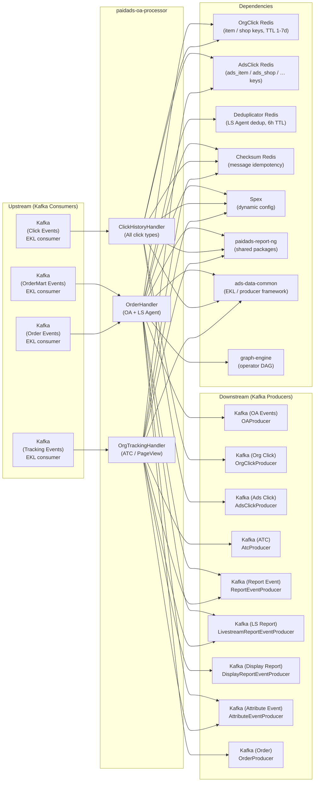

<!-- ads-workspace-gdoc-sync: gdoc_id=1LAIIiw3OLNB_VlQaJ-l9pZAtbR-mkTYlWf4tujKpXd8 gdoc_url=https://docs.google.com/document/d/1LAIIiw3OLNB_VlQaJ-l9pZAtbR-mkTYlWf4tujKpXd8/edit -->

# paidads-oa-processor

> **RNG – OA Processor** | Organic Attribution (OA) Processor for Shopee Paid Ads
>
> Repository: <https://git.garena.com/shopee/deep/paidads-oa-processor>

---

## Table of Contents

- [Introduction](#introduction)
- [Features](#features)
- [Architecture](#architecture)
  - [System Context](#system-context)
  - [Service Topology](#service-topology)
  - [Data Flow](#data-flow)
- [Three Consumer Services](#three-consumer-services)
  - [ClickHistory Service](#clickhistory-service)
  - [Tracking Attribution Service](#tracking-attribution-service)
  - [Order Attribution Service](#order-attribution-service)
- [Click History Management](#click-history-management)
  - [OrgClick Key Formats](#orgclick-key-formats)
  - [AdsClick Key Formats](#adsclick-key-formats)
  - [HistoryClient Interface](#historyclient-interface)
  - [Key Generation Rules](#key-generation-rules)
  - [TTL Strategy](#ttl-strategy)
- [Attribution Logic](#attribution-logic)
  - [ATC Attribution](#atc-attribution)
  - [Page View Attribution](#page-view-attribution)
  - [Order OA Attribution](#order-oa-attribution)
  - [LS Agent Attribution](#ls-agent-attribution)
  - [Attribution Windows (Direct 1D/2-7D/7D, Shop 1D)](#attribution-windows)
  - [Bundle Order Processing](#bundle-order-processing)
- [Kafka Input and Output](#kafka-input-and-output)
  - [Consumers — 4 EKL Services](#consumers)
  - [Producers — 9 Kafka Producers](#producers)
  - [Message Formats and Proto References](#message-formats-and-proto-references)
- [Graph Engine Operators](#graph-engine-operators)
- [Deduplication and Idempotency](#deduplication-and-idempotency)
  - [Checksum Verification](#checksum-verification)
  - [Deduplicator](#deduplicator)
  - [Order Dedup Key Rules](#order-dedup-key-rules)
- [Directory Structure](#directory-structure)
- [Configuration](#configuration)
  - [OAProcessorConfig — Static Config](#oaprocessorconfig--static-config)
  - [SpexConfig / Spex Config](#spexconfig--spex-config)
  - [RegionConfig — Dynamic Config](#regionconfig--dynamic-config)
  - [ProducersConfig](#producersconfig)
  - [SwitchTimestamp Gradual Rollout](#switchtimestamp-gradual-rollout)
- [Build and Deployment](#build-and-deployment)
- [Monitoring and Observability](#monitoring-and-observability)
  - [Attribution Counters](#attribution-counters)
  - [Business Metrics](#business-metrics)
  - [HTTP Endpoints](#http-endpoints)
- [Relationship with report-ng](#relationship-with-report-ng)
  - [Shared Code](#shared-code)
  - [Independent Concerns](#independent-concerns)
  - [Data Flow Interaction](#data-flow-interaction)
- [Development Guidelines](#development-guidelines)
  - [How to Add a New Click Key Type](#how-to-add-a-new-click-key-type)
  - [How to Add a New Attribution Flow](#how-to-add-a-new-attribution-flow)
  - [How to Add a Graph Engine Operator](#how-to-add-a-graph-engine-operator)
  - [Unit Testing](#unit-testing)
- [Business Terminology Glossary](#business-terminology-glossary)
- [Additional Resources](#additional-resources)
- [Frequently Asked Questions](#frequently-asked-questions)

---

## Introduction

**paidads-oa-processor** (application name: **RNG – OA Processor**) is the **Organic Attribution (OA) Processor** in Shopee's Paid Ads data pipeline. It is responsible for attributing users' organic behaviors — clicks, page views, add-to-cart, and orders — back to the ads that influenced them.

- **Go module**: `git.garena.com/shopee/deep/paidads-oa-processor`
- **Go version**: 1.24.0 (toolchain go1.24.5)
- **Log name**: `oaprocessor`
- **HTTP port**: 24444 (default)

**Core responsibilities**:

1. Maintain **Organic Click History** and **Ads Click History** in two separate Redis stores (OrgClick Redis, AdsClick Redis) by consuming all click events from Kafka.
2. Perform **Tracking Attribution** — attribute ATC (Add To Cart) and Page View events to prior ad clicks, producing `report_event`, `ads_atc`, and `attribute_event` messages.
3. Perform **Order OA Attribution** — attribute orders to organic+ads item/shop clicks within attribution windows (Direct 1D, Direct 2-7D, Direct 7D, Shop 1D), producing `OAEvent` and `AttributeEvent`.
4. Perform **LS Agent Attribution** — attribute Livestream Agent ad orders to agent-specific click history, with order and checkout deduplication.

The service runs **four independent EKL consumer services** (tracking, clickhistory, order, order_mart) in separate goroutines, each with its own context cancellation.

**Relationship with paidads-report-ng**: paidads-oa-processor shares core packages from `paidads-report-ng` (v1.1.35) — including `clickhistory`, `clickhistoryproc`, `reportproc`, `types`, `checksum`, `biz_exporter`, and `util`. OA Processor focuses on attributing organic behavior to ads (Organic → Ads), while report-ng focuses on generating ad report events (Ads → Report). The ClickHistoryHandler simultaneously writes to both OrgClick Redis and AdsClick Redis to serve both attribution chains independently.

**Outputs**: 9 Kafka producers emit events to OA topic, org click topic, ads click topic, ATC topic, report event topic, LS report topic, display report topic, attribute event topic, and order topic.

---

## Features

1. **Organic Click History Management** — Consumes all click types (item_click, shop_click, banner_click, livestream_product_click, video_product_click, shop_entrance_product_click, org_product_click) and writes to both OrgClick Redis (2 key types) and AdsClick Redis (9 key types) for independent use by OA and report-ng attribution chains.

2. **ATC Attribution** — Processes `ADD_TO_CART` tracking events: queries `AdsClickMgr` for associated ad clicks → routes through `PlacementHandlerMap` → calls `HandleTrackingATC` → produces `report_event`, `ads_atc`, and `attribute_event` Kafka messages.

3. **Page View Attribution** — Processes `VIEW` / `SHOP_VIEW` tracking events: queries Display Ads click (`GenDisplayAdsShopKey`) and Search Brand Ads click (`GenSearchBrandAdsShopKey`) from `AdsClickMgr` → calls `HandleTrackingPageView` → produces `report_event`.

4. **Order OA Attribution** — Processes `RawOrder` events: queries OrgClickMgr for the latest item click (`GenItemKey`) or shop click (`GenShopKey`) → applies attribution windows (Direct 1D / Direct 2-7D / Direct 7D / Shop 1D) → produces `OAEvent` and `AttributeEvent`.

5. **LS Agent Attribution (Livestream Agent)** — Processes Livestream Agent ad orders: queries `OrgClickMgr` for `GenSellerAdsItemKey` / `GenLivestreamItemKey` → checks `IsLSAdsAgentClick` → deduplicates order and checkout with 6-hour TTL → produces `report_event`, `ls_report`, and `order` Kafka messages.

6. **Message Idempotency and Deduplication** — Uses `Checksum` (from paidads-report-ng) for message-level idempotency on tracking and order events, and `Deduplicator` (Redis INCR + TTL) for LS Agent order-level deduplication.

---

## Architecture

### System Context

paidads-oa-processor sits at the center of Shopee's organic-to-ads attribution pipeline. It consumes raw behavioral events from Kafka (clicks, tracking events, orders) and emits structured attribution results back to Kafka for downstream consumption by data warehouses, report systems, and bidding services.

```
[Tracking Kafka] ──────────────────────────────────────────────────────────────────┐
[Click Kafka]    ──────────────────────────────────────────────────────────────────▶ paidads-oa-processor ──▶ [OA / ATC / Report / Attribute / LS Kafka Topics]
[Order Kafka]    ──────────────────────────────────────────────────────────────────┘         │
[OrderMart Kafka]─────────────────────────────────────────────────────────────────────────────┘
                                                                    │
                                                        ┌───────────▼──────────────┐
                                                        │  OrgClick Redis          │
                                                        │  AdsClick Redis          │
                                                        │  Deduplicator Redis      │
                                                        │  Checksum Redis          │
                                                        └──────────────────────────┘
```

### Service Topology



**Topology Table**:

| Direction | Name | Protocol | Description |
|-----------|------|----------|-------------|
| **Upstream** | Kafka (Tracking Events) | EKL consumer | Consumes user behavior tracking events (`TrackingEvent`): `ADD_TO_CART`, `VIEW`, `SHOP_VIEW`. Handled by `OrgTrackingHandler`. |
| **Upstream** | Kafka (Click Events) | EKL consumer | Consumes all click events (item_click, shop_click, banner_click, livestream_product_click, video_product_click, shop_entrance_product_click, org_product_click). Handled by `ClickHistoryHandler`. |
| **Upstream** | Kafka (Order Events) | EKL consumer | Consumes order events (`RawOrder` protobuf, SearchIndex wrapper). Handled by `OrderHandler` — supports `oaAttribution` and `lsAgentAttribution` flows. |
| **Upstream** | Kafka (OrderMart Events) | EKL consumer | Consumes order events from the new order mart topic (JSON `OrderMartOrder`), processed by the same `OrderHandler`. Controlled by `OrderMartSwitchTs`. |
| **Downstream** | Kafka (OA Events) | Kafka producer | `OAProducer` — sends `OAEvent` (order + associated click history + attribution window metrics: Direct 1D/2-7D/7D, Shop 1D). |
| **Downstream** | Kafka (Org Click) | Kafka producer | `OrgClickProducer` — sends organic click history updates for downstream OA attribution chain. |
| **Downstream** | Kafka (Ads Click) | Kafka producer | `AdsClickProducer` — sends ads click history updates, shared with report-ng's ads attribution chain. |
| **Downstream** | Kafka (ATC) | Kafka producer | `AtcProducer` — sends ATC attribution results (`ads_atc` events). |
| **Downstream** | Kafka (Report Event) | Kafka producer | `ReportEventProducer` — sends `report_event` messages that land in the reporting data warehouse. |
| **Downstream** | Kafka (LS Report) | Kafka producer | `LivestreamReportEventProducer` — sends Livestream Ads report events. |
| **Downstream** | Kafka (Display Report) | Kafka producer | `DisplayReportEventProducer` — sends Display Ads report events. |
| **Downstream** | Kafka (Attribute Event) | Kafka producer | `AttributeEventProducer` — sends `AttributeEvent` (full attribution detail including click history fields). |
| **Downstream** | Kafka (Order) | Kafka producer | `OrderProducer` — sends processed order events (used in the LS Agent new path). |
| **Dependency** | OrgClick Redis | Datastore | Click history store for all click types, accessed via `OrgClickMgr` (`clickhistory.HistoryClient`). Stores both OA keys (GenOAKeys: `item:{user_id}->{item_id}` TTL 7d, `shop:{user_id}->{shop_id}` TTL 1d) and all RNG ads keys (GenRngAdsKeys: `ads_item`, `ads_shop`, etc.) in a single combined write per click event. Value: `ClickHistory` protobuf. |
| **Dependency** | AdsClick Redis | Datastore | Ads click history store, accessed via `AdsClickMgr` (`clickhistory.HistoryClient`). Key formats include `ads_item`, `ads_shop`, `ads_shopclick_on_ls`, `ShopAds_shop`, `SearchBrandAds_shop`, `DisplayAds_shop`, `seller_ads_item`, `agent_ads_ls_item`, `ls_item` (TTL 1-7d). |
| **Dependency** | Deduplicator Redis | Datastore | Order/checkout dedup Redis, via `Deduplicator.HasDuplicate` (Redis INCR + TTL). Used for LS Agent order deduplication (6h TTL). |
| **Dependency** | Checksum Redis | Datastore | Message idempotency Redis via `checksum.Client` (`orderChecksum` / `trackingAttrCheckSum`). Ensures messages are not processed twice. |
| **Dependency** | Spex (Configuration) | Service | Dynamic config delivery via Spex (`ProducersConfig`, `RegionConfig`, `SwitchTimestamp`). Supports hot reload via `WatchRegionConfig`. |
| **Dependency** | paidads-report-ng | Library | Core shared library (v1.1.35): `clickhistory`, `clickhistoryproc`, `reportproc`, `types`, `checksum`, `biz_exporter`, `util`. |
| **Dependency** | ads-data-common | Library | Base framework: EKL consumer, producer wrapper, `graph_driver`, region utilities, smoke test, HTTP handler. |
| **Dependency** | graph-engine | Library | Graph engine execution framework (`searchads/graph-engine`) for operator registration and DAG-based processing via `GraphEngineCtx`. |

### Data Flow

```
3 Kafka inputs
    ↓
4 EKL consumer handlers (tracking / clickhistory / order / order_mart)
    ↓
Click History Redis read/write (OrgClick + AdsClick)
    ↓
Attribution logic
    ↓
9 Kafka producer outputs
```

Each EKL service runs in its own goroutine with independent context cancellation. The application uses `sync.WaitGroup` to wait for all services to stop gracefully.

---

## Three Consumer Services

### ClickHistory Service

Consumes all click events from Kafka. For each click event, `ClickHistoryHandler.Process` is invoked:

1. **Fraud filter**: Skip ads clicks that have fraud labels (`InternalLabel.Frauds`).
2. **Build `ClickHistory`**: Based on `TrackingOperationType`, build a `ClickHistory` protobuf for one of: item click, shop click, banner click, livestream product click, video product click, shop-entrance product click, or org product click.
3. **Generate two key sets** for each click:
   - `GenOAKeys` → OA attribution keys — `item:{user}->{item}`, `shop:{user}->{shop}`.
   - `GenRngAdsKeys` → RNG ads attribution keys — `ads_item`, `ads_shop`, `ShopAds_shop`, `SearchBrandAds_shop`, `DisplayAds_shop`, `seller_ads_item`, `agent_ads_ls_item`, `ls_item`, `ads_shopclick_on_ls`.
4. **Write to Redis**: Both key sets are merged (`keysToUpdate := append(oaKeys, rngAdsKeys...)`) and written together to `OrgClickMgr.SetClick`. For organic clicks, `handleRngOrgClickEvent` additionally calls `AdsClickMgr.SetClick` using report-ng's `rngClick.GenKeys`.
5. **Send to Kafka**: `OrgClickProducer` sends a click update when OA keys are present; `AdsClickProducer` sends updates for organic clicks via `handleRngOrgClickEvent`.

`SwitchTimestamp` controls whether the new link (`handleRngOrgClickEvent`) is activated. Events with timestamps before `SwitchTimestamp` skip the new code path.

### Tracking Attribution Service

Consumes `TrackingEvent` from Kafka. `OrgTrackingHandler.Process` dispatches by `TrackingOperationType`:

- **`ADD_TO_CART`** → `handleAtcEvent`: ATC attribution flow.
- **`VIEW` / `SHOP_VIEW`** → `handleViewEvent`: Page view attribution flow.

Other operations are rejected with an error. Message idempotency is enforced via `trackingAttrCheckSum` before processing.

### Order Attribution Service

Consumes `RawOrder` (V5 topic, SearchIndex-wrapped protobuf) and `OrderMartOrder` (order mart topic, JSON) from Kafka. Both are decoded and fed to `OrderHandler.Process`.

The handler supports two independent parallel flows controlled by `OrderProcess` config:

- **`oaAttribution`** (`AttributeOAEvent: true`): OA Order Attribution — attributes orders to organic clicks.
- **`lsAgentAttribution`** (`AttributeReportEvent: true`): LS Agent Attribution — attributes Livestream Agent ad orders.

The `SwitchOrderMart` mechanism controls whether orders from the V5 topic or the order_mart topic are the authoritative source, on a per-country basis.

---

## Click History Management

### OrgClick Key Formats

OrgClick Redis stores **organic** click history used by the OA attribution chain (`OrderHandler.oaAttribution`).

| Function | Key Format | TTL | Purpose |
|----------|-----------|-----|---------|
| `GenItemKey(user, item)` | `item:{user_id}->{item_id}` | 7 days | Organic item click — used for Direct 1D/2-7D/7D order attribution |
| `GenShopKey(user, shop)` | `shop:{user_id}->{shop_id}` | 1 day | Organic shop click — used for Shop 1D order attribution |

Source: `pkg/key/org.go`

### AdsClick Key Formats

AdsClick Redis stores **ads** click history used by the ATC/PageView attribution chain (`OrgTrackingHandler`) and report-ng.

| Function | Key Format | TTL | Attribution Scenario |
|----------|-----------|-----|-----------------------|
| `GenAdsItemKey(user, item)` | `ads_item:{user}->{item}` | 7 days | General ads item click (unused in current main path) |
| `GenAdsShopKey(user, shop)` | `ads_shop:{user}->{shop}` | 7 days | Ads shop click (equivalent to report-ng `ShopClick`) |
| `GenAdsShopClickOnLsKey(user, shop, lsSessionId)` | `ads_shopclick_on_ls:{user}->{shop}->{lsSessionId}` | 1 day | Shop click with Livestream-related click area |
| `GenShopAdsShopKey(user, shop)` | `ShopAds_shop:{user}->{shop}` | 7 days | Shop Ads placement clicks |
| `GenSearchBrandAdsShopKey(user, shop)` | `SearchBrandAds_shop:{user}->{shop}` | 7 days | Search Brand Ads placement — used for Page View attribution |
| `GenDisplayAdsShopKey(user, shop)` | `DisplayAds_shop:{user}->{shop}` | 1 day | Display Ads placement — used for Page View attribution |
| `GenSellerAdsItemKey(user, item)` | `seller_ads_item:{user}->{item}` | 7 days | Non-agent item click (equivalent to report-ng `NonAgentItemClick`) — used in LS Agent attribution |
| `GenAgentAdsLsItemKey(user, item)` | `agent_ads_ls_item:{user}->{item}` | 1 day | LS Agent item click |
| `GenLivestreamItemKey(user, item)` | `ls_item:{user}->{item}` | 7 days | Organic+ads Livestream product click — primary key for LS Agent attribution |

Source: `pkg/key/ads.go`

### HistoryClient Interface

`clickhistory.HistoryClient` (from `paidads-report-ng/pkg/clickhistory`) provides:

- `GetLatestClick(country string, keys ...string) (*ClickHistory, bool, error)` — retrieves the most recent click history across one or more keys.
- `SetClick(country string, click *ClickHistory, keys []TimedKey) error` — writes click history to Redis with TTL.

The underlying storage is a Redis Hash with country-sharded connections. Keys expire automatically per their TTL.

### Key Generation Rules

`ClickHistoryHandler.Process` generates two key sets per click event, then merges them into a single write to `OrgClickMgr`:

- **`GenOAKeys`**: Generates only if `user_id > 0` and `placement != nil`. For `CLICK` operation with items and no `adsTimestamp` (or raw ads click): generates `GenItemKey` + `GenShopKey`.
- **`GenRngAdsKeys`**: Generates various ads keys based on click type, placement, and `adsId`. Includes livestream, agent, shop-ads, search-brand-ads, display-ads, and seller-ads-item key types.

Both key sets are appended (`keysToUpdate := append(oaKeys, rngAdsKeys...)`) and written together to `OrgClickMgr.SetClick`. For organic clicks only, `handleRngOrgClickEvent` also runs separately and calls `AdsClickMgr.SetClick` using report-ng's `rngClick.GenKeys`.

### TTL Strategy

| Key Category | TTL | Rationale |
|---|---|---|
| Item click (OA/RNG) | 7 days | Matches 7-day attribution window |
| Shop click (OA) | 1 day | Matches Shop 1D attribution window |
| Display Ads, LS shop-on-ls | 1 day | Short-lived placements |
| Most ads keys | 7 days | Matches max attribution window |
| LS Agent dedup | 6 hours | Short-lived order dedup |

---

## Attribution Logic

### ATC Attribution

`handleAtcEvent` handles `ADD_TO_CART` tracking events:

1. Verify single item in tracking event; skip if `data.AdsId > 0` (already an ad ATC).
2. Call `atcAttribution`:
   - Query `AdsClickMgr.GetLatestClick` for `KeyNonAgentItemClick(user, item)`.
   - If found and within 1 day → `atcType = ADD_TO_CART` (direct).
   - Else, query `KeyShopClick(user, shop)` + `KeyShopAdsClick(user, shop)` → if found and within 1 day → `atcType = BROAD_ADD_TO_CART` (shop-level).
3. Build `AddToCartEvent` and `AttributeEvent` from click history.
4. Look up `PlacementHandlerMap` for the placement handler, call `HandleTrackingATC`.
5. Post-processing: `reportproc.SetReportID`, `biz_exporter.SetTrackingBizMetrics`.
6. Send to: `AtcProducer`, `AttributeEventProducer`, `ReportEventP`; also to `DisplayReportP` or `LsReportProducer` if the placement matches.

### Page View Attribution

`handleViewEvent` handles `VIEW` / `SHOP_VIEW` tracking events:

1. Reject if `placement >= 0` (i.e., event already has a placement — indicates it's an ad event, not organic).
2. Call `pageViewAttribution`:
   - For `VIEW`: extract `shopID` from the single item; query `AdsClickMgr.GetLatestClick` for `KeyDisplayAdsClick(user, shop)` and `KeySearchBrandAdsClick(user, shop)`.
   - For `SHOP_VIEW`: extract `shopID` from the single shop.
   - Return click if found and within 1 day.
3. Look up placement handler, call `HandleTrackingPageView`.
4. Post-processing: `reportproc.SetReportID`, `biz_exporter.SetTrackingBizMetrics`.
5. Send to: `ReportEventP`; also to `DisplayReportP` or `LsReportProducer` if placement matches.

### Order OA Attribution

`oaAttribution` (within `OrderHandler`) processes orders through `buildOAEvent`:

1. Convert `[]*types.Order` to `[]orderOA` (normalizing bundle orders).
2. For each `orderOA`:
   - Query `OrgClickMgr.GetLatestClick` for `GenItemKey(user, item)`.
   - If found and `timeElapsed > 0`:
     - `timeElapsed ≤ 1 day` → **Direct 1D** (`direct1d = 1`).
     - `1 day < timeElapsed ≤ 7 days` → **Direct 2-7D** (`direct2To7d = 1`).
     - `timeElapsed ≤ 7 days` → **Direct 7D** (`direct7d = 1`).
   - If not found: query `OrgClickMgr.GetLatestClick` for `KeyShopClick(user, shop)`.
     - If found, `timeElapsed > 0`, `timeElapsed ≤ 1 day`, and `orderItemID != shopClick.EventItemId` → **Shop 1D** (`shop1d = 1`).
3. Build `OAEvent` (order + click history fields + attribution window metrics) and `AttributeEvent` (full detail with `signature`, `targetCir`, `query`, `keyword`, `matchType`).
4. Send to `OAProducer` and `AttributeEventProducer`.

### LS Agent Attribution

`lsAgentAttribution` (within `OrderHandler`) processes Livestream Agent orders:

1. For each order, call `attributeLsAgentClick`:
   - Query `OrgClickMgr.GetLatestClick` for `GenSellerAdsItemKey(user, itemID)` and `GenLivestreamItemKey(user, itemID)`.
   - Validate: `IsLSAdsAgentClick(click)` AND `click.Timestamp ≤ order.Timestamp` AND within 7 days.
2. Call `dedupOrder`:
   - Check order dedup: `GenLiveAdsAgentOrderDedupKey(orderID, orderItemID, clickItemID)` → `Deduplicator.HasDuplicate` (6h TTL).
   - Check checkout dedup: `GenLiveAdsAgentCheckDedupKey(orderID)` → `Deduplicator.HasDuplicate` (6h TTL).
3. Send to `OrderProducer` (if configured).
4. Call `baseHandler.HandleOrder` → `reportproc.SetReportID` + `biz_exporter.SetOrderBizMetrics`.
5. Send to `ReportEventProducer` and `LSReportProducer`.

### Attribution Windows

| Window | Condition | Description |
|--------|-----------|-------------|
| Direct 1D | `timeElapsed ≤ 86400s` | Order placed within 1 day of item click |
| Direct 2-7D | `86400s < timeElapsed ≤ 604800s` | Order placed 1-7 days after item click |
| Direct 7D | `timeElapsed ≤ 604800s` | Order placed within 7 days of item click |
| Shop 1D | `timeElapsed ≤ 86400s`, item not same as click item | Order placed within 1 day of shop click, on a different item |

Constants defined in `pkg/key/org.go`: `OneDaySec = 86400`, `SevenDaySec = 604800`.

### Bundle Order Processing

`ToRngOrder` (in `process_ls_agent.go`) handles Bundle Orders:

- If `ExtInfo.BundleOrderItem.ItemList` is non-empty, the order is split into multiple `Order` entries, one per bundle item.
- Each bundle item: `OrderPrice = BundleItemPrice / Amount`, `OrderAmount = Amount`, `Bundle = true`, `Index = bundleItemIndex`.
- Each split order is attributed independently.

Similarly, `toOAOrder` (in `order_attribute_op.go`) handles bundle splitting for the Graph Engine path.

---

## Kafka Input and Output

### Consumers

Four EKL services consume from Kafka:

| Service | Class | Message Type | Handler | Source Topic |
|---------|-------|-------------|---------|--------------|
| `EklClickHistorySvc` | `eklservice/clickhistory.go` | JSON `ads.Tracking` | `ClickHistoryHandler` | Click events topic (configured in `RegionConfig.ClickHistory`) |
| `EklOrgTrackingSvc` | `eklservice/org_tracking.go` | JSON `ads.Tracking` | `OrgTrackingHandler` | Tracking attribution topic (`RegionConfig.TrackingAttr`) |
| `EklOrderSvc` | `eklservice/order.go` | Protobuf `SearchIndex` → `RawOrder` | `OrderHandler` | Order V5 topic (`RegionConfig.Order`) |
| `EklOrderMartSvc` | `eklservice/order_mart.go` | JSON `OrderMartOrder` → `RawOrder` | `OrderHandler` | Order Mart topic (`RegionConfig.OrderMart`) |

All EKL services use the `enhanced-kafka-lib` framework with `AdvancedConsumer` enabled and implement both `Transformer` and `Processor` interfaces.

### Producers

Nine Kafka producers are created from `ProducersConfig`:

| Config Key | Producer Variable | Message Type | Use Case |
|-----------|------------------|-------------|----------|
| `oa-producer` | `OAProducer` | JSON `OAEvent` | OA order attribution results |
| `org-click-producer` | `OrgClickProducer` | JSON `ClickHistory` | Organic click history updates |
| `ads-click-producer` | `AdsClickProducer` | JSON `ClickHistory` | Ads click history updates |
| `atc-producer` | `AtcProducer` | JSON `AddToCartEvent` | ATC attribution events |
| `report-event-producer` | `ReportEventProducer` | JSON `ReportEvent` | Report data warehouse events |
| `ls-report-event-producer` | `LivestreamReportEventProducer` | JSON `ReportEvent` | Livestream Ads report events |
| `display-report-event-producer` | `DisplayReportEventProducer` | JSON `ReportEvent` | Display Ads report events |
| `attribute-event-producer` | `AttributeEventProducer` | JSON `AttributeEvent` | Full attribution detail events |
| `order-producer` | `OrderProducer` | JSON `Order` | Processed order events (LS Agent new path) |

Each producer is optional (`nil` means skip creation). The `producer.Producer` type is provided by `ads-data-common`.

### Message Formats and Proto References

- `paidads-report-proto` (v1.26.60): `pb/ads_report/OAEvent`, `AttributeEvent`, `ClickHistory`, `ReportEvent`; `pb/order/RawOrder`, `OrderMartOrder`.
- `paidads-tracking-proto` (v1.10.37): `TrackingEvent` base types.
- `shopee_protobuf`: `beeshop_ads.pb` — `Tracking`, `TrackingOperationType`, `TrackingPlacement`, `DeductionInfo`.

---

## Graph Engine Operators

The `graph-engine` (`searchads/graph-engine` v1.0.9) framework is used for DAG-based processing. Operators in `internal/handler_op/` are registered via `engine.RegisterOpBuilder` in `init()`:

| Operator | Registration Name | Input/Output | Description |
|----------|-----------------|-------------|-------------|
| `OrderAttributeOp` | `"OrderAttributeOp"` | Input: `OrderRequestContext`; Output: `[][]byte` (serialized `OAEvent`) | Core OA order attribution operator — queries `clickMgr` from `GraphEngineCtx`, performs item/shop click attribution, builds `OAEvent`. |
| `WriteClickHistoryOp` | `"WriteClickHistoryOp"` | Input: `TrackingRequestContext`; Output: `[][]byte` (serialized `ClickHistory`) | Writes click history to Redis — queries and updates `clickMgr`, generates org/ads keys. |
| `BuildReportOp` | `"BuildReportOp"` | — | Builds report events (stub registration, implementation in graph config). |
| `BuildRequestContextOp` | `"BuildRequestContextOp"` | Input: `trackingMsg` or `orderMsg` from ctx; Output: `TrackingRequestContext` or `OrderRequestContext` | Builds the typed request context from the raw message in `GraphEngineCtx`. Supports `req_ctx_type: "tracking"` or `"order"`. |
| `EmitKafkaOp` | `"EmitKafkaOp"` | Input: `[][]byte`; Output: — | Emits serialized messages to a named Kafka producer retrieved from `GraphEngineCtx` via the `kafkaProducer` arg. |

Dependencies are injected via `GraphEngineCtx.Value("clickMgr")` and `GraphEngineCtx.Value("kafkaProducer")`.

---

## Deduplication and Idempotency

### Checksum Verification

`checksum.Client` (from `paidads-report-ng/pkg/checksum`) generates a hash of the message content, writes it to Redis, and checks for existence before processing:

- **`orderChecksum`**: Applied to `RawOrder.OrderItem` in `EklOrderSvc` and `EklOrderMartSvc`.
- **`trackingAttrCheckSum`**: Applied to `Tracking` in `EklOrgTrackingSvc`.

If a message was already processed (checksum exists), it is skipped. The checksum is deleted on processing failure so the message can be retried.

### Deduplicator

`manager.Deduplicator` uses Redis `INCR` + `Expire` to implement at-most-once processing:

- `HasDuplicate(ctx, country, key, ttl)`: Increments the counter for `key`. Returns `true` (duplicate) if the counter exceeds 1. Sets TTL only on first occurrence (counter == 1).
- Used exclusively for LS Agent order attribution to handle cases where the same order ID can appear from multiple Kafka topics or partitions.

### Order Dedup Key Rules

| Key Function | Format | TTL | Scope |
|---|---|---|---|
| `GenLiveAdsAgentOrderDedupKey(orderID, orderItemID, clickItemID)` | `LiveAds_agent_order:{orderID}:{orderItemID}:{clickItemID}` | 6 hours | Per order-item-click combination |
| `GenLiveAdsAgentCheckDedupKey(orderID)` | `LiveAds_agent_checkout:{orderID}` | 6 hours | Per order (checkout-level) |

Source: `internal/handler/order_handler/dedup_key.go`

---

## Directory Structure

```
paidads-oa-processor/
├── cmd/
│   ├── main.go                    # Entry point — defines app "RNG - OA Processor"
│   └── run.go                     # Startup: initializes producers, consumers, Redis clients, HTTP server
├── config/
│   ├── live.yml                   # Production static config (Spex config key)
│   └── test.yml                   # Test environment static config
├── deploy/
│   └── oaprocessor.json           # Deployment configuration
├── eklservice/
│   ├── clickhistory.go            # EklClickHistorySvc — EKL consumer for click events
│   ├── org_tracking.go            # EklOrgTrackingSvc — EKL consumer for tracking events (ATC/PageView)
│   ├── order.go                   # EklOrderSvc — EKL consumer for order V5 topic
│   └── order_mart.go              # EklOrderMartSvc — EKL consumer for order mart topic
├── internal/
│   ├── handler/
│   │   ├── clickhistory_handler.go    # ClickHistoryHandler — click event processing and key generation
│   │   ├── tracking_handler.go        # OrgTrackingHandler — ATC and PageView attribution
│   │   ├── util.go                    # Placement detection helpers
│   │   └── order_handler/
│   │       ├── order_handler.go       # OrderHandler — orchestrates OA + LS Agent flows
│   │       ├── process_oa.go          # oaAttribution — OA order attribution logic
│   │       ├── process_ls_agent.go    # lsAgentAttribution + ToRngOrder — LS Agent logic
│   │       └── dedup_key.go           # LS Agent dedup key generators
│   ├── handler_op/
│   │   ├── order_attribute_op.go      # OrderAttributeOp — Graph Engine OA attribution operator
│   │   ├── write_clickhistory_op.go   # WriteClickHistoryOp — Graph Engine click history writer
│   │   ├── build_report_op.go         # BuildReportOp — Graph Engine report builder
│   │   ├── build_request_context_op.go # BuildRequestContextOp — Graph Engine context builder
│   │   └── emit_message_op.go         # EmitKafkaOp — Graph Engine Kafka emitter
│   └── request_context/
│       ├── order_request_context.go   # OrderRequestContext for Graph Engine
│       └── tracking_request_context.go # TrackingRequestContext for Graph Engine
├── pkg/
│   ├── config/
│   │   ├── config.go              # Config interface and YAML merge
│   │   ├── oa_processor.go        # OAProcessorConfig (static: Port, SpexConfig, GraphConfigs)
│   │   ├── region_config.go       # RegionConfig + ProducersConfig (dynamic via Spex)
│   │   ├── reload.go              # Config hot-reload logic
│   │   └── spex.go                # Spex initialization helpers
│   ├── exporter/
│   │   ├── exporter.go            # Prometheus metrics (click/tracking/attribution/order counters)
│   │   └── consts.go              # Metric type constants
│   ├── key/
│   │   ├── org.go                 # GenItemKey, GenShopKey (OrgClick keys)
│   │   ├── ads.go                 # 9 AdsClick key generators
│   │   └── util.go                # GetKeyType helper
│   └── manager/
│       ├── click_manager.go       # NewClickMgr — HistoryClient factory
│       ├── deduplicator.go        # Deduplicator — Redis INCR-based dedup
│       └── util.go                # Redis config builder
├── util/
│   ├── app/
│   │   ├── app.go                 # App framework wrapper
│   │   ├── run.go                 # RunApp helper
│   │   └── v.go                   # Version info
│   └── util.go                    # IsAds, IsItemAds, InLastNDays, ProtoT, etc.
├── scripts/
│   └── mesos.sh                   # Mesos deployment helper
├── Makefile                       # Build, test, CI targets
├── go.mod / go.sum                # Go module dependencies
└── sp-workspace.yml               # sp-workspace protocol dependency config
```

---

## Configuration

### OAProcessorConfig — Static Config

Loaded from YAML at startup (`config/live.yml` or `config/test.yml`):

```yaml
oa_processor:
  port: 24444                        # HTTP server port (default: 24444)
  spex-config:
    server-name: adsdata.oaprocessor
    env: "live"                      # "live" | "test"
    tag: "master"
    deployment: "default"
    config-key: "<spex-config-key>"
  click-history-graph-config: ...    # graph-engine DAG config for clickhistory flow
  tracking-attribution-graph-config: ... # graph-engine DAG config for tracking attribution
  order-graph-config: ...            # graph-engine DAG config for order flow
```

### SpexConfig / Spex Config

The `SpexConfig` specifies connection parameters to the Spex configuration service. At startup, `config.Init(cfg.SpexConfig, region)` connects to Spex using `sps.Init` and `sps.SubscribeConfig`. Dynamic configuration is fetched via `config.GetConfig()` which binds `RegionConfig` and `ProducersConfig` from the Spex config registry.

**Local development**: Use `socat` to tunnel Spex socket:

```bash
socat -d -d -d UNIX-LISTEN:/tmp/spex.sock,reuseaddr,fork TCP:agent-tcp.spex.test.shopee.io:9299
export SP_UNIX_SOCKET=/tmp/spex.sock
cd cmd && go run . -c ../config/test.yml
```

### RegionConfig — Dynamic Config

Delivered dynamically via Spex (hot-reloadable via `WatchRegionConfig`). Key fields:

| Field | Type | Description |
|-------|------|-------------|
| `OrgClickClient` | `*clickhistory.ClientConfig` | OrgClick Redis connection config |
| `AdsClickClient` | `*clickhistory.ClientConfig` | AdsClick Redis connection config |
| `OrderChecksum` | `*checksum.Config` | Order message checksum Redis config |
| `TrackingAttrCheckSum` | `*checksum.Config` | Tracking message checksum Redis config |
| `ClickHistory` | `*ekl.Config` | EKL consumer config for click history topic |
| `TrackingAttr` | `*ekl.Config` | EKL consumer config for tracking attribution topic |
| `Order` | `*ekl.Config` | EKL consumer config for order V5 topic |
| `OrderMart` | `*ekl.Config` | EKL consumer config for order mart topic |
| `AdsPlacementHandler` | `base.AdsPlacementHandler` | Placement → AdsKind mapping for handler dispatch |
| `SwitchTimestamp` | `int64` | Unix timestamp for enabling new tracking/clickhistory code path |
| `Deduplicator` | `*manager.DeduplicatorConfig` | LS Agent dedup Redis config |
| `OrderProcess` | `*order_handler.Config` | Flags: `AttributeOAEvent`, `AttributeReportEvent` |
| `OrderMartSwitchTs` | `map[string]int64` | Per-country switch timestamp for order mart migration |
| `OrderMartValidCountry` | `map[string]bool` | Countries where order mart is enabled |

### ProducersConfig

Delivered dynamically via Spex. Contains 9 optional `*producer.ProducersConfig` entries (one per Kafka producer). A `nil` entry means the corresponding producer is not created.

### SwitchTimestamp Gradual Rollout

`SwitchTimestamp` is a unix timestamp controlling when new code paths are activated:

- **Tracking / ClickHistory**: Events with `Tracking.Timestamp < SwitchTimestamp` are skipped or fall back to the old path. Configurable via `SetSwitchTs` on both `EklOrgTrackingSvc` and `ClickHistoryHandler`.
- **OrderMart Migration**: Per-country `OrderMartSwitchTs` controls when order mart topic is authoritative. Orders from V5 topic with `Timestamp > switchTs` are dropped; orders from order mart topic with `Timestamp ≤ switchTs` are skipped.

Both switch timestamps are hot-reloadable via `RegConfigUpdateListener`.

---

## Build and Deployment

### Build

```bash
# Install dependencies
make dependency

# Build for current OS
make oaprocessor

# Outputs:
#   bin/oaprocessor         (current OS)
#   bin/oaprocessor.linux   (Linux)

# Run tests
make test

# Lint and format check
make ci-remote

# Run full local CI (includes NilAway)
make ci
```

The binary embeds version metadata via `-ldflags`:

```
-X util/app.Commit=<git-short-hash>
-X util/app.Version=<git-tag>
-X util/app.Branch=<branch>
-X util/app.Builder=<email>
-X util/app.GoVersion=<go-version>
-X util/app.Built=<timestamp>
```

### Release Process

Deployment uses the Mesos-based Shopee deployment pipeline:

1. CI runs `make ci-remote` (vet + fmt + test).
2. Binary `bin/oaprocessor.linux` is packaged.
3. Deployment config is in `deploy/oaprocessor.json`.
4. Dynamic configuration (producers, consumers, Redis, switch timestamps) is managed via Spex — no binary rebuild required for config changes.

---

## Monitoring and Observability

All metrics are exported via Prometheus with namespace `adsdata` and subsystem `oaprocessor`.

### Attribution Counters

| Metric | Labels | Description |
|--------|--------|-------------|
| `adsdata_oaprocessor_attribution_counter` | `type` (item / shop / none) | OA order attribution result by key type |
| `adsdata_oaprocessor_tracking_counter` | `country`, `placement`, `operation` | ATC/PageView tracking events processed |
| `adsdata_oaprocessor_counter` | `country`, `placement`, `operation`, `isAds`, `hasItem` | Click events processed by ClickHistoryHandler |
| `adsdata_oaprocessor_rng_click_counter` | `country`, `ads_placement`, `operation`, `isAds`, `hasItem` | RNG ads click events (new path) |
| `adsdata_oaprocessor_key_type_counter` | `country`, `key_type`, `ads_placement` | Click history key types generated |

### Business Metrics

| Metric | Labels | Description |
|--------|--------|-------------|
| `adsdata_oaprocessor_order_migration` | `country`, `src` (v5/order_mart), `type` | Order source migration tracking (total/switch_off/no_click/send_success per flow) |
| `adsdata_oaprocessor_order_mart` | `country`, `type` | Order mart specific counters (non-placed, repeat-placed) |
| `adsdata_oaprocessor_error` | `src`, `country`, `err` | Error counters by source and type |
| `adsdata_oaprocessor_latency` | `src`, `procedure` | Processing latency histogram (ms) with buckets: 0.1–500ms |

### HTTP Endpoints

The HTTP server runs on the configured `Port` (default 24444):

- `/smoketest` — Standard Shopee smoke test endpoint (readiness probe via `smoketest.HTTPHandleFunc`). Returns healthy after `smoketest.Ready()` is called.
- `/debug/pprof/*` — Go pprof endpoints (registered via `httphandler.MuxAll`).

---

## Relationship with report-ng

### Shared Code

Packages imported from `paidads-report-ng` (v1.1.35):

| Package | Key Types / Functions | Usage in OA Processor |
|---------|----------------------|----------------------|
| `pkg/clickhistory` | `HistoryClient`, `ClientConfig` | `OrgClickMgr`, `AdsClickMgr` |
| `pkg/clickhistoryproc` | `KeyShopClick`, `KeyShopAdsClick`, `KeyNonAgentItemClick`, `KeyDisplayAdsClick`, `KeySearchBrandAdsClick`, `GenKeys` | ATC/PageView attribution key lookups; AdsClick key generation for org clicks |
| `pkg/reportproc` | `SetReportID`, `ConvertRawOrder` | Post-processing report events |
| `types` | `Order`, `AdsKind`, `AddToCartEvent`, `AddToCartType`, `OrderTopicSource` | Core data types |
| `pkg/checksum` | `Client`, `New`, `ErrCountryNotFound` | Message idempotency |
| `biz_exporter` | `SetTrackingBizMetrics`, `SetOrderBizMetrics` | Business metric population on reports |
| `util` | `CopyPointer`, `ProtoT`, `NewTimedKey`, `InLastNDays`, `UnmarshalAndMergeAdsData` | Proto helpers, time utilities |
| `service` | `ConvertOrderMartOrderToRawOrder` | OrderMart → RawOrder conversion |

### Independent Concerns

| | paidads-oa-processor | paidads-report-ng |
|---|---|---|
| **Focus** | Attributing organic user behavior to ads | Generating ad report events from ad clicks |
| **Primary input** | Organic tracking events + all click types | Ad click events |
| **Primary output** | `OAEvent`, `AttributeEvent` | `ReportEvent` |
| **OrgClick Redis** | Owns and maintains | Reads from |
| **AdsClick Redis** | Writes (from ClickHistoryHandler) | Reads and writes independently |

### Data Flow Interaction

`ClickHistoryHandler` writes to both Redis stores, but via two distinct code paths:

- `OrgClickMgr.SetClick(country, click, keysToUpdate)` — called for every click event with **combined** OA keys (`GenOAKeys`) and RNG ads keys (`GenRngAdsKeys`). Supplies `OrderHandler.oaAttribution` with item/shop clicks and stores RNG ads keys for downstream consumers.
- `AdsClickMgr.SetClick` — called only inside `handleRngOrgClickEvent` for **organic clicks**, using report-ng's `rngClick.GenKeys`. Supplies the ATC/PageView attribution chain (`OrgTrackingHandler`) and report-ng independently.

Note: OrgClick Redis now holds both OA-attribution and RNG ads-attribution keys for all click types; AdsClick Redis receives updates only for organic click events.

---

## Development Guidelines

### How to Add a New Click Key Type

1. Add a `Gen*Key` function to `pkg/key/org.go` (OrgClick) or `pkg/key/ads.go` (AdsClick) following the pattern `rngUtil.NewTimedKey(fmt.Sprintf("prefix:{user}->{id}"), ttl)`.
2. Register the key in `ClickHistoryHandler`:
   - OrgClick keys: add to the `GenOAKeys` function in `internal/handler/clickhistory_handler.go`.
   - AdsClick keys: add to the `GenRngAdsKeys` function.
3. Ensure the TTL matches the attribution window requirements.
4. Add a test in `pkg/key/*_test.go` verifying the key format.

### How to Add a New Attribution Flow

1. Add a new `ProcessFunc` method on `OrderHandler` in `internal/handler/order_handler/`.
2. Add a configuration flag to `order_handler.Config` (in `order_handler.go`) to control enablement.
3. Register the new producer in `ProducersConfig` (in `pkg/config/region_config.go`).
4. Add the `ProcessFunc` to `h.Processes` slice in `NewOrderHandler` when the config flag is set.
5. Implement `SwitchTimestamp`-based gradual rollout if needed.
6. Add a `RegConfigUpdateListener` in `cmd/run.go` if the flow needs dynamic config updates.

### How to Add a Graph Engine Operator

1. Create a new file in `internal/handler_op/` implementing `graph_driver.BaseOperator`.
2. Implement the `Run(ctx engine.GraphEngineCtx, inputs, outputs []*engine.NodeData) error` method.
3. Register the operator in `init()` via `engine.RegisterOpBuilder("OperatorName", ...)`.
4. Reference the operator in the graph DAG YAML config (`GraphConfig` in `OAProcessorConfig`).
5. Inject dependencies via `ctx.Value("depName")` (following the `clickMgr` pattern).

### Unit Testing

Tests use `testify/assert` and `testify/mock`. Run all tests:

```bash
make test

# With race detection:
make test-race

# With coverage report:
make coverage
```

Key test files:
- `internal/handler/clickhistory_handler_test.go` — ClickHistoryHandler unit tests
- `internal/handler/tracking_handler_test.go` — OrgTrackingHandler tests
- `internal/handler/order_handler/order_handler_test.go` — OrderHandler orchestration tests
- `internal/handler/order_handler/process_ls_agent_test.go` — LS Agent flow tests
- `pkg/key/*_test.go` — Key format and generation tests

Use `make utgen` (requires `utgen` installed) to auto-generate unit tests with AI assistance.

---

## Business Terminology Glossary

| Term | Definition |
|------|------------|
| OA (Organic Attribution) | Attributing organic user behavior (clicks, page views, purchases) back to the ads that influenced them |
| Organic Attribution | The process of determining whether an organic purchase was preceded by an ad interaction |
| Click History | Redis-stored record of a user's recent click events, used to look up prior ad interactions at attribution time |
| EKL (Enhanced Kafka Lib) | Shopee's enhanced Kafka consumer library providing transformation, checksum, and advanced consumer features |
| EKLService | A service built on top of EKL that encapsulates consumer configuration, transformation, and processing logic |
| ATC (Add To Cart) | A user action of adding an item to the shopping cart; attributed to prior ad clicks |
| Direct Attribution (1D / 2-7D / 7D) | Attribution windows for orders linked to item-level ad clicks: within 1 day, 1-7 days, or within 7 days |
| Shop Attribution (1D) | Attribution window for orders on a different item from the same shop that was clicked within 1 day |
| LS Agent (Livestream Agent) | Livestream Agent ads — a model where agents promote items in livestreams and earn attribution credit |
| Bundle Order | A single order containing multiple items bundled together; split into individual attribution units |
| SwitchTimestamp | A unix timestamp used to gradually migrate traffic from an old code path to a new one |
| Spex | Shopee's configuration service providing dynamic, hot-reloadable configuration |
| Placement | The position/type of an ad (e.g., Search, Discovery, Shop, Display, Livestream) |
| TimedKey | A Redis key paired with a TTL, used for click history storage |
| eCPM | Effective Cost per Mille — total ad spend / total impressions |
| CIR | Cost-Income-Ratio — ads revenue / ads GMV |
| GMV | Gross Merchandise Value — total sales value |
| Ads GMV | Total sales generated from ad-attributed orders (within 7 days of an ad click) |
| Organic GMV | Total sales generated from non-ad-attributed orders |

---

## Additional Resources

- **Repository**: <https://git.garena.com/shopee/deep/paidads-oa-processor>
- **CMDB Service**: <https://space.shopee.io/console/cmdb/compute/detail/shopee.mp_search_recommendation_ads.paidads.data_application.ads_data.org_ads_processor>
- **Confluence — OA Refactor Design**: <https://confluence.shopee.io/pages/viewpage.action?pageId=2712554021>
- **Paid Ads Glossary**: <https://confluence.shopee.io/pages/viewpage.action?spaceKey=SPAD&title=Paid+Ads+Glossary>
- **Spex Local Development**: <https://confluence.shopee.io/display/SPDC/Map+remote+Spex+sockets+for+local+testing>
- **paidads-report-ng**: `git.garena.com/shopee/deep/paidads-report-ng`
- **ads-data-common**: `git.garena.com/shopee/deep/ads-data-common`
- **graph-engine**: `git.garena.com/shopee/deep/searchads/graph-engine`

---

## Frequently Asked Questions

**1. What is the difference between paidads-oa-processor and paidads-report-ng?**

OA Processor focuses on **organic-to-ads attribution**: it asks "was this organic user behavior (purchase, ATC, page view) influenced by a prior ad?". report-ng focuses on **ad event reporting**: it asks "given this ad click/impression, what is the resulting report event for the data warehouse?". OA Processor produces `OAEvent`/`AttributeEvent`; report-ng produces `ReportEvent`.

**2. Why are click histories stored in two separate Redis stores (OrgClick and AdsClick)?**

The two stores serve different attribution chains with different lifecycle requirements. `OrgClick Redis` (`item:` / `shop:` keys) stores organic clicks for the OA attribution chain (Order Handler). `AdsClick Redis` stores ads-specific clicks for the ATC/PageView attribution chain (Tracking Handler) and for report-ng to consume independently. Separating them prevents interference between the two attribution pipelines.

**3. What do the attribution windows Direct 1D, Direct 2-7D, Direct 7D, and Shop 1D mean?**

These windows measure time elapsed between an ad click and a subsequent order:
- **Direct 1D**: Order within 1 day of clicking the exact ad item.
- **Direct 2-7D**: Order 1-7 days after clicking the exact ad item.
- **Direct 7D**: Order within 7 days of clicking the exact ad item (superset of 1D + 2-7D).
- **Shop 1D**: Order on a *different* item within 1 day of clicking an ad for the same shop.

**4. How does SwitchTimestamp work for gradual rollout?**

`SwitchTimestamp` is a unix timestamp delivered via Spex. Events (tracking or click) with timestamps **before** the switch timestamp are skipped or processed by the old code path. Events **after** the switch timestamp use the new path. This allows per-region gradual migration without redeployment. The timestamp is hot-reloadable via `RegConfigUpdateListener`.

**5. What makes LS Agent attribution special compared to regular OA attribution?**

LS Agent attribution handles Livestream Agent ads where an agent (streamer) promotes another seller's items. The click type is `IsLSAdsAgentClick` and is stored with `agent_ads_ls_item` and `ls_item` keys. The attribution window is 7 days (vs. 1D/7D for regular OA). Additionally, LS Agent orders require **two-level deduplication**: per (orderID, itemID, clickItemID) and per orderID/checkout — because the same logical order may arrive from both the V5 topic and the order mart topic.

**6. Why does ClickHistoryHandler write to both OrgClick and AdsClick Redis simultaneously?**

The dual-write ensures complete independence between the two attribution chains at query time:
- **OrgClick Redis** (`GenOAKeys`: `item:` + `shop:`) is used by `OrderHandler.oaAttribution` to look up organic clicks when processing orders.
- **AdsClick Redis** (`GenRngAdsKeys`: ads-specific keys) is used by `OrgTrackingHandler` for ATC/PageView attribution AND by report-ng for its own attribution chain.

If either store were missing a click, that attribution chain would fail independently without affecting the other.

**7. How are Bundle Orders split for attribution?**

`ToRngOrder` and `toOAOrder` inspect `ExtInfo.BundleOrderItem.ItemList`. Each bundle item becomes an independent `Order` with its own `itemID`, `modelID`, and normalized `OrderPrice = BundleItemPrice / Amount`. Each is attributed independently with its own `bundleItemIndex` field to track position within the bundle.

**8. What happens when an EKL consumer message fails processing?**

1. The `checksum.Client` records the message as "seen" before processing.
2. If processing fails, `checksum.Del` removes the record, allowing the message to be re-processed on the next EKL retry.
3. For LS Agent orders, the `Deduplicator` key persists for 6 hours regardless of success/failure, preventing double-processing within the dedup window.
4. `BaseEKLSvc.Recovery` catches panics and records them as metric events.

**9. How do I add support for a new click type attribution?**

1. Add a `Gen*Key` function in `pkg/key/ads.go`.
2. Register the key in `GenRngAdsKeys` (or `GenOAKeys` for OA chain) in `clickhistory_handler.go`.
3. Add the query in the appropriate attribution function (e.g., `atcAttribution`, `pageViewAttribution`, or `attributeLsAgentClick`).
4. Create/configure a producer in `ProducersConfig` if new Kafka output is needed.
5. Add `RegConfigUpdateListener` if the new flow needs dynamic config.

**10. Who are the downstream consumers of each Kafka producer?**

| Producer | Primary Consumers |
|----------|-----------------|
| `OAProducer` (OAEvent) | Data warehouse (OA attribution reports), bidding system |
| `OrgClickProducer` | OA attribution downstream (organic click history consumers) |
| `AdsClickProducer` | report-ng (ads attribution chain), bidding/recommendation systems |
| `AtcProducer` (ATC) | Data warehouse (ATC report events), bidding optimization |
| `ReportEventProducer` | Data warehouse (main ads report pipeline) |
| `LivestreamReportEventProducer` | Data warehouse (Livestream Ads report pipeline) |
| `DisplayReportEventProducer` | Data warehouse (Display Ads report pipeline) |
| `AttributeEventProducer` (AttributeEvent) | Data warehouse (full attribution detail events) |
| `OrderProducer` | LS Agent downstream processing (new order attribution path) |

---

<!-- Generated by ads-workspace/skills/ads-readme-generate | checked: 23768b385210f473284dfd3d94e34f2511f3ecbe -->
