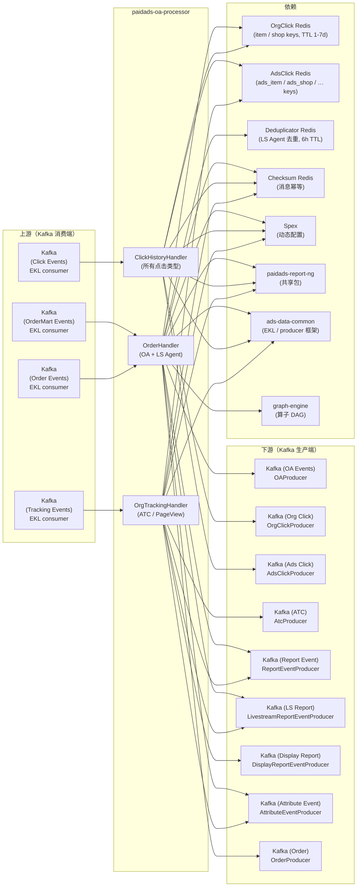

<!-- ads-workspace-gdoc-sync: gdoc_id=1Y7ooE7t9-Scb4Zgniv_WQrifEJ-sMp-TojuvrO1fhEo gdoc_url=https://docs.google.com/document/d/1Y7ooE7t9-Scb4Zgniv_WQrifEJ-sMp-TojuvrO1fhEo/edit -->

# paidads-oa-processor

> **RNG – OA Processor** | Shopee Paid Ads 有机归因处理器
>
> 仓库地址：<https://git.garena.com/shopee/deep/paidads-oa-processor>

---

## 目录 / Table of Contents

- [项目概述](#项目概述)
- [核心功能](#核心功能)
- [架构](#架构)
  - [系统上下文](#系统上下文)
  - [上下游调用拓扑](#上下游调用拓扑)
  - [数据流](#数据流)
- [三大消费服务](#三大消费服务)
  - [ClickHistory 服务](#clickhistory-服务)
  - [Tracking Attribution 服务](#tracking-attribution-服务)
  - [Order Attribution 服务](#order-attribution-服务)
- [点击历史管理](#点击历史管理)
  - [OrgClick Key 格式](#orgclick-key-格式)
  - [AdsClick Key 格式](#adsclick-key-格式)
  - [HistoryClient 接口](#historyclient-接口)
  - [Key 生成规则](#key-生成规则)
  - [TTL 策略](#ttl-策略)
- [归因逻辑](#归因逻辑)
  - [ATC 归因](#atc-归因)
  - [Page View 归因](#page-view-归因)
  - [Order OA 归因](#order-oa-归因)
  - [LS Agent 归因](#ls-agent-归因)
  - [归因窗口 (Direct 1D/2-7D/7D, Shop 1D)](#归因窗口)
  - [Bundle Order 处理](#bundle-order-处理)
- [Kafka 输入输出](#kafka-输入输出)
  - [消费端（4 个 EKL consumer）](#消费端)
  - [生产端（9 个 Kafka producer）](#生产端)
  - [消息格式与 Proto 引用](#消息格式与-proto-引用)
- [Graph Engine 算子](#graph-engine-算子)
- [去重与幂等](#去重与幂等)
  - [Checksum 校验](#checksum-校验)
  - [Deduplicator 去重](#deduplicator-去重)
  - [订单去重 Key 规则](#订单去重-key-规则)
- [目录结构](#目录结构)
- [配置体系](#配置体系)
  - [OAProcessorConfig（静态配置）](#oaprocessorconfig静态配置)
  - [SpexConfig / Spex 配置](#spexconfig--spex-配置)
  - [RegionConfig（动态配置）](#regionconfig动态配置)
  - [ProducersConfig](#producersconfig)
  - [SwitchTimestamp 灰度控制](#switchtimestamp-灰度控制)
- [构建与部署](#构建与部署)
- [监控与可观测性](#监控与可观测性)
  - [归因计数器](#归因计数器)
  - [业务指标](#业务指标)
  - [HTTP 端点](#http-端点)
- [与 report-ng 的关系](#与-report-ng-的关系)
  - [共享代码](#共享代码)
  - [独立关注点](#独立关注点)
  - [数据流交互](#数据流交互)
- [开发规范](#开发规范)
  - [新增 Click Key 类型](#新增-click-key-类型)
  - [新增归因流程](#新增归因流程)
  - [新增 Graph Engine 算子](#新增-graph-engine-算子)
  - [单元测试](#单元测试)
- [业务术语表](#业务术语表)
- [参考资料](#参考资料)
- [常见问题](#常见问题)

---

## 项目概述

**paidads-oa-processor**（应用名：**RNG – OA Processor**）是 Shopee Paid Ads 数据链路中的**有机归因处理器（Organic Attribution Processor）**，负责将用户的有机行为（点击、浏览、加购、下单）归因到广告。

- **Go module**：`git.garena.com/shopee/deep/paidads-oa-processor`
- **Go 版本**：1.24.0（toolchain go1.24.5）
- **日志名**：`oaprocessor`
- **HTTP 端口**：24444（默认）

**核心职责**：

1. 通过消费 Kafka 所有点击事件，维护**有机点击历史**和**广告点击历史**两个独立的 Redis 存储（OrgClick Redis、AdsClick Redis）。
2. 执行 **Tracking Attribution（追踪归因）**——将 ATC（Add To Cart）和 Page View 事件归因到之前的广告点击，产出 `report_event`、`ads_atc`、`attribute_event` 消息。
3. 执行 **Order OA Attribution（订单 OA 归因）**——将订单归因到有机+广告的 item/shop 点击，归因窗口包括 Direct 1D、Direct 2-7D、Direct 7D、Shop 1D，产出 `OAEvent` 和 `AttributeEvent`。
4. 执行 **LS Agent Attribution（直播代理商归因）**——将直播代理商广告订单归因到 Agent 专属点击历史，并进行订单和结算去重。

服务包含**四个独立 EKL 消费服务**（tracking、clickhistory、order、order_mart），分别运行在独立 goroutine 中，各自拥有独立的 context 取消机制。

**与 paidads-report-ng 的关系**：paidads-oa-processor 共享 `paidads-report-ng`（v1.1.35）的核心包——包括 `clickhistory`、`clickhistoryproc`、`reportproc`、`types`、`checksum`、`biz_exporter`、`util`。OA Processor 专注于有机行为到广告的归因（Organic → Ads），而 report-ng 专注于广告行为的报表数据生成（Ads → Report）。ClickHistoryHandler 同时向 OrgClick Redis 和 AdsClick Redis 写入点击历史，确保两条归因链路独立运行。

**产出**：9 个 Kafka producer 分别发送事件到 OA topic、org click topic、ads click topic、ATC topic、report event topic、LS report topic、display report topic、attribute event topic 和 order topic。

---

## 核心功能

1. **有机点击历史管理** — 消费所有点击类型（item_click、shop_click、banner_click、livestream_product_click、video_product_click、shop_entrance_product_click、org_product_click），同时写入 OrgClick Redis（2 种 key）和 AdsClick Redis（9 种 key），分别服务于 OA 和 report-ng 两条归因链路。

2. **ATC 归因** — 处理 `ADD_TO_CART` 追踪事件：从 `AdsClickMgr` 查找关联的广告点击 → 通过 `PlacementHandlerMap` 路由到对应 placement handler → 调用 `HandleTrackingATC` → 产出 `report_event`、`ads_atc`、`attribute_event` 三个 Kafka 事件。

3. **Page View 归因** — 处理 `VIEW` / `SHOP_VIEW` 追踪事件：从 `AdsClickMgr` 查找 Display Ads 点击（`GenDisplayAdsShopKey`）和 Search Brand Ads 点击（`GenSearchBrandAdsShopKey`）→ 调用 `HandleTrackingPageView` → 产出 `report_event`。

4. **订单 OA 归因** — 处理 `RawOrder` 事件：从 `OrgClickMgr` 查找最近的 item 点击（`GenItemKey`）或 shop 点击（`GenShopKey`）→ 应用归因窗口（Direct 1D / Direct 2-7D / Direct 7D / Shop 1D）→ 产出 `OAEvent` 和 `AttributeEvent`。

5. **LS Agent 归因（直播代理商广告）** — 处理直播代理商广告订单：从 `OrgClickMgr` 查找 `GenSellerAdsItemKey` / `GenLivestreamItemKey` → 校验 `IsLSAdsAgentClick` → 订单和结算去重（6 小时 TTL）→ 产出 `report_event`、`ls_report`、`order` Kafka 消息。

6. **消息幂等与去重** — 使用 `Checksum`（来自 paidads-report-ng）对追踪事件和订单事件做消息级幂等校验；使用 `Deduplicator`（Redis INCR + TTL）对 LS Agent 订单做业务级去重。

---

## 架构

### 系统上下文

paidads-oa-processor 位于 Shopee 有机行为到广告归因链路的核心。它从 Kafka 消费原始行为事件（点击、追踪事件、订单），并将结构化的归因结果回写到 Kafka，供数据仓库、报表系统和出价服务等下游消费。

```
[Tracking Kafka] ───────────────────────────────────────────────────────────────────┐
[Click Kafka]    ───────────────────────────────────────────────────────────────────▶ paidads-oa-processor ──▶ [OA / ATC / Report / Attribute / LS Kafka Topics]
[Order Kafka]    ───────────────────────────────────────────────────────────────────┘         │
[OrderMart Kafka] ──────────────────────────────────────────────────────────────────────────────┘
                                                                     │
                                                         ┌───────────▼──────────────┐
                                                         │  OrgClick Redis          │
                                                         │  AdsClick Redis          │
                                                         │  Deduplicator Redis      │
                                                         │  Checksum Redis          │
                                                         └──────────────────────────┘
```

### 上下游调用拓扑



**拓扑表格**：

| 方向 | 名称 | 协议 | 说明 |
|------|------|------|------|
| **上游** | Kafka (Tracking Events) | EKL consumer | 消费用户行为追踪事件（`TrackingEvent`）：`ADD_TO_CART`、`VIEW`、`SHOP_VIEW`，由 `OrgTrackingHandler` 处理 |
| **上游** | Kafka (Click Events) | EKL consumer | 消费所有点击事件（item_click、shop_click、banner_click、livestream_product_click、video_product_click、shop_entrance_product_click、org_product_click），由 `ClickHistoryHandler` 处理 |
| **上游** | Kafka (Order Events) | EKL consumer | 消费订单事件（`RawOrder` protobuf，SearchIndex 封装），由 `OrderHandler` 处理，支持 `oaAttribution` 和 `lsAgentAttribution` 两个并行流程 |
| **上游** | Kafka (OrderMart Events) | EKL consumer | 消费来自新 order mart topic 的订单事件（JSON `OrderMartOrder`），由相同的 `OrderHandler` 处理，通过 `OrderMartSwitchTs` 控制 |
| **下游** | Kafka (OA Events) | Kafka producer | `OAProducer`——发送 `OAEvent`（订单 + 关联点击历史 + 归因窗口指标：Direct 1D/2-7D/7D、Shop 1D） |
| **下游** | Kafka (Org Click) | Kafka producer | `OrgClickProducer`——发送有机点击历史更新，供下游 OA 归因链路消费 |
| **下游** | Kafka (Ads Click) | Kafka producer | `AdsClickProducer`——发送广告点击历史更新，与 report-ng 的广告归因链路共享 |
| **下游** | Kafka (ATC) | Kafka producer | `AtcProducer`——发送 ATC 归因结果（`ads_atc` 事件） |
| **下游** | Kafka (Report Event) | Kafka producer | `ReportEventProducer`——发送 `report_event`，落地到报表数据仓库 |
| **下游** | Kafka (LS Report) | Kafka producer | `LivestreamReportEventProducer`——发送直播广告报表事件 |
| **下游** | Kafka (Display Report) | Kafka producer | `DisplayReportEventProducer`——发送展示广告报表事件 |
| **下游** | Kafka (Attribute Event) | Kafka producer | `AttributeEventProducer`——发送 `AttributeEvent`（包含点击历史完整字段的归因详细事件） |
| **下游** | Kafka (Order) | Kafka producer | `OrderProducer`——发送处理后的订单事件（LS Agent 新链路启用后使用） |
| **依赖** | OrgClick Redis | Datastore | 所有点击类型的历史存储，通过 `OrgClickMgr`（`clickhistory.HistoryClient`）读写；每次点击事件同时写入 OA key（GenOAKeys：`item:{user_id}->{item_id}` TTL 7 天、`shop:{user_id}->{shop_id}` TTL 1 天）和全部 RNG 广告 key（GenRngAdsKeys：`ads_item`、`ads_shop` 等），合并为一次写入；value 为 `ClickHistory` protobuf |
| **依赖** | AdsClick Redis | Datastore | 广告点击历史存储，通过 `AdsClickMgr`（`clickhistory.HistoryClient`）读写；key 格式包括 `ads_item`、`ads_shop`、`ads_shopclick_on_ls`、`ShopAds_shop`、`SearchBrandAds_shop`、`DisplayAds_shop`、`seller_ads_item`、`agent_ads_ls_item`、`ls_item`（TTL 1-7 天） |
| **依赖** | Deduplicator Redis | Datastore | 订单/结算去重 Redis，通过 `Deduplicator.HasDuplicate`（Redis INCR + TTL）实现去重，用于 LS Agent 订单归因（6 小时 TTL） |
| **依赖** | Checksum Redis | Datastore | 消息幂等校验 Redis，通过 `checksum.Client`（`orderChecksum` / `trackingAttrCheckSum`）确保消息不被重复处理 |
| **依赖** | Spex（配置中心） | Service | 通过 Spex 获取动态配置（`ProducersConfig`、`RegionConfig`、`SwitchTimestamp`），支持 `WatchRegionConfig` 热更新 |
| **依赖** | paidads-report-ng | Library | 核心依赖库（v1.1.35）：`clickhistory`、`clickhistoryproc`、`reportproc`、`types`、`checksum`、`biz_exporter`、`util` |
| **依赖** | ads-data-common | Library | 基础框架：EKL consumer、producer 封装、`graph_driver`、region 工具、smoke test、HTTP handler |
| **依赖** | graph-engine | Library | 图引擎执行框架（`searchads/graph-engine`），用于算子注册和 DAG 执行，通过 `GraphEngineCtx` 注入依赖 |

### 数据流

```
4 路 Kafka 输入
    ↓
4 个 EKL consumer handler（tracking / clickhistory / order / order_mart）
    ↓
Click History Redis 读写（OrgClick + AdsClick）
    ↓
归因逻辑
    ↓
9 个 Kafka producer 输出
```

每个 EKL 服务在独立 goroutine 中运行，拥有独立的 context 取消。应用使用 `sync.WaitGroup` 等待所有服务优雅停止。

---

## 三大消费服务

### ClickHistory 服务

消费 Kafka 中的所有点击事件。每条点击事件调用 `ClickHistoryHandler.Process`：

1. **欺诈过滤**：跳过有 `InternalLabel.Frauds` 标签的广告点击。
2. **构建 `ClickHistory`**：根据 `TrackingOperationType`，为以下点击类型之一构建 `ClickHistory` protobuf：item click、shop click、banner click、livestream product click、video product click、shop-entrance product click、org product click。
3. **生成两套 key**：
   - `GenOAKeys` → OA 归因 key：`item:{user}->{item}`、`shop:{user}->{shop}`。
   - `GenRngAdsKeys` → RNG 广告归因 key：`ads_item`、`ads_shop`、`ShopAds_shop`、`SearchBrandAds_shop`、`DisplayAds_shop`、`seller_ads_item`、`agent_ads_ls_item`、`ls_item`、`ads_shopclick_on_ls`。
4. **写入 Redis**：两套 key 合并（`keysToUpdate := append(oaKeys, rngAdsKeys...)`）后统一写入 `OrgClickMgr.SetClick`。对于有机点击，`handleRngOrgClickEvent` 另行调用 `AdsClickMgr.SetClick`，使用 report-ng 的 `rngClick.GenKeys` 生成 key。
5. **发送 Kafka**：当 OA keys 非空时，`OrgClickProducer` 发送点击更新；`AdsClickProducer` 仅通过 `handleRngOrgClickEvent` 在有机点击时发送更新。

`SwitchTimestamp` 控制新链路（`handleRngOrgClickEvent`）是否生效。时间戳早于 `SwitchTimestamp` 的事件跳过新代码路径。

### Tracking Attribution 服务

消费 Kafka 中的 `TrackingEvent`。`OrgTrackingHandler.Process` 按 `TrackingOperationType` 分发：

- **`ADD_TO_CART`** → `handleAtcEvent`：ATC 归因流程。
- **`VIEW` / `SHOP_VIEW`** → `handleViewEvent`：Page View 归因流程。

其他操作类型返回错误。处理前通过 `trackingAttrCheckSum` 做消息幂等校验。

### Order Attribution 服务

消费 Kafka 中的 `RawOrder`（V5 topic，SearchIndex 封装的 protobuf）和 `OrderMartOrder`（order mart topic，JSON），解码后均传入 `OrderHandler.Process`。

OrderHandler 支持两个独立并行流程，由 `OrderProcess` 配置控制：

- **`oaAttribution`**（`AttributeOAEvent: true`）：OA 订单归因——将订单归因到有机点击。
- **`lsAgentAttribution`**（`AttributeReportEvent: true`）：LS Agent 归因——将直播代理商广告订单进行归因。

`SwitchOrderMart` 机制按国家控制 V5 topic 还是 order mart topic 作为权威数据源。

---

## 点击历史管理

### OrgClick Key 格式

OrgClick Redis 存储**有机**点击历史，供 OA 归因链路（`OrderHandler.oaAttribution`）使用。

| 函数 | Key 格式 | TTL | 用途 |
|------|---------|-----|------|
| `GenItemKey(user, item)` | `item:{user_id}->{item_id}` | 7 天 | 有机 item 点击——用于 Direct 1D/2-7D/7D 订单归因 |
| `GenShopKey(user, shop)` | `shop:{user_id}->{shop_id}` | 1 天 | 有机 shop 点击——用于 Shop 1D 订单归因 |

来源：`pkg/key/org.go`

### AdsClick Key 格式

AdsClick Redis 存储**广告**点击历史，供 ATC/PageView 归因链路（`OrgTrackingHandler`）和 report-ng 使用。

| 函数 | Key 格式 | TTL | 归因场景 |
|------|---------|-----|---------|
| `GenAdsItemKey(user, item)` | `ads_item:{user}->{item}` | 7 天 | 通用广告 item 点击（当前主路径未直接使用） |
| `GenAdsShopKey(user, shop)` | `ads_shop:{user}->{shop}` | 7 天 | 广告 shop 点击（等效于 report-ng `ShopClick`） |
| `GenAdsShopClickOnLsKey(user, shop, lsSessionId)` | `ads_shopclick_on_ls:{user}->{shop}->{lsSessionId}` | 1 天 | 直播相关 click area 的 shop click |
| `GenShopAdsShopKey(user, shop)` | `ShopAds_shop:{user}->{shop}` | 7 天 | Shop Ads 广告位点击 |
| `GenSearchBrandAdsShopKey(user, shop)` | `SearchBrandAds_shop:{user}->{shop}` | 7 天 | Search Brand Ads 广告位——用于 Page View 归因 |
| `GenDisplayAdsShopKey(user, shop)` | `DisplayAds_shop:{user}->{shop}` | 1 天 | Display Ads 广告位——用于 Page View 归因 |
| `GenSellerAdsItemKey(user, item)` | `seller_ads_item:{user}->{item}` | 7 天 | 非 Agent item 点击（等效于 report-ng `NonAgentItemClick`）——用于 LS Agent 归因 |
| `GenAgentAdsLsItemKey(user, item)` | `agent_ads_ls_item:{user}->{item}` | 1 天 | LS Agent item 点击 |
| `GenLivestreamItemKey(user, item)` | `ls_item:{user}->{item}` | 7 天 | 有机+广告直播商品点击——LS Agent 归因的主要 key |

来源：`pkg/key/ads.go`

### HistoryClient 接口

`clickhistory.HistoryClient`（来自 `paidads-report-ng/pkg/clickhistory`）提供：

- `GetLatestClick(country string, keys ...string) (*ClickHistory, bool, error)` — 查询一个或多个 key 中最新的点击历史记录。
- `SetClick(country string, click *ClickHistory, keys []TimedKey) error` — 带 TTL 写入点击历史到 Redis。

底层存储使用 Redis Hash，连接按国家分片，key 自动按 TTL 过期。

### Key 生成规则

`ClickHistoryHandler.Process` 为每条点击事件生成两套 key，合并后统一写入 `OrgClickMgr`：

- **`GenOAKeys`**：仅在 `user_id > 0` 且 `placement != nil` 时生成。对于 `CLICK` 操作且含 item 且无 `adsTimestamp`（或原始广告点击）：生成 `GenItemKey` + `GenShopKey`。
- **`GenRngAdsKeys`**：根据点击类型、广告位和 `adsId` 生成多种广告 key，包括直播、Agent、Shop Ads、Search Brand Ads、Display Ads、seller_ads_item 等 key 类型。

两套 key 合并（`keysToUpdate := append(oaKeys, rngAdsKeys...)`）后统一写入 `OrgClickMgr.SetClick`。仅对有机点击，`handleRngOrgClickEvent` 额外运行，使用 report-ng 的 `rngClick.GenKeys` 单独调用 `AdsClickMgr.SetClick`。

### TTL 策略

| Key 类别 | TTL | 原因 |
|---------|-----|------|
| Item 点击（OA/RNG） | 7 天 | 与 7 天归因窗口对齐 |
| Shop 点击（OA） | 1 天 | 与 Shop 1D 归因窗口对齐 |
| Display Ads、LS shop-on-ls | 1 天 | 短周期广告位 |
| 大多数广告 key | 7 天 | 与最大归因窗口对齐 |
| LS Agent 去重 | 6 小时 | 短周期订单去重 |

---

## 归因逻辑

### ATC 归因

`handleAtcEvent` 处理 `ADD_TO_CART` 追踪事件：

1. 校验追踪事件只有一个 item；若 `data.AdsId > 0` 则跳过（已是广告 ATC）。
2. 调用 `atcAttribution`：
   - 查询 `AdsClickMgr.GetLatestClick` 获取 `KeyNonAgentItemClick(user, item)`。
   - 若找到且在 1 天内 → `atcType = ADD_TO_CART`（直接归因）。
   - 否则，查询 `KeyShopClick(user, shop)` + `KeyShopAdsClick(user, shop)` → 若找到且在 1 天内 → `atcType = BROAD_ADD_TO_CART`（店铺级归因）。
3. 基于点击历史构建 `AddToCartEvent` 和 `AttributeEvent`。
4. 查找 `PlacementHandlerMap` 中对应的 placement handler，调用 `HandleTrackingATC`。
5. 后处理：`reportproc.SetReportID`、`biz_exporter.SetTrackingBizMetrics`。
6. 发送到：`AtcProducer`、`AttributeEventProducer`、`ReportEventP`；若广告位匹配也发送到 `DisplayReportP` 或 `LsReportProducer`。

### Page View 归因

`handleViewEvent` 处理 `VIEW` / `SHOP_VIEW` 追踪事件：

1. 若 `placement >= 0` 则拒绝（表示是广告事件，非有机事件）。
2. 调用 `pageViewAttribution`：
   - 对于 `VIEW`：从单个 item 提取 `shopID`；查询 `AdsClickMgr.GetLatestClick` 获取 `KeyDisplayAdsClick(user, shop)` 和 `KeySearchBrandAdsClick(user, shop)`。
   - 对于 `SHOP_VIEW`：从单个 shop 提取 `shopID`。
   - 若找到且在 1 天内则返回点击记录。
3. 查找 placement handler，调用 `HandleTrackingPageView`。
4. 后处理：`reportproc.SetReportID`、`biz_exporter.SetTrackingBizMetrics`。
5. 发送到：`ReportEventP`；若广告位匹配也发送到 `DisplayReportP` 或 `LsReportProducer`。

### Order OA 归因

`oaAttribution`（`OrderHandler` 内部）通过 `buildOAEvent` 处理订单：

1. 将 `[]*types.Order` 转为 `[]orderOA`（对 bundle 订单做规范化拆分）。
2. 对每个 `orderOA`：
   - 查询 `OrgClickMgr.GetLatestClick` 获取 `GenItemKey(user, item)`。
   - 若找到且 `timeElapsed > 0`：
     - `timeElapsed ≤ 1 天` → **Direct 1D**（`direct1d = 1`）。
     - `1 天 < timeElapsed ≤ 7 天` → **Direct 2-7D**（`direct2To7d = 1`）。
     - `timeElapsed ≤ 7 天` → **Direct 7D**（`direct7d = 1`）。
   - 若未找到：查询 `OrgClickMgr.GetLatestClick` 获取 `KeyShopClick(user, shop)`。
     - 若找到、`timeElapsed > 0`、`timeElapsed ≤ 1 天` 且 `orderItemID != shopClick.EventItemId` → **Shop 1D**（`shop1d = 1`）。
3. 构建 `OAEvent`（订单 + 点击历史字段 + 归因窗口指标）和 `AttributeEvent`（包含 `signature`、`targetCir`、`query`、`keyword`、`matchType` 等完整字段）。
4. 发送到 `OAProducer` 和 `AttributeEventProducer`。

### LS Agent 归因

`lsAgentAttribution`（`OrderHandler` 内部）处理直播代理商订单：

1. 对每个订单，调用 `attributeLsAgentClick`：
   - 查询 `OrgClickMgr.GetLatestClick` 获取 `GenSellerAdsItemKey(user, itemID)` 和 `GenLivestreamItemKey(user, itemID)`。
   - 校验：`IsLSAdsAgentClick(click)` 且 `click.Timestamp ≤ order.Timestamp` 且在 7 天内。
2. 调用 `dedupOrder`：
   - 订单去重：`GenLiveAdsAgentOrderDedupKey(orderID, orderItemID, clickItemID)` → `Deduplicator.HasDuplicate`（6 小时 TTL）。
   - 结算去重：`GenLiveAdsAgentCheckDedupKey(orderID)` → `Deduplicator.HasDuplicate`（6 小时 TTL）。
3. 发送到 `OrderProducer`（若已配置）。
4. 调用 `baseHandler.HandleOrder` → `reportproc.SetReportID` + `biz_exporter.SetOrderBizMetrics`。
5. 发送到 `ReportEventProducer` 和 `LSReportProducer`。

### 归因窗口

| 窗口 | 条件 | 说明 |
|------|------|------|
| Direct 1D | `timeElapsed ≤ 86400s` | 订单在 item 广告点击后 1 天内下单 |
| Direct 2-7D | `86400s < timeElapsed ≤ 604800s` | 订单在 item 广告点击后 1-7 天下单 |
| Direct 7D | `timeElapsed ≤ 604800s` | 订单在 item 广告点击后 7 天内下单 |
| Shop 1D | `timeElapsed ≤ 86400s`，且下单 item 与点击 item 不同 | 在 shop 广告点击后 1 天内、在该 shop 的不同 item 下单 |

常量定义在 `pkg/key/org.go`：`OneDaySec = 86400`，`SevenDaySec = 604800`。

### Bundle Order 处理

`ToRngOrder`（在 `process_ls_agent.go` 中）处理 Bundle Order：

- 若 `ExtInfo.BundleOrderItem.ItemList` 非空，订单被拆分为多个独立的 `Order` 条目，每个 bundle item 对应一个。
- 每个 bundle item：`OrderPrice = BundleItemPrice / Amount`，`OrderAmount = Amount`，`Bundle = true`，`Index = bundleItemIndex`。
- 每个拆分后的订单独立进行归因。

同样，`toOAOrder`（在 `order_attribute_op.go` 中）在 Graph Engine 路径下也处理 bundle 拆分。

---

## Kafka 输入输出

### 消费端

四个 EKL 服务消费 Kafka：

| 服务 | 代码文件 | 消息类型 | Handler | 来源 Topic |
|------|---------|---------|---------|-----------|
| `EklClickHistorySvc` | `eklservice/clickhistory.go` | JSON `ads.Tracking` | `ClickHistoryHandler` | 点击事件 topic（`RegionConfig.ClickHistory`） |
| `EklOrgTrackingSvc` | `eklservice/org_tracking.go` | JSON `ads.Tracking` | `OrgTrackingHandler` | 追踪归因 topic（`RegionConfig.TrackingAttr`） |
| `EklOrderSvc` | `eklservice/order.go` | Protobuf `SearchIndex` → `RawOrder` | `OrderHandler` | 订单 V5 topic（`RegionConfig.Order`） |
| `EklOrderMartSvc` | `eklservice/order_mart.go` | JSON `OrderMartOrder` → `RawOrder` | `OrderHandler` | Order Mart topic（`RegionConfig.OrderMart`） |

所有 EKL 服务使用 `enhanced-kafka-lib` 框架，启用 `AdvancedConsumer`，同时实现 `Transformer` 和 `Processor` 接口。

### 生产端

9 个 Kafka producer 由 `ProducersConfig` 创建：

| 配置 Key | Producer 变量 | 消息类型 | 使用场景 |
|---------|-------------|---------|---------|
| `oa-producer` | `OAProducer` | JSON `OAEvent` | OA 订单归因结果 |
| `org-click-producer` | `OrgClickProducer` | JSON `ClickHistory` | 有机点击历史更新 |
| `ads-click-producer` | `AdsClickProducer` | JSON `ClickHistory` | 广告点击历史更新 |
| `atc-producer` | `AtcProducer` | JSON `AddToCartEvent` | ATC 归因事件 |
| `report-event-producer` | `ReportEventProducer` | JSON `ReportEvent` | 报表数据仓库事件 |
| `ls-report-event-producer` | `LivestreamReportEventProducer` | JSON `ReportEvent` | 直播广告报表事件 |
| `display-report-event-producer` | `DisplayReportEventProducer` | JSON `ReportEvent` | 展示广告报表事件 |
| `attribute-event-producer` | `AttributeEventProducer` | JSON `AttributeEvent` | 完整归因详细事件 |
| `order-producer` | `OrderProducer` | JSON `Order` | 处理后的订单事件（LS Agent 新路径） |

每个 producer 均为可选（`nil` 表示不创建）。`producer.Producer` 类型由 `ads-data-common` 提供。

### 消息格式与 Proto 引用

- `paidads-report-proto`（v1.26.60）：`pb/ads_report/OAEvent`、`AttributeEvent`、`ClickHistory`、`ReportEvent`；`pb/order/RawOrder`、`OrderMartOrder`。
- `paidads-tracking-proto`（v1.10.37）：`TrackingEvent` 基础类型。
- `shopee_protobuf`：`beeshop_ads.pb`——`Tracking`、`TrackingOperationType`、`TrackingPlacement`、`DeductionInfo`。

---

## Graph Engine 算子

`graph-engine`（`searchads/graph-engine` v1.0.9）框架用于 DAG 流式处理。`internal/handler_op/` 中的算子通过 `init()` 中的 `engine.RegisterOpBuilder` 注册：

| 算子 | 注册名 | 输入/输出 | 说明 |
|------|--------|---------|------|
| `OrderAttributeOp` | `"OrderAttributeOp"` | 输入：`OrderRequestContext`；输出：`[][]byte`（序列化的 `OAEvent`） | OA 订单归因核心算子——从 `GraphEngineCtx` 获取 `clickMgr`，执行 item/shop 点击归因，构建 `OAEvent` |
| `WriteClickHistoryOp` | `"WriteClickHistoryOp"` | 输入：`TrackingRequestContext`；输出：`[][]byte`（序列化的 `ClickHistory`） | 将点击历史写入 Redis——查询并更新 `clickMgr`，生成 org/ads keys |
| `BuildReportOp` | `"BuildReportOp"` | — | 构建报表事件（仅注册，具体实现在 graph config 中） |
| `BuildRequestContextOp` | `"BuildRequestContextOp"` | 输入：ctx 中的 `trackingMsg` 或 `orderMsg`；输出：`TrackingRequestContext` 或 `OrderRequestContext` | 从 `GraphEngineCtx` 中的原始消息构建类型化请求上下文，支持 `req_ctx_type: "tracking"` 或 `"order"` |
| `EmitKafkaOp` | `"EmitKafkaOp"` | 输入：`[][]byte`；输出：— | 通过 `kafkaProducer` 参数从 `GraphEngineCtx` 获取指定 Kafka producer，并发送序列化消息 |

依赖通过 `GraphEngineCtx.Value("clickMgr")` 和 `GraphEngineCtx.Value("kafkaProducer")` 注入。

---

## 去重与幂等

### Checksum 校验

`checksum.Client`（来自 `paidads-report-ng/pkg/checksum`）基于消息内容生成哈希，写入 Redis 并在处理前检查是否已存在：

- **`orderChecksum`**：在 `EklOrderSvc` 和 `EklOrderMartSvc` 中用于 `RawOrder.OrderItem` 的幂等校验。
- **`trackingAttrCheckSum`**：在 `EklOrgTrackingSvc` 中用于 `Tracking` 的幂等校验。

若消息已处理（checksum 存在）则跳过。处理失败时删除 checksum，以便下次 EKL 重试。

### Deduplicator 去重

`manager.Deduplicator` 使用 Redis `INCR` + `Expire` 实现至多一次处理：

- `HasDuplicate(ctx, country, key, ttl)`：对 `key` 执行 INCR。若计数超过 1 返回 `true`（重复）。仅在第一次（计数 == 1）时设置 TTL。
- 仅用于 LS Agent 订单归因，处理同一逻辑订单可能从多个 Kafka topic 或分区到达的情况。

### 订单去重 Key 规则

| Key 函数 | 格式 | TTL | 覆盖范围 |
|---------|------|-----|---------|
| `GenLiveAdsAgentOrderDedupKey(orderID, orderItemID, clickItemID)` | `LiveAds_agent_order:{orderID}:{orderItemID}:{clickItemID}` | 6 小时 | 单次订单-item-点击组合 |
| `GenLiveAdsAgentCheckDedupKey(orderID)` | `LiveAds_agent_checkout:{orderID}` | 6 小时 | 单次订单（结算级） |

来源：`internal/handler/order_handler/dedup_key.go`

---

## 目录结构

```
paidads-oa-processor/
├── cmd/
│   ├── main.go                    # 入口——定义应用 "RNG - OA Processor"
│   └── run.go                     # 启动：初始化 producer、consumer、Redis 客户端、HTTP 服务
├── config/
│   ├── live.yml                   # 生产环境静态配置（Spex config key）
│   └── test.yml                   # 测试环境静态配置
├── deploy/
│   └── oaprocessor.json           # 部署配置
├── eklservice/
│   ├── clickhistory.go            # EklClickHistorySvc——点击事件 EKL consumer
│   ├── org_tracking.go            # EklOrgTrackingSvc——追踪事件 EKL consumer（ATC/PageView）
│   ├── order.go                   # EklOrderSvc——订单 V5 topic EKL consumer
│   └── order_mart.go              # EklOrderMartSvc——order mart topic EKL consumer
├── internal/
│   ├── handler/
│   │   ├── clickhistory_handler.go    # ClickHistoryHandler——点击事件处理与 key 生成
│   │   ├── tracking_handler.go        # OrgTrackingHandler——ATC 和 PageView 归因
│   │   ├── util.go                    # Placement 检测辅助函数
│   │   └── order_handler/
│   │       ├── order_handler.go       # OrderHandler——统筹 OA + LS Agent 流程
│   │       ├── process_oa.go          # oaAttribution——OA 订单归因逻辑
│   │       ├── process_ls_agent.go    # lsAgentAttribution + ToRngOrder——LS Agent 逻辑
│   │       └── dedup_key.go           # LS Agent 去重 key 生成
│   ├── handler_op/
│   │   ├── order_attribute_op.go      # OrderAttributeOp——Graph Engine OA 归因算子
│   │   ├── write_clickhistory_op.go   # WriteClickHistoryOp——Graph Engine 点击历史写入算子
│   │   ├── build_report_op.go         # BuildReportOp——Graph Engine 报表构建算子
│   │   ├── build_request_context_op.go # BuildRequestContextOp——Graph Engine 上下文构建算子
│   │   └── emit_message_op.go         # EmitKafkaOp——Graph Engine Kafka 发送算子
│   └── request_context/
│       ├── order_request_context.go   # Graph Engine OrderRequestContext
│       └── tracking_request_context.go # Graph Engine TrackingRequestContext
├── pkg/
│   ├── config/
│   │   ├── config.go              # Config 接口与 YAML 合并
│   │   ├── oa_processor.go        # OAProcessorConfig（静态：Port、SpexConfig、GraphConfig）
│   │   ├── region_config.go       # RegionConfig + ProducersConfig（通过 Spex 动态配置）
│   │   ├── reload.go              # 配置热更新逻辑
│   │   └── spex.go                # Spex 初始化辅助函数
│   ├── exporter/
│   │   ├── exporter.go            # Prometheus 指标（点击/追踪/归因/订单计数器）
│   │   └── consts.go              # 指标类型常量
│   ├── key/
│   │   ├── org.go                 # GenItemKey、GenShopKey（OrgClick key）
│   │   ├── ads.go                 # 9 种 AdsClick key 生成函数
│   │   └── util.go                # GetKeyType 辅助函数
│   └── manager/
│       ├── click_manager.go       # NewClickMgr——HistoryClient 工厂
│       ├── deduplicator.go        # Deduplicator——Redis INCR 去重
│       └── util.go                # Redis 配置构建辅助
├── util/
│   ├── app/
│   │   ├── app.go                 # 应用框架封装
│   │   ├── run.go                 # RunApp 辅助函数
│   │   └── v.go                   # 版本信息
│   └── util.go                    # IsAds、IsItemAds、InLastNDays、ProtoT 等工具函数
├── scripts/
│   └── mesos.sh                   # Mesos 部署辅助脚本
├── Makefile                       # 构建、测试、CI 目标
├── go.mod / go.sum                # Go 模块依赖
└── sp-workspace.yml               # sp-workspace 协议依赖配置
```

---

## 配置体系

### OAProcessorConfig（静态配置）

启动时从 YAML 加载（`config/live.yml` 或 `config/test.yml`）：

```yaml
oa_processor:
  port: 24444                        # HTTP 服务端口（默认：24444）
  spex-config:
    server-name: adsdata.oaprocessor
    env: "live"                      # "live" | "test"
    tag: "master"
    deployment: "default"
    config-key: "<spex-config-key>"
  click-history-graph-config: ...    # clickhistory 流 graph-engine DAG 配置
  tracking-attribution-graph-config: ... # tracking attribution 流 graph-engine DAG 配置
  order-graph-config: ...            # order 流 graph-engine DAG 配置
```

### SpexConfig / Spex 配置

`SpexConfig` 指定到 Spex 配置服务的连接参数。启动时，`config.Init(cfg.SpexConfig, region)` 使用 `sps.Init` 和 `sps.SubscribeConfig` 连接 Spex。动态配置通过 `config.GetConfig()` 获取，将 `RegionConfig` 和 `ProducersConfig` 绑定到 Spex 配置注册表。

**本地开发**：使用 `socat` 隧道连接 Spex：

```bash
socat -d -d -d UNIX-LISTEN:/tmp/spex.sock,reuseaddr,fork TCP:agent-tcp.spex.test.shopee.io:9299
export SP_UNIX_SOCKET=/tmp/spex.sock
cd cmd && go run . -c ../config/test.yml
```

### RegionConfig（动态配置）

通过 Spex 动态下发（`WatchRegionConfig` 支持热更新）。主要字段：

| 字段 | 类型 | 说明 |
|------|------|------|
| `OrgClickClient` | `*clickhistory.ClientConfig` | OrgClick Redis 连接配置 |
| `AdsClickClient` | `*clickhistory.ClientConfig` | AdsClick Redis 连接配置 |
| `OrderChecksum` | `*checksum.Config` | 订单消息 checksum Redis 配置 |
| `TrackingAttrCheckSum` | `*checksum.Config` | 追踪消息 checksum Redis 配置 |
| `ClickHistory` | `*ekl.Config` | 点击历史 topic EKL consumer 配置 |
| `TrackingAttr` | `*ekl.Config` | 追踪归因 topic EKL consumer 配置 |
| `Order` | `*ekl.Config` | 订单 V5 topic EKL consumer 配置 |
| `OrderMart` | `*ekl.Config` | Order Mart topic EKL consumer 配置 |
| `AdsPlacementHandler` | `base.AdsPlacementHandler` | Placement → AdsKind 映射，用于 handler 分发 |
| `SwitchTimestamp` | `int64` | 启用新 tracking/clickhistory 代码路径的 Unix 时间戳 |
| `Deduplicator` | `*manager.DeduplicatorConfig` | LS Agent 去重 Redis 配置 |
| `OrderProcess` | `*order_handler.Config` | 开关：`AttributeOAEvent`、`AttributeReportEvent` |
| `OrderMartSwitchTs` | `map[string]int64` | 按国家的 order mart 迁移切换时间戳 |
| `OrderMartValidCountry` | `map[string]bool` | 已启用 order mart 的国家列表 |

### ProducersConfig

通过 Spex 动态下发，包含 9 个可选的 `*producer.ProducersConfig` 条目（每个 Kafka producer 对应一个）。`nil` 表示不创建对应 producer。

### SwitchTimestamp 灰度控制

`SwitchTimestamp` 是一个 Unix 时间戳，用于控制新代码路径何时生效：

- **Tracking / ClickHistory**：`Tracking.Timestamp < SwitchTimestamp` 的事件跳过或回退到旧路径。可通过 `SetSwitchTs` 动态更新（`EklOrgTrackingSvc` 和 `ClickHistoryHandler` 均支持）。
- **OrderMart 迁移**：按国家的 `OrderMartSwitchTs` 控制 order mart topic 何时成为权威数据源。V5 topic 中 `Timestamp > switchTs` 的订单被丢弃；order mart topic 中 `Timestamp ≤ switchTs` 的订单被跳过。

两个切换时间戳均通过 `RegConfigUpdateListener` 支持热更新。

---

## 构建与部署

### 构建

```bash
# 下载依赖
make dependency

# 构建（当前 OS）
make oaprocessor

# 输出：
#   bin/oaprocessor         （当前 OS）
#   bin/oaprocessor.linux   （Linux）

# 运行测试
make test

# 代码检查与格式校验
make ci-remote

# 完整本地 CI（含 NilAway）
make ci
```

二进制通过 `-ldflags` 注入版本元信息：

```
-X util/app.Commit=<git-short-hash>
-X util/app.Version=<git-tag>
-X util/app.Branch=<branch>
-X util/app.Builder=<email>
-X util/app.GoVersion=<go-version>
-X util/app.Built=<timestamp>
```

### 发布流程

部署使用 Shopee 基于 Mesos 的发布流水线：

1. CI 运行 `make ci-remote`（vet + fmt + test）。
2. 打包 Linux 二进制 `bin/oaprocessor.linux`。
3. 部署配置在 `deploy/oaprocessor.json`。
4. 动态配置（producer、consumer、Redis、switch timestamp）通过 Spex 管理——配置变更无需重新部署。

---

## 监控与可观测性

所有指标通过 Prometheus 暴露，namespace 为 `adsdata`，subsystem 为 `oaprocessor`。

### 归因计数器

| 指标 | 标签 | 说明 |
|------|------|------|
| `adsdata_oaprocessor_attribution_counter` | `type`（item / shop / none） | OA 订单归因结果（按 key 类型） |
| `adsdata_oaprocessor_tracking_counter` | `country`、`placement`、`operation` | 已处理的 ATC/PageView 追踪事件数 |
| `adsdata_oaprocessor_counter` | `country`、`placement`、`operation`、`isAds`、`hasItem` | ClickHistoryHandler 处理的点击事件数 |
| `adsdata_oaprocessor_rng_click_counter` | `country`、`ads_placement`、`operation`、`isAds`、`hasItem` | RNG 广告点击事件数（新路径） |
| `adsdata_oaprocessor_key_type_counter` | `country`、`key_type`、`ads_placement` | 生成的点击历史 key 类型统计 |

### 业务指标

| 指标 | 标签 | 说明 |
|------|------|------|
| `adsdata_oaprocessor_order_migration` | `country`、`src`（v5/order_mart）、`type` | 订单数据源迁移追踪（total/switch_off/no_click/send_success，按流程区分） |
| `adsdata_oaprocessor_order_mart` | `country`、`type` | order mart 专项计数（non-placed、repeat-placed） |
| `adsdata_oaprocessor_error` | `src`、`country`、`err` | 错误计数（按数据源和错误类型） |
| `adsdata_oaprocessor_latency` | `src`、`procedure` | 处理延迟直方图（毫秒），bucket：0.1–500ms |

### HTTP 端点

HTTP 服务运行在配置的 `Port`（默认 24444）：

- `/smoketest` — 标准 Shopee smoke test 端点（就绪探针，通过 `smoketest.HTTPHandleFunc`）。`smoketest.Ready()` 调用后返回健康状态。
- `/debug/pprof/*` — Go pprof 端点（通过 `httphandler.MuxAll` 注册）。

---

## 与 report-ng 的关系

### 共享代码

从 `paidads-report-ng`（v1.1.35）导入的包：

| 包 | 主要类型/函数 | 在 OA Processor 中的用途 |
|---|---|---|
| `pkg/clickhistory` | `HistoryClient`、`ClientConfig` | `OrgClickMgr`、`AdsClickMgr` |
| `pkg/clickhistoryproc` | `KeyShopClick`、`KeyShopAdsClick`、`KeyNonAgentItemClick`、`KeyDisplayAdsClick`、`KeySearchBrandAdsClick`、`GenKeys` | ATC/PageView 归因 key 查询；有机点击 AdsClick key 生成 |
| `pkg/reportproc` | `SetReportID`、`ConvertRawOrder` | 报表事件后处理 |
| `types` | `Order`、`AdsKind`、`AddToCartEvent`、`AddToCartType`、`OrderTopicSource` | 核心数据类型 |
| `pkg/checksum` | `Client`、`New`、`ErrCountryNotFound` | 消息幂等校验 |
| `biz_exporter` | `SetTrackingBizMetrics`、`SetOrderBizMetrics` | 报表事件业务指标填充 |
| `util` | `CopyPointer`、`ProtoT`、`NewTimedKey`、`InLastNDays`、`UnmarshalAndMergeAdsData` | Proto 辅助函数、时间工具 |
| `service` | `ConvertOrderMartOrderToRawOrder` | OrderMart → RawOrder 转换 |

### 独立关注点

| | paidads-oa-processor | paidads-report-ng |
|---|---|---|
| **关注点** | 有机用户行为到广告的归因 | 广告行为的报表数据生成 |
| **主要输入** | 有机追踪事件 + 所有点击类型 | 广告点击事件 |
| **主要输出** | `OAEvent`、`AttributeEvent` | `ReportEvent` |
| **OrgClick Redis** | 拥有并维护 | 从中读取 |
| **AdsClick Redis** | 通过 ClickHistoryHandler 写入 | 独立读写 |

### 数据流交互

`ClickHistoryHandler` 向两个 Redis 存储写入，但走两条不同的代码路径：

- `OrgClickMgr.SetClick(country, click, keysToUpdate)` — 对每条点击事件都会调用，写入**合并后的** OA key（`GenOAKeys`）和 RNG 广告 key（`GenRngAdsKeys`）。同时供 `OrderHandler.oaAttribution` 查询 item/shop 点击，以及为下游消费方存储 RNG 广告 key。
- `AdsClickMgr.SetClick` — 仅在 `handleRngOrgClickEvent` 中为**有机点击**调用，使用 report-ng 的 `rngClick.GenKeys` 生成 key，独立服务于 `OrgTrackingHandler` 的 ATC/PageView 归因链路和 report-ng。

注：OrgClick Redis 现在同时存储所有点击类型的 OA 归因 key 和 RNG 广告 key；AdsClick Redis 仅在有机点击事件时收到更新。

---

## 开发规范

### 新增 Click Key 类型

1. 在 `pkg/key/org.go`（OrgClick）或 `pkg/key/ads.go`（AdsClick）中添加 `Gen*Key` 函数，遵循 `rngUtil.NewTimedKey(fmt.Sprintf("prefix:{user}->{id}"), ttl)` 的模式。
2. 在 `ClickHistoryHandler` 中注册新 key：
   - OrgClick key：添加到 `internal/handler/clickhistory_handler.go` 中的 `GenOAKeys` 函数。
   - AdsClick key：添加到 `GenRngAdsKeys` 函数。
3. 确保 TTL 与归因窗口需求匹配。
4. 在 `pkg/key/*_test.go` 中添加测试用例，验证 key 格式正确。

### 新增归因流程

1. 在 `internal/handler/order_handler/` 中为 `OrderHandler` 添加新的 `ProcessFunc` 方法。
2. 在 `order_handler.Config`（`order_handler.go` 中）添加控制启用的配置开关。
3. 在 `ProducersConfig`（`pkg/config/region_config.go` 中）注册新的 producer。
4. 在 `NewOrderHandler` 中，当配置开关启用时，将新 `ProcessFunc` 追加到 `h.Processes` 切片。
5. 若需要，实现基于 `SwitchTimestamp` 的灰度切换。
6. 若新流程需要动态配置更新，在 `cmd/run.go` 中添加 `RegConfigUpdateListener`。

### 新增 Graph Engine 算子

1. 在 `internal/handler_op/` 中创建新文件，实现 `graph_driver.BaseOperator`。
2. 实现 `Run(ctx engine.GraphEngineCtx, inputs, outputs []*engine.NodeData) error` 方法。
3. 在 `init()` 中通过 `engine.RegisterOpBuilder("OperatorName", ...)` 注册算子。
4. 在 graph DAG YAML 配置（`OAProcessorConfig` 中的 `GraphConfig`）中引用该算子。
5. 通过 `ctx.Value("depName")` 注入依赖（遵循 `clickMgr` 的模式）。

### 单元测试

测试使用 `testify/assert` 和 `testify/mock`。运行全部测试：

```bash
make test

# 带竞态检测：
make test-race

# 生成覆盖率报告：
make coverage
```

主要测试文件：
- `internal/handler/clickhistory_handler_test.go` — ClickHistoryHandler 单元测试
- `internal/handler/tracking_handler_test.go` — OrgTrackingHandler 测试
- `internal/handler/order_handler/order_handler_test.go` — OrderHandler 编排测试
- `internal/handler/order_handler/process_ls_agent_test.go` — LS Agent 流程测试
- `pkg/key/*_test.go` — Key 格式与生成测试

使用 `make utgen`（需安装 `utgen`）通过 AI 辅助自动生成单元测试。

---

## 业务术语表

| 术语 | 说明 |
|------|------|
| OA (Organic Attribution) | 有机归因——将用户的有机行为（点击、浏览、购买）归因到之前对其产生影响的广告 |
| Organic Attribution | 有机归因流程——判断某次有机购买是否受到之前广告互动的影响 |
| Click History | 存储在 Redis 中的用户近期点击事件记录，用于归因时查找之前的广告互动 |
| EKL (Enhanced Kafka Lib) | Shopee 增强 Kafka 消费库，提供消息转换、checksum 校验和高级消费者功能 |
| EKLService | 基于 EKL 构建的服务，封装了消费者配置、转换和处理逻辑 |
| ATC (Add To Cart) | 用户将商品加入购物车的行为；归因到之前的广告点击 |
| Direct Attribution (1D / 2-7D / 7D) | 直接归因窗口——将订单与 item 级广告点击关联：1 天内、1-7 天、7 天内 |
| Shop Attribution (1D) | 店铺归因窗口——在 shop 广告点击后 1 天内、在该店铺的不同 item 上下单 |
| LS Agent (Livestream Agent) | 直播代理商广告——代理商在直播中推广商品并获得归因收益的广告模式 |
| Bundle Order | 包含多个商品的捆绑订单；拆分为独立的归因单元分别处理 |
| SwitchTimestamp | 用于将流量从旧代码路径逐步迁移到新代码路径的 Unix 时间戳 |
| Spex | Shopee 配置服务，提供动态、热更新的配置下发 |
| Placement | 广告位类型（如 Search、Discovery、Shop、Display、Livestream） |
| TimedKey | 带 TTL 的 Redis key，用于点击历史存储 |
| eCPM | 有效千次展示费用——总广告花费 / 总展示次数 |
| CIR | 成本收入比（Cost-Income-Ratio）——广告收入 / 广告 GMV |
| GMV | 商品交易总额（Gross Merchandise Value） |
| Ads GMV | 广告归因 GMV——广告点击后 7 天内产生的总销售额 |
| Organic GMV | 有机 GMV——非广告归因的总销售额 |

---

## 参考资料

- **仓库地址**：<https://git.garena.com/shopee/deep/paidads-oa-processor>
- **CMDB 服务**：<https://space.shopee.io/console/cmdb/compute/detail/shopee.mp_search_recommendation_ads.paidads.data_application.ads_data.org_ads_processor>
- **Confluence — OA 重构设计**：<https://confluence.shopee.io/pages/viewpage.action?pageId=2712554021>
- **Paid Ads 业务术语表**：<https://confluence.shopee.io/pages/viewpage.action?spaceKey=SPAD&title=Paid+Ads+Glossary>
- **Spex 本地开发指南**：<https://confluence.shopee.io/display/SPDC/Map+remote+Spex+sockets+for+local+testing>
- **paidads-report-ng**：`git.garena.com/shopee/deep/paidads-report-ng`
- **ads-data-common**：`git.garena.com/shopee/deep/ads-data-common`
- **graph-engine**：`git.garena.com/shopee/deep/searchads/graph-engine`

---

## 常见问题

**1. paidads-oa-processor 和 paidads-report-ng 有什么区别？**

OA Processor 专注于**有机行为到广告的归因**：它回答"这次有机用户行为（购买、加购、浏览）是否受到之前广告的影响？"。report-ng 专注于**广告事件报表**：它回答"基于这次广告点击/展示，报表数据是什么？"。OA Processor 产出 `OAEvent`/`AttributeEvent`；report-ng 产出 `ReportEvent`。

**2. 为什么点击历史要分 OrgClick 和 AdsClick 两个独立 Redis 存储？**

两个存储服务于不同的归因链路，生命周期需求不同。`OrgClick Redis`（`item:` / `shop:` key）存储有机点击，供 Order Handler 的 OA 归因链路使用。`AdsClick Redis` 存储广告专属点击，供 Tracking Handler 的 ATC/PageView 归因链路和 report-ng 独立使用。分开存储可防止两条归因链路相互干扰。

**3. 归因窗口 Direct 1D、Direct 2-7D、Direct 7D 和 Shop 1D 的业务含义是什么？**

这些窗口衡量广告点击与后续下单之间的时间间隔：
- **Direct 1D**：点击广告 item 后 1 天内下单。
- **Direct 2-7D**：点击广告 item 后 1-7 天下单。
- **Direct 7D**：点击广告 item 后 7 天内下单（包含 1D + 2-7D）。
- **Shop 1D**：在同一 shop 的广告点击后 1 天内、在该店铺的*不同* item 下单。

**4. SwitchTimestamp 的灰度机制如何工作？**

`SwitchTimestamp` 是通过 Spex 下发的 Unix 时间戳。时间戳**早于** SwitchTimestamp 的事件跳过新代码路径或使用旧路径。时间戳**晚于** SwitchTimestamp 的事件使用新路径。这允许按地区渐进式迁移，无需重新部署。时间戳通过 `RegConfigUpdateListener` 支持热更新。

**5. LS Agent 归因与普通 OA 归因有何不同？**

LS Agent 归因处理直播代理商广告，代理商（主播）推广其他卖家的商品。点击类型为 `IsLSAdsAgentClick`，存储在 `agent_ads_ls_item` 和 `ls_item` key 中。归因窗口为 7 天（普通 OA 为 1D/7D）。此外，LS Agent 订单需要**两级去重**：按（orderID、itemID、clickItemID）和按 orderID/结算——因为同一逻辑订单可能同时从 V5 topic 和 order mart topic 到达。

**6. 为什么 ClickHistoryHandler 要同时向 OrgClick 和 AdsClick Redis 写入？**

双写确保两条归因链路在查询时完全独立：
- **OrgClick Redis**（`GenOAKeys`：`item:` + `shop:`）供 `OrderHandler.oaAttribution` 查询有机点击用于订单归因。
- **AdsClick Redis**（`GenRngAdsKeys`：各类广告 key）供 `OrgTrackingHandler` 的 ATC/PageView 归因和 report-ng 各自独立使用。

任一存储缺少某次点击，对应的归因链路会独立失败，不影响另一条链路。

**7. Bundle Order 如何进行归因拆分？**

`ToRngOrder` 和 `toOAOrder` 检查 `ExtInfo.BundleOrderItem.ItemList`。每个 bundle item 转为独立的 `Order`，含各自的 `itemID`、`modelID` 和规范化后的 `OrderPrice = BundleItemPrice / Amount`。每个拆分后的订单独立归因，并携带 `bundleItemIndex` 记录在 bundle 中的位置。

**8. EKL consumer 消息处理失败时如何处理？**

1. `checksum.Client` 在处理前记录消息"已见"状态。
2. 若处理失败，`checksum.Del` 删除该记录，允许 EKL 下次重试时重新处理。
3. 对于 LS Agent 订单，`Deduplicator` key 无论成功失败均保留 6 小时，防止在去重窗口内重复处理。
4. `BaseEKLSvc.Recovery` 捕获 panic 并记录为指标事件。

**9. 如何新增一种点击类型的归因支持？**

1. 在 `pkg/key/ads.go` 中添加 `Gen*Key` 函数。
2. 在 `clickhistory_handler.go` 的 `GenRngAdsKeys`（或 OA 链路的 `GenOAKeys`）中注册新 key。
3. 在对应的归因函数中添加查询（如 `atcAttribution`、`pageViewAttribution` 或 `attributeLsAgentClick`）。
4. 若需要新的 Kafka 输出，在 `ProducersConfig` 中创建/配置 producer。
5. 若新流程需要动态配置，添加 `RegConfigUpdateListener`。

**10. 每个 Kafka producer 的下游消费方是谁？**

| Producer | 主要下游消费方 |
|----------|-------------|
| `OAProducer`（OAEvent） | 数据仓库（OA 归因报表）、出价系统 |
| `OrgClickProducer` | OA 归因下游（有机点击历史消费方） |
| `AdsClickProducer` | report-ng（广告归因链路）、出价/推荐系统 |
| `AtcProducer`（ATC） | 数据仓库（ATC 报表事件）、出价优化 |
| `ReportEventProducer` | 数据仓库（主广告报表 pipeline） |
| `LivestreamReportEventProducer` | 数据仓库（直播广告报表 pipeline） |
| `DisplayReportEventProducer` | 数据仓库（展示广告报表 pipeline） |
| `AttributeEventProducer`（AttributeEvent） | 数据仓库（完整归因详细事件） |
| `OrderProducer` | LS Agent 下游处理（新订单归因路径） |

---

<!-- Generated by ads-workspace/skills/ads-readme-generate | checked: 23768b385210f473284dfd3d94e34f2511f3ecbe -->
