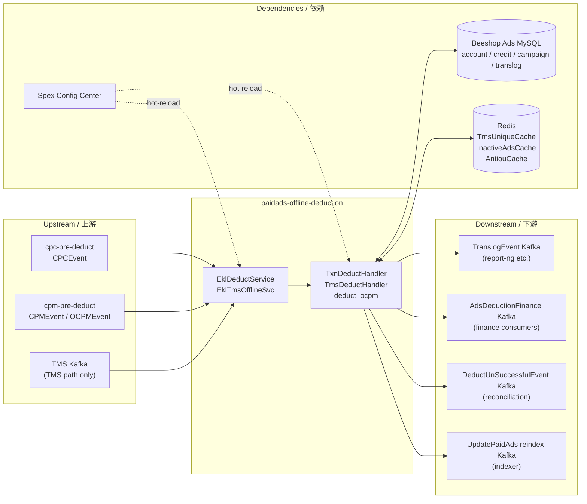

<!-- ads-workspace-gdoc-sync: gdoc_id=1OYZ9jfoPonlPaRObru9ac4gg0BVxB11760DQ9Z1LQzg gdoc_url=https://docs.google.com/document/d/1OYZ9jfoPonlPaRObru9ac4gg0BVxB11760DQ9Z1LQzg/edit -->

# paidads-offline-deduction / 离线扣款服务

> **Contributors**: fengjiao.wang ｜ **最后更新**：2026-05-27 ｜ [GitLab](https://git.garena.com/shopee/search_recommend/ai-copilot/ads-workspace/-/blob/master/docs/common/readme/paidads-offline-deduction/README.md)

> **Language**: [English](README.md) | [中文](README.zh-CN.md)

Git Repository: https://git.garena.com/shopee/deep/paidads-offline-deduction

---

## Table of Contents / 目录

1. [Introduction / 项目概述](#introduction--项目概述)
2. [Features / 核心功能](#features--核心功能)
3. [Ad Products and Business Semantics / 广告产品与业务语义](#ad-products-and-business-semantics--广告产品与业务语义)
   - [Product Scope and Entry Differences / 产品范围与入口差异](#product-scope-and-entry-differences--产品范围与入口差异)
   - [Product-specific Processing Branches / 按广告产品的处理分支](#product-specific-processing-branches--按广告产品的处理分支)
   - [Key Business Decisions / 关键业务判断](#key-business-decisions--关键业务判断)
4. [Architecture / 项目架构](#architecture--项目架构)
   - [Service Topology / 上下游调用拓扑](#service-topology--上下游调用拓扑)
   - [Upstream, Downstream, and System Positioning / 上下游与系统定位](#upstream-downstream-and-system-positioning--上下游与系统定位)
   - [Main Message Processing Flow / 消息处理主链路](#main-message-processing-flow--消息处理主链路)
   - [Runtime Components and Dependencies / 运行时组件与依赖](#runtime-components-and-dependencies--运行时组件与依赖)
5. [Kafka and Event Contracts / Kafka 与事件契约](#kafka-and-event-contracts--kafka-与事件契约)
   - [Consumers and Input Topics / Consumer 与输入 Topic](#consumers-and-input-topics--consumer-与输入-topic)
   - [Producers and Output Topics / Producer 与输出 Topic](#producers-and-output-topics--producer-与输出-topic)
   - [Retry, DLQ, and Side Outputs / 重试、DLQ 与旁路输出](#retry-dlq-and-side-outputs--重试dlq-与旁路输出)
6. [Directory Structure / 目录结构](#directory-structure--目录结构)
7. [Entrypoints and Key Modules / 服务入口与关键模块](#entrypoints-and-key-modules--服务入口与关键模块)
   - [Service Binaries / 入口二进制](#service-binaries--入口二进制)
   - [Handler, Service, and Manager Layers / Handler / Service / Manager 分层](#handler-service-and-manager-layers--handler--service--manager-分层)
   - [Product-specific Module Mapping / 按广告产品的模块映射](#product-specific-module-mapping--按广告产品的模块映射)
   - [Tools and One-off Scripts / 工具与一次性脚本](#tools-and-one-off-scripts--工具与一次性脚本)
8. [Protocol and Data Models / 协议与数据模型](#protocol-and-data-models--协议与数据模型)
   - [Input Events Data Models / 输入事件模型](#input-events-data-models--输入事件模型)
   - [Output Events Data Models / 输出事件模型](#output-events-data-models--输出事件模型)
   - [Core Business Fields / 核心业务字段](#core-business-fields--核心业务字段)
   - [History and Cache Models / 历史数据与缓存模型](#history-and-cache-models--历史数据与缓存模型)
9. [Configuration and Deployment / 配置与部署](#configuration-and-deployment--配置与部署)
   - [Static Config Files / 静态配置文件](#static-config-files--静态配置文件)
   - [Dynamic Config and Hot Reload / 动态配置与热更新](#dynamic-config-and-hot-reload--动态配置与热更新)
   - [Kafka, Redis, DB, and SPEX Config Matrix / 配置矩阵](#kafka-redis-db-and-spex-config-matrix--配置矩阵)
   - [Build and Release / 构建与发布](#build-and-release--构建与发布)
10. [Monitoring and Operations / 监控与排障](#monitoring-and-operations--监控与排障)
    - [Health Checks and Runtime Endpoints / 健康检查与运行时端点](#health-checks-and-runtime-endpoints--健康检查与运行时端点)
    - [Key Metrics and Logs / 关键指标与日志](#key-metrics-and-logs--关键指标与日志)
    - [Duplicate, Missing, and Delayed Data Troubleshooting / 数据重复、漏数、延迟排查](#duplicate-missing-and-delayed-data-troubleshooting--数据重复漏数延迟排查)
    - [Troubleshooting Playbook / 常见故障定位](#troubleshooting-playbook--常见故障定位)
11. [Key Terms / 关键术语](#key-terms--关键术语)
12. [Additional Resources / 参考资料](#additional-resources--参考资料)
13. [Frequently Asked Questions / 常见问题](#frequently-asked-questions--常见问题)

---

## Introduction / 项目概述

`paidads-offline-deduction` handles the **actual money deduction** in the Ads billing pipeline. It sits downstream of `cpc-pre-deduct` and `cpm-pre-deduct` and is responsible for persisting the financial state change — debiting credits, updating campaign daily balances, writing translog, and emitting downstream events.

This repository ships three independent services:

| Binary | Entry Point | Purpose |
|--------|-------------|---------|
| `platform_offlinededuction_server` | `cmd/offline/` | Standard offline deduction (CPC / CPM / OCPM) |
| `platform_offlinetmsdeduction_server` | `cmd/tms/` | TMS-path deduction: routes translog events without re-deducting |
| `platform_bigshopofflinededuction_server` | `cmd/bigshop_offline/` | Dedicated BigShop consumer — temporary isolation for high-volume shops |

**Tracking vs TMS** are two distinct data sources: tracking is the Ads-team legacy ingress; TMS is the company-level source and the long-term migration target. The `cmd/tms/` binary handles TMS migration deduplication and forwarding — it does **not** execute DB mutations.

---

## Features / 核心功能

1. **Complete financial transaction** — one atomic DB commit covers: debit `AdsCredit`, update `AdsAccount`, update `CampaignDailyBalance`, insert `Translog`. No partial writes.
2. **OCPM batch settlement** — a single shop-level `OCPMEvent` can carry many CPM sub-events; a single DB transaction settles them all with a shared balance snapshot, reducing repeated DB round trips.
3. **Inactive cascade** — after a no-money result, sets inactive markers at shop / campaign / ads level (via `InactiveAdsCache`) so the indexer stops serving those entities.
4. **Reindex side effects** — automatically emits `UpdatePaidAds` jobs to the indexer whenever account, campaign, or ads availability changes (budget exhausted, quota split exceeded).
5. **Local credits memory cache** — per-process AdsCredit snapshot (TTL 30 s) reduces repeated credit reads under high throughput.
6. **Unique-ID replay protection** — `TmsUniqueCache` (Redis) prevents double-charging on event replay.
7. **Spex hot-reload** — all Kafka producer endpoints, per-region EKL configs, feature flags (batch SQL, OCPM concurrency) are Spex-managed and reload without restart.

---

## Ad Products and Business Semantics / 广告产品与业务语义

### Product Scope and Entry Differences / 产品范围与入口差异

This service receives events from two upstream deduction services:

| Upstream | Event Type | Billing Mode |
|----------|-----------|--------------|
| `cpc-pre-deduct` | `CPCEvent` | CPC — per-click billing |
| `cpm-pre-deduct` | `CPMEvent` | CPM — per-impression billing |
| `cpm-pre-deduct` | `OCPMEvent` | OCPM — shop-level batch CPM billing |
| TMS Kafka | `CPCEvent` / `CPMEvent` | TMS replay path (no DB deduction) |

**The CPC vs CPM split is a processing-mode distinction**, not just a pricing-mode distinction. CPC events are always individual; CPM events can be batched at the shop level (`OCPMEvent`) to amortize per-event DB overhead.

### Product-specific Processing Branches / 按广告产品的处理分支

| Credit Type | Placements | Handler Path |
|-------------|-----------|--------------|
| Normal credits | All standard placements (search, shop, display…) | `TxnDeductHandler` — deduct from `AdsAccount.balance` and `AdsCredit` |
| Super credits | ROI2 and super-credit placements (determined by `mirror.IsSuperCreditAdsByDbPlacement()`) | Same handler but uses `AdsCredit` of super-credit subtype; `mirror.HasNormalCreditAndSuperCredits()` gates the logic |
| No-deduction (TMS replay) | All placements | `TmsDeductHandler` — only reads translog, writes to `TmsUniqueCache`, emits to translog or diff-translog producer |

### Key Business Decisions / 关键业务判断

| Decision | Logic | Code Location |
|----------|-------|---------------|
| Unique-ID replay guard | Before DB transaction, call `GetTranslogByUniqueID` by `deduct_unique_id`; if an existing translog is found, return `StatusPreDuplicated` and stop further deduction | `internal/deduct_handler/txn_deduct_handler.go`, `internal/deduct_handler/util.go` |
| One-on-one selector | `selector.GetEngine()` checks Brand Max quota first and routes it to `V3Engine`; otherwise `OneOnOneManager` selects `V2Engine` or the default `V1Engine` by country/user segment | `internal/selector/`, `util/one_on_one_manager.go` |
| Placement daily quota exhaustion | Placement-level quota split can return `StatusCampaignPlacementDailyNoMoney`; post-flow triggers campaign-level reindex but does not write campaign inactive cache | `internal/engine/v2.go`, `internal/deduct_handler/txn_deduct_handler.go` |
| Disable producer flag | `isDisableProducer` in `handlerConfig` — prevents Kafka emit (used in regression/debug mode) | `internal/deduct_handler/handler_config.go` |
| `enableNoMoneyMap` | Campaign or account filter — caches recently-exhausted IDs in temp map to skip subsequent DB calls | `internal/deduct_handler/txn_deduct_handler.go` |

---

## Architecture / 项目架构

### Service Topology / 上下游调用拓扑



### Upstream, Downstream, and System Positioning / 上下游与系统定位

**Upstream**

| Name | Protocol | Description |
|------|----------|-------------|
| cpc-pre-deduct | Kafka | `CPCEvent` — CPC deduction events validated and produced by `paidads-deduction` cpc-pre-deduct service |
| cpm-pre-deduct | Kafka | `CPMEvent` / `OCPMEvent` — CPM and OCPM events; OCPM is shop-level batch |
| TMS Kafka | Kafka | TMS replay path consumed by `cmd/tms/`; no DB mutations |

**Downstream**

| Name | Protocol | Description |
|------|----------|-------------|
| TranslogEvent Kafka | Kafka | Committed deduction transaction log (`TranslogEvent`); consumed by report-ng and downstream analytics |
| AdsDeductionFinance Kafka | Kafka | Normalized settlement result (`AdsDeductionFinance`); consumed by finance services |
| DeductUnSuccessfulEvent Kafka | Kafka | Partial or quota-exhausted deduction events; consumed by reconciliation and monitoring |
| UpdatePaidAds reindex Kafka | Kafka | `UpdatePaidAds` reindex jobs; consumed by paidads-indexer for serving convergence |

### Main Message Processing Flow / 消息处理主链路

**Single-event transaction** (one CPCEvent or CPMEvent):

| # | Operation Type | Action | State Changed |
|---|---------------|--------|---------------|
| 1 | Consume Kafka | Read one `CPCEvent` or `CPMEvent` from deduction topic | Input Kafka event |
| 2 | DB read | Check whether `deduct_unique_id` already exists in `translog_tab` | Translog table (dedup) |
| 3 | Calculation | Build canonical deduction record; populate `QuotaObject` | In-memory translog + quota |
| 4 | DB read / cache read | Load balance snapshot: `AdsAccount`, `AdsCredit`, `CampaignDailyBalance`, optional frozen credits | Financial state |
| 5 | Calculation | Calculate deductible amount; derive settlement status (`OK / AccountNoMoney / CampaignDailyNoMoney / CampaignPlacementDailyNoMoney`) | In-memory result |
| 6 | DB write | Commit final financial state in one transaction: `AdsCredit`, `AdsAccount`, `CampaignDailyBalance`, `Translog`, optional frozen credits | DB persisted |
| 7 | Cache write | Refresh local credits cache if enabled | Credits cache |
| 8 | Kafka emit | Emit `DeductUnSuccessfulEvent` when partial or quota-exhausted | Unsuccessful topic |
| 9 | Kafka emit | Emit `AdsDeductionFinance` for final financial outcome | Finance topic |
| 10 | Kafka emit | Emit `TranslogEvent` on successful settlement | Translog topic |
| 11 | Cache write | Write replay protection key to `TmsUniqueCache` on success | TmsUniqueCache |
| 12 | Kafka emit | Emit `UpdatePaidAds` reindex jobs when balance or quota state changes | Reindex topic |
| 13 | Cache write | Write inactive cache (shop / campaign / ads level) when appropriate | InactiveAdsCache |

**OCPM batch transaction** (one shop-level OCPMEvent containing many CPM sub-events):

| # | Operation Type | Action | State Changed |
|---|---------------|--------|---------------|
| 1 | Consume Kafka | Read one shop-level `OCPMEvent` | Input Kafka batch event |
| 2 | DB read | Deduplicate all `uniqueID`s in the batch against `translog_tab` (one batch SQL or individual calls per `EnableBatchSQLForOCPM`) | Translog table |
| 3 | Calculation | Build pending translog payloads for all valid CPM sub-events | In-memory translog objects |
| 4 | Cache read / DB read | Load shared credits snapshot for the whole batch | Credits cache / `AdsCredit` table |
| 5 | DB read | Load shared `AdsAccount` + all `CampaignDailyBalance` records needed by the batch | Account + campaign state |
| 6 | Calculation | Settle CPM sub-events one-by-one; each `BuildDeductionResult()` mutates the shared balance snapshot in place | Shared in-memory snapshot |
| 7 | DB write | Commit full batch in one transaction: account, credits, campaign daily balances, all translogs | DB persisted (batch) |
| 8 | DB read | Backfill committed translog IDs (batch insert does not return per-row IDs) | Translog IDs |
| 9 | Cache write | Refresh credits cache once after commit | Credits cache |
| 10 | Kafka emit | Emit `DeductUnSuccessfulEvent` per sub-event that is partial or quota-exhausted | Unsuccessful topic |
| 11 | Kafka emit | Emit `AdsDeductionFinance` per CPM sub-event | Finance topic |
| 12 | Kafka emit | Emit `TranslogEvent` for successful CPM sub-events | Translog topic |
| 13 | Cache write | Write replay protection key for each successful CPM sub-event | TmsUniqueCache |
| 14 | Kafka emit | Emit `UpdatePaidAds` reindex jobs for no-money or quota-exhausted sub-events | Reindex topic |

**Single-event vs OCPM batch comparison**:

| Dimension | Single Event | OCPM Batch |
|-----------|-------------|------------|
| Input granularity | One CPCEvent or CPMEvent | One OCPMEvent with many CPM sub-events |
| Duplicate handling | One check per event | Batch dedup for all sub-events in one query |
| Snapshot scope | One event reads one financial snapshot | Whole batch shares one financial snapshot |
| Computation pattern | Calculate one event → one result | Calculate sub-events sequentially; mutate shared snapshot |
| DB write pattern | One transaction per event | One transaction for entire batch |
| Cache behavior | Write unique-ID + optional inactive cache | Also refreshes shared credits cache after commit |
| Kafka outputs | One set per event | Still per-sub-event outputs, after shared batch commit |
| Rationale | Standard CPC/CPM path | Reduce DB overhead for high-volume OCPM shop traffic |

### Runtime Components and Dependencies / 运行时组件与依赖

| Component | Role |
|-----------|------|
| `EklDeductService` | EKL Kafka consumer wrapping `TxnDeductHandler.Process()` |
| `EklTmsOfflineSvc` | EKL Kafka consumer wrapping `TmsDeductHandler.Process()` |
| `TxnDeductHandler` | Executes full financial transaction and inactive/reindex side effects |
| `TmsDeductHandler` | TMS replay: checks `TmsUniqueCache`, routes to translog or diff-translog producer, no DB mutations |
| `deduct_ocpm` | OCPM batch settlement: shared snapshot settlement, optional concurrency via `enableOcpmPostFlowConcurrency` |
| `EngineSelector` | Maps (country, userID segment) → deduction engine v1/v2/v3 |
| `InactiveAdsCache` | Redis cache for inactive shop/campaign/ads markers; read by indexer side |
| `AdsIndexer` | Kafka producer wrapper for `UpdatePaidAds` reindex jobs |
| `OneOnOneManager` | Loads engine version selection config from Config Center |

---

## Kafka and Event Contracts / Kafka 与事件契约

### Consumers and Input Topics / Consumer 与输入 Topic

All Kafka broker addresses and topic names come from Spex `SpexDeductionConfig` at runtime.

| Variant | Spex Config Key | Consumer Config |
|---------|-----------------|-----------------|
| Offline / BigShop | `RegionConfigMap[country].OfflineEklConfig` | Per-region EKL: topic, broker, SASL, workers |
| TMS | `RegionConfigMap[country].EklServiceConf` | Per-region TMS EKL config |

Input event types by `deduct_type` field:

| `deduct_type` | Go Type | Import Path |
|---------------|---------|-------------|
| `1` | `CPCEvent` | `paidads-deduction-proto/types/deduct_event/cpc.go` |
| `2` | `CPMEvent` | `paidads-deduction-proto/types/deduct_event/cpm.go` |
| `3` | `OCPMEvent` | `paidads-deduction-proto/types/deduct_event/ocpm.go` |

### Producers and Output Topics / Producer 与输出 Topic

| Producer Config Key | Proto Type | Import Path | Trigger |
|--------------------|------------|-------------|---------|
| `TranslogEventProducersConfig` | `TranslogEvent` | `paidads-deduction-proto/types/translog/translog_event.go` | `StatusOK` |
| `AdsDeductionFinanceProducerConfig` | `AdsDeductionFinance` | `shopee_protobuf/beeshop_ads.pb` | Every completed attempt |
| `DeductUnsuccessfulProducerConfig` | `DeductUnSuccessfulEvent` | `paidads-deduction-proto/types/deduct_unsuccessful_event/` | `StatusPartial` / `StatusOverQuota` |
| `IndexProducerConfig` | `UpdatePaidAds` | `beeshop_mq` | Budget / quota state changes |
| `DiffTranslogEventProducersConfig` | `TranslogEvent` (diff) | same as translog | TMS path — new unique ID only |

All topic names and broker addresses are defined in Spex — no Kafka topic is hardcoded in static config.

### Retry, DLQ, and Side Outputs / 重试、DLQ 与旁路输出

Only `StatusFail` (transport-level errors, DB timeouts) causes the EKL consumer to return an error and trigger retry / DLQ. Business-level statuses (`StatusPartial`, `StatusAccountNoMoney`, `StatusCampaignDailyNoMoney`) are handled in-process and do **not** cause retry.

---

## Directory Structure / 目录结构

```
paidads-offline-deduction/
├── cmd/
│   ├── offline/                         # platform_offlinededuction_server
│   ├── tms/                             # platform_offlinetmsdeduction_server
│   └── bigshop_offline/                 # platform_bigshopofflinededuction_server
├── config/
│   ├── files/                           # Static YAML (live.yml / dev.yml)
│   └── consts/threshold.go              # Hardcoded thresholds
├── internal/
│   ├── deduct_handler/
│   │   ├── txn_deduct_handler.go        # Full transaction handler (1002 lines)
│   │   ├── tms_handler.go               # TMS forwarding handler (188 lines)
│   │   ├── deduct_ocpm.go               # OCPM batch processing (940 lines)
│   │   ├── ocpm_collectors.go           # OCPM reindex / inactive collectors
│   │   ├── handler_config.go            # handlerConfig — all feature flags
│   │   ├── base.go                      # DeductHandlerBase (shared fields)
│   │   └── util.go                      # deductTransaction, inactive helpers
│   ├── exporter/                        # Prometheus metrics
│   ├── event_builder/                   # EventBuilder: event → TranslogEvent
│   ├── engine/                          # Deduction engine wrappers (v1/v2/v3)
│   ├── kafka/                           # AdsIndexer Kafka producer
│   ├── spex_handler/                    # Spex config hot-reload
│   ├── selector/                        # EngineSelector
│   ├── mirror/                          # Credit/placement mapping helpers
│   ├── types/                           # Status, DeductResultObj, DbSnapshot, DeductEntities
│   └── http_handler/                    # /ping /metrics /smoketest /pprof
├── pkg/config/                          # Config structs: Deduction, TmsDeduction, SpexDeductionConfig
├── util/
│   ├── one_on_one_manager.go            # Credit version manager
│   └── run.go                           # App entry helpers
├── go.mod                               # module: git.garena.com/shopee/deep/paidads-offline-deduction, go 1.24
└── Makefile
```

---

## Entrypoints and Key Modules / 服务入口与关键模块

### Service Binaries / 入口二进制

| Binary | Startup File | Handler | EKL Service | Key Difference |
|--------|-------------|---------|-------------|----------------|
| `platform_offlinededuction_server` | `cmd/offline/run.go` | `TxnDeductHandler` | `EklDeductService` | Full DB transaction + inactive cache + reindex |
| `platform_offlinetmsdeduction_server` | `cmd/tms/run.go` | `TmsDeductHandler` | `EklTmsOfflineSvc` | No DB mutations; routes by `TmsUniqueCache` to translog or diff-translog producer |
| `platform_bigshopofflinededuction_server` | `cmd/bigshop_offline/run.go` | `TxnDeductHandler` | `EklDeductService` | Identical to offline; separate Spex server-name (`platform.bigshopdeduct`) and isolated Kafka consumers |

### Handler, Service, and Manager Layers / Handler / Service / Manager 分层

**TxnDeductHandler** (`internal/deduct_handler/txn_deduct_handler.go`):

`Process(event)` executes in this order:
1. Validate country from `validateCountryConfig`
2. Check `enableNoMoneyMap` — skip if campaign / account in temp exhaustion map
3. Build `EventBuilder` and `QuotaObject`
4. Call `deductMoney()` (in `util.go`) — full DB transaction
5. Set `InactiveAdsCache` based on result status
6. Update `NoMoneyMap` temp filter for `CampaignDailyNoMoney` / `AccountNoMoney`
7. Emit `DeductUnSuccessfulEvent` if partial / over-quota
8. Emit `AdsDeductionFinance`
9. Handle `StatusAccountNoMoney` → `ReindexAccountByID` → emit `UpdatePaidAds`
10. Handle `StatusCampaignDailyNoMoney` → `ReindexCampaignByID`
11. Handle `StatusOK` → build + emit `TranslogEvent` → set `TmsUniqueCache` → run `checkZeroBalanceByVersion()` for inactive + reindex decisions

`StatusCampaignPlacementDailyNoMoney` comes from placement-level quota split. It follows the campaign reindex path so serving can refresh campaign state; the code does not treat it as a normal `StatusCampaignDailyNoMoney` for campaign inactive-cache writes, avoiding expanding placement quota exhaustion into full campaign inactivity.

**TmsDeductHandler** (`internal/deduct_handler/tms_handler.go`):

`Process(event)` flow:
1. Extract `TrackUniqueID` (CPC: from `TrackUniqueID` field; CPM: from `UniqueID` field)
2. Build translog via `EventBuilder.BuildTranslog()`
3. Check `TmsUniqueCache` for key `{TrackUniqueID}#{AdsID}`:
   - **Hit** → emit to `translogEventProducer` (resend)
   - **Miss** → emit to `diffTranslogProducer` (first occurrence)
4. Return `StatusOK` always (no failure path in TMS handler)

**deduct_ocpm** (`internal/deduct_handler/deduct_ocpm.go`):

`ProcessOcpmEvent()` three phases:
1. **Init** (`initOcpmEventMaps`): Build `EventBuilder` + `QuotaObject` per sub-event; dedup check; build pending translogs
2. **Transaction** (`DeductOcpmTransaction`): Shared snapshot settlement — single DB commit for all sub-events
3. **Post-flow**: Per-sub-event: emit translog / unsuccessful / finance / reindex; optional concurrency via `enableOcpmPostFlowConcurrency`

### Product-specific Module Mapping / 按广告产品的模块映射

| Credit / Product Type | Code Gate | Engine Path |
|----------------------|-----------|-------------|
| Normal credit ads | `!mirror.IsSuperCreditAdsByDbPlacement()` | Standard `AdsAccount.balance` + `AdsCredit` deduction |
| Super-credit ads (ROI2) | `mirror.IsSuperCreditAdsByDbPlacement()` | `AdsCredit` of super-credit subtype; `mirror.HasNormalCreditAndSuperCredits()` |
| OCPM batch | `deduct_type == 3` | `deduct_ocpm.ProcessOcpmEvent()` — shared snapshot path |
| TMS replay | `EklTmsOfflineSvc` consumer | `TmsDeductHandler` — no DB; only cache + Kafka |

### Tools and One-off Scripts / 工具与一次性脚本

The Makefile includes:
- `make utgen` — unit test generator (requires `.env`)
- `make coverage` — generate coverage report (XML + text)
- `make nilaway` — NilAway static analysis
- `make ci` / `make ci-remote` — local / GitLab CI validation pipeline

---

## Protocol and Data Models / 协议与数据模型

### Input Events Data Models / 输入事件模型

| Type | Import Path | Key Fields |
|------|-------------|-----------|
| `CPCEvent` | `paidads-deduction-proto/types/deduct_event/cpc.go` | `TrackUniqueID`, `UserID`, `DeductInfo`, `BaseInfo` |
| `CPMEvent` | `paidads-deduction-proto/types/deduct_event/cpm.go` | `UniqueID`, `Details`, `BaseInfo` |
| `OCPMEvent` | `paidads-deduction-proto/types/deduct_event/ocpm.go` | `OCPMCampaignDetails` (array of CPM sub-events) |

`BaseInfo` (shared across all types):
`SellerUserID`, `Country`, `AdsID`, `CampaignID`, `ShopID`, `Placement`, `Entrance`, `Operation`, `PricingType`, `DeductType`, `UniqueID`, `EventTime`, `Price`, `Platform`, `DbPlacement`, `DailyQuota`

### Output Events Data Models / 输出事件模型

| Type | Import Path | Key Fields |
|------|-------------|-----------|
| `TranslogEvent` | `paidads-deduction-proto/types/translog/translog_event.go` | translog ID, adsID, price, status, country, placement |
| `AdsDeductionFinance` | `shopee_protobuf/beeshop_ads.pb` | normalized settlement result for finance consumers |
| `DeductUnSuccessfulEvent` | `paidads-deduction-proto/types/deduct_unsuccessful_event/` | `DeductUnsuccessfulReason`, partial amount |

### Core Business Fields / 核心业务字段

**`DeductResultObj`** (`internal/types/types.go`):

| Field | Description |
|-------|-------------|
| `Account` / `AccountSnapshot` | `*pbads.AdsAccount` — account state before and after deduction |
| `OldAdsCredits` / `TotalCredits` / `EligibleAdsCredits` / `ChangedAdsCredits` | `[]*pbads.AdsCredit` — credit lifecycle |
| `CampaignDailyBalanceByDate` | `*pbads.CampaignDailyBalanceByDate` — campaign quota state |
| `Translog` | `*pbads.Translog` — committed transaction record |
| `AdjustedCost` / `CreditCost` / `AccountBalanceCost` | `int64` — cost breakdown |
| `RemainValidBalance` / `RemainAvailableBalance` | `int64` — post-deduction balances |
| `Version` | `config.AdsCreditSortingVersion` — engine version |
| `DeductUnsuccessfulReason` | `adstopup.DeductUnsuccessfulReason` — failure reason enum |

### History and Cache Models / 历史数据与缓存模型

**DB Snapshot types** (`internal/types/types.go`):
- `DbSnapshot` — single-event: account + credits + campaign daily balance
- `DbOcpmSnapshot` — OCPM batch: same fields, shared across all sub-events

---

## Configuration and Deployment / 配置与部署

### Static Config Files / 静态配置文件

Located at `config/files/`:

| File | Environment |
|------|-------------|
| `live.yml` | Production |
| `dev.yml` | Development |

`config/files/live.yml` is the production configuration file. Key fields:

```yaml
deduction:
  port: #EXPOSE_PORT
  spex-config:
    server-name: "shopee.paidads.data_application.platform.offlinededuction"
    config-key: "<hash>"   # Entry into Spex for runtime Kafka route and region configs
  inactive-cache-config-identity:
    group: "paidads"
    project: "index_pipeline"
    namespace: "inactive_ads_cache_live_default"
  db-manager-config:
    manager-v2-with-config-center-config:
      env: "live"
  validate-country-config:
    TW: true  # (and SG, MY, VN, PH, ID, TH, BR, MX, CO, CL, AR)
```

The `server-name` and `config-key` are the entry points into Spex for runtime Kafka route lookup. The actual topic names, broker addresses, per-region EKL configs, and DB connection strings are all fetched from Spex at startup.

### Dynamic Config and Hot Reload / 动态配置与热更新

Spex server name: `shopee.paidads.data_application.platform.offlinededuction`

| Spex Config Field | Description |
|-------------------|-------------|
| `TranslogEventProducersConfig` | Kafka producer for `TranslogEvent` |
| `AdsDeductionFinanceProducerConfig` | Kafka producer for `AdsDeductionFinance` |
| `DeductUnsuccessfulProducerConfig` | Kafka producer for `DeductUnSuccessfulEvent` |
| `IndexProducerConfig` | Kafka producer for `UpdatePaidAds` |
| `DiffTranslogEventProducersConfig` | TMS diff translog producer |
| `RegionConfigMap[country].OfflineEklConfig` | Per-region EKL consumer config |
| `RegionConfigMap[country].EklServiceConf` | Per-region TMS EKL config |
| `RegionConfigMap[country].TmsUniqueCache` | Per-region Redis for TMS dedup |
| `RegionConfigMap[country].RateLimit` | DB rate limit (req/s) |
| `RegionConfigMap[country].UseCreditsMemoryCountryList` | Countries using in-process credits cache |
| `RegionConfigMap[country].EnableBatchSQLForOCPM` | Batch SQL for OCPM dedup phase |
| `RegionConfigMap[country].EnableOcpmPostFlowConcurrency` | Parallel OCPM post-flow processing |
| `RegionConfigMap[country].IsDisableUniqueCache` | Disables `SetTmsUniqueID` writes to the TMS replay unique cache for regression or fault bypass |

DB endpoint resolution: runtime DB access is resolved by `db-manager-config` plus `DBControlConfig` from Spex. **There is no single stable physical MySQL address in this repo** — always look up through Spex / Config Center.

### Kafka, Redis, DB, and SPEX Config Matrix / 配置矩阵

**Redis**

| Cache Name | Config Path | Example Address | Key Shape | TTL | Used By |
|-----------|------------|-----------------|-----------|-----|---------|
| `replay_unique_cache` (TmsUniqueCache) | `RegionConfigMap.<country>.TmsUniqueCache` | SG: `ucmvi.elasticredis.cloud.shopee.io:10204`; SEA shared: `oer9e.elasticredis.cloud.shopee.io:10203` | `trackuniqueid:uniqueid:<id>adsid:<id>` / `uniqueid:uniqueid:<id>` | `SetTmsUniqueID` writes with 10-minute TTL | `tms_handler.go`, `txn_deduct_handler.go` |
| `notify_and_inactive_cache` | `RegionConfigMap.<country>.notify` / `inactive-cache-config-identity` | Common live: `ips.2910bd76a05c449b.elasticredis.cloud.shopee.io:10613` | Templates from notifier / inactive-cache libs | Library-driven | Inactive cascade side effects |
| `livestream_antou_cache` | `RegionConfigMap.<country>.livestream-antou-cache` | Common live: `er7ol.elasticredis.cloud.shopee.io:10523` | `livestreamantouoffline:adsid<id>:date<yyyymmdd>` | 24 h | `deduct_handler/util.go` |
| `local_credits_memory` | `use-credits-memory-country-list` / `local-cache-ttl-seconds` | In-process only (no external Redis) | Snapshot of `AdsCredit` rows | 30 s | `txn_deduct_handler.go`, `deduct_ocpm.go` |

**DB entities** (accessed via `db-manager-config` + `DBControlConfig` from Spex):

| Entity | Table Family | Key Fields | Operations |
|--------|-------------|-----------|------------|
| `AdsAccount` | `ads_account_tab_%08d` | `accountid`, `userid`, `balance`, `status`, `display_ads_balance` | `GetXAccountByID`, `UpdateAccount` |
| `AdsCredit` | `ads_credit_tab_%08d` | `ads_credit_id`, `user_id`, `shop_id`, `amount`, `balance`, `main_type`, `subtype`, `start_time`, `end_time` | `GetXUnexpiredAdsCreditByUserID`, `UpdateAdsCredit` |
| `CampaignDailyBalanceByDate` | `campaign_daily_balance_tab_%s` | `campaignid`, `userid`, `daily_balance`, `ctime` | `BatchGetXCampaignDailyBalanceByDateForDeduction`, `BatchUpdateCampaignDailyBalanceByDateForDeduction` |
| `Translog` | `translog_tab_%s` | `adsid`, `itemid`, `shopid`, `operation`, `price`, `status`, `deduct_unique_id` | `GetTranslogByUniqueID`, `BatchAddTranslogForDeduction` |
| `FrozenAdsCreditDBModel` | `frozen_ads_credit_tab_%08d` | `campaign_id`, `ads_credit_id`, `amount`, `balance`, `order_id` | `GetXFrozenAdsCredits`, `UpdateFrozenAdsCredit` |

### Build and Release / 构建与发布

```bash
make all                     # vet + build all three binaries
make offlinededuction        # bin/platform_offlinededuction_server
make offlinetmsdeduction     # bin/platform_offlinetmsdeduction_server
make bigshopofflinededuction # bin/platform_bigshopofflinededuction_server
make test                    # run tests with coverage
make ci-remote               # vet + fmt + test (GitLab CI pipeline)
```

---

## Monitoring and Operations / 监控与排障

### Health Checks and Runtime Endpoints / 健康检查与运行时端点

| Endpoint | Purpose |
|----------|---------|
| `/ping` | Liveness check |
| `/smoketest` | Mesos readiness probe |
| `/metrics` | Prometheus metrics |
| `/debug/pprof/` | Go profiling |

### Key Metrics and Logs / 关键指标与日志

All metrics are prefixed `paidads_deduction_`.

**Counters**

| Metric | Key Labels | Description |
|--------|-----------|-------------|
| `counter` | country, placement, operation, status, platform, entrance, pricing_type | Deduction event count per status |
| `weighted_counter` | same | Weighted by event price |
| `revenue` | country, placement, platform, entrance, operation, pricing_type | Revenue generated |
| `revenue_local_currency` | same | Revenue in local currency |
| `loss_revenue` | country, placement, partial, entrance, operation, pricing_type | Revenue lost due to exhaustion |
| `error` | country, placement, operation, err, platform, entrance | Error count by error type |
| `credit_memory_counter` | — | `cacheHit` / `cacheMiss` / `readCreditFromDbAgain` for local credits cache |
| `ocpm_post_flow_processed_total` | status, concurrent_path | OCPM post-flow completion count |

**Histograms**

| Metric | Key Labels | Description |
|--------|-----------|-------------|
| `latency` | country, stage, operation, useCreditsMemory | End-to-end processing latency |
| `DBlatency` | country, operation | DB query latency |
| `Middlewarelatency` | country, operation | Per-middleware latency (SetInactiveShop, sendTranslogEvent, etc.) |
| `ocpm_batch_event_count` | — | CPM sub-events per OCPM batch |
| `ocpm_batch_sql_latency` | operation, batch_size | SQL latency: batch vs individual comparison |
| `ocpm_phase_latency` | phase | Per-phase: `process.init_event_maps`, `event.transaction`, `txn.begin`, `txn.commit`, `event.post_flow` |

Key error codes tracked via `error` metric:

| Error | Description |
|-------|-------------|
| `ErrDeductTimeout` | Deduction engine timed out |
| `ErrTransaction` | DB transaction failure |
| `ErrReIndexAcc` / `ErrReIndexCampaign` / `ErrReIndexAd` | AdsIndexer write failure |
| `ErrGetTranslog` / `ErrPreTranslogDuplicate` | Translog read / dedup failure |
| `ErrGetAdsCredit` | Failed to fetch credit balance |
| `ErrInactiveCache` | Inactive cache write failure |

### Duplicate, Missing, and Delayed Data Troubleshooting / 数据重复、漏数、延迟排查

| Symptom | Likely Cause | Where to Look |
|---------|-------------|---------------|
| Replay lag (same events processed twice) | `TmsUniqueCache` miss or Redis failure | Check `TmsUniqueCache` Redis health; `ErrPreTranslogDuplicate` counter |
| Missing `TranslogEvent` output | `StatusFail` causing DLQ; or `isDisableProducer=true` | Check DLQ consumer lag; confirm `isDisableProducer` is false in Spex |
| `deduct-unsuccessful` spikes | Budget exhaustion wave (campaign / account) | Check `StatusCampaignDailyNoMoney` / `StatusAccountNoMoney` counter breakdown |
| Index rewrite failures | AdsIndexer Kafka producer down | Check `ErrReIndexAcc` / `ErrReIndexCampaign` metrics; broker health |
| OCPM batch latency | Batch SQL disabled; large batch size | Check `ocpm_batch_sql_latency`; confirm `EnableBatchSQLForOCPM` in Spex |

### Troubleshooting Playbook / 常见故障定位

| Symptom | Steps |
|---------|-------|
| `counter` drops for a country | Check EKL consumer lag; verify `RegionConfigMap[country].OfflineEklConfig` in Spex is not disabled |
| `loss_revenue` spikes | Check `NoMoneyMap` hit rate; review campaign daily quota settings in Ads platform |
| DLQ backlog grows | Check `paidads_deduction_DBlatency`; verify DB connection pool via `db-manager-config` |
| TMS double-processing | Check `TmsUniqueCache` Redis connection; verify TTL of `trackuniqueid:uniqueid:*` keys |
| Finance events missing | Check `AdsDeductionFinanceProducerConfig` broker; verify `adsDeductionFinanceProducer` is not disabled |

---

## Key Terms / 关键术语

| Term | Description |
|------|-------------|
| offline deduction | The financial deduction step: persists credit/balance changes to DB |
| TranslogEvent | Committed deduction transaction log; downstream of report-ng |
| AdsDeductionFinance | Normalized finance record for accounting consumers |
| DeductUnSuccessfulEvent | Failure notification for partial or quota-exhausted deductions |
| UpdatePaidAds | Reindex job emitted when account/campaign/ads availability changes |
| TmsUniqueCache | Redis replay-protection cache; key: `trackuniqueid:uniqueid:<id>adsid:<id>`; written by `SetTmsUniqueID` after successful deduction with a 10-minute TTL, and can be disabled by `IsDisableUniqueCache` |
| InactiveAdsCache | Redis inactive marker for shop/campaign/ads; read by serving indexer |
| OCPMEvent | Shop-level batch CPM event containing many CPM sub-events |
| NoMoneyMap | In-process temp map for recently-exhausted campaigns/accounts |
| local credits memory cache | In-process AdsCredit snapshot (TTL 30 s) to reduce DB reads |
| 1 on 1 credit | Single-use credit allocation pattern; version managed by `OneOnOneManager` |
| campaign balance | `CampaignDailyBalance` — per-day budget quota for a campaign |
| account balance | `AdsAccount.balance` — total credit balance for an advertiser account |
| EngineSelector | Maps events to deduction engine versions: Brand Max quota uses v3; otherwise OneOnOneManager selects v2 or default v1 |

---

## Additional Resources / 参考資料

- [Paid Ads Glossary (Confluence)](https://confluence.shopee.io/pages/viewpage.action?spaceKey=SPAD&title=Paid+Ads+Glossary)
- Git Repository: https://git.garena.com/shopee/deep/paidads-offline-deduction

---

## Frequently Asked Questions / 常见问题

**Q1: Why is there a separate OCPM event deduction path?**

OCPM events are shop-level batches containing many CPM sub-events. Even if the upstream batcher (in `paidads-deduction`) groups them by shop, grouping at the shop level is fundamentally different from per-`adsid` or per-`campaignid` settlement. The OCPM path shares one DB snapshot across all sub-events in the batch, allowing a single transaction to settle dozens of impressions at once — impossible with the single-event `TxnDeductHandler`.

**Q2: Why is there a separate `bigshop-offline-deduction` service?**

BigShop advertisers (large merchants) generate a disproportionate volume of deduction events on shared Kafka partitions. Isolating them in a dedicated consumer prevents a single high-volume shop from starving deduction latency for all other shops. This is a **temporary** solution — the long-term fix is finer-grained partitioning in the upstream Kafka topics.

**Q3: What is the TMS path and why does it not deduct?**

TMS (Tracking Management System) is the company-level tracking source, replacing the legacy Ads-owned tracking ingress. During the migration period, TMS events arrive as replays of already-processed tracking. The `cmd/tms/` binary only routes translog events (dedup by `TmsUniqueCache`, route new events to `DiffTranslogProducer`) — it never writes to the DB because the financial state was already committed when the original event was processed via the tracking path.

**Q4: How does the inactive cascade work?**

When `TxnDeductHandler` determines a budget is exhausted (`StatusAccountNoMoney`, `StatusCampaignDailyNoMoney`, etc.), it writes to `InactiveAdsCache` (Redis) at the appropriate granularity (shop / campaign / ads). The serving-side indexer reads this cache and excludes inactive entities from ad retrieval. The cascade priority is shop > campaign > ads — once a shop is marked inactive, individual campaign/ads markers are redundant.

**Q5: Where are Kafka topic names defined?**

Nowhere in static config. All topic names, broker addresses, group IDs, and SASL credentials are stored in Spex `SpexDeductionConfig.RegionConfigMap`. The static YAML (`config/files/live.yml`) only holds the Spex `server-name` and `config-key` — these are the entry points to look up the runtime Kafka route in the Space `ads_data` folder and Config Center.

**Q6: What does `EnableBatchSQLForOCPM` do?**

When enabled, the OCPM dedup phase fetches all `translog_tab` records for the batch in one `GetTranslogByUnqueidList()` call instead of N individual calls. It also uses `BatchGetXCampaignDailyBalanceByDateForDeduction()` for campaign daily balances. This significantly reduces DB round trips for large OCPM batches.

**Q7: How does the local credits memory cache work?**

When `UseCreditsMemoryCountryList` includes the event's country, `TxnDeductHandler` reads an in-process `AdsCredit` snapshot (TTL 30 s) instead of querying the DB. After a successful commit, the snapshot is refreshed or invalidated. The cache is per-process and is lost on restart — it is purely a read optimization.

**Q8: Why does `TmsDeductHandler` always return `StatusOK`?**

TMS is a replay path — the financial outcome was already determined upstream. The TMS handler only decides where to route the translog event (existing → `translogEventProducer`; new → `diffTranslogProducer`). There is no failure scenario that warrants retry, so it always returns `StatusOK` to prevent EKL from triggering unnecessary DLQ routing.

<!-- Generated by ads-workspace/skills/ads-readme-generate | checked: fd09f3eb96f75633db90a7275fa7fbe643d69dc8 -->
