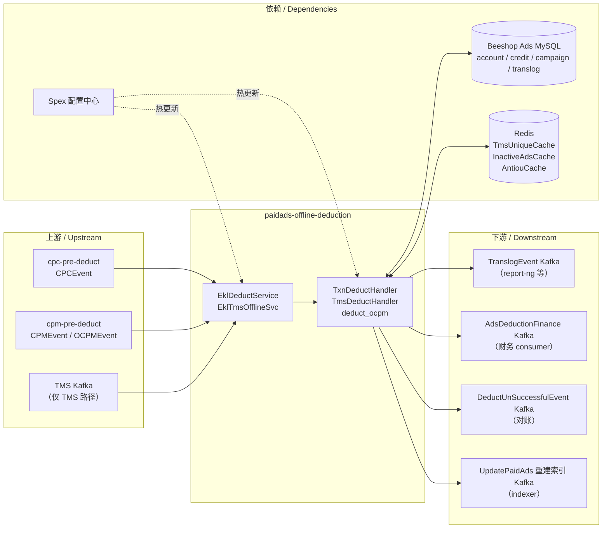

<!-- ads-workspace-gdoc-sync: gdoc_id=1nasg8Owjvl97tQiME8mmVivq8ULAMFas1m7B7gu63PE gdoc_url=https://docs.google.com/document/d/1nasg8Owjvl97tQiME8mmVivq8ULAMFas1m7B7gu63PE/edit -->

# paidads-offline-deduction / 离线扣款服务

> **Contributors**: fengjiao.wang ｜ **最后更新**：2026-05-27 ｜ [GitLab](https://git.garena.com/shopee/search_recommend/ai-copilot/ads-workspace/-/blob/master/docs/common/readme/paidads-offline-deduction/README.zh-CN.md)

> **Language**: [English](README.md) | [中文](README.zh-CN.md)

Git Repository: https://git.garena.com/shopee/deep/paidads-offline-deduction

---

## 目录 / Table of Contents

- [paidads-offline-deduction / 离线扣款服务](#paidads-offline-deduction--离线扣款服务)
  - [目录 / Table of Contents](#目录--table-of-contents)
  - [项目概述 / Introduction](#项目概述--introduction)
  - [核心功能 / Features](#核心功能--features)
  - [广告产品与业务语义 / Ad Products and Business Semantics](#广告产品与业务语义--ad-products-and-business-semantics)
    - [产品范围与入口差异 / Product Scope and Entry Differences](#产品范围与入口差异--product-scope-and-entry-differences)
    - [按广告产品的处理分支 / Product-specific Processing Branches](#按广告产品的处理分支--product-specific-processing-branches)
    - [关键业务判断 / Key Business Decisions](#关键业务判断--key-business-decisions)
  - [项目架构 / Architecture](#项目架构--architecture)
    - [上下游调用拓扑 / Service Topology](#上下游调用拓扑--service-topology)
    - [上下游与系统定位 / Upstream, Downstream, and System Positioning](#上下游与系统定位--upstream-downstream-and-system-positioning)
    - [消息处理主链路 / Main Message Processing Flow](#消息处理主链路--main-message-processing-flow)
    - [运行时组件与依赖 / Runtime Components and Dependencies](#运行时组件与依赖--runtime-components-and-dependencies)
  - [Kafka 与事件契约 / Kafka and Event Contracts](#kafka-与事件契约--kafka-and-event-contracts)
    - [Consumer 与输入 Topic / Consumers and Input Topics](#consumer-与输入-topic--consumers-and-input-topics)
    - [Producer 与输出 Topic / Producers and Output Topics](#producer-与输出-topic--producers-and-output-topics)
    - [重试、DLQ 与旁路输出 / Retry, DLQ, and Side Outputs](#重试dlq-与旁路输出--retry-dlq-and-side-outputs)
  - [目录结构 / Directory Structure](#目录结构--directory-structure)
  - [服务入口与关键模块 / Entrypoints and Key Modules](#服务入口与关键模块--entrypoints-and-key-modules)
    - [入口二进制 / Service Binaries](#入口二进制--service-binaries)
    - [Handler / Service / Manager 分层 / Handler, Service, and Manager Layers](#handler--service--manager-分层--handler-service-and-manager-layers)
    - [按广告产品的模块映射 / Product-specific Module Mapping](#按广告产品的模块映射--product-specific-module-mapping)
    - [工具与一次性脚本 / Tools and One-off Scripts](#工具与一次性脚本--tools-and-one-off-scripts)
  - [协议与数据模型 / Protocol and Data Models](#协议与数据模型--protocol-and-data-models)
    - [输入事件模型 / Input Events Data Models](#输入事件模型--input-events-data-models)
    - [输出事件模型 / Output Events Data Models](#输出事件模型--output-events-data-models)
    - [核心业务字段 / Core Business Fields](#核心业务字段--core-business-fields)
    - [历史数据与缓存模型 / History and Cache Models](#历史数据与缓存模型--history-and-cache-models)
  - [配置与部署 / Configuration and Deployment](#配置与部署--configuration-and-deployment)
    - [静态配置文件 / Static Config Files](#静态配置文件--static-config-files)
    - [动态配置与热更新 / Dynamic Config and Hot Reload](#动态配置与热更新--dynamic-config-and-hot-reload)
    - [Kafka、Redis、DB、SPEX 配置矩阵 / Kafka, Redis, DB, and SPEX Config Matrix](#kafkaredisdbspex-配置矩阵--kafka-redis-db-and-spex-config-matrix)
    - [构建与发布 / Build and Release](#构建与发布--build-and-release)
  - [监控与排障 / Monitoring and Operations](#监控与排障--monitoring-and-operations)
    - [健康检查与运行时端点 / Health Checks and Runtime Endpoints](#健康检查与运行时端点--health-checks-and-runtime-endpoints)
    - [关键指标与日志 / Key Metrics and Logs](#关键指标与日志--key-metrics-and-logs)
    - [数据重复、漏数、延迟排查 / Duplicate, Missing, and Delayed Data Troubleshooting](#数据重复漏数延迟排查--duplicate-missing-and-delayed-data-troubleshooting)
    - [常见故障定位 / Troubleshooting Playbook](#常见故障定位--troubleshooting-playbook)
  - [关键术语 / Key Terms](#关键术语--key-terms)
  - [参考资料 / Additional Resources](#参考资料--additional-resources)
  - [常见问题 / Frequently Asked Questions](#常见问题--frequently-asked-questions)

---

## 项目概述 / Introduction

`paidads-offline-deduction` 负责广告计费流水线中的**实际扣款**操作。它位于 `cpc-pre-deduct` 和 `cpm-pre-deduct` 的下游，负责持久化财务状态变更——从广告账户余额中扣除费用、更新广告系列日预算、写入扣款流水（translog），并向下游发送事件。

本仓库包含三个独立服务：

| 二进制 | 入口 | 用途 |
|--------|------|------|
| `platform_offlinededuction_server` | `cmd/offline/` | 标准离线扣款（CPC / CPM / OCPM） |
| `platform_offlinetmsdeduction_server` | `cmd/tms/` | TMS 路径扣款：路由 translog 事件，不重复执行扣款 |
| `platform_bigshopofflinededuction_server` | `cmd/bigshop_offline/` | 专用 BigShop consumer——对高流量大商家进行隔离消费 |

**tracking 与 TMS 是两套不同的数据源**：tracking 是 Ads 团队早期自建入口；TMS 是公司级数据源，是长期迁移目标。`cmd/tms/` 二进制处理 TMS 迁移期的去重和转发，**不执行数据库写操作**。

---

## 核心功能 / Features

1. **完整的财务事务** — 一次原子 DB 提交涵盖：扣除 `AdsCredit`、更新 `AdsAccount`、更新 `CampaignDailyBalance`、插入 `Translog`，不会产生部分写入。
2. **OCPM 批量结算** — 一个商家级 `OCPMEvent` 可包含多个 CPM 子事件；一次 DB 事务使用共享余额快照批量结算，减少重复 DB 往返。
3. **不活跃级联** — 出现余额不足结果后，在商家 / 广告系列 / 广告位级别设置不活跃标记（通过 `InactiveAdsCache`），使索引服务停止投放这些实体。
4. **重建索引副作用** — 当账户、广告系列或广告可用性变化时（预算耗尽、配额分割超限），自动向索引服务发送 `UpdatePaidAds` 任务。
5. **本地积分内存缓存** — 进程内 `AdsCredit` 快照（TTL 30 秒），在高吞吐场景下减少重复的数据库读取。
6. **唯一 ID 重放保护** — `TmsUniqueCache`（Redis）防止事件重放时双重扣款。
7. **Spex 热更新** — 所有 Kafka Producer 端点、各区域 EKL 配置、功能开关（批量 SQL、OCPM 并发）均由 Spex 管理，无需重启即可更新。

---

## 广告产品与业务语义 / Ad Products and Business Semantics

### 产品范围与入口差异 / Product Scope and Entry Differences

本服务接收来自两个上游扣款服务的事件：

| 上游 | 事件类型 | 计费模式 |
|------|---------|---------|
| `cpc-pre-deduct` | `CPCEvent` | CPC — 按点击计费 |
| `cpm-pre-deduct` | `CPMEvent` | CPM — 按曝光计费 |
| `cpm-pre-deduct` | `OCPMEvent` | OCPM — 商家级批量 CPM 计费 |
| TMS Kafka | `CPCEvent` / `CPMEvent` | TMS 重放路径（不执行扣款） |

**CPC 与 CPM 的区分不仅是定价模式的差异，也是处理模式的区别。** CPC 事件始终为单条；CPM 事件可在商家层级批量处理（`OCPMEvent`），以摊薄每条事件的 DB 开销。

### 按广告产品的处理分支 / Product-specific Processing Branches

| 积分类型 | 投放位置 | Handler 路径 |
|---------|---------|-------------|
| 普通积分 | 所有标准投放位（搜索、商店、展示等） | `TxnDeductHandler` — 从 `AdsAccount.balance` 和 `AdsCredit` 扣款 |
| 超级积分 | ROI2 及超级积分投放位（由 `mirror.IsSuperCreditAdsByDbPlacement()` 判断） | 同一 Handler，但使用超级积分子类型的 `AdsCredit`；`mirror.HasNormalCreditAndSuperCredits()` 控制逻辑分支 |
| 不扣款（TMS 重放） | 所有投放位 | `TmsDeductHandler` — 仅读取 translog、写入 `TmsUniqueCache`、发送到 translog 或 diff-translog Producer |

### 关键业务判断 / Key Business Decisions

| 判断点 | 逻辑 | 代码位置 |
|--------|------|---------|
| 唯一 ID 重放防护 | DB 事务前通过 `GetTranslogByUniqueID` 按 `deduct_unique_id` 查询 translog 表；已存在则返回 `StatusPreDuplicated` 并停止后续扣款 | `internal/deduct_handler/txn_deduct_handler.go`、`internal/deduct_handler/util.go` |
| 一对一选择器 | `selector.GetEngine()` 先判断 Brand Max quota，命中则走 `V3Engine`；否则由 `OneOnOneManager` 按国家 / 用户分段选择 `V2Engine` 或默认 `V1Engine` | `internal/selector/`、`util/one_on_one_manager.go` |
| 广告位日预算耗尽 | placement-level quota split 可能返回 `StatusCampaignPlacementDailyNoMoney`，后续会触发 campaign 维度重建索引，但不会写入广告系列 inactive cache | `internal/engine/v2.go`、`internal/deduct_handler/txn_deduct_handler.go` |
| Producer 禁用标志 | `handlerConfig` 中的 `isDisableProducer` — 阻止 Kafka 发送（用于回归 / 调试模式） | `internal/deduct_handler/handler_config.go` |
| `enableNoMoneyMap` | 广告系列或账户过滤器——将最近余额耗尽的 ID 缓存到临时 map，跳过后续 DB 调用 | `internal/deduct_handler/txn_deduct_handler.go` |

---

## 项目架构 / Architecture

### 上下游调用拓扑 / Service Topology



### 上下游与系统定位 / Upstream, Downstream, and System Positioning

**上游**

| 名称 | 协议 | 描述 |
|------|------|------|
| cpc-pre-deduct | Kafka | `CPCEvent` — 由 `paidads-deduction` cpc-pre-deduct 服务校验并生成的 CPC 扣款事件 |
| cpm-pre-deduct | Kafka | `CPMEvent` / `OCPMEvent` — CPM 和 OCPM 事件；OCPM 为商家级批量 |
| TMS Kafka | Kafka | 由 `cmd/tms/` 消费的 TMS 重放路径；不执行 DB 写操作 |

**下游**

| 名称 | 协议 | 描述 |
|------|------|------|
| TranslogEvent Kafka | Kafka | 已提交的扣款流水（`TranslogEvent`）；由 report-ng 及下游数据分析系统消费 |
| AdsDeductionFinance Kafka | Kafka | 标准化结算结果（`AdsDeductionFinance`）；由财务服务消费 |
| DeductUnSuccessfulEvent Kafka | Kafka | 部分扣款或配额耗尽事件；由对账和监控系统消费 |
| UpdatePaidAds 重建索引 Kafka | Kafka | `UpdatePaidAds` 重建索引任务；由 paidads-indexer 消费以更新投放状态 |

### 消息处理主链路 / Main Message Processing Flow

**单事件事务**（一条 CPCEvent 或 CPMEvent）：

| # | 操作类型 | 动作 | 状态变更 |
|---|---------|------|---------|
| 1 | 消费 Kafka | 从扣款 topic 读取一条 `CPCEvent` 或 `CPMEvent` | 输入 Kafka 事件 |
| 2 | DB 读取 | 检查 `deduct_unique_id` 是否已存在于 `translog_tab` | 流水表（去重） |
| 3 | 计算 | 构建规范化扣款记录；填充 `QuotaObject` | 内存中的流水 + 配额 |
| 4 | DB 读取 / 缓存读取 | 加载余额快照：`AdsAccount`、`AdsCredit`、`CampaignDailyBalance`，以及可选的冻结积分 | 财务状态 |
| 5 | 计算 | 计算可扣款金额；推导结算状态（`OK / AccountNoMoney / CampaignDailyNoMoney / CampaignPlacementDailyNoMoney`） | 内存计算结果 |
| 6 | DB 写入 | 在一次事务中提交最终财务状态：`AdsCredit`、`AdsAccount`、`CampaignDailyBalance`、`Translog`，以及可选的冻结积分 | DB 持久化 |
| 7 | 缓存写入 | 如已启用，刷新本地积分缓存 | 积分缓存 |
| 8 | Kafka 发送 | 当部分扣款或配额耗尽时，发送 `DeductUnSuccessfulEvent` | Unsuccessful topic |
| 9 | Kafka 发送 | 发送 `AdsDeductionFinance` 表示最终财务结果 | Finance topic |
| 10 | Kafka 发送 | 结算成功时发送 `TranslogEvent` | Translog topic |
| 11 | 缓存写入 | 成功后将重放保护 key 写入 `TmsUniqueCache` | TmsUniqueCache |
| 12 | Kafka 发送 | 余额或配额状态变化时发送 `UpdatePaidAds` 重建索引任务 | 重建索引 topic |
| 13 | 缓存写入 | 在适当情况下写入不活跃缓存（商家 / 广告系列 / 广告位级别） | InactiveAdsCache |

**OCPM 批量事务**（一个商家级 OCPMEvent，包含多个 CPM 子事件）：

| # | 操作类型 | 动作 | 状态变更 |
|---|---------|------|---------|
| 1 | 消费 Kafka | 读取一个商家级 `OCPMEvent` | 输入 Kafka 批量事件 |
| 2 | DB 读取 | 根据 `EnableBatchSQLForOCPM` 对批量中所有 `uniqueID` 进行一次批量查询或逐条查询去重 | 流水表 |
| 3 | 计算 | 为批量中所有有效 CPM 子事件构建待提交流水 payload | 内存流水对象 |
| 4 | 缓存读取 / DB 读取 | 为整批事件加载共享积分快照 | 积分缓存 / `AdsCredit` 表 |
| 5 | DB 读取 | 加载共享 `AdsAccount` 及批量所需的所有 `CampaignDailyBalance` 记录 | 账户 + 广告系列状态 |
| 6 | 计算 | 逐条结算 CPM 子事件；每次 `BuildDeductionResult()` 就地修改共享余额快照 | 共享内存快照 |
| 7 | DB 写入 | 在一次事务中提交完整批量：账户、积分、广告系列日预算、所有流水 | DB 持久化（批量） |
| 8 | DB 读取 | 回填已提交的 translog ID（批量插入不返回逐行 ID） | Translog ID |
| 9 | 缓存写入 | 提交后刷新一次积分缓存 | 积分缓存 |
| 10 | Kafka 发送 | 对每个部分扣款或配额耗尽的子事件发送 `DeductUnSuccessfulEvent` | Unsuccessful topic |
| 11 | Kafka 发送 | 对每个 CPM 子事件发送 `AdsDeductionFinance` | Finance topic |
| 12 | Kafka 发送 | 对结算成功的 CPM 子事件发送 `TranslogEvent` | Translog topic |
| 13 | 缓存写入 | 为每个成功的 CPM 子事件写入重放保护 key | TmsUniqueCache |
| 14 | Kafka 发送 | 对余额不足或配额耗尽的子事件发送 `UpdatePaidAds` 重建索引任务 | 重建索引 topic |

**单事件 vs OCPM 批量对比**：

| 维度 | 单事件 | OCPM 批量 |
|------|--------|----------|
| 输入粒度 | 一条 CPCEvent 或 CPMEvent | 一条包含多个 CPM 子事件的 OCPMEvent |
| 去重处理 | 每条事件单独查询 | 一次批量查询对所有子事件去重 |
| 快照范围 | 每条事件独立读取一份财务快照 | 整批共享一份财务快照 |
| 计算模式 | 计算一条事件 → 一个结果 | 逐条计算子事件；就地修改共享快照 |
| DB 写入模式 | 每条事件一次事务 | 整批一次事务 |
| 缓存行为 | 写入唯一 ID + 可选不活跃缓存 | 提交后额外刷新共享积分缓存 |
| Kafka 输出 | 每条事件一组输出 | 共享批量提交后仍按子事件逐条输出 |
| 设计原因 | 标准 CPC/CPM 路径 | 减少高流量 OCPM 商家的 DB 开销 |

### 运行时组件与依赖 / Runtime Components and Dependencies

| 组件 | 职责 |
|------|------|
| `EklDeductService` | 封装 `TxnDeductHandler.Process()` 的 EKL Kafka consumer |
| `EklTmsOfflineSvc` | 封装 `TmsDeductHandler.Process()` 的 EKL Kafka consumer |
| `TxnDeductHandler` | 执行完整财务事务及不活跃 / 重建索引副作用 |
| `TmsDeductHandler` | TMS 重放：检查 `TmsUniqueCache`，路由到 translog 或 diff-translog producer，不执行 DB 写操作 |
| `deduct_ocpm` | OCPM 批量结算：共享快照结算，可选通过 `enableOcpmPostFlowConcurrency` 并发执行 |
| `EngineSelector` | 将（国家、用户 ID 分段）映射到扣款引擎 v1/v2/v3 |
| `InactiveAdsCache` | 商家 / 广告系列 / 广告位不活跃标记的 Redis 缓存；由索引服务侧读取 |
| `AdsIndexer` | `UpdatePaidAds` 重建索引任务的 Kafka Producer 封装 |
| `OneOnOneManager` | 从配置中心加载引擎版本选择配置 |

---

## Kafka 与事件契约 / Kafka and Event Contracts

### Consumer 与输入 Topic / Consumers and Input Topics

所有 Kafka Broker 地址和 topic 名称均在运行时从 Spex `SpexDeductionConfig` 获取。

| 变体 | Spex 配置键 | Consumer 配置 |
|------|------------|--------------|
| Offline / BigShop | `RegionConfigMap[country].OfflineEklConfig` | 各区域 EKL：topic、broker、SASL、worker 数 |
| TMS | `RegionConfigMap[country].EklServiceConf` | 各区域 TMS EKL 配置 |

按 `deduct_type` 字段划分的输入事件类型：

| `deduct_type` | Go 类型 | Import 路径 |
|---------------|---------|------------|
| `1` | `CPCEvent` | `paidads-deduction-proto/types/deduct_event/cpc.go` |
| `2` | `CPMEvent` | `paidads-deduction-proto/types/deduct_event/cpm.go` |
| `3` | `OCPMEvent` | `paidads-deduction-proto/types/deduct_event/ocpm.go` |

### Producer 与输出 Topic / Producers and Output Topics

| Producer 配置键 | Proto 类型 | Import 路径 | 触发时机 |
|----------------|-----------|------------|---------|
| `TranslogEventProducersConfig` | `TranslogEvent` | `paidads-deduction-proto/types/translog/translog_event.go` | `StatusOK` |
| `AdsDeductionFinanceProducerConfig` | `AdsDeductionFinance` | `shopee_protobuf/beeshop_ads.pb` | 每次完成扣款尝试 |
| `DeductUnsuccessfulProducerConfig` | `DeductUnSuccessfulEvent` | `paidads-deduction-proto/types/deduct_unsuccessful_event/` | `StatusPartial` / `StatusOverQuota` |
| `IndexProducerConfig` | `UpdatePaidAds` | `beeshop_mq` | 预算 / 配额状态变化 |
| `DiffTranslogEventProducersConfig` | `TranslogEvent`（diff） | 同 translog | TMS 路径——仅新增唯一 ID |

所有 topic 名称和 Broker 地址均在 Spex 中定义，静态配置文件中无任何硬编码的 Kafka topic。

### 重试、DLQ 与旁路输出 / Retry, DLQ, and Side Outputs

只有 `StatusFail`（传输层错误、DB 超时）才会导致 EKL consumer 返回错误并触发重试 / DLQ。业务层状态（`StatusPartial`、`StatusAccountNoMoney`、`StatusCampaignDailyNoMoney`）均在进程内处理，**不会**触发重试。

---

## 目录结构 / Directory Structure

```
paidads-offline-deduction/
├── cmd/
│   ├── offline/                         # platform_offlinededuction_server
│   ├── tms/                             # platform_offlinetmsdeduction_server
│   └── bigshop_offline/                 # platform_bigshopofflinededuction_server
├── config/
│   ├── files/                           # 静态 YAML（live.yml / dev.yml）
│   └── consts/threshold.go              # 硬编码阈值
├── internal/
│   ├── deduct_handler/
│   │   ├── txn_deduct_handler.go        # 完整事务 Handler（1002 行）
│   │   ├── tms_handler.go               # TMS 转发 Handler（188 行）
│   │   ├── deduct_ocpm.go               # OCPM 批量处理（940 行）
│   │   ├── ocpm_collectors.go           # OCPM 重建索引 / 不活跃 collector
│   │   ├── handler_config.go            # handlerConfig — 所有功能开关
│   │   ├── base.go                      # DeductHandlerBase（共享字段）
│   │   └── util.go                      # deductTransaction、不活跃辅助函数
│   ├── exporter/                        # Prometheus 指标
│   ├── event_builder/                   # EventBuilder：event → TranslogEvent
│   ├── engine/                          # 扣款引擎封装（v1/v2/v3）
│   ├── kafka/                           # AdsIndexer Kafka Producer
│   ├── spex_handler/                    # Spex 配置热更新
│   ├── selector/                        # EngineSelector
│   ├── mirror/                          # 积分 / 投放位映射辅助函数
│   ├── types/                           # Status、DeductResultObj、DbSnapshot、DeductEntities
│   └── http_handler/                    # /ping /metrics /smoketest /pprof
├── pkg/config/                          # 配置结构：Deduction、TmsDeduction、SpexDeductionConfig
├── util/
│   ├── one_on_one_manager.go            # 积分版本管理器
│   └── run.go                           # 应用入口辅助函数
├── go.mod                               # module: git.garena.com/shopee/deep/paidads-offline-deduction，go 1.24
└── Makefile
```

---

## 服务入口与关键模块 / Entrypoints and Key Modules

### 入口二进制 / Service Binaries

| 二进制 | 启动文件 | Handler | EKL 服务 | 主要区别 |
|--------|---------|---------|---------|---------|
| `platform_offlinededuction_server` | `cmd/offline/run.go` | `TxnDeductHandler` | `EklDeductService` | 完整 DB 事务 + 不活跃缓存 + 重建索引 |
| `platform_offlinetmsdeduction_server` | `cmd/tms/run.go` | `TmsDeductHandler` | `EklTmsOfflineSvc` | 无 DB 写操作；按 `TmsUniqueCache` 路由到 translog 或 diff-translog producer |
| `platform_bigshopofflinededuction_server` | `cmd/bigshop_offline/run.go` | `TxnDeductHandler` | `EklDeductService` | 与 offline 相同；独立 Spex server-name（`platform.bigshopdeduct`）和隔离的 Kafka consumer |

### Handler / Service / Manager 分层 / Handler, Service, and Manager Layers

**TxnDeductHandler** (`internal/deduct_handler/txn_deduct_handler.go`)：

`Process(event)` 执行顺序：
1. 通过 `validateCountryConfig` 校验国家配置
2. 检查 `enableNoMoneyMap`——若广告系列 / 账户在临时耗尽 map 中则跳过
3. 构建 `EventBuilder` 和 `QuotaObject`
4. 调用 `deductMoney()`（在 `util.go` 中）——执行完整 DB 事务
5. 根据结算状态设置 `InactiveAdsCache`
6. 对 `CampaignDailyNoMoney` / `AccountNoMoney` 更新 `NoMoneyMap` 临时过滤器
7. 部分扣款 / 超配额时发送 `DeductUnSuccessfulEvent`
8. 发送 `AdsDeductionFinance`
9. 处理 `StatusAccountNoMoney` → `ReindexAccountByID` → 发送 `UpdatePaidAds`
10. 处理 `StatusCampaignDailyNoMoney` → `ReindexCampaignByID`
11. 处理 `StatusOK` → 构建并发送 `TranslogEvent` → 设置 `TmsUniqueCache` → 执行 `checkZeroBalanceByVersion()` 决定不活跃 + 重建索引

`StatusCampaignPlacementDailyNoMoney` 来自 placement-level quota split。该状态会走 campaign reindex 路径，让投放侧刷新广告系列状态；代码不会把它当成普通 `StatusCampaignDailyNoMoney` 写入广告系列 inactive cache，避免 placement 配额耗尽被扩大成 campaign 全量不可投。

**TmsDeductHandler** (`internal/deduct_handler/tms_handler.go`)：

`Process(event)` 流程：
1. 提取 `TrackUniqueID`（CPC：来自 `TrackUniqueID` 字段；CPM：来自 `UniqueID` 字段）
2. 通过 `EventBuilder.BuildTranslog()` 构建 translog
3. 检查 `TmsUniqueCache` 的 key `{TrackUniqueID}#{AdsID}`：
   - **命中** → 发送到 `translogEventProducer`（重发）
   - **未命中** → 发送到 `diffTranslogProducer`（首次出现）
4. 始终返回 `StatusOK`（TMS handler 无失败路径）

**deduct_ocpm** (`internal/deduct_handler/deduct_ocpm.go`)：

`ProcessOcpmEvent()` 三个阶段：
1. **初始化**（`initOcpmEventMaps`）：为每个子事件构建 `EventBuilder` + `QuotaObject`；去重检查；构建待提交 translog
2. **事务**（`DeductOcpmTransaction`）：共享快照结算——对所有子事件执行单次 DB 提交
3. **后续流程**：逐子事件：发送 translog / unsuccessful / finance / 重建索引；可选通过 `enableOcpmPostFlowConcurrency` 并发执行

### 按广告产品的模块映射 / Product-specific Module Mapping

| 积分 / 产品类型 | 代码判断 | 引擎路径 |
|---------------|---------|---------|
| 普通积分广告 | `!mirror.IsSuperCreditAdsByDbPlacement()` | 标准 `AdsAccount.balance` + `AdsCredit` 扣款 |
| 超级积分广告（ROI2） | `mirror.IsSuperCreditAdsByDbPlacement()` | 超级积分子类型 `AdsCredit`；`mirror.HasNormalCreditAndSuperCredits()` 控制 |
| OCPM 批量 | `deduct_type == 3` | `deduct_ocpm.ProcessOcpmEvent()` — 共享快照路径 |
| TMS 重放 | `EklTmsOfflineSvc` consumer | `TmsDeductHandler` — 无 DB；仅缓存 + Kafka |

### 工具与一次性脚本 / Tools and One-off Scripts

Makefile 包含：
- `make utgen` — 单元测试生成器（需 `.env`）
- `make coverage` — 生成覆盖率报告（XML + 文本）
- `make nilaway` — NilAway 静态分析
- `make ci` / `make ci-remote` — 本地 / GitLab CI 验证流水线

---

## 协议与数据模型 / Protocol and Data Models

### 输入事件模型 / Input Events Data Models

| 类型 | Import 路径 | 核心字段 |
|------|------------|---------|
| `CPCEvent` | `paidads-deduction-proto/types/deduct_event/cpc.go` | `TrackUniqueID`、`UserID`、`DeductInfo`、`BaseInfo` |
| `CPMEvent` | `paidads-deduction-proto/types/deduct_event/cpm.go` | `UniqueID`、`Details`、`BaseInfo` |
| `OCPMEvent` | `paidads-deduction-proto/types/deduct_event/ocpm.go` | `OCPMCampaignDetails`（CPM 子事件数组） |

`BaseInfo`（所有类型共享）：
`SellerUserID`、`Country`、`AdsID`、`CampaignID`、`ShopID`、`Placement`、`Entrance`、`Operation`、`PricingType`、`DeductType`、`UniqueID`、`EventTime`、`Price`、`Platform`、`DbPlacement`、`DailyQuota`

### 输出事件模型 / Output Events Data Models

| 类型 | Import 路径 | 核心字段 |
|------|------------|---------|
| `TranslogEvent` | `paidads-deduction-proto/types/translog/translog_event.go` | translog ID、adsID、price、status、country、placement |
| `AdsDeductionFinance` | `shopee_protobuf/beeshop_ads.pb` | 面向财务 consumer 的标准化结算结果 |
| `DeductUnSuccessfulEvent` | `paidads-deduction-proto/types/deduct_unsuccessful_event/` | `DeductUnsuccessfulReason`、部分扣款金额 |

### 核心业务字段 / Core Business Fields

**`DeductResultObj`** (`internal/types/types.go`)：

| 字段 | 描述 |
|------|------|
| `Account` / `AccountSnapshot` | `*pbads.AdsAccount` — 扣款前后的账户状态 |
| `OldAdsCredits` / `TotalCredits` / `EligibleAdsCredits` / `ChangedAdsCredits` | `[]*pbads.AdsCredit` — 积分生命周期 |
| `CampaignDailyBalanceByDate` | `*pbads.CampaignDailyBalanceByDate` — 广告系列配额状态 |
| `Translog` | `*pbads.Translog` — 已提交的事务记录 |
| `AdjustedCost` / `CreditCost` / `AccountBalanceCost` | `int64` — 费用明细 |
| `RemainValidBalance` / `RemainAvailableBalance` | `int64` — 扣款后余额 |
| `Version` | `config.AdsCreditSortingVersion` — 引擎版本 |
| `DeductUnsuccessfulReason` | `adstopup.DeductUnsuccessfulReason` — 失败原因枚举 |

### 历史数据与缓存模型 / History and Cache Models

**DB 快照类型** (`internal/types/types.go`)：
- `DbSnapshot` — 单事件：账户 + 积分 + 广告系列日预算
- `DbOcpmSnapshot` — OCPM 批量：相同字段，在所有子事件间共享

---

## 配置与部署 / Configuration and Deployment

### 静态配置文件 / Static Config Files

位于 `config/files/`：

| 文件 | 环境 |
|------|------|
| `live.yml` | 生产环境 |
| `dev.yml` | 开发环境 |

`config/files/live.yml` 是生产配置文件，核心字段：

```yaml
deduction:
  port: #EXPOSE_PORT
  spex-config:
    server-name: "shopee.paidads.data_application.platform.offlinededuction"
    config-key: "<hash>"   # Spex 运行时 Kafka 路由和区域配置的入口
  inactive-cache-config-identity:
    group: "paidads"
    project: "index_pipeline"
    namespace: "inactive_ads_cache_live_default"
  db-manager-config:
    manager-v2-with-config-center-config:
      env: "live"
  validate-country-config:
    TW: true  # 以及 SG、MY、VN、PH、ID、TH、BR、MX、CO、CL、AR
```

`server-name` 和 `config-key` 是 Spex 中运行时 Kafka 路由查询的入口，实际 topic 名称、Broker 地址、各区域 EKL 配置和 DB 连接字符串均在启动时从 Spex 获取。

### 动态配置与热更新 / Dynamic Config and Hot Reload

Spex server name：`shopee.paidads.data_application.platform.offlinededuction`

| Spex 配置字段 | 描述 |
|--------------|------|
| `TranslogEventProducersConfig` | `TranslogEvent` 的 Kafka Producer |
| `AdsDeductionFinanceProducerConfig` | `AdsDeductionFinance` 的 Kafka Producer |
| `DeductUnsuccessfulProducerConfig` | `DeductUnSuccessfulEvent` 的 Kafka Producer |
| `IndexProducerConfig` | `UpdatePaidAds` 的 Kafka Producer |
| `DiffTranslogEventProducersConfig` | TMS diff translog producer |
| `RegionConfigMap[country].OfflineEklConfig` | 各区域 EKL consumer 配置 |
| `RegionConfigMap[country].EklServiceConf` | 各区域 TMS EKL 配置 |
| `RegionConfigMap[country].TmsUniqueCache` | 各区域 TMS 去重 Redis |
| `RegionConfigMap[country].RateLimit` | DB 限流（请求 / 秒） |
| `RegionConfigMap[country].UseCreditsMemoryCountryList` | 使用进程内积分缓存的国家列表 |
| `RegionConfigMap[country].EnableBatchSQLForOCPM` | OCPM 去重阶段的批量 SQL |
| `RegionConfigMap[country].EnableOcpmPostFlowConcurrency` | 并行 OCPM 后续流程处理 |
| `RegionConfigMap[country].IsDisableUniqueCache` | 禁用 `SetTmsUniqueID` 写入 TMS replay unique cache，用于回归或故障旁路 |

DB 端点解析：运行时 DB 访问通过 `db-manager-config` 以及 Spex 中的 `DBControlConfig` 解析。**本仓库中没有固定的 MySQL 物理地址** — 始终通过 Spex / 配置中心查询。

### Kafka、Redis、DB、SPEX 配置矩阵 / Kafka, Redis, DB, and SPEX Config Matrix

**Redis**

| 缓存名称 | 配置路径 | 示例地址 | Key 格式 | TTL | 使用方 |
|---------|---------|---------|---------|-----|--------|
| `replay_unique_cache`（TmsUniqueCache） | `RegionConfigMap.<country>.TmsUniqueCache` | SG：`ucmvi.elasticredis.cloud.shopee.io:10204`；SEA 共享：`oer9e.elasticredis.cloud.shopee.io:10203` | `trackuniqueid:uniqueid:<id>adsid:<id>` / `uniqueid:uniqueid:<id>` | `SetTmsUniqueID` 写入时设置 10 分钟 TTL | `tms_handler.go`、`txn_deduct_handler.go` |
| `notify_and_inactive_cache` | `RegionConfigMap.<country>.notify` / `inactive-cache-config-identity` | Common live：`ips.2910bd76a05c449b.elasticredis.cloud.shopee.io:10613` | 由 notifier / inactive-cache 库驱动 | 库驱动 | 不活跃级联副作用 |
| `livestream_antou_cache` | `RegionConfigMap.<country>.livestream-antou-cache` | Common live：`er7ol.elasticredis.cloud.shopee.io:10523` | `livestreamantouoffline:adsid<id>:date<yyyymmdd>` | 24 小时 | `deduct_handler/util.go` |
| `local_credits_memory` | `use-credits-memory-country-list` / `local-cache-ttl-seconds` | 进程内（无外部 Redis） | `AdsCredit` 行快照 | 30 秒 | `txn_deduct_handler.go`、`deduct_ocpm.go` |

**DB 实体**（通过 `db-manager-config` + Spex 中的 `DBControlConfig` 访问）：

| 实体 | 表族 | 核心字段 | 操作 |
|------|------|---------|------|
| `AdsAccount` | `ads_account_tab_%08d` | `accountid`、`userid`、`balance`、`status`、`display_ads_balance` | `GetXAccountByID`、`UpdateAccount` |
| `AdsCredit` | `ads_credit_tab_%08d` | `ads_credit_id`、`user_id`、`shop_id`、`amount`、`balance`、`main_type`、`subtype`、`start_time`、`end_time` | `GetXUnexpiredAdsCreditByUserID`、`UpdateAdsCredit` |
| `CampaignDailyBalanceByDate` | `campaign_daily_balance_tab_%s` | `campaignid`、`userid`、`daily_balance`、`ctime` | `BatchGetXCampaignDailyBalanceByDateForDeduction`、`BatchUpdateCampaignDailyBalanceByDateForDeduction` |
| `Translog` | `translog_tab_%s` | `adsid`、`itemid`、`shopid`、`operation`、`price`、`status`、`deduct_unique_id` | `GetTranslogByUniqueID`、`BatchAddTranslogForDeduction` |
| `FrozenAdsCreditDBModel` | `frozen_ads_credit_tab_%08d` | `campaign_id`、`ads_credit_id`、`amount`、`balance`、`order_id` | `GetXFrozenAdsCredits`、`UpdateFrozenAdsCredit` |

### 构建与发布 / Build and Release

```bash
make all                     # vet + 构建全部三个二进制
make offlinededuction        # bin/platform_offlinededuction_server
make offlinetmsdeduction     # bin/platform_offlinetmsdeduction_server
make bigshopofflinededuction # bin/platform_bigshopofflinededuction_server
make test                    # 带覆盖率运行测试
make ci-remote               # vet + fmt + test（GitLab CI 流水线）
```

---

## 监控与排障 / Monitoring and Operations

### 健康检查与运行时端点 / Health Checks and Runtime Endpoints

| 端点 | 用途 |
|------|------|
| `/ping` | 存活检查 |
| `/smoketest` | Mesos 就绪探针 |
| `/metrics` | Prometheus 指标 |
| `/debug/pprof/` | Go 性能剖析 |

### 关键指标与日志 / Key Metrics and Logs

所有指标前缀为 `paidads_deduction_`。

**计数器（Counters）**

| 指标 | 核心标签 | 描述 |
|------|---------|------|
| `counter` | country、placement、operation、status、platform、entrance、pricing_type | 按状态统计扣款事件数 |
| `weighted_counter` | 同上 | 按事件价格加权统计 |
| `revenue` | country、placement、platform、entrance、operation、pricing_type | 产生的收入 |
| `revenue_local_currency` | 同上 | 本地货币收入 |
| `loss_revenue` | country、placement、partial、entrance、operation、pricing_type | 余额耗尽导致的损失收入 |
| `error` | country、placement、operation、err、platform、entrance | 按错误类型统计错误数 |
| `credit_memory_counter` | — | 本地积分缓存的 `cacheHit` / `cacheMiss` / `readCreditFromDbAgain` |
| `ocpm_post_flow_processed_total` | status、concurrent_path | OCPM 后续流程完成数 |

**直方图（Histograms）**

| 指标 | 核心标签 | 描述 |
|------|---------|------|
| `latency` | country、stage、operation、useCreditsMemory | 端到端处理延迟 |
| `DBlatency` | country、operation | DB 查询延迟 |
| `Middlewarelatency` | country、operation | 各中间件延迟（SetInactiveShop、sendTranslogEvent 等） |
| `ocpm_batch_event_count` | — | 每个 OCPM 批量中的 CPM 子事件数 |
| `ocpm_batch_sql_latency` | operation、batch_size | SQL 延迟：批量 vs 逐条对比 |
| `ocpm_phase_latency` | phase | 各阶段延迟：`process.init_event_maps`、`event.transaction`、`txn.begin`、`txn.commit`、`event.post_flow` |

通过 `error` 指标追踪的关键错误码：

| 错误 | 描述 |
|------|------|
| `ErrDeductTimeout` | 扣款引擎超时 |
| `ErrTransaction` | DB 事务失败 |
| `ErrReIndexAcc` / `ErrReIndexCampaign` / `ErrReIndexAd` | AdsIndexer 写入失败 |
| `ErrGetTranslog` / `ErrPreTranslogDuplicate` | Translog 读取 / 去重失败 |
| `ErrGetAdsCredit` | 获取积分余额失败 |
| `ErrInactiveCache` | 不活跃缓存写入失败 |

### 数据重复、漏数、延迟排查 / Duplicate, Missing, and Delayed Data Troubleshooting

| 症状 | 可能原因 | 排查位置 |
|------|---------|---------|
| 重放滞后（同一事件被处理两次） | `TmsUniqueCache` 未命中或 Redis 故障 | 检查 `TmsUniqueCache` Redis 健康状态；查看 `ErrPreTranslogDuplicate` 计数器 |
| `TranslogEvent` 输出缺失 | `StatusFail` 导致进入 DLQ；或 `isDisableProducer=true` | 检查 DLQ consumer 积压；确认 Spex 中 `isDisableProducer` 为 false |
| `deduct-unsuccessful` 激增 | 广告系列 / 账户预算大批量耗尽 | 检查 `StatusCampaignDailyNoMoney` / `StatusAccountNoMoney` 计数器分解 |
| 索引重写失败 | AdsIndexer Kafka Producer 异常 | 检查 `ErrReIndexAcc` / `ErrReIndexCampaign` 指标；检查 Broker 健康 |
| OCPM 批量延迟 | 批量 SQL 未启用；批量量大 | 检查 `ocpm_batch_sql_latency`；在 Spex 确认 `EnableBatchSQLForOCPM` |

### 常见故障定位 / Troubleshooting Playbook

| 症状 | 处理步骤 |
|------|---------|
| 某国家 `counter` 下降 | 检查 EKL consumer 积压；确认 Spex 中 `RegionConfigMap[country].OfflineEklConfig` 未被禁用 |
| `loss_revenue` 激增 | 检查 `NoMoneyMap` 命中率；查看广告平台中广告系列的日配额设置 |
| DLQ 积压增长 | 检查 `paidads_deduction_DBlatency`；通过 `db-manager-config` 验证 DB 连接池 |
| TMS 双重处理 | 检查 `TmsUniqueCache` Redis 连接；验证 `trackuniqueid:uniqueid:*` key 的 TTL |
| Finance 事件丢失 | 检查 `AdsDeductionFinanceProducerConfig` Broker；确认 `adsDeductionFinanceProducer` 未被禁用 |

---

## 关键术语 / Key Terms

| 术语 | 描述 |
|------|------|
| offline deduction | 财务扣款步骤：将积分 / 余额变更持久化到 DB |
| TranslogEvent | 已提交的扣款流水；report-ng 的上游 |
| AdsDeductionFinance | 面向会计 consumer 的标准化财务记录 |
| DeductUnSuccessfulEvent | 部分扣款或配额耗尽时的失败通知 |
| UpdatePaidAds | 账户 / 广告系列 / 广告可用性变化时发送的重建索引任务 |
| TmsUniqueCache | Redis 重放保护缓存；key：`trackuniqueid:uniqueid:<id>adsid:<id>`；成功扣款后由 `SetTmsUniqueID` 写入，TTL 为 10 分钟，可被 `IsDisableUniqueCache` 关闭 |
| InactiveAdsCache | 商家 / 广告系列 / 广告的 Redis 不活跃标记；由投放侧索引服务读取 |
| OCPMEvent | 包含多个 CPM 子事件的商家级批量 CPM 事件 |
| NoMoneyMap | 进程内近期耗尽广告系列 / 账户的临时 map |
| local credits memory cache | 进程内 `AdsCredit` 快照（TTL 30 秒），减少 DB 读取 |
| 1 on 1 credit | 单次使用积分分配模式；版本由 `OneOnOneManager` 管理 |
| campaign balance | `CampaignDailyBalance` — 广告系列的每日预算配额 |
| account balance | `AdsAccount.balance` — 广告主账户的总积分余额 |
| EngineSelector | 将事件映射到扣款引擎版本：Brand Max quota 走 v3，否则由 OneOnOneManager 选择 v2 或默认 v1 |

---

## 参考资料 / Additional Resources

- [Paid Ads Glossary (Confluence)](https://confluence.shopee.io/pages/viewpage.action?spaceKey=SPAD&title=Paid+Ads+Glossary)
- Git Repository：https://git.garena.com/shopee/deep/paidads-offline-deduction

---

## 常见问题 / Frequently Asked Questions

**Q1：为什么有单独的 OCPM 事件扣款路径？**

OCPM 事件是包含多个 CPM 子事件的商家级批量。即使上游批处理器（在 `paidads-deduction` 中）按商家聚合，商家级别的聚合也与按 `adsid` 或 `campaignid` 结算在本质上不同。OCPM 路径让批量中所有子事件共享一份 DB 快照，通过一次事务同时结算几十次曝光——这在使用单事件 `TxnDeductHandler` 时是无法实现的。

**Q2：为什么有单独的 `bigshop-offline-deduction` 服务？**

BigShop 广告主（大商家）在共享 Kafka 分区上产生大量不成比例的扣款事件。将其隔离在专用 consumer 中可防止单个高流量商家拖慢所有其他商家的扣款延迟。这是一个**临时**方案——长期解决方案是在上游 Kafka topic 中实现更细粒度的分区。

**Q3：TMS 路径是什么？为什么它不执行扣款？**

TMS（Tracking Management System）是公司级 tracking 数据源，替代遗留的 Ads 自建 tracking 入口。在迁移期间，TMS 事件作为已处理 tracking 的重放到达。`cmd/tms/` 二进制只路由 translog 事件（通过 `TmsUniqueCache` 去重，将新事件路由到 `DiffTranslogProducer`），**不向 DB 写入**，因为当初始事件通过 tracking 路径处理时财务状态就已提交。

**Q4：不活跃级联是如何工作的？**

当 `TxnDeductHandler` 确认预算耗尽（`StatusAccountNoMoney`、`StatusCampaignDailyNoMoney` 等）时，它会以适当的粒度（商家 / 广告系列 / 广告）向 `InactiveAdsCache`（Redis）写入标记。投放侧索引服务读取此缓存，从广告检索中排除不活跃实体。级联优先级为：商家 > 广告系列 > 广告——一旦商家被标记为不活跃，单独的广告系列 / 广告标记就变得多余。

**Q5：Kafka topic 名称在哪里定义？**

静态配置中没有。所有 topic 名称、Broker 地址、group ID 和 SASL 凭证均存储在 Spex 的 `SpexDeductionConfig.RegionConfigMap` 中。静态 YAML（`config/files/live.yml`）只包含 Spex 的 `server-name` 和 `config-key`——这两个是在 Spex `ads_data` 文件夹和配置中心查找运行时 Kafka 路由的入口。

**Q6：`EnableBatchSQLForOCPM` 有什么作用？**

启用后，OCPM 去重阶段通过一次 `GetTranslogByUnqueidList()` 调用而非 N 次单独调用来获取批量中所有 `translog_tab` 记录。同时对广告系列日预算使用 `BatchGetXCampaignDailyBalanceByDateForDeduction()`。对于大型 OCPM 批量，这可以显著减少 DB 往返次数。

**Q7：本地积分内存缓存是如何工作的？**

当 `UseCreditsMemoryCountryList` 包含该事件所属国家时，`TxnDeductHandler` 会读取进程内 `AdsCredit` 快照（TTL 30 秒）而非查询 DB。成功提交后，快照会被刷新或失效。缓存是进程级的，服务重启后丢失——它纯粹是一种读取优化。

**Q8：为什么 `TmsDeductHandler` 始终返回 `StatusOK`？**

TMS 是重放路径——财务结果已在上游确定。TMS handler 只决定 translog 事件的路由方向（已存在 → `translogEventProducer`；新增 → `diffTranslogProducer`）。没有任何失败场景需要重试，因此始终返回 `StatusOK` 以防止 EKL 触发不必要的 DLQ 路由。

<!-- Generated by ads-workspace/skills/ads-readme-generate | checked: fd09f3eb96f75633db90a7275fa7fbe643d69dc8 -->
