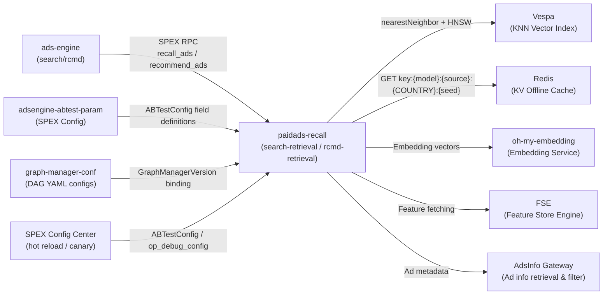

<!-- ads-workspace-gdoc-sync: gdoc_id=1aAscwSXMN5LHO6QKSxiIO7kDHJ1x4Bc4G0P4oaPPfJU gdoc_url=https://docs.google.com/document/d/1aAscwSXMN5LHO6QKSxiIO7kDHJ1x4Bc4G0P4oaPPfJU/edit -->

# paidads-recall

Paid Ads Recall service is a core downstream service of Shopee's ad system (ads-engine). It is responsible for recalling candidate ads from Vespa KNN vector indexes and Redis KV caches across different ad scenes, orchestrating recall queues via Graph Engine DAG execution.

Repository: https://git.garena.com/shopee/deep/paidads-recall

---

## Table of Contents

- [Introduction](#introduction)
- [Features](#features)
- [Architecture](#architecture)
  - [System Context](#system-context)
  - [Service Topology](#service-topology)
- [Directory Structure](#directory-structure)
- [Recall Queues](#recall-queues)
  - [KNN Vector Recall（KnnX2YOp）](#knn-vector-recallknnx2yop)
  - [KV Cache Recall（RedisX2YOp）](#kv-cache-recallredisx2yop)
  - [Scene and Type Mapping](#scene-and-type-mapping)
  - [DAG Configuration and Node Structure](#dag-configuration-and-node-structure)
  - [MergeRecallQueue Merging](#mergerecallqueue-merging)
  - [How to Add a New Recall Queue](#how-to-add-a-new-recall-queue)
- [APIs and Processing Flows](#apis-and-processing-flows)
  - [API Overview](#api-overview)
  - [Search Ads Recall（search_recall.yaml）](#search-ads-recallsearch_recallyaml)
  - [Recommendation Ads Recall（recommend_*.yaml）](#recommendation-ads-recallrecommend_yaml)
  - [Live Ads Recall（live_ads_recall.yaml）](#live-ads-recalllive_ads_recallyaml)
  - [Video Ads Recall（video_ads_recall.yaml）](#video-ads-recallvideo_ads_recallyaml)
  - [Shop Search Recall（shop_search_retrieval.yaml）](#shop-search-recallshop_search_retrievalyaml)
- [Development Guidelines](#development-guidelines)
  - [Code Style](#code-style)
  - [How to Add New Operators](#how-to-add-new-operators)
  - [Project Structure](#project-structure)
  - [Naming Conventions](#naming-conventions)
  - [Error Handling](#error-handling)
  - [Unit Testing Standards](#unit-testing-standards)
  - [Code Review & Git Workflow](#code-review--git-workflow)
- [Configuration](#configuration)
  - [graph-manager-conf DAG Files](#graph-manager-conf-dag-files)
  - [Makefile and GraphManagerVersion](#makefile-and-graphmanagerversion)
  - [AB Parameter Integration（ABTestConfig）](#ab-parameter-integrationabtestconfig)
  - [Op Cache Configuration](#op-cache-configuration)
  - [SPEX and spcli Setup](#spex-and-spcli-setup)
- [Deployment](#deployment)
  - [Build for Production](#build-for-production)
  - [Release Process](#release-process)
  - [Deployment Differences between search-retrieval and rcmd-retrieval](#deployment-differences-between-search-retrieval-and-rcmd-retrieval)
- [Monitoring](#monitoring)
- [Business Terminology Glossary](#business-terminology-glossary)
- [Additional Resources](#additional-resources)
- [Frequently Asked Questions](#frequently-asked-questions)

---

## Introduction

`paidads-recall` is the core service of Shopee's ad retrieval layer. In the ad serving request chain, it concurrently executes multiple recall queues from Vespa (vector database) and Redis (KV cache), organized by ad scene (search / recommendation / live / video / shop search) and recall direction (U2I / Q2I / I2I / U2U, etc.), and returns candidate ad results to ads-engine for downstream ranking and bidding.

**Key highlights:**

- DAG-based orchestration via Graph Engine; each recall scene corresponds to a DAG YAML file managed in the external `graph-manager-conf` repository;
- Two categories of recall operators: KNN vector recall (`KnnX2YOp`, backed by Vespa) and KV cache recall (`RedisX2YOp`, backed by Redis);
- A single binary supports multiple deployment modes differentiated by the `SPEX_SDU` environment variable (`search-retrieval` / `rcmd-retrieval` / `live-ads-retrieval` / `video-ads-retrieval` / `shop-ads-retrieval`);
- DAG configuration version is controlled by `GraphManagerVersion` in the Makefile (current: `recall_1.3.78`);
- AB experiment parameters (`ABTestConfig`) enable hot-reload of queue switches, models, and limits without service restart.

---

## Features

1. **Multi-scene Ad Recall**: Supports search ads (keyword search), recommendation ads (DD / YMAL / PP / Game), live ads, video ads, and shop search recall.
2. **KNN Vector Recall**: Uses Vespa HNSW approximate nearest neighbor algorithm, supporting U2I / Q2I / U2U / U2V / U2L / U2A / Q2S recall directions; Embeddings are provided by oh-my-embedding.
3. **KV Cache Recall**: Retrieves offline precomputed results from Redis; supports I2I / U2I / U2A / I2V / D2I directions; Redis key format: `{model}:{source}:{COUNTRY}:{seed_key}`.
4. **Graph Engine DAG Orchestration**: Recall DAGs per scene are maintained in external repo `graph-manager-conf`; `GraphManagerVersion` in Makefile pins the branch/tag.
5. **AB Experiment Hot Reload**: Each queue binds to an `ABTestConfig` field via `ab_param_key`; runtime JSON deserialization dynamically overrides `enable`, `result_global_limit`, `placements`, etc.
6. **Multi-level Caching**: In-process memory cache (`with_memory`) and Redis cache (`with_redis`) at Op level; Vespa query results also have a separate business-layer cache (`cache_read_mode`).
7. **Service Degradation**: Queue-level degradation (`downgrade_level`: L1/L2/L3/LM) triggered via UDS platform or AB param `RecallDowngradePlan`; on degradation, recall limits are proportionally reduced.
8. **op_debug_info**: Dynamically controlled via SPEX Config Center `op_debug_config` to expose per-node intermediate results for designated clients, enabling online verification.
9. **Anti-Fraud Rule Filter**: `RCMDAdsInfoFilterOp` in recommendation scenes applies anti-fraud rules carried in the request (`Request.GetAfRule()`) for DD/YMAL/PP/Game, filtering ads that don't match the whitelist/blacklist ID sets via `IsAntiFraudRuleMatch`.
10. **Brand Max Type Filter**: `IsBrandMaxAdsTypeMatch` in `RCMDAdsInfoFilterOp` ensures that only `BrandMaxTypeSingle` (type=0) brand max ads pass through; package-type brand max ads are rejected at the AdsInfo filter stage.

---

## Architecture

### System Context

```
ads-engine (search-retrieval / rcmd-retrieval)
    │
    │  SPEX RPC
    ▼
paidads-recall
    ├── Graph Engine (loads DAG config from graph-manager-conf)
    │       ├── KnnX2YOp ──→ Vespa KNN (Embeddings from oh-my-embedding)
    │       ├── RedisX2YOp ──→ Redis (offline precomputed KV)
    │       ├── FetchUserFeatureOp ──→ FSE (Feature Store Engine)
    │       ├── AdsInfoFilterOp ──→ AdsInfo Gateway (ad metadata filter)
    │       ├── SnakeMergeFilterOp (multi-queue merge & dedup)
    │       └── MergeRecallResultOp (final result aggregation)
    │
    └── adsengine-abtest-param (ABTestConfig field consumption)
```

### Service Topology



**Upstream callers:**

| Service | Protocol | Description |
|---------|----------|-------------|
| ads-engine | SPEX RPC | Primary caller; sends recall requests via search-retrieval (`deep.paidads.recall.search`) and rcmd-retrieval (`paidads.discoveryretrieval`); requests carry abt_param and entrance/scene info |
| adsengine-abtest-param | Config consumption (SPEX Config) | Provides ABTestConfig field definitions; new recall queues must register a corresponding field (ab_param_key) in this module; paidads-recall reads these fields at runtime |

**Downstream dependencies (middleware):**

| Dependency | Type | Description |
|------------|------|-------------|
| graph-manager-conf | config | Stores `retrieval/*.yaml` DAG configs (search_recall.yaml, recommend_dd.yaml, etc.); version pinned by `GraphManagerVersion` in Makefile (current: `recall_1.3.78`) |
| Vespa (KNN/HNSW) | datastore | KNN queue backend for KnnX2YOp; uses nearestNeighbor + HNSW; index name format: `{vespa_name}_{country_lower}0` |
| Redis (KV Recall) | datastore | KV queue backend for RedisX2YOp; key format: `{model}:{source}:{COUNTRY}:{seed_key}`; Op cache layer supports `with_redis` mode with `rw_mode` policy |
| oh-my-embedding | service | Provides query/user/item Embeddings for KNN queues; rank profile naming (`{scene}@embedding{version}`) is co-maintained by graph-manager-conf and oh-my-embedding |
| FSE (Feature Store Engine) | datastore | Some Ops (e.g., `FetchUserFeatureOp`) pull user/item features via FSE SDK, used as auxiliary embedding input for KNN queries |
| in-process Op cache | cache | Op-level in-process ttlcache (`with_memory + capacity`), usable with Redis in multi-level mode (`rw_mode` controls policy); `capacity=0` uses the service-level global memory cache |
| AdsInfo Gateway | service | Fetches ad metadata for recall results (`AdsInfoFilterOp`), filtering inactive ads, budget-exceeded ads, etc. |
| SPEX Config Center | config | Service-level config (Op switches, AB params, canary strategy, `op_debug_config`) pushed via SPEX with hot-reload support |

---

## Directory Structure

```
paidads-recall/
├── server/retrieval/          # Service entry (main.go, run.go); dispatches to service modes by SPEX_SDU
├── config/                    # Service-level config (RecallRetrieval, SpexConfig, VespaOption, RedisConfig, etc.)
├── domain/                    # Domain knowledge docs (KnnX2YOp_Manual.md, RedisX2YOp_Manual.md), generated by skill
├── pkg/
│   ├── retrieval/
│   │   ├── common_operator/   # Shared Ops (KnnX2YOp, RedisX2YOp, MergeRecallResultOp, SnakeMergeFilterOp, etc.)
│   │   ├── search/            # Search ads recall (Ops, resource, context for search_recall.yaml)
│   │   ├── recommend/         # Recommendation ads recall (DD/YMAL/PP/Game/Video, multiple DAG files)
│   │   ├── live_ads/          # Live ads recall (live_ads_recall.yaml)
│   │   ├── shop/              # Shop search recall (shop_search_retrieval.yaml)
│   │   │   ├── operator/brand_ads/     # VespaBrandAds: brand search ads Vespa recall (D2A)
│   │   │   └── operator/brand_max_ads/ # VespaBrandMax / FetchBrandMaxAdsOp / BrandmaxPostFilterOp: brand max ads
│   │   ├── ads_info/          # AdsInfo retrieval and filtering (separate impl for live/shop/video)
│   │   ├── vespa_service/     # Vespa client wrapper, KNN option building, result parsing
│   │   ├── downgrade/         # Degradation logic (IsDowngradeDisable, GetRecallLimitForRecall)
│   │   ├── queue_mapping/     # RecallSource ↔ QueueID mapping (new/old queue ID compatibility)
│   │   ├── config/            # Global dynamic config (timeout manager, graph engine config)
│   │   └── service/           # SPEX processor registration per scene, Snake Merge, recall result aggregation
│   ├── cache/                 # Op-level cache config (CacheConfig, CacheMode)
│   ├── cache_syncer/          # Redis cache read/write wrapper (RedisCacheV2, MemCache)
│   ├── graph_common/          # Graph Engine base types (BaseOperator, ReqCtx, Embedding)
│   ├── oh_my_embedding/       # oh-my-embedding client wrapper
│   ├── fse_service/           # FSE SDK wrapper (real-time user behavior features, item stats, etc.)
│   └── utils/                 # Utility functions, trace, RecallResult merge/sort/dedup
├── internal/abt/              # ABTestConfig parsing helper types (MtextParams, QueryTagParams, etc.)
├── tool/                      # Local debug tools (recall_cli, stress_test, rpc_cli, abtest_analysis_svc)
├── Makefile                   # Build entry; GraphManagerVersion controls DAG config version
└── go.mod                     # Go module declaration (module: git.garena.com/shopee/deep/paidads-recall)
```

---

## Recall Queues

### KNN Vector Recall（KnnX2YOp）

`KnnX2YOp` is the generic KNN vector recall operator (`pkg/retrieval/common_operator/knn_x2y_op.go`), performing approximate nearest neighbor search in Vespa HNSW indexes using Embedding vectors.

**Standard variants (registered in `knn_x2y_op.go:init()`):**

| Registered Name | AlgoType | Seed Type | Result Type |
|----------------|----------|-----------|-------------|
| `KnnU2IOp` | `AlgoTypeU2I` | User (int64) | Item |
| `KnnU2UOp` | `AlgoTypeU2U` | User (int64) | User |
| `KnnQ2IOp` | `AlgoTypeQ2I` | Query (string) | Item |

**Scene-specific variants (registered in respective package `init()`):**

| Registered Name | AlgoType | Seed | Result | Registration Location |
|----------------|----------|------|--------|-----------------------|
| `LiveKnnU2IOp` | `AlgoTypeU2A` | User | Ad (live item ads) | `live_ads/` |
| `KnnU2LOp` | `AlgoTypeU2L` | User | LiveStream | `live_ads/` |
| `KnnU2VOp` | `AlgoTypeU2V` | User | Video | `recommend/` |
| `KnnU2I2V` | `AlgoTypeU2A` | User | Video (Item as bridge) | `recommend/` |
| `KnnQ2SOp` | `AlgoTypeQ2S` | Query | Shop | `shop/` |
| `VespaBrandMaxRcmd` | `AlgoTypeD2S` | Default (empty) | Ad (recommend brand max, no seed) | `recommend/` |
| `VespaItemRcmd` | `AlgoTypeD2I` | Default (empty) | Item (recommend items from Vespa) | `recommend/` |
| `KnnItemU2I` | `AlgoTypeU2I` | User | Item (recommend KNN item via ads Vespa cluster) | `recommend/` |

**Core execution flow:**

```
IsAvailable (switch + degradation check)
    → RunWithCache (Op-level memory/Redis cache)
        → PreProcess (degradation limit + seed dedup)
            → Process (parallel processSingleSeed)
                → Parse model_param_key → Build KnnVespaOption
                → Fetch Embedding (from oh-my-embedding)
                → Vespa ANN query (nearestNeighbor + HNSW)
                → Pack results (PackResult + subversion injection)
```

### KV Cache Recall（RedisX2YOp）

`RedisX2YOp` retrieves offline precomputed recall results from Redis by seed batch (`pkg/retrieval/common_operator/redis_x2y_op.go`).

**Registered variants:**

| Registered Name | AlgoType | Seed | Result |
|----------------|----------|------|--------|
| `RedisI2IOp` | `AlgoTypeI2I` | Item (ItemID) | Item |
| `RedisU2IOp` | `AlgoTypeU2I` | User (UserID) | Item |
| `RedisU2UOp` | `AlgoTypeU2U` | User (UserID) | User |
| `RedisU2COp` | `AlgoTypeU2C` | User (UserID) | Category |
| `RedisQ2IOp` | `AlgoTypeQ2I` | Query (string) | Item |
| `RedisQ2QOp` | `AlgoTypeQ2Q` | Query (string) | Query |
| `RedisD2IOp` | `AlgoTypeD2I` | Empty (default queue) | Item |
| `RedisI2VOp` | `AlgoTypeI2V` | Item (ItemID) | Video |
| `RedisU2AOp` | `AlgoTypeU2A` | User (UserID) | Ad |

**Redis key format:**

```
{model}:{source}:{COUNTRY_UPPER}:{seed_unique_key}
```

Example: `model=stgy_i2i, source=unify, country=ID, itemID=123` → `stgy_i2i:unify:ID:123`.

**D2I special mechanism**: D2I uses an empty seed (UserID=1, Query=""), with `queue_name` as the key for random recall, using FetchModeBoth (check cache first, miss → query source + async refresh); other AlgoTypes use FetchModeCacheOnly (Redis only).

### Scene and Type Mapping

| Scene (Graph file) | KNN Ops used | Redis Ops used | Example node names |
|-------------------|--------------|----------------|--------------------|
| `search_recall.yaml` | `KnnQ2IOp`×4 | `RedisQ2IOp`×1 | `Q2I_KNN_611010104`, `Q2I_111030201` |
| `recommend_dd.yaml` | `KnnU2IOp`×7, `KnnU2UOp`×1 | `RedisI2IOp`×3, `RedisU2IOp`×1 | `U2I_KNN_623012108`, `U2I2I_622031201` |
| `recommend_ymal.yaml` | Same as DD | Same as DD | — |
| `recommend_pp.yaml` | Same as DD | Same as DD | — |
| `recommend_game.yaml` | `KnnU2IOp`×4, `KnnU2UOp`×1 | `RedisI2IOp`, `RedisU2IOp`, `RedisD2IOp` | `D2I_623932201` |
| `live_ads_recall.yaml` | `LiveKnnU2IOp`×1, `KnnU2LOp`×1 | `RedisI2IOp`×1, `RedisU2AOp`×1 | `U2I_KNN_653012101`, `Redis_U2A_653031202` |
| `video_ads_recall.yaml` | `KnnU2VOp`×3, `KnnU2I2V`×1 | `RedisI2IOp`×4+, `RedisI2VOp`×multi, `RedisU2COp`×1 | `U2V_MingTou_KNN_598770040`, `U2C_MingTou_70045` |
| `shop_search_retrieval.yaml` | `KnnQ2SOp`×1; `VespaBrandAds`×1; `VespaBrandMax`×1 | — | `Q2S_KNN_677010101`; `VespaBrandAds` (brand search ads, D2A, placement=`BRAND_SEARCH_ADS`); `VespaBrandMax` (brand max ads, D2A, pricing\_type=26); `FetchBrandMaxAdsOp`; `BrandmaxPostFilterOp` |

### DAG Configuration and Node Structure

Each recall node is configured in a YAML file of graph-manager-conf:

```yaml
- name: Q2I_KNN_611010104        # Node name (unique identifier, typically matches queue_name)
  op: KnnQ2IOp                    # Op type (registered name)
  allow_error: true               # Node failure does not abort the whole DAG
  args:
    queue_name: "611010104"       # Queue ID (used for monitoring, degradation matching)
    ab_param_key: knnRecallCfg611010104  # ABTestConfig field name
    model_param_key: knnRecallModelCfg   # Model version AB param field name
    vespa_name: sa_q2i_knn_recall        # Vespa cluster name
    rank_profile: v1                     # Vespa Rank Profile (overridable by model_param_key)
    enable: false                        # Queue switch (default false; enabled via AB experiment)
    result_global_limit: 1000            # Global recall size limit
    downgrade_level: L3                  # Degradation level (L1/L2/L3/LM)
    # Op-level cache
    key: '{{Country}}:{{Graph}}:{{Node}}:{{QueryAB}}:...'
    with_redis: true
    rw_mode: read_write
  inputs: [GetQueryUnderstanding:QueryUnderstand]
  outputs: [Result]
```

**Common `args` fields:**

| Field | Description |
|-------|-------------|
| `queue_name` | Queue ID, unique key for monitoring and degradation |
| `ab_param_key` | JSON field name in ABTestConfig; dynamic params override at runtime |
| `model_param_key` | ABTestConfig field controlling model version (format: `vespa_name@embeddingField`) |
| `enable` | Queue switch; when `false`, the entire Op is skipped |
| `result_global_limit` | Global recall size limit (dynamically reduced by degradation system) |
| `downgrade_level` | Degradation level: `L1` (light) / `L2` (medium, default) / `L3` (heavy) / `LM` (max) |
| `key` | Op-level cache key template (Go text/template; can use `{{Country}}`, `{{UserID}}`, etc.) |
| `with_memory` / `with_redis` | Enable in-process memory cache / Redis cache layer |
| `rw_mode` | Cache read/write policy: `read_write` / `read_only` / `write_only` |

### MergeRecallQueue Merging

`MergeRecallResultOp` (registered name: `MergeRecallResultOp`, `pkg/retrieval/common_operator/merge_queue_result_op.go`) is the DAG terminal aggregation node, merging all recall queue results into a `QueueCollection`:

- Iterates all inputs in parallel; splits each result by label (`utils.SplitByLabel`);
- Deduplicates per queue (`utils.DistinctRecallResult`) and applies `DefaultLimit` truncation (from `downgrade_option.DefaultLimit`);
- Outputs `QueueCollection` (`QueueList`); each `QueueRecord` contains `QueueName`, `QueueType`, `QueueTag` (format: `queueName.subversion`), and `AdsItems`.

**Important**: After adding a new queue node, its output node name **must be added** to the `inputs` list of `MergeRecallResultOp`, otherwise the results from that queue will not be included in the final output.

### How to Add a New Recall Queue

1. **Add a DAG node in graph-manager-conf**: In the relevant scene YAML (e.g., `search_recall.yaml`), add a node with `op`, `queue_name`, `ab_param_key`, `vespa_name` (KNN) or `model/source` (Redis), `result_global_limit`, `downgrade_level`, etc.
2. **Create an AB parameter field in adsengine-abtest-param**: Add the field corresponding to `ab_param_key` in `ABTestConfig` to control the queue switch and dynamic params; if using `model_param_key`, add the corresponding field as well.
3. **Update `GraphManagerVersion` in Makefile**: Set `GraphManagerVersion` to the branch or tag containing the DAG changes.
4. **Add the new node output to `MergeRecallResultOp` inputs** (for search scene) or the corresponding scene's aggregation node inputs.
5. **Test in RESP Lab**: Send test requests and verify new queue recall results via `op_debug_info`.

---

## APIs and Processing Flows

### API Overview

paidads-recall exposes the following SPEX RPC commands:

| SPEX Command | Service Mode (SPEX_SDU) | Scene |
|---|---|---|
| `paidads.retrieval.product_ads.recall_ads` | `deep.paidads.recall.search` | Search ad recall |
| `paidads.retrieval.product_ads.recommend_ads` | `paidads.discoveryretrieval` | Recommendation ad recall (DD/YMAL/PP/Game) |
| `paidads.retrieval.live_ads.recall_ads` | `retrieval.liveads` | Live ad recall |
| `paidads.retrieval.video_ads.recall_ads` | `retrieval.videoads` | Video ad recall |
| `paidads.retrieval.shop_ads.recall_ads` | `shopads.retrieval` | Shop search recall |

Request/Response Proto: `git.garena.com/shopee/deep/searchads/common-proto/paidads_search_ads_retrieval.pb` (`RecallRequestV2` / `RecallResponseV2`).

### Search Ads Recall（search_recall.yaml）

Entry: `service.SearchServe` → `RetrievalServer.SPSRecallAds` → Graph Engine runs `search_recall.yaml` DAG.

Key node types:
- `GetRequestQueryOp`: Extracts query seed from request;
- `GetQueryUnderstandingOp`: Fetches query understanding (rewrite terms, expansion terms, etc.);
- `KnnQ2IOp` (×4): Q2I KNN vector recall (`Q2I_KNN_611010104`, etc.);
- `RedisQ2IOp` (×1): Q2I Redis cache recall (`Q2I_111030201`, compatible with legacy `fetcher_version: v1`);
- `QT2IOp`: Query-Type-to-Item Vespa keyword text-match recall; for each query in Q2Q results (labeled raw/rewrite/extend), executes parallel cross-field text matching (token + phrase + broad_match) in Vespa; supports `placements`/`pricing_types` filtering and `item_tag_boosts`; unlike KnnQ2IOp, does not use Embedding vectors — relies on Vespa inverted index. Extended config fields: `query_type_to_seed_limit` (max seeds per query type), `query_type_to_hit_limit_v2` (v2 per-type limit), `ad_tag_mask`, `broad_match_tag_field`/`broad_match_phrase_field`, `sorting`, `match_phase`; supports routing to `paidads_item` Vespa index when `vespa_name=paidads_item` (uses ads-cluster client instead of default search-cluster);
- `RecallKeywordItemMatchV2Op`: keyword item match operator; active when `EnableKeywordMatch=true && EnableKwItemMatchRecallMigration=false`; when `EnableKwItemMatchRecallMigration=true`, this op is skipped and the DAG-based `VespaSearchKeywordItem` operator takes over;
- `VespaSearchKeywordItem`: DAG-based keyword item recall operator (migration target, registered in `keyword_item_vespa_op.go`); active when `EnableKwItemMatchRecallMigration=true`; implements `CanRun` to gate on the AB flag; uses `CommonVespaOp[searchVespaCustomParam]` with limit controlled by `RecallKwItemRecallLimit`/`RecallKwItemRecallLimitV2`;
- `ImageAdsInfoFilterAndSnakeMergeOp`: Image search AdsInfo filter + Zigzag Snake Merge node; filters by `source` (roi1/roi2) via placement/pricing_type, includes censoring and whitelist filtering, then applies Snake Merge;
- Search-specific Ops (`RecallKeywordMatchOp`, `RecallQ2IRedisOp`, `RecallFseQ2IOp`, etc.);
- `SnakeMergeFilterOp`: Multi-queue merge and filter;
- `AdsInfoFilterOp`: Fetches AdsInfo, filters inactive ads;
- `MergeRecallResultOp`: Aggregates all queue results.

### Recommendation Ads Recall（recommend_*.yaml）

Entry: `service.RcmdServe` → `RetrievalServer.SPSRcmdAds` (serviceMark empty) → Graph Engine runs DD/YMAL/PP/Game DAG.

DAG file to scene mapping:
- `recommend_dd.yaml`: Daily Discover ads;
- `recommend_ymal.yaml`: You May Also Like (same DAG structure);
- `recommend_pp.yaml`: Product Page ads;
- `recommend_game.yaml`: Game scene ads (additionally includes D2I default queue).

Key nodes: `FetchUserFeatureOp` (pulls user features and Embeddings via FSE) → `KnnU2IOp`×7 / `KnnU2UOp` / `RedisI2IOp`×3 / `RedisU2IOp` → `MergeRecallResultOp`. Additional operators registered in `recommend/operator/`:
- `VespaBrandMaxRcmd` (AlgoType D2S, default queue, no seed): Vespa recall for brand max recommendation ads; uses ads Vespa cluster with `RcmdItemVespaCustomParam` supporting `Placements` and `PricingType` filters;
- `VespaItemRcmd` (AlgoType D2I, default queue, no seed): Vespa recall for recommend items from `paidads_item` index;
- `KnnItemU2I` (AlgoType U2I): KNN user→item recall via the ads Vespa cluster (distinct from the standard search-cluster `KnnU2IOp`).

Filter pipeline: `RCMDAdsInfoFilterOp` (registered as `"RCMDAdsInfoFilterOp"`) includes new filters: `IsBrandMaxAdsTypeMatch` (rejects package-type brand max ads, only `BrandMaxTypeSingle=0` passes) and `IsAntiFraudRuleMatch` (applies `Request.GetAfRule()` whitelist/blacklist for DD/YMAL/PP/Game scenes).

### Live Ads Recall（live_ads_recall.yaml）

Entry: `service.LiveAdsServe` → `live_ads_recall.yaml` DAG.

Key nodes:
- `LiveKnnU2IOp` (U2A, live item ad KNN recall);
- `KnnU2LOp` (U2L, live session KNN recall);
- `Redis_I2I_653031201` (RedisI2IOp, I2I cache recall);
- `Redis_U2A_653031202` (RedisU2AOp, U2A user→ad cache recall, includes `redis_mark: union`).

### Video Ads Recall（video_ads_recall.yaml）

Entry: `service.RcmdServe` (serviceMark="video") → `video_ads_recall.yaml` DAG.

Key nodes: `KnnU2VOp` (U2V KNN), `KnnU2I2V` (U2I2V, using Item as bridge), `RedisI2IOp` (I2I), `RedisI2VOp` (I2V), `RedisU2COp` (U2C, User→Category for "targeted" scene).

### Shop Search Recall（shop_search_retrieval.yaml）

Entry: `service.ShopServe` → `shop_search_retrieval.yaml` DAG (initialized via `shopConfig.InitShopRetrievalConfig()`).

Key nodes:
- `KnnQ2SOp` (Q2S, Query→Shop KNN recall, node `Q2S_KNN_677010101`);
- `VespaBrandAds` (D2A, brand search ads Vespa keyword recall; matches Vespa `keyword_field` using the search query; default placement=`BRAND_SEARCH_ADS`, `PricingTypeSearchBrandAds=23`);
- `VespaBrandMax` (D2A, brand max ads Vespa recall; filters by `pricing_type=26` (`CONSIDERATION_BRAND_ADS`), no seed required);
- `FetchBrandMaxAdsOp` (fetches brand max ads metadata from AdsInfo Gateway by placement `BRAND_MAX_ADS` or pricing_type; mode controlled by AB param `EnableRetrievalUsePricingType`);
- `BrandmaxPostFilterOp` (post-filter for brand max ads; retains only ads with CPM > 0 for the current day and writes `DailyInfo` into recall results);
- `VespaI2S` (AlgoType I2S): Item→Shop Vespa recall; uses item-index Vespa cluster;
- `VespaQ2S` (AlgoType Q2S): Query→Shop Vespa recall; uses shop-index Vespa cluster (distinct from `KnnQ2SOp` which is KNN-based);
- `VespaS2I` (AlgoType S2S): Shop→Item Vespa recall (recalls items given a shop seed, comment: "recall item by shop_id"); uses item-index Vespa cluster;
- `VespaQT2S` (AlgoType QT2S): QueryType→Shop Vespa recall; uses item-index Vespa cluster with per-query-type seed limits;
- `shop_game_retrieval.yaml` (shop game scene, uses `RedisI2IOp`).

---

## Development Guidelines

### Code Style

- Use standard Go toolchain (`go vet`, `gofmt`);
- CI pipeline runs `make ci` (includes `make vet` and `make ci-fmt`);
- Unit tests run via `make unittest`: `go test ./pkg/...`.

### How to Add New Operators

1. Create an Op file under `pkg/retrieval/common_operator/` (shared) or the relevant scene directory (`search/`, `recommend/`, etc.);
2. Implement the `graph_engine.IOperator` interface (typically embedding `BaseOperator` or `BaseRecallOp`);
3. In `init()`, call `graph_engine.RegisterOpBuilder("OpName", NewOpFunc)` to register;
4. Ensure the Op package is imported (via blank import `_`) in `server/retrieval/main.go` or the relevant scene entry;
5. Add the node configuration in the corresponding scene DAG YAML in graph-manager-conf.

### Project Structure

- Organized by scene: `search/`, `recommend/`, `live_ads/`, `shop/` (each scene has its own resource, handler, and context);
- Shared logic goes in `pkg/retrieval/common_operator/` (shared Ops) and `pkg/graph_common/` (base types);
- External client wrappers go in `pkg/` (`oh_my_embedding/`, `fse_service/`, `featureserver/`, etc.).

### Naming Conventions

- Op registered name: `{SceneAbbrev}{VectorOrCache}{Direction}Op` (e.g., `KnnU2IOp`, `RedisI2IOp`);
- Queue node name in DAG: `{Direction}_{KNN/Redis}_{queueID}` or `{Direction}_{queueID}` (e.g., `U2I_KNN_623012108`, `U2I2I_622031201`);
- Queue ID (`queue_name`): 6–9 digit number (e.g., `611010104`), primary key for recall result label and monitoring;
- `subversion`: KNN extracts from `RequiredOutput`; Redis sets via the `sub_version` config field.

### Error Handling

- All recall nodes set `allow_error: true`; a single queue failure does not abort the overall DAG;
- Critical errors (vespaClient not initialized, empty rank_profile/vespa_name, etc.) return an error, which Graph Engine logs and skips the node;
- Degradation level is validated at Op initialization (`downgrade.CheckDowngradeLevel`); invalid values cause service startup failure.

### Unit Testing Standards

- Test files end with `_test.go`, co-located with the file under test;
- Run command: `make unittest` (executes `go test ./pkg/... -v`);
- Key test locations: under `pkg/retrieval/common_operator/` for Op tests, under `pkg/retrieval/search/` for search scene tests.

### Code Review & Git Workflow

- Cut development branches from `master`; submit GitLab MR for Code Review when done;
- Run `make ci` locally before submitting to ensure `vet` and `fmt` pass;
- `GraphManagerVersion` changes require an explanation of DAG changes and RESP Lab test screenshots.

---

## Configuration

### graph-manager-conf DAG Files

DAG config files are stored in the `retrieval/` directory of `git.garena.com/shopee/deep/searchads/graph-manager-conf`:

| File | Scene |
|------|-------|
| `search_recall.yaml` | Search ad recall |
| `recommend_dd.yaml` | Daily Discover recommendation ads |
| `recommend_ymal.yaml` | You May Also Like recommendation ads |
| `recommend_pp.yaml` | Product Page recommendation ads |
| `recommend_game.yaml` | Game scene recommendation ads |
| `live_ads_recall.yaml` | Live ad recall |
| `video_ads_recall.yaml` | Video ad recall |
| `shop_search_retrieval.yaml` | Shop search recall |
| `shop_game_retrieval.yaml` | Shop game recall |

Supported `args` fields per node type are described in the [Recall Queues](#recall-queues) section.

### Makefile and GraphManagerVersion

`GraphManagerVersion` in the Makefile pins the branch or tag of graph-manager-conf, cloned automatically during `make vet`:

```makefile
GraphManagerVersion := recall_1.3.78

vet:
    go vet -mod=mod ./...
    rm -rf graph-manager-conf
    git clone https://git.garena.com/shopee/deep/searchads/graph-manager-conf.git -b $(GraphManagerVersion) --depth 1
```

Steps to update DAG configs:
1. Commit DAG changes in graph-manager-conf and create a new tag (e.g., `recall_1.3.77`);
2. Update `GraphManagerVersion := recall_1.3.77` in this repo's Makefile;
3. Run `make vet` to validate the config loads correctly;
4. Submit MR and notify relevant services to publish.

### AB Parameter Integration（ABTestConfig）

Each recall queue binds to an `ABTestConfig` field (from `adsengine-abtest-param`) via `ab_param_key`. The field value is a JSON string deserialized at runtime to override dynamic queue params (`enable`, `result_global_limit`, `placements`, etc.).

When adding a new queue, the corresponding field must be added to the `ABTestConfig` struct in the `adsengine-abtest-param` repo, with the field name matching the `ab_param_key` in the DAG YAML.

`model_param_key` field value format (recommended `@` format):

```
# Format: vespa_name@embeddingField
dd_u2i_knn_recall@embeddingclusterv2

# Meaning:
# - RequiredOutput = "dd_u2i_knn_recall@embeddingclusterv2"
# - VespaName = "dd_u2i_knn_recall"
# - RankProfile = "clusterv2"
# - ClusterField = "clusterv2" (when starts with "cluster")
```

### Op Cache Configuration

Op-level cache (Graph Engine layer) is configured alongside queue params under `args` in the DAG YAML:

```yaml
args:
  queue_name: "623012102"
  enable: true
  result_global_limit: 200
  # Op-level cache
  key: "{{Country}}_{{UserID}}_{{Graph}}"  # cache only active when non-empty
  with_memory: true                         # enable in-process ttlcache
  with_redis: false                         # enable Redis cache layer
  rw_mode: read_write                       # read_write / read_only / write_only
  # capacity: 0                             # 0 = use service-level global memory cache
```

Available key template variables: `{{Country}}`, `{{UserID}}`, `{{Query}}`, `{{Graph}}`, `{{Node}}`, `{{EntranceGroup}}`, `{{AB "fieldName" "jsonPath"}}`, `{{QueryAB}}`, etc.

Cache activation conditions: `key` non-empty **AND** (`with_memory` or `with_redis`) is true **AND** `rw_mode` non-empty (not `no_cache`) **AND** AB param `RetrievalCacheRule` for the node has `enable=true` and `ttl_seconds > 0`.

### SPEX and spcli Setup

paidads-recall uses SPEX for service registration, config distribution, and RPC.

**spcli installation**: Refer to [spcli Installation Guide](https://spex.shopee.io/user-guide/SDK/Java/local.html) (requires Git configuration for `garena` source).

**SPEX config initialization** (`config.InitSpex`, `server/retrieval/run.go`):

```go
spexConfig := &config.SpexConfig{
    Env:        os.Getenv("ENV"),           // live / uat / stable
    ServerName: os.Getenv("SPEX_SDU"),      // service deployment mode
    ConfigKey:  os.Getenv("SPEX_CONFIG_KEY"),
    Region:     "global",
    Tag:        "master",
    Deployment: "default",
}
```

At startup, the service pulls `ABTestConfig` (containing all queue AB params) from SPEX Config Center and subscribes to hot-reload updates. For local development, the SPEX SDK provides a mock mechanism to bypass Config Center.

---

## Deployment

### Build for Production

```bash
# Build the recall service binary (Linux)
make retrieval-svc

# Output: bin/paidads_retrieval_server.linux
```

Build-time version info (`Version`, `Commit`, `Branch`, `Builder`, `Built`) is injected into the binary and queryable via the HTTP metrics endpoint.

Optional: Use the Green Tea GC build (`make retrieval-svc-greentea`) for improved memory management.

### Release Process

1. **Merge code**: Merge feature branch to `master` via GitLab MR;
2. **Update GraphManagerVersion** (if DAG changes are involved);
3. **RESP Lab testing**: Validate new queues/features in RESP Lab; verify recall results via `op_debug_info`;
4. **SPEX canary release**: Use the SPEX release platform to progressively roll out by country and service;
5. **Monitor**: After release, observe the Retrieval L1 SRE dashboard (see [Monitoring](#monitoring)) to confirm QPS, latency, error rate, and per-queue recall volume are normal before continuing rollout.

### Deployment Differences between search-retrieval and rcmd-retrieval

| Dimension | search-retrieval | rcmd-retrieval |
|-----------|-----------------|----------------|
| SPEX_SDU | `deep.paidads.recall.search` | `paidads.discoveryretrieval` |
| SPEX Command | `paidads.retrieval.product_ads.recall_ads` | `paidads.retrieval.product_ads.recommend_ads` |
| DAG files | `search_recall.yaml` | `recommend_dd.yaml` / `recommend_ymal.yaml`, etc. |
| Key Ops | `KnnQ2IOp`, `RedisQ2IOp`, search-specific Ops | `KnnU2IOp`, `KnnU2UOp`, `RedisI2IOp`, `RedisU2IOp` |
| Vespa cluster | `sa_q2i_knn_recall` (search Q2I), etc. | `dd_u2i_knn_recall` (recommendation U2I), etc. |
| RESP Lab service name | paidads-search-retrieval | paidads-rcmd-retrieval |

Video ads (`retrieval.videoads`) and live ads (`retrieval.liveads`) are also independent deployment modes differentiated by `SPEX_SDU`.

---

## Monitoring

**Core monitoring dashboard** (Retrieval L1 SRE):
[https://monitoring.infra.sz.shopee.io/grafana/d/HYPABS9Nk/retrieval-l1-sre?orgId=39](https://monitoring.infra.sz.shopee.io/grafana/d/HYPABS9Nk/retrieval-l1-sre?orgId=39)

**Key panels and alerts:**

| Panel | Monitoring Link | Alert Rule |
|-------|-----------------|-----------|
| Retrieval latency | [Link](https://monitoring.infra.sz.shopee.io/grafana/d/HYPABS9Nk/retrieval-l1-sre?orgId=39&viewPanel=2) | By country, search/rcmd: 1d/3d/7d diff > 30%; latency > 130ms |
| Feature server error rate | [Link](https://monitoring.infra.sz.shopee.io/grafana/d/HYPABS9Nk/retrieval-l1-sre?orgId=39&viewPanel=28) | By country, search/rcmd: 1% error rate |
| Feature server latency | [Link](https://monitoring.infra.sz.shopee.io/grafana/d/HYPABS9Nk/retrieval-l1-sre?orgId=39&viewPanel=30) | No alert required |
| Adsinfo full data ads avg size | [Link](https://monitoring.infra.sz.shopee.io/grafana/d/HYPABS9Nk/retrieval-l1-sre?orgId=39&viewPanel=26) | By country, search/rcmd: 1d/3d/7d diff > 30% |

**Recall funnel dashboard** (per-queue recall volume):
[https://monitoring.infra.sz.shopee.io/grafana/d/3sprlRpNk1/ads-recall-funnel](https://monitoring.infra.sz.shopee.io/grafana/d/3sprlRpNk1/ads-recall-funnel)

**Key filter dimensions**: `country`, `service` (search/rcmd), `env` (live/uat).

**Key L2 self-monitoring metrics**:
- Per-stage average ad size (After Recall / After Fetch Ads Info / After Relevance / After Filter Inactive / After Reserve);
- Per-queue recall volume (exclusive recall rate, recall share);
- Vespa query result cache update error rate (10% error rate alert);
- OhMyEmb online error rate (from oh-my-embedding service);
- Retrieval Panic Count (alert on > 0, `Graph Panic Count Alert`).

**Goroutine leak monitoring**: When goroutine count exceeds 30K (normal baseline ~13K), investigate immediately.

---

## Business Terminology Glossary

| Term | Description |
|------|-------------|
| Graph Engine | Recall DAG orchestration engine; executes Op nodes in topological order, supporting parallelism and conditional branching |
| graph-manager-conf | External repo storing per-scene recall DAG YAML configs; version pinned by `GraphManagerVersion` |
| GraphManagerVersion | Makefile variable (current: `recall_1.3.78`) specifying graph-manager-conf branch/tag |
| KnnX2YOp | Generic KNN vector recall operator; calls Vespa nearestNeighbor; X = Seed type, Y = Result type |
| KnnU2IOp | KNN User→Item vector recall (AlgoTypeU2I) |
| KnnQ2IOp | KNN Query→Item vector recall (AlgoTypeQ2I) |
| KnnU2UOp | KNN User→User vector recall (AlgoTypeU2U) |
| RedisX2YOp | Generic KV cache recall operator; reads offline precomputed results from Redis |
| RedisI2IOp | Redis Item→Item cache recall (AlgoTypeI2I) |
| RedisU2IOp | Redis User→Item cache recall (AlgoTypeU2I) |
| RedisD2IOp | Redis Default→Item random default queue, no seed required |
| MergeRecallQueue | DAG terminal aggregation node (`MergeRecallResultOp`); merges multi-queue results into `QueueCollection` |
| AlgoType | Enum identifying recall direction (U2I / Q2I / I2I / U2U / U2A / U2V / U2L / I2V / Q2S / D2I, etc.) |
| op_debug_info | SPEX Config Center dynamic config controlling per-node intermediate result exposure for designated clients, for online verification |
| search-retrieval | Search ad recall service mode (SPEX_SDU: `deep.paidads.recall.search`) |
| rcmd-retrieval | Recommendation ad recall service mode (SPEX_SDU: `paidads.discoveryretrieval`) |
| QT2IOp | Query-Type-to-Item Vespa keyword text-match recall operator; for each Q2Q query result (raw/rewrite/extend), queries Vespa cross-field index in parallel without Embedding |
| VespaBrandAds | Brand search ads Vespa recall operator (AlgoType D2A); matches Vespa by query keyword; placement=BRAND\_SEARCH\_ADS (PricingType=23) |
| VespaBrandMax | Brand max ads Vespa recall operator (AlgoType D2A); filters pricing\_type=26 (CONSIDERATION\_BRAND\_ADS), no seed required |
| FetchBrandMaxAdsOp | Op that fetches brand max ads metadata from AdsInfo Gateway; supports switching between placement and pricing_type mode via AB param |
| BrandmaxPostFilterOp | Brand max ads post-filter Op; retains ads with CPM > 0 for the current day; writes DailyInfo into recall results |
| ImageAdsInfoFilterAndSnakeMergeOp | Image search AdsInfo filter + Zigzag Snake Merge node; filters by source (roi1/roi2) via placement/pricing\_type |
| VespaBrandMaxRcmd | Recommend brand max ads Vespa recall operator (AlgoType D2S, default queue, no seed); uses ads Vespa cluster; registered in `recommend/operator/rcmd_paidads_item_vespa_op.go` |
| VespaItemRcmd | Recommend items Vespa recall operator (AlgoType D2I, default queue, no seed); recalls from `paidads_item` index; registered in `recommend/operator/rcmd_paidads_item_vespa_op.go` |
| KnnItemU2I | Recommend KNN User→Item recall via ads Vespa cluster (AlgoType U2I); distinct from search-cluster KnnU2IOp; registered in `recommend/operator/rcmd_paidads_item_vespa_op.go` |
| VespaSearchKeywordItem | DAG-based keyword item recall operator (AlgoType search); migration target replacing RecallKeywordItemMatchV2Op; gates on `EnableKwItemMatchRecallMigration=true`; registered in `search/keyword_item_vespa_op.go` |
| IsAntiFraudRuleMatch | Filter function in `ads_filter` package; applies anti-fraud rule (whitelist/blacklist of ad IDs) from `Request.GetAfRule()` for DD/YMAL/PP/Game recommend scenes |
| IsBrandMaxAdsTypeMatch | Filter function in `ads_filter` package; only allows `BrandMaxTypeSingle=0` brand max ads; rejects package-type brand max ads (type=1) at AdsInfo filter stage |
| VespaI2S | Shop Item→Shop Vespa recall operator (AlgoType I2S); uses item-index Vespa cluster; registered in `shop/operator/shop_ads/shop_vespa_op.go` |
| VespaQ2S | Shop Query→Shop Vespa recall operator (AlgoType Q2S); uses shop-index Vespa cluster; registered in `shop/operator/shop_ads/shop_vespa_op.go` |
| VespaS2I | Shop Shop→Item Vespa recall operator (AlgoType S2S); recalls items by shop_id seed; uses item-index Vespa cluster; registered in `shop/operator/shop_ads/shop_vespa_op.go` |
| VespaQT2S | Shop QueryType→Shop Vespa recall operator (AlgoType QT2S); per-query-type seed limit support; uses item-index Vespa cluster; registered in `shop/operator/shop_ads/shop_vespa_op.go` |
| CONSIDERATION\_BRAND\_ADS | AdsPricingType=26; Brand Max Ads pricing type |
| eCPM | Effective Cost Per Mille; the core metric for ad ranking |
| DD | Daily Discover; recommendation ad scene |
| YMAL | You May Also Like; recommendation ad scene |
| PP | Product Page; product detail page ad scene |
| CTR | Click-Through Rate |
| CVR | Conversion Rate |
| ROI | Return on Investment (Ad GMV / Ad Spend) |

---

## Additional Resources

- **Repository**: https://git.garena.com/shopee/deep/paidads-recall
- **graph-manager-conf (DAG config repo)**: https://git.garena.com/shopee/deep/searchads/graph-manager-conf
- **adsengine-abtest-param (AB parameter definitions)**: `git.garena.com/shopee/deep/adsengine-abtest-param`
- **Retrieval L1 SRE Dashboard**: https://monitoring.infra.sz.shopee.io/grafana/d/HYPABS9Nk/retrieval-l1-sre?orgId=39
- **Recall Funnel Dashboard**: https://monitoring.infra.sz.shopee.io/grafana/d/3sprlRpNk1/ads-recall-funnel
- **Paid Ads Business Glossary (Confluence)**: https://confluence.shopee.io/pages/viewpage.action?spaceKey=SPAD&title=Paid+Ads+Glossary
- **Ads Monitor & Alert Doc**: https://docs.google.com/document/d/1EMoDFFIl6ZbOSkLzBMui5OtE4-vHH2ApUB_K6eldKu0
- **SPEX Go SDK Quick Start**: https://spex.shopee.io/overview/quick-start/languages/go/index.html
- **spcli Installation Guide**: https://spex.shopee.io/user-guide/SDK/Java/local.html
- **Domain Knowledge (KnnX2YOp)**: `domain/KnnX2YOp/KnnX2YOp_Manual.md`
- **Domain Knowledge (RedisX2YOp)**: `domain/RedisX2YOp/RedisX2YOp_Manual.md`

---

## Frequently Asked Questions

**Q1: How do I add a new recall queue?**

End-to-end steps: ① Add a node in `graph-manager-conf/retrieval/*.yaml` (configure `op`, `queue_name`, `ab_param_key`, limits, degradation level) → ② Add the corresponding field in `ABTestConfig` in `adsengine-abtest-param` → ③ Update `GraphManagerVersion` in Makefile → ④ Add node output to `MergeRecallResultOp` inputs → ⑤ Verify in RESP Lab → ⑥ Canary release.

**Q2: How do I update GraphManagerVersion?**

Change `GraphManagerVersion := <new-tag>` (current: `recall_1.3.78`) in the Makefile, run `make vet` to validate, then submit MR and redeploy the service to apply the change.

**Q3: What is the relationship between AB parameters and the queue switch?**

Each queue binds to an `ABTestConfig` field via `ab_param_key`. The field value is a JSON string; `"enable": true/false` controls whether the queue runs. The default in the DAG YAML is `enable: false`; set the field to `{"enable": true, ...}` in the AB experiment to activate the queue.

**Q4: When should I choose KNN vs Redis recall?**

- **KNN (KnnX2YOp)**: For scenes requiring real-time embedding vector matching; more up-to-date results; depends on oh-my-embedding for vectors; higher latency (Vespa query ~20–100ms).
- **Redis (RedisX2YOp)**: For stable offline precomputed recall; data is written by offline pipelines; very low query latency (<5ms); but results have a delay (offline update cycle).

**Q5: How do I verify a new queue is working (op_debug_info)?**

Add the test client to the whitelist via SPEX Config Center `op_debug_config`. After sending requests, the response will include per-node intermediate results (including recall count and result IDs). In RESP Lab, you can also check `./log/metrics_latest1.log` for Prometheus metrics.

**Q6: What should I do when goroutine leaks occur?**

When goroutine count exceeds 30K (normal baseline ~13K), immediately check pprof (HTTP metrics port `19002`, path `/debug/pprof/goroutine`) to locate the leak; typically caused by context not being canceled or channel blocking.

**Q7: How are search-retrieval and rcmd-retrieval released separately?**

Both share the same binary (`paidads_retrieval_server.linux`), differentiated by `SPEX_SDU`: `deep.paidads.recall.search` starts the search ad recall service, `paidads.discoveryretrieval` starts the recommendation ad recall service. Release independently on the SPEX release platform by selecting the corresponding SDU.

**Q8: How does the degradation system work?**

The UDS platform or AB param `RecallDowngradePlan` pushes the current active degradation level (L1/L2/L3/LM). Each queue configures `downgrade_level` (default L2); when active level ≥ queue level, the queue is disabled (`IsDowngradeDisable = true`). For queues not disabled, `result_global_limit` is proportionally reduced by the degradation system.

**Q9: How do graph-manager-conf changes take effect without restarting the service?**

Hot-reload of DAG configs is currently not supported — the DAG is cloned from graph-manager-conf and loaded at service startup. Config changes require a rebuild and redeployment. AB parameters (`ABTestConfig`) for queue switches and model params support hot-reload via SPEX Config Center without restart.

**Q10: What does `redis_mark` in Redis Ops do?**

`redis_mark` (yaml: `redis_mark`) is a temporary flag during Redis cluster migration. In `RedisCacheV2.getClient`, it takes priority in matching the corresponding client, used to redirect specific queue traffic to a new Redis cluster. It should be removed from the DAG config once migration is complete.

---

<!-- Generated by ads-workspace/skills/ads-readme-generate | checked: 98a90acff77a0aee44989d87df032293ad65a706 | spec: 76fce5f679f9550b -->
