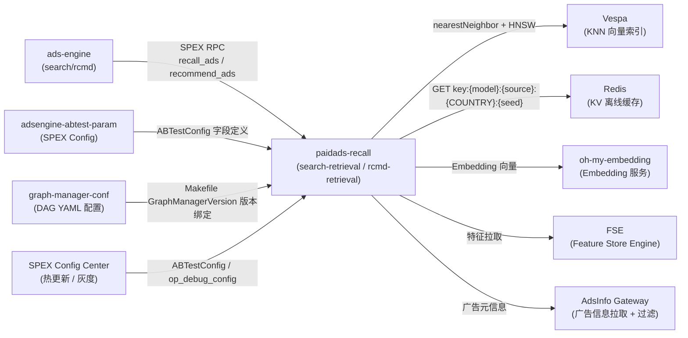

<!-- ads-workspace-gdoc-sync: gdoc_id=1f--j4E5QkgwPT5joeW5Lo0HZLWBZ5dApw752vmh5uuw gdoc_url=https://docs.google.com/document/d/1f--j4E5QkgwPT5joeW5Lo0HZLWBZ5dApw752vmh5uuw/edit -->

# paidads-recall

广告召回服务（Paid Ads Recall），是 Shopee 广告系统（ads-engine）的核心下游服务，负责从 Vespa KNN 向量索引和 Redis KV 缓存中，按场景召回候选广告，并通过 Graph Engine 编排 DAG 执行各类召回队列。

仓库地址：https://git.garena.com/shopee/deep/paidads-recall

---

## 目录 / Table of Contents

- [项目概述 / Introduction](#项目概述--introduction)
- [核心功能 / Features](#核心功能--features)
- [项目架构 / Architecture](#项目架构--architecture)
  - [系统上下文 / System Context](#系统上下文--system-context)
  - [上下游及依赖调用拓扑 / Service Topology](#上下游及依赖调用拓扑--service-topology)
- [目录结构 / Directory Structure](#目录结构--directory-structure)
- [召回队列 / Recall Queues](#召回队列--recall-queues)
  - [KNN 向量召回 / KNN Vector Recall（KnnX2YOp）](#knn-向量召回--knn-vector-recallknnx2yop)
  - [KV 缓存召回 / KV Cache Recall（RedisX2YOp）](#kv-缓存召回--kv-cache-recallredisx2yop)
  - [场景与类型映射 / Scene and Type Mapping](#场景与类型映射--scene-and-type-mapping)
  - [DAG 配置与节点结构 / DAG Configuration and Node Structure](#dag-配置与节点结构--dag-configuration-and-node-structure)
  - [MergeRecallQueue 合并逻辑 / MergeRecallQueue Merging](#mergerecallqueue-合并逻辑--mergerecallqueue-merging)
  - [新增队列完整流程 / How to Add a New Recall Queue](#新增队列完整流程--how-to-add-a-new-recall-queue)
- [API 与处理流程 / APIs and Processing Flows](#api-与处理流程--apis-and-processing-flows)
  - [API 总览 / API Overview](#api-总览--api-overview)
  - [搜索广告召回 / Search Ads Recall（search_recall.yaml）](#搜索广告召回--search-ads-recallsearch_recallyaml)
  - [推荐广告召回 / Recommendation Ads Recall（recommend_*.yaml）](#推荐广告召回--recommendation-ads-recallrecommend_yaml)
  - [直播广告召回 / Live Ads Recall（live_ads_recall.yaml）](#直播广告召回--live-ads-recalllive_ads_recallyaml)
  - [视频广告召回 / Video Ads Recall（video_ads_recall.yaml）](#视频广告召回--video-ads-recallvideo_ads_recallyaml)
  - [店铺搜索召回 / Shop Search Recall（shop_search_retrieval.yaml）](#店铺搜索召回--shop-search-recallshop_search_retrievalyaml)
- [开发规范 / Development Guidelines](#开发规范--development-guidelines)
  - [代码风格 / Code Style](#代码风格--code-style)
  - [新增 Operator / How to Add New Operators](#新增-operator--how-to-add-new-operators)
  - [项目结构 / Project Structure](#项目结构--project-structure)
  - [命名规范 / Naming Conventions](#命名规范--naming-conventions)
  - [错误处理 / Error Handling](#错误处理--error-handling)
  - [单元测试 / Unit Testing Standards](#单元测试--unit-testing-standards)
  - [Code Review & Git Workflow](#code-review--git-workflow)
- [配置说明 / Configuration](#配置说明--configuration)
  - [graph-manager-conf DAG 文件 / graph-manager-conf DAG Files](#graph-manager-conf-dag-文件--graph-manager-conf-dag-files)
  - [Makefile 与 GraphManagerVersion](#makefile-与-graphmanagerversion)
  - [AB 参数集成 / AB Parameter Integration（ABTestConfig）](#ab-参数集成--ab-parameter-integrationabtestconfig)
  - [Op 缓存配置 / Op Cache Configuration](#op-缓存配置--op-cache-configuration)
  - [SPEX 与 spcli 配置 / SPEX and spcli Setup](#spex-与-spcli-配置--spex-and-spcli-setup)
- [部署 / Deployment](#部署--deployment)
  - [生产构建 / Build for Production](#生产构建--build-for-production)
  - [发布流程 / Release Process](#发布流程--release-process)
  - [search-retrieval 与 rcmd-retrieval 部署差异 / Deployment Differences](#search-retrieval-与-rcmd-retrieval-部署差异--deployment-differences)
- [监控 / Monitoring](#监控--monitoring)
- [业务术语表 / Business Terminology Glossary](#业务术语表--business-terminology-glossary)
- [参考资料 / Additional Resources](#参考资料--additional-resources)
- [常见问题 / Frequently Asked Questions](#常见问题--frequently-asked-questions)

---

## 项目概述 / Introduction

`paidads-recall` 是 Shopee 广告召回层（Retrieval Layer）的核心服务，负责在广告系统请求链路中，从向量数据库（Vespa）和离线 KV 缓存（Redis）中，按广告场景（搜索/推荐/直播/视频/店铺搜索）和召回方向（U2I / Q2I / I2I / U2U 等）并发执行多路召回队列，最终将候选广告结果汇总给 ads-engine 做后续排序和出价。

**核心特性：**

- 基于 Graph Engine 编排 DAG，每个召回场景对应一个 DAG 配置文件（来自 `graph-manager-conf`）；
- 召回算子分两大类：KNN 向量召回（`KnnX2YOp`，底层依赖 Vespa）和 KV 缓存召回（`RedisX2YOp`，底层依赖 Redis）；
- 同一二进制按 `SPEX_SDU` 环境变量区分部署形态（`search-retrieval` / `rcmd-retrieval` / `live-ads-retrieval` / `video-ads-retrieval` / `shop-ads-retrieval`）；
- DAG 配置版本由 Makefile 中的 `GraphManagerVersion` 变量控制（当前版本：`recall_1.3.78`）；
- 支持 AB 实验参数（`ABTestConfig`）对每个召回队列的开关、模型、限量进行热更新，无需重启服务。

---

## 核心功能 / Features

1. **多场景广告召回**：支持搜索广告（keyword search）、推荐广告（DD / YMAL / PP / Game）、直播广告、视频广告、店铺搜索召回等多个场景。
2. **KNN 向量召回**：基于 Vespa HNSW 近似最近邻算法，支持 U2I / Q2I / U2U / U2V / U2L / U2A / Q2S 等多种召回方向；Embedding 来自 oh-my-embedding 服务。
3. **KV 缓存召回**：基于离线预计算写入 Redis 的召回结果，支持 I2I / U2I / U2A / I2V / D2I 等方向；按 `{model}:{source}:{COUNTRY}:{seed_key}` 构建 Redis 键。
4. **Graph Engine DAG 编排**：各场景召回 DAG 由外部仓库 `graph-manager-conf` 统一管理，`Makefile` 中的 `GraphManagerVersion` 控制分支/Tag。
5. **AB 实验热更新**：每个召回队列通过 `ab_param_key` 绑定 `ABTestConfig` 字段，运行时动态覆盖开关（`enable`）、模型（`model_param_key`）、召回限量等参数。
6. **多级缓存**：Op 级内存缓存（`with_memory`）和 Redis 缓存（`with_redis`）双层复用，Vespa 查询结果也有独立的业务层缓存（`cache_read_mode`）。
7. **服务降级**：支持队列级别降级（`downgrade_level`：L1/L2/L3/LM），通过 UDS 平台或 AB 参数 `RecallDowngradePlan` 触发；降级时按比例缩减召回限量。
8. **op_debug_info**：通过 SPEX Config Center 的 `op_debug_config` 动态控制调试信息暴露，支持对指定 client 输出节点级中间结果，便于线上验证。
9. **反欺诈规则过滤**：推荐场景的 `RCMDAdsInfoFilterOp` 会对 DD/YMAL/PP/Game 应用请求中携带的反欺诈规则（`Request.GetAfRule()`），通过 `IsAntiFraudRuleMatch` 过滤不符合白名单/黑名单 ID 集合的广告。
10. **Brand Max 类型过滤**：`RCMDAdsInfoFilterOp` 中的 `IsBrandMaxAdsTypeMatch` 确保只有 `BrandMaxTypeSingle`（type=0）的品牌最大化广告才能通过，套餐类型的品牌最大化广告在 AdsInfo 过滤阶段被拒绝。

---

## 项目架构 / Architecture

### 系统上下文 / System Context

```
ads-engine (search-retrieval / rcmd-retrieval)
    │
    │  SPEX RPC
    ▼
paidads-recall
    ├── Graph Engine（加载 graph-manager-conf DAG 配置）
    │       ├── KnnX2YOp ──→ Vespa KNN（oh-my-embedding 提供 Embedding）
    │       ├── RedisX2YOp ──→ Redis（离线预计算 KV）
    │       ├── FetchUserFeatureOp ──→ FSE（Feature Store Engine）
    │       ├── AdsInfoFilterOp ──→ AdsInfo Gateway（广告元信息过滤）
    │       ├── SnakeMergeFilterOp（多路合并去重）
    │       └── MergeRecallResultOp（最终结果汇总）
    │
    └── adsengine-abtest-param（ABTestConfig 字段消费）
```

### 上下游及依赖调用拓扑 / Service Topology



**上游调用方：**

| 服务名 | 协议 | 说明 |
|--------|------|------|
| ads-engine | SPEX RPC | 主要上游，通过 search-retrieval（`deep.paidads.recall.search`）和 rcmd-retrieval（`paidads.discoveryretrieval`）发起召回请求；请求携带 abt_param 和 entrance/scene |
| adsengine-abtest-param | 配置消费（SPEX Config） | 提供 ABTestConfig 字段定义；新增召回队列需在该模块创建对应 AB 参数字段（ab_param_key），运行时由 paidads-recall 解析读取 |

**下游依赖（中间件）：**

| 依赖名 | 类型 | 说明 |
|--------|------|------|
| graph-manager-conf | config | 存放 `retrieval/*.yaml`（search_recall.yaml、recommend_dd.yaml 等）DAG 配置；通过 Makefile 中的 `GraphManagerVersion`（当前：`recall_1.3.78`）指定分支或 tag 控制版本 |
| Vespa（KNN/HNSW） | datastore | KNN 队列（KnnX2YOp 系列）的向量召回后端，通过 nearestNeighbor + HNSW 完成检索；索引名格式：`{vespa_name}_{country_lower}0` |
| Redis（KV 召回） | datastore | KV 队列（RedisX2YOp 系列）的键值召回后端；key 格式：`{model}:{source}:{COUNTRY}:{seed_key}`；Op 缓存层支持 `with_redis` 模式，通过 `rw_mode` 控制读写策略 |
| oh-my-embedding | service | 提供 KNN 队列所需的 query/user/item Embedding；rank profile 命名（`{scene}@embedding{version}`）由 graph-manager-conf 与 oh-my-embedding 协同维护 |
| FSE (Feature Store Engine) | datastore | 部分 Op（如 `FetchUserFeatureOp`）通过 FSE SDK 拉取用户/物料特征，作为 KNN 向量查询的 Embedding 输入辅助数据源 |
| in-process Op cache | cache | Op 级本地内存缓存（`with_memory + capacity`），可与 Redis 多级配合（`rw_mode` 控制读写策略），降低重复查询开销；`capacity=0` 时使用服务级全局内存缓存 |
| AdsInfo Gateway | service | 召回结果拉取广告元信息（`AdsInfoFilterOp`），完成活跃广告过滤、预算过滤等 |
| SPEX Config Center | config | 服务级配置（Op 开关、AB 参数透传、灰度策略、`op_debug_config`）通过 SPEX 下发并支持热更新 |

---

## 目录结构 / Directory Structure

```
paidads-recall/
├── server/retrieval/          # 服务入口（main.go、run.go）；按 SPEX_SDU 分发到不同服务形态
├── config/                    # 服务级配置（RecallRetrieval、SpexConfig、VespaOption、RedisConfig 等）
├── domain/                    # 领域知识文档（KnnX2YOp_Manual.md、RedisX2YOp_Manual.md），由 skill 生成维护
├── pkg/
│   ├── retrieval/
│   │   ├── common_operator/   # 通用 Op（KnnX2YOp、RedisX2YOp、MergeRecallResultOp、SnakeMergeFilterOp 等）
│   │   ├── search/            # 搜索广告召回（search_recall.yaml 对应的 Op、资源、上下文）
│   │   ├── recommend/         # 推荐广告召回（DD/YMAL/PP/Game/Video，对应多个 DAG 文件）
│   │   ├── live_ads/          # 直播广告召回（live_ads_recall.yaml）
│   │   ├── shop/              # 店铺搜索召回（shop_search_retrieval.yaml）
│   │   │   ├── operator/brand_ads/     # VespaBrandAds：品牌搜索广告 Vespa 召回（D2A）
│   │   │   └── operator/brand_max_ads/ # VespaBrandMax / FetchBrandMaxAdsOp / BrandmaxPostFilterOp：品牌最大化广告
│   │   ├── ads_info/          # AdsInfo 信息拉取与过滤（live/shop/video 各场景有独立实现）
│   │   ├── vespa_service/     # Vespa 客户端封装、KNN 选项构建、结果解析
│   │   ├── downgrade/         # 降级逻辑（IsDowngradeDisable、GetRecallLimitForRecall）
│   │   ├── queue_mapping/     # RecallSource ↔ QueueID 映射（新旧队列 ID 兼容）
│   │   ├── config/            # 全局动态配置（超时管理、图引擎配置）
│   │   └── service/           # 各场景 SPEX 处理器注册、Snake Merge、召回结果汇总
│   ├── cache/                 # Op 级缓存配置（CacheConfig、CacheMode）
│   ├── cache_syncer/          # Redis 缓存读写封装（RedisCacheV2、MemCache）
│   ├── graph_common/          # Graph Engine 基础类（BaseOperator、ReqCtx、Embedding）
│   ├── oh_my_embedding/       # oh-my-embedding 客户端封装
│   ├── fse_service/           # FSE SDK 封装（用户行为实时特征、商品统计等）
│   └── utils/                 # 工具函数、trace、RecallResult 合并排序去重
├── internal/abt/              # ABTestConfig 解析辅助类型（MtextParams、QueryTagParams 等）
├── tool/                      # 本地调试工具（recall_cli、stress_test、rpc_cli、abtest_analysis_svc）
├── Makefile                   # 构建入口；GraphManagerVersion 控制 DAG 配置版本
└── go.mod                     # Go 模块声明（module: git.garena.com/shopee/deep/paidads-recall）
```

---

## 召回队列 / Recall Queues

### KNN 向量召回 / KNN Vector Recall（KnnX2YOp）

`KnnX2YOp` 是通用 KNN 向量召回算子（`pkg/retrieval/common_operator/knn_x2y_op.go`），基于 Embedding 在 Vespa HNSW 索引中执行近似最近邻检索。

**标准变体（`knn_x2y_op.go:init()`）：**

| 注册名 | AlgoType | Seed 类型 | Result 类型 |
|--------|----------|-----------|-------------|
| `KnnU2IOp` | `AlgoTypeU2I` | User（int64） | Item |
| `KnnU2UOp` | `AlgoTypeU2U` | User（int64） | User |
| `KnnQ2IOp` | `AlgoTypeQ2I` | Query（string） | Item |

**场景专用变体（各业务包 `init()` 注册）：**

| 注册名 | AlgoType | Seed | Result | 注册位置 |
|--------|----------|------|--------|---------|
| `LiveKnnU2IOp` | `AlgoTypeU2A` | User | Ad（直播商品广告） | `live_ads/` |
| `KnnU2LOp` | `AlgoTypeU2L` | User | LiveStream | `live_ads/` |
| `KnnU2VOp` | `AlgoTypeU2V` | User | Video | `recommend/` |
| `KnnU2I2V` | `AlgoTypeU2A` | User | Video（以 Item 为中间桥） | `recommend/` |
| `KnnQ2SOp` | `AlgoTypeQ2S` | Query | Shop | `shop/` |
| `VespaBrandMaxRcmd` | `AlgoTypeD2S` | 空（默认队列） | Ad（推荐品牌最大化广告，不需要 seed） | `recommend/` |
| `VespaItemRcmd` | `AlgoTypeD2I` | 空（默认队列） | Item（从推荐 Vespa 索引召回） | `recommend/` |
| `KnnItemU2I` | `AlgoTypeU2I` | User | Item（通过广告 Vespa 集群的推荐 KNN 物料召回） | `recommend/` |

**核心执行流程：**

```
IsAvailable（开关 + 降级检查）
    → RunWithCache（Op 级内存/Redis 缓存）
        → PreProcess（降级限量 + Seed 去重）
            → Process（并行 processSingleSeed）
                → 解析 model_param_key → 构建 KnnVespaOption
                → 获取 Embedding（来自 oh-my-embedding）
                → Vespa ANN 查询（nearestNeighbor + HNSW）
                → 打包结果（PackResult + subversion 写入）
```

### KV 缓存召回 / KV Cache Recall（RedisX2YOp）

`RedisX2YOp` 从离线预计算写入 Redis 的 KV 数据中按 seed 批量拉取召回结果（`pkg/retrieval/common_operator/redis_x2y_op.go`）。

**注册变体：**

| 注册名 | AlgoType | Seed | Result |
|--------|----------|------|--------|
| `RedisI2IOp` | `AlgoTypeI2I` | Item（ItemID） | Item |
| `RedisU2IOp` | `AlgoTypeU2I` | User（UserID） | Item |
| `RedisU2UOp` | `AlgoTypeU2U` | User（UserID） | User |
| `RedisU2COp` | `AlgoTypeU2C` | User（UserID） | Category |
| `RedisQ2IOp` | `AlgoTypeQ2I` | Query（string） | Item |
| `RedisQ2QOp` | `AlgoTypeQ2Q` | Query（string） | Query |
| `RedisD2IOp` | `AlgoTypeD2I` | 空（默认队列） | Item |
| `RedisI2VOp` | `AlgoTypeI2V` | Item（ItemID） | Video |
| `RedisU2AOp` | `AlgoTypeU2A` | User（UserID） | Ad |

**Redis Key 格式：**

```
{model}:{source}:{COUNTRY_UPPER}:{seed_unique_key}
```

例如，`model=stgy_i2i, source=unify, country=ID, itemID=123` → `stgy_i2i:unify:ID:123`。

**D2I 特殊机制**：D2I 使用空 seed（UserID=1，Query=""），以 `queue_name` 为 key 随机召回，使用 FetchModeBoth（先查缓存，miss 则查 source + 异步刷新）；其他 AlgoType 使用 FetchModeCacheOnly（仅查 Redis）。

### 场景与类型映射 / Scene and Type Mapping

| 场景（Graph 文件） | 使用的 KNN Op | 使用的 Redis Op | 典型节点名示例 |
|-------------------|--------------|-----------------|---------------|
| `search_recall.yaml` | `KnnQ2IOp`×4 | `RedisQ2IOp`×1 | `Q2I_KNN_611010104`、`Q2I_111030201` |
| `recommend_dd.yaml` | `KnnU2IOp`×7、`KnnU2UOp`×1 | `RedisI2IOp`×3、`RedisU2IOp`×1 | `U2I_KNN_623012108`、`U2I2I_622031201` |
| `recommend_ymal.yaml` | 同 DD | 同 DD | — |
| `recommend_pp.yaml` | 同 DD | 同 DD | — |
| `recommend_game.yaml` | `KnnU2IOp`×4、`KnnU2UOp`×1 | `RedisI2IOp`、`RedisU2IOp`、`RedisD2IOp` | `D2I_623932201` |
| `live_ads_recall.yaml` | `LiveKnnU2IOp`×1、`KnnU2LOp`×1 | `RedisI2IOp`×1、`RedisU2AOp`×1 | `U2I_KNN_653012101`、`Redis_U2A_653031202` |
| `video_ads_recall.yaml` | `KnnU2VOp`×3、`KnnU2I2V`×1 | `RedisI2IOp`×4、`RedisI2VOp`×多、`RedisU2COp`×1 | `U2V_MingTou_KNN_598770040`、`U2C_MingTou_70045` |
| `shop_search_retrieval.yaml` | `KnnQ2SOp`×1；`VespaBrandAds`×1；`VespaBrandMax`×1 | — | `Q2S_KNN_677010101`；`VespaBrandAds`（品牌搜索广告，D2A，placement=`BRAND_SEARCH_ADS`）；`VespaBrandMax`（品牌最大化广告，D2A，pricing\_type=26）；`FetchBrandMaxAdsOp`；`BrandmaxPostFilterOp` |

### DAG 配置与节点结构 / DAG Configuration and Node Structure

每个召回节点在 graph-manager-conf 的 YAML 文件中配置，格式如下：

```yaml
- name: Q2I_KNN_611010104        # 节点名（唯一标识，与 queue_name 通常对应）
  op: KnnQ2IOp                    # Op 类型（注册名）
  allow_error: true               # 允许该节点出错不影响整体
  args:
    queue_name: "611010104"       # 队列 ID（用于监控打点、降级匹配）
    ab_param_key: knnRecallCfg611010104  # 对应 ABTestConfig 字段名
    model_param_key: knnRecallModelCfg   # 模型版本 AB 参数字段名
    vespa_name: sa_q2i_knn_recall        # Vespa 集群名
    rank_profile: v1                     # Vespa Rank Profile（可被 model_param_key 覆盖）
    enable: false                        # 队列开关（默认 false，由 AB 参数开启）
    result_global_limit: 1000            # 全局召回数量上限
    downgrade_level: L3                  # 降级级别（L1/L2/L3/LM）
    # Op 级缓存
    key: '{{Country}}:{{Graph}}:{{Node}}:{{QueryAB}}:...'
    with_redis: true
    rw_mode: read_write
  inputs: [GetQueryUnderstanding:QueryUnderstand]
  outputs: [Result]
```

**常用 `args` 字段说明：**

| 字段 | 说明 |
|------|------|
| `queue_name` | 队列 ID，唯一标识，用于监控和降级 |
| `ab_param_key` | ABTestConfig 中对应的 JSON 字段名，运行时覆盖动态参数 |
| `model_param_key` | ABTestConfig 中控制模型版本的字段名（格式：`vespa_name@embeddingField`） |
| `enable` | 队列开关，`false` 时跳过整个 Op |
| `result_global_limit` | 全局召回数量上限（受降级系统动态缩减） |
| `downgrade_level` | 降级级别：`L1`（轻度）/ `L2`（中度，默认）/ `L3`（重度）/ `LM`（最大） |
| `key` | Op 级缓存 key 模板（Go text/template 语法，可用 `{{Country}}`、`{{UserID}}` 等） |
| `with_memory` / `with_redis` | 启用内存缓存 / Redis 缓存层 |
| `rw_mode` | 缓存读写模式：`read_write` / `read_only` / `write_only` |

### MergeRecallQueue 合并逻辑 / MergeRecallQueue Merging

`MergeRecallResultOp`（注册名：`MergeRecallResultOp`，`pkg/retrieval/common_operator/merge_queue_result_op.go`）是 DAG 末端的汇总节点，将多路召回队列的结果合并为 `QueueCollection`：

- 并行遍历所有 inputs，对每路结果按 Label 拆分（`utils.SplitByLabel`）；
- 按队列去重（`utils.DistinctRecallResult`）后，应用 `DefaultLimit` 截断（由 `downgrade_option.DefaultLimit` 决定）；
- 最终输出 `QueueCollection`（`QueueList` 列表），每个 `QueueRecord` 包含 `QueueName`、`QueueType`、`QueueTag`（格式：`queueName.subversion`）和 `AdsItems`。

DAG 中 inputs 的维护规则：**新增队列节点后，必须将其 output 节点名添加到 `MergeRecallResultOp` 的 inputs 列表中**，否则该队列结果不会被汇总到最终输出。

### 新增队列完整流程 / How to Add a New Recall Queue

1. **graph-manager-conf 添加 DAG 节点**：在对应场景 YAML 文件（如 `search_recall.yaml`）中新增节点配置，填写 `op`、`queue_name`、`ab_param_key`、`vespa_name`（KNN）或 `model/source`（Redis）、`result_global_limit`、`downgrade_level` 等参数。
2. **adsengine-abtest-param 创建 AB 参数字段**：在 `ABTestConfig` 中新增与 `ab_param_key` 对应的字段，用于控制队列开关和动态参数；若使用 `model_param_key`，同样需要新增对应字段。
3. **Makefile 更新 `GraphManagerVersion`**：将 `GraphManagerVersion` 更新为包含上述 DAG 变更的 graph-manager-conf 分支或 tag。
4. **将新队列节点输出添加到 `MergeRecallResultOp` 的 inputs**（搜索场景）或对应场景的汇总节点 inputs 中。
5. **RESP Lab 测试验证**：使用 RESP Lab 发起测试请求，通过 `op_debug_info` 检查新队列的召回结果是否正确返回。

---

## API 与处理流程 / APIs and Processing Flows

### API 总览 / API Overview

paidads-recall 通过 SPEX RPC 对外暴露以下命令：

| SPEX Command | 服务形态（SPEX_SDU） | 场景 |
|---|---|---|
| `paidads.retrieval.product_ads.recall_ads` | `deep.paidads.recall.search` | 搜索广告召回 |
| `paidads.retrieval.product_ads.recommend_ads` | `paidads.discoveryretrieval` | 推荐广告召回（DD/YMAL/PP/Game） |
| `paidads.retrieval.live_ads.recall_ads` | `retrieval.liveads` | 直播广告召回 |
| `paidads.retrieval.video_ads.recall_ads` | `retrieval.videoads` | 视频广告召回 |
| `paidads.retrieval.shop_ads.recall_ads` | `shopads.retrieval` | 店铺搜索召回 |

请求/响应 Proto：`git.garena.com/shopee/deep/searchads/common-proto/paidads_search_ads_retrieval.pb`（`RecallRequestV2` / `RecallResponseV2`）。

### 搜索广告召回 / Search Ads Recall（search_recall.yaml）

入口：`service.SearchServe` → `RetrievalServer.SPSRecallAds` → Graph Engine 执行 `search_recall.yaml` DAG。

主要节点类型：
- `GetRequestQueryOp`：从请求中提取 Query seed；
- `GetQueryUnderstandingOp`：拉取 QueryUnderstanding（改写词、扩展词等）；
- `KnnQ2IOp`（×4）：Q2I KNN 向量召回（`Q2I_KNN_611010104` 等）；
- `RedisQ2IOp`（×1）：Q2I Redis 缓存召回（`Q2I_111030201`，兼容旧版 `fetcher_version: v1`）；
- `QT2IOp`：Query-Type-to-Item Vespa 关键词文本匹配召回；从 Q2Q 结果中按 raw/rewrite/extend 三种 Query 类型并行执行 cross-field 文本匹配（token + phrase + broad_match），支持 `placements`/`pricing_types` 过滤和 `item_tag_boosts`；与 KnnQ2IOp 不同，此 Op 不依赖 Embedding 向量，直接走 Vespa 倒排索引。新增配置字段：`query_type_to_seed_limit`（每类 Query 的最大 seed 数）、`query_type_to_hit_limit_v2`（v2 per-type 召回限量）、`ad_tag_mask`、`broad_match_tag_field`/`broad_match_phrase_field`、`sorting`、`match_phase`；当 `vespa_name=paidads_item` 时路由到推荐 Vespa 集群（`paidads_item`），使用 ads 侧 Vespa client 而非默认的搜索侧 client；
- `RecallKeywordItemMatchV2Op`：关键词 Item 匹配算子；当 `EnableKeywordMatch=true && EnableKwItemMatchRecallMigration=false` 时生效；当 `EnableKwItemMatchRecallMigration=true` 时此 Op 被跳过，由 DAG 节点 `VespaSearchKeywordItem` 接管；
- `VespaSearchKeywordItem`：基于 DAG 的关键词 Item 召回算子（迁移目标，注册于 `keyword_item_vespa_op.go`）；当 `EnableKwItemMatchRecallMigration=true` 时生效；实现 `CanRun` 以 AB 参数为门控；使用 `CommonVespaOp[searchVespaCustomParam]`，召回限量由 `RecallKwItemRecallLimit`/`RecallKwItemRecallLimitV2` 控制；
- `ImageAdsInfoFilterAndSnakeMergeOp`：图搜场景专用 AdsInfo 过滤 + Zigzag Snake Merge 节点；按 `source`（roi1/roi2）过滤 placement/pricing_type，内置 censoring 和白名单过滤，最后执行 Snake Merge 聚合；
- 各类搜索专用 Op（`RecallKeywordMatchOp`、`RecallQ2IRedisOp`、`RecallFseQ2IOp` 等）；
- `SnakeMergeFilterOp`：多路结果合并过滤；
- `AdsInfoFilterOp`：拉取 AdsInfo，过滤不活跃广告；
- `MergeRecallResultOp`：汇总所有队列结果。

### 推荐广告召回 / Recommendation Ads Recall（recommend_*.yaml）

入口：`service.RcmdServe` → `RetrievalServer.SPSRcmdAds`（serviceMark 为空）→ Graph Engine 执行 DD/YMAL/PP/Game 对应 DAG。

DAG 文件与场景对应：
- `recommend_dd.yaml`：Daily Discover 广告；
- `recommend_ymal.yaml`：You May Also Like（相同 DAG 结构）；
- `recommend_pp.yaml`：Product Page 广告；
- `recommend_game.yaml`：游戏场景广告（额外含 D2I 默认队列）。

主要节点：`FetchUserFeatureOp`（通过 FSE 拉取用户特征和 Embedding）→ `KnnU2IOp` × 7 / `KnnU2UOp` / `RedisI2IOp` × 3 / `RedisU2IOp` → `MergeRecallResultOp`。`recommend/operator/` 下新增算子：
- `VespaBrandMaxRcmd`（AlgoType D2S，默认队列，无 seed）：推荐场景品牌最大化广告 Vespa 召回；使用广告 Vespa 集群，`RcmdItemVespaCustomParam` 支持 `Placements` 和 `PricingType` 过滤；
- `VespaItemRcmd`（AlgoType D2I，默认队列，无 seed）：从 `paidads_item` 索引召回推荐 Item；
- `KnnItemU2I`（AlgoType U2I）：通过广告 Vespa 集群执行 User→Item KNN 召回（与搜索侧 `KnnU2IOp` 独立）。

过滤管道：`RCMDAdsInfoFilterOp`（注册名 `"RCMDAdsInfoFilterOp"`）新增过滤器：`IsBrandMaxAdsTypeMatch`（拒绝套餐类型品牌最大化广告，只有 `BrandMaxTypeSingle=0` 通过）和 `IsAntiFraudRuleMatch`（对 DD/YMAL/PP/Game 场景应用请求中携带的 `Request.GetAfRule()` 白名单/黑名单规则）。

### 直播广告召回 / Live Ads Recall（live_ads_recall.yaml）

入口：`service.LiveAdsServe` → `live_ads_recall.yaml` DAG。

主要节点：
- `LiveKnnU2IOp`（U2A，直播商品广告 KNN 召回）；
- `KnnU2LOp`（U2L，直播间 KNN 召回）；
- `Redis_I2I_653031201`（RedisI2IOp，I2I 缓存召回）；
- `Redis_U2A_653031202`（RedisU2AOp，U2A 用户→广告缓存召回，含 `redis_mark: union`）。

### 视频广告召回 / Video Ads Recall（video_ads_recall.yaml）

入口：`service.RcmdServe`（serviceMark="video"）→ `video_ads_recall.yaml` DAG。

主要节点：`KnnU2VOp`（U2V KNN）、`KnnU2I2V`（U2I2V，以 Item 为中间桥的 KNN）、`RedisI2IOp`（I2I）、`RedisI2VOp`（I2V）、`RedisU2COp`（U2C，用户→类目，用于"明投"场景）。

### 店铺搜索召回 / Shop Search Recall（shop_search_retrieval.yaml）

入口：`service.ShopServe` → `shop_search_retrieval.yaml` DAG（通过 `shopConfig.InitShopRetrievalConfig()` 初始化）。

主要节点：
- `KnnQ2SOp`（Q2S，查询词→店铺 KNN 召回，节点 `Q2S_KNN_677010101`）；
- `VespaBrandAds`（D2A，品牌搜索广告 Vespa 关键词召回；基于查询词匹配 Vespa 中的 `keyword_field`，默认过滤 placement=`BRAND_SEARCH_ADS`，`PricingTypeSearchBrandAds=23`）；
- `VespaBrandMax`（D2A，品牌最大化广告 Vespa 召回；过滤条件为 `pricing_type=26`（`CONSIDERATION_BRAND_ADS`），不使用 seed）；
- `FetchBrandMaxAdsOp`（从 AdsInfo Gateway 按 placement `BRAND_MAX_ADS` 或 pricing_type 批量拉取品牌最大化广告元信息，受 AB 参数 `EnableRetrievalUsePricingType` 控制切换模式）；
- `BrandmaxPostFilterOp`（品牌最大化广告后置过滤，按当日 CPM > 0 过滤，将 `DailyInfo` 写入召回结果）；
- `VespaI2S`（AlgoType I2S）：Item→Shop Vespa 召回；使用 item 索引 Vespa 集群；
- `VespaQ2S`（AlgoType Q2S）：Query→Shop Vespa 召回；使用 shop 索引 Vespa 集群（区别于 KNN 方式的 `KnnQ2SOp`）；
- `VespaS2I`（AlgoType S2S）：Shop→Item Vespa 召回（以 shop_id 为 seed 召回 Item）；使用 item 索引 Vespa 集群；
- `VespaQT2S`（AlgoType QT2S）：QueryType→Shop Vespa 召回；使用 item 索引 Vespa 集群，支持按 query 类型设置 seed 限量；
- `shop_game_retrieval.yaml`（店铺游戏场景，使用 `RedisI2IOp`）。

---

## 开发规范 / Development Guidelines

### 代码风格 / Code Style

- 使用标准 Go 工具链（`go vet`、`gofmt`）；
- CI 流水线运行 `make ci`（包含 `make vet` 和 `make ci-fmt`）；
- 单元测试通过 `make unittest` 运行：`go test ./pkg/...`。

### 新增 Operator / How to Add New Operators

1. 在 `pkg/retrieval/common_operator/`（通用）或对应场景目录（`search/`、`recommend/` 等）下新建 Op 文件；
2. 实现 `graph_engine.IOperator` 接口（通常嵌入 `BaseOperator` 或 `BaseRecallOp`）；
3. 在 `init()` 函数中调用 `graph_engine.RegisterOpBuilder("OpName", NewOpFunc)` 注册；
4. 在对应场景包的 `_` import 中确保 Op 包被引入（如 `server/retrieval/main.go` 中的 `_ "pkg/retrieval/common_operator"`）；
5. 在 graph-manager-conf 对应 DAG YAML 中添加节点配置。

### 项目结构 / Project Structure

- 按场景分包：`search/`、`recommend/`、`live_ads/`、`shop/`（各场景独立 resource、handler、上下文）；
- 通用逻辑放在 `pkg/retrieval/common_operator/`（通用 Op）和 `pkg/graph_common/`（基础类）；
- 外部客户端封装放在 `pkg/`（`oh_my_embedding/`、`fse_service/`、`featureserver/` 等）。

### 命名规范 / Naming Conventions

- Op 注册名：`{场景缩写}{向量/缓存类型}{方向}Op`（如 `KnnU2IOp`、`RedisI2IOp`）；
- 队列节点名（在 DAG 中）：`{方向}_{KNN/Redis}_{queueID}` 或 `{方向}_{queueID}`（如 `U2I_KNN_623012108`、`U2I2I_622031201`）；
- 队列 ID（`queue_name`）：6~9 位数字（如 `611010104`），是召回结果 label 和监控打点的主键；
- `subversion`：召回结果的版本标识，KNN 从 `RequiredOutput` 中解析，Redis 通过配置 `sub_version` 字段设置。

### 错误处理 / Error Handling

- 各召回节点设置 `allow_error: true`，单个队列失败不影响整体 DAG 执行；
- 严重错误（vespaClient 未初始化、rank_profile/vespa_name 为空等）返回 error，由 graph engine 记录并跳过该节点；
- 降级 level 在 Op 初始化时校验（`downgrade.CheckDowngradeLevel`），非法值直接导致服务启动失败。

### 单元测试 / Unit Testing Standards

- 单元测试文件以 `_test.go` 结尾，与被测文件同目录；
- 运行命令：`make unittest`（实际执行 `go test ./pkg/... -v`）；
- 关键测试位置：`pkg/retrieval/common_operator/` 下的各 Op 测试、`pkg/retrieval/search/` 下的搜索场景测试。

### Code Review & Git Workflow

- 开发分支从 `master` 切出，完成后通过 GitLab MR 发起 Code Review；
- 提交前在本地运行 `make ci` 确保 `vet` 和 `fmt` 通过；
- `GraphManagerVersion` 变更需单独说明 DAG 变更内容，并附上 RESP Lab 测试截图。

---

## 配置说明 / Configuration

### graph-manager-conf DAG 文件 / graph-manager-conf DAG Files

DAG 配置文件存放于外部仓库 `git.garena.com/shopee/deep/searchads/graph-manager-conf` 的 `retrieval/` 目录下：

| 文件 | 场景 |
|------|------|
| `search_recall.yaml` | 搜索广告召回 |
| `recommend_dd.yaml` | Daily Discover 推荐广告 |
| `recommend_ymal.yaml` | You May Also Like 推荐广告 |
| `recommend_pp.yaml` | Product Page 推荐广告 |
| `recommend_game.yaml` | 游戏场景推荐广告 |
| `live_ads_recall.yaml` | 直播广告召回 |
| `video_ads_recall.yaml` | 视频广告召回 |
| `shop_search_retrieval.yaml` | 店铺搜索召回 |
| `shop_game_retrieval.yaml` | 店铺游戏召回 |

各节点的 `args` 字段支持的参数详见[召回队列](#召回队列--recall-queues)章节中的节点结构说明。

### Makefile 与 GraphManagerVersion

`Makefile` 中的 `GraphManagerVersion` 变量指定 graph-manager-conf 的分支或 tag，`make vet` 时自动 clone 该版本：

```makefile
GraphManagerVersion := recall_1.3.78

vet:
    go vet -mod=mod ./...
    rm -rf graph-manager-conf
    git clone https://git.garena.com/shopee/deep/searchads/graph-manager-conf.git -b $(GraphManagerVersion) --depth 1
```

更新 DAG 配置步骤：
1. 在 graph-manager-conf 仓库提交 DAG 变更并打 tag（如 `recall_1.3.77`）；
2. 修改本仓库 `Makefile` 中的 `GraphManagerVersion := recall_1.3.77`；
3. 运行 `make vet` 验证配置加载无误；
4. 提交 MR 并通知相关服务发布。

### AB 参数集成 / AB Parameter Integration（ABTestConfig）

每个召回队列通过 `ab_param_key` 指向 `ABTestConfig`（来自 `adsengine-abtest-param`）中的一个字段，该字段值为 JSON 字符串，在运行时反序列化后覆盖队列的动态参数（`enable`、`result_global_limit`、`placements` 等）。

新增队列时必须在 `adsengine-abtest-param` 仓库的 `ABTestConfig` 结构体中新增对应字段，字段名与 DAG YAML 中的 `ab_param_key` 保持一致。

`model_param_key` 对应的字段值格式（推荐使用 `@` 格式）：

```
# 格式：vespa_name@embeddingField
dd_u2i_knn_recall@embeddingclusterv2

# 含义：
# - RequiredOutput = "dd_u2i_knn_recall@embeddingclusterv2"
# - VespaName = "dd_u2i_knn_recall"
# - RankProfile = "clusterv2"
# - ClusterField = "clusterv2"（以 cluster 开头时）
```

### Op 缓存配置 / Op Cache Configuration

Op 级缓存（graph engine 层）配置与队列参数在 DAG YAML 的 `args` 下**并列配置**：

```yaml
args:
  queue_name: "623012102"
  enable: true
  result_global_limit: 200
  # Op 级缓存
  key: "{{Country}}_{{UserID}}_{{Graph}}"  # 必须非空，缓存才生效
  with_memory: true                         # 启用进程内 ttlcache
  with_redis: false                         # 是否使用 Redis 层
  rw_mode: read_write                       # read_write / read_only / write_only
  # capacity: 0                             # 0 = 使用服务级全局内存缓存
```

Key 模板可用变量：`{{Country}}`、`{{UserID}}`、`{{Query}}`、`{{Graph}}`、`{{Node}}`、`{{EntranceGroup}}`、`{{AB "fieldName" "jsonPath"}}`、`{{QueryAB}}` 等。

缓存生效条件：`key` 非空 **且** (`with_memory` 或 `with_redis`) 为 true **且** `rw_mode` 非空（非 `no_cache`） **且** AB 参数 `RetrievalCacheRule` 对应节点 `enable=true` 且 `ttl_seconds > 0`。

### SPEX 与 spcli 配置 / SPEX and spcli Setup

paidads-recall 使用 SPEX 作为服务注册、配置下发和 RPC 框架。

**spcli 安装**：参考 [spcli 安装说明](https://spex.shopee.io/user-guide/SDK/Java/local.html)（需 Git 配置 `garena` 源）。

**SPEX 配置初始化**（`config.InitSpex`，`server/retrieval/run.go`）：

```go
spexConfig := &config.SpexConfig{
    Env:        os.Getenv("ENV"),           // live / uat / stable
    ServerName: os.Getenv("SPEX_SDU"),      // 服务部署形态
    ConfigKey:  os.Getenv("SPEX_CONFIG_KEY"),
    Region:     "global",
    Tag:        "master",
    Deployment: "default",
}
```

服务启动时从 SPEX Config Center 拉取 `ABTestConfig`（含所有队列 AB 参数）并监听热更新。本地开发可通过 SPEX SDK 提供的 mock 机制绕过 Config Center。

---

## 部署 / Deployment

### 生产构建 / Build for Production

```bash
# 构建召回服务二进制（Linux）
make retrieval-svc

# 输出：bin/paidads_retrieval_server.linux
```

构建时注入版本信息（`Version`、`Commit`、`Branch`、`Builder`、`Built`）到二进制中，通过 HTTP metrics 接口可查询。

可选：使用 Green Tea GC 版本（`make retrieval-svc-greentea`）以改善内存管理性能。

### 发布流程 / Release Process

1. **合并代码**：功能分支通过 GitLab MR 合并到 `master`；
2. **更新 GraphManagerVersion**（如有 DAG 变更）；
3. **RESP Lab 测试**：在 RESP Lab 环境验证新队列/功能，通过 `op_debug_info` 检查召回结果；
4. **SPEX 灰度发布**：通过 SPEX 发布平台，按国家（`country`）和服务（`service`）逐步灰度放量；
5. **监控观察**：发布后观察 Retrieval L1 SRE 大盘（见[监控](#监控--monitoring)章节），确认 QPS、延迟、错误率、队列召回量无异常后继续放量。

### search-retrieval 与 rcmd-retrieval 部署差异 / Deployment Differences

| 维度 | search-retrieval | rcmd-retrieval |
|------|-----------------|----------------|
| SPEX_SDU | `deep.paidads.recall.search` | `paidads.discoveryretrieval` |
| SPEX Command | `paidads.retrieval.product_ads.recall_ads` | `paidads.retrieval.product_ads.recommend_ads` |
| DAG 文件 | `search_recall.yaml` | `recommend_dd.yaml` / `recommend_ymal.yaml` 等 |
| 主要 Op | `KnnQ2IOp`、`RedisQ2IOp`、搜索专用 Op | `KnnU2IOp`、`KnnU2UOp`、`RedisI2IOp`、`RedisU2IOp` |
| Vespa 集群 | `sa_q2i_knn_recall`（搜索 Q2I）等 | `dd_u2i_knn_recall`（推荐 U2I）等 |
| RESP Lab 服务名 | paidads-search-retrieval | paidads-rcmd-retrieval |

视频广告（`retrieval.videoads`）和直播广告（`retrieval.liveads`）也是独立部署形态，同样通过 `SPEX_SDU` 区分。

---

## 监控 / Monitoring

**核心监控大盘**（Retrieval L1 SRE）：
[https://monitoring.infra.sz.shopee.io/grafana/d/HYPABS9Nk/retrieval-l1-sre?orgId=39](https://monitoring.infra.sz.shopee.io/grafana/d/HYPABS9Nk/retrieval-l1-sre?orgId=39)

**关键面板与告警：**

| 面板名 | 监控链接 | 告警规则 |
|--------|---------|---------|
| Retrieval latency | [链接](https://monitoring.infra.sz.shopee.io/grafana/d/HYPABS9Nk/retrieval-l1-sre?orgId=39&viewPanel=2) | 分国家, search/rcmd 1d/3d/7d diff > 30%；延迟 > 130ms |
| Feature server error rate | [链接](https://monitoring.infra.sz.shopee.io/grafana/d/HYPABS9Nk/retrieval-l1-sre?orgId=39&viewPanel=28) | 分国家, search/rcmd，1% 错误率 |
| Feature server latency | [链接](https://monitoring.infra.sz.shopee.io/grafana/d/HYPABS9Nk/retrieval-l1-sre?orgId=39&viewPanel=30) | 无需加报警 |
| Adsinfo full data ads avg size | [链接](https://monitoring.infra.sz.shopee.io/grafana/d/HYPABS9Nk/retrieval-l1-sre?orgId=39&viewPanel=26) | 分国家, search/rcmd 1d/3d/7d diff > 30% |

**召回漏斗大盘**（分队列召回量）：
[https://monitoring.infra.sz.shopee.io/grafana/d/3sprlRpNk1/ads-recall-funnel](https://monitoring.infra.sz.shopee.io/grafana/d/3sprlRpNk1/ads-recall-funnel)

**主要维度筛选**：`country`（国家）、`service`（search/rcmd）、`env`（live/uat）。

**L2 自行监控关键指标**：
- 分 stage 广告均值（After Recall / After Fetch Ads Info / After Relevance / After Filter Inactive / After Reserve）；
- 分队列召回量（队列独占召回量、队列召回量占比）；
- Vespa 查询结果更新缓存错误率（10% 错误率告警）；
- OhMyEmb 在线错误率（来自 oh-my-embedding 服务）；
- Retrieval Panic Count（> 0 即告警，`Graph Panic Count Alert`）。

**Goroutine 泄露监控**：Goroutine 数超过 30K（常规水位 13K）时立即处理。

---

## 业务术语表 / Business Terminology Glossary

| 术语 | 说明 |
|------|------|
| Graph Engine | 召回 DAG 编排引擎，按拓扑顺序执行各 Op 节点，支持并行和条件分支 |
| graph-manager-conf | 外部仓库，存放各场景召回 DAG 配置 YAML，由 `GraphManagerVersion` 版本绑定 |
| GraphManagerVersion | Makefile 中的变量（当前 `recall_1.3.78`），指定 graph-manager-conf 分支/tag |
| KnnX2YOp | 通用 KNN 向量召回算子，底层调用 Vespa nearestNeighbor 接口；X = Seed 类型，Y = Result 类型 |
| KnnU2IOp | KNN User→Item 向量召回（AlgoTypeU2I） |
| KnnQ2IOp | KNN Query→Item 向量召回（AlgoTypeQ2I） |
| KnnU2UOp | KNN User→User 向量召回（AlgoTypeU2U） |
| RedisX2YOp | 通用 KV 缓存召回算子，从 Redis 读取离线预计算的召回结果 |
| RedisI2IOp | Redis Item→Item 缓存召回（AlgoTypeI2I） |
| RedisU2IOp | Redis User→Item 缓存召回（AlgoTypeU2I） |
| RedisD2IOp | Redis Default→Item 随机默认队列，不使用 seed |
| MergeRecallQueue | DAG 末端汇总节点（`MergeRecallResultOp`），将多路队列结果合并为 `QueueCollection` |
| AlgoType | 枚举标识召回方向（U2I / Q2I / I2I / U2U / U2A / U2V / U2L / I2V / Q2S / D2I 等） |
| op_debug_info | SPEX Config Center 动态配置，控制节点中间结果对特定 client 的暴露，用于线上验证 |
| search-retrieval | 搜索广告召回服务形态（SPEX_SDU: `deep.paidads.recall.search`） |
| rcmd-retrieval | 推荐广告召回服务形态（SPEX_SDU: `paidads.discoveryretrieval`） |
| QT2IOp | Query-Type-to-Item Vespa 关键词文本匹配召回算子；从 Q2Q 结果中按 raw/rewrite/extend 三种 Query 类型并行查询 Vespa cross-field 索引，不依赖 Embedding |
| VespaBrandAds | 品牌搜索广告 Vespa 召回算子（AlgoType D2A）；以查询词为条件匹配 Vespa，placement=BRAND\_SEARCH\_ADS（PricingType=23） |
| VespaBrandMax | 品牌最大化广告 Vespa 召回算子（AlgoType D2A）；过滤 pricing\_type=26（CONSIDERATION\_BRAND\_ADS），不使用 seed |
| FetchBrandMaxAdsOp | 从 AdsInfo Gateway 批量拉取品牌最大化广告元信息的 Op；支持按 placement 或 pricing\_type 切换拉取模式 |
| BrandmaxPostFilterOp | 品牌最大化广告后置过滤 Op；按当日 CPM > 0 过滤，将 DailyInfo 写入召回结果 |
| ImageAdsInfoFilterAndSnakeMergeOp | 图搜场景 AdsInfo 过滤 + Zigzag Snake Merge 节点；按 source（roi1/roi2）过滤 placement/pricing\_type |
| VespaBrandMaxRcmd | 推荐场景品牌最大化广告 Vespa 召回算子（AlgoType D2S，默认队列，无 seed）；使用广告 Vespa 集群；注册于 `recommend/operator/rcmd_paidads_item_vespa_op.go` |
| VespaItemRcmd | 推荐场景 Item Vespa 召回算子（AlgoType D2I，默认队列，无 seed）；从 `paidads_item` 索引召回 Item；注册于 `recommend/operator/rcmd_paidads_item_vespa_op.go` |
| KnnItemU2I | 推荐场景 KNN User→Item 召回算子（AlgoType U2I）；通过广告 Vespa 集群执行，与搜索侧 `KnnU2IOp` 独立；注册于 `recommend/operator/rcmd_paidads_item_vespa_op.go` |
| VespaSearchKeywordItem | DAG 节点关键词 Item 召回算子（迁移目标，取代 RecallKeywordItemMatchV2Op）；`EnableKwItemMatchRecallMigration=true` 时生效；注册于 `search/keyword_item_vespa_op.go` |
| IsAntiFraudRuleMatch | `ads_filter` 包中的过滤函数；对 DD/YMAL/PP/Game 推荐场景应用 `Request.GetAfRule()` 携带的广告 ID 白名单/黑名单规则 |
| IsBrandMaxAdsTypeMatch | `ads_filter` 包中的过滤函数；只允许 `BrandMaxTypeSingle=0` 的品牌最大化广告通过，套餐类型（type=1）在 AdsInfo 过滤阶段被拒绝 |
| VespaI2S | 店铺 Item→Shop Vespa 召回算子（AlgoType I2S）；使用 item 索引 Vespa 集群；注册于 `shop/operator/shop_ads/shop_vespa_op.go` |
| VespaQ2S | 店铺 Query→Shop Vespa 召回算子（AlgoType Q2S）；使用 shop 索引 Vespa 集群；注册于 `shop/operator/shop_ads/shop_vespa_op.go` |
| VespaS2I | 店铺 Shop→Item Vespa 召回算子（AlgoType S2S）；以 shop_id 为 seed 召回 Item；使用 item 索引 Vespa 集群；注册于 `shop/operator/shop_ads/shop_vespa_op.go` |
| VespaQT2S | 店铺 QueryType→Shop Vespa 召回算子（AlgoType QT2S）；支持按 query 类型设置 seed 限量；使用 item 索引 Vespa 集群；注册于 `shop/operator/shop_ads/shop_vespa_op.go` |
| CONSIDERATION\_BRAND\_ADS | AdsPricingType=26，品牌最大化广告（Brand Max Ads）定价类型 |
| eCPM | Effective Cost Per Mille，有效千次展示费用，广告排序的核心指标 |
| DD | Daily Discover，每日发现广告场景 |
| YMAL | You May Also Like，猜你喜欢广告场景 |
| PP | Product Page，商品详情页广告场景 |
| CTR | Click-Through Rate，点击率 |
| CVR | Conversion Rate，转化率 |
| ROI | Return on Investment，广告投入产出比（广告 GMV / 广告花费） |

---

## 参考资料 / Additional Resources

- **仓库地址**：https://git.garena.com/shopee/deep/paidads-recall
- **graph-manager-conf（DAG 配置仓库）**：https://git.garena.com/shopee/deep/searchads/graph-manager-conf
- **adsengine-abtest-param（AB 参数定义）**：`git.garena.com/shopee/deep/adsengine-abtest-param`
- **Retrieval L1 SRE 大盘**：https://monitoring.infra.sz.shopee.io/grafana/d/HYPABS9Nk/retrieval-l1-sre?orgId=39
- **召回漏斗大盘**：https://monitoring.infra.sz.shopee.io/grafana/d/3sprlRpNk1/ads-recall-funnel
- **Paid Ads 业务术语表（Confluence）**：https://confluence.shopee.io/pages/viewpage.action?spaceKey=SPAD&title=Paid+Ads+Glossary
- **Ads Monitor & Alert 文档**：https://docs.google.com/document/d/1EMoDFFIl6ZbOSkLzBMui5OtE4-vHH2ApUB_K6eldKu0
- **SPEX Go SDK 快速上手**：https://spex.shopee.io/overview/quick-start/languages/go/index.html
- **spcli 安装说明**：https://spex.shopee.io/user-guide/SDK/Java/local.html
- **领域知识文档（KnnX2YOp）**：`domain/KnnX2YOp/KnnX2YOp_Manual.md`
- **领域知识文档（RedisX2YOp）**：`domain/RedisX2YOp/RedisX2YOp_Manual.md`

---

## 常见问题 / Frequently Asked Questions

**Q1：如何新增一个召回队列？**

端到端流程：① 在 `graph-manager-conf/retrieval/*.yaml` 中添加节点（配置 `op`、`queue_name`、`ab_param_key`、限量、降级级别）→ ② 在 `adsengine-abtest-param` 的 `ABTestConfig` 中新增对应字段 → ③ 更新 `Makefile` 中的 `GraphManagerVersion` → ④ 将节点 output 添加到 `MergeRecallResultOp` 的 inputs → ⑤ RESP Lab 验证 → ⑥ 灰度发布。

**Q2：如何更新 GraphManagerVersion？**

修改 `Makefile` 中的 `GraphManagerVersion := <新 tag>`（当前：`recall_1.3.78`），运行 `make vet` 验证，然后提交 MR 并发布服务使变更生效。

**Q3：AB 参数与队列开关的关系是什么？**

每个队列通过 `ab_param_key` 绑定 `ABTestConfig` 中的一个字段。该字段值为 JSON 字符串，其中 `"enable": true/false` 控制队列是否执行。DAG YAML 中的 `enable: false` 是默认值（关闭），通过 AB 实验将字段设为 `{"enable": true, ...}` 才能开启队列。

**Q4：KNN 和 Redis 召回如何选择？**

- **KNN（KnnX2YOp）**：适用于需要实时 Embedding 向量匹配的场景，召回结果更新及时，依赖 oh-my-embedding 提供向量；延迟相对较高（Vespa 查询约 20~100ms）。
- **Redis（RedisX2YOp）**：适用于离线预计算的稳定召回场景，数据通过离线流写入 Redis，查询极低延迟（< 5ms）；但数据有延迟（离线更新周期）。

**Q5：如何验证新队列是否生效（op_debug_info）？**

通过 SPEX Config Center 的 `op_debug_config` 将测试 client 加入白名单，发起请求后，响应中会携带各节点的中间结果（包括召回数量、结果 ID 等）。RESP Lab 环境下还可通过 `./log/metrics_latest1.log` 查看 Prometheus 指标。

**Q6：服务出现 Goroutine 泄露怎么办？**

当 Goroutine 数超过 30K（常规水位约 13K）时，立即查看 pprof（HTTP metrics 端口 `19002`，路径 `/debug/pprof/goroutine`），定位泄露点；通常与 context 未正确 cancel 或 channel 阻塞有关。

**Q7：search-retrieval 和 rcmd-retrieval 如何区分发布？**

两者共用同一个二进制（`paidads_retrieval_server.linux`），通过 `SPEX_SDU` 环境变量区分：`deep.paidads.recall.search` 启动搜索广告召回，`paidads.discoveryretrieval` 启动推荐广告召回。在 SPEX 发布平台选择对应 SDU 进行独立发布和灰度。

**Q8：降级系统如何工作？**

降级通过 UDS 平台或 AB 参数 `RecallDowngradePlan` 下发当前生效的降级 level（L1/L2/L3/LM）。每个队列配置 `downgrade_level`（默认 L2），当生效 level ≥ 队列 level 时，该队列被禁用（`IsDowngradeDisable = true`）；同时对未被禁用队列的 `result_global_limit` 按比例缩减。

**Q9：graph-manager-conf 变更如何不重启服务？**

当前不支持热更新 DAG 配置——DAG 在服务启动时从 graph-manager-conf 克隆并加载，变更后必须重新构建并发布服务。AB 参数（`ABTestConfig`）中的队列开关和模型参数支持热更新（SPEX Config Center 推送），无需重启。

**Q10：Redis Op 中的 `redis_mark` 有什么作用？**

`redis_mark`（yaml: `redis_mark`）是 Redis 集群迁移期间的临时标记，在 `RedisCacheV2.getClient` 中优先匹配对应客户端，用于将特定队列的流量切换到新 Redis 集群。迁移完成后应从 DAG 配置中移除该字段。

---

<!-- Generated by ads-workspace/skills/ads-readme-generate | checked: 98a90acff77a0aee44989d87df032293ad65a706 | spec: 76fce5f679f9550b -->
