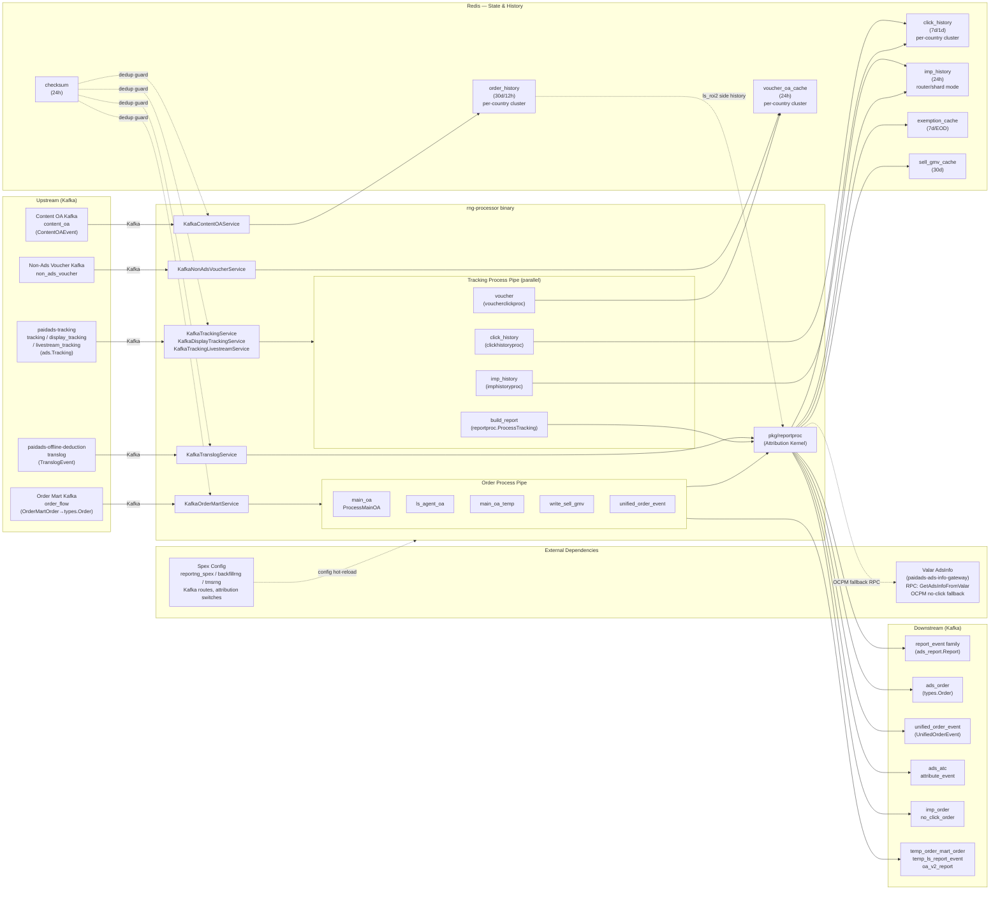

<!-- ads-workspace-gdoc-sync: gdoc_id=18naCC8xmeaEKMyJ52AewjdCw0gi7wFMUbG-x-63CEGI gdoc_url=https://docs.google.com/document/d/18naCC8xmeaEKMyJ52AewjdCw0gi7wFMUbG-x-63CEGI/edit -->

# paidads-report-ng

> Attribution-first Ads Data processor — consumes tracking, order mart, translog, and content OA Kafka streams, performs click/impression history attribution for orders, and emits report_event, ads_order, unified_order_event, and related downstream events while maintaining Redis history state for attribution.
>
> Repository: https://git.garena.com/shopee/deep/paidads-report-ng

---

## Table of Contents

1. [Introduction](#1-introduction)
2. [Service Boundary and Future Direction](#2-service-boundary-and-future-direction)
3. [Input Kafka Families](#3-input-kafka-families)
4. [Tracking Business Logic](#4-tracking-business-logic)
5. [Order Mart Attribution Flow](#5-order-mart-attribution-flow)
6. [Transaction Finance Flow](#6-transaction-finance-flow)
7. [Content OA Flow](#7-content-oa-flow)
8. [Output Events and Data Contracts](#8-output-events-and-data-contracts)
9. [State Model and Redis](#9-state-model-and-redis)
10. [Data Flow and Architecture](#10-data-flow-and-architecture)
11. [Code Structure](#11-code-structure)
12. [Config, Space, and Local Run](#12-config-space-and-local-run)
13. [Operations and Troubleshooting](#13-operations-and-troubleshooting)

---

## 1. Introduction

**paidads-report-ng** (RNG) is the core attribution processor of Shopee Paid Ads data pipeline. It consumes Kafka events from tracking, order mart, translog, and content OA, performing two classes of core work:

1. **Attribution**: Associates buyer click/impression history with subsequent order events to determine which ad drove the conversion.
2. **Report generation**: Translates attribution results into structured events — `report_event`, `ads_order`, `unified_order_event` — consumed downstream for billing, BI, and bidding.

> **Positioning note**: report-ng currently handles both direct report generation and attribution. Long-term, direct report generation (building report_event directly from raw tracking/finance streams) will gradually migrate to DE (Data Engineering). report-ng will converge into a pure attribution-centric service.

**Three independently deployable binaries**:

| Binary | Entrypoint | Role |
|--------|-----------|------|
| `rng-processor` | `cmd/processor` | Main live processor handling all four Kafka input families |
| `rng-tmsrng` | `cmd/tmsrng` | Mirror processor for TMS migration path, `isTmsTraffic=true` |
| `rng-backfill` | `cmd/backfill` | Replay/backfill processor — starts only `replay_order` and `replay_report` consumers |

Additionally, `rng-querier` (`cmd/querier`) provides a read-side HTTP tool for querying Redis/Pika data and does not participate in the main processing loop.

---

## 2. Service Boundary and Future Direction

### Current Responsibilities

- **Tracking side**: Writes click history, imp history, and voucher click history; generates product/shop/live/video/banner direct report events; handles ATC, pageview, and shop-item attribution.
- **Order side**: Attributes order mart orders to click history → imp history → Valar AdsInfo; produces `report_event`, `ads_order`, `unified_order_event`, sell GMV cache, and related outputs.
- **Finance side**: Converts CPC/CPM translog events into report_event; maintains exemption cache state.
- **Content OA side**: Writes content OA order history to provide livestream/content context for `ls_roi2` attribution.

### Long-term Direction

- Tracking/Finance → `report_event` direct transform will migrate to DE.
- report-ng converges to four core modules: click history, imp history, content OA history, and order-to-ads attribution.

---

## 3. Input Kafka Families

report-ng has four main business input families, plus one side input (non-ads voucher):

| Input Family | Message Type | Upstream Service | Consumer Service | Primary Output |
|-------------|-------------|-----------------|-----------------|---------------|
| tracking | `ads.Tracking` | paidads-tracking | `KafkaTrackingService` | click history, report_event, attribution outputs |
| display_tracking | `ads.Tracking` | paidads-tracking | `KafkaDisplayTrackingService` | click history, imp history, report_event |
| livestream_tracking | `ads.Tracking` | paidads-tracking | `KafkaTrackingLivestreamService` | click history, imp history, report_event |
| order_flow (order mart) | `pOrder.OrderMartOrder` → `types.Order` | order mart | `KafkaOrderMartService` | report_event, ads_order, unified_order_event |
| translog | `deductProto.TranslogEvent` | paidads-offline-deduction | `KafkaTranslogService` | report_event |
| content_oa | `pOrder.ContentOAEvent` | content OA pipeline | `KafkaContentOAService` | (writes order history only — no direct report output) |
| non_ads_voucher | voucher events | — | `KafkaNonAdsVoucherService` | voucher click history (side input, not a main business family) |

> **Note**: The codebase still retains the `orderv5` (`KafkaOrderService`) code path for compatibility, but the live main order source is order mart (`KafkaOrderMartService`).

---

## 4. Tracking Business Logic

### 4.1 Parallel Process Pipe

The tracking handler (initialized in `handler/tracking/tracking.go`) registers four pipes in parallel:

| Pipe | Processor | Role |
|------|-----------|------|
| `click_history` | `clickhistoryproc.HandleClick` | Writes click history to Redis |
| `imp_history` | `imphistoryproc.HandleImp` | Writes ROI2/livestream imp history to Redis |
| `build_report` | `reportproc.ProcessTracking` | Generates direct reports and attribution outputs |
| `voucher` | `voucherclickproc.HandleVoucher` | Writes voucher click history to Redis |

### 4.2 Direct Report Generation (`build_report` pipe)

`ProcessTracking` (`pkg/reportproc/tracking.go`) routes by `TrackingOperationType`:

| Operation Type | Handler | Output |
|---------------|---------|--------|
| ADD_TO_CART | `processTrackingATC` | report_event, ads_atc, attribute_event |
| VIEW / SHOP_VIEW | `processTrackingPageView` | attribute_event |
| Default | `processShopItemAttribution` + `processTrackingItem` + `processTrackingShop` + `processTrackingBanner` + `processTrackingLivestream` + `processTrackingVideo` | report_event (product/shop/live/video/banner) |

**Per-ad-type report builders**:

| Builder | Ad Type |
|---------|---------|
| `processTrackingItem` | Keyword / target product ads (`pkg/reportproc/keyword`, `targeting`) |
| `processTrackingShop` | Shop ads (`pkg/reportproc/shop`) |
| `processTrackingBanner` | Banner and brand-max ads (`pkg/reportproc/banner`) |
| `processTrackingLivestream` | Livestream ads (`pkg/reportproc/livestream`) |
| `processTrackingVideo` | Video ads (`pkg/reportproc/video`) |

### 4.3 ATC Attribution (`processTrackingATC`)

ATC attribution is limited to item ads (non-agent). It selects the attribution path in this priority order:

| Path | Condition | Output |
|------|-----------|--------|
| `DIRECT_WITHOUT_CLICK` | `AdsData.adsid > 0` and the latest direct click is missing, older than 1 day, or adsid mismatched | report_event, ads_atc, attribute_event |
| `DIRECT_WITH_CLICK` | Latest direct item click exists within 1 day | report_event, ads_atc, attribute_event |
| `BROAD_WITH_CLICK` | Shop/shop_ads click within 1 day (code retained; current comment notes no broad attribution for ATC) | report_event, ads_atc, attribute_event |
| `SKIP` | Past `AtcSwitchTimestamp` and no adsid — handed to oa-processor | — |

### 4.4 Shop-Item Attribution (`processShopItemAttribution`)

Attributes item impressions/clicks to shop ads or brand ads clicks:

| Conversion Type | Condition | Output Events |
|----------------|-----------|--------------|
| Broad conversion | `shop_ads_click` within 7 days | `BroadShopItemImp` or `BroadShopItemClick` |
| Direct conversion | Same click within 1 day AND `ItemUnderShop(item) != 0` | `ShopItemImpression` or `ShopItemClick` |

### 4.5 PageView Attribution (`processTrackingPageView`)

Attributes VIEW/SHOP_VIEW events to display ads or brand ads clicks, using lookup keys:
- `userid + shopid` → display ads click
- `userid + shopid` → search brand ads click

---

## 5. Order Mart Attribution Flow

### 5.1 Attribution Priority

`ProcessMainOA` (`pkg/reportproc/order.go`) tries attribution in this order:

| Step | Source | Lookup Key | Time Window | Switch |
|------|--------|-----------|-------------|--------|
| 1. Direct click | click history | `KeyNonAgentItemClick(userid, itemid)` | 7d | — |
| 2. Broad click | click history | `KeyShopClick(userid, shopid)` / `KeyShopAdsClick(userid, shopid)` | 7d | — |
| 3. Imp attribution | imp history | `KeyProductRoi2Imp(userid, itemid)` / `KeyLsRoi2Imp(userid, streamerShopID)` via content OA history | 1d | `ImpAttrCountrySwitch` |
| 4. OCPM no-click fallback | Valar AdsInfo (`GetAdsInfoFromValar`) | — | — | `OcpmNoClickCountrySwitch`, ROI2 only |

### 5.2 Pre-processing

Before attribution, order mart messages go through:
1. Checksum deduplication (OrderMart unique key)
2. `SendDiffOrderTopic`: emits `temp_order_mart_order` side output
3. ExtInfo validation
4. Repeat placed order filtering
5. `OrderMartSwitch` gating

### 5.3 Order Process Pipe

| Pipe | Function | Output |
|------|---------|--------|
| `main_oa` | `ProcessMainOA` | report_event, ads_order, imp_order, no_click_order, oa_v2_report |
| `ls_agent_oa` | `ProcessLivestreamAgentOA` | temp_ls_report_event |
| `main_oa_temp` | `ProcessMainOATemp` | oa_v2_report (temporary migration output); uses V2 click history keys (`item_v2`, `shop_v2`, `shop_ads_v2`) for attribution |
| `write_sell_gmv` | `WriteSellGmvToCache` | sell GMV cache (Redis write) |
| `unified_order_event` | `ProcessUnifiedOrderEvent` | unified_order_event |

Each pipe's enabled state is controlled via SPEX config `order-process-pipe-config.enable-process-pipe`.

### 5.4 Cache Writes

| Cache | Purpose |
|-------|---------|
| order_status and order_key | Repeat-order handling, attribution bookkeeping, platform auto-escrow related state |
| sell_gmv_cache | Stores seller GMV data for downstream platform logic |

---

## 6. Transaction Finance Flow

`KafkaTranslogService` consumes `deductProto.TranslogEvent` (from paidads-offline-deduction), routed through `handler/translog/translog.go` → `reportproc.ProcessTranslog`:

| Operation Type | Conversion Logic | Output |
|---------------|-----------------|--------|
| `DEDUCT_CLICK` (CPC) | 1 translog → 1 report (`HandleCPCTranslog`) | report_event |
| `DEDUCT_IMP` (CPM) | 1 translog → N reports (`CPMEventDetailsStr` + `ImpCostDetails` fan-out) | report_event (multiple) |

**Exemption cache writes**: After generating each report_event, `exemptionManager.Write` writes three key types:

| Key Template | Purpose | TTL |
|-------------|---------|-----|
| `exempt_L7D_click:<country>:ads:<ads_id>` | L7D click exemption marker | 604800s (7d) |
| `exempt_metric:<country>:ads:<ads_id>@<yyyymmdd>` | Daily `imp_attr_order_gmv` / `no_click_gmv` / `broad_gmv` | Until EOD |
| `exempt_L7D_deduct_imp:<country>:ads:<ads_id>` | L7D deduct imp exemption marker | 604800s (7d) |

---

## 7. Content OA Flow

`KafkaContentOAService` consumes `pOrder.ContentOAEvent` (from the content OA pipeline), routed through `handler/contentoa/content_oa.go` → `orderhistoryproc.HandleContentOrder`.

> **Key point**: The content OA flow **does not directly emit report_event**. It only writes content OA orders into order history Redis (key: `content_oa_order:<orderID>-><itemID>`, TTL 12h), providing livestream/content context so that later main-order imp attribution can look up `KeyLsRoi2Imp`.

---

## 8. Output Events and Data Contracts

### 8.1 Primary Outputs

| Output | Message Type | Source | Downstream Use |
|--------|-------------|--------|----------------|
| `report_event` | `ads_report.Report` | tracking / order / translog | Report aggregation, billing, BI analytics |
| `ads_order` | `types.Order` | order mart attribution | Bidding consumers (separate topics for SG/BR/MX/CO/CL) |
| `unified_order_event` | `report_attribute_event.UnifiedOrderEvent` | order mart attribution | Unified order stream with package/voucher attribution enrichment |

### 8.2 Side Outputs

| Output | Message Type | Source | Notes |
|--------|-------------|--------|-------|
| `temp_order_mart_order` | `types.Order` | order mart pre-processing | Diff-order side output |
| `ads_atc` | `types.AddToCartEvent` | tracking ATC attribution | Attributed add-to-cart events |
| `attribute_event` | `ads_report.AttributeEvent` | tracking attribution | For OA-style consumers |
| `imp_order` | `types.ImpOrder` | order mart (imp attribution path) | Imp-attributed order side output |
| `no_click_order` | `types.NoClickOrder` | order mart (OCPM no-click fallback) | No-click / OCPM order side output |
| `temp_ls_report_event` | `ads_report.Report` | livestream agent OA | Temporary livestream agent OA output |
| `oa_v2_report` | `ads_report.Report` | main OA temp | Temporary main-OA migration output |

### 8.3 Stable Output Groups (SPEX Config Center is the authoritative source)

Stable output groups: `report_event_family`, `ads_order`, `ads_atc`, `attribute_event`, `temp_order_mart_order`, `unified_order_event`, `no_click_order`, `imp_order`, `oa_v2_report`.

> Actual runtime Kafka broker addresses and topic families are managed by SPEX Config Center and should not be treated as authoritative in this README.

---

## 9. State Model and Redis

### 9.1 Click History

| Property | Value |
|---------|-------|
| Module | `pkg/clickhistory` + `pkg/clickhistoryproc` |
| Config block | `click-client.redis.countryConn` |
| Key shapes (V1) | `item:<userID>-><itemID>`, `shop:<userID>-><shopID>`, `shop_ads:<userID>-><shopID>`, `search_brand_ads:<userID>-><shopID>`, `display_ads:<userID>-><shopID>`, `page_view:<userID>-><shopID>` |
| Key shapes (V2) | `item_v2:<userID>-><itemID>` (7d), `shop_v2:<userID>-><shopID>` (7d), `shop_ads_v2:<userID>-><shopID>` (7d), `ls_agent_item_v2:<userID>-><itemID>` (1d) — written alongside V1 keys during click processing; read by `main_oa_temp` for attribution |
| Value | Serialized/compressed ClickHistory |
| TTL | Standard click history: 7d; display/ls-agent variants: 1d |
| Address examples | SG: `ips.rediscluster-9806-sg3.shopee.io:9806`, PH: `ips.rediscluster-9912-sg3.shopee.io:9912`, TH: `ips.rediscluster-9914-sg3.shopee.io:9914`, VN: `ips.rediscluster-9915-sg3.shopee.io:9915` |
| Used by | Order attribution, tracking-side attribution |

### 9.2 Imp History

| Property | Value |
|---------|-------|
| Module | `internal/imphistoryproc` + `pkg/imphistory` |
| Config block | `country-imp-history.managers.<country>` |
| Mode | **Router/shard mode** (`CountryHistoryManager`) sharded by userID — not a single Redis client |
| Key shapes | `product_roi2:<userID>-><itemID>`, `ls_roi2:<userID>-><streamerShopID>` |
| Value | Serialized `buyer_history.ImpHistory` |
| TTL | 24h |
| Address examples | SG: `hw8go.elasticredis.cloud.shopee.io:10612`, MY: `kwlld.elasticredis.cloud.shopee.io:10609`, TW: `dqlua.elasticredis.cloud.shopee.io:10624` |
| Used by | Order attribution (imp attribution step) |

### 9.3 Order History

| Property | Value |
|---------|-------|
| Module | `internal/orderhistoryproc` + `pkg/orderhistory` |
| Config block | `order-history.countryConn` |
| Key shapes | `item:<userID>-><itemID>` (main order), `content_oa_order:<orderID>-><itemID>` (content OA linkage) |
| Value | Serialized ClickHistory or content OA linkage record |
| TTL | Main order history: 30d; content OA order history: 12h; auxiliary counter: 6h |
| Address examples | SG: `ips.5504a685f05c38bc.elasticredis.cloud.shopee.io:10048`, ID: `ips.udxiq.elasticredis.cloud.shopee.io:10042`, MY: `ips.dfq68.elasticredis.cloud.shopee.io:10047` |
| Used by | Content OA linkage, repeat-order handling, platform auto-escrow state |

### 9.4 Voucher OA Cache

| Property | Value |
|---------|-------|
| Module | `pkg/voucherclickproc` |
| Config block | `voucher-oa-redis` |
| Key shapes | `voucher_order:<userID>-><promotionID>` |
| Value | Encoded VoucherClickContext |
| TTL | 24h |
| Address examples | SG: `st132.elasticredis.cloud.shopee.io:11447`, ID: `8uvpb.elasticredis.cloud.shopee.io:11453`, BR: `glbrn.elasticredis.cloud.shopee.io:11449` |
| Used by | Unified order voucher attribution; `HandleVoucher` (ads click events) and `HandleNonAdsVoucher` (organic non-ads voucher events, country-gated by `nonAdsVoucherValidCountry` switch) both write to this cache |

### 9.5 Exemption Cache

| Property | Value |
|---------|-------|
| Module | `pkg/exemption` + `pkg/reportproc/translog.go` |
| Config block | `exemption-manager`, `temp-exemption-manager` |
| Key templates | `exempt_L7D_click:<country>:ads:<ads_id>`, `exempt_metric:<country>:ads:<ads_id>@<yyyymmdd>`, `exempt_L7D_deduct_imp:<country>:ads:<ads_id>` |
| Value | L7D keys: timestamp marker; daily metric key: hash fields `imp_attr_order_gmv`/`no_click_gmv`/`broad_gmv` |
| TTL | L7D keys: 604800s (7d); daily metric key: until EOD |
| Address examples (main) | SG: `l9d9a.elasticredis.cloud.shopee.io:10841`, ID: `dvwgt.elasticredis.cloud.shopee.io:10844`, BR: `vcppk.elasticredis.cloud.shopee.io:10845` |
| Used by | Attribution and report correctness verification |

### 9.6 Sell GMV Cache

| Property | Value |
|---------|-------|
| Module | `pkg/reportproc/sell_gmv_cache.go` + `pkg/sell_gmv_cache/manager.go` |
| Config block | `sell-gmv-cache.redis` |
| Key shapes | `order_sell_gmv:<country>:<shopID>:<orderID>`, `placed_order_sell_gmv:<country>:<shopID>:<orderID>` |
| Value | Hash field `<itemID>:<modelID>:<groupID>:<bundleOrderItemID>` → seller_gmv ×1e5 |
| TTL | 30d |
| Address examples | `pikqc.elasticredis.cloud.shopee.io:10652` |
| Used by | Order process pipe (`write_sell_gmv`) |

### 9.7 Checksum

| Property | Value |
|---------|-------|
| Module | `pkg/checksum` |
| Config block | `check-sum` |
| Key shapes | `<prefix>msg:<sum>` |
| Value | Empty marker or UUID marker |
| TTL | 24h |
| Address examples | BR: `ips.4e23b714c3e24fb6.elasticredis.cloud.shopee.io:10880`, AR: `mouhm.cluster.kv.shopee.io:20243` |
| Used by | All consumer service wrappers for message deduplication |

---

## 10. Data Flow and Architecture

### Service Topology



**Topology Table**:

| Direction | Service/Store | Protocol | Description |
|-----------|--------------|---------|-------------|
| **Upstream** | paidads-tracking (tracking / display / livestream topics) | Kafka | Three tracking event streams (`ads.Tracking`), consumed by `KafkaTrackingService` / `KafkaDisplayTrackingService` / `KafkaTrackingLivestreamService` |
| **Upstream** | Order Mart Kafka | Kafka | Order events (`pOrder.OrderMartOrder`), main OA attribution input |
| **Upstream** | paidads-offline-deduction (translog topics) | Kafka | Deduction transaction logs (`deductProto.TranslogEvent`), for finance-to-report conversion |
| **Upstream** | Content OA Kafka | Kafka | Content OA order events (`pOrder.ContentOAEvent`), written to content OA order history for main-order imp attribution |
| **Upstream** | Non-Ads Voucher Kafka | Kafka | Non-ads voucher click history, written to voucher click history for unified order voucher attribution |
| **Downstream** | report_event Kafka family | Kafka | Final report event stream (`ads_report.Report`) — tracking / display / livestream topic families |
| **Downstream** | ads_order Kafka | Kafka | Attributed ads order stream (`types.Order`) for bidding consumers |
| **Downstream** | unified_order_event Kafka | Kafka | Unified order event stream (`report_attribute_event.UnifiedOrderEvent`) with package and voucher attribution enrichment |
| **Downstream** | ads_atc / attribute_event Kafka | Kafka | Attributed ATC events and attribution side stream for OA-style consumers |
| **Downstream** | imp_order / no_click_order Kafka | Kafka | Imp-attributed and OCPM no-click order side outputs |
| **Dependency** | Redis — click_history | Redis | Click history cache (per-country sharded clusters), key `item/shop/shop_ads/display_ads/page_view:<userID>-><id>`, TTL 7d/1d |
| **Dependency** | Redis — imp_history | Redis | Impression history cache (router/shard mode), key `product_roi2/ls_roi2:<userID>-><id>`, TTL 24h |
| **Dependency** | Redis — order_history | Redis | Order history cache (per-country), key `item/content_oa_order:<id>-><id>`, TTL 30d/12h |
| **Dependency** | Redis — voucher_oa_cache | Redis | Voucher OA click history cache (per-country), key `voucher_order:<userID>-><promotionID>`, TTL 24h |
| **Dependency** | Redis — exemption_cache | Redis | Exemption state cache, key templates: `exempt_L7D_click/exempt_metric/exempt_L7D_deduct_imp`, TTL 7d/EOD |
| **Dependency** | Redis — sell_gmv_cache | Redis | Seller GMV cache, key `order_sell_gmv/placed_order_sell_gmv:<cc>:<shopID>:<orderID>`, TTL 30d |
| **Dependency** | Redis — checksum | Redis | Message deduplication checksum cache, key `<prefix>msg:<sum>`, TTL 24h |
| **Dependency** | Valar Gateway (paidads-ads-info-gateway) | SPEX RPC | Queries AdsInfo for OCPM no-click order attribution fallback (`GetAdsInfoFromValar`) |
| **Dependency** | Spex Config | SPEX | Dynamic runtime config (reportng_spex / backfillrng / tmsrng), manages Kafka routes, attribution switches |

---

## 11. Code Structure

Code is organized in layers from entrypoints down to core business logic:

### Layer 1 — Entrypoints & Runtime Assembly

| Directory | Description |
|-----------|-------------|
| `cmd/processor/` | Main live binary entrypoint. `run.go` assembles all consumer services, Redis clients, Kafka producers |
| `cmd/tmsrng/` | TMS migration path mirror — same as processor but `isTmsTraffic=true` |
| `cmd/backfill/` | Replay/backfill entrypoint — starts only `replay_order` and `replay_report` consumers |
| `cmd/querier/` + `querier/` | Read-side query tool HTTP service; does not participate in the main processing loop |

### Layer 2 — Kafka Consumer Service Layer

| Directory | Description |
|-----------|-------------|
| `service/` | Kafka adapter and lifecycle wrappers for all consumer services. Includes `KafkaTrackingService`, `KafkaDisplayTrackingService`, `KafkaTrackingLivestreamService`, `KafkaOrderMartService` (order mart main path), `KafkaOrderService` (orderv5 compatibility), `KafkaTranslogService`, `KafkaContentOAService`, `KafkaNonAdsVoucherService`, `KafkaReplayOrderService`, `KafkaReplayReportService` |

### Layer 3 — Handler Orchestration Layer

| Directory | Description |
|-----------|-------------|
| `handler/tracking/` | Initializes the parallel process pipe (click_history, imp_history, build_report, voucher) |
| `handler/order/` | Builds order process pipe from SPEX config (main_oa, ls_agent_oa, main_oa_temp, write_sell_gmv, unified_order_event) |
| `handler/translog/` | Thin bridge — directly calls `reportproc.ProcessTranslog` |
| `handler/contentoa/` | Thin bridge — directly calls `orderhistoryproc.HandleContentOrder` |
| `handler/replay_order/` | Process pipe orchestration for replay orders |
| `handler/replay_report/` | Process pipe orchestration for replay report events |

### Layer 4 — Core Business Layer

| File / Directory | Description |
|-----------------|-------------|
| `pkg/reportproc/processor.go` | `Processor` struct, holds all history managers and ad-type handlers |
| `pkg/reportproc/tracking.go` | Tracking-side direct report generation and ATC/pageview/shop-item attribution routing |
| `pkg/reportproc/tracking_atc.go` | ATC attribution logic — handles `DIRECT_WITHOUT_CLICK`, `DIRECT_WITH_CLICK`, `AtcSwitchTimestamp` skip |
| `pkg/reportproc/tracking_pageview.go` | PageView attribution |
| `pkg/reportproc/tracking_shopitem.go` | Shop-item broad/direct conversion attribution |
| `pkg/reportproc/order.go` | Order attribution main logic (click → imp → AdsInfo fallback) and OA pipeline |
| `pkg/reportproc/order_v2.go` | OrderV2 / `main_oa_temp` path |
| `pkg/reportproc/translog.go` | CPC/CPM finance-to-report conversion, exemption cache writes |
| `pkg/reportproc/unified_order_event.go` | `unified_order_event` generation logic |
| `pkg/reportproc/sell_gmv_cache.go` | Sell GMV cache write logic |
| `pkg/reportproc/{keyword,targeting,shop,banner,livestream,video,display,roi2,shop_cpm,boost}/` | Per-ad-type report builders |

### Layer 5 — History / State / Output Support

| Directory | Description |
|-----------|-------------|
| `pkg/clickhistory/` + `pkg/clickhistoryproc/` | Click history Redis client, write and read logic |
| `internal/imphistoryproc/` + `pkg/imphistory/` | Imp history sharded router (`CountryHistoryManager`), write logic |
| `internal/orderhistoryproc/` + `pkg/orderhistory/` | Order history and content OA order history |
| `pkg/voucherclickproc/` | Voucher click history writes |
| `pkg/exemption/` | Exemption cache read/write |
| `pkg/checksum/` | Message checksum deduplication |
| `pkg/emit/` | Kafka output routing (rule-based producer) |
| `pkg/producer/` | Kafka producer wrapper |
| `pkg/sell_gmv_cache/` | Sell GMV cache manager |
| `pkg/local_cache/` | In-process local cache |
| `pkg/experiment/` | OA experiment manager (Redis-backed experiment/canary flags) |

### Layer 6 — Config & Shared Infrastructure

| Directory | Description |
|-----------|-------------|
| `internal/spex/` | SPEX config loading, `SpexConfig`/`RNGConfig`/`RegionConfig` structs, config watch |
| `config/files/` | YAML config files (`live.yml`, `staging.yml`, `test.yml`, `uat.yml`, `liveish.yml`) |
| `convert/` | Message type conversion (tracking, order, translog → internal types) |
| `types/` | Shared data models (`types.Order`, `types.AddToCartEvent`, etc.) |
| `util/` | Utility functions (deduction info decoder, log meta extraction, etc.) |
| `internal/helper/` | Internal helper functions |
| `internal/validation/` | Input message validation logic |
| `gen/` | spcli-generated proto stub code (`paidads_valar_gateway`, `voucher_core`, `voucher_mp_usage`, etc.) |
| `biz_exporter/` | Business Prometheus metrics exporter |

---

## 12. Config, Space, and Local Run

### 12.1 SPEX Configuration

report-ng's runtime configuration is fully managed by SPEX across three servers:

| Purpose | SPEX server-name | Live config-key |
|---------|-----------------|----------------|
| Main processor | `deep.paidads.platform.reportng_spex` | `99b1f11c5e895326e6da3f04d76d77ec` |
| Replay backfill | `paidads.backfillrng` | `202c84af8cb1f62b86f00e0f027038d93978a71eab22fba421086f20f809cbd9` |
| TMS processor | `paidads.tmsrng` | `dc8724c4fe3b1d1594f8a490533e75b8082e6ac3bccb521316ea55eeeb93ab44` |

**SPEX Config Center link (main processor)**:
```
https://space.shopee.io/console/cmdb/config_center/detail/shopee.mp_search_recommendation_ads.paidads.data_application.ads_data.rng/resource_management?env=live&project=%5Bsp%5Ddeep.paidads.platform&resourceType=spex&spexServiceName=deep.paidads.platform.reportng_spex&tab=namespace
```
> For backfill and tmsrng, use the same path but replace the `spexServiceName` query parameter.

**Install spcli**:
```bash
pip install --upgrade shopee-spex-cli
```

**Generate proto stubs** (after installing spcli):
```bash
spcli proto gen   # generates gen/ directory from sp-workspace.yml dependencies
```

### 12.2 Space CMDB

| Link | Description |
|------|-------------|
| [CMDB root](https://space.shopee.io/console/cmdb/overview/tree/shopee.mp_search_recommendation_ads.paidads.data_application.ads_data/quota/container/summary_by_az) | ads_data service tree |
| [ads_data.rng detail](https://space.shopee.io/console/cmdb/overview/detail/shopee.mp_search_recommendation_ads.paidads.data_application.ads_data.rng/permission) | rng service details and permissions |

**Verified CMDB service**:

| Field | Value |
|-------|-------|
| service_name | `shopee.mp_search_recommendation_ads.paidads.data_application.ads_data.rng` |
| service_id | 4828 |
| identifier | `paidads-reportngprocessor` |
| operation_type | consumer |
| classification | sync |
| impact | p1 |
| owner | chenxi.zhou@shopee.com |
| live SDU family | `paidads-reportngprocessor-live-<cid>` |

### 12.3 Local Run

**Build all binaries**:
```bash
make build
# Produces: bin/rng-processor, bin/rng-querier, bin/rng-backfill, bin/rng-tmsrng (plus .linux cross-build versions)
```

**Run processor locally** (using `local.yml`):
```bash
make dev
# Equivalent to: bin/rng-processor -c config/files/local.yml --stdout -debug
```

**Dump and validate config** (confirm live.yml parses correctly):
```bash
make processor-yml   # bin/rng-processor -c config/files/live.yml --dump
make querier-yml     # bin/rng-querier -c config/files/live.yml --dump
```

**Run tests**:
```bash
make test         # -v -cover
make test-nv      # no verbose output
make coverage     # generates coverage.out and coverage.xml (Cobertura format)
```

### 12.4 Config Files

| File | Purpose |
|------|---------|
| `config/files/live.yml` | Production config (SPEX server-name, region, config-key) |
| `config/files/staging.yml` | Staging environment |
| `config/files/test.yml` | Test environment |
| `config/files/uat.yml` | UAT environment |
| `config/files/liveish.yml` | Live-like environment |

Config loading order: YAML file → SPEX remote config (`SpexConfig` → `RNGConfig` → `RegionConfig`). SPEX config supports hot-reload at runtime via `WatchConfig`, triggering `Reload` on each module.

---

## 13. Operations and Troubleshooting

Troubleshooting is organized by input family. For each path, check: checksum → history/cache state → attribution branch → downstream Kafka output.

### 13.1 Tracking Path

1. **Checksum**: Check `pkg/checksum` Prometheus metrics (`check-sum` Redis) to confirm messages are not being dropped by deduplication.
2. **Click/Imp History**: Verify click history Redis connectivity per country; check imp history router shard routing. Look for async task counter backlog in `clickhistoryproc`.
3. **Build report output**: Monitor `shopee_ads_report_event_<cid>_live` topic production rate and consumer lag.

### 13.2 Order Mart Path

1. **Checksum**: Confirm order mart message checksum passes; ensure `_checkNewKey` does not flag orders as duplicates.
2. **Click/Imp History**: If attribution results are abnormal (e.g., high no-click rate), check click history Redis data freshness (TTL 7d) and imp history router routing.
3. **Valar AdsInfo call**: OCPM no-click fallback depends on Valar. Monitor `paidads.valar.gateway` RPC error rate and latency.
4. **Order process pipe**: Confirm each pipe is enabled via SPEX config `enable-process-pipe`; verify `temp_order_mart_order` side topic is being produced.

### 13.3 Transaction (Translog) Path

1. **Checksum**: Check translog message checksum Redis.
2. **Exemption cache**: Verify `exemption-manager` and `temp-exemption-manager` Redis writes are healthy; check `exempt_L7D_click` key hit rate.
3. **Output Kafka**: Monitor `shopee_ads_report_event_<cid>_live` for translog-sourced report events.

### 13.4 Content OA Path

1. **Order history Redis**: Confirm `content_oa_order:<orderID>-><itemID>` keys are available when order mart attribution runs (TTL 12h — timing is critical).
2. **ls_roi2 attribution**: If livestream imp attribution fails, check whether content OA history writes are lagging such that the main order arrives after history expiry.

---

<!-- Generated by ads-workspace/skills/ads-readme-generate | checked: d74ee006e77536b0557800b13e212520a428c0a8 -->
