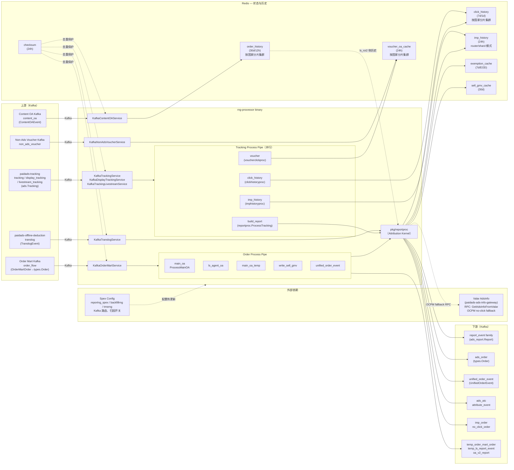

<!-- ads-workspace-gdoc-sync: gdoc_id=1DbCgWTM8O1PPkqugnWbkuRTfl69bxIZIiOnrvSmvlDk gdoc_url=https://docs.google.com/document/d/1DbCgWTM8O1PPkqugnWbkuRTfl69bxIZIiOnrvSmvlDk/edit -->

# paidads-report-ng

> attribution-first 的广告数据处理器 — 消费 tracking、order mart、translog、content OA 四路 Kafka 流，对订单进行点击/曝光历史归因，产出 report_event、ads_order、unified_order_event 等下游事件，并维护用于归因的 Redis 历史状态。
>
> 仓库地址：https://git.garena.com/shopee/deep/paidads-report-ng

---

## 目录 / Table of Contents

1. [项目概述 / Introduction](#1-项目概述--introduction)
2. [服务边界与未来方向 / Service Boundary and Future Direction](#2-服务边界与未来方向--service-boundary-and-future-direction)
3. [输入 Kafka 家族 / Input Kafka Families](#3-输入-kafka-家族--input-kafka-families)
4. [Tracking 业务逻辑 / Tracking Business Logic](#4-tracking-业务逻辑--tracking-business-logic)
5. [Order Mart 归因链路 / Order Mart Attribution Flow](#5-order-mart-归因链路--order-mart-attribution-flow)
6. [Transaction Finance 链路 / Transaction Finance Flow](#6-transaction-finance-链路--transaction-finance-flow)
7. [Content OA 链路 / Content OA Flow](#7-content-oa-链路--content-oa-flow)
8. [输出事件与数据契约 / Output Events and Data Contracts](#8-输出事件与数据契约--output-events-and-data-contracts)
9. [状态模型与 Redis / State Model and Redis](#9-状态模型与-redis--state-model-and-redis)
10. [数据流与架构 / Data Flow and Architecture](#10-数据流与架构--data-flow-and-architecture)
11. [代码结构 / Code Structure](#11-代码结构--code-structure)
12. [配置、Space 与本地运行 / Config, Space, and Local Run](#12-配置space-与本地运行--config-space-and-local-run)
13. [运维与排障 / Operations and Troubleshooting](#13-运维与排障--operations-and-troubleshooting)

---

## 1. 项目概述 / Introduction

**paidads-report-ng**（RNG）是 Shopee Paid Ads 数据链路的核心 attribution 处理器。它消费来自 tracking、order mart、translog、content OA 的 Kafka 事件，完成以下两类核心工作：

1. **Attribution（归因）**：将买家的点击/曝光历史与后续下单行为关联，确定广告对转化的归因权重。
2. **Report generation（报告生成）**：将归因结果转化为 `report_event`、`ads_order`、`unified_order_event` 等结构化事件，下游消费方用于计费、BI、bidding 等。

> **定位说明**：report-ng 当前同时承担 direct report generation 和 attribution 两类职责。长期规划中，direct report 部分（从原始 tracking/finance 流直接构建 report）将逐步迁移至 DE（数据工程），report-ng 最终将收敛为纯 attribution-centric 服务。

**三个可独立部署的二进制**：

| Binary | 入口 | 职责 |
|--------|------|------|
| `rng-processor` | `cmd/processor` | 主线上处理器，处理全部四路 Kafka 输入 |
| `rng-tmsrng` | `cmd/tmsrng` | TMS 迁移路径的镜像处理器，`isTmsTraffic=true` |
| `rng-backfill` | `cmd/backfill` | 回放/补数处理器，仅启动 `replay_order` 和 `replay_report` 两个 consumer |

另有 `rng-querier`（`cmd/querier`）：提供 Redis/Pika 数据查询的 read-side HTTP 工具，不参与主处理循环。

---

## 2. 服务边界与未来方向 / Service Boundary and Future Direction

### 当前职责

- **Tracking 侧**：写 click history、imp history、voucher click history；生成 product/shop/live/video/banner 等 direct report event；处理 ATC、pageview、shop-item attribution。
- **Order 侧**：将 order mart 订单归因到 click history → imp history → Valar AdsInfo；产出 `report_event`、`ads_order`、`unified_order_event`、sell GMV cache 等。
- **Finance 侧**：将 CPC/CPM translog 转为 report_event；维护 exemption cache 状态。
- **Content OA 侧**：写 content OA order history，为 ls_roi2 归因提供侧信道数据。

### 长期方向

- Tracking/Finance → `report_event` 的 direct transform 将迁移至 DE。
- report-ng 收敛为：click history、imp history、content OA history、order-to-ads attribution 四大核心模块。

---

## 3. 输入 Kafka 家族 / Input Kafka Families

report-ng 有四类主业务输入，外加一个侧路输入（non-ads voucher）：

| 输入家族 | 消息类型 | 上游服务 | consumer service 名 | 主要输出 |
|---------|---------|---------|-------------------|---------|
| tracking | `ads.Tracking` | paidads-tracking | `KafkaTrackingService` | click history、report_event、attribution outputs |
| display_tracking | `ads.Tracking` | paidads-tracking | `KafkaDisplayTrackingService` | click history、imp history、report_event |
| livestream_tracking | `ads.Tracking` | paidads-tracking | `KafkaTrackingLivestreamService` | click history、imp history、report_event |
| order_flow（order mart） | `pOrder.OrderMartOrder` → `types.Order` | order mart | `KafkaOrderMartService` | report_event、ads_order、unified_order_event |
| translog | `deductProto.TranslogEvent` | paidads-offline-deduction | `KafkaTranslogService` | report_event |
| content_oa | `pOrder.ContentOAEvent` | content OA pipeline | `KafkaContentOAService` | （只写 order history，无直接 report 输出） |
| non_ads_voucher | voucher 事件 | — | `KafkaNonAdsVoucherService` | voucher click history（侧路，非四类主输入） |

> **注**：代码中仍保留 `orderv5`（`KafkaOrderService`）路径以保持兼容，但业务上主路径已切换为 order mart（`KafkaOrderMartService`）。

---

## 4. Tracking 业务逻辑 / Tracking Business Logic

### 4.1 并行 Process Pipe

Tracking handler 在 `handler/tracking/tracking.go` 中初始化，将以下 4 条 pipe 并行注册：

| Pipe 名 | 处理器 | 职责 |
|---------|--------|------|
| `click_history` | `clickhistoryproc.HandleClick` | 写 click history 至 Redis |
| `imp_history` | `imphistoryproc.HandleImp` | 写 ROI2/livestream imp history 至 Redis |
| `build_report` | `reportproc.ProcessTracking` | 生成 direct report 和 attribution 输出 |
| `voucher` | `voucherclickproc.HandleVoucher` | 写 voucher click history 至 Redis |

### 4.2 Direct Report 生成（build_report pipe）

`ProcessTracking`（`pkg/reportproc/tracking.go`）按 `TrackingOperationType` 路由：

| 操作类型 | 处理函数 | 产出 |
|---------|---------|------|
| ADD_TO_CART | `processTrackingATC` | report_event、ads_atc、attribute_event |
| VIEW / SHOP_VIEW | `processTrackingPageView` | attribute_event |
| 其他（默认） | `processShopItemAttribution` + `processTrackingItem` + `processTrackingShop` + `processTrackingBanner` + `processTrackingLivestream` + `processTrackingVideo` | report_event（product/shop/live/video/banner） |

**各 ad 类型 report 生成器**：

| 生成器 | 对应广告类型 |
|--------|------------|
| `processTrackingItem` | keyword / target product ads（`pkg/reportproc/keyword`、`targeting`） |
| `processTrackingShop` | shop ads（`pkg/reportproc/shop`） |
| `processTrackingBanner` | banner、brand-max ads（`pkg/reportproc/banner`） |
| `processTrackingLivestream` | livestream ads（`pkg/reportproc/livestream`） |
| `processTrackingVideo` | video ads（`pkg/reportproc/video`） |

### 4.3 ATC Attribution（`processTrackingATC`）

ATC 归因限于 item（非 agent），按以下优先级选择归因路径：

| 路径 | 条件 | 输出 |
|-----|------|------|
| `DIRECT_WITHOUT_CLICK` | `AdsData.adsid > 0`，且最近 direct click 缺失 / 超过 1 天 / adsid 不匹配 | report_event、ads_atc、attribute_event |
| `DIRECT_WITH_CLICK` | 存在 1 天内 direct item click | report_event、ads_atc、attribute_event |
| `BROAD_WITH_CLICK` | 存在 1 天内 shop/shop_ads click（代码保留，当前注释说明无 broad attribution） | report_event、ads_atc、attribute_event |
| `SKIP` | 超过 AtcSwitchTimestamp 且无 adsid | 跳过，交给 oa-processor 处理 |

### 4.4 Shop-Item Attribution（`processShopItemAttribution`）

将 item impression / item click 归因至 shop ads 或 brand ads click：

| 转化类型 | 条件 | 产出事件 |
|---------|------|---------|
| Broad conversion | `shop_ads_click` 在 7 天内 | `BroadShopItemImp` 或 `BroadShopItemClick` |
| Direct conversion | 同一 click 在 1 天内 且 `ItemUnderShop(item) != 0` | `ShopItemImpression` 或 `ShopItemClick` |

### 4.5 PageView Attribution（`processTrackingPageView`）

将 VIEW/SHOP_VIEW 归因至 display ads 或 brand ads click，查找键：
- `userid + shopid` → display ads click
- `userid + shopid` → search brand ads click

---

## 5. Order Mart 归因链路 / Order Mart Attribution Flow

### 5.1 归因优先级

`ProcessMainOA`（`pkg/reportproc/order.go`）按以下顺序依次尝试：

| 步骤 | 来源 | 查找键 | 时间窗口 | 开关 |
|-----|------|-------|---------|------|
| 1. Direct click | click history | `KeyNonAgentItemClick(userid, itemid)` | 7d | — |
| 2. Broad click | click history | `KeyShopClick(userid, shopid)` / `KeyShopAdsClick(userid, shopid)` | 7d | — |
| 3. Imp attribution | imp history | `KeyProductRoi2Imp(userid, itemid)` / `KeyLsRoi2Imp(userid, streamerShopID)` via content OA history | 1d | `ImpAttrCountrySwitch` |
| 4. OCPM no-click fallback | Valar AdsInfo（`GetAdsInfoFromValar`） | — | — | `OcpmNoClickCountrySwitch`，仅 ROI2 |

### 5.2 前置处理

在进入归因之前，order mart 消息依次经过：
1. Checksum 去重（OrderMart unique key）
2. `SendDiffOrderTopic`：发送 temp_order_mart_order 侧路输出
3. ExtInfo 校验
4. 重复下单过滤
5. `OrderMartSwitch` 门控

### 5.3 Order Process Pipe

| Pipe 名 | 函数 | 输出 |
|---------|------|------|
| `main_oa` | `ProcessMainOA` | report_event、ads_order、imp_order、no_click_order、oa_v2_report |
| `ls_agent_oa` | `ProcessLivestreamAgentOA` | temp_ls_report_event |
| `main_oa_temp` | `ProcessMainOATemp` | oa_v2_report（临时迁移输出）；归因时使用 V2 click history key（`item_v2`、`shop_v2`、`shop_ads_v2`） |
| `write_sell_gmv` | `WriteSellGmvToCache` | sell GMV cache（Redis 写入） |
| `unified_order_event` | `ProcessUnifiedOrderEvent` | unified_order_event |

各 pipe 的启用状态通过 SPEX 配置中的 `order-process-pipe-config.enable-process-pipe` 控制。

### 5.4 Cache 写入

| Cache | 目的 |
|-------|------|
| order_status 和 order_key | 重复订单处理、归因 bookkeeping、平台自动托管相关状态 |
| sell_gmv_cache | 存储卖家 GMV 数据，供平台逻辑下游使用 |

---

## 6. Transaction Finance 链路 / Transaction Finance Flow

`KafkaTranslogService` 消费 `deductProto.TranslogEvent`（来自 paidads-offline-deduction），通过 `handler/translog/translog.go` → `reportproc.ProcessTranslog` 处理：

| 操作类型 | 转化逻辑 | 输出 |
|---------|---------|------|
| `DEDUCT_CLICK`（CPC） | 1 translog → 1 report（`HandleCPCTranslog`） | report_event |
| `DEDUCT_IMP`（CPM） | 1 translog → N reports（`CPMEventDetailsStr` + `ImpCostDetails` fan-out） | report_event（多条） |

**Exemption cache 写入**：每次生成 report_event 后，`exemptionManager.Write` 将写入以下三类 key：

| Key 模板 | 用途 | TTL |
|---------|------|-----|
| `exempt_L7D_click:<country>:ads:<ads_id>` | L7D click exemption 标记 | 604800s（7d） |
| `exempt_metric:<country>:ads:<ads_id>@<yyyymmdd>` | 每日 `imp_attr_order_gmv` / `no_click_gmv` / `broad_gmv` | 至 EOD |
| `exempt_L7D_deduct_imp:<country>:ads:<ads_id>` | L7D deduct imp exemption 标记 | 604800s（7d） |

---

## 7. Content OA 链路 / Content OA Flow

`KafkaContentOAService` 消费 `pOrder.ContentOAEvent`（来自 content OA pipeline），通过 `handler/contentoa/content_oa.go` → `orderhistoryproc.HandleContentOrder` 处理。

> **关键**：content OA 链路**不直接产出 report_event**。它只负责将 content OA order 写入 order history Redis（key: `content_oa_order:<orderID>-><itemID>`，TTL 12h），为后续 main-order imp attribution 提供 livestream/content 上下文，使 `KeyLsRoi2Imp` 归因得以实现。

---

## 8. 输出事件与数据契约 / Output Events and Data Contracts

### 8.1 主输出

| 输出名 | 消息类型 | 来源 | 下游用途 |
|-------|---------|------|---------|
| `report_event` | `ads_report.Report` | tracking / order / translog | 报告统计、计费、BI 分析 |
| `ads_order` | `types.Order` | order mart attribution | bidding 消费方（含 SG/BR/MX/CO/CL 各自 topic） |
| `unified_order_event` | `report_attribute_event.UnifiedOrderEvent` | order mart attribution | 带 package/voucher 归因的统一订单流 |

### 8.2 Side Outputs

| 输出名 | 消息类型 | 来源 | 说明 |
|-------|---------|------|------|
| `temp_order_mart_order` | `types.Order` | order mart 前置处理 | diff-order 侧路输出 |
| `ads_atc` | `types.AddToCartEvent` | tracking ATC attribution | 归因后的加购事件 |
| `attribute_event` | `ads_report.AttributeEvent` | tracking attribution | OA-style 消费方 |
| `imp_order` | `types.ImpOrder` | order mart（imp 归因路径） | imp 归因订单侧路 |
| `no_click_order` | `types.NoClickOrder` | order mart（OCPM no-click fallback） | 无点击 / OCPM 订单侧路 |
| `temp_ls_report_event` | `ads_report.Report` | ls agent OA | 临时 livestream agent OA 输出 |
| `oa_v2_report` | `ads_report.Report` | main OA temp | 临时 main-OA 迁移输出 |

### 8.3 稳定输出 Group（以 SPEX Config Center 为权威来源）

稳定输出 group 包括：`report_event_family`、`ads_order`、`ads_atc`、`attribute_event`、`temp_order_mart_order`、`unified_order_event`、`no_click_order`、`imp_order`、`oa_v2_report`。

> 实际运行时的 Kafka broker 和 topic family 以 SPEX Config Center 为准，不在此处硬编码。

---

## 9. 状态模型与 Redis / State Model and Redis

### 9.1 Click History

| 属性 | 值 |
|-----|---|
| 模块 | `pkg/clickhistory` + `pkg/clickhistoryproc` |
| 配置 block | `click-client.redis.countryConn` |
| V1 Key 形状 | `item:<userID>-><itemID>`、`shop:<userID>-><shopID>`、`shop_ads:<userID>-><shopID>`、`search_brand_ads:<userID>-><shopID>`、`display_ads:<userID>-><shopID>`、`page_view:<userID>-><shopID>` |
| V2 Key 形状 | `item_v2:<userID>-><itemID>`（7d）、`shop_v2:<userID>-><shopID>`（7d）、`shop_ads_v2:<userID>-><shopID>`（7d）、`ls_agent_item_v2:<userID>-><itemID>`（1d）— 点击处理时与 V1 并行写入；由 `main_oa_temp` 读取用于归因 |
| Value | 序列化/压缩的 ClickHistory |
| TTL | 标准 click history：7d；display/ls-agent 变体：1d |
| 示例地址 | SG: `ips.rediscluster-9806-sg3.shopee.io:9806`，PH: `ips.rediscluster-9912-sg3.shopee.io:9912`，TH: `ips.rediscluster-9914-sg3.shopee.io:9914`，VN: `ips.rediscluster-9915-sg3.shopee.io:9915` |
| 使用方 | order attribution、tracking-side attribution |

### 9.2 Imp History

| 属性 | 值 |
|-----|---|
| 模块 | `internal/imphistoryproc` + `pkg/imphistory` |
| 配置 block | `country-imp-history.managers.<country>` |
| 模式 | **按 userID 分片的 router/shard 模式**（`CountryHistoryManager`），非单一 Redis client |
| Key 形状 | `product_roi2:<userID>-><itemID>`、`ls_roi2:<userID>-><streamerShopID>` |
| Value | 序列化的 `buyer_history.ImpHistory` |
| TTL | 24h |
| 示例地址 | SG: `hw8go.elasticredis.cloud.shopee.io:10612`，MY: `kwlld.elasticredis.cloud.shopee.io:10609`，TW: `dqlua.elasticredis.cloud.shopee.io:10624` |
| 使用方 | order attribution（imp 归因路径） |

### 9.3 Order History

| 属性 | 值 |
|-----|---|
| 模块 | `internal/orderhistoryproc` + `pkg/orderhistory` |
| 配置 block | `order-history.countryConn` |
| Key 形状 | `item:<userID>-><itemID>`（main order）、`content_oa_order:<orderID>-><itemID>`（content OA linkage） |
| Value | 序列化 ClickHistory 或 content OA 关联记录 |
| TTL | main order history：30d；content OA order history：12h；auxiliary counter：6h |
| 示例地址 | SG: `ips.5504a685f05c38bc.elasticredis.cloud.shopee.io:10048`，ID: `ips.udxiq.elasticredis.cloud.shopee.io:10042`，MY: `ips.dfq68.elasticredis.cloud.shopee.io:10047` |
| 使用方 | content OA 关联、重复订单处理、平台自动托管状态 |

### 9.4 Voucher OA Cache

| 属性 | 值 |
|-----|---|
| 模块 | `pkg/voucherclickproc` |
| 配置 block | `voucher-oa-redis` |
| Key 形状 | `voucher_order:<userID>-><promotionID>` |
| Value | 编码后的 VoucherClickContext |
| TTL | 24h |
| 示例地址 | SG: `st132.elasticredis.cloud.shopee.io:11447`，ID: `8uvpb.elasticredis.cloud.shopee.io:11453`，BR: `glbrn.elasticredis.cloud.shopee.io:11449` |
| 使用方 | unified order voucher attribution；`HandleVoucher`（广告点击事件）和 `HandleNonAdsVoucher`（自然流量非广告券事件，以 `nonAdsVoucherValidCountry` 按国家开关控制）均写入此缓存 |

### 9.5 Exemption Cache

| 属性 | 值 |
|-----|---|
| 模块 | `pkg/exemption` + `pkg/reportproc/translog.go` |
| 配置 block | `exemption-manager`、`temp-exemption-manager` |
| Key 模板 | `exempt_L7D_click:<country>:ads:<ads_id>`、`exempt_metric:<country>:ads:<ads_id>@<yyyymmdd>`、`exempt_L7D_deduct_imp:<country>:ads:<ads_id>` |
| Value | L7D keys：时间戳标记；daily metric key：hash 字段 `imp_attr_order_gmv`/`no_click_gmv`/`broad_gmv` |
| TTL | L7D keys：604800s（7d）；daily metric key：至 EOD |
| 示例地址（main） | SG: `l9d9a.elasticredis.cloud.shopee.io:10841`，ID: `dvwgt.elasticredis.cloud.shopee.io:10844`，BR: `vcppk.elasticredis.cloud.shopee.io:10845` |
| 使用方 | attribution 和 report 正确性校验 |

### 9.6 Sell GMV Cache

| 属性 | 值 |
|-----|---|
| 模块 | `pkg/reportproc/sell_gmv_cache.go` + `pkg/sell_gmv_cache/manager.go` |
| 配置 block | `sell-gmv-cache.redis` |
| Key 形状 | `order_sell_gmv:<country>:<shopID>:<orderID>`、`placed_order_sell_gmv:<country>:<shopID>:<orderID>` |
| Value | hash field `<itemID>:<modelID>:<groupID>:<bundleOrderItemID>` → seller_gmv ×1e5 |
| TTL | 30d |
| 示例地址 | `pikqc.elasticredis.cloud.shopee.io:10652` |
| 使用方 | order process pipe（`write_sell_gmv`） |

### 9.7 Checksum

| 属性 | 值 |
|-----|---|
| 模块 | `pkg/checksum` |
| 配置 block | `check-sum` |
| Key 形状 | `<prefix>msg:<sum>` |
| Value | 空标记或 UUID 标记 |
| TTL | 24h |
| 示例地址 | BR: `ips.4e23b714c3e24fb6.elasticredis.cloud.shopee.io:10880`，AR: `mouhm.cluster.kv.shopee.io:20243` |
| 使用方 | 所有 consumer service wrapper，用于消息去重 |

---

## 10. 数据流与架构 / Data Flow and Architecture

### 上下游调用拓扑 / Service Topology



**拓扑表格**：

| 方向 | 服务/存储 | 协议 | 说明 |
|------|---------|------|------|
| **上游** | paidads-tracking（tracking / display / livestream topics） | Kafka | 三类 tracking 事件流（`ads.Tracking`），分别由 `KafkaTrackingService` / `KafkaDisplayTrackingService` / `KafkaTrackingLivestreamService` 消费 |
| **上游** | Order Mart Kafka | Kafka | 订单事件（`pOrder.OrderMartOrder`），主 OA 归因输入 |
| **上游** | paidads-offline-deduction（translog topics） | Kafka | 扣费交易日志（`deductProto.TranslogEvent`），用于 finance-to-report 转换 |
| **上游** | Content OA Kafka | Kafka | 内容 OA 订单事件（`pOrder.ContentOAEvent`），写入 content OA order history 供主 order 归因使用 |
| **上游** | Non-Ads Voucher Kafka | Kafka | 非广告券点击历史，写入 voucher click history 供 unified order voucher 归因使用 |
| **下游** | report_event Kafka family | Kafka | 最终报表事件流（`ads_report.Report`），含 tracking/display/livestream 三个 topic family |
| **下游** | ads_order Kafka | Kafka | 归因广告订单流（`types.Order`），下游 bidding 消费 |
| **下游** | unified_order_event Kafka | Kafka | 统一订单事件流（`report_attribute_event.UnifiedOrderEvent`），含 package 和 voucher 归因增强 |
| **下游** | ads_atc / attribute_event Kafka | Kafka | 归因加购事件和归因属性事件流，供 OA-style 消费者使用 |
| **下游** | imp_order / no_click_order Kafka | Kafka | 曝光归因订单和 OCPM 无点击订单侧路输出 |
| **依赖** | Redis — click_history | Redis | 点击历史缓存（按国家分片集群），key `item/shop/shop_ads/display_ads/page_view:<userID>-><id>`，TTL 7d/1d |
| **依赖** | Redis — imp_history | Redis | 曝光历史缓存（router/shard 模式），key `product_roi2/ls_roi2:<userID>-><id>`，TTL 24h |
| **依赖** | Redis — order_history | Redis | 订单历史缓存（按国家分片），key `item/content_oa_order:<id>-><id>`，TTL 30d/12h |
| **依赖** | Redis — voucher_oa_cache | Redis | 券 OA 点击历史缓存（按国家分片），key `voucher_order:<userID>-><promotionID>`，TTL 24h |
| **依赖** | Redis — exemption_cache | Redis | 豁免状态缓存，key 模板 `exempt_L7D_click/exempt_metric/exempt_L7D_deduct_imp`，TTL 7d/EOD |
| **依赖** | Redis — sell_gmv_cache | Redis | 卖家 GMV 缓存，key `order_sell_gmv/placed_order_sell_gmv:<cc>:<shopID>:<orderID>`，TTL 30d |
| **依赖** | Redis — checksum | Redis | 消息去重校验缓存，key `<prefix>msg:<sum>`，TTL 24h |
| **依赖** | Valar Gateway（paidads-ads-info-gateway） | SPEX RPC | 查询 AdsInfo，用于 OCPM no-click order attribution fallback（`GetAdsInfoFromValar`） |
| **依赖** | Spex Config | SPEX | 动态运行时配置（reportng_spex / backfillrng / tmsrng），管理 Kafka 路由、归因开关等 |

---

## 11. 代码结构 / Code Structure

代码按层次组织，从入口到核心业务依次为：

### Layer 1 — Entrypoints & Runtime Assembly（入口与二进制组装）

| 目录 | 说明 |
|------|------|
| `cmd/processor/` | 主线上二进制入口，`run.go` 组装所有 consumer service、Redis client、Kafka producer |
| `cmd/tmsrng/` | TMS 迁移路径镜像，与 processor 基本相同但 `isTmsTraffic=true` |
| `cmd/backfill/` | 回放/补数入口，仅启动 `replay_order` 和 `replay_report` |
| `cmd/querier/` + `querier/` | Read-side 查询工具 HTTP 服务，不参与主处理循环 |

### Layer 2 — Kafka Consumer Service Layer（consumer 适配层）

| 目录 | 说明 |
|------|------|
| `service/` | 所有 consumer service 的 Kafka 适配和生命周期包装。包括 `KafkaTrackingService`、`KafkaDisplayTrackingService`、`KafkaTrackingLivestreamService`、`KafkaOrderMartService`（order mart 主路径）、`KafkaOrderService`（orderv5 兼容）、`KafkaTranslogService`、`KafkaContentOAService`、`KafkaNonAdsVoucherService`、`KafkaReplayOrderService`、`KafkaReplayReportService` |

### Layer 3 — Handler Orchestration Layer（process pipe 编排层）

| 目录 | 说明 |
|------|------|
| `handler/tracking/` | 初始化并行 process pipe（click_history、imp_history、build_report、voucher） |
| `handler/order/` | 从 SPEX config 构建 order process pipe（main_oa、ls_agent_oa、main_oa_temp、write_sell_gmv、unified_order_event） |
| `handler/translog/` | 薄桥接层，直接调用 `reportproc.ProcessTranslog` |
| `handler/contentoa/` | 薄桥接层，直接调用 `orderhistoryproc.HandleContentOrder` |
| `handler/replay_order/` | 回放 order 的 process pipe 编排 |
| `handler/replay_report/` | 回放 report event 的 process pipe 编排 |

### Layer 4 — Core Business Layer（核心业务层）

| 目录 / 文件 | 说明 |
|------------|------|
| `pkg/reportproc/processor.go` | `Processor` 结构体，持有所有 history manager 和 ad-type handler |
| `pkg/reportproc/tracking.go` | Tracking 侧 direct report 生成和 ATC/pageview/shop-item attribution 路由 |
| `pkg/reportproc/tracking_atc.go` | ATC attribution 逻辑，处理 `DIRECT_WITHOUT_CLICK`、`DIRECT_WITH_CLICK`、`AtcSwitchTimestamp` skip |
| `pkg/reportproc/tracking_pageview.go` | PageView attribution |
| `pkg/reportproc/tracking_shopitem.go` | Shop-item broad/direct conversion attribution |
| `pkg/reportproc/order.go` | Order attribution 主逻辑（click → imp → AdsInfo fallback）及 OA 管道 |
| `pkg/reportproc/order_v2.go` | OrderV2 / `main_oa_temp` 路径 |
| `pkg/reportproc/translog.go` | CPC/CPM finance-to-report 转换，exemption cache 写入 |
| `pkg/reportproc/unified_order_event.go` | `unified_order_event` 生成逻辑 |
| `pkg/reportproc/sell_gmv_cache.go` | sell GMV cache 写入逻辑 |
| `pkg/reportproc/{keyword,targeting,shop,banner,livestream,video,display,roi2,shop_cpm,boost}/` | 各 ad 类型的 report 构建器 |

### Layer 5 — History / State / Output Support（历史状态与输出支持层）

| 目录 | 说明 |
|------|------|
| `pkg/clickhistory/` + `pkg/clickhistoryproc/` | Click history Redis client、写入和读取逻辑 |
| `internal/imphistoryproc/` + `pkg/imphistory/` | Imp history 分片 router（`CountryHistoryManager`）、写入逻辑 |
| `internal/orderhistoryproc/` + `pkg/orderhistory/` | Order history、content OA order history |
| `pkg/voucherclickproc/` | Voucher click history 写入 |
| `pkg/exemption/` | Exemption cache 读写 |
| `pkg/checksum/` | 消息 checksum 去重 |
| `pkg/emit/` | Kafka 输出路由（rule-based producer） |
| `pkg/producer/` | Kafka producer 封装 |
| `pkg/sell_gmv_cache/` | Sell GMV cache manager |
| `pkg/local_cache/` | 本地 in-process cache |
| `pkg/experiment/` | OA exp manager（Redis-backed 实验/灰度标志） |

### Layer 6 — Config & Shared Infra（配置与共享基础层）

| 目录 | 说明 |
|------|------|
| `internal/spex/` | SPEX 配置加载、`SpexConfig`/`RNGConfig`/`RegionConfig` 结构体、config watch |
| `config/files/` | YAML 配置文件（`live.yml`、`staging.yml`、`test.yml`、`uat.yml`、`liveish.yml`） |
| `convert/` | 消息类型转换（tracking、order、translog 等 → 内部 types） |
| `types/` | 共享数据模型（`types.Order`、`types.AddToCartEvent` 等） |
| `util/` | 工具函数（deduction info decoder、log meta 提取等） |
| `internal/helper/` | 内部辅助函数 |
| `internal/validation/` | 各类消息的验证逻辑 |
| `gen/` | spcli 生成的 proto stub 代码（`paidads_valar_gateway`、`voucher_core`、`voucher_mp_usage` 等） |
| `biz_exporter/` | 业务 Prometheus 指标导出 |

---

## 12. 配置、Space 与本地运行 / Config, Space, and Local Run

### 12.1 SPEX 配置

report-ng 的运行时配置完全由 SPEX 管控，分三个 server：

| 用途 | SPEX server-name | live config-key |
|-----|-----------------|----------------|
| 主处理器（processor） | `deep.paidads.platform.reportng_spex` | `99b1f11c5e895326e6da3f04d76d77ec` |
| 回放补数（backfill） | `paidads.backfillrng` | `202c84af8cb1f62b86f00e0f027038d93978a71eab22fba421086f20f809cbd9` |
| TMS 处理器（tmsrng） | `paidads.tmsrng` | `dc8724c4fe3b1d1594f8a490533e75b8082e6ac3bccb521316ea55eeeb93ab44` |

**SPEX Config Center 入口（主处理器）**：
```
https://space.shopee.io/console/cmdb/config_center/detail/shopee.mp_search_recommendation_ads.paidads.data_application.ads_data.rng/resource_management?env=live&project=%5Bsp%5Ddeep.paidads.platform&resourceType=spex&spexServiceName=deep.paidads.platform.reportng_spex&tab=namespace
```
> backfill 和 tmsrng 使用相同路径，替换 `spexServiceName` query 参数即可。

**安装 spcli**：
```bash
pip install --upgrade shopee-spex-cli
```

**生成 proto stub**（安装 spcli 后）：
```bash
spcli proto gen   # 根据 sp-workspace.yml 的依赖生成 gen/ 目录下的 stub 代码
```

### 12.2 Space CMDB

| 链接 | 说明 |
|------|------|
| [CMDB 根地址](https://space.shopee.io/console/cmdb/overview/tree/shopee.mp_search_recommendation_ads.paidads.data_application.ads_data/quota/container/summary_by_az) | ads_data 服务树 |
| [ads_data.rng 详情](https://space.shopee.io/console/cmdb/overview/detail/shopee.mp_search_recommend_ads.paidads.data_application.ads_data.rng/permission) | rng 服务详情与权限 |

**已验证的 CMDB 服务**：

| 字段 | 值 |
|-----|---|
| service_name | `shopee.mp_search_recommendation_ads.paidads.data_application.ads_data.rng` |
| service_id | 4828 |
| identifier | `paidads-reportngprocessor` |
| operation_type | consumer |
| classification | sync |
| impact | p1 |
| owner | chenxi.zhou@shopee.com |
| live SDU family | `paidads-reportngprocessor-live-<cid>` |

### 12.3 本地运行

**构建所有二进制**：
```bash
make build
# 产出：bin/rng-processor、bin/rng-querier、bin/rng-backfill、bin/rng-tmsrng（含 .linux 跨编译版本）
```

**本地开发运行 processor**（使用 `local.yml`）：
```bash
make dev
# 等效于：bin/rng-processor -c config/files/local.yml --stdout -debug
```

**Dump 配置**（验证 live.yml 是否能正确解析）：
```bash
make processor-yml   # bin/rng-processor -c config/files/live.yml --dump
make querier-yml     # bin/rng-querier -c config/files/live.yml --dump
```

**运行测试**：
```bash
make test         # 含 -v -cover
make test-nv      # 不输出 verbose
make coverage     # 生成 coverage.out 和 coverage.xml（Cobertura 格式）
```

### 12.4 配置文件

| 文件 | 用途 |
|------|------|
| `config/files/live.yml` | 生产环境配置（SPEX server-name、region、config-key） |
| `config/files/staging.yml` | Staging 环境 |
| `config/files/test.yml` | 测试环境 |
| `config/files/uat.yml` | UAT 环境 |
| `config/files/liveish.yml` | 类 live 环境 |

配置加载顺序：YAML 文件 → SPEX 远程配置（`SpexConfig` → `RNGConfig` → `RegionConfig`）。SPEX config 在运行时可热更新，通过 `WatchConfig` 监听并触发各模块的 `Reload` 方法。

---

## 13. 运维与排障 / Operations and Troubleshooting

排障按输入家族顺序进行。每条路径的排查顺序：checksum → history/cache 状态 → attribution 分支 → 下游 Kafka 输出。

### 13.1 Tracking 链路

1. **Checksum**：检查 `pkg/checksum` 的 Prometheus 指标（`check-sum` Redis），确认消息未被去重丢弃。
2. **Click/Imp History**：检查 click history Redis 各国家分片连通性；查看 imp history router 分片路由是否正确；检查 `clickhistoryproc` 的 async task counter 是否积压。
3. **Output Kafka**：检查 `shopee_ads_report_event_<cid>_live` topic 的生产速率和消费者 lag。

### 13.2 Order Mart 链路

1. **Checksum**：确认 order mart 消息 checksum 通过，确认 `_checkNewKey` 未将订单判为重复。
2. **Click/Imp History**：若归因结果异常（如大量 no-click），检查 click history Redis 的数据时效性（TTL 7d）和 imp history router 路由是否正确。
3. **Valar AdsInfo 调用**：OCPM no-click fallback 依赖 Valar，检查 `paidads.valar.gateway` RPC 的错误率和延迟。
4. **Order Process Pipe**：通过 SPEX config 的 `enable-process-pipe` 确认各 pipe 是否启用；检查 `temp_order_mart_order` 侧路 topic 是否正常产出。

### 13.3 Translog 链路

1. **Checksum**：检查 translog 消息的 checksum Redis。
2. **Exemption Cache**：检查 `exemption-manager` 和 `temp-exemption-manager` Redis 的写入是否正常；查看 `exempt_L7D_click` key 的命中情况。
3. **Output Kafka**：检查 `shopee_ads_report_event_<cid>_live` 中 translog 来源的 report event 是否异常。

### 13.4 Content OA 链路

1. **Order History Redis**：检查 `content_oa_order:<orderID>-><itemID>` key 是否在 order mart 归因时能被查到（TTL 12h，需注意时效）。
2. **ls_roi2 归因**：若 livestream imp 归因失效，检查 content OA history 写入是否滞后，导致 main order 到达时 history 已过期。

---

<!-- Generated by ads-workspace/skills/ads-readme-generate | checked: d74ee006e77536b0557800b13e212520a428c0a8 -->
