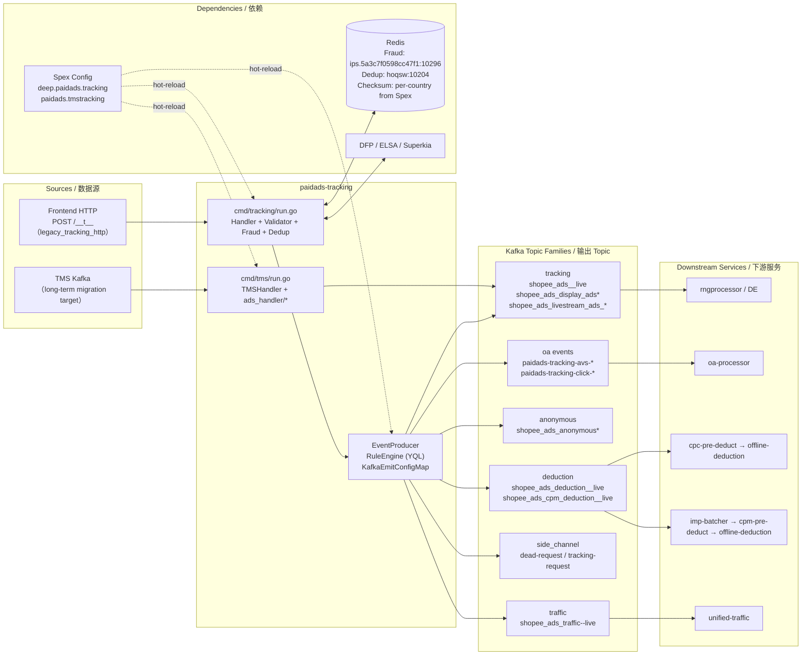

<!-- ads-workspace-gdoc-sync: gdoc_id=166evlCB5UHjIbki-PAnW0cDyj8CFiSANVK1QMQmdlrY gdoc_url=https://docs.google.com/document/d/166evlCB5UHjIbki-PAnW0cDyj8CFiSANVK1QMQmdlrY/edit -->

# paidads-tracking / 广告 Tracking 入口服务

> **Contributors**: fengjiao.wang ｜ **最后更新**：2026-05-27 ｜ [GitLab](https://git.garena.com/shopee/search_recommend/ai-copilot/ads-workspace/-/blob/master/docs/common/readme/paidads-tracking/README.md)

> **Language**: [English](README.md) | [中文](README.zh-CN.md)

Git Repository: https://git.garena.com/shopee/deep/paidads-tracking

---

## Table of Contents / 目录

1. [Introduction / 项目概述](#introduction--项目概述)
2. [Features / 核心功能](#features--核心功能)
3. [Ad Products and Business Semantics / 广告产品与业务语义](#ad-products-and-business-semantics--广告产品与业务语义)
   - [Product Scope and Entry Differences / 产品范围与入口差异](#product-scope-and-entry-differences--产品范围与入口差异)
   - [Product-specific Processing Branches / 按广告产品的处理分支](#product-specific-processing-branches--按广告产品的处理分支)
   - [Key Business Decisions / 关键业务判断](#key-business-decisions--关键业务判断)
4. [Architecture / 项目架构](#architecture--项目架构)
   - [Service Topology / 上下游调用拓扑](#service-topology--上下游调用拓扑)
   - [Upstream, Downstream, and System Positioning / 上下游与系统定位](#upstream-downstream-and-system-positioning--上下游与系统定位)
   - [Main Message Processing Flow / 消息处理主链路](#main-message-processing-flow--消息处理主链路)
   - [Online, Offline, and TMS Flows / 在线与离线 / TMS 分流](#online-offline-and-tms-flows--在线与离线--tms-分流)
   - [Runtime Components and Dependencies / 运行时组件与依赖](#runtime-components-and-dependencies--运行时组件与依赖)
5. [Kafka and Event Contracts / Kafka 与事件契约](#kafka-and-event-contracts--kafka-与事件契约)
   - [Consumers and Input Topics / Consumer 与输入 Topic](#consumers-and-input-topics--consumer-与输入-topic)
   - [Producers and Output Topics / Producer 与输出 Topic](#producers-and-output-topics--producer-与输出-topic)
   - [Retry, DLQ, and Side Outputs / 重试、DLQ 与旁路输出](#retry-dlq-and-side-outputs--重试dlq-与旁路输出)
6. [Redis and Caching / Redis 与缓存](#redis-and-caching--redis-与缓存)
   - [Caching Use Cases / 缓存使用场景](#caching-use-cases--缓存使用场景)
   - [Key Cached Data Structures / 关键缓存数据结构](#key-cached-data-structures--关键缓存数据结构)
   - [Cache Update and Invalidation Strategies / 缓存更新与失效策略](#cache-update-and-invalidation-strategies--缓存更新与失效策略)
7. [Directory Structure / 目录结构](#directory-structure--目录结构)
8. [Entrypoints and Key Modules / 服务入口与关键模块](#entrypoints-and-key-modules--服务入口与关键模块)
   - [Service Binaries / 入口二进制](#service-binaries--入口二进制)
   - [Handler, Service, and Manager Layers / Handler / Service / Manager 分层](#handler-service-and-manager-layers--handler--service--manager-分层)
   - [Product-specific Module Mapping / 按广告产品的模块映射](#product-specific-module-mapping--按广告产品的模块映射)
   - [Tools and One-off Scripts / 工具与一次性脚本](#tools-and-one-off-scripts--工具与一次性脚本)
9. [Protocol and Data Models / 协议与数据模型](#protocol-and-data-models--协议与数据模型)
   - [Input Events Data Models / 输入事件模型](#input-events-data-models--输入事件模型)
   - [Output Events Data Models / 输出事件模型](#output-events-data-models--输出事件模型)
   - [Core Business Fields / 核心业务字段](#core-business-fields--核心业务字段)
   - [History and Cache Models / 历史数据与缓存模型](#history-and-cache-models--历史数据与缓存模型)
10. [Configuration and Deployment / 配置与部署](#configuration-and-deployment--配置与部署)
    - [Static Config Files / 静态配置文件](#static-config-files--静态配置文件)
    - [Dynamic Config and Hot Reload / 动态配置与热更新](#dynamic-config-and-hot-reload--动态配置与热更新)
    - [Kafka, Redis, DB, and SPEX Config Matrix / Kafka / Redis / DB / SPEX 配置矩阵](#kafka-redis-db-and-spex-config-matrix--kafka--redis--db--spex-配置矩阵)
    - [Build and Release / 构建与发布](#build-and-release--构建与发布)
11. [Monitoring and Operations / 监控与排障](#monitoring-and-operations--监控与排障)
    - [Health Checks and Runtime Endpoints / 健康检查与运行时端点](#health-checks-and-runtime-endpoints--健康检查与运行时端点)
    - [Key Metrics and Logs / 关键指标与日志](#key-metrics-and-logs--关键指标与日志)
    - [Duplicate, Missing, and Delayed Data Troubleshooting / 数据重复、漏数、延迟排查](#duplicate-missing-and-delayed-data-troubleshooting--数据重复漏数延迟排查)
    - [Troubleshooting Playbook / 常见故障定位](#troubleshooting-playbook--常见故障定位)
12. [Key Terms / 关键术语](#key-terms--关键术语)
13. [Additional Resources / 参考资料](#additional-resources--参考资料)
14. [Frequently Asked Questions / 常见问题](#frequently-asked-questions--常见问题)

---

## Introduction / 项目概述

`paidads-tracking` is the **Ads Data entry point** — it is the first hop for all ad tracking events in the Shopee Ads billing pipeline. Historically the primary source was the Ads-team-owned HTTP ingress (`cmd/tracking/`), which accepts frontend HTTP tracking beacon requests (`POST /__t__`). The service also maintains a separate TMS runtime (`cmd/tms/`) that consumes company-level tracking events from Kafka.

**tracking and TMS are two distinct data sources**: tracking is the Ads-team legacy source; TMS (Tracking Management System) is the company-level source and the long-term migration target for all tracking traffic.

Two binaries are produced from this repository:

| Binary | Entry Point | Purpose |
|--------|-------------|---------|
| `paidads_tracking_server` | `cmd/tracking/run.go` | fasthttp HTTP server — primary tracking entry, accepts `POST /__t__` |
| `paidads_tms_server` | `cmd/tms/run.go` | TMS Kafka consumer — routes TMS events to downstream Kafka topics |

Both binaries share the same core responsibility: **normalize, validate, deduplicate, enrich metadata, and route to Kafka**.

---

## Features / 核心功能

Broken down by processing stage:

1. **Ingestion** — fasthttp server (`concurrency: 10240`, `read-timeout: 500ms`) accepts `POST /__t__` tracking beacons from Shopee frontend and app. Returns 1×1 GIF on all paths including rejected events.
2. **Normalization** — raw `AdsData` / jsarray payloads are decoded (`handler/json_data.go`) and normalized into the canonical `ads.Tracking` proto (`git.garena.com/shopee-server/shopee_protobuf/beeshop_ads.pb`).
3. **Validation** — `internal/validate/validator.go` checks login tracking IDs against the `shopee_analytics` constraint; `TrackingValidator` decrypts and verifies `session_id + token` against `user_id`.
4. **Checksum deduplication** — `handler/checksum.go` computes xxHash of the request body and checks against a per-country Redis instance (TTL 12h); duplicate requests with identical body checksums are dropped before further processing.
5. **Fraud / DFP labeling** — `internal/fraud/fraud.go` evaluates rule2–rule20 (click and impression frequency caps, IP rate limiting, banned users, frozen accounts, TW-specific restrictions). `handler/dfp_client.go` integrates DFP (Digital Fingerprint) signals.
6. **Rule-based routing** — `handler/event_producer.go` iterates `KafkaEmitConfigMap` (YQL expressions loaded from Spex), evaluates each rule against the event, and sends to the matched topic family. Producer disable or missing producer causes send rejection, not a silent drop.
7. **Side outputs** — `handler/dead_request_producer.go` routes requests with base validation, parsing, final token validation, or raw tracking validation failures to the dead-letter topic. `pkg/event_producer/tracking_request_producer.go` samples requests for regression analysis.

---

## Ad Products and Business Semantics / 广告产品与业务语义

### Product Scope and Entry Differences / 产品范围与入口差异

paidads-tracking is product-agnostic at the HTTP layer — it receives a unified `AdsData` payload from any frontend placement. The event fields `placement`, `entrance`, `pageType`, and `operation` carry the semantics that differentiate products downstream:

| Product Type | Key Placement / Entrance | Effect on Routing |
|-------------|--------------------------|-------------------|
| Item / KeywordAds | search placements | → deduction topic (CPC) → `cpc-pre-deduct` |
| Shop / BrandBanner | shop / display placements | → display tracking topic → `rngprocessor`; deduction if `operation=click` |
| Livestream | livestream placement | → `shopee_ads_livestream_ads_<region>_live`; impression rules rule15/18/19 apply |
| CPM / OCPM | impression operations | → CPM deduction topic → `imp-batcher` → `cpm-pre-deduct` |
| Anonymous | no login session | → `shopee_ads_anonymous*` topics (separate path) |

All product types converge to the same `ads.Tracking` model; `placement` / `entrance` / `operation` control which YQL rules match and which downstream topic family is selected.

### Product-specific Processing Branches / 按广告产品的处理分支

| Path | Trigger Condition | Output |
|------|-------------------|--------|
| Standard CPC tracking | `operation=click`, logged-in user | → `shopee_ads_deduction_<region>_live` (CPC deduction) + tracking topics |
| CPM impression | `operation=impression`, CPM ad type | → `shopee_ads_cpm_deduction_<region>_live` (CPM deduction) + display topics |
| OCPM impression | OCPM placement | → CPM deduction topic with OCPM sub-type routing via YQL |
| OA / org events | OA entrance | → `paidads-tracking-avs-*`, `paidads-tracking-click-*`, `shopee-tracking-validation-global-live` (→ `oa-processor`) |
| Anonymous | No valid session / user | → `shopee_ads_anonymous*`; fraud and dedup checks still apply |
| Traffic events | All types | → `shopee_ads_traffic-<region>-live` (long-term unified traffic destination) |

Traffic output is a config-driven topic family. Whether it is actually emitted depends on matching rules in Spex `KafkaEmitConfigMap` / graph config; this service code provides the routing and producer framework, but does not hardcode that every event must be sent to the traffic topic.

### Key Business Decisions / 关键业务判断

| Decision | Logic | Code Location |
|----------|-------|---------------|
| Request rejection vs. silent drop | Base validation failures, proto/jsarray parse failures, `ReplaceJSONData` failures, final token validation failures, and raw tracking validation failures go to dead-letter; checksum hits, fraud rejections, and event-level dedup hits do not. Service always returns 200. | `handler/handler.go`, `handler/dead_request_producer.go` |
| Login vs anonymous flow | `is-check-anonymous-tracking-id: true` in live.yml — anonymous tracking ID validated against `shopee_analytics` | `internal/validate/validator.go` |
| Producer disable guard | `handler/event_producer.go` refuses to emit if producer is disabled or missing; emits to `error_producer_config` counter | `handler/event_producer.go` |
| Checksum before fraud | Checksum dedup runs before fraud evaluation; avoids fraud Redis round trips for duplicate bodies | `handler/handler.go` startup sequence |
| Country-level deduction eligibility | Spex `DeductionCountries` map gates which countries are eligible for deduction topic routing | `config/spex.go` |

---

## Architecture / 项目架构

### Service Topology / 上下游调用拓扑



### Upstream, Downstream, and System Positioning / 上下游与系统定位

**Upstream**

| Name | Protocol | Description |
|------|----------|-------------|
| Frontend HTTP tracking | HTTP (fasthttp) | Legacy Ads-owned ingress — accepts frontend HTTP tracking requests (`POST /__t__`) |
| TMS Kafka | Kafka | Company-level tracking source; `cmd/tms/run.go` entry — long-term migration target |

**Downstream**

| Name | Protocol | Description |
|------|----------|-------------|
| rngprocessor / DE (tracking topics) | Kafka | Main tracking event stream (tracking / display / livestream topic families) consumed by report-ng and DE |
| oa-processor (OA event topics) | Kafka | OA/org event stream (`paidads-tracking-avs-*`, `paidads-tracking-click-*`, `shopee-tracking-validation-global-live`) |
| cpc-pre-deduct (deduction topics) | Kafka | CPC deduction event stream (`shopee_ads_deduction_<region>_live`) |
| imp-batcher / cpm-pre-deduct (cpm_deduction topics) | Kafka | CPM deduction event stream (`shopee_ads_cpm_deduction_<region>_live`), aggregated by imp-batcher before cpm-pre-deduct |
| unified-traffic (traffic topics) | Kafka | Traffic event stream (`shopee_ads_traffic-<region>-live`) — long-term unified direction |
| request-sampling / failure-analysis (side channels) | Kafka | Request sampling and dead-request side outputs |

**Dependencies**

| Name | Type | Description |
|------|------|-------------|
| Redis — user_info_and_temp_ban_cache | Datastore | User info cache and temporary ban markers (`ips.5a3c7f0598cc47f1.elasticredis.cloud.shopee.io:10296`), TTL: user_info 3h / ban rule-driven |
| Redis — duplicate_cache | Datastore | Request deduplication (`hoqsw.elasticredis.cloud.shopee.io:10204`), timeout 50ms |
| Redis — checksum_cache | Datastore | Request body checksum dedup (per-country from Spex `ChecksumConfig`), TTL 12h |
| Spex Config | Service | Dynamic config (`deep.paidads.tracking` and `paidads.tmstracking`) — Kafka route, dead-request, checksum, debug shop IDs |

### Main Message Processing Flow / 消息处理主链路

Service flow summary (5 main chains):

```
tracking → tracking topics → rngprocessor and DE
tracking → OA/org event topics → oa-processor
tracking → deduction topics → cpc-pre-deduct → offline-deduction
tracking → cpm_deduction topics → imp-batcher → cpm-pre-deduct → offline-deduction
tracking → traffic topics → unified-traffic consumers (long-term direction)
```

Per-request processing path (`cmd/tracking/run.go` + `handler/handler.go`):

```
POST /__t__
    └─ handler.Handler(ctx)
        ├─ (1) Simple validation: single item / user_id / ads_id required
        ├─ (2) Checksum dedup: xxHash(request body) → Redis (skip if hit)
        ├─ (3) TokenValidator.Validate: session_id + token → AES decrypt + verify against user_id
        ├─ (4) FraudDetector.Check: rule2–rule20 (Redis limiter + user cache + DFP)
        ├─ (5) DeDuplicator.Deduplicate: Redis multi-key check
        └─ (6) EventProducer.Emit
                └─ iterate KafkaEmitConfigMap → RuleEngine.ExecuteRule(rule, event)
                        └─ matched KafkaEmitConf
                                └─ PostProcessFn (e.g. splitLSTracking / filterAdsLSTracking)
                                        └─ TopicInfo.Topics[country]
                                                └─ Kafka send (key = SaltWindow-aligned event_time)

Response: 200 OK + 1×1 GIF (all paths, including rejected events)
```

### Online, Offline, and TMS Flows / 在线与离线 / TMS 分流

| Flow | Entry Binary | Source | Processing | Output |
|------|-------------|--------|------------|--------|
| Online tracking | `paidads_tracking_server` | HTTP `POST /__t__` | Full pipeline: validate → checksum → fraud → dedup → rule route | All Kafka topic families |
| TMS tracking | `paidads_tms_server` | Kafka `KafkaEvent` / `UbtKafkaEvent` | `TMSHandler.Process()` → `ads_handler/*` per placement → `BuildTrackings()` | tracking topic families (using TMS Spex config) |

The TMS binary uses a separate Spex server-name (`paidads.tmstracking`) and a separate `DeDuplicator` instance. It does not perform fraud evaluation or HTTP ingress.

### Runtime Components and Dependencies / 运行时组件与依赖

| Component | Role |
|-----------|------|
| `handler.Handler` | Main request handler — orchestrates all stages |
| `handler.EventProducer` | Kafka emit engine — holds `KafkaBrokerConfigMap` and `KafkaEmitConfigMap` |
| `internal/rule_engine.RuleEngine` | Evaluates YQL rules from `KafkaEmitConfigMap` against event fields |
| `internal/validate.TrackingValidator` | AES-CBC decrypts and verifies session_id + token |
| `internal/fraud.FraudDetector` | Evaluates rule2–rule20; uses Redis limiter, user cache, fraud user list |
| `internal/deduplicator.DeDuplicator` | Redis multi-key event deduplication |
| `handler.Checksum` | xxHash request body → Redis per-country checksum dedup |
| `handler.DfpClient` | DFP (Digital Fingerprint) integration for fraud signals |
| `handler.DeadRequestProducer` | Routes requests with base validation, parsing, final token validation, or raw tracking validation failures to the dead-letter Kafka topic |
| `pkg/event_producer.TrackingRequestProducer` | Samples requests to regression/sampling Kafka topic |
| `internal/spex` | Spex config agent — initial fetch + `WatchSpex()` hot-reload |
| `internal/global_resource.GlobalResource` | Shared component holder initialized once at startup |

---

## Kafka and Event Contracts / Kafka 与事件契约

### Consumers and Input Topics / Consumer 与输入 Topic

`paidads_tracking_server` does not consume from Kafka — it is an HTTP server. `paidads_tms_server` consumes from Kafka:

| Binary | Spex Server-name | Input Event Types |
|--------|-----------------|-------------------|
| `paidads_tms_server` | `paidads.tmstracking` | `KafkaEvent`, `UbtKafkaEvent` (defined in `pb/tms.proto`) |

All Kafka broker addresses and topic names come from Spex; none are hardcoded in static YAML.

### Producers and Output Topics / Producer 与输出 Topic

**KafkaBrokerConfigMap** is the producer pool: maps producer name → broker connection config. **KafkaEmitConfigMap** is the rule-to-topic-family routing: maps rule name → YQL expression + `TopicInfos`. These are two distinct Spex config structures.

Kafka output groups by category (from `KafkaEmitConfigMap` routing):

| Category | Subcategory | Topic Family | Kafka Key | Primary Consumers |
|----------|-------------|-------------|-----------|-------------------|
| tracking | main_tracking | `shopee_ads_<region>_live` | userid | rngprocessor, DE |
| tracking | display_tracking | `shopee_ads_display_ads*` | userid | rngprocessor, DE |
| tracking | livestream_tracking | `shopee_ads_livestream_ads_<region>_live` | userid | rngprocessor, DE |
| tracking | oa_report_events | `paidads-tracking-avs-*`, `paidads-tracking-click-*`, `shopee-tracking-validation-global-live` | varies per flow | oa-processor |
| deduction | cpc_deduction | `shopee_ads_deduction_<region>_live` | firstShopID | cpc-pre-deduct, offline-deduction |
| deduction | cpm_deduction | `shopee_ads_cpm_deduction_<region>_live` | firstAdsid / adsid (per flow) | imp-batcher, cpm-pre-deduct, offline-deduction |
| anonymous | tracking | `shopee_ads_anonymous*` | `''` | non-mainline |
| anonymous | display_tracking | `shopee_ads_display_ads_anonymous*` | `''` | non-mainline |
| traffic | event_traffic | `shopee_ads_traffic-<region>-live` | userid | unified-traffic |
| side_channel | tracking_request | `shopee-ads-tracking-req-recording-global-live` | producer_hash | request-sampling |
| side_channel | dead_request | `shopee_ads_tracking_failed_requests` | producer_hash | failure-analysis |

The **traffic** output is the long-term unified direction for tracking-like outputs. Multiple other outputs exist due to historical compatibility — deduction-facing internal outputs remain unchanged.

Exact topic names come from Spex `KafkaEmitConfigMap`; the repo defines topic families, routing rules, country fallback, and Kafka keys. `PostProcessFn` values `splitLSTracking` (→ `SplitCPMTracking()`) and `filterAdsLSTracking` (→ `FilterCPMTracking()`) are the only in-process post-processors.

### Retry, DLQ, and Side Outputs / 重试、DLQ 与旁路输出

- **Dead-letter** (`shopee_ads_tracking_failed_requests`): written by `DeadRequestProducer` for base validation failures, HTTP body proto/jsarray parse failures, `ReplaceJSONData` failures, final token validation failures, and raw tracking validation failures. Checksum hits, fraud rejections, event-level dedup hits, and graph execution failures are **not** written to dead-letter; graph execution failures are logged and returned.
- **Sampling** (`shopee-ads-tracking-req-recording-global-live`): written by `TrackingRequestProducer` at `TrackingReqSamplePerThousand` rate (Spex-configured) for regression replay.
- No consumer-side retry: `paidads_tracking_server` is a stateless HTTP server. `paidads_tms_server` relies on EKL consumer retry semantics for Kafka consumer errors.

---

## Redis and Caching / Redis 与缓存

Redis in paidads-tracking serves **correctness functions** — user state, fraud counters, deduplication, and request body checksums — not data persistence or history storage.

### Caching Use Cases / 缓存使用场景

| Cache Name | Purpose | When Accessed |
|-----------|---------|---------------|
| `user_info_and_temp_ban_cache` | User basic info (registration date, phone verify status) + temporary ban markers set by fraud rules | `FraudDetector.Check()` for rules that require user age/status |
| `fraud_user_hash` | Hash table of fraud-listed user IDs | `frauduser.Client.IsFraud()` (rule10) |
| `limiter_and_fraud_counter_cache` | Rolling-window click/impression counters per user / device / IP / streamer | Rules rule2–rule9, rule11, rule15–rule20 |
| `duplicate_cache` | Multi-key request deduplication | `DeDuplicator.Deduplicate()` before EventProducer |
| `checksum_cache` | xxHash(request body) presence check per country | `Checksum.Check()` early in the handler pipeline |
| `data-tracker` | Internal tracking data; accessed via `ips.e50792bd70fe1cff:10884` | `tracking_transform.go` |

### Key Cached Data Structures / 关键缓存数据结构

| Cache | Config Block | Live Address | Key Format | Value | TTL |
|-------|-------------|-------------|-----------|-------|-----|
| user_info + ban | `fraud.user-cache.cache` | `ips.5a3c7f0598cc47f1.elasticredis.cloud.shopee.io:10296` | `user_info::<userID>` / `ban::<userID>_<placement>` | serialized user info / ban marker | user_info: 3h; ban: rule-driven |
| fraud_user_hash | `fraud.fraud-user-cache` | `ips.5a3c7f0598cc47f1.elasticredis.cloud.shopee.io:10296` | `fraud_user` (Hash; field = userID) | presence-based fraud mark | — |
| limiter counters | `fraud.limiter-cache` | `ips.5a3c7f0598cc47f1.elasticredis.cloud.shopee.io:10296` | `oneAccOneDay::<day>_<userID>_<adsID>_<kw>` / `oneIPOneHour::<hour>_<ip>` / `oldAccOneDay::<day>_<userID>_<placement>` | integer counters | rule-driven rolling windows |
| duplicate | `de-duplicator-config` | `hoqsw.elasticredis.cloud.shopee.io:10204` | `dedup:<reqID>:<userID>:<adsID>:<ts>:<op>` / `pdc:dedup:<userID>:<adsID>:<itemID>:<ts>` / `dedup:<userID>:<adsID>:<itemID>:<ts>:<op>:...` / `uniqueid:dedup:<userID>:<uniqueID>` | empty marker | 10m / — / 1m / 1h |
| checksum | `checksum-config.redis-config-by-country` (Spex) | SG/default: `zb433.elasticredis.cloud.shopee.io:11337`; ID: `vqa79:11336`; PH: `jd3hr:11357`; MY: `fnlmg:11338`; TH: `qxldd:11358`; VN: `jlpje:11364`; TW: `onhhd:11366`; BR: `cqjml:11370`; MX: `qzlbh:11389` | `<xxhash(request-body)-hex>` | empty marker | 12h |

The **checksum key** is the hex string of the xxHash of the entire request body — it is not a business key. A matching checksum key means an identical request body was seen within the TTL window; the request is dropped without further processing.

The **dedup key families** cover different event types. `dedup:` is the standard click dedup key. `pdc:dedup:` is for product-click dedup. `dedup:...:...:...:...:op:...` (antou pattern) is for antou event dedup. `uniqueid:dedup:` protects against unique-ID collision. These are correctness keys, not history keys — their TTL means "ignore duplicates within this window."

### Cache Update and Invalidation Strategies / 缓存更新与失效策略

| Cache | Write Path | Invalidation |
|-------|-----------|-------------|
| user_info | `pkg/usercache/user_cache.go` — fetched from Superkia/ELSA on miss, written with TTL 3h | TTL expiry only |
| ban marker | Written by fraud rule7 (`uc.SetUserBan()`) when rule4/6 fires | TTL expiry (rule-driven) |
| fraud_user_hash | Synced externally by fraud team; read-only from service | External sync |
| limiter counters | `pkg/cache/limiter.go` — atomic INCR on each event | TTL expiry per rolling window |
| duplicate | Written on first occurrence by `DeDuplicator.Set()` | TTL expiry |
| checksum | Written by `Checksum.Set()` on first valid request body | TTL expiry (12h) |

Spex `ChecksumConfig` changes (TTL, per-country Redis) are applied via `WatchSpex()` hot-reload without restart.

---

## Directory Structure / 目录结构

```
paidads-tracking/
├── cmd/
│   ├── tracking/             # paidads_tracking_server — HTTP entry
│   └── tms/                  # paidads_tms_server — TMS Kafka consumer
├── config/
│   └── files/                # Static YAML: live / liveish / uat / staging / test / regression / diff
├── handler/                  # Main Handler, EventProducer, DeadRequestProducer, Checksum, DfpClient
│   ├── handler.go            # Main request handler
│   ├── event_producer.go     # Kafka emit engine (KafkaBrokerConfigMap + KafkaEmitConfigMap)
│   ├── dead_request_producer.go  # Dead-letter producer
│   ├── checksum.go           # xxHash body dedup
│   ├── dfp_client.go         # DFP integration
│   ├── fraud.go              # Fraud evaluation wrapper
│   ├── validation.go         # Token validation wrapper
│   └── json_data.go          # jsarray / proto payload decoder
├── ads_handler/              # TMS path ad-type handlers: item / shop / banner / livestream / video
├── internal/
│   ├── validate/             # TrackingValidator — AES-CBC session_id + token validation
│   ├── fraud/                # FraudDetector — rule2–rule20
│   ├── rule_engine/          # YQL RuleEngine — evaluates KafkaEmitConfigMap rules
│   ├── deduplicator/         # DeDuplicator — Redis multi-key event dedup
│   ├── spex/                 # Spex config agent + WatchSpex
│   ├── httphandler/          # fasthttp server setup
│   ├── encoder/              # AES encryption utilities
│   ├── exporter/             # TMS Prometheus metrics
│   └── global_resource/      # Shared component holder
├── pkg/
│   ├── event_producer/       # TrackingRequestProducer (sampling)
│   ├── cache/                # Limiter (rolling-window Redis counter)
│   ├── frauduser/            # Fraud user list client
│   └── usercache/            # User info cache (Superkia / ELSA backend)
├── pb/                       # tms.proto — KafkaJobTask, KafkaEvent, UbtKafkaEvent
├── gen/                      # Generated protobuf code
├── go.mod                    # module: git.garena.com/shopee/deep/paidads-tracking, go 1.24
└── Makefile
```

---

## Entrypoints and Key Modules / 服务入口与关键模块

### Service Binaries / 入口二进制

| Binary | Startup File | Key Components Assembled | Spex Config |
|--------|-------------|--------------------------|-------------|
| `paidads_tracking_server` | `cmd/tracking/run.go` | `DeadRequestProducer` → `TrackingRequestProducer` → `EventProducer` → `DfpClient` → `Spex.Init` → `FraudDetector` → `DeDuplicator` → `ChecksumManager` → `GraphDriver` → `GlobalResource` → `Handler` → `WatchSpex` → HTTP server | `deep.paidads.tracking` |
| `paidads_tms_server` | `cmd/tms/run.go` | TMS Kafka consumer, `TMSHandler`, `ads_handler/*` per placement, `UbtProducer`, `UbtaProducer` | `paidads.tmstracking` |

### Handler, Service, and Manager Layers / Handler / Service / Manager 分层

**`handler.Handler`** (`handler/handler.go`):

Main entry point for HTTP requests. Orchestrates the full validation pipeline:
1. `JsonDataProcessor.Process()` — decode raw payload to `ads.Tracking`
2. `Checksum.Check()` — reject duplicate request bodies early
3. `TrackingValidator.Validate()` — AES session token verification
4. `FraudDetector.Check()` — rule2–rule20 evaluation
5. `DeDuplicator.Deduplicate()` — Redis multi-key dedup
6. `EventProducer.Emit()` — YQL rule scan, topic routing, Kafka send

**`handler.EventProducer`** (`handler/event_producer.go`):

Holds two Spex-driven maps updated by `UpdateKafkaBySpex()`:
- `KafkaBrokerConfigMap`: producer name → broker connection config (pool management)
- `KafkaEmitConfigMap`: rule name → `{Rule string (YQL), TopicInfos []*TopicInfo, PostProcessFn string}`

On each emit: iterate `KafkaEmitConfigMap` → `RuleEngine.ExecuteRule(rule, event)` → on match: apply `PostProcessFn` → resolve `TopicInfo.Topics[country]` → align `event_time` to `SaltWindow` → `KafkaBrokerConfigMap[producer].Send`. If producer is disabled (`conf.IsDisable`) or not yet initialized, the emit is refused — not silently dropped.

**`internal/validate.TrackingValidator`** (`internal/validate/validator.go`):

- Configured with `IsCheckLoginTrackingID` and `IsCheckAnonymousTrackingID`
- Verifies that tracking ID equals `shopee_analytics` when anonymous check is enabled
- AES-CBC decrypts `session_id` and verifies the embedded signature matches `user_id`

**`internal/fraud.FraudDetector`** (`internal/fraud/fraud.go`, `internal/fraud/rule.go`):

Evaluates the following rules in sequence determined by `evalSeq` from Spex:

| Rule | Scope | Limit | Window | Type |
|------|-------|-------|--------|------|
| rule2 | user + ad + keyword | 5 times | 1 day | CPC click |
| rule3 | IP | 1 000 times | 1 hour | CPC click |
| rule4 | old user + placement | 30 times | 1 day | CPC click |
| rule5 | device + placement | 30 times | 1 day | CPC click |
| rule6 | new user | 0 times | 1 day | CPC click — blocks new users |
| rule7 | user ban check | — | — | 3h temp ban if rule4/6 fired |
| rule8 | user + ad | 2 times | 5 min | CPC click |
| rule9 | user + ad + keyword | 4 times | 1 day | CPC click |
| rule10 | fraud user list | — | — | Blocks fraud-listed users |
| rule11 | user + ad | 3 times | 5 min | CPC click (mutually exclusive with rule8) |
| rule13 | new user (≤ 7 days) | 0 times | 1 day | Blocks new accounts |
| rule14 | frozen account | 0 times | — | Blocks frozen accounts |
| rule15 | user + streamer | 10 times | 1 day | Impression |
| rule16 | user | 200 times | 1 day | Impression |
| rule17 | device | 200 times | 1 day | Impression |
| rule18 | user + streamer | 2 times | 30s | Impression |
| rule19 | device + streamer | 2 times | 30s | Impression |
| rule20 | user + ad | 20 times | 1 day | Impression |

Rule1 and rule12 are not active in the code. Per-rule enable/disable, country scope, placement scope, and blocking behavior are all controlled by Spex `FraudConfig.RuleConfigMap`.

### Product-specific Module Mapping / 按广告产品的模块映射

| Ad Type | Handler Path | Output |
|---------|-------------|--------|
| Item / KeywordAds (TMS) | `ads_handler/item.go` | `BuildTrackings()` → tracking topics |
| Shop / BrandBanner (TMS) | `ads_handler/shop.go` | `BuildTrackings()` → tracking topics |
| DisplayAds / Banner (TMS) | `ads_handler/banner.go` | `BuildTrackings()` → display topics |
| LiveStream (TMS) | `ads_handler/livestream.go` | `BuildTrackings()` → livestream topics |
| Video (TMS) | `ads_handler/video.go` | `BuildTrackings()` → tracking topics |
| All types (HTTP) | `handler/handler.go` → `EventProducer` | YQL rule routing → all topic families |

### Tools and One-off Scripts / 工具与一次性脚本

```bash
# Self-testing by replaying online requests
cd tools && sh scripts/grep_tracking_requests.sh  # pull real online requests
go run ./stress_test -src data/tracking_request_1000.json  # replay

# Build
make tracking   # bin/paidads_tracking_server
make tms        # bin/paidads_tms_server
make all        # vet + tracking

# Code quality
make vet && make fmt && make gci && make lint-fix

# Test
make test       # with coverage
make test-race  # with race detector
```

---

## Protocol and Data Models / 协议与数据模型

### Input Events Data Models / 输入事件模型

**HTTP tracking (`paidads_tracking_server`)**

| Format | Description | Code |
|--------|-------------|------|
| Proto-encoded `AdsData` | `POST /__t__` body with binary proto payload | decoded in `handler/json_data.go` |
| jsarray-encoded `AdsData` | Legacy JSON array format from older clients | decoded in `handler/json_data.go` |

**TMS Kafka (`paidads_tms_server`)**

| Type | Import Path | Key Fields |
|------|-------------|-----------|
| `KafkaJobTask` | `pb/tms.proto` | `Events []*KafkaEvent` |
| `KafkaEvent` | `pb/tms.proto` | `Data`, `AdType`, `Country` |
| `UbtKafkaEvent` | `pb/tms.proto` | UBT-specific envelope |

### Output Events Data Models / 输出事件模型

All main tracking output events use the canonical `ads.Tracking` type:

| Type | Import Path | Description |
|------|-------------|-------------|
| `ads.Tracking` | `git.garena.com/shopee-server/shopee_protobuf/beeshop_ads.pb` | Primary canonical tracking event emitted to all Kafka topic families |

`paidads-tracking-proto` repository provides additional protobuf types:

| File | GitLab URL | Description |
|------|-----------|-------------|
| `ads_data.proto` | https://git.garena.com/shopee/deep/paidads-tracking-proto/-/blob/master/pb/ads_data/ads_data.proto | AdsData struct for tracking payload |
| `trace.proto` | https://git.garena.com/shopee/deep/paidads-tracking-proto/-/blob/master/pb/trace/trace.proto | Trace metadata |

Dead request envelope: `handler/dead_request_producer.go` wraps the raw HTTP body into an error envelope before emitting to the dead-letter topic.

### Core Business Fields / 核心业务字段

`ads.Tracking` key fields written by `tracking_transform.go` and `json_data.go`:

| Field | Description |
|-------|-------------|
| `AdsId` | Ad ID |
| `UserId` | Logged-in user ID |
| `ShopId` | Shop ID |
| `ItemId` | Item ID |
| `Placement` | Ad placement type enum |
| `Entrance` | Entry point enum (search, home, etc.) |
| `Operation` | Event operation type (click, impression) |
| `PricingType` | CPC / CPM / OCPM |
| `Country` | Country code |
| `EventTime` | Event timestamp |
| `UniqueId` | Client-generated unique event ID |
| `Platform` | Platform enum (web, iOS, Android) |

### History and Cache Models / 历史数据与缓存模型

paidads-tracking is stateless with respect to business history — it does not read or write any business DB. All Redis caches are transient correctness caches:

- User info cache: fetched from Superkia/ELSA and cached for 3h
- Fraud counters: rolling-window INCR operations per rule, TTL matches the window size
- Dedup cache: event presence markers, TTL matches the dedup window (10m–1h)
- Checksum cache: request body hash presence markers, TTL 12h

---

## Configuration and Deployment / 配置与部署

### Static Config Files / 静态配置文件

Located at `config/files/`:

| File | Environment |
|------|-------------|
| `live.yml` | Production |
| `liveish.yml` | Live-like testing |
| `uat.yml` | UAT |
| `staging.yml` | Staging |
| `test.yml` / `test_in_cn.yml` | Testing |
| `regression_base.yml` / `regression_test.yml` | Regression |
| `diff_test.yml` | Diff testing |

Key static config from `live.yml`:

| Config | Value |
|--------|-------|
| Port | `#EXPOSE_PORT` |
| fasthttp concurrency | 10 240 |
| read-timeout | 500 ms |
| write-timeout | 50 ms |
| Spex server-name (tracking) | `deep.paidads.tracking` |
| Spex config-key (tracking) | `376adb7bf87534155d53c0a062f54af7` |
| Spex server-name (TMS) | `paidads.tmstracking` |
| Spex config-key (TMS) | `d3843505a59ecb121d3700d5c1e39ee5831143e3fd884a0d305a3e65e8d4b54f` |
| Fraud Redis | `ips.5a3c7f0598cc47f1.elasticredis.cloud.shopee.io:10296` |
| Deduplicator Redis | `hoqsw.elasticredis.cloud.shopee.io:10204`, timeout 50 ms |
| `is-check-anonymous-tracking-id` | `true` |

All Kafka broker addresses and topic names come exclusively from Spex — none are in static YAML.

**Run locally**:

```bash
# Requires SPEX socket proxy running first
socat -d -d -d UNIX-LISTEN:/tmp/spex.sock,reuseaddr,fork TCP:agent-tcp.spex.test.shopee.io:9299
export SP_UNIX_SOCKET=/tmp/spex.sock
cd cmd/tracking && go run . -c config/files/live.yml   # or cmd/tms
```

### Dynamic Config and Hot Reload / 动态配置与热更新

`WatchSpex()` registers all Spex change listeners at startup. Changes take effect on the next incoming request — no restart required.

| Spex Field | Description |
|-----------|-------------|
| `KafkaBrokerConfigMap` | Kafka broker connection configs by producer name (producer pool) |
| `KafkaEmitConfigMap` | YQL rules + `TopicInfos` + `PostProcessFn` — hot-reloadable event routing |
| `FraudConfig` | Per-country / per-placement fraud rule configuration (`RuleConfigMap`) |
| `DeductionCountries` | Per-country deduction eligibility map |
| `ChecksumConfig` | Redis-based request checksum dedup — `RedisConfigByCountry`, TTL, `DisableByCountry` |
| `DFP` | DFP client country enable + timeout |
| `DeadRequest` | Dead-letter Kafka producer config |
| `TrackingRequest` | Sampling producer config + `TrackingReqSamplePerThousand` |
| `ValidPairKeyList` | Valid pair-key validation map |
| `DebugShopIds` | Debug shop ID list → `util.UpdateDebugShopIDs()` |

### Kafka, Redis, DB, and SPEX Config Matrix / Kafka / Redis / DB / SPEX 配置矩阵

There is no DB access in paidads-tracking. Kafka and Redis are the only external systems.

**Redis** (see detailed table in [Redis and Caching](#redis-and-caching--redis-与缓存)):
- Fraud / user cache / limiter: static in `live.yml` (`ips.5a3c7f0598cc47f1:10296`)
- Dedup: static in `live.yml` (`hoqsw:10204`)
- Checksum: dynamic from Spex per country (not in static YAML)

**Kafka**: all broker addresses and topic names from Spex `KafkaBrokerConfigMap` + `KafkaEmitConfigMap`.

### Build and Release / 构建与发布

```bash
make tracking        # bin/paidads_tracking_server
make tms             # bin/paidads_tms_server
make all             # vet + tracking
make test            # run tests with coverage
make ci-remote       # vet + fmt + test (GitLab CI pipeline)
```

---

## Monitoring and Operations / 监控与排障

### Health Checks and Runtime Endpoints / 健康检查与运行时端点

| Endpoint | Purpose |
|----------|---------|
| `/ping` | Liveness check — returns 200 OK |
| `/smoketest` | Mesos readiness probe |
| `/debug/payload` | Returns parsed tracking message as JSON; requires `EnablePayloadDebug: true` in Spex |
| `/debug/cookie` | Cookie validation debug; requires `EnableCookieDebug: true` in Spex |

`/debug/payload` and `/debug/cookie` require explicit Spex flags — they are disabled by default in production.

### Key Metrics and Logs / 关键指标与日志

Metric prefix: `paidads_tracking_`

| Metric | Type | Key Labels | Description |
|--------|------|-----------|-------------|
| `counter` | Counter | country, operation, placement, login, rn_ver, platform | Event count per tracking request |
| `error` | Counter | country, operation, placement, type | Error count by error type |
| `token_error` | Counter | country, operation | Token validation failure count |
| `latency` | Histogram | country, operation, placement | End-to-end request latency |
| `topic` | Counter | country, topic, placement | Kafka send count by topic |
| `server_concurrency` | Gauge | — | Current fasthttp concurrent connections |
| `tms_latency` | Histogram | country, operation, placement | TMS processing latency |
| `processor_counter` | Counter | country, processor, placement, entrance, operation | Processing step count |
| `error_producer_config` | Counter | — | Producer config errors (missing / disabled producer) |

### Duplicate, Missing, and Delayed Data Troubleshooting / 数据重复、漏数、延迟排查

| Symptom | Likely Cause | Where to Look |
|---------|-------------|---------------|
| dead_request topic accumulating | Base validation, proto/jsarray parsing, `ReplaceJSONData`, final token validation, or raw tracking validation failures | `DeadRequestProducer` metric; HTTP body parsing and validation error logs |
| No events for a single country | `DeductionCountries` disabled for that country in Spex | Inspect Spex `DeductionCountries` map; check `paidads_tracking_counter` by country |
| Duplicate tracking events | Dedup TTL mismatch; `DeDuplicator` Redis unreachable | Check `hoqsw` Redis health; inspect `paidads_tracking_error{type=dedup}` |
| TMS-only failure | TMS Spex config not updated; TMS Kafka consumer lag | Check `paidads.tmstracking` Spex; monitor TMS consumer group lag |
| tracking ID validation failures | Secret key rotation not propagated; `WatchSpex` failure | Check `token_error` counter; confirm `WatchSpex` received the update |

### Troubleshooting Playbook / 常见故障定位

| Symptom | Steps |
|---------|-------|
| `counter` drops for a country | Check `paidads_tracking_error{type=fraud}` and dedup drop rate; verify Spex `DeductionCountries` |
| `token_error` spikes | Check `WatchSpex` received the secret key update; verify upstream session service |
| Events missing for a placement | Inspect Spex `KafkaEmitConfigMap` YQL rule for that placement; use `/debug/payload` to check event fields |
| Fraud drop rate spikes | Identify which rule number is firing via fraud error label; review `FraudRuleConf` in Spex |
| `checksum` TTL change causing drop rate change | `ChecksumConfig` TTL update propagated via Spex; new TTL applies to next request; old cached entries still expire at old TTL |
| Producer hot-reload failure | Check `error_producer_config` counter; verify broker config in Spex `KafkaBrokerConfigMap` |

---

## Key Terms / 关键术语

| Term | Description |
|------|-------------|
| tracking | Ads Data entry service; legacy Ads-team-owned HTTP ingress for frontend tracking beacons |
| TMS | Tracking Management System — company-level tracking source; long-term migration target |
| traffic | Long-term unified Kafka output direction for tracking-like events |
| deduction | CPC/CPM billing event stream produced to downstream deduction services |
| rngprocessor | Downstream report-ng processor consuming tracking topic families |
| oa-processor | OA/org event processor consuming `paidads-tracking-avs-*` and related topics |
| imp-batcher | CPM impression batcher sitting between cpm_deduction topic and cpm-pre-deduct |
| cpc-pre-deduct | CPC pre-deduction service consuming the deduction topic |
| cpm-pre-deduct | CPM pre-deduction service consuming the cpm_deduction topic |
| offline-deduction | Final deduction DB commit service downstream of cpc-pre-deduct / cpm-pre-deduct |
| click | `operation=click` event type; routes to CPC deduction topic |
| impression | `operation=impression` event type; routes to CPM deduction topic |
| adsData | Raw tracking payload (proto or jsarray encoded) in the HTTP body |
| checksum | xxHash of request body used for early duplicate detection; key is the hex hash string |
| fraud | Anti-fraud evaluation engine (rule2–rule20); Redis-backed frequency caps |
| KafkaBrokerConfigMap | Spex config: producer pool — maps producer name to broker connection config |
| KafkaEmitConfigMap | Spex config: routing rules — maps rule name to YQL expression + topic targets |
| YQL | Rule expression language used in `KafkaEmitConfigMap` for event routing |
| EventProducer | Main Kafka producer; holds both `KafkaBrokerConfigMap` and `KafkaEmitConfigMap` |
| ads.Tracking | Canonical tracking event type (`git.garena.com/shopee-server/shopee_protobuf/beeshop_ads.pb`) |
| DeadRequestProducer | Routes HTTP requests with base validation, parsing, final token validation, or raw tracking validation failures to dead-letter topic |
| SaltWindow | Time alignment window (seconds) for Kafka message key generation |

---

## Additional Resources / 参考资料

- [Ads Data 总览文档 (Confluence)](https://confluence.shopee.io/display/SPAD/Data+Application)
- [Ads Data Hive 表说明 (Confluence)](https://confluence.shopee.io/display/SPAD/Ads+Data+Hive+Tables)
- [Ads Data Howtos (Confluence)](https://confluence.shopee.io/pages/viewpage.action?pageId=2950810717)
- Git Repository: https://git.garena.com/shopee/deep/paidads-tracking

---

## Frequently Asked Questions / 常见问题

**Q1: Why are tracking and TMS maintained as two separate runtimes?**

tracking (`cmd/tracking/`) is the legacy Ads-team-owned HTTP ingress; TMS (`cmd/tms/`) consumes the company-level Kafka source. They have different input protocols (HTTP vs Kafka), different Spex configs, and different scaling characteristics. During the migration period both must run in parallel. Long-term, all tracking traffic will migrate to the TMS Kafka source and the HTTP ingress will be decommissioned.

**Q2: Why does the service always return 200 even when a request is rejected?**

This is by design for tracking beacons. Returning non-200 status codes causes client retries, which would amplify fraud traffic and legitimate duplicate events. Checksum hits, fraud rejections, and event-level dedup hits are silently discarded; base validation failures, proto/jsarray parse failures, `ReplaceJSONData` failures, final token validation failures, and raw tracking validation failures go to the dead-letter topic.

**Q3: Why are there so many Kafka output topic families?**

Multiple outputs are a result of historical evolution. Each downstream team (report-ng, oa-processor, imp-batcher, etc.) required a dedicated topic when their consumption was first set up. The **traffic** output is the long-term unified direction for tracking-like outputs — new consumers should target it. Deduction-facing internal outputs (deduction, cpm_deduction) remain unchanged as they are tightly coupled to billing logic.

**Q4: Why do topic names come from Spex rather than the repo?**

Topic names, broker addresses, and routing rules are operational configuration — they need to change independently of code deployments (e.g., adding a new region, rotating Kafka credentials, enabling a new country). Storing them in Spex allows hot-reload without restart and decouples operational changes from code releases. The repo only defines topic families and routing rule structure.

**Q5: What is the difference between KafkaBrokerConfigMap and KafkaEmitConfigMap?**

`KafkaBrokerConfigMap` is the producer pool: it maps a producer name to its Kafka broker connection config (bootstrap servers, SASL, etc.). `KafkaEmitConfigMap` is the routing table: it maps a rule name to a YQL expression and a set of `TopicInfos` (which reference producers by name). The separation means you can change broker credentials without touching routing rules, and vice versa.

**Q6: How do fraud rules differ per country?**

Spex `FraudConfig.RuleConfigMap` maps each rule name to a `FraudRuleConf` containing `CountryConfig` (per-country enable map), `PlacementConfig` (per-placement enable map), and `Blocking` (list of blocking modes). A rule that fires in TW may be completely disabled in SG, or enabled but non-blocking (tag-only mode).

**Q7: What happens if a Kafka producer is disabled or misconfigured?**

`handler/event_producer.go` checks `conf.IsDisable` before sending. If a producer is disabled or not yet initialized, the emit is refused and `error_producer_config` counter is incremented. The request is not silently dropped — the error is surfaced via metrics. This prevents silent data loss when a Spex config change accidentally disables a producer.

**Q8: What triggers a write to the dead-letter topic?**

Only `handler/dead_request_producer.go` writes to the dead-letter topic. Current triggers include `validateRequest` base validation failures, HTTP body proto/jsarray parse failures, `ReplaceJSONData` failures, final token validation failures, and raw tracking validation failures. Fraud rejections, event-level dedup hits, checksum hits, and graph execution failures are **not** written to dead-letter; graph execution failures are only logged and returned. This means the dead-letter topic reflects request format, authentication, or raw tracking validation issues, not a general error queue.

<!-- Generated by ads-workspace/skills/ads-readme-generate | checked: 9da990a526eed44b369def85e6d8a457513d2301 -->
