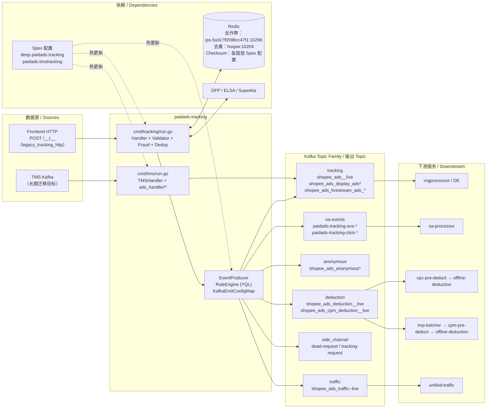

<!-- ads-workspace-gdoc-sync: gdoc_id=1ntvwmdcM5YfxuyeSnlbGa42wAyobLh2UdK3nS305LBc gdoc_url=https://docs.google.com/document/d/1ntvwmdcM5YfxuyeSnlbGa42wAyobLh2UdK3nS305LBc/edit -->

# paidads-tracking / 广告 Tracking 入口服务

> **Contributors**: fengjiao.wang ｜ **最后更新**：2026-05-27 ｜ [GitLab](https://git.garena.com/shopee/search_recommend/ai-copilot/ads-workspace/-/blob/master/docs/common/readme/paidads-tracking/README.zh-CN.md)

> **Language**: [English](README.md) | [中文](README.zh-CN.md)

Git Repository: https://git.garena.com/shopee/deep/paidads-tracking

---

## 目录 / Table of Contents

1. [项目概述 / Introduction](#项目概述--introduction)
2. [核心功能 / Features](#核心功能--features)
3. [广告产品与业务语义 / Ad Products and Business Semantics](#广告产品与业务语义--ad-products-and-business-semantics)
   - [产品范围与入口差异 / Product Scope and Entry Differences](#产品范围与入口差异--product-scope-and-entry-differences)
   - [按广告产品的处理分支 / Product-specific Processing Branches](#按广告产品的处理分支--product-specific-processing-branches)
   - [关键业务判断 / Key Business Decisions](#关键业务判断--key-business-decisions)
4. [项目架构 / Architecture](#项目架构--architecture)
   - [上下游调用拓扑 / Service Topology](#上下游调用拓扑--service-topology)
   - [上下游与系统定位 / Upstream, Downstream, and System Positioning](#上下游与系统定位--upstream-downstream-and-system-positioning)
   - [消息处理主链路 / Main Message Processing Flow](#消息处理主链路--main-message-processing-flow)
   - [在线与离线 / TMS 分流 / Online, Offline, and TMS Flows](#在线与离线--tms-分流--online-offline-and-tms-flows)
   - [运行时组件与依赖 / Runtime Components and Dependencies](#运行时组件与依赖--runtime-components-and-dependencies)
5. [Kafka 与事件契约 / Kafka and Event Contracts](#kafka-与事件契约--kafka-and-event-contracts)
   - [Consumer 与输入 Topic / Consumers and Input Topics](#consumer-与输入-topic--consumers-and-input-topics)
   - [Producer 与输出 Topic / Producers and Output Topics](#producer-与输出-topic--producers-and-output-topics)
   - [重试、DLQ 与旁路输出 / Retry, DLQ, and Side Outputs](#重试dlq-与旁路输出--retry-dlq-and-side-outputs)
6. [Redis 与缓存 / Redis and Caching](#redis-与缓存--redis-and-caching)
   - [缓存使用场景 / Caching Use Cases](#缓存使用场景--caching-use-cases)
   - [关键缓存数据结构 / Key Cached Data Structures](#关键缓存数据结构--key-cached-data-structures)
   - [缓存更新与失效策略 / Cache Update and Invalidation Strategies](#缓存更新与失效策略--cache-update-and-invalidation-strategies)
7. [目录结构 / Directory Structure](#目录结构--directory-structure)
8. [服务入口与关键模块 / Entrypoints and Key Modules](#服务入口与关键模块--entrypoints-and-key-modules)
   - [入口二进制 / Service Binaries](#入口二进制--service-binaries)
   - [Handler / Service / Manager 分层 / Handler, Service, and Manager Layers](#handler--service--manager-分层--handler-service-and-manager-layers)
   - [按广告产品的模块映射 / Product-specific Module Mapping](#按广告产品的模块映射--product-specific-module-mapping)
   - [工具与一次性脚本 / Tools and One-off Scripts](#工具与一次性脚本--tools-and-one-off-scripts)
9. [协议与数据模型 / Protocol and Data Models](#协议与数据模型--protocol-and-data-models)
   - [输入事件模型 / Input Events Data Models](#输入事件模型--input-events-data-models)
   - [输出事件模型 / Output Events Data Models](#输出事件模型--output-events-data-models)
   - [核心业务字段 / Core Business Fields](#核心业务字段--core-business-fields)
   - [历史数据与缓存模型 / History and Cache Models](#历史数据与缓存模型--history-and-cache-models)
10. [配置与部署 / Configuration and Deployment](#配置与部署--configuration-and-deployment)
    - [静态配置文件 / Static Config Files](#静态配置文件--static-config-files)
    - [动态配置与热更新 / Dynamic Config and Hot Reload](#动态配置与热更新--dynamic-config-and-hot-reload)
    - [Kafka / Redis / DB / SPEX 配置矩阵 / Kafka, Redis, DB, and SPEX Config Matrix](#kafka--redis--db--spex-配置矩阵--kafka-redis-db-and-spex-config-matrix)
    - [构建与发布 / Build and Release](#构建与发布--build-and-release)
11. [监控与排障 / Monitoring and Operations](#监控与排障--monitoring-and-operations)
    - [健康检查与运行时端点 / Health Checks and Runtime Endpoints](#健康检查与运行时端点--health-checks-and-runtime-endpoints)
    - [关键指标与日志 / Key Metrics and Logs](#关键指标与日志--key-metrics-and-logs)
    - [数据重复、漏数、延迟排查 / Duplicate, Missing, and Delayed Data Troubleshooting](#数据重复漏数延迟排查--duplicate-missing-and-delayed-data-troubleshooting)
    - [常见故障定位 / Troubleshooting Playbook](#常见故障定位--troubleshooting-playbook)
12. [关键术语 / Key Terms](#关键术语--key-terms)
13. [参考资料 / Additional Resources](#参考资料--additional-resources)
14. [常见问题 / Frequently Asked Questions](#常见问题--frequently-asked-questions)

---

## 项目概述 / Introduction

`paidads-tracking` 是广告数据（Ads Data）的入口——是 Shopee 广告计费流水线中所有广告 tracking 事件的第一跳。历史上的主要数据源是 Ads 团队自建的 HTTP 入口（`cmd/tracking/`），接收前端 HTTP tracking beacon 请求（`POST /__t__`）。本服务同时维护一套独立的 TMS runtime（`cmd/tms/`），从 Kafka 消费公司级 tracking 事件。

**tracking 与 TMS 是两套不同的数据源**：tracking 是 Ads 团队早期自建入口；TMS（Tracking Management System）是公司级数据源，是所有 tracking 流量的长期迁移目标。

本仓库产生两个二进制：

| 二进制 | 入口 | 用途 |
|--------|------|------|
| `paidads_tracking_server` | `cmd/tracking/run.go` | fasthttp HTTP 服务器——主 tracking 入口，接收 `POST /__t__` |
| `paidads_tms_server` | `cmd/tms/run.go` | TMS Kafka consumer——将 TMS 事件路由到下游 Kafka topic |

两个二进制共享相同的核心职责：**标准化、校验、去重、补充 metadata、再路由到 Kafka**。

---

## 核心功能 / Features

按处理阶段拆解：

1. **接入** — fasthttp 服务器（`concurrency: 10240`，`read-timeout: 500ms`）接收来自 Shopee 前端和 App 的 `POST /__t__` tracking beacon。所有路径（包括被拒绝的事件）均返回 1×1 GIF。
2. **标准化** — 原始 `AdsData` / jsarray payload 由 `handler/json_data.go` 解码，并标准化为规范的 `ads.Tracking` proto（`git.garena.com/shopee-server/shopee_protobuf/beeshop_ads.pb`）。
3. **校验** — `internal/validate/validator.go` 在启用匿名检查时，验证 tracking ID 是否为 `shopee_analytics`；`TrackingValidator` 解密并核验 `session_id + token` 与 `user_id` 的一致性。
4. **Checksum 去重** — `handler/checksum.go` 计算请求体的 xxHash，并与各国对应的 Redis 实例（TTL 12 小时）比对；具有相同请求体 checksum 的重复请求在进入后续处理前被直接丢弃。
5. **反作弊 / DFP 打标** — `internal/fraud/fraud.go` 评估 rule2–rule20（点击和曝光频率限制、IP 限速、封禁用户、冻结账户、TW 特定限制）。`handler/dfp_client.go` 集成 DFP（Digital Fingerprint）信号。
6. **规则路由** — `handler/event_producer.go` 遍历 `KafkaEmitConfigMap`（从 Spex 加载的 YQL 表达式），对每条事件逐条评估规则，并发送到匹配的 topic family。Producer 被禁用或不存在时拒绝发送，不会静默丢弃。
7. **旁路输出** — `handler/dead_request_producer.go` 将基础校验、解析、Token 最终校验或 raw tracking 校验失败的请求路由到死信 topic。`pkg/event_producer/tracking_request_producer.go` 对请求进行采样，用于回归分析。

---

## 广告产品与业务语义 / Ad Products and Business Semantics

### 产品范围与入口差异 / Product Scope and Entry Differences

paidads-tracking 在 HTTP 层面对产品类型无感知——它接收来自任何前端投放位的统一 `AdsData` payload。事件字段 `placement`、`entrance`、`pageType` 和 `operation` 承载了区分下游产品的语义：

| 产品类型 | 主要 Placement / Entrance | 对路由的影响 |
|---------|--------------------------|------------|
| Item / KeywordAds | 搜索投放位 | → 扣款 topic（CPC）→ `cpc-pre-deduct` |
| Shop / BrandBanner | 商店 / 展示投放位 | → 展示 tracking topic → `rngprocessor`；`operation=click` 时进入扣款流程 |
| Livestream | 直播投放位 | → `shopee_ads_livestream_ads_<region>_live`；impression 规则 rule15/18/19 生效 |
| CPM / OCPM | impression 操作 | → CPM 扣款 topic → `imp-batcher` → `cpm-pre-deduct` |
| Anonymous | 无登录 session | → `shopee_ads_anonymous*` topic（独立路径） |

所有产品类型最终汇聚为统一的 `ads.Tracking` 模型；`placement` / `entrance` / `operation` 决定哪些 YQL 规则命中以及选择哪个下游 topic family。

### 按广告产品的处理分支 / Product-specific Processing Branches

| 路径 | 触发条件 | 输出 |
|------|---------|------|
| 标准 CPC tracking | `operation=click`，已登录用户 | → `shopee_ads_deduction_<region>_live`（CPC 扣款）+ tracking topic |
| CPM 曝光 | `operation=impression`，CPM 广告类型 | → `shopee_ads_cpm_deduction_<region>_live`（CPM 扣款）+ 展示 topic |
| OCPM 曝光 | OCPM 投放位 | → CPM 扣款 topic，YQL 按 OCPM 子类型路由 |
| OA / org 事件 | OA entrance | → `paidads-tracking-avs-*`、`paidads-tracking-click-*`、`shopee-tracking-validation-global-live`（→ `oa-processor`） |
| 匿名 | 无有效 session / 用户 | → `shopee_ads_anonymous*`；反作弊和去重检查仍然执行 |
| Traffic 事件 | 所有类型 | → `shopee_ads_traffic-<region>-live`（长期统一流量目的地） |

Traffic 输出是配置驱动的 topic family，实际是否产出取决于 Spex `KafkaEmitConfigMap` / graph 配置中对应规则是否命中；本服务代码只提供路由和 producer 框架，不在仓库常量中硬编码所有事件必然发往 traffic topic。

### 关键业务判断 / Key Business Decisions

| 判断点 | 逻辑 | 代码位置 |
|--------|------|---------|
| 请求拒绝 vs 静默丢弃 | 基础校验失败、proto/jsarray 解析失败、`ReplaceJSONData` 失败、Token 最终校验失败和 raw tracking 校验失败会进入死信；checksum 去重命中、反作弊拒绝和事件级去重命中不会写死信。服务始终返回 200。 | `handler/handler.go`、`handler/dead_request_producer.go` |
| 登录 vs 匿名流程 | `live.yml` 中 `is-check-anonymous-tracking-id: true`——匿名 tracking ID 需等于 `shopee_analytics` | `internal/validate/validator.go` |
| Producer 禁用保护 | `handler/event_producer.go` 在 producer 被禁用或不存在时拒绝发送；触发 `error_producer_config` 计数器 | `handler/event_producer.go` |
| Checksum 先于反作弊 | Checksum 去重在反作弊评估之前执行，避免对重复请求体进行 Redis 反作弊往返 | `handler/handler.go` 启动顺序 |
| 国家级扣款资格 | Spex `DeductionCountries` map 控制哪些国家可进入扣款 topic 路由 | `config/spex.go` |

---

## 项目架构 / Architecture

### 上下游调用拓扑 / Service Topology



### 上下游与系统定位 / Upstream, Downstream, and System Positioning

**上游**

| 名称 | 协议 | 描述 |
|------|------|------|
| 前端 HTTP tracking | HTTP（fasthttp） | Ads 团队自建遗留入口——接收前端 HTTP tracking 请求（`POST /__t__`） |
| TMS Kafka | Kafka | 公司级 tracking 数据源；`cmd/tms/run.go` 入口——长期迁移目标 |

**下游**

| 名称 | 协议 | 描述 |
|------|------|------|
| rngprocessor / DE（tracking topics） | Kafka | 主 tracking 事件流（tracking / display / livestream topic family），由 report-ng 和 DE 消费 |
| oa-processor（OA 事件 topics） | Kafka | OA/org 事件流（`paidads-tracking-avs-*`、`paidads-tracking-click-*`、`shopee-tracking-validation-global-live`） |
| cpc-pre-deduct（deduction topics） | Kafka | CPC 扣款事件流（`shopee_ads_deduction_<region>_live`） |
| imp-batcher / cpm-pre-deduct（cpm_deduction topics） | Kafka | CPM 扣款事件流（`shopee_ads_cpm_deduction_<region>_live`），经 imp-batcher 聚合后到 cpm-pre-deduct |
| unified-traffic（traffic topics） | Kafka | 流量事件流（`shopee_ads_traffic-<region>-live`）——长期统一方向 |
| request-sampling / failure-analysis（旁路） | Kafka | 请求采样和死请求旁路输出 |

**依赖**

| 名称 | 类型 | 描述 |
|------|------|------|
| Redis — user_info_and_temp_ban_cache | 数据存储 | 用户信息缓存和临时封禁标记（`ips.5a3c7f0598cc47f1.elasticredis.cloud.shopee.io:10296`），TTL：user_info 3 小时 / 封禁规则驱动 |
| Redis — duplicate_cache | 数据存储 | 请求去重（`hoqsw.elasticredis.cloud.shopee.io:10204`），超时 50ms |
| Redis — checksum_cache | 数据存储 | 请求体 checksum 去重（各国按 Spex `ChecksumConfig` 配置），TTL 12 小时 |
| Spex 配置 | 服务 | 动态配置（`deep.paidads.tracking` 和 `paidads.tmstracking`）——Kafka 路由、死请求、checksum、debug shop ID |

### 消息处理主链路 / Main Message Processing Flow

服务主链路总结（5 条主干）：

```
tracking → tracking topics → rngprocessor 和 DE
tracking → OA/org 事件 topics → oa-processor
tracking → deduction topics → cpc-pre-deduct → offline-deduction
tracking → cpm_deduction topics → imp-batcher → cpm-pre-deduct → offline-deduction
tracking → traffic topics → unified-traffic consumer（长期方向）
```

单请求处理路径（`cmd/tracking/run.go` + `handler/handler.go`）：

```
POST /__t__
    └─ handler.Handler(ctx)
        ├─ (1) 基础校验：单条 item / user_id / ads_id 必填
        ├─ (2) Checksum 去重：xxHash(请求体) → Redis（命中则跳过）
        ├─ (3) TokenValidator.Validate：AES 解密 session_id + token，核验 user_id
        ├─ (4) FraudDetector.Check：rule2–rule20（Redis 限流器 + 用户缓存 + DFP）
        ├─ (5) DeDuplicator.Deduplicate：Redis 多键去重
        └─ (6) EventProducer.Emit
                └─ 遍历 KafkaEmitConfigMap → RuleEngine.ExecuteRule(rule, event)
                        └─ 命中 KafkaEmitConf
                                └─ PostProcessFn（如 splitLSTracking / filterAdsLSTracking）
                                        └─ TopicInfo.Topics[country]
                                                └─ Kafka 发送（key = SaltWindow 对齐的 event_time）

返回：200 OK + 1×1 GIF（所有路径，包括被拒绝的事件）
```

### 在线与离线 / TMS 分流 / Online, Offline, and TMS Flows

| 流 | 入口二进制 | 来源 | 处理 | 输出 |
|----|---------|------|------|------|
| 在线 tracking | `paidads_tracking_server` | HTTP `POST /__t__` | 完整流水线：校验 → checksum → 反作弊 → 去重 → 规则路由 | 所有 Kafka topic family |
| TMS tracking | `paidads_tms_server` | Kafka `KafkaEvent` / `UbtKafkaEvent` | `TMSHandler.Process()` → 按 placement 分发到 `ads_handler/*` → `BuildTrackings()` | tracking topic family（使用 TMS Spex 配置） |

TMS 二进制使用独立的 Spex server-name（`paidads.tmstracking`）和独立的 `DeDuplicator` 实例，不执行反作弊评估，也没有 HTTP 入口。

### 运行时组件与依赖 / Runtime Components and Dependencies

| 组件 | 职责 |
|------|------|
| `handler.Handler` | 主请求 Handler——编排所有处理阶段 |
| `handler.EventProducer` | Kafka 发送引擎——持有 `KafkaBrokerConfigMap` 和 `KafkaEmitConfigMap` |
| `internal/rule_engine.RuleEngine` | 对事件字段评估 `KafkaEmitConfigMap` 中的 YQL 规则 |
| `internal/validate.TrackingValidator` | AES-CBC 解密并校验 session_id + token |
| `internal/fraud.FraudDetector` | 评估 rule2–rule20；使用 Redis 限流器、用户缓存、反作弊用户名单 |
| `internal/deduplicator.DeDuplicator` | Redis 多键事件去重 |
| `handler.Checksum` | xxHash 请求体 → 各国 Redis checksum 去重 |
| `handler.DfpClient` | DFP（Digital Fingerprint）集成 |
| `handler.DeadRequestProducer` | 将基础校验、解析、Token 最终校验或 raw tracking 校验失败的请求路由到死信 Kafka topic |
| `pkg/event_producer.TrackingRequestProducer` | 对请求进行采样，发送到回归 / 采样 Kafka topic |
| `internal/spex` | Spex 配置代理——初始获取 + `WatchSpex()` 热更新 |
| `internal/global_resource.GlobalResource` | 启动时一次性初始化的共享组件持有者 |

---

## Kafka 与事件契约 / Kafka and Event Contracts

### Consumer 与输入 Topic / Consumers and Input Topics

`paidads_tracking_server` 不消费 Kafka——它是 HTTP 服务器。`paidads_tms_server` 消费 Kafka：

| 二进制 | Spex Server-name | 输入事件类型 |
|--------|-----------------|------------|
| `paidads_tms_server` | `paidads.tmstracking` | `KafkaEvent`、`UbtKafkaEvent`（定义在 `pb/tms.proto`） |

所有 Kafka Broker 地址和 topic 名称均来自 Spex；静态 YAML 中无任何硬编码。

### Producer 与输出 Topic / Producers and Output Topics

**`KafkaBrokerConfigMap`** 是 Producer 池：将 Producer 名称映射到 Broker 连接配置。**`KafkaEmitConfigMap`** 是规则到 topic family 的路由表：将规则名称映射到 YQL 表达式 + `TopicInfos`。这是两个独立的 Spex 配置结构。

按类别分组的 Kafka 输出（来自 `KafkaEmitConfigMap` 路由）：

| 类别 | 子类别 | Topic Family | Kafka Key | 主要消费方 |
|------|--------|-------------|-----------|----------|
| tracking | main_tracking | `shopee_ads_<region>_live` | userid | rngprocessor、DE |
| tracking | display_tracking | `shopee_ads_display_ads*` | userid | rngprocessor、DE |
| tracking | livestream_tracking | `shopee_ads_livestream_ads_<region>_live` | userid | rngprocessor、DE |
| tracking | oa_report_events | `paidads-tracking-avs-*`、`paidads-tracking-click-*`、`shopee-tracking-validation-global-live` | 各流不同 | oa-processor |
| deduction | cpc_deduction | `shopee_ads_deduction_<region>_live` | firstShopID | cpc-pre-deduct、offline-deduction |
| deduction | cpm_deduction | `shopee_ads_cpm_deduction_<region>_live` | firstAdsid / adsid（按流） | imp-batcher、cpm-pre-deduct、offline-deduction |
| anonymous | tracking | `shopee_ads_anonymous*` | `''` | 非主干 |
| anonymous | display_tracking | `shopee_ads_display_ads_anonymous*` | `''` | 非主干 |
| traffic | event_traffic | `shopee_ads_traffic-<region>-live` | userid | unified-traffic |
| side_channel | tracking_request | `shopee-ads-tracking-req-recording-global-live` | producer_hash | request-sampling |
| side_channel | dead_request | `shopee_ads_tracking_failed_requests` | producer_hash | failure-analysis |

**traffic** 输出是 tracking 类输出的长期统一方向。多个其他输出是历史演进的结果——扣款相关的内部输出（deduction、cpm_deduction）保持不变。

精确 topic 名称来自 Spex `KafkaEmitConfigMap`；仓库定义 topic family、路由规则、国家 fallback 和 Kafka key。`PostProcessFn` 值 `splitLSTracking`（→ `SplitCPMTracking()`）和 `filterAdsLSTracking`（→ `FilterCPMTracking()`）是仅有的进程内后处理器。

### 重试、DLQ 与旁路输出 / Retry, DLQ, and Side Outputs

- **死信**（`shopee_ads_tracking_failed_requests`）：由 `DeadRequestProducer` 写入，覆盖基础校验失败、HTTP 请求体 proto/jsarray 解析失败、`ReplaceJSONData` 失败、Token 最终校验失败和 raw tracking 校验失败。Checksum 命中、反作弊拒绝、事件级去重命中以及 graph 执行失败**不会**写入死信；其中 graph 执行失败只记录日志并返回。
- **采样**（`shopee-ads-tracking-req-recording-global-live`）：由 `TrackingRequestProducer` 按 Spex 配置的 `TrackingReqSamplePerThousand` 比例采样，用于回归回放。
- 无 consumer 侧重试：`paidads_tracking_server` 是无状态 HTTP 服务器。`paidads_tms_server` 依赖 EKL consumer 的重试语义处理 Kafka consumer 错误。

---

## Redis 与缓存 / Redis and Caching

paidads-tracking 中的 Redis 服务于**正确性功能**——用户状态、反作弊计数器、去重、请求体 checksum——而非数据持久化或历史存储。

### 缓存使用场景 / Caching Use Cases

| 缓存名称 | 用途 | 访问时机 |
|---------|------|---------|
| `user_info_and_temp_ban_cache` | 用户基本信息（注册日期、手机验证状态）+ 反作弊规则设置的临时封禁标记 | `FraudDetector.Check()` 中需要用户年龄 / 状态的规则 |
| `fraud_user_hash` | 反作弊黑名单用户 ID 的哈希表 | `frauduser.Client.IsFraud()`（rule10） |
| `limiter_and_fraud_counter_cache` | 按用户 / 设备 / IP / 主播的滚动窗口点击 / 曝光计数器 | rule2–rule9、rule11、rule15–rule20 |
| `duplicate_cache` | 多键请求去重 | `DeDuplicator.Deduplicate()`，在 EventProducer 之前 |
| `checksum_cache` | 各国请求体 xxHash 存在性检查 | 处理流水线早期的 `Checksum.Check()` |
| `data-tracker` | 内部 tracking 数据；通过 `ips.e50792bd70fe1cff:10884` 访问 | `tracking_transform.go` |

### 关键缓存数据结构 / Key Cached Data Structures

| 缓存 | 配置块 | 生产地址 | Key 格式 | Value | TTL |
|------|--------|---------|---------|-------|-----|
| user_info + 封禁 | `fraud.user-cache.cache` | `ips.5a3c7f0598cc47f1.elasticredis.cloud.shopee.io:10296` | `user_info::<userID>` / `ban::<userID>_<placement>` | 序列化用户信息 / 封禁标记 | user_info: 3 小时；封禁：规则驱动 |
| fraud_user_hash | `fraud.fraud-user-cache` | `ips.5a3c7f0598cc47f1.elasticredis.cloud.shopee.io:10296` | `fraud_user`（Hash；field = userID） | 存在性反作弊标记 | — |
| 限流计数器 | `fraud.limiter-cache` | `ips.5a3c7f0598cc47f1.elasticredis.cloud.shopee.io:10296` | `oneAccOneDay::<day>_<userID>_<adsID>_<kw>` / `oneIPOneHour::<hour>_<ip>` / `oldAccOneDay::<day>_<userID>_<placement>` | 整数计数器 | 规则驱动的滚动窗口 |
| 去重 | `de-duplicator-config` | `hoqsw.elasticredis.cloud.shopee.io:10204` | `dedup:<reqID>:<userID>:<adsID>:<ts>:<op>` / `pdc:dedup:<userID>:<adsID>:<itemID>:<ts>` / `dedup:<userID>:<adsID>:<itemID>:<ts>:<op>:...` / `uniqueid:dedup:<userID>:<uniqueID>` | 空标记 | 10分钟 / — / 1分钟 / 1小时 |
| checksum | `checksum-config.redis-config-by-country`（Spex） | SG/默认：`zb433.elasticredis.cloud.shopee.io:11337`；ID：`vqa79:11336`；PH：`jd3hr:11357`；MY：`fnlmg:11338`；TH：`qxldd:11358`；VN：`jlpje:11364`；TW：`onhhd:11366`；BR：`cqjml:11370`；MX：`qzlbh:11389` | `<xxhash(请求体)-hex>` | 空标记 | 12 小时 |

**checksum key** 是整个请求体 xxHash 的十六进制字符串——它不是业务主键。checksum key 命中表示在 TTL 窗口内收到了请求体完全相同的请求，该请求将被丢弃，不进入后续处理。

**去重 key family** 覆盖不同事件类型。`dedup:` 是标准点击去重 key。`pdc:dedup:` 用于商品点击去重。`dedup:...:...:...:...:op:...`（antou 模式）用于 antou 事件去重。`uniqueid:dedup:` 防止唯一 ID 碰撞。这些是正确性 key，而非历史 key——TTL 含义是"在此窗口内忽略重复"。

### 缓存更新与失效策略 / Cache Update and Invalidation Strategies

| 缓存 | 写入路径 | 失效方式 |
|------|---------|---------|
| user_info | `pkg/usercache/user_cache.go` — 未命中时从 Superkia/ELSA 获取，写入 TTL 3 小时 | 仅 TTL 过期 |
| 封禁标记 | 反作弊 rule7 触发时由 `uc.SetUserBan()` 写入 | TTL 过期（规则驱动） |
| fraud_user_hash | 由反作弊团队外部同步；服务仅读取 | 外部同步 |
| 限流计数器 | `pkg/cache/limiter.go` — 每条事件执行原子 INCR | TTL 过期（按滚动窗口） |
| 去重 | 首次出现时由 `DeDuplicator.Set()` 写入 | TTL 过期 |
| checksum | 首个有效请求体时由 `Checksum.Set()` 写入 | TTL 过期（12 小时） |

Spex `ChecksumConfig` 变更（TTL、各国 Redis）通过 `WatchSpex()` 热更新应用，无需重启。

---

## 目录结构 / Directory Structure

```
paidads-tracking/
├── cmd/
│   ├── tracking/             # paidads_tracking_server — HTTP 入口
│   └── tms/                  # paidads_tms_server — TMS Kafka consumer
├── config/
│   └── files/                # 静态 YAML：live / liveish / uat / staging / test / regression / diff
├── handler/                  # 主 Handler、EventProducer、DeadRequestProducer、Checksum、DfpClient
│   ├── handler.go            # 主请求 Handler
│   ├── event_producer.go     # Kafka 发送引擎（KafkaBrokerConfigMap + KafkaEmitConfigMap）
│   ├── dead_request_producer.go  # 死信 Producer
│   ├── checksum.go           # xxHash 请求体去重
│   ├── dfp_client.go         # DFP 集成
│   ├── fraud.go              # 反作弊评估封装
│   ├── validation.go         # Token 校验封装
│   └── json_data.go          # jsarray / proto payload 解码器
├── ads_handler/              # TMS 路径广告类型 Handler：item / shop / banner / livestream / video
├── internal/
│   ├── validate/             # TrackingValidator — AES-CBC session_id + token 校验
│   ├── fraud/                # FraudDetector — rule2–rule20
│   ├── rule_engine/          # YQL RuleEngine — 评估 KafkaEmitConfigMap 规则
│   ├── deduplicator/         # DeDuplicator — Redis 多键事件去重
│   ├── spex/                 # Spex 配置代理 + WatchSpex
│   ├── httphandler/          # fasthttp 服务器配置
│   ├── encoder/              # AES 加密工具
│   ├── exporter/             # TMS Prometheus 指标
│   └── global_resource/      # 共享组件持有者
├── pkg/
│   ├── event_producer/       # TrackingRequestProducer（采样）
│   ├── cache/                # Limiter（滚动窗口 Redis 计数器）
│   ├── frauduser/            # 反作弊用户名单客户端
│   └── usercache/            # 用户信息缓存（Superkia / ELSA 后端）
├── pb/                       # tms.proto — KafkaJobTask、KafkaEvent、UbtKafkaEvent
├── gen/                      # 生成的 protobuf 代码
├── go.mod                    # module: git.garena.com/shopee/deep/paidads-tracking，go 1.24
└── Makefile
```

---

## 服务入口与关键模块 / Entrypoints and Key Modules

### 入口二进制 / Service Binaries

| 二进制 | 启动文件 | 组装的关键组件 | Spex 配置 |
|--------|---------|--------------|----------|
| `paidads_tracking_server` | `cmd/tracking/run.go` | `DeadRequestProducer` → `TrackingRequestProducer` → `EventProducer` → `DfpClient` → `Spex.Init` → `FraudDetector` → `DeDuplicator` → `ChecksumManager` → `GraphDriver` → `GlobalResource` → `Handler` → `WatchSpex` → HTTP 服务器 | `deep.paidads.tracking` |
| `paidads_tms_server` | `cmd/tms/run.go` | TMS Kafka consumer、`TMSHandler`、按 placement 分发到 `ads_handler/*`、`UbtProducer`、`UbtaProducer` | `paidads.tmstracking` |

### Handler / Service / Manager 分层 / Handler, Service, and Manager Layers

**`handler.Handler`** (`handler/handler.go`)：

HTTP 请求的主入口，编排完整的校验流水线：
1. `JsonDataProcessor.Process()` — 将原始 payload 解码为 `ads.Tracking`
2. `Checksum.Check()` — 提前拒绝重复的请求体
3. `TrackingValidator.Validate()` — AES session token 校验
4. `FraudDetector.Check()` — rule2–rule20 评估
5. `DeDuplicator.Deduplicate()` — Redis 多键去重
6. `EventProducer.Emit()` — YQL 规则扫描、topic 路由、Kafka 发送

**`handler.EventProducer`** (`handler/event_producer.go`)：

持有由 `UpdateKafkaBySpex()` 更新的两个 Spex 驱动 map：
- `KafkaBrokerConfigMap`：Producer 名称 → Broker 连接配置（连接池管理）
- `KafkaEmitConfigMap`：规则名称 → `{Rule string (YQL)，TopicInfos []*TopicInfo，PostProcessFn string}`

每次发送时：遍历 `KafkaEmitConfigMap` → `RuleEngine.ExecuteRule(rule, event)` → 命中时：应用 `PostProcessFn` → 解析 `TopicInfo.Topics[country]` → 将 `event_time` 对齐到 `SaltWindow` → `KafkaBrokerConfigMap[producer].Send`。若 Producer 被禁用（`conf.IsDisable`）或尚未初始化，发送被拒绝——不会静默丢弃。

**`internal/validate.TrackingValidator`** (`internal/validate/validator.go`)：

- 配置有 `IsCheckLoginTrackingID` 和 `IsCheckAnonymousTrackingID`
- 启用匿名检查时，验证 tracking ID 是否等于 `shopee_analytics`
- AES-CBC 解密 `session_id`，核验内嵌签名是否与 `user_id` 匹配

**`internal/fraud.FraudDetector`** (`internal/fraud/fraud.go`、`internal/fraud/rule.go`)：

按 Spex `evalSeq` 确定的顺序评估以下规则：

| 规则 | 范围 | 上限 | 窗口 | 类型 |
|------|------|------|------|------|
| rule2 | 用户 + 广告 + 关键词 | 5 次 | 1 天 | CPC 点击 |
| rule3 | IP | 1000 次 | 1 小时 | CPC 点击 |
| rule4 | 老用户 + 投放位 | 30 次 | 1 天 | CPC 点击 |
| rule5 | 设备 + 投放位 | 30 次 | 1 天 | CPC 点击 |
| rule6 | 新用户 | 0 次 | 1 天 | CPC 点击——封禁新用户 |
| rule7 | 用户封禁检查 | — | — | rule4/6 触发后 3 小时临时封禁 |
| rule8 | 用户 + 广告 | 2 次 | 5 分钟 | CPC 点击 |
| rule9 | 用户 + 广告 + 关键词 | 4 次 | 1 天 | CPC 点击 |
| rule10 | 反作弊用户名单 | — | — | 封禁黑名单用户 |
| rule11 | 用户 + 广告 | 3 次 | 5 分钟 | CPC 点击（与 rule8 互斥） |
| rule13 | 新用户（≤7 天） | 0 次 | 1 天 | 封禁新账户 |
| rule14 | 冻结账户 | 0 次 | — | 封禁冻结账户 |
| rule15 | 用户 + 主播 | 10 次 | 1 天 | 曝光 |
| rule16 | 用户 | 200 次 | 1 天 | 曝光 |
| rule17 | 设备 | 200 次 | 1 天 | 曝光 |
| rule18 | 用户 + 主播 | 2 次 | 30 秒 | 曝光 |
| rule19 | 设备 + 主播 | 2 次 | 30 秒 | 曝光 |
| rule20 | 用户 + 广告 | 20 次 | 1 天 | 曝光 |

rule1 和 rule12 在代码中未激活。每条规则的启用 / 禁用、国家范围、投放位范围和阻断行为均由 Spex `FraudConfig.RuleConfigMap` 控制。

### 按广告产品的模块映射 / Product-specific Module Mapping

| 广告类型 | Handler 路径 | 输出 |
|---------|------------|------|
| Item / KeywordAds（TMS） | `ads_handler/item.go` | `BuildTrackings()` → tracking topic |
| Shop / BrandBanner（TMS） | `ads_handler/shop.go` | `BuildTrackings()` → tracking topic |
| DisplayAds / Banner（TMS） | `ads_handler/banner.go` | `BuildTrackings()` → display topic |
| LiveStream（TMS） | `ads_handler/livestream.go` | `BuildTrackings()` → livestream topic |
| Video（TMS） | `ads_handler/video.go` | `BuildTrackings()` → tracking topic |
| 所有类型（HTTP） | `handler/handler.go` → `EventProducer` | YQL 规则路由 → 所有 topic family |

### 工具与一次性脚本 / Tools and One-off Scripts

```bash
# 通过回放线上请求进行自测
cd tools && sh scripts/grep_tracking_requests.sh  # 拉取线上真实请求
go run ./stress_test -src data/tracking_request_1000.json  # 回放

# 构建
make tracking   # bin/paidads_tracking_server
make tms        # bin/paidads_tms_server
make all        # vet + tracking

# 代码质量
make vet && make fmt && make gci && make lint-fix

# 测试
make test       # 带覆盖率
make test-race  # 带竞态检测器
```

---

## 协议与数据模型 / Protocol and Data Models

### 输入事件模型 / Input Events Data Models

**HTTP tracking（`paidads_tracking_server`）**

| 格式 | 描述 | 代码 |
|------|------|------|
| Proto 编码的 `AdsData` | `POST /__t__` body，包含二进制 proto payload | 在 `handler/json_data.go` 中解码 |
| jsarray 编码的 `AdsData` | 旧版客户端的 JSON 数组格式 | 在 `handler/json_data.go` 中解码 |

**TMS Kafka（`paidads_tms_server`）**

| 类型 | Import 路径 | 核心字段 |
|------|------------|---------|
| `KafkaJobTask` | `pb/tms.proto` | `Events []*KafkaEvent` |
| `KafkaEvent` | `pb/tms.proto` | `Data`、`AdType`、`Country` |
| `UbtKafkaEvent` | `pb/tms.proto` | UBT 特定的事件信封 |

### 输出事件模型 / Output Events Data Models

所有主要 tracking 输出事件使用规范的 `ads.Tracking` 类型：

| 类型 | Import 路径 | 描述 |
|------|------------|------|
| `ads.Tracking` | `git.garena.com/shopee-server/shopee_protobuf/beeshop_ads.pb` | 发送到所有 Kafka topic family 的主规范 tracking 事件 |

`paidads-tracking-proto` 仓库提供额外的 protobuf 类型：

| 文件 | GitLab 地址 | 描述 |
|------|-----------|------|
| `ads_data.proto` | https://git.garena.com/shopee/deep/paidads-tracking-proto/-/blob/master/pb/ads_data/ads_data.proto | tracking payload 的 AdsData 结构 |
| `trace.proto` | https://git.garena.com/shopee/deep/paidads-tracking-proto/-/blob/master/pb/trace/trace.proto | Trace 元数据 |

死请求信封：`handler/dead_request_producer.go` 在发送到死信 topic 之前，将原始 HTTP body 封装成错误信封。

### 核心业务字段 / Core Business Fields

由 `tracking_transform.go` 和 `json_data.go` 写入的 `ads.Tracking` 核心字段：

| 字段 | 描述 |
|------|------|
| `AdsId` | 广告 ID |
| `UserId` | 已登录用户 ID |
| `ShopId` | 店铺 ID |
| `ItemId` | 商品 ID |
| `Placement` | 广告投放位类型枚举 |
| `Entrance` | 入口枚举（搜索、首页等） |
| `Operation` | 事件操作类型（点击、曝光） |
| `PricingType` | CPC / CPM / OCPM |
| `Country` | 国家代码 |
| `EventTime` | 事件时间戳 |
| `UniqueId` | 客户端生成的唯一事件 ID |
| `Platform` | 平台枚举（Web、iOS、Android） |

### 历史数据与缓存模型 / History and Cache Models

paidads-tracking 在业务历史方面是无状态的——它不读写任何业务 DB。所有 Redis 缓存均为瞬态的正确性缓存：

- 用户信息缓存：从 Superkia/ELSA 获取，缓存 3 小时
- 反作弊计数器：每条规则的滚动窗口 INCR 操作，TTL 与窗口大小一致
- 去重缓存：事件存在性标记，TTL 与去重窗口一致（10 分钟–1 小时）
- Checksum 缓存：请求体哈希存在性标记，TTL 12 小时

---

## 配置与部署 / Configuration and Deployment

### 静态配置文件 / Static Config Files

位于 `config/files/`：

| 文件 | 环境 |
|------|------|
| `live.yml` | 生产环境 |
| `liveish.yml` | 类生产测试 |
| `uat.yml` | UAT |
| `staging.yml` | Staging |
| `test.yml` / `test_in_cn.yml` | 测试 |
| `regression_base.yml` / `regression_test.yml` | 回归测试 |
| `diff_test.yml` | 差异测试 |

`live.yml` 核心静态配置：

| 配置 | 值 |
|------|---|
| 端口 | `#EXPOSE_PORT` |
| fasthttp 并发数 | 10 240 |
| read-timeout | 500 ms |
| write-timeout | 50 ms |
| Spex server-name（tracking） | `deep.paidads.tracking` |
| Spex config-key（tracking） | `376adb7bf87534155d53c0a062f54af7` |
| Spex server-name（TMS） | `paidads.tmstracking` |
| Spex config-key（TMS） | `d3843505a59ecb121d3700d5c1e39ee5831143e3fd884a0d305a3e65e8d4b54f` |
| 反作弊 Redis | `ips.5a3c7f0598cc47f1.elasticredis.cloud.shopee.io:10296` |
| 去重 Redis | `hoqsw.elasticredis.cloud.shopee.io:10204`，超时 50 ms |
| `is-check-anonymous-tracking-id` | `true` |

所有 Kafka Broker 地址和 topic 名称均从 Spex 获取，静态 YAML 中无任何硬编码。

**本地运行**：

```bash
# 需要先启动 SPEX socket proxy
socat -d -d -d UNIX-LISTEN:/tmp/spex.sock,reuseaddr,fork TCP:agent-tcp.spex.test.shopee.io:9299
export SP_UNIX_SOCKET=/tmp/spex.sock
cd cmd/tracking && go run . -c config/files/live.yml   # 或 cmd/tms
```

### 动态配置与热更新 / Dynamic Config and Hot Reload

`WatchSpex()` 在启动时注册所有 Spex 变更监听器。变更在下一条入站请求时生效——无需重启。

| Spex 字段 | 描述 |
|---------|------|
| `KafkaBrokerConfigMap` | 按 Producer 名称划分的 Kafka Broker 连接配置（Producer 池） |
| `KafkaEmitConfigMap` | YQL 规则 + `TopicInfos` + `PostProcessFn` — 可热更新的事件路由 |
| `FraudConfig` | 各国 / 各投放位反作弊规则配置（`RuleConfigMap`） |
| `DeductionCountries` | 各国扣款资格 map |
| `ChecksumConfig` | Redis 请求体 checksum 去重——`RedisConfigByCountry`、TTL、`DisableByCountry` |
| `DFP` | DFP 客户端国家启用 + 超时 |
| `DeadRequest` | 死信 Kafka Producer 配置 |
| `TrackingRequest` | 采样 Producer 配置 + `TrackingReqSamplePerThousand` |
| `ValidPairKeyList` | 有效 pair-key 验证 map |
| `DebugShopIds` | Debug 店铺 ID 列表 → `util.UpdateDebugShopIDs()` |

### Kafka / Redis / DB / SPEX 配置矩阵 / Kafka, Redis, DB, and SPEX Config Matrix

paidads-tracking 无 DB 访问。Kafka 和 Redis 是唯一的外部系统。

**Redis**（详见 [Redis 与缓存](#redis-与缓存--redis-and-caching)）：
- 反作弊 / 用户缓存 / 限流器：静态配置在 `live.yml`（`ips.5a3c7f0598cc47f1:10296`）
- 去重：静态配置在 `live.yml`（`hoqsw:10204`）
- Checksum：从 Spex 按国家动态配置（不在静态 YAML 中）

**Kafka**：所有 Broker 地址和 topic 名称均来自 Spex `KafkaBrokerConfigMap` + `KafkaEmitConfigMap`。

### 构建与发布 / Build and Release

```bash
make tracking        # bin/paidads_tracking_server
make tms             # bin/paidads_tms_server
make all             # vet + tracking
make test            # 带覆盖率运行测试
make ci-remote       # vet + fmt + test（GitLab CI 流水线）
```

---

## 监控与排障 / Monitoring and Operations

### 健康检查与运行时端点 / Health Checks and Runtime Endpoints

| 端点 | 用途 |
|------|------|
| `/ping` | 存活检查 — 返回 200 OK |
| `/smoketest` | Mesos 就绪探针 |
| `/debug/payload` | 以 JSON 返回解析后的 tracking 消息；需要 Spex 中 `EnablePayloadDebug: true` |
| `/debug/cookie` | Cookie 校验调试；需要 Spex 中 `EnableCookieDebug: true` |

`/debug/payload` 和 `/debug/cookie` 需要显式的 Spex 标志——生产环境默认禁用。

### 关键指标与日志 / Key Metrics and Logs

指标前缀：`paidads_tracking_`

| 指标 | 类型 | 核心标签 | 描述 |
|------|------|---------|------|
| `counter` | 计数器 | country、operation、placement、login、rn_ver、platform | 每条 tracking 请求的事件计数 |
| `error` | 计数器 | country、operation、placement、type | 按错误类型统计的错误数 |
| `token_error` | 计数器 | country、operation | Token 校验失败计数 |
| `latency` | 直方图 | country、operation、placement | 端到端请求延迟 |
| `topic` | 计数器 | country、topic、placement | 按 topic 统计的 Kafka 发送数 |
| `server_concurrency` | 仪表盘 | — | 当前 fasthttp 并发连接数 |
| `tms_latency` | 直方图 | country、operation、placement | TMS 处理延迟 |
| `processor_counter` | 计数器 | country、processor、placement、entrance、operation | 处理步骤计数 |
| `error_producer_config` | 计数器 | — | Producer 配置错误（Producer 缺失 / 被禁用） |

### 数据重复、漏数、延迟排查 / Duplicate, Missing, and Delayed Data Troubleshooting

| 症状 | 可能原因 | 排查位置 |
|------|---------|---------|
| dead_request topic 积压 | 基础校验、proto/jsarray 解析、`ReplaceJSONData`、Token 最终校验或 raw tracking 校验失败 | `DeadRequestProducer` 指标；HTTP body 解析和校验错误日志 |
| 单国家无消息 | 该国 Spex `DeductionCountries` 被禁用 | 检查 Spex `DeductionCountries` map；按国家查看 `paidads_tracking_counter` |
| 重复 tracking 事件 | 去重 TTL 不匹配；`DeDuplicator` Redis 不可达 | 检查 `hoqsw` Redis 健康状态；查看 `paidads_tracking_error{type=dedup}` |
| 仅 TMS 故障 | TMS Spex 配置未更新；TMS Kafka consumer 积压 | 检查 `paidads.tmstracking` Spex；监控 TMS consumer 组积压 |
| tracking ID 校验失败 | 密钥轮换未传播；`WatchSpex` 故障 | 检查 `token_error` 计数器；确认 `WatchSpex` 已接收更新 |

### 常见故障定位 / Troubleshooting Playbook

| 症状 | 处理步骤 |
|------|---------|
| 某国家 `counter` 下降 | 检查 `paidads_tracking_error{type=fraud}` 和去重丢弃率；验证 Spex `DeductionCountries` |
| `token_error` 激增 | 检查 `WatchSpex` 是否收到密钥更新；验证上游 session 服务 |
| 某投放位事件缺失 | 检查 Spex `KafkaEmitConfigMap` 中该投放位的 YQL 规则；用 `/debug/payload` 检查事件字段 |
| 反作弊丢弃率激增 | 通过反作弊错误标签定位触发的规则编号；检查 Spex 中 `FraudRuleConf` |
| Checksum TTL 变更导致丢弃率变化 | Spex 传播 `ChecksumConfig` TTL 更新；新 TTL 对下一条请求生效；旧缓存条目按旧 TTL 过期 |
| Producer 热更新失败 | 检查 `error_producer_config` 计数器；核验 Spex `KafkaBrokerConfigMap` 中的 Broker 配置 |

---

## 关键术语 / Key Terms

| 术语 | 描述 |
|------|------|
| tracking | Ads Data 入口服务；前端 tracking beacon 的 Ads 团队自建 HTTP 遗留入口 |
| TMS | Tracking Management System——公司级 tracking 数据源；长期迁移目标 |
| traffic | tracking 类事件的长期统一 Kafka 输出方向 |
| deduction | 产生到下游扣款服务的 CPC/CPM 计费事件流 |
| rngprocessor | 消费 tracking topic family 的下游 report-ng 处理器 |
| oa-processor | 消费 `paidads-tracking-avs-*` 等 topic 的 OA/org 事件处理器 |
| imp-batcher | 位于 cpm_deduction topic 和 cpm-pre-deduct 之间的 CPM 曝光批处理器 |
| cpc-pre-deduct | 消费 deduction topic 的 CPC 预扣款服务 |
| cpm-pre-deduct | 消费 cpm_deduction topic 的 CPM 预扣款服务 |
| offline-deduction | 位于 cpc-pre-deduct / cpm-pre-deduct 下游的最终扣款 DB 提交服务 |
| click | `operation=click` 事件类型；路由到 CPC 扣款 topic |
| impression | `operation=impression` 事件类型；路由到 CPM 扣款 topic |
| adsData | HTTP body 中的原始 tracking payload（proto 或 jsarray 编码） |
| checksum | 请求体的 xxHash，用于早期重复检测；key 为哈希十六进制字符串 |
| fraud | 反作弊评估引擎（rule2–rule20）；Redis 频率限制 |
| KafkaBrokerConfigMap | Spex 配置：Producer 池——将 Producer 名称映射到 Broker 连接配置 |
| KafkaEmitConfigMap | Spex 配置：路由规则——将规则名称映射到 YQL 表达式 + topic 目标 |
| YQL | `KafkaEmitConfigMap` 中用于事件路由的规则表达式语言 |
| EventProducer | 主 Kafka Producer；同时持有 `KafkaBrokerConfigMap` 和 `KafkaEmitConfigMap` |
| ads.Tracking | 规范 tracking 事件类型（`git.garena.com/shopee-server/shopee_protobuf/beeshop_ads.pb`） |
| DeadRequestProducer | 将基础校验、解析、Token 最终校验或 raw tracking 校验失败的 HTTP 请求路由到死信 topic |
| SaltWindow | Kafka 消息 key 生成的时间对齐窗口（秒） |

---

## 参考资料 / Additional Resources

- [Ads Data 总览文档（Confluence）](https://confluence.shopee.io/display/SPAD/Data+Application)
- [Ads Data Hive 表说明（Confluence）](https://confluence.shopee.io/display/SPAD/Ads+Data+Hive+Tables)
- [Ads Data Howtos（Confluence）](https://confluence.shopee.io/pages/viewpage.action?pageId=2950810717)
- Git Repository：https://git.garena.com/shopee/deep/paidads-tracking

---

## 常见问题 / Frequently Asked Questions

**Q1：为什么 tracking 和 TMS 维护为两套独立 runtime？**

tracking（`cmd/tracking/`）是 Ads 团队自建的 HTTP 遗留入口；TMS（`cmd/tms/`）消费公司级 Kafka 数据源。它们的输入协议不同（HTTP vs Kafka），Spex 配置不同，扩缩容特性也不同。迁移期间两者必须并行运行。长期来看，所有 tracking 流量将迁移到 TMS Kafka 数据源，HTTP 入口将被下线。

**Q2：服务为什么在请求被拒绝时也返回 200？**

这是 tracking beacon 的刻意设计。返回非 200 状态码会导致客户端重试，放大欺诈流量和合法的重复事件。Checksum 命中、反作弊拒绝和事件级去重命中的请求被静默丢弃；基础校验失败、proto/jsarray 解析失败、`ReplaceJSONData` 失败、Token 最终校验失败和 raw tracking 校验失败会进入死信 topic。

**Q3：为什么有这么多 Kafka 输出 topic family？**

多个输出是历史演进的结果。每个下游团队（report-ng、oa-processor、imp-batcher 等）在首次接入时都要求独立的 topic。**traffic** 输出是 tracking 类输出的长期统一方向——新消费方应接入此 topic。扣款相关的内部输出（deduction、cpm_deduction）保持不变，因为它们与计费逻辑紧密耦合。

**Q4：为什么 topic 名称来自 Spex 而非仓库常量？**

Topic 名称、Broker 地址和路由规则是运营配置——它们需要独立于代码发布进行变更（例如添加新区域、轮换 Kafka 凭证、启用新国家）。存储在 Spex 中可以热更新而无需重启，将运营变更与代码发布解耦。仓库只定义 topic family 和路由规则结构。

**Q5：KafkaBrokerConfigMap 和 KafkaEmitConfigMap 有什么区别？**

`KafkaBrokerConfigMap` 是 Producer 池：将 Producer 名称映射到 Kafka Broker 连接配置（Bootstrap Server、SASL 等）。`KafkaEmitConfigMap` 是路由表：将规则名称映射到 YQL 表达式和一组 `TopicInfos`（按名称引用 Producer）。这种分离意味着可以在不修改路由规则的情况下更换 Broker 凭证，反之亦然。

**Q6：反作弊规则如何按国家差异化？**

Spex `FraudConfig.RuleConfigMap` 将每条规则名称映射到一个 `FraudRuleConf`，其中包含 `CountryConfig`（各国启用 map）、`PlacementConfig`（各投放位启用 map）和 `Blocking`（阻断模式列表）。在 TW 触发的规则可能在 SG 完全禁用，或者启用但不阻断（仅打标模式）。

**Q7：Kafka Producer 被禁用或配置错误时会发生什么？**

`handler/event_producer.go` 在发送前检查 `conf.IsDisable`。若 Producer 被禁用或尚未初始化，发送被拒绝，同时 `error_producer_config` 计数器递增。请求不会被静默丢弃——错误通过指标暴露。这可以防止 Spex 配置变更意外禁用 Producer 时数据静默丢失。

**Q8：什么触发死信 topic 写入？**

只有 `handler/dead_request_producer.go` 会向死信 topic 写入。当前触发条件包括：`validateRequest` 基础校验失败、HTTP 请求体 proto/jsarray 解析失败、`ReplaceJSONData` 失败、Token 最终校验失败，以及 raw tracking 校验失败。反作弊拒绝、事件级去重命中、checksum 命中和 graph 执行失败**不会**写入死信；graph 执行失败只记录错误并返回。因此死信 topic 反映的是请求格式、鉴权或 raw tracking 校验类问题，而不是通用错误队列。

<!-- Generated by ads-workspace/skills/ads-readme-generate | checked: 9da990a526eed44b369def85e6d8a457513d2301 -->
