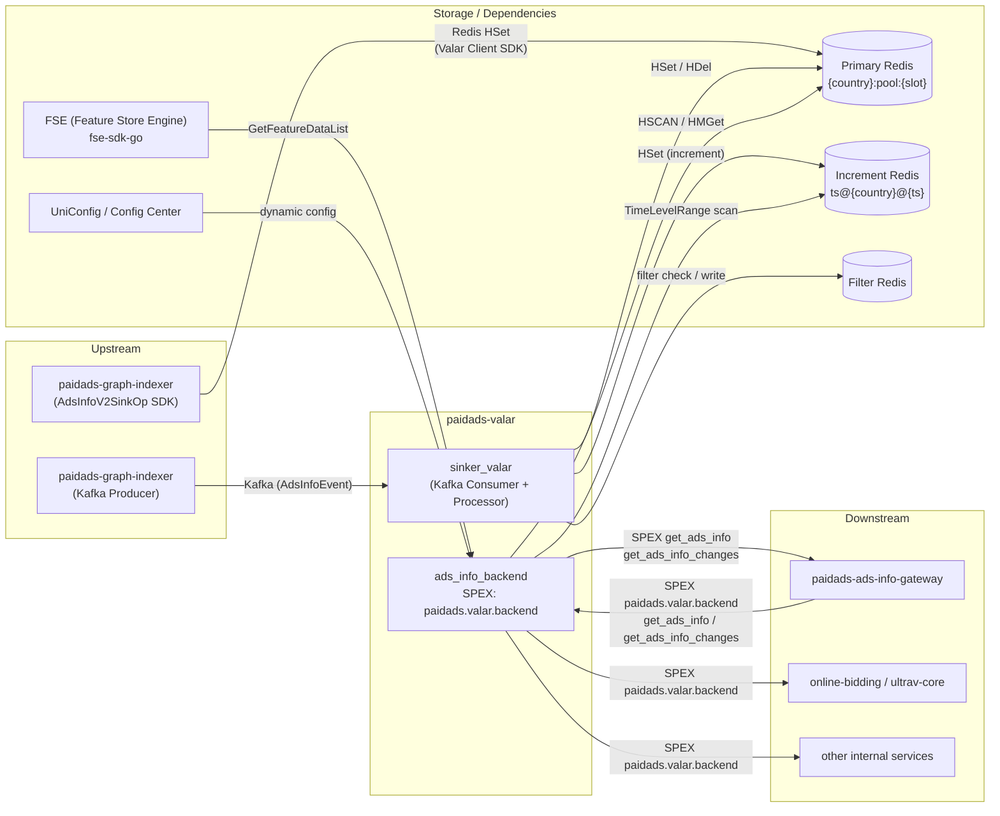

<!-- ads-workspace-gdoc-sync: gdoc_id=1j_1yZ3w2sroXJbDPn15QO5GkD2kgKghTiQ0WlQwT2tw gdoc_url=https://docs.google.com/document/d/1j_1yZ3w2sroXJbDPn15QO5GkD2kgKghTiQ0WlQwT2tw/edit -->

# paidads-valar — Valar Ain't Last Ads Resource

> **Repository**: https://git.garena.com/shopee/deep/paidads-valar

---

## Table of Contents

- [Introduction](#introduction)
- [Features](#features)
- [Architecture](#architecture)
  - [System Context](#system-context)
  - [Service Topology](#service-topology)
  - [Data Flow](#data-flow)
- [External APIs](#external-apis)
  - [Unified Handler APIs](#unified-handler-apis)
  - [Shop Handler APIs](#shop-handler-apis)
  - [Brand Search Handler APIs](#brand-search-handler-apis)
  - [Request and Response Formats](#request-and-response-formats)
- [Data Storage Model](#data-storage-model)
  - [Primary Redis Layout](#primary-redis-layout)
  - [Increment Redis Layout](#increment-redis-layout)
  - [Key Naming Conventions](#key-naming-conventions)
  - [Redis Read-Write Operations](#redis-read-write-operations)
- [Core Processing Pipeline](#core-processing-pipeline)
  - [Processor Interface](#processor-interface)
  - [Bulk Processor](#bulk-processor)
  - [Update Processor](#update-processor)
  - [Index Processor](#index-processor)
  - [Action Layer](#action-layer)
- [Bucket Management](#bucket-management)
  - [TimeBucket Data Structure](#timebucket-data-structure)
  - [BucketManager Scheduling](#bucketmanager-scheduling)
  - [Pool Reuse](#pool-reuse)
- [Proto Definitions](#proto-definitions)
- [Directory Structure](#directory-structure)
- [Build and Deployment](#build-and-deployment)
  - [Build Targets](#build-targets)
  - [Deployment Config](#deployment-config)
  - [Multiple Entrypoints](#multiple-entrypoints)
- [Configuration](#configuration)
  - [Static Config](#static-config)
  - [Dynamic Config (UniConfig)](#dynamic-config-uniconfg)
  - [SPEX Config](#spex-config)
- [Client SDK](#client-sdk)
- [Monitoring and Observability](#monitoring-and-observability)
  - [Metrics](#metrics)
  - [Troubleshooting Scenarios](#troubleshooting-scenarios)
- [Development Guidelines](#development-guidelines)
  - [Wire Dependency Injection](#wire-dependency-injection)
  - [How to Add a New Processor](#how-to-add-a-new-processor)
  - [How to Add a New Handler](#how-to-add-a-new-handler)
  - [Unit Testing](#unit-testing)
- [Business Terminology Glossary](#business-terminology-glossary)
- [Additional Resources](#additional-resources)
- [Frequently Asked Questions](#frequently-asked-questions)

---

## Introduction

`paidads-valar` is a mono-repo that implements the **forward-index storage and serving system for Shopee Paid Ads**. It is the authoritative source for AdsInfo data consumed by the bidding engine, paidads-ads-info-gateway, and other downstream services.

**Go module**: `git.garena.com/shopee/deep/paidads-valar`  
**Go version**: 1.22.10  
**Repository**: https://git.garena.com/shopee/deep/paidads-valar

The repo ships **five production service binaries** and one CLI tool:

| Binary | SPEX / gRPC namespace | Role |
|--------|-----------------------|------|
| `valar` (sinker_valar) | — | Kafka consumer; indexes AdsInfoEvent messages into Primary Redis and Increment Redis |
| `adsinfobackend` | `paidads.valar.backend` | SPEX backend aggregation layer; serves full + incremental AdsInfo to Gateway and bidding engine |
| `ads_info_service` | `paidads.valar` | SPEX service; serves Brand Search, balance RPCs, and FSE-backed AdsInfo |
| `adsinfosvc` | gRPC | gRPC server for search-side AdsInfo (full-load, changes) |
| `shopadsinfosvc` | gRPC | gRPC server for Shop AdsInfo, LiveStream AdsInfo, and Brand Search AdsInfo |
| `brandsearchadsinfoclient` | — | CLI test client for brand-search full load (not a production service) |

Core architecture:

- `sinker_valar` consumes upstream Kafka (from `paidads-graph-indexer`) and writes to two Redis pools: **Primary Redis** (permanent forward index) and **Increment Redis** (per-second change log).
- `adsinfobackend` aggregates multiple typed handlers and serves `get_ads_info` (full HSCAN) and `get_ads_info_changes` (incremental range query) over SPEX to `paidads-ads-info-gateway` and the bidding engine.
- Wire (Google Wire DI) wires all components together in `internal/setup/wire_gen.go`.

Supported AdsInfo types: Unified AdsInfo (Product / Video / Live / Target Ads via placement routing), Shop AdsInfo, Brand Search AdsInfo, LiveStream AdsInfo.

Key dependencies: `paidads-platform-lib`, `paidads-indexer-lib`, `fse-sdk-go`, `uniconfig`, `VictoriaMetrics`.

---

## Features

1. **Full AdsInfo scan (`GetAdsInfos`)** — HSCAN-based partition-slot pagination over Primary Redis; supports parallel multi-slot scan via `ScrollAdsInfos` / `BatchScrollAdsInfos`.
2. **Incremental change query (`GetAdsInfoChanges` / `GetAdsInfoChangesByBucket`)** — Per-second time-level key traversal over Increment Redis; returns the latest state per ads_id within a time range.
3. **Parallel multi-shard scan (`ScrollAdsInfos` / `BatchScrollAdsInfos`)** — Server-side and client-side parallel slot scanning for high-throughput full-load.
4. **Shop AdsInfo service** — Independent handler for Shop Ads organized by country and placement with inactive-ads filtering.
5. **Brand Search AdsInfo service** — Independent handler using Redis cluster node list management for distributed full-scan.
6. **Three-stage Processor pipeline (Bulk / Update / Index)** — Batched event processing with 100 ms time windows, concurrent recall + search writes, and deduplication via filter pipeline.
7. **Bucket time-window management** — TimeBucket / BucketManager / Pool for safe concurrent event batching and recycling.
8. **Filter pipeline** — Hash-based deduplication using a separate Filter Redis to suppress unchanged or duplicate AdsInfoEvents.

---

## Architecture

### System Context

`paidads-valar` sits between the indexing layer (`paidads-graph-indexer`) and the serving layer (`paidads-ads-info-gateway`, bidding engine). Its two roles:

1. **Write path**: `sinker_valar` consumes AdsInfoEvent from Kafka → Processor pipeline → Redis.
2. **Read path**: `adsinfobackend` serves SPEX RPC → reads from Redis → returns to Gateway / bidding engine.

### Service Topology



**Topology table:**

| Direction | Service | Protocol | Description |
|-----------|---------|----------|-------------|
| Upstream | paidads-graph-indexer (sinker_valar) | Kafka | sinker_valar consumes AdsInfoEvent Kafka messages; BulkProcessor writes to Primary + Increment Redis |
| Upstream | paidads-graph-indexer (AdsInfoV2SinkOp) | Redis | AdsInfoV2SinkOp writes directly to Primary Redis via the Valar Client SDK (`pkg/adsinfo`); bypasses Kafka |
| Upstream (caller) | paidads-ads-info-gateway | SPEX RPC | Gateway calls ads_info_backend to pull full/incremental AdsInfo into memory |
| Downstream | paidads-ads-info-gateway | SPEX RPC | ads_info_backend provides `get_ads_info` (HSCAN pagination) and `get_ads_info_changes` (incremental) to Gateway |
| Downstream | online-bidding / ultrav-core | SPEX RPC | Bidding engine queries ads_info_backend via `paidads.valar.backend` for real-time AdsInfo lookups |
| Downstream | other internal services | SPEX RPC | Other services query via `paidads.valar.backend` or `paidads.valar` |
| Dependency | Redis — Primary | Redis | Permanent forward-index; Hash-key per country+slot, field = ads_id |
| Dependency | Redis — Increment | Redis | Per-second change log; key = `ts@{country}@{unix_second}` |
| Dependency | Redis — Filter | Redis | Dedup filter checksums via redisutilwrapper |
| Dependency | FSE (Feature Store Engine) | fse-sdk-go | AdsInfo field enrichment from Feature Store |
| Dependency | UniConfig / Config Center | RPC | Hot-update of runtime parameters |
| Library | paidads-platform-lib | Go module | SPEX client/server factory, app lifecycle (bootstrap) |
| Library | paidads-indexer-lib | Go module | Redis clients (redisutilwrapper), bootstrap utilities |

### Data Flow

**Write path:**

```
paidads-graph-indexer
  ├─ Kafka AdsInfoEvent ──→ sinker_valar BulkProcessor
  │                           ├─ Recall action → HSet Primary Redis ({country}:pool:{slot}, field=ads_id)
  │                           └─ Increment action → HSet Increment Redis (ts@{country}@{unix_second})
  └─ AdsInfoV2SinkOp (SDK) ──→ Primary Redis (direct HSet via pkg/adsinfo ValarClient)
```

**Read path:**

```
paidads-ads-info-gateway / bidding engine
  └─ SPEX RPC → ads_info_backend.Server
       ├─ GetAdsInfo: concurrently dispatch to typed nodes
       │    ├─ video_ads_info_node   → ValarClient.HScan (placement-based keys)
       │    ├─ shop_ads_info_node    → ShopHandler.HSCAN ({country}:shoppool:{slot})
       │    ├─ search_ads_info_node  → Handler.HSCAN ({country}:pool:{slot})
       │    └─ target_ads_info_node  → TargetAdsInfoClient
       └─ GetAdsInfoChanges: concurrently dispatch per-placement
            └─ TimeLevelRange scan over Increment Redis keys
```

---

## External APIs

### Unified Handler APIs

`rpc.Handler` serves Product, Video, Target, and LiveStream AdsInfo via `adsinfobackend` (SPEX namespace `paidads.valar.backend`).

| API | Parameters | Returns | Description |
|-----|-----------|---------|-------------|
| `GetAdsInfos` | `country`, `cursor`, `slot`, `count` | `advertises[]`, `next_cursor` | HSCAN partition-slot pagination over Primary Redis |
| `GetAdsInfoChanges` | `country`, `from_time`, `to_time` | `advertises[]` | Incremental time-range query over Increment Redis |
| `GetAdsInfoChangesByBucket` | `country`, `from_bucket`, `to_bucket`, `cursor` | `map[timestamp]changes`, `next_cursor` | Bucket-paginated incremental query |
| `ScrollAdsInfos` | `country`, `slots`, `count` | `advertises[]`, `cursors[]` | Server-side parallel multi-slot scan |
| `BatchScrollAdsInfos` | `country`, `slot`, `slice`, `cursor` | `advertises[]`, `next_cursor` | Single-slot client-side batch scan (best performance) |

### Shop Handler APIs

`rpc.ShopHandler` is wired into `adsinfobackend` and also exposed directly via `shopadsinfosvc` (gRPC).

| API | Parameters | Returns | Description |
|-----|-----------|---------|-------------|
| `LoadShopAdsInfoByCountry` | `country` | `shop_ads_info[]` | Full-load all Shop AdsInfo for a country via HSCAN |
| `LoadShopAdsInfoByCountryAndPlacement` | `country`, `placement` | `shop_ads_info[]` | Full-load filtered by placement |
| `GetShopAdsInfosByAdsIds` | `country`, `ads_ids[]` | `shop_ads_info[]` | Exact HMGet lookup by ads IDs |
| `GetAdsInfoChangesByBucket` | `country`, `placement`, `from_bucket`, `to_bucket` | `changes[]` | Incremental Shop AdsInfo changes |

### Brand Search Handler APIs

`rpc.BrandSearchAdsInfoHandler` maintains a live Redis cluster node list and performs distributed parallel scans.

| API | Parameters | Returns | Description |
|-----|-----------|---------|-------------|
| `FullLoadAds` | node cursors | `advertises[]` | Concurrent full-scan across all Redis cluster nodes via node list |
| `GetAdsInfoByShopId` | `shop_id` | `advertises[]` | Lookup Brand Search ads for a specific shop |

### Request and Response Formats

All SPEX RPCs use protobuf-serialized messages. The `GetAdsInfo` response from `ads_info_backend` returns `ads_info` as `[][]byte` — each element is a serialized `paidads_valar_gateway.AdsInfo`. The maximum SPEX response body is capped at 16 MB (configured by the `spex_body_buffer` UniConfig key, default 90%).

Cursor format for `adsinfobackend`: a base64-encoded `NodeCursor` map keyed by node name (e.g., `video_ads_info_node`, `search_ads_info_node`). Pass the returned cursor back on the next call to continue pagination.

---

## Data Storage Model

### Primary Redis Layout

| Scope | Key Pattern | Field | Value |
|-------|------------|-------|-------|
| Unified AdsInfo | `{country}:pool:{slot}` | `ads_id` (string) | `protobuf(Advertise{Status, AdsInfo})` |
| Shop AdsInfo | `{country}:shoppool:{slot}` | `ads_id` | `protobuf(Advertise)` |
| Shop + Placement | `{country}:{placement}:shoppool:{slot}` | `ads_id` | `protobuf(Advertise)` |
| Video / Target | `{country}:{placement}:{slot}` (via ValarClient) | `ads_id` | `protobuf(Advertise)` |

`Advertise` wraps `Status` (NORMAL / DELETED / UNKNOWN) + `AdsInfo` proto. TTL: 30 days per entry (refreshed on every HWrite).

**Partition slots**: The master hash `{country}:pool` is sharded into `N` slots as `{country}:pool:0` … `{country}:pool:{N-1}`. Each ads_id is mapped to a slot via `hash(ads_id) % N`. This enables parallel HSCAN from the client side.

**Soft delete**: Deleted ads are written as `Advertise{Status: Status_DELETED}` so that Gateway can detect the deletion via `GetAdsInfoChanges`. The record remains queryable until the TTL expires.

### Increment Redis Layout

| Scope | Key Pattern | Field | Value |
|-------|------------|-------|-------|
| Unified AdsInfo changes | `ts@{country}@{unix_second}` | `ads_id` | `protobuf(AdsInfoEvent)` |
| Shop AdsInfo changes | `shopts:{country}:{unix_second}` | `ads_id` | `protobuf(AdsInfoEvent)` |

One hash key is created per second per country. `GetAdsInfoChanges` iterates all keys in `[from_time, to_time)`, deduplicating by ads_id (latest wins). **TTL: 1 minute** — downstream consumers must poll more frequently than once per minute to avoid gaps.

### Key Naming Conventions

| Function | Key Format | Use |
|----------|-----------|-----|
| `key.Master(country)` | `{country}:pool` | Base key for unified AdsInfo hash |
| `key.ShopMaster(country)` | `{country}:shoppool` | Base key for Shop AdsInfo hash |
| `key.PartitionSlot(base, slot)` | `{base}:{slot}` | Appends slot index to any base key |
| `key.TimeLevel(ts, country)` | `ts@{country}@{unix_second}` | Increment entry per second (unified) |
| `key.ShopTimeLevel(ts, country)` | `shopts:{country}:{unix_second}` | Increment entry per second (Shop) |
| `key.AdsPlacementKey(country, placement, adsID)` | `{country}:{placement}:{adsID}` | ValarClient primary key (video / target) |
| `key.HashPartition(placement, country, partition)` | `{country}:{placement}:{partition}` | ValarClient incremental time-level hash |
| `key.Universal(country, adsID)` | `{country}:{adsID}` | TimeBucket dedup key |

### Redis Read-Write Operations

All Redis I/O goes through `internal/db/redis.go` (`db.Redis`):

| Method | Redis command | Description |
|--------|-------------|-------------|
| `HWrite(key, field, value, ttl)` | `HSET` + `EXPIRE` | Write single hash field + refresh TTL |
| `HMWrite(key, fields, values, ttl)` | `HMSET` + `EXPIRE` | Batch-write multiple hash fields |
| `HDelete(key, field...)` | `HDEL` | Hard-delete one or more fields |
| `HRead(key, field)` | `HGET` | Read single field → `types.Optional` |
| `HMRead(key, fields)` | `HMGET` | Batch-read fields → `[]types.Optional` |
| `Scan(cursor, key, count)` | `HSCAN` | Iterate hash fields with cursor |
| `Write(key, value, ttl)` | `SET` + `EXPIRE` | Write plain string key |
| `Read(key)` | `GET` | Read plain string key |
| `MRead(keys)` | `MGET` | Batch-read plain string keys |
| `Delete(key)` | `DEL` | Delete plain string key |

---

## Core Processing Pipeline

### Processor Interface

All sinker processors implement:

```go
type Interface interface {
    Process(event *pbAds.AdsInfoEvent) error
}
```

`Option` configures a processor with: recall client config (Primary Redis), search client config (secondary Redis), filter Redis config, and a per-event processing timeout.

### Bulk Processor

`BulkProcessor` (used by `sinker_valar`) batches incoming AdsInfoEvent messages into 100 ms time windows using `BucketManager`:

1. Events are pushed to the active `TimeBucket` via `BucketManager.Push`.
2. Every 100 ms the active bucket is sealed and moved to the data channel.
3. On each bucket flush, three concurrent writes are executed:
   - **Increment store** (`key.TimeLevel`): per-second HSet with TTL = 1 minute.
   - **Master pool** (`key.Master` + slot): permanent HSet with TTL = 30 days.
   - **Merge** (optional): `FillUpRecall` reads existing data before writing, to handle partial-update event types.

### Update Processor

Handles single incremental AdsInfoEvent updates. Used for ad-tag update Kafka topics (lower volume, per-event processing). Writes to both Primary Redis (`ExecuteRecall`) and Increment Redis.

### Index Processor

Handles index-type events. Applies the filter pipeline first — events whose hash matches the stored checksum are discarded as unchanged. Remaining events run `Recall.ExecuteRecall` and `Search.ExecuteSearch` concurrently.

### Action Layer

| Action | Key functions | Description |
|--------|-------------|-------------|
| Recall | `ExecuteRecall` | INDEX/UPDATE → `HWrite(Advertise{NORMAL, AdsInfo})`; DELETE → soft-delete (`Status_DELETED`) or hard-delete (`HDelete`) depending on `soft` flag |
| Recall | `FillUpRecall` | Reads existing `Advertise` from Primary Redis, then calls `action.merge` before writing partial-update events |
| Merge | `merge(origin, remote)` | Merges partial updates by type: keyword bid infos (add/update/delete per keyword), ad_tag, over_delivery, item_price_v2 |
| Search | `ExecuteSearch` | Writes to secondary search Redis using plain key ops (`Write` / `Delete`) |
| Error | `errExecute` | Wraps action errors with context for unified error reporting |

**Soft delete vs hard delete**: Soft delete writes `Advertise{Status: Status_DELETED}` so Gateway can detect the deletion via `GetAdsInfoChanges`. Hard delete calls `HDelete` and removes the record immediately — the deletion is not detectable via incremental queries.

---

## Bucket Management

### TimeBucket Data Structure

`TimeBucket` holds a `map[universalKey]*AdsInfoEvent`. `Push(event)` uses `key.Universal(country, adsID)` as dedup key — only the latest event per ads_id survives within a 100 ms window.

### BucketManager Scheduling

```
BucketManager
  ├─ Push(event) → writes to active bucket
  ├─ Ticker (100ms) → process()
  │     ├─ move active bucket → data channel
  │     ├─ signal watcher
  │     └─ acquire fresh bucket from Pool
  └─ Pop() → caller blocks until ready bucket is available
```

### Pool Reuse

`Pool` wraps `sync.Pool` to recycle `TimeBucket` instances. After a bucket is consumed by the processor, it is cleared and returned via `Pool.Put`, avoiding per-window heap allocations under high event throughput.

---

## Proto Definitions

| Proto file | SPEX / gRPC namespace | Key messages / services |
|-----------|-----------------------|------------------------|
| `proto/ads_info.proto` | gRPC `pb_ads_info` | `AdsInfo`, `AdsInfoEvent`, `Advertise`, `Operation` (INDEX/UPDATE/DELETE), `Status` (NORMAL/DELETED/UNKNOWN), `AdsType` |
| `proto/shop_ads_info.proto` | gRPC | `ShopAdsInfo`, Shop/LiveStream RPC service definitions |
| `proto/brand_search_ads_info.proto` | gRPC | `BrandSearchAdsInfo`, Brand Search RPC service definitions |
| `proto/live_stream_ads_info.proto` | gRPC | `LiveStreamAdsInfo` |
| `proto/sp_proto/paidads/valar.proto` | SPEX `paidads.valar` | `get_ads_info`, `get_ads_info_changes`, `get_campaign_balance_summary`, `get_account_balance_summary`, `get_account_cumulative_balance` |
| `proto/sp_proto/paidads/valar/backend.proto` | SPEX `paidads.valar.backend` | `get_ads_info`, `get_ads_info_changes`; `GetAdsInfoRequest` with NodeCursor pagination; error codes `ERROR_SYSTEM=1668400000`, `ERROR_VALIDATION=1668400001` |

To regenerate all proto code:

```bash
make proto-compile   # spcli proto ensure + spex-generator + go fmt
```

---

## Directory Structure

```
paidads-valar/
├── cmd/
│   ├── adsinfobackend/           # SPEX backend binary (paidads.valar.backend)
│   ├── ads_info_service/         # SPEX service binary (paidads.valar)
│   ├── adsinfosvc/               # gRPC search-side binary
│   ├── shopadsinfosvc/           # gRPC Shop/LiveStream/BrandSearch binary
│   ├── valar/                    # sinker_valar Kafka consumer binary
│   ├── brandsearchadsinfoclient/ # CLI test client
│   └── run/                      # shared run functions per binary
├── config/                       # Config structs (ads_info_backend.go, valar_reader.go)
├── deploy/                       # Mesos deploy manifests (*.json)
├── internal/
│   ├── action/                   # Recall, Merge, Search, Error actions
│   ├── client/                   # recall.go, search.go Redis clients
│   ├── db/                       # redis.go Redis wrapper (HWrite/HRead/Scan/…)
│   ├── filter/                   # filter.go dedup pipeline
│   ├── fse/                      # FSE (Feature Store Engine) integration
│   ├── job/                      # sinker_valar job orchestration
│   ├── processor/                # Bulk / Update / Index processors
│   ├── rpc/
│   │   ├── ads_info_backend/     # adsinfobackend SPEX server + typed handlers
│   │   └── valar/                # ads_info_service SPEX handler (FSE, balance)
│   ├── setup/                    # Wire DI setup (wire_gen.go)
│   └── util/                     # general utilities
├── pkg/
│   ├── adsinfo/                  # ValarClient + AdsInfoClient SDK
│   ├── brandsearchadsinfo/       # Brand Search AdsInfo client SDK
│   ├── cache/                    # Generic Redis cache client (node-list based)
│   ├── dbmanager/                # DB connection manager
│   ├── exporter/                 # VictoriaMetrics metrics exporter
│   ├── grpc/                     # gRPC client wrapper
│   ├── inactive/                 # Inactive AdsInfo / LiveStream checker
│   ├── key/                      # Redis key generation functions
│   ├── metadata/                 # Metadata utilities
│   ├── shopads/                  # Shop Ads inactive + balance checker
│   ├── spexerror/                # SPEX error code constants
│   └── spexutil/                 # SPEX interceptors, latency, manager, metadata
├── proto/
│   ├── sp_proto/paidads/         # SPEX proto files
│   ├── gen/ads_info/             # Generated gRPC Go code
│   └── go/                       # Generated SPEX Go code
├── scripts/
│   └── mesos.sh                  # Mesos build & run script
├── tool/                         # CLI tools (valar_reader, valar_client, valar_updater)
├── go.mod
├── Makefile
└── sp-workspace.yml              # SPEX workspace configuration
```

---

## Build and Deployment

### Build Targets

```bash
# Install spkit and project tools
make tool

# Build all primary binaries (valar + adsinfosvc)
make all

# Build individual binaries → bin/paidads_<name>_server
make valar            # sinker_valar Kafka consumer
make adsinfobackend   # SPEX backend (paidads.valar.backend)
make adsinfosvc       # gRPC search-side service
make ads_info_service # SPEX service (paidads.valar)
make shopadsinfosvc   # gRPC Shop/LiveStream/BrandSearch service

# Run tests
make test             # go test with coverage
make test-ci          # go test with -race + coverage profile

# Compile proto files
make proto-compile

# Regenerate Wire DI code
make wire
```

### Deployment Config

Deployment uses the Mesos platform via `scripts/mesos.sh`. Pipeline manifests are in `deploy/*.json`.

```bash
# CI/Mesos build step
bash scripts/mesos.sh build <binary_name>

# Mesos container run step
bash scripts/mesos.sh run
```

The `mesos.sh build` step:
1. Runs `make tool` and `make proto-compile`.
2. Builds the selected binary with `EXTINFO="Env:${env}"`.
3. Copies binary, config (`config/files/${env}*.yml`), and `deploy/.pipeline_deploy.json` to the release directory.

Health check endpoints (available in all service binaries):
- Smoke: `GET /smoketest`
- Liveness: `GET /ping`

Live deployment resources (adsinfosvc, SG): 8 CPU, 2 048 MB memory, 5 instances.

### Multiple Entrypoints

Each `deploy/*.json` manifest targets one binary:

| Manifest | Binary | Service |
|----------|--------|---------|
| `deploy/valar.json` | `valar` | sinker_valar Kafka consumer |
| `deploy/adsinfosvc.json` | `adsinfosvc` | gRPC search-side service |
| `deploy/shopadsinfosvc.json` | `shopadsinfosvc` | gRPC Shop/LiveStream service |

---

## Configuration

### Static Config

`config.AdsInfoBackend` is the top-level config struct for `adsinfobackend`:

```go
type AdsInfoBackend struct {
    SpexConfig                      spex.Config
    ServerConfig                    ads_info_backend.Config
    VideoAdsInfoCacheClientConfig   adsinfo.Config
    VideoAdsInfoCacheClientV2Config adsinfo.Config
    ShopAdsInactiveAdsConfig        *shopads.InactiveAdsConfig
}
```

`ads_info_backend.Config` controls per-handler behaviour:

| Field | Type | Description |
|-------|------|-------------|
| `VideoAdsInfoNodeRefreshPeriod` | `time.Duration` | Refresh period for video node list |
| `ShopAdsInfoHandlerOption` | `*rpc.HandlerOption` | Shop handler Redis + limit config |
| `SearchAdsInfoHandlerOption` | `*rpc.HandlerOption` | Search handler Redis + limit config |
| `TargetAdsInfoClientOption` | `query.Option` | Target AdsInfo client config |

`rpc.HandlerOption` per handler:

| Field | Description |
|-------|-------------|
| `Limit` | Max ads per scan call |
| `Slots` | Number of Redis partition slots |
| `IncTTL` | Increment Redis TTL |
| `PrimaryRedisUtil` | Primary Redis connection (redisutilwrapper.Config) |
| `IncrementRedisUtil` | Increment Redis connection |
| `NodeRefreshPeriodSecond` | Node list refresh period (seconds) |

### Dynamic Config (UniConfig)

Runtime parameters hot-updated via UniConfig in `ads_info_backend.Server`:

| Key | Default | Description |
|-----|---------|-------------|
| `max_ads_info_size_byte` | 1536 (1.5 KB) | Max serialized AdsInfo size per entry |
| `spex_body_buffer` | 90 | Body buffer factor (%) against the 16 MB SPEX write limit |
| `ads_info_scan_count` | 100 | HSCAN count per cursor iteration |

### SPEX Config

`sp-workspace.yml` declares SPEX protocol dependencies and code generation targets:

```yaml
protocol:
  dep:
    - name: paidads.valar.backend   # adsinfobackend namespace
    - name: paidads.valar           # ads_info_service namespace
  source_dir:    proto/sp_proto
  generated_dir: proto
  targets: [go, validate]
```

Install spkit (required once per machine):

```bash
# macOS arm64
wget https://spkit.shopee.io/spkit/stable/spkit-darwin-arm64 \
    -O $(go env GOPATH)/bin/spkit && chmod +x $(go env GOPATH)/bin/spkit

# Linux
wget https://spkit.shopee.io/spkit/stable/spkit-linux \
    -O $(go env GOPATH)/bin/spkit && chmod +x $(go env GOPATH)/bin/spkit

make tool           # installs all spkit-managed tools (spcli, wire, protoc, …)
make proto-compile  # generates SPEX + gRPC Go code
```

---

## Client SDK

`pkg/` provides client packages for upstream services that need to read from or write to paidads-valar:

| Package | Key types | Description |
|---------|----------|-------------|
| `pkg/adsinfo` | `ValarClient`, `AdsInfoClient` | Full-featured Valar client: Get/MGet, Add/Delete, HScan, incremental writes |
| `pkg/brandsearchadsinfo` | `Client` | Brand Search AdsInfo client for full-load and shop-ID lookup |
| `pkg/cache` | `Client[T, E]` | Generic Redis cache client with node-list management (used by brand-search and video handlers) |
| `pkg/inactive` | `AdsInfoClient`, `LiveStreamAdsInfoClient` | Checks whether AdsInfo / LiveStream ads are inactive |
| `pkg/shopads` | `InactiveAdsClient` | Checks Shop Ads inactive status and campaign balance mtime |
| `pkg/grpc` | gRPC client | gRPC client wrapper for adsinfosvc / shopadsinfosvc |
| `pkg/dbmanager` | `DBManager` | Database connection manager |
| `pkg/exporter` | VictoriaMetrics exporter | Prometheus-compatible metrics exporter |
| `pkg/key` | key functions | Redis key generation (Master, TimeLevel, PartitionSlot, Universal, …) |
| `pkg/spexutil` | interceptors, latency, metadata | SPEX utility helpers |
| `pkg/spexerror` | error codes | SPEX error code constants (`ERROR_SYSTEM = 1668400000`) |

Example — using `ValarClient` to scan AdsInfo:

```go
client, err := adsinfo.NewValarClient(ctx, cfg)
if err != nil { ... }

// Incremental scan with cursor
result, err := client.HScan(ctx, country, placement, cursor)
// result.Advertises: []*pbAds.Advertise
// result.NextCursor: pass back on the next call
```

---

## Monitoring and Observability

### Metrics

Metrics are exported in both Prometheus and VictoriaMetrics format under the `paidads_valar_*` namespace.

| Metric | Labels | Description |
|--------|--------|-------------|
| `paidads_valar_spex_request` | `country`, `namespace`, `cmd`, `resp_code` | SPEX inbound request counter |
| `paidads_valar_spex_latency` | `country`, `namespace`, `cmd` | SPEX inbound request latency histogram |
| `paidads_valar_spex_client_request` | `namespace`, `cmd` | Outbound SPEX call counter |
| `paidads_valar_query_counter` | `type`, `country`, `source` | Query counter by type |
| `paidads_valar_query_latency` | `type`, `country`, `source` | Query latency histogram |
| `paidads_valar_query_error` | `type`, `country`, `reason` | Query error counter |
| `paidads_valar_event_counter` | `country`, `source`, `type`, `operation` | sinker_valar indexed event counter |
| `paidads_valar_error` | `component`, `reason` | General error counter |
| `paidads_valar_latency` | `component` | General latency histogram |

VictoriaMetrics scrape endpoint: `/vm_metrics` (available in `ads_info_service`).

CMDB link: [ads_info_backend live deployment](https://space.shopee.io/console/cmdb/deployment/detail/shopee.mp_search_recommendation_ads.paidads.data_application.ads_indexer.ads_info.ads_info_backend?env=live)

### Troubleshooting Scenarios

| Symptom | Likely cause | Investigation |
|---------|-------------|---------------|
| AdsInfo missing for a country | Primary Redis write failure or Kafka consumer lag | Check `paidads_valar_event_counter` for drops; inspect BulkProcessor logs |
| `GetAdsInfoChanges` returns empty | Increment Redis TTL expired (1 minute) | Verify caller's polling interval is < 60 s; check Increment Redis key TTL |
| HSCAN pagination returns no data | Slot mismatch or wrong `Slots` config | Verify `HandlerOption.Slots` matches the producer's slot count |
| Processor errors on recall | Redis connectivity or marshal failure | Check `paidads_valar_error{component=recall}` and Redis health |
| Gateway full-sync is slow | Oversized SPEX response or low scan count | Tune `spex_body_buffer` and `ads_info_scan_count` via UniConfig |

---

## Development Guidelines

### Wire Dependency Injection

All `adsinfobackend` components are assembled via Google Wire (`internal/setup/`):

```bash
make wire   # regenerates internal/setup/wire_gen.go
```

`InitializeAdsInfoBackend` assembles: `ValarClient` / `ValarClientV2` → `ShopHandler` → `ShopAdsInactiveAdsCache` → `SearchHandler` → `SearchByPlacementHandler` → `TargetAdsInfoClient` → `ads_info_backend.Server` → `BackendProcessor`.

### How to Add a New Processor

1. Create a struct in `internal/processor/` implementing `processor.Interface`:
   ```go
   type MyProcessor struct{ opt *Option }
   func (p *MyProcessor) Process(event *pbAds.AdsInfoEvent) error { ... }
   ```
2. Register it in the relevant run function (`cmd/run/`).
3. Configure `Option` with the appropriate Recall / Search / Filter Redis configs.

### How to Add a New Handler

1. Create `internal/rpc/<handler_name>.go` implementing the desired SPEX or gRPC methods.
2. Add a provider function in `internal/setup/setup.go`.
3. Wire the provider in `internal/setup/wire.go` and regenerate with `make wire`.
4. Register the handler in `ads_info_backend.Server.InitAdsInfoGetterMap` to integrate it into `adsinfobackend`.

### Unit Testing

Tests use `testify` with table-driven patterns. Mock interfaces live in `mocks_test.go` per package.

```bash
make test        # go test with coverage
make test-ci     # go test with -race + coverage profile (coverage.out)
make test-race   # go test with -race only
```

---

## Business Terminology Glossary

| Term | Definition |
|------|-----------|
| AdsInfo | Core protobuf message representing a single ad's attributes (bid info, placement, visibility, status, etc.) |
| AdsInfoEvent | Event wrapping AdsInfo with Operation (INDEX / UPDATE / DELETE), country, and type |
| Advertise | Redis storage wrapper: `{Status, AdsInfo}` serialized as protobuf |
| sinker_valar | Kafka consumer binary that writes AdsInfoEvent to Redis |
| Valar Backend | `adsinfobackend` service; SPEX namespace `paidads.valar.backend` |
| Valar Gateway | `paidads-ads-info-gateway`; downstream service that syncs AdsInfo into memory |
| forward index | Lookup structure mapping ads_id → AdsInfo in Primary Redis |
| recall | Writing AdsInfo to Primary Redis via `ExecuteRecall` |
| merge | Combining a partial AdsInfoEvent with the existing AdsInfo record in Redis |
| search | Secondary Redis write for the search-side index |
| bulk processor | `BulkProcessor`: batch-mode Kafka event processor with 100 ms time windows |
| update processor | `UpdateProcessor`: single-event incremental update handler |
| index processor | `IndexProcessor`: concurrent recall + search write handler |
| Processor Interface | `processor.Interface` with single `Process(event) error` method |
| TimeBucket | Per-time-window event dedup map keyed by universal key |
| BucketManager | Schedules and rotates TimeBuckets; dispatches to Processor on flush |
| Pool | `sync.Pool`-backed TimeBucket recycler |
| partition slot | Shard index for Hash key partitioning; enables parallel HSCAN |
| HSCAN | Redis command to iterate hash fields; used for full AdsInfo scan |
| HWrite | `db.Redis.HWrite` — HSET + EXPIRE |
| HMWrite | `db.Redis.HMWrite` — HMSET + EXPIRE |
| HRead | `db.Redis.HRead` — HGET |
| HMRead | `db.Redis.HMRead` — HMGET |
| HashWriteDeleter | Internal interface for combined hash write/delete operations |
| soft delete | Writing `Advertise{Status: Status_DELETED}` to keep the record detectable via `GetAdsInfoChanges` |
| Operation | `AdsInfoEvent.Operation`: INDEX, UPDATE, DELETE |
| Status | `Advertise.Status`: NORMAL, DELETED, UNKNOWN |
| ExecuteRecall | Action function for writing / deleting in Primary Redis |
| FillUpRecall | Reads existing AdsInfo before executing merge-type updates |
| Master key | `key.Master(country)` → `{country}:pool` |
| ShopMaster key | `key.ShopMaster(country)` → `{country}:shoppool` |
| TimeLevel key | `key.TimeLevel(ts, country)` → `ts@{country}@{unix_second}` |
| ShopTimeLevel key | `key.ShopTimeLevel(ts, country)` → `shopts:{country}:{unix_second}` |
| PartitionSlot | `key.PartitionSlot(base, slot)` → `{base}:{slot}` |
| Universal key | `key.Universal(country, adsID)` → `{country}:{adsID}` |
| increment Redis | Per-second change log Redis pool |
| primary Redis | Permanent forward index Redis pool |
| filter pipeline | Filter Redis-backed dedup; discards events with unchanged hash |
| inactive ads | Ads filtered out by the `inactive` package based on status and balance |
| FSE (Feature Store Engine) | Shopee Feature Store; AdsInfo field enrichment via `fse-sdk-go` |
| Wire DI | Google Wire dependency injection; `internal/setup/wire_gen.go` |
| bootstrap | `paidads-platform-lib/app` framework for SPEX server initialization |
| GenCommonAppConfig | `bootstrap.GenCommonAppConfig` — generates common app config for SPEX server |
| paidads-platform-lib | Shared platform library: SPEX client/server factory, app lifecycle |
| paidads-indexer-lib | Shared indexer library: Redis clients, bootstrap utilities |
| redisutilwrapper | `paidads-indexer-lib` Redis client abstraction |
| AdsInfoV2SinkOp | Graph-indexer component that writes AdsInfo directly to Primary Redis via ValarClient SDK |
| UniConfig | Remote dynamic config service for hot parameter updates |
| GetAdsInfos | Unified Handler API: HSCAN-based full AdsInfo pagination |
| GetAdsInfoChanges | Unified Handler API: incremental time-range change query |
| GetAdsInfoChangesByBucket | Bucket-paginated incremental change query |
| ScrollAdsInfos | Server-side parallel multi-slot AdsInfo scan |
| BatchScrollAdsInfos | Client-side single-slot AdsInfo scan (best performance) |
| LoadShopAdsInfoByCountry | ShopHandler API: full-load Shop AdsInfo by country |
| FullLoadAds | BrandSearchHandler API: distributed full-scan via node list |
| GetAdsInfoByShopId | BrandSearchHandler API: lookup by shop_id |
| ShopHandler | `rpc.ShopHandler`: handles Shop AdsInfo and LiveStream AdsInfo RPCs |
| BrandSearchAdsInfoHandler | `rpc.BrandSearchAdsInfoHandler`: handles Brand Search AdsInfo RPCs |
| Handler | `rpc.Handler`: unified handler for Product / Video / Target AdsInfo RPCs |
| cacheCli | `pkg/cache.Client`: generic Redis cache client with node-list management |
| node list | Redis cluster node list managed by BrandSearchAdsInfoHandler for distributed scans |
| Placement | Ad placement type (integer ID); routes requests to the correct node / handler |
| Country | Country code string used as Redis key prefix |
| paidads.valar.backend | SPEX namespace for `adsinfobackend` |
| paidads.valar | SPEX namespace for `ads_info_service` |
| VictoriaMetrics | Metrics storage backend; exporter in `pkg/exporter` |
| spexutil | `pkg/spexutil`: SPEX interceptors, latency tracking, metadata helpers |
| spexerror | `pkg/spexerror`: SPEX error code constants |
| eCPM | Effective Cost per Mille: Total Ad Spend / Total Impressions × 1000 |
| CTR | Click-Through Rate: Clicks / Impressions |
| CR | Conversion Rate: Orders / Clicks |
| CPC | Cost Per Click: Spend / Clicks |

---

## Additional Resources

- [paidads-valar GitLab repository](https://git.garena.com/shopee/deep/paidads-valar)
- [SPEX Go Quick Start](https://spex.shopee.io/overview/quick-start/languages/go/index.html)
- [SPEX Documentation](https://spex.shopee.io/)
- [Paid Ads Glossary (Confluence)](https://confluence.shopee.io/pages/viewpage.action?spaceKey=SPAD&title=Paid+Ads+Glossary)
- [ads_info_backend CMDB Deployment (live)](https://space.shopee.io/console/cmdb/deployment/detail/shopee.mp_search_recommendation_ads.paidads.data_application.ads_indexer.ads_info.ads_info_backend?env=live)

---

## Frequently Asked Questions

**1. What is the difference between Valar Backend (`adsinfobackend`) and `ads_info_service`?**

`adsinfobackend` (SPEX namespace `paidads.valar.backend`) is the main aggregation layer combining video, search, shop, and target handlers. It serves `get_ads_info` / `get_ads_info_changes` to `paidads-ads-info-gateway` and the bidding engine. `ads_info_service` (SPEX namespace `paidads.valar`) is an older / broader interface that additionally serves brand-search AdsInfo, FSE-backed enrichment, and account/campaign balance RPCs.

**2. Why are there two Redis pools (Primary and Increment)?**

They serve different access patterns. Primary Redis stores the full current-state `Advertise` per ads_id (`{country}:pool:{slot}`, TTL 30 days) — suitable for HSCAN full-load. Increment Redis stores per-second change events (`ts@{country}@{unix_second}`, TTL 1 minute) — suitable for fast incremental sync. Separating them avoids cross-contamination of the full-load and change-tracking workloads.

**3. Why are there multiple `cmd/` binaries instead of one?**

The repo grew from a single binary as Shopee added Shop, Brand Search, and LiveStream AdsInfo types, each with distinct Redis structures and scaling requirements. Separate binaries allow independent deployment and scaling. `adsinfobackend` acts as the unified aggregation facade on top.

**4. Which Handler serves which AdsInfo types?**

- `rpc.Handler` (unified) — Product, Video, Target, and LiveStream AdsInfo (routing by placement)
- `rpc.ShopHandler` — Shop AdsInfo and Shop LiveStream info
- `rpc.BrandSearchAdsInfoHandler` — Brand Search AdsInfo

**5. When are the three Processor modes (Bulk / Update / Index) triggered?**

- `BulkProcessor` — main sinker_valar write path; high-throughput Kafka stream with 100 ms batching
- `UpdateProcessor` — ad-tag update Kafka topics; lower volume, per-event processing
- `IndexProcessor` — index-type events requiring concurrent recall + search writes

**6. What is the difference between soft delete and hard delete?**

Soft delete writes `Advertise{Status: Status_DELETED}` to Primary Redis and also writes the event to Increment Redis, so Gateway detects the deletion via `GetAdsInfoChanges`. Hard delete calls `HDelete` and removes the record immediately without leaving a change-log trace.

**7. Why does Brand Search use a separate `cacheCli` node list instead of partition slots?**

Brand Search AdsInfo is stored across Redis cluster nodes without the hash-slot sharding used by the unified handler. `BrandSearchAdsInfoHandler` maintains a live node list (refreshed periodically) and scans each node independently for `FullLoadAds`, enabling full-cluster distributed scans.

**8. How does partition slot sharding work?**

The master hash `{country}:pool` is sharded into `N` slots: `{country}:pool:0` … `{country}:pool:{N-1}`. Each ads_id is assigned slot `hash(ads_id) % N`. `BatchScrollAdsInfos` scans each slot concurrently from the client side for near-linear parallel throughput. The slot count `N` must match between sinker_valar (writer) and Gateway (reader).

**9. How can I switch the Redis cluster without downtime?**

Redis connections are configured in YAML config files loaded at startup (`HandlerOption.PrimaryRedisUtil` / `IncrementRedisUtil`). There is no runtime hot-swap. Pre-populate the new cluster with a bulk-load sinker_valar run, then perform a rolling restart of the relevant binary with updated config.

**10. Which upstream services use the `pkg/` client SDK?**

- `paidads-graph-indexer` — uses `pkg/adsinfo.ValarClient` via `AdsInfoV2SinkOp` to write AdsInfo directly to Primary Redis.
- Other services needing direct Redis read access can use `pkg/adsinfo.AdsInfoClient` for Get/MGet operations.
- `paidads-ads-info-gateway` — calls `adsinfobackend` SPEX RPC directly; does not use the SDK.

---

<!-- Generated by ads-workspace/skills/ads-readme-generate | checked: e1a2886cde9176678e3fdde3bf6b9876e30b56f1 -->
