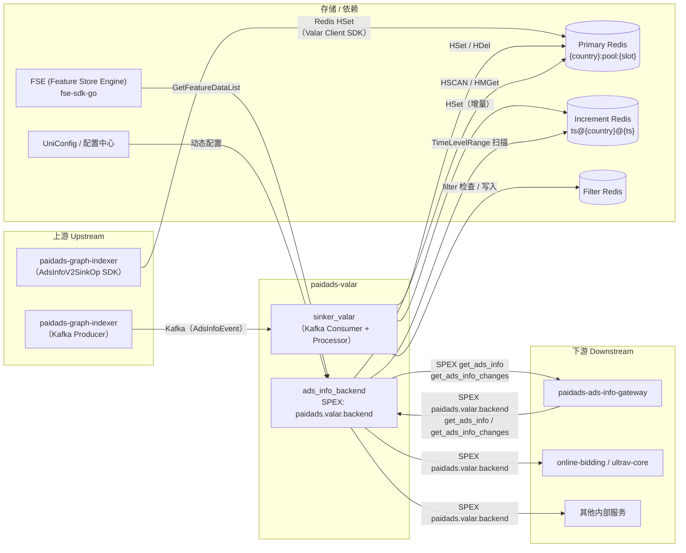

<!-- ads-workspace-gdoc-sync: gdoc_id=1e7BHG9Cscedc3eb95Et6vfNJjSjtyVj2pEFO5Tzy9SU gdoc_url=https://docs.google.com/document/d/1e7BHG9Cscedc3eb95Et6vfNJjSjtyVj2pEFO5Tzy9SU/edit -->

# paidads-valar — Valar Ain't Last Ads Resource

> **代码仓库**: https://git.garena.com/shopee/deep/paidads-valar

---

## 目录

- [项目概述](#项目概述)
- [核心功能](#核心功能)
- [架构](#架构)
  - [系统上下文](#系统上下文)
  - [上下游调用拓扑](#上下游调用拓扑)
  - [数据流](#数据流)
- [对外接口](#对外接口)
  - [统一 Handler APIs](#统一-handler-apis)
  - [Shop Handler APIs](#shop-handler-apis)
  - [Brand Search Handler APIs](#brand-search-handler-apis)
  - [请求与响应格式](#请求与响应格式)
- [数据存储模型](#数据存储模型)
  - [Primary Redis 结构](#primary-redis-结构)
  - [Increment Redis 结构](#increment-redis-结构)
  - [Key 命名规范](#key-命名规范)
  - [Redis 读写操作](#redis-读写操作)
- [核心处理流程](#核心处理流程)
  - [Processor 接口](#processor-接口)
  - [Bulk Processor（全量处理）](#bulk-processor全量处理)
  - [Update Processor（增量更新）](#update-processor增量更新)
  - [Index Processor（索引处理）](#index-processor索引处理)
  - [Action 层](#action-层)
- [Bucket 管理](#bucket-管理)
  - [TimeBucket 数据结构](#timebucket-数据结构)
  - [BucketManager 调度](#bucketmanager-调度)
  - [Pool 复用](#pool-复用)
- [Proto 定义](#proto-定义)
- [目录结构](#目录结构)
- [构建与部署](#构建与部署)
  - [构建目标](#构建目标)
  - [部署配置](#部署配置)
  - [多入口二进制](#多入口二进制)
- [配置体系](#配置体系)
  - [静态配置](#静态配置)
  - [动态配置（UniConfig）](#动态配置uniconfg)
  - [SPEX 配置](#spex-配置)
- [客户端 SDK](#客户端-sdk)
- [监控与可观测性](#监控与可观测性)
  - [Prometheus / VictoriaMetrics 指标](#prometheus--victoriametrics-指标)
  - [关键排障场景](#关键排障场景)
- [开发规范](#开发规范)
  - [Wire 依赖注入](#wire-依赖注入)
  - [新增 Processor](#新增-processor)
  - [新增 Handler](#新增-handler)
  - [单元测试](#单元测试)
- [业务术语表](#业务术语表)
- [参考资料](#参考资料)
- [常见问题](#常见问题)

---

## 项目概述

`paidads-valar` 是 Shopee Paid Ads **搜索广告正排索引存储与服务系统**的 mono-repo，是竞价引擎、paidads-ads-info-gateway 及其他下游服务消费 AdsInfo 数据的权威来源。

**Go 模块**: `git.garena.com/shopee/deep/paidads-valar`  
**Go 版本**: 1.22.10  
**代码仓库**: https://git.garena.com/shopee/deep/paidads-valar

本仓库包含 **5 个生产服务二进制** 和 1 个 CLI 工具：

| 二进制 | SPEX / gRPC 命名空间 | 职责 |
|--------|---------------------|------|
| `valar`（sinker_valar） | — | Kafka consumer；将 AdsInfoEvent 写入 Primary Redis 和 Increment Redis |
| `adsinfobackend` | `paidads.valar.backend` | SPEX 聚合层；向 Gateway 和竞价引擎提供全量 + 增量 AdsInfo 查询 |
| `ads_info_service` | `paidads.valar` | SPEX 服务；提供 Brand Search、余额查询及 FSE 数据增强的 AdsInfo 查询 |
| `adsinfosvc` | gRPC | 搜索侧 AdsInfo gRPC 服务（全量加载、变更查询） |
| `shopadsinfosvc` | gRPC | Shop AdsInfo、LiveStream AdsInfo 及 Brand Search AdsInfo gRPC 服务 |
| `brandsearchadsinfoclient` | — | Brand Search 全量加载 CLI 测试客户端（非生产服务） |

核心架构：

- `sinker_valar` 消费上游 Kafka（来自 `paidads-graph-indexer`），写入两个 Redis 池：**Primary Redis**（持久正排索引）和 **Increment Redis**（按秒变更日志）。
- `adsinfobackend` 聚合多个类型化 Handler，通过 SPEX 向 `paidads-ads-info-gateway` 和竞价引擎提供 `get_ads_info`（全量 HSCAN）和 `get_ads_info_changes`（增量范围查询）。
- Wire（Google Wire DI）在 `internal/setup/wire_gen.go` 中完成所有组件的依赖注入。

支持的 AdsInfo 类型：统一 AdsInfo（Product / Video / Live / Target Ads，按 Placement 路由）、Shop AdsInfo、Brand Search AdsInfo、LiveStream AdsInfo。

核心依赖：`paidads-platform-lib`、`paidads-indexer-lib`、`fse-sdk-go`、`uniconfig`、`VictoriaMetrics`。

---

## 核心功能

1. **全量 AdsInfo 扫描（`GetAdsInfos`）** — 基于 HSCAN 的 partition slot 翻页查询 Primary Redis；支持通过 `ScrollAdsInfos` / `BatchScrollAdsInfos` 实现并行多分片扫描。
2. **增量变更查询（`GetAdsInfoChanges` / `GetAdsInfoChangesByBucket`）** — 按秒遍历 Increment Redis 的 TimeLevel key，返回指定时间范围内每个 ads_id 的最新状态。
3. **并行多分片扫描（`ScrollAdsInfos` / `BatchScrollAdsInfos`）** — 服务端（`ScrollAdsInfos`）和客户端（`BatchScrollAdsInfos`）并行 slot 扫描，实现高吞吐全量加载。
4. **Shop AdsInfo 服务** — 独立 Handler，按 country 和 placement 组织 Shop Ads，支持 inactive ads 过滤。
5. **Brand Search AdsInfo 服务** — 独立 Handler，通过 Redis 集群节点列表管理实现分布式全量扫描。
6. **三级 Processor 流水线（Bulk / Update / Index）** — 100 ms 时间窗口批量处理，并发 recall + search 写入，Filter Redis 去重。
7. **Bucket 时间桶管理** — TimeBucket / BucketManager / Pool 实现安全的并发事件批处理与对象复用。
8. **Filter 过滤管道** — 基于哈希的 Filter Redis 去重，屏蔽内容未变或重复的 AdsInfoEvent。

---

## 架构

### 系统上下文

`paidads-valar` 位于索引层（`paidads-graph-indexer`）和服务层（`paidads-ads-info-gateway`、竞价引擎）之间，承担两个职责：

1. **写入路径**：`sinker_valar` 消费 Kafka AdsInfoEvent → Processor 流水线 → 写入 Redis。
2. **读取路径**：`adsinfobackend` 提供 SPEX RPC → 从 Redis 读取 → 返回给 Gateway / 竞价引擎。

### 上下游调用拓扑



**拓扑表格：**

| 方向 | 服务 | 协议 | 说明 |
|------|------|------|------|
| 上游 | paidads-graph-indexer（sinker_valar） | Kafka | sinker_valar 消费 graph-indexer 产出的 AdsInfoEvent Kafka 消息；BulkProcessor 写入 Primary + Increment Redis |
| 上游 | paidads-graph-indexer（AdsInfoV2SinkOp） | Redis | AdsInfoV2SinkOp 通过 Valar Client SDK（`pkg/adsinfo`）直接写入 Primary Redis，不经过 Kafka |
| 上游（调用方） | paidads-ads-info-gateway | SPEX RPC | Gateway 调用 ads_info_backend 将全量 / 增量 AdsInfo 同步到内存 |
| 下游 | paidads-ads-info-gateway | SPEX RPC | ads_info_backend 通过 `get_ads_info`（HSCAN 翻页）和 `get_ads_info_changes`（增量）向 Gateway 提供服务 |
| 下游 | online-bidding / ultrav-core | SPEX RPC | 竞价引擎通过 `paidads.valar.backend` 实时查询 AdsInfo 正排数据 |
| 下游 | 其他内部服务 | SPEX RPC | 通过 `paidads.valar.backend` 或 `paidads.valar` 查询广告正排信息 |
| 依赖 | Redis — Primary | Redis | 持久正排索引；Hash key 按 country+slot 分区，field = ads_id |
| 依赖 | Redis — Increment | Redis | 按秒变更日志；key = `ts@{country}@{unix_second}` |
| 依赖 | Redis — Filter | Redis | 通过 redisutilwrapper 配置的去重 filter |
| 依赖 | FSE（Feature Store Engine） | fse-sdk-go | 通过 Feature Store 对 AdsInfo 字段进行数据增强 |
| 依赖 | UniConfig / 配置中心 | RPC | 运行时参数热更新 |
| 库 | paidads-platform-lib | Go 模块 | SPEX 客户端/服务端工厂，App 生命周期（bootstrap） |
| 库 | paidads-indexer-lib | Go 模块 | Redis 客户端（redisutilwrapper）、bootstrap 工具 |

### 数据流

**写入路径：**

```
paidads-graph-indexer
  ├─ Kafka AdsInfoEvent ──→ sinker_valar BulkProcessor
  │                           ├─ Recall action → HSet Primary Redis ({country}:pool:{slot}, field=ads_id)
  │                           └─ Increment action → HSet Increment Redis (ts@{country}@{unix_second})
  └─ AdsInfoV2SinkOp（SDK）──→ Primary Redis（直接 HSet，通过 pkg/adsinfo ValarClient）
```

**读取路径：**

```
paidads-ads-info-gateway / 竞价引擎
  └─ SPEX RPC → ads_info_backend.Server
       ├─ GetAdsInfo：并发调度到各类型节点
       │    ├─ video_ads_info_node   → ValarClient.HScan（Placement 维度 key）
       │    ├─ shop_ads_info_node    → ShopHandler.HSCAN（{country}:shoppool:{slot}）
       │    ├─ search_ads_info_node  → Handler.HSCAN（{country}:pool:{slot}）
       │    └─ target_ads_info_node  → TargetAdsInfoClient
       └─ GetAdsInfoChanges：按 Placement 并发调度
            └─ TimeLevelRange 扫描 Increment Redis
```

---

## 对外接口

### 统一 Handler APIs

`rpc.Handler` 通过 `adsinfobackend`（SPEX 命名空间 `paidads.valar.backend`）为 Product、Video、Target 和 LiveStream AdsInfo 提供服务。

| API | 参数 | 返回 | 说明 |
|-----|------|------|------|
| `GetAdsInfos` | `country`、`cursor`、`slot`、`count` | `advertises[]`、`next_cursor` | 基于 HSCAN 的 partition slot 翻页查询 Primary Redis |
| `GetAdsInfoChanges` | `country`、`from_time`、`to_time` | `advertises[]` | 按时间范围查询 Increment Redis 增量变更 |
| `GetAdsInfoChangesByBucket` | `country`、`from_bucket`、`to_bucket`、`cursor` | `map[timestamp]changes`、`next_cursor` | 按 bucket 分页查询增量变更 |
| `ScrollAdsInfos` | `country`、`slots`、`count` | `advertises[]`、`cursors[]` | 服务端并行多 slot 扫描 |
| `BatchScrollAdsInfos` | `country`、`slot`、`slice`、`cursor` | `advertises[]`、`next_cursor` | 客户端单 slot 批量扫描（最佳性能） |

### Shop Handler APIs

`rpc.ShopHandler` 集成在 `adsinfobackend` 中，同时通过 `shopadsinfosvc`（gRPC）直接对外暴露。

| API | 参数 | 返回 | 说明 |
|-----|------|------|------|
| `LoadShopAdsInfoByCountry` | `country` | `shop_ads_info[]` | 通过 HSCAN 全量加载某 country 的 Shop AdsInfo |
| `LoadShopAdsInfoByCountryAndPlacement` | `country`、`placement` | `shop_ads_info[]` | 按 placement 过滤的全量加载 |
| `GetShopAdsInfosByAdsIds` | `country`、`ads_ids[]` | `shop_ads_info[]` | 通过 HMGet 精确查询 |
| `GetAdsInfoChangesByBucket` | `country`、`placement`、`from_bucket`、`to_bucket` | `changes[]` | Shop AdsInfo 增量变更查询 |

### Brand Search Handler APIs

`rpc.BrandSearchAdsInfoHandler` 维护 Redis 集群节点列表并执行分布式并行扫描。

| API | 参数 | 返回 | 说明 |
|-----|------|------|------|
| `FullLoadAds` | 节点 cursor | `advertises[]` | 并发扫描所有 Redis 集群节点，实现全量加载 |
| `GetAdsInfoByShopId` | `shop_id` | `advertises[]` | 按 shop_id 查询 Brand Search 广告信息 |

### 请求与响应格式

所有 SPEX RPC 均使用 protobuf 序列化消息。`ads_info_backend` 的 `GetAdsInfo` 响应中，`ads_info` 字段为 `[][]byte`——每个元素是序列化后的 `paidads_valar_gateway.AdsInfo`。SPEX 响应体最大限制为 16 MB（通过 `spex_body_buffer` UniConfig 配置，默认 90%）。

`adsinfobackend` 的翻页 cursor 格式为 base64 编码的 `NodeCursor` map，以节点名称为 key（如 `video_ads_info_node`、`search_ads_info_node`）。每次请求将返回的 cursor 原样传回即可继续翻页。

---

## 数据存储模型

### Primary Redis 结构

| 数据范围 | Key 格式 | Field | Value |
|---------|---------|-------|-------|
| 统一 AdsInfo | `{country}:pool:{slot}` | `ads_id`（字符串） | `protobuf(Advertise{Status, AdsInfo})` |
| Shop AdsInfo | `{country}:shoppool:{slot}` | `ads_id` | `protobuf(Advertise)` |
| Shop + Placement | `{country}:{placement}:shoppool:{slot}` | `ads_id` | `protobuf(Advertise)` |
| Video / Target | `{country}:{placement}:{slot}`（通过 ValarClient） | `ads_id` | `protobuf(Advertise)` |

`Advertise` 封装 `Status`（NORMAL / DELETED / UNKNOWN）+ `AdsInfo` proto。TTL：每次 HWrite 时重置为 30 天。

**Partition slot 分区**：master hash `{country}:pool` 分为 `N` 个 slot：`{country}:pool:0` … `{country}:pool:{N-1}`。每个 ads_id 通过 `hash(ads_id) % N` 映射到对应 slot，支持客户端并行 HSCAN。

**软删除（soft delete）**：被删除的广告写为 `Advertise{Status: Status_DELETED}`，使 Gateway 可通过 `GetAdsInfoChanges` 检测到删除事件，直到 TTL 到期前记录仍可查询。

### Increment Redis 结构

| 数据范围 | Key 格式 | Field | Value |
|---------|---------|-------|-------|
| 统一 AdsInfo 变更 | `ts@{country}@{unix_second}` | `ads_id` | `protobuf(AdsInfoEvent)` |
| Shop AdsInfo 变更 | `shopts:{country}:{unix_second}` | `ads_id` | `protobuf(AdsInfoEvent)` |

每个 country 每秒创建一个 Hash key。`GetAdsInfoChanges` 遍历 `[from_time, to_time)` 内所有 key，按 ads_id 去重（取最新）。**TTL：1 分钟**——下游消费方的拉取间隔必须小于 1 分钟，否则会出现数据缺口。

### Key 命名规范

| 函数 | Key 格式 | 用途 |
|------|---------|------|
| `key.Master(country)` | `{country}:pool` | 统一 AdsInfo hash 的 base key |
| `key.ShopMaster(country)` | `{country}:shoppool` | Shop AdsInfo hash 的 base key |
| `key.PartitionSlot(base, slot)` | `{base}:{slot}` | 在任意 base key 上追加 slot 索引 |
| `key.TimeLevel(ts, country)` | `ts@{country}@{unix_second}` | 统一增量按秒 key |
| `key.ShopTimeLevel(ts, country)` | `shopts:{country}:{unix_second}` | Shop 增量按秒 key |
| `key.AdsPlacementKey(country, placement, adsID)` | `{country}:{placement}:{adsID}` | ValarClient primary key（Video / Target） |
| `key.HashPartition(placement, country, partition)` | `{country}:{placement}:{partition}` | ValarClient 增量 TimeLevel hash |
| `key.Universal(country, adsID)` | `{country}:{adsID}` | TimeBucket 去重 key |

### Redis 读写操作

所有 Redis I/O 均通过 `internal/db/redis.go`（`db.Redis`）进行：

| 方法 | Redis 命令 | 说明 |
|------|-----------|------|
| `HWrite(key, field, value, ttl)` | `HSET` + `EXPIRE` | 写入单个 hash field 并刷新 TTL |
| `HMWrite(key, fields, values, ttl)` | `HMSET` + `EXPIRE` | 批量写入多个 hash field |
| `HDelete(key, field...)` | `HDEL` | 硬删除一个或多个 field |
| `HRead(key, field)` | `HGET` | 读取单个 field → `types.Optional` |
| `HMRead(key, fields)` | `HMGET` | 批量读取 field → `[]types.Optional` |
| `Scan(cursor, key, count)` | `HSCAN` | 带 cursor 遍历 hash field |
| `Write(key, value, ttl)` | `SET` + `EXPIRE` | 写入普通字符串 key |
| `Read(key)` | `GET` | 读取普通字符串 key |
| `MRead(keys)` | `MGET` | 批量读取普通字符串 key |
| `Delete(key)` | `DEL` | 删除普通字符串 key |

---

## 核心处理流程

### Processor 接口

所有 sinker Processor 均实现以下接口：

```go
type Interface interface {
    Process(event *pbAds.AdsInfoEvent) error
}
```

`Option` 配置项：recall 客户端（Primary Redis）、search 客户端（Secondary Redis）、Filter Redis 配置、每事件处理超时时间。

### Bulk Processor（全量处理）

`BulkProcessor`（由 `sinker_valar` 使用）通过 `BucketManager` 将 AdsInfoEvent 批量缓冲到 100 ms 时间窗口中：

1. 事件通过 `BucketManager.Push` 写入当前 active `TimeBucket`。
2. 每 100 ms，active bucket 被封存并移入 data channel。
3. 每次 bucket flush 并发执行三类写入：
   - **Increment 存储**（`key.TimeLevel`）：按秒 HSet，TTL = 1 分钟。
   - **Master pool**（`key.Master` + slot）：持久 HSet，TTL = 30 天。
   - **Merge**（可选）：`FillUpRecall` 先从 Primary Redis 读取已有数据再写入，用于处理部分更新类型的事件。

### Update Processor（增量更新）

处理单条增量 AdsInfoEvent 更新，用于 ad-tag 更新 Kafka topic（低流量、逐事件处理）。同时写入 Primary Redis（`ExecuteRecall`）和 Increment Redis。

### Index Processor（索引处理）

处理 index 类型事件。先通过 filter 流水线——hash 未变的事件直接丢弃；剩余事件并发执行 `Recall.ExecuteRecall` 和 `Search.ExecuteSearch`。

### Action 层

| Action | 核心函数 | 说明 |
|--------|---------|------|
| Recall | `ExecuteRecall` | INDEX/UPDATE → `HWrite(Advertise{NORMAL, AdsInfo})`；DELETE → 软删除（`Status_DELETED`）或硬删除（`HDelete`） |
| Recall | `FillUpRecall` | 处理部分更新事件前先从 Primary Redis 读取已有 `Advertise`，再调用 `action.merge` |
| Merge | `merge(origin, remote)` | 按类型合并部分更新：keyword bid infos（按 keyword 增删改）、ad_tag、over_delivery、item_price_v2 |
| Search | `ExecuteSearch` | 通过普通 key 操作（`Write` / `Delete`）写入 Search 侧 Secondary Redis |
| Error | `errExecute` | 统一错误封装，附带上下文信息 |

**软删除 vs 硬删除**：软删除将 `Advertise{Status: Status_DELETED}` 写入 Primary Redis，同时写入 Increment Redis，使 Gateway 可通过 `GetAdsInfoChanges` 检测到删除。硬删除调用 `HDelete` 立即移除记录，不留变更日志痕迹。

---

## Bucket 管理

### TimeBucket 数据结构

`TimeBucket` 持有一个 `map[universalKey]*AdsInfoEvent`。`Push(event)` 以 `key.Universal(country, adsID)` 为去重 key——在同一个 100 ms 窗口内，每个 ads_id 只保留最新的事件。

### BucketManager 调度

```
BucketManager
  ├─ Push(event) → 写入 active bucket
  ├─ Ticker（100ms）→ process()
  │     ├─ 将 active bucket 移入 data channel
  │     ├─ 通知 watcher
  │     └─ 从 Pool 获取新的 bucket
  └─ Pop() → 调用方阻塞等待，直到 ready bucket 可用
```

### Pool 复用

`Pool` 封装 `sync.Pool` 以复用 `TimeBucket` 实例。Processor 消费完一个 bucket 后，通过 `Pool.Put` 清空并归还，在高事件吞吐量下避免每个时间窗口的堆内存分配。

---

## Proto 定义

| Proto 文件 | SPEX / gRPC 命名空间 | 核心 message / service |
|------------|---------------------|----------------------|
| `proto/ads_info.proto` | gRPC `pb_ads_info` | `AdsInfo`、`AdsInfoEvent`、`Advertise`、`Operation`（INDEX/UPDATE/DELETE）、`Status`（NORMAL/DELETED/UNKNOWN）、`AdsType` |
| `proto/shop_ads_info.proto` | gRPC | `ShopAdsInfo`、Shop/LiveStream RPC service 定义 |
| `proto/brand_search_ads_info.proto` | gRPC | `BrandSearchAdsInfo`、Brand Search RPC service 定义 |
| `proto/live_stream_ads_info.proto` | gRPC | `LiveStreamAdsInfo` |
| `proto/sp_proto/paidads/valar.proto` | SPEX `paidads.valar` | `get_ads_info`、`get_ads_info_changes`、`get_campaign_balance_summary`、`get_account_balance_summary`、`get_account_cumulative_balance` |
| `proto/sp_proto/paidads/valar/backend.proto` | SPEX `paidads.valar.backend` | `get_ads_info`、`get_ads_info_changes`；带 NodeCursor 翻页的 `GetAdsInfoRequest`；错误码 `ERROR_SYSTEM=1668400000`、`ERROR_VALIDATION=1668400001` |

重新生成所有 proto 代码：

```bash
make proto-compile   # spcli proto ensure + spex-generator + go fmt
```

---

## 目录结构

```
paidads-valar/
├── cmd/
│   ├── adsinfobackend/           # SPEX backend 二进制（paidads.valar.backend）
│   ├── ads_info_service/         # SPEX service 二进制（paidads.valar）
│   ├── adsinfosvc/               # gRPC 搜索侧服务二进制
│   ├── shopadsinfosvc/           # gRPC Shop/LiveStream/BrandSearch 服务二进制
│   ├── valar/                    # sinker_valar Kafka consumer 二进制
│   ├── brandsearchadsinfoclient/ # CLI 测试客户端
│   └── run/                      # 各二进制共享的 run 函数
├── config/                       # 配置结构体（ads_info_backend.go、valar_reader.go）
├── deploy/                       # Mesos 部署清单（*.json）
├── internal/
│   ├── action/                   # Recall、Merge、Search、Error action
│   ├── client/                   # recall.go、search.go Redis 客户端
│   ├── db/                       # redis.go Redis 封装（HWrite/HRead/Scan/…）
│   ├── filter/                   # filter.go 去重流水线
│   ├── fse/                      # FSE（Feature Store Engine）集成
│   ├── job/                      # sinker_valar job 编排
│   ├── processor/                # Bulk / Update / Index Processor
│   ├── rpc/
│   │   ├── ads_info_backend/     # adsinfobackend SPEX server + 各类型 Handler
│   │   └── valar/                # ads_info_service SPEX Handler（FSE、余额）
│   ├── setup/                    # Wire DI 组装（wire_gen.go）
│   └── util/                     # 通用工具
├── pkg/
│   ├── adsinfo/                  # ValarClient + AdsInfoClient SDK
│   ├── brandsearchadsinfo/       # Brand Search AdsInfo 客户端 SDK
│   ├── cache/                    # 通用 Redis 缓存客户端（节点列表管理）
│   ├── dbmanager/                # DB 连接管理器
│   ├── exporter/                 # VictoriaMetrics 指标导出
│   ├── grpc/                     # gRPC 客户端封装
│   ├── inactive/                 # Inactive AdsInfo / LiveStream 判断
│   ├── key/                      # Redis key 生成函数
│   ├── metadata/                 # 元数据工具
│   ├── shopads/                  # Shop Ads inactive + 余额判断
│   ├── spexerror/                # SPEX 错误码常量
│   └── spexutil/                 # SPEX 拦截器、延迟、管理器、元数据工具
├── proto/
│   ├── sp_proto/paidads/         # SPEX proto 文件
│   ├── gen/ads_info/             # 生成的 gRPC Go 代码
│   └── go/                       # 生成的 SPEX Go 代码
├── scripts/
│   └── mesos.sh                  # Mesos 构建 & 运行脚本
├── tool/                         # CLI 工具（valar_reader、valar_client、valar_updater）
├── go.mod
├── Makefile
└── sp-workspace.yml              # SPEX workspace 配置
```

---

## 构建与部署

### 构建目标

```bash
# 安装 spkit 及项目工具
make tool

# 构建所有主要二进制（valar + adsinfosvc）
make all

# 构建单个二进制 → bin/paidads_<name>_server
make valar            # sinker_valar Kafka consumer
make adsinfobackend   # SPEX backend（paidads.valar.backend）
make adsinfosvc       # gRPC 搜索侧服务
make ads_info_service # SPEX service（paidads.valar）
make shopadsinfosvc   # gRPC Shop/LiveStream/BrandSearch 服务

# 运行测试
make test             # go test + 覆盖率
make test-ci          # go test + -race + 生成 coverage.out

# 编译 proto 文件
make proto-compile

# 重新生成 Wire DI 代码
make wire
```

### 部署配置

部署使用 Mesos 平台，通过 `scripts/mesos.sh` 执行，部署清单位于 `deploy/*.json`。

```bash
# CI / Mesos 构建步骤
bash scripts/mesos.sh build <binary_name>

# Mesos 容器运行步骤
bash scripts/mesos.sh run
```

`mesos.sh build` 流程：
1. 执行 `make tool` 和 `make proto-compile`。
2. 以 `EXTINFO="Env:${env}"` 构建指定二进制。
3. 将二进制、配置文件（`config/files/${env}*.yml`）和 `deploy/.pipeline_deploy.json` 复制到发布目录。

健康检查 endpoint（所有服务二进制均支持）：
- Smoke check: `GET /smoketest`
- 存活探针: `GET /ping`

线上部署资源（adsinfosvc，SG 区域）：8 CPU、2 048 MB 内存、5 实例。

### 多入口二进制

每个 `deploy/*.json` 清单对应一个二进制：

| 清单 | 二进制 | 服务 |
|------|--------|------|
| `deploy/valar.json` | `valar` | sinker_valar Kafka consumer |
| `deploy/adsinfosvc.json` | `adsinfosvc` | gRPC 搜索侧服务 |
| `deploy/shopadsinfosvc.json` | `shopadsinfosvc` | gRPC Shop/LiveStream 服务 |

---

## 配置体系

### 静态配置

`config.AdsInfoBackend` 是 `adsinfobackend` 的顶层配置结构体：

```go
type AdsInfoBackend struct {
    SpexConfig                      spex.Config
    ServerConfig                    ads_info_backend.Config
    VideoAdsInfoCacheClientConfig   adsinfo.Config
    VideoAdsInfoCacheClientV2Config adsinfo.Config
    ShopAdsInactiveAdsConfig        *shopads.InactiveAdsConfig
}
```

`ads_info_backend.Config` 控制各 Handler 行为：

| 字段 | 类型 | 说明 |
|------|------|------|
| `VideoAdsInfoNodeRefreshPeriod` | `time.Duration` | Video 节点列表刷新周期 |
| `ShopAdsInfoHandlerOption` | `*rpc.HandlerOption` | Shop Handler 的 Redis + limit 配置 |
| `SearchAdsInfoHandlerOption` | `*rpc.HandlerOption` | Search Handler 的 Redis + limit 配置 |
| `TargetAdsInfoClientOption` | `query.Option` | Target AdsInfo 客户端配置 |

`rpc.HandlerOption` 各 Handler 配置：

| 字段 | 说明 |
|------|------|
| `Limit` | 每次 scan 最大广告数量 |
| `Slots` | Redis partition slot 数量 |
| `IncTTL` | Increment Redis TTL |
| `PrimaryRedisUtil` | Primary Redis 连接（redisutilwrapper.Config） |
| `IncrementRedisUtil` | Increment Redis 连接 |
| `NodeRefreshPeriodSecond` | 节点列表刷新周期（秒） |

### 动态配置（UniConfig）

`ads_info_backend.Server` 通过 UniConfig 订阅以下运行时参数（热更新）：

| Key | 默认值 | 说明 |
|-----|--------|------|
| `max_ads_info_size_byte` | 1536（1.5 KB） | 每条 AdsInfo 序列化最大字节数 |
| `spex_body_buffer` | 90 | 响应体 buffer 系数（%），对应 16 MB SPEX 写入上限 |
| `ads_info_scan_count` | 100 | HSCAN 每次 cursor 迭代的 count 值 |

### SPEX 配置

`sp-workspace.yml` 声明 SPEX 协议依赖和代码生成目标：

```yaml
protocol:
  dep:
    - name: paidads.valar.backend   # adsinfobackend 命名空间
    - name: paidads.valar           # ads_info_service 命名空间
  source_dir:    proto/sp_proto
  generated_dir: proto
  targets: [go, validate]
```

安装 spkit（每台机器只需执行一次）：

```bash
# macOS arm64
wget https://spkit.shopee.io/spkit/stable/spkit-darwin-arm64 \
    -O $(go env GOPATH)/bin/spkit && chmod +x $(go env GOPATH)/bin/spkit

# Linux
wget https://spkit.shopee.io/spkit/stable/spkit-linux \
    -O $(go env GOPATH)/bin/spkit && chmod +x $(go env GOPATH)/bin/spkit

make tool           # 安装所有 spkit 管理的工具（spcli、wire、protoc 等）
make proto-compile  # 生成 SPEX + gRPC Go 代码
```

---

## 客户端 SDK

`pkg/` 提供供上游服务读取或写入 paidads-valar 数据的客户端包：

| 包 | 核心类型 | 说明 |
|----|---------|------|
| `pkg/adsinfo` | `ValarClient`、`AdsInfoClient` | 完整 Valar 客户端：Get/MGet、Add/Delete、HScan、增量写入 |
| `pkg/brandsearchadsinfo` | `Client` | Brand Search AdsInfo 客户端，支持全量加载和 shop_id 查询 |
| `pkg/cache` | `Client[T, E]` | 通用 Redis 缓存客户端（节点列表管理），用于 Brand Search 和 Video Handler |
| `pkg/inactive` | `AdsInfoClient`、`LiveStreamAdsInfoClient` | 判断 AdsInfo / LiveStream 广告是否 inactive |
| `pkg/shopads` | `InactiveAdsClient` | 判断 Shop Ads inactive 状态和活跃时间 |
| `pkg/grpc` | gRPC 客户端 | adsinfosvc / shopadsinfosvc gRPC 客户端封装 |
| `pkg/dbmanager` | `DBManager` | DB 连接管理器 |
| `pkg/exporter` | VictoriaMetrics 导出 | Prometheus 兼容指标导出 |
| `pkg/key` | key 生成函数 | Redis key 生成（Master、TimeLevel、PartitionSlot、Universal 等） |
| `pkg/spexutil` | 拦截器、延迟、元数据 | SPEX 工具函数 |
| `pkg/spexerror` | 错误码 | SPEX 错误码常量（`ERROR_SYSTEM = 1668400000`） |

使用 `ValarClient` 扫描 AdsInfo 示例：

```go
client, err := adsinfo.NewValarClient(ctx, cfg)
if err != nil { ... }

// 带 cursor 增量扫描
result, err := client.HScan(ctx, country, placement, cursor)
// result.Advertises: []*pbAds.Advertise
// result.NextCursor: 下次请求时原样传回
```

---

## 监控与可观测性

### Prometheus / VictoriaMetrics 指标

指标以 Prometheus 和 VictoriaMetrics 双格式导出，命名空间为 `paidads_valar_*`。

| 指标 | 标签 | 说明 |
|------|------|------|
| `paidads_valar_spex_request` | `country`、`namespace`、`cmd`、`resp_code` | SPEX 入站请求计数器 |
| `paidads_valar_spex_latency` | `country`、`namespace`、`cmd` | SPEX 入站请求延迟直方图 |
| `paidads_valar_spex_client_request` | `namespace`、`cmd` | 出站 SPEX 调用计数器 |
| `paidads_valar_query_counter` | `type`、`country`、`source` | 按类型的查询计数器 |
| `paidads_valar_query_latency` | `type`、`country`、`source` | 查询延迟直方图 |
| `paidads_valar_query_error` | `type`、`country`、`reason` | 查询错误计数器 |
| `paidads_valar_event_counter` | `country`、`source`、`type`、`operation` | sinker_valar 写入事件计数器 |
| `paidads_valar_error` | `component`、`reason` | 通用错误计数器 |
| `paidads_valar_latency` | `component` | 通用延迟直方图 |

VictoriaMetrics 采集 endpoint：`/vm_metrics`（`ads_info_service` 提供）。

CMDB：[ads_info_backend 线上部署](https://space.shopee.io/console/cmdb/deployment/detail/shopee.mp_search_recommendation_ads.paidads.data_application.ads_indexer.ads_info.ads_info_backend?env=live)

### 关键排障场景

| 现象 | 可能原因 | 排查方向 |
|------|---------|---------|
| 某 country AdsInfo 数据缺失 | Primary Redis 写入失败或 Kafka consumer 延迟 | 查看 `paidads_valar_event_counter` 是否有丢失；检查 BulkProcessor 日志 |
| `GetAdsInfoChanges` 返回空 | Increment Redis TTL 过期（1 分钟） | 确认调用方轮询间隔 < 60 s；检查 Increment Redis key TTL |
| HSCAN 翻页无数据 | Slot 不匹配或 `Slots` 配置错误 | 确认 `HandlerOption.Slots` 与写入方（sinker_valar）一致 |
| Processor recall 错误 | Redis 连接或序列化失败 | 查看 `paidads_valar_error{component=recall}` 及 Redis 健康状态 |
| Gateway 全量同步慢 | SPEX 响应体过大或 scan count 过低 | 通过 UniConfig 调整 `spex_body_buffer` 和 `ads_info_scan_count` |

---

## 开发规范

### Wire 依赖注入

所有 `adsinfobackend` 组件通过 Google Wire（`internal/setup/`）组装：

```bash
make wire   # 重新生成 internal/setup/wire_gen.go
```

`InitializeAdsInfoBackend` 的组装顺序：`ValarClient` / `ValarClientV2` → `ShopHandler` → `ShopAdsInactiveAdsCache` → `SearchHandler` → `SearchByPlacementHandler` → `TargetAdsInfoClient` → `ads_info_backend.Server` → `BackendProcessor`。

### 新增 Processor

1. 在 `internal/processor/` 创建实现 `processor.Interface` 的结构体：
   ```go
   type MyProcessor struct{ opt *Option }
   func (p *MyProcessor) Process(event *pbAds.AdsInfoEvent) error { ... }
   ```
2. 在对应的 run 函数（`cmd/run/`）中注册。
3. 配置 `Option`，填写对应的 Recall / Search / Filter Redis 参数。

### 新增 Handler

1. 创建 `internal/rpc/<handler_name>.go`，实现所需的 SPEX 或 gRPC 方法。
2. 在 `internal/setup/setup.go` 中添加 provider 函数。
3. 在 `internal/setup/wire.go` 中接线，执行 `make wire` 重新生成代码。
4. 在 `ads_info_backend.Server.InitAdsInfoGetterMap` 中注册 Handler，使其集成到 `adsinfobackend`。

### 单元测试

测试使用 `testify` + 表驱动模式，各包的 mock 接口位于 `mocks_test.go`。

```bash
make test        # go test + 覆盖率
make test-ci     # go test + -race + 生成 coverage.out
make test-race   # 仅启用 -race
```

---

## 业务术语表

| 术语 | 定义 |
|------|------|
| AdsInfo | 广告属性的核心 protobuf message（出价信息、Placement、可见性、状态等） |
| AdsInfoEvent | 封装了 AdsInfo 及操作类型（INDEX / UPDATE / DELETE）、country 和 type 的事件 |
| Advertise | Redis 存储封装：`{Status, AdsInfo}` 序列化为 protobuf |
| sinker_valar | 将 AdsInfoEvent 写入 Redis 的 Kafka consumer 二进制 |
| Valar Backend | `adsinfobackend` 服务；SPEX 命名空间 `paidads.valar.backend` |
| Valar Gateway | `paidads-ads-info-gateway`；将 AdsInfo 同步到内存的下游服务 |
| forward index | Primary Redis 中 ads_id → AdsInfo 的正排索引结构 |
| recall | 通过 `ExecuteRecall` 将 AdsInfo 写入 Primary Redis 的操作 |
| merge | 将部分更新 AdsInfoEvent 与 Redis 中已有 AdsInfo 记录进行合并 |
| search | 写入 Search 侧 Secondary Redis 的操作 |
| bulk processor | `BulkProcessor`：带 100 ms 时间窗口的批量 Kafka 事件处理器 |
| update processor | `UpdateProcessor`：单事件增量更新处理器 |
| index processor | `IndexProcessor`：并发 recall + search 写入处理器 |
| Processor Interface | `processor.Interface`，唯一方法 `Process(event) error` |
| TimeBucket | 以 universal key 为去重 key 的按时间窗口事件 map |
| BucketManager | 调度和轮换 TimeBucket；flush 时将 bucket 分发给 Processor |
| Pool | 基于 `sync.Pool` 的 TimeBucket 复用池 |
| partition slot | Hash key 分片索引；支持并行 HSCAN |
| HSCAN | Redis 命令，用于遍历 hash field；全量 AdsInfo 扫描的核心操作 |
| HWrite | `db.Redis.HWrite`——HSET + EXPIRE |
| HMWrite | `db.Redis.HMWrite`——HMSET + EXPIRE |
| HRead | `db.Redis.HRead`——HGET |
| HMRead | `db.Redis.HMRead`——HMGET |
| HashWriteDeleter | 内部接口，封装 hash 写入 + 删除操作 |
| soft delete | 写入 `Advertise{Status: Status_DELETED}`，保留记录以便 Gateway 检测删除事件 |
| Operation | `AdsInfoEvent.Operation`：INDEX、UPDATE、DELETE |
| Status | `Advertise.Status`：NORMAL、DELETED、UNKNOWN |
| ExecuteRecall | 在 Primary Redis 执行写入 / 删除的 action 函数 |
| FillUpRecall | 执行合并类更新前先读取已有 AdsInfo |
| Master key | `key.Master(country)` → `{country}:pool` |
| ShopMaster key | `key.ShopMaster(country)` → `{country}:shoppool` |
| TimeLevel key | `key.TimeLevel(ts, country)` → `ts@{country}@{unix_second}` |
| ShopTimeLevel key | `key.ShopTimeLevel(ts, country)` → `shopts:{country}:{unix_second}` |
| PartitionSlot | `key.PartitionSlot(base, slot)` → `{base}:{slot}` |
| Universal key | `key.Universal(country, adsID)` → `{country}:{adsID}` |
| increment Redis | 按秒变更日志 Redis 池 |
| primary Redis | 持久正排索引 Redis 池 |
| filter pipeline | 基于 Filter Redis 哈希值的去重流水线；丢弃内容未变或重复事件 |
| inactive ads | 被 `inactive` 包按状态和余额过滤掉的广告 |
| FSE（Feature Store Engine） | Shopee Feature Store；通过 `fse-sdk-go` 对 AdsInfo 字段进行数据增强 |
| Wire DI | Google Wire 依赖注入；`internal/setup/wire_gen.go` |
| bootstrap | `paidads-platform-lib/app` SPEX 服务器初始化框架 |
| GenCommonAppConfig | `bootstrap.GenCommonAppConfig`——生成 SPEX 服务器通用 App 配置 |
| paidads-platform-lib | 共享平台库：SPEX 客户端/服务端工厂、App 生命周期 |
| paidads-indexer-lib | 共享索引库：Redis 客户端（redisutilwrapper）、bootstrap 工具 |
| redisutilwrapper | `paidads-indexer-lib` 的 Redis 客户端抽象 |
| AdsInfoV2SinkOp | Graph Indexer 中直接通过 ValarClient SDK 写入 Primary Redis 的组件 |
| UniConfig | 远程动态配置服务，用于运行时参数热更新 |
| GetAdsInfos | 统一 Handler API：基于 HSCAN 的全量 AdsInfo 翻页查询 |
| GetAdsInfoChanges | 统一 Handler API：增量时间范围变更查询 |
| GetAdsInfoChangesByBucket | 按 bucket 分页的增量变更查询 |
| ScrollAdsInfos | 服务端并行多 slot AdsInfo 扫描 |
| BatchScrollAdsInfos | 客户端单 slot AdsInfo 扫描（最佳性能） |
| LoadShopAdsInfoByCountry | ShopHandler API：按 country 全量加载 Shop AdsInfo |
| FullLoadAds | BrandSearchHandler API：通过节点列表分布式全量扫描 |
| GetAdsInfoByShopId | BrandSearchHandler API：按 shop_id 查询 |
| ShopHandler | `rpc.ShopHandler`：处理 Shop AdsInfo 和 LiveStream AdsInfo RPC |
| BrandSearchAdsInfoHandler | `rpc.BrandSearchAdsInfoHandler`：处理 Brand Search AdsInfo RPC |
| Handler | `rpc.Handler`：统一处理 Product / Video / Target AdsInfo RPC |
| cacheCli | `pkg/cache.Client`：带节点列表管理的通用 Redis 缓存客户端 |
| node list | BrandSearchAdsInfoHandler 管理的 Redis 集群节点列表，用于分布式扫描 |
| Placement | 广告投放位类型（整数 ID）；路由请求到对应节点 / Handler |
| Country | 国家码字符串，作为 Redis key 前缀 |
| paidads.valar.backend | `adsinfobackend` 的 SPEX 命名空间 |
| paidads.valar | `ads_info_service` 的 SPEX 命名空间 |
| VictoriaMetrics | 指标存储后端；导出器位于 `pkg/exporter` |
| spexutil | `pkg/spexutil`：SPEX 拦截器、延迟追踪、元数据工具 |
| spexerror | `pkg/spexerror`：SPEX 错误码常量 |
| eCPM | 有效千次展示费用（Effective Cost per Mille）：广告总花费 / 总展示数 × 1000 |
| CTR | 点击率（Click-Through Rate）：点击数 / 展示数 |
| CR | 转化率（Conversion Rate）：订单数 / 点击数 |
| CPC | 每次点击费用（Cost Per Click）：花费 / 点击数 |

---

## 参考资料

- [paidads-valar GitLab 仓库](https://git.garena.com/shopee/deep/paidads-valar)
- [SPEX Go 快速入门](https://spex.shopee.io/overview/quick-start/languages/go/index.html)
- [SPEX 文档](https://spex.shopee.io/)
- [Paid Ads Glossary（Confluence）](https://confluence.shopee.io/pages/viewpage.action?spaceKey=SPAD&title=Paid+Ads+Glossary)
- [ads_info_backend CMDB 线上部署](https://space.shopee.io/console/cmdb/deployment/detail/shopee.mp_search_recommendation_ads.paidads.data_application.ads_indexer.ads_info.ads_info_backend?env=live)

---

## 常见问题

**1. Valar Backend（`adsinfobackend`）和 `ads_info_service` 有什么区别？**

`adsinfobackend`（SPEX 命名空间 `paidads.valar.backend`）是主聚合层，合并了 Video、Search、Shop、Target 多个类型化 Handler，向 `paidads-ads-info-gateway` 和竞价引擎提供 `get_ads_info` / `get_ads_info_changes`。`ads_info_service`（SPEX 命名空间 `paidads.valar`）是更早、功能更广的接口，额外支持 Brand Search AdsInfo、FSE 数据增强以及账户/Campaign 余额查询 RPC。

**2. 为什么要分 Primary Redis 和 Increment Redis 两个池？**

两者服务于不同的访问模式。Primary Redis 存储每个 ads_id 的完整当前状态 `Advertise`（key: `{country}:pool:{slot}`，TTL 30 天），适合全量 HSCAN 加载。Increment Redis 存储按秒变更事件（key: `ts@{country}@{unix_second}`，TTL 1 分钟），适合快速增量同步。分离两者避免了全量加载和变更追踪工作负载的相互干扰。

**3. 为什么要有多个 `cmd/` 二进制而不是一个？**

随着 Shopee 陆续新增 Shop、Brand Search 和 LiveStream AdsInfo 类型，每种类型都有独立的 Redis 结构和扩缩容需求，从单一二进制逐步演进为多个。独立部署使各服务可以按需扩缩。`adsinfobackend` 作为统一聚合门面屹立其上。

**4. 各 Handler 分别服务哪些 AdsInfo 类型？**

- `rpc.Handler`（统一）——Product、Video、Target 和 LiveStream AdsInfo（按 Placement 路由）
- `rpc.ShopHandler`——Shop AdsInfo 和 Shop LiveStream 信息
- `rpc.BrandSearchAdsInfoHandler`——Brand Search AdsInfo

**5. 三种 Processor 模式（Bulk / Update / Index）分别在什么时候触发？**

- `BulkProcessor`——sinker_valar 主写入路径；高吞吐 Kafka 流，100 ms 批量处理
- `UpdateProcessor`——ad-tag 更新 Kafka topic；低流量，逐事件处理
- `IndexProcessor`——需要并发 recall + search 写入的 index 类型事件

**6. 软删除和硬删除有什么区别？**

软删除将 `Advertise{Status: Status_DELETED}` 写入 Primary Redis，同时写入 Increment Redis，使 Gateway 可通过 `GetAdsInfoChanges` 检测到删除事件。硬删除调用 `HDelete` 立即移除记录，不留下任何变更日志痕迹。

**7. Brand Search 为什么使用独立的 `cacheCli` 节点列表，而不使用 partition slot？**

Brand Search AdsInfo 跨 Redis 集群多个节点存储，没有使用统一 Handler 的 hash-slot 分区方案。`BrandSearchAdsInfoHandler` 维护一个动态更新的节点列表（定期刷新），`FullLoadAds` 时独立扫描每个节点，实现全集群分布式扫描。

**8. Partition slot 分区机制如何工作？**

master hash `{country}:pool` 被分为 `N` 个 slot：`{country}:pool:0` … `{country}:pool:{N-1}`。每个 ads_id 通过 `hash(ads_id) % N` 分配到对应 slot。`BatchScrollAdsInfos` 从客户端侧并发扫描每个 slot，实现近似线性的并行吞吐。slot 数量 `N` 必须在 sinker_valar（写入方）和 Gateway（读取方）之间保持一致。

**9. 如何不停机切换 Redis 集群？**

Redis 连接通过启动时加载的 YAML 配置文件（`HandlerOption.PrimaryRedisUtil` / `IncrementRedisUtil`）配置，不支持运行时热切换。正确流程：先通过一次全量 sinker_valar 运行预热新集群数据，再以更新后的配置对相关二进制执行滚动重启。

**10. 哪些上游服务使用了 `pkg/` 客户端 SDK？**

- `paidads-graph-indexer`——通过 `AdsInfoV2SinkOp` 使用 `pkg/adsinfo.ValarClient` 直接写入 Primary Redis。
- 其他需要直接 Redis 读取的服务可使用 `pkg/adsinfo.AdsInfoClient` 进行 Get/MGet 操作。
- `paidads-ads-info-gateway`——直接调用 `adsinfobackend` SPEX RPC，不使用 SDK。

---

<!-- Generated by ads-workspace/skills/ads-readme-generate | checked: e1a2886cde9176678e3fdde3bf6b9876e30b56f1 -->
