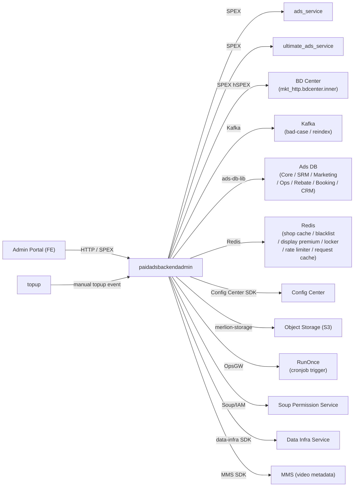

<!-- ads-workspace-gdoc-sync: gdoc_id=1PeU1ZZspcTUpQXJQmMPMEt8Xo5sQJ9A3hW-2GEtHe74 gdoc_url=https://docs.google.com/document/d/1PeU1ZZspcTUpQXJQmMPMEt8Xo5sQJ9A3hW-2GEtHe74/edit -->

# paidadsbackendadmin

> Git repository: https://git.garena.com/shopee/deep/paidadsbackendadmin

## Table of Contents

- [Introduction](#introduction)
- [Features](#features)
- [Architecture](#architecture)
- [Directory Structure](#directory-structure)
- [HTTP, SPEX and Admin Modules](#http-spex-and-admin-modules)
  - [Entry Overview](#entry-overview)
  - [Core Modules](#core-modules)
- [Cronjobs](#cronjobs)
- [Development Guidelines](#development-guidelines)
  - [Code Style](#code-style)
  - [Project Structure](#project-structure)
  - [Naming Conventions](#naming-conventions)
  - [Error Handling](#error-handling)
  - [Unit Testing Standards](#unit-testing-standards)
  - [Code Review & Git Workflow](#code-review--git-workflow)
- [Configuration](#configuration)
  - [Config Files](#config-files)
  - [SPEX and spcli Setup](#spex-and-spcli-setup)
- [Deployment](#deployment)
  - [Build for Production](#build-for-production)
  - [Release Process](#release-process)
- [Monitoring](#monitoring)
- [Business Terminology Glossary](#business-terminology-glossary)
  - [Core Metrics](#core-metrics)
  - [Ad Types and Products](#ad-types-and-products)
  - [Placements & Entrances](#placements--entrances)
  - [Sellers & Advertisers](#sellers--advertisers)
  - [Bidding & Pricing](#bidding--pricing)
  - [Prediction & Models](#prediction--models)
  - [System Features & Services](#system-features--services)
  - [Ad Supply & Display](#ad-supply--display)
  - [Controls & Filtering](#controls--filtering)
  - [External Services & Systems](#external-services--systems)
  - [Technical Terms](#technical-terms)
- [Additional Resources](#additional-resources)
- [Frequently Asked Questions](#frequently-asked-questions)

---

## Introduction

`paidadsbackendadmin` is the **Backend Admin** service for the Shopee Paid Ads Advertiser Platform. Its SPEX service identifier is `deep.paidads.backendadmin` (service name constant: `backend_admin`).

The service provides a backend for the Admin Portal used by internal Shopee operations teams to inspect, manage, and configure paid advertisements across all ad types: Product Ads, display_ads, Banner Ads (Search Brand / brand_consideration_ads), Livestream Ads, Video Ads, and Shop Ads.

It exposes two transport layers concurrently:

- **SPEX** (Shopee's internal RPC framework) — the primary path for Admin Portal communication and MTS (Multi-Tenant Service) async operations. Protobuf-defined via `paidads_backend_admin.pb`.
- **HTTP (fasthttp)** — for legacy bad-case management, file upload/download endpoints (`/api/*`), banner ads REST endpoints (`/api/v1/*`), and health checks (`/ping`, `/smoketest`, `/metrics`).

The Prometheus metrics namespace is `paidads` (constant `ExporterNamespace`), and metric names follow the `paidads_backend_admin_*` prefix.

---

## Features

- **Ad overview & reporting** — query and export product ads, shop ads, brand ads, livestream ads, and video ads overview and detailed reports.
- **Deduction log viewer** — query `deduction_log` and `display_ads_translog` records per ad type, with date-range filtering.
- **Balance log viewer** — query the full account balance change history for a shop (by `shop_id` or `user_id`), broken down by paid/free credit type, effective type (Universal, Product_RoiTwo, LiveStream, SearchBrand), and consumption type (General, OneToOne).
- **Manual top-up (manual_topup)** — CRM team creates manual credit top-ups for advertisers; supports batch upload via CSV file, batch action, async status polling, single deduct/transfer, and optional `shop_status` filter (with 30-day time range constraint). Supports both `SHOPEE_ADS_CREDIT` and `DISPLAY_ADS_CREDIT` credit types. `Escrow` transfer credits and `ROIThree` whitelist extinfo are also supported.
- **display_ads management** — manage display_ads lifecycle: create, edit, approve creatives, CPM pricing upload, billing export; shop whitelist management (`AddWhitelistShops`, `RemoveWhitelistShops`, `GetWhitelistShops`); block/unblock shops for specific date ranges (`BlockShop`, `UnBlockShop`, `GetBlockShopListByDate`) — both global date-level and shop-level blocking are supported.
- **Brand Ads management** — Banner Ads, Search Brand package management, brand_consideration_ads creative QC, inventory editing, deduction_log.
- **Whitelist management** — add/remove/query user whitelists with async polling, and create/configure whitelist metadata (`SetWhitelistMeta`). Supports ROIThree and Escrow extinfo fields; Escrow extinfo now supports `optional_fee_rate_change_type` enum (`OVERWRITE` / `INCREMENT`) for optional fee rate adjustments, plus `is_override_gms` and `fixed_program_fee_rate` fields.
- **Flag management** — read and update shop-level or campaign-level feature flags (`flag_tab`).
- **Brand keyword management** — batch upload, remove, and changelog for brand keywords.
- **Bad-case & blacklist tool** — search, update, and log bad-case ads; manage ad blacklists with Kafka-based reindex triggers.
- **Ad reindex tool** — trigger and audit ad reindexing via Kafka.
- **DB viewer** — admin view of raw DB rows for debugging.
- **Cronjob trigger** — trigger and inspect the status of platform cronjobs via the RunOnce client. Supports rebate-specific job types (`REBATE_MANUAL_REVIEW_APPROVE_ALL`, `REBATE_ORDER`, `REBATE_MARK_DONE_OFFLINE`) with date parameter and sequential execution validation.
- **Account settings** — batch account setting tasks with audit log and download.
- **Reserved keyword whitelist** — manage search-brand keyword reservation whitelist and audit log.
- **Storage** — upload/download report files to object storage (S3-compatible via `merlion-storage`).

---

## Architecture

`paidadsbackendadmin` sits in the **Core Ads Services** layer of the Advertiser Platform. It is initialised by `cmd/main.go → cmd/run.go`, which wires all dependencies (SPEX, DB, Redis, Kafka, Config Center, etc.) using Google Wire (`internal/backendadmin/setup/wire.go`), then registers both the SPEX processor and the fasthttp server.

```
cmd/main.go
  └── cmd/run.go
        ├── DBLibManager          (ads-db-lib — reads/writes Ads Core DB, SRM DB, etc.; embeds IDMappingClient for shard-key lookup)
        ├── SpexInstance          (SPEX agent — registers BackendAdminProcessor)
        ├── FastHTTP Server       (listens on :$BACKEND_ADMIN_HTTP_PORT)
        ├── ConfigCenterClient    (Config Center SDK — hot-reload of display_ads, currency, etc.)
        ├── KafkaWriter           (bad-case events)
        ├── KafkaIndexer          (ad reindex triggers)
        ├── SpexClient            (outbound calls to ads_service / ultimate_ads_service)
        ├── SoupClient            (permission check against Soup/IAM)
        ├── BDCenterManager       (BD Center — mkt_http.bdcenter.inner via hSPEX)
        ├── ShopCache             (Redis — shop name cache)
        ├── BlacklistCache        (Redis — bad-case blacklist)
        ├── RequestCache          (Redis — async whitelist request status)
        ├── DisplayPremiumCache   (Redis — display ads premium rate cache)
        ├── LockManager           (Redis-based distributed lock)
        ├── RateLimiter           (Redis-based QPS rate limiter)
        ├── UserShopCacheManager  (shared user-shop cache via ads-db-lib)
        ├── StorageManager        (S3-compatible — merlion-storage)
        ├── RunonceClient         (cronjob trigger via OpsGW)
        ├── TranslatorManager     (i18n translations)
        ├── DataInfraManager      (data-infra SDK)
        └── MMS SDK               (video/live video metadata)
```

### Service Topology



| Direction | Service / System | Protocol | Description |
|---|---|---|---|
| **Upstream** | Admin Portal (FE) | HTTP / SPEX | Primary client — ops team admin portal |
| **Upstream** | topup | Kafka / internal | Manual top-up events consumed by backend admin |
| **Downstream** | ads_service | SPEX | Core ad data queries (campaigns, ads, keywords) |
| **Downstream** | ultimate_ads_service | SPEX | Brand/display/product ad management and advanced queries |
| **Downstream** | BD Center (mkt_http.bdcenter.inner) | hSPEX (HTTP over SPEX) | Internal BD operations |
| **Dependency** | Ads DB (ads-db-lib) | MySQL (GDBC/Hardy) | All ads data — 7 DBs (Core, SRM, Marketing, Ops, Rebate, Booking, CRM) |
| **Dependency** | Redis | Redis | Shop cache, blacklist cache, display premium cache, distributed lock, rate limiter, request cache |
| **Dependency** | Kafka | Kafka | Bad-case event publishing and ad reindex triggers |
| **Dependency** | Config Center | Config Center SDK | Hot-reload of display_ads, currency, adsdblib, db_viewer, ads_config, data_infra configs |
| **Dependency** | Object Storage (S3) | merlion-storage | Report file upload/download |
| **Dependency** | RunOnce (OpsGW) | HTTP | Trigger and query platform cronjobs |
| **Dependency** | Soup / IAM | internal | Operator permission list |
| **Dependency** | Data Infra Service | data-infra SDK | Data infrastructure queries |
| **Dependency** | MMS SDK | internal SDK | Video and live video metadata |

---

## Directory Structure

```
paidadsbackendadmin/
├── cmd/                        # Entry point (main.go, run.go)
├── api/http/                   # fasthttp server: route registration (handler.go)
├── config/                     # Config structs (BackendAdmin) + per-env YAML files
│   └── files/                  # live.yml, staging.yml, uat.yml, test.yml, stable.yml
├── protobuf/go/                # Generated SPEX Protobuf Go code
│   └── paidads_backend_admin.pb/
├── internal/
│   ├── backendadmin/           # All business logic (Activity + Controller per module)
│   │   ├── setup/              # Wire DI: wire.go, wire_gen.go, helper.go, controller.go
│   │   ├── display_ads/        # Display Ads management (incl. shop whitelist & block/unblock)
│   │   ├── manual_topup/       # Manual top-up & deduct/transfer
│   │   ├── bannerads/          # Banner Ads / Search Brand
│   │   ├── brand_consideration_ads/ # Brand Consideration Ads
│   │   ├── brand_keyword/      # Brand keyword management
│   │   ├── product_ads/        # Product Ads (GMS, diagnosis)
│   │   ├── overview_v2/        # Ads overview (product, shop)
│   │   ├── report_v2/          # Ads reporting (product, shop)
│   │   ├── operation_log_v2/   # Operation audit log
│   │   ├── deduction_log_v2/   # Deduction log viewer
│   │   ├── livestream_ads/     # Livestream Ads management
│   │   ├── video/              # Video Ads management
│   │   ├── balance_log/        # Balance log viewer (flexible ID input, rich credit breakdown)
│   │   ├── badcase/            # Bad-case search/update controller
│   │   ├── adsblacklist/       # Ad blacklist search/update controller
│   │   ├── whitelist/          # User whitelist management (ROIThree, Escrow extinfo)
│   │   ├── flag/               # Flag (shop/campaign feature toggles)
│   │   ├── account_setting/    # Account setting batch tasks
│   │   ├── reserved_keyword/   # Reserved keyword whitelist
│   │   ├── reindex_tool/       # Ad reindex trigger & audit
│   │   ├── db_viewer/          # Raw DB viewer
│   │   ├── cronjob/            # Cronjob trigger & status (incl. rebate job types)
│   │   ├── admin_misc/         # Misc admin utilities (Soup permission list)
│   │   ├── config/             # Internal config manager (Config Center binding)
│   │   ├── config_center/      # Config Center client wrapper
│   │   ├── kafka/              # Kafka writers (bad-case, reindex)
│   │   ├── shop_cache/         # Redis shop name cache
│   │   ├── storage/            # Object storage (merlion-storage)
│   │   ├── request_cache/      # Redis async request status cache
│   │   ├── qps_rate_limiter/   # Redis QPS rate limiter
│   │   ├── reportng_v2/        # Report-NG v2 manager
│   │   └── live_testing_tool/  # Local testing utilities
│   ├── badcasetool/            # Bad-case service (search, blacklist, Kafka)
│   ├── bd_center/              # BD Center client manager
│   ├── collections/            # Generic set/slice helpers
│   ├── constant/               # Shared constants & enums
│   ├── data_infra/             # Data Infra SDK manager
│   ├── db_manager/             # ads-db-lib wrapper (DBLibManager + IDMappingClient); shard_key.go: primary-key helpers for targeted shard routing
│   ├── filterutil/             # Request filter utilities
│   ├── headerutil/             # Request header utilities
│   ├── http/                   # HTTP utilities (managed/unmanaged handler types)
│   ├── locker/                 # Redis distributed lock
│   ├── model/                  # Shared data models
│   ├── productutil/            # Product ads utilities
│   ├── runonce_client/         # RunOnce (OpsGW) client (rebate date option, bot email const)
│   ├── search/                 # Search/bad-case search client
│   ├── soup_client/            # Soup IAM client
│   ├── spex/                   # SPEX interceptors and adapter utilities
│   ├── spexclient/             # SPEX outbound client (ads_service, ultimate_ads_service)
│   ├── translator/             # i18n translation manager
│   └── adsutil/                # Shared ads utilities (audit, placement, format)
├── types/                      # Public types (ads, errors, report-NG)
├── utils/                      # Shared utility functions
├── tool/                       # Debug/one-off tooling (get_ads, get_auto_topup_data)
├── docs/                       # Internal docs
├── deploy/                     # Deployment JSON and Mesos scripts
├── Makefile                    # Build, test, lint, proto generation targets
├── go.mod / go.sum             # Go module dependencies (Go 1.21)
├── hspex-workspace.yml         # hSPEX dependency config (bdcenter.inner)
└── .spkit.yml                  # spkit tool versions (spkit v0.10.11, golangci-lint v1.59.1, spcli v1.3.21, wire v0.5.0)
```

---

## HTTP, SPEX and Admin Modules

### Entry Overview

The service registers handlers via two parallel stacks:

| Transport | Router / Entry | Handler type |
|---|---|---|
| **SPEX** | `paidadsbackendadminpb.NewBackendAdminProcessor(controller)` | Generated protobuf SPEX processor |
| **SPEX (unmanaged)** | `controller.RegisterUnmanagedProcessor()` | Legacy bad-case / blacklist commands (`CmdBadCaseSearch`, `CmdBadCaseUpdate`, `CmdAdBlacklistSearch`, etc.) |
| **HTTP** | `api/http/handler.go` → `fasthttp.Server` | `fasthttp.RequestHandler` |

HTTP route groups:

| Route prefix | Module | Protocol |
|---|---|---|
| `/ping`, `/smoketest`, `/metrics` | Health / Prometheus | HTTP |
| `/api/search`, `/api/update/*` | Bad-case & blacklist | HTTP managed (JSON) |
| `/api/display_ads/upload_creative_image` | Display Ads | HTTP unmanaged |
| `/api/v1/create_banner_ads` … `update_campaign_status` | Banner Ads | HTTP unmanaged (Protobuf-JSON) |
| `/api/v2/top_up/*` | Manual top-up async file | HTTP MTS |

All Admin Portal operations beyond the above use SPEX.

### Core Modules

Each module under `internal/backendadmin/` follows the pattern: one or more `Activity` structs with business logic, wired by Google Wire. The `Controller` in `setup/controller.go` delegates every SPEX handler to the corresponding activity.

| Module directory | SPEX Methods (examples) | Key dependencies |
|---|---|---|
| `display_ads` | `GetDisplayAdsList`, `GetDisplayAdsListByDate`, `CreateDisplayAds`, `ApproveCreative`, `GetInventoryInfo`, `UploadCpmPricing`, `GetCpmPricingList`, `GetBillings`, `ExportReadyForInvoiceBillings`, `GetReadyForInvoiceBillingCount`, `UpdatePayment`, `GetDisplayAdsCompanyProfiles`, `GetDisplayAdsConfig`, `GetAdminToggles`, `GetDisplayAdsPremiumRate`, `SetDisplayAdsPremiumRate`, `GetDisplayAdsPremiumRateAudits`, `DisplayAdsBalanceLogOverview`, `DisplayAdsBalanceLogShopDetail`, `GetDisplayAdsListAudienceGroup`, `GetUploadCpmReminder`, `BlockShop`, `UnBlockShop`, `GetBlockShopListByDate`, `AddWhitelistShops`, `RemoveWhitelistShops`, `GetWhitelistShops`, `GetAffectAdsListByUnWhitelist` | DBLibManager, SpexClient, BDCenterManager, ConfigCenter (display_ads / currency), DisplayPremiumCache, TranslatorManager |
| `manual_topup` | `SetManualTopup`, `GetManualTopupSummary`, `BatchUpdateManualTopup`, `AsyncBatchSetManualTopup`, `SetManualDeduct`, `AsyncBatchSetManualDeduct`, `AsyncBatchSetManualTransfer`, `GetCreditSummary`, `GetAdsCreditSubtype`, `SetAdsCreditSubtype`, `GetManualTopupConfig` | DBLibManager, SpexClient, StorageManager, ConfigCenter (ads_config) |
| `bannerads` | `CreateBannerAds`, `UpdateBannerAds`, `ListBannerAdsCampaigns`, `BrandAdsListCreatives`, `BrandAdsReporting`, `BrandAdsGetFeConfigs`, `BrandAdsGetDetail`, `BrandAdsUpdateCreativeStatus`, `BrandAdsGetCreativeDetail`, `ListSearchBrandPackage`, `BatchUploadSearchBrandPackage`, `RemoveBrandPackagePeriod`, `ListSearchBrandPackageChangelog` | SpexClient, DBLibManager, TranslatorManager, UserShopCacheManager, ReportNGv2Manager, DataInfraManager |
| `brand_consideration_ads` | `BrandConsiderationAdsCreativeDetail`, `BrandConsiderationListInventory`, `BrandConsiderationBatchEditInventory`, `BrandConsiderationAdsCreativeQc`, `BrandConsiderationAdsDeductionLog`, `BrandConsiderationAdsReport`, `BrandConsiderationGetConfig`, `BrandConsiderationListInventoryChangeLog`, `BrandConsiderationAdsGetDetail`, `BrandConsiderationAdsListCreatives`, `BrandConsiderationAdsUpdateStatus`, `BrandConsiderationAdsOverview` | SpexClient |
| `brand_keyword` | `ListGroupedKeyword`, `BatchUploadBrandKeyword`, `RemoveBrandKeyword`, `ListBrandKeywordChangeLog` | DBLibManager |
| `overview_v2` | `ProductAdsOverview`, `ShopAdsOverview` | SpexClient |
| `report_v2` | `ProductAdsReporting`, `ProductAdsReportingDetail`, `ShopAdsReporting`, `ShopAdsReportingDetail` | SpexClient |
| `operation_log_v2` | `ProductAdsOperationLog`, `ShopAdsOperationLog`, `BrandAdsOperationLog`, `BrandConsiderationAdsOperationLog`, `ListVideoOperationLog`, `AccountSettingOperationLog` | DBLibManager |
| `deduction_log_v2` | `ProductAdsDeductionLog`, `ShopAdsDeductionLog`, `ListVideoDeductionLog`, `BrandConsiderationAdsDeductionLog` | DBLibManager |
| `livestream_ads` | `ListLsOverview`, `GetLsOverview`, `ListLsDeductionLog`, `ListLsReport`, `ListLsOperationLog`, `GetLsReportDetail` | SpexClient, DBLibManager |
| `video` | `ListVideoOverview`, `ListVideoReport` | SpexClient, MMS SDK |
| `balance_log` | `GetBalanceLog` | DBLibManager, UserShopCacheManager, ConfigManager |
| `badcase` | `Search`, `Update` (HTTP + unmanaged SPEX) | SearchClient, BadCaseService, SpexClient |
| `adsblacklist` | `Search`, `SearchLog`, `Update` (HTTP + unmanaged SPEX) | BadCaseService |
| `whitelist` | `AddWhitelistUsers`, `PollAddWhitelistUsers`, `GetWhitelistUsers`, `SetWhitelistMeta` | SpexClient, RequestCache, ConfigManager |
| `flag` | `ListFlagAllowed`, `ListFlagOverview`, `UpdateFlag` | DBLibManager |
| `account_setting` | `AccountSettingTaskCreate`, `AccountSettingTaskList`, `AccountSettingTaskDownload`, `AccountSettingOverview` | DBLibManager, SpexClient |
| `reserved_keyword` | `GetReservedKeywordWhitelist`, `SetReservedKeywordWhitelist`, `GetReservedKeywordWhitelistAudit` | DBLibManager |
| `reindex_tool` | `ReindexAds`, `ReindexAdsMts`, `GetReindexAdsAudit` | DBLibManager, KafkaIndexer, RateLimiter |
| `db_viewer` | `DatabaseViewer`, `GetDatabaseViewerMetadata` | DBLibManager, ConfigCenter (db_viewer) |
| `cronjob` | `TriggerCronjob`, `GetCronjob` | RunonceClient, ConfigManager |
| `admin_misc` | `GetSoupPermissionList` | SoupClient |
| `product_ads` | `ProductAdsDiagnosisList`, `ProductAdsListSystemGmsShop`, `ProductAdsAddSystemGmsShop`, `ProductAdsBatchPauseSystemGms`, `ProductAdsResumeSystemGms`, `ProductAdsPauseSystemGms` | SpexClient, DBLibManager |

---

## Cronjobs

`paidadsbackendadmin` does **not** own any scheduled cronjobs itself — it provides the `TriggerCronjob` / `GetCronjob` SPEX APIs that allow the Admin Portal to manually trigger and inspect platform-wide cronjobs managed by other services via the RunOnce system.

Supported cronjob types include rebate-specific jobs (`REBATE_MANUAL_REVIEW_APPROVE_ALL`, `REBATE_ORDER`, `REBATE_MARK_DONE_OFFLINE`) that require a `date` parameter (format: `YYYY-MM-DD`). `REBATE_ORDER` additionally validates that a successful `REBATE_MANUAL_REVIEW_APPROVE_ALL` execution exists for the given date before triggering.

The following lists the platform-wide cronjobs across all Advertiser Platform services (source: KB `04-operations/cronjobs`). CMDB task list: https://space.shopee.io/console/cmdb/cronjobs/tree/shopee.mp_search_recommendation_ads.paidads.advertiser_platform.platform

| Importance | Job Name | Purpose | Service |
|---|---|---|---|
| 🔴 Critical | `ads_status_sync_job_live_all` | Update campaign status based on product state (deleted, blocked, adult content) | ads-status-syncer |
| 🔴 Critical | `roi_two_ads_sync_job_live` | Sync ROI2 delivery status and config, handle overlap | ads-status-syncer |
| 🔴 Critical | `display_ads_billing_generator` | Generate Display Ads billing | ads_service |
| 🔴 Critical | `account_balance_sync_job_live` | Fix discrepancies between account balance and campaign budget | ads-account-balance |
| 🔴 Critical | `create_rebate_order_v2` | Read rebate data from Hive and create rebate orders | auto-rebate |
| 🔴 Critical | `ROI3_sync_job` | Create vouchers and control ROI3 lifecycle | ultimate_ads_service |
| 🟠 High | `display_ads_status_updater` | Display Ads state machine (planned for decommission) | ads_service |
| 🟠 High | `search_brand_ads_sync_job_live` | Search Brand Ads state machine | ads-status-syncer |
| 🟠 High | `NPA Phase Transition Job` | Handle New Product Ads phase transitions | ultimate_ads_service |
| 🟠 High | `auto_topup_scanner_live` | Scan and execute automatic top-up (cold path) | auto-topup |
| 🟠 High | `campaign_rebate_status_v2` | Update rebate campaign status | auto-rebate |
| 🟠 High | `brand_consideration_ads` | Handle brand_consideration_ads status changes and unfreeze | ultimate_ads_service |
| 🟠 High | `system_gms_live` | Configure and create GMS (payment) campaign activities | ads-status-syncer |
| 🟠 High | `gms_sync_job_live` | Refresh GMS data (item counts) | ads-status-syncer |
| 🟡 Medium | `mcn_sync_job_live` | Sync MCN agency status and influencer partnerships | ads-status-syncer |
| 🟡 Medium | `diagnosis_daily_checker_live` | Daily diagnostic data update | ads-marketing |
| 🟢 Low | `notify_ads_credit_expiry` | Notify sellers of expiring ad credits | ads_service |
| 🟢 Low | `delete_hide_cron_live` | Clean up deleted/hidden ad data | ads-status-syncer |

---

## Development Guidelines

### Code Style

- Go 1.21 (`go.mod` `go 1.21`).
- Linter: `golangci-lint v1.59.1` configured via `.golangci.yml`. Run: `make gci` (fix gci import order), then `make fmt`, `make vet`.
- Import grouping (enforced by `gci`): stdlib → third-party → `git.garena.com` → `git.garena.com/shopee/deep/paidadsbackendadmin`.
- Generated files (`.pb.go`, `.gen.go`, `*_test.go`) are excluded from linting.
- Key enabled linters: `errcheck`, `govet`, `staticcheck`, `gosec`, `gocyclo` (max 20), `funlen`, `dupl`, `misspell`, `prealloc`.

### Project Structure

Follows the standard Go project layout. All business logic lives under `internal/`. Entry points are in `cmd/`. Public types shared with callers go in `types/` and `utils/`.

Each functional domain under `internal/backendadmin/` is self-contained: it defines its own `Activity` struct, constructor (`NewActivity`), and methods. The central `Controller` in `setup/controller.go` delegates SPEX method calls to the appropriate activity.

Dependency injection is handled by Google Wire (`wire v0.5.0`). Run `make wire` after modifying wire providers.

### Naming Conventions

- Commit messages: `(Feat|Fix|Docs|Style|Refactor|Test|Chore): [JIRA-ID] description`
- Branch naming: `dev/$username` or `feature/$feature_name`
- SPEX method names are PascalCase, matching the protobuf definitions.
- Each SPEX method has a corresponding `*Mts` variant for multi-tenant async operations.
- Enum files follow the pattern `*_enum.go`; generate with `make enum`.

### Error Handling

- All errors must be checked (enforced by `errcheck`).
- Return SPEX error codes as `uint32` constants defined in `pb.Constant_*` (e.g., `pb.Constant_ERROR_INVALID_REQUEST`, `pb.Constant_ERROR_EXTERNAL_SERVICE`).
- Use `fmt.Errorf("context: %w", err)` for error wrapping.
- Type assertions must check the `ok` flag (enforced by `errcheck.check-type-assertions`).

### Unit Testing Standards

Run tests: `make test` (verbose) or `make test-nv` (coverage only).

The CI pipeline runs `make ci` which executes `ci-vet` (vet + diff check), `fmt`, and `test-nv`.

Mock implementations exist for key interfaces: `SpexClient` (`internal/spexclient/client_mock.go`), `DBLibManager` (`internal/db_manager/mocked_lib_manager.go`), `BDCenterManager` (`internal/bd_center/mocked_manager.go`). To regenerate mocks: `make mock` (runs `spkit run mockery --config .mockery.yaml`).

### Code Review & Git Workflow

- All changes via Merge Requests (squash commit, delete source branch after merge).
- MR must pass the GitLab CI pipeline (`make ci`).
- Proto changes: run `make proto-compile-dep-only` (uses `spcli v1.3.21`), then `make update-proto` to regenerate and vendor.
- Merge only after full review; algo-impacting changes require sign-off.

---

## Configuration

### Config Files

Config is loaded from `config/files/<env>.yml` (env: `live`, `staging`, `uat`, `test`, `stable`) and merged with Config Center values at runtime.

Top-level config key: `backend-admin` → parsed into `config.BackendAdmin`.

Key config sections:

| Section | Description |
|---|---|
| `spex` | SPEX service identity (`deep.paidads.backendadmin`), env, tag, deployment, config-key, serve-timeout |
| `fasthttp` | fasthttp server options (concurrency, read/write timeout, compression) |
| `httpport` | HTTP server port (set via `BACKEND_ADMIN_HTTP_PORT` env var in live) |
| `db_config` | ads-db-lib DB connection config |
| `config-center.*` | Config Center keys and namespaces for display_ads, currency, adsdblib, backend-admin, db_viewer, ads_config, data_infra |
| `locker` | Redis distributed lock config |
| `rate-limiter` | Redis QPS rate limiter config |
| `shop-cache` | Redis shop name cache config |
| `blacklist-cache` | Redis bad-case blacklist cache config |
| `request-cache` | Redis async request status cache config |
| `display-premium-cache` | Redis display ads premium rate cache config |
| `reindex-kafka` | Kafka config for ad reindex triggers |
| `kafka` | Kafka config for bad-case event publishing |
| `storage` | Object storage (S3) config (merlion-storage) |
| `user-shop-cache` | User-shop cache manager config |
| `bd-center` | BD Center client config |
| `translator` | i18n translator config |

**Config Center namespaces (live)**:

| Namespace | Key | Content |
|---|---|---|
| `display_ads_live_default` | `bde270fc...` | Display Ads config (pricing, activity) |
| `currency_live_default` | `8435cb08...` | Currency config |
| `adsdblib_live_default` | `43cdea66...` | ads-db-lib DB routing config |
| `backendadmin_live_default` | `ddfc8eba...` | Backend Admin runtime config (whitelist subtypes, cronjob config, etc.) |
| `db_viewer_live_default` | `a822217b...` | DB viewer allowed tables config |
| `ads_config_live_default` | `afa377d0...` | Ads config (manual topup subtypes) |
| `data_infra_live_default` | `b28eef75...` | Data Infra endpoint config |

### SPEX and spcli Setup

SPEX service name: `deep.paidads.backendadmin`

Install toolchain via spkit (versions defined in `.spkit.yml`):

```bash
# Install spkit
curl -fsSL https://spkit.shopee.io/install | bash

# Install project tools (golangci-lint, spcli, wire, go-enum, spex-generator)
spkit install

# Regenerate proto (after proto changes)
make proto-compile-dep-only

# Regenerate SPEX stubs and vendor
make update-proto

# Regenerate Wire DI code (after modifying wire providers)
make wire

# Regenerate enum files (after modifying *_enum source files)
make enum
```

---

## Deployment

### Build for Production

The service is deployed on Shopee Mesos. Build config: `deploy/backendadmin.json`.

```bash
# Local build (native)
make backendadmin
# Output: bin/paidads_backendadmin_server

# Cross-build for Linux
# (done automatically in CI via deploy/mesos.sh)
bash ./scripts/gen-dep-proto.sh && make dep-vo && bash ./deploy/mesos.sh build backendadmin backendadmin config/files
```

Docker base image: `harbor.shopeemobile.com/paidads/base/platform:1.21`

The binary is named `paidads_backendadmin_server`. The Mesos run command is `./mesos.sh run backendadmin`.

Smoke test: `GET /smoketest` (HTTP, 1000 ms timeout, 10 retries).
Health check: `GET /ping` (HTTP, 1000 ms timeout, 3 retries).

Hostnames:
- `paidads-backendadmin.${ENV}shopee.io`
- `admin.ads.${ENV}shopee.io`

### Release Process

Releases are managed through the Shopee SPEX deployment system.

1. Ensure `make ci` passes locally.
2. Open a Merge Request and get approval.
3. Merge to `master` (squash commit).
4. The CI pipeline builds the Docker image and pushes to the registry.
5. Deploy via the SPEX/Space release system for the target environment (staging → stable → live).
6. Monitor `/smoketest` and Grafana dashboards after each stage.

---

## Monitoring

Grafana dashboards (advertiser-platform folder):

- [advertiser-platform Grafana folder](https://monitoring.infra.sz.shopee.io/grafana/dashboards/f/advertiser-platform/advertiser-platform)
- [paidads core monitoring](https://monitoring.infra.sz.shopee.io/grafana/d/pXH7nP_7z/paidadshe-xin-jian-kong)
- [paidads core monitoring (large board)](https://monitoring.infra.sz.shopee.io/grafana/d/IWNBCgyVz/paidadshe-xin-jian-kong-da-ban)
- [paidads biz critical](https://monitoring.infra.sz.shopee.io/grafana/d/rdmST4f4z/paidads-biz-critical)
- [Ads Report-NG (Live Env)](https://monitoring.infra.sz.shopee.io/grafana/d/Upizly3Wk/ads-report-ng-live-env)

Key Prometheus metrics (namespace `paidads`, prefix `paidads_backend_admin_*`):

| Metric | Description |
|---|---|
| `paidads_backend_admin_*` | All SPEX handler latency, error rate, QPS metrics auto-instrumented by paidads-platform-lib |

---

## Business Terminology Glossary

### Core Metrics

| Term | Full Form | Definition |
|---|---|---|
| CTR | Click-Through Rate | Total clicks / total impressions |
| CR / CVR | Conversion Rate | Ad orders / total clicks |
| CPC | Cost Per Click | Amount spent per click |
| CPM | Cost Per Mille | Cost per 1,000 impressions |
| eCPM | Effective Cost Per Mille | Total ad spend / total impressions |
| ROI / ROAS | Return on Investment / Return on Ad Spend | Ad GMV / Ad revenue (inverse of CIR) |
| CIR | Cost-Income Ratio | Ad revenue / Ad GMV |
| GMV | Gross Merchandise Value | Total transaction value |
| Take-Rate | — | Ads revenue / Platform GMV |
| Rank Score | — | eCPM + quality factors |

### Ad Types and Products

| Term | Description |
|---|---|
| Product Ads | Item-level sponsored search/recommendation ads (keyword-based CPC) |
| Shop Ads | Shop-level sponsored ads |
| display_ads | Display / brand banner ads (CPM-based, invoice billing) |
| brand_consideration_ads | Brand consideration ads (mid-funnel brand awareness) |
| Search Brand Ads | Branded keyword search ads with reserved slots and packages |
| Banner Ads | Visual display banner ad format managed in Admin Portal |
| Livestream Ads | Ads appearing in or around Shopee Live streams |
| Video Ads | Ads associated with Shopee video content (MMS) |
| TADS / DADS | Targeting/Discovery Ads — audience-targeted recommendation ads |
| NPB / NPA | New Product Boost / New Product Ads — ads for newly listed products |

### Placements & Entrances

| Term | Description |
|---|---|
| placement | Integer code for ad placement position (4 = search, 3 = shop, 40 = recommendation, etc.) |
| PDP | Product Detail Page |
| DD | Daily Discovery |
| YMAL | You May Also Like |
| SVS PDP | Seller Value Service Product Detail Page (CB top-up) |

### Sellers & Advertisers

| Term | Description |
|---|---|
| PS | Preferred Sellers |
| OS | Official Shops |
| CB Sellers | Cross-border sellers requiring manual top-up via SVS |
| MCN | Multi-Channel Network — agencies managing multiple creator shops |
| SRM | Seller Relationship Management — program/segment/incentive management |

### Bidding & Pricing

| Term | Description |
|---|---|
| uGSP | Uniform Generalized Second-Price auction (Shopee's ad auction mechanism) |
| oCPC | Optimized CPC — auto-bid simple mode; system selects keywords automatically |
| PID | Proportional-Integral-Derivative — control mechanism for auto-bid price adjustment |
| Manual Mode | Advertiser manually sets keyword bids |
| Simple Mode | oCPC — system auto-optimizes bids |

### Prediction & Models

| Term | Description |
|---|---|
| pCTR | Predicted Click-Through Rate |
| pCR | Predicted Conversion Rate |
| rcgbdt | RC Gradient Boost Decision Trees — ML model for pCTR |
| Cold Start | Ad with insufficient data for accurate model prediction |

### System Features & Services

| Term | Description |
|---|---|
| Backend Admin | This service (`paidadsbackendadmin`) — internal admin backend for ops team |
| deduction_log | Transaction log recording every CPC/CPA deduction event |
| QSS | QuickStart Service — helps new advertisers ramp up ad usage |
| VGS | Values Grid Search — auto-adjusts algorithm parameters |
| RunOnce | OpsGW-based system for triggering one-off or scheduled cronjobs |
| Soup / IAM | Internal identity/permission service |

### Ad Supply & Display

| Term | Description |
|---|---|
| Display Rate | Ads with impressions / active ads |
| Fill-up Rate | Actual impressions / potential (slot-designated) impressions |
| Broad Match | Triggered when search query contains the keyword |
| Exact Match | Triggered only when search query equals the keyword |
| Brand Max | Premium display ad inventory reservation (booking system) |
| Inventory | Forecasted impression slots for Display/Brand Ads |

### Controls & Filtering

| Term | Description |
|---|---|
| Whitelist | Shops or users enabled for certain features (target ROI, shop ads customization, etc.) |
| Blacklist | Keywords or item IDs blocked from ad serving |
| Bad-case | Ads flagged for quality/policy review by ops team |
| OCPC CIR | Cost-Income Ratio config for OCPC auto-bidding (per category/item/shop/ad) |
| Flag | Feature toggle stored in `flag_tab` (shop-level or campaign-level) |

### External Services & Systems

| Term | Description |
|---|---|
| SPEX | Shopee's internal high-performance RPC framework |
| spcli | Shopee CLI for proto generation and dependency management |
| GAS | Go Application Server — Shopee's MTS (multi-tenant service) framework |
| GDBC / Hardy / SDDL | Shopee internal DB access and sharding libraries |
| Config Center | Shopee centralized config hot-reload service |
| MMS | Media Management Service — video/live video metadata |
| BD Center | Business Development Center (`mkt_http.bdcenter.inner`) |

### Technical Terms

| Term | Description |
|---|---|
| DAG | Directed Acyclic Graph (used in feature pipeline contexts) |
| GAS | Go Application Server (MTS framework) |
| MTS | Multi-Tenant Service — async operation pattern in SPEX |
| Wire | Google Wire — compile-time dependency injection |
| hSPEX | HTTP over SPEX — HTTP client tunneled through SPEX for service mesh |

---

## Additional Resources

- [Advertiser Platform Architecture (Confluence)](https://confluence.shopee.io/display/SPAD/Advertiser+Platform)
- [Paid Ads Glossary (Confluence)](https://confluence.shopee.io/pages/viewpage.action?spaceKey=SPAD&title=Paid+Ads+Glossary)
- [Monitoring & Grafana Dashboard Summary (Google Docs)](https://docs.google.com/document/d/1xbEldfLSGJ5KsFjKk2IjZQfoI0XfQ8Ffwja0UKVHjNw/)
- [Platform BE Cronjob Analysis (Google Docs)](https://docs.google.com/document/d/1Z6VYs8vyJ-D914cU8wDBltrE6ItZ2TrhoZiXOSPkXmM/)
- [ads-db-lib (GitLab)](https://git.garena.com/shopee/deep/ads-db-lib)
- [SPEX Go SDK Quick Start](https://spex.shopee.io/overview/quick-start/languages/go/index.html)
- [spcli Installation & Git Config](https://spex.shopee.io/user-guide/SDK/Java/local.html)
- [CMDB Cronjob List](https://space.shopee.io/console/cmdb/cronjobs/tree/shopee.mp_search_recommendation_ads.paidads.advertiser_platform.platform)
- [advertiser-platform Grafana folder](https://monitoring.infra.sz.shopee.io/grafana/dashboards/f/advertiser-platform/advertiser-platform)

---

## Frequently Asked Questions

**Q1: What is the SPEX service name for this service?**
`deep.paidads.backendadmin`. The internal service name constant is `backend_admin` (defined in `internal/backendadmin/consts.go`). The Prometheus metric namespace is `paidads`.

**Q2: How do I build and run the service locally?**
```bash
make dep-vo          # Download vendor dependencies
make backendadmin    # Build binary to bin/paidads_backendadmin_server
```
Set `BACKEND_ADMIN_HTTP_PORT` to a free port and use `config/files/test.yml` as config.

**Q3: How do I add a new SPEX method?**
1. Add the method to the protobuf definition in the proto repo.
2. Run `make update-proto` to regenerate and vendor.
3. Implement the method in the relevant `Activity` struct under `internal/backendadmin/<module>/`.
4. Add a delegation wrapper in `internal/backendadmin/setup/controller.go`.
5. Run `make wire` if a new dependency was added to an Activity constructor.

**Q4: What databases does the service access and via what library?**
It uses `ads-db-lib` (wrapped in `internal/db_manager/DBLibManager`) to access 7 logical databases (Ads Core, SRM, Marketing, Ops, Rebate, Booking, CRM). DB routing is configured via `RegionAdsDSN`, `RegionSRMDSN`, etc. `DBLibManager` now also embeds `adsdblib.IDMappingClient` (from `ads-db-lib v0.128.0`); helper functions in `internal/db_manager/shard_key.go` use it to resolve primary keys (user_id + campaign_id + ads_id) before DB queries, enabling direct shard routing instead of scatter-gather. All DB connections are initialized in `cmd/run.go`.

**Q5: How does the Manual top-up flow work?**
An operator uploads a CSV file via `POST /api/v2/top_up/upload_file` → `manual_topup.UploadFile` stores the file in S3. The operator then calls `AsyncBatchSetManualTopup` (SPEX) to process the batch. Status is polled via `GetManualTopupBatchUploadLog`. Individual top-ups also go through `SetManualTopup`. The `GetManualTopupSummary` API supports filtering by `shop_status` (with a 30-day time range constraint) and `transaction_group`.

**Q6: How does ad reindexing work?**
The `reindex_tool` module exposes `ReindexAds` / `ReindexAdsMts` SPEX methods. On call, the service writes ad IDs to the reindex Kafka topic (configured as `reindex-kafka`). The Kafka indexer consumer (in the ads indexer service) picks up the events and re-ingests the ads. Audit entries are written to `reindex_ads_audit_tab`.

**Q7: How does the cronjob trigger work?**
The `cronjob` module's `TriggerCronjob` method calls the `RunonceClient`, which in turn calls the OpsGW API to trigger the target job. `GetCronjob` queries ongoing, last-successful, and latest execution status. For rebate job types (`REBATE_ORDER`, `REBATE_MANUAL_REVIEW_APPROVE_ALL`, `REBATE_MARK_DONE_OFFLINE`), a `date` parameter (format: `YYYY-MM-DD`) is required. `REBATE_ORDER` additionally validates that a prior successful `REBATE_MANUAL_REVIEW_APPROVE_ALL` execution exists for that date.

**Q8: How is hot-reload configuration managed?**
Config Center SDK is initialized at startup. Seven Config Center namespaces are subscribed (display_ads, currency, adsdblib, backend-admin, db_viewer, ads_config, data_infra). Each has a corresponding `ConfigManager` that listens for changes and refreshes the in-memory config. No restart is needed for config changes. The `backendadmin_live_default` namespace contains whitelist subtypes and cronjob configs used at runtime.

**Q9: How is the service's permission/auth model enforced?**
The Admin Portal authenticates users via Soup/IAM. The service exposes `GetSoupPermissionList` (via `admin_misc`) to query allowed permissions. SPEX interceptors (registered in `internal/spex/interceptor.go`) enforce authentication on every request.

**Q10: How do I query the balance log for a shop?**
Call `GetBalanceLog` with either `shop_id` or `user_id` (or both — they will be cross-validated via `userShopCache`). The response includes the current account balance broken down by paid/free credit type and effective type (Universal, Product_RoiTwo, LiveStream, SearchBrand), plus the full transaction history for the specified number of past days (1–180).

<!-- Generated by ads-workspace/skills/ads-readme-generate | checked: dd220222f5fd21f16e6602ffb6a94919e2a2149a | spec: 76fce5f679f9550b -->
