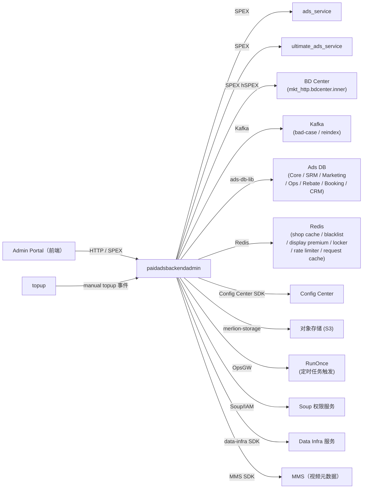

<!-- ads-workspace-gdoc-sync: gdoc_id=1RZxq62VUePgNSh5lszIVNQtncTkYcmDIOvUFXqYiTZg gdoc_url=https://docs.google.com/document/d/1RZxq62VUePgNSh5lszIVNQtncTkYcmDIOvUFXqYiTZg/edit -->

# paidadsbackendadmin

> Git 仓库：https://git.garena.com/shopee/deep/paidadsbackendadmin

## 目录 / Table of Contents

- [项目概述](#项目概述)
- [核心功能](#核心功能)
- [项目架构](#项目架构)
  - [上下游调用拓扑](#上下游调用拓扑)
- [目录结构](#目录结构)
- [HTTP、SPEX 与后台模块](#httpspex-与后台模块)
  - [入口总览](#入口总览)
  - [核心模块与-internal-目录映射](#核心模块与-internal-目录映射)
- [定时任务](#定时任务)
- [开发规范](#开发规范)
  - [代码风格](#代码风格)
  - [项目结构](#项目结构)
  - [命名规范](#命名规范)
  - [错误处理](#错误处理)
  - [单元测试](#单元测试)
  - [Code Review & Git Workflow](#code-review--git-workflow)
- [配置说明](#配置说明)
  - [配置文件](#配置文件)
  - [SPEX 与 spcli 配置](#spex-与-spcli-配置)
- [部署](#部署)
  - [生产构建](#生产构建)
  - [发布流程](#发布流程)
- [监控](#监控)
- [业务术语表](#业务术语表)
  - [核心指标](#核心指标)
  - [广告类型](#广告类型)
  - [位置入口](#位置入口)
  - [卖家与广告主](#卖家与广告主)
  - [竞价定价](#竞价定价)
  - [预测模型](#预测模型)
  - [系统特性与服务](#系统特性与服务)
  - [广告供给与展示](#广告供给与展示)
  - [管控与过滤](#管控与过滤)
  - [外部服务与系统](#外部服务与系统)
  - [技术术语](#技术术语)
- [参考资料](#参考资料)
- [常见问题](#常见问题)

---

## 项目概述

`paidadsbackendadmin` 是 Shopee Paid Ads 广告主平台的 **Backend Admin** 服务，SPEX 服务名为 `deep.paidads.backendadmin`（服务名常量：`backend_admin`）。

本服务为内部运营团队使用的 Admin Portal 提供后端支持，负责管理和配置全部广告类型：Product Ads（商品广告）、display_ads（展示广告）、Banner Ads（品牌横幅广告）、Search Brand Ads（搜索品牌广告）、brand_consideration_ads（品牌考虑广告）、Livestream Ads（直播广告）、Video Ads（视频广告）和 Shop Ads（店铺广告）。

服务并发暴露两个传输层：

- **SPEX**（Shopee 内部 RPC 框架）—— Admin Portal 通信及 MTS（多租户服务）异步操作的主要入口，protobuf 定义来自 `paidads_backend_admin.pb`。
- **HTTP (fasthttp)** —— 用于旧版 bad-case 管理、文件上传/下载（`/api/*`）、banner ads REST 接口（`/api/v1/*`）及健康检查（`/ping`、`/smoketest`、`/metrics`）。

Prometheus 指标命名空间为 `paidads`（常量 `ExporterNamespace`），指标名前缀为 `paidads_backend_admin_*`。

---

## 核心功能

- **广告概览与报表** —— 查询并导出 Product Ads、Shop Ads、Brand Ads、Livestream Ads、Video Ads 的概览和详细报表。
- **扣费流水查看器（deduction_log）** —— 按广告类型查询 `deduction_log` / `display_ads_translog` 记录，支持日期范围过滤。
- **余额日志查看器（balance_log）** —— 支持通过 `shop_id` 或 `user_id`（或两者同时，系统会交叉验证）查询店铺账户余额变化历史，按付费/免费 Credit 类型、有效类型（Universal、Product_RoiTwo、LiveStream、SearchBrand）及消耗类型（General、OneToOne）细化展示。
- **手动充值（manual_topup）** —— CRM 团队为广告主手动创建 Credit 充值；支持 CSV 批量上传、批量操作、异步状态轮询、单笔扣款/转账；新增 `shop_status` 过滤（时间范围上限 30 天）和 `transaction_group` 字段；支持 `SHOPEE_ADS_CREDIT` 与 `DISPLAY_ADS_CREDIT` 两种 Credit 类型，以及 Escrow 转账 Credit 和 ROIThree 白名单扩展信息。
- **display_ads 管理** —— 管理 display_ads 全生命周期：创建/编辑广告、审核创意、CPM 定价上传、账单导出；店铺白名单管理（`AddWhitelistShops`、`RemoveWhitelistShops`、`GetWhitelistShops`）；按日期范围封禁/解禁店铺（`BlockShop`、`UnBlockShop`、`GetBlockShopListByDate`），支持全局日期级别和店铺级别两种封禁粒度。
- **品牌广告管理** —— Banner Ads、Search Brand 套餐管理、brand_consideration_ads 创意 QC、库存编辑、deduction_log 查看。
- **白名单管理** —— 异步添加/移除/查询用户白名单，支持创建/配置白名单元数据（`SetWhitelistMeta`）；支持 ROIThree 和 Escrow 扩展信息字段；Escrow 扩展信息现新增 `optional_fee_rate_change_type` 枚举（`OVERWRITE` / `INCREMENT`）用于可选费率调整，以及 `is_override_gms` 和 `fixed_program_fee_rate` 字段。
- **Flag 管理** —— 读取和更新店铺或 Campaign 级别的功能 Flag（`flag_tab`）。
- **品牌关键词管理** —— 批量上传、删除品牌关键词，查看变更日志。
- **Bad-case 与黑名单工具** —— 搜索/更新/记录 bad-case 广告；通过 Kafka 触发重索引的广告黑名单管理。
- **广告重索引工具** —— 通过 Kafka 触发广告重索引并查看审计记录。
- **DB 查看器** —— 供运营调试用的原始数据库行查看工具。
- **定时任务触发** —— 通过 RunOnce 客户端触发并查询平台定时任务状态。支持返利专属任务类型（`REBATE_MANUAL_REVIEW_APPROVE_ALL`、`REBATE_ORDER`、`REBATE_MARK_DONE_OFFLINE`），需传入 `date` 参数并进行顺序校验。
- **账户设置** —— 批量账户设置任务，含审计日志与下载。
- **保留关键词白名单** —— 管理搜索品牌关键词保留白名单及审计日志。
- **对象存储** —— 通过 `merlion-storage` 上传/下载报表文件（S3 兼容）。

---

## 项目架构

`paidadsbackendadmin` 位于广告主平台的 **Core Ads Services** 层。由 `cmd/main.go → cmd/run.go` 启动，使用 Google Wire（`internal/backendadmin/setup/wire.go`）完成所有依赖注入（SPEX、DB、Redis、Kafka、Config Center 等），然后同时注册 SPEX processor 和 fasthttp server。

```
cmd/main.go
  └── cmd/run.go
        ├── DBLibManager          (ads-db-lib —— 读写 Ads Core DB / SRM DB 等；内嵌 IDMappingClient 用于分片键查询)
        ├── SpexInstance          (SPEX agent —— 注册 BackendAdminProcessor)
        ├── FastHTTP Server       (监听 :$BACKEND_ADMIN_HTTP_PORT)
        ├── ConfigCenterClient    (Config Center SDK —— 热加载 display_ads、currency 等)
        ├── KafkaWriter           (bad-case 事件)
        ├── KafkaIndexer          (广告重索引触发)
        ├── SpexClient            (出站调用 ads_service / ultimate_ads_service)
        ├── SoupClient            (权限校验，对接 Soup/IAM)
        ├── BDCenterManager       (BD Center —— mkt_http.bdcenter.inner via hSPEX)
        ├── ShopCache             (Redis —— 店铺名称缓存)
        ├── BlacklistCache        (Redis —— bad-case 黑名单)
        ├── RequestCache          (Redis —— 异步白名单请求状态)
        ├── DisplayPremiumCache   (Redis —— display_ads 溢价率缓存)
        ├── LockManager           (Redis 分布式锁)
        ├── RateLimiter           (Redis QPS 限流器)
        ├── UserShopCacheManager  (共享用户-店铺缓存，通过 ads-db-lib)
        ├── StorageManager        (S3 兼容 —— merlion-storage)
        ├── RunonceClient         (定时任务触发，通过 OpsGW)
        ├── TranslatorManager     (i18n 翻译)
        ├── DataInfraManager      (data-infra SDK)
        └── MMS SDK               (视频/直播视频元数据)
```

### 上下游调用拓扑



| 方向 | 服务 / 系统 | 协议 | 说明 |
|---|---|---|---|
| **上游** | Admin Portal（前端） | HTTP / SPEX | 主要客户端 —— 内部运营 Admin Portal |
| **上游** | topup | Kafka / 内部 | 手动充值事件 |
| **下游** | ads_service | SPEX | 核心广告数据查询（campaign、ads、keywords） |
| **下游** | ultimate_ads_service | SPEX | 品牌/展示/商品广告管理及高级查询 |
| **下游** | BD Center (mkt_http.bdcenter.inner) | hSPEX（HTTP over SPEX） | 内部 BD 运营操作 |
| **依赖** | Ads DB（ads-db-lib） | MySQL（GDBC/Hardy） | 所有广告数据 —— 7 个逻辑 DB（Core / SRM / Marketing / Ops / Rebate / Booking / CRM） |
| **依赖** | Redis | Redis | 店铺缓存、黑名单缓存、display_ads 溢价缓存、分布式锁、限流器、请求状态缓存 |
| **依赖** | Kafka | Kafka | Bad-case 事件发布 & 广告重索引触发 |
| **依赖** | Config Center | Config Center SDK | 热加载 display_ads / currency / adsdblib / db_viewer / ads_config / data_infra 配置 |
| **依赖** | 对象存储（S3） | merlion-storage | 报表文件上传/下载 |
| **依赖** | RunOnce（OpsGW） | HTTP | 触发并查询平台定时任务 |
| **依赖** | Soup / IAM | 内部 | 操作员权限列表 |
| **依赖** | Data Infra Service | data-infra SDK | 数据基础设施查询 |
| **依赖** | MMS SDK | 内部 SDK | 视频及直播视频元数据 |

---

## 目录结构

```
paidadsbackendadmin/
├── cmd/                        # 入口（main.go、run.go）
├── api/http/                   # fasthttp server：路由注册（handler.go）
├── config/                     # 配置结构体（BackendAdmin）及各环境 YAML 文件
│   └── files/                  # live.yml、staging.yml、uat.yml、test.yml、stable.yml
├── protobuf/go/                # 生成的 SPEX Protobuf Go 代码
│   └── paidads_backend_admin.pb/
├── internal/
│   ├── backendadmin/           # 所有业务逻辑（每个模块一个 Activity + Controller）
│   │   ├── setup/              # Wire DI：wire.go、wire_gen.go、helper.go、controller.go
│   │   ├── display_ads/        # display_ads 管理（含店铺白名单与按日期封禁/解禁）
│   │   ├── manual_topup/       # 手动充值、扣款、转账
│   │   ├── bannerads/          # Banner Ads / Search Brand
│   │   ├── brand_consideration_ads/ # brand_consideration_ads
│   │   ├── brand_keyword/      # 品牌关键词管理
│   │   ├── product_ads/        # Product Ads（GMS、诊断）
│   │   ├── overview_v2/        # 广告概览（Product / Shop）
│   │   ├── report_v2/          # 广告报表（Product / Shop）
│   │   ├── operation_log_v2/   # 操作审计日志
│   │   ├── deduction_log_v2/   # deduction_log 查看器
│   │   ├── livestream_ads/     # 直播广告管理
│   │   ├── video/              # 视频广告管理
│   │   ├── balance_log/        # 余额日志查看器（灵活 ID 输入，丰富 Credit 细分）
│   │   ├── badcase/            # Bad-case 搜索/更新 controller
│   │   ├── adsblacklist/       # 广告黑名单搜索/更新 controller
│   │   ├── whitelist/          # 用户白名单管理（支持 ROIThree、Escrow 扩展信息）
│   │   ├── flag/               # Flag（店铺/Campaign 功能开关）
│   │   ├── account_setting/    # 账户设置批量任务
│   │   ├── reserved_keyword/   # 保留关键词白名单
│   │   ├── reindex_tool/       # 广告重索引触发与审计
│   │   ├── db_viewer/          # 原始 DB 查看器
│   │   ├── cronjob/            # 定时任务触发与状态查询（含返利任务类型）
│   │   ├── admin_misc/         # Admin 杂项（Soup 权限列表）
│   │   ├── config/             # 内部 Config Manager（Config Center 绑定）
│   │   ├── config_center/      # Config Center 客户端封装
│   │   ├── kafka/              # Kafka Writer（bad-case、reindex）
│   │   ├── shop_cache/         # Redis 店铺名称缓存
│   │   ├── storage/            # 对象存储（merlion-storage）
│   │   ├── request_cache/      # Redis 异步请求状态缓存
│   │   ├── qps_rate_limiter/   # Redis QPS 限流器
│   │   ├── reportng_v2/        # Report-NG v2 Manager
│   │   └── live_testing_tool/  # 本地测试工具
│   ├── badcasetool/            # Bad-case 服务（搜索、黑名单、Kafka）
│   ├── bd_center/              # BD Center 客户端 Manager
│   ├── collections/            # 通用集合/切片工具
│   ├── constant/               # 共享常量与枚举
│   ├── data_infra/             # Data Infra SDK Manager
│   ├── db_manager/             # ads-db-lib 封装（DBLibManager + IDMappingClient）；shard_key.go：主键辅助函数，用于精准分片路由
│   ├── filterutil/             # 请求过滤工具
│   ├── headerutil/             # 请求头工具
│   ├── http/                   # HTTP 工具（managed/unmanaged handler 类型）
│   ├── locker/                 # Redis 分布式锁
│   ├── model/                  # 共享数据模型
│   ├── productutil/            # Product Ads 工具
│   ├── runonce_client/         # RunOnce（OpsGW）客户端（返利日期选项、Bot 邮箱常量）
│   ├── search/                 # 搜索/bad-case 搜索客户端
│   ├── soup_client/            # Soup IAM 客户端
│   ├── spex/                   # SPEX 拦截器及适配工具
│   ├── spexclient/             # SPEX 出站客户端（ads_service、ultimate_ads_service）
│   ├── translator/             # i18n 翻译 Manager
│   └── adsutil/                # 共享广告工具（审计、位置、格式化）
├── types/                      # 公共类型（ads、errors、report-NG）
├── utils/                      # 共享工具函数
├── tool/                       # 调试/一次性工具（get_ads、get_auto_topup_data）
├── docs/                       # 内部文档
├── deploy/                     # 部署 JSON 与 Mesos 脚本
├── Makefile                    # 构建、测试、lint、proto 生成目标
├── go.mod / go.sum             # Go 模块依赖（Go 1.21）
├── hspex-workspace.yml         # hSPEX 依赖配置（bdcenter.inner）
└── .spkit.yml                  # spkit 工具版本（spkit v0.10.11、golangci-lint v1.59.1、spcli v1.3.21、wire v0.5.0）
```

---

## HTTP、SPEX 与后台模块

### 入口总览

服务通过两个并行栈注册 handler：

| 传输层 | 路由 / 入口 | Handler 类型 |
|---|---|---|
| **SPEX** | `paidadsbackendadminpb.NewBackendAdminProcessor(controller)` | 生成的 protobuf SPEX processor |
| **SPEX（非托管）** | `controller.RegisterUnmanagedProcessor()` | 旧版 bad-case / 黑名单命令（`CmdBadCaseSearch`、`CmdBadCaseUpdate`、`CmdAdBlacklistSearch` 等） |
| **HTTP** | `api/http/handler.go` → `fasthttp.Server` | `fasthttp.RequestHandler` |

HTTP 路由分组：

| 路由前缀 | 模块 | 协议 |
|---|---|---|
| `/ping`、`/smoketest`、`/metrics` | 健康检查 / Prometheus | HTTP |
| `/api/search`、`/api/update/*` | Bad-case 与黑名单 | HTTP managed（JSON） |
| `/api/display_ads/upload_creative_image` | display_ads | HTTP unmanaged |
| `/api/v1/create_banner_ads` … `update_campaign_status` | Banner Ads | HTTP unmanaged（Protobuf-JSON） |
| `/api/v2/top_up/*` | 手动充值异步文件 | HTTP MTS |

Admin Portal 的其余操作均走 SPEX。

### 核心模块与 internal 目录映射

`internal/backendadmin/` 下每个模块的模式：一个或多个 `Activity` 结构体封装业务逻辑，由 Google Wire 注入。`setup/controller.go` 中的 `Controller` 将每个 SPEX handler 委托给对应的 Activity。

| 模块目录 | SPEX 方法示例 | 主要依赖 |
|---|---|---|
| `display_ads` | `GetDisplayAdsList`、`GetDisplayAdsListByDate`、`CreateDisplayAds`、`ApproveCreative`、`GetInventoryInfo`、`UploadCpmPricing`、`GetCpmPricingList`、`GetBillings`、`ExportReadyForInvoiceBillings`、`GetReadyForInvoiceBillingCount`、`UpdatePayment`、`GetDisplayAdsCompanyProfiles`、`GetDisplayAdsConfig`、`GetAdminToggles`、`GetDisplayAdsPremiumRate`、`SetDisplayAdsPremiumRate`、`GetDisplayAdsPremiumRateAudits`、`DisplayAdsBalanceLogOverview`、`DisplayAdsBalanceLogShopDetail`、`GetDisplayAdsListAudienceGroup`、`GetUploadCpmReminder`、`BlockShop`、`UnBlockShop`、`GetBlockShopListByDate`、`AddWhitelistShops`、`RemoveWhitelistShops`、`GetWhitelistShops`、`GetAffectAdsListByUnWhitelist` | DBLibManager、SpexClient、BDCenterManager、Config Center（display_ads / currency）、DisplayPremiumCache、TranslatorManager |
| `manual_topup` | `SetManualTopup`、`GetManualTopupSummary`、`BatchUpdateManualTopup`、`AsyncBatchSetManualTopup`、`SetManualDeduct`、`AsyncBatchSetManualDeduct`、`AsyncBatchSetManualTransfer`、`GetCreditSummary`、`GetAdsCreditSubtype`、`SetAdsCreditSubtype`、`GetManualTopupConfig` | DBLibManager、SpexClient、StorageManager、Config Center（ads_config） |
| `bannerads` | `CreateBannerAds`、`UpdateBannerAds`、`ListBannerAdsCampaigns`、`BrandAdsListCreatives`、`BrandAdsReporting`、`BrandAdsGetFeConfigs`、`BrandAdsGetDetail`、`BrandAdsUpdateCreativeStatus`、`BrandAdsGetCreativeDetail`、`ListSearchBrandPackage`、`BatchUploadSearchBrandPackage`、`RemoveBrandPackagePeriod`、`ListSearchBrandPackageChangelog` | SpexClient、DBLibManager、TranslatorManager、UserShopCacheManager、ReportNGv2Manager、DataInfraManager |
| `brand_consideration_ads` | `BrandConsiderationAdsCreativeDetail`、`BrandConsiderationListInventory`、`BrandConsiderationBatchEditInventory`、`BrandConsiderationAdsCreativeQc`、`BrandConsiderationAdsDeductionLog`、`BrandConsiderationAdsReport`、`BrandConsiderationGetConfig`、`BrandConsiderationListInventoryChangeLog`、`BrandConsiderationAdsGetDetail`、`BrandConsiderationAdsListCreatives`、`BrandConsiderationAdsUpdateStatus`、`BrandConsiderationAdsOverview` | SpexClient |
| `brand_keyword` | `ListGroupedKeyword`、`BatchUploadBrandKeyword`、`RemoveBrandKeyword`、`ListBrandKeywordChangeLog` | DBLibManager |
| `overview_v2` | `ProductAdsOverview`、`ShopAdsOverview` | SpexClient |
| `report_v2` | `ProductAdsReporting`、`ProductAdsReportingDetail`、`ShopAdsReporting`、`ShopAdsReportingDetail` | SpexClient |
| `operation_log_v2` | `ProductAdsOperationLog`、`ShopAdsOperationLog`、`BrandAdsOperationLog`、`BrandConsiderationAdsOperationLog`、`ListVideoOperationLog`、`AccountSettingOperationLog` | DBLibManager |
| `deduction_log_v2` | `ProductAdsDeductionLog`、`ShopAdsDeductionLog`、`ListVideoDeductionLog`、`BrandConsiderationAdsDeductionLog` | DBLibManager |
| `livestream_ads` | `ListLsOverview`、`GetLsOverview`、`ListLsDeductionLog`、`ListLsReport`、`ListLsOperationLog`、`GetLsReportDetail` | SpexClient、DBLibManager |
| `video` | `ListVideoOverview`、`ListVideoReport` | SpexClient、MMS SDK |
| `balance_log` | `GetBalanceLog` | DBLibManager、UserShopCacheManager、ConfigManager |
| `badcase` | `Search`、`Update`（HTTP + 非托管 SPEX） | SearchClient、BadCaseService、SpexClient |
| `adsblacklist` | `Search`、`SearchLog`、`Update`（HTTP + 非托管 SPEX） | BadCaseService |
| `whitelist` | `AddWhitelistUsers`、`PollAddWhitelistUsers`、`GetWhitelistUsers`、`SetWhitelistMeta` | SpexClient、RequestCache、ConfigManager |
| `flag` | `ListFlagAllowed`、`ListFlagOverview`、`UpdateFlag` | DBLibManager |
| `account_setting` | `AccountSettingTaskCreate`、`AccountSettingTaskList`、`AccountSettingTaskDownload`、`AccountSettingOverview` | DBLibManager、SpexClient |
| `reserved_keyword` | `GetReservedKeywordWhitelist`、`SetReservedKeywordWhitelist`、`GetReservedKeywordWhitelistAudit` | DBLibManager |
| `reindex_tool` | `ReindexAds`、`ReindexAdsMts`、`GetReindexAdsAudit` | DBLibManager、KafkaIndexer、RateLimiter |
| `db_viewer` | `DatabaseViewer`、`GetDatabaseViewerMetadata` | DBLibManager、Config Center（db_viewer） |
| `cronjob` | `TriggerCronjob`、`GetCronjob` | RunonceClient、ConfigManager |
| `admin_misc` | `GetSoupPermissionList` | SoupClient |
| `product_ads` | `ProductAdsDiagnosisList`、`ProductAdsListSystemGmsShop`、`ProductAdsAddSystemGmsShop`、`ProductAdsBatchPauseSystemGms`、`ProductAdsResumeSystemGms`、`ProductAdsPauseSystemGms` | SpexClient、DBLibManager |

---

## 定时任务

`paidadsbackendadmin` 本身**不拥有**任何定时任务。它提供 `TriggerCronjob` / `GetCronjob` SPEX 接口，允许 Admin Portal 通过 RunOnce 系统手动触发和查询其他服务管理的平台级定时任务。

支持的任务类型包含返利专属任务（`REBATE_MANUAL_REVIEW_APPROVE_ALL`、`REBATE_ORDER`、`REBATE_MARK_DONE_OFFLINE`），这三类任务需传入 `date` 参数（格式：`YYYY-MM-DD`）。其中 `REBATE_ORDER` 还会校验同日期是否存在成功的 `REBATE_MANUAL_REVIEW_APPROVE_ALL` 执行记录，校验通过后才允许触发。

以下为广告主平台各服务的全平台定时任务清单（来源：KB `04-operations/cronjobs`）。CMDB 任务列表：https://space.shopee.io/console/cmdb/cronjobs/tree/shopee.mp_search_recommendation_ads.paidads.advertiser_platform.platform

| 重要程度 | 任务名称 | 主要用途 | 所属服务 |
|---|---|---|---|
| 🔴 关键 | `ads_status_sync_job_live_all` | 根据商品状态（删除、下架、成人内容、黑名单）更新 Campaign 状态 | ads-status-syncer |
| 🔴 关键 | `roi_two_ads_sync_job_live` | 同步 ROI2 投放状态和配置，处理 overlap | ads-status-syncer |
| 🔴 关键 | `display_ads_billing_generator` | 生成 display_ads 账单 | ads_service |
| 🔴 关键 | `account_balance_sync_job_live` | 修复账户余额与 Campaign 预算不一致 | ads-account-balance |
| 🔴 关键 | `create_rebate_order_v2` | 从 Hive 读取返利数据并创建返利订单 | auto-rebate |
| 🔴 关键 | `ROI3_sync_job` | 建券并控制 ROI3 生命周期 | ultimate_ads_service |
| 🟠 高 | `display_ads_status_updater` | display_ads 状态机（计划下线） | ads_service |
| 🟠 高 | `search_brand_ads_sync_job_live` | Search Brand Ads 状态机 | ads-status-syncer |
| 🟠 高 | `NPA Phase Transition Job` | 处理新产品广告阶段转换（学习期 → 正式投放） | ultimate_ads_service |
| 🟠 高 | `auto_topup_scanner_live` | 自动充值冷路：扫描并执行自动充值 | auto-topup |
| 🟠 高 | `campaign_rebate_status_v2` | 更新返利 Campaign 状态 | auto-rebate |
| 🟠 高 | `brand_consideration_ads` | 处理 brand_consideration_ads 状态变更和解冻 | ultimate_ads_service |
| 🟠 高 | `system_gms_live` | 配置和创建 GMS（货款）Campaign 活动 | ads-status-syncer |
| 🟠 高 | `gms_sync_job_live` | 刷新 GMS 数据（item 数量） | ads-status-syncer |
| 🟡 中 | `mcn_sync_job_live` | 同步 MCN 机构状态和达人合作关系 | ads-status-syncer |
| 🟡 中 | `diagnosis_daily_checker_live` | 诊断数据每日更新 | ads-marketing |
| 🟢 低 | `notify_ads_credit_expiry` | 通知卖家广告积分即将过期 | ads_service |
| 🟢 低 | `delete_hide_cron_live` | 清理已删除或隐藏的广告数据 | ads-status-syncer |

---

## 开发规范

### 代码风格

- Go 1.21（`go.mod` 中声明 `go 1.21`）。
- 代码检查：`golangci-lint v1.59.1`，配置文件 `.golangci.yml`。运行顺序：`make gci`（修复 import 顺序）→ `make fmt` → `make vet`。
- import 分组（由 `gci` 强制）：标准库 → 第三方 → `git.garena.com` → `git.garena.com/shopee/deep/paidadsbackendadmin`。
- 生成文件（`.pb.go`、`.gen.go`、`*_test.go`）不参与 lint。
- 主要启用的 linter：`errcheck`、`govet`、`staticcheck`、`gosec`、`gocyclo`（最大复杂度 20）、`funlen`、`dupl`、`misspell`、`prealloc`。

### 项目结构

遵循标准 Go 项目布局。所有业务逻辑位于 `internal/`，入口在 `cmd/`，公共类型在 `types/` 和 `utils/`。

`internal/backendadmin/` 下每个功能域自包含：定义各自的 `Activity` 结构体、构造函数（`NewActivity`）和方法。`setup/controller.go` 中的 `Controller` 将 SPEX 方法调用委托给对应的 Activity。

依赖注入由 Google Wire（`wire v0.5.0`）完成。修改 wire provider 后运行 `make wire`。

### 命名规范

- 提交信息：`(Feat|Fix|Docs|Style|Refactor|Test|Chore): [JIRA-ID] description`
- 分支命名：`dev/$username` 或 `feature/$feature_name`
- SPEX 方法名为 PascalCase，与 protobuf 定义一致。
- 每个 SPEX 方法都有对应的 `*Mts` 变体，用于多租户异步操作。
- 枚举文件命名为 `*_enum.go`，通过 `make enum` 生成。

### 错误处理

- 所有错误必须检查（由 `errcheck` 强制）。
- 以 `uint32` 形式返回 SPEX 错误码，常量定义于 `pb.Constant_*`（如 `pb.Constant_ERROR_INVALID_REQUEST`、`pb.Constant_ERROR_EXTERNAL_SERVICE`）。
- 错误包装使用 `fmt.Errorf("context: %w", err)`。
- 类型断言必须检查 `ok` 标志（由 `errcheck.check-type-assertions` 强制）。

### 单元测试

运行测试：`make test`（详细输出）或 `make test-nv`（仅覆盖率）。

CI 流水线运行 `make ci`，依次执行 `ci-vet`（vet + diff 检查）、`fmt`、`test-nv`。

关键接口均有 mock 实现：`SpexClient`（`internal/spexclient/client_mock.go`）、`DBLibManager`（`internal/db_manager/mocked_lib_manager.go`）、`BDCenterManager`（`internal/bd_center/mocked_manager.go`）。重新生成 mock：`make mock`（执行 `spkit run mockery --config .mockery.yaml`）。

### Code Review & Git Workflow

- 所有变更通过 Merge Request（squash commit，合并后删除源分支）。
- MR 必须通过 GitLab CI 流水线（`make ci`）。
- Proto 变更：运行 `make proto-compile-dep-only`（使用 `spcli v1.3.21`），再运行 `make update-proto` 重新生成并 vendor。
- 合并前须完成全量 review；影响算法的变更需获得负责人 sign-off。

---

## 配置说明

### 配置文件

配置从 `config/files/<env>.yml`（env：`live`、`staging`、`uat`、`test`、`stable`）加载，并在运行时与 Config Center 的值合并。

顶层配置 key：`backend-admin`，解析为 `config.BackendAdmin`。

主要配置节：

| 配置节 | 说明 |
|---|---|
| `spex` | SPEX 服务标识（`deep.paidads.backendadmin`）、env、tag、deployment、config-key、serve-timeout |
| `fasthttp` | fasthttp server 选项（并发数、读写超时、压缩） |
| `httpport` | HTTP 服务端口（live 环境通过 `BACKEND_ADMIN_HTTP_PORT` 环境变量设置） |
| `db_config` | ads-db-lib DB 连接配置 |
| `config-center.*` | display_ads / currency / adsdblib / backend-admin / db_viewer / ads_config / data_infra 各 Config Center key 和 namespace |
| `locker` | Redis 分布式锁配置 |
| `rate-limiter` | Redis QPS 限流器配置 |
| `shop-cache` | Redis 店铺名称缓存配置 |
| `blacklist-cache` | Redis bad-case 黑名单缓存配置 |
| `request-cache` | Redis 异步请求状态缓存配置 |
| `display-premium-cache` | Redis display_ads 溢价率缓存配置 |
| `reindex-kafka` | Kafka 配置（广告重索引触发） |
| `kafka` | Kafka 配置（bad-case 事件发布） |
| `storage` | 对象存储（S3）配置（merlion-storage） |
| `user-shop-cache` | User-shop 缓存 Manager 配置 |
| `bd-center` | BD Center 客户端配置 |
| `translator` | i18n 翻译器配置 |

**Config Center namespace（live 环境）**：

| Namespace | Key | 内容 |
|---|---|---|
| `display_ads_live_default` | `bde270fc...` | display_ads 配置（定价、活动） |
| `currency_live_default` | `8435cb08...` | 货币配置 |
| `adsdblib_live_default` | `43cdea66...` | ads-db-lib DB 路由配置 |
| `backendadmin_live_default` | `ddfc8eba...` | Backend Admin 运行时配置（白名单子类型、定时任务配置等） |
| `db_viewer_live_default` | `a822217b...` | DB 查看器允许访问的表配置 |
| `ads_config_live_default` | `afa377d0...` | 广告配置（手动充值子类型） |
| `data_infra_live_default` | `b28eef75...` | Data Infra 端点配置 |

### SPEX 与 spcli 配置

SPEX 服务名：`deep.paidads.backendadmin`

通过 spkit 安装工具链（版本定义于 `.spkit.yml`）：

```bash
# 安装 spkit
curl -fsSL https://spkit.shopee.io/install | bash

# 安装项目工具（golangci-lint、spcli、wire、go-enum、spex-generator）
spkit install

# 重新生成 proto（proto 变更后）
make proto-compile-dep-only

# 重新生成 SPEX stub 并 vendor
make update-proto

# 重新生成 Wire DI 代码（修改 wire provider 后）
make wire

# 重新生成枚举文件（修改 *_enum 源文件后）
make enum
```

---

## 部署

### 生产构建

服务部署在 Shopee Mesos 上，构建配置：`deploy/backendadmin.json`。

```bash
# 本地构建（原生）
make backendadmin
# 输出：bin/paidads_backendadmin_server

# Linux 交叉编译
# CI 中通过 deploy/mesos.sh 自动完成
bash ./scripts/gen-dep-proto.sh && make dep-vo && bash ./deploy/mesos.sh build backendadmin backendadmin config/files
```

Docker 基础镜像：`harbor.shopeemobile.com/paidads/base/platform:1.21`

二进制文件名：`paidads_backendadmin_server`，Mesos 运行命令：`./mesos.sh run backendadmin`。

Smoke 测试：`GET /smoketest`（HTTP，超时 1000 ms，重试 10 次）。
Health check：`GET /ping`（HTTP，超时 1000 ms，重试 3 次）。

域名：
- `paidads-backendadmin.${ENV}shopee.io`
- `admin.ads.${ENV}shopee.io`

### 发布流程

发布通过 Shopee SPEX 部署系统管理。

1. 确保本地 `make ci` 通过。
2. 提交 Merge Request 并获得审批。
3. 合并到 `master`（squash commit）。
4. CI 流水线构建 Docker 镜像并推送到镜像仓库。
5. 通过 SPEX/Space 发布系统依次发布到目标环境（staging → stable → live）。
6. 每个阶段发布后监控 `/smoketest` 和 Grafana 大盘。

---

## 监控

Grafana 监控大盘（advertiser-platform 文件夹）：

- [advertiser-platform Grafana 文件夹](https://monitoring.infra.sz.shopee.io/grafana/dashboards/f/advertiser-platform/advertiser-platform)
- [paidads 核心监控](https://monitoring.infra.sz.shopee.io/grafana/d/pXH7nP_7z/paidadshe-xin-jian-kong)
- [paidads 核心监控大盘](https://monitoring.infra.sz.shopee.io/grafana/d/IWNBCgyVz/paidadshe-xin-jian-kong-da-ban)
- [paidads biz critical](https://monitoring.infra.sz.shopee.io/grafana/d/rdmST4f4z/paidads-biz-critical)
- [Ads Report-NG（Live 环境）](https://monitoring.infra.sz.shopee.io/grafana/d/Upizly3Wk/ads-report-ng-live-env)

关键 Prometheus 指标（命名空间 `paidads`，前缀 `paidads_backend_admin_*`）：

| 指标 | 说明 |
|---|---|
| `paidads_backend_admin_*` | 所有 SPEX handler 延迟、错误率、QPS 指标，由 paidads-platform-lib 自动埋点 |

---

## 业务术语表

### 核心指标

| 术语 | 全称 | 定义 |
|---|---|---|
| CTR | Click-Through Rate | 总点击数 / 总曝光数 |
| CR / CVR | Conversion Rate | 广告订单数 / 总点击数 |
| CPC | Cost Per Click | 每次点击花费金额 |
| CPM | Cost Per Mille | 每 1,000 次曝光的广告费用 |
| eCPM | Effective Cost Per Mille | 总广告消耗 / 总曝光数 |
| ROI / ROAS | Return on Investment / Return on Ad Spend | 广告 GMV / 广告消耗（CIR 的倒数） |
| CIR | Cost-Income Ratio | 广告消耗 / 广告 GMV |
| GMV | Gross Merchandise Value | 总交易额 |
| Take-Rate | — | 广告收入 / 平台 GMV |
| Rank Score | — | eCPM + 质量因子 |

### 广告类型

| 术语 | 说明 |
|---|---|
| Product Ads | 商品级搜索/推荐广告（关键词 CPC） |
| Shop Ads | 店铺级广告 |
| display_ads | 展示广告（CPM 计费，按账单结算） |
| brand_consideration_ads | 品牌考虑广告（中漏斗品牌认知） |
| Search Brand Ads | 带保留位和套餐的搜索品牌关键词广告 |
| Banner Ads | Admin Portal 管理的视觉横幅广告 |
| Livestream Ads | 出现在直播中或直播周边的广告 |
| Video Ads | 与 Shopee 视频内容关联的广告（MMS） |
| TADS / DADS | Targeting/Discovery Ads —— 定向推荐广告 |
| NPB / NPA | New Product Boost / New Product Ads —— 新品推广广告 |

### 位置入口

| 术语 | 说明 |
|---|---|
| placement | 广告位置整数码（4=搜索、3=店铺、40=推荐等） |
| PDP | Product Detail Page（商品详情页） |
| DD | Daily Discovery（每日发现） |
| YMAL | You May Also Like（猜你喜欢） |
| SVS PDP | Seller Value Service Product Detail Page（CB 卖家充值页面） |

### 卖家与广告主

| 术语 | 说明 |
|---|---|
| PS | Preferred Sellers（优选卖家） |
| OS | Official Shops（官方旗舰店） |
| CB Sellers | 跨境卖家，充值需通过 SVS 手动操作 |
| MCN | Multi-Channel Network —— 管理多个创作者店铺的机构 |
| SRM | Seller Relationship Management —— 计划/分群/激励管理 |

### 竞价定价

| 术语 | 说明 |
|---|---|
| uGSP | Uniform Generalized Second-Price —— Shopee 广告竞价机制 |
| oCPC | Optimized CPC —— 自动出价简单模式，系统自动选词 |
| PID | Proportional-Integral-Derivative —— 自动出价价格动态调整控制机制 |
| Manual Mode | 广告主手动设置关键词出价 |
| Simple Mode | oCPC —— 系统自动优化出价 |

### 预测模型

| 术语 | 说明 |
|---|---|
| pCTR | Predicted Click-Through Rate（预测点击率） |
| pCR | Predicted Conversion Rate（预测转化率） |
| rcgbdt | RC Gradient Boost Decision Trees —— pCTR 预测 ML 模型 |
| Cold Start | 数据不足以进行准确预测的广告（冷启动） |

### 系统特性与服务

| 术语 | 说明 |
|---|---|
| Backend Admin | 本服务（`paidadsbackendadmin`）—— 运营团队内部 Admin 后端 |
| deduction_log | 记录每次 CPC/CPA 扣费事件的交易流水 |
| QSS | QuickStart Service —— 帮助新广告主快速上手 |
| VGS | Values Grid Search —— 自动调整算法参数 |
| RunOnce | 通过 OpsGW 触发一次性或定时任务的系统 |
| Soup / IAM | 内部身份/权限服务 |

### 广告供给与展示

| 术语 | 说明 |
|---|---|
| Display Rate | 有曝光的广告数 / 活跃广告数 |
| Fill-up Rate | 实际曝光数 / 广告位预期曝光数 |
| Broad Match | 搜索词包含关键词时触发的广告匹配 |
| Exact Match | 搜索词与关键词完全相同时触发 |
| Brand Max | 高端 display_ads 库存预约（Booking 系统） |
| Inventory | display_ads / Brand Ads 的预测展示量库存 |

### 管控与过滤

| 术语 | 说明 |
|---|---|
| Whitelist | 为店铺或用户开放特定功能（目标 ROI、店铺广告定制等） |
| Blacklist | 屏蔽特定关键词或商品 ID 不参与广告投放 |
| Bad-case | 运营团队标记的质量/合规问题广告 |
| OCPC CIR | OCPC 自动出价的 Cost-Income Ratio 配置（按类目/商品/店铺/广告维度） |
| Flag | 存储在 `flag_tab` 中的功能开关（店铺或 Campaign 级别） |

### 外部服务与系统

| 术语 | 说明 |
|---|---|
| SPEX | Shopee 内部高性能 RPC 框架 |
| spcli | Shopee CLI，用于 proto 生成和依赖管理 |
| GAS | Go Application Server —— Shopee MTS 框架 |
| GDBC / Hardy / SDDL | Shopee 内部 DB 访问与分片库 |
| Config Center | Shopee 集中式配置热加载服务 |
| MMS | Media Management Service —— 视频/直播视频元数据 |
| BD Center | Business Development Center（`mkt_http.bdcenter.inner`） |

### 技术术语

| 术语 | 说明 |
|---|---|
| DAG | Directed Acyclic Graph（有向无环图，特征 pipeline 上下文） |
| MTS | Multi-Tenant Service —— SPEX 中的异步操作模式 |
| Wire | Google Wire —— 编译时依赖注入 |
| hSPEX | HTTP over SPEX —— 通过 SPEX 服务网格隧道化 HTTP 客户端 |

---

## 参考资料

- [广告主平台架构总览（Confluence）](https://confluence.shopee.io/display/SPAD/Advertiser+Platform)
- [Paid Ads 业务术语表（Confluence）](https://confluence.shopee.io/pages/viewpage.action?spaceKey=SPAD&title=Paid+Ads+Glossary)
- [监控与 Grafana 面板汇总（Google Docs）](https://docs.google.com/document/d/1xbEldfLSGJ5KsFjKk2IjZQfoI0XfQ8Ffwja0UKVHjNw/)
- [Platform BE Cronjob 梳理（Google Docs）](https://docs.google.com/document/d/1Z6VYs8vyJ-D914cU8wDBltrE6ItZ2TrhoZiXOSPkXmM/)
- [ads-db-lib（GitLab）](https://git.garena.com/shopee/deep/ads-db-lib)
- [SPEX Go SDK 快速上手](https://spex.shopee.io/overview/quick-start/languages/go/index.html)
- [spcli 安装与 Git 配置](https://spex.shopee.io/user-guide/SDK/Java/local.html)
- [CMDB 定时任务列表](https://space.shopee.io/console/cmdb/cronjobs/tree/shopee.mp_search_recommendation_ads.paidads.advertiser_platform.platform)
- [advertiser-platform Grafana 文件夹](https://monitoring.infra.sz.shopee.io/grafana/dashboards/f/advertiser-platform/advertiser-platform)

---

## 常见问题

**Q1：本服务的 SPEX 服务名是什么？**
`deep.paidads.backendadmin`。内部服务名常量为 `backend_admin`（定义于 `internal/backendadmin/consts.go`），Prometheus 指标命名空间为 `paidads`。

**Q2：如何在本地构建和运行服务？**
```bash
make dep-vo          # 下载 vendor 依赖
make backendadmin    # 构建二进制到 bin/paidads_backendadmin_server
```
将 `BACKEND_ADMIN_HTTP_PORT` 设置为一个空闲端口，并使用 `config/files/test.yml` 作为配置文件。

**Q3：如何新增一个 SPEX 方法？**
1. 在 proto 仓库的 protobuf 定义中添加方法。
2. 运行 `make update-proto` 重新生成并 vendor。
3. 在 `internal/backendadmin/<module>/` 下的对应 `Activity` 结构体中实现业务逻辑。
4. 在 `internal/backendadmin/setup/controller.go` 中添加委托方法。
5. 如果为 Activity 构造函数新增了依赖，运行 `make wire`。

**Q4：服务访问哪些数据库，通过什么库访问？**
通过 `ads-db-lib`（封装在 `internal/db_manager/DBLibManager` 中）访问 7 个逻辑数据库（Ads Core / SRM / Marketing / Ops / Rebate / Booking / CRM）。DB 路由通过 `RegionAdsDSN`、`RegionSRMDSN` 等配置。`DBLibManager` 现在同时内嵌 `adsdblib.IDMappingClient`（来自 `ads-db-lib v0.128.0`）；`internal/db_manager/shard_key.go` 中的辅助函数利用它在 DB 查询前解析主键（user_id + campaign_id + ads_id），实现精准分片路由而非全分片扫描。所有 DB 连接在 `cmd/run.go` 中初始化。

**Q5：手动充值（manual_topup）流程是怎样的？**
运营人员通过 `POST /api/v2/top_up/upload_file` 上传 CSV 文件 → `manual_topup.UploadFile` 将文件存储到 S3。运营人员再调用 `AsyncBatchSetManualTopup`（SPEX）处理批次。通过 `GetManualTopupBatchUploadLog` 轮询状态。单笔充值通过 `SetManualTopup` 处理。`GetManualTopupSummary` 接口支持 `shop_status` 过滤（时间范围上限 30 天）和 `transaction_group` 字段。

**Q6：广告重索引是如何工作的？**
`reindex_tool` 模块暴露 `ReindexAds` / `ReindexAdsMts` SPEX 方法。调用时，服务将广告 ID 写入重索引 Kafka topic（配置为 `reindex-kafka`）。Kafka 消费者（广告 indexer 服务）消费事件并重新索引广告。审计记录写入 `reindex_ads_audit_tab`。

**Q7：定时任务触发是如何工作的？**
`cronjob` 模块的 `TriggerCronjob` 方法调用 `RunonceClient`，后者通过 OpsGW API 触发目标任务。`GetCronjob` 查询正在执行、最近成功及最新执行记录的状态。对于返利任务类型（`REBATE_ORDER`、`REBATE_MANUAL_REVIEW_APPROVE_ALL`、`REBATE_MARK_DONE_OFFLINE`），须传入 `date` 参数（格式：`YYYY-MM-DD`）；其中 `REBATE_ORDER` 还会校验同日期是否存在成功的 `REBATE_MANUAL_REVIEW_APPROVE_ALL` 执行记录。

**Q8：配置热加载是如何管理的？**
Config Center SDK 在启动时初始化，订阅 7 个 Config Center namespace（display_ads / currency / adsdblib / backend-admin / db_viewer / ads_config / data_infra）。每个 namespace 对应一个 `ConfigManager`，监听变更并刷新内存中的配置。配置变更无需重启服务。`backendadmin_live_default` namespace 包含白名单子类型和定时任务配置，运行时动态读取。

**Q9：服务的权限/认证模型是如何实现的？**
Admin Portal 通过 Soup/IAM 对用户进行认证。服务通过 `admin_misc` 暴露 `GetSoupPermissionList` 接口查询允许的权限列表。SPEX 拦截器（注册于 `internal/spex/interceptor.go`）对每个请求进行认证校验。

**Q10：如何查询店铺余额日志？**
调用 `GetBalanceLog`，传入 `shop_id` 或 `user_id`（或两者同时传入，系统会通过 `userShopCache` 交叉验证）。响应包含账户当前余额（按付费/免费 Credit 类型及有效类型 Universal、Product_RoiTwo、LiveStream、SearchBrand 细分），以及指定天数（1–180 天）的完整余额变化历史。

<!-- Generated by ads-workspace/skills/ads-readme-generate | checked: dd220222f5fd21f16e6602ffb6a94919e2a2149a | spec: 76fce5f679f9550b -->
