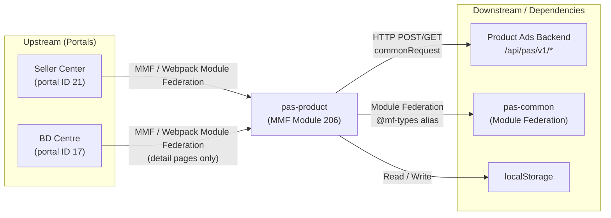

<!-- ads-workspace-gdoc-sync: gdoc_id=1-9z-xpli7anIHiUi5gpSvlIDUUqb6d88wOHYWRQXrBw gdoc_url=https://docs.google.com/document/d/1-9z-xpli7anIHiUi5gpSvlIDUUqb6d88wOHYWRQXrBw/edit -->

# pas-product — Product Ads Module

## Table of Contents

- [Project Overview](#project-overview)
- [Key Features](#key-features)
- [Project Architecture](#project-architecture)
  - [Service Topology](#service-topology)
- [Directory Structure](#directory-structure)
- [Quick Start](#quick-start)
  - [Prerequisites](#prerequisites)
  - [Configuration](#configuration)
  - [Installation](#installation)
  - [Build](#build)
  - [Local Development](#local-development)
  - [Development](#development)
  - [Deployment](#deployment)
- [API Documentation](#api-documentation)
- [Local Storage](#local-storage)
- [TMS Tracking](#tms-tracking)
- [Performance Monitoring](#performance-monitoring)
- [Business Terminology Glossary](#business-terminology-glossary)
- [References](#references)
- [Frequently Asked Questions](#frequently-asked-questions)

---

## Project Overview

`pas-product` is a Vue 3 + TypeScript micro-frontend module (MMF module ID: 206) for managing Product Ads campaigns on the Shopee Ads platform. It handles the full lifecycle of product advertising—creation, detail viewing, and restarting—across both Seller Center (SC) and BD Centre (BDC). The module is consumed by SC for all pages (creation and detail) and by BDC exclusively for the detail page.

---

## Key Features

- **Ad Creation Flow**: Multi-step form covering product selection (auto / manual), bidding strategy (auto / manual / ROI2 / GMS), basic settings (name, placement, budget, duration), and creative settings.
- **Ad Detail Pages**: Four distinct detail pages per ad type—Auto (`auto-detail`), Auto GMS (`auto-gms-detail`), Manual (`manual-detail`), and Manual MPD (`manual-mpd-detail`)—each with performance metrics tables and charts.
- **Bidding Strategies**:
  - Auto bidding (standard auto and GMS/GMV-Max)
  - Manual bidding (keyword + display-location bid prices)
  - ROI2 / Target ROAS bidding
  - Batch ROI bidding for multiple products
- **Product Selection Modes**: Auto-select best products or manual product selection (single / batch).
- **New Product Ads (NPA)**: Separate creation and restart routes (`create-npa`, `restart-npa`) with NPA-specific bidding UI.
- **Performance Reporting**: Date-range selectable metrics chart (`MetricChart`) and ads performance table with export capability.
- **Ads Diagnosis**: Integrated `AdsDiagnosis` component surfaced in the detail header.
- **ROAS Protection**: Cold-start / rebate tracking displayed in the manual detail page.
- **Expandable Metrics Panel**: Detail pages show a "More Metrics" toggle when more than 10 metric tiles are available; expand/collapse preference is persisted to `localStorage`.
- **Positive Boosting Banner**: Manual ads detail page surfaces a notification banner after a positive operation boost completes, displaying the GMV uplift percentage.
- **GMS Retention Modal**: When pausing or stopping a GMS campaign, a retention popup checks the `gms_retention` banner and offers to optimize budget, adjust ROAS, manage product list, or keep the ad running before proceeding.
- **ROI3 Benefit Estimation**: On the creation page, controlled by `szRoi3BenefitsPositiveAction` feature toggle, the `useRoi3Benefit` composable uses `useVoucherEstimation` from `pas-common` to display projected Smart Voucher benefit for ROI2/Target ROAS bidding during creation.
- **Rapid Boost Effect Visualization**: The Rapid Boost toggle in detail headers fetches cumulative GMV uplift data (boosted vs. non-boosted GMV) via `/report/get_rapid_boost_effect/` and displays a comparison chart inline.
- **To-Do List**: Per-campaign to-do items fetched and managed from the detail store.
- **CPS (Cost Per Sale)**: Auto top-up integration and activation flow for CPS ads.
- **Platform-aware rendering**: Detects BD user context (`isBDUser`) and conditionally shows breadcrumbs, navigation, and BDC-specific shop search.
- **Session Tracking**: Generates a new page session ID (UUID) on each route transition and persists it to `localStorage` under `SELLER_CENTER_SHOPEE_ADS_PAGE_SESSION_ID`.
- **Min-Budget Enforcement on Bid-Price Edit**: Controlled by `szLimitMinBudgetAutoIncrease`. When a keyword or display-location bid-price popover opens in `manual-detail`, the latest minimum budget is fetched via `getBudgetForDetail` (endpoint: `/setup_helper/get_budget_data_for_edit/`). If the campaign's current daily budget is below the latest minimum, a warning prompt (`ads_pc_edit_nonbudget_update_min_budget_prompt_content`) is shown inside the bid-price popover. `syncBudgetToLatestMinIfNeeded` in `manual-bidding/index.vue` auto-updates the budget to the minimum when the condition is met.
- **Restart Min-Budget Warning Banner**: On the creation page's basic-setting section, during a campaign restart flow (`isRestart`), a warning alert (`ads_pc_edit_budget_update_min_budget_prompt_content`) is displayed if `prevCampaign.dailyBudget` falls below the current minimum budget (`restartApiMinBudget`), computed via `showRestartMinBudgetBanner` in `create/basic-setting/index.vue`.
- **Budget / ROAS Optimization Tags**: `OptimizationTag` (from `pas-common/components`, style `OPTIMIZATION_STYLE.ORANGE`) is surfaced in the detail header — one for daily budget (`OPTIMIZATION_TYPE.BUDGET`, driven by `rewardsInfo.budgetSlogan`) in `basic-info/index.vue`, and one for ROAS target (`OPTIMIZATION_TYPE.ROAS`, driven by `rewardsInfo.roasSlogan`) in `bidding-method-editor/index.vue` — each with impression and click tracking callbacks.

---

## Project Architecture

### Multi-Module Framework (MMF)

`pas-product` is built on the Multi-Module CLI (MMC), a Webpack/Rspack-based framework for developing and building MMF modules. Key concepts:

| Concept | Description |
|---|---|
| **Portal** | Host application (Seller Center, BD Centre) that loads modules |
| **Module** | This project; loaded lazily into a portal via module federation |
| **Module Federation** | Webpack feature enabling runtime code-sharing between `pas-common` and consumers |
| **MMC** | CLI tool (`@shopee/multi-module-cli`) that orchestrates init, dev, and build |

### Module Federation Roles

| Project | Role |
|---|---|
| `pas-common` | MF **provider** — shared types, utils, components, tracking |
| `pas-product` | MF **consumer** — imports from `pas-common` via `@mf-types` alias |

### State Management

The module uses a flat, reactive state pattern (no Vuex/Pinia):

- **`Constantine`** (`src/_shared/store/config/contantine.ts`): Global reactive config store holding backend-fetched `ConfigListRes` (min/max budgets, bid ranges, education links, CPS config, Target ROAS, ROI2, etc.).
- **`metaNonAdsConfig`** (`src/_shared/store/config/meta-non-ads.ts`): Feature toggle flags (`extToggle.*`) and campaign day config.
- **`pageStatus`** (`src/_shared/store/page-status/index.ts`): Reactive state for the detail pages (current campaign data, date range, report load status, diagnosis data, ROAS protection, metric tab).
- **`detailPageToDoList`** (`src/_shared/store/detail-page-to-do-list/index.ts`): To-do item list for detail pages.
- **Creation page `provide`/`inject`**: `create/index.vue` provides `creationForm`, `campaignInfo`, `recommendProductIds`, and `allowCreateCps` to all child sections via Vue's `provide` API.

### Router

Routes are all nested under the index path `/portal/marketing/pas/product`:

| Route Path | Name | Component |
|---|---|---|
| `/portal/marketing/pas/product` | `INDEX_PAGE` | `home.vue` |
| `create` | `CREATE_PAGE` | `create/index.vue` |
| `restart/:campaignId` | `RESTART_PAGE` | `create/index.vue` |
| `create-npa` | `CREATE_NPA_PAGE` | `create/index.vue` |
| `restart-npa/:campaignId` | `RESTART_NPA_PAGE` | `create/index.vue` |
| `auto/:campaignId` | `AUTO_DETAIL_PAGE` | `auto-detail/index.vue` |
| `auto-gms/:campaignId` | `AUTO_GMS_DETAIL_PAGE` | `auto-gms-detail/index.vue` |
| `manual/:campaignId` | `MANUAL_DETAIL_PAGE` | `manual-detail/index.vue` |
| `manual-npa/:campaignId` | `MANUAL_NPA_DETAIL_PAGE` | `npa-detail/index.vue` |
| `manual-mpd/:campaignId` | `MANUAL_MPD_DETAIL_PAGE` | `manual-mpd-detail/index.vue` |

`beforeEnter` guards on the index route prefetch `getMetaAds()` and `getConfig()`, and redirect to the PAS home if no ads account exists (with a BD-user exception on detail paths).

> **Note**: NPA routes (`create-npa`, `restart-npa`, `manual-npa`) do **not** register `creationBeforeEnter` or `detailBeforeEnter` guards, so `PERFORMANCE_MARK_CREATE_ENTER` / `PERFORMANCE_MARK_DETAIL_ENTER` are not set for NPA flows.

### Service Topology

`pas-product` is a browser-executed MMF module (no server process). Its external relationships:



#### Upstream

| Caller | Protocol | Description |
|---|---|---|
| Seller Center (portal ID 21) | MMF Module Federation (Webpack) | Loads `pas-product` for all Product Ads pages (creation and detail) |
| BD Centre (portal ID 17) | MMF Module Federation (Webpack) | Loads `pas-product` for detail pages only |

#### Downstream

| Service | Protocol | Description |
|---|---|---|
| Product Ads Backend | HTTP POST/GET (`/api/pas/v1/*`) | All product ad operations: campaign CRUD, report, diagnosis, bidding, ROAS protection, to-do list |

#### Dependencies

| Dependency | Type | Description |
|---|---|---|
| `pas-common` | Module Federation (MF provider) | Shared EDS UI components, types, tracking entries, utilities, `createRequest` factory |
| `localStorage` | Browser storage | Session ID (`SELLER_CENTER_SHOPEE_ADS_PAGE_SESSION_ID`) and metric column selections per campaign type |
| `@shopee/multi-module-cli` (MMC) | Build/dev tool | Webpack/Rspack dev server, module init, and production build orchestration |

---

## Directory Structure

```
pas-product/
├── mmc.config.js               # MMC build configuration (module ID: 206, tech: vue3)
├── package.json                # Dependencies and npm scripts
├── src/
│   ├── index.ts                # Entry point: configures EDS locale; loads router
│   ├── typing.d.ts             # Global TypeScript ambient declarations
│   ├── jsx.d.ts                # JSX type declarations
│   ├── pages/
│   │   ├── home.vue            # Index/home placeholder page
│   │   ├── create/             # Ad creation flow (shared by create, restart, NPA routes)
│   │   │   ├── index.vue       # Root creation form; provides creationForm & campaignInfo
│   │   │   ├── types.ts        # Inject types (FormInstantInject, CampaignInfoInject, …)
│   │   │   ├── basic-setting/  # Ad name, placement, budget, duration form section
│   │   │   ├── bidding-strategy/ # Auto/manual bidding tabs and sub-components
│   │   │   ├── product-selection/ # Auto/manual product selection UI
│   │   │   ├── creative-setting/  # Creative options section
│   │   │   ├── tab-selection/  # Bidding type tab switcher
│   │   │   ├── npa/            # NPA-specific bidding UI
│   │   │   ├── publish-check/  # Existing-ad overlap check before publish
│   │   │   ├── publish-result/ # Publish success/failure result display
│   │   │   └── components/     # Create-page banners and modals (CPC, CPS, GMS)
│   │   ├── auto-detail/        # Auto product ads detail page
│   │   ├── auto-gms-detail/    # Auto GMS (GMV-Max) ads detail page
│   │   ├── manual-detail/      # Manual ads detail page (keyword + display location)
│   │   ├── manual-mpd-detail/  # Manual MPD ads detail page
│   │   └── npa-detail/         # NPA detail page (proxy: renders ManualMpdDetail or ManualDetail based on campaign type)
│   ├── _shared/
│   │   ├── api/
│   │   │   ├── common/         # Config, meta-ads, meta-non-ads API
│   │   │   ├── product-creation/  # Bid price, budget, campaign, setup-helper, setup-status APIs
│   │   │   ├── product-detail/ # Ads-diagnosis, budget, campaign, keyword, ROAS protection, to-do-list APIs
│   │   │   ├── product-selector/  # Product list API for selector
│   │   │   ├── report/         # Performance report (get, time-graph) API
│   │   │   └── request/        # HTTP request factory (commonRequest singleton via lazy-loaded createRequest)
│   │   ├── components/
│   │   │   ├── detail-header/  # Campaign status actions, budget picker, bidding method editor, etc.
│   │   │   ├── detail-navigation/ # Detail page navigation
│   │   │   ├── detail-card/    # Reusable detail card layout
│   │   │   ├── edit-product/   # Product batch-add / action component
│   │   │   ├── increase-bid-price-modal/
│   │   │   ├── npa/            # NPA phase label, detail, intro, ROAS edit hint
│   │   │   ├── overlap-prompt/ # Overlap detection prompt
│   │   │   ├── product-item-perf-tag/ # Performance tag for product list items
│   │   │   ├── prompt-alert/   # Reusable alert banner
│   │   │   ├── roas-protection/ # ROAS protection display
│   │   │   ├── roi-type-selection-card/
│   │   │   ├── single-product-list/
│   │   │   └── skeleton-item/  # Loading skeleton
│   │   ├── composable/
│   │   │   ├── useBannerStatus.ts   # Banner fetch/modify logic for auto/manual flows
│   │   │   ├── useBreakInPeriod.ts  # Break-in-period negative-action modal + tracking
│   │   │   ├── useDuration.ts       # Summary date range, updateTimeConfig, cached report range
│   │   │   ├── useExpandMetrics.ts  # Expandable metrics panel; "More Metrics" toggle + localStorage persistence
│   │   │   ├── useGmvMetric.ts      # Paid vs placed GMV tab, min date, tracking
│   │   │   ├── useNpaPhase.ts        # NPA/MPD phase detection, report type, provide phase
│   │   │   ├── useRcmdRoiTwoBanner.ts # ROI2 recommendation banner
│   │   │   ├── useRoi3Benefit.ts    # ROI3 benefit/voucher estimation payload builder for creation page
│   │   │   ├── useReinforcedRoi3.ts # Reinforced ROI3 visibility from feature toggles
│   │   │   ├── useSelectMetrics.ts  # Metric columns, persistence, router→metric key mapping
│   │   │   ├── useVoucherNoticeModal.ts # First-time advertiser + SV voucher modal after publish
│   │   │   └── useVue.tsx           # useRoute / useRouter via getCurrentInstance
│   │   ├── constants/
│   │   │   ├── api.ts          # Centralized API endpoint path constants
│   │   │   ├── router.ts       # RouterMap enum, RouterPath, performance mark constants
│   │   │   ├── campaign/       # CampaignInfo interface, BiddingType, CampaignStates enums
│   │   │   ├── keyword/        # Keyword-related constants
│   │   │   ├── app-config.ts   # Region enum, SC_STICKY_TABLE_OFFSET
│   │   │   ├── event.ts        # EmitEventName for placement/budget/roas/GMS popovers
│   │   │   ├── framework.ts    # isBDUser detection
│   │   │   ├── guide-link.ts   # genProductEdit(itemId) seller portal URL
│   │   │   ├── metric-item.ts  # Dashboard column builders from pas-common metric defs
│   │   │   ├── metrics-field.ts # Table column types, DEFAULT_METRIC_LIST, MetricKey
│   │   │   ├── region.ts       # DOMAIN_SUFFIX, COUNTRY_CODE re-exports
│   │   │   └── time.ts         # ONE_DAY, date picker types
│   │   ├── router/
│   │   │   └── index.ts        # Route definitions; routerStack; page session ID management
│   │   ├── store/
│   │   │   ├── config/         # Constantine, metaNonAdsConfig, getIndividualAdsConfig
│   │   │   ├── constantine/    # Derived config: currency, keyword, targetRoas
│   │   │   ├── detail-page-to-do-list/
│   │   │   └── page-status/    # Reactive detail page state + resetPageState + campaign actions
│   │   ├── styles/
│   │   │   └── page.scss       # Global SCSS injected by webpack (via injectStyle config)
│   │   ├── types/
│   │   │   └── index.ts        # PlainType and other base types
│   │   └── utils/
│   │       ├── link/           # URL/link construction helpers (genManualProductLink)
│   │       ├── render/         # Table cell renderers, matchTypeTooltip (broad match)
│   │       ├── report/         # Report data transformation (formatReportDelta, getMetricSubtype)
│   │       ├── sorter/         # Table column sorter utilities
│   │       ├── table/          # genRightTableColumns helper
│   │       ├── target-roas/    # Target ROAS computation helpers (genChartArea)
│   │       └── time/range.ts   # Date range utilities (getTimeRange)
│   └── track/
│       ├── index.ts            # Re-exports all tracking entries from pas-common
│       ├── types.ts            # Tracking-related type re-exports
│       └── utils.ts            # Tracking helper utilities
```

---

## Quick Start

### Prerequisites

| Tool | Version |
|---|---|
| Node.js | ≥ 16.14.0 (Node 20 recommended) |
| pnpm | ≥ 8.0.0 (pnpm 8 recommended) |
| MMC (`@shopee/multi-module-cli`) | Latest V3.x |
| Python | 3.10 (required by MMC native modules) |
| npm registry | `https://npm.shopee.io/` |

Install MMC globally (if not already installed):

```bash
pnpm i -g @shopee/multi-module-cli
mmc setup
mmc -V   # Should show mmc-core, mmc-vue, mmc-react, mmc-vue3 versions
```

### Configuration

The module is configured in `mmc.config.js`:

- **Module ID**: `206`
- **Type**: `module`
- **Tech**: `vue3`
- **Global SCSS injection**: `src/_shared/styles/page.scss` is injected into every component's style scope.
- **Build pipeline**: Uses `@shopee/pas-module-config` shared webpack/rspack configuration.

The dev-time remote config is stored in `config/.remote-config.json` (auto-generated by `yarn run init`; do not commit manual edits).

### Installation

Run once before starting development to install dependencies and fetch remote portal config:

```bash
# For Seller Center (portal ID 21)
yarn run init -p 21

# For BD Centre (portal ID 17)
yarn run init -p 17

# Interactive selection (arrow keys to pick portal)
yarn run init
```

> **Warning**: `yarn run init` overwrites `.browserslistrc`, `.stylelintrc.json`, and `tsconfig.json`. Use MMC config overrides if you need to customize these.

### Build

```bash
# Local build (for testing)
yarn build

# Production builds are triggered via Seller Portal CI — see Deployment
```

### Local Development

`pas-product` depends on `pas-common` for shared utilities, components, and type definitions. Two modes are available:

#### Local pas-common mode (default `yarn dev`)

Both `pas-product` and `pas-common` dev servers must run simultaneously. `pas-common` dev server defaults to port `8001`.

```bash
# In pas-common directory
yarn dev

# In pas-product directory
yarn dev          # concurrent: MMC dev server + vue-tsc type checking
```

If `pas-common` is not running, you will see:
```
<e> [FederatedTypesPlugin] Unable to download 'pas-common' remote types index file: connect ECONNREFUSED 127.0.0.1:8001
```

#### Remote pas-common mode

```bash
# Use master branch remote types
yarn dev:remote

# Use a specific feature branch
yarn dev -b {feature-branch-name}
```

If the branch does not exist:
```
<e> [FederatedTypesPlugin] Unable to download 'pas-common' remote types index file: Request failed with status code 404
```

#### WebStorm IDE mode

```bash
yarn dev:webstorm    # Sets EDITOR=webstorm for file-open integration
```

#### Quick start (one command)

```bash
yarn start           # Runs init -p 21 then dev:remote
```

### Development

After the dev server starts:

1. **Open the test portal** (SC: `https://seller.test.shopee.sg` or BDC: `https://bd-centre.test.shopee.com`).
2. **Connect the local dev server** via MMF DevTools:
   - Open browser DevTools → run `mmfDevtools.enable()` in the console, **or**
   - Use the [MMF DevTools UI](https://seller-portal.i.test.shopee.io/mmc-docs/guide/more-topics/mmf-devtools.html#connect) and click **Connect to Dev Server**.
3. **Reload the page** — the portal will now load resources from your local server. You will see `[MMF_DEVTOOLS]` and `[HMR] connected` in the console.

**SC Login**: Use the [Pas-helper Chrome extension](https://chromewebstore.google.com/detail/pas-helper/nhfhjiehemipamajmeimnnkinhncgpcd) for one-click multi-region account login.

**BDC Login**: Go to the [shop list page](https://bd-centre.test.shopee.com/ads-crm/shop?type=all), search by shop ID (find shop ID via Pas-helper), then enter the shop detail page and click a Product Ad.

#### Code Quality

```bash
yarn lint          # Run ESLint + Stylelint
yarn lint:es:fix   # Auto-fix ESLint issues
yarn lint:style:fix # Auto-fix Stylelint issues
yarn prettier      # Format all source files
yarn type:check    # TypeScript type check (no emit)
```

Lint-staged is configured via Husky to run ESLint + Prettier + Stylelint on `src/**/*.{ts,vue,css,scss,less}` before each commit.

### Deployment

Production builds and releases are managed through [Seller Portal](https://seller-portal.i.shopee.io/):

1. **Build**: Select the module group (pas-product), fill out the build form, click **Build**.
2. **Release**: After a successful build, click **Publish** in the Action column. Choose target portal, PFB, and regions, then click **Publish**.
3. **Offline Mode**: To take the module offline, enable **Offline Mode** before building, then release. All registered routes become inaccessible.

CI/CD pipeline (`.gitlab-ci.yml`):

| Stage | Job | Trigger | Description |
|---|---|---|---|
| `lint` | `lint` | Merge request | Runs `yarn lint` after init |
| `parallel_jobs` | `ai-code-review` | Merge request | AI-powered code review |
| `parallel_jobs` | `e2e_tests` | Merge request → master/release | Triggers `pas-e2e-tests` with tag `@pas-product` |
| `release_verify` | `release_verify` | Merge request | Verifies release via deploy-platform API |
| `auto_deploy` | `auto_deploy_test` | Push to master/release | Deploys to test env (`pfb-ads-platform-e2e`) |
| `auto_deploy` | `auto_deploy_uat` | Push to master | Deploys to UAT env |
| `auto_deploy_e2e` | `auto_deploy_e2e_tests` | After test deploy | Triggers E2E tests post-deploy |

Deploy helper commands:

```bash
yarn deploy      # release-bot -a -b master -p (automated deploy from master)
yarn deploy:ci   # release-bot -a (CI deploy)
```

---

## API Documentation

All API functions live in `src/_shared/api/`. The base URL prefix is `/api/pas/v1` (defined in `src/_shared/api/request/base.ts`). Each endpoint below is appended after this prefix.

The request factory `commonRequest<T, U>(api, options)` in `src/_shared/api/request/index.ts` is a lazy-loaded singleton wrapper around `pas-common/request`'s `createRequest()`, supporting POST/GET/PUT methods. The base URL prefix enum `BASE_PREFIX.V1` is defined in `src/_shared/api/request/base.ts`.

| Page | Page URL | API Endpoint | Description |
|---|---|---|---|
| All | — | `/meta/get/` | Fetch new ads meta |
| All | — | `/meta/get_ads_data/` | Fetch ads meta data (account info, ads config) |
| All | — | `/meta/get_non_ads_data/` | Fetch non-ads meta data (feature toggles, campaign day) |
| All | — | `/config/get/` | Fetch global ads configuration (Constantine) |
| All | — | `/report/get_config/` | Fetch report display configuration |
| All | — | `/report/update_time_config/` | Update report time range config |
| All | — | `/report/update_selected_metric_config/` | Update selected metric columns config |
| All | — | `/banner/campaign_get/` | Get campaign banner status |
| All | — | `/banner/campaign_modify/` | Modify campaign banner status |
| All | — | `/banner/check_duplicate_ongoing_manual_product/` | Check duplicate ongoing manual product ads |
| All | — | `/banner/close_duplicate_ongoing_manual_product/` | Close duplicate ongoing manual product ads |
| All | — | `/banner/modify/` | Modify banner status |
| All | — | `/banner/get/` | Get banner status |
| All | — | `/campaign_day/get_surge_setting/` | Get campaign day surge setting |
| Create | `/portal/marketing/pas/product/create` | `/product/publish/` | Publish product ads campaign |
| Create | `/portal/marketing/pas/product/create` | `/product/mass_create/` | Batch create product ads |
| Create | `/portal/marketing/pas/product/create` | `/product/get_budget_data_for_creation/` | Get budget data for creation |
| Create | `/portal/marketing/pas/product/create` | `/product/get_setup_status/` | Get setup completion status |
| Create | `/portal/marketing/pas/product/create` | `/product/manual/get_targeting_bid_price_data/` | Get targeting bid price data |
| Create | `/portal/marketing/pas/product/create` | `/product/list_overlapping_ads_for_roi_two/` | Check ROI2 ad overlap |
| Create | `/portal/marketing/pas/product/create` | `/product/get_estimated_data/` | Get ROI2 estimated data (simple mode upgrade) |
| Create | `/portal/marketing/pas/product/create` | `/product/list_estimated_simple_roi_two_data/` | List estimated simple ROI2 data (batch mode) |
| Create | `/portal/marketing/pas/product/create` | `/product/list_recommended_roi_two_target/` | List recommended ROI2 targets (batch mode) |
| Create | `/portal/marketing/pas/product/create` | `/product/get_suggested_roi_two_type/` | Get suggested ROI2 type |
| Create | `/portal/marketing/pas/product/create` | `/product/gms/check_eligibility/` | Check GMS eligibility |
| Create | `/portal/marketing/pas/product/create` | `/product/mpd/check_duplicate_name/` | Check MPD duplicate name |
| Create | `/portal/marketing/pas/product/create` | `/setup_helper/get_recommended_target_roi/` | Get recommended target ROI |
| Create | `/portal/marketing/pas/product/create` | `/setup_helper/list_inherited_keyword/` | List inherited keywords |
| Create | `/portal/marketing/pas/product/create` | `/setup_helper/trigger_keyword_log/` | Trigger keyword log |
| Create | `/portal/marketing/pas/product/create` | `/setup_helper/list_switch_gmv_type_data/` | List switch GMV type data |
| Create | `/portal/marketing/pas/product/create` | `/setup_helper/product_selector/query/` | Query products for selector |
| Create | `/portal/marketing/pas/product/create` | `/setup_helper/product_selector/list_by_item_id/` | List products by item ID |
| Create | `/portal/marketing/pas/product/create` | `/product/gms/product_selector/list/` | GMS product selector query |
| Create | `/portal/marketing/pas/product/create` | `/product/mpd/product_selector/query/` | MPD product selector query |
| Create | `/portal/marketing/pas/product/create` | `/product/npa/product_selector/query/` | NPA product selector query |
| Create | `/portal/marketing/pas/product/create` | `/product_selector/list_additional_trait/` | List additional product traits |
| Create | `/portal/marketing/pas/product/create` | `/category/page_active_collection_list/` | List active collection categories |
| Create | `/portal/marketing/pas/product/create` | `/public/category/tree/` | Get public category tree |
| Create | `/portal/marketing/pas/product/create` | `/topup/get_suggest_auto_topup_setting/` | Get suggested auto top-up setting |
| Detail (All) | `/portal/marketing/pas/product/{type}/:campaignId` | `/product/get/` | Get campaign info |
| Detail (All) | `/portal/marketing/pas/product/{type}/:campaignId` | `/product/edit/` | Edit campaign info |
| Detail (All) | `/portal/marketing/pas/product/{type}/:campaignId` | `/setup_helper/get_budget_data_for_edit/` | Get budget data for detail edit |
| Detail (All) | `/portal/marketing/pas/product/{type}/:campaignId` | `/setup_helper/get_campaign_expense_statistics/` | Get campaign expense statistics |
| Detail (All) | `/portal/marketing/pas/product/{type}/:campaignId` | `/report/get/` | Get performance report |
| Detail (All) | `/portal/marketing/pas/product/{type}/:campaignId` | `/report/get_time_graph/` | Get report time graph |
| Detail (All) | `/portal/marketing/pas/product/{type}/:campaignId` | `/report/get_rapid_boost_effect/` | Get Rapid Boost cumulative GMV uplift effect data (boosted vs. non-boosted comparison) |
| Detail (All) | `/portal/marketing/pas/product/{type}/:campaignId` | `/diagnosis/list_verdict/` | List diagnosis verdicts |
| Detail (All) | `/portal/marketing/pas/product/{type}/:campaignId` | `/diagnosis/list_keyword_for_update/` | List keywords for diagnosis update |
| Detail (All) | `/portal/marketing/pas/product/{type}/:campaignId` | `/diagnosis/track/` | Track diagnosis interaction |
| Detail (All) | `/portal/marketing/pas/product/{type}/:campaignId` | `/todo/daily_budget/check_campaign_list/` | Check campaign daily budget to-do |
| Detail (All) | `/portal/marketing/pas/product/{type}/:campaignId` | `/todo/daily_budget/mass_optimize_campaign/` | Mass optimize campaign daily budget |
| Detail (Auto) | `/portal/marketing/pas/product/auto/:campaignId` | `/product/auto/get_top_sku/` | Get top SKU for auto ads |
| Detail (Manual) | `/portal/marketing/pas/product/manual/:campaignId` | `/product/manual/mass_edit_keyword/` | Mass edit keywords |
| Detail (Manual) | `/portal/marketing/pas/product/manual/:campaignId` | `/product/manual/list_keyword_with_recommended_price/` | List keywords with recommended prices |
| Detail (Manual) | `/portal/marketing/pas/product/manual/:campaignId` | `/product/migrate_to_roi_two/` | Migrate to ROI2 |
| Detail (Manual) | `/portal/marketing/pas/product/manual/:campaignId` | `/product/upgrade_to_simple_roi_two/` | Upgrade to simple mode ROI2 |
| Detail (Manual) | `/portal/marketing/pas/product/manual/:campaignId` | `/rebate/list_campaign_history/` | List ROAS protection rebate history |
| Detail (Manual) | `/portal/marketing/pas/product/manual/:campaignId` | `/rebate/campaign_get/` | Get campaign rebate detail |
| Detail (GMS) | `/portal/marketing/pas/product/auto-gms/:campaignId` | `/product/gms/list_item_product_performance/` | List GMS item product performance |
| Detail (GMS) | `/portal/marketing/pas/product/auto-gms/:campaignId` | `/product/gms/count_total_item/` | Count total GMS items |
| Detail (GMS) | `/portal/marketing/pas/product/auto-gms/:campaignId` | `/product/gms/item/edit/` | Edit GMS item |
| Detail (GMS) | `/portal/marketing/pas/product/auto-gms/:campaignId` | `/product/gms/get_total_selected/` | Get total selected GMS items |
| Detail (GMS) | `/portal/marketing/pas/product/auto-gms/:campaignId` | `/product/gms/get_estimated_data/` | Get GMS estimated data |
| Detail (MPD) | `/portal/marketing/pas/product/manual-mpd/:campaignId` | `/product/mpd/list_item_product_performance/` | List MPD item product performance |
| Detail (MPD) | `/portal/marketing/pas/product/manual-mpd/:campaignId` | `/product/mpd/item/edit/` | Edit MPD item |
| Detail (MPD) | `/portal/marketing/pas/product/manual-mpd/:campaignId` | `/product/mpd/get_additional_data/` | Get MPD additional data |

### Number Conversion

Backend inflates monetary values by 10^5. Always use:

```typescript
import { convertServerNumber, convertClientNumber } from "pas-common/utils";

// API response → client
item.budget = convertServerNumber(item.budget);   // ÷ 100,000

// client → API request
payload.dailyBudget = convertClientNumber(payload.dailyBudget); // × 100,000
```

---

## Local Storage

The module uses `localStorage` to persist session and preference data across page navigations.

| Key | Location | Purpose |
|---|---|---|
| `SELLER_CENTER_SHOPEE_ADS_PAGE_SESSION_ID` | `src/_shared/router/index.ts` | UUID generated per route navigation for TMS tracking session grouping. Regenerated on path changes; same-path navigations (form submissions, data refreshes) do not regenerate. Uses raw `localStorage`. |
| `SHOPEE_ADS_METRICS_KEY_${CampaignTypes.PRODUCT_AUTO}` | `auto-detail/index.vue` | Persists selected performance metric columns for auto ads detail page. Uses `app.localStorage`. |
| `SHOPEE_ADS_METRICS_KEY_${CampaignTypes.PRODUCT_GMS}` | `auto-gms-detail/index.vue` | Persists selected performance metric columns for GMS detail page. Uses `app.localStorage`. |
| `SHOPEE_ADS_METRICS_KEY_${CampaignTypes.PRODUCT_MANUAL}` | `manual-detail/index.vue` | Persists selected performance metric columns for manual ads detail page. Uses `app.localStorage`. |
| `SHOPEE_ADS_METRICS_KEY_${CampaignTypes.PRODUCT_MPD}` | `manual-mpd-detail/index.vue` | Persists selected performance metric columns for MPD detail page. Uses `app.localStorage`. |

---

## TMS Tracking

Tracking functions are all imported from `pas-common` tracking entries and re-exported from `src/track/index.ts`. **Do not define new tracking functions locally.**

```typescript
// Correct import path within pas-product
import { someTrackingFunction } from "src/track";
```

Tracking entry modules re-exported:

| Entry | Source |
|---|---|
| Product Ads Detail | `pas-common/tracking/entries/productAdsDetail` |
| Create Product Ads | `pas-common/tracking/entries/createProductAds` |
| SC Create Product Ads | `pas-common/tracking/entries/sellerCenterCreateProductAds` |
| SC Restart Product Ad | `pas-common/tracking/entries/sellerCenterRestartProductAd` |
| SC Product Ad Detail | `pas-common/tracking/entries/sellerCenterProductAdDetail` |
| SC Ads Details | `pas-common/tracking/entries/sellerCenterAdsDetails` |
| Create New Product Ads | `pas-common/tracking/entries/createNewProductAds` |
| SC Shopee Ads Modules | `pas-common/tracking/entries/sellerCenterShopeeAds` |

### Tracking Helper Utilities

`src/track/types.ts` defines local tracking enums used as parameters in tracking calls:

| Enum | Values |
|---|---|
| `ProductPromotionType` | `AD_GROUP`, `INDIVIDUAL`, `GMS` |
| `ProductBiddingMethod` | `MANUAL`, `TARGET`, `SIMPLE` |
| `ProductSelectMethod` | `AUTO`, `MANUAL` |
| `PublishResultButtonAction` | `TRY_AGAIN`, `LEAVE_PAGE`, `GOT_IT` |

`src/track/utils.ts` exports `trackerUtil` with helpers for ROI tier tracking:

- `transformRoiTierToPercentile(roiTier, roiRecoValues)` — maps `RoiOptions` to a percentile string (e.g., `"75%"` or `"custom"`)
- `transformRoiTierToOption(roiTier)` — maps `RoiOptions` to a tier label (e.g., `"tier_1"`, `"tier_2"`, `"tier_3"`, `"custom"`)

---

## Performance Monitoring

Page load performance is measured using the [Performance API](https://developer.mozilla.org/en-US/docs/Web/API/Performance) with named marks and measures.

### Marks

Defined in `src/_shared/constants/router.ts`:

| Constant | Mark Name |
|---|---|
| `PERFORMANCE_MARK_INDEX_ENTER` | `pas_product_ads_index_enter` |
| `PERFORMANCE_MARK_CREATE_ENTER` | `pas_product_ads_create_enter` |
| `PERFORMANCE_MARK_DETAIL_ENTER` | `pas_product_ads_detail_enter` |
| `PERFORMANCE_MARK_CREATE_MOUNTED` | `pas_product_ads_create_mounted` |
| `PERFORMANCE_MARK_DETAIL_MOUNTED` | `pas_product_ads_detail_mounted` |

### Measures

`generateCreatePerformanceData()` and `generateDetailPerformanceData()` are exported from `src/_shared/constants/router.ts`. Each returns:

```typescript
{
  moduleToEnter: number,   // module load → route enter (ms)
  enterToMounted: number,  // route enter → page mounted (ms)
  moduleToMounted: number, // module load → page mounted (ms)
}
```

These are called in `onMounted` of the detail and create pages and the values are reported via TMS tracking.

---

## Business Terminology Glossary

| Term | Definition |
|---|---|
| **Ads GMV** | Total sales generated from ad clicks within a 7-day attribution window |
| **Ads Impression** | Total views of an ad |
| **Ads Order** | Purchase placed within 7 days after clicking an ad |
| **Auto Bidding** | Bidding strategy where the system automatically sets bid prices |
| **Auto Top-up (ATU)** | Automatic top-up of seller ad credits to avoid budget exhaustion |
| **Broad Match** | Keyword match type: triggers ad when query contains the keyword (non-exact) |
| **CIR** | Cost-Income Ratio: Ads Revenue / Ads GMV |
| **Cold Start** | Period where an ad has insufficient data for accurate ML prediction |
| **CPC** | Cost Per Click: total spend ÷ total clicks |
| **CPM** | Cost Per Mille: cost to advertiser for every 1,000 impressions |
| **CPS** | Cost Per Sale: commission-based billing where sellers pay per order |
| **CR** | Conversion Rate: Ad orders / total clicks |
| **CTR** | Click-Through Rate: clicks / impressions |
| **Daily Discovery (DD)** | Recommendation placement for ads (YMAL category) |
| **ECPM** | Effective Cost per Mille: Total Ad Spend / Total impressions |
| **Exact Match** | Keyword match type: triggers ad only when query equals the keyword exactly |
| **GMS / GMV Max** | Auto bidding variant targeting maximum Gross Merchandise Value |
| **Manual Bidding** | Bidding strategy where sellers manually set keyword and placement bid prices |
| **MPD** | Multi-Product Detail: campaign type supporting multiple products |
| **NPA** | New Product Ads: ads variant for newly launched products with separate routing |
| **oCPC / Simple Mode** | Optimized CPC: auto-select keywords feature |
| **PDP** | Product Detail Page |
| **ROAS** | Return Over Ads Spending: Ads GMV / Ads Revenue (synonym of ROI) |
| **ROAS Protection** | Cold-start rebate feature that compensates sellers during the initial ad ramp-up |
| **ROI** | Return on Investment: Ads GMV / Ads expenditure |
| **ROI2 / Target ROAS** | Bidding strategy targeting a specified ROAS value |
| **QSS** | QuickStart Service: onboarding program to help new advertisers ramp up |
| **SC** | Seller Center: the seller-facing portal |
| **BDC / BD Centre** | BD Centre (Ads CRM): internal tool for Relationship Managers |
| **SRM** | Seller Relationship Management: organizes seller data for segmentation |
| **YMAL** | You May Also Like: discovery placement type |

---

## References

- [MMC Getting Started](https://seller-portal.i.test.shopee.io/mmc-docs/guide/getting-started.html)
- [MMC Development Guide](https://seller-portal.i.test.shopee.io/mmc-docs/guide/basic/development.html)
- [MMC Initialization](https://seller-portal.i.test.shopee.io/mmc-docs/guide/basic/initialization.html)
- [Seller Portal Build & Release](https://seller-portal.i.test.shopee.io/docs/pages/seller-portal/build-and-release.html)
- [MMF DevTools](https://seller-portal.i.test.shopee.io/mmc-docs/guide/more-topics/mmf-devtools.html)
- [Ads Platform Overview (SRA)](https://sra.test.shopee.io/05.Business_Systems/5.3_Ads_Business_and_Architecture_Introduction/5.3.6._ads.platform.html)
- [pas-common Repository](https://git.garena.com/shopee/isfe/ao/pas-common)
- [Paid Ads Glossary (Confluence)](https://confluence.shopee.io/pages/viewpage.action?spaceKey=SPAD&title=Paid+Ads+Glossary)
- [Pas-helper Chrome Extension](https://chromewebstore.google.com/detail/pas-helper/nhfhjiehemipamajmeimnnkinhncgpcd)

---

## Frequently Asked Questions

**1. Why does `yarn dev` fail with an ECONNREFUSED error on port 8001?**

The default `yarn dev` command uses local `pas-common` mode, which requires the `pas-common` dev server to be running on port 8001. Start `pas-common` first (`yarn dev` in its directory), or switch to remote mode: `yarn dev:remote`.

**2. How do I choose between Seller Center and BD Centre for development?**

Use `yarn run init -p 21` for Seller Center (portal ID 21) or `yarn run init -p 17` for BD Centre (portal ID 17). This overwrites `config/.remote-config.json` with the appropriate portal config.

**3. Where do I add a new route?**

Add the route path to `RouterPath.children` in `src/_shared/constants/router.ts`, add its name to the `RouterMap` enum, then register it in `src/_shared/router/index.ts` within the `routes` array under the parent index route.

**4. How does the creation page share state with its child sections (BiddingStrategy, BasicSetting, etc.)?**

`create/index.vue` uses Vue's `provide` API to expose `creationForm`, `campaignInfo`, `recommendProductIds`, and `allowCreateCps`. Child sections call `inject("creationForm")` and `inject("campaignInfo")` to access and update this shared state. **Do not inject these in modal/popover components**, as they may be rendered outside the `provide` tree.

**5. What is `Constantine` and how do I access ad configuration?**

`Constantine` is a reactive store (`src/_shared/store/config/contantine.ts`) populated at route entry via `getConfig()`. Access it as:
```typescript
import { Constantine } from "src/_shared/store/config/contantine";
const minBudget = Constantine?.adsConfig?.productAds?.auto?.all?.minDailyBudget;
```

**6. How do I add or update a tracking call?**

All tracking functions must originate from `pas-common/tracking/entries/*`. Add the export to `src/track/index.ts`, then import from `src/track` in your component. Do not create new tracking functions locally.

**7. Why are there four different detail page routes (auto, auto-gms, manual, manual-mpd)?**

Each corresponds to a distinct ad type with different UI and data requirements: standard auto-bidding, GMS/GMV-Max auto bidding, manual keyword+placement bidding, and manual multi-product (MPD). They all share the `detail-header` and performance chart components but have different performance tables and editing capabilities.

**8. How does the number conversion work for monetary values?**

The backend stores and transmits monetary values multiplied by 100,000 (10^5) to avoid floating-point issues. Use `convertServerNumber(value)` when reading API responses and `convertClientNumber(value)` when sending values to the API. Both are imported from `pas-common/utils`.

**9. How do I add a new feature toggle check?**

Feature toggles are stored in `metaNonAdsConfig.extToggle`. After `getMetaAds()` runs in the route guard, check:
```typescript
import metaNonAdsConfig from "src/_shared/store/config/meta-non-ads";
const isFeatureEnabled = metaNonAdsConfig?.extToggle?.szMyNewFeature;
```

**10. What is the page session ID and why is it regenerated on each route change?**

Each route navigation generates a new UUID stored in `localStorage` under `SELLER_CENTER_SHOPEE_ADS_PAGE_SESSION_ID`. This session ID is used by TMS tracking to group all events within a single page visit, enabling analysis of user journeys. Same-path navigations (form submissions, data refreshes) do not regenerate the ID.

<!-- Generated by ads-workspace/skills/ads-readme-generate | checked: 78ef56a2c68b33b0540d1d0cd273f631605ed58b | spec: 76fce5f679f9550b -->
