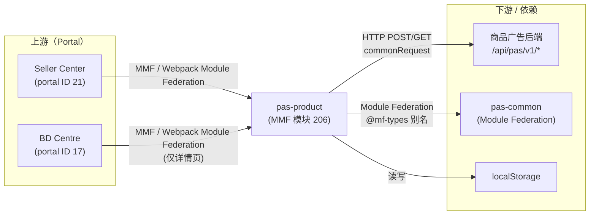

<!-- ads-workspace-gdoc-sync: gdoc_id=1Eco2s3QX8xX9JemNm8CIwSi5ebr5hh_5151YayXU9AE gdoc_url=https://docs.google.com/document/d/1Eco2s3QX8xX9JemNm8CIwSi5ebr5hh_5151YayXU9AE/edit -->

# pas-product — 商品广告模块

## 目录

- [项目概览](#项目概览)
- [核心功能](#核心功能)
- [项目架构](#项目架构)
  - [上下游调用拓扑](#上下游调用拓扑)
- [目录结构](#目录结构)
- [快速开始](#快速开始)
  - [前置条件](#前置条件)
  - [配置说明](#配置说明)
  - [安装依赖](#安装依赖)
  - [构建](#构建)
  - [本地开发](#本地开发)
  - [开发流程](#开发流程)
  - [部署发布](#部署发布)
- [API 文档](#api-文档)
- [本地存储](#本地存储)
- [TMS 埋点追踪](#tms-埋点追踪)
- [性能监控](#性能监控)
- [业务术语词汇表](#业务术语词汇表)
- [参考资料](#参考资料)
- [常见问题解答](#常见问题解答)

---

## 项目概览

`pas-product` 是一个基于 Vue 3 + TypeScript 的微前端模块（MMF 模块 ID：206），用于在 Shopee 广告平台上管理商品广告（Product Ads）活动。该模块覆盖商品广告的完整生命周期——创建、详情查看与重启——同时支持卖家中心（SC）和 BD Centre（BDC）两个平台。SC 使用全部页面（创建与详情），BDC 仅使用详情页。

---

## 核心功能

- **广告创建流程**：多步表单，涵盖商品选择（自动/手动）、出价策略（自动/手动/ROI2/GMS）、基础设置（名称、投放位置、预算、时长）和创意设置。
- **广告详情页**：四种详情页对应不同广告类型——自动（`auto-detail`）、Auto GMS（`auto-gms-detail`）、手动（`manual-detail`）、Manual MPD（`manual-mpd-detail`），均含性能指标表格和图表。
- **出价策略**：
  - 自动出价（标准自动与 GMS/GMV-Max）
  - 手动出价（关键词 + 展示位置出价）
  - ROI2 / 目标 ROAS 出价
  - 多商品批量 ROI 出价
- **商品选择模式**：自动选择最优商品，或手动选择商品（单品/批量）。
- **新品广告（NPA）**：独立的创建与重启路由（`create-npa`、`restart-npa`），提供 NPA 专属出价界面。
- **效果报表**：可按日期范围查看的指标图表（`MetricChart`）和广告效果表格，支持导出。
- **广告诊断**：在详情页头部集成 `AdsDiagnosis` 组件。
- **ROAS 保护**：在手动详情页展示冷启动/返利追踪信息。
- **可展开指标面板**：详情页在可用指标超过 10 个时显示「更多指标」切换按钮，展开/收起偏好持久化至 `localStorage`。
- **正向推广横幅（Positive Boosting Banner）**：手动广告详情页在正向操作推广完成后展示通知横幅，显示 GMV 提升百分比。
- **GMS 留存弹窗（GMS Retention Modal）**：暂停或停止 GMS 活动时，留存弹窗调用 `gms_retention` 横幅 API，提供优化预算、调整 ROAS、管理商品列表或保持广告运行等选项，再决定是否继续操作。
- **ROI3 收益预估**：创建页受 `szRoi3BenefitsPositiveAction` 功能开关控制，`useRoi3Benefit` 组合式函数调用 `pas-common` 的 `useVoucherEstimation`，在创建 ROI2/目标 ROAS 出价策略时展示预计 Smart Voucher 收益。
- **Rapid Boost 效果可视化**：详情页头部 Rapid Boost 开关通过 `/report/get_rapid_boost_effect/` 获取累计 GMV 提升数据（加速 vs. 非加速对比），并以内联图表形式展示。
- **待办事项**：从详情页 store 中获取并管理各活动的待办列表。
- **CPS（按销售额收费）**：自动充值集成与 CPS 广告开通流程。
- **平台感知渲染**：检测 BD 用户身份（`isBDUser`），有条件地显示面包屑导航和 BDC 专属商店搜索。
- **会话追踪**：每次路由跳转时生成新的页面会话 ID（UUID），并持久化到 `localStorage`（key：`SELLER_CENTER_SHOPEE_ADS_PAGE_SESSION_ID`）。
- **出价弹窗最低预算校验**：由 `szLimitMinBudgetAutoIncrease` 功能开关控制。在 `manual-detail` 页面打开关键词或展示位置出价弹窗时，通过 `getBudgetForDetail`（端点：`/setup_helper/get_budget_data_for_edit/`）获取最新最低预算。若当前日预算低于最新最低值，弹窗内显示警告提示（i18n key：`ads_pc_edit_nonbudget_update_min_budget_prompt_content`）。`manual-bidding/index.vue` 中的 `syncBudgetToLatestMinIfNeeded` 在满足条件时自动将预算更新至最低值。
- **重启最低预算警告横幅**：在创建页的基础设置（`create/basic-setting/index.vue`）中，重启广告流程（`isRestart`）时，若 `prevCampaign.dailyBudget` 低于当前最低预算（`restartApiMinBudget`），则显示警告提示框（i18n key：`ads_pc_edit_budget_update_min_budget_prompt_content`），由 `showRestartMinBudgetBanner` 计算属性控制。
- **预算 / ROAS 优化标签**：`OptimizationTag`（来自 `pas-common/components`，样式：`OPTIMIZATION_STYLE.ORANGE`）在详情页页头展示——`basic-info/index.vue` 中展示预算优化标签（`OPTIMIZATION_TYPE.BUDGET`，由 `rewardsInfo.budgetSlogan` 驱动），`bidding-method-editor/index.vue` 中展示 ROAS 目标优化标签（`OPTIMIZATION_TYPE.ROAS`，由 `rewardsInfo.roasSlogan` 驱动），各含曝光与点击埋点回调。

---

## 项目架构

### 多模块框架（MMF）

`pas-product` 基于多模块 CLI（MMC）构建，这是一个基于 Webpack/Rspack 的框架，用于开发和构建 MMF 模块。核心概念如下：

| 概念 | 说明 |
|---|---|
| **Portal（门户）** | 加载模块的宿主应用（Seller Center、BD Centre）|
| **Module（模块）** | 本项目；通过模块联邦懒加载到 Portal 中 |
| **Module Federation** | Webpack 特性，实现 `pas-common` 与消费方之间的运行时代码共享 |
| **MMC** | CLI 工具（`@shopee/multi-module-cli`），负责 init、dev 和 build 的统一编排 |

### 模块联邦角色

| 项目 | 角色 |
|---|---|
| `pas-common` | MF **提供方** — 共享类型、工具函数、组件、埋点 |
| `pas-product` | MF **消费方** — 通过 `@mf-types` 别名从 `pas-common` 导入 |

### 状态管理

本模块采用扁平化响应式状态模式（非 Vuex/Pinia）：

- **`Constantine`**（`src/_shared/store/config/contantine.ts`）：全局响应式配置 store，存储从后端获取的 `ConfigListRes`（最小/最大预算、出价范围、教育链接、CPS 配置、目标 ROAS、ROI2 等）。
- **`metaNonAdsConfig`**（`src/_shared/store/config/meta-non-ads.ts`）：功能开关标志（`extToggle.*`）和活动日配置。
- **`pageStatus`**（`src/_shared/store/page-status/index.ts`）：详情页响应式状态（当前活动数据、日期范围、报表加载状态、诊断数据、ROAS 保护、指标 Tab）。
- **`detailPageToDoList`**（`src/_shared/store/detail-page-to-do-list/index.ts`）：详情页待办事项列表。
- **创建页 `provide`/`inject`**：`create/index.vue` 通过 Vue 的 `provide` API 向所有子组件提供 `creationForm`、`campaignInfo`、`recommendProductIds` 和 `allowCreateCps`。

### 路由

所有路由嵌套在基路径 `/portal/marketing/pas/product` 下：

| 路由路径 | 名称 | 组件 |
|---|---|---|
| `/portal/marketing/pas/product` | `INDEX_PAGE` | `home.vue` |
| `create` | `CREATE_PAGE` | `create/index.vue` |
| `restart/:campaignId` | `RESTART_PAGE` | `create/index.vue` |
| `create-npa` | `CREATE_NPA_PAGE` | `create/index.vue` |
| `restart-npa/:campaignId` | `RESTART_NPA_PAGE` | `create/index.vue` |
| `auto/:campaignId` | `AUTO_DETAIL_PAGE` | `auto-detail/index.vue` |
| `auto-gms/:campaignId` | `AUTO_GMS_DETAIL_PAGE` | `auto-gms-detail/index.vue` |
| `manual/:campaignId` | `MANUAL_DETAIL_PAGE` | `manual-detail/index.vue` |
| `manual-npa/:campaignId` | `MANUAL_NPA_DETAIL_PAGE` | `npa-detail/index.vue` |
| `manual-mpd/:campaignId` | `MANUAL_MPD_DETAIL_PAGE` | `manual-mpd-detail/index.vue` |

基路由的 `beforeEnter` 守卫会预先调用 `getMetaAds()` 和 `getConfig()`，若检测到用户无广告账户则重定向到 PAS 主页（BD 用户访问详情页时例外）。

> **注意**：NPA 路由（`create-npa`、`restart-npa`、`manual-npa`）**未注册** `creationBeforeEnter` 或 `detailBeforeEnter` 守卫，因此 NPA 流程不会设置 `PERFORMANCE_MARK_CREATE_ENTER` / `PERFORMANCE_MARK_DETAIL_ENTER` 性能标记。

### 上下游调用拓扑

`pas-product` 是浏览器侧执行的 MMF 模块（无独立服务进程），其外部调用关系如下：



#### 上游

| 调用方 | 协议/方式 | 说明 |
|---|---|---|
| Seller Center（portal ID 21）| MMF Module Federation（Webpack）| 加载 `pas-product` 用于全部商品广告页面（创建与详情）|
| BD Centre（portal ID 17）| MMF Module Federation（Webpack）| 仅加载 `pas-product` 的详情页 |

#### 下游

| 服务 | 协议/方式 | 说明 |
|---|---|---|
| 商品广告后端 | HTTP POST/GET（`/api/pas/v1/*`）| 全部商品广告操作：活动 CRUD、报表、诊断、出价、ROAS 保护、待办列表 |

#### 依赖

| 依赖 | 类型 | 说明 |
|---|---|---|
| `pas-common` | Module Federation（MF 提供方）| 共享 EDS UI 组件、类型、埋点入口、工具函数、`createRequest` 工厂 |
| `localStorage` | 浏览器存储 | 会话 ID（`SELLER_CENTER_SHOPEE_ADS_PAGE_SESSION_ID`）及各广告类型的指标列选择 |
| `@shopee/multi-module-cli`（MMC）| 构建/开发工具 | Webpack/Rspack 开发服务器、模块初始化与生产环境构建编排 |

---

## 目录结构

```
pas-product/
├── mmc.config.js               # MMC 构建配置（模块 ID：206，技术栈：vue3）
├── package.json                # 依赖项和 npm 脚本
├── src/
│   ├── index.ts                # 入口：配置 EDS 语言环境；加载路由
│   ├── typing.d.ts             # 全局 TypeScript 环境声明
│   ├── jsx.d.ts                # JSX 类型声明
│   ├── pages/
│   │   ├── home.vue            # 索引/主页占位页面
│   │   ├── create/             # 广告创建流程（共享于创建、重启、NPA 路由）
│   │   │   ├── index.vue       # 根创建表单；provide creationForm & campaignInfo
│   │   │   ├── types.ts        # 注入类型（FormInstantInject、CampaignInfoInject 等）
│   │   │   ├── basic-setting/  # 广告名称、投放位置、预算、时长表单区域
│   │   │   ├── bidding-strategy/ # 自动/手动出价 Tab 及子组件
│   │   │   ├── product-selection/ # 自动/手动商品选择界面
│   │   │   ├── creative-setting/  # 创意选项区域
│   │   │   ├── tab-selection/  # 出价类型 Tab 切换器
│   │   │   ├── npa/            # NPA 专属出价界面
│   │   │   ├── publish-check/  # 发布前重叠检测
│   │   │   ├── publish-result/ # 发布成功/失败结果展示
│   │   │   └── components/     # 创建页横幅和弹窗（CPC、CPS、GMS）
│   │   ├── auto-detail/        # 自动商品广告详情页
│   │   ├── auto-gms-detail/    # Auto GMS（GMV-Max）广告详情页
│   │   ├── manual-detail/      # 手动广告详情页（关键词 + 展示位置）
│   │   ├── manual-mpd-detail/  # Manual MPD 广告详情页
│   │   └── npa-detail/         # NPA 详情页（代理组件：根据广告类型动态渲染 ManualMpdDetail 或 ManualDetail）
│   ├── _shared/
│   │   ├── api/
│   │   │   ├── common/         # 配置、meta-ads、meta-non-ads API
│   │   │   ├── product-creation/  # 出价、预算、活动、setup-helper、setup-status API
│   │   │   ├── product-detail/ # 诊断、预算、活动、关键词、ROAS 保护、待办 API
│   │   │   ├── product-selector/  # 商品列表 API（选择器用）
│   │   │   ├── report/         # 效果报表（get、time-graph）API
│   │   │   └── request/        # HTTP 请求工厂（commonRequest 单例，基于 lazy-loaded createRequest）
│   │   ├── components/
│   │   │   ├── detail-header/  # 活动状态操作、预算选择器、出价方式编辑器等
│   │   │   ├── detail-navigation/ # 详情页导航
│   │   │   ├── detail-card/    # 可复用详情卡片布局
│   │   │   ├── edit-product/   # 商品批量添加 / 操作组件
│   │   │   ├── increase-bid-price-modal/
│   │   │   ├── npa/            # NPA 阶段标签、详情、介绍、ROAS 编辑提示
│   │   │   ├── overlap-prompt/ # 重叠检测提示
│   │   │   ├── product-item-perf-tag/ # 商品列表项性能标签
│   │   │   ├── prompt-alert/   # 可复用警告横幅
│   │   │   ├── roas-protection/ # ROAS 保护展示
│   │   │   ├── roi-type-selection-card/
│   │   │   ├── single-product-list/
│   │   │   └── skeleton-item/  # 加载骨架屏
│   │   ├── composable/
│   │   │   ├── useBannerStatus.ts   # 横幅获取/修改逻辑（自动/手动流程）
│   │   │   ├── useBreakInPeriod.ts  # 磨合期负向操作弹窗 + 埋点
│   │   │   ├── useDuration.ts       # 汇总日期范围、updateTimeConfig、缓存报表范围
│   │   │   ├── useExpandMetrics.ts  # 可展开指标面板；「更多指标」切换 + localStorage 持久化
│   │   │   ├── useGmvMetric.ts      # 已付 vs 已下单 GMV Tab、最小日期、埋点
│   │   │   ├── useNpaPhase.ts        # NPA/MPD 阶段检测、报表类型、provide 阶段信息
│   │   │   ├── useRcmdRoiTwoBanner.ts # ROI2 推荐横幅
│   │   │   ├── useRoi3Benefit.ts    # ROI3 收益/优惠券预估负载构建（创建页）
│   │   │   ├── useReinforcedRoi3.ts # 基于功能开关的 Reinforced ROI3 显示控制
│   │   │   ├── useSelectMetrics.ts  # 指标列、持久化、路由→指标 key 映射
│   │   │   ├── useVoucherNoticeModal.ts # 首次广告主 + SV 优惠券弹窗（发布后）
│   │   │   └── useVue.tsx           # useRoute / useRouter（通过 getCurrentInstance）
│   │   ├── constants/
│   │   │   ├── api.ts          # 集中定义的 API 端点路径常量
│   │   │   ├── router.ts       # RouterMap 枚举、RouterPath、性能标记常量
│   │   │   ├── campaign/       # CampaignInfo 接口、BiddingType、CampaignStates 枚举
│   │   │   ├── keyword/        # 关键词相关常量
│   │   │   ├── app-config.ts   # Region 枚举、SC_STICKY_TABLE_OFFSET
│   │   │   ├── event.ts        # EmitEventName（投放位置/预算/ROAS/GMS 浮层事件）
│   │   │   ├── framework.ts    # isBDUser 检测
│   │   │   ├── guide-link.ts   # genProductEdit(itemId) 卖家 Portal URL
│   │   │   ├── metric-item.ts  # 基于 pas-common 指标定义的仪表板列构建器
│   │   │   ├── metrics-field.ts # 表格列类型、DEFAULT_METRIC_LIST、MetricKey
│   │   │   ├── region.ts       # DOMAIN_SUFFIX、COUNTRY_CODE 重导出
│   │   │   └── time.ts         # ONE_DAY、日期选择器类型
│   │   ├── router/
│   │   │   └── index.ts        # 路由定义；routerStack；页面会话 ID 管理
│   │   ├── store/
│   │   │   ├── config/         # Constantine、metaNonAdsConfig、getIndividualAdsConfig
│   │   │   ├── constantine/    # 派生配置：货币、关键词、目标 ROAS
│   │   │   ├── detail-page-to-do-list/
│   │   │   └── page-status/    # 响应式详情页状态 + resetPageState + 活动操作
│   │   ├── styles/
│   │   │   └── page.scss       # 由 webpack 注入到所有组件样式作用域的全局 SCSS
│   │   ├── types/
│   │   │   └── index.ts        # PlainType 等基础类型
│   │   └── utils/
│   │       ├── link/           # URL/链接构建工具函数（genManualProductLink）
│   │       ├── render/         # 表格单元格渲染器、matchTypeTooltip（广泛匹配）
│   │       ├── report/         # 报表数据转换（formatReportDelta、getMetricSubtype）
│   │       ├── sorter/         # 表格列排序工具
│   │       ├── table/          # genRightTableColumns 工具函数
│   │       ├── target-roas/    # 目标 ROAS 计算工具（genChartArea）
│   │       └── time/range.ts   # 日期范围工具（getTimeRange）
│   └── track/
│       ├── index.ts            # 从 pas-common 统一重导出所有埋点入口
│       ├── types.ts            # 埋点相关类型重导出
│       └── utils.ts            # 埋点辅助工具函数
```

---

## 快速开始

### 前置条件

| 工具 | 版本 |
|---|---|
| Node.js | ≥ 16.14.0（推荐 Node 20）|
| pnpm | ≥ 8.0.0（推荐 pnpm 8）|
| MMC（`@shopee/multi-module-cli`）| 最新 V3.x |
| Python | 3.10（MMC 原生模块所需）|
| npm registry | `https://npm.shopee.io/` |

全局安装 MMC（若未安装）：

```bash
pnpm i -g @shopee/multi-module-cli
mmc setup
mmc -V   # 应显示 mmc-core、mmc-vue、mmc-react、mmc-vue3 四个版本
```

### 配置说明

模块配置文件为 `mmc.config.js`：

- **模块 ID**：`206`
- **类型**：`module`
- **技术栈**：`vue3`
- **全局 SCSS 注入**：`src/_shared/styles/page.scss` 被注入到每个组件的样式作用域。
- **构建流水线**：使用 `@shopee/pas-module-config` 共享的 webpack/rspack 配置。

开发期远程配置存储于 `config/.remote-config.json`（由 `yarn run init` 自动生成，勿手动提交修改）。

### 安装依赖

在开始开发前运行一次，安装依赖并获取远程 Portal 配置：

```bash
# 卖家中心（Portal ID 21）
yarn run init -p 21

# BD Centre（Portal ID 17）
yarn run init -p 17

# 交互式选择（方向键切换 Portal）
yarn run init
```

> **注意**：`yarn run init` 会覆盖 `.browserslistrc`、`.stylelintrc.json` 和 `tsconfig.json`。如需自定义这些文件，请使用 MMC 配置覆盖。

### 构建

```bash
# 本地构建（用于测试）
yarn build

# 生产环境构建通过 Seller Portal CI 触发——详见部署发布章节
```

### 本地开发

`pas-product` 依赖 `pas-common` 提供共享工具函数、组件和类型定义。有两种模式可选：

#### 本地 pas-common 模式（默认 `yarn dev`）

需同时运行 `pas-product` 和 `pas-common` 开发服务器。`pas-common` 开发服务器默认监听 `8001` 端口。

```bash
# 在 pas-common 目录中
yarn dev

# 在 pas-product 目录中
yarn dev          # 并发运行：MMC dev server + vue-tsc 类型检查
```

若 `pas-common` 未运行，终端会报错：
```
<e> [FederatedTypesPlugin] Unable to download 'pas-common' remote types index file: connect ECONNREFUSED 127.0.0.1:8001
```

#### 远程 pas-common 模式

```bash
# 使用 master 分支远程类型
yarn dev:remote

# 使用指定功能分支
yarn dev -b {feature-branch-name}
```

若分支不存在：
```
<e> [FederatedTypesPlugin] Unable to download 'pas-common' remote types index file: Request failed with status code 404
```

#### WebStorm IDE 模式

```bash
yarn dev:webstorm    # 设置 EDITOR=webstorm 以支持文件跳转
```

#### 快速启动（一条命令）

```bash
yarn start           # 执行 init -p 21 然后 dev:remote
```

### 开发流程

启动开发服务器后：

1. **打开测试 Portal**（SC：`https://seller.test.shopee.sg` 或 BDC：`https://bd-centre.test.shopee.com`）。
2. **连接本地开发服务器**，通过 MMF DevTools：
   - 打开浏览器开发者工具 → 在控制台运行 `mmfDevtools.enable()`，**或**
   - 使用 [MMF DevTools UI](https://seller-portal.i.test.shopee.io/mmc-docs/guide/more-topics/mmf-devtools.html#connect) 点击 **Connect to Dev Server**。
3. **刷新页面** — Portal 将从本地服务器加载资源。控制台出现 `[MMF_DEVTOOLS]` 和 `[HMR] connected` 表示连接成功。

**SC 登录**：使用 [Pas-helper Chrome 插件](https://chromewebstore.google.com/detail/pas-helper/nhfhjiehemipamajmeimnnkinhncgpcd) 一键登录多地区账号。

**BDC 登录**：进入[商店列表页](https://bd-centre.test.shopee.com/ads-crm/shop?type=all)，通过 Shop ID 搜索商店（可从 SC 通过 Pas-helper 获取 Shop ID），进入商店详情页后点击某条商品广告。

#### 代码质量

```bash
yarn lint          # 运行 ESLint + Stylelint
yarn lint:es:fix   # 自动修复 ESLint 问题
yarn lint:style:fix # 自动修复 Stylelint 问题
yarn prettier      # 格式化所有源文件
yarn type:check    # TypeScript 类型检查（不生成输出）
```

Husky 配置了 lint-staged，在每次提交前对 `src/**/*.{ts,vue,css,scss,less}` 执行 ESLint + Prettier + Stylelint。

### 部署发布

生产环境构建和发布通过 [Seller Portal](https://seller-portal.i.shopee.io/) 管理：

1. **构建**：选择模块组（pas-product），填写构建表单，点击 **Build**。
2. **发布**：构建成功后，点击 Action 列中的 **Publish**，选择目标 Portal、PFB 和地区，再次点击 **Publish**。
3. **下线模式**：如需将模块下线，构建前开启 **Offline Mode**，再发布。模块注册的所有路由将无法访问。

CI/CD 流水线（`.gitlab-ci.yml`）：

| 阶段 | 任务 | 触发条件 | 说明 |
|---|---|---|---|
| `lint` | `lint` | 合并请求 | 初始化后运行 `yarn lint` |
| `parallel_jobs` | `ai-code-review` | 合并请求 | AI 代码审查 |
| `parallel_jobs` | `e2e_tests` | 合并请求 → master/release | 触发 `pas-e2e-tests`（标签 `@pas-product`）|
| `release_verify` | `release_verify` | 合并请求 | 通过 deploy-platform API 验证发布 |
| `auto_deploy` | `auto_deploy_test` | 推送到 master/release | 部署到测试环境（`pfb-ads-platform-e2e`）|
| `auto_deploy` | `auto_deploy_uat` | 推送到 master | 部署到 UAT 环境 |
| `auto_deploy_e2e` | `auto_deploy_e2e_tests` | 测试部署完成后 | 部署后触发 E2E 测试 |

部署辅助命令：

```bash
yarn deploy      # release-bot -a -b master -p（从 master 自动部署）
yarn deploy:ci   # release-bot -a（CI 部署）
```

---

## API 文档

所有 API 函数位于 `src/_shared/api/`。基础 URL 前缀为 `/api/pas/v1`（定义于 `src/_shared/api/request/base.ts`）。下表中的每个端点均追加在此前缀之后。

请求工厂 `commonRequest<T, U>(api, options)` 位于 `src/_shared/api/request/index.ts`，是基于 `pas-common/request` 的 `createRequest()` 的懒加载单例封装，支持 POST/GET/PUT 方法。基础 URL 前缀枚举 `BASE_PREFIX.V1` 定义于 `src/_shared/api/request/base.ts`。

| 页面 | 页面 URL | API 端点 | 说明 |
|---|---|---|---|
| 全局 | — | `/meta/get/` | 获取新广告元数据 |
| 全局 | — | `/meta/get_ads_data/` | 获取广告元数据（账户信息、广告配置）|
| 全局 | — | `/meta/get_non_ads_data/` | 获取非广告元数据（功能开关、活动日）|
| 全局 | — | `/config/get/` | 获取全局广告配置（Constantine）|
| 全局 | — | `/report/get_config/` | 获取报表显示配置 |
| 全局 | — | `/report/update_time_config/` | 更新报表时间范围配置 |
| 全局 | — | `/report/update_selected_metric_config/` | 更新已选指标列配置 |
| 全局 | — | `/banner/campaign_get/` | 获取活动横幅状态 |
| 全局 | — | `/banner/campaign_modify/` | 修改活动横幅状态 |
| 全局 | — | `/banner/check_duplicate_ongoing_manual_product/` | 检查重复进行中的手动商品广告 |
| 全局 | — | `/banner/close_duplicate_ongoing_manual_product/` | 关闭重复进行中的手动商品广告 |
| 全局 | — | `/banner/modify/` | 修改横幅状态 |
| 全局 | — | `/banner/get/` | 获取横幅状态 |
| 全局 | — | `/campaign_day/get_surge_setting/` | 获取活动日冲刺设置 |
| 创建 | `/portal/marketing/pas/product/create` | `/product/publish/` | 发布商品广告活动 |
| 创建 | `/portal/marketing/pas/product/create` | `/product/mass_create/` | 批量创建商品广告 |
| 创建 | `/portal/marketing/pas/product/create` | `/product/get_budget_data_for_creation/` | 获取创建用预算数据 |
| 创建 | `/portal/marketing/pas/product/create` | `/product/get_setup_status/` | 获取设置完成状态 |
| 创建 | `/portal/marketing/pas/product/create` | `/product/manual/get_targeting_bid_price_data/` | 获取定向出价数据 |
| 创建 | `/portal/marketing/pas/product/create` | `/product/list_overlapping_ads_for_roi_two/` | 检查 ROI2 广告重叠 |
| 创建 | `/portal/marketing/pas/product/create` | `/product/get_estimated_data/` | 获取 ROI2 预估数据（简单模式升级）|
| 创建 | `/portal/marketing/pas/product/create` | `/product/list_estimated_simple_roi_two_data/` | 列出简单 ROI2 预估数据（批量模式）|
| 创建 | `/portal/marketing/pas/product/create` | `/product/list_recommended_roi_two_target/` | 列出推荐 ROI2 目标（批量模式）|
| 创建 | `/portal/marketing/pas/product/create` | `/product/get_suggested_roi_two_type/` | 获取建议的 ROI2 类型 |
| 创建 | `/portal/marketing/pas/product/create` | `/product/gms/check_eligibility/` | 检查 GMS 资格 |
| 创建 | `/portal/marketing/pas/product/create` | `/product/mpd/check_duplicate_name/` | 检查 MPD 名称重复 |
| 创建 | `/portal/marketing/pas/product/create` | `/setup_helper/get_recommended_target_roi/` | 获取推荐目标 ROI |
| 创建 | `/portal/marketing/pas/product/create` | `/setup_helper/list_inherited_keyword/` | 列出继承的关键词 |
| 创建 | `/portal/marketing/pas/product/create` | `/setup_helper/trigger_keyword_log/` | 触发关键词日志 |
| 创建 | `/portal/marketing/pas/product/create` | `/setup_helper/list_switch_gmv_type_data/` | 列出切换 GMV 类型数据 |
| 创建 | `/portal/marketing/pas/product/create` | `/setup_helper/product_selector/query/` | 查询商品（选择器用）|
| 创建 | `/portal/marketing/pas/product/create` | `/setup_helper/product_selector/list_by_item_id/` | 按商品 ID 列出商品 |
| 创建 | `/portal/marketing/pas/product/create` | `/product/gms/product_selector/list/` | GMS 商品选择器查询 |
| 创建 | `/portal/marketing/pas/product/create` | `/product/mpd/product_selector/query/` | MPD 商品选择器查询 |
| 创建 | `/portal/marketing/pas/product/create` | `/product/npa/product_selector/query/` | NPA 商品选择器查询 |
| 创建 | `/portal/marketing/pas/product/create` | `/product_selector/list_additional_trait/` | 列出商品附加特征 |
| 创建 | `/portal/marketing/pas/product/create` | `/category/page_active_collection_list/` | 列出活跃收藏分类 |
| 创建 | `/portal/marketing/pas/product/create` | `/public/category/tree/` | 获取公共分类树 |
| 创建 | `/portal/marketing/pas/product/create` | `/topup/get_suggest_auto_topup_setting/` | 获取建议的自动充值设置 |
| 详情（全部）| `/portal/marketing/pas/product/{type}/:campaignId` | `/product/get/` | 获取活动信息 |
| 详情（全部）| `/portal/marketing/pas/product/{type}/:campaignId` | `/product/edit/` | 编辑活动信息 |
| 详情（全部）| `/portal/marketing/pas/product/{type}/:campaignId` | `/setup_helper/get_budget_data_for_edit/` | 获取详情编辑用预算数据 |
| 详情（全部）| `/portal/marketing/pas/product/{type}/:campaignId` | `/setup_helper/get_campaign_expense_statistics/` | 获取活动花费统计 |
| 详情（全部）| `/portal/marketing/pas/product/{type}/:campaignId` | `/report/get/` | 获取效果报表 |
| 详情（全部）| `/portal/marketing/pas/product/{type}/:campaignId` | `/report/get_time_graph/` | 获取报表时间图表 |
| 详情（全部）| `/portal/marketing/pas/product/{type}/:campaignId` | `/report/get_rapid_boost_effect/` | 获取 Rapid Boost 累计 GMV 提升效果数据（加速 vs. 非加速对比）|
| 详情（全部）| `/portal/marketing/pas/product/{type}/:campaignId` | `/diagnosis/list_verdict/` | 列出诊断结论 |
| 详情（全部）| `/portal/marketing/pas/product/{type}/:campaignId` | `/diagnosis/list_keyword_for_update/` | 列出待更新诊断关键词 |
| 详情（全部）| `/portal/marketing/pas/product/{type}/:campaignId` | `/diagnosis/track/` | 追踪诊断交互 |
| 详情（全部）| `/portal/marketing/pas/product/{type}/:campaignId` | `/todo/daily_budget/check_campaign_list/` | 检查活动日预算待办 |
| 详情（全部）| `/portal/marketing/pas/product/{type}/:campaignId` | `/todo/daily_budget/mass_optimize_campaign/` | 批量优化活动日预算 |
| 详情（自动）| `/portal/marketing/pas/product/auto/:campaignId` | `/product/auto/get_top_sku/` | 获取自动广告 Top SKU |
| 详情（手动）| `/portal/marketing/pas/product/manual/:campaignId` | `/product/manual/mass_edit_keyword/` | 批量编辑关键词 |
| 详情（手动）| `/portal/marketing/pas/product/manual/:campaignId` | `/product/manual/list_keyword_with_recommended_price/` | 列出关键词及推荐价格 |
| 详情（手动）| `/portal/marketing/pas/product/manual/:campaignId` | `/product/migrate_to_roi_two/` | 迁移到 ROI2 |
| 详情（手动）| `/portal/marketing/pas/product/manual/:campaignId` | `/product/upgrade_to_simple_roi_two/` | 升级到简单模式 ROI2 |
| 详情（手动）| `/portal/marketing/pas/product/manual/:campaignId` | `/rebate/list_campaign_history/` | 列出 ROAS 保护返利历史 |
| 详情（手动）| `/portal/marketing/pas/product/manual/:campaignId` | `/rebate/campaign_get/` | 获取活动返利详情 |
| 详情（GMS）| `/portal/marketing/pas/product/auto-gms/:campaignId` | `/product/gms/list_item_product_performance/` | 列出 GMS 商品效果 |
| 详情（GMS）| `/portal/marketing/pas/product/auto-gms/:campaignId` | `/product/gms/count_total_item/` | 统计 GMS 商品总数 |
| 详情（GMS）| `/portal/marketing/pas/product/auto-gms/:campaignId` | `/product/gms/item/edit/` | 编辑 GMS 商品 |
| 详情（GMS）| `/portal/marketing/pas/product/auto-gms/:campaignId` | `/product/gms/get_total_selected/` | 获取已选 GMS 商品总数 |
| 详情（GMS）| `/portal/marketing/pas/product/auto-gms/:campaignId` | `/product/gms/get_estimated_data/` | 获取 GMS 预估数据 |
| 详情（MPD）| `/portal/marketing/pas/product/manual-mpd/:campaignId` | `/product/mpd/list_item_product_performance/` | 列出 MPD 商品效果 |
| 详情（MPD）| `/portal/marketing/pas/product/manual-mpd/:campaignId` | `/product/mpd/item/edit/` | 编辑 MPD 商品 |
| 详情（MPD）| `/portal/marketing/pas/product/manual-mpd/:campaignId` | `/product/mpd/get_additional_data/` | 获取 MPD 附加数据 |

### 数字转换

后端将货币金额乘以 100,000（10^5）传输，以避免浮点精度问题。请始终使用：

```typescript
import { convertServerNumber, convertClientNumber } from "pas-common/utils";

// API 响应 → 客户端
item.budget = convertServerNumber(item.budget);   // ÷ 100,000

// 客户端 → API 请求
payload.dailyBudget = convertClientNumber(payload.dailyBudget); // × 100,000
```

---

## 本地存储

本模块使用 `localStorage` 在页面导航间持久化会话和偏好数据。

| Key | 位置 | 用途 |
|---|---|---|
| `SELLER_CENTER_SHOPEE_ADS_PAGE_SESSION_ID` | `src/_shared/router/index.ts` | 每次路由导航生成的 UUID，用于 TMS 埋点会话分组。路径变化时重新生成；同路径导航（表单提交、数据刷新）不会重新生成。使用原生 `localStorage`。|
| `SHOPEE_ADS_METRICS_KEY_${CampaignTypes.PRODUCT_AUTO}` | `auto-detail/index.vue` | 持久化自动广告详情页已选性能指标列。使用 `app.localStorage`。|
| `SHOPEE_ADS_METRICS_KEY_${CampaignTypes.PRODUCT_GMS}` | `auto-gms-detail/index.vue` | 持久化 GMS 详情页已选性能指标列。使用 `app.localStorage`。|
| `SHOPEE_ADS_METRICS_KEY_${CampaignTypes.PRODUCT_MANUAL}` | `manual-detail/index.vue` | 持久化手动广告详情页已选性能指标列。使用 `app.localStorage`。|
| `SHOPEE_ADS_METRICS_KEY_${CampaignTypes.PRODUCT_MPD}` | `manual-mpd-detail/index.vue` | 持久化 MPD 详情页已选性能指标列。使用 `app.localStorage`。|

---

## TMS 埋点追踪

所有埋点函数均从 `pas-common` 埋点入口导入，并在 `src/track/index.ts` 中统一重导出。**禁止在本地定义新的埋点函数。**

```typescript
// 在 pas-product 内正确的导入路径
import { someTrackingFunction } from "src/track";
```

重导出的埋点入口模块：

| 入口 | 来源 |
|---|---|
| 商品广告详情 | `pas-common/tracking/entries/productAdsDetail` |
| 创建商品广告 | `pas-common/tracking/entries/createProductAds` |
| SC 创建商品广告 | `pas-common/tracking/entries/sellerCenterCreateProductAds` |
| SC 重启商品广告 | `pas-common/tracking/entries/sellerCenterRestartProductAd` |
| SC 商品广告详情 | `pas-common/tracking/entries/sellerCenterProductAdDetail` |
| SC 广告详情 | `pas-common/tracking/entries/sellerCenterAdsDetails` |
| 创建新品广告 | `pas-common/tracking/entries/createNewProductAds` |
| SC Shopee 广告模块 | `pas-common/tracking/entries/sellerCenterShopeeAds` |

### 埋点辅助工具

`src/track/types.ts` 定义了用作埋点参数的本地枚举：

| 枚举 | 值 |
|---|---|
| `ProductPromotionType` | `AD_GROUP`、`INDIVIDUAL`、`GMS` |
| `ProductBiddingMethod` | `MANUAL`、`TARGET`、`SIMPLE` |
| `ProductSelectMethod` | `AUTO`、`MANUAL` |
| `PublishResultButtonAction` | `TRY_AGAIN`、`LEAVE_PAGE`、`GOT_IT` |

`src/track/utils.ts` 导出 `trackerUtil`，包含 ROI 层级埋点辅助函数：

- `transformRoiTierToPercentile(roiTier, roiRecoValues)` — 将 `RoiOptions` 映射为百分位字符串（如 `"75%"` 或 `"custom"`）
- `transformRoiTierToOption(roiTier)` — 将 `RoiOptions` 映射为层级标签（如 `"tier_1"`、`"tier_2"`、`"tier_3"`、`"custom"`）

---

## 性能监控

页面加载性能通过 [Performance API](https://developer.mozilla.org/en-US/docs/Web/API/Performance) 使用命名标记（mark）和测量（measure）进行统计。

### 性能标记

定义于 `src/_shared/constants/router.ts`：

| 常量 | 标记名称 |
|---|---|
| `PERFORMANCE_MARK_INDEX_ENTER` | `pas_product_ads_index_enter` |
| `PERFORMANCE_MARK_CREATE_ENTER` | `pas_product_ads_create_enter` |
| `PERFORMANCE_MARK_DETAIL_ENTER` | `pas_product_ads_detail_enter` |
| `PERFORMANCE_MARK_CREATE_MOUNTED` | `pas_product_ads_create_mounted` |
| `PERFORMANCE_MARK_DETAIL_MOUNTED` | `pas_product_ads_detail_mounted` |

### 性能测量

`generateCreatePerformanceData()` 和 `generateDetailPerformanceData()` 从 `src/_shared/constants/router.ts` 导出，各自返回：

```typescript
{
  moduleToEnter: number,   // 模块加载 → 路由进入（毫秒）
  enterToMounted: number,  // 路由进入 → 页面挂载（毫秒）
  moduleToMounted: number, // 模块加载 → 页面挂载（毫秒）
}
```

在详情页和创建页的 `onMounted` 中调用，并通过 TMS 埋点上报数据。

---

## 业务术语词汇表

| 术语 | 定义 |
|---|---|
| **广告 GMV（Ads GMV）** | 用户点击广告后 7 天内产生的总销售额 |
| **广告曝光（Ads Impression）** | 广告被展示的总次数 |
| **广告订单（Ads Order）** | 用户在点击广告后 7 天内下单 |
| **自动出价（Auto Bidding）** | 由系统自动设定出价的出价策略 |
| **自动充值（ATU / Auto Top-up）** | 自动补充卖家广告余额，防止预算耗尽 |
| **广泛匹配（Broad Match）** | 关键词匹配类型：搜索词包含关键词时触发广告 |
| **CIR（成本收入比）** | 广告收入 / 广告 GMV |
| **冷启动（Cold Start）** | 广告数据不足、系统无法准确预测的初始阶段 |
| **CPC（每次点击费用）** | 总花费 ÷ 总点击次数 |
| **CPM（千次展示费用）** | 广告主每 1,000 次展示的费用 |
| **CPS（按销售额收费）** | 基于佣金的计费方式，卖家按成单付费 |
| **CR（转化率）** | 广告订单数 / 总点击次数 |
| **CTR（点击率）** | 点击次数 / 曝光次数 |
| **每日发现（Daily Discovery / DD）** | 广告展示的推荐位（YMAL 类）|
| **ECPM（有效千次展示费用）** | 总广告花费 / 总曝光次数 |
| **精确匹配（Exact Match）** | 关键词匹配类型：搜索词与关键词完全一致时触发广告 |
| **GMS / GMV Max** | 以最大化 GMV 为目标的自动出价变体 |
| **手动出价（Manual Bidding）** | 卖家手动设置关键词和展示位置出价的策略 |
| **MPD（多商品详情）** | 支持多商品的活动类型 |
| **NPA（新品广告）** | 为新上架商品专设的广告变体，有独立路由 |
| **oCPC / Simple 模式** | 优化 CPC：为关键词广告自动选词的功能 |
| **PDP（商品详情页）** | 商品详情页面 |
| **ROAS（广告支出回报率）** | 广告 GMV / 广告花费（与 ROI 同义）|
| **ROAS 保护** | 冷启动返利功能，在广告初期给予卖家补偿 |
| **ROI（投资回报率）** | 广告 GMV / 广告花费 |
| **ROI2 / 目标 ROAS** | 以指定 ROAS 值为目标的出价策略 |
| **QSS（快速启动服务）** | 帮助新广告主快速开始投放的引导计划 |
| **SC（卖家中心）** | 面向卖家的 Portal 平台 |
| **BDC / BD Centre** | BD Centre（广告 CRM）：供关系经理使用的内部工具 |
| **SRM（卖家关系管理）** | 组织卖家数据进行细分的功能 |
| **YMAL（你可能还喜欢）** | 发现类广告展示位置 |

---

## 参考资料

- [MMC 快速开始](https://seller-portal.i.test.shopee.io/mmc-docs/guide/getting-started.html)
- [MMC 开发指南](https://seller-portal.i.test.shopee.io/mmc-docs/guide/basic/development.html)
- [MMC 初始化文档](https://seller-portal.i.test.shopee.io/mmc-docs/guide/basic/initialization.html)
- [Seller Portal 构建与发布](https://seller-portal.i.test.shopee.io/docs/pages/seller-portal/build-and-release.html)
- [MMF DevTools](https://seller-portal.i.test.shopee.io/mmc-docs/guide/more-topics/mmf-devtools.html)
- [Ads 平台概览（SRA）](https://sra.test.shopee.io/05.Business_Systems/5.3_Ads_Business_and_Architecture_Introduction/5.3.6._ads.platform.html)
- [pas-common 仓库](https://git.garena.com/shopee/isfe/ao/pas-common)
- [Paid Ads 词汇表（Confluence）](https://confluence.shopee.io/pages/viewpage.action?spaceKey=SPAD&title=Paid+Ads+Glossary)
- [Pas-helper Chrome 插件](https://chromewebstore.google.com/detail/pas-helper/nhfhjiehemipamajmeimnnkinhncgpcd)

---

## 常见问题解答

**1. 为什么 `yarn dev` 会报 8001 端口的 ECONNREFUSED 错误？**

默认的 `yarn dev` 命令使用本地 `pas-common` 模式，要求 `pas-common` 开发服务器在 8001 端口运行。请先启动 `pas-common`（在其目录执行 `yarn dev`），或切换到远程模式：`yarn dev:remote`。

**2. 如何选择卖家中心还是 BD Centre 进行开发？**

使用 `yarn run init -p 21` 初始化卖家中心（Portal ID 21），或 `yarn run init -p 17` 初始化 BD Centre（Portal ID 17）。这将用相应的 Portal 配置覆盖 `config/.remote-config.json`。

**3. 如何添加新路由？**

在 `src/_shared/constants/router.ts` 的 `RouterPath.children` 中添加路由路径，在 `RouterMap` 枚举中添加路由名称，然后在 `src/_shared/router/index.ts` 的 `routes` 数组中注册（嵌套在父索引路由下）。

**4. 创建页如何与子组件（BiddingStrategy、BasicSetting 等）共享状态？**

`create/index.vue` 使用 Vue 的 `provide` API 暴露 `creationForm`、`campaignInfo`、`recommendProductIds` 和 `allowCreateCps`。子组件通过 `inject("creationForm")` 和 `inject("campaignInfo")` 访问和更新这些共享状态。**禁止在弹窗/浮层组件中注入这些值**，因为它们可能被渲染在 `provide` 树之外。

**5. `Constantine` 是什么？如何访问广告配置？**

`Constantine` 是一个响应式 store（`src/_shared/store/config/contantine.ts`），在路由进入时通过 `getConfig()` 填充。访问方式如下：
```typescript
import { Constantine } from "src/_shared/store/config/contantine";
const minBudget = Constantine?.adsConfig?.productAds?.auto?.all?.minDailyBudget;
```

**6. 如何添加或更新埋点调用？**

所有埋点函数必须来源于 `pas-common/tracking/entries/*`。将导出添加到 `src/track/index.ts`，然后在组件中从 `src/track` 导入。禁止在本地创建新的埋点函数。

**7. 为什么有四个不同的详情页路由（auto、auto-gms、manual、manual-mpd）？**

每种路由对应一种具有不同界面和数据需求的广告类型：标准自动出价、GMS/GMV-Max 自动出价、手动关键词+展示位置出价、手动多商品（MPD）。它们共享 `detail-header` 和性能图表组件，但性能表格和编辑能力各不相同。

**8. 货币金额的数字转换是如何工作的？**

后端以 100,000（10^5）倍数存储和传输货币金额，以避免浮点精度问题。读取 API 响应时使用 `convertServerNumber(value)`，发送数据到 API 时使用 `convertClientNumber(value)`，均从 `pas-common/utils` 导入。

**9. 如何添加新的功能开关检查？**

功能开关存储在 `metaNonAdsConfig.extToggle` 中。路由守卫运行 `getMetaAds()` 后即可访问：
```typescript
import metaNonAdsConfig from "src/_shared/store/config/meta-non-ads";
const isFeatureEnabled = metaNonAdsConfig?.extToggle?.szMyNewFeature;
```

**10. 页面会话 ID 是什么？为什么每次路由变化都会重新生成？**

每次路由导航都会生成一个新的 UUID，存储在 `localStorage` 的 `SELLER_CENTER_SHOPEE_ADS_PAGE_SESSION_ID` 键下。该会话 ID 被 TMS 埋点用于将同一页面访问中的所有事件分组，便于分析用户旅程。同路径的导航（如表单提交、数据刷新）不会重新生成 ID。

<!-- Generated by ads-workspace/skills/ads-readme-generate | checked: 78ef56a2c68b33b0540d1d0cd273f631605ed58b | spec: 76fce5f679f9550b -->
