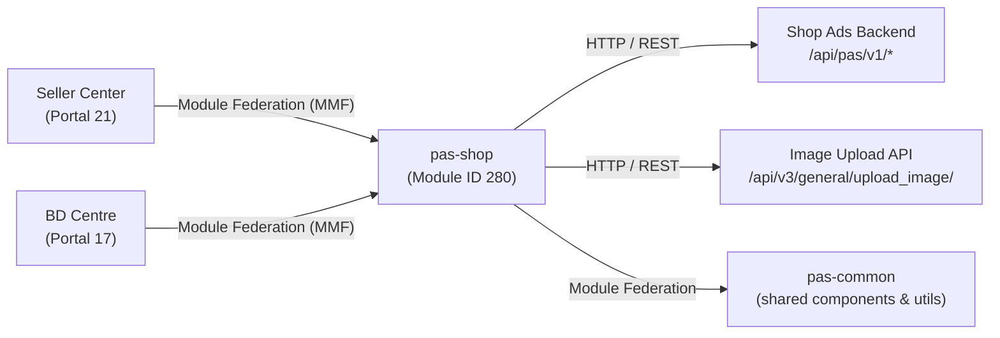

<!-- ads-workspace-gdoc-sync: gdoc_id=15HvzPyinZSwQtG1Wyv2AaL25ZgrPuKupBxJAa84X8_s gdoc_url=https://docs.google.com/document/d/15HvzPyinZSwQtG1Wyv2AaL25ZgrPuKupBxJAa84X8_s/edit -->

# pas-shop — Shop Ads Module

## Table of Contents

- [Project Overview](#project-overview)
- [Key Features](#key-features)
- [Project Architecture](#project-architecture)
- [Directory Structure](#directory-structure)
- [Quick Start](#quick-start)
  - [Prerequisites](#prerequisites)
  - [Configuration](#configuration)
  - [Installation](#installation)
  - [Build](#build)
  - [Local Development](#local-development)
  - [Development](#development)
  - [Deployment](#deployment)
- [API Documentation](#api-documentation)
- [Local Storage](#local-storage)
- [TMS Tracking](#tms-tracking)
- [Performance Monitoring](#performance-monitoring)
- [Business Terminology Glossary](#business-terminology-glossary)
- [References](#references)
- [Frequently Asked Questions](#frequently-asked-questions)

---

## Project Overview

`pas-shop` is the Shop Ads module for Shopee Seller Center (SC) and BD Centre (BDC). It provides a full lifecycle management interface for Shop Ads including creation, detail view, restart, and performance reporting. It runs as a Multi-Module Framework (MMF) module (ID: 280), consuming shared types, components, and utilities from `pas-common` via Webpack Module Federation.

---

## Key Features

- **Shop Ads Creation**: Full creation flow supporting Manual and Auto bidding strategies, daily budget configuration (API-enforced minimum; a warning banner is shown on restart if the current budget is below the latest API minimum), time-based scheduling, target audience configuration, and creative (tagline + image) customization.
- **Shop Ads Detail**: Comprehensive detail page with editable settings for bidding strategy, keywords (manual bidding), target audience, and ad creative. Minimum budget warnings appear in the budget edit panel, the eCPC settings modal, and the Target ROAS edit modal when the campaign budget is below the API-enforced minimum; budget is auto-synced to the latest minimum on ROAS edit confirm if needed. Includes performance charts, date-range filtering, and report export.
- **Restart Flow**: Restart ended Shop Ads by inheriting previous configuration (keywords, budget, creative) with a pre-populated creation form.
- **Target Audience Management**: Create and configure audience groups with premium rate targeting; supported on both creation and detail pages when the `szAdsShopTargetAudience` toggle is enabled.
- **Performance Reporting**: Time-series metric charts with selectable metric fields; supports report export for Manual and Auto bidding types.
- **To-Do List Integration**: Detail page displays budget recommendation cards via the `detailToDoListStore` with one-click apply capability.
- **Multi-platform Support**: Runs in Seller Center and BD Centre (read-only/restricted mode in BDC), auto-detecting the user context.
- **Feature Toggle System**: All major features are gated by server-side toggle flags (`enableShopAdsV2`, `szAdsAutoEnableShopAds`, `szAdsShopTargetAudience`, `szShopAdsEcpcPc`, etc.).
- **On-boarding Banners & New Badges**: Pulse popovers and new-feature badges for auto bidding intro, target audience, and fruit game features managed by the `useBannerStatus` composable.

---

## Project Architecture

`pas-shop` is an MMF **module** of type `vue3` (module ID `280`). It does not run independently — it registers its routes into the host portal (Seller Center or BD Centre).

```
Host Portal (Seller Center / BD Centre)
    └── pas-shop module (MMF module ID: 280)
            ├── pas-common (Module Federation remote — shared utilities, components, types)
            └── Routes registered via app.registerRouterModule
                    ├── /portal/marketing/pas/shop           → index page (router-view)
                    │       ├── detail/:id                   → Shop Ads detail page
                    │       ├── create                       → Shop Ads creation page
                    │       └── restart/:id                  → Shop Ads restart page
                    └── (all routes prefixed: /portal/marketing/pas)
```

**Module Federation**: The module consumes `pas-common` types from `@mf-types/pas-common/_types/` and imports runtime code via `pas-common/*` aliases. When `LOCAL_DEV=1` is set (via `yarn dev`), the module fetches `pas-common` types from a locally running `pas-common` dev server; otherwise it fetches from a specified branch via `branchName`.

**State Management**: Uses lightweight Vue 3 `reactive()` stores located in `src/_shared/store/`:
- `meta.ts` — user/shop metadata and ext toggle flags
- `toggle.ts` — ads feature toggle map
- `constantine.ts` — server-side constants config (bid price, currency, education links, etc.)
- `link.ts` — education/documentation links from server config
- `page-status/index.ts` — time range and metric selection state for the detail page
- `detail-page-to-do-list.ts` — campaign-level to-do list cards for the detail page

**API Layer**: All HTTP requests are made through `v1Request` (prefix `/api/pas/v1`) and `freeRequest` (no prefix), both lazily instantiated from `pas-common/request` via `createRequest`. Error responses are handled by `commonErrorHandler` which maps `ShopAdsErrorCode` values to i18n toast messages.

### Service Topology



| Direction | Name | Protocol | Description |
|-----------|------|----------|-------------|
| Upstream | Seller Center (Portal 21) | Module Federation (MMF) | Registers and mounts pas-shop; provides the host portal environment |
| Upstream | BD Centre (Portal 17) | Module Federation (MMF) | Registers pas-shop in read-only/restricted mode |
| Downstream | Shop Ads Backend | HTTP / REST | All `/api/pas/v1/*` shop ads endpoints via `v1Request` |
| Downstream | Image Upload API | HTTP / REST | `/api/v3/general/upload_image/` via `freeRequest` |
| Dependency | pas-common | Module Federation | Shared components, types, utilities, tracking, and request factory (`createRequest`) |

---

## Directory Structure

```
pas-shop/
├── mmc.config.js             # MMC configuration (module ID: 280, type: vue3)
├── package.json              # Scripts, dependencies
├── commitlint.config.js      # Commit message linting rules (extends @shopee/pas-module-config)
├── eslintrc.js               # ESLint config (extends @shopee/pas-module-config/src/eslint/vue)
├── .eslintrc.json            # ESLint entry (extends eslintrc.js)
├── .prettierrc.js            # Prettier config (extends @shopee/pas-module-config)
├── config/                   # MMC override configs
│   ├── babel.js              # Babel config (extends @shopee/pas-module-config)
│   ├── browserslistrc.js     # Browserslist (supports es6-module)
│   └── tsconfig.js           # TypeScript config (extends @shopee/pas-module-config)
├── polyfill/
│   └── _polyfill-event-bus.ts  # Vue 3 event bus polyfill ($on, $off, $once, $emit)
└── src/
    ├── index.ts              # Module entry: registers router, sets up EDS locale
    ├── global.scss           # Global SCSS variables and shake animation
    ├── custom.d.ts           # Module declaration for pas-common
    ├── jsx.d.ts              # JSX type declarations
    ├── pages/
    │   ├── index.vue         # Root router-view with tracking directive setup
    │   ├── create/           # Shop Ads creation and restart page
    │   │   ├── index.vue     # Creation page component
    │   │   ├── constant.ts   # Form helpers, validation functions, mapFormToParams
    │   │   ├── types.ts      # CreationForm, TimeLengthType, CreativeType, etc.
    │   │   └── components/   # basic-setting-card, bidding-strategy-card,
    │   │       ├── advanced-settings/     # Advanced settings (eCPC toggle)
    │   │       ├── basic-setting-card/    # Ad name, budget, duration
    │   │       ├── bidding-strategy-card/ # Manual/Auto bidding selection
    │   │       ├── card-radio/            # Radio card selector component
    │   │       ├── creative-setting-card/ # Creative (tagline/image) config
    │   │       └── target-audience-card/  # Target audience configuration
    │   └── detail/           # Shop Ads detail page
    │       ├── index.vue     # Detail page (Composition API script setup)
    │       ├── constant.ts   # Chart metrics, default metric list, keyword max nums
    │       ├── utils/
    │       │   ├── index.ts          # extendCampaign, transformKeywordItem, genMassEditKeywordsParams
    │       │   ├── report.ts         # genReportSum, formatReportDelta, genTargetRoas
    │       │   └── report-render.tsx # Table column renderers (dataRenderer, deltaReportHandler)
    │       └── components/
    │           ├── detail-header/     # Campaign header with status and actions
    │           ├── manual-bidding/    # Keyword table with bid editing
    │           ├── auto-bidding/      # Auto bidding strategy display
    │           ├── target-audience/   # Audience group management with premium rate
    │           ├── ads-creative/      # Creative preview and editing
    │           └── advanced-settings/ # eCPC and advanced config
    ├── track/
    │   └── index.ts          # Re-exports all TMS tracking functions from pas-common
    └── _shared/              # Shared code across pages
        ├── api/
        │   ├── index.ts      # Lazy-loaded request instances: v1Request, freeRequest
        │   ├── constant.ts   # BASE_PREFIX enum, API endpoint map, ShopAdsErrorCode,
        │   │                 # ShopAdsErrorMessageMap, commonErrorHandler
        │   ├── common/       # getConstantsConfig, getAdsToggle, triggerKeywordLog,
        │   │                 # getBudgetDataForEdit, uploadImage
        │   ├── create/       # getBiddingStrategy, getBudgetDataForCreation,
        │   │                 # checkDuplicateName, getRecommendedTargetRoi,
        │   │                 # getShopRelatedData, publishShopAds,
        │   │                 # listTargetAudienceOptions, esitmateTargetAudienceSize,
        │   │                 # getTargetAudienceGroups
        │   ├── detail/       # getShopAds, editShopAds, getManualShopAdsKeywords,
        │   │                 # listInheritedKeyword, getCampaignExpenseStatistics,
        │   │                 # massEditCampaignAdsKeywords, checkIfHaveEnoughActiveItems,
        │   │                 # editTargetAudience
        │   ├── report/       # getReportData, getAdsSummary, updateTimeConfig,
        │   │                 # getReportConfig, updateSelectedMetrics
        │   ├── banner/       # getBanner, modifyBanner
        │   └── to-do-list/   # checkCampaignListDailyBudget, massOptimiseCampaign
        ├── assets/
        │   ├── img/          # Bidding/targeting preview images, label images (by locale)
        │   └── svg/          # Voucher SVGs (by locale), UI icons (bell, edit, rotate, etc.)
        ├── components/
        │   ├── auto-creative-preview/    # Preview for auto creative mode
        │   ├── customize-creative-content/ # Custom tagline/image creative editor
        │   ├── detail-card/              # Generic detail section card wrapper
        │   ├── image-upload-cropper/     # Image upload + crop component (uses cropperjs)
        │   └── manual-creative-preview/  # Preview for manual creative mode
        ├── composables/
        │   ├── useBannerStatus.ts    # Banner/badge visibility, banner API integration
        │   ├── useDuration.ts        # Date range state, time range updates with API sync
        │   ├── useSelectMetrics.ts   # Metric field selection, column generation
        │   └── useVue.ts             # Vue instance utilities (useRoute, useRouter)
        ├── constants/
        │   ├── app-config.ts         # Region enum, language code helper
        │   ├── campaign.ts           # TargetAudienceType enum
        │   ├── metrics-field.ts      # getDashboardColumns, TableItem types
        │   ├── region.ts             # Region type, COUNTRY_CODE, DOMAIN_SUFFIX mapping
        │   └── time.ts              # ONE_DAY constant, DateRangeTime, DatePickerListItem types
        ├── router/
        │   ├── constant.ts           # RouterMap, RouterPath, AdsSetupPage,
        │   │                         # getAdsSetupRoute, performance mark constants,
        │   │                         # generateCreatePerformanceData,
        │   │                         # generateDetailPerformanceData
        │   └── index.ts              # Route registration, beforeEnter hooks,
        │                             # page session ID management
        ├── store/
        │   ├── constantine.ts        # Server constants config store
        │   ├── detail-page-to-do-list.ts # Campaign to-do cards store
        │   ├── link.ts               # Education links store
        │   ├── meta.ts               # User/shop metadata store
        │   ├── page-status/          # Date range and metric selection state
        │   └── toggle.ts             # Ads feature toggle store
        ├── types/
        │   └── index.ts              # SummaryDate, ReportLoadStatus, SimpleObject, PlainType
        └── utils/
            ├── common.ts             # showBatchActionResult, validateTagline, validateImageUrl,
            │                         # getClickRange
            ├── constantine/          # Currency formatting, bid price helpers
            │   └── index.ts          # formatValueWithSymbol, getCurrencyPrecision,
            │                         # getCpcCurrencyPrecision, getCpmCurrencyPrecision,
            │                         # getBroadMatchPriceMultiplier, getKeywordPriceinfo
            ├── metrics.ts            # getDefaultMetrics
            ├── sorter/               # Sort utilities for keyword tables
            │   └── index.ts          # MetricSorters, sorters (asc/desc with match type support)
            └── time.ts               # getTimeRange helper (wraps pas-common/utils)
```

---

## Quick Start

### Prerequisites

- **Node.js**: >= 16.14.0 (Node 20 recommended)
- **pnpm**: >= 8.0.0 (for installing MMC)
- **yarn**: Required for project scripts (see `package.json`)
- **MMC (Multi-Module CLI)**: Install globally before first use

```bash
pnpm i -g @shopee/multi-module-cli
mmc setup
mmc -V   # Should show 4 versions: mmc-core, mmc-vue, mmc-react, mmc-vue3
```

- **npm registry**: Must be set to `https://npm.shopee.io/`
- **Access**: Seller Center test account (use [Pas Helper](https://chromewebstore.google.com/detail/pas-helper/nhfhjiehemipamajmeimnnkinhncgpcd) Chrome extension for one-click login)

### Configuration

`mmc.config.js` at the project root defines the MMC configuration:

```js
module.exports = {
  id: 280,          // Module ID in Seller Portal
  type: "module",
  tech: "vue3",
  injectStyle: {
    scss: { inject: ["src/global.scss"] },
  },
  // webpack and rsbuild configurations via @shopee/pas-module-config
};
```

After `yarn run init`, MMC auto-generates these files from the portal — do **not** edit them manually:
- `.browserslistrc`
- `.stylelintrc.json`
- `tsconfig.json`
- `config/.remote-config.json` (router/params for the test env)

### Installation

Run once before development. Choose the portal: Seller Center (ID `21`) or BD Centre (ID `17`).

```bash
# Interactive portal selection
yarn run init

# Or specify portal directly
yarn run init -p 21   # Seller Center
yarn run init -p 17   # BD Centre
```

> **Note**: `yarn run init` overwrites `.browserslistrc`, `.stylelintrc.json`, and `tsconfig.json` each time.

### Build

```bash
yarn build        # Production build via mmc build
```

For production builds and release, use the [Seller Portal](https://seller-portal.i.shopee.io/) platform — select the module group and click Build.

### Local Development

After installation, start the development server:

```bash
yarn dev          # Starts mmc dev (LOCAL_DEV=1) + vue-tsc type-check watcher
yarn dev:remote   # Uses master branch remote pas-common types (LOCAL_DEV=1 branchName='master')
yarn dev -b <branch-name>  # Load pas-common types from a specific branch
```

> **Note**: `yarn dev` sets `LOCAL_DEV=1`, meaning it expects a locally running `pas-common` dev server. If the pas-common server is not running, you will see:
> ```
> <e> [FederatedTypesPlugin] Unable to download 'pas-common' remote types index file: connect ECONNREFUSED 127.0.0.1:8001
> ```
> Use `yarn dev:remote` to avoid this requirement.

### Development

After starting the dev server, connect it to the Seller Center test environment:

1. Open the Seller Center test page (e.g., `https://seller.test.shopee.sg`).
2. Log in via the [Pas Helper](https://confluence.shopee.io/pages/viewpage.action?pageId=1776244098) Chrome extension.
3. Open browser DevTools and run `mmfDevtools.enable()` (or use the MMF DevTools UI icon on the page).
4. Reload the page — it will connect to your local dev server and show `[MMF_DEVTOOLS]` and `[HMR] connected` in the console.

For BD Centre (BDC):
1. Go to the [shop list page](https://bd-centre.test.shopee.com/ads-crm/shop?type=all) and find a shop by ID.
2. Navigate to a shop's detail and select a Shop Ad.

To modify router/params for local dev, edit `config/.remote-config.json` (this file is reset on next `yarn run init`).

**Working with pas-common**: To modify `pas-common` locally, run its dev server and use `yarn dev`. Refer to the [pas-common repository](https://git.garena.com/shopee/isfe/ao/pas-common) for details. See also: [Multi-Remote Module Types Integration Guide](https://confluence.shopee.io/display/SPAD/%5BPaid+Ads+-+WebFE%5D+Shared+Module+-+Guide+to+Integrating+Multi-Remote+Module+Types+into+New+Projects).

**Other useful commands**:

```bash
yarn dev:webstorm    # Start dev server with WebStorm as editor
yarn start           # Init with Seller Center (portal 21) + yarn dev:remote
yarn inspect         # Inspect webpack config
yarn lint            # Run ESLint + Stylelint
yarn lint:es:fix     # Auto-fix ESLint issues
yarn lint:style:fix  # Auto-fix Stylelint issues
yarn type:check      # Run vue-tsc type check
yarn prettier        # Format src/ with Prettier
```

### Deployment

Production deployments are managed via the [Seller Portal](https://seller-portal.i.shopee.io/) platform:

1. Navigate to the module group for `pas-shop`.
2. Fill in the build information form and click **Build**.
3. Once the build succeeds, click **Publish** in the build records table.
4. Select target portal(s), PFB, and regions in the release form, then click **Publish**.
5. Monitor release progress and check space job logs via the **Detail** link.

For emergency releases, specify a custom release token in the release form.

To take the module offline, toggle **Offline Mode** before building, then release the resulting build.

CI/CD pipeline stages (defined in `.gitlab-ci.yml`):

| Stage | Job | Trigger |
|-------|-----|---------|
| `lint` | `lint` | Merge requests — runs `yarn lint` |
| `parallel_jobs` | `ai-code-review` | Merge requests — Cursor-based AI code review |
| `e2e_tests` | `e2e_tests` | MR to master/release (source branch must not be master/release) — triggers `pas-e2e-tests` with tag `@pas-shop` |
| `auto_deploy` | `auto_deploy_test` | Merge commits pushed to master/release (excludes release→master merges) — deploys to test env (`pfb-ads-platform-e2e`) |
| `auto_deploy` | `auto_deploy_uat` | Push to master — deploys to UAT env |
| `auto_deploy_e2e` | `auto_deploy_e2e_tests` | After `auto_deploy_test` completes on master/release merge commits — triggers E2E tests |
| `release_verify` | `release_verify` | Merge requests — verifies release via deploy-platform API |

```bash
yarn deploy      # Automated release on master branch
yarn deploy:ci   # CI-triggered release
```

---

## API Documentation

All API calls go through the central request layer in `src/_shared/api/index.ts`. Request instances are lazily loaded from `pas-common/request` via `createRequest`. The primary base URL prefix is `/api/pas/v1`.

### Request Utilities

| Export | Description |
|--------|-------------|
| `v1Request` | Standard request with `/api/pas/v1` prefix |
| `freeRequest` | Request with no path prefix (used for image upload) |

Both support `v1Request<ReqType, ResType>(endpoint, { params, skipError, needRes, withSecureFetchParams })` with full TypeScript generics.

Security params (`withSecureFetchParams: true`) are auto-injected when passed in configs.

### API Endpoints

| Page | Page URL | API Endpoint | Description |
|------|----------|-------------|-------------|
| Common | — | `/meta/get_ads_data/` | Fetches ads toggles and ads account info |
| Common | — | `/meta/get_non_ads_data/` | Fetches user shop info and ext toggles |
| Common | — | `/config/get/` | Loads bid price, currency, links, ads config, education links |
| Report | Detail | `/report/get/` | Fetches aggregated performance metrics |
| Report | Detail | `/report/get_config/` | Loads cached time range and selected metrics |
| Report | Detail | `/report/get_time_graph/` | Fetches time-series data for metric charts |
| Report | Detail | `/report/update_selected_metric_config/` | Saves selected metric fields to server cache |
| Report | Detail | `/report/update_time_config/` | Saves selected time range to server cache |
| Common | — | `/banner/get/` | Checks display status for onboarding banners/badges |
| Common | — | `/banner/modify/` | Records banner view/close action |
| Creation | `/portal/marketing/pas/shop/create` | `/shop/check_duplicate_name/` | Validates uniqueness of ad name |
| Creation | `/portal/marketing/pas/shop/create` | `/shop/get_bidding_strategy_eligibility/` | Returns auto/manual eligibility for bidding |
| Creation | `/portal/marketing/pas/shop/create` | `/shop/get_budget_data_for_creation/` | Returns recommended daily budget and budget log key |
| Creation | `/portal/marketing/pas/shop/create` | `/shop/get_preview_data/` | Fetches shop preview data (rating, items, etc.) |
| Creation | `/portal/marketing/pas/shop/create` | `/shop/publish/` | Creates or restarts a Shop Ad |
| Detail | `/portal/marketing/pas/shop/detail/:id` | `/shop/check_has_enough_active_item/` | Checks if shop has sufficient active items |
| Detail | `/portal/marketing/pas/shop/detail/:id` | `/shop/edit/` | Updates campaign settings (budget, status, creative, etc.) |
| Detail | `/portal/marketing/pas/shop/detail/:id` | `/shop/get/` | Fetches full Shop Ad campaign data |
| Detail | `/portal/marketing/pas/shop/detail/:id` | `/shop/manual/list_keyword_with_recommended_price/` | Lists keywords with recommended bid prices |
| Detail | `/portal/marketing/pas/shop/detail/:id` | `/shop/manual/mass_edit_keyword/` | Bulk edits keyword bid prices |
| Common | — | `/setup_helper/get_budget_data_for_edit/` | Returns budget edit data for existing campaigns |
| Common | — | `/setup_helper/get_campaign_expense_statistics/` | Returns today/7-day avg/max expense stats |
| Common | — | `/setup_helper/get_recommended_target_roi/` | Returns recommended target ROI for auto bidding |
| Detail | `/portal/marketing/pas/shop/detail/:id` | `/setup_helper/list_inherited_keyword/` | Lists keywords to inherit on restart |
| Common | — | `/setup_helper/trigger_keyword_log/` | Records keyword interaction log |
| Creation/Detail | — | `/target_audience/edit/` | Creates/updates/edits target audience groups |
| Creation | `/portal/marketing/pas/shop/create` | `/target_audience/get_group_estimated_result/` | Estimates audience size and premium rate range |
| Creation/Detail | — | `/target_audience/list_available_option/` | Lists available target audience segmentation options |
| Creation/Detail | — | `/target_audience/list_for_single_campaign/` | Retrieves existing audience groups for a campaign |
| Detail | `/portal/marketing/pas/shop/detail/:id` | `/todo/daily_budget/check_campaign_list/` | Gets budget recommendation to-do items |
| Detail | `/portal/marketing/pas/shop/detail/:id` | `/todo/daily_budget/mass_optimize_campaign/` | Applies recommended budget optimization |
| Common | — | `/api/v3/general/upload_image/` | Uploads creative image (uses `freeRequest`, no prefix) |

### Error Codes

Defined in `ShopAdsErrorCode` enum (`src/_shared/api/constant.ts`):

| Code | Enum Key | Description |
|------|----------|-------------|
| 1 | `systemError` | System error |
| 6 | `notWhitelisted` | Not whitelisted |
| 10 | `duplicateCampaign` | Duplicate campaign |
| 80 | `userStatusNotNormal` | User status not normal |
| 81 | `shopStatusNotNormal` | Shop status not normal |
| 82 | `shopInHoliday` | Shop in holiday mode |
| 83 | `editIsNotAllowed` | Edit not allowed |
| 84 | `actionNotAllowed` | Action not allowed |
| 85 | `invalidAccount` | Invalid ads account |
| 89 | `canNotDelete` | Cannot delete |
| 90 | `notEnougthActiveItems` | Not enough active items |
| 91 | `invalidCurrentStatus` | Invalid current status |

### Number Conversion

Backend numbers are inflated by ×100,000 to avoid floating-point issues. Always use:
- `convertServerNumber(value)` — for API responses (deflates ÷100,000)
- `convertClientNumber(value)` — for API requests (inflates ×100,000)

Both are imported from `pas-common/utils`.

---

## Local Storage

| Key | Description |
|-----|-------------|
| `SELLER_CENTER_SHOPEE_ADS_PAGE_SESSION_ID` | UUID generated on each page navigation. Used to correlate user actions within a single page visit in the tracking system. Regenerated when the route path changes or on page refresh. |

---

## TMS Tracking

Tracking functions are re-exported from `src/track/index.ts`, which delegates entirely to `pas-common` tracking entries:

```ts
export * from "pas-common/tracking/entries/sellerCenterCreateShopAds";
export * from "pas-common/tracking/entries/sellerCenterShopAdDetail";
export * from "pas-common/tracking/entries/sellerCenterRestartShopAd";
export * from "pas-common/tracking/entries/shopAdsDetail";
export * from "pas-common/tracking/entries/createShopAds";
```

### Key Tracking Events Used

| Function | Trigger |
|----------|---------|
| `reportViewOfSCCreateShopAds` | Creation page mounted |
| `reportViewOfSCRestartShopAd` | Restart page mounted |
| `reportClickOfCreateShopAdsBottomActionShopAdsPublish` | Publish button clicked |
| `reportClickOfCreateShopAdsBottomActionShopAdsCancel` | Cancel button clicked |
| `reportClickOfCreateShopAdsBidArticle` | Bidding strategy learn-more link clicked |
| `reportClickOfCreateShopAdsBasicStgArticle` | Basic settings learn-more link clicked |
| `reportClickOfCreateShopAdsCreativeStgAdCreativeCustomTagline` | Tagline edited on publish |
| `reportClickOfCreateShopAdsExitPopShopAdsExit` / `...Stay` | Exit confirmation dialog actions |
| `reportImpOfCreateShopAdsBottomActionBottomAction` | Bottom action bar impression |
| `reportClickOfShopAdsDtlOverviewExportData` | Export report button clicked |
| `timeSelectorImpression` | Date range selector opened |

Tracking directives (`v-track-impression`, `v-track-click`) are set up in `src/pages/index.vue` via `useTrackingDirective()` from `pas-common/tracking`.

---

## Performance Monitoring

The module measures time-to-render for each page using the Performance API. Performance marks are defined in `src/_shared/router/constant.ts`.

### Performance Marks

| Constant | Value |
|----------|-------|
| `PERFORMANCE_MARK_INDEX_ENTER` | `pas_shop_ads_index_enter` |
| `PERFORMANCE_MARK_CREATE_ENTER` | `pas_shop_ads_create_enter` |
| `PERFORMANCE_MARK_DETAIL_ENTER` | `pas_shop_ads_detail_enter` |
| `PERFORMANCE_MARK_CREATE_MOUNTED` | `pas_shop_ads_create_mounted` |
| `PERFORMANCE_MARK_DETAIL_MOUNTED` | `pas_shop_ads_detail_mounted` |

### Measurements

`generateCreatePerformanceData()` and `generateDetailPerformanceData()` compute three metrics when a page mounts:

| Metric | Description |
|--------|-------------|
| `moduleToEnter` | Time from module index enter to page route enter |
| `enterToMounted` | Time from page route enter to component mounted |
| `moduleToMounted` | Time from module index enter to component mounted (total) |

These values are reported as properties in the view tracking events (`reportViewOfSCCreateShopAds`, `reportViewOfSCRestartShopAd`, and the detail page view event) for performance analysis.

---

## Business Terminology Glossary

Key terms used in this project and the broader Shopee Ads platform:

| Term | Definition |
|------|-----------|
| **Shop Ads** | Ads that promote an entire shop (as opposed to individual products). Sellers configure bidding, budget, target audience, and creative (tagline + image). |
| **Manual Bidding** | Bidding strategy where sellers set bid prices per keyword for Shop Ads. |
| **Auto Bidding** | Bidding strategy where the system automatically manages bids to maximize performance based on a target ROI. |
| **eCPC (Enhanced CPC)** | Optimization feature that dynamically adjusts manual bids. Gated by `szShopAdsEcpcPc` toggle. |
| **ROAS / ROI** | Return On Ads Spending / Return On Investment: Ads GMV ÷ Ads Revenue (same metric). |
| **CIR** | Cost-Income Ratio: Ads Revenue ÷ Ads GMV. Inverse of ROI. |
| **Target Broad ROI** | Auto bidding's target return on investment across broad match traffic. |
| **Target Audience** | Feature allowing sellers to target specific buyer segments with a premium rate bid multiplier. |
| **Premium Rate** | Bid multiplier applied to audience group targeting (e.g., 1.2× base bid). |
| **CTR** | Click-Through Rate: clicks ÷ impressions. |
| **CR** | Conversion Rate: orders ÷ clicks. |
| **Broad GMV / Direct GMV** | GMV from broad (7-day attribution window) vs. direct (same-session) conversions. |
| **Cold Start Phase** | Period after campaign creation when the system has insufficient data for accurate predictions. Shown as a banner on the detail page for auto bidding (trait: `roas_cold_start`). |
| **Budget Log Key** | Server-generated key for tracking budget recommendation provenance; included in `publishShopAds` requests. |
| **To-Do List** | Proactive budget optimization recommendations surfaced on the detail page via `detailToDoListStore`. |
| **On-boarding Banner** | New-feature pulse popover or badge shown to users who haven't dismissed it (tracked via `getBanner`/`modifyBanner`). |
| **Constantine** | Client-side reactive store holding server-fetched constants (bid ranges, currency precision, education links). |
| **Toggle / Ext Toggle** | Server-side feature flags (`adsToggle`, `extToggle`) controlling feature availability per seller/region. |
| **SC / Seller Center** | Shopee's seller management portal where ads creation and management happens. |
| **BDC / BD Centre** | Internal business development portal (CRM tool). Shows Shop Ads detail page in read-only mode. |
| **MMF / MMC** | Multi-Module Framework / Multi-Module CLI — the micro-frontend architecture used by this project. |
| **pas-common** | Shared Module Federation provider supplying types, utilities, and components to all paid ads modules. |
| **QSS** | QuickStart Service — onboarding program to help new advertisers quickly adopt ads. |
| **SAS** | Shopee Ads Services — the backend services powering the ads platform. |
| **CPC** | Cost Per Click — amount spent per click on an ad. |
| **CPM** | Cost Per Mille — cost to advertiser for every 1,000 impressions. |
| **ECPM** | Effective Cost per Mille — total ad spend ÷ total impressions. |

---

## References

- [MMC Getting Started](https://seller-portal.i.test.shopee.io/mmc-docs/guide/getting-started.html)
- [MMC Development Guide](https://seller-portal.i.test.shopee.io/mmc-docs/guide/basic/development.html)
- [MMC Initialization Guide](https://seller-portal.i.test.shopee.io/mmc-docs/guide/basic/initialization.html)
- [Seller Portal Build & Release](https://seller-portal.i.test.shopee.io/docs/pages/seller-portal/build-and-release.html)
- [pas-common Repository](https://git.garena.com/shopee/isfe/ao/pas-common)
- [Multi-Remote Module Types Integration Guide](https://confluence.shopee.io/display/SPAD/%5BPaid+Ads+-+WebFE%5D+Shared+Module+-+Guide+to+Integrating+Multi-Remote+Module+Types+into+New+Projects)
- [Paid Ads Glossary](https://confluence.shopee.io/pages/viewpage.action?spaceKey=SPAD&title=Paid+Ads+Glossary)
- [Pas Helper Chrome Extension](https://confluence.shopee.io/pages/viewpage.action?pageId=1776244098)
- [MMF DevTools](https://seller-portal.i.test.shopee.io/docs/pages/devtoolkit/core/mmf-devtools.html#connect)
- [BD Centre Shop List (Test)](https://bd-centre.test.shopee.com/ads-crm/shop?type=all)

---

## Frequently Asked Questions

**1. I ran `yarn dev` but see `ECONNREFUSED 127.0.0.1:8001` — what is wrong?**

`yarn dev` sets `LOCAL_DEV=1`, which expects a running local `pas-common` dev server on port 8001. If you don't need to modify `pas-common`, use `yarn dev:remote` instead to load types from the master branch without a local server.

**2. Why does `yarn run init` overwrite my `tsconfig.json` and `.browserslistrc`?**

MMC pulls authoritative config from the Seller Portal for the selected portal ID and overwrites these files on each init. To customize them, use MMC's config extension mechanism (see [MMC Config docs](https://seller-portal.i.test.shopee.io/mmc-docs/config/introduction.html)). The `config/` directory in this project already contains MMC config overrides for babel, tsconfig, and browserslistrc.

**3. How do I switch between Seller Center and BD Centre for local development?**

Run `yarn run init -p 21` for Seller Center or `yarn run init -p 17` for BD Centre. This updates `config/.remote-config.json` with the correct portal routes and params.

**4. How do I connect my local dev server to the test environment?**

After `yarn dev`, go to the portal test URL, open DevTools, and run `mmfDevtools.enable()`. Reload the page. You should see `[MMF_DEVTOOLS]` and `[HMR] connected` in the console, confirming the connection.

**5. What are the feature toggles controlling Shop Ads features?**

Key toggles (fetched via `getAdsToggle()` and stored in `toggleConfig`):
- `enableShopAdsV2` — enables Shop Ads access for the seller
- `szAdsAutoEnableShopAds` — allows auto-enable of Shop Ads
- `szAdsShopTargetAudience` — shows the Target Audience card on creation/detail
- `szShopAdsEcpcPc` — enables eCPC mode for manual bidding
- `szGmvDefinitionUpgrade` — upgrades GMV metric tooltips in report tables

**6. How are numbers sent to and received from the backend?**

All monetary/percentage values are inflated by ×100,000 by the backend. Use `convertServerNumber(value)` on API responses and `convertClientNumber(value)` on API request payloads. Both are imported from `pas-common/utils`.

**7. What is Constantine and where does its data come from?**

`Constantine` is a reactive store in `src/_shared/store/constantine.ts`. It is populated by `getConstantsConfig()` (called in the `beforeEnter` hook of the index route) with server-fetched constants including bid price ranges, currency configuration, education links, and shop ads configuration.

**8. How do I add a new route to this module?**

1. Add the route path to `RouterPath` and a new value to `RouterMap` in `src/_shared/router/constant.ts`.
2. Register the route in `src/_shared/router/index.ts` inside `app.registerRouterModule(...)`.
3. Create the page component under `src/pages/`.

**9. How do I run this module on BD Centre instead of Seller Center?**

Run `yarn run init -p 17` to initialize with the BD Centre portal. The module auto-detects `app?.bdUser?.id` at runtime to conditionally render BDC-specific UI (e.g., showing `BreadCrumb` instead of `BackHome` on the detail page, restricting edit actions). Onboarding banners are also blocked in BDC mode.

**10. How is Shop Ads production build and release done?**

Use the [Seller Portal](https://seller-portal.i.shopee.io/) UI: select the `pas-shop` module group, fill in the build form, click **Build**. After a successful build, click **Publish**, select target regions and portals, and confirm. Monitor via the release job log. On merge to master, CI automatically deploys to test and UAT environments.

<!-- Generated by ads-workspace/skills/ads-readme-generate | checked: e7e4d222b28da8c191d41bce2186e533e0d08155 | spec: 76fce5f679f9550b -->
