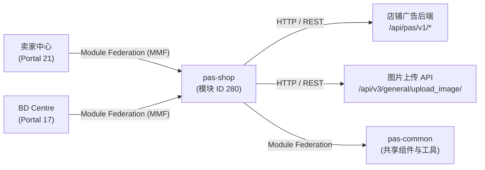

<!-- ads-workspace-gdoc-sync: gdoc_id=1vXjf2c4DyHzU_oPvMZ5C_-WCCECbppB76CsbqbbFDM4 gdoc_url=https://docs.google.com/document/d/1vXjf2c4DyHzU_oPvMZ5C_-WCCECbppB76CsbqbbFDM4/edit -->

# pas-shop — 店铺广告模块

## 目录

- [项目概述](#项目概述)
- [核心功能](#核心功能)
- [项目架构](#项目架构)
- [目录结构](#目录结构)
- [快速开始](#快速开始)
  - [前置条件](#前置条件)
  - [配置](#配置)
  - [安装](#安装)
  - [构建](#构建)
  - [本地开发](#本地开发)
  - [开发流程](#开发流程)
  - [部署](#部署)
- [API 文档](#api-文档)
- [本地存储](#本地存储)
- [TMS 埋点](#tms-埋点)
- [性能监控](#性能监控)
- [业务术语表](#业务术语表)
- [参考资料](#参考资料)
- [常见问题](#常见问题)

---

## 项目概述

`pas-shop` 是 Shopee 卖家中心（SC）和 BD Centre（BDC）的店铺广告模块。它提供了店铺广告的全生命周期管理界面，包括创建、详情查看、重启和效果报表。该模块作为 Multi-Module Framework（MMF）模块运行（ID: 280），通过 Webpack Module Federation 从 `pas-common` 消费共享类型、组件和工具函数。

---

## 核心功能

- **店铺广告创建**：完整的创建流程，支持手动和自动出价策略、每日预算配置（API 强制最低预算；重启时若当前预算低于最新 API 最低值则显示警告横幅）、时间调度、目标受众配置以及创意（标语 + 图片）自定义。
- **店铺广告详情**：全面的详情页面，可编辑出价策略、关键词（手动出价）、目标受众和广告创意。当广告活动预算低于 API 强制最低值时，预算编辑面板、eCPC 设置弹窗和 Target ROAS 编辑弹窗中均会显示最低预算警告；确认 ROAS 编辑时若需要则自动同步预算至最新最低值。包含效果图表、日期范围筛选和报表导出。
- **重启流程**：通过继承之前的配置（关键词、预算、创意）重启已结束的店铺广告，预填充创建表单。
- **目标受众管理**：创建和配置带有溢价率定向的受众群组；在 `szAdsShopTargetAudience` 开关启用时，创建页和详情页均支持。
- **效果报表**：带可选指标字段的时间序列图表；支持手动和自动出价类型的报表导出。
- **待办列表集成**：详情页通过 `detailToDoListStore` 展示预算推荐卡片，支持一键应用。
- **多平台支持**：在卖家中心和 BD Centre 运行（BDC 为只读/受限模式），自动检测用户上下文。
- **功能开关系统**：所有主要功能通过服务端开关标志控制（`enableShopAdsV2`、`szAdsAutoEnableShopAds`、`szAdsShopTargetAudience`、`szShopAdsEcpcPc` 等）。
- **引导横幅和新功能标记**：自动出价介绍、目标受众和水果游戏功能的脉冲弹窗和新功能徽章，由 `useBannerStatus` 组合式函数管理。

---

## 项目架构

`pas-shop` 是一个 MMF **模块**，类型为 `vue3`（模块 ID `280`）。它不独立运行——而是将路由注册到宿主 Portal（卖家中心或 BD Centre）。

```
宿主 Portal（卖家中心 / BD Centre）
    └── pas-shop 模块（MMF 模块 ID: 280）
            ├── pas-common（Module Federation 远程模块 — 共享工具、组件、类型）
            └── 通过 app.registerRouterModule 注册路由
                    ├── /portal/marketing/pas/shop           → 首页（router-view）
                    │       ├── detail/:id                   → 店铺广告详情页
                    │       ├── create                       → 店铺广告创建页
                    │       └── restart/:id                  → 店铺广告重启页
                    └── （所有路由前缀: /portal/marketing/pas）
```

**Module Federation**：模块从 `@mf-types/pas-common/_types/` 消费 `pas-common` 类型，并通过 `pas-common/*` 别名导入运行时代码。当设置 `LOCAL_DEV=1`（通过 `yarn dev`）时，模块从本地运行的 `pas-common` 开发服务器获取类型；否则通过 `branchName` 从指定分支获取。

**状态管理**：使用轻量级 Vue 3 `reactive()` 存储，位于 `src/_shared/store/`：
- `meta.ts` — 用户/店铺元数据和 ext 开关标志
- `toggle.ts` — 广告功能开关映射
- `constantine.ts` — 服务端常量配置（出价范围、货币、教育链接等）
- `link.ts` — 来自服务端配置的教育/文档链接
- `page-status/index.ts` — 详情页的时间范围和指标选择状态
- `detail-page-to-do-list.ts` — 详情页的广告活动级待办卡片

**API 层**：所有 HTTP 请求通过 `v1Request`（前缀 `/api/pas/v1`）和 `freeRequest`（无前缀）发送，两者均从 `pas-common/request` 通过 `createRequest` 延迟实例化。错误响应由 `commonErrorHandler` 处理，将 `ShopAdsErrorCode` 值映射为 i18n 提示消息。

### 上下游调用拓扑 / Service Topology



| 方向 | 名称 | 协议 | 描述 |
|------|------|------|------|
| 上游 | 卖家中心（Portal 21） | Module Federation (MMF) | 注册并挂载 pas-shop；提供宿主 Portal 环境 |
| 上游 | BD Centre（Portal 17） | Module Federation (MMF) | 以只读/受限模式注册 pas-shop |
| 下游 | 店铺广告后端 | HTTP / REST | 所有 `/api/pas/v1/*` 店铺广告 API 端点，通过 `v1Request` |
| 下游 | 图片上传 API | HTTP / REST | `/api/v3/general/upload_image/`，通过 `freeRequest` |
| 依赖 | pas-common | Module Federation | 共享组件、类型、工具、埋点和请求工厂（`createRequest`） |

---

## 目录结构

```
pas-shop/
├── mmc.config.js             # MMC 配置（模块 ID: 280，类型: vue3）
├── package.json              # 脚本、依赖
├── commitlint.config.js      # 提交信息规范（继承 @shopee/pas-module-config）
├── eslintrc.js               # ESLint 配置（继承 @shopee/pas-module-config/src/eslint/vue）
├── .eslintrc.json            # ESLint 入口（继承 eslintrc.js）
├── .prettierrc.js            # Prettier 配置（继承 @shopee/pas-module-config）
├── config/                   # MMC 覆盖配置
│   ├── babel.js              # Babel 配置（继承 @shopee/pas-module-config）
│   ├── browserslistrc.js     # 浏览器兼容列表（支持 es6-module）
│   └── tsconfig.js           # TypeScript 配置（继承 @shopee/pas-module-config）
├── polyfill/
│   └── _polyfill-event-bus.ts  # Vue 3 事件总线 polyfill（$on, $off, $once, $emit）
└── src/
    ├── index.ts              # 模块入口：注册路由，设置 EDS 语言
    ├── global.scss           # 全局 SCSS 变量和抖动动画
    ├── custom.d.ts           # pas-common 模块声明
    ├── jsx.d.ts              # JSX 类型声明
    ├── pages/
    │   ├── index.vue         # 根 router-view，设置埋点指令
    │   ├── create/           # 店铺广告创建和重启页面
    │   │   ├── index.vue     # 创建页面组件
    │   │   ├── constant.ts   # 表单辅助函数、校验函数、mapFormToParams
    │   │   ├── types.ts      # CreationForm、TimeLengthType、CreativeType 等
    │   │   └── components/   # 各设置卡片组件
    │   │       ├── advanced-settings/     # 高级设置（eCPC 开关）
    │   │       ├── basic-setting-card/    # 广告名称、预算、时长
    │   │       ├── bidding-strategy-card/ # 手动/自动出价选择
    │   │       ├── card-radio/            # 单选卡片选择器组件
    │   │       ├── creative-setting-card/ # 创意（标语/图片）配置
    │   │       └── target-audience-card/  # 目标受众配置
    │   └── detail/           # 店铺广告详情页
    │       ├── index.vue     # 详情页面（Composition API script setup）
    │       ├── constant.ts   # 图表指标、默认指标列表、关键词最大数量
    │       ├── utils/
    │       │   ├── index.ts          # extendCampaign、transformKeywordItem、genMassEditKeywordsParams
    │       │   ├── report.ts         # genReportSum、formatReportDelta、genTargetRoas
    │       │   └── report-render.tsx # 表格列渲染器（dataRenderer、deltaReportHandler）
    │       └── components/
    │           ├── detail-header/     # 广告活动头部，含状态和操作
    │           ├── manual-bidding/    # 关键词表格，支持出价编辑
    │           ├── auto-bidding/      # 自动出价策略展示
    │           ├── target-audience/   # 受众群组管理，含溢价率
    │           ├── ads-creative/      # 创意预览和编辑
    │           └── advanced-settings/ # eCPC 和高级配置
    ├── track/
    │   └── index.ts          # 从 pas-common 重新导出所有 TMS 埋点函数
    └── _shared/              # 跨页面共享代码
        ├── api/
        │   ├── index.ts      # 延迟加载的请求实例：v1Request、freeRequest
        │   ├── constant.ts   # BASE_PREFIX 枚举、API 端点映射、ShopAdsErrorCode、
        │   │                 # ShopAdsErrorMessageMap、commonErrorHandler
        │   ├── common/       # getConstantsConfig、getAdsToggle、triggerKeywordLog、
        │   │                 # getBudgetDataForEdit、uploadImage
        │   ├── create/       # getBiddingStrategy、getBudgetDataForCreation、
        │   │                 # checkDuplicateName、getRecommendedTargetRoi、
        │   │                 # getShopRelatedData、publishShopAds、
        │   │                 # listTargetAudienceOptions、esitmateTargetAudienceSize、
        │   │                 # getTargetAudienceGroups
        │   ├── detail/       # getShopAds、editShopAds、getManualShopAdsKeywords、
        │   │                 # listInheritedKeyword、getCampaignExpenseStatistics、
        │   │                 # massEditCampaignAdsKeywords、checkIfHaveEnoughActiveItems、
        │   │                 # editTargetAudience
        │   ├── report/       # getReportData、getAdsSummary、updateTimeConfig、
        │   │                 # getReportConfig、updateSelectedMetrics
        │   ├── banner/       # getBanner、modifyBanner
        │   └── to-do-list/   # checkCampaignListDailyBudget、massOptimiseCampaign
        ├── assets/
        │   ├── img/          # 出价/定向预览图片、标签图片（按语言）
        │   └── svg/          # 优惠券 SVG（按语言）、UI 图标（铃铛、编辑、旋转等）
        ├── components/
        │   ├── auto-creative-preview/    # 自动创意模式预览
        │   ├── customize-creative-content/ # 自定义标语/图片创意编辑器
        │   ├── detail-card/              # 通用详情区块卡片包装器
        │   ├── image-upload-cropper/     # 图片上传 + 裁剪组件（使用 cropperjs）
        │   └── manual-creative-preview/  # 手动创意模式预览
        ├── composables/
        │   ├── useBannerStatus.ts    # 横幅/徽章可见性、横幅 API 集成
        │   ├── useDuration.ts        # 日期范围状态、时间范围更新与 API 同步
        │   ├── useSelectMetrics.ts   # 指标字段选择、列生成
        │   └── useVue.ts             # Vue 实例工具（useRoute、useRouter）
        ├── constants/
        │   ├── app-config.ts         # Region 枚举、语言代码辅助
        │   ├── campaign.ts           # TargetAudienceType 枚举
        │   ├── metrics-field.ts      # getDashboardColumns、TableItem 类型
        │   ├── region.ts             # Region 类型、COUNTRY_CODE、DOMAIN_SUFFIX 映射
        │   └── time.ts              # ONE_DAY 常量、DateRangeTime、DatePickerListItem 类型
        ├── router/
        │   ├── constant.ts           # RouterMap、RouterPath、AdsSetupPage、
        │   │                         # getAdsSetupRoute、性能标记常量、
        │   │                         # generateCreatePerformanceData、
        │   │                         # generateDetailPerformanceData
        │   └── index.ts              # 路由注册、beforeEnter 钩子、
        │                             # 页面会话 ID 管理
        ├── store/
        │   ├── constantine.ts        # 服务端常量配置存储
        │   ├── detail-page-to-do-list.ts # 广告活动待办卡片存储
        │   ├── link.ts               # 教育链接存储
        │   ├── meta.ts               # 用户/店铺元数据存储
        │   ├── page-status/          # 日期范围和指标选择状态
        │   └── toggle.ts             # 广告功能开关存储
        ├── types/
        │   └── index.ts              # SummaryDate、ReportLoadStatus、SimpleObject、PlainType
        └── utils/
            ├── common.ts             # showBatchActionResult、validateTagline、validateImageUrl、
            │                         # getClickRange
            ├── constantine/          # 货币格式化、出价辅助
            │   └── index.ts          # formatValueWithSymbol、getCurrencyPrecision、
            │                         # getCpcCurrencyPrecision、getCpmCurrencyPrecision、
            │                         # getBroadMatchPriceMultiplier、getKeywordPriceinfo
            ├── metrics.ts            # getDefaultMetrics
            ├── sorter/               # 关键词表格排序工具
            │   └── index.ts          # MetricSorters、sorters（升序/降序，支持匹配类型）
            └── time.ts               # getTimeRange 辅助函数（封装 pas-common/utils）
```

---

## 快速开始

### 前置条件

- **Node.js**: >= 16.14.0（推荐 Node 20）
- **pnpm**: >= 8.0.0（用于安装 MMC）
- **yarn**: 项目脚本必需（见 `package.json`）
- **MMC（Multi-Module CLI）**: 首次使用前需全局安装

```bash
pnpm i -g @shopee/multi-module-cli
mmc setup
mmc -V   # 应显示 4 个版本：mmc-core、mmc-vue、mmc-react、mmc-vue3
```

- **npm 仓库**: 必须设置为 `https://npm.shopee.io/`
- **访问权限**: 卖家中心测试账号（使用 [Pas Helper](https://chromewebstore.google.com/detail/pas-helper/nhfhjiehemipamajmeimnnkinhncgpcd) Chrome 扩展一键登录）

### 配置

项目根目录的 `mmc.config.js` 定义了 MMC 配置：

```js
module.exports = {
  id: 280,          // Seller Portal 中的模块 ID
  type: "module",
  tech: "vue3",
  injectStyle: {
    scss: { inject: ["src/global.scss"] },
  },
  // webpack 和 rsbuild 配置来自 @shopee/pas-module-config
};
```

执行 `yarn run init` 后，MMC 会从 Portal 自动生成以下文件——**请勿手动编辑**：
- `.browserslistrc`
- `.stylelintrc.json`
- `tsconfig.json`
- `config/.remote-config.json`（测试环境的路由/参数）

### 安装

开发前运行一次。选择 Portal：卖家中心（ID `21`）或 BD Centre（ID `17`）。

```bash
# 交互式选择 Portal
yarn run init

# 或直接指定 Portal
yarn run init -p 21   # 卖家中心
yarn run init -p 17   # BD Centre
```

> **注意**: `yarn run init` 每次都会覆盖 `.browserslistrc`、`.stylelintrc.json` 和 `tsconfig.json`。

### 构建

```bash
yarn build        # 通过 mmc build 进行生产构建
```

生产构建和发布请使用 [Seller Portal](https://seller-portal.i.shopee.io/) 平台——选择模块组并点击构建。

### 本地开发

安装完成后，启动开发服务器：

```bash
yarn dev          # 启动 mmc dev（LOCAL_DEV=1）+ vue-tsc 类型检查监听
yarn dev:remote   # 使用 master 分支远程 pas-common 类型（LOCAL_DEV=1 branchName='master'）
yarn dev -b <branch-name>  # 从指定分支加载 pas-common 类型
```

> **注意**: `yarn dev` 设置 `LOCAL_DEV=1`，意味着需要本地运行的 `pas-common` 开发服务器。如果 pas-common 服务器未运行，你会看到：
> ```
> <e> [FederatedTypesPlugin] Unable to download 'pas-common' remote types index file: connect ECONNREFUSED 127.0.0.1:8001
> ```
> 使用 `yarn dev:remote` 可避免此要求。

### 开发流程

启动开发服务器后，将其连接到卖家中心测试环境：

1. 打开卖家中心测试页面（例如 `https://seller.test.shopee.sg`）。
2. 通过 [Pas Helper](https://confluence.shopee.io/pages/viewpage.action?pageId=1776244098) Chrome 扩展登录。
3. 打开浏览器 DevTools 并运行 `mmfDevtools.enable()`（或使用页面上的 MMF DevTools UI 图标）。
4. 刷新页面——它将连接到你的本地开发服务器，控制台会显示 `[MMF_DEVTOOLS]` 和 `[HMR] connected`。

BD Centre（BDC）开发：
1. 前往[店铺列表页](https://bd-centre.test.shopee.com/ads-crm/shop?type=all)，通过 ID 查找店铺。
2. 进入店铺详情并选择一个店铺广告。

修改本地开发的路由/参数，编辑 `config/.remote-config.json`（此文件在下次 `yarn run init` 时会被重置）。

**配合 pas-common 开发**: 如需本地修改 `pas-common`，运行其开发服务器并使用 `yarn dev`。详见 [pas-common 仓库](https://git.garena.com/shopee/isfe/ao/pas-common)。另见：[多远程模块类型集成指南](https://confluence.shopee.io/display/SPAD/%5BPaid+Ads+-+WebFE%5D+Shared+Module+-+Guide+to+Integrating+Multi-Remote+Module+Types+into+New+Projects)。

**其他常用命令**：

```bash
yarn dev:webstorm    # 使用 WebStorm 作为编辑器启动开发服务器
yarn start           # 初始化卖家中心（portal 21）+ yarn dev:remote
yarn inspect         # 检查 webpack 配置
yarn lint            # 运行 ESLint + Stylelint
yarn lint:es:fix     # 自动修复 ESLint 问题
yarn lint:style:fix  # 自动修复 Stylelint 问题
yarn type:check      # 运行 vue-tsc 类型检查
yarn prettier        # 使用 Prettier 格式化 src/
```

### 部署

生产部署通过 [Seller Portal](https://seller-portal.i.shopee.io/) 平台管理：

1. 导航到 `pas-shop` 的模块组。
2. 填写构建信息表单并点击**构建**。
3. 构建成功后，在构建记录表中点击**发布**。
4. 在发布表单中选择目标 Portal、PFB 和地区，然后点击**发布**。
5. 通过**详情**链接监控发布进度和查看 Space 任务日志。

紧急发布时，在发布表单中指定自定义发布令牌。

要下线模块，在构建前开启**离线模式**，然后发布该构建。

CI/CD 流水线阶段（定义在 `.gitlab-ci.yml`）：

| 阶段 | 任务 | 触发条件 |
|------|------|---------|
| `lint` | `lint` | 合并请求 — 运行 `yarn lint` |
| `parallel_jobs` | `ai-code-review` | 合并请求 — 基于 Cursor 的 AI 代码审查 |
| `e2e_tests` | `e2e_tests` | MR 到 master/release（源分支不能是 master/release）— 触发 `pas-e2e-tests`，标签 `@pas-shop` |
| `auto_deploy` | `auto_deploy_test` | 合并提交推送到 master/release（排除 release→master 合并）— 部署到测试环境（`pfb-ads-platform-e2e`） |
| `auto_deploy` | `auto_deploy_uat` | 推送到 master — 部署到 UAT 环境 |
| `auto_deploy_e2e` | `auto_deploy_e2e_tests` | `auto_deploy_test` 完成后（master/release 合并提交）— 触发 E2E 测试 |
| `release_verify` | `release_verify` | 合并请求 — 通过 deploy-platform API 验证发布 |

```bash
yarn deploy      # master 分支自动发布
yarn deploy:ci   # CI 触发发布
```

---

## API 文档

所有 API 调用通过 `src/_shared/api/index.ts` 中的中心请求层发送。请求实例从 `pas-common/request` 通过 `createRequest` 延迟加载。主要基础 URL 前缀为 `/api/pas/v1`。

### 请求工具

| 导出 | 描述 |
|------|------|
| `v1Request` | 带 `/api/pas/v1` 前缀的标准请求 |
| `freeRequest` | 无路径前缀的请求（用于图片上传） |

两者均支持 `v1Request<ReqType, ResType>(endpoint, { params, skipError, needRes, withSecureFetchParams })` 的完整 TypeScript 泛型。

传入 `withSecureFetchParams: true` 时自动注入安全参数。

### API 端点

| 页面 | 页面 URL | API 端点 | 描述 |
|------|----------|---------|------|
| 通用 | — | `/meta/get_ads_data/` | 获取广告开关和广告账户信息 |
| 通用 | — | `/meta/get_non_ads_data/` | 获取用户店铺信息和 ext 开关 |
| 通用 | — | `/config/get/` | 加载出价范围、货币、链接、广告配置、教育链接 |
| 报表 | 详情页 | `/report/get/` | 获取聚合效果指标 |
| 报表 | 详情页 | `/report/get_config/` | 加载缓存的时间范围和已选指标 |
| 报表 | 详情页 | `/report/get_time_graph/` | 获取指标图表的时间序列数据 |
| 报表 | 详情页 | `/report/update_selected_metric_config/` | 保存已选指标字段到服务端缓存 |
| 报表 | 详情页 | `/report/update_time_config/` | 保存已选时间范围到服务端缓存 |
| 通用 | — | `/banner/get/` | 检查引导横幅/徽章的显示状态 |
| 通用 | — | `/banner/modify/` | 记录横幅查看/关闭操作 |
| 创建 | `/portal/marketing/pas/shop/create` | `/shop/check_duplicate_name/` | 验证广告名称唯一性 |
| 创建 | `/portal/marketing/pas/shop/create` | `/shop/get_bidding_strategy_eligibility/` | 返回自动/手动出价资格 |
| 创建 | `/portal/marketing/pas/shop/create` | `/shop/get_budget_data_for_creation/` | 返回推荐每日预算和预算日志键 |
| 创建 | `/portal/marketing/pas/shop/create` | `/shop/get_preview_data/` | 获取店铺预览数据（评分、商品等） |
| 创建 | `/portal/marketing/pas/shop/create` | `/shop/publish/` | 创建或重启店铺广告 |
| 详情 | `/portal/marketing/pas/shop/detail/:id` | `/shop/check_has_enough_active_item/` | 检查店铺是否有足够的活跃商品 |
| 详情 | `/portal/marketing/pas/shop/detail/:id` | `/shop/edit/` | 更新广告活动设置（预算、状态、创意等） |
| 详情 | `/portal/marketing/pas/shop/detail/:id` | `/shop/get/` | 获取完整的店铺广告活动数据 |
| 详情 | `/portal/marketing/pas/shop/detail/:id` | `/shop/manual/list_keyword_with_recommended_price/` | 列出关键词及推荐出价 |
| 详情 | `/portal/marketing/pas/shop/detail/:id` | `/shop/manual/mass_edit_keyword/` | 批量编辑关键词出价 |
| 通用 | — | `/setup_helper/get_budget_data_for_edit/` | 返回现有广告活动的预算编辑数据 |
| 通用 | — | `/setup_helper/get_campaign_expense_statistics/` | 返回今日/7天均值/最大花费统计 |
| 通用 | — | `/setup_helper/get_recommended_target_roi/` | 返回自动出价的推荐目标 ROI |
| 详情 | `/portal/marketing/pas/shop/detail/:id` | `/setup_helper/list_inherited_keyword/` | 列出重启时继承的关键词 |
| 通用 | — | `/setup_helper/trigger_keyword_log/` | 记录关键词交互日志 |
| 创建/详情 | — | `/target_audience/edit/` | 创建/更新/编辑目标受众群组 |
| 创建 | `/portal/marketing/pas/shop/create` | `/target_audience/get_group_estimated_result/` | 估算受众规模和溢价率范围 |
| 创建/详情 | — | `/target_audience/list_available_option/` | 列出可用的目标受众细分选项 |
| 创建/详情 | — | `/target_audience/list_for_single_campaign/` | 获取广告活动的现有受众群组 |
| 详情 | `/portal/marketing/pas/shop/detail/:id` | `/todo/daily_budget/check_campaign_list/` | 获取预算推荐待办项 |
| 详情 | `/portal/marketing/pas/shop/detail/:id` | `/todo/daily_budget/mass_optimize_campaign/` | 应用推荐的预算优化 |
| 通用 | — | `/api/v3/general/upload_image/` | 上传创意图片（使用 `freeRequest`，无前缀） |

### 错误码

定义在 `ShopAdsErrorCode` 枚举（`src/_shared/api/constant.ts`）：

| 错误码 | 枚举键 | 描述 |
|--------|--------|------|
| 1 | `systemError` | 系统错误 |
| 6 | `notWhitelisted` | 未加白名单 |
| 10 | `duplicateCampaign` | 重复广告活动 |
| 80 | `userStatusNotNormal` | 用户状态异常 |
| 81 | `shopStatusNotNormal` | 店铺状态异常 |
| 82 | `shopInHoliday` | 店铺处于假期模式 |
| 83 | `editIsNotAllowed` | 不允许编辑 |
| 84 | `actionNotAllowed` | 操作不允许 |
| 85 | `invalidAccount` | 无效广告账户 |
| 89 | `canNotDelete` | 无法删除 |
| 90 | `notEnougthActiveItems` | 活跃商品不足 |
| 91 | `invalidCurrentStatus` | 当前状态无效 |

### 数字转换

后端数字膨胀 ×100,000 以避免浮点精度问题。始终使用：
- `convertServerNumber(value)` — 用于 API 响应（缩小 ÷100,000）
- `convertClientNumber(value)` — 用于 API 请求（膨胀 ×100,000）

两者均从 `pas-common/utils` 导入。

---

## 本地存储

| 键名 | 描述 |
|------|------|
| `SELLER_CENTER_SHOPEE_ADS_PAGE_SESSION_ID` | 每次页面导航时生成的 UUID。用于在埋点系统中关联单次页面访问内的用户操作。路由路径变化或页面刷新时重新生成。 |

---

## TMS 埋点

埋点函数从 `src/track/index.ts` 重新导出，完全委托给 `pas-common` 的埋点入口：

```ts
export * from "pas-common/tracking/entries/sellerCenterCreateShopAds";
export * from "pas-common/tracking/entries/sellerCenterShopAdDetail";
export * from "pas-common/tracking/entries/sellerCenterRestartShopAd";
export * from "pas-common/tracking/entries/shopAdsDetail";
export * from "pas-common/tracking/entries/createShopAds";
```

### 主要埋点事件

| 函数 | 触发时机 |
|------|---------|
| `reportViewOfSCCreateShopAds` | 创建页面挂载 |
| `reportViewOfSCRestartShopAd` | 重启页面挂载 |
| `reportClickOfCreateShopAdsBottomActionShopAdsPublish` | 点击发布按钮 |
| `reportClickOfCreateShopAdsBottomActionShopAdsCancel` | 点击取消按钮 |
| `reportClickOfCreateShopAdsBidArticle` | 点击出价策略了解更多链接 |
| `reportClickOfCreateShopAdsBasicStgArticle` | 点击基础设置了解更多链接 |
| `reportClickOfCreateShopAdsCreativeStgAdCreativeCustomTagline` | 发布时编辑标语 |
| `reportClickOfCreateShopAdsExitPopShopAdsExit` / `...Stay` | 退出确认弹窗操作 |
| `reportImpOfCreateShopAdsBottomActionBottomAction` | 底部操作栏曝光 |
| `reportClickOfShopAdsDtlOverviewExportData` | 点击导出报表按钮 |
| `timeSelectorImpression` | 日期范围选择器打开 |

埋点指令（`v-track-impression`、`v-track-click`）在 `src/pages/index.vue` 中通过 `pas-common/tracking` 的 `useTrackingDirective()` 设置。

---

## 性能监控

模块使用 Performance API 测量每个页面的渲染时间。性能标记定义在 `src/_shared/router/constant.ts`。

### 性能标记

| 常量 | 值 |
|------|-----|
| `PERFORMANCE_MARK_INDEX_ENTER` | `pas_shop_ads_index_enter` |
| `PERFORMANCE_MARK_CREATE_ENTER` | `pas_shop_ads_create_enter` |
| `PERFORMANCE_MARK_DETAIL_ENTER` | `pas_shop_ads_detail_enter` |
| `PERFORMANCE_MARK_CREATE_MOUNTED` | `pas_shop_ads_create_mounted` |
| `PERFORMANCE_MARK_DETAIL_MOUNTED` | `pas_shop_ads_detail_mounted` |

### 测量指标

`generateCreatePerformanceData()` 和 `generateDetailPerformanceData()` 在页面挂载时计算三个指标：

| 指标 | 描述 |
|------|------|
| `moduleToEnter` | 从模块首页进入到页面路由进入的时间 |
| `enterToMounted` | 从页面路由进入到组件挂载的时间 |
| `moduleToMounted` | 从模块首页进入到组件挂载的时间（总计） |

这些值作为属性报告在页面查看埋点事件（`reportViewOfSCCreateShopAds`、`reportViewOfSCRestartShopAd` 和详情页查看事件）中，用于性能分析。

---

## 业务术语表

本项目和 Shopee 广告平台中使用的关键术语：

| 术语 | 定义 |
|------|------|
| **店铺广告（Shop Ads）** | 推广整个店铺（而非单个商品）的广告。卖家配置出价、预算、目标受众和创意（标语 + 图片）。 |
| **手动出价（Manual Bidding）** | 卖家为店铺广告的每个关键词设置出价的策略。 |
| **自动出价（Auto Bidding）** | 系统根据目标 ROI 自动管理出价以最大化效果的策略。 |
| **eCPC（增强型 CPC）** | 动态调整手动出价的优化功能。由 `szShopAdsEcpcPc` 开关控制。 |
| **ROAS / ROI** | 广告支出回报率 / 投资回报率：广告 GMV ÷ 广告收入（同一指标）。 |
| **CIR** | 成本收入比：广告收入 ÷ 广告 GMV。ROI 的倒数。 |
| **目标广泛 ROI（Target Broad ROI）** | 自动出价在广泛匹配流量上的目标投资回报率。 |
| **目标受众（Target Audience）** | 允许卖家以溢价率出价倍数定向特定买家群体的功能。 |
| **溢价率（Premium Rate）** | 应用于受众群组定向的出价倍数（例如 1.2× 基础出价）。 |
| **CTR** | 点击率：点击数 ÷ 展示数。 |
| **CR** | 转化率：订单数 ÷ 点击数。 |
| **广泛 GMV / 直接 GMV** | 来自广泛（7天归因窗口）与直接（同一会话）转化的 GMV。 |
| **冷启动阶段（Cold Start Phase）** | 广告活动创建后系统数据不足以进行准确预测的时期。在自动出价详情页显示为横幅（特征：`roas_cold_start`）。 |
| **预算日志键（Budget Log Key）** | 服务端生成的用于追踪预算推荐来源的键；包含在 `publishShopAds` 请求中。 |
| **待办列表（To-Do List）** | 通过 `detailToDoListStore` 在详情页展示的主动预算优化推荐。 |
| **引导横幅（On-boarding Banner）** | 向未关闭的用户展示的新功能脉冲弹窗或徽章（通过 `getBanner`/`modifyBanner` 追踪）。 |
| **Constantine** | 客户端响应式存储，保存服务端获取的常量（出价范围、货币精度、教育链接）。 |
| **开关 / Ext 开关（Toggle / Ext Toggle）** | 服务端功能标志（`adsToggle`、`extToggle`），按卖家/地区控制功能可用性。 |
| **SC / 卖家中心** | Shopee 的卖家管理门户，广告创建和管理在此进行。 |
| **BDC / BD Centre** | 内部业务发展门户（CRM 工具）。以只读模式显示店铺广告详情页。 |
| **MMF / MMC** | Multi-Module Framework / Multi-Module CLI — 本项目使用的微前端架构。 |
| **pas-common** | 共享 Module Federation 提供者，为所有付费广告模块提供类型、工具和组件。 |
| **QSS** | QuickStart Service — 帮助新广告主快速采用广告的入门计划。 |
| **SAS** | Shopee Ads Services — 驱动广告平台的后端服务。 |
| **CPC** | 每次点击成本 — 广告每次点击的花费金额。 |
| **CPM** | 每千次展示成本 — 广告主每 1,000 次展示的成本。 |
| **ECPM** | 有效每千次展示成本 — 总广告花费 ÷ 总展示数。 |

---

## 参考资料

- [MMC 入门指南](https://seller-portal.i.test.shopee.io/mmc-docs/guide/getting-started.html)
- [MMC 开发指南](https://seller-portal.i.test.shopee.io/mmc-docs/guide/basic/development.html)
- [MMC 初始化指南](https://seller-portal.i.test.shopee.io/mmc-docs/guide/basic/initialization.html)
- [Seller Portal 构建与发布](https://seller-portal.i.test.shopee.io/docs/pages/seller-portal/build-and-release.html)
- [pas-common 仓库](https://git.garena.com/shopee/isfe/ao/pas-common)
- [多远程模块类型集成指南](https://confluence.shopee.io/display/SPAD/%5BPaid+Ads+-+WebFE%5D+Shared+Module+-+Guide+to+Integrating+Multi-Remote+Module+Types+into+New+Projects)
- [Paid Ads 术语表](https://confluence.shopee.io/pages/viewpage.action?spaceKey=SPAD&title=Paid+Ads+Glossary)
- [Pas Helper Chrome 扩展](https://confluence.shopee.io/pages/viewpage.action?pageId=1776244098)
- [MMF DevTools](https://seller-portal.i.test.shopee.io/docs/pages/devtoolkit/core/mmf-devtools.html#connect)
- [BD Centre 店铺列表（测试）](https://bd-centre.test.shopee.com/ads-crm/shop?type=all)

---

## 常见问题

**1. 运行 `yarn dev` 后看到 `ECONNREFUSED 127.0.0.1:8001` — 怎么回事？**

`yarn dev` 设置了 `LOCAL_DEV=1`，需要本地运行的 `pas-common` 开发服务器（端口 8001）。如果不需要修改 `pas-common`，使用 `yarn dev:remote` 从 master 分支加载类型，无需本地服务器。

**2. 为什么 `yarn run init` 会覆盖我的 `tsconfig.json` 和 `.browserslistrc`？**

MMC 从 Seller Portal 拉取所选 Portal ID 的权威配置，每次 init 都会覆盖这些文件。要自定义它们，使用 MMC 的配置扩展机制（见 [MMC 配置文档](https://seller-portal.i.test.shopee.io/mmc-docs/config/introduction.html)）。本项目的 `config/` 目录已包含 babel、tsconfig 和 browserslistrc 的 MMC 配置覆盖。

**3. 如何在卖家中心和 BD Centre 之间切换本地开发？**

运行 `yarn run init -p 21` 切换到卖家中心，或 `yarn run init -p 17` 切换到 BD Centre。这会更新 `config/.remote-config.json` 中的正确 Portal 路由和参数。

**4. 如何将本地开发服务器连接到测试环境？**

执行 `yarn dev` 后，打开 Portal 测试 URL，打开 DevTools 并运行 `mmfDevtools.enable()`。刷新页面。控制台应显示 `[MMF_DEVTOOLS]` 和 `[HMR] connected`，确认连接成功。

**5. 控制店铺广告功能的开关有哪些？**

关键开关（通过 `getAdsToggle()` 获取并存储在 `toggleConfig` 中）：
- `enableShopAdsV2` — 启用卖家的店铺广告访问权限
- `szAdsAutoEnableShopAds` — 允许自动启用店铺广告
- `szAdsShopTargetAudience` — 在创建/详情页显示目标受众卡片
- `szShopAdsEcpcPc` — 启用手动出价的 eCPC 模式
- `szGmvDefinitionUpgrade` — 升级报表表格中的 GMV 指标提示

**6. 数字如何在前后端之间传输？**

所有金额/百分比值由后端膨胀 ×100,000。API 响应使用 `convertServerNumber(value)`，API 请求使用 `convertClientNumber(value)`。两者均从 `pas-common/utils` 导入。

**7. Constantine 是什么？数据从哪来？**

`Constantine` 是 `src/_shared/store/constantine.ts` 中的响应式存储。由 `getConstantsConfig()`（在首页路由的 `beforeEnter` 钩子中调用）填充服务端获取的常量，包括出价范围、货币配置、教育链接和店铺广告配置。

**8. 如何为此模块添加新路由？**

1. 在 `src/_shared/router/constant.ts` 中将路由路径添加到 `RouterPath`，并在 `RouterMap` 中添加新值。
2. 在 `src/_shared/router/index.ts` 的 `app.registerRouterModule(...)` 中注册路由。
3. 在 `src/pages/` 下创建页面组件。

**9. 如何在 BD Centre 而非卖家中心运行此模块？**

运行 `yarn run init -p 17` 以 BD Centre Portal 初始化。模块在运行时自动检测 `app?.bdUser?.id`，有条件地渲染 BDC 特定 UI（例如在详情页显示 `BreadCrumb` 而非 `BackHome`，限制编辑操作）。引导横幅在 BDC 模式下也会被屏蔽。

**10. 店铺广告的生产构建和发布如何进行？**

使用 [Seller Portal](https://seller-portal.i.shopee.io/) UI：选择 `pas-shop` 模块组，填写构建表单，点击**构建**。构建成功后，点击**发布**，选择目标地区和 Portal，确认即可。通过发布任务日志链接监控进度。合并到 master 后，CI 会自动部署到测试和 UAT 环境。

<!-- Generated by ads-workspace/skills/ads-readme-generate | checked: e7e4d222b28da8c191d41bce2186e533e0d08155 | spec: 76fce5f679f9550b -->
