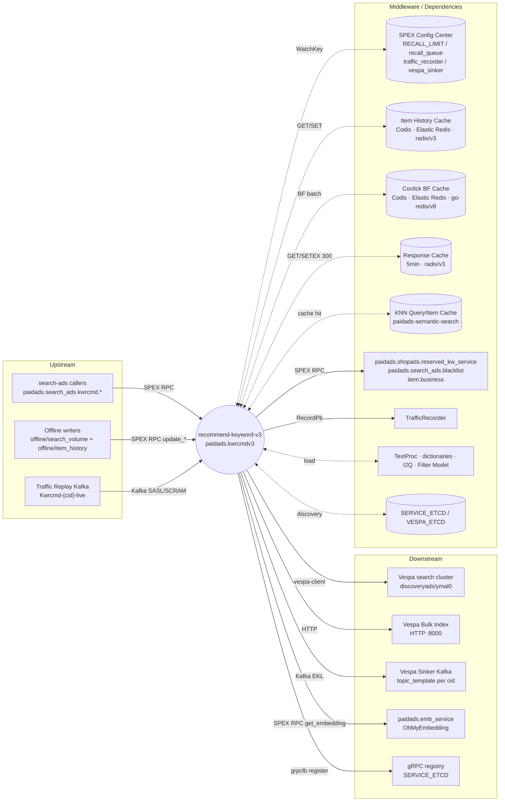

<!-- ads-workspace-gdoc-sync: gdoc_id=1uJ-2uSDcWAaXbAWP3AWIixxFQwwtZazhD96ZqzW9E_Y gdoc_url=https://docs.google.com/document/d/1uJ-2uSDcWAaXbAWP3AWIixxFQwwtZazhD96ZqzW9E_Y/edit -->

<!-- Generated by sra-toolkit/skills/ads-readme-generate -->

# Recommend Keyword V3 / 关键词推荐服务 V3

> Search Ads keyword recommendation service (`kwrcmdv3`). Given `(shop_id, item_id, country, manualKw)`,
> it recalls and ranks keyword candidates for **search ad keyword suggestion** and **item ↔ keyword relevance**.
>
> Repository: <https://git.garena.com/truongphu.dong/recommend-keyword-v3>

---

## Table of Contents / 目录

- [Introduction / 项目概述](#introduction--项目概述)
- [Features / 核心功能](#features--核心功能)
- [Architecture / 项目架构](#architecture--项目架构)
  - [System Context / 系统上下文](#system-context--系统上下文)
  - [Service Topology / 上下游调用拓扑](#service-topology--上下游调用拓扑)
  - [Online and Offline Pipelines / 在线 / 离线双链路](#online-and-offline-pipelines--在线--离线双链路)
- [Directory Structure / 目录结构](#directory-structure--目录结构)
- [SPEX APIs and Processing Flows / SPEX API 与处理流程](#spex-apis-and-processing-flows--spex-api-与处理流程)
  - [Command Overview / SPEX 命令一览](#command-overview--spex-命令一览)
  - [GetKW Recall and Ranking / GetKW 召回与排序流程](#getkw-recall-and-ranking--getkw-召回与排序流程)
  - [UpdateItemHistory / UpdateKWCoclick / UpdateSearchVolume](#updateitemhistory--updatekwcoclick--updatesearchvolume-写入流程)
  - [Traffic Replay Pipeline / Traffic Replay 流程](#traffic-replay-pipeline--traffic-replay-流程)
- [Recall Queues / 召回队列](#recall-queues--召回队列)
- [Embedding Computation and OhMyEmb Migration / Embedding 计算与 OhMyEmb 迁移](#embedding-computation-and-ohmyemb-migration--embedding-计算与-ohmyemb-迁移)
- [Middleware and Data Stores / 中间件与数据存储](#middleware-and-data-stores--中间件与数据存储)
- [Configuration / 配置说明](#configuration--配置说明)
- [Development Guidelines / 开发规范](#development-guidelines--开发规范)
- [Deployment / 部署](#deployment--部署)
- [Monitoring / 监控](#monitoring--监控)
- [Business Terminology Glossary / 业务术语表](#business-terminology-glossary--业务术语表)
- [Additional Resources / 参考资料](#additional-resources--参考资料)
- [Frequently Asked Questions / 常见问题](#frequently-asked-questions--常见问题)

---

## Introduction / 项目概述

`recommend-keyword-v3` (online service `paidads.kwrcmdv3`, deploy module `kwrcmdv3`) is the keyword
recommendation service in Shopee Search Ads. Given `(shop_id, item_id, country)` plus optional
`manualKw / Algorithm / Version`, it returns keyword candidates with `Similarity`, `Volume`, ranking
`Score` and source label `From`, used by:

- Search ads keyword suggestion: map an item to a list of high-relevance, high-volume keyword candidates
- Item ↔ keyword relevance scoring (`get_relevance`): reuse the embedding/similarity stack to expose a relevance API

The service exposes a **SPEX** interface under `paidads.search_ads.kwrcmd.`, and is also registered to
`SERVICE_ETCD` as a gRPC server through `git.garena.com/shopee/deep/grpclb/register`. Specific
`cid@idc` pairs in `KWRcmdConfig.NoGrpcCond` (e.g. `br@us3` in `live`, `sg@sg10` in `liveish`) are
forced to SPEX-only.

The service is in the middle of an **embedding migration**: replacing local TensorFlow-based DSSM
inference with a unified remote inference platform — OhMyEmbedding (SPEX command
`paidads.emb_service.get_embedding`). The migration uses a three-layer strategy:

1. `ShadowDiffHelper` — primary path stays on local DSSM, OhMyEmb is fired asynchronously and the two
   embeddings are compared (cosine similarity histogram)
2. `DynamicSwitchHelper` — flip the online primary path to OhMyEmb via the SPEX flag
   `UseOhMyEmbForOnline`, allowing canary rollout / instant rollback
3. Vespa dual-write (`embedding` / `embeddingv6`) — `WriteOhMyEmbField` enables the dual write at the
   offline path; `OhMyEmbModelVersion` selects which Vespa `ItemModel` row corresponds to OhMyEmb

Background and detailed design: [kwrcmdv3 Embedding migration TD](https://docs.google.com/document/d/1Klx7IIT-2GZPoqEdIPMK8cwP6GevSt3fnzBtMcxO_rQ/edit?tab=t.0) (final behavior follows the code).

---

## Features / 核心功能

| Feature | Entry SPEX command | Description |
|---|---|---|
| Keyword recommendation | `paidads.search_ads.kwrcmd.get_kw` | item → keyword; multi-source recall + blacklist/coclick/Filter Model + ranking + 5-min response cache |
| Shopads keyword recommendation | `paidads.search_ads.kwrcmd.get_shopads_kw` | Shopads-flavored recommendation with reserved/blacklist flags |
| Keyword relevance | `paidads.search_ads.kwrcmd.get_relevance` | score `(item, [keywords])` reusing the embedding/similarity stack |
| Item history write | `paidads.search_ads.kwrcmd.update_item_history` | persist item-level historical clicked keywords to the Item History Redis |
| Search volume / Vespa write | `paidads.search_ads.kwrcmd.update_search_volume` | compute keyword embedding, build `sinker.Event`, send to Vespa Sinker Kafka, dual-write `embeddingv6` when configured |
| Coclick BF write | `paidads.search_ads.kwrcmd.update_kw_coclick` | maintain keyword↔keyword Bloom Filter for online coclick filtering |
| Multi-source recall | (internal) | KNN (3 variants), Item History, Manual, Token Weight, I2Q, Filter Model |
| Embedding abstraction | `pkg/dssm/Helper` | 4 implementations: local DSSM, OhMyEmb, `DynamicSwitchHelper`, `ShadowDiffHelper` |
| Traffic Replay | `env=liveish` only | consume `Kwrcmd-{cid}-live` Kafka topic and replay `KWReq` against local `GetKW` with QPS limit |
| Hot reload | SPEX Config Center | `RECALL_LIMIT` / `recall_queue` / `traffic_recorder` / `vespa_sinker` all watched |

---

## Architecture / 项目架构

### System Context / 系统上下文

`recommend-keyword-v3` sits at the intersection of two pipelines:

- **Online (Read Path)**: search-ads callers send SPEX requests `get_kw / get_shopads_kw / get_relevance`.
  The service orchestrates recall (Vespa KNN, Redis, I2Q, Token Weight) and embedding (local DSSM or
  OhMyEmb), then returns a ranked keyword list.
- **Offline (Write Path)**: `offline/search_volume` (Scala/Spark) and `offline/item_history`
  (Go: `InsertHistory.go` / `InsertCoclick.go`) call the `update_*` SPEX commands to push
  search volume, click history and coclick Bloom Filter into Redis / Vespa Sinker Kafka.

### Service Topology / 上下游调用拓扑



#### Upstream

| Name | Protocol | Purpose |
|---|---|---|
| search-ads callers (`paidads.search_ads.kwrcmd.*`) | SPEX RPC | Search ads stack calls `get_kw` / `get_shopads_kw` / `get_relevance` to fetch item-level keyword recommendation and relevance |
| Offline writers | SPEX RPC | `offline/item_history` (Go: `InsertHistory.go` / `InsertCoclick.go`) and `offline/search_volume` (Scala/Spark) call `update_item_history` / `update_search_volume` / `update_kw_coclick` |
| Traffic Replay Kafka (`Kwrcmd-{cid}-live`) | Kafka (sarama, SASL/SCRAM-SHA-512) | Enabled only in `env=liveish`; consumes from brokers in `GlobalTrafficReplayKafkaConfig`, decodes `KWReq` and replays against local `GetKW` with `LimitConfig.TrafficReplay.QPS` |

#### Downstream

| Name | Protocol | Purpose |
|---|---|---|
| Vespa search cluster (`discoveryads/ymal0`) | vespa-client (gRPC over etcd discovery) | KNN/similarity queries on `keyword_rcmd_<cid>0` (`pkg/kwrcmd-service/service.go::NewSearchClientByDiscovery`) |
| Vespa Bulk Index | HTTP | `VESPA_BULK_INDEX` ymal cluster `:8000` endpoints, used by update commands to write documents |
| Vespa Sinker Kafka | Kafka (EKL, SASL) | `pkg/kwrcmd-service/vespa_sinker.go` `enhanced-kafka-lib` Producer; `UpdateSearchVolume` ships documents (with `embedding` / `embeddingv6`) to `topic_template.replace("{cid}", lower)` |
| `paidads.emb_service.get_embedding` (OhMyEmbedding) | SPEX RPC | `pkg/dssm/client.go` `sps.RPCRequest` with `DagName=online_query_user`, `RequiredOutput=keyword_rcmd@embedding<version>`; the migration target for online query/item embedding |
| gRPC registry (`SERVICE_ETCD`) | etcd (grpclb register) | Registered at `/paidads/sd/adskwrcmd/rpcserver/v3/<env>`; gRPC traffic governed by `NoGrpcCond` |

#### Middleware Dependencies

| Name | Type | Purpose |
|---|---|---|
| SPEX Config Center | config | `sps.SubscribeConfig` for `RECALL_LIMIT` (`LimitConfig`: `FinalLimit`, KNN slots/limits, `MeanNorm/StdNorm`, `KNNCacheEnable`, `WriteOhMyEmbField`, `UseOhMyEmbForOnline`, `OhMyEmbModelVersion`, `TrafficReplay*`), `recall_queue` (`RecallQueueConfig`), `traffic_recorder`, `vespa_sinker`. All are hot-reloaded via `WatchKey` |
| paidads-semantic-search (local DSSM inference) | library | `git.garena.com/shopee/deep/paidads-semantic-search` provides query/item caches, feature client and `knn.ModelMap`. `pkg/dssm/manager.go` uses `LoadModel` with `knn_config.yaml` |
| TensorFlow C libs (`libtensorflow`, `libfasttextgo`) | library | `Makefile prepare` installs `libtensorflow-cpu-linux-x86_64-2.6.5` and `libfasttextgo.so` to `/usr/local/lib/`, required by cgo for local DSSM |
| Item History Cache (Codis/Elastic Redis, radix/v3) | datastore | `item-history-cache`; per-item history clicked keyword list (`MakeItemHistoryKey(itemid)`, TTL=7×24h); also stores `MakeVolumeKey(country, keyword)` |
| Coclick Bloom Filter Cache (Codis/Elastic Redis, go-redis/v8) | datastore | `coclick-bf-cache`; Bloom Filter on top of Redis via `go-bf`; active BF pointer stored at `kwrcmdv3_coclick_active_key#<cid>`, TTL=14d |
| Response Cache (Codis/Elastic Redis, radix/v3) | cache | `resp-cache`; `GetKW` keys on `(shopId, itemId, manualKw, itemNameHash, version)` with `SET … EX 300` |
| KNN Query / Item Cache (paidads-semantic-search built-in) | cache | querycache/itemcache for query/item embedding by `(country, version, keyword/itemid)`; DSSM and OhMyEmb share one `KNNSharedClients` instance to avoid Prometheus collector double-registration |
| `paidads.shopads.reserved_kw_service` / `paidads.search_ads.blacklist` / `item.business` | service | SPEX dependencies declared in `sp-workspace.yml`; used for reserved/blacklist judgement and product info |
| TrafficRecorder | service | `git.garena.com/shopee/deep/searchads/traffic_recorder/recorder.InitTrafficRecorderV2`; records `KWReq` per cid for offline replay |
| TextProc / multilingual dictionaries | library | `aproc.NewTextProc(mtext.xml)`, `s2t_mapping.txt`, per-cid `query_table.tsv`, `token_weight` files |
| I2Q model (`i2q_model_config.yaml`) | library | `pkg/i2q_model` loads locally; powers `FromI2Q` recall |
| Filter model (`filter_model_config.yaml`) | library | `pkg/filter_model` loads locally; threshold filtering |
| `SERVICE_ETCD` / `VESPA_ETCD` | metadata | `SERVICE_ETCD` for gRPC registry; `VESPA_ETCD` for vespa-client discovery (`/paidads/vespa/discoveryads/ymal0/qrs`) |

### Online and Offline Pipelines / 在线 / 离线双链路

- **Online (`GetKW`)**: check `resp-cache` → concurrently recall (KNN / History / Manual /
  Token Weight / I2Q) → DSSM/OhMyEmb embedding → similarity + `GetRankScore` ranking → blacklist /
  coclick / Filter Model filtering → write back to `resp-cache` (TTL 5 min) → return.
- **Offline (`Update*`)**: `update_search_volume` computes embeddings for every version in
  `DssmModelVersions[country]` (optionally OhMyEmb dual-write) → builds `sinker.Event` and ships to
  Vespa Sinker Kafka (only `env=live` actually sends); `update_item_history` writes click history;
  `update_kw_coclick` maintains the Bloom Filter.

---

## Directory Structure / 目录结构

```
recommend-keyword-v3/
├── service/
│   ├── kwrcmd/             # main.go + run.go (StartService orchestration)
│   └── http_handler/       # /metrics, /debug/pprof
├── pkg/
│   ├── kwrcmd-service/     # core business: SPEX/gRPC handlers, recall, filter, ranking
│   │   ├── service.go      # kwrcmdService root; helper / client / cache assembly
│   │   ├── kwrcmd.go       # GetKW + recallKeywords
│   │   ├── updater.go      # UpdateItemHistory / UpdateKWCoclick / UpdateSearchVolume
│   │   ├── spex_service.go # 6 SPEX commands registration
│   │   ├── blacklist_filter.go / coclick_filter.go / filter_model.go
│   │   ├── vespa_sinker.go # Kafka Producer (EKL)
│   │   ├── traffic_replay.go
│   │   ├── exporter.go     # Prometheus metrics
│   │   ├── consts.go / types.go / util.go / item_info.go / traffic_ctx.go
│   │   └── ...
│   ├── dssm/               # Embedding abstraction
│   │   ├── manager.go              # local DSSM Helper
│   │   ├── ohmyemb_manager.go      # OhMyEmb Helper
│   │   ├── dynamic_switch_helper.go# switching
│   │   ├── shadow_diff_helper.go   # shadow diffing
│   │   ├── client.go               # paidads.emb_service.get_embedding client
│   │   ├── const.go                # DssmModelVersions
│   │   ├── util.go                 # field / version selection
│   │   └── exporter.go
│   ├── sinker/             # Vespa Sinker proto + converter
│   ├── i2q_model/          # I2Q model loader
│   ├── filter_model/       # Filter model loader
│   ├── token-weight/       # Token Weight dictionary
│   ├── client/             # kwrcmdv3 client (SPEX/gRPC dual)
│   ├── types/              # shared constants
│   └── utils/              # TrafficRecorder etc.
├── config/
│   ├── kwrcmd.go           # KWRcmdConfig struct + parser
│   ├── spex.go             # LimitConfig / RecallQueueConfig / SPEX subscribe
│   ├── traffic_recoder.go  # traffic_recorder Key
│   ├── util.go             # parse / merge / BindProto[T]
│   └── files/              # live.yml / live-br.yml / liveish.yml / test.yml
├── sp_proto/               # SPEX protocol (deps in sp-workspace.yml)
│   └── paidads.search_ads/kwrcmd.proto
├── deploy/
│   ├── kwrcmdv3.json       # deploy spec (cpu/mem/port/pre_hook/regression-tool)
│   └── util/               # start_kwrcmd.sh / replace_port.sh / download_*.sh
├── offline/
│   ├── search_volume/      # Scala/Spark job (mvn package)
│   └── item_history/       # Go jobs (InsertHistory / InsertCoclick)
├── common/                 # shared utilities
├── Makefile                # prepare / svc / ci / kwrcmd-prepare / *-download
├── sp-workspace.yml        # SPEX deps and code generation
├── .gitlab-ci.yml          # test_job + tag notification
└── README.md / README_EN.md
```

---

## SPEX APIs and Processing Flows / SPEX API 与处理流程

### Command Overview / SPEX 命令一览

Prefix: `paidads.search_ads.kwrcmd.` (see `sp_proto/paidads.search_ads/kwrcmd.proto` and
`pkg/kwrcmd-service/spex_service.go`).

| Command | Request | Response | Purpose |
|---|---|---|---|
| `get_kw` | `KWReq{Shopid, Itemid, Name, FilterKeyword, Algorithm, Version, Country}` | `KWResp{Version, []KWInfo, Status}` | item → keyword recommendation main entry |
| `get_shopads_kw` | `ShopadsReq{Requester, Country, Shopid, Keyword, Collection_id}` | `ShopadsResp{[]ShopadsKwInfo}` | Shopads-flavored keywords (with reserved/blacklist flags) |
| `get_relevance` | `RelevanceReq{Shopid, Itemid, Keywords, Algorithm, Version, Country}` | `RelevanceResp{Keywords}` | item↔keyword relevance scoring |
| `update_item_history` | `ItemHistoryReq{Itemid, Keywords}` | `CacheResp{Code}` | write Item History Redis |
| `update_search_volume` | `SearchVolumeReq{Keyword, SearchVolume, Country, Timestamp, IsShopName}` | `CacheResp{Code}` | embedding + Vespa Sinker + Volume Redis |
| `update_kw_coclick` | `KWCoclickReq{Keyword, Keywords, CacheKey, Publish}` | `CacheResp{Code}` | maintain Coclick Bloom Filter |

Error codes (`Constant.ErrorCode`): `SUCCESS=0`, `ERROR_INTERNAL=1449000001`,
`ERROR_BAD_REQUEST=1449000002`, `ERROR_DROPPED=1449000003`, `ERROR_BE_BLOCKED=1449000004`,
`ERROR_SPBODY=1449000005`, `ERROR_NO_ITEM=1449000006`.

### GetKW Recall and Ranking / GetKW 召回与排序流程

```mermaid
flowchart TD
  Req[KWReq] --> V[Validate inputs<br/>defaults for Country/Version]
  V --> RC{resp-cache hit?}
  RC -->|hit| Ret1[Return cached KWResp]
  RC -->|miss| H[Read Item History<br/>itemhistory_v3#itemid]
  H --> R[recallKeywords - concurrent]
  subgraph R[Recall - concurrent]
    R1[FromKnn<br/>Vespa KNN no SV filter]
    R2[FromKnnSv<br/>Vespa KNN with SV]
    R3[FromKnnHighSv<br/>Vespa KNN high SV]
    R4[FromKwHis<br/>Item History]
    R5[FromManual<br/>user manual keyword]
    R6[FromTokenWeightKw<br/>Token Weight combos]
    R7[FromI2Q<br/>local I2Q model]
  end
  R --> E[GetBatchKNNQueryEmb<br/>(DSSM / OhMyEmb)]
  E --> S[similarity + GetRankScore<br/>sort + slot caps]
  S --> BL[Blacklist via paidads.search_ads.blacklist]
  BL --> CC[Coclick BF filter]
  CC --> FM[Filter Model]
  FM --> Cap[FinalLimit cap]
  Cap --> WC[Write resp-cache<br/>SETEX 300]
  WC --> Ret2[Return KWResp]
```

Notes:

- The 5-minute response cache key is built from `(shopId, itemId, manualKw, itemNameHash, version)`
  (helper key functions live in `pkg/kwrcmd-service/util.go`).
- The actual `Helper` type behind `kwrcmdService.dssmHelper` is decided at startup
  (`local` / `OhMyEmb` / `DynamicSwitch` / `ShadowDiff`).
- Ranking: `GetRankScore = clip(((sim · log2(volume)) − mean) / (2·std) · 5 + 7, 1, 10)` with
  `mean/std` from `LimitConfig.MeanNorm/StdNorm`.

### UpdateItemHistory / UpdateKWCoclick / UpdateSearchVolume 写入流程

- `UpdateItemHistory(itemid, keywords)`: `SET itemhistory_v3#<itemid>` to Item History Redis with
  TTL `7×24h`, retried up to `itemHistoryRetry=3`.
- `UpdateKWCoclick(keyword, keywords, cacheKey, publish)`: maintain the Bloom Filter under
  `coclick-bf-cache`; when `publish=true`, write the new BF key to `kwrcmdv3_coclick_active_key#<cid>`
  (TTL 14d) so the next online read switches to the new BF.
- `UpdateSearchVolume(keyword, volume, country, ts, isShopName)`:
  1. iterate `dssm.DssmModelVersions[country]`
  2. call `dssmHelper.GetKNNQueryEmb` to compute the keyword embedding (`GetSimilarityScore` always
     uses local DSSM)
  3. when `LimitConfig.WriteOhMyEmbField=true` and `model.ItemModel == OhMyEmbModelVersion`, dual-write
     `embeddingv6`
  4. build `sinker.Event` and ship to the per-cid Kafka topic via `vespa_sinker.go::SendVespaEvent`
     (only `env=live` actually sends)
  5. write the search volume to `MakeVolumeKey(country, keyword)`

### Traffic Replay Pipeline / Traffic Replay 流程

`pkg/kwrcmd-service/traffic_replay.go`:

- Enabled only when `KWRcmdConfig.Env == "liveish"` and `LimitConfig.TrafficReplay.Enable == true`
- Uses `sarama` to connect to `GlobalTrafficReplayKafkaConfig.Brokers` (SASL/SCRAM-SHA-512)
- Subscribes to `Kwrcmd-{cid}-live` (`cid` from `LimitConfig.TrafficReplay.Country`), decodes `KWReq`
- Rate-limits to `LimitConfig.TrafficReplay.QPS` and replays against `kwrcmdService.GetKW`; stops when
  `Count` is reached or context is cancelled
- Logs success/failure counts; pairs nicely with `TrafficRecorder` for prod → liveish regression

---

## Recall Queues / 召回队列

### KNN Recall (FromKnn / FromKnnSv / FromKnnHighSv)

Three KNN queues share the same query embedding but use different Vespa query parameters:

| From | SearchVolume filter | HighSearchVolumeThreshold | TargetHit / AdditionalHit |
|---|---|---|---|
| `from_knn` | ✗ | ✗ | `RecallQueueConfig.VespaKnn{Target,Additional}Hit` |
| `from_knn_with_sv` | ✓ (base threshold) | ✗ | `VespaKnnSv{Target,Additional}Hit` |
| `from_knn_high_sv` | ✓ | ✓ (`HighSearchVolumeThreshold[cid]`) | `VespaKnnHighSv{Target,Additional}Hit` |

`HighSearchVolumeThreshold` (`pkg/kwrcmd-service/consts.go`):
`SG=1200, PH=3000, MY=4500, ID=9000, TH=1800, VN=8000, TW=2500, BR=5000, CO/CL/MX=1500`.

### Item-History Recall (FromKwHis)

Reads recently clicked keywords from `itemhistory_v3#<itemid>` as natural high-relevance candidates
and as the query base for the coclick filter.

### Manual / Token Weight / I2Q / Filter Recall

- `FromManual`: when `KWReq.FilterKeyword` is non-empty, force-inject; `coclick_filter` is skipped
  if a manual keyword is present.
- `FromTokenWeightKw`: tokenize via `TextProc` + `TokenWeightManager.GetTopToken`, then
  `GenerateTokenCombinations` (TW/TH also produce no-space variants).
- `FromI2Q`: local `i2q_model` inference for item-to-query.
- Filter stage: `Filter Model` scores candidates; below-threshold ones are dropped
  (`UnpickReasonFilterModelEliminated`); high-score ones are kept and tagged
  `PickReasonHighFilterModelScore`.

### Slots, Limits and Ranking

`LimitConfig` (`config/spex.go`):

| Field | Default | Meaning |
|---|---|---|
| `FinalLimit` | 50 | final number of returned keywords |
| `HistoryClickedSlots` | 50 | shared slot for History + TokenWeight |
| `VespaKNNSearchVolumeLimit` | 50 | KNN-with-SV candidate cap |
| `VespaKNNWOSearchVolumeLimit` | 50 | KNN-without-SV candidate cap |
| `VespaKNNWOSearchVolumeSlots` | 50 | slot for that queue |
| `VespaKNNHighSearchVolumeSlots` | 3 | High-SV slot |
| `I2QKeywordSlots` | 5 | I2Q slot |
| `MeanNorm` / `StdNorm` | — | ranking normalization |
| `KNNCacheEnable` | false | KNN cache toggle |
| `LogReqRespEnable` | false | verbose req/resp logging |
| `WriteOhMyEmbField` | — | dual-write `embeddingv6` toggle |
| `UseOhMyEmbForOnline` | — | switch online primary path to OhMyEmb |
| `OhMyEmbModelVersion` | — | OhMyEmb-side model version |
| `TrafficReplay*` | — | Traffic Replay sub-config |

Ranking: see `GetRankScore` above. Results are sorted by score descending and capped at `FinalLimit`.

---

## Embedding Computation and OhMyEmb Migration / Embedding 计算与 OhMyEmb 迁移

### Helper interface

```go
type Helper interface {
    GetKNNQueryEmb(ctx, country, version, keyword string) ([]float32, error)
    GetBatchKNNQueryEmb(ctx, country, version string, keywords []string) ([][]float32, error)
    GetKNNItemEmb(ctx, country, version string, item *mstore.Item) ([]float32, error)
    GetSimilarityScore(...) ...   // always local DSSM
}
```

Four implementations:

| Implementation | Location | Behavior |
|---|---|---|
| local DSSM | `pkg/dssm/manager.go` | `paidads-semantic-search` loads `knn_config.yaml` + local TF model; `LoadFilteredKNNConfig → removeUnuseModel → filterRegressionModel` |
| OhMyEmb | `pkg/dssm/ohmyemb_manager.go` | `sps.RPCRequest("paidads.emb_service.get_embedding", …)`, `DagName=online_query_user`, `RequiredOutput=keyword_rcmd@embedding<version>` |
| `DynamicSwitchHelper` | `pkg/dssm/dynamic_switch_helper.go` | switches between `local` and `ohmyemb` via `enabled()` (default `config.GlobalLimitConfig.UseOhMyEmbForOnline`); `GetSimilarityScore` always `local` |
| `ShadowDiffHelper` | `pkg/dssm/shadow_diff_helper.go` | primary returns sync; shadow runs async, compares cosine similarity, exports metrics; primary path is unaffected by shadow failure |

### Vespa dual-write

- `WriteOhMyEmbField=true` and `model.ItemModel == OhMyEmbModelVersion` → offline `UpdateSearchVolume`
  also writes the OhMyEmb output to `embeddingv6` in addition to `embedding`.
- Online reads pick the field via `pkg/dssm/util.go::GetVespaEmbField` / `GetUseModelVersion` based on
  `UseOhMyEmbForOnline` and country; the cache key suffix is switched accordingly to avoid mixing
  old/new embeddings.

### Suggested rollout

1. Roll out ShadowDiff (`primary=local`, `shadow=ohmyemb`); watch
   `ohmyemb_shadow_diff_similarity` and `ohmyemb_shadow_diff_error`.
2. Enable `WriteOhMyEmbField` and set `OhMyEmbModelVersion` so Vespa starts receiving `embeddingv6`.
3. Use `DynamicSwitchHelper` to canary `UseOhMyEmbForOnline`, gradually flipping the online path.
4. Once stable, retire local DSSM model loading (or keep only what `GetSimilarityScore` requires).

---

## Middleware and Data Stores / 中间件与数据存储

### Vespa (search + Bulk Index + Sinker Kafka)

- Recall: vespa-client + `VESPA_ETCD` discovery (`/paidads/vespa/discoveryads/ymal0/qrs`); index
  template `keyword_rcmd_<cid>0`.
- Bulk Index: HTTP `:8000` endpoints listed under `VESPA_BULK_INDEX`.
- Vespa Sinker Kafka: `enhanced-kafka-lib` Producer; topic template comes from the SPEX
  `vespa_sinker` config; `{cid}` placeholder is filled per country. **Only `env=live` actually
  emits messages** (see `vespa_sinker.go`).

### Three Redis caches

| Name | Client | Key / TTL |
|---|---|---|
| `item-history-cache` | `radix/v3` | `itemhistory_v3#<itemid>` TTL=7d; `volume<country>#<keyword>` |
| `coclick-bf-cache` | `go-redis/v8` (used by `go-bf`) | `kwrcmdv3_coclick_active_key#<cid>` active BF pointer TTL=14d; per-pair key built by `GetCoclickKWPairKey(hisKw, coKw)` |
| `resp-cache` | `radix/v3` | `GetKW` response cache (5min, `SET … EX 300`) |

> All three share the same host (`ips.6c19f206633e8a78.elasticredis.cloud.shopee.io:10046`) but
> different `db` / `pool` to separate workloads; backed by the Codis HostOption.

### Kafka

- **Vespa Sinker Kafka**: see above.
- **Traffic Replay Kafka**: liveish only; `Kwrcmd-{cid}-live`; SASL/SCRAM-SHA-512.

### SPEX Config Center subscribed keys

| Key | Struct | Source |
|---|---|---|
| `RECALL_LIMIT` | `LimitConfig` | `config/spex.go::GetLimitConfig` |
| `recall_queue` | `RecallQueueConfig` | `config/spex.go::GetDynamicRecallQueueConfig` |
| `traffic_recorder` | `TrafficRecorder` | `config/traffic_recoder.go` |
| `vespa_sinker` | `vespa_sinker.VespaSinkerConfig` | `pkg/kwrcmd-service/vespa_sinker.go` |

All keys are watched. Status is exported via `paidads_kwrcmdv3_spex_status{key}` Gauge
(`NORMAL=0` / `INVALID_ERROR=1` / `CAST_ERROR=2` / `PROCESS_ERROR=3`); current md5 is exported via
`paidads_kwrcmdv3_spex_version{key,version}`.

### Local dictionaries and model files

| File | Purpose | Download |
|---|---|---|
| `mtext.xml` | TextProc main config | `make text-proc-download` |
| `s2t_mapping.txt` | Traditional ↔ Simplified Chinese mapping | same |
| `<CID>_query_table.tsv` | per-country query tokenization table | same |
| `token_weight/token_weight_<cid>.txt` | Token Weight dictionary | bundled in repo / image |
| `knn_config.yaml` | DSSM/KNN model paths and versions | `make model-download` (`download_knn.sh`) |
| `i2q_model_config.yaml` | I2Q model | `download_i2q_model.sh` |
| `filter_model_config.yaml` | Filter model | `download_filter_model.sh` |

---

## Configuration / 配置说明

### Local config (`config/files/*.yml`)

Key fields of `KWRcmdConfig` (`config/kwrcmd.go`):

- `Env`, `CID/IDC`, `NoGrpcCond` (`cid@idc` list, force SPEX-only), `SpexConfig`
- `GRPC` (`SERVICE_ETCD` + `key=/paidads/sd/adskwrcmd/rpcserver/v3/<env>`,
  `register-without-prefix: true`)
- `DSSM.knn-conf`, `Vespa` (`*VESPA_CLUSTER`)
- Three Redis HostOptions: `item-history-cache` / `coclick-bf-cache` / `resp-cache`
- `vespa-index` (Bulk Index endpoint matrix), `text-proc` / `text-parser-s2t` /
  `text-parser-query-table`
- `token-weight-table`, `i2q.conf`, `filter.conf`

Per-environment differences:

| File | Purpose |
|---|---|
| `live.yml` | Production; `vespa-index` points to ymal 1/2; `no-grpc-cond: br@us3` |
| `live-br.yml` | BR-only live |
| `liveish.yml` | Canary + traffic replay; `vespa-index` points to shr; `no-grpc-cond: sg@sg10`; pairs with `LimitConfig.TrafficReplay*` |
| `test.yml` | Local / unit tests |

### SPEX remote config

Four keys (see above); the three OhMyEmb migration switches in `LimitConfig`:

- `WriteOhMyEmbField` — whether `UpdateSearchVolume` dual-writes `embeddingv6`
- `UseOhMyEmbForOnline` — whether the online primary path uses OhMyEmb (read by
  `DynamicSwitchHelper.enabled`)
- `OhMyEmbModelVersion` — the Vespa `ItemModel` version corresponding to OhMyEmb output

### `knn_config.yaml` and `DssmModelVersions`

Loading order (`pkg/dssm/manager.go`):

1. `LoadFilteredKNNConfig(knn_config.yaml)` reads `(country, item_model, query_model, path)`
2. `removeUnuseModel` drops versions absent from `DssmModelVersions[country]`
3. `filterRegressionModel` further filters by `KWRcmdConfig.RegressionCountries`
4. `knn.LoadModel` loads TF models into `ModelMap`

`DssmModelVersions` (`pkg/dssm/const.go`) lists per-country available versions; `MX/CL/CO` always
use v6.

### SPEX and spcli setup

- Service init: `config.InitSpex` → `sps.GenerateInstanceID` →
  `sps.Init(WithInstanceID, WithConfigKey=5798e7c97109f9c6fbfc82fe181c51d1)` → `sps.SubscribeConfig`
- For local development, follow [SPEX Go SDK Quickstart](https://spex.shopee.io/overview/quick-start/languages/go/index.html)
  to install `sps`, and [spcli installation](https://spex.shopee.io/user-guide/SDK/Java/local.html)
  for protobuf code generation per `sp-workspace.yml`.

---

## Development Guidelines / 开发规范

### Code style

- Go 1.22.x; use `gofmt` / `go vet` / `golangci-lint` (`make ci`).
- Package names lower_snake (e.g. `kwrcmd_service`, `dssm`); exported symbols start with capital
  and have a short doc comment.
- Comments in English; align business terms with `terminology` above.

### Adding a new recall queue

1. Add `recallXxxKw(ctx, opt, debug)` to `pkg/kwrcmd-service/kwrcmd.go`.
2. Launch it in `recallKeywords` using the existing `errgroup` pattern.
3. Add `FromXxx` constants and any new `Reason` to `pkg/kwrcmd-service/consts.go`.
4. Map a slot in `pkg/kwrcmd-service/types.go::slotInfo.getSlot`.
5. If it needs hot-reload knobs, add fields to `LimitConfig` / `RecallQueueConfig` and wire into
   the `WatchKey` flow in `config/spex.go`.

### Adding / upgrading an embedding model

1. Add the version to `pkg/dssm/const.go::DssmModelVersions` (per country).
2. Update `knn_config.yaml` (path + ItemModel/QueryModel).
3. For OhMyEmb: register the same DAG / RequiredOutput
   (`keyword_rcmd@embedding<version>`) in `paidads.emb_service`.
4. Before flipping `UseOhMyEmbForOnline`, observe `ohmyemb_shadow_diff_similarity`; expect
   P50/P90 cosine ≥ 0.99.

### Project structure

Service entry in `service/`, core business in `pkg/kwrcmd-service/`, all embedding abstraction in
`pkg/dssm/`. New features should live in the relevant package; do not put business logic in
`service/kwrcmd/run.go`.

### Naming conventions

- SPEX commands: `paidads.search_ads.kwrcmd.<verb>`
- Prometheus: `paidads_kwrcmdv3_*` (`Namespace=paidads`, `Subsystem=kwrcmdv3*`)
- Redis keys: `itemhistory_v3#`, `volume<country>#`, `kwrcmdv3_coclick_active_key#`
- Vespa index: `keyword_rcmd_<cid>0`; fields `embedding` / `embeddingv6`

### Error handling

- SPEX handlers return `Constant_ErrorCode`; errors are counted via `exporterError`
  (labels `country, type, traffic_src`).
- Internal concurrency uses `errgroup`. Downstream timeouts are set at the call site with
  `context.WithTimeout` (default 1s for blacklist / external RPC, 5s for `item.business`).

### Unit testing standards

- `make ci` = full `go test ./...`. New helpers / utilities must include table-driven tests.
- For embedding helpers, use mock `Helper` implementations to test
  `DynamicSwitchHelper` / `ShadowDiffHelper` switching and async diffing logic.

### Code Review & Git Workflow

- Branch naming: `<username>/<type>/<description>`,
  `type ∈ {feat, fix, refactor, chore, debug, hotfix}`.
- Conventional Commits. SPEX protocol changes must be cross-linked with the
  `git.garena.com/shopee-server/ads-keyword-recommend/protobuf` repo in the MR description.
- The `dep` list in `sp-workspace.yml` controls protobuf generation; new deps require running
  `spcli` to regenerate `gen/`.

---

## Deployment / 部署

### Build for production

Key `Makefile` targets:

| Target | Purpose |
|---|---|
| `make prepare` | Install `libtensorflow-cpu-linux-x86_64-2.6.5` and `libfasttextgo.so` to `/usr/local/lib/` |
| `make kwrcmd-prepare` | Pull the KNN runtime from `paidads-semantic-search` |
| `make model-download` | Download KNN models (`download_knn.sh`) |
| `make text-proc-download` | Download `mtext.xml` etc. |
| `make svc` | Build `bin/kwrcmdv3-service.linux` (online server) |
| `make ci` | Run `go test ./...` |
| `make svc-debug` | Build with debug symbols |
| `make sinker-proto` | Regenerate `pkg/sinker/sinker.pb.go` |

Offline jobs produce `bin/InsertHistory.linux` and `bin/InsertCoclick.linux`
(`offline/item_history/InsertHistory.go` and `offline/item_history/coclick/InsertCoclick.go`).

### `deploy/kwrcmdv3.json`

| Field | Value |
|---|---|
| `project_name` / `module_name` | `paidads` / `kwrcmdv3` |
| `build.docker_image.base_image` | `harbor.shopeemobile.com/shopee/golang-base:1.22.8` |
| `build.commands` | `apt-get install bzr` → `make prepare` → `make svc` → `make kwrcmd-prepare` → copy `download_textproc.sh` |
| `run.command` | `bash deploy/util/start_kwrcmd.sh` |
| `run.pre_hook_commands` | `make text-proc-download` → `make model-download` → `replace_port.sh` |
| `port_definitions` | HTTP (with health check) + GRPC (`disable_check`) |
| `deploy.resources.live` | `cpu=32, mem=64GB` |
| `deploy.resources.liveish` | `cpu=8, mem=64GB` |
| `regression-tool.modifications` | template-substitutes `rule` and etcd `key` in `live.yml` to `regression_tool_{JOB_ID}_{VERSION}`; fills `regression-countries` |

### Model and dictionary download

Provided by scripts under `deploy/util/`
(`download_knn.sh` / `download_i2q_model.sh` / `download_filter_model.sh` / `download_textproc.sh` /
`get_knn_lib_dir.sh`). They run inside the container during pre_hook; you can call them manually for
local reproduction.

### Release process

1. Develop on a `gensheng.wu/feat/...` branch and pass `make ci`.
2. Open MR → `.gitlab-ci.yml::test_job` runs `make ci`.
3. After merge, roll out via the SPEX release pipeline (per cid, `liveish → live`).
4. Pushing tag `kwrcmd-v<MAJOR>.<MINOR>.<PATCH>...` triggers `tag_notification` to call
   `release-aegis` → SeaTalk notification.
5. SPEX config changes (`RECALL_LIMIT` / `recall_queue` / `vespa_sinker`) are rolled out via the
   SPEX Config Center; the service does not need to restart.

---

## Monitoring / 监控

### `kwrcmdv3_server` metrics (`pkg/kwrcmd-service/exporter.go`)

| Metric | Type | Labels |
|---|---|---|
| `paidads_kwrcmdv3_server_latency` | Summary (0.5/0.9/0.99) | `country, component, traffic_src` |
| `paidads_kwrcmdv3_server_length` | Summary | `country, component, traffic_src` |
| `paidads_kwrcmdv3_server_error` | Counter | `country, type, traffic_src` |
| `paidads_kwrcmdv3_server_count` | Counter | `country, status, traffic_src` |
| `paidads_kwrcmdv3_server_empty_count` | Counter | `country, component, traffic_src` |
| `paidads_kwrcmdv3_server_version` | Counter | `version` (commit hash) |

`traffic_src ∈ {grpc, spex}`, set by `pkg/kwrcmd-service/traffic_ctx.go::setTrafficSrc`.

### `kwrcmdv3` SPEX config metrics (`config/spex.go`)

- `paidads_kwrcmdv3_spex_status{key}` Gauge: status code
  (`NORMAL=0` / `INVALID=1` / `CAST=2` / `PROCESS=3`)
- `paidads_kwrcmdv3_spex_version{key, version}` Gauge: 1 for current md5, 0 for old md5

### `kwrcmdv3` ohmyemb metrics (`pkg/dssm/exporter.go` + `shadow_diff_helper.go`)

| Metric | Meaning |
|---|---|
| `paidads_kwrcmdv3_dssm_latency` / `dssm_error` / `dssm_count` | Embedding call latency, errors, counters (`source ∈ {local, ohmyemb}`) |
| `paidads_kwrcmdv3_ohmyemb_shadow_diff_similarity` | Histogram, cosine similarity (labels `country, source, emb_type`) |
| `paidads_kwrcmdv3_ohmyemb_shadow_diff_error` | Counter, shadow call errors |
| `paidads_kwrcmdv3_ohmyemb_shadow_diff_latency` | Summary, shadow path latency |

### Watchlist

- `resp-cache` hit ratio (`paidads_kwrcmdv3_server_count{status="resp_cache_hit"}` / total requests)
- Per-recall path latency and `empty_count` (KNN/History/I2Q/TokenWeight)
- KNN cache hit (`dssm_count{type="cache_hit"}`)
- OhMyEmb error rate and shadow-diff drift (P50 cosine ≥ 0.99 is the rough flip-readiness bar)
- Vespa Sinker delivery errors (custom `vespa_sinker_*` metrics)

> Core monitoring dashboard: internal monitoring platform (please add the Grafana dashboard URL).

---

## Business Terminology Glossary / 业务术语表

| Term | Meaning |
|---|---|
| kwrcmdv3 / KWRcmd | Keyword Recommendation service v3 (this repo) |
| DSSM | Deep Structured Semantic Model — local TensorFlow query/item embedding model |
| OhMyEmbedding / OhMyEmb | Unified remote embedding inference service, SPEX command `paidads.emb_service.get_embedding` |
| `paidads.search_ads.kwrcmd` | SPEX command prefix for this service |
| `paidads.emb_service` | OhMyEmb remote inference SPEX namespace |
| SPEX / sps | Shopee in-house RPC protocol and Go SDK |
| Vespa / Vespa Sinker | Shopee general-purpose search engine + the Kafka writer side |
| EKL | Enhanced Kafka Library, `enhanced-kafka-lib` |
| radix / go-redis / codis_client | The three Redis clients used in different caches |
| Bloom Filter / Coclick | Bloom Filter that tracks keyword↔keyword co-click |
| I2Q | Item-to-Query recall model |
| Filter Model | Keyword candidate filter model |
| TextProc / mtext | Multilingual text processing library; `mtext.xml` is its main config |
| Token Weight | Per-cid token importance dictionary |
| Traffic Replay / Traffic Recorder | Traffic recording and replay, used for prod → liveish regression |
| `knn_config.yaml` | KNN/DSSM model paths and versions |
| `LimitConfig` / `RecallQueueConfig` | SPEX remote configs for slot/limit and KNN target hits |
| `UseOhMyEmbForOnline` | Online-path switch to OhMyEmb |
| `WriteOhMyEmbField` | Offline `embeddingv6` dual-write switch |
| `OhMyEmbModelVersion` | Vespa ItemModel version corresponding to OhMyEmb output |
| `DynamicSwitchHelper` | Embedding switcher between local and OhMyEmb |
| `ShadowDiffHelper` | Primary-shadow embedding comparison and metric exporter |
| dual-write | Vespa dual write of `embedding` + `embeddingv6` |
| eCPM / uGSP | General ads platform terms — see Paid Ads Glossary |
| spcli | SPEX command-line tool used for local protobuf generation |

---

## Additional Resources / 参考资料

- [kwrcmdv3 Embedding migration to OhMyEmbedding TD (reference; final behavior follows the code)](https://docs.google.com/document/d/1Klx7IIT-2GZPoqEdIPMK8cwP6GevSt3fnzBtMcxO_rQ/edit?tab=t.0)
- [Paid Ads Glossary (Confluence)](https://confluence.shopee.io/pages/viewpage.action?spaceKey=SPAD&title=Paid+Ads+Glossary)
- [SPEX Go SDK Quickstart](https://spex.shopee.io/overview/quick-start/languages/go/index.html)
- [spcli installation and Git setup](https://spex.shopee.io/user-guide/SDK/Java/local.html)

---

## Frequently Asked Questions / 常见问题

**Q1. How do `UseOhMyEmbForOnline`, `WriteOhMyEmbField` and `OhMyEmbModelVersion` cooperate?**

- `WriteOhMyEmbField=true` controls whether the offline `UpdateSearchVolume` dual-writes the OhMyEmb
  output to Vespa's `embeddingv6` field. It only fires when `model.ItemModel == OhMyEmbModelVersion`.
- `UseOhMyEmbForOnline=true` is read by `DynamicSwitchHelper.enabled` and decides whether online
  `GetKW` uses `local` or `ohmyemb`. When flipped, the Vespa field used in queries is also switched
  to `embeddingv6` (`pkg/dssm/util.go::GetVespaEmbField`).
- `OhMyEmbModelVersion` is the single alignment knob that says "Vespa stores OhMyEmb output under this
  ItemModel and online reads use this version". The three switches must be flipped in lockstep,
  otherwise you get `write v6 / read v2` or `read v6 with no v6 in Vespa` inconsistencies.

**Q2. How do I read the `ohmyemb_shadow_diff_similarity` histogram?**

It is the cosine similarity distribution between the local primary and OhMyEmb shadow outputs for
the same keyword/item, computed by `ShadowDiffHelper`. Expected P50/P90 ≥ 0.99. P50 < 0.95 usually
points to upstream feature/preprocessing misalignment (DAG / TextProc / truncation) and means you
should NOT flip `UseOhMyEmbForOnline`. Watch `ohmyemb_shadow_diff_error` in tandem.

**Q3. How do `embedding` vs `embeddingv6` get switched on the Vespa side?**

- Write: `UpdateSearchVolume` always writes `embedding`; it also writes `embeddingv6` if
  `WriteOhMyEmbField=true` and the model version matches. Records flow through Vespa Sinker Kafka.
- Read: `pkg/dssm/util.go::GetVespaEmbField` returns `embedding` or `embeddingv6` based on
  `UseOhMyEmbForOnline` and country; the KNN query uses `nearestNeighbor(<field>, q)` accordingly.
- Caches: query/item cache key suffixes are switched in lockstep to avoid mixing old/new embeddings.

**Q4. How do online `GetKW` and offline `UpdateSearchVolume` differ in their use of the Embedding Helper?**

- Online only computes the query embedding (`GetKNNQueryEmb` / `GetBatchKNNQueryEmb`); similarity is
  implicitly returned by Vespa KNN. `GetSimilarityScore` uses local DSSM only for special/offline paths.
- Offline `UpdateSearchVolume` computes a keyword embedding for every model in
  `DssmModelVersions[country]`, writes per-version into Vespa, and dual-writes to OhMyEmb when
  `WriteOhMyEmbField=true`.

**Q5. How do I add a new recall queue? Where do I configure slot/limit?**

Follow "Development Guidelines → Adding a new recall queue": implement `recallXxxKw` → wire into
`recallKeywords` → add `From*` / `Reason` in `consts.go` → map a slot in `slotInfo.getSlot` → add
fields to `LimitConfig` / `RecallQueueConfig` and connect to `WatchKey` in `config/spex.go`. All
slots/limits live in `LimitConfig` (`FinalLimit` / `*Slots` / `*Limit`); KNN target hits live in
`RecallQueueConfig`.

**Q6. What does `NoGrpcCond` do? How is SPEX vs gRPC chosen?**

`KWRcmdConfig.NoGrpcCond` is a `cid@idc` list. When matched, that data center serves the cid via
SPEX-only. By default callers find gRPC instances via `grpclb` registered at
`/paidads/sd/adskwrcmd/rpcserver/v3/<env>`; non-matched traffic goes either way per the caller's
strategy. Both paths are exposed by the unified client in `pkg/client/`.

**Q7. How do I debug an OhMyEmb call failure?**

1. Check `paidads_kwrcmdv3_dssm_error{source="ohmyemb"}` / `ohmyemb_shadow_diff_error` for spikes.
2. Verify `pkg/dssm/client.go`'s `DagName=online_query_user` and
   `RequiredOutput=keyword_rcmd@embedding<version>` are registered with the same names on
   `paidads.emb_service`. The version must match `OhMyEmbModelVersion`.
3. If you see empty embeddings, first confirm local DSSM still works with
   `LimitConfig.UseOhMyEmbForOnline=false` (rules out upstream feature issues), then enable
   `LogReqRespEnable=true` to compare req/resp.
4. As an emergency measure, flip `UseOhMyEmbForOnline` back to false; `DynamicSwitchHelper` will
   immediately route the primary path back to local DSSM.

**Q8. In which environments is Traffic Replay enabled? How do I stop it?**

Only in `env=liveish`, and only when `LimitConfig.TrafficReplay.Enable=true`. To stop, set
`TrafficReplay.Enable=false` in the SPEX Config Center (effective immediately via `WatchKey`), or
shrink `Count` / `QPS`. Kafka credentials live under `LimitConfig.TrafficReplayKafka` to keep them
out of local yml files.
