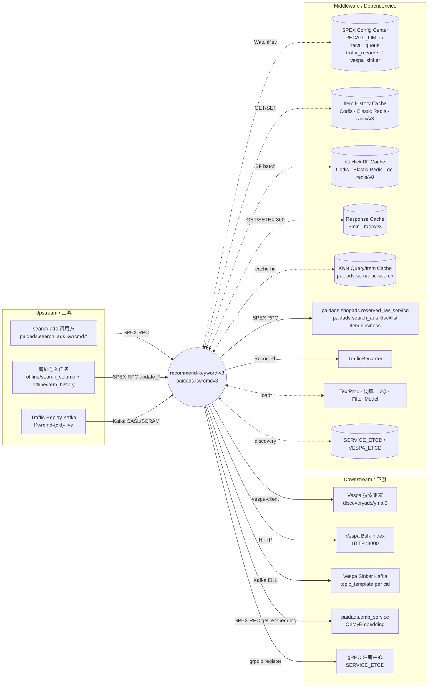

<!-- ads-workspace-gdoc-sync: gdoc_id=1K9ExyIa6uVylrqAUQNd6FcsdX_HR0yZO4ewrtP6ytSE gdoc_url=https://docs.google.com/document/d/1K9ExyIa6uVylrqAUQNd6FcsdX_HR0yZO4ewrtP6ytSE/edit -->

<!-- Generated by sra-toolkit/skills/ads-readme-generate -->

# Recommend Keyword V3 / 关键词推荐服务 V3

> 搜索广告（Search Ads）侧的关键词推荐服务（kwrcmdv3），按 `(shop_id, item_id, country, manualKw)` 召回并打分关键词，服务于搜索广告关键词补全（keyword suggestion）与关键词相关性判定（relevance）。
>
> 仓库地址：<https://git.garena.com/truongphu.dong/recommend-keyword-v3>

---

## 目录 / Table of Contents

- [项目概述 / Introduction](#项目概述--introduction)
- [核心功能 / Features](#核心功能--features)
- [项目架构 / Architecture](#项目架构--architecture)
  - [系统上下文 / System Context](#系统上下文--system-context)
  - [上下游调用拓扑 / Service Topology](#上下游调用拓扑--service-topology)
  - [在线 / 离线双链路 / Online and Offline Pipelines](#在线--离线双链路--online-and-offline-pipelines)
- [目录结构 / Directory Structure](#目录结构--directory-structure)
- [SPEX API 与处理流程 / SPEX APIs and Processing Flows](#spex-api-与处理流程--spex-apis-and-processing-flows)
  - [SPEX 命令一览 / Command Overview](#spex-命令一览--command-overview)
  - [GetKW 召回与排序流程 / GetKW Recall and Ranking](#getkw-召回与排序流程--getkw-recall-and-ranking)
  - [UpdateItemHistory / UpdateKWCoclick / UpdateSearchVolume 写入流程](#updateitemhistory--updatekwcoclick--updatesearchvolume-写入流程)
  - [Traffic Replay 流程 / Traffic Replay Pipeline](#traffic-replay-流程--traffic-replay-pipeline)
- [召回队列 / Recall Queues](#召回队列--recall-queues)
  - [KNN 召回（FromKnn / FromKnnSv / FromKnnHighSv）](#knn-召回--knn-recallfromknn--fromknnsv--fromknnhighsv)
  - [历史点击召回（FromKwHis）](#历史点击召回--item-history-recallfromkwhis)
  - [手动 / Token Weight / I2Q / Filter 召回](#手动--token-weight--i2q--filter-召回)
  - [队列限额与排序 / Slots, Limits and Ranking](#队列限额与排序--slots-limits-and-ranking)
- [Embedding 计算与 OhMyEmb 迁移 / Embedding Computation and OhMyEmb Migration](#embedding-计算与-ohmyemb-迁移--embedding-computation-and-ohmyemb-migration)
- [中间件与数据存储 / Middleware and Data Stores](#中间件与数据存储--middleware-and-data-stores)
- [配置说明 / Configuration](#配置说明--configuration)
- [开发规范 / Development Guidelines](#开发规范--development-guidelines)
- [部署 / Deployment](#部署--deployment)
- [监控 / Monitoring](#监控--monitoring)
- [业务术语表 / Business Terminology Glossary](#业务术语表--business-terminology-glossary)
- [参考资料 / Additional Resources](#参考资料--additional-resources)
- [常见问题 / Frequently Asked Questions](#常见问题--frequently-asked-questions)

---

## 项目概述 / Introduction

`recommend-keyword-v3`（线上服务名 `paidads.kwrcmdv3`，部署模块 `kwrcmdv3`）是 Shopee Search Ads（搜索广告）链路中的关键词推荐服务。给定一个 `(shop_id, item_id, country)`（可选 `manualKw`、`Algorithm`、`Version`），它返回一组带相似度（`Similarity`）、搜索量（`Volume`）、排序分（`Score`）和召回来源（`From`）的候选关键词，用于：

- 搜索广告关键词补全：把 item 映射到一组高相关、高搜索量的 keyword 候选
- 关键词相关性判定（`get_relevance`）：复用 Embedding/相似度能力对外提供 item↔keyword 相关性打分

对外协议为 **SPEX**，命令前缀为 `paidads.search_ads.kwrcmd.`；同时通过 `git.garena.com/shopee/deep/grpclb/register` 注册到 etcd 暴露 gRPC，部分 `cid@idc` 由 `KWRcmdConfig.NoGrpcCond` 强制走 SPEX-only（如 `live` 配置中的 `br@us3`、`liveish` 配置中的 `sg@sg10`）。

服务当前正在进行 **Embedding 计算迁移**：把本地基于 TensorFlow 的 DSSM 推理，逐步切换到统一推理平台 OhMyEmbedding（SPEX 命令 `paidads.emb_service.get_embedding`）。迁移采用「三件套」策略：

1. `ShadowDiffHelper` — 在线主路径仍走本地 DSSM，异步发起 OhMyEmb 影子调用并对比 embedding（cosine similarity 直方图）
2. `DynamicSwitchHelper` — 通过 SPEX 配置 `UseOhMyEmbForOnline` 把在线主路径切到 OhMyEmb，灰度 / 一键回滚
3. Vespa 双写（`embedding` / `embeddingv6` 两个字段） — `WriteOhMyEmbField` 控制离线写入是否新增字段，`OhMyEmbModelVersion` 选择 OhMyEmb 写入的 model version

迁移背景与详细设计参见 [`kwrcmdv3 Embedding 计算迁移 TD`](https://docs.google.com/document/d/1Klx7IIT-2GZPoqEdIPMK8cwP6GevSt3fnzBtMcxO_rQ/edit?tab=t.0)（最终行为以代码为准）。

---

## 核心功能 / Features

| 功能 | 入口命令 | 简述 |
|---|---|---|
| 关键词推荐 | `paidads.search_ads.kwrcmd.get_kw` | item → keyword 候选；多召回队列 + 黑名单/coclick/Filter Model 过滤 + 排序 + 5min 响应缓存 |
| 店铺广告关键词推荐 | `paidads.search_ads.kwrcmd.get_shopads_kw` | 面向 Shopads 场景的关键词推荐（带 reserved/blacklist 标记） |
| 关键词相关性 | `paidads.search_ads.kwrcmd.get_relevance` | 给定 `(item, [keywords])`，复用 Embedding/相似度能力打分 |
| 历史点击写入 | `paidads.search_ads.kwrcmd.update_item_history` | 把 item 历史点击的 keyword 列表写入 Item History Redis |
| 搜索量与索引写入 | `paidads.search_ads.kwrcmd.update_search_volume` | 计算 keyword embedding，组装 `sinker.Event` 写 Vespa Sinker Kafka，按需双写 `embeddingv6` |
| Coclick BF 写入 | `paidads.search_ads.kwrcmd.update_kw_coclick` | 维护 keyword↔keyword Bloom Filter，用于在线 coclick 过滤 |
| 多召回队列 | （内部） | KNN（含三个变种）、Item-History、Manual、Token Weight、I2Q、Filter Model |
| Embedding 抽象层 | `pkg/dssm/Helper` | 4 个实现：local DSSM、OhMyEmb、`DynamicSwitchHelper`、`ShadowDiffHelper` |
| Traffic Replay | （仅 `env=liveish`） | 从 Kafka topic `Kwrcmd-{cid}-live` 消费 `KWReq` 限速回放本进程 GetKW |
| 热更新配置 | SPEX Config Center | `RECALL_LIMIT` / `recall_queue` / `traffic_recorder` / `vespa_sinker` 全部 `WatchKey` |

---

## 项目架构 / Architecture

### 系统上下文 / System Context

`recommend-keyword-v3` 处于「在线 + 离线」两条链路的交点：

- **在线（Read Path）**：search-ads 调用方按 SPEX 命令请求 `get_kw / get_shopads_kw / get_relevance`，服务串联召回（Vespa KNN、Redis、I2Q、Token Weight）和 Embedding（本地 DSSM 或 OhMyEmb），返回排序后的 keyword 列表
- **离线（Write Path）**：`offline/search_volume`（Scala/Spark）和 `offline/item_history`（Go：`InsertHistory.go` / `InsertCoclick.go`）通过 SPEX 调用 `update_*` 接口，把搜索量、历史点击、coclick BF 写到 Redis / Vespa Sinker Kafka

### 上下游调用拓扑 / Service Topology



#### 上游 / Upstream

| 名称 | 协议 | 用途 |
|---|---|---|
| search-ads 调用方（`paidads.search_ads.kwrcmd.*`） | SPEX RPC | 搜索广告链路通过 `get_kw` / `get_shopads_kw` / `get_relevance` 请求 item 维度的关键词推荐与相关性 |
| 离线写入任务（kwrcmd 数据更新通道） | SPEX RPC | `offline/item_history`（Go：`InsertHistory.go` / `InsertCoclick.go`）和 `offline/search_volume`（Scala/Spark）通过 `update_item_history` / `update_search_volume` / `update_kw_coclick` 把离线计算结果回写在线服务 |
| Traffic Replay Kafka（`Kwrcmd-{cid}-live`） | Kafka（sarama，SASL/SCRAM-SHA-512） | 仅 `env=liveish` 启用，从 `GlobalTrafficReplayKafkaConfig` 指定 broker 消费 `Kwrcmd-{cid}-live` topic，解出 `KWReq` 后按 `LimitConfig.TrafficReplay.QPS` 回放调用本进程 `GetKW` |

#### 下游 / Downstream

| 名称 | 协议 | 用途 |
|---|---|---|
| Vespa 搜索集群（`discoveryads/ymal0`） | vespa-client（gRPC over etcd 服务发现） | 召回阶段对 `keyword_rcmd_<cid>0` 索引执行 KNN/相似度查询；`pkg/kwrcmd-service/service.go` 中 `NewSearchClientByDiscovery` |
| Vespa Bulk Index 端点 | HTTP | `VESPA_BULK_INDEX` 中列出的 ymal 集群 `:8000` 端点，由 update 类接口直连写文档 |
| Vespa Sinker Kafka（按 cid 模板） | Kafka（EKL，SASL） | `pkg/kwrcmd-service/vespa_sinker.go` 中 `enhanced-kafka-lib` Producer，`UpdateSearchVolume` 把 keyword 文档（含 `embedding` / `embeddingv6` 字段）按 cid 投递到 `topic_template.replace("{cid}", lower)` |
| `paidads.emb_service.get_embedding`（OhMyEmbedding） | SPEX RPC | `pkg/dssm/client.go` 通过 `sps.RPCRequest` 调用，`DagName=online_query_user`，`RequiredOutput=keyword_rcmd@embedding<version>`，承担在线 query/item Embedding 计算 |
| gRPC 注册中心（`SERVICE_ETCD`） | etcd（grpclb register） | 注册到 `/paidads/sd/adskwrcmd/rpcserver/v3/<env>`；部分调用方使用 gRPC，受 `NoGrpcCond` 控制 |

#### 中间件依赖 / Middleware Dependencies

| 名称 | 类型 | 用途 |
|---|---|---|
| SPEX Config Center | config | 通过 `sps.SubscribeConfig` 订阅 `RECALL_LIMIT`（`LimitConfig`：`FinalLimit`、各 KNN slot/limit、`MeanNorm`/`StdNorm`、`KNNCacheEnable`、`WriteOhMyEmbField`、`UseOhMyEmbForOnline`、`OhMyEmbModelVersion`、`TrafficReplay*`）、`recall_queue`（`RecallQueueConfig`：`VespaKnn*TargetHit/AdditionalHit`）、`traffic_recorder`、`vespa_sinker`，全部 `WatchKey` 热更新 |
| paidads-semantic-search（本地 DSSM 推理） | library | `git.garena.com/shopee/deep/paidads-semantic-search` 提供 query/item cache、feature client 和 `knn.ModelMap`；`pkg/dssm/manager.go` 用 `LoadModel` 加载 `knn_config.yaml` + 本地 TensorFlow 模型 |
| TensorFlow C 库（`libtensorflow`、`libfasttextgo`） | library | `Makefile prepare` 安装 `libtensorflow-cpu-linux-x86_64-2.6.5` 与 `libfasttextgo.so` 到 `/usr/local/lib/`，本地 DSSM 推理依赖 cgo |
| Item History Cache（Codis/Elastic Redis，radix/v3） | datastore | `item-history-cache`，存放每个 item 的历史点击 keywords 列表（key=`MakeItemHistoryKey(itemid)`，TTL=7×24h）；同时承载 search-volume 写入（key=`MakeVolumeKey(country, keyword)`） |
| Coclick Bloom Filter Cache（Codis/Elastic Redis，go-redis/v8） | datastore | `coclick-bf-cache`，使用 third-party `go-bf` 在 Redis 之上构建 Bloom Filter；活跃 BF 指针写在 `kwrcmdv3_coclick_active_key#<cid>`，TTL=14 天 |
| Response Cache（Codis/Elastic Redis，radix/v3） | cache | `resp-cache`，`GetKW` 入口对 `(shopId, itemId, manualKw, itemNameHash, version)` 组合 key 做 5 分钟级响应缓存（`SET … EX 300`），命中即直接返回 |
| KNN Query / Item Cache（paidads-semantic-search 内置 cache） | cache | `pkg/dssm/manager.go` 中 querycache/itemcache 客户端为 query/item embedding 提供按 `(country, version, keyword/itemid)` 命中的远端缓存；DSSM 与 OhMyEmb 共享同一份 `KNNSharedClients` 实例避免 Prometheus collector 重复注册 |
| `paidads.shopads.reserved_kw_service` / `paidads.search_ads.blacklist` / `item.business` | service | `sp-workspace.yml` 中声明的 SPEX 协议依赖；服务内部用于关键词预留判定、黑词过滤和商品基础信息查询 |
| TrafficRecorder | service | `git.garena.com/shopee/deep/searchads/traffic_recorder/recorder.InitTrafficRecorderV2`，`GetKW` 中按 cid 录制 `KWReq` 用于离线回放与 Traffic Replay |
| TextProc / 多语言词典文件 | library | `aproc.NewTextProc` 加载 `mtext.xml`；`s2t_mapping.txt`（繁简映射）；`TextParserQueryTable` 与 `TokenWeightTable` 按 cid 加载 `query_table.tsv` 与 `token_weight` 表 |
| I2Q 模型（`i2q_model_config.yaml`） | library | `pkg/i2q_model` 在本地加载，为 `FromI2Q` 召回队列提供 item-to-query 候选词 |
| Filter 模型（`filter_model_config.yaml`） | library | `pkg/filter_model` 在本地加载，按阈值过滤候选关键词 |
| `SERVICE_ETCD` / `VESPA_ETCD` | metadata | `SERVICE_ETCD` 用于 gRPC 注册中心；`VESPA_ETCD` 用于 vespa-client 集群发现（key=`/paidads/vespa/discoveryads/ymal0/qrs`） |

### 在线 / 离线双链路 / Online and Offline Pipelines

- **在线链路（GetKW）**：`resp-cache` 命中检查 → 并发召回（KNN / History / Manual / Token Weight / I2Q）→ DSSM/OhMyEmb 算 query 与候选 keyword 的 embedding → 计算相似度并 `GetRankScore` 排序 → 黑名单 / coclick / Filter Model 过滤 → 写回 `resp-cache`（TTL 5 min）→ 返回
- **离线链路（Update*）**：`update_search_volume` 算 keyword embedding（按 `DssmModelVersions` 循环，必要时 OhMyEmb 双写）→ 组装 `sinker.Event` 写 `embedding` / `embeddingv6` → 通过 Vespa Sinker Kafka 投递；`update_item_history` 把历史点击 keyword 写入 Item History Redis；`update_kw_coclick` 维护 Bloom Filter

---

## 目录结构 / Directory Structure

```
recommend-keyword-v3/
├── service/                # 服务入口
│   ├── kwrcmd/             # main.go + run.go（StartService 编排）
│   └── http_handler/       # /metrics, /debug/pprof
├── pkg/
│   ├── kwrcmd-service/     # 核心业务：SPEX/gRPC handler、召回、过滤、排序
│   │   ├── service.go      # kwrcmdService 主体；helper / client / 缓存装配
│   │   ├── kwrcmd.go       # GetKW 与 recallKeywords
│   │   ├── updater.go      # UpdateItemHistory / UpdateKWCoclick / UpdateSearchVolume
│   │   ├── spex_service.go # 6 个 SPEX 命令注册
│   │   ├── blacklist_filter.go / coclick_filter.go / filter_model.go
│   │   ├── vespa_sinker.go # Kafka Producer（EKL）
│   │   ├── traffic_replay.go
│   │   ├── exporter.go     # Prometheus 指标
│   │   ├── consts.go / types.go / util.go / item_info.go / traffic_ctx.go
│   │   └── ...
│   ├── dssm/               # Embedding 抽象层
│   │   ├── manager.go              # 本地 DSSM Helper
│   │   ├── ohmyemb_manager.go      # OhMyEmb Helper
│   │   ├── dynamic_switch_helper.go# 切流
│   │   ├── shadow_diff_helper.go   # 影子对比
│   │   ├── client.go               # paidads.emb_service.get_embedding
│   │   ├── const.go                # DssmModelVersions
│   │   ├── util.go                 # 字段 / 版本选择
│   │   └── exporter.go
│   ├── sinker/             # Vespa Sinker proto + converter
│   ├── i2q_model/          # I2Q 模型加载
│   ├── filter_model/       # Filter 模型加载
│   ├── token-weight/       # Token Weight 字典
│   ├── client/             # kwrcmdv3 客户端（SPEX/gRPC 双协议）
│   ├── types/              # 公共常量
│   └── utils/              # TrafficRecorder 等
├── config/                 # 配置加载
│   ├── kwrcmd.go           # KWRcmdConfig 结构 + 解析
│   ├── spex.go             # LimitConfig / RecallQueueConfig / SPEX 订阅
│   ├── traffic_recoder.go  # traffic_recorder Key
│   ├── util.go             # parse / merge / BindProto[T]
│   └── files/              # live.yml / live-br.yml / liveish.yml / test.yml
├── sp_proto/               # SPEX 协议定义（依赖见 sp-workspace.yml）
│   └── paidads.search_ads/kwrcmd.proto
├── deploy/
│   ├── kwrcmdv3.json       # 部署描述（cpu/mem、port、pre_hook、regression-tool）
│   └── util/               # start_kwrcmd.sh / replace_port.sh / download_*.sh
├── offline/
│   ├── search_volume/      # Scala/Spark 任务（mvn package）
│   └── item_history/       # Go 任务（InsertHistory / InsertCoclick）
├── common/                 # 跨包工具
├── Makefile                # prepare / svc / ci / kwrcmd-prepare / *-download
├── sp-workspace.yml        # SPEX 协议依赖与生成配置
├── .gitlab-ci.yml          # test_job + tag 通知
└── README.md / README_EN.md
```

---

## SPEX API 与处理流程 / SPEX APIs and Processing Flows

### SPEX 命令一览 / Command Overview

命令前缀：`paidads.search_ads.kwrcmd.`（详见 `sp_proto/paidads.search_ads/kwrcmd.proto` 与 `pkg/kwrcmd-service/spex_service.go`）。

| 命令 | Request | Response | 含义 |
|---|---|---|---|
| `get_kw` | `KWReq{Shopid, Itemid, Name, FilterKeyword, Algorithm, Version, Country}` | `KWResp{Version, []KWInfo, Status}` | item → keyword 推荐主入口 |
| `get_shopads_kw` | `ShopadsReq{Requester, Country, Shopid, Keyword, Collection_id}` | `ShopadsResp{[]ShopadsKwInfo}` | Shopads 场景关键词（含 reserved/blacklist） |
| `get_relevance` | `RelevanceReq{Shopid, Itemid, Keywords, Algorithm, Version, Country}` | `RelevanceResp{Keywords}` | item↔keyword 相关性打分 |
| `update_item_history` | `ItemHistoryReq{Itemid, Keywords}` | `CacheResp{Code}` | 写 Item History Redis |
| `update_search_volume` | `SearchVolumeReq{Keyword, SearchVolume, Country, Timestamp, IsShopName}` | `CacheResp{Code}` | 算 embedding + Vespa Sinker + Volume Redis |
| `update_kw_coclick` | `KWCoclickReq{Keyword, Keywords, CacheKey, Publish}` | `CacheResp{Code}` | 维护 Coclick Bloom Filter |

错误码（`Constant.ErrorCode`）：`SUCCESS=0`、`ERROR_INTERNAL=1449000001`、`ERROR_BAD_REQUEST=1449000002`、`ERROR_DROPPED=1449000003`、`ERROR_BE_BLOCKED=1449000004`、`ERROR_SPBODY=1449000005`、`ERROR_NO_ITEM=1449000006`。

### GetKW 召回与排序流程 / GetKW Recall and Ranking

```mermaid
flowchart TD
  Req[KWReq] --> V[参数校验<br/>Country/Version 默认值]
  V --> RC{resp-cache<br/>命中?}
  RC -->|hit| Ret1[返回缓存 KWResp]
  RC -->|miss| H[读 Item History Redis<br/>itemhistory_v3#itemid]
  H --> R[recallKeywords 并发]
  subgraph R[Recall 并发]
    R1[FromKnn<br/>Vespa KNN 无 SV 过滤]
    R2[FromKnnSv<br/>Vespa KNN 带 SV]
    R3[FromKnnHighSv<br/>Vespa KNN 高 SV]
    R4[FromKwHis<br/>Item History]
    R5[FromManual<br/>用户手动 keyword]
    R6[FromTokenWeightKw<br/>Token Weight 组合]
    R7[FromI2Q<br/>本地 I2Q 模型]
  end
  R --> E[GetBatchKNNQueryEmb<br/>(DSSM / OhMyEmb)]
  E --> S[相似度 + GetRankScore<br/>排序 + slot 限额]
  S --> BL[黑名单 paidads.search_ads.blacklist]
  BL --> CC[Coclick BF 过滤]
  CC --> FM[Filter Model 过滤]
  FM --> Cap[FinalLimit 截断]
  Cap --> WC[写回 resp-cache<br/>SETEX 300]
  WC --> Ret2[返回 KWResp]
```

要点：

- 5 分钟响应缓存键由 `(shopId, itemId, manualKw, itemNameHash, version)` 组合（`util.go::MakeVolumeKey` 等辅助 key 函数定义在 `pkg/kwrcmd-service/util.go`）
- `Embedding Helper` 由 `kwrcmdService.dssmHelper` 持有，实际类型由启动期装配（local / OhMyEmb / DynamicSwitch / ShadowDiff）
- 排序 `GetRankScore = clip(((sim · log2(volume)) − mean) / (2·std) · 5 + 7, 1, 10)`，`mean/std` 来自 `LimitConfig.MeanNorm/StdNorm`

### UpdateItemHistory / UpdateKWCoclick / UpdateSearchVolume 写入流程

- `UpdateItemHistory(itemid, keywords)`：直接 `SET itemhistory_v3#<itemid>` 到 Item History Redis，TTL=`7×24h`，失败重试 `itemHistoryRetry=3`
- `UpdateKWCoclick(keyword, keywords, cacheKey, publish)`：在 `coclick-bf-cache` 上更新 Bloom Filter；`publish=true` 时把当前 BF key 写入活跃指针 `kwrcmdv3_coclick_active_key#<cid>`，TTL=14 天，下次在线读 BF 时切换
- `UpdateSearchVolume(keyword, volume, country, ts, isShopName)`：
  1. 遍历 `dssm.DssmModelVersions[country]` 的每个 model version
  2. 调用 `dssmHelper.GetKNNQueryEmb` 计算 keyword embedding（`GetSimilarityScore` 始终走本地 DSSM）
  3. 当 `LimitConfig.WriteOhMyEmbField=true` 且 `model.ItemModel == OhMyEmbModelVersion` 时双写 `embeddingv6` 字段
  4. 组装 `sinker.Event` 通过 `vespa_sinker.go::SendVespaEvent` 投递到对应 cid 的 Kafka topic（仅 `env=live` 实际发送）
  5. 同时把 search volume 写入 `MakeVolumeKey(country, keyword)`

### Traffic Replay 流程 / Traffic Replay Pipeline

`pkg/kwrcmd-service/traffic_replay.go`：

- 仅当 `KWRcmdConfig.Env == "liveish"` 且 `LimitConfig.TrafficReplay.Enable == true` 时启动
- 使用 `sarama` 客户端连接 `GlobalTrafficReplayKafkaConfig.Brokers`，鉴权 `SASL/SCRAM-SHA-512`
- 订阅 topic 模板 `Kwrcmd-{cid}-live`（`cid` 来自 `LimitConfig.TrafficReplay.Country`），消费消息反序列化为 `KWReq`
- 按 `LimitConfig.TrafficReplay.QPS` 限流回放调用本进程 `kwrcmdService.GetKW`，到 `Count` 上限或 `ctx.Done()` 时停止
- 通过日志输出 `success / failure` 计数；可与 `TrafficRecorder` 结合做线上→liveish 回归

---

## 召回队列 / Recall Queues

### KNN 召回 / KNN Recall（FromKnn / FromKnnSv / FromKnnHighSv）

三个 KNN 队列复用同一份 query embedding，但走不同的 Vespa 查询参数：

| From | 是否带 SearchVolume 过滤 | 是否启用 HighSearchVolumeThreshold | TargetHit / AdditionalHit |
|---|---|---|---|
| `from_knn` | ✗ | ✗ | `RecallQueueConfig.VespaKnn{Target,Additional}Hit` |
| `from_knn_with_sv` | ✓（基础阈值） | ✗ | `VespaKnnSv{Target,Additional}Hit` |
| `from_knn_high_sv` | ✓ | ✓（按 cid 取 `HighSearchVolumeThreshold[cid]`） | `VespaKnnHighSv{Target,Additional}Hit` |

`HighSearchVolumeThreshold`（`pkg/kwrcmd-service/consts.go`）：`SG=1200, PH=3000, MY=4500, ID=9000, TH=1800, VN=8000, TW=2500, BR=5000, CO/CL/MX=1500`。

### 历史点击召回 / Item-History Recall（FromKwHis）

从 `itemhistory_v3#<itemid>` 读取最近一段时间该 item 被点击过的 keyword 列表，作为天然高相关候选；同时其内容用作 `coclick_filter` 的查询基。

### 手动 / Token Weight / I2Q / Filter 召回

- `FromManual`：`KWReq.FilterKeyword` 不为空时强制注入；命中 manual 后跳过 coclick 过滤
- `FromTokenWeightKw`：用 `TextProc` 切词 + `TokenWeightManager.GetTopToken` 取 Top Token，再 `GenerateTokenCombinations` 组合（TW/TH 额外去空格）
- `FromI2Q`：本地 `i2q_model` 推理 item-to-query
- Filter 阶段：`Filter Model` 对候选打分，低于阈值被剔除（`UnpickReasonFilterModelEliminated`）；高分继续保留并打 `PickReasonHighFilterModelScore`

### 队列限额与排序 / Slots, Limits and Ranking

`LimitConfig`（`config/spex.go`）：

| 字段 | 默认 | 含义 |
|---|---|---|
| `FinalLimit` | 50 | 最终返回 keyword 数 |
| `HistoryClickedSlots` | 50 | History + TokenWeight 共享的 slot |
| `VespaKNNSearchVolumeLimit` | 50 | KNN-with-SV 候选上限 |
| `VespaKNNWOSearchVolumeLimit` | 50 | KNN-without-SV 候选上限 |
| `VespaKNNWOSearchVolumeSlots` | 50 | 该队列 slot |
| `VespaKNNHighSearchVolumeSlots` | 3 | High-SV slot |
| `I2QKeywordSlots` | 5 | I2Q slot |
| `MeanNorm` / `StdNorm` | — | 排序归一化 |
| `KNNCacheEnable` | false | KNN cache 总开关 |
| `LogReqRespEnable` | false | 详细 req/resp 日志 |
| `WriteOhMyEmbField` | — | 离线写 `embeddingv6` 开关 |
| `UseOhMyEmbForOnline` | — | 在线主路径切到 OhMyEmb |
| `OhMyEmbModelVersion` | — | OhMyEmb 写入的 model version |
| `TrafficReplay*` | — | Traffic Replay 子配置 |

排序：`GetRankScore` 见上节，结果按 score 倒排截断到 `FinalLimit`。

---

## Embedding 计算与 OhMyEmb 迁移 / Embedding Computation and OhMyEmb Migration

### 核心抽象 / Helper Interface

```go
type Helper interface {
    GetKNNQueryEmb(ctx, country, version, keyword string) ([]float32, error)
    GetBatchKNNQueryEmb(ctx, country, version string, keywords []string) ([][]float32, error)
    GetKNNItemEmb(ctx, country, version string, item *mstore.Item) ([]float32, error)
    GetSimilarityScore(...) ...   // 始终走 local DSSM
}
```

四个实现：

| 实现 | 位置 | 行为 |
|---|---|---|
| 本地 DSSM | `pkg/dssm/manager.go` | 通过 `paidads-semantic-search` 加载 `knn_config.yaml` + 本地 TF 模型；`LoadFilteredKNNConfig → removeUnuseModel → filterRegressionModel` |
| OhMyEmb 远程 | `pkg/dssm/ohmyemb_manager.go` | `sps.RPCRequest("paidads.emb_service.get_embedding", …)`，`DagName=online_query_user`，`RequiredOutput=keyword_rcmd@embedding<version>` |
| `DynamicSwitchHelper` | `pkg/dssm/dynamic_switch_helper.go` | 按 `enabled()`（默认 `config.GlobalLimitConfig.UseOhMyEmbForOnline`）在 `local` 与 `ohmyemb` 之间切换；`GetSimilarityScore` 始终走 `local` |
| `ShadowDiffHelper` | `pkg/dssm/shadow_diff_helper.go` | `primary` 同步返回，`shadow` 异步执行；对比 cosine similarity 并导出指标，主路径不受 shadow 失败影响 |

### Vespa 双写 / Dual-Write

- `WriteOhMyEmbField=true` 且 `model.ItemModel == OhMyEmbModelVersion` 时，离线 `UpdateSearchVolume` 在 `embedding` 字段之外把 OhMyEmb 输出写入 `embeddingv6`
- 在线读取由 `pkg/dssm/util.go::GetVespaEmbField` / `GetUseModelVersion` 根据 `UseOhMyEmbForOnline` 与 country 决定查询哪个字段、用哪个 model version；缓存 key 后缀也对应切换，避免新旧 embedding 串味

### 迁移建议步骤

1. 上线 ShadowDiff（`primary=local`，`shadow=ohmyemb`），观察 `ohmyemb_shadow_diff_similarity` 直方图与 `ohmyemb_shadow_diff_error`
2. 离线开启 `WriteOhMyEmbField` + 设置 `OhMyEmbModelVersion`，开始向 Vespa 写 `embeddingv6`
3. 通过 `DynamicSwitchHelper` 把 `UseOhMyEmbForOnline` 灰度切到 true，在线主路径切到 OhMyEmb
4. 稳定后下线本地 DSSM 模型加载（保留 `GetSimilarityScore` 所需路径或改造）

---

## 中间件与数据存储 / Middleware and Data Stores

### Vespa（搜索 + Bulk Index + Sinker Kafka）

- 召回：vespa-client 通过 `VESPA_ETCD`（key=`/paidads/vespa/discoveryads/ymal0/qrs`）做服务发现；索引名模板 `keyword_rcmd_<cid>0`
- Bulk Index：`VESPA_BULK_INDEX` 列出的 ymal 集群 HTTP `:8000` 直连
- Vespa Sinker Kafka：`enhanced-kafka-lib` Producer，topic 模板从 SPEX `vespa_sinker` 配置读取，`{cid}` 占位符按国家拼接；**仅 `env=live` 实际发送**（参考 `vespa_sinker.go`）

### 三个 Redis 缓存

| 名称 | 客户端 | Key / TTL |
|---|---|---|
| `item-history-cache` | `radix/v3` | `itemhistory_v3#<itemid>` TTL=7d；`volume<country>#<keyword>` |
| `coclick-bf-cache` | `go-redis/v8`（被 `go-bf` 使用） | `kwrcmdv3_coclick_active_key#<cid>` 活跃 BF 指针 TTL=14d；BF 内部 key 由 `GetCoclickKWPairKey(hisKw, coKw)` 拼接 |
| `resp-cache` | `radix/v3` | `GetKW` 响应缓存（5min，`SET … EX 300`） |

> 三者 host 相同（`ips.6c19f206633e8a78.elasticredis.cloud.shopee.io:10046`），通过不同 `db` / `pool` 区分用途；底层走 Codis HostOption。

### Kafka

- **Vespa Sinker Kafka**：见上文
- **Traffic Replay Kafka**：仅 liveish；topic `Kwrcmd-{cid}-live`，鉴权 `SASL/SCRAM-SHA-512`

### SPEX Config Center 订阅 Key

| Key | 结构 | 来源 |
|---|---|---|
| `RECALL_LIMIT` | `LimitConfig` | `config/spex.go::GetLimitConfig` |
| `recall_queue` | `RecallQueueConfig` | `config/spex.go::GetDynamicRecallQueueConfig` |
| `traffic_recorder` | `TrafficRecorder` | `config/traffic_recoder.go` |
| `vespa_sinker` | `vespa_sinker.VespaSinkerConfig` | `pkg/kwrcmd-service/vespa_sinker.go` |

全部支持 `WatchKey` 热更新，状态写到 `paidads_kwrcmdv3_spex_status{key}` Gauge（`NORMAL=0` / `INVALID_ERROR=1` / `CAST_ERROR=2` / `PROCESS_ERROR=3`），版本 md5 写到 `paidads_kwrcmdv3_spex_version{key,version}` Gauge。

### 本地词典与模型文件

| 文件 | 用途 | 下载 |
|---|---|---|
| `mtext.xml` | TextProc 主配置 | `make text-proc-download` |
| `s2t_mapping.txt` | 繁简映射 | 同上 |
| `<CID>_query_table.tsv` | 多语言查询切词表（按 cid） | 同上 |
| `token_weight/token_weight_<cid>.txt` | Token Weight 字典 | 仓库内 / 镜像内置 |
| `knn_config.yaml` | DSSM/KNN 模型路径与版本 | `make model-download`（`download_knn.sh`） |
| `i2q_model_config.yaml` | I2Q 模型 | `download_i2q_model.sh` |
| `filter_model_config.yaml` | Filter 模型 | `download_filter_model.sh` |

---

## 配置说明 / Configuration

### 本地配置 / Local Config（`config/files/*.yml`）

`KWRcmdConfig`（`config/kwrcmd.go`）核心字段：

- `Env`、`CID/IDC`、`NoGrpcCond`（`cid@idc` 列表，强制 SPEX-only）、`SpexConfig`
- `GRPC`（`SERVICE_ETCD` + `key=/paidads/sd/adskwrcmd/rpcserver/v3/<env>`、`register-without-prefix: true`）
- `DSSM.knn-conf`、`Vespa`（`*VESPA_CLUSTER`）
- 三个 Redis HostOption：`item-history-cache` / `coclick-bf-cache` / `resp-cache`
- `vespa-index`（Bulk Index 端点列表）、`text-proc` / `text-parser-s2t` / `text-parser-query-table`
- `token-weight-table`、`i2q.conf`、`filter.conf`

环境差异：

| 文件 | 用途 |
|---|---|
| `live.yml` | 生产；`vespa-index` 指向 ymal 1/2 集群；`no-grpc-cond: br@us3` |
| `live-br.yml` | BR 区域专用 live |
| `liveish.yml` | 灰度 + 流量回放；`vespa-index` 指向 shr 集群；`no-grpc-cond: sg@sg10`；配合 `LimitConfig.TrafficReplay*` 启用 Traffic Replay |
| `test.yml` | 单测/本地 |

### SPEX 远程配置 / SPEX Remote Config

四个 key（见上节）；与 OhMyEmb 迁移强相关的 3 个开关位于 `LimitConfig`：

- `WriteOhMyEmbField`：离线 `UpdateSearchVolume` 是否双写 `embeddingv6`
- `UseOhMyEmbForOnline`：在线主路径是否切到 OhMyEmb（被 `DynamicSwitchHelper.enabled` 读取）
- `OhMyEmbModelVersion`：OhMyEmb 在 Vespa 中对应的 `ItemModel` 版本，决定双写时挑哪一行

### `knn_config.yaml` 与 `DssmModelVersions`

加载顺序（`pkg/dssm/manager.go`）：

1. `LoadFilteredKNNConfig(knn_config.yaml)` 读取所有 `(country, item_model, query_model, path)`
2. `removeUnuseModel` 剔除 `DssmModelVersions[country]` 中不需要的版本
3. `filterRegressionModel` 按 `KWRcmdConfig.RegressionCountries` 进一步保留
4. `knn.LoadModel` 加载 TF 模型到 `ModelMap`

`DssmModelVersions`（`pkg/dssm/const.go`）按国家 → 版本数组列出可用模型；`MX/CL/CO` 强制使用 v6。

### SPEX 与 spcli 配置 / SPEX and spcli Setup

- 服务 SPEX 启动：`config.InitSpex` → `sps.GenerateInstanceID` → `sps.Init(WithInstanceID, WithConfigKey=5798e7c97109f9c6fbfc82fe181c51d1)` → `sps.SubscribeConfig`
- 本地开发请按 [SPEX Go SDK 快速上手与安装](https://spex.shopee.io/overview/quick-start/languages/go/index.html) 安装 sps，并按 [spcli 安装与 Git 配置方法](https://spex.shopee.io/user-guide/SDK/Java/local.html) 配置 `spcli` 用于跑 `sp-workspace.yml` 中的 protobuf 生成

---

## 开发规范 / Development Guidelines

### 代码风格 / Code Style

- Go 1.22.x；以 `gofmt` / `go vet` / `golangci-lint`（CI 由 `make ci` 触发）为准
- 包名 lower_snake（如 `kwrcmd_service`、`dssm`）；导出符号首字母大写并附简短注释
- 注释使用英文，业务术语尽量与 `terminology` 一致

### 新增召回队列 / How to Add a New Recall Queue

1. 在 `pkg/kwrcmd-service/kwrcmd.go` 新增 `recallXxxKw(ctx, opt, debug)` 方法
2. 在 `recallKeywords` 内按已有 pattern 用 `errgroup` / goroutine 并发启动
3. 在 `pkg/kwrcmd-service/consts.go` 增加 `FromXxx` 常量与必要的 `Reason`
4. 在 `pkg/kwrcmd-service/types.go::slotInfo.getSlot` 中映射 slot
5. 如需热更新参数，在 `LimitConfig` / `RecallQueueConfig` 加字段并由 `WatchKey` 流程接管

### 新增 / 升级 Embedding 模型 / How to Add or Upgrade an Embedding Model

1. 在 `pkg/dssm/const.go::DssmModelVersions` 增加版本（按国家区分）
2. 更新 `knn_config.yaml`（路径 + ItemModel/QueryModel）
3. 若走 OhMyEmb：在远端 `paidads.emb_service` 注册同名 DAG / RequiredOutput（`keyword_rcmd@embedding<version>`）
4. 灰度前先用 `ShadowDiffHelper` 观察 `ohmyemb_shadow_diff_similarity`；P50/P90 cosine sim 期望 ≥ 0.99，再切 `UseOhMyEmbForOnline`

### 项目结构 / Project Structure

服务入口在 `service/`，核心业务在 `pkg/kwrcmd-service/`，所有 Embedding 抽象与 Helper 在 `pkg/dssm/`。新增功能优先放在对应包，避免在 `service/kwrcmd/run.go` 写业务逻辑。

### 命名规范 / Naming Conventions

- SPEX 命令：`paidads.search_ads.kwrcmd.<verb>`
- Prometheus 指标：`paidads_kwrcmdv3_*`（`Namespace=paidads`、`Subsystem=kwrcmdv3*`）
- Redis key：`itemhistory_v3#`、`volume<country>#`、`kwrcmdv3_coclick_active_key#`
- Vespa 索引：`keyword_rcmd_<cid>0`，字段 `embedding` / `embeddingv6`

### 错误处理 / Error Handling

- SPEX handler 返回 `Constant_ErrorCode`；将错误通过 `exporterError` 计数（label `country, type, traffic_src`）
- 内部并发调用 `errgroup` 收敛错误；下游超时统一在调用点用 `context.WithTimeout`（黑名单/外部 RPC 默认 1s，item.business 5s）

### 单元测试 / Unit Testing Standards

- `make ci` = 跑全量 `go test ./...`；新写的 helper / util 必须带表驱动测试
- Embedding 相关 helper 用 mock helper（实现 `Helper` 接口）测试 `DynamicSwitchHelper` / `ShadowDiffHelper` 的切流与异步对比逻辑

### Code Review & Git Workflow

- 分支命名 `<username>/<type>/<description>`，`type ∈ {feat, fix, refactor, chore, debug, hotfix}`
- 提交信息遵循 Conventional Commits；涉及 SPEX 协议变更需联动 `git.garena.com/shopee-server/ads-keyword-recommend/protobuf` 仓库并在 MR 描述里附 link
- `sp-workspace.yml` 中的 `dep` 列表影响 protobuf 生成；新增依赖需同时执行 `spcli` 重新生成 `gen/`

---

## 部署 / Deployment

### 生产构建 / Build for Production

`Makefile` 关键 target：

| Target | 作用 |
|---|---|
| `make prepare` | 安装 `libtensorflow-cpu-linux-x86_64-2.6.5` + `libfasttextgo.so` 到 `/usr/local/lib/` |
| `make kwrcmd-prepare` | 拉取 `paidads-semantic-search` 提供的 KNN 运行时 |
| `make model-download` | 下载 KNN 模型（`download_knn.sh`） |
| `make text-proc-download` | 下载 `mtext.xml` 等 TextProc 资源 |
| `make svc` | 编译 `bin/kwrcmdv3-service.linux`（在线服务） |
| `make ci` | 跑 `go test ./...` |
| `make svc-debug` | 带 debug 符号的本地构建 |
| `make sinker-proto` | 重新生成 `pkg/sinker/sinker.pb.go` |

离线 job 输出 `bin/InsertHistory.linux` / `bin/InsertCoclick.linux`，分别对应 `offline/item_history/InsertHistory.go` 与 `offline/item_history/coclick/InsertCoclick.go`。

### `deploy/kwrcmdv3.json` 解读

| 字段 | 值 |
|---|---|
| `project_name` / `module_name` | `paidads` / `kwrcmdv3` |
| `build.docker_image.base_image` | `harbor.shopeemobile.com/shopee/golang-base:1.22.8` |
| `build.commands` | `apt-get install bzr` → `make prepare` → `make svc` → `make kwrcmd-prepare` → 拷贝 `download_textproc.sh` |
| `run.command` | `bash deploy/util/start_kwrcmd.sh` |
| `run.pre_hook_commands` | `make text-proc-download` → `make model-download` → `replace_port.sh` |
| `port_definitions` | HTTP（含健康检查）+ GRPC（`disable_check`） |
| `deploy.resources.live` | `cpu=32, mem=64GB` |
| `deploy.resources.liveish` | `cpu=8, mem=64GB` |
| `regression-tool.modifications` | 通过模板替换把 `live.yml` 中 `rule` 与 etcd `key` 改成 `regression_tool_{JOB_ID}_{VERSION}`，并填入 `regression-countries` |

### 模型与词典下载 / Model and Dictionary Download

由 `deploy/util/` 下脚本提供（`download_knn.sh` / `download_i2q_model.sh` / `download_filter_model.sh` / `download_textproc.sh` / `get_knn_lib_dir.sh`），均在 pre_hook 阶段在容器内执行；本地复现可手动调用对应脚本。

### 发布流程 / Release Process

1. 在 `gensheng.wu/feat/...` 类分支开发并通过 `make ci`
2. 提交 MR → 触发 `.gitlab-ci.yml` 的 `test_job`（`make ci`）
3. Merge 后通过 SPEX 发布平台灰度（按 `cid` 分批 ` liveish → live`）
4. 打 tag `kwrcmd-v<MAJOR>.<MINOR>.<PATCH>...` 时触发 `tag_notification` job 走 `release-aegis` 通知 SeaTalk
5. SPEX 配置变更（`RECALL_LIMIT` / `recall_queue` / `vespa_sinker`）走 SPEX 配置中心灰度发布；服务无需重启

---

## 监控 / Monitoring

### `kwrcmdv3_server` 指标（`pkg/kwrcmd-service/exporter.go`）

| 指标 | 类型 | Labels |
|---|---|---|
| `paidads_kwrcmdv3_server_latency` | Summary（0.5/0.9/0.99） | `country, component, traffic_src` |
| `paidads_kwrcmdv3_server_length` | Summary | `country, component, traffic_src` |
| `paidads_kwrcmdv3_server_error` | Counter | `country, type, traffic_src` |
| `paidads_kwrcmdv3_server_count` | Counter | `country, status, traffic_src` |
| `paidads_kwrcmdv3_server_empty_count` | Counter | `country, component, traffic_src` |
| `paidads_kwrcmdv3_server_version` | Counter | `version`（commit hash） |

`traffic_src ∈ {grpc, spex}`，由 `pkg/kwrcmd-service/traffic_ctx.go::setTrafficSrc` 注入。

### `kwrcmdv3` SPEX 配置指标（`config/spex.go`）

- `paidads_kwrcmdv3_spex_status{key}` Gauge：状态码（`NORMAL=0` / `INVALID=1` / `CAST=2` / `PROCESS=3`）
- `paidads_kwrcmdv3_spex_version{key, version}` Gauge：当前 md5 = 1，旧 md5 = 0

### `kwrcmdv3` ohmyemb 指标（`pkg/dssm/exporter.go` + `shadow_diff_helper.go`）

| 指标 | 含义 |
|---|---|
| `paidads_kwrcmdv3_dssm_latency` / `dssm_error` / `dssm_count` | Embedding 调用延迟、错误、调用计数（`source ∈ {local, ohmyemb}`） |
| `paidads_kwrcmdv3_ohmyemb_shadow_diff_similarity` | Histogram，cosine similarity 直方图（labels=`country, source, emb_type`） |
| `paidads_kwrcmdv3_ohmyemb_shadow_diff_error` | Counter，shadow 调用错误 |
| `paidads_kwrcmdv3_ohmyemb_shadow_diff_latency` | Summary，shadow 路径延迟 |

### 核心关注点

- `resp-cache` 命中率（`paidads_kwrcmdv3_server_count{status="resp_cache_hit"}` / 总请求数）
- 各召回路径延迟与 `empty_count`（KNN/History/I2Q/TokenWeight）
- KNN cache hit（`dssm_count{type="cache_hit"}`）
- OhMyEmb 错误率与 shadow diff 偏离度（P50 cosine ≥ 0.99 视为可切流）
- Vespa Sinker 投递错误（`vespa_sinker_*` 自定义指标）

> 核心监控大盘：内部监控平台（请补充 Grafana dashboard 链接）。

---

## 业务术语表 / Business Terminology Glossary

| 术语 | 含义 |
|---|---|
| kwrcmdv3 / KWRcmd | 关键词推荐服务 v3（本仓库） |
| DSSM | Deep Structured Semantic Model，本地基于 TensorFlow 的 query/item embedding 模型 |
| OhMyEmbedding / OhMyEmb | 统一远程 embedding 推理服务，SPEX 命令 `paidads.emb_service.get_embedding` |
| `paidads.search_ads.kwrcmd` | 本服务对外 SPEX 命令前缀 |
| `paidads.emb_service` | OhMyEmb 远程推理 SPEX 命名空间 |
| SPEX / sps | Shopee 内部 RPC 协议与 Go SDK |
| Vespa / Vespa Sinker | Shopee 通用搜索引擎 + Kafka 写入侧组件 |
| EKL | Enhanced Kafka Library，`enhanced-kafka-lib` |
| radix / go-redis / codis_client | 三种 Redis 客户端，分别用在不同缓存 |
| Bloom Filter / Coclick | 用 Bloom Filter 维护 keyword↔keyword 的共点击关系 |
| I2Q | Item-to-Query 召回模型 |
| Filter Model | 关键词候选过滤模型 |
| TextProc / mtext | 多语言文本处理库，`mtext.xml` 是其主配置 |
| Token Weight | Token 重要度字典，按 cid 加载 |
| Traffic Replay / Traffic Recorder | 流量录制与回放，用于线上→liveish 回归 |
| `knn_config.yaml` | KNN/DSSM 模型路径与版本配置 |
| `LimitConfig` / `RecallQueueConfig` | SPEX 远程配置；slot/limit / KNN target hit |
| `UseOhMyEmbForOnline` | 切换在线主路径到 OhMyEmb 的开关 |
| `WriteOhMyEmbField` | 离线写入 `embeddingv6` 字段的开关 |
| `OhMyEmbModelVersion` | OhMyEmb 对应的 Vespa ItemModel 版本 |
| `DynamicSwitchHelper` | local / ohmyemb 之间的 Embedding 切流器 |
| `ShadowDiffHelper` | 主-影子 Embedding 调用对比与指标导出 |
| dual-write | Vespa 双写 `embedding` + `embeddingv6` |
| eCPM / uGSP | 广告系统通用术语，详见 Paid Ads Glossary |
| spcli | SPEX 命令行工具，用于本地 protobuf 生成 |

---

## 参考资料 / Additional Resources

- [kwrcmdv3 Embedding 计算迁移到 OhMyEmbedding 的 TD（参考用，最终行为以代码为准）](https://docs.google.com/document/d/1Klx7IIT-2GZPoqEdIPMK8cwP6GevSt3fnzBtMcxO_rQ/edit?tab=t.0)
- [Paid Ads 业务术语表（Confluence）](https://confluence.shopee.io/pages/viewpage.action?spaceKey=SPAD&title=Paid+Ads+Glossary)
- [SPEX Go SDK 快速上手与安装说明](https://spex.shopee.io/overview/quick-start/languages/go/index.html)
- [spcli 安装与 Git 配置方法](https://spex.shopee.io/user-guide/SDK/Java/local.html)

---

## 常见问题 / Frequently Asked Questions

**Q1：`UseOhMyEmbForOnline`、`WriteOhMyEmbField`、`OhMyEmbModelVersion` 三者如何协同？**

- `WriteOhMyEmbField=true` 控制离线 `UpdateSearchVolume` 是否把 OhMyEmb 输出双写到 Vespa 的 `embeddingv6` 字段；只在 `model.ItemModel == OhMyEmbModelVersion` 时触发。
- `UseOhMyEmbForOnline=true` 由 `DynamicSwitchHelper.enabled` 读取，决定在线 `GetKW` 在 `local` 与 `ohmyemb` 之间走哪一路；切流后查询的 Vespa 字段也会切到 `embeddingv6`（`pkg/dssm/util.go::GetVespaEmbField`）。
- `OhMyEmbModelVersion` 是「Vespa 写哪个 ItemModel + 在线读哪个版本」的唯一对齐字段；三者必须同步切换，否则会出现「写 v6、读 v2」或「读 v6、Vespa 中没有 v6」的不一致。

**Q2：`ohmyemb_shadow_diff_similarity` 直方图怎么读？**

它是 `ShadowDiffHelper` 对 `(local primary, ohmyemb shadow)` 同一 keyword/item 输出向量做 cosine similarity 后的分布。期望 P50/P90 ≥ 0.99；P50 < 0.95 通常意味着上游 feature/preprocessing 对齐有问题（DAG / TextProc / 截断），不应直接切 `UseOhMyEmbForOnline`。同时观察 `ohmyemb_shadow_diff_error` 是否成比例上涨。

**Q3：Vespa 索引中 `embedding` 与 `embeddingv6` 字段如何在 schema 与查询侧切换？**

- 写：`UpdateSearchVolume` 永远写 `embedding`，仅当 `WriteOhMyEmbField=true` 且匹配版本时同时写 `embeddingv6`，通过 `sinker.Event` 投递到 Vespa Sinker Kafka。
- 读：`pkg/dssm/util.go::GetVespaEmbField` 按 `UseOhMyEmbForOnline` 与 country 返回 `embedding` 或 `embeddingv6`，KNN 查询 `nearestNeighbor(<field>, q)` 即用该字段。
- 缓存：query/item cache key 后缀也对应切换，避免新旧 embedding 串味。

**Q4：在线 `GetKW` 与离线 `UpdateSearchVolume` 调用 Embedding Helper 有何差异？**

- 在线只算 query embedding（`GetKNNQueryEmb` / `GetBatchKNNQueryEmb`），相似度由 Vespa KNN 隐式给出；`GetSimilarityScore` 用本地 DSSM 仅用于必要的离线/特殊路径打分。
- 离线 `UpdateSearchVolume` 需要为每个 `DssmModelVersions[country]` 的 model 算一份 keyword embedding，并按版本写到 Vespa；OhMyEmb 路径在 `WriteOhMyEmbField=true` 时双写。

**Q5：如何新增一个召回队列？slot/limit 在哪里配置？**

按「开发规范 → 新增召回队列」步骤：实现 `recallXxxKw` → `recallKeywords` 并发 → `consts.go` 加 `From*` / `Reason` → `slotInfo.getSlot` 映射 slot → `LimitConfig` / `RecallQueueConfig` 加字段，并把 `WatchKey` 接进 `config/spex.go`。所有 slot/limit 集中在 `LimitConfig`（`FinalLimit` / `*Slots` / `*Limit`），KNN target hit 在 `RecallQueueConfig`。

**Q6：`NoGrpcCond` 的作用？SPEX vs gRPC 双协议如何选择？**

`KWRcmdConfig.NoGrpcCond` 是 `cid@idc` 列表，命中后该机房对该 cid 强制走 SPEX。同时调用方默认通过 grpclb 注册的 `/paidads/sd/adskwrcmd/rpcserver/v3/<env>` 找 gRPC 实例；没命中 `NoGrpcCond` 的流量按调用方策略选 SPEX 或 gRPC，二者由 `pkg/client/` 客户端封装统一暴露。

**Q7：如何调试 OhMyEmb 调用失败？**

1. 看 `paidads_kwrcmdv3_dssm_error{source="ohmyemb"}` / `ohmyemb_shadow_diff_error` 是否飙升。
2. 检查 `pkg/dssm/client.go` 中的 `DagName=online_query_user` 与 `RequiredOutput=keyword_rcmd@embedding<version>` 是否与 `paidads.emb_service` 远端注册一致；版本号必须与 `OhMyEmbModelVersion` 对齐。
3. 若返回 empty embedding，先确认 `LimitConfig.UseOhMyEmbForOnline=false` 时本地 DSSM 是否正常（排除上游 feature 问题），再用 `LogReqRespEnable=true` 打开 req/resp 日志比对 input。
4. 紧急情况下把 `UseOhMyEmbForOnline` 切回 false，`DynamicSwitchHelper` 会立即把主路径回退到本地 DSSM。

**Q8：Traffic Replay 在哪些环境启用？怎么停？**

仅 `env=liveish` 启用，且需要 `LimitConfig.TrafficReplay.Enable=true`。要停只需在 SPEX Config Center 把 `TrafficReplay.Enable` 改为 false（`WatchKey` 立刻生效），或减小 `Count` / `QPS`。Kafka 鉴权信息 在 `LimitConfig.TrafficReplayKafka` 下，避免明文写到本地 yml。
