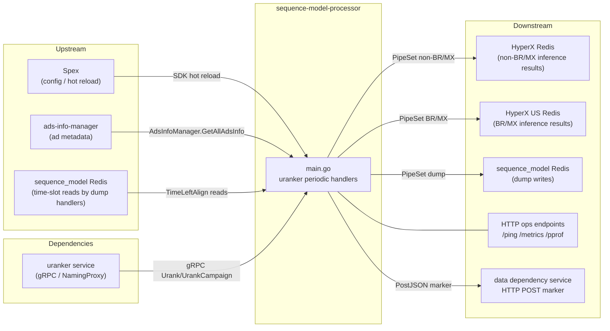

<!-- ads-workspace-gdoc-sync: gdoc_id=1P1062fCkHkHddKtXhEhSZNoxPnpKSpDL-s4EZaUEwxQ gdoc_url=https://docs.google.com/document/d/1P1062fCkHkHddKtXhEhSZNoxPnpKSpDL-s4EZaUEwxQ/edit -->

# sequence-model-processor

> Repository: https://git.garena.com/shopee/deep/paidads-bidding/sequence-model-processor

---

## Table of Contents

- [Introduction](#introduction)
- [Features](#features)
- [Architecture](#architecture)
  - [Service Topology](#service-topology)
  - [Startup and Data Flow](#startup-and-data-flow)
- [Directory Structure](#directory-structure)
- [Core Pipeline](#core-pipeline)
  - [Periodic Uranker Inference](#periodic-uranker-inference)
  - [Inference Result Validation](#inference-result-validation)
  - [Difference Interpolation Post-Processing](#difference-interpolation-post-processing)
  - [Dump Handlers and PostJSON Notification](#dump-handlers-and-postjson-notification)
- [Configuration](#configuration)
  - [Spex Service Config](#spex-service-config)
  - [Config Fields Reference](#config-fields-reference)
- [Development Guidelines](#development-guidelines)
  - [Code Style](#code-style)
  - [How to Add a New Periodic Handler](#how-to-add-a-new-periodic-handler)
  - [Project Structure](#project-structure)
  - [Naming Conventions](#naming-conventions)
  - [Error Handling](#error-handling)
  - [Unit Testing Standards](#unit-testing-standards)
  - [Code Review & Git Workflow](#code-review--git-workflow)
- [Deployment](#deployment)
  - [Build for Production](#build-for-production)
  - [Release Configuration](#release-configuration)
- [Monitoring](#monitoring)
  - [HTTP Endpoints](#http-endpoints)
  - [Prometheus Metrics](#prometheus-metrics)
- [Business Terminology Glossary](#business-terminology-glossary)
- [Additional Resources](#additional-resources)
- [Frequently Asked Questions](#frequently-asked-questions)

---

## Introduction

`sequence-model-processor` is the **near-line inference service** for the Ads Bidding team's sequence model pipeline. Its single responsibility is to run periodic uranker model inference over ads (at ads/campaign/category granularity) and write results into HyperX Redis so that downstream UltraCore and MPC decision modules can serve them at query time.

- **Service name**: `adsbidding.sequencemodelultravdataprocessor` (used for Spex registration)
- **Repository**: https://git.garena.com/shopee/deep/paidads-bidding/sequence-model-processor
- **Language / Build**: Go 1.24, built with `make sequence-model-svc`
- **RPC / HTTP**: No inbound RPC; exposes operational HTTP endpoints (`/ping`, `/metrics`, `/debug/pprof/*`, `/log/{level}`)

---

## Features

| Feature | Description |
|---------|-------------|
| Periodic uranker inference — ads-level (×11) | Up to 11 concurrent ads-level model inferences (`ModelsConfigAdsLevel[0..10]`); task-sharded via Redis distributed lock; results written to HyperX Redis (non-BR/MX) or HyperX US Redis (BR/MX) |
| Periodic uranker inference — campaign-level standard | `ModelsConfigCampaignLevel[0]`: scans all campaigns, runs near-line inference, writes to HyperX Redis |
| Periodic uranker inference — campaign-level ads-unified (GMS) | `ModelsConfigCampaignLevel[1]`: ranks each ad within GMS-pricing-type campaigns (`PRODUCT_SHOP_GMV_MAX_PRICING`), merges TimeSlot2X results, writes to HyperX Redis |
| Periodic dump — ads / cat / campaign level | Config-gated; dumps inference results to sequence_model Redis; sends PostJSON marker to the data dependency service upon completion |
| Inference result validation | `validateScoreResult()` checks NaN/Inf, negative values, per-slot monotonicity, global monotonicity, and ROI monotonicity; controlled via `ValidateExperiment` config |
| Difference interpolation post-processing | When `DifferenceInterpolationPlugIn=true`, applies coef-dimension linear interpolation on `gpu_biddingEnvModel_stats_roi` model output, aligning inference to each ad's `targetRoi` |
| HTTP operational endpoints | `/ping` (health check), `/metrics` (Prometheus), `/debug/pprof/*` (profiling), `/log/{level}` (dynamic log level) |

---

## Architecture

### Service Topology



**Topology Table**

| Direction | Name | Protocol | Description |
|-----------|------|----------|-------------|
| Upstream | Spex | Spex SDK | Provides dynamic config with hot reload; key: `config` |
| Upstream | ads-info-manager | In-process SDK | Provides all-ad metadata (`AdsInfoManager.GetAllAdsInfo`) for periodic handler scanning |
| Upstream | sequence_model Redis | Redis read | Dump handlers read 15-minute time-slot aligned timestamps via `TimeLeftAlign` |
| Dependency | uranker service | gRPC over NamingProxy | Near-line inference endpoint; naming path from `--naming_path` flag (default: live zk path) |
| Downstream | HyperX Redis | Redis write (PipeSet) | Stores ads/campaign-level inference results for non-BR/MX countries; read by UltraCore / MPC |
| Downstream | HyperX US Redis | Redis write (PipeSet) | Stores ads/campaign-level inference results for BR/MX countries |
| Downstream | sequence_model Redis | Redis write (PipeSet) | Dump handlers write inference results for offline sample generation |
| Downstream | data dependency service | HTTP POST | Dump handlers post DAILY markers upon task completion to trigger downstream offline pipelines |
| Downstream | HTTP ops endpoints | HTTP | `/ping`, `/metrics`, `/debug/pprof/*`, `/log/{level}` |

### Startup and Data Flow

`server/sequence_model/main.go` initializes in this order:

1. **Logger**: `util.InitLogger("info")`
2. **Spex init**: `spex.FastInitSpex()` + `spex.RegisterProcessor()`, service name `adsbidding.sequencemodelultravdataprocessor`
3. **Dynamic config load**: `dynamic.SetSequenceModelConfig()` loads Spex key `config` into `SequenceModelDataProcessorConfig`; goroutine listens for hot-reload updates
4. **EKL logger init**: `ekl.SetLogger("ekl", ...)`
5. **Dependency init**: `initSequenceMdelDependencies()` creates:
   - `sequenceModelRedisCli` (from `SequenceModelCli`)
   - `hyperxRedisCli` (from `HyperxRedisCli`, for non-BR/MX writes)
   - `hyperxUsRedisCli` (from `HyperxUsRedisCli`, for BR/MX writes)
   - `allAdInfoHandler` (from `AdsInfoManagerConfig` via `ads_info_manager.NewAdsInfoManager`)
   - `urankerService` (from `uranker.BuildUrankerService`, connects to uranker gRPC endpoint via NamingProxy)
6. **Periodic task startup** (all config-gated, up to 16 goroutines):
   - `ModelsConfigAdsLevel[0..10].RankerPeriodicHandler` → up to 11 `UrankerPeriodicHandler` goroutines
   - `ModelsConfigCampaignLevel[0].RankerPeriodicHandler` → `UrankerPeriodicHandlerCampaignLevel`
   - `ModelsConfigCampaignLevel[1].RankerPeriodicHandler` → `UrankerPeriodicHandlerCampaignLevelAdsUnified`
   - `DumpPeriodicHandler` → `UrankerDumpPeriodicHandler`
   - `DumpPeriodicHandlerCatLevel` → `UrankerDumpPeriodicHandlerCatLevel`
   - `DumpPeriodicHandlerCampaignLevel` → `UrankerDumpPeriodicHandlerCampaignLevel`
7. **HTTP server**: listens on `$PORT_HTTP`
8. **Graceful shutdown**: SIGINT/SIGTERM → calls `Stop()` on all handlers, waits 60 s, then closes HTTP server

---

## Directory Structure

```
sequence-model-processor/
├── server/sequence_model/
│   └── main.go                     # Entry point; starts handlers and HTTP server
├── config/
│   ├── processor.go                # DataProcessor config struct (legacy, for event-based processors not in use)
│   └── dynamic/
│       ├── config.go               # AlgoDataCalibrationConfig (calibration config)
│       └── sequence_model_config.go# SequenceModelDataProcessor / ModelConfig and Spex loading
├── pkg/
│   ├── handler/
│   │   ├── uranker_periodic_handler.go             # ads-level uranker periodic inference (×11)
│   │   ├── uranker_periodic_handler_campaign_level.go  # campaign-level uranker
│   │   ├── uranker_periodic_handler_campaign_level_ads_unified.go # GMS campaign-level
│   │   ├── uranker_dump_periodic_handler.go        # ads-level dump
│   │   ├── uranker_dump_periodic_handler_cat_level.go  # cat-level dump
│   │   └── uranker_dump_periodic_handler_campaign_level.go # campaign-level dump
│   ├── uranker/                    # UrankerService wrapper (gRPC, NamingProxy, validate, post-process)
│   │   ├── uranker.go              # UrankerService interface, Urank / UrankCampaignLevel methods
│   │   ├── internal.go             # BuildRankReq / Arrow IPC serialization
│   │   ├── adapt_proto.go          # Proto adaptation utilities
│   │   ├── validate.go             # validateScoreResult() and monotonicity checks
│   │   └── common.go
│   ├── data/
│   │   ├── sequence_model_redis/   # Redis client (Client interface, PipeSet, Lock, etc.)
│   │   ├── checksum/               # Content-hash dedup utility (used by legacy code)
│   │   ├── dedup_redis/
│   │   ├── internal_ad_info/       # Legacy ad info handler (ads_info_v1 / v3)
│   │   ├── join_redis/
│   │   └── kafka/                  # Kafka event producer (event_producer.go)
│   ├── ranker/                     # Legacy ranker wrapper
│   ├── pb/                         # TimeSlot2X protobuf (time_slot_2x.proto)
│   ├── http_handler/               # HTTP endpoint registration (/log/{level})
│   └── util/                       # Prometheus metrics export
├── internal/
│   └── abt/                        # A/B test bucketing utilities
├── srec/                           # srec protobuf definitions
├── deploy/
│   └── sequence-model-ultrav-data-processor.json  # SPEX deployment config
├── config/ekl_log.yml              # EKL logging config
├── go.mod
└── Makefile
```

---

## Core Pipeline

### Periodic Uranker Inference

`urankerPeriodHandler.runJob()` (`pkg/handler/uranker_periodic_handler.go`):

1. **Time alignment**: `nextTriggerTime()` computes the next interval-aligned time using `RankerUpdateIntervalInSec` and `RankerUpdateOffset`
2. **Distributed sharding lock**: for `task 1..RankerTaskNum`, attempts Redis SetNX (key: `URANKER_PERIODIC_{modelIdx}_{YYYYMMDDHHmm}_{task}`, TTL = interval/2); a single instance processes only the first successfully locked task
3. **Ad scanning**: `getPreAdsInfoByCountry()` calls `allAdInfoHandler.GetAllAdsInfo(country)`, filters by tag using bitmask, shards by `ads_id % taskNum == task-1`
4. **Concurrent inference**: ads are split into **5 groups**; within each group, chunks of `RankerChunkSize` call `urankerService.Urank()` via gRPC; 1% of requests log the full request/response for debugging
5. **Result writing**: on success, key format is `{modelPrefix}_{placement}_{country}_0_{ads_id}`; writes to `hyperxRedisCli.PipeSet()` (non-BR/MX) or `hyperxUsRedisCli.PipeSet()` (BR/MX)
6. **Timestamp**: reads `TimeLeftAlign` from sequence_model Redis (45 minutes before now, 15-minute aligned) for the `TimeSlot2X` timestamp field

**Campaign-level standard handler** (`uranker_periodic_handler_campaign_level.go`):

Same sharding/locking pattern (`URANKER_PERIODIC_CAMPAIGN_LEVEL_{YYYYMMDDHHmm}_{task}`), but scans by campaign dimension and calls `urankerService.UrankCampaignLevel()`.

**Campaign-level ads-unified / GMS handler** (`uranker_periodic_handler_campaign_level_ads_unified.go`):

Lock key: `URANKER_PERIODIC_CAMPAIGN_LEVEL_ADS_UNIFIED_{YYYYMMDDHHmm}_{task}`. Selects only `PRODUCT_SHOP_GMV_MAX_PRICING` / `PRODUCT_SHOP_GMV_MAX_PRICING_SIMPLE` pricing type ads, sharded by `campaign_id % taskNum`. For each campaign, calls `urankerService.UrankCampainLevelAdsUnified()` per ad to get `TimeSlot2X`, then merges via `mergeCampaignRes()`. Key format: `{modelPrefix}_{placement}_{country}_0_{campaign_id}`.

### Inference Result Validation

`validateScoreResult()` (`pkg/uranker/validate.go`) — controlled by `ValidateExperiment` config:

| Check | Description |
|-------|-------------|
| NaN / Inf | Rejects any coef-dimension value containing NaN or Infinity |
| Negative values | Rejects any negative numeric values in coef info |
| All-zero | Rejects results where every value is zero |
| Per-slot monotonicity | Checks that GMV/Cost increase with coef within each slot; flags slots with violations; rejects if violation ratio > `MonotonicViolationThreshold` (default 0.5) |
| Global monotonicity | Checks monotonicity across all slots |
| Global ROI monotonicity | Checks that ROI does not have more than `ROIMaxIncreasingPoints` (default 4) increasing points |

Activation modes:
- `ValidateExperiment.GlobalEnable = true`: validates all ads
- `ValidateExperiment.ExpEnable = true`: validates only ads where `ads_id % LayerNum % 10 ∈ BucketIDs`

When validation fails, the inference result for that ad is discarded (not written to HyperX Redis).

### Difference Interpolation Post-Processing

`slotInfoPostProcess()` (`pkg/uranker/uranker.go`):

When `DifferenceInterpolationPlugIn = true` and model name is `gpu_biddingEnvModel_stats_roi`, applies linear interpolation/extrapolation (`differenceInterpolation()`) on each slot's coef dimension using `coef / modelRoi` as x-axis, mapping original coef values to y values at `coef / targetRoi`. This aligns inference output to each ad's `targetRoi`.

### Dump Handlers and PostJSON Notification

Dump handlers run daily (`updateIntervalInSec = 86400`) and dump inference results to `sequence_model Redis` for offline sample generation.

After the task completes (task == 1 instance only), `PostJSON()` sends a DAILY marker to the data dependency service at `https://dependency.idata.shopeemobile.com/data-dependency/v1/marker/instance`:

| Handler | Marker name |
|---------|-------------|
| `UrankerDumpPeriodicHandler` | `ade_ads_sequence_sample_uranker_dump` |
| `UrankerDumpPeriodicHandlerCatLevel` | `ade_ads_sequence_sample_cat_level_uranker_dump` |
| `UrankerDumpPeriodicHandlerCampaignLevel` | `ade_ads_sequence_sample_campaign_level_uranker_dump` |

---

## Configuration

### Spex Service Config

Service name: `adsbidding.sequencemodelultravdataprocessor` (defined in `main.go`)

Config is loaded via `dynamic.SetSequenceModelConfig()` (Spex key: `config`) and hot-reloaded in a goroutine without service restart.

There is also a calibration config key `algo_data_calibration` loaded via `AlgoDataCalibrationConfig` in `config/dynamic/config.go` for `AlgoDataCalibrationsVersion1` / `AlgoDataCalibrationsVersion2` (PCR bucket and price level calibration tables).

### Config Fields Reference

`SequenceModelDataProcessor` (`config/dynamic/sequence_model_config.go`):

| Field | Type | Description |
|-------|------|-------------|
| `LogLevel` | `string` | Log level (info/debug/fatal) |
| `GracefulPeriod` | `string` | Graceful shutdown duration (e.g., `"30s"`) |
| `SequenceModelCli` | `cacheConfig` | sequence_model Redis connection (addr, poolSize, TTL) |
| `SequenceModelFeatureCli` | `cacheConfig` | sequence_model feature Redis connection (legacy, available but not used by main handlers) |
| `HyperxRedisCli` | `cacheConfig` | HyperX Redis connection for non-BR/MX inference result writes |
| `HyperxUsRedisCli` | `cacheConfig` | HyperX US Redis connection for BR/MX inference result writes |
| `AdsInfoManagerConfig` | `ads_info_manager.Config` | ads-info-manager config for ad metadata loading |
| `ModelsConfigAdsLevel` | `[]ModelConfig` | ads-level model config list; indices 0..10, up to 11 models |
| `ModelsConfigCampaignLevel` | `[]ModelConfig` | campaign-level model config; index 0: standard campaign handler; index 1: ads-unified/GMS handler |
| `DumpPeriodicHandler` | `bool` | Enable ads-level dump |
| `DumpModelName` | `string` | Model name for ads-level dump |
| `DumpTaskNum` | `int` | Task shard count for ads-level dump |
| `DumpCountries` | `[]string` | Countries for ads-level dump |
| `DumpTags` | `[]int` | Ad tag filter for ads-level dump |
| `DumpPeriodicHandlerCatLevel` | `bool` | Enable cat-level dump |
| `DumpPeriodicHandlerCampaignLevel` | `bool` | Enable campaign-level dump |
| `ValidateExperiment` | `ValidateExperimentConfig` | Inference result monotonicity validation config |
| `DifferenceInterpolationPlugIn` | `bool` | Enable difference interpolation post-processing for `gpu_biddingEnvModel_stats_roi` |

`ModelConfig`:

| Field | Description |
|-------|-------------|
| `RankerModelIndex` | 1-based model index (matches array position + 1) |
| `RankerPeriodicHandler` | Enable switch for this model |
| `RankerUpdateIntervalInSec` | Inference trigger interval in seconds |
| `RankerUpdateOffset` | Trigger alignment offset in seconds |
| `RankerChunkSize` | Ads processed per gRPC call |
| `RankerModelName` | Model name passed to uranker |
| `RankerModelPrefix` | Prefix used in HyperX Redis key format |
| `RankerTaskNum` | Number of distributed shards |
| `RankerCountries` | Countries to process |
| `RankerTags` | Ad tag filters |

`ValidateExperimentConfig`:

| Field | Description |
|-------|-------------|
| `GlobalEnable` | Enable validation for all ads |
| `ExpEnable` | Enable validation for experiment bucket only |
| `LayerNum` | Bucketing layer number; bucket = `ads_id % LayerNum % 10` |
| `BucketIDs` | List of bucket IDs to validate |
| `MonotonicViolationThreshold` | Max allowed per-slot monotonicity violation ratio (default 0.5) |
| `ROIMaxIncreasingPoints` | Max allowed ROI increasing points (default 4) |

---

## Development Guidelines

### Code Style

- Follows standard Go formatting; run `make fmt` (`go fmt ./...`) before committing
- CI checks: `make ci` (runs `ci-vet` + `ci-fmt` + `unittest`)

```bash
make fmt           # go fmt ./...
make vet           # go vet ./...
make unittest      # go test -cover ./...
make ci            # Simulate CI
```

### How to Add a New Periodic Handler

1. Create `pkg/handler/{name}_periodic_handler.go` implementing `Start()` and `Stop()` (see `uranker_periodic_handler.go` as reference)
2. Add the corresponding switch and config fields to `SequenceModelDataProcessor` in `config/dynamic/sequence_model_config.go`
3. In `main.go`, after `initSequenceMdelDependencies()`, conditionally initialize and `go handler.Start()` based on the config switch
4. Add `handler.Stop()` call in `stopGracefully()`

### Project Structure

- `server/` contains independent main packages (currently only `sequence_model`)
- `pkg/handler/` contains periodic task implementations
- `pkg/uranker/` contains the inference wrapper and post-processing logic
- `pkg/data/` contains storage clients (Redis, Kafka producer)
- Common config definitions live in `config/` and `config/dynamic/`

### Naming Conventions

- File names: `snake_case` (e.g., `uranker_periodic_handler.go`)
- Interface names: descriptive of the role (e.g., `UrankerPeriodicHandler`, `UrankerService`, `Client`)
- Redis key constants: `UPPER_SNAKE_CASE` (e.g., `UrankerKeyFormat = "URANKER_PERIODIC_%d_%s_%d"`)
- Prometheus metric labels: `{country, component, type/err}`

### Error Handling

- All errors are exported as Prometheus metrics via `util.ExportError(country, component, err)` (`paidads_ultrav_data_processor_error`)
- Config loading failures cause immediate `return` in main
- Handler errors during `runJob()` are logged and metrics exported, but the periodic job continues

### Unit Testing Standards

Unit tests co-located with source files (`_test.go` suffix):

- `pkg/uranker/validate.go` — validation logic can be unit-tested with mock `TimeSlot2X` protos

Run:

```bash
make unittest        # go test -cover ./...
```

### Code Review & Git Workflow

- MR title must follow the format: `(Feat|Fix|Docs|Style|Refactor|Test|Chore): [content] description` and include a Jira ticket `SPPA-xxxx`
- CI pipeline runs `make ci` (vet + fmt + unittest)
- Tag notifications trigger for tags matching `sequence-model-processor-v\d+.\d+.\d+.*`

---

## Deployment

### Build for Production

```bash
make sequence-model-svc
# Equivalent to: go build -o bin/sequence-data-processor server/sequence_model/*.go
```

Output binary: `bin/sequence-data-processor`

### Release Configuration

Deployment config file: `deploy/sequence-model-ultrav-data-processor.json`

| Field | Value |
|-------|-------|
| `project_name` | `adsbidding` |
| `module_name` | `sequencemodelultravdataprocessor` |
| `build.commands` | `make sequence-model-svc` |
| `docker_image.base_image` | `harbor.shopeemobile.com/shopee/golang-base:1.24.5-24` |
| `run.command` | Sets `GOMEMLIMIT` to 78% of cgroup memory limit, then `./bin/sequence-data-processor` |
| `run.enable_prometheus` | `true` |
| `run.smoke.endpoint` | `/ping` (grace period 1200 s, retry every 10 s up to 180 times) |
| `run.check.endpoint` | `/ping` (stops after 60 consecutive failures) |

---

## Monitoring

### HTTP Endpoints

| Endpoint | Source | Description |
|----------|--------|-------------|
| `/ping` | `paidadscommon/pkg/http_handler` | Health check, returns 200 |
| `/metrics` | `paidadscommon/pkg/http_handler` | Prometheus metrics |
| `/debug/pprof/*` | `paidadscommon/pkg/http_handler` | Go pprof profiling |
| `/log/debug` | `pkg/http_handler/handler.go` | Switch log level to debug |
| `/log/info` | `pkg/http_handler/handler.go` | Switch log level to info |
| `/log/fatal` | `pkg/http_handler/handler.go` | Switch log level to fatal |

Quick operations (requires service running with `HTTP_PORT` file present):

```bash
make debug    # curl -XPUT 127.0.0.1:$(cat HTTP_PORT)/log/debug
make info     # curl -XPUT 127.0.0.1:$(cat HTTP_PORT)/log/info
make fatal    # curl -XPUT 127.0.0.1:$(cat HTTP_PORT)/log/fatal
make metrics  # curl 127.0.0.1:$(cat HTTP_PORT)/metrics
```

### Prometheus Metrics

Namespace: `paidads`, subsystem: `ultrav_data_processor`:

| Metric | Type | Labels | Description |
|--------|------|--------|-------------|
| `paidads_ultrav_data_processor_count` | Counter | country, component, type | Event / operation counts |
| `paidads_ultrav_data_processor_latency` | Summary (P50/P90/P99) | country, component, type | Latency per component |
| `paidads_ultrav_data_processor_error` | Counter | country, component, err | Error counts |

Key `component` label values:

- `sequence_model_uranker_runJob` — overall per-run latency
- `new_uranker_rank1` … `new_uranker_rank11` — per ads-level model inference
- `send_tracking_kafka` — Kafka producer calls (triggered by event-path code if activated)

---

## Business Terminology Glossary

| Term | Description |
|------|-------------|
| eCPM | Effective Cost per Mille; total ad spend / total impressions × 1000 |
| uGSP | Unified Generalized Second Price bidding mechanism |
| SPEX / Spex | Shopee internal service configuration framework with hot reload |
| spcli | Shopee internal CLI for local Spex config setup |
| EKL | Enhanced Kafka Library; Shopee internal Kafka consumer/producer framework |
| uranker | Shopee internal near-line inference service framework; called via gRPC over NamingProxy |
| NamingProxy | Shopee service discovery proxy backed by ZooKeeper |
| HyperX Redis | Redis storing uranker inference results, read by UltraCore / MPC at query time |
| HyperX US Redis | Separate HyperX Redis cluster for BR/MX countries |
| sequence_model Redis | Redis storing inference dump results for offline sample generation |
| TimeSlot2X | Protobuf message containing per-slot coef-dimension inference output |
| ads-info-manager | Ad metadata service; provides `GetAllAdsInfo(country)` for periodic handler scanning |
| UltraCore | Downstream real-time serving module that reads HyperX Redis at bid time |
| MPC | Downstream decision module; reads HyperX Redis for multi-pricing control |
| GMS | GMV-Max Strategy; a campaign pricing type (`PRODUCT_SHOP_GMV_MAX_PRICING`) targeting maximum GMV |
| CIR | Cost-Income-Ratio; ad spend / ad GMV |
| data dependency service | Internal platform at `dependency.idata.shopeemobile.com` that receives PostJSON markers for offline pipeline scheduling |

---

## Additional Resources

- **Repository**: https://git.garena.com/shopee/deep/paidads-bidding/sequence-model-processor
- **Sequence Model TD Document**: https://docs.google.com/document/d/1FIwyGqFUwC31YPx7tHgn2FR7eCmnTvYxW5FEtznL0A0/edit
- **Sequence Model Architecture Update (Workflow Refactor)**: https://docs.google.com/document/d/11tkLjUnFSkSDRJ9gWW389VnQ6KrSaU9hQXrktNtkMnQ/edit
- **Paid Ads Glossary**: https://confluence.shopee.io/pages/viewpage.action?spaceKey=SPAD&title=Paid+Ads+Glossary
- **SPEX Go SDK Quick Start**: https://spex.shopee.io/overview/quick-start/languages/go/index.html
- **spcli Installation and Git Configuration**: https://spex.shopee.io/user-guide/SDK/Java/local.html

---

## Frequently Asked Questions

**Q1: What does this service do, and what did it previously do that it no longer does?**

A: The service now exclusively runs periodic near-line model inference (uranker) over ads, writing results to HyperX Redis for real-time serving. Previously, the codebase also implemented an event aggregation pipeline (consuming Kafka topics: tracking, translog, order, searchlog, user_behavior) to produce 15-minute aggregated features. That entire pipeline — `EventHandler`, all `Processor` implementations, `PostProcessor`, `MetricGenerator`, `MetricWriter`, and associated handlers (`DelPeriodicHandler`, `RankerPeriodicHandler`, `StatModelPeriodicHandler`) — has been removed from the codebase.

**Q2: Why are there still directories like `pkg/data/checksum/`, `pkg/data/kafka/`, `pkg/data/internal_ad_info/` if the event pipeline was removed?**

A: These packages remain in the repository but are no longer referenced by the active main entry. They are legacy code kept for reference or potential future use. `pkg/data/kafka/event_producer.go` contains a Kafka producer that was used by the event pipeline; `pkg/data/checksum/` and `pkg/data/internal_ad_info/` served the same pipeline. They do not affect the running service.

**Q3: How does task sharding prevent multiple instances from duplicating inference work?**

A: In each `runJob()`, for task indices `1..RankerTaskNum`, the handler attempts `Redis SetNX` (key: `URANKER_PERIODIC_{modelIdx}_{YYYYMMDDHHmm}_{task}`, TTL = interval/2). A single instance acquires only the first task it wins the lock for. Ads are then sharded by `ads_id % taskNum == task-1`, so different instances cover non-overlapping ad slices. The campaign-level handlers use analogous key formats.

**Q4: What do HyperX Redis vs. sequence_model Redis store?**

A:
- **HyperX Redis**: Stores uranker inference results (key: `{modelPrefix}_{placement}_{country}_0_{ads_id}`) for non-BR/MX countries; read by UltraCore / MPC at query time.
- **HyperX US Redis**: Same structure for BR/MX countries.
- **sequence_model Redis**: Written only by dump handlers; stores full inference result dumps for offline sample generation by downstream data pipelines.

**Q5: How does the inference result validation work and how is it activated?**

A: `validateScoreResult()` in `pkg/uranker/validate.go` checks for NaN/Inf, negative values, all-zero output, per-slot monotonicity violations (threshold configurable via `MonotonicViolationThreshold`), global monotonicity, and ROI monotonicity (max increasing points via `ROIMaxIncreasingPoints`). Enable globally via `ValidateExperiment.GlobalEnable = true`, or for specific experiment buckets via `ExpEnable + LayerNum + BucketIDs`. Failed validations discard the result for that ad without affecting other ads.

**Q6: What is the difference interpolation post-processing and when should it be enabled?**

A: When `DifferenceInterpolationPlugIn = true`, `slotInfoPostProcess()` adjusts inference output for the model `gpu_biddingEnvModel_stats_roi` by applying linear interpolation on each slot's coef dimension: it maps the original coef values to the y-values that correspond to `coef / targetRoi`, using `coef / modelRoi` as the x-axis. This aligns the model output to an ad's actual `targetRoi`, correcting for model-target mismatch without re-running inference.

**Q7: How do I change the log level at runtime?**

A: Call `make debug`, `make info`, or `make fatal` (requires the service running with `HTTP_PORT` file present), or directly:
```bash
curl -XPUT 127.0.0.1:<port>/log/debug
```
Allowed levels: `debug`, `info`, `fatal`.

**Q8: Why is the build target `sequence-model-svc` but the deployment artifact was previously named `ultrav-data-processor`?**

A: Historical naming artifact. The service was originally a sequence-model variant of `ultrav-data-processor`. The Makefile target is `sequence-model-svc` and the current output binary is `bin/sequence-data-processor` (as of the latest main.go build command), but SPEX deployment configs and operational scripts may still reference the old name. The service name in Spex (`sequencemodelultravdataprocessor`) is the canonical identifier.

<!-- Generated by ads-workspace/skills/ads-readme-generate | checked: f9030251d05823e0e483c2e5a494a67dbd01aaf4 | spec: 76fce5f679f9550b -->
