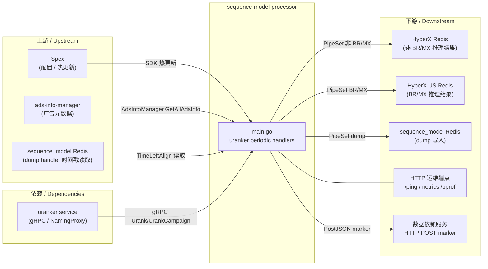

<!-- ads-workspace-gdoc-sync: gdoc_id=13mM0MEqoBOF51RDR9RVxSXikCQB55odOZliBGVUtSD8 gdoc_url=https://docs.google.com/document/d/13mM0MEqoBOF51RDR9RVxSXikCQB55odOZliBGVUtSD8/edit -->

# sequence-model-processor

> 仓库地址：https://git.garena.com/shopee/deep/paidads-bidding/sequence-model-processor

---

## 目录 / Table of Contents

- [项目概述](#项目概述)
- [核心功能](#核心功能)
- [项目架构](#项目架构)
  - [上下游调用拓扑](#上下游调用拓扑)
  - [启动流程与数据流](#启动流程与数据流)
- [目录结构](#目录结构)
- [核心流程](#核心流程)
  - [周期性 uranker 推理](#周期性-uranker-推理)
  - [推理结果验证](#推理结果验证)
  - [差值插值后处理](#差值插值后处理)
  - [dump 任务与 PostJSON 通知](#dump-任务与-postjson-通知)
- [配置说明](#配置说明)
  - [Spex 服务配置](#spex-服务配置)
  - [配置字段说明](#配置字段说明)
- [开发规范](#开发规范)
  - [代码风格](#代码风格)
  - [新增周期任务](#新增周期任务)
  - [项目结构](#项目结构)
  - [命名规范](#命名规范)
  - [错误处理](#错误处理)
  - [单元测试规范](#单元测试规范)
  - [Code Review 与 Git 工作流](#code-review-与-git-工作流)
- [部署](#部署)
  - [生产构建](#生产构建)
  - [发布配置](#发布配置)
- [监控](#监控)
  - [HTTP 端点](#http-端点)
  - [Prometheus 指标](#prometheus-指标)
- [业务术语表](#业务术语表)
- [参考资料](#参考资料)
- [常见问题](#常见问题)

---

## 项目概述

`sequence-model-processor` 是 Ads Bidding 团队序列模型链路的**近线推理服务**。其职责单一：对全量广告（按 ads/campaign/类目粒度）定期执行 uranker 模型推理，并将推理结果写入 HyperX Redis，供下游 UltraCore 和 MPC 决策模块在查询时读取。

- **服务名**：`adsbidding.sequencemodelultravdataprocessor`（用于 Spex 注册）
- **仓库地址**：https://git.garena.com/shopee/deep/paidads-bidding/sequence-model-processor
- **语言 / 构建**：Go 1.24，通过 `make sequence-model-svc` 构建
- **RPC / HTTP**：无入站 RPC；暴露运维 HTTP 端点（`/ping`、`/metrics`、`/debug/pprof/*`、`/log/{level}`）

---

## 核心功能

| 功能 | 说明 |
|------|------|
| 周期性 uranker 推理 — ads-level（×11） | 最多支持 11 个并发 ads-level 模型推理（`ModelsConfigAdsLevel[0..10]`）；通过 Redis 分布式锁按 task 分片；非 BR/MX 结果写入 HyperX Redis，BR/MX 写入 HyperX US Redis |
| 周期性 uranker 推理 — campaign-level 标准 | `ModelsConfigCampaignLevel[0]`：扫描全量 campaign，执行近线推理，写入 HyperX Redis |
| 周期性 uranker 推理 — campaign-level ads-unified（GMS） | `ModelsConfigCampaignLevel[1]`：对 GMS 定价类型广告（`PRODUCT_SHOP_GMV_MAX_PRICING`）逐 ads 推理并合并 TimeSlot2X 结果，写入 HyperX Redis |
| 周期性 dump — ads / cat / campaign 级别 | 受配置开关控制；将推理结果 dump 至 sequence_model Redis；完成后向数据依赖服务发送 PostJSON marker |
| 推理结果验证 | `validateScoreResult()` 检查 NaN/Inf、负值、per-slot 单调性、全局单调性及 ROI 单调性；受 `ValidateExperiment` 配置控制 |
| 差值插值后处理 | `DifferenceInterpolationPlugIn=true` 时，对 `gpu_biddingEnvModel_stats_roi` 模型输出的 coef 维度执行线性插值，将推理结果对齐到广告的 `targetRoi` |
| HTTP 运维端点 | `/ping`（健康检查）、`/metrics`（Prometheus）、`/debug/pprof/*`（性能分析）、`/log/{level}`（动态日志级别） |

---

## 项目架构

### 上下游调用拓扑



**拓扑表格**

| 方向 | 名称 | 协议 | 说明 |
|------|------|------|------|
| 上游 | Spex | Spex SDK | 提供动态配置和热更新；key: `config` |
| 上游 | ads-info-manager | 进程内 SDK | 提供全量广告元数据（`AdsInfoManager.GetAllAdsInfo`），供周期任务扫描使用 |
| 上游 | sequence_model Redis | Redis 读取 | dump handler 通过 `TimeLeftAlign` 读取 15 分钟对齐的时间戳 |
| 依赖 | uranker service | gRPC over NamingProxy | 近线推理端点；命名路径通过 `--naming_path` 参数指定（默认使用生产 zk 路径） |
| 下游 | HyperX Redis | Redis 写入（PipeSet） | 存储非 BR/MX 国家的 ads/campaign 推理结果；由 UltraCore / MPC 读取 |
| 下游 | HyperX US Redis | Redis 写入（PipeSet） | 存储 BR/MX 国家的 ads/campaign 推理结果 |
| 下游 | sequence_model Redis | Redis 写入（PipeSet） | dump handler 写入推理结果，用于离线样本生成 |
| 下游 | 数据依赖服务 | HTTP POST | dump handler 完成后发送 DAILY marker，触发下游离线管道 |
| 下游 | HTTP 运维端点 | HTTP | `/ping`、`/metrics`、`/debug/pprof/*`、`/log/{level}` |

### 启动流程与数据流

`server/sequence_model/main.go` 按以下顺序初始化：

1. **日志初始化**：`util.InitLogger("info")`
2. **Spex 初始化**：`spex.FastInitSpex()` + `spex.RegisterProcessor()`，服务名 `adsbidding.sequencemodelultravdataprocessor`
3. **动态配置加载**：`dynamic.SetSequenceModelConfig()` 将 Spex key `config` 加载到 `SequenceModelDataProcessorConfig`；goroutine 监听热更新
4. **EKL 日志初始化**：`ekl.SetLogger("ekl", ...)`
5. **依赖初始化**：`initSequenceMdelDependencies()` 创建：
   - `sequenceModelRedisCli`（来自 `SequenceModelCli`）
   - `hyperxRedisCli`（来自 `HyperxRedisCli`，用于非 BR/MX 写入）
   - `hyperxUsRedisCli`（来自 `HyperxUsRedisCli`，用于 BR/MX 写入）
   - `allAdInfoHandler`（来自 `AdsInfoManagerConfig`，通过 `ads_info_manager.NewAdsInfoManager`）
   - `urankerService`（来自 `uranker.BuildUrankerService`，通过 NamingProxy 连接 uranker gRPC 端点）
6. **周期任务启动**（均受配置开关控制，最多 16 个 goroutine）：
   - `ModelsConfigAdsLevel[0..10].RankerPeriodicHandler` → 最多 11 个 `UrankerPeriodicHandler` goroutine
   - `ModelsConfigCampaignLevel[0].RankerPeriodicHandler` → `UrankerPeriodicHandlerCampaignLevel`
   - `ModelsConfigCampaignLevel[1].RankerPeriodicHandler` → `UrankerPeriodicHandlerCampaignLevelAdsUnified`
   - `DumpPeriodicHandler` → `UrankerDumpPeriodicHandler`
   - `DumpPeriodicHandlerCatLevel` → `UrankerDumpPeriodicHandlerCatLevel`
   - `DumpPeriodicHandlerCampaignLevel` → `UrankerDumpPeriodicHandlerCampaignLevel`
7. **HTTP server 启动**：监听 `$PORT_HTTP`
8. **优雅退出**：接收 SIGINT/SIGTERM → 依次调用所有 handler 的 `Stop()`，等待 60 秒后关闭 HTTP server

---

## 目录结构

```
sequence-model-processor/
├── server/sequence_model/
│   └── main.go                     # 入口；启动 handler 和 HTTP server
├── config/
│   ├── processor.go                # DataProcessor 配置结构（旧版，供历史事件类 processor 使用）
│   └── dynamic/
│       ├── config.go               # AlgoDataCalibrationConfig（校准配置）
│       └── sequence_model_config.go# SequenceModelDataProcessor / ModelConfig 及 Spex 加载
├── pkg/
│   ├── handler/
│   │   ├── uranker_periodic_handler.go             # ads-level uranker 周期推理（×11）
│   │   ├── uranker_periodic_handler_campaign_level.go  # campaign-level uranker
│   │   ├── uranker_periodic_handler_campaign_level_ads_unified.go # GMS campaign-level
│   │   ├── uranker_dump_periodic_handler.go        # ads-level dump
│   │   ├── uranker_dump_periodic_handler_cat_level.go  # cat-level dump
│   │   └── uranker_dump_periodic_handler_campaign_level.go # campaign-level dump
│   ├── uranker/                    # UrankerService 封装（gRPC、NamingProxy、验证、后处理）
│   │   ├── uranker.go              # UrankerService 接口，Urank / UrankCampaignLevel 方法
│   │   ├── internal.go             # BuildRankReq / Arrow IPC 序列化
│   │   ├── adapt_proto.go          # Proto 适配工具
│   │   ├── validate.go             # validateScoreResult() 及单调性检查
│   │   └── common.go
│   ├── data/
│   │   ├── sequence_model_redis/   # Redis 客户端（Client 接口、PipeSet、Lock 等）
│   │   ├── checksum/               # 内容哈希去重工具（旧代码，当前未被主入口引用）
│   │   ├── dedup_redis/
│   │   ├── internal_ad_info/       # 旧版广告元数据 handler（ads_info_v1 / v3）
│   │   ├── join_redis/
│   │   └── kafka/                  # Kafka 事件生产者（event_producer.go）
│   ├── ranker/                     # 旧版 ranker 封装
│   ├── pb/                         # TimeSlot2X protobuf（time_slot_2x.proto）
│   ├── http_handler/               # HTTP 端点注册（/log/{level}）
│   └── util/                       # Prometheus 指标导出
├── internal/
│   └── abt/                        # A/B test 分桶工具
├── srec/                           # srec protobuf 定义
├── deploy/
│   └── sequence-model-ultrav-data-processor.json  # SPEX 部署配置
├── config/ekl_log.yml              # EKL 日志配置
├── go.mod
└── Makefile
```

---

## 核心流程

### 周期性 uranker 推理

`urankerPeriodHandler.runJob()`（`pkg/handler/uranker_periodic_handler.go`）：

1. **时间对齐**：`nextTriggerTime()` 使用 `RankerUpdateIntervalInSec` 和 `RankerUpdateOffset` 计算下一个整周期对齐时间点
2. **分布式分片锁**：对 `task 1..RankerTaskNum`，尝试 Redis SetNX（key: `URANKER_PERIODIC_{modelIdx}_{YYYYMMDDHHmm}_{task}`，TTL = interval/2）；单实例只处理首个加锁成功的 task
3. **广告扫描**：`getPreAdsInfoByCountry()` 调用 `allAdInfoHandler.GetAllAdsInfo(country)`，按 tag 位掩码过滤，按 `ads_id % taskNum == task-1` 分片
4. **并发推理**：将广告平均分为 **5 组**；每组内按 `RankerChunkSize` 分 chunk 调用 `urankerService.Urank()`（gRPC）；1% 的请求会完整记录 request/response 用于调试
5. **结果写入**：推理成功后，key 格式为 `{modelPrefix}_{placement}_{country}_0_{ads_id}`；非 BR/MX 写入 `hyperxRedisCli.PipeSet()`，BR/MX 写入 `hyperxUsRedisCli.PipeSet()`
6. **时间戳**：从 sequence_model Redis 读取 `TimeLeftAlign`（当前时间前 45 分钟的 15 分钟对齐时间戳），用于 `TimeSlot2X` 的 timestamp 字段

**campaign-level 标准 handler**（`uranker_periodic_handler_campaign_level.go`）：

分片锁方式相同（lock key: `URANKER_PERIODIC_CAMPAIGN_LEVEL_{YYYYMMDDHHmm}_{task}`），但按 campaign 维度扫描并调用 `urankerService.UrankCampaignLevel()`。

**campaign-level ads-unified / GMS handler**（`uranker_periodic_handler_campaign_level_ads_unified.go`）：

lock key: `URANKER_PERIODIC_CAMPAIGN_LEVEL_ADS_UNIFIED_{YYYYMMDDHHmm}_{task}`。筛选 `PRODUCT_SHOP_GMV_MAX_PRICING` / `PRODUCT_SHOP_GMV_MAX_PRICING_SIMPLE` 定价类型的广告，按 `campaign_id % taskNum` 分片。对每个 campaign 下各 ads 分别调用 `urankerService.UrankCampainLevelAdsUnified()` 获取 `TimeSlot2X`，通过 `mergeCampaignRes()` 合并结果。key 格式：`{modelPrefix}_{placement}_{country}_0_{campaign_id}`。

### 推理结果验证

`validateScoreResult()`（`pkg/uranker/validate.go`）— 受 `ValidateExperiment` 配置控制：

| 检查项 | 说明 |
|--------|------|
| NaN / Inf | 拒绝任何 coef 维度值包含 NaN 或 Infinity 的结果 |
| 负值 | 拒绝 coef info 中含有负数值的结果 |
| 全零 | 拒绝所有值均为零的结果 |
| per-slot 单调性 | 检查每个 slot 内 GMV/Cost 是否随 coef 单调递增；若违反比例 > `MonotonicViolationThreshold`（默认 0.5）则拒绝 |
| 全局单调性 | 检查跨所有 slot 的单调性 |
| 全局 ROI 单调性 | 检查 ROI 递增点数是否超过 `ROIMaxIncreasingPoints`（默认 4） |

激活方式：
- `ValidateExperiment.GlobalEnable = true`：验证全量广告
- `ValidateExperiment.ExpEnable = true`：仅验证满足 `ads_id % LayerNum % 10 ∈ BucketIDs` 条件的广告

验证失败时，该广告的推理结果被丢弃（不写入 HyperX Redis），不影响其他广告。

### 差值插值后处理

`slotInfoPostProcess()`（`pkg/uranker/uranker.go`）：

当 `DifferenceInterpolationPlugIn = true` 且模型名为 `gpu_biddingEnvModel_stats_roi` 时，对每个 slot 的 coef 维度数据执行线性内插/外插（`differenceInterpolation()`）：以 `coef / modelRoi` 为 x 轴，将原始 coef 值映射到 `coef / targetRoi` 对应的 y 值。这使推理输出与广告实际 `targetRoi` 对齐，无需重新推理即可修正模型输出与目标 ROI 的偏差。

### dump 任务与 PostJSON 通知

dump handler 按日执行（`updateIntervalInSec = 86400`），将推理结果 dump 至 `sequence_model Redis`，供离线样本生成使用。

任务完成后（仅 task == 1 的实例），`PostJSON()` 向数据依赖服务 `https://dependency.idata.shopeemobile.com/data-dependency/v1/marker/instance` 发送 DAILY marker 通知：

| Handler | Marker 名称 |
|---------|-------------|
| `UrankerDumpPeriodicHandler` | `ade_ads_sequence_sample_uranker_dump` |
| `UrankerDumpPeriodicHandlerCatLevel` | `ade_ads_sequence_sample_cat_level_uranker_dump` |
| `UrankerDumpPeriodicHandlerCampaignLevel` | `ade_ads_sequence_sample_campaign_level_uranker_dump` |

---

## 配置说明

### Spex 服务配置

服务名：`adsbidding.sequencemodelultravdataprocessor`（在 `main.go` 中定义）

配置通过 `dynamic.SetSequenceModelConfig()`（Spex key: `config`）加载，并在 goroutine 中监听热更新，无需重启服务。

另有一个校准配置 key `algo_data_calibration`，通过 `config/dynamic/config.go` 中的 `AlgoDataCalibrationConfig` 加载，用于 `AlgoDataCalibrationsVersion1` / `AlgoDataCalibrationsVersion2`（PCR bucket 和价格层级校准表）。

### 配置字段说明

`SequenceModelDataProcessor`（`config/dynamic/sequence_model_config.go`）：

| 字段 | 类型 | 说明 |
|------|------|------|
| `LogLevel` | `string` | 日志级别（info/debug/fatal） |
| `GracefulPeriod` | `string` | 优雅退出时长（如 `"30s"`） |
| `SequenceModelCli` | `cacheConfig` | sequence_model Redis 连接配置（地址、连接池大小、TTL） |
| `SequenceModelFeatureCli` | `cacheConfig` | sequence_model feature Redis 连接配置（旧版，主 handler 不使用） |
| `HyperxRedisCli` | `cacheConfig` | HyperX Redis 连接配置，用于非 BR/MX 推理结果写入 |
| `HyperxUsRedisCli` | `cacheConfig` | HyperX US Redis 连接配置，用于 BR/MX 推理结果写入 |
| `AdsInfoManagerConfig` | `ads_info_manager.Config` | ads-info-manager 配置，用于广告元数据加载 |
| `ModelsConfigAdsLevel` | `[]ModelConfig` | ads-level 模型配置列表；下标 0..10，最多支持 11 个模型 |
| `ModelsConfigCampaignLevel` | `[]ModelConfig` | campaign-level 模型配置；下标 0：标准 campaign handler；下标 1：ads-unified/GMS handler |
| `DumpPeriodicHandler` | `bool` | 开启 ads-level dump |
| `DumpModelName` | `string` | ads-level dump 使用的模型名 |
| `DumpTaskNum` | `int` | ads-level dump 的任务分片数 |
| `DumpCountries` | `[]string` | ads-level dump 处理的国家列表 |
| `DumpTags` | `[]int` | ads-level dump 的广告 tag 过滤 |
| `DumpPeriodicHandlerCatLevel` | `bool` | 开启 cat-level dump |
| `DumpPeriodicHandlerCampaignLevel` | `bool` | 开启 campaign-level dump |
| `ValidateExperiment` | `ValidateExperimentConfig` | 推理结果单调性验证配置 |
| `DifferenceInterpolationPlugIn` | `bool` | 开启差值插值后处理（针对 `gpu_biddingEnvModel_stats_roi` 模型） |

`ModelConfig`：

| 字段 | 说明 |
|------|------|
| `RankerModelIndex` | 1-based 模型编号（与数组下标 + 1 对应） |
| `RankerPeriodicHandler` | 该模型的启用开关 |
| `RankerUpdateIntervalInSec` | 推理触发间隔（秒） |
| `RankerUpdateOffset` | 触发对齐偏移（秒） |
| `RankerChunkSize` | 每次 gRPC 调用处理的广告数 |
| `RankerModelName` | 传给 uranker 的模型名 |
| `RankerModelPrefix` | HyperX Redis key 的前缀 |
| `RankerTaskNum` | 分布式分片数 |
| `RankerCountries` | 处理的国家列表 |
| `RankerTags` | 广告 tag 过滤条件 |

`ValidateExperimentConfig`：

| 字段 | 说明 |
|------|------|
| `GlobalEnable` | 开启全量广告验证 |
| `ExpEnable` | 仅开启实验桶验证 |
| `LayerNum` | 分桶层数；bucket = `ads_id % LayerNum % 10` |
| `BucketIDs` | 需要验证的 bucket ID 列表 |
| `MonotonicViolationThreshold` | per-slot 单调性违反比例上限（默认 0.5） |
| `ROIMaxIncreasingPoints` | ROI 允许的最大递增点数（默认 4） |

---

## 开发规范

### 代码风格

- 遵循标准 Go 格式规范，提交前运行 `make fmt`（即 `go fmt ./...`）
- CI 检查：`make ci`（运行 `ci-vet` + `ci-fmt` + `unittest`）

```bash
make fmt           # go fmt ./...
make vet           # go vet ./...
make unittest      # go test -cover ./...
make ci            # 模拟 CI
```

### 新增周期任务

1. 在 `pkg/handler/` 下新建 `{name}_periodic_handler.go`，实现 `Start()` 和 `Stop()` 方法（参考 `uranker_periodic_handler.go`）
2. 在 `config/dynamic/sequence_model_config.go` 的 `SequenceModelDataProcessor` 中新增对应开关和配置字段
3. 在 `main.go` 的 `initSequenceMdelDependencies()` 之后，按配置开关条件性地初始化并 `go handler.Start()`
4. 在 `stopGracefully()` 中调用 `handler.Stop()`

### 项目结构

- `server/` 下为独立 main package（当前只有 `sequence_model`）
- `pkg/handler/` 存放周期任务实现
- `pkg/uranker/` 存放推理封装和后处理逻辑
- `pkg/data/` 存放存储客户端（Redis、Kafka producer）
- 公共配置和结构体定义在 `config/` 及 `config/dynamic/` 下

### 命名规范

- 文件名：`snake_case`（如 `uranker_periodic_handler.go`）
- 接口名：以职责描述为主（如 `UrankerPeriodicHandler`、`UrankerService`、`Client`）
- Redis key 常量：`UPPER_SNAKE_CASE`（如 `UrankerKeyFormat = "URANKER_PERIODIC_%d_%s_%d"`）
- Prometheus 指标标签：`{country, component, type/err}`

### 错误处理

- 所有错误通过 `util.ExportError(country, component, err)` 导出 Prometheus 指标（`paidads_ultrav_data_processor_error`）
- 配置加载失败时，main 函数直接 `return` 退出
- `runJob()` 中的 handler 错误会被记录日志并导出指标，但周期任务会继续运行

### 单元测试规范

单元测试与源码同目录，文件名以 `_test.go` 结尾：

- `pkg/uranker/validate.go` — 验证逻辑可使用 mock `TimeSlot2X` proto 进行单元测试

运行：

```bash
make unittest        # go test -cover ./...
```

### Code Review 与 Git 工作流

- MR 标题须满足格式：`(Feat|Fix|Docs|Style|Refactor|Test|Chore): [内容] 描述`，并包含 Jira ticket `SPPA-xxxx`
- CI 流程运行 `make ci`（vet + fmt + unittest）
- 匹配 `sequence-model-processor-v\d+.\d+.\d+.*` 的 tag 会触发 tag 通知

---

## 部署

### 生产构建

```bash
make sequence-model-svc
# 等价于：go build -o bin/sequence-data-processor server/sequence_model/*.go
```

输出二进制：`bin/sequence-data-processor`

### 发布配置

部署配置文件：`deploy/sequence-model-ultrav-data-processor.json`

| 字段 | 值 |
|------|-----|
| `project_name` | `adsbidding` |
| `module_name` | `sequencemodelultravdataprocessor` |
| `build.commands` | `make sequence-model-svc` |
| `docker_image.base_image` | `harbor.shopeemobile.com/shopee/golang-base:1.24.5-24` |
| `run.command` | 将 `GOMEMLIMIT` 设置为 cgroup 内存限制的 78%，然后运行 `./bin/sequence-data-processor` |
| `run.enable_prometheus` | `true` |
| `run.smoke.endpoint` | `/ping`（grace period 1200 秒，每 10 秒重试，最多 180 次） |
| `run.check.endpoint` | `/ping`（连续失败 60 次后停止） |

---

## 监控

### HTTP 端点

| 端点 | 来源 | 说明 |
|------|------|------|
| `/ping` | `paidadscommon/pkg/http_handler` | 健康检查，返回 200 |
| `/metrics` | `paidadscommon/pkg/http_handler` | Prometheus 指标暴露 |
| `/debug/pprof/*` | `paidadscommon/pkg/http_handler` | Go pprof 性能分析 |
| `/log/debug` | `pkg/http_handler/handler.go` | 动态切换日志级别为 debug |
| `/log/info` | `pkg/http_handler/handler.go` | 动态切换日志级别为 info |
| `/log/fatal` | `pkg/http_handler/handler.go` | 动态切换日志级别为 fatal |

快速操作（需先运行服务并确保 `HTTP_PORT` 文件存在）：

```bash
make debug    # curl -XPUT 127.0.0.1:$(cat HTTP_PORT)/log/debug
make info     # curl -XPUT 127.0.0.1:$(cat HTTP_PORT)/log/info
make fatal    # curl -XPUT 127.0.0.1:$(cat HTTP_PORT)/log/fatal
make metrics  # curl 127.0.0.1:$(cat HTTP_PORT)/metrics
```

### Prometheus 指标

namespace: `paidads`，subsystem: `ultrav_data_processor`：

| 指标名 | 类型 | 标签 | 说明 |
|--------|------|------|------|
| `paidads_ultrav_data_processor_count` | Counter | country, component, type | 各组件事件/操作计数 |
| `paidads_ultrav_data_processor_latency` | Summary（P50/P90/P99） | country, component, type | 各组件延迟 |
| `paidads_ultrav_data_processor_error` | Counter | country, component, err | 各组件错误计数 |

关键 `component` 标签值：

- `sequence_model_uranker_runJob` — 单次 runJob 整体延迟
- `new_uranker_rank1` … `new_uranker_rank11` — 各 ads-level 模型推理延迟
- `send_tracking_kafka` — Kafka producer 调用（事件链路激活后触发）

---

## 业务术语表

| 术语 | 说明 |
|------|------|
| eCPM | Effective Cost per Mille；总广告花费 / 总曝光次数 × 1000 |
| uGSP | 统一 Generalized Second Price 出价机制 |
| SPEX / Spex | Shopee 内部服务配置框架，支持热更新 |
| spcli | Shopee 内部 CLI 工具，用于本地 Spex 配置 |
| EKL | Enhanced Kafka Library；Shopee 内部 Kafka 消费/生产框架 |
| uranker | Shopee 内部近线推理服务框架；通过 NamingProxy 的 gRPC 调用 |
| NamingProxy | Shopee 服务发现代理，基于 ZooKeeper |
| HyperX Redis | 存储 uranker 推理结果的 Redis；由 UltraCore / MPC 在查询时读取 |
| HyperX US Redis | HyperX Redis 的 BR/MX 独立集群 |
| sequence_model Redis | 存储推理结果 dump 的 Redis，用于离线样本生成 |
| TimeSlot2X | 包含 per-slot coef 维度推理输出的 Protobuf 消息 |
| ads-info-manager | 广告元数据服务；提供 `GetAllAdsInfo(country)` 供周期任务扫描使用 |
| UltraCore | 下游实时服务模块，在 bid 时读取 HyperX Redis |
| MPC | 下游决策模块；读取 HyperX Redis 用于多价格控制 |
| GMS | GMV-Max Strategy；定价类型 `PRODUCT_SHOP_GMV_MAX_PRICING`，以最大化 GMV 为目标 |
| CIR | Cost-Income-Ratio；广告花费 / 广告 GMV |
| 数据依赖服务 | `dependency.idata.shopeemobile.com` 内部平台，接收 PostJSON marker 用于离线管道调度 |

---

## 参考资料

- **仓库地址**：https://git.garena.com/shopee/deep/paidads-bidding/sequence-model-processor
- **序列模型 TD 文档**：https://docs.google.com/document/d/1FIwyGqFUwC31YPx7tHgn2FR7eCmnTvYxW5FEtznL0A0/edit
- **序列模型架构更新（Workflow Refactor）**：https://docs.google.com/document/d/11tkLjUnFSkSDRJ9gWW389VnQ6KrSaU9hQXrktNtkMnQ/edit
- **Paid Ads Glossary**：https://confluence.shopee.io/pages/viewpage.action?spaceKey=SPAD&title=Paid+Ads+Glossary
- **SPEX Go SDK 快速上手**：https://spex.shopee.io/overview/quick-start/languages/go/index.html
- **spcli 安装与 Git 配置**：https://spex.shopee.io/user-guide/SDK/Java/local.html

---

## 常见问题

**Q1：这个服务现在做什么？之前做过但现在不再做的事情有哪些？**

A：该服务目前专注于对广告执行近线 uranker 周期推理，将结果写入 HyperX Redis 供实时服务读取。此前，代码库还实现了一套事件聚合链路（消费 Kafka topics：tracking、translog、order、searchlog、user_behavior），用于生成 15 分钟粒度的聚合特征。整套链路——`EventHandler`、所有 `Processor` 实现、`PostProcessor`、`MetricGenerator`、`MetricWriter`，以及相关 handler（`DelPeriodicHandler`、`RankerPeriodicHandler`、`StatModelPeriodicHandler`）——已从代码库中删除。

**Q2：既然事件链路已删除，为什么 `pkg/data/checksum/`、`pkg/data/kafka/`、`pkg/data/internal_ad_info/` 目录仍然存在？**

A：这些包仍保留在仓库中，但已不被当前主入口引用，属于历史遗留代码，保留供参考或未来使用。`pkg/data/kafka/event_producer.go` 包含事件链路使用的 Kafka producer；`pkg/data/checksum/` 和 `pkg/data/internal_ad_info/` 同样服务于该链路。它们不影响当前服务运行。

**Q3：任务分片如何防止多实例重复推理？**

A：每次 `runJob()` 中，handler 对 `task 1..RankerTaskNum` 依次尝试 `Redis SetNX`（key: `URANKER_PERIODIC_{modelIdx}_{YYYYMMDDHHmm}_{task}`，TTL = interval/2）。单实例只处理首个加锁成功的 task。广告按 `ads_id % taskNum == task-1` 分片，不同实例覆盖不同广告切片，不重叠。campaign-level handler 使用类似的 key 格式。

**Q4：HyperX Redis 与 sequence_model Redis 分别存什么？**

A：
- **HyperX Redis**：存储非 BR/MX 国家的 uranker 推理结果（key: `{modelPrefix}_{placement}_{country}_0_{ads_id}`）；由 UltraCore / MPC 在查询时读取。
- **HyperX US Redis**：结构相同，用于 BR/MX 国家。
- **sequence_model Redis**：仅由 dump handler 写入；存储完整推理结果 dump，供下游离线数据管道生成样本。

**Q5：推理结果验证如何工作，如何激活？**

A：`pkg/uranker/validate.go` 中的 `validateScoreResult()` 检查 NaN/Inf、负值、全零输出、per-slot 单调性违反（阈值通过 `MonotonicViolationThreshold` 配置）、全局单调性以及 ROI 单调性（最大递增点数通过 `ROIMaxIncreasingPoints` 配置）。通过 `ValidateExperiment.GlobalEnable = true` 全量激活，或通过 `ExpEnable + LayerNum + BucketIDs` 针对特定实验桶激活。验证失败时，该广告结果被丢弃，不影响其他广告。

**Q6：差值插值后处理是什么，何时应该开启？**

A：`DifferenceInterpolationPlugIn = true` 时，`slotInfoPostProcess()` 对模型 `gpu_biddingEnvModel_stats_roi` 的输出，对每个 slot 的 coef 维度执行线性插值：以 `coef / modelRoi` 为 x 轴，将原始 coef 值映射到 `coef / targetRoi` 对应的 y 值。这使模型输出与广告实际 `targetRoi` 对齐，无需重新推理即可修正模型输出与目标 ROI 的偏差。

**Q7：如何在运行时切换日志级别？**

A：运行 `make debug`、`make info` 或 `make fatal`（需服务运行且 `HTTP_PORT` 文件存在），或直接：
```bash
curl -XPUT 127.0.0.1:<port>/log/debug
```
允许的级别：`debug`、`info`、`fatal`。

**Q8：为什么构建 target 是 `sequence-model-svc`，部署产物名曾叫 `ultrav-data-processor`？**

A：历史命名原因。本服务最初是 `ultrav-data-processor` 的序列模型变体。Makefile target 为 `sequence-model-svc`，当前输出二进制为 `bin/sequence-data-processor`（与最新 main.go 构建命令一致），但 SPEX 部署配置和运维脚本可能仍引用旧名称。服务在 Spex 中的规范标识符为 `sequencemodelultravdataprocessor`。

<!-- Generated by ads-workspace/skills/ads-readme-generate | checked: f9030251d05823e0e483c2e5a494a67dbd01aaf4 | spec: 76fce5f679f9550b -->
