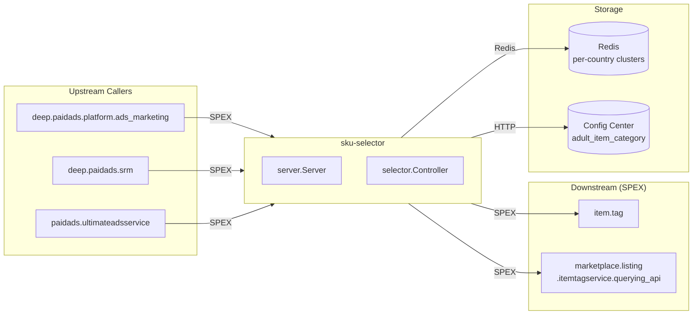

<!-- ads-workspace-gdoc-sync: gdoc_id=1R6u1upB-F7ylycaafo1l6VNJlZxPmx6TQwhbXUHH22U gdoc_url=https://docs.google.com/document/d/1R6u1upB-F7ylycaafo1l6VNJlZxPmx6TQwhbXUHH22U/edit -->

# sku-selector

**Repository:** https://git.garena.com/shopee/deep/sku-selector

---

## Table of Contents

1. [Introduction](#introduction)
2. [Features](#features)
3. [Architecture](#architecture)
4. [Directory Structure](#directory-structure)
5. [SPEX and Modules](#spex-and-modules)
   - [API Overview](#api-overview)
   - [Selection Logic](#selection-logic)
6. [Development Guidelines](#development-guidelines)
   - [Development Environment Setup](#development-environment-setup)
   - [Code Style](#code-style)
   - [Project Structure](#project-structure)
   - [Naming Conventions](#naming-conventions)
   - [Error Handling](#error-handling)
   - [Unit Testing Standards](#unit-testing-standards)
   - [Code Review & Git Workflow](#code-review--git-workflow)
7. [Configuration](#configuration)
   - [Config Files](#config-files)
   - [SPEX and spcli Setup](#spex-and-spcli-setup)
8. [Deployment](#deployment)
   - [Build for Production](#build-for-production)
   - [Release Process](#release-process)
9. [Monitoring](#monitoring)
10. [Business Terminology Glossary](#business-terminology-glossary)
    - [Core Metrics](#core-metrics)
    - [Ad Types and Products](#ad-types-and-products)
    - [Placements & Entrances](#placements--entrances)
    - [Sellers & Advertisers](#sellers--advertisers)
    - [Bidding & Pricing](#bidding--pricing)
    - [Prediction & Models](#prediction--models)
    - [System Features & Services](#system-features--services)
    - [Ad Supply & Display](#ad-supply--display)
    - [Controls & Filtering](#controls--filtering)
    - [External Services & Systems](#external-services--systems)
    - [Technical Terms](#technical-terms)
11. [Additional Resources](#additional-resources)
12. [Frequently Asked Questions](#frequently-asked-questions)

---

## Introduction

`sku-selector` is a Go microservice that provides **item (SKU) recommendation and selection** for Shopee Paid Ads. It is a Medium-priority service (PIC: Joshua) within the Advertiser Platform service group.

Given a shop or a set of item IDs, sku-selector reads pre-computed recommendation scores from Redis and returns a ranked, filtered list of items suitable for different ad campaign types:

- Standard search/discovery ads (`SelectItem`)
- New Product Boost v2 (`SelectNewProductBoostTwoItems`)
- ROI-2 CPS campaigns (`SelectRoiTwoCpsItem`)
- Potential Product ads (`SelectPotentialProductItem`)
- New Product Ads (`SelectNewProductAdsItem`)
- Organic item selection (`SelectOrganicItem`)
- ROI-3 voucher-gained items (`SelectRoiThreeVoucherGainedItem`)

Upstream callers invoke sku-selector via the SPEX RPC framework under the command prefix `paidads.sku_selector.*`. Primary callers are `deep.paidads.platform.ads_marketing`, `deep.paidads.srm`, and `paidads.ultimateadsservice`.

---

## Features

- **Multi-mode item scoring** — supports 11 query modes per the `QueryMode` enum: `NORMAL` (QSS/BIS), `BEST_SELLING`, `TOP_SEARCH`, `BEST_ROI`, `BEST_OVERALL`, `TOP_VIEWED`, `TRENDING_NOW`, `TOTAL_SEARCH`, `TOTAL_TARGETING`, `TOTAL_COMBINED`, and `GMV_MAX`.
- **Two-level lookup** — each API supports both shop-level (all recommended items for a shop) and item-level (attribute enrichment for a given set of item IDs) queries.
- **Adult / blocked-promotion filtering** — reads adult category config from Config Center (namespace `adult_item_category_{env}_default`) and queries item tags (`item.tag`) and item labels (`marketplace.listing.itemtagservice.querying_api`) via SPEX to exclude adult or promotion-blocked items.
- **Region-aware Redis** — uses `redisutil` with per-country connection strings; cache keys follow API-specific patterns such as `shop_{country}_{shopID}` / `item_{country}_{itemID}` with type suffixes (`:qss`, `:bis`, `:new_product_boost`, etc.).
- **Prometheus metrics** — exports `paidads_sku_selector_counter`, `paidads_sku_selector_latency`, `paidads_sku_selector_response_count`, `paidads_sku_selector_error`, `paidads_sku_selector_select_item_params`, and `paidads_sku_selector_item_count`.
- **Dynamic adult-category config** — subscribes to Config Center and hot-reloads adult category lists without restart.

---

## Architecture

sku-selector is a stateless SPEX server. On startup it:

1. Subscribes to Config Center for adult category configuration.
2. Initialises a SPEX instance (env/tag from `config/files/{env}.yml`).
3. Creates Redis cache clients (country-aware via `redisutil`).
4. Wires together `selector.Controller` → `server.Server` → SPEX processor registration.



#### Upstream Callers

| Service | Protocol | Calls |
|---------|----------|-------|
| `deep.paidads.platform.ads_marketing` | SPEX | `select_item`, `select_new_product_ads_item`, `select_potential_product_item`, `select_roi_three_voucher_gained_item` |
| `deep.paidads.srm` | SPEX | `select_item` |
| `paidads.ultimateadsservice` | SPEX | `select_potential_product_item` |

#### Downstream Dependencies

| Service | Protocol | Description |
|---------|----------|-------------|
| Redis (per-country clusters) | Redis | Stores all pre-computed SKU recommendation data written by the DE pipeline; read by sku-selector at request time. See cache key reference in [Selection Logic](#selection-logic). |
| `item.tag` (`item.tag.get_item_tag`) | SPEX | Fetches item tags (adult label, adult_21 label) for filtering |
| `marketplace.listing.itemtagservice.querying_api` (`check_exist_item_label`) | SPEX | Checks item labels (blocked-promotion, adult_21) |
| Config Center (`paid_ads/paid_ads_platform/adult_item_category_{env}_default`) | HTTP | Hot-reloadable adult category lists per country/env |

---

## Directory Structure

```
sku-selector/
├── cmd/sku_selector/        # main entry point + server wiring (run.go)
├── common/                  # shared constants and cache key helpers (one file per API domain)
├── config/
│   ├── config.go            # Selector config struct
│   └── files/               # Environment-specific YAML configs (live, staging, stable, test, uat)
├── deploy/
│   └── skuselector.json     # Mesos/Space deployment spec (8 CPU / 1 GB live, 2 SG instances)
├── gen/go/                  # Auto-generated protobuf + SPEX Go bindings (do not edit)
├── internal/
│   ├── adult_category/      # Config Center adult category hot-reload manager
│   ├── cache/               # Redis cache client (shop & item level reads for all APIs)
│   ├── collections/         # Internal helpers for item set operations
│   ├── errors/              # Typed error definitions
│   ├── exporter/            # Prometheus metric registrations
│   ├── selector/            # Core business logic — per-API controllers + validators + sort
│   ├── server/              # SPEX server + interceptor registration
│   └── webservice/          # SPEX client wrapper for item.tag and itemtagservice
├── scripts/                 # Build helper scripts (mesos.sh)
├── sp_proto/paidads/        # Source proto: sku_selector.proto (commands, messages, enums)
├── sp-workspace.yml         # SPEX workspace — dep declarations and code-gen targets
├── go.mod / go.sum
├── Makefile
└── VERSION
```

---

## SPEX and Modules

### API Overview

All commands are under the namespace `paidads.sku_selector`.

| Command | Request | Response | Description |
|---------|---------|----------|-------------|
| `ping` | `PingRequest` | `PingResponse` | Health check |
| `select_item` | `SelectItemRequest` | `SelectItemResponse` | Main item recommendation (shop-level or item-level, multi-mode) |
| `select_new_product_boost_two_items` | `SelectNewProductBoostTwoItemsRequest` | `SelectNewProductBoostTwoItemsResponse` | New Product Boost v2 item selection |
| `select_roi_two_cps_item` | `SelectRoiTwoCpsItemRequest` | `SelectRoiTwoCpsItemResponse` | ROI-2 CPS-eligible item selection |
| `select_potential_product_item` | `SelectPotentialProductItemRequest` | `SelectPotentialProductItemResponse` | Potential Product item selection |
| `select_new_product_ads_item` | `SelectNewProductAdsItemRequest` | `SelectNewProductAdsItemResponse` | New Product Ads item selection |
| `select_organic_item` | `SelectOrganicItemRequest` | `SelectOrganicItemResponse` | Organic item selection by `user_id` |
| `select_roi_three_voucher_gained_item` | `SelectRoiThreeVoucherGainedItemRequest` | `SelectRoiThreeVoucherGainedItemResponse` | ROI-3 voucher-gained item enrichment |

Error codes are in the range `159200001–159200005` (`Constant.Error` enum).

### Selection Logic

`select_item` supports 11 query modes (`QueryMode`) and 5 score versions (`RecommendScoreVersion`):

| QueryMode | Value | Sort key (from cache) |
|-----------|-------|-----------------------|
| `NORMAL` | 0 | raw order from cache (QSS / BIS modes) |
| `BEST_SELLING` | 1 | `rcmd_selling_score` |
| `TOP_SEARCH` | 2 | `rcmd_search_score` |
| `BEST_ROI` | 3 | `rcmd_roi_score` |
| `BEST_OVERALL` | 4 | `total_combined_score` (alias for TOTAL_COMBINED) |
| `TOP_VIEWED` | 5 | `rcmd_view_score` |
| `TRENDING_NOW` | 6 | avg(`rcmd_view_score`, `rcmd_search_score`) |
| `TOTAL_SEARCH` | 7 | `total_search_score` |
| `TOTAL_TARGETING` | 8 | `total_targeting_score` |
| `TOTAL_COMBINED` | 9 | `total_combined_score` |
| `GMV_MAX` | 10 | `rmcd_gmv_max_score` |

`RecommendScoreVersion` controls which score set is loaded from cache:

| Version | Description |
|---------|-------------|
| `RCMD_SCORE_VERSION_NEW` (0) | Default — current algo score set |
| `RCMD_SCORE_VERSION_OLD` (1) | Legacy score set (no longer used) |
| `RCMD_SCORE_VERSION_ALT` (2) | Experiment variant (loads `:experiment` key suffix) |
| `RCMD_SCORE_VERSION_QSS` (3) | QuickStart Service mode — shop-level only, `QUERY_MODE_NORMAL` only |
| `RCMD_SCORE_VERSION_BIS` (4) | Basic Item Spending mode — shop-level only, `QUERY_MODE_NORMAL` only |

After sorting, items with adult category or blocked-promotion tags are filtered out before the response is returned. For the PH region, an additional country-specific blocked-promotion tag is applied.

Tie-breaking order (when scores are equal): monthly sales → item price → time added → stock quantity.

**Cache key reference** — all keys are written by the DE data pipeline and read by sku-selector:

| API | Key Pattern | Encoding | Notes |
|-----|-------------|----------|-------|
| `select_item` (NEW/default) | `shop_{country}_{shopID}` / `item_{country}_{itemID}` | base64+protobuf | `SelectItems` / `ResultItem` |
| `select_item` (ALT/experiment) | `shop_{country}_{shopID}:experiment` / `item_{country}_{itemID}:experiment` | base64+protobuf | |
| `select_item` (QSS) | `shop_{country}_{shopID}:qss` | JSON array of item IDs | shop-level only |
| `select_item` (BIS) | `shop_{country}_{shopID}:bis` | JSON array of item IDs | shop-level only |
| `select_new_product_boost_two_items` | `shop_{COUNTRY}_{shopID}:new_product_boost` / `item_{COUNTRY}_{itemID}:new_product_boost` | base64+protobuf | COUNTRY uppercase |
| `select_roi_two_cps_item` (Phase 1) | `shop_{country}_{shopID}:roi_two_cps_phase_one` / `item_{country}_{itemID}:roi_two_cps_phase_one` | JSON | |
| `select_roi_two_cps_item` (Phase 2) | `shop_{country}_{shopID}:roi_two_cps_phase_two` / `item_{country}_{itemID}:roi_two_cps_phase_two` | base64+protobuf | |
| `select_potential_product_item` | `shop_{country}_{shopID}:potential_product` / `item_{country}_{itemID}:potential_product` | base64+protobuf | |
| `select_new_product_ads_item` | `shop_{COUNTRY}_{shopID}:npa` / `item_{COUNTRY}_{itemID}:npa` | base64+protobuf | COUNTRY uppercase |
| `select_organic_item` | `organic_items_{REGION}_{userID}` | base64+protobuf | REGION uppercase |
| `select_roi_three_voucher_gained_item` | `roi_three_voucher_statistics:{COUNTRY}:{shopID}:{itemID}` | base64+protobuf | COUNTRY uppercase |

---

## Development Guidelines

### Development Environment Setup

Run the automated setup script to install all required tools (Go toolchain, linters, SPEX CLI, etc.):

```bash
make env
```

This executes `https://shopee.git-pages.garena.com/deep/paidads-platform-lib/check-and-setup-env.sh`, which checks and installs missing dependencies in one step.

### Code Style

- Go `1.21`. All code must pass `go vet -all` and `golangci-lint run`.
- Import order is enforced via `gci`; fix with `make gci`.
- Format with `go fmt` (CI fails if any files need formatting).

### Project Structure

- Business logic lives in `internal/selector/` — one controller file per API, matching validator file.
- SPEX-related wiring (processor registration, interceptors) is in `internal/server/`.
- Shared Redis access is in `internal/cache/`; one file per API domain.
- Cache key helpers live in `common/`; one file per API domain.
- Proto definitions are in `sp_proto/paidads/sku_selector.proto`; generated Go code is in `gen/go/` (do not edit manually).

### Naming Conventions

- Controller files: `{feature}_controller.go` and `{feature}_validator.go`.
- Sort helpers: `{feature}_sort.go`.
- Enum files are auto-generated by `go-enum` from `*_enum.go` source files.
- Commit messages: `(Feat|Fix|Docs|Style|Refactor|Test|Chore): [JIRA-ID] description`.
- Branch naming: `dev/$username` or `feature/$feature_name`.

### Error Handling

- Return typed error codes from the `Constant.Error` enum in `sku_selector.proto`.
- Use `fmt.Errorf("... err: %w", err)` for wrapping; log with `log.Warnf` at non-critical paths.
- Do not panic; all Redis and external SPEX call errors are handled and surfaced via `ErrorResponse`.

### Unit Testing Standards

- Run with `make test` (with verbose) or `make test-nv` (CI mode).
- Tests live alongside source files (`controller_test.go`, `sort_test.go`).
- Use `mocked_manager.go` for `webservice.Manager` mock in selector tests.

### Code Review & Git Workflow

- All changes via Merge Requests only (squash commits, delete source branch).
- Algo code merges only after full launch in at least one region.
- Run `make ci` locally to simulate the full GitLab CI pipeline before pushing.

---

## Configuration

### Config Files

Environment-specific YAML files are in `config/files/`:

| File | Environment |
|------|-------------|
| `live.yml` | Production |
| `stable.yml` | Stable (canary) |
| `staging.yml` | Staging |
| `uat.yml` | UAT |
| `test.yml` | Test |

Key fields in `config/config.go` (`Selector` struct):

| Field | Description |
|-------|-------------|
| `Metrics` | Prometheus metrics port (default `18066`, override via `PORT_METRICS` env var) |
| `Spex` | SPEX connection config (env, tag, deployment) |
| `Cache` | Redis config — global `conn` + per-country `country-conn` map |
| `Env` | Runtime environment name (`live`, `staging`, etc.) — used for adult tag lookup |
| `ConfigCenterKey` | Secret key for Config Center namespace subscription |
| `WebService.Timeout` | Timeout for `item.tag` / `itemtagservice` SPEX calls (default `2000ms` in live) |
| `WebService.MaxRetry` | Retry count for external SPEX calls (default `3` in live) |

**Live Redis connections** (from `config/files/live.yml`):

```yaml
cache:
  conn: rediscluster-10107-sg4.shopee.io:10107/-1
  country-conn:
    br: accb05b606f641c6.elasticredis.cloud.shopee.io:10161/-1
    ar: accb05b606f641c6.elasticredis.cloud.shopee.io:10161/-1
```

### SPEX and spcli Setup

Install the SPEX CLI:

```bash
pip install --upgrade shopee-spex-cli
```

Install `inp-client` (required for local SPEX routing):

```bash
wget http://proxy.uss.s3.sz.shopee.io/api/v4/50054564/spex-s3ia-sg-live/intranet_penetrator/inp-client/latest/inp-client_darwin_amd64 \
  -O /usr/local/bin/inp-client && chmod +x /usr/local/bin/inp-client
```

Regenerate protobuf and SPEX bindings after editing `sp_proto/paidads/sku_selector.proto`:

```bash
make proto-compile
# which runs: spcli proto gen && spex-generator sp-workspace.yml
```

SPEX workspace dependencies (`sp-workspace.yml`):

| Protocol | Topic |
|----------|-------|
| `item.tag` | `master` |
| `marketplace.listing.itemtagservice.querying_api` | `master` |

---

## Deployment

### Build for Production

```bash
# Install dependencies
make dep-download

# Build binary (auto cross-compiles Linux binary on macOS)
make sku_selector

# Output: bin/sku_selector_server (macOS) + bin/sku_selector_server.linux (cross-build)
```

CI build command (from `deploy/skuselector.json`):

```bash
make dep-download && bash scripts/mesos.sh build sku_selector
```

Base image: `harbor.shopeemobile.com/paidads/base/platform:1.21`

Mesos resource and instance allocation:

| Environment | CPU | Memory | Instances (SG) |
|-------------|-----|--------|----------------|
| `live` | 8 | 1024 MB | 2 |
| `stable` | 1 | 512 MB | 1 |
| `staging` | 1 | 512 MB | 1 |
| `uat` | 1 | 512 MB | 1 |
| `test` | 1 | 512 MB | 1 |

### Release Process

Deployments are managed via the Space/Mesos platform (`project_name: paidads`, `module_name: skuselector`). The service exposes two ports: `METRICS` (Prometheus, default `18066`) and `Z_GRPC` (SPEX).

General release flow for Ads Platform services:

1. Create a Merge Request; get approval.
2. Trigger CI (`make ci` must pass).
3. Deploy to staging/UAT; verify via Grafana and SPEX response testing.
4. Roll out to live; monitor key metrics for at least 30 minutes.

---

## Monitoring

- **Grafana folder**: [advertiser-platform](https://monitoring.infra.sz.shopee.io/grafana/dashboards/f/advertiser-platform/advertiser-platform)
- **SKU Selector dashboard**: [SKU Selector](https://monitoring.infra.sz.shopee.io/grafana/d/BVLBy-SMz/sku-selector)

Key Prometheus metrics (namespace `paidads`, subsystem `sku_selector`):

| Metric | Type | Labels | Description |
|--------|------|--------|-------------|
| `paidads_sku_selector_counter` | Counter | `country`, `type` | QPS counters (e.g., `fill-attr-qps`, `select-items-qps`, `fill-succ`, `select-succ`) |
| `paidads_sku_selector_latency` | Histogram | `country`, `namespace`, `command` | Request latency in milliseconds |
| `paidads_sku_selector_response_count` | Counter | `country`, `namespace`, `command`, `message` | SPEX response count by status |
| `paidads_sku_selector_error` | Counter | `country`, `type` | Error counters (e.g., `filter-country`, `get-tag`, `fill-partial`, `fill-none`) |
| `paidads_sku_selector_select_item_params` | Counter | `country`, `level`, `mode`, `score_version` | Request parameter distribution for `select_item` |
| `paidads_sku_selector_item_count` | Histogram | `country`, `type`, `level` | Items returned per response |

---

## Business Terminology Glossary

### Core Metrics

| Term | Definition |
|------|-----------|
| CTR (Click-Through Rate) | Total clicks on an ad / total impressions |
| CR (Conversion Rate) | Ad orders / total clicks on the ad |
| ROI (Return on Investment) | Ad GMV / Ad Expenditure |
| ROAS (Return on Ads Spending) | Synonym for ROI |
| CPC (Cost Per Click) | Amount spent per click |
| CPM (Cost Per Mille) | Cost per 1,000 impressions |
| eCPM (Effective Cost per Mille) | Total Ad Spend / Total impressions |
| CIR (Cost-Income Ratio) | Ads Revenue / Ads GMV |
| Rank Score | eCPM + quality factors |
| Take-Rate | Ads Revenue / Platform GMV |
| Ads GMV | Total sales generated from ads within 7 days after a click |

### Ad Types and Products

| Term | Definition |
|------|-----------|
| Search Ads | Keyword-based ads shown in search results |
| Discovery Ads (DADS/TADS) | Targeting ads in recommendation feeds |
| Display Ads | Brand/CPM ads with creative materials |
| New Product Boost (NPB) | Feature to promote newly listed products |
| New Product Ads (NPA) | Successor to NPB with phase-based lifecycle |
| ROI-2 (oCPC / Simple Mode) | Automated bidding targeting a seller's ROI goal |
| ROI-3 | Next-generation ROI optimisation with voucher integration |
| GMS (Gross Merchandise Sales) | Campaign type tied to seller payment processing |
| Search Brand Ads | Brand keyword reservation product |
| Shop Ads | Ads at shop level |

### Placements & Entrances

| Term | Definition |
|------|-----------|
| PDP (Product Detail Page) | Item detail page |
| YMAL (You May Also Like) | Discovery Ads placement for complementary products |
| DD (Daily Discovery) | Recommendation feed placement |
| LP (Landing Page) | Destination page after ad click |

### Sellers & Advertisers

| Term | Definition |
|------|-----------|
| SC (Seller Center) | Seller-facing platform for managing ads |
| PS (Preferred Sellers) | Sellers meeting Shopee quality guidelines |
| OS (Official Shops) | Brand-owned official stores |
| Active Seller | Seller with an open ads account who is still active |
| SRM (Seller Relationship Management) | Seller segmentation and engagement program management |

### Bidding & Pricing

| Term | Definition |
|------|-----------|
| Manual Mode | Seller sets keyword bids manually |
| Simple Mode / oCPC | Automated bid optimisation; seller sets ROI target |
| Broad Match | Ad triggered when search query contains the keyword |
| Exact Match | Ad triggered only when query equals the keyword exactly |
| uGSP | Unified Generalised Second Price auction mechanism |
| CPS (Cost Per Sale) | Billing mode tied to confirmed sales |
| PID Controller | Control mechanism for dynamic bid adjustment in Simple Mode |

### Prediction & Models

| Term | Definition |
|------|-----------|
| pCTR | Predicted Click-Through Rate |
| pCR | Predicted Conversion Rate |
| rcgbdt | RC Gradient Boost Decision Trees — ML model for pCTR prediction |
| Cold Start | Ads with insufficient data for accurate prediction |
| CF (Collaborative Filtering) | Score based on similarity across entities |

### System Features & Services

| Term | Definition |
|------|-----------|
| SKU Selector / SKU 选择器 | This service; selects and ranks items for ad campaigns |
| QSS (QuickStart Service) | Mode / service helping new advertisers ramp up ad usage |
| BIS (Basic Item Spending) | Mode loading shop-level item IDs for basic item spending campaigns |
| VGS (Values Grid Search) | Automatic parameter adjustment system |
| SPEX | Shopee internal RPC/service governance framework |
| spcli | SPEX CLI toolchain for proto generation and service management |

### Ad Supply & Display

| Term | Definition |
|------|-----------|
| Display Rate | Ads with impressions / active ads |
| Fill-up Rate | Actual impressions / potential impressions for ad slots |
| Traffic Rate | Impression share of one ad type vs. all channels |
| Organic GMV | Sales from non-ad clicks (typically 7-day window) |
| Ads Order | Order placed within 7 days after clicking an ad |

### Controls & Filtering

| Term | Definition |
|------|-----------|
| Blacklist | Keyword or item ID level exclusion list |
| Whitelist | Per-feature seller/shop enable list |
| Adult Category | Category blocked from ad promotion (configured in Config Center) |
| Blocked Promotion Tag | Item tag preventing inclusion in promotion ads (PH-specific variant exists) |
| Buyer Segmentation | Buyer audience tags for targeted ad delivery |

### External Services & Systems

| Term | Definition |
|------|-----------|
| DAG | Data processing pipeline (used in feature engineering) |
| GAS | General Ads Service |
| ES (Elastic Search) | Search engine underpinning keyword recall |
| SAS (Shopee Ads Services) | Umbrella term for all Shopee Paid Ads services |

### Technical Terms

| Term | Definition |
|------|-----------|
| Proto / Protobuf | Protocol Buffers — serialisation format for cache and RPC messages |
| Cache Key (SKU) | `shop_{country}_{shopID}` or `item_{country}_{itemID}` with API-specific suffixes; see full table in [Selection Logic](#selection-logic) |
| Cache Key (QSS) | `shop_{country}_{shopID}:qss` — JSON array of item IDs (shop-level only) |
| QueryMode | Enum controlling which score field is used for sorting |
| RecommendScoreVersion | Enum controlling which score set / cache key suffix is used |

---

## Additional Resources

- **Git repository**: https://git.garena.com/shopee/deep/sku-selector
- **Advertiser Platform architecture** (Confluence): https://confluence.shopee.io/display/SPAD/Advertiser+Platform
- **Paid Ads Glossary** (Confluence): https://confluence.shopee.io/pages/viewpage.action?spaceKey=SPAD&title=Paid+Ads+Glossary
- **Grafana — SKU Selector dashboard**: https://monitoring.infra.sz.shopee.io/grafana/d/BVLBy-SMz/sku-selector
- **Grafana — Advertiser Platform folder**: https://monitoring.infra.sz.shopee.io/grafana/dashboards/f/advertiser-platform/advertiser-platform
- **ads-protocol (SKU proto)**: https://git.garena.com/shopee/deep/ads-protocol/-/blob/master/sku/sku.proto
- **SPEX Go Quick Start**: https://spex.shopee.io/overview/quick-start/languages/go/index.html
- **CMDB Cronjob list (Advertiser Platform)**: https://space.shopee.io/console/cmdb/cronjobs/tree/shopee.mp_search_recommendation_ads.paidads.advertiser_platform.platform

---

## Frequently Asked Questions

**Q1: What does sku-selector do, and who calls it?**
sku-selector reads pre-computed item recommendation scores from Redis and returns a ranked, filtered item list for different ad campaign types. Primary callers (via SPEX) are `deep.paidads.platform.ads_marketing` (standard selection, NPA, Potential Product, ROI-3 voucher enrichment), `deep.paidads.srm` (standard item selection), and `paidads.ultimateadsservice` (Potential Product selection).

**Q2: Where do the recommendation scores come from? sku-selector does not compute them itself.**
Scores are pre-computed by offline data pipelines (DE team) and written to Redis. sku-selector only reads from Redis — it does not train models or compute scores at request time.

**Q3: How are cache keys structured across different APIs?**
Each API has its own key pattern. Standard `select_item` uses `shop_{country}_{shopID}` / `item_{country}_{itemID}` with version suffixes (`:experiment`, `:qss`, `:bis`). NPB v2 and NPA use uppercase country: `shop_{COUNTRY}_{shopID}:new_product_boost` / `:npa`. ROI-3 uses `roi_three_voucher_statistics:{COUNTRY}:{shopID}:{itemID}`. Organic uses `organic_items_{REGION}_{userID}`. See the full table in [Selection Logic](#selection-logic).

**Q4: How does adult item filtering work?**
sku-selector subscribes to Config Center namespace `paid_ads/paid_ads_platform/adult_item_category_{env}_default` at startup and maintains an in-memory adult category map. At request time it queries `item.tag` (adult tag + adult_21 label) and `marketplace.listing.itemtagservice.querying_api` (blocked-promotion label) via SPEX in parallel. Items matching any filter are excluded. The PH region uses an additional unique blocked-promotion tag ID.

**Q5: How do I add support for a new selection API (command)?**
1. Add the new `Request`/`Response` messages and command declaration to `sp_proto/paidads/sku_selector.proto`.
2. Run `make proto-compile` to regenerate `gen/go/`.
3. Implement `{feature}_controller.go` and `{feature}_validator.go` in `internal/selector/`.
4. Add cache key helpers to `common/` and Redis read methods to `internal/cache/`.
5. Wire the new handler in `internal/server/server.go` and register it via the SPEX processor.

**Q6: How do I run the CI pipeline locally?**
```bash
make ci
```
This runs `ci-vet` (go vet + no dirty files), `lint` (golangci-lint), `fmt` (go fmt check), and `test-nv` (unit tests without verbose).

**Q7: How do I build and cross-compile for Linux?**
```bash
make sku_selector
```
On macOS, `make` automatically cross-compiles a `.linux` binary in addition to the native binary.

**Q8: How is the adult category config updated without a deployment?**
The service subscribes to Config Center at startup and registers a change listener. When the namespace value is updated, the `adult_category.Manager` hot-reloads the category map under a `sync.RWMutex` — no restart is required.

**Q9: What is the significance of `env` in the config?**
The `env` field (e.g., `live`, `staging`) is used to look up the correct adult tag IDs (`adultItemTag`, `adult21ItemTag`) and blocked-promotion tag IDs (`blockedPromotionTag`) from the hardcoded maps in `internal/selector/const.go`. Different environments have different tag IDs, and `stable` does not support `blockedPromotionTag` (set to 0).

**Q10: Where can I find the Grafana dashboard for this service?**
[SKU Selector Grafana dashboard](https://monitoring.infra.sz.shopee.io/grafana/d/BVLBy-SMz/sku-selector) — part of the [Advertiser Platform folder](https://monitoring.infra.sz.shopee.io/grafana/dashboards/f/advertiser-platform/advertiser-platform).

<!-- Generated by ads-workspace/skills/ads-readme-generate | checked: ecb47fb6972f0ea5930c46bde9d3f807c5bdbbb1 | spec: 76fce5f679f9550b -->
