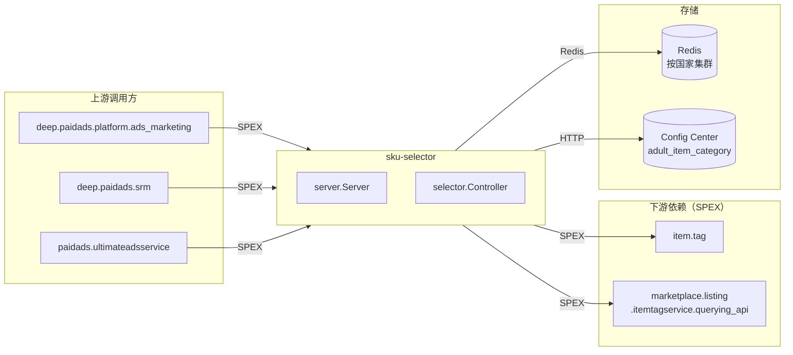

<!-- ads-workspace-gdoc-sync: gdoc_id=1BjOKk87hJiGzFCNenygKYAThkUxO0rsSbs2iZBWcGT8 gdoc_url=https://docs.google.com/document/d/1BjOKk87hJiGzFCNenygKYAThkUxO0rsSbs2iZBWcGT8/edit -->

# sku-selector

**代码仓库：** https://git.garena.com/shopee/deep/sku-selector

---

## 目录

1. [项目概述](#项目概述)
2. [核心功能](#核心功能)
3. [项目架构](#项目架构)
4. [目录结构](#目录结构)
5. [SPEX 与业务模块](#spex-与业务模块)
   - [接口总览](#接口总览)
   - [选品与规则](#选品与规则)
6. [开发规范](#开发规范)
   - [开发环境准备](#开发环境准备)
   - [代码风格](#代码风格)
   - [项目结构](#项目结构-1)
   - [命名规范](#命名规范)
   - [错误处理](#错误处理)
   - [单元测试](#单元测试)
   - [Code Review & Git Workflow](#code-review--git-workflow)
7. [配置说明](#配置说明)
   - [配置文件](#配置文件)
   - [SPEX 与 spcli 配置](#spex-与-spcli-配置)
8. [部署](#部署)
   - [生产构建](#生产构建)
   - [发布流程](#发布流程)
9. [监控](#监控)
10. [业务术语表](#业务术语表)
    - [核心指标](#核心指标)
    - [广告类型](#广告类型)
    - [位置入口](#位置入口)
    - [卖家与广告主](#卖家与广告主)
    - [竞价定价](#竞价定价)
    - [预测模型](#预测模型)
    - [系统特性与服务](#系统特性与服务)
    - [广告供给与展示](#广告供给与展示)
    - [管控与过滤](#管控与过滤)
    - [外部服务与系统](#外部服务与系统)
    - [技术术语](#技术术语)
11. [参考资料](#参考资料)
12. [常见问题](#常见问题)

---

## 项目概述

`sku-selector` 是 Shopee Paid Ads 的 Go 微服务，负责为广告投放提供 **商品（SKU）推荐与筛选** 功能。在 Advertiser Platform 服务组中属于 Medium 优先级服务（负责人：Joshua）。

给定店铺或一组商品 ID，sku-selector 从 Redis 中读取预计算的推荐分数，返回按分数排序、经过过滤的商品列表，支持以下多种广告活动类型：

- 标准搜索/发现广告（`SelectItem`）
- New Product Boost v2（`SelectNewProductBoostTwoItems`）
- ROI-2 CPS 活动（`SelectRoiTwoCpsItem`）
- Potential Product 广告（`SelectPotentialProductItem`）
- New Product Ads（`SelectNewProductAdsItem`）
- Organic 商品选品（`SelectOrganicItem`）
- ROI-3 优惠券收益商品（`SelectRoiThreeVoucherGainedItem`）

上游调用方通过 SPEX RPC 框架（命令前缀 `paidads.sku_selector.*`）调用本服务。主要调用方为 `deep.paidads.platform.ads_marketing`、`deep.paidads.srm` 和 `paidads.ultimateadsservice`。

---

## 核心功能

- **多模式商品评分** — 支持 `QueryMode` 枚举中的 11 种查询模式：`NORMAL`（QSS/BIS 模式）、`BEST_SELLING`、`TOP_SEARCH`、`BEST_ROI`、`BEST_OVERALL`、`TOP_VIEWED`、`TRENDING_NOW`、`TOTAL_SEARCH`、`TOTAL_TARGETING`、`TOTAL_COMBINED`，以及 `GMV_MAX`。
- **两级查询** — 每个接口同时支持店铺级（获取店铺全量推荐商品）和商品级（为指定商品 ID 填充属性）两种查询。
- **成人/封禁促销商品过滤** — 从 Config Center 读取成人品类配置（命名空间 `adult_item_category_{env}_default`），并通过 SPEX 查询 `item.tag` 和 `marketplace.listing.itemtagservice.querying_api` 剔除成人或促销封禁商品。
- **区域感知 Redis** — 使用 `redisutil` 支持按国家配置独立连接；缓存键遵循各接口专属格式（如 `shop_{country}_{shopID}` 加 `:qss`、`:bis`、`:new_product_boost` 等后缀）。
- **Prometheus 监控指标** — 导出 `paidads_sku_selector_counter`、`paidads_sku_selector_latency`、`paidads_sku_selector_response_count`、`paidads_sku_selector_error`、`paidads_sku_selector_select_item_params`、`paidads_sku_selector_item_count`。
- **成人品类配置动态热更新** — 订阅 Config Center，无需重启即可热加载成人品类列表。

---

## 项目架构

sku-selector 是无状态的 SPEX 服务端。启动时执行以下操作：

1. 订阅 Config Center，获取成人品类配置。
2. 初始化 SPEX 实例（env/tag 来自 `config/files/{env}.yml`）。
3. 通过 `redisutil` 创建 Redis 缓存客户端（按国家路由）。
4. 组装 `selector.Controller` → `server.Server` → 注册 SPEX Processor。



#### 上游调用方

| 服务 | 协议 | 调用接口 |
|------|------|---------|
| `deep.paidads.platform.ads_marketing` | SPEX | `select_item`、`select_new_product_ads_item`、`select_potential_product_item`、`select_roi_three_voucher_gained_item` |
| `deep.paidads.srm` | SPEX | `select_item` |
| `paidads.ultimateadsservice` | SPEX | `select_potential_product_item` |

#### 下游依赖

| 服务 | 协议 | 说明 |
|------|------|------|
| Redis（按国家集群） | Redis | 存储所有由 DE 数据流水线预计算并写入的 SKU 推荐数据，由 sku-selector 在请求时读取。缓存键格式见[选品与规则](#选品与规则)。 |
| `item.tag`（`item.tag.get_item_tag`） | SPEX | 获取商品标签（成人标签、adult_21 标签）用于过滤 |
| `marketplace.listing.itemtagservice.querying_api`（`check_exist_item_label`） | SPEX | 检查商品标签（封禁促销标签、adult_21） |
| Config Center（`paid_ads/paid_ads_platform/adult_item_category_{env}_default`） | HTTP | 提供可热加载的各国成人品类列表 |

---

## 目录结构

```
sku-selector/
├── cmd/sku_selector/        # 入口 main + 服务组装（run.go）
├── common/                  # 公共常量与缓存键辅助函数（每个接口域一个文件）
├── config/
│   ├── config.go            # Selector 配置结构体
│   └── files/               # 各环境 YAML 配置（live、staging、stable、test、uat）
├── deploy/
│   └── skuselector.json     # Mesos/Space 部署规格（live: 8 CPU / 1 GB，2 个 SG 实例）
├── gen/go/                  # 自动生成的 protobuf + SPEX Go 绑定代码（勿手动修改）
├── internal/
│   ├── adult_category/      # Config Center 成人品类热更新 Manager
│   ├── cache/               # Redis 缓存客户端（所有接口的店铺/商品级读取，每接口域一个文件）
│   ├── collections/         # 商品集合操作辅助工具
│   ├── errors/              # 类型化错误定义
│   ├── exporter/            # Prometheus 指标注册
│   ├── selector/            # 核心业务逻辑——各 API 的 Controller + Validator + Sort
│   ├── server/              # SPEX Server + Interceptor 注册
│   └── webservice/          # item.tag 和 itemtagservice 的 SPEX Client 封装
├── scripts/                 # 构建辅助脚本（mesos.sh）
├── sp_proto/paidads/        # 源 proto：sku_selector.proto（命令、消息、枚举）
├── sp-workspace.yml         # SPEX workspace——依赖声明与代码生成目标
├── go.mod / go.sum
├── Makefile
└── VERSION
```

---

## SPEX 与业务模块

### 接口总览

所有命令归属命名空间 `paidads.sku_selector`。

| 命令 | 请求 | 响应 | 说明 |
|------|------|------|------|
| `ping` | `PingRequest` | `PingResponse` | 健康检查 |
| `select_item` | `SelectItemRequest` | `SelectItemResponse` | 主选品接口（店铺级/商品级，多种模式） |
| `select_new_product_boost_two_items` | `SelectNewProductBoostTwoItemsRequest` | `SelectNewProductBoostTwoItemsResponse` | New Product Boost v2 选品 |
| `select_roi_two_cps_item` | `SelectRoiTwoCpsItemRequest` | `SelectRoiTwoCpsItemResponse` | ROI-2 CPS 商品选品 |
| `select_potential_product_item` | `SelectPotentialProductItemRequest` | `SelectPotentialProductItemResponse` | Potential Product 选品 |
| `select_new_product_ads_item` | `SelectNewProductAdsItemRequest` | `SelectNewProductAdsItemResponse` | New Product Ads 选品 |
| `select_organic_item` | `SelectOrganicItemRequest` | `SelectOrganicItemResponse` | 按 `user_id` 的 Organic 选品 |
| `select_roi_three_voucher_gained_item` | `SelectRoiThreeVoucherGainedItemRequest` | `SelectRoiThreeVoucherGainedItemResponse` | ROI-3 优惠券收益商品属性填充 |

错误码范围：`159200001–159200005`（`Constant.Error` 枚举）。

### 选品与规则

`select_item` 支持 11 种查询模式（`QueryMode`）和 5 种评分版本（`RecommendScoreVersion`）：

| QueryMode | 枚举值 | 排序字段（来自缓存） |
|-----------|--------|-----------------|
| `NORMAL` | 0 | 缓存原始顺序（QSS / BIS 模式） |
| `BEST_SELLING` | 1 | `rcmd_selling_score` |
| `TOP_SEARCH` | 2 | `rcmd_search_score` |
| `BEST_ROI` | 3 | `rcmd_roi_score` |
| `BEST_OVERALL` | 4 | `total_combined_score`（TOTAL_COMBINED 的别名） |
| `TOP_VIEWED` | 5 | `rcmd_view_score` |
| `TRENDING_NOW` | 6 | avg(`rcmd_view_score`, `rcmd_search_score`) |
| `TOTAL_SEARCH` | 7 | `total_search_score` |
| `TOTAL_TARGETING` | 8 | `total_targeting_score` |
| `TOTAL_COMBINED` | 9 | `total_combined_score` |
| `GMV_MAX` | 10 | `rmcd_gmv_max_score` |

`RecommendScoreVersion` 控制从缓存中加载哪套评分数据：

| 版本 | 说明 |
|------|------|
| `RCMD_SCORE_VERSION_NEW`（0） | 默认——当前算法评分集 |
| `RCMD_SCORE_VERSION_OLD`（1） | 历史评分集（已弃用） |
| `RCMD_SCORE_VERSION_ALT`（2） | 实验变体（加载带 `:experiment` 后缀的缓存键） |
| `RCMD_SCORE_VERSION_QSS`（3） | QuickStart Service 模式——仅支持店铺级查询，且须配合 `QUERY_MODE_NORMAL` |
| `RCMD_SCORE_VERSION_BIS`（4） | Basic Item Spending 模式——仅支持店铺级查询，且须配合 `QUERY_MODE_NORMAL` |

排序完成后，在返回响应前过滤掉带有成人品类或封禁促销标签的商品。PH 地区额外应用一套国家特有的封禁促销标签。

评分相同时的排序决胜规则：月销量 → 商品价格 → 上架时间 → 库存数量。

**缓存键参考** — 所有键由 DE 数据流水线写入，由 sku-selector 在请求时读取：

| 接口 | 键格式 | 编码方式 | 备注 |
|------|--------|----------|------|
| `select_item`（NEW/默认） | `shop_{country}_{shopID}` / `item_{country}_{itemID}` | base64+protobuf | `SelectItems` / `ResultItem` |
| `select_item`（ALT/实验） | `shop_{country}_{shopID}:experiment` / `item_{country}_{itemID}:experiment` | base64+protobuf | |
| `select_item`（QSS） | `shop_{country}_{shopID}:qss` | JSON 商品 ID 数组 | 仅支持店铺级 |
| `select_item`（BIS） | `shop_{country}_{shopID}:bis` | JSON 商品 ID 数组 | 仅支持店铺级 |
| `select_new_product_boost_two_items` | `shop_{COUNTRY}_{shopID}:new_product_boost` / `item_{COUNTRY}_{itemID}:new_product_boost` | base64+protobuf | COUNTRY 大写 |
| `select_roi_two_cps_item`（Phase 1） | `shop_{country}_{shopID}:roi_two_cps_phase_one` / `item_{country}_{itemID}:roi_two_cps_phase_one` | JSON | |
| `select_roi_two_cps_item`（Phase 2） | `shop_{country}_{shopID}:roi_two_cps_phase_two` / `item_{country}_{itemID}:roi_two_cps_phase_two` | base64+protobuf | |
| `select_potential_product_item` | `shop_{country}_{shopID}:potential_product` / `item_{country}_{itemID}:potential_product` | base64+protobuf | |
| `select_new_product_ads_item` | `shop_{COUNTRY}_{shopID}:npa` / `item_{COUNTRY}_{itemID}:npa` | base64+protobuf | COUNTRY 大写 |
| `select_organic_item` | `organic_items_{REGION}_{userID}` | base64+protobuf | REGION 大写 |
| `select_roi_three_voucher_gained_item` | `roi_three_voucher_statistics:{COUNTRY}:{shopID}:{itemID}` | base64+protobuf | COUNTRY 大写 |

---

## 开发规范

### 开发环境准备

运行自动化安装脚本，一键安装所有必要工具（Go 工具链、lint 工具、SPEX CLI 等）：

```bash
make env
```

此命令执行 `https://shopee.git-pages.garena.com/deep/paidads-platform-lib/check-and-setup-env.sh`，自动检测并安装缺失的依赖。

### 代码风格

- Go `1.21`。所有代码须通过 `go vet -all` 和 `golangci-lint run`。
- Import 顺序由 `gci` 强制保证；执行 `make gci` 自动修复。
- 使用 `go fmt` 格式化（CI 对格式问题零容忍）。

### 项目结构

- 业务逻辑在 `internal/selector/`——每个 API 对应一个 Controller 文件和一个 Validator 文件。
- SPEX 相关组装（Processor 注册、Interceptor）在 `internal/server/`。
- 共享的 Redis 读取逻辑在 `internal/cache/`，每个接口域一个文件。
- 缓存键辅助函数在 `common/`，每个接口域一个文件。
- Proto 定义在 `sp_proto/paidads/sku_selector.proto`；生成的 Go 代码在 `gen/go/`（勿手动修改）。

### 命名规范

- Controller 文件：`{feature}_controller.go` 和 `{feature}_validator.go`。
- 排序辅助：`{feature}_sort.go`。
- 枚举文件由 `go-enum` 从 `*_enum.go` 源文件自动生成。
- 提交信息：`(Feat|Fix|Docs|Style|Refactor|Test|Chore): [JIRA-ID] 描述`。
- 分支命名：`dev/$username` 或 `feature/$feature_name`。

### 错误处理

- 错误码来自 `sku_selector.proto` 的 `Constant.Error` 枚举，通过函数返回值传递。
- 错误包裹使用 `fmt.Errorf("... err: %w", err)`；非关键路径用 `log.Warnf` 记录。
- 禁止 panic；所有 Redis 和外部 SPEX 调用错误均需处理并通过 `ErrorResponse` 返回给调用方。

### 单元测试

- 执行 `make test`（带详细输出）或 `make test-nv`（CI 模式）。
- 测试文件与源文件同目录（`controller_test.go`、`sort_test.go`）。
- 在 Selector 测试中使用 `mocked_manager.go` 对 `webservice.Manager` 进行 mock。

### Code Review & Git Workflow

- 所有变更必须通过 Merge Request（squash commits，合并后删除源分支）。
- 算法代码在至少一个地区完全上线后才能合并。
- 推送前本地执行 `make ci` 模拟完整的 GitLab CI 流水线。

---

## 配置说明

### 配置文件

环境配置 YAML 文件位于 `config/files/`：

| 文件 | 环境 |
|------|------|
| `live.yml` | 生产 |
| `stable.yml` | Stable（金丝雀） |
| `staging.yml` | Staging |
| `uat.yml` | UAT |
| `test.yml` | 测试 |

`config/config.go` 中 `Selector` 结构体的关键字段：

| 字段 | 说明 |
|------|------|
| `Metrics` | Prometheus 指标端口（默认 `18066`，可通过 `PORT_METRICS` 环境变量覆盖） |
| `Spex` | SPEX 连接配置（env、tag、deployment） |
| `Cache` | Redis 配置——全局 `conn` 及各国 `country-conn` 映射 |
| `Env` | 运行时环境名称（`live`、`staging` 等）——用于成人标签查找 |
| `ConfigCenterKey` | Config Center 命名空间订阅密钥 |
| `WebService.Timeout` | `item.tag` / `itemtagservice` SPEX 调用超时（生产默认 `2000ms`） |
| `WebService.MaxRetry` | 外部 SPEX 调用重试次数（生产默认 `3`） |

**生产 Redis 连接配置**（来自 `config/files/live.yml`）：

```yaml
cache:
  conn: rediscluster-10107-sg4.shopee.io:10107/-1
  country-conn:
    br: accb05b606f641c6.elasticredis.cloud.shopee.io:10161/-1
    ar: accb05b606f641c6.elasticredis.cloud.shopee.io:10161/-1
```

### SPEX 与 spcli 配置

安装 SPEX CLI：

```bash
pip install --upgrade shopee-spex-cli
```

安装 `inp-client`（本地 SPEX 路由所需）：

```bash
wget http://proxy.uss.s3.sz.shopee.io/api/v4/50054564/spex-s3ia-sg-live/intranet_penetrator/inp-client/latest/inp-client_darwin_amd64 \
  -O /usr/local/bin/inp-client && chmod +x /usr/local/bin/inp-client
```

编辑 `sp_proto/paidads/sku_selector.proto` 后重新生成 protobuf 和 SPEX 绑定：

```bash
make proto-compile
# 等价于：spcli proto gen && spex-generator sp-workspace.yml
```

SPEX workspace 依赖（`sp-workspace.yml`）：

| 协议 | Topic |
|------|-------|
| `item.tag` | `master` |
| `marketplace.listing.itemtagservice.querying_api` | `master` |

---

## 部署

### 生产构建

```bash
# 安装依赖
make dep-download

# 构建二进制（macOS 上自动交叉编译 Linux 版本）
make sku_selector

# 产物：bin/sku_selector_server（macOS）+ bin/sku_selector_server.linux（交叉编译）
```

CI 构建命令（来自 `deploy/skuselector.json`）：

```bash
make dep-download && bash scripts/mesos.sh build sku_selector
```

基础镜像：`harbor.shopeemobile.com/paidads/base/platform:1.21`

Mesos 资源与实例配置：

| 环境 | CPU | 内存 | 实例数（SG） |
|------|-----|------|------------|
| `live` | 8 | 1024 MB | 2 |
| `stable` | 1 | 512 MB | 1 |
| `staging` | 1 | 512 MB | 1 |
| `uat` | 1 | 512 MB | 1 |
| `test` | 1 | 512 MB | 1 |

### 发布流程

部署通过 Space/Mesos 平台管理（`project_name: paidads`，`module_name: skuselector`）。服务暴露两个端口：`METRICS`（Prometheus，默认 `18066`）和 `Z_GRPC`（SPEX）。

Ads Platform 服务通用发布流程：

1. 创建 Merge Request，获得审批。
2. 触发 CI（`make ci` 必须通过）。
3. 部署到 staging/UAT；通过 Grafana 和 SPEX 回放测试验证。
4. 上线生产；监控关键指标至少 30 分钟。

---

## 监控

- **Grafana 文件夹**：[advertiser-platform](https://monitoring.infra.sz.shopee.io/grafana/dashboards/f/advertiser-platform/advertiser-platform)
- **SKU Selector 大盘**：[SKU Selector](https://monitoring.infra.sz.shopee.io/grafana/d/BVLBy-SMz/sku-selector)

关键 Prometheus 指标（namespace `paidads`，subsystem `sku_selector`）：

| 指标 | 类型 | 标签 | 说明 |
|------|------|------|------|
| `paidads_sku_selector_counter` | Counter | `country`, `type` | QPS 计数（如 `fill-attr-qps`、`select-items-qps`、`fill-succ`、`select-succ`） |
| `paidads_sku_selector_latency` | Histogram | `country`, `namespace`, `command` | 请求延迟（毫秒） |
| `paidads_sku_selector_response_count` | Counter | `country`, `namespace`, `command`, `message` | 按状态统计的 SPEX 响应数 |
| `paidads_sku_selector_error` | Counter | `country`, `type` | 错误计数（如 `filter-country`、`get-tag`、`fill-partial`、`fill-none`） |
| `paidads_sku_selector_select_item_params` | Counter | `country`, `level`, `mode`, `score_version` | `select_item` 请求参数分布 |
| `paidads_sku_selector_item_count` | Histogram | `country`, `type`, `level` | 每次响应返回的商品数 |

---

## 业务术语表

### 核心指标

| 术语 | 定义 |
|------|------|
| CTR (Click-Through Rate) | 广告点击数 / 广告展示数 |
| CR (Conversion Rate) | 广告订单数 / 广告点击数 |
| ROI (Return on Investment) | 广告 GMV / 广告消耗 |
| ROAS (Return on Ads Spending) | ROI 的同义词 |
| CPC (Cost Per Click) | 每次点击费用 |
| CPM (Cost Per Mille) | 每千次展示费用 |
| eCPM (Effective Cost per Mille) | 总广告消耗 / 总展示数 |
| CIR (Cost-Income Ratio) | 广告收入 / 广告 GMV |
| Rank Score | eCPM + 质量因子 |
| Take-Rate | 广告收入 / 平台 GMV |
| Ads GMV | 用户点击广告后 7 天内产生的总销售额 |

### 广告类型

| 术语 | 定义 |
|------|------|
| Search Ads | 基于关键词、展示于搜索结果的广告 |
| Discovery Ads（DADS/TADS） | 展示于推荐 Feed 的定向广告 |
| Display Ads | 含创意素材的品牌/CPM 广告 |
| New Product Boost（NPB） | 新上架商品推广功能 |
| New Product Ads（NPA） | NPB 的升级版本，含阶段化生命周期 |
| ROI-2（oCPC / Simple Mode） | 自动出价模式，由卖家设定 ROI 目标 |
| ROI-3 | 集成优惠券的新一代 ROI 优化功能 |
| GMS（Gross Merchandise Sales） | 与卖家货款挂钩的活动类型 |
| Search Brand Ads | 搜索品牌词预定广告产品 |
| Shop Ads | 店铺级广告 |

### 位置入口

| 术语 | 定义 |
|------|------|
| PDP (Product Detail Page) | 商品详情页 |
| YMAL (You May Also Like) | Discovery Ads 中的互补商品展示位 |
| DD (Daily Discovery) | 推荐 Feed 展示位 |
| LP (Landing Page) | 广告点击后的落地页 |

### 卖家与广告主

| 术语 | 定义 |
|------|------|
| SC（Seller Center） | 卖家广告管理平台 |
| PS（Preferred Sellers） | 达到 Shopee 资质要求的优选卖家 |
| OS（Official Shops） | 品牌自营官方店 |
| Active Seller | 已开通广告账户且仍在活跃的卖家 |
| SRM（Seller Relationship Management） | 卖家分群与激励计划管理 |

### 竞价定价

| 术语 | 定义 |
|------|------|
| Manual Mode | 卖家手动设置关键词出价 |
| Simple Mode / oCPC | 自动出价优化；卖家设定 ROI 目标 |
| Broad Match | 搜索词包含关键词即触发广告 |
| Exact Match | 搜索词与关键词完全一致才触发广告 |
| uGSP | 统一广义第二价格（竞价机制） |
| CPS（Cost Per Sale） | 按确认销售额计费的计费模式 |
| PID Controller | Simple Mode 动态调价的控制机制 |

### 预测模型

| 术语 | 定义 |
|------|------|
| pCTR | 预测点击率 |
| pCR | 预测转化率 |
| rcgbdt | RC 梯度提升决策树——pCTR 预测 ML 模型 |
| Cold Start | 数据量不足以精准预测的广告 |
| CF（Collaborative Filtering） | 基于实体相似性的协同过滤评分 |

### 系统特性与服务

| 术语 | 定义 |
|------|------|
| SKU Selector / SKU 选择器 | 本服务；为广告活动筛选并排序商品 |
| QSS（QuickStart Service） | 帮助新广告主快速上手的引导模式/服务 |
| BIS（Basic Item Spending） | 为基础商品消耗活动加载店铺级商品 ID 的模式 |
| VGS（Values Grid Search） | 算法参数自动调整系统 |
| SPEX | Shopee 内部 RPC / 服务治理框架 |
| spcli | SPEX CLI 工具链，用于 proto 生成和服务管理 |

### 广告供给与展示

| 术语 | 定义 |
|------|------|
| Display Rate | 有展示的广告数 / 活跃广告数 |
| Fill-up Rate | 实际展示数 / 广告位潜在展示数 |
| Traffic Rate | 某类广告展示数占全渠道展示数的比例 |
| Organic GMV | 非广告点击产生的销售额（通常统计 7 天窗口） |
| Ads Order | 用户点击广告后 7 天内下单 |

### 管控与过滤

| 术语 | 定义 |
|------|------|
| Blacklist | 关键词或商品 ID 级别的排除名单 |
| Whitelist | 按功能开放的卖家/店铺白名单 |
| Adult Category | 禁止广告推广的成人品类（由 Config Center 配置） |
| Blocked Promotion Tag | 阻止商品参与促销广告的商品标签（PH 地区有特有标签） |
| Buyer Segmentation | 用于精准投放的买家受众标签 |

### 外部服务与系统

| 术语 | 定义 |
|------|------|
| DAG | 数据处理流水线（用于特征工程） |
| GAS | General Ads Service |
| ES（Elastic Search） | 关键词召回底层搜索引擎 |
| SAS（Shopee Ads Services） | Shopee Paid Ads 全系服务的统称 |

### 技术术语

| 术语 | 定义 |
|------|------|
| Proto / Protobuf | Protocol Buffers——缓存与 RPC 消息的序列化格式 |
| 缓存键 | `shop_{country}_{shopID}` 或 `item_{country}_{itemID}` 加各接口专属后缀；完整格式见[选品与规则](#选品与规则) |
| 缓存键（QSS） | `shop_{country}_{shopID}:qss`——商品 ID 的 JSON 数组（仅支持店铺级查询） |
| QueryMode | 控制排序字段的枚举 |
| RecommendScoreVersion | 控制从缓存加载哪套评分及缓存键后缀的枚举 |

---

## 参考资料

- **代码仓库**：https://git.garena.com/shopee/deep/sku-selector
- **Advertiser Platform 架构**（Confluence）：https://confluence.shopee.io/display/SPAD/Advertiser+Platform
- **Paid Ads 业务术语表**（Confluence）：https://confluence.shopee.io/pages/viewpage.action?spaceKey=SPAD&title=Paid+Ads+Glossary
- **Grafana — SKU Selector 大盘**：https://monitoring.infra.sz.shopee.io/grafana/d/BVLBy-SMz/sku-selector
- **Grafana — Advertiser Platform 文件夹**：https://monitoring.infra.sz.shopee.io/grafana/dashboards/f/advertiser-platform/advertiser-platform
- **ads-protocol（SKU proto）**：https://git.garena.com/shopee/deep/ads-protocol/-/blob/master/sku/sku.proto
- **SPEX Go 快速上手**：https://spex.shopee.io/overview/quick-start/languages/go/index.html
- **CMDB Cronjob 列表（Advertiser Platform）**：https://space.shopee.io/console/cmdb/cronjobs/tree/shopee.mp_search_recommendation_ads.paidads.advertiser_platform.platform

---

## 常见问题

**Q1：sku-selector 的职责是什么，哪些服务会调用它？**
sku-selector 从 Redis 读取预计算的商品推荐分数，返回排序并过滤后的商品列表，供不同广告活动类型使用。主要调用方（均通过 SPEX）为 `deep.paidads.platform.ads_marketing`（标准选品、NPA、Potential Product、ROI-3 优惠券数据填充）、`deep.paidads.srm`（标准商品选品）和 `paidads.ultimateadsservice`（Potential Product 选品）。

**Q2：推荐分数从哪里来？sku-selector 自己不计算分数吗？**
分数由 DE 团队的离线数据流水线预计算后写入 Redis。sku-selector 仅负责读取 Redis——不参与模型训练或实时分数计算。

**Q3：不同接口的缓存键格式是什么？**
每个接口有其专属的键格式。标准 `select_item` 使用 `shop_{country}_{shopID}` / `item_{country}_{itemID}` 加版本后缀（`:experiment`、`:qss`、`:bis`）。NPB v2 和 NPA 使用大写国家代码：`shop_{COUNTRY}_{shopID}:new_product_boost` / `:npa`。ROI-3 使用 `roi_three_voucher_statistics:{COUNTRY}:{shopID}:{itemID}`。Organic 使用 `organic_items_{REGION}_{userID}`。完整格式见[选品与规则](#选品与规则)。

**Q4：成人商品过滤是怎么运作的？**
sku-selector 启动时订阅 Config Center 命名空间 `paid_ads/paid_ads_platform/adult_item_category_{env}_default`，在内存中维护成人品类映射表。在请求处理时，还会通过 SPEX 并行查询 `item.tag`（成人标签 + adult_21 标签）和 `marketplace.listing.itemtagservice.querying_api`（封禁促销标签），命中任意一项的商品均从响应中排除。PH 地区还使用一套独有的封禁促销标签 ID。

**Q5：如何新增一个选品接口（命令）？**
1. 在 `sp_proto/paidads/sku_selector.proto` 中添加新的 `Request`/`Response` 消息和命令声明。
2. 执行 `make proto-compile` 重新生成 `gen/go/`。
3. 在 `internal/selector/` 中实现 `{feature}_controller.go` 和 `{feature}_validator.go`。
4. 在 `common/` 中添加缓存键辅助函数，在 `internal/cache/` 中添加 Redis 读取方法。
5. 在 `internal/server/server.go` 中注册新的 handler，并在 SPEX Processor 中完成注册。

**Q6：如何在本地执行 CI 流水线？**
```bash
make ci
```
该命令依次执行 `ci-vet`（go vet + 工作区无未提交变更检查）、`lint`（golangci-lint）、`fmt`（go fmt 检查）和 `test-nv`（单元测试，无详细输出）。

**Q7：如何构建并交叉编译 Linux 版本？**
```bash
make sku_selector
```
在 macOS 上执行时，`make` 会自动额外生成一个 `.linux` 后缀的交叉编译二进制文件。

**Q8：成人品类配置如何在不重启的情况下更新？**
服务在启动时订阅 Config Center，并注册变更监听器。当命名空间值更新时，`adult_category.Manager` 会在 `sync.RWMutex` 保护下热更新品类映射表——无需重启。

**Q9：配置中 `env` 字段的作用是什么？**
`env` 字段（如 `live`、`staging`）用于在 `internal/selector/const.go` 的硬编码映射表中查找对应的成人标签 ID（`adultItemTag`、`adult21ItemTag`）和封禁促销标签 ID（`blockedPromotionTag`）——不同环境下这些 ID 不同。`stable` 环境不支持 `blockedPromotionTag`（值为 0）。

**Q10：在哪里查看本服务的 Grafana 监控大盘？**
[SKU Selector Grafana 大盘](https://monitoring.infra.sz.shopee.io/grafana/d/BVLBy-SMz/sku-selector)，归属于 [Advertiser Platform 文件夹](https://monitoring.infra.sz.shopee.io/grafana/dashboards/f/advertiser-platform/advertiser-platform)。

<!-- Generated by ads-workspace/skills/ads-readme-generate | checked: ecb47fb6972f0ea5930c46bde9d3f807c5bdbbb1 | spec: 76fce5f679f9550b -->
