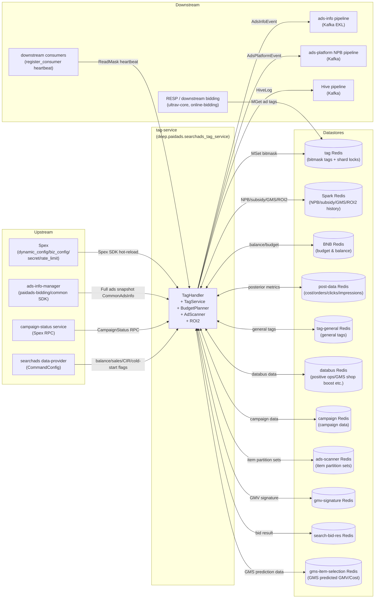

<!-- ads-workspace-gdoc-sync: gdoc_id=1QJmhBlDF9V7yrW3T-vq10hGgwM9ikoesIsZG5nPYgzc gdoc_url=https://docs.google.com/document/d/1QJmhBlDF9V7yrW3T-vq10hGgwM9ikoesIsZG5nPYgzc/edit -->

# tag-service

> Repository: https://git.garena.com/shopee/deep/tag-service

---

## Table of Contents

1. [Introduction](#introduction)
2. [Features](#features)
3. [Architecture](#architecture)
   - [System Context](#system-context)
   - [Service Topology](#service-topology)
   - [Data Flow](#data-flow)
4. [Directory Structure](#directory-structure)
5. [Build and Deployment](#build-and-deployment)
   - [Build Targets](#build-targets)
   - [Deploy Script](#deploy-script)
   - [Config Files](#config-files)
   - [Tag Verifier](#tag-verifier)
6. [Core Pipeline — Tag Computation](#core-pipeline--tag-computation)
   - [Periodic Trigger](#periodic-trigger)
   - [Shard Mode vs Legacy Mode](#shard-mode-vs-legacy-mode)
   - [Resource Loading](#resource-loading)
   - [Processor Chain Execution](#processor-chain-execution)
   - [Tag Diff and Filtering](#tag-diff-and-filtering)
   - [Redis Write](#redis-write)
   - [Kafka Push](#kafka-push)
   - [Campaign-Level Processing](#campaign-level-processing)
7. [Processor Registry](#processor-registry)
   - [Processor Interface](#processor-interface)
   - [42 Ad-Level Processors](#42-ad-level-processors)
   - [1 Campaign-Level Processor](#1-campaign-level-processor)
   - [YQL Filter Rules](#yql-filter-rules)
8. [Bitmask Flags](#bitmask-flags)
   - [Flag Definitions](#flag-definitions)
   - [Flag-Processor Mapping](#flag-processor-mapping)
9. [Background Services](#background-services)
   - [Budget Planner](#budget-planner)
   - [Ad Scanner](#ad-scanner)
   - [ROI2 ColdStart Flags](#roi2-coldstart-flags)
10. [NPB (New Product Boost)](#npb-new-product-boost)
    - [Spex API](#spex-api)
    - [Tag Processing](#tag-processing)
    - [Kafka Push (NPB)](#kafka-push-npb)
11. [Configuration](#configuration)
    - [TagService Static Config](#tagservice-static-config)
    - [CommonDynamicConfig](#commondynamicconfig)
    - [CommonBizConfig (Tag Definitions)](#commonbizconfig-tag-definitions)
    - [Secret Config](#secret-config)
    - [Rate Limit Config](#rate-limit-config)
12. [Data Layer](#data-layer)
    - [Redis Clusters (11)](#redis-clusters-11)
    - [Kafka Producers (5)](#kafka-producers-5)
    - [External Data](#external-data)
13. [Tag Lifecycle Management](#tag-lifecycle-management)
    - [TagLifecycleManage](#taglifecyclemanage)
    - [TagUsageStore and register_consumer](#tagusagestore-and-register_consumer)
    - [Admin Spex APIs](#admin-spex-apis)
14. [Development Guidelines](#development-guidelines)
    - [How to Add a New Processor](#how-to-add-a-new-processor)
    - [How to Add a New Bitmask Flag](#how-to-add-a-new-bitmask-flag)
    - [How to Add a Background Service](#how-to-add-a-background-service)
    - [Unit Testing](#unit-testing)
    - [Code Review & Git Workflow](#code-review--git-workflow)
15. [Monitoring](#monitoring)
16. [Business Terminology Glossary](#business-terminology-glossary)
17. [Additional Resources](#additional-resources)
18. [Frequently Asked Questions](#frequently-asked-questions)

---

## Introduction

tag-service is the Search Ads bidding tag service. It periodically pulls a full snapshot of ads from ads-info-manager, computes Bitmask tags through 42 Processors, writes the resulting AdTag into tag Redis, and pushes tag-change events to downstream via Kafka (EKL).

**Key roles:**
- **Offline periodic computation**: Not on the real-time bidding path. Computes ad Bitmask tags in advance so downstream bidding services (ultrav-core, online-bidding, etc.) can read them directly from Redis at bid time.
- **Multiple auxiliary services**: In addition to core tag computation, runs three independent background services — Budget Planner, Ad Scanner, and ROI2 ColdStart.
- **Spex APIs**: Exposes 4 Spex RPC interfaces: NPB queries (`get_ads_npb_info` / `batch_get_ads_npb_info`) and tag lifecycle management (`get_tag_usage_status` / `register_consumer`).

**Technology stack:**
- Built on `golang_splib` + Spex framework (not GAS), Spex namespace `deep.paidads.searchads_tag_service`
- Go module: `git.garena.com/shopee/deep/tag-service`, Go 1.24.5
- Configuration: 4-layer Spex config (`dynamic_config` / `biz_config` / `secret` / `rate_limit`), hot-reload supported

---

## Features

| Feature | Description |
|---------|-------------|
| Periodic Bitmask tag computation | Triggered by `AdsLockPeriod` (minutes); runs all 42 Processors on all ads for each country |
| Shard distributed tag computation | Shards ads by `adsId % shardNum`; multiple machines compete for SetNX distributed locks |
| Campaign-level tag computation | Triggered after ad-level completion; `campPositiveOperationProcessor` writes campaign-level tags to Spark Redis |
| Tag-change push (Kafka) | `AdsInfoEvent` pushed to `searchads_attribute_event_live` for ads-info pipeline consumption |
| NPB tag push (Kafka) | NPB stage/tier changes pushed as `AdsPlatformEvent` to `ads_strategy_info_event` |
| Budget Planner | Triggered every minute + local midnight; computes shop balance snapshots and ad available budgets in BNB Redis |
| Ad Scanner | Triggered every 2 minutes; maintains three types of ad item partition sets (Simple/SimpleROI2/Manual) in ads-scanner Redis |
| ROI2 ColdStart | Periodically updates ROI2 cold-start flags in tag Redis per country |
| NPB Spex API | `get_ads_npb_info` / `batch_get_ads_npb_info` RPC interfaces read NPB stage/tier from Spark Redis |
| Tag lifecycle management | `get_tag_usage_status` queries current biz_config tag status; `register_consumer` accepts downstream heartbeats and tracks per-bit last-read time (no_read_days) |
| GMS Item Selection Prune | Supports Thompson Sampling and Model-Based strategies to selectively prune GMS ads at campaign level |

---

## Architecture

### System Context

tag-service sits in the **offline tag pre-computation layer** of the Search Ads bidding pipeline. Its computation results (Bitmask tags) are read directly from Redis by downstream real-time bidding services, eliminating per-request recomputation:

```
ads-info-manager ──── (full ads snapshot) ────► tag-service ──── (MSet bitmask tags) ──── tag Redis
                                                      │
                                                      ├──── (AdsInfoEvent/Kafka EKL) ──── ads-info pipeline
                                                      ├──── (AdsPlatformEvent/Kafka) ──── ads-platform NPB pipeline
                                                      └──── (Hive log/Kafka) ──── Hive pipeline

Downstream bidding services (ultrav-core, online-bidding) ──── (MGet ad tags) ──── tag Redis
```

### Service Topology



**Upstream services:**

| Service | Protocol | Description |
|---------|----------|-------------|
| Spex | Spex SDK | Provides 4-layer config (dynamic_config / biz_config / secret / rate_limit), namespace `tag_service`, hot-reload supported |
| ads-info-manager | paidads-bidding/common SDK | Provides full ads snapshot (CommonAdsInfo), loaded per country + placement |
| campaign-status service | Spex RPC | CampaignStatusClient fetches campaign surge status; requester is `deep.paidads.searchads_tag_service` |
| searchads data-provider | data-provider SDK | ExternalData CommandConfig provides balance, sales, target CIR, cold-start flags, etc. |

**Downstream services:**

| Service | Protocol | Description |
|---------|----------|-------------|
| ads-info pipeline | Kafka (EKL) | AdsInfoEvent (paidads-valar) pushes ad tag changes, main topic `searchads_attribute_event_live` |
| ads-platform NPB pipeline | Kafka | AdsPlatformEvent pushes NPB stage/tier changes to `ads_strategy_info_event` |
| Hive pipeline | Kafka | HiveLogProducer sends processing logs to `periodical_job_hive_log_kafka` topic |
| RESP / downstream bidding | Redis (read) | Bidding services (ultrav-core, online-bidding, etc.) MGet ad Bitmask tags from tag Redis |
| downstream consumers | Spex RPC (`register_consumer`) | Downstream services send ReadMask heartbeats; tag-service records last-read time per bit |

**Datastore dependencies:**

| Datastore | Description |
|-----------|-------------|
| tag Redis | Primary tag store (MSet/MGet ad tag bitmask) + shard distributed locks (SetNX job/done/campaign_job keys) + tag lifecycle Redis keys (first_seen/last_read/tag_name) |
| Spark Redis | NPB stage/tier, subsidy boost, manual flag tables, GMS tags, ROI2 history; campaign tag writes (WriteCampaignTags) |
| BNB Redis | Budget N Balance: shop balance snapshots + ad available budgets + distributed locks |
| post-data Redis | Posterior metric Redis (cost, orders, clicks, impressions, etc.), accessed via `post_data_wrapper` |
| tag-general Redis | General tag Redis (tag_general processor reads ad/item/shop dimension tags) |
| databus Redis + output-databus Redis | Databus data (positive ops, large sellers, GMS shop boost, budget unification, CSPU, seller signup QSS, GMS prune, etc.) |
| campaign Redis | paidads-campaign Redis client provides campaign data |
| ads-scanner Redis | Ad Scanner partition store (item sets + distributed locks per `itemId%partitionCount`) |
| gmv-signature Redis | GMV signature data |
| search-bid-res Redis | Search bid result Redis |
| gms-item-selection Redis | GMS Item Selection model predictions (predicted_gmv / predicted_cost) for GmsItemSelectionPruneAd Model-Based strategy (optional) |

### Data Flow

Complete data flow for tag computation (Shard mode):

```
ads-info-manager.GetAllAdsInfo(country)
    │
    ▼
shard.GroupBy(ads, AdsIdStrategy, shardNum)
    │
    ▼  [Multiple machines compete for SetNX job lock: tag_service:job:{country}:{shardIdx}:{windowUnix}]
    ▼
tagService.UpdateAdsShard(ctx, country, shardAds)
    │
    ├── storage.MGet(ad keys) → originalTagMaps + newTagMaps
    │
    ├── resourceLoader.Load(ctx, country, ads) → Data
    │       ├── SparkRedis: NPB/subsidy/ROI2/GMS/manual flags
    │       ├── post-data: costs/clicks/orders/impressions
    │       ├── BNB Redis: available budgets
    │       ├── tag-general: ad/item/shop general tags
    │       ├── databus: positive ops/large sellers/GMS shop boost/budget unification/CSPU/QSS
    │       ├── gms-item-selection: GMS model predictions (predicted_gmv/cost)
    │       └── campaign-status: surge status
    │
    ├── for each Processor:
    │       ├── CampaignLevelEligible() filter
    │       ├── FilterAds(ads)
    │       ├── applyTagRuleFilter(YQL from CommonBizConfig.TagRuleMap)
    │       └── Process(country, ads, tags, data)  → mutate bitmask
    │
    ├── toMessages(ads, tags, data) → []*pb.Message
    │
    ├── filter(messages) → queueMessages (adTag changed vs ad.GetAdTag())
    │                    → storageMessages (adTag changed vs originalTagMap)
    │                    → changedMask (XOR diff for trackChangedBits)
    │
    ├── trackChangedBits(country, changedMask) → tag_bit_write counter (per tag name)
    │
    ├── storage.MSet(ToAdMap(storageMessages))        → tag Redis
    ├── producer.Send(ctx, queueMessages)              → Kafka AdsInfoEvent
    ├── storage.MSet(ToItemMap(autoBoostMessages))     → tag Redis (item keys)
    └── adsPlatformProducer.SendToAdsPlatform(npbMsgs)→ Kafka AdsPlatformEvent
```

---

## Directory Structure

```
tag-service/
├── config/                    # Config structs and Spex initialization
│   ├── config.go              # TagService static config (30+ fields)
│   ├── dynamic.go             # CommonDynamicConfig (Spex dynamic_config)
│   ├── tag_biz.go             # CommonBizConfig (Spex biz_config, tag definitions)
│   ├── secret.go              # Secret Config (Kafka/Redis credentials)
│   ├── rate_limit.go          # Rate Limit Config
│   └── files/                 # Per-environment YAML config files
│       ├── test.yml
│       ├── live.yml
│       ├── live-id.yml
│       ├── live-tw.yml
│       ├── live-br-us3.yml
│       └── liveish.yml
├── deploy/
│   └── start.sh               # Deployment startup script (selects config by cid/env)
├── idl/pb/                    # Protobuf IDL definitions
├── gen/                       # Generated code (skip_dirs)
├── pkg/
│   ├── handler/tag/           # TagHandler: periodic task scheduling, Shard/Legacy mode selection
│   ├── processor/             # 42 ad-level Processor implementations
│   ├── campaign_processor/    # 1 campaign-level Processor
│   ├── service/
│   │   ├── tag/               # TagService core logic, ResourceLoader
│   │   ├── budget_planner/    # Budget Planner background service
│   │   ├── ad_scanner/        # Ad Scanner background service
│   │   ├── new_product_boost/ # NPB service (Spex API implementation)
│   │   └── roi2/              # ROI2 ColdStart background service
│   ├── tag_lifecycle/         # TagLifecycleManage + TagUsageStore (bit lifecycle management)
│   ├── server/                # Spex API registration (NPB + lifecycle admin)
│   ├── shard/                 # Shard strategies (AdsIdStrategy / CampaignIdStrategy)
│   ├── storage/               # Redis storage abstraction (tag / BNB / ad-scanner)
│   ├── data/                  # Data access layer (spark / post_data / queue / databus, etc.)
│   └── util/                  # Utility functions (bitmask / exporter / http_common, etc.)
├── server/
│   ├── tag-server/            # Main entrypoint (main.go + run.go)
│   └── tag-verifier/          # Tag Verifier offline dry-run tool
├── client/                    # Client SDK (skip_dirs)
├── Makefile
├── go.mod
└── sp-workspace.yml
```

---

## Build and Deployment

### Build Targets

```bash
# Build main service binary
make svc
# Output: bin/tag_server
# Equivalent: go build -o bin/tag_server server/tag-server/*

# Build Tag Verifier (CGO + zig cross-compile, for remote dry-run debugging)
make build_tag_verifier
# Output: bin/tag_verifier.linux
# Uses zig cc for x86_64-linux-gnu cross-compilation

# Build and upload Tag Verifier to remote machine
make upload_tag_verifier USER_FOLDER=<your_name>

# Run unit tests
make unittest
# Equivalent: go test -cover ./...

# CI check (vet + fmt + unittest)
make ci
```

### Deploy Script

`deploy/start.sh` selects the config file based on environment variables `cid` and `env`:

```bash
case "$cid" in
  sg)  ./bin/tag_server -c config/files/$env.yml ;;
  id)  ./bin/tag_server -c config/files/live-id.yml ;;
  tw)  ./bin/tag_server -c config/files/live-tw.yml ;;
  *)   ./bin/tag_server -c config/files/$env.yml -xc config/files/$env-$cid-$AZ.yml ;;
esac
```

The service supports `-c <config>` primary config and `-xc <extra-config>` supplementary config; multiple files are merged on load (latter overrides former).

### Config Files

| File | Purpose |
|------|---------|
| `config/files/test.yml` | Test environment (SG) |
| `config/files/test-br.yml` | Test environment (BR) |
| `config/files/live.yml` | Production environment (SG) |
| `config/files/liveish.yml` | Staging environment |
| `config/files/live-id.yml` | Indonesia production |
| `config/files/live-tw.yml` | Taiwan production |
| `config/files/live-br-us3.yml` | Brazil production (us3 AZ) |

### Tag Verifier

Tag Verifier is an offline dry-run tool for verifying tag computation logic on remote machines without full service deployment:

```bash
# Build and upload
make upload_tag_verifier USER_FOLDER=your_name

# Run on remote machine (dry-run mode)
./tag_verifier.linux -c config.yml

# With Hive log validation
./tag_verifier.linux -c config.yml --test-hive-log
```

Reference: [Tag Verifier — Dry-Run Remote Machine Testing Guide](https://docs.google.com/document/d/1UuJ47NV-joCcNf7mG0zxjXDwJSyA9A7fgtUI4JILJHg/edit?tab=t.0#heading=h.mdmqthx3va9k)

---

## Core Pipeline — Tag Computation

### Periodic Trigger

`TagHandler.Start()` (`pkg/handler/tag/handler.go`) starts two goroutines per country at startup:

| Goroutine | Trigger interval | Responsibility |
|-----------|----------------|----------------|
| `runJob(country)` | `DynamicConfig.AdsLockPeriod` minutes | Ad-level Bitmask tag computation (Shard or Legacy mode) |
| `runCampaignJob(country)` | `TagConf.CampaignUpdateIntervalInSec` minutes | Campaign-level positive operation tag computation |

Both goroutines use `AddParallelJob` to align precisely to time-window boundaries (so a slow round does not delay the next one).

`TagHandler` also starts an auxiliary `watchBizConfigUpdates` goroutine that listens for `BizConfigUpdateCh` events and triggers `BuildLifecycles` on every biz_config reload.

### Shard Mode vs Legacy Mode

`shouldUseLegacyMode(country)` checks `DynamicConfig.ShardsMaxPerMachineByCountry[country]`:

| Condition | Mode | Behavior |
|-----------|------|----------|
| `ShardsMaxPerMachineByCountry[country] <= 0` | **Legacy mode** | Single-machine full processing, no shard locks. Note: `Send/MSet` in the legacy path are currently commented out — used only as a fallback |
| `> 0` | **Shard mode** | Ads sharded by `adsId % ShardNumByCountry[country]`; multiple machines compete for SetNX distributed locks |

**Shard mode lock key patterns:**
- Job lock: `tag_service:job:{country}:{shardIdx}:{windowUnix}` (TTL = `AdsLockPeriod` minutes)
- Done mark: `tag_service:done:{country}:{shardIdx}:{windowUnix}`
- Campaign shard lock: `tag_service:campaign_job:{country}:{shardIdx}:{windowUnix}`

After all shards complete, `monitorShardCompletion` (60s polling) confirms all done keys exist, then triggers `runCampaignLevel`.

### Resource Loading

`ResourceLoader.Load` (`pkg/service/tag/resource_loader.go`) loads all feature data in sequential order:

| Data field | Source | Description |
|------------|--------|-------------|
| `NewProductBoostStage/Tier` | Spark Redis | NPB stage/tier (by itemId) |
| `WindowCosts`, `TodayCosts` | post-data Redis | 7-day/1-day ad cost |
| `SubsidyBoost` | Spark Redis | Subsidy shop boost status |
| `CsWindowOrderCount` | post-data Redis | 8-day order count (cold-start check) |
| `ManualRoi2Migration`, `ManualAntouExempt`, `ManualReleDeboost` | Spark Redis | Manual ad special flags |
| `TodayRevLowBudget`, `YesterdayRevLowBudget`, `TheDayBeforeYesterdayRevLowBudget` | post-data Redis | Past 3-day cost (low budget check) |
| `MiddleRevAdvertiser` | Spark Redis | Middle-revenue advertiser flag |
| `NewItemAdsOrderCount` | post-data Redis | New SKU organic orders in past 31 days |
| `FirstDeliveredRoi2IdsIn60Days` | Spark Redis | ROI2 first-delivery records |
| `NewRoi2ItemCsWindowOrderCount` | post-data Redis | ROI2 cold-start 14-day order count |
| `AvlBudget` | BNB Redis | Ad available budget (BaseStrategy) |
| `GmsTag` | Spark Redis | GMS tag data |
| `WindowClicks`, `L7DImpressionCount` | post-data Redis | 7-day click/impression count |
| `AdGeneralTag`, `ItemGeneralTag`, `ShopGeneralTag` | tag-general Redis | General tags |
| `PositiveOperations`, `LargeSellersAds/Shop`, `GMSShopBoost`, `BudgetUnification`, `IsGmsItemSelectionPrune`, `SellerSignupQSSTimeStamps` | databus Redis | Databus multi-dimensional features |
| `GmsItemSelectionPrediction` | gms-item-selection Redis | GMS Model-Based strategy predictions (predicted_gmv/cost); optional — skipped when config is empty |
| `L7DOrderCount`, `TodayBroadGMV`, `TodayADVV` | post-data Redis | Recent comprehensive metrics |
| `DirectWindowOrderCnt`, `BroadOrder30DCount` | post-data Redis | Direct/broad order counts |
| `ItemCspuType` | databus Redis | Item CSPU type |
| `IsCampaignSurge` | campaign-status RPC | Campaign surge status |
| `HistoryDirectOrderCount`, `OneTime30dHistoryDirectOrder` | post-data Redis / Spark Redis | Historical order counts |

### Processor Chain Execution

`tagService.process()` executes each Processor sequentially:

```
for each Processor p:
    1. if p.CampaignLevelEligible() != isCampaignLevel → skip
    2. subAds = p.FilterAds(ads)         # Processor's own filter logic
    3. subAds = applyTagRuleFilter(...)   # YQL rule from CommonBizConfig.TagRuleMap[processorName]
    4. p.Process(country, subAds, tags, data)  # Mutate bitmask
```

### Tag Diff and Filtering

`filter()` separates processed messages into two categories and computes `changedMask`:

| Category | Filter condition | Purpose |
|----------|----------------|---------|
| `queueMessages` | `msg.AdTag != ad.GetAdvertisement().GetAdTag()` | Pushed to Kafka (delta from ads-info online tag) |
| `storageMessages` | `msg.AdTag != originalTagMap[adId]` | Written to Redis (delta from value read this round) |
| `changedMask` | Cumulative XOR diff of both | Passed to `trackChangedBits` to emit `tag_bit_write` Prometheus counter per tag name |

### Redis Write

```go
storage.MSet(ToAdMap(storageMessages))     // Write ad-level bitmask
storage.MSet(ToItemMap(autoBoostMessages)) // Write item-level auto-boost flag (non-Discovery ads)
```

Key format: ad-level `{country}:{adsId}`, item-level `{country}:item:{itemId}`.

### Kafka Push

```go
producer.Send(ctx, queueMessages)                        // AdsInfoEvent → searchads_attribute_event_live
adsPlatformQueueProducer.SendToAdsPlatform(ctx, npbMsgs) // AdsPlatformEvent → ads_strategy_info_event
```

`DisableKafkaSend` (DynamicConfig) can disable Kafka push online for debugging.

### Campaign-Level Processing

Executed in `runCampaignLevel` after all shards complete, or in the independent `runCampaignJob`:

1. Group ads by `campaignId`; `SetNX lock_positive_campaign:{country}_{campaignId}`
2. `ResourceLoader.LoadForCampaign`: load Databus historical metrics + BNB available budgets
3. Execute `campPositiveOperationProcessor.ProcessCampaign`
4. `sparkCli.WriteCampaignTags`: write campaign-level tags to Spark Redis (TTL = `CampaignTagTTL` hours)

---

## Processor Registry

### Processor Interface

Defined in `pkg/processor/interface.go`:

```go
type Processor interface {
    Process(country string, ads []*ads_info.CommonAdsInfo, adsTagMap map[int64]int64, data *Data) error
    FilterAds(ads []*ads_info.CommonAdsInfo) []*ads_info.CommonAdsInfo
    CampaignLevelEligible() bool
    Meta() Meta  // Returns Name (processor name) and Description
}
```

### 42 Ad-Level Processors

Registration order in `AddProcessors` within `init_tag_service.go` (= execution order):

| # | Processor name | Source file |
|---|---------------|-------------|
| 1 | allAdsDefaultProcessor | `all_ads_default.go` |
| 2 | smoothDeliveryProcessor | `smooth_delivery_processor.go` |
| 3 | ecpcBudgetAd | `ecpc_budget_ad.go` |
| 4 | shopSubsidyBoostTagProcessor | `subsidy_shop_boost.go` |
| 5 | csWindowOrderProcessor | `cs_common.go` |
| 6 | manualRoi2MigrationProcessor | `manual_roi2_migration.go` |
| 7 | lowBudgetAdProcessor | `low_budget_ad.go` |
| 8 | manualAntouExemptProcessor | `manual_antou_exempt.go` |
| 9 | manualReleDeboostProcessor | `manual_rele_deboost.go` |
| 10 | coldStartAdProcessor | `cold_start_ad.go` |
| 11 | middleRevAdvertiserProcessor | `middle_rev_advertiser.go` |
| 12 | newProductBoostTagProcessor | `new_product_boost_ad.go` |
| 13 | gmsTagProcessor | `gms_tag.go` |
| 14 | rapidBoostToggle | `rapid_boost_toggle.go` |
| 15 | oneCpaCost | `one_cpa_cost.go` |
| 16 | tagGeneralProcessor | `tag_general.go` |
| 17 | newItemAdsBreakOrderPhase | `new_item_ads_break_order_phase.go` |
| 18 | newItemAdsLifeTimePhase | `new_item_ads_life_time_phase.go` |
| 19 | newRoi2ItemAdProcessor | `new_roi2_item_ad.go` |
| 20 | newRoi2ItemColdStartAdProcessor | `new_roi2_item_cold_start_ad.go` |
| 21 | sequenceModelAdProcessor | `sequence_model_tag.go` |
| 22 | newItemAdsPromotedUiEntry | `new_item_ads_promoted_ui_entry.go` |
| 23 | gmsMpColdStartProcessor | `gms_mp_cold_start.go` |
| 24 | gmsMpEmptyOrderProcessor | `gms_mp_empty_order.go` |
| 25 | emptyOrderAdsProcessor | `empty_order_ads.go` |
| 26 | sellerSignupQSSProcessor | `seller_signup_qss.go` |
| 27 | gmsShopBoostProcessor | `gms_mp_shop_boost.go` |
| 28 | positiveOperationProcessor | `positive_operations.go` |
| 29 | dormantAdsProcessor | `ads_dormant.go` |
| 30 | largeSellersProcessor | `large_sellers.go` |
| 31 | overallUnderBidAndHasBudgetAdsProcessor | `overall_under_bid_and_has_budget_ads.go` |
| 32 | campaignSurgeOnProcessor | `campaign_surge_status.go` |
| 33 | gmsItemSelectionPrune | `gms_item_selection_prune_ad.go` |
| 34 | csDirect8dLt1Processor | `cold_start_direct_8d_lt1.go` |
| 35 | csDirect8dLt3Processor | `cold_start_direct_8d_lt3.go` |
| 36 | emptyOrderDirect8dLt1Processor | `empty_order_direct_8d_lt1.go` |
| 37 | emptyOrderDirect8dLt3Processor | `empty_order_direct_8d_lt3.go` |
| 38 | newItemBoostDirect30dLt1Processor | `new_item_ads_30d_lt1.go` |
| 39 | newItemGroupPlatformBoostAdProcessor | `new_item_group_boost_ad.go` |
| 40 | reservePotentialItemTagProcessor | `reserve_overall_potential_item_tag.go` |
| 41 | reserveColdStartAdTagProcessor | `reserve_overall_cold_start_ad_empty_order_tag.go` |
| 42 | **overallColdStartProcessor** | `overall_cold_start.go` |

> ⚠️ **Important**: `overallColdStartProcessor` **must remain the last registered processor** (comment: `// Keep this processor in the last line, after all coldstart processors.`). It depends on all preceding cold-start processors having already written their respective bits to `adsTagMap`.

**GmsItemSelectionPruneAd notes:**
- `CampaignLevelEligible()` returns `true` — this processor also executes at campaign level
- Supports pricing types: `PRODUCT_SHOP_GMV_MAX_PRICING_SIMPLE` and `PRODUCT_SHOP_GMV_MAX_PRICING` (verified in `isSupportedPricing()`)
- Supports three pruning modes: **Simple Prune** (Spark-job-marked shop/item combinations with `todayADVV == 0`), **Thompson Sampling** (Beta posterior over order/click signals, enabled when `shopId % Mod` falls within [`LowerBound`, `UpperBound`)), **Model-Based** (ROI ranking on predicted_gmv/cost, budget-aware pruning, enabled when `shopId % Mod` falls within [`LowerBound2`, `UpperBound2`); when active, overrides Simple+Thompson results. `ModelBasedEpsilon` is the exploration smoothing term, `ModelBasedCostFloor` is the minimum cost floor as a fraction of daily budget, `USDToCurrencyRate` provides per-country exchange rates)
- **Disabled Range**: when `shopId % Mod` falls within [`LowerBound3`, `UpperBound3`), the prune tag is forcefully cleared regardless of any pruning mode result (`isPruneTagDisabled` in `gms_item_selection_prune_ad.go`)
- Within each campaign, the top 5 ads are always protected (ranked by TodayADVV → L7DOrderCount → WindowClicks → L7DImpressionCount)

**OverallUnderBidAndHasBudgetAds notes:**
- `CampaignLevelEligible()` returns `true` — this processor runs at both ad-level and campaign-level
- Uses **two** independent Bitmask flags: `overallUnderBidAndHasBudgetTag` (GMS/multi-product ads: `PRODUCT_SHOP_GMV_MAX_PRICING`, `PRODUCT_MULTI_PRODUCT_DELIVERY_PRICING`, `PRODUCT_SHOP_GMV_MAX_PRICING_SIMPLE`) and `overallUnderBidAndHasBudgetTag4SingleItem` (single-item ads: `ROI_TWO_PRICING`, `SIMPLE_ROI_TWO_PRICING`)
- Under-bid detection: Target2/GMS Target/multi-product uses `campaignAdvv > threshold * campaignCost`; Simple2/GMS Simple uses `campaignBroadGmv > roiUpperBound * campaignCost`
- Only triggers after local time reaches `DynamicConfig.UnderBidAndHasBudgetConfig.TriggerHour`; all ads receive a false tag before that threshold

### 1 Campaign-Level Processor

| Processor | File | Description |
|-----------|------|-------------|
| `campPositiveOperationProcessor` | `pkg/campaign_processor/` | Computes campaign positive operation status and writes to Spark Redis |

Campaign-level Processors implement `CampaignLevelEligible() bool = true` and are skipped during ad-level processing; they execute only in the campaign-level flow.

### YQL Filter Rules

`CommonBizConfig.TagRuleMap` (Spex `biz_config` key) defines runtime YQL filter rules per processor:

```json
{
  "processor_name": {
    "filter": "placement == 1 && pricingType == 2",
    "bits": { "tag_name": bit_num }
  }
}
```

Rules are compiled to `yql.Ruler` by `bizConfigValidator`. `applyTagRuleFilter` applies the rule before each processor execution (filtering by `placement` and `pricingType`).

---

## Bitmask Flags

### Flag Definitions

Defined in `pkg/util/bitmask/bitmask.go` using `iota`:

| Flag (bit position) | Constant name | Status |
|--------------------|---------------|--------|
| 1 | `AllAdsDefault` | active |
| 2 | `GmsItemSelectionPruneAd` | active |
| 3 | `ReservePotentialItemTag` | active |
| 4 | `ReserveColdStartEmptyOrderTag` | active |
| 5 | `IncentiveTasksTrafficBoostTagQss` | active |
| 6 | `NewItemGroupPlatformBoostAd` | active |
| 7 | `GmsShopBoostAd` | active |
| 8 | `PotentialProductBoost` | active |
| 9 | — | unused |
| 10 | `ReserveRankerPotentialItemTag` | active |
| 11 | `ReserveRankerColdStartEmptyOrderTag` | active |
| 12 | `VoucherBoost` | active |
| 13–15 | — | unused |
| 16 | `ColdStartDirect8dLt1` | active |
| 17 | `EmptyOrderDirect8dLt1` | active |
| 18 | `ColdStartDirect8dLt3` | active |
| 19 | `EmptyOrderDirect8dLt3` | active |
| 20 | `NpbDirect30dLt1` | active |
| 21 | — | unused |
| 22 | `CampaignSurgeStatusTag` | active |
| 23 | `LargeSellersPhase1BoostAd` | active |
| 24 | `LargeSellersPhase2BoostAd` | active |
| 25 | `LargeSellersDiscountAd` | active |
| 26 | `EcpcLargeBudgetAd` | active |
| 27 | `EcpcMidBudgetAd` | active |
| 28 | `EcpcSmallBudgetAd` | active |
| 29 | `OverallUnderBidAndHasBudgetTag4SingleItem` | active |
| 30 | `OverallUnderBidAndHasBudgetTag` | active |
| 31 | `SubsidyShopBoostAd` | active |
| 32 | `CsNoWindowOrderStd` | active |
| 33 | `ManualRoi2MigrationStd` | active |
| 34 | `LowBudgetUsageAd` | active |
| 35 | `ColdStartAd` | active |
| 36 | `ManualAntouExemptStd` | active |
| 37 | `ManualReleDeboost` | active |
| 38 | `Roi2AddtionalDeduction` | active |
| 39 | `Roi2PacingGmvMaxDeboost` | active |
| 40 | `Roi2PacingReleScoreDeboost` | active |
| 41 | `Roi3Boost` | active |
| 42 | `MiddleRevAdvertiser` | active |
| 43 | `OverallColdStartAd` | active |
| 44 | `SubsidyGoodPotentialProduct` | active |
| 45 | `NewProductBoost` | active |
| 46 | `GmsHotSku` | active |
| 47 | `GmsHighPotentialSku` | active |
| 48 | `RapidBoostToggle` | active |
| 49 | `OneCpaCost` | active |
| 50 | `Roi3AdditionDeuction` | active |
| 51 | `NewItemAdsBreakOrderPhase` | active |
| 52 | `NewItemAdsLifeTimePhase` | active |
| 53 | `NewRoi2ItemAd` | active |
| 54 | `NewRoi2ItemColdStartAd` | active |
| 55 | `SequenceModelAd` | active |
| 56 | `NewItemAdsPromotedUiEntry` | active |
| 57 | `GmsMpCampaignColdStart` | active |
| 58 | `GmsMpCampaignEmptyOrder` | active |
| 59 | `BlackList` | active |
| 60 | `LowBudget` | active |
| 61 | `LowBudgetRollout` | active |
| 62 | `EmptyOrderAds` | active |
| 63 | `PositiveOperationAd` | active |
| 64 | `DormantAds` | active (special: `const DormantAds Flag = -1 << 63`, defined outside iota to avoid int64 overflow) |
| `_TotalBits` | — | Tracks total used bits within the iota group (keep at end) |

`new_bitmask.go` provides `SetByBitNum`/`ClearByBitNum`/`HasByBitNum` functions that operate using `CommonBizConfig.TagInfoMap`, preferred over the legacy `bitmask.Set`/`Clear`/`Has` (marked as no longer used).

### Flag-Processor Mapping

Maintained dynamically at runtime via `CommonBizConfig.TagInfoMap` (`tag_name → bit_num`) and `TagRuleMap` (`processor_name → TagRule{Filter, Rule(YQL), Bits}`). This means the binding between a flag and a processor **requires no code change** — updating Spex `biz_config` is sufficient (hot-reload).

`FlagNames` (`bitmask.go`) defines all active flag names used for Prometheus metric labels (from `AllAdsDefault` through `DormantAds`). Additionally, `trackChangedBits` emits the `tag_bit_write` counter per tag name for each chunk that has any bit flip, enabling monitoring of flag write activity.

---

## Background Services

### Budget Planner

`pkg/service/budget_planner/service.go` — budget planning background service, triggered every minute + local midnight:

**Trigger mechanism:**
- Random startup delay of 0–10 seconds (avoids multi-machine thundering herd)
- Immediate execution once at startup (`start_up_service`)
- 1-minute ticker (`period`)
- Local midnight detection (`checkNewLocalDay`: checks every 5 seconds for `00:00`, deduplicated within 1 minute)

**Execution logic (`updateShopAndAdsBudget`):**
1. `GetAllAdsInfo(country)` → group by `shopId`
2. `updateAllShopBalancesInCountry`: fetch latest shop balance from data-provider → `SetShopBalanceSnapshots` writes to BNB Redis
3. `updateAllAdsAvailableBudgetInCountry`: run `BaseStrategy.Calculate` per ad → `SetAdAvailableBudgetsWithStrategy` writes to BNB Redis

**BaseStrategy calculation (`base_strategy.go`):**
```
AvlBudget = min(daily_budget, shop_balance_snapshot)
```
Also considers active state, daily budget, total budget field changes.

### Ad Scanner

`pkg/service/ad_scanner/scanner.go` — ad item set scanning service, triggered every 2 minutes:

**Execution logic (`scanAdsByCountry`):**
1. `GetAllAdsInfo(country)` → partition by `itemId % partitionCount` (ID: 200 partitions, others: 100)
2. Three ad types processed separately:
   - Simple Ads (`SIMPLE_MODE_SEARCH` + `SIMPLE_MODE_PRICING`)
   - SimpleROI2 Ads (`SIMPLE_ROI_TWO`)
   - Manual Ads (`KEYWORD_SEARCH` + Manual/eCPC pricing)
3. Per partition: `LockAdItems` (SetNX distributed lock) → `GetAdsItems` (fetch current Redis set) → diff → `AddAdsItems`/`RemoveAdsItems`

### ROI2 ColdStart Flags

`pkg/service/roi2/service.go` — ROI2 cold-start flag service:

- Triggered every `DynamicConfig.Roi2ColdStratAdsLockPeriod` minutes
- Only runs for countries configured in `ROI2CSFlagCountryMap`
- Calls `updateColdStartFlags`: fetches cold-start assessment data from data-provider and updates tag Redis

---

## NPB (New Product Boost)

### Spex API

tag-service exposes 2 NPB Spex RPC APIs (registered in `pkg/server/api_register.go`):

| API name | Function | Request constraints |
|---------|----------|---------------------|
| `get_ads_npb_info` | Query NPB stage/tier for a single ad | Requires `SIMPLE_ROI_TWO` placement + `SIMPLE_ROI_TWO_PRICING` pricingType |
| `batch_get_ads_npb_info` | Batch query NPB stage/tier | Non-empty country and ads list |

Both APIs read data via `NpbService.GetNpbStage`/`GetNpbTier` from **Spark Redis**, returning `NewProductBoostStage` and `NewProductBoostTier`.

### Tag Processing

`newProductBoostTagProcessor` (`pkg/processor/new_product_boost_ad.go`) in the processor chain:
- Reads `data.NewProductBoostStage` (loaded by ResourceLoader from Spark Redis)
- Sets `bitmask.NewProductBoost` flag based on stage value

### Kafka Push (NPB)

`filterNewProductBoost` in `chunkUpdateShard` detects NPB changes:
- Only processes `SIMPLE_ROI_TWO` placement + `SIMPLE_ROI_TWO_PRICING` pricingType ads
- Detects changes in `msg.NewProductBoostStage` or tier vs. current ads-info value
- Calls `adsPlatformQueueProducer.SendToAdsPlatform` (with `IsDuplicatedNpbInfo` dedup logic) to push `AdsPlatformEvent` to `ads_strategy_info_event` topic

---

## Configuration

### TagService Static Config

Defined in `config/config.go`, loaded from YAML files with environment variable override support (`ecp`):

| Field | Type | Description |
|-------|------|-------------|
| `countries` | `[]string` | Country list the service processes (e.g., `[SG, MY, TH, ...]`) |
| `HttpPort` | `int` | HTTP port, default 27002 |
| `spex-config` | `spex.SpexConfig` | Spex connection config |
| `tag-redis` | `Redis` | Primary tag Redis |
| `spark-redis` | `redisutil.Config` | Spark Redis |
| `gmv-signature-redis` | `Redis` | GMV signature Redis |
| `tag` | `TagConf` | `campaign-update-interval`, `chunk-size`, `shard-num` |
| `dedup-ttl` | `Duration` | Kafka dedup TTL |
| `kafka` | `KafkaConfig` | Primary tag event Kafka Producer |
| `ads-platform-kafka-producer` | `KafkaConfig` | NPB event Kafka Producer |
| `bnb-redis` | `bnb.BnbRedisConfig` | BNB Redis |
| `ads-scanner-redis` | `ad_scanner_storage.Config` | Ad Scanner Redis |
| `ext-data-config` | `config.CommandConfig` | searchads data-provider config |
| `campaign` | `redisutil.Config` | Campaign Redis |
| `dps-kafka-producer` | `KafkaConfig` | DPS Kafka Producer |
| `search-bid-res-kafka-producer` | `KafkaConfig` | Search bid result Kafka Producer |
| `hive-log-kafka-producer` | `KafkaConfig` | Hive log Kafka Producer |
| `search-bid-res-redis` | `redisutil.Config` | Search bid result Redis |
| `tag-general-redis` | `RedisConfig` | tag-general Redis (includes username/password) |
| `ads-info-manager` | `ads_info_manager.Config` | ads-info-manager config |
| `common-config-center-address` | `config_redis.ConfigCenterAddress` | post-data common config center |
| `business-config-center-address` | `config_redis.ConfigCenterAddress` | post-data business config center |
| `post-data-spex` | `post_data_client.SpexConfig` | post-data Redis client config (Spex-based discovery) |
| `databus-config` | `redisutil.Config` | Databus Redis |
| `output-databus-config` | `redisutil.Config` | Output Databus Redis |
| `gms-item-selection-redis` | `redisutil.Config` | GMS Item Selection prediction Redis (optional, skipped when empty) |

### CommonDynamicConfig

Loaded via Spex key `dynamic_config`, namespace `tag_service`, hot-reload supported. Key fields:

| Field | Default | Description |
|-------|---------|-------------|
| `ads_lock_period` | 10 (minutes) | Ad-level tag computation trigger interval |
| `campaign_ads_lock_period` | 60 (minutes) | Campaign-level tag computation trigger interval |
| `roi2_coldstart_ads_lock_period` | 2 (minutes) | ROI2 cold-start flag update interval |
| `shards_max_per_machine_by_country` | — | Max concurrent shards per machine (`<= 0` falls back to Legacy mode) |
| `shard_num_by_country` | — | Total shards per country |
| `country_concurrency` | — | Chunk-level concurrency per country |
| `disable_kafka_send` | false | Debug switch: disable Kafka push |
| `hive_log_sample_rate` | — | Hive log sampling rate |
| `campaign_tag_ttl` | 24 (hours) | Campaign tag TTL |
| `cold_start` | — | Cold-start thresholds (impr/click/order count + period) |
| `roi2_cs_flag_countries` | — | Countries with ROI2 cold-start flag enabled |
| `roi2_cs_order_cnt_config` | — | ROI2 cold-start order count threshold (period + order_cnt) |
| `gms_mp_cs_order_cnt_config` | — | GMS multi-product campaign cold-start order count threshold |
| `empty_order_ads_config` | — | Empty-order ad order count threshold |
| `direct_cs_order_cnt_config` | — | Direct cold-start order count threshold |
| `large_budget_ad` | — | `LargeBudgetMinRatioThreshold`: minimum ratio threshold for large-budget-ad classification |
| `high_camp_performance` | — | `HighCampPerformanceThreshold`: campaign performance threshold |
| `auto_boost_state` | — | AutoBoostState: `ColdStartPeriod`, `RecentDaysClick` |
| `campaign_surge_min` | — | CampaignSurgeMin lower/upper bound |
| `campaign_surge_min_countries` | — | Countries with campaign surge min enabled |
| `ads_level_campaign` | — | AdsLevelCampaign experiment bounds (LowerBound1/UpperBound1/LowerBound2/UpperBound2) |
| `ads_level_campaign_countries` | — | Countries with ads-level campaign enabled |
| `campaign_surge_target_cir` | — | CampaignSurgeTargetCir: `HistoryCpcClickThreshold`, `ExpectedClickThreshold` |
| `enable_send_bucket_budget_output` | false | Bucket budget output Kafka send switch |
| `low_budget_threshold` | — | Threshold for low-budget determination |
| `sequence_click_threshold` | — | Click threshold for sequence model ads |
| `enable_sync_us` | false | US data sync switch |
| `min_order_cnt_30d_before_roi2` | — | Per-country minimum 30-day order count before ROI2 migration |
| `max_order_cnt_30d_before_roi2` | — | Per-country maximum 30-day order count before ROI2 migration |
| `impr_cnt_30d_before_roi2` | — | Per-country impression count threshold before ROI2 migration |
| `under_bid_and_has_budget_config` | — | `TriggerHour`, `BudgetUsageRateThreshold`, `UnderBidCostRatioThreshold`, `ExpPlanBucketList4SingleItem` (experiment plan buckets for single-item ads) |
| `gms_selection_config` | complex object | GMS item selection parameters. Thompson Sampling: `OrderWeight`, Prior (`OrderPriorAlpha/Beta`, `ClickPriorAlpha/Beta`), `ExploreBudgetUsage`/`PruneBudgetUsage` (budget thresholds for temperature selection), `ExploreTemperature`/`NeutralTemperature`/`PruneTemperature` (budget-usage-based temperatures), `ExploreProbFloorFactor`/`NeutralProbFloorFactor`/`PruneProbFloorFactor` (probability floors), `MinGammaShape`/`MaxGammaRetry` (Gamma sampling params), `Mod`/`LowerBound`/`UpperBound` (Thompson experiment range). Model-Based: `LowerBound2`/`UpperBound2` (experiment range), `ModelBasedEpsilon` (exploration smoothing), `ModelBasedCostFloor` (minimum cost floor as fraction of daily budget), `USDToCurrencyRate` (per-country rates). Disabled Range: `LowerBound3`/`UpperBound3` (shops in this range have prune tag forcefully cleared) |
| `debug_ads_ids` | — | List of specific ad IDs to track for debugging |
| `debug_countries` | — | List of specific countries to track for debugging |

### CommonBizConfig (Tag Definitions)

Loaded via Spex key `biz_config` — the **core runtime tag definition** of tag-service:

```json
{
  "all_tag": [
    {
      "tag_name": "ecpc_large_budget_ad",
      "bit_num": 26,
      "is_use": true,
      "processor": "ecpc_budget_ad",
      "filter": "placement == 1 && pricingType == 1",
      "status": "active"
    }
  ]
}
```

`bizConfigValidator` parses this into:
- `TagInfoMap`: `tag_name → bit_num`
- `TagRuleMap`: `processor_name → TagRule{Filter, Rule(YQL), Bits}`
- `AllTagInfoByBit`: `bit_num → TagInfo`

**TagStatus:** `active` or `deprecated`. Tags marked `deprecated`: their Redis keys are cleaned up in `BuildLifecycles`; when `TagUsageStore.ProcessHeartbeat` receives reads for these bits it only emits `deprecated_tag_read` metrics without updating `last_read`.

### Secret Config

Loaded via Spex key `secret`:

| Field | Description |
|-------|-------------|
| `ProducerKafka` | Primary tag event Kafka SASL credentials |
| `AdsPlatformKafka` | NPB event Kafka SASL credentials |
| `HiveLogKafka` | Hive log Kafka SASL credentials |
| `ExtDataSecret` | searchads data-provider authentication key |
| `TagGeneralRedis` | tag-general Redis credentials (username/password) |

### Rate Limit Config

Loaded via Spex key `rate_limit`; controls QPS limits for the CIR service.

---

## Data Layer

### Redis Clusters (11)

| Config field | Purpose |
|-------------|---------|
| `tag-redis` | **Primary tag store**: ad bitmask MSet/MGet, shard distributed locks (job/done/campaign_job keys), tag lifecycle Redis keys (tag:name:/tag:first_seen:/tag:last_read:) |
| `spark-redis` | NPB stage/tier, subsidy shop boost, manual flag tables, GMS tags, ROI2 history; campaign tag writes |
| `bnb-redis` | Budget N Balance: shop balance snapshots, ad available budgets, distributed locks |
| `post-data` (via `post-data-client`) | Posterior metric Redis (cost, orders, clicks, impressions, etc.), accessed via `post_data_wrapper` |
| `tag-general-redis` | General tag Redis (tag_general processor reads ad/item/shop dimension tags) |
| `databus-config` | Databus Redis: positive ops, large sellers, GMS shop boost, budget unification, CSPU, seller signup QSS, GMS prune, etc. |
| `output-databus-config` | Output Databus Redis (separate databus data source for budget unification, etc.) |
| `campaign` | paidads-campaign Redis client provides campaign data |
| `ads-scanner-redis` | Ad Scanner partition store (item sets + distributed locks per `itemId%partitionCount`) |
| `gmv-signature-redis` | GMV signature data |
| `search-bid-res-redis` | Search bid result Redis |
| `gms-item-selection-redis` | GMS Item Selection model prediction data (optional), provides predicted_gmv/cost for GmsItemSelectionPruneAd Model-Based strategy |

> Note: `gms-item-selection-redis` is optional. `NewGmsItemSelectionCli` skips initialization when the config is empty, and ResourceLoader will not load the corresponding data.

### Kafka Producers (5)

| Config field | Topic | Event type | Consumer |
|-------------|-------|-----------|---------|
| `kafka` | `searchads_attribute_event_live` (etc.) | `AdsInfoEvent` (paidads-valar) Source_ADS_TAG_SVC | ads-info pipeline |
| `ads-platform-kafka-producer` | `ads_strategy_info_event` | `AdsPlatformEvent` (NPB stage/tier changes) | ads-platform NPB pipeline |
| `hive-log-kafka-producer` | `periodical_job_hive_log_kafka` | HiveLog (processing logs with AlgoContent) | Hive pipeline |
| `dps-kafka-producer` | DPS-related topics | DPS events | DPS pipeline |
| `search-bid-res-kafka-producer` | Search bid result topics | Search bid result events | downstream consumers |

The primary tag event Kafka Producer has built-in deduplication (controlled by `dedup-ttl`) to avoid re-pushing identical tags for the same ad within a short window.

### External Data

Accessed via `searchads/data-provider` SDK (`CommandConfig`):
- Authentication uses `ExtDataSecret` from Secret Config, requester is `tag_service`
- Provides: shop balance, item sales, target CIR, ROI2 cold-start flags, etc.
- Used by Budget Planner's `updateAllShopBalancesInCountry` and ROI2 service's flag updates

---

## Tag Lifecycle Management

### TagLifecycleManage

Defined in `pkg/tag_lifecycle/tag_usage_status.go`. **Note: Automated state transitions (active → warning → disabled) have been removed from the codebase.** Lifecycle decisions are now entirely manual, based on Prometheus metrics and the `get_tag_usage_status` API.

Current responsibilities of `TagLifecycleManage`:
- **Known bits tracking**: `knownBits` map records all active bits currently in biz_config; on biz_config update (`BuildLifecycles`), Redis keys for removed bits are cleaned up
- **Reconcile Report**: On every biz_config change, automatically compares `TagRuleMap` (config-side processors) against registered processors (code-side), generating `ConfigOrphans` (in config but not in code), `CodeOrphans` (in code but not in config), and `DeprecatedTags` (status = deprecated)
- **Snapshot API**: `Snapshot(ctx)` reads biz_config + Redis on demand to render the current status of all bits (BitNum / TagName / ProcessorName / Status / LastReadUnix / NoReadDays)

### TagUsageStore and register_consumer

Defined in `pkg/tag_lifecycle/consumer.go`. `TagUsageStore` stores the following keys in tag Redis (no TTL except last_read):

| Redis key | Format | Description |
|-----------|--------|-------------|
| `tag:name:{bitNum}` | string, no TTL | Tag name currently bound to this bit; triggers baseline reset and old key cleanup when the name changes |
| `tag:first_seen:{bitNum}` | int64 unix, no TTL | When the bit first appeared in biz_config; serves as fallback baseline for no_read_days |
| `tag:last_read:{bitNum}` | int64 unix, TTL=90d | Updated by register_consumer heartbeats |

`register_consumer` Spex API processes downstream heartbeats:
1. Parses `ReadMask` (packed uint64; bit (i-1) set means bit i was read)
2. For each set bit: verifies tag name identity (prevents data corruption on bit reuse), writes `tag:last_read:{bitNum}`, emits `tag_bit_read{service, bit_num}` counter
3. Reads of deprecated tags only emit `deprecated_tag_read` metrics without updating last_read

### Admin Spex APIs

| API | Command | Function |
|-----|---------|---------|
| `get_tag_usage_status` | `service.deep.paidads.searchads_tag_service.get_tag_usage_status` | Returns snapshot of all bit current status + Reconcile Report (config/code orphans, deprecated) |
| `register_consumer` | `service.deep.paidads.searchads_tag_service.register_consumer` | Accepts ReadMask heartbeats from downstream services and updates last_read time |

---

## Development Guidelines

### How to Add a New Processor

1. Create a new file in `pkg/processor/` (e.g., `my_new_processor.go`)
2. Implement the 4 methods of the `processor.Processor` interface:
   ```go
   func (p *MyProcessor) Process(country string, ads []*ads_info.CommonAdsInfo, adsTagMap map[int64]int64, data *Data) error
   func (p *MyProcessor) FilterAds(ads []*ads_info.CommonAdsInfo) []*ads_info.CommonAdsInfo
   func (p *MyProcessor) CampaignLevelEligible() bool  // Return false for ad-level
   func (p *MyProcessor) Meta() Meta  // Return a unique name
   ```
3. Register in `AddProcessors` inside `pkg/service/tag/init_tag_service.go` in the **correct order**
4. ⚠️ `overallColdStartProcessor` **must remain the last line**
5. Add an iota constant in `pkg/util/bitmask/bitmask.go` for the new flag
6. Update `all_tag` in Spex `biz_config` with the new tag definition

### How to Add a New Bitmask Flag

1. Add a new constant to the `iota` block in `pkg/util/bitmask/bitmask.go` (**must be before `_TotalBits`**)
2. If monitoring is needed, add a `Flag → "metric_name"` entry to the `FlagNames` map
3. Update `biz_config.all_tag` in Spex with the corresponding tag definition (`tag_name`, `bit_num`, `processor`, `filter`)
4. Note: iota is sequential — **do not insert in the middle** (all subsequent flag values will shift). Always append to the end

### How to Add a Background Service

1. Create a new directory under `pkg/service/` (e.g., `pkg/service/my_service/`)
2. Implement a `Start()` method (reference `budget_planner/service.go` or `ad_scanner/scanner.go`)
3. Initialize and call `go service.Start()` in the `runServices()` function in `server/tag-server/run.go`

### Unit Testing

- Framework: `github.com/stretchr/testify`
- Style: table-driven tests
- Run: `make unittest` (equivalent to `go test -cover ./...`)
- Examples: `pkg/processor/*_test.go`, `pkg/service/tag/service_test.go`, `pkg/data/databus/client_test.go`

### Code Review & Git Workflow

1. Branch naming: `feature/xxx`, `fix/xxx`, `refactor/xxx`
2. Run `make ci` before committing (includes `vet` + `fmt` + `unittest`)
3. CI pipeline: `.gitlab-ci.yml` automatically runs `make ci`
4. Important changes should be accompanied by updates to Spex `biz_config` or `dynamic_config` to ensure controllable rollout

---

## Monitoring

**Grafana Dashboards:**
- [Tag Service Dashboard](https://grafana.shopee.io/d/QgJhOVtnz/search-ads-tag-service)
- [Kafka Dashboard](https://monitoring.infra.sz.shopee.io/grafana/goto/SoiWUir7k?orgId=1)

**Prometheus metrics (namespace: `searchads_tag_service_*`):**

| Metric name | Type | Description |
|------------|------|-------------|
| `searchads_tag_service_latency` | Summary | Per-component latency (country/component/type labels) |
| `searchads_tag_service_error` | Counter | Error count |
| `searchads_tag_service_count` | Counter | Operation count (queue/storage message counts, shard lock acquisitions, etc.) |
| `searchads_tag_service_gauge` | Gauge | Instantaneous values (chunk_len, etc.) |
| `searchads_tag_service_store` | Gauge | Storage metrics (ads_len, machine_acquired_shards, flag_len, etc.) |
| `searchads_budget_planner_*` | — | Budget Planner metrics |
| `searchads_bucket_budget_agent_*` | — | Bucket Budget metrics |
| `searchads_tag_service_store{component="flag_len"}` | Gauge | Number of ads with each FlagNames bit set |
| `tag_bit_write{country, tag_name}` | Counter | Number of times each bit flipped in a batch (monitors flag write activity) |
| `tag_bit_read{service, bit_num}` | Counter | Read counts per bit reported by downstream register_consumer heartbeats |
| `deprecated_tag_read{service, bit_num, tag_name}` | Counter | Number of times downstream reads a deprecated flag bit |
| `tag_registry{type="config_orphan_count"}` | Gauge | Processors configured in biz_config but not registered in code |
| `tag_registry{type="code_orphan_count"}` | Gauge | Processors registered in code but not configured in biz_config |
| `tag_registry{type="deprecated_tag_count"}` | Gauge | Current number of deprecated flag bits |

**HTTP admin endpoints (default port 27002):**

| Endpoint | Function |
|---------|---------|
| `GET /metrics` | Prometheus metrics |
| `GET /ping` | Health check |
| `PUT /log/debug` | Dynamically set log level to debug |
| `PUT /log/info` | Dynamically set log level to info |
| `PUT /log/fatal` | Dynamically set log level to fatal |

**HiveLogSampleRate**: `DynamicConfig.HiveLogSampleRate` controls Hive log sampling rate (0.0–1.0) to prevent excessive log volume from affecting performance.

---

## Business Terminology Glossary

| Term | Full name / Description |
|------|------------------------|
| TagService | This service (`tag-service`), the Search Ads bidding tag service |
| TagHandler | Tag processing scheduler, manages per-country periodic tasks |
| Processor | Tag processor implementing the `processor.Processor` interface; computes one or more bitmask flags |
| Bitmask | Compressed representation of ad tags; each bit of an int64 represents one flag's on/off state |
| AdTag | Ad tag value (bitmask int64), stored in tag Redis and the ads-info system |
| ShardMode | Distributed sharding mode; multiple machines compete for SetNX locks on different shards |
| LegacyMode | Single-machine full-scan mode, no shard locks (fallback path) |
| ResourceLoader | Resource loader; batch-loads all feature data before tag computation |
| AdsInfoEvent | Ad tag change event (from paidads-valar), pushed to Kafka |
| AdsPlatformEvent | NPB stage/tier change event, pushed to Kafka |
| NPB (New Product Boost) | New product boost; controls impression uplift for new product ads via stage/tier |
| BudgetPlanner | Budget planning service; pre-computes ad available budgets and writes to BNB Redis |
| AdScanner | Ad scan service; maintains item set partition storage |
| ROI2 ColdStart | ROI2 ad cold-start flag update service |
| CampaignProcessor | Campaign-level tag processor; handles campaign positive operations |
| SparkRedis | Spark Redis client; stores model feature data (NPB/GMS/manual flags, etc.) |
| BNB (Budget N Balance) | Budget and balance service; manages shop balance snapshots and ad available budgets |
| TagGeneral | General tag system; provides general tag data at ad/item/shop dimension |
| Databus | Data bus; provides aggregated data such as positive ops, GMS, QSS |
| PostData | Posterior data; includes real ad cost, orders, clicks, impressions metrics |
| EKL | Enhanced Kafka Library, Shopee's internal Kafka wrapper |
| Spex | Shopee's internal configuration and service framework |
| YQL | Lightweight query language (caibirdme/yql); used for biz_config filter rules |
| CommonDynamicConfig | Spex `dynamic_config` configuration; controls runtime parameters with hot-reload |
| CommonBizConfig | Spex `biz_config` configuration; defines tag-processor bindings |
| HiveLogEmitter | Hive log emitter; sends processing logs (with AlgoContent) to Kafka |
| TagLifecycleManage | Tag lifecycle manager; tracks known bits, maintains Reconcile Report, provides Snapshot API |
| TagUsageStore | Tag usage store; records first_seen / last_read / tag_name in tag Redis |
| eCPM | Effective Cost per Mille; effective cost per thousand impressions, core bidding rank metric |
| uGSP | Uniform Generalized Second Price; ad bidding pricing mechanism |
| SPEX | Shopee configuration and service registration framework (same as Spex, uppercase form) |
| spcli | Shopee's internal CLI tool for configuration management and Git operations |
| GAS | Go Application Server; another Shopee Go service framework (not used in this project) |

---

## Additional Resources

- **Repository**: https://git.garena.com/shopee/deep/tag-service
- [Tag Service Dashboard (Grafana)](https://grafana.shopee.io/d/QgJhOVtnz/search-ads-tag-service)
- [Kafka Dashboard](https://monitoring.infra.sz.shopee.io/grafana/goto/SoiWUir7k?orgId=1)
- [Search-Ads-Bidding Tag Service Design (Confluence)](https://confluence.shopee.io/display/SPAD/Search+Ads+Bidding+Tag+Service+Design)
- [Tag Verifier — Dry-Run Remote Machine Testing Guide](https://docs.google.com/document/d/1UuJ47NV-joCcNf7mG0zxjXDwJSyA9A7fgtUI4JILJHg/edit?tab=t.0#heading=h.mdmqthx3va9k)
- [Paid Ads Glossary (Confluence)](https://confluence.shopee.io/pages/viewpage.action?spaceKey=SPAD&title=Paid+Ads+Glossary)
- [New Bidding Infras Detailed Design (Confluence)](https://confluence.shopee.io/display/SPAD/%5BTD%5D+New+bidding+infras+Detailed+Design)
- [SPEX Go SDK Quick Start](https://spex.shopee.io/overview/quick-start/languages/go/index.html)
- [spcli Installation and Git Setup](https://spex.shopee.io/user-guide/SDK/Java/local.html)

---

## Frequently Asked Questions

**Q1: What is the division of responsibility between tag-service and real-time bidding services (ultrav-core, online-bidding)?**

A: tag-service is an **offline periodic computation service** that pre-computes ad Bitmask tags and writes them to Redis. Real-time bidding services read these tags directly from Redis at bid time without recomputing them. tag-service does not participate in the real-time bidding request path.

**Q2: How do you switch between Shard mode and Legacy mode? What are the implications?**

A: Controlled by `shards_max_per_machine_by_country` in Spex `dynamic_config`. Setting it to `<= 0` falls back to Legacy mode (single-machine, no shard locks); setting it to a positive integer enables Shard mode. Currently, `Send/MSet` in the Legacy path are commented out — switching to Legacy mode means tags will not be written to Redis or pushed to Kafka. It functions only as a safety fallback.

**Q3: Why must overallColdStartProcessor be registered last?**

A: `overallColdStartProcessor` depends on all preceding cold-start processors (`coldStartAdProcessor`, `csDirect8dLt1/Lt3`, `gmsMpColdStart`, etc.) having already written their respective bits to `adsTagMap`. Registering it earlier would cause it to read incorrect bit states because preceding processors would not yet have executed.

**Q4: How do Bitmask flags work?**

A: `bitmask.go` uses Go's `iota` to define a set of `1 << n` constants. Each ad's AdTag is an int64, and each bit represents a flag's on/off state. The `Process` method sets bits using `bitmask.SetByBitNum` and clears them using `ClearByBitNum`. The `new_bitmask.go` bit-number-based functions are preferred over the legacy `Set`/`Clear`/`Has` marked as "no longer used".

**Q5: How does CommonBizConfig define tag rules at runtime?**

A: `CommonBizConfig` is hot-loaded via Spex `biz_config`. The `all_tag` JSON array defines metadata for every tag: `tag_name`, `bit_num`, `processor` (bound processor), `filter` (YQL filter rule), etc. On startup and biz_config updates, `bizConfigValidator` parses and builds `TagInfoMap` and `TagRuleMap`, enabling dynamic adjustment of tag definitions and processor bindings without a service restart.

**Q6: What is Budget Planner's trigger mechanism, and how are its results used?**

A: Budget Planner has three trigger points: (1) immediate execution at startup; (2) 1-minute ticker; (3) local midnight (detected when country timezone hits 00:00). Results are written to BNB Redis. `ResourceLoader.Load` reads them via `bnbCli.GetAdAvailableBudgetsWithStrategy`, providing data to processors like `LowBudgetAd` for budget status assessment.

**Q7: What are Ad Scanner's three ad types and partition strategy?**

A: Ad Scanner handles three ad types: Simple (`SIMPLE_MODE_SEARCH` + `SIMPLE_MODE_PRICING`), SimpleROI2 (`SIMPLE_ROI_TWO`), and Manual (`KEYWORD_SEARCH` + Manual/eCPC pricing). Each type's ads are partitioned by `itemId % partitionCount` (ID: 200 partitions, others: 100). Partitions are stored in ads-scanner Redis for downstream services (e.g., online-bidding) to query ad sets by itemId range.

**Q8: How does NPB's Kafka push deduplication work?**

A: `filterNewProductBoost` only pushes an event when the NPB `stage` or `tier` has changed relative to the current value in ads-info. Additionally, `adsPlatformQueueProducer.SendToAdsPlatform` internally implements `IsDuplicatedNpbInfo` detection, deduplicating identical NPB information for the same ad within the `dedup-ttl` time window.

**Q9: How does tag lifecycle management work? Are automatic state transitions still in place?**

A: **Automatic state transitions (active → warning → disabled) have been completely removed from the codebase.** Lifecycle decisions are now entirely manual, based on Prometheus metrics (`tag_bit_write` for write activity, `tag_bit_read` for downstream read frequency, `no_read_days` from the `get_tag_usage_status` API). To deprecate a tag, set its `status` to `deprecated` in biz_config; the service will automatically clean up the corresponding Redis keys and stop accepting heartbeat updates for that bit.

**Q10: How do you add a new tag processor and roll it out?**

A:
1. Create an implementation file in `pkg/processor/` implementing the `Processor` interface
2. Add a new iota flag constant at the end of `pkg/util/bitmask/bitmask.go` (must be before `_TotalBits`)
3. Register in `init_tag_service.go` in the correct order (`overallColdStartProcessor` stays last)
4. Write unit tests
5. Add the new tag definition to `all_tag` in Spex `biz_config`
6. Validate in the test environment first; use `DynamicConfig` for gradual rollout (e.g., control coverage via `ShardsMaxPerMachineByCountry`) before pushing to production

<!-- Generated by ads-workspace/skills/ads-readme-generate | checked: ce661e4cb71a725045cd4b26ecff6152bd9c7058 | spec: 76fce5f679f9550b -->
