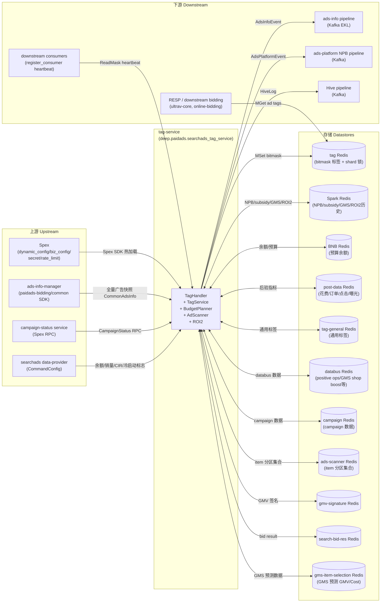

<!-- ads-workspace-gdoc-sync: gdoc_id=10K3Dbd0pYd3aELOWxsZNrHQ5FPdD9ansmmmdCRQIBBU gdoc_url=https://docs.google.com/document/d/10K3Dbd0pYd3aELOWxsZNrHQ5FPdD9ansmmmdCRQIBBU/edit -->

# tag-service

> 仓库地址：https://git.garena.com/shopee/deep/tag-service

---

## 目录 / Table of Contents

1. [项目概述 / Introduction](#项目概述--introduction)
2. [核心功能 / Features](#核心功能--features)
3. [项目架构 / Architecture](#项目架构--architecture)
   - [系统上下文 / System Context](#系统上下文--system-context)
   - [上下游调用拓扑 / Service Topology](#上下游调用拓扑--service-topology)
   - [数据流 / Data Flow](#数据流--data-flow)
4. [目录结构 / Directory Structure](#目录结构--directory-structure)
5. [构建与部署 / Build and Deployment](#构建与部署--build-and-deployment)
   - [构建目标 / Build Targets](#构建目标--build-targets)
   - [部署脚本 / Deploy Script](#部署脚本--deploy-script)
   - [配置文件 / Config Files](#配置文件--config-files)
   - [Tag Verifier](#tag-verifier)
6. [核心流程 — 标签计算 / Core Pipeline — Tag Computation](#核心流程--标签计算--core-pipeline--tag-computation)
   - [周期触发 / Periodic Trigger](#周期触发--periodic-trigger)
   - [Shard 模式 vs Legacy 模式 / Shard Mode vs Legacy Mode](#shard-模式-vs-legacy-模式--shard-mode-vs-legacy-mode)
   - [资源加载 (ResourceLoader) / Resource Loading](#资源加载-resourceloader--resource-loading)
   - [处理器链执行 / Processor Chain Execution](#处理器链执行--processor-chain-execution)
   - [标签 Diff 与过滤 / Tag Diff and Filtering](#标签-diff-与过滤--tag-diff-and-filtering)
   - [Redis 写入 / Redis Write](#redis-写入--redis-write)
   - [Kafka 推送 / Kafka Push](#kafka-推送--kafka-push)
   - [Campaign 级处理 / Campaign-Level Processing](#campaign-级处理--campaign-level-processing)
7. [处理器注册表 / Processor Registry](#处理器注册表--processor-registry)
   - [Processor 接口 / Processor Interface](#processor-接口--processor-interface)
   - [42 个广告级处理器 / 42 Ad-Level Processors](#42-个广告级处理器--42-ad-level-processors)
   - [1 个 Campaign 级处理器 / 1 Campaign-Level Processor](#1-个-campaign-级处理器--1-campaign-level-processor)
   - [YQL 过滤规则 / YQL Filter Rules](#yql-过滤规则--yql-filter-rules)
8. [Bitmask 标志位 / Bitmask Flags](#bitmask-标志位--bitmask-flags)
   - [标志位定义 / Flag Definitions](#标志位定义--flag-definitions)
   - [标志位与处理器对应关系 / Flag-Processor Mapping](#标志位与处理器对应关系--flag-processor-mapping)
9. [后台服务 / Background Services](#后台服务--background-services)
   - [Budget Planner / Budget Planner](#budget-planner)
   - [Ad Scanner / Ad Scanner](#ad-scanner)
   - [ROI2 ColdStart 标志 / ROI2 ColdStart Flags](#roi2-coldstart-标志--roi2-coldstart-flags)
10. [NPB (New Product Boost) / NPB](#npb-new-product-boost--npb)
    - [Spex API / Spex API](#spex-api--spex-api)
    - [标签处理 / Tag Processing](#标签处理--tag-processing)
    - [Kafka 推送 / Kafka Push](#kafka-推送--kafka-push-npb)
11. [配置体系 / Configuration](#配置体系--configuration)
    - [TagService 静态配置 / TagService Static Config](#tagservice-静态配置--tagservice-static-config)
    - [CommonDynamicConfig](#commondynamicconfig)
    - [CommonBizConfig (标签定义) / CommonBizConfig (Tag Definitions)](#commonbizconfig-标签定义--commonbizconfig-tag-definitions)
    - [Secret Config / Secret Config](#secret-config--secret-config)
    - [Rate Limit Config / Rate Limit Config](#rate-limit-config--rate-limit-config)
12. [数据层 / Data Layer](#数据层--data-layer)
    - [Redis 集群（11 个） / Redis Clusters (11)](#redis-集群11-个--redis-clusters-11)
    - [Kafka Producer（5 个） / Kafka Producers (5)](#kafka-producer5-个--kafka-producers-5)
    - [外部数据 / External Data](#外部数据--external-data)
13. [标签生命周期管理 / Tag Lifecycle Management](#标签生命周期管理--tag-lifecycle-management)
    - [TagLifecycleManage](#taglifecyclemanage)
    - [TagUsageStore 与 register_consumer](#tagusagestore-与-register_consumer)
    - [Spex 管理 API / Admin Spex APIs](#spex-管理-api--admin-spex-apis)
14. [开发规范 / Development Guidelines](#开发规范--development-guidelines)
    - [新增 Processor / How to Add a New Processor](#新增-processor--how-to-add-a-new-processor)
    - [新增 Bitmask 标志位 / How to Add a New Bitmask Flag](#新增-bitmask-标志位--how-to-add-a-new-bitmask-flag)
    - [新增后台服务 / How to Add a Background Service](#新增后台服务--how-to-add-a-background-service)
    - [单元测试 / Unit Testing](#单元测试--unit-testing)
    - [Code Review & Git Workflow](#code-review--git-workflow)
15. [监控 / Monitoring](#监控--monitoring)
16. [业务术语表 / Business Terminology Glossary](#业务术语表--business-terminology-glossary)
17. [参考资料 / Additional Resources](#参考资料--additional-resources)
18. [常见问题 / Frequently Asked Questions](#常见问题--frequently-asked-questions)

---

## 项目概述 / Introduction

tag-service 是搜索广告（Search Ads）竞价标签服务。它周期性地从 ads-info-manager 拉取全量广告快照，经过 42 个 Processor 的 Bitmask 计算后，将广告标签（AdTag）写入 tag Redis，并通过 Kafka（EKL）向下游推送标签变更事件。

**关键定位：**
- **离线周期计算**：非实时竞价路径，负责在竞价前预先计算广告的 Bitmask 标签，供下游竞价服务（ultrav-core、online-bidding 等）直接读取 Redis 使用。
- **多附属服务**：除核心标签计算外，还运行 Budget Planner（预算规划）、Ad Scanner（广告扫描）、ROI2 ColdStart（冷启动标志）三个独立后台服务。
- **Spex API**：对外提供 4 个 Spex RPC 接口：NPB 查询（`get_ads_npb_info` / `batch_get_ads_npb_info`）和标签生命周期管理（`get_tag_usage_status` / `register_consumer`）。

**技术栈：**
- 基于 `golang_splib` + Spex 框架构建（非 GAS 框架），Spex namespace 为 `deep.paidads.searchads_tag_service`
- Go module：`git.garena.com/shopee/deep/tag-service`，Go 版本 1.24.5
- 配置管理：4 层 Spex 配置（`dynamic_config` / `biz_config` / `secret` / `rate_limit`），支持热加载

---

## 核心功能 / Features

| 功能 | 说明 |
|------|------|
| 周期性 Bitmask 标签计算 | 按 `AdsLockPeriod`（分钟）触发，为每个 country 对全量广告执行 42 个 Processor |
| Shard 分布式标签计算 | 将广告按 `adsId % shardNum` 分片，多机竞争 SetNX 分布式锁并发处理 |
| Campaign 级标签计算 | 广告级处理完成后触发，对 `campPositiveOperationProcessor` 执行 Campaign 级标签写入 Spark Redis |
| 标签变更推送（Kafka） | `AdsInfoEvent` 推送到 `searchads_attribute_event_live` 等主题，供 ads-info pipeline 消费 |
| NPB 标签推送（Kafka） | NPB stage/tier 变更通过 `AdsPlatformEvent` 推送到 `ads_strategy_info_event` |
| Budget Planner | 每分钟 + 本地午夜触发，计算店铺余额快照和广告可用预算写入 BNB Redis |
| Ad Scanner | 每 2 分钟扫描广告 item 集合变化，维护 ad-scanner Redis 中的三类广告（Simple/SimpleROI2/Manual）分区集合 |
| ROI2 ColdStart | 按 country 周期性更新 ROI2 冷启动标志到 tag Redis |
| NPB Spex API | `get_ads_npb_info` / `batch_get_ads_npb_info` 两个 RPC 接口，从 Spark Redis 读取 NPB stage/tier |
| 标签生命周期管理 | `get_tag_usage_status` 查询当前 biz_config 标签状态；`register_consumer` 接收下游心跳，追踪每个标志位的最近读取时间（no_read_days） |
| GMS Item Selection Prune | 支持 Thompson Sampling 和 Model-Based 两种策略，在 campaign 维度对 GMS 广告进行选择性剪枝 |

---

## 项目架构 / Architecture

### 系统上下文 / System Context

tag-service 在搜索广告竞价链路中处于**离线标签预计算层**，其计算结果（Bitmask 标签）被下游实时竞价服务直接从 Redis 读取，从而在竞价时无需重复计算：

```
ads-info-manager ──── (全量广告快照) ────► tag-service ──── (MSet bitmask tags) ──── tag Redis
                                                │
                                                ├──── (AdsInfoEvent/Kafka EKL) ──── ads-info pipeline
                                                ├──── (AdsPlatformEvent/Kafka) ──── ads-platform NPB pipeline
                                                └──── (Hive log/Kafka) ──── Hive pipeline

下游竞价服务 (ultrav-core, online-bidding) ──── (MGet ad tags) ──── tag Redis
```

### 上下游调用拓扑 / Service Topology



**上游服务：**

| 服务 | 协议 | 说明 |
|------|------|------|
| Spex | Spex SDK | 提供四层配置（dynamic_config / biz_config / secret / rate_limit），namespace `tag_service`，支持热加载 |
| ads-info-manager | paidads-bidding/common SDK | 提供全量广告快照（CommonAdsInfo），按 country + placement 加载 |
| campaign-status service | Spex RPC | 通过 CampaignStatusClient 获取 campaign surge 状态，requester 为 `deep.paidads.searchads_tag_service` |
| searchads data-provider | data-provider SDK | 通过 ExternalData CommandConfig 获取余额、销量、目标 CIR、冷启动标志等数据 |

**下游服务：**

| 服务 | 协议 | 说明 |
|------|------|------|
| ads-info pipeline | Kafka (EKL) | 通过 AdsInfoEvent (paidads-valar) 推送广告标签变更，主 topic `searchads_attribute_event_live` |
| ads-platform NPB pipeline | Kafka | 通过 AdsPlatformEvent 推送 NPB stage/tier 变更到 `ads_strategy_info_event` |
| Hive pipeline | Kafka | 通过 HiveLogProducer 发送处理日志到 `periodical_job_hive_log_kafka` topic |
| RESP / downstream bidding | Redis（读取） | 竞价服务（ultrav-core、online-bidding 等）从 tag Redis MGet 广告 Bitmask 标签 |
| downstream consumers | Spex RPC（`register_consumer`） | 下游服务发送 ReadMask 心跳，tag-service 记录每个标志位的最近读取时间 |

**依赖存储：**

| 存储 | 说明 |
|------|------|
| tag Redis | 主标签存储（MSet/MGet 广告标签 bitmask）+ shard 分布式锁（SetNX job/campaign/done keys）+ 标签生命周期 Redis keys（first_seen/last_read/tag_name） |
| Spark Redis | NPB stage/tier、subsidy boost、manual flag 表、GMS 标签、ROI2 历史数据读取；campaign tag 写入（WriteCampaignTags） |
| BNB Redis | Budget N Balance：店铺余额快照 + 广告可用预算 + 锁 |
| post-data Redis | 后验指标 Redis（花费、订单数、点击数、曝光数等），通过 `post_data_wrapper` 读取 |
| tag-general Redis | 通用标签 Redis（tag_general processor 读取的标签数据） |
| databus Redis + output-databus Redis | Databus 数据读取（positive ops、large sellers、GMS shop boost、budget unification、CSPU、seller signup QSS、GMS prune 等） |
| campaign Redis | paidads-campaign Redis client 提供 campaign 数据 |
| ads-scanner Redis | Ad Scanner 分区存储（按 itemId%partitionCount 的 item set + 分布式锁） |
| gmv-signature Redis | GMV 签名相关数据 Redis |
| search-bid-res Redis | Search bid result Redis |
| gms-item-selection Redis | GMS Item Selection 模型预测数据（predicted_gmv / predicted_cost），供 GmsItemSelectionPruneAd 的 Model-Based 策略使用 |

### 数据流 / Data Flow

标签计算的完整数据流（Shard 模式）：

```
ads-info-manager.GetAllAdsInfo(country)
    │
    ▼
shard.GroupBy(ads, AdsIdStrategy, shardNum)
    │
    ▼  [多机竞争 SetNX job lock key: tag_service:job:{country}:{shardIdx}:{windowUnix}]
    ▼
tagService.UpdateAdsShard(ctx, country, shardAds)
    │
    ├── storage.MGet(ad keys) → originalTagMaps + newTagMaps
    │
    ├── resourceLoader.Load(ctx, country, ads) → Data
    │       ├── SparkRedis: NPB/subsidy/ROI2/GMS/manual flags
    │       ├── post-data: costs/clicks/orders/impressions
    │       ├── BNB Redis: available budgets
    │       ├── tag-general: ad/item/shop general tags
    │       ├── databus: positive ops/large sellers/GMS shop boost/budget unification/CSPU/QSS
    │       ├── gms-item-selection: GMS model predictions (predicted_gmv/cost)
    │       └── campaign-status: surge status
    │
    ├── for each Processor:
    │       ├── CampaignLevelEligible() filter
    │       ├── FilterAds(ads)
    │       ├── applyTagRuleFilter(YQL from CommonBizConfig.TagRuleMap)
    │       └── Process(country, ads, tags, data)  → mutate bitmask
    │
    ├── toMessages(ads, tags, data) → []*pb.Message
    │
    ├── filter(messages) → queueMessages (adTag changed vs ad.GetAdTag())
    │                    → storageMessages (adTag changed vs originalTagMap)
    │                    → changedMask (XOR diff for trackChangedBits)
    │
    ├── trackChangedBits(country, changedMask) → tag_bit_write counter (per tag name)
    │
    ├── storage.MSet(ToAdMap(storageMessages))        → tag Redis
    ├── producer.Send(ctx, queueMessages)              → Kafka AdsInfoEvent
    ├── storage.MSet(ToItemMap(autoBoostMessages))     → tag Redis (item keys)
    └── adsPlatformProducer.SendToAdsPlatform(npbMsgs)→ Kafka AdsPlatformEvent
```

---

## 目录结构 / Directory Structure

```
tag-service/
├── config/                    # 配置结构体及 Spex 初始化
│   ├── config.go              # TagService 静态配置（30+ 字段）
│   ├── dynamic.go             # CommonDynamicConfig（Spex dynamic_config）
│   ├── tag_biz.go             # CommonBizConfig（Spex biz_config，标签定义）
│   ├── secret.go              # Secret Config（Kafka/Redis 凭据）
│   ├── rate_limit.go          # Rate Limit Config
│   └── files/                 # 各环境 YAML 配置文件
│       ├── test.yml
│       ├── live.yml
│       ├── live-id.yml
│       ├── live-tw.yml
│       ├── live-br-us3.yml
│       └── liveish.yml
├── deploy/
│   └── start.sh               # 部署启动脚本（按 cid/env 选择配置文件）
├── idl/pb/                    # Protobuf IDL 定义
├── gen/                       # 生成代码（skip_dirs）
├── pkg/
│   ├── handler/tag/           # TagHandler：周期任务调度、Shard/Legacy 模式选择
│   ├── processor/             # 42 个广告级 Processor 实现
│   ├── campaign_processor/    # 1 个 Campaign 级 Processor
│   ├── service/
│   │   ├── tag/               # TagService 核心逻辑、ResourceLoader
│   │   ├── budget_planner/    # Budget Planner 后台服务
│   │   ├── ad_scanner/        # Ad Scanner 后台服务
│   │   ├── new_product_boost/ # NPB 服务（Spex API 实现）
│   │   └── roi2/              # ROI2 ColdStart 后台服务
│   ├── tag_lifecycle/         # TagLifecycleManage + TagUsageStore（标志位生命周期管理）
│   ├── server/                # Spex API 注册（NPB + lifecycle admin）
│   ├── shard/                 # Shard 分片策略（AdsIdStrategy / CampaignIdStrategy）
│   ├── storage/               # Redis 存储抽象（tag / BNB / ad-scanner）
│   ├── data/                  # 数据访问层（spark / post_data / queue / databus 等）
│   └── util/                  # 工具函数（bitmask / exporter / http_common 等）
├── server/
│   ├── tag-server/            # 主程序入口（main.go + run.go）
│   └── tag-verifier/          # Tag Verifier 离线验证工具
├── client/                    # 客户端 SDK（skip_dirs）
├── Makefile
├── go.mod
└── sp-workspace.yml
```

---

## 构建与部署 / Build and Deployment

### 构建目标 / Build Targets

```bash
# 构建主服务二进制
make svc
# 输出: bin/tag_server
# 等价命令: go build -o bin/tag_server server/tag-server/*

# 构建 Tag Verifier（CGO + zig 跨编译，用于远程 dry-run 调试）
make build_tag_verifier
# 输出: bin/tag_verifier.linux
# 使用 zig cc 进行 x86_64-linux-gnu 跨平台编译

# 构建并上传 Tag Verifier 到远端机器
make upload_tag_verifier USER_FOLDER=<your_name>

# 运行单元测试
make unittest
# 等价命令: go test -cover ./...

# CI 检查（vet + fmt + unittest）
make ci
```

### 部署脚本 / Deploy Script

`deploy/start.sh` 根据环境变量 `cid` 和 `env` 选择配置文件启动服务：

```bash
case "$cid" in
  sg)  ./bin/tag_server -c config/files/$env.yml ;;
  id)  ./bin/tag_server -c config/files/live-id.yml ;;
  tw)  ./bin/tag_server -c config/files/live-tw.yml ;;
  *)   ./bin/tag_server -c config/files/$env.yml -xc config/files/$env-$cid-$AZ.yml ;;
esac
```

服务支持 `-c <config>` 主配置和 `-xc <extra-config>` 追加配置，多文件合并加载（后者覆盖前者）。

### 配置文件 / Config Files

| 文件 | 用途 |
|------|------|
| `config/files/test.yml` | 测试环境（SG） |
| `config/files/test-br.yml` | 测试环境（BR） |
| `config/files/live.yml` | 生产环境（SG） |
| `config/files/liveish.yml` | 类生产环境 |
| `config/files/live-id.yml` | 印尼生产环境 |
| `config/files/live-tw.yml` | 台湾生产环境 |
| `config/files/live-br-us3.yml` | 巴西生产环境（us3 AZ） |

### Tag Verifier

Tag Verifier 是一个离线 dry-run 工具，用于在远端机器上验证标签计算逻辑，无需完整部署服务：

```bash
# 构建并上传
make upload_tag_verifier USER_FOLDER=your_name

# 在远端机器上运行（dry-run 模式）
./tag_verifier.linux -c config.yml

# 带 Hive log 验证
./tag_verifier.linux -c config.yml --test-hive-log
```

参考：[Tag Verifier — Dry-Run Remote Machine Testing Guide](https://docs.google.com/document/d/1UuJ47NV-joCcNf7mG0zxjXDwJSyA9A7fgtUI4JILJHg/edit?tab=t.0#heading=h.mdmqthx3va9k)

---

## 核心流程 — 标签计算 / Core Pipeline — Tag Computation

### 周期触发 / Periodic Trigger

`TagHandler.Start()`（`pkg/handler/tag/handler.go`）在启动时为每个 country 各启动两个 goroutine：

| Goroutine | 触发间隔 | 职责 |
|-----------|---------|------|
| `runJob(country)` | `DynamicConfig.AdsLockPeriod` 分钟 | 广告级 Bitmask 标签计算（Shard 模式或 Legacy 模式） |
| `runCampaignJob(country)` | `TagConf.CampaignUpdateIntervalInSec` 分钟 | Campaign 级正向操作标签计算 |

两个 goroutine 均通过 `AddParallelJob` 实现对齐到时间窗口边界的精确触发（不因单次耗时延误下一轮）。

此外，`TagHandler` 还启动两个辅助 goroutine：
- `runLifecycleEngine` 已移除自动状态转换；现在 `LoadFromRedis` 在启动时初始化 known bits 集合，`watchBizConfigUpdates` 监听 `BizConfigUpdateCh` 在 biz_config 更新时触发 `BuildLifecycles`

### Shard 模式 vs Legacy 模式 / Shard Mode vs Legacy Mode

`shouldUseLegacyMode(country)` 依据 `DynamicConfig.ShardsMaxPerMachineByCountry[country]` 判断：

| 条件 | 模式 | 行为 |
|------|------|------|
| `ShardsMaxPerMachineByCountry[country] <= 0` | **Legacy 模式** | 单机全量处理，无分片锁。注意：当前代码中 legacy 路径的 `Send/MSet` 已被注释，仅供降级回退 |
| `> 0` | **Shard 模式** | 广告按 `adsId % ShardNumByCountry[country]` 分片，多机竞争 SetNX 分布式锁并发处理 |

**Shard 模式分布式锁 Key 规则：**
- Job lock：`tag_service:job:{country}:{shardIdx}:{windowUnix}`（TTL = `AdsLockPeriod` 分钟）
- Done mark：`tag_service:done:{country}:{shardIdx}:{windowUnix}`
- Campaign shard lock：`tag_service:campaign_job:{country}:{shardIdx}:{windowUnix}`

所有 shards 完成后，`monitorShardCompletion`（60s 轮询）确认全部 done key 存在，再触发 `runCampaignLevel`。

### 资源加载 (ResourceLoader) / Resource Loading

`ResourceLoader.Load`（`pkg/service/tag/resource_loader.go`）按以下顺序串行加载所有特征数据：

| 数据字段 | 数据源 | 说明 |
|----------|--------|------|
| `NewProductBoostStage/Tier` | Spark Redis | NPB stage/tier（按 itemId） |
| `WindowCosts`, `TodayCosts` | post-data Redis | 7 天/1 天广告花费 |
| `SubsidyBoost` | Spark Redis | 补贴 shop boost 状态 |
| `CsWindowOrderCount` | post-data Redis | 8 天内订单数（冷启动判断） |
| `ManualRoi2Migration`, `ManualAntouExempt`, `ManualReleDeboost` | Spark Redis | Manual 广告特殊标志 |
| `TodayRevLowBudget`, `YesterdayRevLowBudget`, `TheDayBeforeYesterdayRevLowBudget` | post-data Redis | 近3天花费（低预算判断） |
| `MiddleRevAdvertiser` | Spark Redis | 中等收益广告主标志 |
| `NewItemAdsOrderCount` | post-data Redis | 新 SKU 近 31 天自然订单数 |
| `FirstDeliveredRoi2IdsIn60Days` | Spark Redis | ROI2 首次投放记录 |
| `NewRoi2ItemCsWindowOrderCount` | post-data Redis | ROI2 冷启动 14 天订单数 |
| `AvlBudget` | BNB Redis | 广告可用预算（BaseStrategy） |
| `GmsTag` | Spark Redis | GMS 标签数据 |
| `WindowClicks`, `L7DImpressionCount` | post-data Redis | 7 天点击数/曝光数 |
| `AdGeneralTag`, `ItemGeneralTag`, `ShopGeneralTag` | tag-general Redis | 通用标签 |
| `PositiveOperations`, `LargeSellersAds/Shop`, `GMSShopBoost`, `BudgetUnification`, `IsGmsItemSelectionPrune`, `SellerSignupQSSTimeStamps` | databus Redis | Databus 多维特征 |
| `GmsItemSelectionPrediction` | gms-item-selection Redis | GMS Model-Based 策略预测数据（predicted_gmv/cost），可选（配置为空时跳过） |
| `L7DOrderCount`, `TodayBroadGMV`, `TodayADVV` | post-data Redis | 近期综合指标 |
| `DirectWindowOrderCnt`, `BroadOrder30DCount` | post-data Redis | 直接/宽口径订单数 |
| `ItemCspuType` | databus Redis | 商品 CSPU 类型 |
| `IsCampaignSurge` | campaign-status RPC | Campaign surge 状态 |
| `HistoryDirectOrderCount`, `OneTime30dHistoryDirectOrder` | post-data Redis / Spark Redis | 历史订单数 |

### 处理器链执行 / Processor Chain Execution

`tagService.process()` 对每个 Processor 依次执行：

```
for each Processor p:
    1. if p.CampaignLevelEligible() != isCampaignLevel → skip
    2. subAds = p.FilterAds(ads)         # Processor 自身过滤逻辑
    3. subAds = applyTagRuleFilter(...)   # CommonBizConfig.TagRuleMap[processorName] 的 YQL 规则
    4. p.Process(country, subAds, tags, data)  # 修改 tags（bitmask 操作）
```

### 标签 Diff 与过滤 / Tag Diff and Filtering

`filter()` 将处理后的 messages 分为两类，并计算 `changedMask`：

| 类别 | 过滤条件 | 用途 |
|------|---------|------|
| `queueMessages` | `msg.AdTag != ad.GetAdvertisement().GetAdTag()` | 推送 Kafka（相对于 ads-info 中的在线标签） |
| `storageMessages` | `msg.AdTag != originalTagMap[adId]` | 写入 Redis（相对于本轮从 Redis 读出的值） |
| `changedMask` | 两者 XOR 差集累计 | 传给 `trackChangedBits`，按 tag name 导出 `tag_bit_write` Prometheus 计数器 |

### Redis 写入 / Redis Write

```go
storage.MSet(ToAdMap(storageMessages))     // 写入广告级 bitmask
storage.MSet(ToItemMap(autoBoostMessages)) // 写入 item 级 auto-boost 标志（非 Discovery 广告）
```

Key 格式：广告级 `{country}:{adsId}`，item 级 `{country}:item:{itemId}`。

### Kafka 推送 / Kafka Push

```go
producer.Send(ctx, queueMessages)                        // AdsInfoEvent → searchads_attribute_event_live
adsPlatformQueueProducer.SendToAdsPlatform(ctx, npbMsgs) // AdsPlatformEvent → ads_strategy_info_event
```

`DisableKafkaSend`（DynamicConfig）可在线关闭 Kafka 推送，用于调试。

### Campaign 级处理 / Campaign-Level Processing

在所有 shards 的 `runCampaignLevel` 或独立的 `runCampaignJob` 中执行：

1. 按 `campaignId` 分组广告，`SetNX lock_positive_campaign:{country}_{campaignId}`
2. `ResourceLoader.LoadForCampaign`：加载 Databus 历史指标 + BNB 可用预算
3. 执行 `campPositiveOperationProcessor.ProcessCampaign`
4. `sparkCli.WriteCampaignTags`：将 campaign 级标签写入 Spark Redis（TTL = `CampaignTagTTL` 小时）

---

## 处理器注册表 / Processor Registry

### Processor 接口 / Processor Interface

定义在 `pkg/processor/interface.go`：

```go
type Processor interface {
    Process(country string, ads []*ads_info.CommonAdsInfo, adsTagMap map[int64]int64, data *Data) error
    FilterAds(ads []*ads_info.CommonAdsInfo) []*ads_info.CommonAdsInfo
    CampaignLevelEligible() bool
    Meta() Meta  // 返回 Name（处理器名称）和 Description
}
```

### 42 个广告级处理器 / 42 Ad-Level Processors

按 `init_tag_service.go` 中 `AddProcessors` 的注册顺序（处理器执行顺序）：

| # | 处理器名称 | 对应文件 |
|---|-----------|---------|
| 1 | allAdsDefaultProcessor | `all_ads_default.go` |
| 2 | smoothDeliveryProcessor | `smooth_delivery_processor.go` |
| 3 | ecpcBudgetAd | `ecpc_budget_ad.go` |
| 4 | shopSubsidyBoostTagProcessor | `subsidy_shop_boost.go` |
| 5 | csWindowOrderProcessor | `cs_common.go` |
| 6 | manualRoi2MigrationProcessor | `manual_roi2_migration.go` |
| 7 | lowBudgetAdProcessor | `low_budget_ad.go` |
| 8 | manualAntouExemptProcessor | `manual_antou_exempt.go` |
| 9 | manualReleDeboostProcessor | `manual_rele_deboost.go` |
| 10 | coldStartAdProcessor | `cold_start_ad.go` |
| 11 | middleRevAdvertiserProcessor | `middle_rev_advertiser.go` |
| 12 | newProductBoostTagProcessor | `new_product_boost_ad.go` |
| 13 | gmsTagProcessor | `gms_tag.go` |
| 14 | rapidBoostToggle | `rapid_boost_toggle.go` |
| 15 | oneCpaCost | `one_cpa_cost.go` |
| 16 | tagGeneralProcessor | `tag_general.go` |
| 17 | newItemAdsBreakOrderPhase | `new_item_ads_break_order_phase.go` |
| 18 | newItemAdsLifeTimePhase | `new_item_ads_life_time_phase.go` |
| 19 | newRoi2ItemAdProcessor | `new_roi2_item_ad.go` |
| 20 | newRoi2ItemColdStartAdProcessor | `new_roi2_item_cold_start_ad.go` |
| 21 | sequenceModelAdProcessor | `sequence_model_tag.go` |
| 22 | newItemAdsPromotedUiEntry | `new_item_ads_promoted_ui_entry.go` |
| 23 | gmsMpColdStartProcessor | `gms_mp_cold_start.go` |
| 24 | gmsMpEmptyOrderProcessor | `gms_mp_empty_order.go` |
| 25 | emptyOrderAdsProcessor | `empty_order_ads.go` |
| 26 | sellerSignupQSSProcessor | `seller_signup_qss.go` |
| 27 | gmsShopBoostProcessor | `gms_mp_shop_boost.go` |
| 28 | positiveOperationProcessor | `positive_operations.go` |
| 29 | dormantAdsProcessor | `ads_dormant.go` |
| 30 | largeSellersProcessor | `large_sellers.go` |
| 31 | overallUnderBidAndHasBudgetAdsProcessor | `overall_under_bid_and_has_budget_ads.go` |
| 32 | campaignSurgeOnProcessor | `campaign_surge_status.go` |
| 33 | gmsItemSelectionPrune | `gms_item_selection_prune_ad.go` |
| 34 | csDirect8dLt1Processor | `cold_start_direct_8d_lt1.go` |
| 35 | csDirect8dLt3Processor | `cold_start_direct_8d_lt3.go` |
| 36 | emptyOrderDirect8dLt1Processor | `empty_order_direct_8d_lt1.go` |
| 37 | emptyOrderDirect8dLt3Processor | `empty_order_direct_8d_lt3.go` |
| 38 | newItemBoostDirect30dLt1Processor | `new_item_ads_30d_lt1.go` |
| 39 | newItemGroupPlatformBoostAdProcessor | `new_item_group_boost_ad.go` |
| 40 | reservePotentialItemTagProcessor | `reserve_overall_potential_item_tag.go` |
| 41 | reserveColdStartAdTagProcessor | `reserve_overall_cold_start_ad_empty_order_tag.go` |
| 42 | **overallColdStartProcessor** | `overall_cold_start.go` |

> ⚠️ **重要**：`overallColdStartProcessor` **必须保持最后注册**（注释：`// Keep this processor in the last line, after all coldstart processors.`），因为它依赖前序所有冷启动处理器的执行结果。

**GmsItemSelectionPruneAd 特殊说明：**
- `CampaignLevelEligible()` 返回 `true`（即该 Processor 在 campaign 级别也执行）
- 支持三种模式：**Simple Prune**（基于 Spark job 标记的 shop/item 组合），**Thompson Sampling**（基于订单/点击 Beta 分布，按 `shopId % Mod` 落入 `LowerBound`/`UpperBound` 区间时启用），**Model-Based**（基于 predicted_gmv/cost ROI 排序，budget 感知剪枝，按 `shopId % Mod` 落入 `LowerBound2`/`UpperBound2` 区间时启用；`ModelBasedEpsilon` 为探索平滑项，`ModelBasedCostFloor` 为最小花费下限，`USDToCurrencyRate` 提供本地货币到 USD 的汇率换算）
- **Disabled Range**（禁用范围）：按 `shopId % Mod` 落入 `LowerBound3`/`UpperBound3` 区间时，强制跳过剪枝（CLEAR 标志位），优先级高于上述三种模式
- 支持的计费类型：`PRODUCT_SHOP_GMV_MAX_PRICING_SIMPLE` 和 `PRODUCT_SHOP_GMV_MAX_PRICING`（不含 `PRODUCT_MULTI_PRODUCT_DELIVERY_PRICING`）
- 每个 campaign 内保护前 5 名广告（按 TodayADVV → L7DOrderCount → WindowClicks → L7DImpressionCount 排序）

**OverallUnderBidAndHasBudgetAds 特殊说明：**
- `CampaignLevelEligible()` 返回 `true`（即该 Processor 在广告级和 campaign 级均执行）
- 使用**两个**独立 Bitmask 标志位：`overallUnderBidAndHasBudgetTag`（GMS/多品广告：`PRODUCT_SHOP_GMV_MAX_PRICING`、`PRODUCT_MULTI_PRODUCT_DELIVERY_PRICING`、`PRODUCT_SHOP_GMV_MAX_PRICING_SIMPLE`）和 `overallUnderBidAndHasBudgetTag4SingleItem`（单品广告：`ROI_TWO_PRICING`、`SIMPLE_ROI_TWO_PRICING`）
- 欠收判断：Target2/GMS Target/多品按 `campaignAdvv > threshold * campaignCost` 判断；Simple2/GMS Simple 按 `campaignBroadGmv > roiUpperBound * campaignCost` 判断
- 仅在本地时间满足 `DynamicConfig.UnderBidAndHasBudgetConfig.TriggerHour` 后触发（在此之前对所有广告打 false 标签）

### 1 个 Campaign 级处理器 / 1 Campaign-Level Processor

| 处理器 | 文件 | 说明 |
|--------|------|------|
| `campPositiveOperationProcessor` | `pkg/campaign_processor/` | 计算 campaign 正向操作状态，写入 Spark Redis |

Campaign 级 Processor 实现 `CampaignLevelEligible() bool = true`，在广告级处理中被跳过，仅在 campaign 级流程中执行。

### YQL 过滤规则 / YQL Filter Rules

`CommonBizConfig.TagRuleMap`（Spex `biz_config` key）为每个处理器定义运行时 YQL 过滤规则：

```json
{
  "processor_name": {
    "filter": "placement == 1 && pricingType == 2",
    "bits": { "tag_name": bit_num }
  }
}
```

YQL 规则在 `bizConfigValidator` 中被解析为 `yql.Ruler`，`applyTagRuleFilter` 在每次处理器执行前对广告进行过滤（基于 `placement` 和 `pricingType`）。

---

## Bitmask 标志位 / Bitmask Flags

### 标志位定义 / Flag Definitions

定义在 `pkg/util/bitmask/bitmask.go`，使用 `iota` 依次分配位：

| 标志位（位序）| 常量名 | 状态 |
|-------------|--------|------|
| 1 | `AllAdsDefault` | 活跃 |
| 2 | `GmsItemSelectionPruneAd` | 活跃 |
| 3 | `ReservePotentialItemTag` | 活跃 |
| 4 | `ReserveColdStartEmptyOrderTag` | 活跃 |
| 5 | `IncentiveTasksTrafficBoostTagQss` | 活跃 |
| 6 | `NewItemGroupPlatformBoostAd` | 活跃 |
| 7 | `GmsShopBoostAd` | 活跃 |
| 8 | `PotentialProductBoost` | 活跃 |
| 9 | — | 未使用（保留） |
| 10 | `ReserveRankerPotentialItemTag` | 活跃 |
| 11 | `ReserveRankerColdStartEmptyOrderTag` | 活跃 |
| 12 | `VoucherBoost` | 活跃 |
| 13–15 | — | 未使用（保留） |
| 16 | `ColdStartDirect8dLt1` | 活跃 |
| 17 | `EmptyOrderDirect8dLt1` | 活跃 |
| 18 | `ColdStartDirect8dLt3` | 活跃 |
| 19 | `EmptyOrderDirect8dLt3` | 活跃 |
| 20 | `NpbDirect30dLt1` | 活跃 |
| 21 | — | 未使用（保留） |
| 22 | `CampaignSurgeStatusTag` | 活跃 |
| 23 | `LargeSellersPhase1BoostAd` | 活跃 |
| 24 | `LargeSellersPhase2BoostAd` | 活跃 |
| 25 | `LargeSellersDiscountAd` | 活跃 |
| 26 | `EcpcLargeBudgetAd` | 活跃 |
| 27 | `EcpcMidBudgetAd` | 活跃 |
| 28 | `EcpcSmallBudgetAd` | 活跃 |
| 29 | `OverallUnderBidAndHasBudgetTag4SingleItem` | 活跃 |
| 30 | `OverallUnderBidAndHasBudgetTag` | 活跃 |
| 31 | `SubsidyShopBoostAd` | 活跃 |
| 32 | `CsNoWindowOrderStd` | 活跃 |
| 33 | `ManualRoi2MigrationStd` | 活跃 |
| 34 | `LowBudgetUsageAd` | 活跃 |
| 35 | `ColdStartAd` | 活跃 |
| 36 | `ManualAntouExemptStd` | 活跃 |
| 37 | `ManualReleDeboost` | 活跃 |
| 38 | `Roi2AddtionalDeduction` | 活跃 |
| 39 | `Roi2PacingGmvMaxDeboost` | 活跃 |
| 40 | `Roi2PacingReleScoreDeboost` | 活跃 |
| 41 | `Roi3Boost` | 活跃 |
| 42 | `MiddleRevAdvertiser` | 活跃 |
| 43 | `OverallColdStartAd` | 活跃 |
| 44 | `SubsidyGoodPotentialProduct` | 活跃 |
| 45 | `NewProductBoost` | 活跃 |
| 46 | `GmsHotSku` | 活跃 |
| 47 | `GmsHighPotentialSku` | 活跃 |
| 48 | `RapidBoostToggle` | 活跃 |
| 49 | `OneCpaCost` | 活跃 |
| 50 | `Roi3AdditionDeuction` | 活跃 |
| 51 | `NewItemAdsBreakOrderPhase` | 活跃 |
| 52 | `NewItemAdsLifeTimePhase` | 活跃 |
| 53 | `NewRoi2ItemAd` | 活跃 |
| 54 | `NewRoi2ItemColdStartAd` | 活跃 |
| 55 | `SequenceModelAd` | 活跃 |
| 56 | `NewItemAdsPromotedUiEntry` | 活跃 |
| 57 | `GmsMpCampaignColdStart` | 活跃 |
| 58 | `GmsMpCampaignEmptyOrder` | 活跃 |
| 59 | `BlackList` | 活跃 |
| 60 | `LowBudget` | 活跃 |
| 61 | `LowBudgetRollout` | 活跃 |
| 62 | `EmptyOrderAds` | 活跃 |
| 63 | `PositiveOperationAd` | 活跃 |
| 64 | `DormantAds` | 活跃 |
| `_TotalBits` | — | 记录已用位数（保持在末尾） |

> `DormantAds` 定义在 iota 组之外（`const DormantAds Flag = -1 << 63`），因为 `1 << 63` 会导致 `int64` 溢出。

`new_bitmask.go` 提供按 `CommonBizConfig.TagInfoMap` 动态操作的 `SetByBitNum`/`ClearByBitNum`/`HasByBitNum` 函数，优于直接使用 `bitmask.Set`/`Clear`/`Has`（已标注为不再使用）。

### 标志位与处理器对应关系 / Flag-Processor Mapping

通过 `CommonBizConfig.TagInfoMap`（`tag_name → bit_num`）和 `TagRuleMap`（`processor_name → TagRule{Filter, Rule(YQL), Bits}`）在运行时动态维护。这意味着标志位与处理器的绑定**无需修改代码**，只需更新 Spex `biz_config` 即可（热更新）。

`FlagNames`（`bitmask.go`）定义了用于 Prometheus 监控标签导出的标志位名称子集（从 `AllAdsDefault` 到 `DormantAds` 的所有活跃标志位）。同时 `trackChangedBits` 在每次 chunk 处理后，通过 `tag_bit_write` 计数器记录每个 tag name 在本批次是否发生了位变化，辅助标志位活跃度监控。

---

## 后台服务 / Background Services

### Budget Planner

`pkg/service/budget_planner/service.go` — 预算规划后台服务，每 1 分钟 + 本地午夜触发：

**触发机制：**
- 服务启动时随机延迟 0–10 秒（避免多机同时启动）
- 立即执行一次（`start_up_service`）
- 每 1 分钟 ticker（`period`）
- 检测本地午夜（`checkNewLocalDay`，每 5 秒检查是否为 `00:00`，1 分钟内去重）

**执行逻辑（`updateShopAndAdsBudget`）：**
1. `GetAllAdsInfo(country)` → 按 `shopId` 分组
2. `updateAllShopBalancesInCountry`：从 data-provider 获取最新店铺余额 → `SetShopBalanceSnapshots` 写入 BNB Redis
3. `updateAllAdsAvailableBudgetInCountry`：对每个广告执行 `BaseStrategy.Calculate` → `SetAdAvailableBudgetsWithStrategy` 写入 BNB Redis

**BaseStrategy 计算逻辑（`base_strategy.go`）：**
```
AvlBudget = min(daily_budget, shop_balance_snapshot)
```
同时考虑 active state、每日预算、总预算等字段变更。

### Ad Scanner

`pkg/service/ad_scanner/scanner.go` — 广告 item 集合扫描服务，每 2 分钟触发：

**执行逻辑（`scanAdsByCountry`）：**
1. `GetAllAdsInfo(country)` → 按 `itemId % partitionCount` 分区（ID: 200 分区，其他: 100 分区）
2. 三类广告分别处理：
   - Simple Ads（`SIMPLE_MODE_SEARCH` + `SIMPLE_MODE_PRICING`）
   - SimpleROI2 Ads（`SIMPLE_ROI_TWO`）
   - Manual Ads（`KEYWORD_SEARCH` + Manual/eCPC 定价）
3. 每个分区：`LockAdItems`（SetNX 分布式锁）→ `GetAdsItems`（获取当前 Redis 集合）→ diff → `AddAdsItems`/`RemoveAdsItems`

### ROI2 ColdStart 标志 / ROI2 ColdStart Flags

`pkg/service/roi2/service.go` — ROI2 冷启动标志服务：

- 按 `DynamicConfig.Roi2ColdStratAdsLockPeriod` 分钟触发
- 仅对 `ROI2CSFlagCountryMap` 中配置的 country 执行
- 调用 `updateColdStartFlags`：从 data-provider 获取冷启动判断所需数据，更新到 tag Redis

---

## NPB (New Product Boost) / NPB

### Spex API / Spex API

tag-service 对外提供 2 个 NPB Spex RPC API（注册在 `pkg/server/api_register.go`）：

| API 名称 | 功能 | 请求约束 |
|---------|------|---------|
| `get_ads_npb_info` | 查询单条广告的 NPB stage/tier | 仅支持 `SIMPLE_ROI_TWO` placement + `SIMPLE_ROI_TWO_PRICING` pricingType |
| `batch_get_ads_npb_info` | 批量查询广告的 NPB stage/tier | country 不为空，ads 列表不为空 |

两个 API 均通过 `NpbService.GetNpbStage`/`GetNpbTier` 从 **Spark Redis** 读取数据，响应包含 `NewProductBoostStage` 和 `NewProductBoostTier`。

### 标签处理 / Tag Processing

`newProductBoostTagProcessor`（`pkg/processor/new_product_boost_ad.go`）在处理器链中：
- 读取 `data.NewProductBoostStage`（来自 ResourceLoader 从 Spark Redis 获取）
- 依据 stage 判断是否设置 `bitmask.NewProductBoost` 标志位

### Kafka 推送 / Kafka Push (NPB)

`filterNewProductBoost` 在 `chunkUpdateShard` 中检测 NPB 变更：
- 仅处理 `SIMPLE_ROI_TWO` placement + `SIMPLE_ROI_TWO_PRICING` pricingType 广告
- 检测 `msg.NewProductBoostStage != ad.GetNewProductBoost().GetStage()` 或 tier 变化
- 调用 `adsPlatformQueueProducer.SendToAdsPlatform`（含去重逻辑 `IsDuplicatedNpbInfo`）推送 `AdsPlatformEvent` 到 `ads_strategy_info_event` topic

---

## 配置体系 / Configuration

### TagService 静态配置 / TagService Static Config

定义在 `config/config.go`，通过 YAML 文件加载，支持环境变量覆盖（使用 `ecp`）：

| 字段 | 类型 | 说明 |
|------|------|------|
| `countries` | `[]string` | 服务处理的 country 列表（如 `[SG, MY, TH, ...]`） |
| `HttpPort` | `int` | HTTP 端口，默认 27002 |
| `spex-config` | `spex.SpexConfig` | Spex 连接配置 |
| `tag-redis` | `Redis` | 主标签 Redis |
| `spark-redis` | `redisutil.Config` | Spark Redis |
| `gmv-signature-redis` | `Redis` | GMV 签名 Redis |
| `tag` | `TagConf` | `campaign-update-interval`、`chunk-size`、`shard-num` |
| `dedup-ttl` | `Duration` | Kafka 去重 TTL |
| `kafka` | `KafkaConfig` | 主标签事件 Kafka Producer |
| `ads-platform-kafka-producer` | `KafkaConfig` | NPB 事件 Kafka Producer |
| `bnb-redis` | `bnb.BnbRedisConfig` | BNB Redis |
| `ads-scanner-redis` | `ad_scanner_storage.Config` | Ad Scanner Redis |
| `ext-data-config` | `config.CommandConfig` | searchads data-provider 配置 |
| `campaign` | `redisutil.Config` | Campaign Redis |
| `dps-kafka-producer` | `KafkaConfig` | DPS Kafka Producer |
| `search-bid-res-kafka-producer` | `KafkaConfig` | Search bid result Kafka Producer |
| `hive-log-kafka-producer` | `KafkaConfig` | Hive 日志 Kafka Producer |
| `search-bid-res-redis` | `redisutil.Config` | Search bid result Redis |
| `tag-general-redis` | `RedisConfig` | tag-general Redis（含用户名/密码） |
| `ads-info-manager` | `ads_info_manager.Config` | ads-info-manager 配置 |
| `common-config-center-address` | `config_redis.ConfigCenterAddress` | post-data 公共配置中心 |
| `business-config-center-address` | `config_redis.ConfigCenterAddress` | post-data 业务配置中心 |
| `post-data-spex` | `post_data_client.SpexConfig` | post-data Spex 服务发现配置 |
| `databus-config` | `redisutil.Config` | Databus Redis |
| `output-databus-config` | `redisutil.Config` | Output Databus Redis |
| `gms-item-selection-redis` | `redisutil.Config` | GMS Item Selection 预测数据 Redis（可选，空则跳过） |

### CommonDynamicConfig

通过 Spex key `dynamic_config` 加载，Spex namespace `tag_service`，支持热加载。主要字段：

| 字段 | 默认值 | 说明 |
|------|--------|------|
| `ads_lock_period` | 10（分钟） | 广告级标签计算触发间隔 |
| `campaign_ads_lock_period` | 60（分钟） | Campaign 级标签计算触发间隔 |
| `roi2_coldstart_ads_lock_period` | 2（分钟） | ROI2 冷启动标志更新间隔 |
| `shards_max_per_machine_by_country` | — | 每机最大并发 shard 数（`<= 0` 降级 Legacy 模式） |
| `shard_num_by_country` | — | 每个 country 的 shard 总数 |
| `country_concurrency` | — | 每个 country 的 chunk 级并发数 |
| `disable_kafka_send` | false | 调试开关：禁用 Kafka 推送 |
| `hive_log_sample_rate` | — | Hive 日志采样率 |
| `campaign_tag_ttl` | 24（小时） | Campaign 标签 TTL |
| `cold_start` | — | 冷启动判断阈值（impr/click/order count + period） |
| `roi2_cs_flag_countries` | — | 启用 ROI2 冷启动标志的 country 列表 |
| `gms_selection_config` | 复杂对象 | GMS 商品选择参数配置。Thompson Sampling 参数：`OrderWeight`、Prior（`OrderPriorAlpha/Beta`、`ClickPriorAlpha/Beta`）、Temperature（`Explore/Neutral/Prune`）、`ProbFloorFactor`、`Mod`/`LowerBound`/`UpperBound`（实验范围）。Model-Based 参数：`LowerBound2`/`UpperBound2`（实验范围）、`ModelBasedEpsilon`（探索平滑项）、`ModelBasedCostFloor`（最小花费下限，占日预算比例）、`USDToCurrencyRate`（各国汇率，用于本地货币到 USD 换算）。Disabled Range 参数：`LowerBound3`/`UpperBound3`（禁用剪枝的 shopId % Mod 范围）。预算用量参数：`ExploreBudgetUsage`/`PruneBudgetUsage`（探索/剪枝档预算用量阈值）。温度参数：`ExploreTemperature`/`NeutralTemperature`/`PruneTemperature`。概率下限因子：`ExploreProbFloorFactor`/`NeutralProbFloorFactor`/`PruneProbFloorFactor`。Gamma 参数：`MinGammaShape`/`MaxGammaRetry` |
| `under_bid_and_has_budget_config` | 复杂对象 | 欠收且有预算广告参数。包含 `ExpPlanBucketList4SingleItem []int64`（单品广告实验 bucket 列表） |
| `large_budget_ad` | — | 大预算广告相关阈值配置 |
| `high_camp_performance` | — | 高效果 campaign 判断配置 |
| `auto_boost_state` | — | 自动加速状态参数 |
| `campaign_surge_min` | — | Campaign Surge 最小阈值 |
| `campaign_surge_min_countries` | — | 启用 Campaign Surge 最小阈值的 country 列表 |
| `ads_level_campaign` | — | 广告级 campaign 相关配置 |
| `ads_level_campaign_countries` | — | 启用广告级 campaign 的 country 列表 |
| `campaign_surge_target_cir` | — | Campaign Surge 目标 CIR |
| `enable_send_bucket_budget_output` | false | 是否发送 bucket 级预算输出 |
| `low_budget_threshold` | — | 低预算判断阈值 |
| `sequence_click_threshold` | — | Sequence 模型点击量阈值 |
| `enable_sync_us` | false | 是否同步 US 数据 |
| `min_order_cnt_30d_before_roi2` | — | ROI2 准入前 30 天最小订单数 |
| `max_order_cnt_30d_before_roi2` | — | ROI2 准入前 30 天最大订单数 |
| `impression_cnt_30d_before_roi2` | — | ROI2 准入前 30 天曝光数阈值 |
| `roi2_cs_order_cnt_config` | 复杂对象 | ROI2 冷启动订单数配置 |
| `gms_cs_order_cnt_config` | 复杂对象 | GMS 冷启动订单数配置 |
| `empty_order_ads_config` | 复杂对象 | 空订单广告参数配置 |
| `direct_cs_order_cnt_config` | 复杂对象 | Direct 冷启动订单数配置 |
| `debug_ads_ids` | — | 调试时追踪特定广告 ID 的列表 |
| `debug_countries` | — | 调试时追踪特定 country 的列表 |

### CommonBizConfig (标签定义) / CommonBizConfig (Tag Definitions)

通过 Spex key `biz_config` 加载，是 tag-service 运行时**标签定义的核心**：

```json
{
  "all_tag": [
    {
      "tag_name": "ecpc_large_budget_ad",
      "bit_num": 26,
      "is_use": true,
      "processor": "ecpc_budget_ad",
      "filter": "placement == 1 && pricingType == 1",
      "status": "active"
    }
  ]
}
```

`bizConfigValidator` 解析后生成：
- `TagInfoMap`：`tag_name → bit_num`
- `TagRuleMap`：`processor_name → TagRule{Filter, Rule(YQL), Bits}`
- `AllTagInfoByBit`：`bit_num → TagInfo`

**TagStatus：** `active`（活跃）或 `deprecated`（已废弃）。标记为 `deprecated` 的标签：其 Redis keys 在 `BuildLifecycles` 时被清理，`TagUsageStore.ProcessHeartbeat` 接收到对应位的读取时只导出 `deprecated_tag_read` 指标而不更新 `last_read`。

### Secret Config

通过 Spex key `secret` 加载，包含以下凭据：

| 字段 | 说明 |
|------|------|
| `ProducerKafka` | 主标签事件 Kafka SASL 凭据 |
| `AdsPlatformKafka` | NPB 事件 Kafka SASL 凭据 |
| `HiveLogKafka` | Hive 日志 Kafka SASL 凭据 |
| `ExtDataSecret` | searchads data-provider 认证密钥 |
| `TagGeneralRedis` | tag-general Redis 认证信息（用户名/密码） |

### Rate Limit Config

通过 Spex key `rate_limit` 加载，控制 CIR service 的 QPS 限制。

---

## 数据层 / Data Layer

### Redis 集群（11 个） / Redis Clusters (11)

| 配置字段 | 用途 |
|----------|------|
| `tag-redis` | **主标签存储**：广告 bitmask 标签 MSet/MGet，shard 分布式锁（job/done/campaign_job keys），标签生命周期 Redis keys（tag:name:/tag:first_seen:/tag:last_read:） |
| `spark-redis` | NPB stage/tier、subsidy shop boost、manual flag 表、GMS 标签、ROI2 历史、campaign tag 写入 |
| `bnb-redis` | Budget N Balance：店铺余额快照、广告可用预算、分布式锁 |
| `post-data`（via `post-data-client`） | 后验指标 Redis（花费、订单数、点击数、曝光数等），通过 `post_data_wrapper` 访问 |
| `tag-general-redis` | 通用标签 Redis（`tag_general` Processor 读取，按 ad/item/shop 维度） |
| `databus-config` | Databus Redis：positive ops、large sellers、GMS shop boost、budget unification、CSPU、seller signup QSS、GMS prune 等 |
| `output-databus-config` | Output Databus Redis（另一套 databus 数据源，budget unification 等） |
| `campaign` | paidads-campaign Redis client 提供 campaign 数据 |
| `ads-scanner-redis` | Ad Scanner 分区存储（item set + 分布式锁，按 `itemId%partitionCount`） |
| `gmv-signature-redis` | GMV 签名相关数据 |
| `search-bid-res-redis` | Search bid result Redis |
| `gms-item-selection-redis` | GMS Item Selection 模型预测数据（可选），为 `GmsItemSelectionPruneAd` Model-Based 策略提供 predicted_gmv/cost |

> 注：`gms-item-selection-redis` 为可选配置，连接配置为空时 `NewGmsItemSelectionCli` 跳过初始化，ResourceLoader 中对应数据将不加载。

### Kafka Producer（5 个） / Kafka Producers (5)

| 配置字段 | Topic | Event 类型 | 消费方 |
|----------|-------|-----------|--------|
| `kafka` | `searchads_attribute_event_live`（等） | `AdsInfoEvent`（paidads-valar）Source_ADS_TAG_SVC | ads-info pipeline |
| `ads-platform-kafka-producer` | `ads_strategy_info_event` | `AdsPlatformEvent`（NPB stage/tier 变更） | ads-platform NPB pipeline |
| `hive-log-kafka-producer` | `periodical_job_hive_log_kafka` | HiveLog（处理日志，含 AlgoContent） | Hive pipeline |
| `dps-kafka-producer` | DPS 相关 topic | DPS 事件 | DPS pipeline |
| `search-bid-res-kafka-producer` | Search bid result 相关 topic | Search bid result 事件 | downstream consumers |

主标签事件 Kafka Producer 内置去重（`dedup-ttl` 控制），避免短时间内重复推送同一广告的相同标签。

### 外部数据 / External Data

通过 `searchads/data-provider` SDK（`CommandConfig`）访问：
- 认证使用 Secret Config 中的 `ExtDataSecret`，requester 为 `tag_service`
- 提供：店铺余额、商品销量、目标 CIR、ROI2 冷启动标志等数据
- 对应 Budget Planner 的 `updateAllShopBalancesInCountry` 和 ROI2 服务的标志更新

---

## 标签生命周期管理 / Tag Lifecycle Management

### TagLifecycleManage

定义在 `pkg/tag_lifecycle/tag_usage_status.go`。**注意：自动状态转换（active → warning → disabled）已从代码中移除**，生命周期决策现在完全由人工基于 Prometheus 指标和 `get_tag_usage_status` API 做出。

当前 `TagLifecycleManage` 的职责：
- **known bits 追踪**：通过 `knownBits` map 记录 biz_config 中当前所有活跃 bit，在 biz_config 更新时（`BuildLifecycles`）清理已删除标志位的 Redis keys
- **Reconcile Report**：在 biz_config 变更时自动对比 `TagRuleMap`（配置侧 processor）与已注册 Processor（代码侧），生成 `ConfigOrphans`（配置有但代码无）、`CodeOrphans`（代码有但配置无）、`DeprecatedTags`（状态为 deprecated 的标签）三类告警
- **Snapshot API**：`Snapshot(ctx)` 按需从 biz_config + Redis 读取并渲染所有标志位的当前状态（BitNum / TagName / ProcessorName / Status / LastReadUnix / NoReadDays）

### TagUsageStore 与 register_consumer

定义在 `pkg/tag_lifecycle/consumer.go`。`TagUsageStore` 使用 tag Redis 存储以下 keys（无 TTL 除 last_read）：

| Redis Key | 格式 | 说明 |
|-----------|------|------|
| `tag:name:{bitNum}` | string，无 TTL | 当前 bit 绑定的 tag name；name 变化时触发 baseline 重置和旧 keys 清理 |
| `tag:first_seen:{bitNum}` | int64 unix，无 TTL | bit 首次出现在 biz_config 的时间；用于计算 no_read_days 的兜底基线 |
| `tag:last_read:{bitNum}` | int64 unix，TTL=90d | 最近一次 register_consumer 心跳更新的时间 |

`register_consumer` Spex API 处理下游心跳：
1. 解析 `ReadMask`（packed uint64，bit (i-1) 置位表示该 bit 被读取）
2. 对每个置位的 bit：验证 tag name identity（防止 bit 复用时数据污染），写入 `tag:last_read:{bitNum}`，并导出 `tag_bit_read{service, bit_num}` 计数器
3. 对 deprecated 标签的读取只导出 `deprecated_tag_read` 指标，不更新 last_read

### Spex 管理 API / Admin Spex APIs

| API | Command | 功能 |
|-----|---------|------|
| `get_tag_usage_status` | `service.deep.paidads.searchads_tag_service.get_tag_usage_status` | 返回所有标志位的当前状态快照 + Reconcile Report（config/code orphans, deprecated） |
| `register_consumer` | `service.deep.paidads.searchads_tag_service.register_consumer` | 接收下游服务的 ReadMask 心跳，更新 last_read 时间 |

---

## 开发规范 / Development Guidelines

### 新增 Processor / How to Add a New Processor

1. 在 `pkg/processor/` 创建新文件（如 `my_new_processor.go`）
2. 实现 `processor.Processor` 接口的 4 个方法：
   ```go
   func (p *MyProcessor) Process(country string, ads []*ads_info.CommonAdsInfo, adsTagMap map[int64]int64, data *Data) error
   func (p *MyProcessor) FilterAds(ads []*ads_info.CommonAdsInfo) []*ads_info.CommonAdsInfo
   func (p *MyProcessor) CampaignLevelEligible() bool  // 广告级返回 false
   func (p *MyProcessor) Meta() Meta  // 返回唯一名称
   ```
3. 在 `pkg/service/tag/init_tag_service.go` 的 `AddProcessors` 中按**正确顺序**注册
4. ⚠️ `overallColdStartProcessor` **必须保持在最后一行注册**
5. 在 `pkg/util/bitmask/bitmask.go` 中为新标志位添加 iota 常量
6. 更新 Spex `biz_config` 中的 `all_tag` 列表（添加 tag 定义）

### 新增 Bitmask 标志位 / How to Add a New Bitmask Flag

1. 在 `pkg/util/bitmask/bitmask.go` 的 `const` iota 块中添加新常量（**务必在 `_TotalBits` 前**）
2. 若需要监控，在 `FlagNames` map 中添加 `Flag → "metric_name"` 映射
3. 更新 Spex `biz_config.all_tag` 添加对应的 tag 定义（`tag_name`、`bit_num`、`processor`、`filter`）
4. 注意：iota 是按顺序分配的，**不要在中间插入**（否则所有后续标志位值都会改变），如需新增请追加到末尾

### 新增后台服务 / How to Add a Background Service

1. 在 `pkg/service/` 下创建新目录（如 `pkg/service/my_service/`）
2. 实现 `Start()` 方法（参考 `budget_planner/service.go` 或 `ad_scanner/scanner.go`）
3. 在 `server/tag-server/run.go` 的 `runServices()` 函数中初始化并 `go service.Start()`

### 单元测试 / Unit Testing

- 框架：`github.com/stretchr/testify`
- 风格：表驱动测试（`table-driven tests`）
- 运行：`make unittest`（等价于 `go test -cover ./...`）
- 示例：`pkg/processor/*_test.go`、`pkg/service/tag/service_test.go`、`pkg/data/databus/client_test.go`

### Code Review & Git Workflow

1. 分支命名：`feature/xxx`、`fix/xxx`、`refactor/xxx`
2. 提交前运行 `make ci`（包含 `vet` + `fmt` + `unittest`）
3. CI 流水线：`.gitlab-ci.yml` 自动执行 `make ci`
4. 重要变更需在 Spex `biz_config` 或 `dynamic_config` 中配套更新，确保灰度可控

---

## 监控 / Monitoring

**Grafana Dashboard：**
- [Tag Service Dashboard](https://grafana.shopee.io/d/QgJhOVtnz/search-ads-tag-service)
- [Kafka Dashboard](https://monitoring.infra.sz.shopee.io/grafana/goto/SoiWUir7k?orgId=1)

**Prometheus 指标（namespace：`searchads_tag_service_*`）：**

| 指标名 | 类型 | 说明 |
|--------|------|------|
| `searchads_tag_service_latency` | Summary | 各组件延迟（country/component/type 标签） |
| `searchads_tag_service_error` | Counter | 错误计数 |
| `searchads_tag_service_count` | Counter | 操作计数（queue/storage 消息数、shard 锁获取等） |
| `searchads_tag_service_gauge` | Gauge | 瞬时值（chunk_len 等） |
| `searchads_tag_service_store` | Gauge | 存储类指标（ads_len、machine_acquired_shards、flag_len 等） |
| `searchads_budget_planner_*` | — | Budget Planner 相关指标 |
| `searchads_bucket_budget_agent_*` | — | Bucket Budget 相关指标 |
| `searchads_tag_service_store{component="flag_len"}` | Gauge | 每个 FlagNames 标志位的广告数量 |
| `tag_bit_write{country, tag_name}` | Counter | 每批次每个标志位发生变化的次数（用于监控标志位写入活跃度） |
| `tag_bit_read{service, bit_num}` | Counter | 下游 register_consumer 心跳报告的每 bit 读取次数 |
| `deprecated_tag_read{service, bit_num, tag_name}` | Counter | 下游读取已废弃标志位的次数 |
| `tag_registry{type="config_orphan_count"}` | Gauge | biz_config 中配置了但代码未注册的 processor 数量 |
| `tag_registry{type="code_orphan_count"}` | Gauge | 代码注册了但 biz_config 未配置的 processor 数量 |
| `tag_registry{type="deprecated_tag_count"}` | Gauge | 当前 deprecated 标志位数量 |

**HTTP 管理端点（默认端口 27002）：**

| 端点 | 功能 |
|------|------|
| `GET /metrics` | Prometheus 指标 |
| `GET /ping` | 健康检查 |
| `PUT /log/debug` | 动态调整日志级别为 debug |
| `PUT /log/info` | 动态调整日志级别为 info |
| `PUT /log/fatal` | 动态调整日志级别为 fatal |

**HiveLogSampleRate**：`DynamicConfig.HiveLogSampleRate` 控制 Hive 日志采样率（0.0–1.0），避免日志量过大影响性能。

---

## 业务术语表 / Business Terminology Glossary

| 术语 | 全称 / 说明 |
|------|------------|
| TagService | 本服务（`tag-service`），搜索广告竞价标签服务 |
| TagHandler | 标签处理调度器，管理 country 级周期任务 |
| Processor | 标签处理器，实现 `processor.Processor` 接口，负责计算一类或多类 bitmask 标志位 |
| Bitmask | 广告标签的压缩表示，int64 中每一位代表一个标志 |
| AdTag | 广告的标签值（bitmask int64），存储在 tag Redis 和 ads-info 系统中 |
| ShardMode | 分布式分片模式，多机竞争 SetNX 锁处理不同分片 |
| LegacyMode | 单机全量模式，无分片锁（降级路径） |
| ResourceLoader | 资源加载器，负责在标签计算前批量加载特征数据 |
| AdsInfoEvent | 广告标签变更事件（来自 paidads-valar），推送到 Kafka |
| AdsPlatformEvent | NPB 阶段/档位变更事件，推送到 Kafka |
| NPB (New Product Boost) | 新品助推，通过 stage/tier 控制新品广告的曝光提升 |
| BudgetPlanner | 预算规划服务，预计算广告可用预算写入 BNB Redis |
| AdScanner | 广告扫描服务，维护 item 集合分区存储 |
| ROI2 ColdStart | ROI2 广告冷启动标志更新服务 |
| CampaignProcessor | Campaign 级标签处理器，处理 campaign 正向操作 |
| SparkRedis | Spark Redis 客户端，存储模型特征数据（NPB/GMS/manual flags 等） |
| BNB (Budget N Balance) | 预算与余额服务，管理店铺余额快照和广告可用预算 |
| TagGeneral | 通用标签系统，提供 ad/item/shop 维度的通用标签数据 |
| Databus | 数据总线，提供 positive ops、GMS、QSS 等聚合数据 |
| PostData | 后验数据，包含广告的真实花费、订单、点击、曝光等指标 |
| EKL | Enhanced Kafka Library，Shopee 内部 Kafka 封装库 |
| Spex | Shopee 内部配置服务框架 |
| YQL | 轻量级查询语言（caibirdme/yql），用于 biz_config 中的过滤规则 |
| CommonDynamicConfig | Spex `dynamic_config` 配置，控制运行参数，支持热加载 |
| CommonBizConfig | Spex `biz_config` 配置，定义标签与处理器的绑定关系 |
| HiveLogEmitter | Hive 日志发送器，将处理日志（含 AlgoContent）发送到 Kafka |
| TagLifecycleManage | 标签生命周期管理器，追踪 known bits、维护 Reconcile Report、提供 Snapshot API |
| TagUsageStore | 标签使用情况存储，在 tag Redis 中记录 first_seen / last_read / tag_name |
| eCPM | Effective Cost per Mille，广告有效千次曝光费用，竞价排名核心指标 |
| uGSP | Uniform Generalized Second Price，广告竞价定价机制 |
| SPEX | Shopee 配置与服务注册框架（同 Spex，全大写时通常指框架本身） |
| spcli | Shopee 内部 CLI 工具，用于配置管理和 Git 操作 |
| GAS | Go Application Server，Shopee 另一种 Go 服务框架（本项目未使用） |

---

## 参考资料 / Additional Resources

- **仓库地址**：https://git.garena.com/shopee/deep/tag-service
- [Tag Service Dashboard (Grafana)](https://grafana.shopee.io/d/QgJhOVtnz/search-ads-tag-service)
- [Kafka Dashboard](https://monitoring.infra.sz.shopee.io/grafana/goto/SoiWUir7k?orgId=1)
- [Search-Ads-Bidding Tag Service Design (Confluence)](https://confluence.shopee.io/display/SPAD/Search+Ads+Bidding+Tag+Service+Design)
- [Tag Verifier — Dry-Run Remote Machine Testing Guide](https://docs.google.com/document/d/1UuJ47NV-joCcNf7mG0zxjXDwJSyA9A7fgtUI4JILJHg/edit?tab=t.0#heading=h.mdmqthx3va9k)
- [Paid Ads Glossary (Confluence)](https://confluence.shopee.io/pages/viewpage.action?spaceKey=SPAD&title=Paid+Ads+Glossary)
- [New Bidding Infras Detailed Design (Confluence)](https://confluence.shopee.io/display/SPAD/%5BTD%5D+New+bidding+infras+Detailed+Design)
- [SPEX Go SDK 快速上手](https://spex.shopee.io/overview/quick-start/languages/go/index.html)
- [spcli 安装与 Git 配置](https://spex.shopee.io/user-guide/SDK/Java/local.html)

---

## 常见问题 / Frequently Asked Questions

**Q1：tag-service 与实时竞价服务（ultrav-core、online-bidding）的分工是什么？**

A：tag-service 是**离线周期计算服务**，负责预先计算广告的 Bitmask 标签并写入 Redis；实时竞价服务在竞价时直接从 Redis 读取标签，无需在竞价路径上重新计算。tag-service 不参与实时竞价请求路径。

**Q2：Shard 模式和 Legacy 模式如何切换？有什么影响？**

A：通过 Spex `dynamic_config` 的 `shards_max_per_machine_by_country` 控制。设为 `<= 0` 时降级为 Legacy 模式（单机全量，无分片锁）；设为正整数时启用 Shard 模式。当前代码中 Legacy 模式的 `Send/MSet` 已被注释，切换到 Legacy 模式时标签不会写入 Redis 或推送 Kafka，仅作为降级保护路径。

**Q3：为什么 overallColdStartProcessor 必须注册在最后？**

A：`overallColdStartProcessor` 依赖所有前序冷启动处理器（`coldStartAdProcessor`、`csDirect8dLt1/Lt3`、`gmsMpColdStart` 等）已将相应标志位写入 `adsTagMap` 后才能做出正确判断。如果注册顺序提前，前序处理器尚未执行，`overallColdStartProcessor` 会读到错误的标志位状态。

**Q4：Bitmask 标志位如何工作？**

A：`bitmask.go` 使用 Go 的 `iota` 定义一组 `1 << n` 的常量，每个广告的 AdTag 是一个 int64，每个 bit 位代表一个标签的开/关状态。`Process` 方法通过 `bitmask.SetByBitNum`（置 1）或 `ClearByBitNum`（清零）修改指定位。推荐使用 `new_bitmask.go` 的按 bit_num 操作函数，而不是直接使用已标注为 `no longer used` 的 `Set`/`Clear`/`Has` 函数。

**Q5：CommonBizConfig 是如何在运行时定义标签规则的？**

A：`CommonBizConfig` 通过 Spex `biz_config` 热加载，`all_tag` JSON 数组定义了所有标签的 `tag_name`、`bit_num`、`processor`（绑定的处理器）、`filter`（YQL 过滤规则）等元数据。服务启动和 biz_config 更新时，`bizConfigValidator` 解析并构建 `TagInfoMap`、`TagRuleMap`，从而在无需重启的情况下动态调整标签定义和处理器绑定。

**Q6：Budget Planner 的触发机制是什么？它的计算结果怎么被使用？**

A：Budget Planner 有三个触发点：(1) 服务启动时立即执行；(2) 每 1 分钟 ticker；(3) 本地午夜（按 country 时区检测到 00:00 时触发）。计算结果写入 BNB Redis，`ResourceLoader.Load` 中通过 `bnbCli.GetAdAvailableBudgetsWithStrategy` 读取，供 `LowBudgetAd` 等处理器判断广告预算状态。

**Q7：Ad Scanner 的三类广告和分区策略是什么？**

A：Ad Scanner 按广告类型分为三类：Simple（`SIMPLE_MODE_SEARCH` + `SIMPLE_MODE_PRICING`）、SimpleROI2（`SIMPLE_ROI_TWO`）、Manual（`KEYWORD_SEARCH` + Manual/eCPC 定价）。每类广告按 `itemId % partitionCount` 分区（ID: 200，其他: 100），分区存储在 ads-scanner Redis 中，供下游服务（如 online-bidding）按 itemId 范围查询广告集合。

**Q8：NPB 的 Kafka 推送如何去重？**

A：`filterNewProductBoost` 仅在 NPB 的 `stage` 或 `tier` 相较于 ads-info 中的当前值发生变化时才推送事件。同时，`adsPlatformQueueProducer.SendToAdsPlatform` 内部实现了 `IsDuplicatedNpbInfo` 检测，在 `dedup-ttl` 时间窗口内对同一广告的相同 NPB 信息去重，避免重复推送。

**Q9：标签生命周期管理如何工作？自动状态转换还在吗？**

A：**自动状态转换（active → warning → disabled）已从代码中完全移除**。现在生命周期决策完全由人工基于 Prometheus 指标（`tag_bit_write` 写入活跃度，`tag_bit_read` 下游读取频率，`no_read_days` 无读天数）和 `get_tag_usage_status` API 的结果决定。需要废弃标签时，先在 biz_config 中将 `status` 改为 `deprecated`，服务会自动清理对应 Redis keys 并停止接受心跳更新。

**Q10：如何添加一个新的标签处理器并上线？**

A：
1. 在 `pkg/processor/` 创建实现文件，实现 `Processor` 接口
2. 在 `pkg/util/bitmask/bitmask.go` 末尾添加新的 iota 标志位常量（必须在 `_TotalBits` 之前）
3. 在 `init_tag_service.go` 中按正确顺序注册（`overallColdStartProcessor` 保持最后）
4. 编写单元测试
5. 在 Spex `biz_config` 的 `all_tag` 中添加新标签定义
6. 先在测试环境验证，通过 `DynamicConfig` 灰度控制（如通过 `ShardsMaxPerMachineByCountry` 控制覆盖范围）后再推生产

<!-- Generated by ads-workspace/skills/ads-readme-generate | checked: ce661e4cb71a725045cd4b26ecff6152bd9c7058 | spec: 76fce5f679f9550b -->
